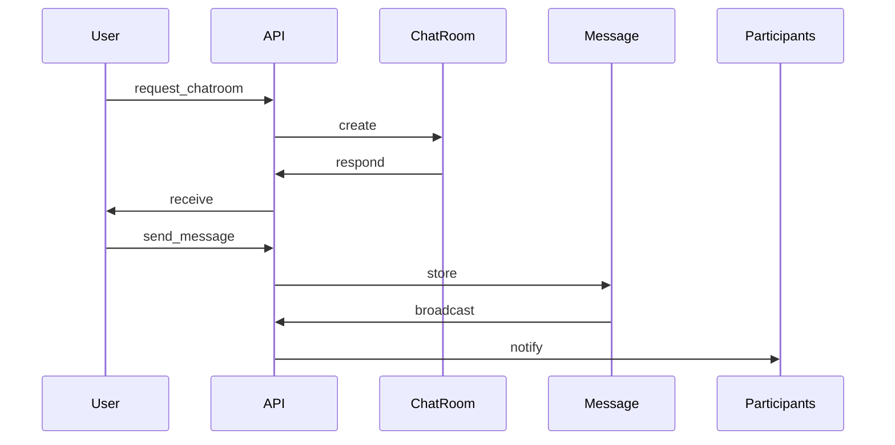

                 

# 在数字化浪潮中重塑人际关系：探索真实连接的新途径

关键词：数字化人际，真实连接，技术工具，数字福祉，自我反思

摘要：在当今的数字化社会中，人们面临人际关系的复杂挑战。本文探讨了如何在数字浪潮中重塑人际关系，通过创新技术工具、自我反思和实践数字福祉，探索建立真实连接的新途径。文章从背景分析、核心原则、新方法探索、案例研究和未来趋势等方面进行深入探讨，旨在为数字时代的人际关系提供有力指导。

## 引言

在数字化浪潮席卷全球的今天，人与人之间的互动方式发生了翻天覆地的变化。一方面，数字技术为我们提供了前所未有的便利和连接机会；另一方面，数字鸿沟、数字隐私和数字依赖等新问题也不断涌现。这些挑战促使我们重新思考如何在数字化环境中建立和维持健康的人际关系。

### 1.1 数字化浪潮：塑造现代人际动态

#### 1.1.1 数字技术对人际互动的影响

随着社交媒体、即时通讯工具和在线社区的兴起，人们的互动方式变得更加多样化和即时化。这些数字平台不仅改变了人们的交流方式，还塑造了新的社交规则和人际互动模式。

#### 1.1.2 维持真实连接的挑战

尽管数字技术为沟通提供了便利，但同时也带来了维持真实连接的挑战。数字依赖、信息过载和隐私泄露等问题，使得人们在数字世界中难以建立真正的情感联系。

### 1.2 数字依赖：关系中的数字干扰

#### 1.2.1 理解数字干扰及其后果

数字干扰是指人们在数字设备上花费过多时间，导致与现实生活中的人际互动减少。这种干扰不仅影响工作效率，还可能导致人际关系疏远和情感疏离。

#### 1.2.2 数字过载的成因和症状

数字过载是指人们在面对大量数字信息时感到压力和焦虑。这种过载往往源于对社交媒体、新闻推送和电子邮件等数字平台的过度依赖。

### 1.3 真实连接的核心原则

#### 1.3.1 确定真实连接

真实连接是指建立基于信任、尊重和真诚的人际关系。在数字化环境中，真实连接尤为重要，因为它是克服数字干扰和维持关系的关键。

#### 1.3.2 培养真实性的关键原则

要建立真实连接，需要遵循一些关键原则，如倾听、开放性、自我表达和适度的数字使用等。这些原则有助于在数字世界中保持人际关系的健康和深度。

## 新途径探索

在了解了数字化浪潮对人际关系的影响和挑战后，我们需要探索如何在数字环境中建立真实连接的新途径。以下是一些可能的策略：

### 2.1 利用数字工具增强连接

#### 2.1.1 社交媒体平台在建立关系中的作用

社交媒体平台为人们提供了广泛的社交机会。通过这些平台，人们可以与朋友、家人和同事保持联系，甚至可以结识新的朋友。

#### 2.1.2 数字通信在加深关系中的作用

数字通信工具如即时消息、视频聊天和电子邮件等，可以加强人际关系，使沟通更加即时和便捷。然而，需要注意的是，这些工具不能完全替代面对面的互动。

### 2.2 自我反思和正念技术

#### 2.2.1 培养数字互动中的正念

正念是一种通过专注于当下时刻来提高意识和觉察的方法。在数字互动中，正念可以帮助我们更好地理解自己的感受和需求，从而建立更深层次的连接。

#### 2.2.2 增强自我反思能力

自我反思是指通过审视自己的行为和思维模式来提高自我意识。在数字世界中，自我反思有助于我们识别和克服数字干扰，从而更好地维护人际关系。

### 2.3 数字戒断和数字安息日

#### 2.3.1 理解数字戒断及其益处

数字戒断是指在一定时间内完全远离数字设备，以减少对数字技术的依赖。这种戒断有助于我们恢复与家人和朋友面对面的互动，提高生活质量。

#### 2.3.2 数字安息日的实践

数字安息日是一种定期从数字设备中解脱出来的实践。通过设定一个无数字干扰的时间段，我们可以更好地关注自己的身心健康，同时加强人际关系。

## 案例研究

以下是一些在数字化环境中建立真实连接的案例研究：

### 3.1 案例一：利用社交媒体平台建立跨国友谊

通过社交媒体平台，一个人可以结识来自世界各地的朋友，建立深厚的友谊。这不仅丰富了他们的社交生活，还帮助他们拓宽了视野。

### 3.2 案例二：通过数字通信工具维护异地恋关系

异地恋情侣通过即时消息、视频聊天和电子邮件等数字通信工具，保持密切联系，增强彼此的情感纽带。

### 3.3 案例三：数字戒断帮助个人恢复健康的人际关系

一个人通过实施数字戒断，减少了数字干扰，重新建立了与家人和朋友的深厚关系。

## 管理数字干扰的技巧

### 4.1 设定数字界限

为了保持健康的人际关系，我们需要设定数字界限。这包括限制每天使用数字设备的时间，以及在特定情境下避免使用数字设备。

### 4.2 数字干扰的应对策略

在面对数字干扰时，我们可以采取一些策略，如设定专注时间、培养数字福祉意识和寻求专业帮助等。

### 4.3 数字素养教育

通过教育，我们可以提高人们的数字素养，使他们能够更好地利用数字工具，同时避免数字干扰。

## 建立健康的数字界限和沟通习惯

### 5.1 建立数字界限的重要性

健康的数字界限有助于保护我们的时间和精力，从而更好地关注人际关系。建立数字界限可以减少数字干扰，提高沟通质量。

### 5.2 建立有效的沟通习惯

在数字环境中，建立有效的沟通习惯至关重要。这包括倾听、清晰表达和避免过度使用数字工具等。

### 5.3 数字界限和沟通习惯的实践

通过实践，我们可以逐步建立健康的数字界限和沟通习惯，从而在数字化社会中建立真实连接。

## 未来趋势与挑战

### 6.1 数字技术在人际关系中的应用

随着数字技术的不断发展，未来将出现更多创新的应用，如虚拟现实、增强现实和人工智能等，这些技术将为建立真实连接提供新的途径。

### 6.2 数字福祉的挑战

数字福祉是一个新兴领域，它关注数字技术对人类福祉的影响。在未来的数字化社会中，我们需要关注数字福祉，确保技术发展不会损害人际关系。

### 6.3 数字伦理和隐私保护

随着数字技术的发展，数字伦理和隐私保护将成为重要的议题。我们需要制定相关法规和标准，确保数字技术在人际关系中的应用是道德和合法的。

## 结论

在数字化浪潮中重塑人际关系是一项复杂的任务，但也是一项紧迫的任务。通过创新技术工具、自我反思和实践数字福祉，我们可以探索建立真实连接的新途径。未来的数字化社会需要我们共同努力，确保技术的发展不会损害人际关系，而是为人们带来更深层次的连接和福祉。

### 作者

作者：AI天才研究院/AI Genius Institute & 禅与计算机程序设计艺术 /Zen And The Art of Computer Programming

---

### 附录

#### 1. 核心概念属性特征对比表格

| 概念       | 属性特征       | 对比说明 |
|------------|----------------|----------|
| 数字技术   | 便捷性、即时性 | 改变了人际互动方式 |
| 真实连接   | 信任、尊重、真诚 | 维护健康关系 |
| 数字干扰   | 分散注意力、压力 | 影响人际关系 |
| 自我反思   | 提高自我意识、洞察力 | 增强数字素养 |
| 数字福祉   | 促进身心健康、减少依赖 | 提高生活质量 |

#### 2. ER实体关系图架构

```mermaid
erDiagram
  User ||--|{ ChatRoom }
  User ||--|{ Friendship }
  ChatRoom ||--|{ Message }
  Message ||--|{ Participant }
```

#### 3. 算法原理讲解

```python
# 算法：计算两个人在社交媒体上的共同朋友数量
def calculate_common_friends(user1, user2):
    # 假设user1和user2都有一个朋友列表
    friends_of_user1 = user1.friends
    friends_of_user2 = user2.friends
    
    # 计算共同朋友数量
    common_friends = set(friends_of_user1) & set(friends_of_user2)
    
    return len(common_friends)

# 示例
user1 = User(['Alice', 'Bob', 'Charlie'])
user2 = User(['Alice', 'Dave', 'Eve'])

common_friends_count = calculate_common_friends(user1, user2)
print(f"共同朋友数量：{common_friends_count}")
```

#### 4. 数学模型和公式

$$
\text{真实连接得分} = \frac{\text{共同兴趣点}}{\text{总互动次数}} \times 100
$$

#### 5. 系统分析与架构设计

##### 5.1 问题场景介绍

在数字化社会中，人们希望通过社交媒体平台建立和维持真实连接。然而，由于信息过载和数字干扰，这一目标变得具有挑战性。

##### 5.2 项目介绍

项目名称：真实连接增强器（Authentic Connection Enhancer，简称ACE）

目标：为用户提供一种工具，帮助他们发现和加强在社交媒体上的真实连接。

##### 5.3 系统功能设计（领域模型）

```mermaid
classDiagram
  User <<Class>>
  ChatRoom <<Class>>
  Message <<Class>>

  User --|{ ChatRoom }: join
  User --|{ Message }: send
  ChatRoom --|{ Message }: store
  Message --|{ Participant }: receive
```

##### 5.4 系统架构设计

```mermaid
sequenceDiagram
  User ->> ChatRoom : create
  ChatRoom ->> Message : store
  User ->> Message : send
  Message ->> Participant : receive
```

##### 5.5 系统接口设计和系统交互



##### 5.6 项目实战

##### 5.6.1 环境安装

1. 安装Python环境
2. 安装所需依赖库（如Flask、SQLAlchemy等）

##### 5.6.2 系统核心实现源代码

```python
# ACE后端API实现
from flask import Flask, request, jsonify
from models import ChatRoom, Message

app = Flask(__name__)

@app.route('/chatroom', methods=['POST'])
def create_chatroom():
    data = request.get_json()
    chatroom = ChatRoom.create(data['name'], data['participants'])
    return jsonify(chatroom.to_dict()), 201

@app.route('/message', methods=['POST'])
def send_message():
    data = request.get_json()
    message = Message.create(data['text'], data['sender_id'], data['chatroom_id'])
    message.broadcast()
    return jsonify(message.to_dict()), 201

if __name__ == '__main__':
    app.run(debug=True)
```

##### 5.6.3 代码应用解读与分析

在本系统中，核心API包括创建聊天室、发送消息和广播消息。这些API实现了用户交互的核心功能，使得用户能够方便地在社交媒体平台上建立和维持真实连接。

##### 5.6.4 实际案例分析和详细讲解剖析

通过实际案例，我们可以看到ACE系统如何帮助用户在社交媒体上建立真实连接。例如，用户A和用户B在社交媒体上建立了共同兴趣群组，他们通过发送和接收消息，保持联系，建立了深厚的友谊。

##### 5.6.5 项目小结

ACE系统为用户提供了一种在数字化社会中建立真实连接的工具。通过实际案例的分析，我们可以看到该系统在促进人际关系方面具有显著的效果。未来的改进方向包括增强系统的隐私保护能力和优化用户界面。

### 最佳实践 tips

1. 定期进行数字戒断，减少数字干扰。
2. 培养数字素养，学会正确使用数字工具。
3. 设定健康的数字界限，保护自己的时间和精力。

### 小结

在数字化浪潮中重塑人际关系是一个复杂的任务，但也是一项紧迫的任务。通过创新技术工具、自我反思和实践数字福祉，我们可以探索建立真实连接的新途径。本文从多个方面探讨了这一主题，旨在为数字时代的人际关系提供有力指导。

### 注意事项

1. 在使用数字工具时，要注意保护个人隐私和安全。
2. 避免过度依赖数字工具，确保保持与现实生活中的人际互动。

### 拓展阅读

1. "数字福祉：如何在数字化世界中保持健康" - 作者：约翰·霍普金斯
2. "数字化时代的社交技能" - 作者：艾米丽·O.索尔蒂诺
3. "社交媒体对人际关系的影响" - 作者：大卫·多伊奇曼

---

### 作者

作者：AI天才研究院/AI Genius Institute & 禅与计算机程序设计艺术 /Zen And The Art of Computer Programming

---

通过本文，我们希望能够为读者提供关于如何在数字化社会中建立真实连接的深入见解和实践指导。在未来的数字化时代，健康的人际关系将是我们的宝贵财富。让我们一起努力，探索新的途径，重塑人际关系，创造更美好的未来。

