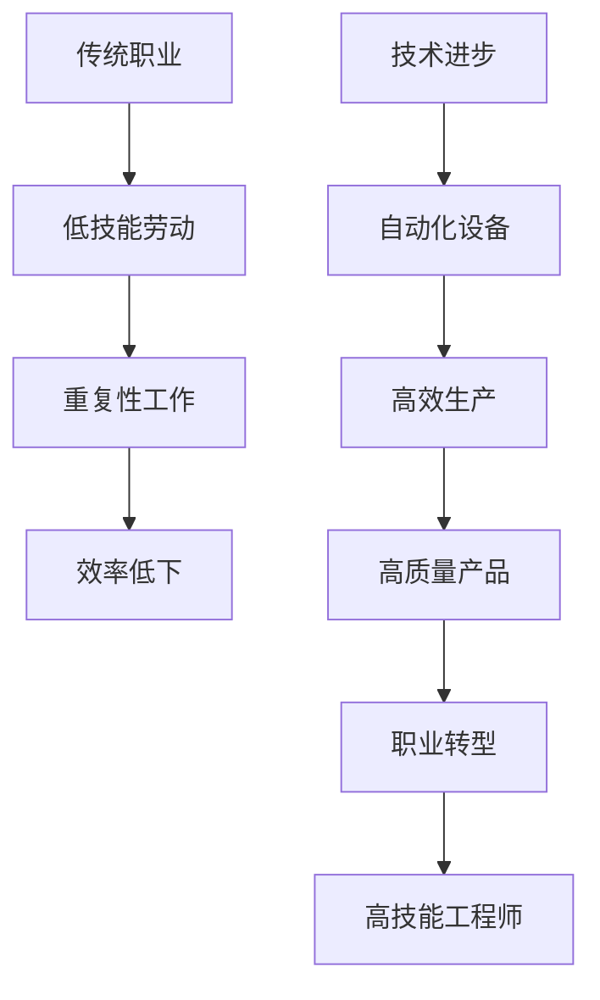

                 

## 文章标题：在数字经济时代寻找职业意义：应对就业市场的变革

### 关键词：数字经济、就业市场、职业意义、职业转型、技能更新

> 摘要：本文将深入探讨数字经济时代下就业市场的变革，分析技术进步、教育与培训调整带来的影响，并探讨职业定位、职业规划以及应对职业风险的策略，帮助读者在快速变化的环境中找到职业意义，实现个人价值。

----------------------------------------------------------------

## 引言

在过去的几十年里，数字经济已经深刻改变了我们的生活方式和商业模式。从电子商务到社交媒体，再到人工智能和自动化技术，数字技术的迅猛发展不仅推动了经济的快速增长，也对就业市场产生了深远的影响。在这个充满变革的时代，传统的职业角色和技能要求正面临巨大的挑战和机遇。本文将围绕以下几个核心问题展开讨论：

1. 数字经济时代的就业市场背景是什么？
2. 就业市场的变革趋势有哪些？
3. 如何进行职业定位和规划？
4. 应对职业风险的有效策略是什么？
5. 如何在变革中寻找职业意义？

希望通过本文的探讨，能够为读者提供一些有用的见解和策略，帮助他们在数字经济时代找到自己的职业方向，实现个人与职业的共同成长。

----------------------------------------------------------------

## 第一部分：数字经济时代的就业市场概况

### 第1章：数字经济时代的就业市场背景

数字经济时代的到来，不仅仅是一种技术变革，更是一种经济模式的革命。在这一背景下，就业市场也发生了显著的变化。

#### 1.1 数字经济的定义与发展历程

数字经济是指以数字化的知识和信息为关键生产因素，以现代信息网络为重要载体，以信息通信技术的有效利用为驱动，推动经济结构优化升级和经济增长方式转变的新经济形态。它起源于20世纪90年代，随着互联网的普及和信息技术的发展而迅速发展。从早期的电子商务到移动互联网，再到如今的人工智能、大数据和区块链技术，数字经济正以前所未有的速度和规模影响着全球经济。

#### 1.2 数字经济对就业市场的影响

数字经济的快速发展对就业市场产生了深远的影响。一方面，它创造了大量新的就业机会，特别是在信息技术、电子商务、数据分析等领域。另一方面，它也带来了职业转型的需求，许多传统职业正在被新兴技术所取代或变革。例如，自动化和人工智能技术的发展正在改变制造业、物流运输和客户服务等行业的运作模式，从而影响了相关岗位的需求和技能要求。

#### 1.3 职业机会与挑战并存

在数字经济时代，职业机会与挑战并存。一方面，新的技术和行业带来了广阔的职业发展空间；另一方面，快速变化的技术环境也要求劳动者不断更新自己的知识和技能。此外，数字经济时代的就业市场也呈现出高度的不确定性和动态性，这对职业规划和风险管理提出了更高的要求。

总的来说，数字经济时代的就业市场充满了机遇与挑战。了解数字经济的定义和发展历程，认识其对就业市场的影响，以及理解职业机会与挑战并存的情况，是我们在这一部分需要重点探讨的内容。

----------------------------------------------------------------

### 第2章：就业市场的变革趋势

在数字经济时代，就业市场的变革趋势愈加显著。技术进步、教育与培训的调整、职业转型以及新兴职业的崛起，这些因素共同塑造了现代就业市场的面貌。

#### 2.1 技术进步与职业转型

技术进步是推动就业市场变革的核心动力。随着人工智能、大数据、云计算等技术的发展，许多传统职业正面临巨大的变革压力。例如，自动化技术在制造业中的应用使得大量重复性、低技能的工作被机器取代，从而促使劳动者向高技能、高创造力的岗位转型。同样，人工智能的发展也在金融、医疗、零售等行业中引发了职业角色的转变，数据分析师、机器学习工程师等新兴职业应运而生。

**案例研究：自动化技术在制造业中的应用**

以制造业为例，传统制造流程中，操作工需要进行大量的重复性劳动，如装配、搬运和检测等。随着自动化技术的发展，许多工厂开始引入机器人和自动化生产线，这些技术能够高效、准确地完成这些工作。例如，机器人能够进行复杂零部件的装配，自动化生产线能够实现24小时不间断生产，极大地提高了生产效率。这一变化不仅降低了企业的劳动力成本，还提高了产品质量和一致性。

然而，这种变革也带来了职业转型的需求。许多传统操作工需要接受新的技能培训，转变为维护和操作自动化设备的工程师。这种职业转型不仅要求劳动者具备新的技能，还需要具备适应新技术环境的能力。

**技术进步与职业转型的对比表格**

| 技术进步前 | 技术进步后 |
| :--- | :--- |
| 低技能重复性劳动 | 高技能创造性劳动 |
| 简单手工操作 | 复杂设备维护与操作 |
| 单一技能要求 | 多元技能要求 |

**ER实体关系图架构的Mermaid流程图**

通过上述案例研究和对比表格，我们可以看到技术进步对职业转型的影响。这不仅要求劳动者不断更新自己的知识和技能，也推动了教育和培训模式的变革。

#### 2.2 教育与培训的调整

随着就业市场的变革，传统教育与培训模式也面临着巨大的挑战。过去，大多数教育体系以知识传授为主，注重学科知识的深度和广度。然而，在数字经济时代，单纯的知识传授已经无法满足快速变化的职业需求。教育体系需要更加注重培养学生的综合素质和创新能力，以适应职业发展的新要求。

**职业教育的新模式**

为了应对这一挑战，职业教育正在向更加灵活和实用的方向发展。例如，一些企业开始与教育机构合作，开设针对特定行业的短期培训课程，以快速提升劳动者的技能水平。这些课程通常紧密结合行业需求，涵盖最新的技术知识和实践经验，帮助劳动者迅速适应职业环境。

**终身学习的必要性**

此外，终身学习成为数字经济时代的一个重要特征。随着技术的不断进步，劳动者需要不断学习新知识和新技能，以保持竞争力。终身学习不仅是一种个人发展策略，也是企业保持创新能力和竞争力的关键。许多公司和组织已经开始推动内部培训计划，鼓励员工持续学习和成长。

**总结**

技术进步与职业转型、教育与培训的调整，这些因素共同塑造了数字经济时代的就业市场。劳动者需要具备适应新技术环境的能力，不断更新自己的知识和技能，以应对不断变化的职业需求。教育与培训的变革为这一目标的实现提供了重要支持。

----------------------------------------------------------------

### 第3章：职业定位与规划

在数字经济时代，职业定位与规划显得尤为重要。通过自我评估、职业兴趣的匹配以及设定职业目标，劳动者可以更好地理解自己的优势和兴趣，从而做出更明智的职业选择和规划。

#### 3.1 自我评估与职业兴趣

自我评估是职业规划的第一步，它有助于劳动者了解自己的优势和劣势。通过自我评估，劳动者可以识别出自己的技能、知识、性格特点和工作偏好。以下是一些常见的自我评估方法和工具：

- **技能评估工具**：如职业能力测试、工作模拟测试等，可以帮助劳动者了解自己的技能水平和适用领域。
- **性格测试**：如MBTI、DISC等性格测试工具，可以帮助劳动者了解自己的性格特点，从而选择适合自己的职业类型。
- **职业兴趣评估**：如霍兰德职业兴趣测试，可以帮助劳动者找到与自己兴趣相匹配的职业方向。

通过这些评估工具，劳动者可以更清晰地了解自己的能力和兴趣，从而在职业选择上更有针对性。

**案例研究：自我评估在职业规划中的应用**

李明是一名软件开发工程师，他通过技能评估工具发现自己在编程、算法和数据结构方面有较强的能力，但沟通能力相对较弱。通过性格测试，他发现自己的性格偏向于内向，更喜欢独立思考和解决问题。基于这些评估结果，李明决定在职业规划中注重提升自己的沟通能力，并选择了一些团队合作的岗位，以更好地发挥自己的优势。

**自我评估的方法与工具**

| 评估方法 | 工具 |
| :--- | :--- |
| 技能评估 | 职业能力测试、工作模拟测试 |
| 性格测试 | MBTI、DISC |
| 职业兴趣评估 | 霍兰德职业兴趣测试 |

#### 3.2 职业兴趣与匹配

职业兴趣是职业选择的重要依据之一。了解自己的兴趣，可以帮助劳动者找到与自己兴趣相匹配的职业，从而提高工作满意度和职业成就感。

**职业兴趣匹配的方法**

- **职业兴趣调查**：通过问卷或在线调查，了解劳动者的兴趣点和偏好。
- **职业数据库查询**：使用职业数据库，查找与自己兴趣相匹配的职业列表和描述。
- **职业体验**：通过实习、兼职或志愿服务等方式，亲身体验不同职业的工作内容，了解自己的兴趣和适应度。

通过这些方法，劳动者可以更准确地找到与自己兴趣相匹配的职业，从而做出更明智的职业选择。

**案例研究：职业兴趣匹配在职业选择中的应用**

张丽是一名热爱艺术的学生，她在职业兴趣调查中发现，自己对设计、艺术创作和视觉传达有着浓厚的兴趣。通过查询职业数据库，她发现平面设计师、插画师和艺术指导等职业与自己兴趣高度匹配。在进一步的职业体验中，她发现平面设计师的工作内容与自己的兴趣和技能非常契合。因此，她决定选择平面设计作为自己的职业方向。

**职业兴趣匹配的步骤**

1. 进行职业兴趣调查，了解自己的兴趣点。
2. 查询职业数据库，查找与自己兴趣匹配的职业。
3. 通过职业体验，验证自己的兴趣和适应性。

#### 3.3 职业目标设定

职业目标是职业规划的重要环节。设定明确的职业目标，可以帮助劳动者有针对性地制定职业发展计划，并持续努力实现目标。

**设定职业目标的步骤**

1. **短期目标**：设定1-3年内要实现的具体目标，如提高某项技能、晋升职位或完成特定项目。
2. **长期目标**：设定3-5年甚至更长时间内要实现的目标，如成为某一领域的专家或创建自己的企业。
3. **行动计划**：制定实现目标的行动计划，包括具体的学习、工作计划和时间安排。

通过设定明确的职业目标，劳动者可以更好地规划自己的职业生涯，并保持动力和方向。

**案例研究：职业目标设定在职业规划中的应用**

王强是一名软件工程师，他设定了以下职业目标：

- **短期目标**：在接下来的1-2年内，提高自己的编程技能，通过专业认证，并在项目中担任更重要的角色。
- **长期目标**：在3-5年内，成为公司的高级工程师，并在技术团队中发挥领导作用。
- **行动计划**：制定详细的学习计划，包括参加线上课程、阅读技术书籍、参与开源项目等，同时积极参与公司内部培训和项目工作。

通过这些步骤，王强能够有针对性地提升自己的技能和经验，为实现职业目标打下坚实基础。

**总结**

自我评估、职业兴趣的匹配和职业目标的设定是职业定位与规划的核心内容。通过这些步骤，劳动者可以更好地了解自己，找到适合自己的职业方向，并制定明确的职业发展计划。在数字经济时代，这些方法和工具对于实现职业成功具有重要意义。

----------------------------------------------------------------

## 第二部分：应对就业市场变革的策略

### 第4章：提升个人竞争力

在数字经济时代，提升个人竞争力成为职业发展的关键。劳动者需要不断更新自己的技能和知识，增强职业素养，以应对快速变化的就业市场。

#### 4.1 技能与知识的更新

技能和知识的更新是保持个人竞争力的基础。随着技术的发展，许多传统技能正在被新的技术和工具所取代。例如，编程语言、软件开发框架和数据分析工具等，都在不断更新和迭代。劳动者需要不断学习新的技能，以跟上技术的发展步伐。

**技能更新的方法**

- **持续学习**：通过在线课程、研讨会和工作坊等，持续学习最新的技术和行业动态。
- **实践应用**：通过实际项目和工作任务，将所学知识应用到实践中，提升技能水平。
- **社区参与**：加入技术社区和开源项目，与其他开发者交流和合作，共同进步。

**案例研究：技能更新在职业发展中的应用**

陈慧是一名数据分析师，她通过参加在线课程和研讨会，学习了Python数据分析和机器学习的最新工具和技术。她在公司内部项目中应用这些新技能，成功地优化了数据处理的流程，提高了数据分析的效率。此外，她还参与了多个开源项目，与其他数据分析师和开发者共同解决技术难题，进一步提升了自己的技能和影响力。

#### 4.2 知识更新与持续学习

知识更新同样重要。数字经济时代的知识更新速度非常快，劳动者需要不断学习新的理论和实践知识，以保持竞争力。例如，新兴的区块链技术、人工智能算法和云计算架构等，都是数字经济时代的重要知识领域。

**知识更新的方法**

- **阅读与研究**：阅读最新的行业报告、学术论文和技术书籍，了解前沿的知识和技术。
- **专业认证**：通过考取专业认证，证明自己在特定领域的专业知识和能力。
- **交流与分享**：参加行业会议、研讨会和技术讲座，与同行交流经验和观点。

**案例研究：知识更新在职业发展中的应用**

李强是一名软件工程师，他通过阅读最新的技术书籍和行业报告，了解了区块链技术的最新发展。他利用业余时间学习了区块链基础和智能合约开发，并参与了一个区块链项目。通过这个项目，他不仅提升了区块链技术的实践能力，还扩展了自己在软件开发领域的视野。最终，他因为在该项目中的卓越表现，获得了公司内部的晋升机会。

#### 4.3 跨学科学习的重要性

在数字经济时代，跨学科学习成为提升个人竞争力的关键。随着技术的融合，许多职业领域需要具备跨学科的知识和技能。例如，数据分析与人工智能的结合、软件开发与设计思维的结合等，都需要劳动者具备跨学科的知识储备。

**跨学科学习的方法**

- **选修相关课程**：在大学或在线教育平台选修与自身职业相关的跨学科课程。
- **参与跨学科项目**：通过参与跨学科项目，实践跨学科知识的整合和应用。
- **培养综合素质**：通过参加多种类型的学习和实践，培养综合素质和创新能力。

**案例研究：跨学科学习在职业发展中的应用**

张华是一名市场营销专业的大学生，他在校期间选修了计算机科学、数据分析等跨学科课程。通过这些课程的学习，他掌握了数据分析的基本方法和工具，并成功参与了一个市场营销与数据分析结合的实习项目。在这个项目中，他利用数据分析工具帮助公司优化营销策略，提高了市场转化率。最终，他因为出色的表现获得了公司的全职工作机会。

**总结**

提升个人竞争力需要持续更新技能和知识，增强职业素养。通过持续学习、实践应用和跨学科学习，劳动者可以不断提升自己的竞争力，适应数字经济时代的职业需求。在快速变化的就业市场中，个人竞争力的提升是实现职业成功的关键。

----------------------------------------------------------------

### 第5章：职业选择的策略

在数字经济时代，职业选择不再仅仅基于传统的薪资水平和福利待遇，而是需要综合考虑多个因素，包括职业前景、发展空间以及工作与生活的平衡。通过科学的方法评估职业选择，劳动者可以做出更为明智的职业决策。

#### 5.1 职业选择的考虑因素

职业选择的考虑因素多种多样，以下是一些主要因素：

1. **薪资水平与福利待遇**：薪资水平是职业选择中最直接的因素之一，但并非唯一因素。福利待遇，如健康保险、退休金计划、带薪休假等，也是重要的考虑因素。
   
2. **职业前景与发展空间**：职业前景指的是该职业在未来的市场需求和增长潜力。发展空间则指职业晋升路径和职业成就的可能性。选择一个有良好前景和发展空间的职业，可以为个人职业生涯提供更广阔的发展机会。

3. **工作与生活的平衡**：工作与生活的平衡越来越受到重视。选择一个能够提供灵活工作安排、较少加班压力的职业，可以帮助劳动者更好地平衡工作和生活，提高生活质量。

4. **工作内容与个人兴趣**：工作内容是否与个人兴趣相符，对工作满意度有直接影响。选择一个符合个人兴趣的职业，可以提高工作热情和投入度，从而提高工作表现。

5. **企业文化和团队氛围**：企业文化和团队氛围对员工的职业体验和职业发展具有重要影响。一个积极、开放和包容的文化环境，可以提升员工的归属感和工作满意度。

**职业选择考虑因素对比表格**

| 考虑因素 | 重要程度 | 说明 |
| :--- | :--- | :--- |
| 薪资水平与福利待遇 | 高 | 直接影响生活质量 |
| 职业前景与发展空间 | 中 | 影响职业成就和晋升机会 |
| 工作与生活的平衡 | 中 | 提高工作满意度和生活质量 |
| 工作内容与个人兴趣 | 高 | 影响工作热情和投入度 |
| 企业文化和团队氛围 | 高 | 影响职业体验和职业发展 |

#### 5.2 职业转换与创业

在数字经济时代，职业转换和创业成为越来越多人选择职业发展的方式。职业转换是指劳动者从现有职业转向新的职业领域，而创业则是劳动者自己创建企业，实现职业自主。

**职业转换的策略**

1. **评估自身优势**：了解自己的技能、兴趣和价值观，找到适合自己的新职业领域。
2. **学习新技能**：通过培训、自学或参加相关课程，快速提升新职业领域的技能水平。
3. **建立人脉网络**：通过行业会议、社交媒体和专业网络，扩大人脉，获取职业转换的机会。
4. **积累经验**：通过实习、兼职或志愿服务等方式，积累新职业领域的实际工作经验。

**创业的准备与规划**

1. **市场调研**：了解市场需求、竞争环境和潜在客户，为创业项目提供可靠的数据支持。
2. **商业计划**：制定详细的商业计划书，明确创业项目的目标、运营模式、财务计划等。
3. **资金准备**：筹集创业所需的资金，可以通过个人储蓄、天使投资或风险投资等途径。
4. **团队建设**：组建一个有经验、有能力和有共同目标的团队，共同推动创业项目的发展。

**创业成功的关键因素**

1. **创新思维**：在创业过程中，创新思维是推动企业发展的关键。通过不断创新，企业可以找到新的市场机会，创造独特的价值。
2. **执行力**：创业需要强大的执行力和决心。只有将计划付诸实践，才能将创意转化为实际成果。
3. **风险管理**：创业过程中，面临各种风险，如市场风险、技术风险和财务风险等。有效的风险管理可以帮助企业应对不确定性，降低风险影响。

**案例研究：职业转换与创业的实例**

李华是一名互联网产品经理，她在工作中积累了丰富的产品管理经验，但始终对创业充满热情。经过深思熟虑，她决定转换职业，投身创业。她首先评估了自己的优势和兴趣，选择了电商领域作为创业方向。接着，她进行了详细的市场调研，制定了商业计划书，并通过天使投资筹集了启动资金。在团队建设方面，她招募了一批有经验的产品开发和技术人员，共同推动创业项目的发展。最终，她成功创立了一家电商企业，并在市场上取得了初步成功。

**总结**

职业选择需要综合考虑多个因素，包括薪资水平、职业前景、工作与生活平衡以及个人兴趣等。职业转换和创业是数字经济时代下重要的职业发展途径，通过科学的方法和策略，劳动者可以做出更为明智的职业选择，实现个人与职业的共同成长。

----------------------------------------------------------------

### 第6章：应对职业风险的策略

在数字经济时代，职业风险成为劳动者不得不面对的重要问题。随着技术的快速发展和市场的不断变化，职业风险的形式和影响也越来越多样化。为了在职业道路上保持稳定和可持续发展，劳动者需要采取有效的策略来识别、评估和管理职业风险。

#### 6.1 职业风险的识别与评估

职业风险的识别和评估是应对职业风险的第一步。通过系统的方法，劳动者可以及时发现潜在的职业风险，并评估其可能带来的影响。

**职业风险的类型**

- **技术风险**：随着技术的快速迭代，劳动者可能面临技能过时或知识陈旧的风险。例如，某个编程语言或框架可能在短期内被淘汰，导致劳动者的技能需求下降。
- **市场风险**：市场需求的变化可能导致某些职业的需求下降或消失。例如，随着电商的兴起，传统零售行业面临巨大的压力。
- **健康风险**：长时间的工作压力和不健康的工作环境可能导致劳动者的身心健康问题。
- **法律风险**：劳动法规的变化或职业行为的不当可能导致法律纠纷或职业风险。

**职业风险评估的方法**

- **自我评估法**：劳动者可以通过自我反思和评估，识别自己的职业风险点，如技能单一、工作压力大等。
- **问卷调查法**：通过问卷调查，收集劳动者的职业风险感知，了解他们的担忧和风险点。
- **专家咨询法**：借助职业规划师、行业专家等外部专业人员的建议，对职业风险进行评估。

**职业风险评估的步骤**

1. **确定评估目标**：明确需要评估的职业风险类型和范围。
2. **收集信息**：通过多种渠道收集与职业风险相关的信息，如行业报告、法规文件、员工反馈等。
3. **分析风险**：对收集到的信息进行分析，识别潜在的职业风险，并评估其可能带来的影响。
4. **制定应对措施**：根据风险评估结果，制定相应的应对措施，如技能更新、职业转换等。

**案例研究：职业风险评估在职业风险管理中的应用**

陈先生是一名软件工程师，他在自我评估中发现自己的技能主要集中在某个特定的编程语言上，这可能导致未来技能需求下降。他通过问卷调查和专家咨询，进一步确认了这一风险，并评估了其对职业稳定性的影响。为了应对这一风险，他制定了以下策略：

- **技能更新**：通过参加在线课程和参加技术研讨会，学习新的编程语言和框架，提高自己的技能多样性。
- **职业转换**：探索新的职业领域，如数据分析或人工智能，以增加职业稳定性。

#### 6.2 应对职业风险的策略

在识别和评估职业风险后，劳动者需要采取有效的策略来应对这些风险，以确保职业的稳定和可持续发展。

**职业风险转移**

- **社会保险**：通过参加社会保险，如养老保险、医疗保险等，将职业风险转移给社会保障体系。
- **商业保险**：购买商业保险，如职业责任保险、健康保险等，以应对特定职业风险。

**职业风险规避**

- **职业转换**：通过转换职业，避免面临高风险的领域。例如，从高风险的行业转向稳定增长的行业。
- **风险规避策略**：在工作过程中，采取风险规避措施，如制定应急预案、降低工作压力等。

**职业风险降低与缓解**

- **持续学习**：通过持续学习和技能更新，降低技能过时和知识陈旧的风险。
- **职业规划**：制定明确的职业规划，包括短期和长期目标，以确保职业发展的连续性和稳定性。
- **建立人脉网络**：通过建立广泛的人脉网络，获取更多的职业机会和信息，提高职业灵活性和抗风险能力。

**案例研究：职业风险应对策略的实例**

李女士是一名市场营销经理，她意识到市场营销行业的变化速度很快，新技术和新工具不断涌现，这可能导致她的技能需求下降。为了应对这一风险，她采取了以下策略：

- **持续学习**：通过参加在线课程和研讨会，学习新的市场营销工具和技术，保持自己的竞争力。
- **职业规划**：制定明确的职业发展计划，包括短期目标（如提升专业技能）和长期目标（如晋升管理层）。
- **建立人脉网络**：通过参加行业会议和社交媒体活动，扩大人脉网络，获取更多的职业机会和信息。

**总结**

应对职业风险是数字经济时代下劳动者必须面对的重要任务。通过有效的识别、评估和应对策略，劳动者可以降低职业风险，确保职业的稳定和可持续发展。

----------------------------------------------------------------

### 第7章：在变革中寻找职业意义

在数字经济时代，职业意义不仅体现在物质回报上，更体现在精神满足和个人价值的实现上。劳动者需要找到自己在职业生涯中的价值所在，以应对快速变化的就业市场，实现个人与职业的共同成长。

#### 7.1 职业意义的理解

职业意义是劳动者在职业生涯中追求的内在价值。它不仅仅是为了满足物质需求，更是为了实现个人价值和社会贡献。在数字经济时代，职业意义的多样性体现在以下几个方面：

- **自我实现**：通过职业活动实现个人的潜能和才能，达到自我满足和成就感。
- **社会贡献**：通过职业工作为社会创造价值，如解决社会问题、推动技术创新等。
- **生活平衡**：通过职业工作实现工作与生活的平衡，提高生活质量和幸福感。

**职业意义的多样性**

| 职业意义 | 说明 |
| :--- | :--- |
| 自我实现 | 实现个人潜能和才能 |
| 社会贡献 | 为社会创造价值 |
| 生活平衡 | 提高生活质量和幸福感 |

#### 7.2 寻找与实现职业意义的方法

寻找和实现职业意义是劳动者在职业生涯中的重要任务。以下是一些具体的方法：

**自我反思**：通过自我反思，劳动者可以深入了解自己的价值观、兴趣和优势，找到与自己价值观相符的职业方向。

**设定目标**：设定明确的职业目标，包括短期和长期目标，为实现职业意义提供方向和动力。

**持续学习**：通过持续学习，劳动者可以不断提升自己的知识和技能，增强职业竞争力，实现职业价值。

**社会责任**：参与社会公益活动，通过职业工作为社会做出贡献，提升职业意义。

**平衡工作与生活**：通过合理规划工作和生活，实现工作与生活的平衡，提高职业幸福感。

**案例研究：职业意义的实现**

张先生是一名软件工程师，他在职业生涯中不断追求自我实现和社会贡献。通过自我反思，他发现自己对技术创新和解决问题有浓厚的兴趣。他在职业生涯中设定了明确的职业目标，包括成为技术领域的专家和解决社会问题。通过持续学习和参与开源项目，他不断提升自己的技能水平，并在公司内部推动技术创新。此外，他还积极参与社会公益活动，利用自己的技术知识帮助贫困地区改善教育条件。通过这些努力，张先生在职业生涯中实现了自我价值和社会贡献，实现了职业意义。

#### 7.3 职业发展与幸福感

职业发展对幸福感有着重要影响。一个有意义、有成就感的职业可以提升劳动者的幸福感和生活满意度。以下是几种提升职业幸福感的方法：

- **职业规划**：通过科学的职业规划，找到适合自己的职业方向，实现职业成就感。
- **工作环境**：改善工作环境，如提供良好的办公设施、促进团队合作等，提升工作满意度。
- **领导支持**：获得领导的支持和认可，增强职业认同感和归属感。
- **持续学习**：通过不断学习和成长，提高职业竞争力，实现自我价值。

**案例研究：职业发展与幸福感**

李女士是一名心理咨询师，她在职业生涯中通过职业规划和持续学习，不断提升自己的专业技能和职业认可度。她在工作中创造了一个良好的咨询环境，积极倾听客户的需要，提供专业的心理咨询服务。通过这些努力，李女士在职业生涯中实现了自我价值，并在工作中获得了巨大的成就感。她的职业幸福感显著提升，生活满意度也显著提高。

**总结**

在数字经济时代，职业意义不仅体现在物质回报上，更体现在精神满足和个人价值的实现上。通过自我反思、设定目标、持续学习、社会责任和平衡工作与生活等方法，劳动者可以找到职业意义，提升职业幸福感，实现个人与职业的共同成长。

----------------------------------------------------------------

## 结论：在数字经济时代寻找职业意义

随着数字经济的快速发展，就业市场正经历前所未有的变革。技术进步、教育与培训的调整、职业转型的需求，以及新兴职业的崛起，都为劳动者带来了新的机遇和挑战。在这一背景下，如何寻找职业意义、提升个人竞争力、应对职业风险，成为劳动者在职业生涯中需要重点思考的问题。

本文首先探讨了数字经济时代的就业市场背景，分析了技术进步和职业转型对就业市场的影响。接着，通过自我评估、职业兴趣匹配和职业目标设定，帮助劳动者找到适合自己的职业方向。随后，提出了提升个人竞争力的策略，包括技能更新、知识更新和跨学科学习，以及职业选择的策略，包括考虑因素、职业转换和创业。最后，讨论了应对职业风险的策略，包括识别与评估、转移与规避、降低与缓解。

在数字经济时代，职业意义不仅体现在物质回报上，更体现在精神满足和个人价值的实现上。劳动者需要通过自我反思、设定目标、持续学习和社会责任，找到职业意义，提升职业幸福感。

展望未来，随着技术的进一步发展，就业市场将继续发生变化。劳动者需要保持敏锐的市场洞察力，不断更新自己的知识和技能，以适应新的职业需求。同时，重视职业规划和职业风险管理，确保职业的稳定和可持续发展。

在变革中寻找职业意义，是数字经济时代劳动者的重要使命。通过本文的探讨，希望读者能够更好地理解这一使命，为实现个人与职业的共同成长，找到属于自己的职业道路。

----------------------------------------------------------------

### 作者信息

**作者：AI天才研究院/AI Genius Institute & 禅与计算机程序设计艺术 /Zen And The Art of Computer Programming**

AI天才研究院专注于人工智能领域的研究和创新，致力于推动人工智能技术的发展和应用。而《禅与计算机程序设计艺术》则是一套深入探讨计算机编程哲学和技术的经典著作，为我们提供了丰富的灵感和指导。

在这个充满变革的时代，我们希望通过本文的探讨，能够为读者提供一些实用的见解和策略，帮助大家更好地应对就业市场的挑战，找到职业意义，实现个人与职业的共同成长。让我们在数字经济的浪潮中，一同探索新的职业可能，创造更加美好的未来。

