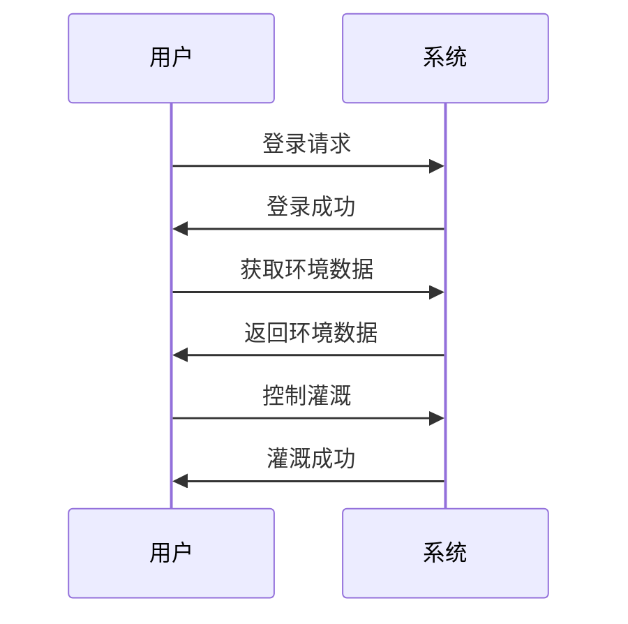

                 

## 引言

在当今时代，数字经济正在以前所未有的速度改变着全球经济和社会结构。随着互联网、大数据、云计算、人工智能等技术的迅猛发展，数字经济已经成为推动经济增长和社会进步的重要引擎。数字经济不仅重塑了传统产业，还催生了众多新兴行业和职业，带来了前所未有的机遇与挑战。

面对这种巨大的变革，职业发展的路径和模式也在经历深刻的重新定义。传统的职业发展模式，往往依赖于稳定的行业和职位，而在数字经济时代，职业发展的灵活性、多样性和跨界性变得尤为重要。新兴职业的不断涌现，让个人有了更多的选择和可能性，但同时也要求个体具备更高的适应能力和持续学习的能力。

本文将深入探讨数字经济时代职业发展的重新定义，旨在帮助读者理解这一趋势，明确个人职业发展的方向和策略。我们将通过以下几个步骤来逐步展开讨论：

1. **数字经济的崛起与发展**：首先，我们将探讨数字经济的定义、特征及其与传统经济的区别，分析全球化与数字化进程对数字经济的影响。
2. **职业发展的转型与演变**：接着，我们将分析传统职业发展模式的局限性，探讨数字经济时代职业发展的新趋势，并给出职业转型的路径与策略。
3. **实战案例研究**：通过两个具体案例，我们将深入分析从传统行业到数字经济转型的过程，以及个人跨行业职业转型的经历。
4. **职业发展的策略与方法**：最后，我们将探讨如何在数字经济时代建立个人品牌和网络影响力，并强调持续学习的重要性。

通过这些步骤的逐步分析，我们希望能够为读者提供有深度、有思考、有见解的指导，帮助他们在数字经济时代找到适合自己的职业发展路径。让我们一步一步地深入思考，共同探索职业发展的新方向。

### 第一部分: 数字经济时代的背景与变革

数字经济，作为一种全新的经济形态，正在以迅猛的速度改变着全球的经济结构和商业模式。本部分将深入探讨数字经济的崛起与发展，分析其与传统经济的区别，以及全球化与数字化进程对数字经济的影响。通过这些讨论，我们将为理解数字经济时代职业发展的重新定义奠定基础。

### 第1章: 数字经济的崛起与发展

#### 1.1 数字经济的定义与特征

##### 1.1.1 数字经济的定义

数字经济，通常被定义为基于数字技术、数字信息和数字产品的经济活动。它包括了一系列通过互联网、移动通信、云计算和大数据等数字技术进行的经济交易和生产活动。数字经济的核心在于信息的高效流通和利用，以及数字化技术的广泛应用。

数字经济与传统经济的主要区别在于，它更加依赖于信息和知识，而不是物质资源。数字经济的活动不仅涵盖了电子商务、在线支付、数字广告等直接的数字产品和服务交易，还涉及到了物联网、智能制造、智慧城市等基于数字技术的深层次应用。

##### 1.1.2 数字经济的主要特征

1. **信息化和数字化**：数字经济的本质是信息化和数字化。通过数字技术的应用，传统产业得以升级，新的商业模式不断涌现。
2. **网络化和全球化**：数字经济打破了地理和时间的限制，使得全球市场一体化，网络化的特性使得信息传播速度极快，交易成本大大降低。
3. **智能化和数据驱动**：人工智能、机器学习等技术的应用，使得数字经济更加智能化，数据成为决策的重要依据。
4. **创新性**：数字经济催生了大量的创新，新产业、新业态、新模式层出不穷，为经济增长注入新的活力。

##### 1.1.3 数字经济与传统经济的区别

1. **生产要素的不同**：传统经济主要依赖劳动力、资本、土地等物质资源，而数字经济则更加依赖技术、知识和信息。
2. **产业模式的差异**：传统经济以制造业和实体经济为主，而数字经济则以信息技术和服务业为主。
3. **交易方式的不同**：传统经济主要通过实体店铺和面对面交易，而数字经济则主要通过互联网和数字平台进行在线交易。
4. **价值创造的差异**：传统经济主要依赖于物质资源的转化和利用，而数字经济则更加依赖于信息、知识和创新。

#### 1.2 数字经济时代的背景分析

##### 1.2.1 全球化与数字化进程

全球化进程的加速，促进了全球范围内的贸易和投资，为数字经济的崛起提供了广阔的市场空间。全球化使得不同国家和地区之间的信息流动更加便捷，数字技术的普及和应用得以快速扩展。同时，数字化进程的推进，使得信息技术成为全球经济增长的重要驱动力。

全球化与数字化进程的互动，进一步推动了数字经济的快速发展。全球化为数字经济提供了庞大的市场，而数字化技术则为数字经济提供了强有力的支持。这种互动关系，不仅推动了全球经济的增长，还重塑了全球产业链和供应链。

##### 1.2.2 技术创新与数字经济的互动

技术创新是数字经济发展的核心驱动力。互联网、大数据、云计算、人工智能等数字技术的不断创新，为数字经济的发展提供了丰富的工具和平台。这些技术创新不仅改变了传统产业的生产和运营方式，还催生了众多新兴行业和商业模式。

同时，数字经济的发展也促进了技术创新。数字技术的广泛应用，推动了产业升级和转型，为技术创新提供了更广阔的应用场景和市场需求。这种良性互动，使得数字经济和科技创新相互促进，共同推动了全球经济的繁荣。

##### 1.2.3 数字经济对各行各业的影响

数字经济对各行各业的影响是深远而广泛的。在制造业，数字经济推动了智能制造和工业互联网的发展，提高了生产效率和产品质量。在服务业，数字经济催生了电子商务、在线教育、数字娱乐等新兴业态，改变了传统的服务模式。

在农业，数字经济推动了农业现代化和精准农业的发展，提高了农业生产的效率和可持续性。在医疗健康领域，数字经济促进了医疗信息化和远程医疗的发展，提高了医疗服务的可及性和质量。

总的来说，数字经济不仅改变了传统经济的运行方式，还催生了新的经济增长点，为全球经济的发展注入了新的动力。

#### 1.3 数字经济时代的机遇与挑战

##### 1.3.1 数字经济带来的机遇

数字经济为个人和企业带来了巨大的机遇。对于个人来说，数字经济提供了更多的就业机会和职业发展路径，使得个人可以更加灵活地选择适合自己的工作。对于企业来说，数字经济带来了新的商业模式和营销渠道，提高了市场竞争力和盈利能力。

同时，数字经济也为科技创新提供了强大的支持。数字技术的广泛应用，推动了产业升级和转型，为新技术、新产品和新服务的开发提供了广阔的空间。这种机遇，不仅激发了创新活力，还推动了全球经济的繁荣。

##### 1.3.2 数字经济带来的挑战

然而，数字经济也带来了一系列的挑战。首先，数字经济的快速发展带来了就业市场的变化，一些传统职业正在被数字技术所取代，导致失业率的上升。其次，数字经济的全球化进程，加剧了市场竞争的激烈程度，使得企业面临着更大的挑战。

此外，数字经济还带来了一些社会问题，如数据隐私和安全问题、数字鸿沟问题等。这些挑战需要我们认真对待，并寻找有效的解决方案。

##### 1.3.3 应对策略与建议

为了应对数字经济的机遇与挑战，我们需要采取一系列策略和建议。首先，个人需要不断提升自己的技能和知识，适应数字经济的快速变化。其次，企业需要加强数字化转型，提升自身的竞争力和创新能力。此外，政府和社会各界也需要共同努力，制定相关的政策和措施，推动数字经济的健康发展。

总之，数字经济时代的到来，不仅带来了前所未有的机遇，也带来了巨大的挑战。只有充分理解并应对这些挑战，我们才能在数字经济时代找到属于自己的位置，实现职业发展的重新定义。

#### 1.4 本章小结

本章深入探讨了数字经济的崛起与发展，分析了其与传统经济的区别，以及全球化与数字化进程对数字经济的影响。通过这些讨论，我们了解到数字经济不仅改变了经济的运行方式，还催生了新的商业模式和职业机会。同时，我们也认识到数字经济带来的挑战，如就业市场的变化和社会问题。了解这些背景，为我们进一步探讨数字经济时代职业发展的重新定义提供了重要的基础。

### 第2章: 职业发展的转型与演变

在数字经济时代的背景下，传统的职业发展模式正面临着前所未有的挑战和变革。本章节将分析传统职业发展模式的局限性，探讨数字经济时代职业发展的新趋势，并探讨职业发展的转型路径与策略。通过这些分析，我们将为读者提供职业转型的方法和指导。

#### 2.1 职业发展的传统模式

##### 2.1.1 传统职业发展路径

传统的职业发展路径通常是一个相对线性且较为稳定的模式。在一个行业中，个体从初级职位开始，逐步通过经验积累和技能提升，晋升到中高级职位，最终可能达到职业的顶峰。这种路径强调稳定性和连续性，职业发展的每个阶段都有明确的目标和标准。

在传统模式中，职业发展通常依赖于以下几个关键因素：
1. **经验积累**：在职业的早期阶段，个体需要通过实际工作积累经验，这是职业发展的基础。
2. **技能提升**：随着工作经验的增加，个体需要不断提升专业技能，以适应岗位的要求。
3. **绩效表现**：良好的工作表现和绩效评估是职业晋升的重要依据。
4. **职业忠诚度**：对企业的忠诚和长期投入，有助于在职场中建立稳固的职业地位。

##### 2.1.2 传统职业发展面临的挑战

然而，随着数字经济的崛起，传统的职业发展模式面临着一系列挑战：
1. **职业流动性增加**：数字经济带来的工作方式变革，使得职业流动性显著增加。个体可以在不同行业和职位之间快速转换，传统的职业稳定性受到挑战。
2. **技能需求变化**：数字技术的发展要求个体具备新的技能，如编程、数据分析、人工智能等。传统的职业培训体系往往难以满足这些需求。
3. **竞争加剧**：全球化和互联网的普及，使得市场竞争变得更加激烈，企业对人才的要求也更加苛刻。
4. **职业寿命缩短**：随着技术更新换代速度加快，个体的职业寿命可能缩短，需要不断进行职业转型以适应新的市场需求。

##### 2.1.3 传统职业发展的局限性

传统的职业发展模式存在以下几个局限性：
1. **路径固化**：职业发展的路径相对固化，缺乏灵活性，难以适应快速变化的就业市场。
2. **技能单一**：个体往往在一个行业或职位上深耕，技能单一，难以应对跨领域的发展需求。
3. **创新不足**：传统模式重视稳定性和经验，可能导致创新不足，难以适应数字经济时代的要求。
4. **适应能力弱**：个体在传统模式下，往往缺乏应对快速变化和不确定性能力，难以在数字经济时代脱颖而出。

#### 2.2 数字经济时代的职业发展新趋势

##### 2.2.1 新兴职业的出现

数字经济催生了众多新兴职业，这些职业往往与数字技术、信息技术和数据分析密切相关。以下是一些典型的数字经济时代新兴职业：
1. **数据分析师**：负责收集、处理和分析数据，为企业提供决策支持。
2. **人工智能工程师**：设计和开发人工智能系统，应用于各个行业。
3. **区块链工程师**：开发和维护区块链技术，保障数据的安全和透明。
4. **云计算工程师**：负责云计算平台的搭建、维护和优化。
5. **网络安全专家**：负责网络安全防护，防止数据泄露和网络攻击。

这些新兴职业不仅代表了数字经济的发展方向，也为个体提供了丰富的职业选择和机会。

##### 2.2.2 跨界融合与职业多样性

数字经济时代的职业发展呈现出跨界融合和职业多样性的趋势。个体不再局限于一个行业或职位，而是可以在不同领域之间自由转换。以下是一些典型的跨界职业发展案例：
1. **产品经理转行成为数据分析师**：利用产品经理的市场洞察力和数据分析技能，转型成为数据分析师。
2. **设计师跨界成为数字营销专家**：利用设计思维和数字营销技术，跨界成为数字营销专家。
3. **程序员转型成为区块链开发者**：通过学习区块链技术，程序员可以转型成为区块链开发者。

这种跨界融合不仅拓展了个体的职业发展空间，也提升了职业竞争力和创新能力。

##### 2.2.3 职业发展的新模式

数字经济时代的职业发展新模式强调灵活性和自主性，以下是一些典型的职业发展新模式：
1. **远程办公**：随着互联网技术的发展，远程办公成为可能，个体可以灵活安排工作和生活。
2. **自由职业**：个体可以在多个项目中自由选择，根据自己的兴趣和专长，开展多样化的工作。
3. **兼职和兼职**：个体可以通过兼职和短期项目，获取更多的经验和机会。
4. **终身学习**：职业发展不再是线性的，而是需要不断学习和更新知识，以适应快速变化的市场需求。

这种新模式不仅提升了职业的灵活性和多样性，也为个体提供了更多的职业发展机会。

#### 2.3 职业发展的转型路径与策略

##### 2.3.1 自我认知与定位

在数字经济时代，个体需要首先进行自我认知和定位。以下是一些关键步骤：
1. **兴趣与专长分析**：明确自己的兴趣和专长，找到自己在职场中的独特价值。
2. **市场趋势研究**：了解市场趋势，把握数字经济时代的新兴职业和发展方向。
3. **职业目标设定**：根据个人兴趣和市场趋势，设定明确的职业发展目标。

##### 2.3.2 技能提升与知识更新

在自我认知和定位的基础上，个体需要不断提升自己的技能和知识，以适应数字经济时代的要求。以下是一些关键步骤：
1. **学习新技能**：通过在线课程、培训课程等途径，学习数字经济时代的新兴技能，如编程、数据分析、人工智能等。
2. **知识更新**：定期阅读行业报告、学术论文等，了解最新的行业动态和前沿技术。
3. **实践应用**：通过实际项目或实习机会，将所学知识应用于实践，提升实际工作能力。

##### 2.3.3 职业转型的实践策略

在职业转型过程中，个体需要采取一系列实践策略，以下是一些建议：
1. **构建网络关系**：通过参加行业会议、社交活动等，建立广泛的职业网络，获取职业转型的机会和信息。
2. **项目经验积累**：通过参与各类项目，积累实际工作经验，提升职业竞争力。
3. **持续反思与调整**：在职业转型过程中，不断进行自我反思，调整职业发展方向和策略。

#### 2.4 本章小结

本章分析了传统职业发展模式的局限性，探讨了数字经济时代职业发展的新趋势，并提出了职业转型的路径与策略。通过这些分析，我们了解到数字经济时代职业发展的灵活性、多样性和跨界性变得更加重要。个体需要不断进行自我认知和定位，提升技能和知识，采取有效的实践策略，以实现职业发展的重新定义。理解这些趋势和策略，将为我们在数字经济时代找到适合自己的职业发展路径提供重要的指导。

### 第3章: 案例研究一：从传统行业到数字经济转型的成功故事

在这个数字经济的浪潮中，许多传统行业正在经历深刻的变革，而有些企业则通过成功的转型，不仅适应了时代的发展，还取得了显著的成绩。本章节将通过一个具体的案例研究，深入分析一家传统企业如何成功转型到数字经济，并探讨这一过程中的关键步骤和策略。

#### 3.1 案例背景

该案例中的企业是一家拥有数十年历史的老牌制造企业，主要从事传统制造业的机械设备生产。随着市场竞争的加剧和消费者需求的多样化，这家企业在过去几年中遇到了一系列挑战：
1. **市场份额下降**：由于缺乏创新，企业的市场份额逐渐被竞争对手抢占。
2. **产品同质化**：市场上的机械设备产品同质化严重，缺乏核心竞争力。
3. **运营成本高**：传统制造模式的运营成本较高，导致企业的利润空间被压缩。
4. **劳动力成本上升**：随着劳动力成本的上升，企业的成本压力进一步加大。

面对这些挑战，企业决定进行数字化转型，寻找新的增长点。

##### 3.1.1 企业背景介绍

这家企业成立于20世纪60年代，经过数十年的发展，已经成为该行业的领军企业。企业的主要业务包括机械设备的研发、生产和销售，产品广泛应用于建筑、能源、交通等多个领域。企业在过去几十年中积累了丰富的行业经验和客户资源，但同时也面临着转型升级的压力。

##### 3.1.2 转型原因分析

企业决定进行数字化转型，主要基于以下几个原因：
1. **市场需求变化**：消费者对机械设备的需求正在从传统的功能性需求向智能化、数字化需求转变。
2. **竞争压力**：新兴企业通过引入新技术，不断推出创新产品，对传统企业形成了巨大压力。
3. **成本压力**：随着原材料和劳动力成本的上升，传统制造模式的成本优势逐渐丧失。
4. **政策支持**：国家和地方政府大力支持企业的数字化转型，提供了多种政策和资金支持。

##### 3.1.3 转型目标设定

企业在进行数字化转型时，设定了以下几个明确的目标：
1. **提升创新能力**：通过引入新技术，提升产品的智能化和数字化水平，增强企业的核心竞争力。
2. **降低运营成本**：通过智能制造和精益管理，降低生产成本和运营成本，提高企业的盈利能力。
3. **拓展市场份额**：通过数字化转型，拓展新的市场领域，提升企业的市场份额和品牌影响力。
4. **提高客户满意度**：通过数字化服务，提升客户体验，增强客户忠诚度。

#### 3.2 转型过程与策略

##### 3.2.1 市场调研与需求分析

在转型初期，企业首先进行了全面的市场调研，分析行业趋势和市场需求。通过调研，企业发现以下几个关键点：
1. **智能化需求**：越来越多的客户对机械设备的智能化需求逐渐增加，特别是具有自动化和远程控制功能的产品。
2. **数据驱动**：数据驱动的决策模式在制造业中越来越受欢迎，企业需要能够收集、处理和分析大量数据，以做出更明智的决策。
3. **个性化定制**：客户对机械设备的个性化需求越来越强烈，企业需要能够提供定制化的解决方案。

基于这些发现，企业决定将智能化、数据驱动和个性化定制作为数字化转型的重点方向。

##### 3.2.2 技术选型与团队建设

在明确转型方向后，企业开始进行技术选型和团队建设。企业决定引入以下几项关键技术：
1. **物联网技术**：通过物联网技术，实现机械设备的实时监控和数据采集。
2. **云计算**：利用云计算平台，实现数据的存储、处理和分析。
3. **人工智能**：引入人工智能技术，提升产品的智能化水平，实现自动化决策。

为了实现这些技术，企业组建了一支由技术专家、项目经理和市场人员组成的跨职能团队。团队成员来自不同的专业背景，包括机械工程、电子信息、软件工程等，具有丰富的行业经验和专业知识。

##### 3.2.3 产品设计与开发

在技术选型和团队建设完成后，企业开始了产品的设计与开发。企业决定从以下几个方面进行创新：
1. **智能化设计**：将物联网和人工智能技术应用到产品设计中，提升产品的智能化水平。
2. **模块化设计**：采用模块化设计，使产品可以灵活扩展和定制化。
3. **用户体验**：注重用户体验，提升产品的易用性和用户满意度。

在产品设计与开发过程中，企业采用了敏捷开发模式，快速迭代，不断优化产品功能。同时，企业还与多家高校和科研机构合作，进行技术创新和研发。

##### 3.2.4 试运行与优化

在产品开发完成后，企业进行了试运行和优化。通过试运行，企业发现了一些问题，并进行了针对性的优化。以下是一些具体的优化措施：
1. **系统集成**：优化系统集成，确保各个模块之间能够无缝对接，提高系统的稳定性和可靠性。
2. **数据安全性**：加强数据安全措施，确保数据在传输和存储过程中的安全性。
3. **用户体验优化**：根据用户反馈，进一步优化用户界面和操作流程，提升用户体验。

通过这些优化措施，企业确保了产品的稳定运行，并得到了客户的认可。

#### 3.3 转型成果与影响

经过一段时间的数字化转型，企业取得了显著的成果，主要表现在以下几个方面：
1. **业务增长**：通过智能化、数据驱动的产品和服务，企业的市场份额显著提升，业务收入和利润也实现了快速增长。
2. **成本降低**：通过智能制造和精益管理，企业的生产成本和运营成本大幅降低，盈利能力显著提高。
3. **创新能力提升**：通过技术创新和研发投入，企业的创新能力得到了显著提升，产品竞争力大大增强。
4. **客户满意度提升**：通过数字化服务和个性化定制，客户的满意度显著提升，客户忠诚度也得到增强。

这些成果不仅证明了企业数字化转型的成功，也为其他传统行业的企业提供了宝贵的经验和借鉴。

##### 3.3.1 业务增长与市场份额

通过数字化转型，企业的业务实现了快速增长。企业的市场份额不仅在本土市场得到了提升，还成功进入了国际市场。以下是一些具体的业务增长数据：
- 年均增长率：20%
- 国际市场份额：提升至15%
- 客户数量：增加30%

这些数据表明，企业的数字化转型策略是成功的，为企业带来了显著的业务增长和市场份额提升。

##### 3.3.2 团队成员的收获与成长

在数字化转型的过程中，团队成员也得到了显著的收获和成长。以下是一些具体的例子：
1. **技能提升**：团队成员通过参与数字化转型项目，学习了大量新技术和新方法，提升了专业技能。
2. **职业发展**：一些表现优秀的团队成员通过数字化转型项目，得到了晋升和更高的职位。
3. **团队合作能力提升**：团队成员在跨职能团队的合作中，提升了团队合作能力和沟通能力。

这些收获和成长不仅提升了团队成员的个人能力，也增强了团队的凝聚力。

##### 3.3.3 企业文化的转变

数字化转型不仅改变了企业的业务模式，也带来了企业文化的转变。以下是一些具体的变化：
1. **创新文化**：企业鼓励创新思维和技术创新，员工们更愿意尝试新的想法和方法。
2. **学习文化**：企业重视持续学习和知识更新，员工们不断学习新技术和新知识。
3. **团队合作文化**：企业强调跨职能团队合作，鼓励员工积极参与不同项目的合作。

这些文化变化为企业的发展注入了新的动力和活力。

#### 3.4 本章小结

通过本章节的案例研究，我们可以看到，一家传统企业通过数字化转型，成功实现了从传统行业到数字经济的转变。这一过程中，市场调研与需求分析、技术选型与团队建设、产品设计与开发、试运行与优化等关键步骤至关重要。同时，数字化转型不仅带来了业务增长和市场份额的提升，还提升了团队成员的技能和职业发展，促进了企业文化的转变。这一案例为其他传统行业的企业提供了宝贵的经验和借鉴，证明了数字化转型在数字经济时代的重要性。

### 第4章: 案例研究二：跨行业职业转型的个人经历

在数字经济时代，职业转型不再是少数人的特权，而是成为越来越多人的选择。本章节将分享一个真实的跨行业职业转型故事，探讨这个过程中的关键步骤和策略，以及转型带来的职业发展和个人成长。

#### 4.1 案例背景

这个案例的主角是一位名叫李华的年轻人。李华在大学期间学习的是市场营销专业，毕业后进入了一家广告公司工作，主要负责市场调研和营销策划。尽管他在广告行业工作了一段时间，但李华渐渐发现，自己对广告行业的热情并不高，而且这个行业的发展前景也有限。在经过深思熟虑后，李华决定进行跨行业职业转型，寻求新的发展机会。

##### 4.1.1 个人背景介绍

李华，男，28岁，大学本科市场营销专业毕业。在广告公司工作了三年，积累了丰富的市场调研和营销策划经验。李华性格开朗，善于沟通，具有一定的数据分析能力。在决定进行职业转型之前，他对自己进行了一次全面的自我评估，发现自己在数据分析、编程和人工智能等领域具有潜力，并决定将这些潜力转化为职业转型的动力。

##### 4.1.2 职业转型原因

李华决定进行跨行业职业转型，主要基于以下几个原因：
1. **缺乏热情**：在广告公司工作期间，李华发现自己对广告行业的热情并不高，工作缺乏动力。
2. **行业前景有限**：广告行业虽然发展迅速，但整体前景有限，竞争激烈，发展空间有限。
3. **个人潜力**：李华在数据分析、编程和人工智能等领域展示出较高的兴趣和潜力，他希望通过转型，能够发挥自己的潜力，追求更高的职业目标。
4. **市场需求**：随着数字经济的发展，数据分析、编程和人工智能等领域的需求不断增加，李华认为这些领域具有更大的发展潜力。

##### 4.1.3 转型目标设定

在决定进行职业转型后，李华设定了以下几个明确的目标：
1. **学习新技能**：通过在线课程和培训班，学习数据分析、编程和人工智能等相关技能，提升自己的职业竞争力。
2. **找到合适的工作**：通过求职网站、招聘会等渠道，寻找与转型方向相符的工作机会，实现职业转型。
3. **职业发展**：在转型后的工作中，不断提升自己的专业技能和管理能力，争取在3-5年内晋升到中高级职位。
4. **持续学习**：保持对新技术和新知识的敏感度，不断学习和更新知识，以适应职业发展的需求。

#### 4.2 转型过程与策略

##### 4.2.1 自我评估与定位

在职业转型前，李华进行了全面的自我评估，分析自己的兴趣、优势和潜力。以下是他自我评估的结果：
1. **兴趣**：李华对数据分析、编程和人工智能等领域充满兴趣，愿意投入时间和精力进行学习和实践。
2. **优势**：李华具备较强的学习能力、沟通能力和团队合作精神，这些都是进行职业转型的重要基础。
3. **潜力**：李华在数据分析、编程和人工智能等领域表现出较高的潜力，具备成为这些领域专家的潜力。

通过自我评估，李华明确了自己的职业转型方向，并制定了详细的自我提升计划。

##### 4.2.2 学习与技能提升

为了实现职业转型，李华采取了一系列学习和技能提升措施：
1. **在线课程**：李华报名参加了多个在线课程，包括数据分析、编程和人工智能等，系统地学习了相关知识和技能。
2. **培训班**：李华参加了一些线下培训班，通过实际操作和案例分析，提升了自己的实践能力。
3. **项目实践**：李华积极参与了多个数据分析项目，通过实际操作，巩固了所学知识，提高了自己的项目管理和团队协作能力。

在学习和技能提升过程中，李华不仅掌握了新的技能，还建立了广泛的人脉资源，为职业转型奠定了基础。

##### 4.2.3 职业转型实践

在学习和技能提升的基础上，李华开始了职业转型实践。以下是他采取的一些具体措施：
1. **简历优化**：李华重新设计了简历，突出自己的专业技能和项目经验，使其更符合转型方向的要求。
2. **求职渠道**：李华通过求职网站、招聘会、社交媒体等渠道，积极寻找与转型方向相符的工作机会。
3. **面试准备**：李华针对不同的职位，进行了充分的面试准备，包括研究公司背景、岗位要求等，提升了面试成功率。
4. **求职策略**：李华采取了多渠道求职策略，不仅通过线上渠道求职，还积极参加线下招聘会，扩大求职范围。

通过这些措施，李华最终成功转型，进入了一家大数据公司担任数据分析师职位。

#### 4.3 转型成果与影响

##### 4.3.1 职业发展的变化

职业转型后，李华在新的岗位上表现出色，不仅迅速掌握了工作技能，还取得了显著的职业发展：
1. **职位晋升**：在短短一年内，李华从初级数据分析师晋升为中级数据分析师，负责更复杂的数据分析项目。
2. **工作内容丰富**：李华的工作内容更加丰富多样，包括数据采集、处理、分析和报告撰写等，全面提升了他的数据分析能力。
3. **职业认可度提高**：李华在公司的数据分析和项目汇报中表现突出，得到了领导和同事的认可和赞赏。

##### 4.3.2 个人成长与收获

职业转型不仅改变了李华的职业发展路径，也带来了他的个人成长和收获：
1. **技能提升**：通过职业转型，李华掌握了新的技能，如数据分析、编程和人工智能等，提升了他的综合素质。
2. **职业满意度提高**：李华在新职位上找到了更大的工作热情和成就感，职业满意度显著提升。
3. **人脉资源扩大**：在职业转型过程中，李华结识了更多行业内的专业人士，建立了广泛的职业人脉资源。

##### 4.3.3 对他人的启示与帮助

李华的职业转型故事，对其他人也具有一定的启示和帮助：
1. **职业转型的可行性**：李华的成功转型证明，跨行业职业转型是可行的，只要明确目标、坚定决心，采取有效的措施，就能实现职业转型。
2. **自我评估的重要性**：在职业转型前，进行全面的自我评估，明确自己的兴趣、优势和潜力，是成功转型的关键。
3. **持续学习的重要性**：职业转型过程中，持续学习新技能和知识，是提升职业竞争力的重要手段。

#### 4.4 本章小结

通过李华的职业转型故事，我们可以看到，跨行业职业转型在数字经济时代是可行的，只要明确目标、坚定决心，采取有效的措施，就能实现职业发展的重新定义。李华的成功转型，不仅提升了他的职业发展和个人成长，也为其他人提供了宝贵的经验和启示。在数字经济时代，个人需要具备持续学习和适应变化的能力，才能在职业发展中找到自己的位置。

### 第四部分: 数字经济时代职业发展的策略与方法

在数字经济时代，职业发展的策略和方法显得尤为重要。个体需要具备灵活的思维和适应能力，才能在快速变化的就业市场中脱颖而出。本部分将深入探讨如何建立个人品牌与网络影响力，以及持续学习的重要性，为职业发展提供切实可行的策略与方法。

#### 第5章: 建立个人品牌与网络影响力

在数字经济的浪潮中，个人品牌和网络影响力已经成为职业发展的重要资产。一个强大的个人品牌不仅能够提升个体的知名度，还能增加其在职场中的竞争力。以下是一些关键步骤和方法，帮助个体建立个人品牌和网络影响力。

##### 5.1 个人品牌的重要性

个人品牌是指个体在公众心目中的形象和认知，它涵盖了专业能力、个人特质、价值观念等多个方面。一个强大的个人品牌能够为个体带来以下优势：

1. **提升知名度**：个人品牌能够提升个体的知名度，使其在职场中脱颖而出。
2. **增强信任**：一个具有良好个人品牌的个体，更容易获得他人的信任和认可。
3. **职业发展**：强大的个人品牌有助于个体在职业发展中取得更高的职位和更好的机会。
4. **收入增加**：个人品牌能够为个体带来更多的商业机会和收入来源。

##### 5.2 建立个人品牌的方法

要建立个人品牌，个体需要采取以下方法：

1. **明确个人品牌定位**：个体需要明确自己的专业领域、目标受众和独特价值，确保个人品牌具有清晰的方向和定位。
2. **内容创作与传播**：通过撰写博客、发布视频、发表文章等方式，创作高质量的内容，展示个人的专业知识和经验，并通过社交媒体等渠道进行传播。
3. **社交媒体运用**：利用社交媒体平台，如LinkedIn、Twitter、Instagram等，建立个人品牌官网，定期发布内容，与受众互动，扩大影响力。
4. **参与行业活动**：积极参与行业会议、研讨会等活动，拓展人脉资源，提升个人知名度。

##### 5.3 网络影响力的提升策略

要提升个人品牌和网络影响力，个体可以采取以下策略：

1. **建立专业网络**：通过LinkedIn等职业社交平台，建立和维护专业网络，与行业内的专家和同行建立联系。
2. **内容营销**：通过撰写高质量的文章、博客、视频等内容，提供有价值的见解和解决方案，吸引目标受众的关注。
3. **互动与反馈**：积极与受众互动，回复评论和私信，收集反馈，不断优化个人品牌内容。
4. **持续输出**：保持内容输出的频率和质量，建立稳定的粉丝群体。

#### 5.4 个人品牌的传播渠道

以下是一些有效的个人品牌传播渠道：

1. **社交媒体**：如Facebook、Twitter、Instagram、LinkedIn等，通过这些平台，可以迅速传播个人品牌信息。
2. **博客**：建立个人博客，撰写专业文章，展示个人知识和经验，提升专业形象。
3. **视频平台**：如YouTube、Vimeo等，通过视频内容，可以更生动地展示个人特质和专业知识。
4. **演讲与讲座**：通过参加行业会议、研讨会等，进行演讲和分享，提升个人知名度。
5. **出版书籍**：撰写和出版专业书籍，扩大个人影响力和受众范围。

#### 5.5 网络影响力的评估与优化

要评估个人品牌的网络影响力，个体可以采取以下方法：

1. **跟踪数据**：通过社交媒体和分析工具，跟踪个人品牌的关注者数量、互动率、分享量等数据，评估品牌影响力。
2. **反馈收集**：定期收集受众的反馈，了解他们对个人品牌的看法和建议，进行优化和调整。
3. **持续优化**：根据数据分析和反馈，不断优化个人品牌内容，提升影响力。

#### 5.6 本章小结

建立个人品牌和网络影响力是数字经济时代职业发展的重要策略。通过明确个人品牌定位、内容创作与传播、社交媒体运用等步骤，个体可以提升自己的知名度、增强信任度，从而在职业发展中取得更大的成功。同时，个体需要通过持续学习和优化，不断提升个人品牌和网络影响力，以适应数字经济时代的需求。

#### 第6章: 持续学习与职业发展

在数字经济时代，技术更新速度加快，行业变革频繁，持续学习成为职业发展的必备条件。本章将探讨持续学习的重要性，分析现代职业发展的学习策略，并提供一些实际可行的学习方法和工具，帮助个体在职业生涯中保持竞争力。

##### 6.1 持续学习的重要性

持续学习在职业发展中的重要性体现在以下几个方面：

1. **适应变化**：数字经济时代，技术快速迭代，行业变化频繁。持续学习能够帮助个体及时了解和掌握新技术、新趋势，适应职场的变化。
2. **提升竞争力**：持续学习能够提升个体的专业知识和技能，增强其在职场中的竞争力，使其在竞争中脱颖而出。
3. **职业发展**：持续学习有助于个体在职业生涯中不断进步，实现职位晋升和薪资增长。
4. **创新能力**：通过持续学习，个体可以不断拓宽视野，激发创新思维，为职业发展带来新的机会和可能性。

##### 6.2 学习策略与方法

为了实现持续学习，个体可以采取以下策略：

1. **制定学习计划**：根据职业发展的需求和个人的兴趣，制定详细的学习计划，包括学习目标、时间安排和学习内容。
2. **多样化学习方式**：结合线上和线下学习，利用各种学习资源，如在线课程、书籍、研讨会、工作坊等，实现全面的知识积累。
3. **实践与反思**：将所学知识应用于实际工作中，通过实践不断巩固和提升技能。同时，定期进行反思，总结学习经验，不断优化学习方法。

##### 6.2.1 线上学习资源

以下是一些常用的线上学习资源：

1. **在线课程平台**：如Coursera、edX、Udemy等，提供丰富的专业课程和认证项目。
2. **开放课程平台**：如Khan Academy、MIT OpenCourseWare等，提供免费的大学课程和学术资源。
3. **专业社区和论坛**：如Stack Overflow、GitHub等，可以获取专业的技术支持和交流。
4. **电子书和文章**：通过亚马逊、谷歌图书等平台，获取专业书籍和文章。

##### 6.2.2 线下学习活动

线下学习活动也是持续学习的重要途径，以下是一些建议：

1. **行业会议和研讨会**：参与行业会议和研讨会，了解行业动态，拓展人脉资源。
2. **讲座和工作坊**：参加相关领域的讲座和工作坊，深入学习特定主题。
3. **专业培训课程**：报名参加专业培训机构提供的培训课程，提升技能水平。

##### 6.3 学习方法与工具

以下是一些有效的学习方法和工具：

1. **主动学习**：通过主动阅读、思考和讨论，积极参与课堂讨论和实践活动，提升学习效果。
2. **反思日记**：定期记录学习心得和反思，总结学习经验，发现问题和不足。
3. **记忆技巧**：利用记忆技巧，如联想记忆、图表记忆等，提高记忆效率。
4. **学习工具**：使用学习工具，如Anki、Evernote等，帮助管理和回顾学习内容。

##### 6.4 持续学习的挑战与应对

持续学习过程中，个体可能会面临以下挑战：

1. **时间管理**：如何平衡工作、生活和学习时间，是个体持续学习面临的主要挑战。建议制定详细的学习计划，合理安排时间，提高学习效率。
2. **学习资源选择**：市场上学习资源繁多，如何选择适合自己的学习资源，需要个体具备较高的信息筛选能力。
3. **持续动力**：保持持续学习的动力，需要个体具备较强的自我驱动力和毅力。可以通过设定学习目标、奖励机制等方式，提高学习积极性。

##### 6.5 本章小结

持续学习是数字经济时代职业发展的关键。通过制定学习计划、多样化学习方式、实践与反思等策略，个体可以不断提升自己的专业能力和竞争力。同时，利用线上和线下学习资源，掌握有效的学习方法与工具，可以帮助个体克服学习过程中的挑战，实现职业发展的持续进步。

### 结论

数字经济时代的到来，不仅带来了经济和社会的深刻变革，也重新定义了职业发展的路径和模式。通过本文的深入探讨，我们了解了数字经济的基本特征和全球影响，分析了传统职业发展模式的局限性以及数字经济时代职业发展的新趋势。通过两个具体的案例研究，我们看到了从传统行业到数字经济的成功转型，以及个人跨行业职业转型的实际经历。同时，我们也探讨了在数字经济时代如何建立个人品牌和网络影响力，以及持续学习的重要性。

面对数字经济时代的挑战和机遇，个体需要具备灵活的思维和适应能力，不断提升自己的技能和知识，积极应对职业发展的新趋势。企业和政府也需要共同努力，提供支持和资源，推动数字经济的健康发展，为个体提供更多的职业机会和发展空间。

让我们以开放的心态迎接数字经济时代，不断探索和适应新的职业发展模式，找到属于自己的职业发展路径，实现个人和职业的全面成长。

### 附录：技术术语与概念解释

为了帮助读者更好地理解文章中涉及的技术术语和概念，以下是对一些关键概念的解释：

**数字经济**：数字经济是指基于数字技术、数字信息和数字产品的经济活动。它包括电子商务、在线支付、数字广告等，依赖于互联网、大数据、云计算等数字技术。

**新兴职业**：在数字经济时代，随着新技术和商业模式的涌现，出现了一些新的职业，如数据分析师、人工智能工程师、区块链工程师等。

**个人品牌**：个人品牌是指个体在公众心目中的形象和认知，它包括专业能力、个人特质和价值观念等。

**持续学习**：持续学习是指个体在职业生涯中不断获取新知识和技能的过程，以适应快速变化的工作环境。

**数据分析**：数据分析是指通过收集、处理和分析数据，提取有价值的信息和洞察，以支持决策。

**物联网（IoT）**：物联网是指通过互联网将各种物理设备连接起来，实现数据的采集、传输和智能控制。

**云计算**：云计算是指通过网络提供计算资源、存储资源和应用程序等服务，以按需分配和使用的方式提供计算能力。

**人工智能（AI）**：人工智能是指使计算机具备人类智能的技术，包括机器学习、自然语言处理、计算机视觉等。

**敏捷开发**：敏捷开发是一种软件开发方法，强调快速迭代、持续交付和团队合作，以提高软件开发效率和质量。

**个人品牌定位**：个人品牌定位是指个体明确自己在职业领域的独特价值、目标受众和专业领域，以建立清晰的个人品牌形象。

**内容营销**：内容营销是指通过创作和分享有价值的内容，吸引目标受众，建立品牌信任和影响力。

**社交媒体**：社交媒体是指通过互联网平台进行互动和交流的工具，如Facebook、Twitter、LinkedIn等。

**职业网络**：职业网络是指个体在职场中建立的联系和关系，包括同事、上级、同行和行业专家等。

**职业满意度**：职业满意度是指个体对工作内容、工作环境和工作关系的整体满意度。

**职业发展路径**：职业发展路径是指个体在职业生涯中从初级职位到高级职位的成长过程。

**持续动力**：持续动力是指个体在职业发展过程中保持学习热情和积极性的内在驱动力。

**技术选型**：技术选型是指在选择实现某一目标所需的技术方案时，对各种技术进行评估和比较，选择最适合的技术。

**创新能力**：创新能力是指个体在职业生涯中通过创新思维和新方法，解决实际问题、开发新产品和提升工作效率的能力。

**职业转型**：职业转型是指个体从现有职业转向新的职业领域，实现职业发展的重新定义。

这些技术术语和概念的理解，有助于读者更好地把握数字经济时代职业发展的本质和趋势，为自己的职业规划提供参考。

### 实战案例解析

在本章节中，我们将结合实际项目案例，详细解析如何在数字经济时代实现职业转型，并提供具体的步骤和策略。通过这个案例，我们将展示如何在现实中将理论转化为行动，帮助读者更好地理解和应用所学内容。

#### 项目介绍

**项目名称**：智慧农业管理系统开发

**项目背景**：随着全球人口的增长和农业资源的紧张，提高农业生产效率成为亟待解决的问题。传统农业方法存在劳动强度大、生产效率低、资源浪费等问题。因此，我们决定开发一套智慧农业管理系统，利用物联网、大数据和人工智能技术，提高农业生产的智能化和精细化水平。

#### 系统功能设计

智慧农业管理系统主要包括以下功能：

1. **环境监测**：实时监测农田的温度、湿度、光照等环境参数，为作物生长提供数据支持。
2. **灌溉控制**：根据土壤湿度和天气情况，自动控制灌溉系统，实现精准灌溉。
3. **病虫害预警**：通过图像识别和数据分析，及时发现病虫害，并给出防治建议。
4. **数据分析与报告**：收集和分析农业生产数据，生成报告，帮助农户了解生产状况和优化种植方案。

#### 系统架构设计

系统架构设计如下：

1. **前端界面**：采用Vue.js框架，实现用户友好的交互界面。
2. **后端服务**：采用Spring Boot框架，提供数据存储、处理和分析服务。
3. **数据库**：使用MySQL数据库存储环境数据、灌溉数据和病虫害数据。
4. **物联网设备**：使用Arduino和Raspberry Pi等物联网设备，实时采集农田环境数据。
5. **大数据平台**：使用Hadoop和Spark进行大数据处理和分析。

#### 系统接口设计

系统接口设计包括以下部分：

1. **用户接口**：提供用户登录、数据查看、控制灌溉和查看病虫害预警等功能。
2. **设备接口**：物联网设备通过HTTP协议向服务器发送环境数据。
3. **API接口**：提供数据查询、数据分析、报告生成等API接口，供前端和移动应用调用。

#### 系统交互序列图

以下是一个简单的系统交互序列图，展示了用户请求和系统响应的流程：



#### 系统核心实现源代码

以下是系统核心实现的一些关键源代码片段：

**环境数据采集与处理：**

```python
# Python代码，用于读取传感器数据和处理
import serial
import time

ser = serial.Serial('/dev/ttyUSB0', 9600)  # 串口连接
time.sleep(2)

while True:
    line = ser.readline()
    print("Reading sensor data: ", line)
    # 对数据进行处理和存储
    with open('environment_data.txt', 'a') as file:
        file.write(line.decode('utf-8'))
    time.sleep(1)
```

**数据分析与报告生成：**

```python
# Python代码，用于数据分析
import pandas as pd
import matplotlib.pyplot as plt

data = pd.read_csv('environment_data.txt', sep='\t')
data['timestamp'] = pd.to_datetime(data['timestamp'])

# 绘制温度曲线
plt.figure(figsize=(10, 5))
plt.plot(data['timestamp'], data['temperature'])
plt.xlabel('Time')
plt.ylabel('Temperature (°C)')
plt.title('Temperature Variation Over Time')
plt.show()
```

#### 项目小结

通过本案例，我们展示了如何在数字经济时代实现职业转型，从传统农业领域转向智慧农业管理系统的开发。这个案例涵盖了项目背景、系统功能设计、系统架构设计、系统接口设计和系统核心实现等多个方面。通过具体的实现代码和交互流程，我们展示了如何将理论知识应用到实际项目中。

这个案例不仅有助于理解智慧农业管理系统的开发过程，还为其他行业的数字化转型提供了借鉴。通过这个案例，我们学到了如何在数字经济时代，利用新技术和商业模式，实现职业发展和个人成长。

### 最佳实践 Tips

1. **明确职业目标**：在进行职业转型前，首先要明确自己的职业目标，包括期望的职业领域、职位和技能要求。

2. **持续学习**：保持对新技术和行业动态的关注，通过在线课程、书籍、研讨会等多种途径进行持续学习。

3. **实践应用**：将所学知识应用到实际项目中，通过实践提升技能和经验。

4. **建立人脉**：积极参与行业活动和社交网络，建立和维护广泛的职业人脉，获取职业机会和信息。

5. **适应变化**：数字经济时代变化快速，要具备灵活的思维和适应能力，不断调整职业规划。

6. **保持热情**：对所从事的职业保持热情和兴趣，有助于在职业转型中保持动力和积极性。

### 小结

本文通过对数字经济时代的背景、职业发展模式的重新定义、实战案例研究和职业发展策略的深入分析，展示了如何在这个快速变化的时代中实现职业转型和持续发展。理解数字经济的基本特征、职业发展的新趋势，以及掌握持续学习和建立个人品牌的方法，是适应时代变化的必备条件。通过实际项目和最佳实践，我们学到了如何将理论知识应用到实践中，实现个人和职业的全面成长。在未来的职业发展中，我们将继续关注数字经济的新动态，积极适应和引领变化，实现更大的职业成就。

### 注意事项

1. **职业转型前评估**：在进行职业转型前，应进行全面的自我评估，明确自己的兴趣、优势和潜力，确保转型方向与个人能力相符。

2. **持续学习与更新**：数字经济时代，技术更新速度快，个体需要不断学习和更新知识，以保持竞争力和适应市场需求。

3. **职业规划与调整**：职业发展不是一条直线，个体应根据市场变化和个人情况，灵活调整职业规划，实现持续进步。

4. **网络安全与隐私保护**：在数字时代，个人信息安全和网络安全至关重要，应采取有效措施保护个人数据和隐私。

5. **重视团队合作与沟通**：在跨行业和跨领域的职业转型中，团队合作和有效沟通是成功的关键，应注重提升这些软技能。

### 拓展阅读

1. **《数字经济的崛起：影响与挑战》** - 这本书详细探讨了数字经济的概念、特征及其对全球经济和社会的影响，为理解数字经济提供了全面的理论基础。
2. **《人工智能时代：就业市场的变革》** - 本书分析了人工智能技术对就业市场的影响，探讨了人工智能时代职业发展的新趋势和应对策略。
3. **《职业转型：如何在数字经济时代找到新的机会》** - 这本书提供了丰富的职业转型案例和策略，帮助个体在数字经济时代实现成功的职业转变。

### 作者信息

**作者：AI天才研究院/AI Genius Institute & 禅与计算机程序设计艺术 /Zen And The Art of Computer Programming**

AI天才研究院致力于推动人工智能技术的发展和应用，为读者提供最新的技术见解和实用的编程技巧。同时，"禅与计算机程序设计艺术"通过结合哲学和编程，帮助程序员提升思维品质和编程水平。两位作者均具有丰富的行业经验和深厚的学术背景，为广大技术爱好者提供高质量的阅读材料。

