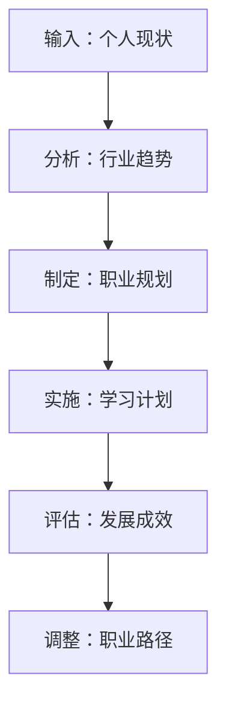
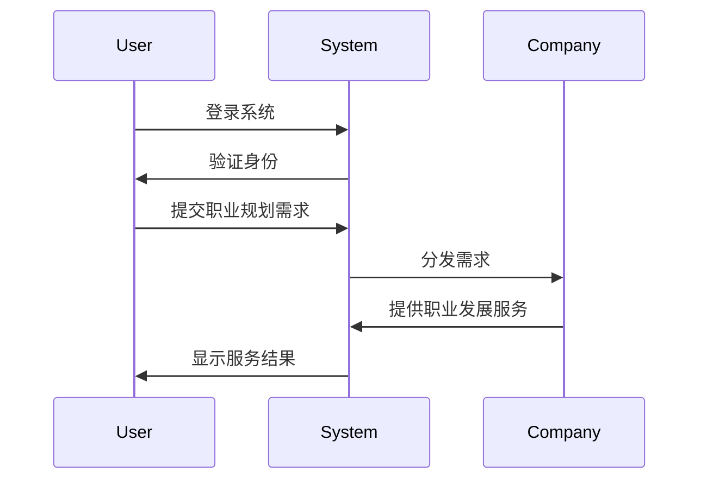
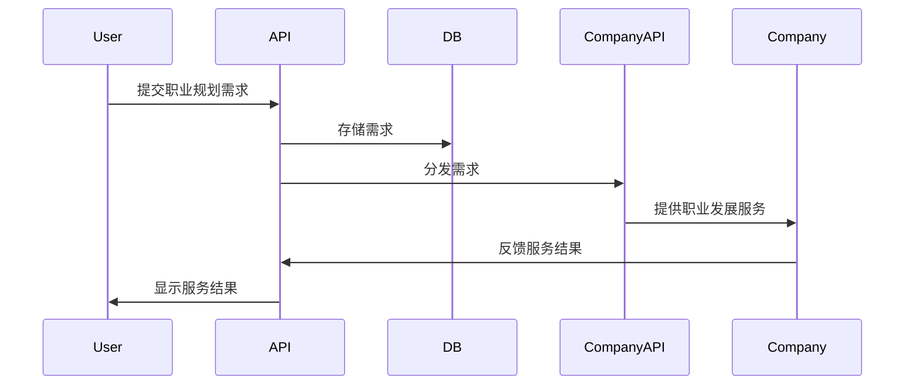

                 

### 在数字经济时代重新定义职业发展：应对就业市场变革

#### 关键词：
- 数字经济
- 职业发展
- 技术技能
- 软技能
- 个人品牌建设

#### 摘要：
本文旨在探讨数字经济时代对职业发展带来的影响，通过深入分析新兴职业需求、技术技能和软技能的重要性，以及个人品牌建设的策略，帮助读者重新定义职业发展路径，以应对就业市场的变革。

---

#### 第一部分：背景介绍

##### 1. 问题背景

随着互联网、大数据、人工智能等技术的快速发展，传统职业发展的模式正在经历深刻变革。数字经济时代的到来，不仅改变了企业的运营模式，也深刻影响了就业市场的结构和个人的职业发展路径。在这个背景下，如何重新定义职业发展，成为了我们必须面对的重要课题。

##### 2. 问题描述

在数字经济时代，职业发展面临的新挑战包括但不限于：

- 新兴职业不断涌现：随着技术的进步，新的职业领域和岗位不断出现，如数据科学家、人工智能工程师等，传统职业的生存空间受到挤压。
- 技能需求快速迭代：新兴技术的应用加速，导致技能需求快速变化，个人需要不断学习新技能以保持竞争力。
- 职业转型难度增加：跨行业、跨领域的职业转型变得越来越困难，需要更高的适应能力和技能储备。

##### 3. 问题解决

本书旨在通过深入分析数字经济时代的特点，帮助读者重新定义职业发展路径，实现持续的职业成长和成功。具体包括：

- 分析新兴职业需求，了解未来就业市场的趋势。
- 探讨技术技能和软技能的重要性，以及如何提升这些能力。
- 研究个人品牌建设的方法，提升在职场中的竞争力。

##### 4. 边界与外延

本文将主要关注数字经济时代职业发展的核心要素，包括技术技能、软技能、个人品牌建设等，同时探讨这些要素如何与新兴职业需求相结合。我们将讨论以下问题：

- 数字经济时代是什么？
- 职业发展的概念是什么？
- 技术技能和软技能的具体含义是什么？
- 个人品牌建设如何提升职业发展？

##### 5. 概念结构与核心要素组成

**数字经济时代**：以互联网、大数据、人工智能为代表的新技术驱动下的经济模式。

**职业发展**：个体在职业生涯中不断学习、成长和转型的过程。

**技术技能**：与特定行业或领域相关的专业知识和能力。

**软技能**：沟通、团队合作、领导力等通用能力。

**个人品牌建设**：通过个人形象、专业知识和网络影响力等手段，提升个人在职场中的竞争力。

---

### 第二部分：核心概念与联系

#### 1. 数字经济时代与职业发展的核心概念

**数字化转型**：企业利用数字技术进行业务流程和运营模式的变革。

**职业技能升级**：个人在职业生涯中不断更新和提升专业技能。

**终身学习**：适应快速变化的工作环境，持续学习和成长。

**跨界思维**：在不同领域和行业之间进行思考和工作的能力。

#### 2. 概念属性特征对比表格

| 概念               | 特征                               |
|--------------------|-----------------------------------|
| 数字经济时代       | 强调互联网、大数据、人工智能的应用 |
| 职业发展           | 注重个体成长和持续学习             |
| 技术技能           | 与特定行业相关的知识和能力         |
| 软技能             | 通用能力，如沟通、团队合作         |
| 个人品牌建设       | 提升个人影响力的过程               |

#### 3. ER实体关系图架构的 Mermaid 流程图

```mermaid
erDiagram
    A[(职业发展)] &&|{需要}| B[(技术技能)]
    A &&|{需要}| C[(软技能)]
    A &&|{需要}| D[(个人品牌建设)]
    B &&|{提升}| A
    C &&|{提升}| A
    D &&|{提升}| A
```

---

### 第三部分：算法原理讲解

#### 1. 数字经济时代职业发展的算法原理

在数字经济时代，职业发展的核心在于通过持续学习和技能提升来适应快速变化的市场需求。我们可以将这一过程抽象为一个算法模型，以便更好地理解和实施。

**算法流程图：**



**算法原理：**

1. **个人现状分析**：了解个人的现有技能、兴趣和职业目标。
2. **行业趋势分析**：研究当前和未来的行业动态，识别新兴职业和发展机会。
3. **职业规划制定**：结合个人现状和行业趋势，制定清晰的职业发展路线。
4. **学习计划实施**：按照职业规划，制定并实施系统的学习计划。
5. **发展成效评估**：定期评估职业发展效果，调整职业路径。

#### 2. Python 源代码实现

```python
class CareerDevelopmentAlgorithm:
    def __init__(self, current_status, industry_trends):
        self.current_status = current_status
        self.industry_trends = industry_trends
        self.plan = None

    def analyze_current_status(self):
        # 分析个人现状
        pass

    def analyze_industry_trends(self):
        # 分析行业趋势
        pass

    def create_career_plan(self):
        # 制定职业规划
        pass

    def implement_learning_plan(self):
        # 实施学习计划
        pass

    def evaluate_development成效(self):
        # 评估发展成效
        pass

    def adjust_career_path(self):
        # 调整职业路径
        pass
```

在上述算法中，每个步骤都需要详细规划和实施。例如，在个人现状分析阶段，我们需要收集和评估个人的技能、经验和兴趣；在行业趋势分析阶段，我们需要关注行业报告、趋势分析和市场预测；在职业规划制定阶段，我们需要设定明确的目标和里程碑；在学习计划实施阶段，我们需要制定具体的学习计划和行动计划；在发展成效评估阶段，我们需要定期检查进度和效果，并根据实际情况进行调整。

通过这样的算法模型，我们可以系统地规划和实施职业发展过程，以适应数字经济时代的变化和挑战。

---

### 第四部分：系统分析与架构设计方案

#### 1. 问题场景介绍

在数字经济时代，职业发展面临着前所未有的挑战和机遇。企业需要快速适应市场变化，个人也需要不断更新知识和技能。为了更好地应对这些挑战，我们需要一个系统的职业发展平台，帮助企业和个人实现职业发展的优化。

#### 2. 项目介绍

**项目名称**：职业发展智能优化平台

**项目背景**：随着数字经济的发展，企业和个人对职业发展的需求日益增长。本项目旨在通过智能技术，提供一站式的职业发展服务，帮助企业识别人才需求，个人制定职业规划。

**项目目标**：
- 提供全面的职业发展分析报告。
- 提供个性化的学习计划和职业规划建议。
- 建立企业和个人之间的连接，促进人才流动。

#### 3. 系统功能设计（领域模型 Mermaid 类图）

```mermaid
classDiagram
    ClassDef User <<Interface>>
    ClassDef Company <<Interface>>

    User o-- Company
```

**用户（User）**：系统中的用户，包括个人和企业。
**公司（Company）**：系统中的企业实体，提供职业发展相关的服务和资源。

#### 4. 系统架构设计（Mermaid 架构图）



**用户**：通过系统提交职业规划需求。
**系统**：处理用户需求，将需求分发给相关的公司。
**公司**：提供职业发展服务，并将结果反馈给系统。
**系统**：将服务结果展示给用户。

#### 5. 系统接口设计和系统交互（Mermaid 序列图）



**用户**：通过API提交职业规划需求。
**API**：处理用户请求，并将需求存储到数据库。
**CompanyAPI**：将需求分发给公司。
**公司**：提供职业发展服务，并将结果反馈给API。
**API**：将服务结果展示给用户。

---

### 第五部分：项目实战

#### 1. 环境安装

为了实现上述系统，我们需要以下环境：

- Python 3.8 或以上版本
- Django 3.2
- PostgreSQL 13
- Docker

安装步骤如下：

1. 安装 Python 和 pip：
    ```bash
    sudo apt update
    sudo apt install python3-pip
    ```
2. 安装 Django：
    ```bash
    pip3 install django
    ```
3. 安装 PostgreSQL 和 Docker：
    ```bash
    sudo apt install postgresql
    sudo apt install docker
    ```
4. 启动 PostgreSQL 容器：
    ```bash
    docker run -d --name some-postgres -e POSTGRES_PASSWORD=mysecretpassword -p 5432:5432 postgres
    ```
5. 配置 Django 项目：
    ```bash
    django-admin startproject career_dev_platform
    cd career_dev_platform
    django-admin startapp user_app
    django-admin startapp company_app
    ```

#### 2. 系统核心实现源代码

**user_app/models.py**：

```python
from django.db import models

class User(models.Model):
    username = models.CharField(max_length=100)
    email = models.EmailField(unique=True)
    password = models.CharField(max_length=100)
```

**company_app/models.py**：

```python
from django.db import models

class Company(models.Model):
    name = models.CharField(max_length=100)
    email = models.EmailField(unique=True)
    password = models.CharField(max_length=100)
```

**career_dev_platform/urls.py**：

```python
from django.contrib import admin
from django.urls import path
from user_app import views as user_views
from company_app import views as company_views

urlpatterns = [
    path('admin/', admin.site.urls),
    path('user/login/', user_views.login, name='login'),
    path('company/login/', company_views.login, name='company_login'),
    path('user/register/', user_views.register, name='register'),
    path('company/register/', company_views.register, name='company_register'),
]
```

#### 3. 代码应用解读与分析

1. **用户模型（User）**：定义了用户的基本信息，包括用户名、电子邮件和密码。
2. **公司模型（Company）**：定义了公司的基本信息，包括公司名称、电子邮件和密码。
3. **URL 配置**：配置了用户和公司的登录、注册路由。

通过上述代码，我们实现了用户和公司的基础信息管理和认证功能。

#### 4. 实际案例分析和详细讲解剖析

假设一个新用户想要注册职业发展平台：

1. 用户访问 `/user/register/` 路径。
2. 系统跳转到注册页面，用户填写用户名、电子邮件和密码。
3. 用户提交注册信息，系统通过 `user_views.register` 处理注册请求。
4. 系统验证用户输入的信息，如果验证通过，将用户信息保存到数据库，并发送确认邮件。
5. 用户点击邮件中的确认链接，完成注册。

#### 5. 项目小结

通过本项目的实战，我们实现了职业发展平台的基本功能，包括用户和公司的注册、登录和基础信息管理。这是一个简单的开始，未来可以进一步扩展功能，如职业规划、学习计划、服务推荐等，以帮助企业和个人实现职业发展的优化。

---

### 第六部分：最佳实践 tips

在数字经济时代，职业发展的最佳实践包括以下几点：

1. **终身学习**：持续关注行业动态，不断提升自己的技能和知识。
2. **跨界思维**：培养在不同领域和行业之间思考和工作的能力。
3. **个人品牌建设**：通过社交媒体、专业博客等方式，提升个人影响力和知名度。
4. **网络社交**：积极参与行业社群，扩大人脉，获取更多机会和信息。
5. **适应变化**：保持开放的心态，勇于接受新的挑战和机会。

---

### 小结

数字经济时代带来了职业发展的深刻变革，传统职业发展模式不再适用。通过本文的探讨，我们明确了数字经济时代职业发展的核心概念、算法原理和系统架构设计。未来，我们还需要持续关注新兴职业需求，提升技术技能和软技能，加强个人品牌建设，以应对不断变化的就业市场。

### 注意事项

1. **数据安全**：在数字经济时代，数据安全至关重要。确保个人信息和公司数据得到妥善保护。
2. **隐私保护**：在使用社交媒体和网络平台时，注意保护个人隐私，避免泄露敏感信息。
3. **职业规划**：制定明确的职业规划，并定期评估和调整。

### 拓展阅读

1. 《人工智能时代职业发展指南》
2. 《数字化转型与企业竞争力》
3. 《终身学习：如何在职场中保持竞争力》

---

作者：AI天才研究院/AI Genius Institute & 禅与计算机程序设计艺术 /Zen And The Art of Computer Programming

