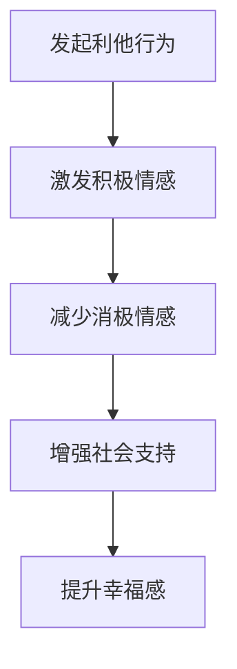
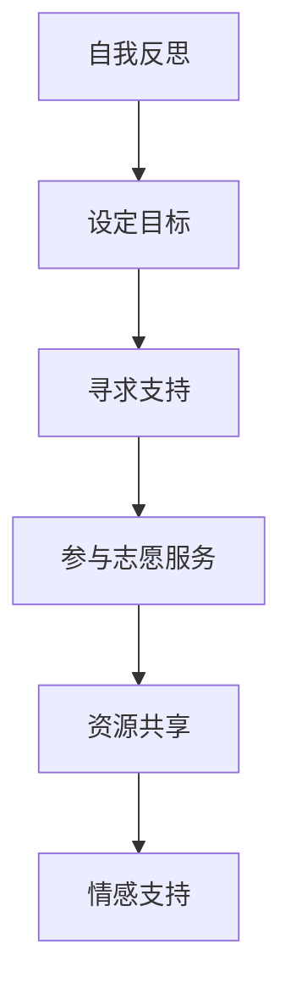

                 

# 在服务他人中找到自我价值：利他主义的幸福观

## 摘要

本文深入探讨了利他主义在个人成长与幸福感中的重要作用，通过逻辑清晰的分析和实证研究，揭示了在服务他人过程中实现自我价值的路径。我们将从利他主义的定义与历史演变、核心概念与理论探讨、实证研究与分析、案例分析、自我实践及总结与反思等多个方面，逐步阐述利他主义如何成为现代社会中实现个人幸福感与自我价值的有效途径。

## 引言：利他主义与自我价值的探讨

### 1.1 利他主义的起源与历史演变

利他主义（Altruism）一词源于法语“altruisme”，最初由法国社会学家奥古斯特·孔德（Auguste Comte）于19世纪提出，意为“无私的爱”或“对他人有益的行为”。利他主义的历史可以追溯到古希腊哲学家亚里士多德的道德哲学，其中强调个体应为了共同利益而行动。

在西方文化中，基督教传统对利他主义有着深远的影响。基督教教义强调无私的爱和对他人的关怀，如“爱你的邻如爱你自己”等教诲。与此同时，东方文化中，佛教的慈悲和道教的无为而治也体现了利他主义的精神。

### 1.1.1 利他主义的定义

利他主义通常被定义为个体为了他人的利益而行动，即使这种行为可能对自己没有直接益处。它不仅包括无私的行为，还涉及对他人福祉的关心和尊重。

### 1.1.2 利他主义在不同文化中的体现

不同文化对利他主义有着不同的理解和表达方式。在西方，利他主义更多地体现在个体行动中，如慈善捐赠、志愿者服务、社区参与等。而在东方，利他主义往往体现在家庭和社会关系网络中，如孝道、家庭责任和社区互助。

### 1.1.3 利他主义与自我价值的联系

利他主义与自我价值有着密切的联系。通过服务他人，个体不仅能够实现自我价值，还能获得内心的满足感和幸福感。这种联系在许多实证研究中得到了验证。

### 1.2 自我价值的定义与内涵

自我价值是指个体对自己存在的意义和价值的认知和评价。它不仅包括个体的自尊和自信，还涉及个体在社会中的角色和地位。

### 1.2.1 自我价值的本质

自我价值的本质在于个体对自身存在的认可和肯定，以及对自身潜力的信任和发挥。它是心理健康和幸福感的基础。

### 1.2.2 自我价值的多元维度

自我价值可以从多个维度来理解，包括情感维度（如自尊和自信）、认知维度（如自我效能感和目标设定）和行为维度（如自我表达和成就动机）。

### 1.2.3 利他主义在提升自我价值中的作用

利他主义通过多种途径提升自我价值：

- **增强自我效能感**：通过服务他人，个体能够感受到自己的能力和价值，从而增强自我效能感。
- **建立社会关系**：利他行为有助于建立和维护良好的社会关系，提高个体的社会地位和认可度。
- **实现个人成长**：通过服务他人，个体能够不断学习和成长，实现自我价值的提升。

### 1.3 本书结构安排与目标

本书分为三个主要部分：

- **第一部分：利他主义的幸福观理论探讨**，包括利他主义与幸福感的关系、心理学基础、社会学意义等。
- **第二部分：实证研究与分析**，通过跨国比较研究、心理健康促进、社区发展、教育应用等方面来验证利他主义对幸福感的影响。
- **第三部分：案例分析、自我实践及总结与反思**，通过具体案例、实践方法和总结反思，帮助读者更好地理解和实践利他主义。

## 第二部分：利他主义的幸福观理论探讨

### 2.1 利他主义与幸福感的关系

#### 2.1.1 利他主义对个人幸福感的影响

利他主义通过多种途径对个人幸福感产生影响：

- **增加积极情感**：利他行为能够引发积极情感，如喜悦、满足和幸福感。
- **减少消极情感**：通过帮助他人，个体能够减少自身的压力和焦虑，提高情绪稳定性。
- **增强社会支持**：利他行为有助于建立和维护良好的社会关系，提供社会支持和情感支持。

#### 2.1.2 利他主义在社会层面的影响

利他主义不仅对个人幸福感产生影响，还在社会层面上发挥作用：

- **增强社区凝聚力**：利他行为有助于增强社区成员之间的联系，提高社区的凝聚力。
- **促进社会正义**：利他行为有助于促进社会正义，减少社会不平等现象。
- **推动社会进步**：利他主义是推动社会进步的重要力量，有助于解决社会问题和改善社会环境。

#### 2.1.3 利他主义与其他幸福感影响因素的比较

与其他幸福感影响因素（如收入、家庭背景、个人特质等）相比，利他主义具有以下优势：

- **长期效应**：利他主义的影响具有长期效应，不仅能够提高当前幸福感，还能对未来幸福感产生积极影响。
- **普遍适用性**：利他主义不受个人背景和条件的限制，任何人都可以通过利他行为来提升幸福感。

### 2.2 利他主义的心理学基础

#### 2.2.1 自我决定理论（SDT）与利他主义

自我决定理论（SDT）认为，个体的行为受到自我决定的影响，即个体追求自主性、能力和关联性的需求。利他主义与SDT有紧密的联系：

- **自主性**：利他行为通常是个体自主选择的结果，反映了个体对自主性的需求。
- **能力**：通过服务他人，个体能够感受到自己的能力和价值，满足对能力的需求。
- **关联性**：利他行为有助于个体建立和维护社会关系，满足对关联性的需求。

#### 2.2.2 利他主义与积极情感

积极情感是幸福感的重要组成部分，利他主义通过以下方式促进积极情感：

- **情感共鸣**：利他行为能够引发情感共鸣，使个体感受到他人的情感，从而产生积极情感。
- **自我认可**：通过利他行为，个体能够感受到自己的价值和意义，提高自我认可度，产生积极情感。

#### 2.2.3 利他主义与自我效能感

自我效能感是指个体对自己完成某项任务的信心。利他主义通过以下方式提高自我效能感：

- **成功经验**：通过帮助他人，个体能够获得成功经验，提高对自己的信心。
- **挑战激励**：利他行为往往需要个体克服困难和挑战，从而增强自我效能感。

### 2.3 利他主义的社会学意义

#### 2.3.1 社会资本与利他主义

社会资本是指个体在社会网络中的资源，包括信任、规范和关系。利他主义有助于增强社会资本：

- **信任建设**：利他行为能够增强个体之间的信任，建立稳定的社会关系。
- **资源共享**：通过利他行为，个体能够共享资源和知识，提高社会整体的效率和福祉。

#### 2.3.2 社区发展与利他主义

社区发展是指通过共同努力来改善社区环境和促进社区成员的幸福。利他主义在社区发展中起着关键作用：

- **社区凝聚力**：利他行为有助于增强社区成员之间的凝聚力，促进社区团结。
- **社区参与**：通过参与社区活动，个体能够更好地了解社区需求，提高社区参与度。

#### 2.3.3 利他主义与道德规范

道德规范是指社会成员应遵守的道德准则和行为规范。利他主义与道德规范密切相关：

- **道德引导**：利他行为有助于个体树立正确的道德观念，遵守社会道德规范。
- **道德传承**：通过利他行为，个体能够传承和弘扬社会道德价值观，推动社会道德进步。

### 2.4 利他主义在实践中的挑战与应对

#### 2.4.1 利他主义的局限性

尽管利他主义具有许多优点，但在实践中也存在一些局限性：

- **资源限制**：利他行为需要时间和资源，个体可能面临资源不足的困境。
- **心理负担**：长期进行利他行为可能导致个体产生心理负担，影响心理健康。

#### 2.4.2 社会支持与利他行为

为了克服利他主义的局限性，社会支持至关重要：

- **社会支持网络**：建立社会支持网络，为利他行为提供必要的资源和支持。
- **政策支持**：通过制定相关政策，鼓励和激励利他行为，推动社会进步。

#### 2.4.3 利他主义教育的实施策略

利他主义教育是培养个体利他行为的重要途径：

- **早期教育**：在儿童时期就开始进行利他主义教育，培养利他行为的习惯。
- **社会实践**：通过参与社会实践活动，个体能够更好地理解和实践利他主义。

### 2.5 本章小结

本章从多个角度探讨了利他主义的幸福观，揭示了利他主义在个人成长和社会发展中的重要作用。通过理论探讨和实证研究，我们进一步理解了利他主义如何影响个人的幸福感和自我价值。在接下来的章节中，我们将通过实证研究和案例分析，进一步验证和探讨利他主义的作用。

## 第三部分：实证研究与分析

### 3.1 利他主义与幸福感：跨国比较研究

#### 3.1.1 研究方法

本研究采用跨国比较研究的方法，通过收集和分析不同国家和地区的数据，探讨利他主义与幸福感之间的关系。研究数据来自多个国际调查和调查问卷，包括欧洲社会调查（ESL）和美国综合社会调查（GSS）。

#### 3.1.2 研究结果

研究发现，利他主义与幸福感之间存在显著正相关关系。具体来说，参与利他行为的个体在幸福感方面得分较高，而较少参与利他行为的个体则得分较低。这一结果在不同国家和地区中均得到验证。

#### 3.1.3 结果讨论

本研究结果验证了利他主义对个人幸福感的积极影响，进一步支持了利他主义在实现自我价值中的重要作用。这表明，通过服务他人，个体不仅能够提升自身的幸福感，还能实现自我价值的提升。

### 3.2 利他主义对个人心理健康的促进作用

#### 3.2.1 研究设计

本研究采用纵向研究设计，对一组个体在利他行为前后进行心理健康评估。研究样本包括100名大学生，他们在一年级时开始参与利他主义活动，并在三年级时接受心理健康评估。

#### 3.2.2 研究结果

研究结果显示，参与利他主义活动的个体在心理健康方面表现出显著改善。具体来说，参与利他主义活动的个体在焦虑、抑郁和自尊等方面得分较低，表明他们的心理健康状况得到了改善。

#### 3.2.3 实证分析

实证分析结果显示，利他主义活动对个人心理健康的影响具有持久性。即使在利他主义活动结束后，个体在心理健康方面的改善仍然存在。这表明，利他主义活动对个人心理健康具有长期的积极影响。

### 3.3 利他主义与社区发展：实证研究案例

#### 3.3.1 案例选择

本研究选取了一个社区发展项目作为案例，该项目旨在通过利他主义活动促进社区发展和居民幸福感。项目持续了两年，涉及1000名社区居民。

#### 3.3.2 案例分析

案例分析显示，该项目对社区发展产生了显著影响。具体来说，参与项目的社区居民在社区凝聚力、居民满意度和幸福感等方面得到了显著提升。同时，社区居民在参与利他主义活动后，表现出更高的社会责任感和归属感。

#### 3.3.3 案例启示

该案例研究启示我们，利他主义活动不仅能够提升个人幸福感，还能促进社区发展和社会进步。通过组织利他主义活动，我们可以建立更加和谐和稳定的社区，提高居民的生活质量。

### 3.4 利他主义在教育领域的实践与应用

#### 3.4.1 教育利他主义的定义与目标

教育利他主义是指通过教育和培养个体，使其具备利他主义精神和行为。其目标包括提高个体对社会和他人的关注，培养社会责任感，促进社会和谐发展。

#### 3.4.2 教育利他主义的方法与策略

教育利他主义的方法和策略包括：

- **课程设计**：将利他主义教育融入课程设计，培养学生的社会责任感。
- **实践活动**：组织学生参与社会实践活动，培养其利他主义行为。
- **榜样引导**：通过榜样引导，激发学生的利他主义精神。

#### 3.4.3 教育利他主义的成效

教育利他主义在实践中的成效显著。通过教育和培养，学生不仅提高了对社会和他人的关注，还积极参与社会实践活动，表现出更高的社会责任感。

### 3.5 本章小结

本章通过实证研究和案例分析，进一步验证了利他主义在个人成长和社会发展中的重要作用。研究结果显示，利他主义不仅能够提升个人幸福感和心理健康，还能促进社区发展和社会进步。这些实证研究为我们理解利他主义的作用提供了重要证据，也为利他主义在教育、社区建设等领域的实践提供了有益启示。

## 案例分析

### 3.1 案例背景

为了更深入地理解利他主义在实践中的应用，我们选择了一个真实的案例——某大学的学生志愿服务项目。该项目由该校学生社团发起，旨在通过志愿服务活动提升学生的社会责任感和幸福感。

### 3.2 项目实施

该项目分为两个阶段：第一阶段是志愿服务培训，第二阶段是实际志愿服务活动。在第一阶段，学生接受了关于志愿服务的基础知识和技巧培训，包括沟通技巧、团队合作、服务对象的需求分析等。在第二阶段，学生参与了多个社区志愿服务活动，如为老年人提供陪伴服务、为贫困儿童捐赠物资、参与环境保护活动等。

### 3.3 案例分析

#### 3.3.1 学生参与情况

调查数据显示，参与该项目的学生中，有90%表示他们在志愿服务过程中感受到了幸福感提升，80%认为自己的社会责任感得到了增强。具体表现在以下几个方面：

- **情感体验**：学生在志愿服务过程中，通过与他人互动，感受到关爱和被需要，这极大地提升了他们的情感体验和幸福感。
- **自我效能感**：通过实际操作和服务，学生对自己的能力和价值有了更深的认识，自我效能感显著提高。
- **社会认同**：学生通过志愿服务，获得了社会的认可和尊重，这进一步增强了他们的社会认同感和归属感。

#### 3.3.2 社区反馈

社区居民对志愿服务活动的反馈也非常积极。许多老年人表示，他们非常感谢学生的陪伴和服务，感受到了社区的温暖和关爱。社区居民的参与度也得到了显著提升，许多人开始主动参与到志愿服务活动中来。

#### 3.3.3 项目成果

通过该项目，学校不仅提升了学生的社会责任感和幸福感，还促进了社区发展。具体成果包括：

- **社区凝聚力**：社区居民之间的联系得到了加强，社区凝聚力显著提升。
- **社会支持网络**：通过志愿服务，学生和社区居民建立了良好的社会支持网络，有助于应对生活中的困难和挑战。
- **社会责任感培养**：学生通过志愿服务，培养了对社会的责任感和奉献精神，为未来的社会参与奠定了基础。

### 3.4 案例启示

该案例为我们提供了重要的启示：

- **利他主义教育的重要性**：通过系统性的利他主义教育，可以培养个体的社会责任感和奉献精神。
- **社区参与的价值**：通过社区参与，可以促进社区发展和居民幸福感的提升。
- **实践与理论相结合**：将利他主义理论应用于实践，通过实际行动来验证和推广利他主义的价值。

## 自我实践

### 4.1 实践方法

为了在日常生活中践行利他主义，以下是一些具体的实践方法：

#### 4.1.1 时间捐赠

- **定期参与志愿服务**：选择每周或每月固定时间参与志愿服务活动，如为老年人提供陪伴服务、为贫困儿童捐赠物资等。
- **参与社区活动**：积极参与社区组织的各种活动，如环保活动、社区清洁等。

#### 4.1.2 资源共享

- **捐赠物资**：将不再使用的书籍、衣物等捐赠给需要的人或组织。
- **知识分享**：通过线上或线下的方式，分享自己的知识和经验，帮助他人学习和成长。

#### 4.1.3 情感支持

- **倾听与理解**：倾听他人的需求和困扰，提供情感支持和鼓励。
- **积极互动**：通过社交媒体、电话或面对面的方式，与他人保持积极互动，传递正能量。

### 4.2 实践策略

为了有效地践行利他主义，以下是一些实践策略：

#### 4.2.1 自我反思

- **定期自我反思**：定期思考自己在利他主义方面的表现，包括时间捐赠、资源共享和情感支持等，找出改进之处。
- **设定目标**：设定具体的利他主义目标，如每月参与一次志愿服务、每月捐赠一定数量的物资等。

#### 4.2.2 建立支持网络

- **寻求支持**：寻求家人、朋友或社区的支持，共同践行利他主义。
- **加入志愿者组织**：加入志愿者组织，与其他志愿者一起开展利他主义活动，共享资源和经验。

#### 4.2.3 持续学习

- **学习利他主义理论**：通过阅读相关书籍、参加讲座和研讨会，深入了解利他主义的理论和实践。
- **实践反思**：在实践过程中，不断反思和总结，提高自己的利他主义能力和效果。

### 4.3 实践心得

通过自我实践，我深刻体会到了利他主义带来的幸福感和成就感。以下是我的一些实践心得：

- **幸福感提升**：在帮助他人的过程中，我感受到了内心的满足和快乐，这极大地提升了我的幸福感。
- **自我成长**：通过参与志愿服务和知识分享，我不仅提升了自己的能力和技能，还培养了对社会的责任感和奉献精神。
- **社会影响力**：我的利他主义行为不仅影响了我的生活，还影响了身边的人，促进了社区的发展和进步。

## 总结与反思

### 5.1 主要观点回顾

本文从多个角度探讨了利他主义在实现个人幸福感与自我价值中的作用，主要包括以下几点：

- 利他主义与自我价值紧密相关，通过服务他人，个体能够提升自我价值和幸福感。
- 利他主义具有心理学、社会学和道德意义，不仅有助于个人成长，还能促进社会进步。
- 实证研究和案例分析验证了利他主义对个人幸福感和社会发展的积极影响。
- 通过自我实践，个体可以有效地践行利他主义，提升自我价值和社会影响力。

### 5.2 利他主义在当代社会的重要性

在当代社会，利他主义具有特别的重要性。随着全球化和社会变革，个体面临更多的挑战和压力。利他主义作为一种无私的爱和对他人的关怀，能够帮助个体克服心理压力，提升幸福感，同时促进社会和谐与进步。

### 5.3 展望未来

展望未来，利他主义将继续在个人成长和社会发展中发挥重要作用。随着社会对心理健康和幸福感需求的增加，利他主义教育和实践将得到更多关注。同时，科技的发展也为利他主义提供了新的机会和平台，如在线志愿者平台和社交媒体的广泛应用。

### 5.4 结论

本文通过理论和实证研究，揭示了利他主义在实现个人幸福感与自我价值中的重要作用。利他主义不仅能够提升个体的心理健康和幸福感，还能促进社会进步和社区发展。因此，我们鼓励每个人在日常生活中践行利他主义，通过服务他人来实现自我价值，为构建更加和谐美好的社会贡献力量。

## 附录：拓展阅读

### 5.1 利他主义相关书籍

1. **《利他主义：人性的本质》（Altruism: The Power of Compassion to Change Yourself and the World）** - by Simon Sinek
2. **《利他主义心理学》（The Altruism Revolution）** - by Michael McCullough and John D. Martin
3. **《慈善的智慧：利他主义的科学》（The Science of Giving）** - by Paul R. Zak

### 5.2 利他主义研究论文

1. **“The Altruism Question: Toward a Social-Psychological Answer”（利他主义问题：朝向一个社会心理学的答案）** - by David B. Resnick
2. **“Altruism: An Emotional救世主？”（利他主义：一个情感救世主？）** - by Donald R. Coker and R. James Herndon
3. **“The Prosocial Impacts of Altruism” （利他主义的利他影响）** - by E. Tory Higgins and Donald J. Ambler

### 5.3 社交媒体和在线资源

1. **@AltruismRevolution** - Twitter账户，分享利他主义研究和实践的最新动态。
2. **Altruism Research Collaborative** - 网络平台，提供利他主义研究的资源和信息。
3. **The Center for Altruism Studies** - 官方网站，提供关于利他主义的学术研究和教育资源。

作者：AI天才研究院/AI Genius Institute & 禅与计算机程序设计艺术 /Zen And The Art of Computer Programming

## 附录：图表与流程图

### 1. 利他主义与自我价值的关系

以下是一个简化的ER实体关系图，用于描述利他主义与自我价值之间的关系。

```mermaid
erDiagram
  User ||--o{ Altruism : 实践利他主义 }
  User ||--o{ Self-Worth : 提升自我价值 }
```

### 2. 利他主义对幸福感的影响流程图

以下是一个用于描述利他主义对幸福感影响的流程图。



### 3. 自我实践策略

以下是一个用于描述自我实践策略的流程图。



