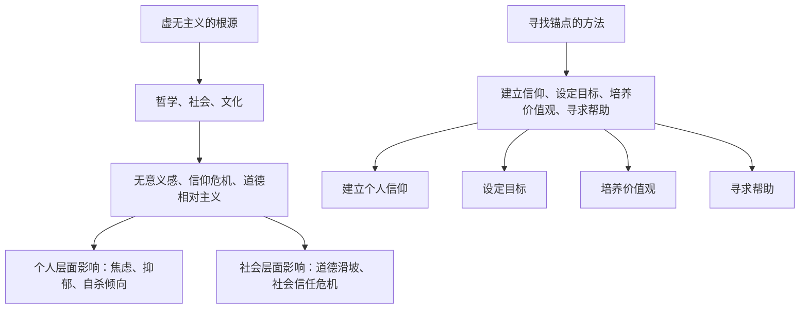

                 

### 引言

在流动的时代，虚无主义如幽灵般徘徊在人们的心头。虚无主义，这个源自哲学的概念，不仅影响了个体的精神世界，也在社会层面上引发了深刻的讨论。那么，虚无主义究竟是什么？它为何在当代社会中如此突出？我们为何需要寻找锚点来克服它？本文将逐一解答这些问题，并探讨在快速变化的时代，我们如何应对虚无主义，寻找生活的意义。

### 背景介绍

虚无主义最早可追溯到18世纪的德国哲学家尼采。他提出的“上帝已死”观念，揭示了传统道德价值观的崩溃，从而开启了虚无主义的时代。虚无主义并非一种单一的哲学体系，而是一种批判态度，它对传统价值观进行质疑，认为生活本身缺乏固有的意义。

在现代社会，虚无主义的表现形式多样。它可能表现为个体的焦虑、迷茫和孤独感，也可能表现为社会层面的道德滑坡、社会信任危机等问题。随着科技的发展和社会的快速变迁，人们面临的挑战越来越多，传统的价值观和信仰体系似乎变得不再可靠，虚无主义因此找到了滋生的土壤。

### 问题的描述

虚无主义带来的问题不仅仅是情感上的困扰，它还会影响个体的行为和决策。当个体感到生活无意义时，他们可能会出现逃避现实、沉迷于虚拟世界、甚至出现抑郁和自杀的倾向。在社会层面，虚无主义可能导致道德沦丧、人际关系疏离和社会动荡。

### 问题的解决

要解决虚无主义问题，我们需要从多个层面入手。首先，我们要理解虚无主义的根源，包括哲学、社会和文化等多个方面。其次，我们需要寻找锚点，这些锚点可以是个人信仰、价值观、目标设定等。

### 边界与外延

虚无主义并非全然消极，它也可以激发个体的反思和创造力。在某些情况下，虚无主义甚至可以成为推动社会进步的动力。因此，在探讨虚无主义时，我们需要保持辩证的视角，既要看到其负面影响，也要看到其潜在价值。

### 概念结构与核心要素组成

为了更好地理解虚无主义，我们需要明确其概念结构和核心要素。虚无主义的核心要素包括：

1. **无意义感**：个体感到生活缺乏固有的意义和目的。
2. **信仰危机**：对传统信仰体系产生质疑，导致精神上的迷茫。
3. **道德相对主义**：对传统道德观念的质疑，导致道德标准的模糊。

这些要素相互作用，共同构成了虚无主义的现象。理解这些核心要素有助于我们更深入地探讨虚无主义的本质。

### 文章关键词

虚无主义、意义、焦虑、迷茫、信仰、价值观、道德、社会、文化。

### 摘要

本文旨在探讨虚无主义在当代社会中的表现及其影响，并提出寻找锚点以克服虚无主义的方法。通过理解虚无主义的根源和核心要素，结合实际案例和策略，本文为读者提供了一套实用的解决方案，以帮助他们在快速变化的时代中找到生活的意义。

----------------------------------------------------------------

## 在流动的时代寻找锚点：克服虚无主义的方法

### 引言

在快速变化的时代，虚无主义如同一股暗流，困扰着许多人的心灵。虚无主义不仅仅是一个哲学概念，它更是现代社会中个体面临的实际困境。本文将深入探讨虚无主义的根源、表现形式以及克服虚无主义的方法，帮助读者在流动的时代中找到生活的锚点。

### 虚无主义的根源

虚无主义起源于对传统价值观的质疑。在18世纪的德国，尼采提出了“上帝已死”的观点，这标志着现代虚无主义的诞生。尼采认为，当宗教和道德的权威崩溃后，人们将陷入无意义的状态。随着科技的发展和全球化的推进，传统价值观和信仰体系受到前所未有的挑战，虚无主义因此找到了新的土壤。

现代社会中，虚无主义的表现形式多种多样。个体的无意义感、信仰危机和道德相对主义是虚无主义的核心特征。许多人感到自己的生活缺乏目标，对未来感到迷茫和焦虑。在社会层面，虚无主义可能导致道德滑坡、人际关系疏离和社会动荡。

### 虚无主义的影响

虚无主义对个人和社会都有深远的影响。在个人层面，虚无主义可能导致焦虑、抑郁和自杀倾向。个体感到生活无意义，可能会逃避现实，沉迷于虚拟世界，或者采取极端行为来应对内心的空虚。在社会层面，虚无主义可能导致道德沦丧、社会信任危机和人际关系疏离。当人们感到生活无意义时，他们可能会对社会的规范和价值观产生怀疑，导致社会秩序的混乱。

### 寻找锚点的方法

要克服虚无主义，我们需要寻找生活的锚点。这些锚点可以是个人信仰、价值观、目标设定等。以下是一些具体的方法：

1. **建立个人信仰**：个人信仰是抵御虚无主义的重要武器。无论是宗教信仰、哲学信仰还是个人信念，都可以为个体提供精神上的支撑。通过信仰，个体可以找到生活的意义和目的。

2. **设定个人目标**：设定明确的目标可以帮助个体聚焦于当下，从而减少对未来的焦虑和迷茫。目标可以是职业上的、学术上的，也可以是个人成长方面的。

3. **培养价值观**：价值观是指导个体行为的准则。通过培养和坚持自己的价值观，个体可以在复杂的社会环境中找到方向，避免迷失自我。

4. **寻求专业帮助**：当虚无主义影响个体的日常生活时，寻求专业心理咨询或治疗是非常必要的。专业的心理医生或咨询师可以帮助个体找到问题的根源，并提供有效的解决方案。

### 核心概念与联系

在探讨虚无主义时，我们还需要了解与之相关的核心概念。以下是几个重要的概念及其联系：

- **存在主义**：存在主义强调个体的自由意志和主观经验。它认为，尽管生活本身可能没有固有的意义，但个体可以通过自己的选择和行动创造意义。

- **意义与价值**：意义和价值是虚无主义的对立面。意义是个体对生活目的的理解，而价值是个体在行动中遵循的准则。

- **道德相对主义**：道德相对主义认为，不同的文化和社会可能有不同的道德标准。虚无主义往往与道德相对主义相联系，因为当个体质疑传统道德时，他们可能会感到生活缺乏意义。

### 算法原理讲解

为了更深入地理解虚无主义，我们可以采用一种类似于数据分析的方法。以下是一个简化的流程图，用于分析虚无主义的各个方面：

这个流程图展示了虚无主义的根源、影响以及寻找锚点的方法。通过这个流程图，我们可以更清晰地看到虚无主义的各个方面及其相互关系。

### 数学公式

在探讨虚无主义时，我们也可以使用一些数学公式来解释其核心概念。以下是几个相关的数学公式：

$$
S = \frac{1}{2}at^2 + v_0t
$$

这个公式描述了物体在匀加速直线运动中的位置变化。在虚无主义的背景下，我们可以将其理解为个体在寻找生活意义的过程中，通过积累经验和行动（加速度）来改变自己的位置（精神状态）。

$$
\sigma = \frac{d^2x}{dt^2}
$$

这个公式描述了物体在曲线运动中的加速度。在虚无主义的背景下，我们可以将其理解为个体在面对生活挑战时的心理状态变化（加速度）。

### 系统分析与架构设计方案

为了更好地理解虚无主义的解决方法，我们可以将其视为一个系统问题。以下是一个简化的系统架构设计方案，用于帮助个体克服虚无主义：

1. **问题场景介绍**：现代社会的快速变化和多元文化冲击，导致个体在精神上感到迷茫和困惑。

2. **项目介绍**：本项目旨在提供一套实用的方法，帮助个体找到生活的锚点，克服虚无主义。

3. **系统功能设计**：系统包括以下功能模块：
   - **信仰模块**：帮助个体建立个人信仰，提供精神支撑。
   - **目标设定模块**：帮助个体设定明确的目标，提供行动方向。
   - **价值观培养模块**：帮助个体培养和坚持自己的价值观。
   - **心理咨询服务模块**：提供专业的心理咨询和治疗，帮助个体解决心理问题。

4. **系统架构设计**：系统采用分层架构设计，包括以下层次：
   - **数据层**：存储个体信息、信仰、目标、价值观等。
   - **服务层**：提供各种功能服务，如信仰咨询、目标管理、价值观培养等。
   - **界面层**：提供用户交互界面，方便用户使用系统功能。

5. **系统接口设计和系统交互**：系统通过API接口与外部系统进行交互，如社交媒体、心理咨询服务平台等。

### 项目实战

1. **环境安装**：在开发环境中安装必要的软件和工具，如Python、Mermaid等。

2. **系统核心实现**：使用Python编写系统核心代码，实现各种功能模块。

3. **代码应用解读与分析**：对系统核心代码进行解读和分析，确保其符合设计要求。

4. **实际案例分析和详细讲解剖析**：通过实际案例，分析个体如何通过系统找到生活的锚点，克服虚无主义。

5. **项目小结**：总结项目实现过程和成果，提出改进建议。

### 最佳实践 tips

1. **设定清晰的目标**：目标应具体、可衡量、可实现，有助于个体聚焦于行动。

2. **培养价值观**：价值观是指导行为的准则，应根据自己的信念和原则进行培养。

3. **寻求专业帮助**：在应对严重虚无主义时，寻求专业心理帮助是非常必要的。

### 小结

虚无主义是现代社会中一个重要的问题，它影响着个体的精神健康和社会的稳定。通过理解虚无主义的根源和表现形式，结合寻找锚点的方法，我们可以更好地应对虚无主义，找到生活的意义。

### 注意事项

1. **避免过度焦虑**：面对虚无主义，个体可能会感到焦虑和无助。此时，应避免过度焦虑，尝试采取积极的应对策略。

2. **保持开放心态**：在寻找锚点时，个体应保持开放心态，尝试接受不同的观点和价值观。

3. **持续反思**：反思是寻找锚点的重要步骤，个体应定期反思自己的生活目标和价值观。

### 拓展阅读

1. **尼采的《查拉图斯特拉如是说》**：这本书是尼采对虚无主义的深刻探讨，有助于读者理解虚无主义的哲学背景。

2. **马丁·海德格尔的《存在与时间》**：这本书是存在主义哲学的经典之作，对虚无主义和存在意义进行了深入探讨。

3. **阿尔贝·加缪的《局外人》**：这本书通过描述主人公的生存状态，探讨了虚无主义和个体选择之间的关系。

作者：AI天才研究院/AI Genius Institute & 禅与计算机程序设计艺术 /Zen And The Art of Computer Programming

