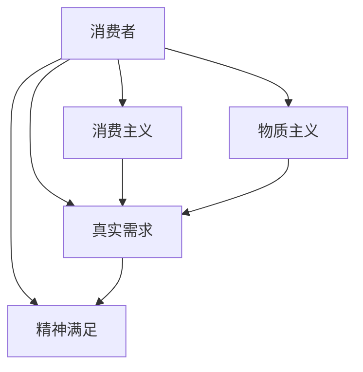

                 

# 在消费主义文化中寻找真实需求：对抗物质主义

## 关键词

- **消费主义**  
- **真实需求**  
- **物质主义**  
- **精神满足**  
- **自我认知**  

## 摘要

在当今消费主义文化盛行的社会，人们往往被物质的诱惑所驱使，追求物质享受成为生活的主要目标。然而，随着物质生活水平的提高，许多人开始意识到，这种追求并不能带来真正的满足感。本文旨在探讨在消费主义文化中，个体如何寻找真实的自身需求，如何对抗物质主义，实现精神上的满足。

### 目录大纲

## 第一部分: 引言

### 1. 引言

#### 问题背景

现代社会中，物质主义和消费主义文化盛行，人们对物质的追求和消费行为日益加剧，导致了一系列社会问题。

#### 问题描述

在消费主义文化中，人们如何寻找真实的自身需求和满足感，如何对抗物质主义，实现精神上的满足？

#### 问题解决

本书通过理论和实践相结合，探讨如何在消费主义文化中寻找真实需求，对抗物质主义，实现自我满足和精神富足。

#### 边界与外延

本书主要研究在消费主义文化背景下，个体如何进行自我认知和需求识别，以及如何采取行动对抗物质主义。

#### 核心概念与联系

**核心概念**：消费主义、真实需求、物质主义、精神满足。

**概念属性特征对比表格**：

| 概念 | 消费主义 | 真实需求 | 物质主义 | 精神满足 |
| --- | --- | --- | --- | --- |
| **定义** | 过度追求物质消费的生活方式 | 来自内心深处的真实愿望和需要 | 对物质的过分依赖和追求 | 心理上的满足和幸福感 |
| **特征** | 大量购买商品和服务 | 基于个人的内在动机和价值观 | 物质条件优越，精神空虚 | 非物质层面的满足感 |
| **关系** | 促进物质主义 | 对抗物质主义 | 导致消费主义 | 消费主义的对立面 |

**ER实体关系图架构**：

## 第二部分: 消费主义文化的影响

### 2. 消费主义文化的兴起

#### 历史背景

消费主义文化起源于18世纪末的工业革命，随着生产力的提高和商品的大规模生产，消费行为逐渐成为社会生活的重要组成部分。

#### 现状分析

现代消费主义文化已经渗透到社会的方方面面，从个人消费行为到社会价值观，都受到了深远影响。

### 3. 消费主义文化对个体的影响

#### 行为影响

消费主义文化鼓励人们追求物质享受，可能导致过度消费和浪费。

#### 心理影响

长期处于消费主义文化中，个体可能会出现精神空虚、焦虑等心理问题。

### 4. 消费主义文化对社会的影响

#### 资源消耗

过度消费导致资源浪费和环境污染。

#### 经济问题

消费主义文化可能导致经济泡沫和金融风险。

## 第三部分: 寻找真实需求

### 5. 真实需求的定义与识别

#### 定义

真实需求是指个体在特定情境下，基于内在动机和价值观而产生的实际需要。

#### 识别方法

通过自我反思和深度探索，个体可以识别出真实的自身需求。

### 6. 对抗物质主义的方法

#### 心理调适

培养内心平静，减少对物质的依赖。

#### 消费观念转变

树立理性消费观念，避免盲目追求物质。

#### 替代活动

通过参与有意义的活动，如志愿服务、艺术创作等，满足精神需求。

### 7. 实践案例分享

#### 案例1

某人在消费主义文化中通过自我反思，重新审视自己的需求和价值观，最终找到了真正的满足感。

#### 案例2

某企业通过推行可持续消费理念，成功转变了员工的消费行为，提高了员工的工作满意度和生活质量。

## 第四部分: 实现精神满足

### 8. 精神满足的要素

#### 自我认知

了解自己的内在需求和价值观。

#### 心理平衡

通过心理调适，实现内心的平静和满足。

#### 人际关系

建立良好的人际关系，获得情感上的支持。

#### 社会贡献

通过为社会做出贡献，实现自我价值。

### 9. 实现精神满足的路径

#### 个人成长

通过学习、实践和自我反思，不断提升个人能力和素质。

#### 文化传承

传承和发扬积极向上的文化传统，抵制消费主义文化。

#### 社会实践

积极参与社会活动，为社会做出贡献。

## 第五部分: 政策与教育

### 10. 政府在对抗物质主义中的作用

#### 政策制定

制定相关政策，引导社会形成理性消费的氛围。

#### 公共服务

提供公共服务，如教育、文化等，满足人们的精神需求。

### 11. 教育在培养理性消费观念中的作用

#### 学校教育

在课程中融入消费教育，培养学生的理性消费观念。

#### 社会教育

通过媒体、文化活动等，推广理性消费观念，抵制物质主义。

## 结论

在消费主义文化中寻找真实需求，对抗物质主义，实现精神满足，是当今社会的重要课题。通过自我认知、心理调适、理性消费和参与社会实践，个体可以找到真正的满足感，实现精神上的富足。同时，政府和社会应积极参与，共同推动理性消费文化的建设。让我们一起努力，寻找真实需求，对抗物质主义，实现精神满足。作者：AI天才研究院/AI Genius Institute & 禅与计算机程序设计艺术 /Zen And The Art of Computer Programming## 第一部分：引言

### 1. 引言

在现代社会中，消费主义和物质主义文化如同无形的手，深深影响着我们的生活。随着全球经济的迅猛发展，人们的生活水平不断提高，消费行为也逐渐从基本的生存需求演变为追求更高品质和时尚潮流的物质享受。这种现象不仅在个人层面引发了诸多问题，也对整个社会产生了深远的影响。

#### 问题背景

消费主义文化起源于18世纪末的工业革命，随着生产力的提高和商品的大规模生产，消费行为逐渐成为社会生活的重要组成部分。20世纪中叶，随着经济的进一步发展和广告营销的兴起，消费主义文化在全球范围内迅速传播。现代社会中，消费主义文化已经成为一种主流的价值观，影响着人们的日常生活、工作和社会交往。

#### 问题描述

在消费主义文化中，人们被引导着追求物质享受和占有，不断地购买新的商品和服务，以追求短暂的满足感。然而，这种追求并不能带来长久的幸福感。许多人发现，尽管物质生活越来越丰富，但内心的空虚和焦虑感却与日俱增。如何在消费主义文化中寻找真实的自身需求和满足感，如何对抗物质主义，实现精神上的满足，成为了一个值得探讨的问题。

#### 问题解决

面对消费主义文化带来的挑战，我们需要找到一种方法，帮助个体在物质追求和精神满足之间找到平衡。本书将通过理论和实践相结合的方式，探讨在消费主义文化中如何识别和满足真实的自身需求，如何对抗物质主义，实现自我满足和精神富足。

#### 边界与外延

本书的研究范围主要关注在消费主义文化背景下，个体如何进行自我认知和需求识别，以及如何采取行动对抗物质主义。我们将会讨论核心概念，如消费主义、真实需求、物质主义和精神满足，并探讨它们之间的相互关系。

#### 核心概念与联系

**核心概念**：

- **消费主义**：一种文化现象，强调物质消费的重要性，追求物质享受和占有。
- **真实需求**：个体在特定情境下，基于内在动机和价值观而产生的实际需要。
- **物质主义**：过分依赖和追求物质财富和物质满足的生活方式。
- **精神满足**：心理上的满足和幸福感，源自内在的需求满足和自我实现。

**概念属性特征对比表格**：

| 概念       | 消费主义                         | 真实需求                         | 物质主义                         | 精神满足                         |
|------------|---------------------------------|---------------------------------|---------------------------------|---------------------------------|
| **定义**   | 过度追求物质消费的生活方式     | 来自内心深处的真实愿望和需要     | 对物质的过分依赖和追求           | 心理上的满足和幸福感               |
| **特征**   | 大量购买商品和服务             | 基于个人的内在动机和价值观       | 物质条件优越，精神空虚           | 非物质层面的满足感               |
| **关系**   | 促进物质主义                   | 对抗物质主义                    | 导致消费主义                    | 消费主义的对立面                 |

**ER实体关系图架构**：

通过以上内容，我们为接下来的讨论奠定了基础。在接下来的章节中，我们将深入探讨消费主义文化的兴起、其对个体和社会的影响，以及如何在消费主义文化中寻找真实需求，对抗物质主义，实现精神满足。让我们一步一步地思考，找到解决问题的有效路径。

### 2. 消费主义文化的兴起

消费主义文化的兴起可以追溯到18世纪末的工业革命时期。随着工业化的推进，生产力得到了极大的提升，商品的生产和流通变得更加高效和便捷。这一时期，商品的种类和数量迅速增加，人们开始有能力购买更多的商品，从而逐渐形成了消费文化的基础。

#### 历史背景

18世纪末至19世纪初，工业革命席卷欧洲和北美，带来了生产力的巨大飞跃。机器的出现和工厂的建立，使得商品的生产效率大幅提升，价格也逐渐降低，这使得更多的人能够负担得起日常所需的商品。同时，随着城市化进程的加快，人们的消费需求也逐渐多样化。

20世纪中叶，消费主义文化迎来了一个快速发展的阶段。随着经济的恢复和增长，人们的收入水平提高，消费能力也随之增强。广告业的兴起和大众传媒的发展，使得商品信息迅速传播，消费观念逐渐渗透到社会的各个层面。购物成为了一种生活方式，消费行为不再仅仅是为了满足基本需求，而是为了追求愉悦和满足感。

#### 现状分析

现代消费主义文化已经渗透到社会的方方面面，从个人消费行为到社会价值观，都受到了深远影响。

1. **个人消费行为**：现代社会中，个人消费行为被高度鼓励和推崇。人们通过购买商品和服务来表达自己的身份、地位和价值观。消费者在购物过程中追求的不仅仅是商品的使用价值，更多的是商品所代表的社会符号和文化意义。

2. **社会价值观**：消费主义文化改变了人们的价值观，传统的节俭和实用观念逐渐被追求奢华和炫耀取代。人们开始将物质财富和消费能力看作是成功和幸福的象征，这种价值观的传播进一步加剧了物质主义和消费主义的现象。

3. **社会影响**：消费主义文化对社会结构和社会关系产生了深远影响。一方面，它促进了经济的发展和繁荣；另一方面，它也带来了资源浪费、环境污染和社会不平等等问题。现代社会的消费行为往往伴随着大量的资源消耗和环境污染，这对地球的可持续发展构成了威胁。同时，消费主义文化也可能导致社会不平等，因为富裕阶层更容易获得更多的消费资源和机会。

4. **文化多样性**：消费主义文化在全球范围内的传播，也对不同国家和地区的文化多样性产生了影响。本土文化和传统价值观念在全球化浪潮中面临着被同质化的风险，传统文化和习俗的传承和保护变得更加困难。

### 消费主义文化的特点

1. **过度消费**：消费主义文化鼓励人们不断购买新的商品和服务，以满足无尽的欲望和需求。这种现象导致了资源的过度消耗和环境的严重破坏。

2. **炫耀性消费**：消费主义文化中，人们通过购买昂贵的商品来展示自己的社会地位和财富。这种炫耀性消费不仅增加了个人负担，也加剧了社会的不平等。

3. **符号化消费**：现代社会中，商品不仅仅具有使用价值，更具有象征意义。消费者在购买商品时，往往考虑的是商品所代表的社会地位、身份和价值观。

4. **短期满足**：消费主义文化追求短期满足，消费者在购物过程中追求快感、刺激和即时的满足感，而忽视了长期的精神满足和幸福感。

5. **依赖性消费**：随着消费行为的不断进行，消费者可能会对消费行为产生依赖，认为通过购买商品可以解决生活中的各种问题，从而陷入消费主义的循环。

### 消费主义文化的影响

消费主义文化对个人和社会产生了深远的影响，具体表现如下：

#### 对个人的影响

1. **心理压力**：过度消费可能导致心理压力的增加，消费者可能会因为负债、经济负担和购物欲望的难以满足而感到焦虑和抑郁。

2. **身份认同**：消费主义文化中，人们往往通过购买商品来塑造自己的身份和形象，这可能导致个体对自我价值的认同过于依赖物质条件。

3. **消费依赖**：长期处于消费主义文化中，个体可能会对消费行为产生依赖，认为通过购买商品可以获得满足感和幸福感。

4. **生活质量下降**：过度消费可能导致生活质量下降，消费者可能会陷入债务危机，影响日常生活和心理健康。

#### 对社会的影响

1. **资源浪费**：消费主义文化导致资源的过度消耗，包括能源、水和原材料等，这对地球的可持续发展构成了威胁。

2. **环境污染**：消费行为产生的废弃物和污染，对环境造成了严重影响，包括空气污染、水污染和垃圾填埋场的污染等问题。

3. **社会不平等**：消费主义文化加剧了社会不平等，富裕阶层更容易获得更多的消费资源和机会，而贫困阶层则难以享受到高品质的生活。

4. **文化同质化**：消费主义文化可能导致本土文化和传统价值观念的同质化，影响文化多样性和传统习俗的传承。

#### 消费主义文化中的问题

1. **虚假需求和满足感**：消费主义文化往往通过广告和营销手段，创造虚假的需求和满足感，消费者在购买商品时可能会受到误导。

2. **消费主义循环**：消费者在追求物质满足的过程中，可能会陷入消费主义的循环，不断购买新的商品，以满足不断增长的需求。

3. **精神空虚**：尽管物质生活越来越丰富，但许多人仍然感到精神空虚和缺乏真正的幸福感，这反映了消费主义文化的局限性。

通过以上对消费主义文化兴起的探讨，我们可以看到，消费主义文化在现代社会中具有重要的影响力。然而，这种文化也带来了一系列问题，对个人和社会产生了深远的负面影响。在接下来的章节中，我们将深入探讨消费主义文化对个体的影响，并探索如何在消费主义文化中寻找真实需求，对抗物质主义，实现精神满足。

### 3. 消费主义文化对个体的影响

消费主义文化的盛行不仅改变了社会的整体结构和价值观，也对个体产生了深远的影响。这些影响不仅体现在个人消费行为上，还渗透到了心理和生活质量等各个方面。

#### 行为影响

消费主义文化鼓励人们追求物质享受和占有，这种价值观对个人消费行为产生了显著的影响。

1. **过度消费**：在消费主义文化中，过度消费是一种常见的现象。消费者往往受到广告和营销策略的影响，购买大量的商品和服务，以满足短暂的满足感和自我认同。这种过度消费不仅增加了个人的经济负担，还可能导致资源的过度消耗和环境的破坏。

2. **炫耀性消费**：消费主义文化中，人们通过购买昂贵的商品来展示自己的社会地位和财富。这种炫耀性消费不仅增加了个人负担，还可能加剧社会不平等，因为富裕阶层更容易获得更多的消费资源和机会。

3. **依赖性消费**：长期处于消费主义文化中，个体可能会对消费行为产生依赖，认为通过购买商品可以解决生活中的各种问题。这种依赖性消费可能导致消费者陷入消费主义的循环，不断购买新的商品，以满足不断增长的需求。

4. **消费主义循环**：消费者在追求物质满足的过程中，可能会陷入消费主义的循环。他们可能会不断地购买新的商品，以满足新的需求和欲望，从而形成一种持续的消费行为模式。这种循环可能导致消费者难以摆脱物质主义的束缚，无法实现真正的精神满足。

#### 心理影响

消费主义文化对个体的心理健康也产生了显著的影响。

1. **焦虑和抑郁**：过度消费可能导致心理压力的增加，消费者可能会因为负债、经济负担和购物欲望的难以满足而感到焦虑和抑郁。此外，消费者在购物过程中可能会受到广告和营销策略的诱导，产生不切实际的期望，从而增加心理负担。

2. **身份认同**：消费主义文化中，人们往往通过购买商品来塑造自己的身份和形象，这可能导致个体对自我价值的认同过于依赖物质条件。当物质条件无法满足时，个体可能会感到自我价值缺失，从而产生自卑和焦虑情绪。

3. **心理依赖**：长期处于消费主义文化中，个体可能会对消费行为产生依赖，认为通过购买商品可以获得满足感和幸福感。这种心理依赖可能导致个体在无法消费时产生强烈的负面情绪，如孤独、无助和空虚。

4. **精神空虚**：尽管物质生活越来越丰富，但许多人仍然感到精神空虚和缺乏真正的幸福感。这反映了消费主义文化的局限性，它无法满足个体内心的深层次需求，导致精神上的空虚和迷茫。

#### 生活质量

消费主义文化对个体的生活质量也产生了深远的影响。

1. **经济负担**：过度消费可能导致消费者面临沉重的经济负担，包括信用卡债务、贷款和信用额度的透支。这种经济负担不仅影响了消费者的日常生活质量，还可能导致焦虑、压力和心理健康问题。

2. **时间管理**：在追求物质享受的过程中，消费者可能会将大量时间和精力投入到购物活动中。这种时间管理不当可能导致个人生活和家庭生活的质量下降，影响与家人和朋友的关系。

3. **社交压力**：在消费主义文化中，人们往往通过比较物质条件来衡量彼此的社会地位。这种社交压力可能导致消费者感到不满足和不快乐，从而影响生活质量。

4. **环境意识缺失**：消费主义文化鼓励人们追求物质享受，这往往伴随着对环境的忽视和破坏。消费者在购买商品时可能忽视产品的环境影响，导致资源的过度消耗和环境污染。

#### 社会关系

消费主义文化对个体与社会关系的影响也是不可忽视的。

1. **社会不平等**：消费主义文化加剧了社会不平等，富裕阶层更容易获得更多的消费资源和机会，而贫困阶层则难以享受到高品质的生活。这种不平等可能导致社会分裂和对立，影响社会和谐。

2. **价值观异化**：消费主义文化改变了传统的价值观，将物质财富和消费能力看作是成功和幸福的象征。这种价值观的异化可能导致人们忽视其他重要的价值，如人际关系、文化传承和社会责任。

3. **社会疏离**：在追求物质享受的过程中，个体可能会忽视与家人和朋友的交往，导致社会关系的疏远和疏离。这种社会疏离可能导致个体的孤独感和无助感，进一步加剧心理问题。

#### 生活方式的改变

消费主义文化也改变了个体生活方式的各个方面。

1. **生活节奏**：在追求物质享受的过程中，个体可能会加快生活节奏，不断追求新的刺激和满足感。这种生活方式可能导致个体缺乏时间进行深度思考和反思，影响个人的精神成长。

2. **消费习惯**：消费主义文化培养了个体特定的消费习惯，如频繁购物、追求名牌和奢侈品等。这些消费习惯不仅增加了经济负担，还可能导致消费行为的不合理和浪费。

3. **生活品质**：尽管物质生活越来越丰富，但许多人在消费主义文化中感到生活质量并没有显著提升。这反映了消费主义文化的局限性，它无法满足个体对生活品质的真正需求。

#### 消费主义文化的挑战

消费主义文化对个体的行为、心理和生活质量产生了深远的影响，同时也带来了许多挑战。

1. **心理健康**：过度消费可能导致心理问题，如焦虑、抑郁和依赖等。个体需要找到方法应对这些心理问题，实现心理健康。

2. **价值观重塑**：个体需要重新审视自己的价值观，摆脱物质主义的束缚，找到真正的满足感和幸福感。

3. **生活方式调整**：个体需要调整自己的生活方式，实现健康的生活节奏和合理的消费习惯。

4. **社会责任**：个体需要承担社会责任，关注环境问题和消费伦理，实现可持续发展。

通过以上对消费主义文化对个体影响的探讨，我们可以看到，消费主义文化不仅改变了人们的消费行为，还对心理健康和生活质量产生了深远的影响。在接下来的章节中，我们将进一步探讨如何在消费主义文化中寻找真实需求，对抗物质主义，实现精神满足。让我们一步一步地思考，找到解决问题的有效路径。

### 4. 消费主义文化对社会的影响

消费主义文化不仅对个体产生了深远的影响，也对社会整体产生了广泛的影响。这些影响涵盖了资源消耗、经济问题、社会不平等以及环境问题等多个方面，值得深入探讨。

#### 资源消耗

消费主义文化的一个重要特征是过度消费，这直接导致了资源的过度消耗。现代社会中，人们不断地购买新的商品和服务，这些商品的生产和消费过程需要大量的自然资源，包括水、能源和原材料。以下是一些具体的资源消耗问题：

1. **能源消耗**：商品的生产、运输和加工过程需要大量的能源，特别是化石燃料。这不仅增加了温室气体的排放，也对气候变化产生了严重影响。

2. **水资源消耗**：水是许多商品生产过程中必不可少的资源。例如，农业灌溉、工业生产和个人消费都需要大量的水资源。过度消费导致水资源短缺，尤其是在干旱地区，水资源问题变得更加严重。

3. **原材料消耗**：商品的生产需要大量的原材料，包括金属、塑料和木材等。过度消费导致原材料的过度开采和浪费，这不仅影响了自然资源的可持续利用，还对生态系统产生了负面影响。

#### 经济问题

消费主义文化对经济领域的影响同样显著。尽管消费主义文化在短期内可能刺激经济增长，但从长期来看，它可能导致一系列经济问题。

1. **经济泡沫**：过度消费可能导致经济泡沫的形成，即资产价格远高于其实际价值。这种泡沫最终会破裂，导致经济危机和市场动荡。

2. **债务问题**：消费主义文化鼓励人们通过信用卡和贷款进行消费，这可能导致个人和家庭的债务问题。高负债水平不仅增加了经济负担，还可能影响消费者的消费能力和生活质量。

3. **收入不平等**：消费主义文化加剧了社会收入不平等。富裕阶层有更多的消费能力和资源，而贫困阶层则难以享受到高品质的生活。这种不平等可能导致社会分裂和对立，影响社会的稳定和发展。

#### 社会不平等

消费主义文化加剧了社会不平等问题，对社会的公平性产生了负面影响。

1. **财富分配不均**：消费主义文化鼓励人们通过物质财富来衡量个人价值和社会地位。这导致财富集中在少数富裕阶层手中，而贫困阶层的收入和生活质量难以提升。

2. **教育机会不均**：在消费主义文化中，教育资源往往与家庭经济条件密切相关。富裕家庭有更多的资源来为孩子提供优质的教育，而贫困家庭则难以负担高质量的教育，这进一步加剧了社会不平等。

3. **社会流动受限**：消费主义文化可能导致社会流动受限，即社会阶层之间的流动变得困难。在消费主义文化中，个人的社会地位往往与物质财富密切相关，这限制了社会阶层之间的流动，影响了社会的活力和多样性。

#### 环境问题

消费主义文化对环境的影响是显而易见的，主要体现在以下几个方面：

1. **环境污染**：消费主义文化导致大量商品的购买和消费，这产生了大量的废弃物和污染。例如，电子产品、塑料产品和家具等的废弃和分解过程会对环境产生长期的负面影响。

2. **生态破坏**：过度消费导致自然资源的过度开采和生态系统的破坏。例如，森林砍伐、海洋污染和物种灭绝等，这些行为对生态平衡和生物多样性产生了严重影响。

3. **气候变化**：消费主义文化增加了温室气体的排放，这直接导致了全球气候变化。气候变化带来了极端天气事件、海平面上升和生态系统破坏等问题，对人类和地球的可持续发展构成了严重威胁。

#### 消费主义文化的负面影响

1. **资源枯竭**：过度消费导致自然资源的过度开采，可能导致资源枯竭。如果资源枯竭问题得不到有效解决，未来的经济发展和社会稳定将受到严重威胁。

2. **环境退化**：消费主义文化导致的资源浪费和环境污染加剧了生态系统的退化。这不仅影响了生物多样性，还对人类的生活质量产生了负面影响。

3. **社会不和谐**：消费主义文化加剧了社会不平等，导致社会分裂和对立。这种不和谐不仅影响了社会的稳定，也阻碍了社会的进步和发展。

#### 应对措施

为了应对消费主义文化带来的负面影响，社会和个人都需要采取行动。以下是一些可能的应对措施：

1. **政策干预**：政府可以通过制定相关政策和法规，限制过度消费和浪费行为。例如，实施环保税、减少塑料使用和鼓励可持续发展等。

2. **教育普及**：教育是改变消费观念和价值观的重要手段。学校和社会组织可以通过教育项目，提高公众对消费主义文化的认识，培养理性消费的习惯。

3. **社会宣传**：媒体和宣传机构可以通过宣传环保和可持续发展的理念，引导公众转变消费观念，减少过度消费。

4. **个人行动**：每个人都可以从自己做起，采取可持续的消费行为。例如，减少不必要的购物、选择环保产品和使用可再生能源等。

通过以上对消费主义文化对社会影响的探讨，我们可以看到，消费主义文化不仅对经济和环境产生了负面影响，也对社会结构和社会关系产生了深远的影响。在接下来的章节中，我们将进一步探讨如何在消费主义文化中寻找真实需求，对抗物质主义，实现精神满足。让我们一步一步地思考，找到解决问题的有效路径。

### 5. 真实需求的定义与识别

在探讨如何在消费主义文化中对抗物质主义，实现精神满足之前，我们需要明确一个关键概念：真实需求。真实需求是指个体在特定情境下，基于内在动机和价值观而产生的实际需要。与消费主义文化中追求的物质满足不同，真实需求关注的是个体的内在需求和满足感，而非外在的符号和象征。

#### 定义

真实需求不仅仅是生活中的基本需求，如食物、水和住所，而是指那些深层次、持久的需求，这些需求源自个体的内心，与个人的价值观和生活目标密切相关。真实需求可能包括以下几种类型：

1. **情感需求**：个体对爱、关怀和归属感的追求，这些需求在人际关系和社交互动中得以满足。
2. **认知需求**：个体对知识、学习和探索的好奇心，这些需求通过教育、阅读和思考得到满足。
3. **自我实现需求**：个体对自我价值、成就和自我实现的需求，这些需求通过工作、创造性活动和社会贡献得到满足。

#### 识别方法

要识别和满足真实需求，个体需要采取自我反思和深度探索的方法。以下是一些具体的方法：

1. **自我反思**：个体可以通过定期进行自我反思，思考自己的行为和动机，了解自己的内在需求和价值观。这可以通过写日记、冥想或与他人交流来实现。

2. **深度探索**：个体可以通过参与有意义的活动，如志愿服务、艺术创作和社区参与等，来探索自己的兴趣和激情。这些活动可以帮助个体发现内在的需求和满足感。

3. **价值观澄清**：个体需要明确自己的价值观，这些价值观将指导个体的行为和决策。通过澄清自己的价值观，个体可以更清楚地识别真实需求，并避免被消费主义文化误导。

4. **心理调适**：个体可以通过心理调适方法，如认知行为疗法、正念练习和情绪管理技巧，来培养内心的平静和满足感。

5. **社会支持**：个体可以通过建立良好的社会支持网络，如与家人、朋友和社区的关系，来满足自己的情感需求和社会需求。

#### 真实需求与消费主义的区别

真实需求与消费主义追求的物质满足存在显著差异。以下是一个简单的对比表格：

| 特征       | 真实需求                                     | 消费主义                                      |
|------------|--------------------------------------------|-----------------------------------------------|
| **来源**   | 内在动机和价值观                             | 外在的营销策略和广告诱惑                       |
| **满足感** | 持久、深层次的满足感                         | 短暂的满足感和快感                             |
| **持续性** | 长期、可持续的满足感                         | 短期、一次性满足感                             |
| **目的**   | 实现个人的内在需求和自我实现                 | 满足物质欲望和追求社会地位                     |
| **影响**   | 增强个人的心理健康和生活质量                 | 可能导致心理压力、焦虑和负面心理影响           |

#### 真实需求的识别过程

要识别真实需求，个体可以遵循以下步骤：

1. **自我观察**：个体需要观察自己的行为和情感反应，了解自己在不同情境下的需求和动机。

2. **价值观梳理**：个体需要明确自己的价值观，这些价值观将指导个体识别真实需求。例如，一个人可能认为家庭、健康和成长是最重要的价值观。

3. **反思与记录**：个体可以通过写日记或反思日记来记录自己的情感和行为模式，分析自己的需求和满足方式。

4. **尝试替代**：个体可以尝试不同的活动和方法，以探索和满足自己的真实需求。例如，通过参与不同的社交活动、学习新的技能或进行自我探索。

5. **反馈与调整**：个体需要从自己的行为和体验中获取反馈，调整和优化自己的需求识别和满足方法。

通过以上方法，个体可以逐渐识别和满足自己的真实需求，从而在消费主义文化中找到真正的满足感和幸福感。

### 6. 对抗物质主义的方法

在消费主义文化中，对抗物质主义是一个长期而复杂的过程，需要个体采取一系列具体的行动和策略。以下是一些有效的方法，帮助个体在追求物质享受的同时，保持精神上的满足和平衡。

#### 心理调适

1. **自我认知**：个体需要深入理解自己的内心需求和动机，避免盲目追求物质。通过自我反思和认知行为疗法，个体可以识别并改变那些不健康的消费行为模式。

2. **情绪管理**：学会管理情绪，特别是应对负面情绪的能力。通过正念练习、冥想和情绪调节技巧，个体可以减少对物质依赖，提高情绪稳定性。

3. **目标设定**：设定明确的个人目标和价值观，这些目标应该与真实需求相一致，而不是外在的物质象征。通过有意识地追求这些目标，个体可以减少对物质的追求。

#### 消费观念转变

1. **理性消费**：培养理性消费观念，避免盲目跟风和冲动购物。在购物前，个体应该考虑购买物品的必要性、实用性及其对环境的影响。

2. **需求识别**：学会识别自己的真实需求，而不是被广告和营销策略误导。通过自我反思和深度探索，个体可以更清晰地了解自己的内在需求。

3. **可持续消费**：倡导可持续消费理念，选择环保和可持续的产品。通过减少浪费和选择可再生能源，个体可以在消费过程中减轻对环境的负担。

#### 替代活动

1. **艺术创作**：参与艺术创作，如绘画、音乐、写作等，可以帮助个体表达情感和实现自我价值。这些活动不仅能够带来精神上的满足，还可以提升个体的创造力和自信心。

2. **志愿服务**：参与志愿服务活动，如社区服务、慈善捐赠和环保行动等，可以让个体感受到对社会的贡献和价值。这些活动不仅能够带来满足感，还可以提升个体的社会责任感和幸福感。

3. **户外活动**：参与户外活动，如徒步、登山和露营等，可以让个体亲近自然，放松身心。这些活动能够帮助个体减少对物质的依赖，增强身心健康。

#### 社会支持

1. **家庭和朋友**：建立和维护良好的家庭和朋友关系，可以获得情感上的支持和理解。通过分享经验和互相鼓励，个体可以更好地应对物质主义的诱惑。

2. **专业咨询**：如果个体在对抗物质主义的过程中遇到困难，可以寻求专业心理咨询师的帮助。心理咨询师可以提供个性化的指导和支持，帮助个体克服心理障碍。

#### 实践案例

以下是一些具体的实践案例，展示了个体如何通过行动对抗物质主义，实现精神满足。

**案例1**：某人在经历了长期的物质追求后，开始意识到内心的空虚。通过自我反思和心理咨询，他重新审视自己的需求和价值观，决定减少不必要的消费，并开始参与志愿服务和户外活动。这些活动让他找到了真正的满足感和成就感，他的心理健康和生活质量显著提升。

**案例2**：某企业通过推行可持续消费理念，鼓励员工减少浪费，选择环保产品。企业组织了一系列环保活动和培训，提高员工的环保意识和责任感。这不仅改善了员工的生活质量，也提升了企业的社会形象和员工满意度。

**案例3**：某社区通过举办文化活动和社区建设项目，鼓励居民参与社区事务，共同解决社区问题。这些活动不仅增强了居民之间的联系和信任，也提升了社区的整体幸福感和凝聚力。

通过以上方法和实践案例，我们可以看到，对抗物质主义并不是一个遥不可及的目标。通过心理调适、消费观念转变、替代活动和寻求社会支持，个体可以在消费主义文化中找到真正的满足感和幸福感。在接下来的章节中，我们将继续探讨如何通过实际行动来实现这一目标。

### 7. 实践案例分享

在消费主义文化中，通过自我反思和深度探索，许多个体成功地找到了真正的满足感，摆脱了物质主义的束缚。以下是一些具体的实践案例，这些案例展示了个体如何在日常生活中对抗物质主义，实现精神满足。

#### 案例1：自我反思与精神满足

张先生是一位年轻的职业人士，长期生活在消费主义文化的熏陶下。尽管他拥有不错的物质条件，但内心总是感到空虚和焦虑。某天，他决定开始自我反思，通过写日记和参加心理辅导，深入探索自己的内心世界。他逐渐意识到，自己的幸福感并不是来自物质的占有，而是来自与家人和朋友的亲密关系以及自我实现。

张先生开始减少不必要的购物，将更多的精力投入到与家人和朋友相处以及个人成长中。他参加了一些艺术创作课程，通过绘画和音乐来表达自己的情感。这些活动让他找到了内心的宁静和满足感。随着时间的推移，张先生的生活质量显著提升，他的焦虑和空虚感逐渐消失。

#### 案例2：可持续消费与企业社会责任

李女士是一家大型企业的市场经理，她的工作涉及到大量的营销活动和广告投放。她发现，公司的营销策略在很大程度上推动了消费主义文化的盛行，这对员工和消费者都有负面影响。为了改变这种状况，李女士与公司领导层进行了沟通，提出了可持续消费和企业社会责任的理念。

李女士建议公司减少对广告的依赖，更多地关注产品本身的质量和用户体验。她还组织了一系列环保活动和员工培训，提高员工的环保意识和责任感。通过这些努力，公司不仅成功地减少了不必要的开支，还提升了员工的满意度和企业形象。李女士也因此在公司中获得了更多的认可和尊重。

#### 案例3：志愿服务与社区参与

王女士是一位退休教师，她意识到自己的退休生活不应该只是沉浸在物质享受中，而应该为社会做出更多的贡献。她加入了一个志愿者组织，定期参与社区服务和慈善活动。这些活动不仅让她感受到了帮助他人的快乐，也让她结识了许多志同道合的朋友。

王女士还组织了一些文化活动和社区建设项目，如免费讲座、手工制作班和社区花园等。这些活动不仅丰富了社区居民的业余生活，也增强了社区凝聚力。通过这些实践，王女士不仅实现了自己的社会价值，也找到了内心的满足感和幸福感。

#### 案例4：健康生活方式与心理调适

赵先生是一位年轻的创业者，他的工作压力非常大，常常需要加班和应酬。这使得他陷入了过度消费和焦虑的循环中。某天，他意识到这种生活方式不仅损害了身体健康，也影响了心理健康。他决定改变自己的生活方式，通过运动、健康饮食和冥想等方式来调适心理状态。

赵先生开始每天早晨跑步，晚上进行瑜伽练习，并保持健康的饮食习惯。他还报名参加了一些心理辅导课程，学习如何管理情绪和应对压力。这些改变让他感到身体和心理上都焕然一新，他的工作效率和生活质量显著提升。

通过这些实践案例，我们可以看到，个体在对抗物质主义、实现精神满足方面具有巨大的潜力。通过自我反思、可持续消费、志愿服务和健康生活方式，个体可以在消费主义文化中找到真正的满足感和幸福感。这些案例不仅为我们提供了具体的行动指南，也展示了在消费主义文化中实现精神满足的多样性和可能性。

### 8. 精神满足的要素

在消费主义文化的影响下，个体往往将物质财富和消费行为作为衡量幸福和满足的标准。然而，真正的精神满足并非仅仅来自于物质追求，而是由一系列内在和心理因素所构成。以下是实现精神满足的关键要素：

#### 自我认知

自我认知是精神满足的基础。个体需要深入了解自己的内在需求和价值观，明确自己的目标和追求。通过自我反思和深度探索，个体可以更好地理解自己的情感和行为模式，从而在精神层面上获得满足。

1. **自我反思**：定期进行自我反思，思考自己的行为和决策，了解自己的内在动机和需求。
2. **价值观澄清**：明确自己的核心价值观，这些价值观将指导个体的行为和决策，帮助个体找到真正的满足感。
3. **目标设定**：设定明确的人生目标和短期目标，这些目标应与真实需求相一致，而不是外在的物质象征。

#### 心理平衡

心理平衡是实现精神满足的重要因素。在消费主义文化的压力下，个体往往容易陷入焦虑和抑郁。通过心理调适和情绪管理，个体可以保持内心的平静和满足感。

1. **情绪管理**：学会识别和管理情绪，特别是应对负面情绪的能力。
2. **正念练习**：通过冥想、瑜伽和正念练习，培养内心的平静和专注力，减少焦虑和压力。
3. **认知行为疗法**：通过认知行为疗法，识别和改变不健康的思维模式和行为习惯，提升心理韧性。

#### 人际关系

人际关系对精神满足具有重要影响。建立和维护良好的家庭和朋友关系，可以提供情感支持和归属感，增强个体的幸福感。

1. **亲密关系**：与家人和朋友保持紧密的互动和沟通，建立健康的亲密关系。
2. **社交网络**：积极参与社区和社交活动，扩大社交圈子，获得更多的情感支持和社会资源。
3. **互助合作**：通过互助合作和共享，建立互助性的社交网络，增强彼此的信任和友谊。

#### 社会贡献

通过为社会做出贡献，个体可以实现自我价值，获得精神满足和成就感。参与社会活动和志愿服务，不仅可以帮助他人，也可以提升个体的自我认同和幸福感。

1. **志愿服务**：参与志愿服务活动，如社区服务、慈善捐赠和环保行动等，为社会做出贡献。
2. **社区参与**：积极参与社区建设和公共事务，提升社区凝聚力和社会认同感。
3. **社会责任**：承担社会责任，关注社会问题，并通过行动解决这些问题。

#### 文化传承

文化传承是实现精神满足的另一个重要途径。通过传承和发扬本土文化和传统价值观念，个体可以在精神层面上获得认同和满足。

1. **文化学习**：学习本土文化和传统价值观念，了解其背后的历史和哲学意义。
2. **文化表达**：通过艺术创作、文学写作和传统文化活动，表达自己的文化认同和情感。
3. **文化传承**：将本土文化和传统价值观念传授给下一代，维护文化多样性和传承。

#### 个人成长

通过不断学习和成长，个体可以在精神层面上获得满足感和成就感。个人成长不仅包括专业技能的提升，还包括心理素质和人格的完善。

1. **终身学习**：持续学习新知识、技能和经验，不断提升自己的能力和素质。
2. **心理成长**：通过心理辅导和自我探索，提升自我认知和情绪管理能力。
3. **人格完善**：培养积极向上的品格，如诚信、宽容、自律和责任感。

#### 环境意识

环境意识是实现可持续发展的关键，也是精神满足的一部分。通过关注环境保护和可持续发展，个体可以在精神层面上获得满足感和责任感。

1. **环保行为**：采取环保行为，如减少浪费、节约资源和使用可再生能源，减少对环境的负面影响。
2. **生态教育**：通过生态教育和宣传，提高公众对环境保护的意识。
3. **生态参与**：参与生态保护和环境治理活动，为可持续发展贡献自己的力量。

通过以上要素，个体可以在消费主义文化中实现精神满足。这些要素不仅有助于个体摆脱物质主义的束缚，还能提升个体的心理健康和生活质量。在接下来的章节中，我们将探讨实现精神满足的具体路径和策略。

### 9. 实现精神满足的路径

在消费主义文化的影响下，实现精神满足并非一蹴而就，而是需要个体采取一系列具体的行动和策略。以下是一些实现精神满足的路径，帮助个体在日常生活中找到真正的满足感和幸福感。

#### 个人成长

1. **终身学习**：通过不断学习和提升自己的知识和技能，个体可以在职业和个人生活中获得成就感。参加在线课程、读书俱乐部和研讨会等，都是很好的学习方式。

2. **技能培养**：培养新的技能和兴趣，如绘画、音乐、编程等，不仅能够提升个人的综合素质，还能带来精神上的满足。

3. **自我反思**：定期进行自我反思，了解自己的成长路径和不足之处，设定清晰的目标和计划，以实现自我提升。

#### 文化传承

1. **了解文化**：通过阅读、参观博物馆和文化活动，了解和传承本土文化和传统价值观念。

2. **文化表达**：参与艺术创作、文学写作和传统技艺传承等活动，表达自己的文化认同和情感。

3. **文化教育**：向下一代传授本土文化和传统价值观念，维护文化多样性和传承。

#### 社会实践

1. **志愿服务**：参与志愿服务活动，如社区服务、慈善捐赠和环保行动，为社会做出贡献，获得满足感和成就感。

2. **社区参与**：积极参与社区建设和公共事务，提升社区凝聚力和社会认同感。

3. **社会贡献**：关注社会问题，通过行动解决这些问题，实现自我价值和社会贡献。

#### 人际关系

1. **家庭和亲密关系**：与家人和朋友保持紧密的互动和沟通，建立健康的亲密关系。

2. **社交网络**：积极参与社区和社交活动，扩大社交圈子，获得更多的情感支持和社会资源。

3. **互助合作**：通过互助合作和共享，建立互助性的社交网络，增强彼此的信任和友谊。

#### 环境意识

1. **环保行为**：采取环保行为，如减少浪费、节约资源和使用可再生能源，减少对环境的负面影响。

2. **生态教育**：通过生态教育和宣传，提高公众对环境保护的意识。

3. **生态参与**：参与生态保护和环境治理活动，为可持续发展贡献自己的力量。

#### 心理调适

1. **情绪管理**：学会识别和管理情绪，特别是应对负面情绪的能力。

2. **正念练习**：通过冥想、瑜伽和正念练习，培养内心的平静和专注力，减少焦虑和压力。

3. **心理健康**：定期进行心理健康检查，寻求专业心理咨询，保持心理健康和幸福感。

#### 消费观念转变

1. **理性消费**：培养理性消费观念，避免盲目跟风和冲动购物。

2. **可持续消费**：倡导可持续消费理念，选择环保和可持续的产品。

3. **需求识别**：通过自我反思和深度探索，识别自己的真实需求，避免被广告和营销策略误导。

通过以上路径，个体可以在消费主义文化中找到真正的满足感和幸福感。这些路径不仅有助于个体摆脱物质主义的束缚，还能提升个体的心理健康和生活质量。在接下来的章节中，我们将进一步探讨如何在政策和教育领域推动理性消费文化的建设。

### 10. 政府在对抗物质主义中的作用

政府在对抗物质主义中扮演着至关重要的角色，通过政策制定、公共服务和社会宣传等多种手段，可以引导和激励公众形成理性消费的生活方式，从而减少物质主义对个体和社会的负面影响。

#### 政策制定

1. **环保法规**：政府可以通过制定环保法规，限制过度消费和资源浪费行为。例如，实施严格的废弃物管理政策、禁止一次性塑料制品的使用等，以减少对环境的负面影响。

2. **税收政策**：政府可以通过税收政策来鼓励环保和可持续消费行为。例如，对环保产品和服务实施税收减免，对高能耗和高污染的产品和服务征收特别税，从而引导公众向可持续消费模式转变。

3. **消费信贷监管**：为了减少消费者因过度借贷而陷入经济困境，政府可以加强对消费信贷的监管，制定相关的法规和标准，确保消费者能够理性借贷和偿还债务。

4. **价格调控**：政府可以通过价格调控手段，控制过高的商品和服务价格，特别是基本生活必需品，以减轻低收入群体的消费负担。

#### 公共服务

1. **环保教育和宣传**：政府可以组织环保教育和宣传活动，提高公众对环保和可持续消费的认识。通过媒体、学校和社区活动等多种渠道，普及环保知识，倡导绿色生活方式。

2. **文化建设和推广**：政府可以支持和推广本土文化和传统价值观念，抵制消费主义文化的侵蚀。通过举办文化活动、文化遗产保护项目和传统技艺传承计划，增强公众对本土文化的认同和自豪感。

3. **公共服务供给**：政府可以提供高质量的公共服务，如教育、医疗和养老等，满足公众的基本需求。通过完善公共服务体系，减少公众对物质消费的依赖，从而降低物质主义的影响。

4. **社会救助和社会保障**：政府可以通过社会救助和社会保障体系，帮助低收入群体和弱势群体摆脱物质主义的束缚。例如，提供住房、食品和医疗等基本生活保障，减少贫困和贫困导致的消费压力。

#### 社会宣传

1. **公众教育**：政府可以通过各种形式的公众教育，引导公众树立理性消费的观念。例如，在学校课程中融入消费教育和理财教育，提高青少年的消费意识和能力。

2. **媒体宣传**：政府可以利用媒体平台，开展广泛的宣传和推广活动，传播理性消费的理念。通过电视节目、广告和社交媒体等渠道，提高公众对环保和可持续消费的关注和参与。

3. **社会倡导**：政府可以发起和参与各种社会倡导活动，如绿色生活挑战、可持续消费大赛等，鼓励公众积极参与到对抗物质主义的行动中。

4. **国际合作**：政府可以与其他国家和国际组织合作，共同应对消费主义和物质主义的全球挑战。通过分享经验、交流和合作，推动全球范围内的可持续消费和文化传承。

通过以上措施，政府可以在对抗物质主义中发挥重要作用，引导公众形成理性消费的生活方式，减少物质主义对个体和社会的负面影响，实现可持续发展和社会和谐。

### 11. 教育在培养理性消费观念中的作用

教育是培养理性消费观念的关键途径，通过学校教育、社会教育和家庭教育的共同努力，可以有效地引导公众树立理性消费的意识，抵制消费主义的诱惑。

#### 学校教育

1. **消费教育课程**：在学校课程中设置消费教育课程，让学生系统地学习消费知识，包括消费心理、理财技巧和消费伦理。这些课程可以帮助学生树立正确的消费观念，培养理性消费的习惯。

2. **实践活动**：通过组织购物体验、预算管理和财务规划等实践活动，让学生在实际操作中学习如何理性消费。这些实践活动不仅能够提高学生的消费能力，还能增强他们对消费行为的认识。

3. **案例分析**：通过案例分析，让学生了解消费主义的负面影响和理性消费的重要性。例如，分析过度消费导致的经济负担、环境问题和心理健康问题，引导学生反思自己的消费行为。

4. **生涯规划**：将消费教育融入生涯规划课程，帮助学生制定合理的消费预算和理财计划，为未来的职业和生活做好准备。

#### 社会教育

1. **公众宣传活动**：通过媒体、社区活动和网络平台，开展广泛的公众宣传活动，传播理性消费的理念。例如，制作电视节目、宣传海报和网络视频，提高公众对理性消费的认识。

2. **教育培训**：针对不同群体，如青少年、家庭主妇和职场人士，开展有针对性的教育培训，帮助他们树立理性消费的观念。这些培训可以包括理财课程、消费心理分析和家庭预算规划等。

3. **社会调研**：通过社会调研，了解公众的消费行为和观念，发现消费主义对个体和社会的负面影响。这些调研结果可以用于改进教育内容和推广策略。

#### 家庭教育

1. **家庭理财教育**：家长可以通过日常生活中的家庭理财实践，教育孩子如何理性消费。例如，制定家庭预算、管理零花钱和进行财务规划，让孩子从小就树立正确的消费观念。

2. **榜样作用**：家长的行为对孩子有重要影响。通过自己的言行示范，家长可以树立良好的消费榜样，引导孩子避免盲目消费和攀比心理。

3. **亲子互动**：家长可以和孩子一起参与购物和家庭财务规划，通过互动和沟通，增强孩子的消费意识和责任感。

通过学校教育、社会教育和家庭教育的共同努力，可以有效地培养公众的理性消费观念，抵制消费主义的诱惑，实现可持续消费和社会和谐。教育不仅是改变个体行为的工具，更是推动社会进步和文明发展的重要力量。

### 结论

在消费主义文化盛行的现代社会，个体如何在物质追求和精神满足之间找到平衡，成为了一个值得探讨的重要课题。本文通过深入分析消费主义文化的兴起、对个体和社会的影响，以及如何在消费主义文化中寻找真实需求和实现精神满足，提出了一系列有效的策略和方法。

首先，我们探讨了消费主义文化的兴起及其对个人和社会的深远影响。消费主义文化的兴起源于工业革命，随着生产力的提高和商品的大规模生产，消费行为逐渐成为社会生活的重要组成部分。在现代社会中，消费主义文化已经渗透到个人消费行为、社会价值观和社会结构等多个方面，对个体和社会产生了广泛的影响。

其次，我们分析了消费主义文化对个体的影响，包括过度消费、炫耀性消费、依赖性消费和消费主义循环等。这些影响不仅增加了个人的经济负担和心理压力，还可能导致精神空虚和心理健康问题。同时，消费主义文化也改变了个体生活方式和价值观，使其更加注重物质享受和社会地位。

此外，我们探讨了如何对抗物质主义，实现精神满足。这包括心理调适、消费观念转变、替代活动和寻求社会支持等多个方面。通过自我认知、情绪管理和理性消费，个体可以减少对物质的依赖，找到真正的满足感和幸福感。同时，通过参与志愿服务、艺术创作和户外活动等有意义的活动，个体可以在精神层面上获得满足感和成就感。

最后，我们提出了政策与教育在对抗物质主义中的重要作用。政府可以通过政策制定、公共服务和社会宣传等多种手段，引导公众形成理性消费的生活方式。教育则是培养理性消费观念的关键途径，通过学校教育、社会教育和家庭教育的共同努力，可以有效地引导公众树立理性消费的意识，抵制消费主义的诱惑。

总之，在消费主义文化中寻找真实需求和对抗物质主义，实现精神满足，需要个体、政府和社会的共同努力。通过心理调适、理性消费、替代活动和政策引导，个体可以在消费主义文化中找到真正的满足感和幸福感。同时，政府和社会的积极参与，可以为个体提供必要的支持和资源，推动理性消费文化的建设，实现可持续发展和社会和谐。

### 最佳实践 Tips

在对抗物质主义和实现精神满足的过程中，以下是一些最佳实践技巧，可以帮助个体更好地应对挑战：

1. **定期自我反思**：定期进行自我反思，思考自己的消费行为和内心需求。通过写日记或反思日志，记录自己的感受和思考，有助于深入理解自己的真实需求。

2. **设定消费预算**：设定合理的消费预算，并严格按照预算执行。这有助于避免不必要的消费，减少经济压力，同时也可以培养理性消费的习惯。

3. **培养兴趣爱好**：通过培养兴趣爱好，如阅读、绘画、音乐或体育活动等，可以丰富个人的精神世界，减少对物质的依赖。

4. **参与志愿服务**：参与志愿服务活动，不仅可以帮助他人，也可以提升自我价值感和社会认同感。这种活动可以带来深刻的满足感和幸福感。

5. **关注心理健康**：定期进行心理健康检查，如果遇到心理困扰，及时寻求专业心理咨询。保持良好的心理状态是实现精神满足的基础。

6. **学习理财知识**：学习理财知识，合理规划个人财务，确保财务健康。这不仅可以减少经济压力，还可以帮助个体更好地应对生活中的各种挑战。

7. **减少社交媒体使用**：减少对社交媒体的依赖，避免被广告和营销策略误导。通过减少社交媒体的使用，可以更好地专注于个人的内心需求和真实生活。

8. **实践正念冥想**：通过正念冥想和瑜伽等实践，培养内心的平静和专注力，减少焦虑和压力，提升心理健康。

9. **注重家庭和人际关系**：重视家庭和人际关系，与家人和朋友保持良好的沟通和互动。良好的家庭关系和社会支持网络是精神满足的重要保障。

10. **环保和可持续消费**：倡导环保和可持续消费，选择环保产品和服务。通过环保行为，不仅能够减少对环境的负面影响，还可以提升个人的社会责任感和幸福感。

通过以上最佳实践技巧，个体可以在消费主义文化中更好地应对挑战，找到真正的满足感和幸福感。

### 小结

本文通过深入分析消费主义文化的兴起、对个体和社会的影响，以及如何在消费主义文化中寻找真实需求和实现精神满足，提出了一系列有效的策略和方法。我们探讨了消费主义文化的定义、特征和影响，分析了其对个体行为、心理和生活质量的影响，以及对社会结构、环境和经济问题的影响。同时，我们提出了对抗物质主义的方法，包括心理调适、消费观念转变、替代活动和寻求社会支持等。此外，我们还讨论了政府、教育和家庭在培养理性消费观念中的作用。

通过本文的探讨，我们可以得出以下几点结论：

1. **消费主义文化对个体和社会具有深远的影响**：消费主义文化不仅改变了人们的消费行为和价值观，还对心理健康、生活质量和社会结构产生了负面影响。

2. **对抗物质主义是实现精神满足的关键**：通过心理调适、理性消费、替代活动和寻求社会支持，个体可以在消费主义文化中找到真正的满足感和幸福感。

3. **政府、教育和家庭在培养理性消费观念中起着重要作用**：政府可以通过政策制定和公共服务引导公众形成理性消费的生活方式；教育可以通过学校教育和社会教育培养理性消费的观念；家庭可以通过日常生活中的教育和行为示范，帮助孩子树立正确的消费观念。

4. **实现精神满足需要个体和社会的共同努力**：个体需要通过自我认知、情绪管理和理性消费来对抗物质主义；政府和社会需要通过政策引导和教育普及来推动理性消费文化的建设。

总之，在消费主义文化中寻找真实需求和实现精神满足，是现代社会个体和社会共同面临的重要课题。通过个体、政府和社会的共同努力，我们可以有效地应对物质主义的挑战，实现可持续发展和社会和谐。

### 注意事项

在对抗物质主义和实现精神满足的过程中，以下注意事项可以帮助个体更好地应对挑战，避免可能出现的误区：

1. **避免盲目跟风**：在消费主义文化的影响下，个体可能会盲目跟风，追求时尚和潮流。然而，这种盲目追求往往导致不必要的消费和财务负担。因此，个体需要保持理性，避免被广告和营销策略所诱导。

2. **警惕消费陷阱**：一些消费陷阱，如“零利率贷款”和“促销优惠”等，可能会诱使个体进行冲动消费。个体需要警惕这些陷阱，确保消费行为是基于真实需求和财务能力。

3. **重视心理健康**：在对抗物质主义的过程中，个体可能会遇到心理压力和挑战。因此，重视心理健康，通过心理咨询和情绪管理技巧来应对压力，是保持精神满足的重要因素。

4. **平衡工作和生活**：过度工作可能导致个体忽视个人生活和家庭关系，影响精神满足。因此，个体需要合理安排工作和生活，确保有足够的时间和精力来满足自己的内在需求。

5. **避免自我孤立**：在追求精神满足的过程中，个体可能会陷入自我孤立，忽视与他人的交往和互动。良好的社交关系对精神满足至关重要，因此，个体需要积极参与社会活动，建立和维护健康的社交网络。

6. **关注环境问题**：过度消费不仅对个人财务和环境造成负面影响，还可能加剧全球气候变化和资源枯竭问题。因此，个体在消费过程中应关注环保和可持续性，选择环保产品和低碳生活方式。

通过注意以上事项，个体可以更好地应对消费主义文化带来的挑战，找到真正的满足感和幸福感。

### 拓展阅读

为了深入了解消费主义文化和如何对抗物质主义，以下是一些推荐阅读的书籍、文章和研究报告：

1. **《消费社会》（The Culture of Consumption）** - 约翰·F·凯利（John F. Kelly）
   本书详细探讨了消费主义文化的起源、发展及其对个体和社会的影响。

2. **《逃离消费主义：重塑我们的生活和世界》** - 凯特·麦克金农（Kate McKinnon）
   作者通过实例和案例分析，提出了逃离消费主义的路径和策略。

3. **《物质主义的陷阱：如何摆脱物质主义，实现真正的幸福》** - 丹尼尔·戈尔曼（Daniel Goleman）
   本书探讨了物质主义对个体心理健康和生活质量的负面影响，并提供了实用的建议和方法。

4. **《消费伦理：道德消费的选择》** - 艾米丽·奥利弗（Emily Oliver）
   本书探讨了消费行为背后的道德问题，提供了关于如何进行道德消费的指导。

5. **《消费主义文化中的自我认同》** - 理查德·S·泰勒（Richard S. Tedlow）
   本书分析了消费主义文化如何影响个体的自我认同，以及个体如何在这种文化中找到自己的位置。

6. **《可持续发展报告》** - 联合国可持续发展解决方案网络（SDSN）
   该报告提供了关于全球消费行为和环境影响的详细数据和分析，强调了可持续消费的重要性。

7. **《正念：通往内心平静的路径》** - 乔·卡巴金（Jon Kabat-Zinn）
   本书介绍了正念冥想的方法，帮助个体培养内心的平静和专注力，减少对物质的依赖。

8. **《消费心理学》** - 罗伯特·西奥迪尼（Robert B. Cialdini）
   本书详细探讨了消费心理学的原理，揭示了广告和营销策略如何影响消费者的行为和决策。

通过阅读这些书籍和报告，读者可以更深入地理解消费主义文化的影响，学习如何在日常生活中对抗物质主义，实现精神满足。这些资源不仅提供了理论知识，还结合了实际案例和实用技巧，为个体提供了丰富的指导和启示。

