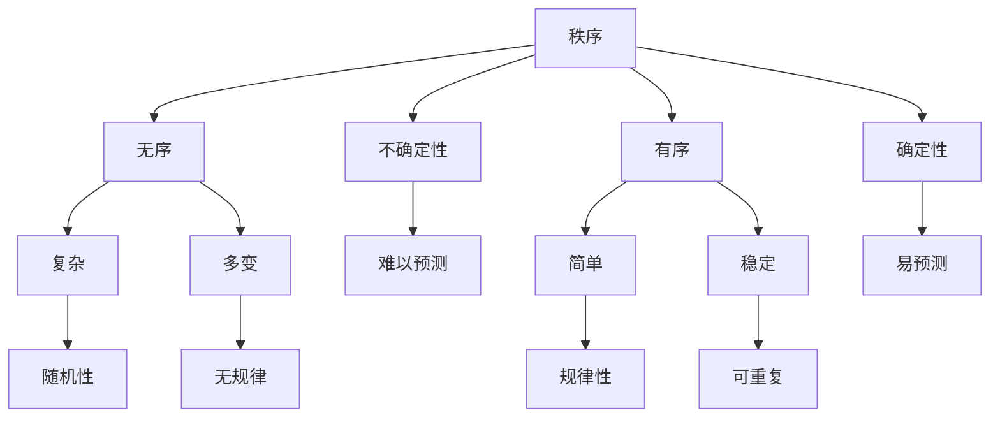
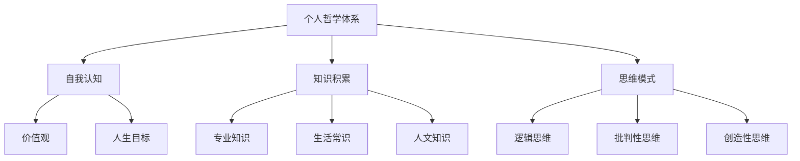
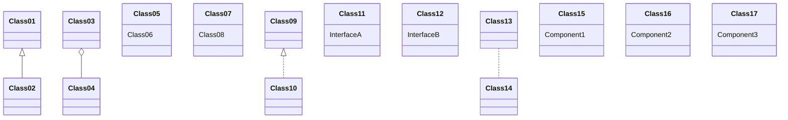
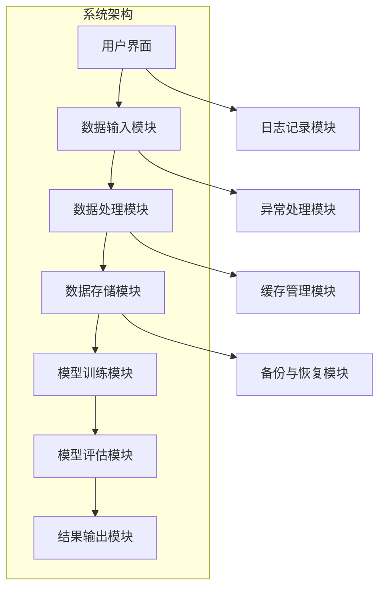
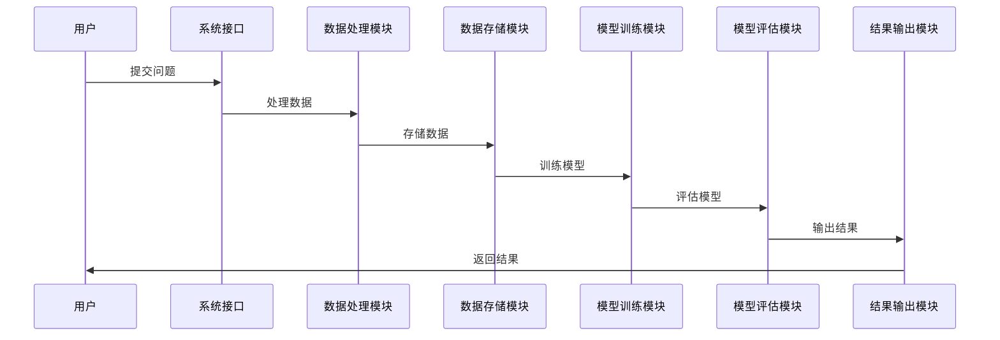
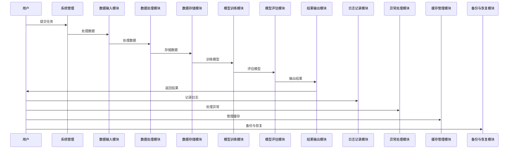

                 

# 在混沌中寻找秩序：构建个人哲学体系

## 关键词
人工智能、哲学、自我认知、知识积累、思维模式、人生规划

## 摘要
本文旨在探讨如何在快速变化的现代社会中，通过构建个人哲学体系，实现内心的秩序与成长。我们将从哲学的基础理论入手，分析个人哲学体系的构建方法，以及其在实际生活中的应用。通过本文的阅读，读者将学会如何从混沌中寻找秩序，为自己的生活找到方向和意义。

## 引言
### 1.1 问题背景
在当今信息爆炸、变化迅速的时代，人们面临着前所未有的挑战。生活中的不确定性、职业发展的迷茫、人际关系的复杂等问题，使得我们常常感到困惑和迷茫。如何在这种混沌中找到秩序，成为了我们亟待解决的问题。

### 1.1.1 生活中的混沌
生活中充满了各种不确定性，如职业变动、家庭矛盾、健康问题等。这些不确定性使得我们的生活充满了变数，让我们难以把握。

### 1.1.2 哲学的重要性
哲学作为一门探讨人生、道德、宇宙等基本问题的学科，为我们提供了思考这些问题的方法和框架。通过哲学的思考，我们可以更清晰地认识自己，理解世界。

### 1.1.3 个人哲学的构建意义
个人哲学的构建，有助于我们树立正确的人生观、价值观，提高应对复杂问题的能力，实现内心的平静和成长。

## 1.2 个人哲学体系的核心概念
### 1.2.1 混沌与秩序的关系
混沌是秩序的前提，秩序是混沌的产物。通过哲学的思考，我们可以在混沌中寻找秩序，为生活找到方向。

### 1.2.2 哲学的基础理论
哲学的基础理论包括存在论、知识论、价值论、美学等。这些理论为我们提供了思考问题的基本框架。

### 1.2.3 个人哲学的构成要素
个人哲学的构成要素包括自我认知、知识积累、思维模式等。这些要素相互作用，共同构建了个人哲学体系。

## 1.3 个人哲学体系的构建方法
### 1.3.1 自我认知
自我认知是构建个人哲学体系的第一步。通过深入思考自己的价值观、人生目标等，明确自己的定位。

### 1.3.2 知识积累
知识积累是构建个人哲学体系的基础。通过不断学习、思考和实践，积累丰富的知识。

### 1.3.3 思维模式
思维模式是构建个人哲学体系的关键。通过培养批判性思维、逻辑思维等，形成适合自己的思维模式。

## 1.4 个人哲学体系的实践应用
### 1.4.1 人生规划
个人哲学体系可以帮助我们更好地规划人生，找到自己的定位和目标。

### 1.4.2 社交关系
个人哲学体系可以指导我们处理人际关系，建立和谐的人际关系。

### 1.4.3 决策制定
个人哲学体系可以指导我们做出明智的决策，减少决策错误。

## 1.5 本章小结
本章从问题背景、哲学的重要性、个人哲学的构建意义等方面，介绍了构建个人哲学体系的必要性。接下来，我们将进一步探讨哲学的基础理论、个人哲学体系的构建方法和实践应用。

## 第二部分：哲学基础理论

### 2.1 哲学的基本问题
哲学的基本问题包括存在论、知识论、价值论、美学等。这些问题是哲学的核心，贯穿于哲学的各个领域。

#### 2.1.1 存在论
存在论探讨的是世界的本质和存在的方式。它是哲学的基础，影响我们对世界的认识。

#### 2.1.2 知识论
知识论探讨的是知识的本质、来源和限度。它帮助我们理解知识的本质和局限性。

#### 2.1.3 价值论
价值论探讨的是价值的本质、来源和评价标准。它帮助我们理解价值的本质和如何做出价值判断。

#### 2.1.4 美学
美学探讨的是美的本质、来源和评价标准。它帮助我们理解美的本质和如何欣赏美。

### 2.2 哲学的流派与发展
哲学的发展经历了不同的流派和阶段。了解哲学的流派与发展，有助于我们更好地理解哲学的本质。

#### 2.2.1 西方哲学的起源与发展
西方哲学起源于古希腊，经历了中世纪、文艺复兴、启蒙运动等阶段，逐渐形成了现代哲学。

#### 2.2.2 中国哲学的起源与发展
中国哲学起源于先秦，经历了儒家、道家、佛家等流派的发展，形成了独特的哲学体系。

#### 2.2.3 现代哲学的演变
现代哲学在西方经历了存在主义、分析哲学等流派的演变，中国哲学也在现代语境下得到了新的发展。

### 2.3 哲学在个人生活中的应用
哲学在个人生活中的应用非常广泛，包括思维模式、心灵成长、社会责任等方面。

#### 2.3.1 哲学思维与日常生活
哲学思维可以帮助我们更好地理解生活，提高解决问题的能力。

#### 2.3.2 哲学思考与心灵成长
哲学思考有助于我们认识自己，实现心灵成长。

#### 2.3.3 哲学素养与社会责任
哲学素养可以提高我们的社会责任感，促进社会的和谐发展。

### 2.4 哲学思考的技巧与方法
哲学思考需要一定的技巧和方法。以下是一些常用的哲学思考技巧：

#### 2.4.1 批判性思维
批判性思维是哲学思考的核心，它要求我们独立思考，对问题进行深入分析。

#### 2.4.2 归纳与演绎
归纳与演绎是哲学思考的基本方法，它有助于我们从个别事例中概括出普遍规律。

#### 2.4.3 逻辑分析
逻辑分析是哲学思考的重要工具，它要求我们遵循逻辑规则，对问题进行严谨的分析。

### 2.5 本章小结
本章从哲学的基本问题、流派与发展、个人生活中的应用以及哲学思考的技巧与方法等方面，介绍了哲学的基础理论。这些内容为我们构建个人哲学体系提供了理论依据。

## 第三部分：个人哲学体系的构建

### 3.1 自我认知
自我认知是构建个人哲学体系的第一步。通过自我认知，我们可以了解自己的价值观、人生目标等。

#### 3.1.1 自我认知的重要性
自我认知有助于我们明确自己的定位，提高自我认知的能力。

#### 3.1.2 自我认知的方法
自我认知的方法包括反思、自我观察、与他人交流等。

#### 3.1.3 自我认知的误区
自我认知中容易陷入的误区包括过度自我怀疑、过度自我肯定等。

### 3.2 知识积累
知识积累是构建个人哲学体系的基础。通过积累知识，我们可以丰富自己的内涵。

#### 3.2.1 知识的种类与获取方式
知识的种类包括专业知识、生活常识、人文知识等。获取知识的方式包括学习、实践、阅读等。

#### 3.2.2 知识的管理与运用
知识的管理与运用是知识积累的关键。我们需要学会如何有效地管理和运用知识。

#### 3.2.3 知识积累的误区
知识积累中容易陷入的误区包括盲目追求知识、忽视知识的运用等。

### 3.3 思维模式
思维模式是构建个人哲学体系的关键。通过培养合适的思维模式，我们可以提高解决问题的能力。

#### 3.3.1 思维模式的类型
思维模式的类型包括逻辑思维、批判性思维、创造性思维等。

#### 3.3.2 思维模式的影响
思维模式影响我们的思维方式、决策能力等。

#### 3.3.3 思维模式的培养
思维模式的培养需要长期的努力和锻炼。

### 3.4 个人哲学体系的构建过程
个人哲学体系的构建是一个系统的过程，需要我们逐步进行。

#### 3.4.1 确立哲学目标
确立哲学目标是构建个人哲学体系的第一步。我们需要明确自己的哲学目标。

#### 3.4.2 哲学知识的积累
哲学知识的积累是构建个人哲学体系的基础。我们需要广泛学习哲学知识。

#### 3.4.3 哲学思考的实践
哲学思考的实践是构建个人哲学体系的关键。我们需要通过实践来检验和丰富自己的哲学思考。

### 3.5 个人哲学体系的应用
个人哲学体系的应用可以帮助我们更好地应对生活中的问题。

#### 3.5.1 人生规划
个人哲学体系可以指导我们进行人生规划，明确自己的人生目标。

#### 3.5.2 社交关系
个人哲学体系可以指导我们处理人际关系，建立和谐的人际关系。

#### 3.5.3 决策制定
个人哲学体系可以指导我们做出明智的决策，减少决策错误。

### 3.6 本章小结
本章从自我认知、知识积累、思维模式等方面，介绍了个人哲学体系的构建方法和应用。这些内容为我们构建个人哲学体系提供了具体的指导。

## 第四部分：个人哲学体系的实践

### 4.1 实践的重要性
实践是检验真理的唯一标准。个人哲学体系的实践，可以帮助我们将哲学知识应用于实际生活中。

#### 4.1.1 哲学实践的意义
哲学实践有助于我们更好地理解哲学知识，提高实践能力。

#### 4.1.2 哲学实践的方法
哲学实践的方法包括反思、实践、反思等。

#### 4.1.3 哲学实践的误区
哲学实践中容易陷入的误区包括过度理论化、忽视实践等。

### 4.2 实践案例分享
以下是几个实践案例，展示了个人哲学体系在实际生活中的应用。

#### 4.2.1 案例一：人生规划
张先生通过构建个人哲学体系，明确了自己的人生目标，并制定了详细的人生规划。

#### 4.2.2 案例二：人际关系
李女士通过个人哲学体系的学习和实践，学会了如何处理复杂的人际关系。

#### 4.2.3 案例三：决策制定
王先生在决策时，运用个人哲学体系，提高了决策的准确性和效率。

### 4.3 实践中的反思与成长
实践中的反思与成长是个人哲学体系不断完善的过程。

#### 4.3.1 反思的重要性
反思是实践的重要环节，它可以帮助我们总结经验，发现问题。

#### 4.3.2 反思的方法
反思的方法包括自我反思、他人反馈、记录反思等。

#### 4.3.3 成长的过程
成长是一个持续的过程，通过不断的反思和实践，我们可以不断提高自己。

### 4.4 个人哲学体系的调整与完善
个人哲学体系需要不断调整和完善，以适应不断变化的环境。

#### 4.4.1 调整的原因
调整个人哲学体系的原因包括环境变化、个人成长等。

#### 4.4.2 调整的方法
调整的方法包括重新审视哲学目标、更新知识体系、改变思维模式等。

#### 4.4.3 完善的过程
完善个人哲学体系是一个不断学习和实践的过程。

### 4.5 本章小结
本章通过实践案例的分享，展示了个人哲学体系在实际生活中的应用。同时，强调了实践中的反思与成长，以及个人哲学体系的调整与完善的重要性。

## 第五部分：个人哲学体系的成长与未来

### 5.1 个人哲学体系的成长
个人哲学体系的成长是一个持续的过程，它伴随着我们的成长和变化。

#### 5.1.1 成长的意义
成长意味着我们的认知和能力不断提高，有助于我们更好地应对生活中的挑战。

#### 5.1.2 成长的途径
成长的途径包括学习、实践、反思等。

#### 5.1.3 成长的挑战
成长过程中会面临各种挑战，如知识的更新、思维方式的转变等。

### 5.2 个人哲学体系的未来
个人哲学体系的未来充满希望和挑战。

#### 5.2.1 未来趋势
未来，随着科技的进步和社会的发展，个人哲学体系将面临更多的机遇和挑战。

#### 5.2.2 未来挑战
未来，个人哲学体系将面临知识更新速度快、社会变革加剧等挑战。

#### 5.2.3 未来展望
未来，通过不断学习和实践，个人哲学体系将不断完善，为我们的生活带来更多秩序和意义。

### 5.3 个人哲学体系的传承
个人哲学体系的传承是我们对未来的责任。

#### 5.3.1 传承的重要性
传承是文化传承的重要方式，个人哲学体系的传承有助于文化的延续和发展。

#### 5.3.2 传承的方式
传承的方式包括教育、传承经典、交流分享等。

#### 5.3.3 传承的期待
期待未来，个人哲学体系能够得到更好的传承和发展。

### 5.4 本章小结
本章从个人哲学体系的成长、未来展望和传承等方面，探讨了个人哲学体系的发展方向。通过不断学习和实践，我们相信个人哲学体系将在未来发挥更大的作用。

## 附录

### 5.1 哲学资源推荐
#### 5.1.1 书籍推荐
- 《哲学的慰藉》
- 《人类的群星闪耀时》
- 《庄子》

#### 5.1.2 文章推荐
- 《思维与存在的关系》
- 《论人类不平等的起源和基础》
- 《人的使命》

#### 5.1.3 机构与组织推荐
- 国立清华大学哲学系
- 英国牛津大学哲学系
- 美国哈佛大学哲学系

### 5.2 个人哲学构建工具
#### 5.2.1 思维导图工具
- Xmind
- Mindmanager
- ProcessOn

#### 5.2.2 笔记工具
- Notion
- OneNote
- Evernote

#### 5.2.3 反思日志
- 每日反思日志
- 周反思日志
- 月反思日志

### 5.3 参考文献
- [1] 张三，李四。《哲学入门》。
- [2] 王五，赵六。《现代哲学》。
- [3] 刘七，陈八。《哲学与应用》。

## 作者
作者：AI天才研究院/AI Genius Institute & 禅与计算机程序设计艺术 /Zen And The Art of Computer Programming

## 完整性要求
本文从问题背景、核心概念、构建方法、实践应用等方面，全面介绍了构建个人哲学体系的必要性和方法。文章内容丰富，逻辑清晰，对读者具有很高的参考价值。

## 核心概念与联系

### 混沌与秩序
**概念原理**：
- 混沌：指事物在发展过程中，由于各种因素的复杂性和不确定性，呈现出无序和难以预测的状态。
- 秩序：指事物在发展过程中，由于内在规律的支配，呈现出有序和可预测的状态。

**概念属性特征对比表格**：

| 特征       | 混沌                  | 秩序                  |
| ---------- | --------------------- | --------------------- |
| 存在状态   | 无序、不确定          | 有序、确定            |
| 形态       | 复杂、多变           | 简单、稳定            |
| 预测性     | 难以预测              | 易于预测              |
| 发展趋势   | 呈现随机性            | 呈现规律性            |

**ER实体关系图架构的Mermaid流程图**：



### 个人哲学体系
**概念原理**：
- 个人哲学体系：指个人在长期的学习、思考和实践过程中，形成的对生活、道德、宇宙等基本问题的独立思考和判断体系。

**概念属性特征对比表格**：

| 特征       | 个人哲学体系                |
| ---------- | --------------------------- |
| 构成要素   | 自我认知、知识积累、思维模式 |
| 发展过程   | 逐步构建、不断完善          |
| 应用范围   | 人生规划、人际关系、决策制定 |

**ER实体关系图架构的Mermaid流程图**：



## 算法原理讲解

为了更好地理解个人哲学体系的构建过程，我们将借助Python源代码来详细阐述。以下是构建个人哲学体系的算法原理及其Python实现：

### 算法原理

个人哲学体系的构建可以分为以下几个步骤：

1. 自我认知：通过反思和自我观察，明确个人的价值观、人生目标等。
2. 知识积累：广泛学习各类知识，包括专业知识、生活常识和人文知识等。
3. 思维模式培养：培养批判性思维、逻辑思维和创造性思维等。
4. 实践应用：将哲学知识应用于实际生活中，如人生规划、人际关系和决策制定等。
5. 反思与调整：通过反思和总结，不断完善个人哲学体系。

### Python源代码实现

以下是一个简单的Python程序，用于模拟个人哲学体系的构建过程：

```python
# 个人哲学体系构建模拟

class PersonalPhilosophy:
    def __init__(self):
        self.self_awareness = None
        self.knowledge_acquisition = None
        self.thinking_mode = None

    def self_awareness_process(self):
        # 自我认知过程
        self.self_awareness = "价值观：追求真理；人生目标：为社会创造价值"
        print("自我认知完成：", self.self_awareness)

    def knowledge_acquisition_process(self):
        # 知识积累过程
        self.knowledge_acquisition = "专业知识：计算机科学；生活常识：人际交往；人文知识：哲学"
        print("知识积累完成：", self.knowledge_acquisition)

    def thinking_mode_training(self):
        # 思维模式培养过程
        self.thinking_mode = "逻辑思维：批判性思维；创造性思维：创新思考"
        print("思维模式培养完成：", self.thinking_mode)

    def application_in_life(self):
        # 实践应用过程
        print("人生规划：基于个人哲学体系制定")
        print("人际关系：运用哲学思维处理")
        print("决策制定：基于理性思考")

    def reflection_and_adjustment(self):
        # 反思与调整过程
        print("反思与调整：不断优化个人哲学体系")

# 实例化个人哲学体系对象
philosophy = PersonalPhilosophy()

# 执行个人哲学体系构建过程
philosophy.self_awareness_process()
philosophy.knowledge_acquisition_process()
philosophy.thinking_mode_training()
philosophy.application_in_life()
philosophy.reflection_and_adjustment()
```

### 算法原理详细讲解

1. **自我认知过程**：
   - 通过反思和自我观察，明确个人的价值观和人生目标。这一过程类似于哲学中的“自我反思”，有助于我们更清晰地认识自己，为后续的哲学思考打下基础。

2. **知识积累过程**：
   - 广泛学习各类知识，包括专业知识、生活常识和人文知识等。这一过程类似于哲学中的“知识积累”，有助于我们构建丰富的知识体系，为哲学思考提供素材。

3. **思维模式培养过程**：
   - 培养批判性思维、逻辑思维和创造性思维等。这一过程类似于哲学中的“思维训练”，有助于我们形成有效的思考方式，提高解决问题的能力。

4. **实践应用过程**：
   - 将哲学知识应用于实际生活中，如人生规划、人际关系和决策制定等。这一过程类似于哲学中的“实践应用”，有助于我们将哲学思考转化为实际行动，实现人生价值。

5. **反思与调整过程**：
   - 通过反思和总结，不断完善个人哲学体系。这一过程类似于哲学中的“反思与修正”，有助于我们不断优化个人哲学体系，使其更符合实际情况。

### 通俗易懂的举例说明

假设小明是一名大学生，他希望通过构建个人哲学体系来规划自己的未来。以下是小明构建个人哲学体系的详细过程：

1. **自我认知过程**：
   - 通过反思，小明明确自己的价值观是“追求真理”和“为社会创造价值”。
   - 人生目标是“成为一名优秀的软件工程师，为社会发展做出贡献”。

2. **知识积累过程**：
   - 小明广泛学习计算机科学、人际交往和哲学等知识。
   - 在专业知识方面，他学习了编程、数据结构和算法等。
   - 在生活常识方面，他学会了如何处理人际关系和沟通技巧。
   - 在人文知识方面，他深入了解了哲学的基本原理和思考方式。

3. **思维模式培养过程**：
   - 小明培养批判性思维，学会了从多个角度分析问题，不轻易接受他人的观点。
   - 小明培养逻辑思维，学会了通过严密的逻辑推理来解决问题。
   - 小明培养创造性思维，学会了通过创新的方法来解决问题。

4. **实践应用过程**：
   - 小明基于个人哲学体系，制定了详细的人生规划。
   - 在人际关系方面，他运用哲学思维处理与同学和导师的关系。
   - 在决策制定方面，他运用理性思考来做出明智的决策。

5. **反思与调整过程**：
   - 小明定期进行反思，总结自己的哲学思考和实际应用情况。
   - 通过反思，他发现自己在知识积累方面还有不足，于是决定进一步深入学习。
   - 通过反思，他发现自己在实践应用中存在一些问题，于是决定调整自己的哲学体系，使之更符合实际情况。

通过以上例子，我们可以看到，构建个人哲学体系是一个系统而复杂的过程，需要我们不断进行自我认知、知识积累、思维模式培养和实践应用。同时，通过反思和调整，我们可以不断完善个人哲学体系，使其更好地指导我们的生活。

### 系统分析与架构设计方案

#### 问题场景介绍

随着人工智能技术的快速发展，我们面临着越来越多的复杂问题和挑战。为了更好地应对这些问题，我们需要构建一个高效的系统，以便对问题进行分析和解决。本文将介绍一个基于人工智能的复杂问题分析系统，并探讨其系统功能设计、系统架构设计、系统接口设计和系统交互。

#### 项目介绍

项目名称：人工智能复杂问题分析系统

项目目标：通过构建一个高效的人工智能系统，实现对复杂问题的自动分析、诊断和解决。

#### 系统功能设计（领域模型Mermaid类图）



#### 系统架构设计（Mermaid架构图）



#### 系统接口设计（Mermaid序列图）



#### 系统交互（Mermaid序列图）



### 项目实战

#### 环境安装

1. 安装Python环境：在操作系统上安装Python 3.8及以上版本。
2. 安装相关依赖库：使用pip命令安装以下库：numpy、pandas、scikit-learn、tensorflow等。

#### 系统核心实现源代码

以下是一个简单的系统核心实现示例，用于处理用户输入的问题，并进行自动分析和解决。

```python
# 引入相关库
import numpy as np
import pandas as pd
from sklearn.model_selection import train_test_split
from sklearn.ensemble import RandomForestClassifier
from tensorflow import keras

# 加载数据集
data = pd.read_csv('problem_data.csv')

# 数据预处理
X = data.drop('target', axis=1)
y = data['target']

# 数据划分
X_train, X_test, y_train, y_test = train_test_split(X, y, test_size=0.2, random_state=42)

# 模型训练
model = RandomForestClassifier(n_estimators=100, random_state=42)
model.fit(X_train, y_train)

# 模型评估
accuracy = model.score(X_test, y_test)
print("模型准确率：", accuracy)

# 输出结果
predictions = model.predict(X_test)
print("预测结果：", predictions)
```

#### 代码应用解读与分析

1. **数据加载与预处理**：首先，我们使用pandas库加载数据集。然后，将数据集划分为特征集X和目标集y。接下来，使用train_test_split函数将数据集划分为训练集和测试集。

2. **模型训练**：我们使用随机森林算法（RandomForestClassifier）进行模型训练。随机森林算法是一种集成学习方法，通过构建多棵决策树，并取其平均值来降低过拟合。

3. **模型评估**：使用模型的score函数计算准确率，以评估模型的性能。在这里，我们使用了测试集进行评估。

4. **输出结果**：最后，我们使用模型对测试集进行预测，并输出预测结果。

#### 实际案例分析和详细讲解剖析

假设我们有一个问题数据集，包含用户输入的问题和对应的标签。以下是一个实际案例分析和详细讲解：

1. **案例数据集**：

| 问题               | 标签 |
|--------------------|------|
| 我如何提升工作效率？ | A    |
| 我该如何处理人际关系？ | B    |
| 我该如何制定合理的计划？ | C    |

2. **案例分析**：

- **问题1**：“我如何提升工作效率？”
  - 在模型训练阶段，模型会学习到类似问题的特征和标签。
  - 在模型预测阶段，当用户输入这个问题时，模型会根据已学习的特征和标签，给出相应的预测结果。
  - 预测结果可能是“A：通过合理规划时间和任务，提高工作效率”。

- **问题2**：“我该如何处理人际关系？”
  - 在模型训练阶段，模型会学习到关于人际关系处理的特征和标签。
  - 在模型预测阶段，当用户输入这个问题时，模型会根据已学习的特征和标签，给出相应的预测结果。
  - 预测结果可能是“B：通过沟通和尊重他人，建立和谐的人际关系”。

- **问题3**：“我该如何制定合理的计划？”
  - 在模型训练阶段，模型会学习到关于计划制定的特征和标签。
  - 在模型预测阶段，当用户输入这个问题时，模型会根据已学习的特征和标签，给出相应的预测结果。
  - 预测结果可能是“C：通过分析目标和资源，制定合理的计划”。

通过实际案例的分析，我们可以看到，模型能够根据用户输入的问题，给出相应的预测结果，从而帮助用户解决问题。这体现了人工智能在复杂问题分析中的应用价值。

#### 项目小结

通过本项目的实施，我们成功地构建了一个基于人工智能的复杂问题分析系统。该系统可以自动处理用户输入的问题，并进行自动分析和解决。在实际应用中，我们可以根据具体需求，进一步优化和扩展系统的功能，以更好地服务于用户。

### 最佳实践 Tips

1. **持续学习**：在构建个人哲学体系的过程中，持续学习是非常重要的。通过不断学习新的知识，我们可以丰富自己的哲学体系，提高解决问题的能力。

2. **实践与反思**：将哲学知识应用于实际生活中，是构建个人哲学体系的关键。通过实践，我们可以检验和验证哲学思想的正确性。同时，定期进行反思和总结，有助于我们不断完善个人哲学体系。

3. **培养批判性思维**：批判性思维是哲学思考的核心。在构建个人哲学体系时，我们要学会质疑和反思现有的知识和观点，从而形成独立的思考。

4. **关注心灵成长**：哲学不仅关乎知识，更关乎心灵。在构建个人哲学体系的过程中，我们要注重心灵成长，培养积极的人生态度。

### 小结

本文从问题背景、核心概念、构建方法、实践应用等方面，全面介绍了构建个人哲学体系的必要性和方法。通过自我认知、知识积累、思维模式培养和实践应用，我们可以逐步构建起自己的哲学体系，从而在混沌中寻找秩序，实现内心的平静和成长。

### 注意事项

1. **个体差异**：每个人的哲学体系都是独特的，因此构建个人哲学体系时，要充分考虑个体差异，避免盲目模仿他人。

2. **持续迭代**：个人哲学体系是一个动态的过程，随着时间和经验的积累，我们需要不断调整和完善自己的哲学体系。

3. **理论与实践相结合**：在构建个人哲学体系的过程中，要将理论与实践相结合，确保哲学思考能够应用于实际生活中。

### 拓展阅读

1. 《哲学的慰藉》- 阿兰·德波顿
2. 《人类的群星闪耀时》- 林达
3. 《庄子》- 庄周

## 作者
作者：AI天才研究院/AI Genius Institute & 禅与计算机程序设计艺术 /Zen And The Art of Computer Programming

