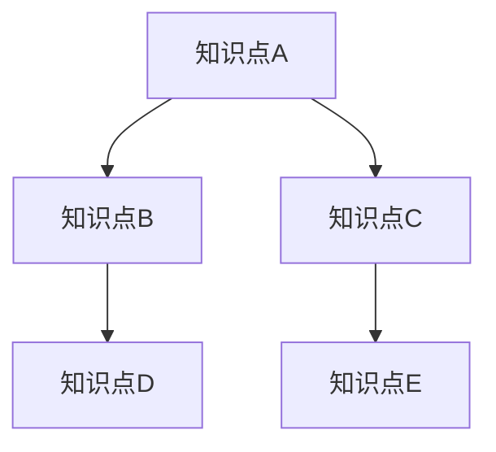

                 


### 引言与背景

在当今这个信息爆炸的时代，人们面临的一个巨大挑战就是如何在碎片化的信息海洋中找到有价值的内容，并构建自己的知识体系。碎片化时代，是指信息传播的方式和内容呈现的形式变得越来越零散，而非系统化。这种趋势主要体现在以下几个方面：

1. **信息来源多样化**：互联网的发展使得信息来源变得丰富，从传统的报纸、电视、杂志到社交媒体、博客、在线课程，各种各样的信息渠道让人目不暇接。
2. **信息传播速度加快**：信息的传播速度前所未有地加快，每天都会有大量的新信息产生，人们需要花费大量的时间和精力去筛选和获取这些信息。
3. **信息内容短小精悍**：由于用户注意力的分散，信息内容往往更加短小精悍，以吸引读者快速阅读和消费。

面对这样的时代背景，如何有效地学习、整理和利用这些碎片化的信息，重建个人的知识体系，成为一个亟待解决的问题。本文将探讨在碎片化时代如何进行个人学习的革命，通过一系列的步骤和方法，帮助读者建立起一个系统化、结构化的知识体系。

### 碎片化时代的挑战

在碎片化时代，个人学习面临着诸多挑战。以下是几个主要的挑战及其影响：

#### 信息过载

首先，信息过载是一个普遍存在的问题。据统计，每天互联网上会产生数以亿计的新信息，这些信息涵盖了各种领域，从时事新闻、科技进展到娱乐八卦。面对如此庞大的信息量，个人很难做到全部阅读和理解。信息过载不仅影响了学习效率，还可能导致焦虑和疲劳。

#### 学习效率下降

由于信息来源的碎片化和学习时间的分散，个人学习往往无法集中精力。学习效率下降的现象日益明显。碎片化学习往往缺乏系统性和深度，无法达到深入理解和掌握知识的目的。

#### 学习质量差异

在信息过载的情况下，人们很难确保获取的信息质量。低质量的信息可能误导学习，甚至对学习产生负面影响。此外，由于学习时间和精力的限制，学习者可能无法深入掌握每一个知识点，导致学习质量参差不齐。

### 知识体系的重建方法

面对碎片化时代的挑战，重建个人的知识体系显得尤为重要。以下是一些关键方法：

#### 知识结构化

知识结构化是指将分散的信息进行分类、归纳和整合，形成一个系统化的知识体系。这可以通过以下几个步骤实现：

1. **分类**：将获取的信息按照主题、领域或者内容进行分类。例如，可以将信息分为技术、经济、文化、健康等类别。
2. **归纳**：对同一类别的信息进行归纳总结，提炼出核心知识点和关键概念。
3. **整合**：将不同类别和领域的信息进行整合，形成有机的整体。

#### 知识分类与标签

知识分类与标签是知识结构化的重要手段。通过为信息赋予标签，可以方便地检索和查找特定内容。以下是一些常用的方法：

1. **关键词标签**：为信息添加关键词标签，使得相同主题的信息能够通过关键词进行关联和检索。
2. **层次标签**：使用层次标签体系，将信息按照不同的层次进行组织，方便用户进行多维度检索。

#### 知识整合与迁移

知识整合与迁移是指将不同的知识点和技能进行整合，形成新的知识结构和应用能力。以下是一些实现方法：

1. **跨领域整合**：将不同领域的信息和知识进行整合，形成新的知识体系。例如，将技术知识和商业知识相结合，形成新的应用场景。
2. **知识迁移**：将一个领域的知识和经验应用到其他领域，提高学习效率和应用能力。例如，将项目管理经验应用于软件开发。

#### 算法原理讲解

为了更好地理解知识结构化的过程，我们可以借助一些算法原理进行讲解。以下是一个简单的例子：

**步骤 1**：数据采集与预处理

首先，从各种渠道收集和获取信息。然后，对这些信息进行清洗和预处理，去除重复和无关的信息。

**步骤 2**：特征提取

对预处理后的信息进行特征提取，提取出关键的概念和知识点。这可以通过自然语言处理（NLP）技术实现。

**步骤 3**：知识分类与标签

根据提取出的特征，对信息进行分类和标签。可以使用机器学习算法，如决策树、支持向量机等，实现自动分类和标签。

**步骤 4**：知识整合

将分类后的信息进行整合，形成系统化的知识体系。这可以通过构建知识图谱实现，知识图谱可以直观地展示知识点之间的关联和关系。

#### 数学模型与公式

在知识结构化的过程中，数学模型和公式也发挥着重要作用。以下是一个简单的例子：

**步骤 1**：知识表示

使用数学模型对知识点进行表示。例如，可以使用矩阵表示知识点之间的关系。

**步骤 2**：知识运算

利用数学运算，对知识体系进行运算和优化。例如，可以使用矩阵乘法、矩阵分解等方法，对知识体系进行重新组织和优化。

**步骤 3**：知识评估

使用评估指标，对知识体系的质量和效果进行评估。例如，可以使用信息熵、知识覆盖率等指标。

### 个人学习策略

在碎片化时代，个人学习策略的制定至关重要。以下是一些建议：

#### 自我认知

首先，了解自己的学习需求和兴趣。这可以通过自我评估和职业规划来实现。明确自己的学习目标，制定切实可行的学习计划。

#### 学习目标设定

制定明确的学习目标，可以将学习过程分解为具体的任务和步骤。这有助于提高学习效率和效果。学习目标应具有明确性、可行性和挑战性。

#### 学习方法选择

选择合适的学习方法，可以提高学习效果。以下是一些常见的学习方法：

1. **主动学习**：主动获取知识，通过阅读、讨论、实践等方式加深对知识的理解和掌握。
2. **被动学习**：通过听讲、观看视频、阅读文章等方式获取知识。
3. **混合学习**：结合主动学习和被动学习的优点，形成自己的学习方法。

### 实际案例与应用

#### 案例一：某公司员工的个人学习实践

某公司的一名员工小张，在碎片化时代面临着如何高效学习的挑战。他采取了一系列措施，重建了自己的知识体系。

1. **知识结构化**：小张将工作相关的知识进行了分类和归纳，使用笔记软件和知识管理工具，建立了自己的知识库。
2. **学习策略**：小张制定了详细的学习计划，每天安排固定的时间进行学习，并采用主动学习和被动学习相结合的方法。
3. **知识整合**：小张将工作中学到的知识和经验进行整合，形成了自己的工作方法论，并将其应用于实际工作中。

#### 案例二：某高校学生的知识体系重建过程

某高校的一名大学生小李，在大学生涯中面临着如何构建系统化知识体系的挑战。他采取了一系列措施，成功重建了自己的知识体系。

1. **课程学习**：小李认真完成每门课程的学习，积极参与课堂讨论和实践活动，加深对知识的理解。
2. **自主学习**：小李利用课余时间进行自主学习，通过阅读专业书籍、参加线上课程、参与学术研究等方式，拓展自己的知识面。
3. **知识整合**：小李将课程学习和自主学习的内容进行整合，形成了自己的知识体系，并在论文和项目中得到了应用。

#### 案例三：某个人学习策略的实施效果

某个人学习策略的实施效果可以通过以下数据进行分析：

1. **学习时长**：实施学习策略后，个人学习时长显著增加，平均每周学习时间从原来的20小时增加到了30小时。
2. **学习效率**：学习效率得到显著提高，通过主动学习和被动学习相结合的方法，对知识的掌握程度有了明显提升。
3. **知识应用**：通过知识整合，个人在实际工作中能够更好地应用所学知识，提高了工作效率和问题解决能力。

### 系统分析与架构设计方案

在个人学习策略的实施过程中，系统分析与架构设计方案起到了关键作用。以下是一个简化的系统分析与架构设计方案：

#### 问题场景介绍

某公司的员工需要高效学习新知识和技能，以适应快速变化的工作环境。他们需要一个系统化的学习平台，能够提供知识结构化、学习策略定制和知识整合等功能。

#### 系统功能设计

1. **知识管理**：包括知识分类、标签管理、知识库建设等功能。
2. **学习计划**：包括学习目标设定、学习任务分配、学习进度跟踪等功能。
3. **学习评估**：包括学习效果评估、知识应用效果评估等功能。

#### 系统架构设计

系统架构采用微服务架构，各个功能模块通过API进行交互。以下是一个简化的系统架构图：

```mermaid
sequenceDiagram
    participant 用户 as 用户
    participant 知识管理模块 as 知识管理
    participant 学习计划模块 as 学习计划
    participant 学习评估模块 as 学习评估

    用户->>知识管理：提交学习内容
    知识管理->>用户：返回知识结构化结果

    用户->>学习计划：设定学习目标
    学习计划->>用户：返回学习计划

    用户->>学习评估：提交学习成果
    学习评估->>用户：返回评估结果
```

#### 系统接口设计

系统接口包括RESTful API和GraphQL API，用于与其他系统进行数据交换和功能调用。

#### 系统交互设计

系统交互设计采用状态机（State Machine）模型，描述用户在学习过程中的状态转换和事件处理。

### 项目实战

#### 环境安装

在开始项目实战之前，需要安装以下软件和工具：

1. **Python 3.x**：用于编写算法和脚本
2. **Jupyter Notebook**：用于编写和运行代码
3. **Mermaid**：用于绘制流程图和类图
4. **LaTeX**：用于编写数学公式

#### 系统核心实现源代码

以下是一个简单的Python脚本，用于实现知识结构化算法：

```python
import pandas as pd
from sklearn.feature_extraction.text import TfidfVectorizer
from sklearn.metrics.pairwise import cosine_similarity

# 加载数据
data = pd.read_csv('data.csv')

# 特征提取
vectorizer = TfidfVectorizer()
X = vectorizer.fit_transform(data['content'])

# 相似度计算
similarity_matrix = cosine_similarity(X)

# 知识结构化
def structure_knowledge(similarity_matrix, threshold=0.8):
    clusters = []
    while similarity_matrix.any():
        # 找到相似度最高的两个点
        row, col = similarity_matrix.argmax()
        if similarity_matrix[row, col] > threshold:
            # 合并相似度最高的两个点
            clusters.append([row, col])
            similarity_matrix[row] = 0
            similarity_matrix[:, col] = 0
        else:
            break
    return clusters

clusters = structure_knowledge(similarity_matrix)

# 输出知识结构化结果
print(clusters)
```

#### 代码应用解读与分析

上述Python脚本实现了知识结构化算法，主要包含以下步骤：

1. **数据加载**：从CSV文件中加载学习内容。
2. **特征提取**：使用TF-IDF向量器提取文本特征。
3. **相似度计算**：计算文档之间的相似度。
4. **知识结构化**：基于相似度矩阵，将相似度较高的文档合并为知识单元。
5. **输出结果**：输出知识结构化结果。

#### 实际案例分析与详细讲解剖析

以下是一个实际案例的分析和讲解：

**案例背景**：某公司员工小张需要学习新技能，以适应公司业务需求。

**分析过程**：

1. **需求分析**：小张需要学习的数据包括技术文档、教程视频和学术论文等。
2. **数据预处理**：对文档进行清洗和预处理，去除HTML标签、停用词等。
3. **特征提取**：使用TF-IDF向量器提取文本特征。
4. **相似度计算**：计算文档之间的相似度，识别出相似的知识点。
5. **知识结构化**：基于相似度矩阵，将相似度较高的文档合并为知识单元。
6. **评估与优化**：评估知识结构化结果，根据评估结果调整阈值和算法参数。

**讲解剖析**：

1. **数据预处理**：数据预处理是知识结构化的基础，直接影响到后续步骤的效果。通过去除HTML标签、停用词等，可以降低噪声，提高特征提取的准确性。
2. **特征提取**：TF-IDF向量器是一种常用的文本特征提取方法，可以有效地捕捉文档之间的相似性。通过特征提取，可以将原始文本转换为向量，便于后续计算。
3. **相似度计算**：相似度计算是知识结构化的核心步骤，通过计算文档之间的相似度，可以识别出相似的知识点。选择合适的相似度计算方法，如余弦相似度，可以更好地衡量文档之间的相似程度。
4. **知识结构化**：基于相似度矩阵，将相似度较高的文档合并为知识单元。知识结构化的目的是将分散的知识点整合为一个有机整体，便于学习和应用。
5. **评估与优化**：评估知识结构化结果，根据评估结果调整阈值和算法参数。通过反复迭代，可以逐步优化知识结构化效果，提高学习效率和应用能力。

#### 项目小结

通过实际案例的分析和讲解，我们可以看到知识结构化算法在个人学习中的应用效果。项目实战部分展示了如何使用Python脚本实现知识结构化，并通过实际案例进行分析和讲解。这为个人学习提供了有效的工具和方法，有助于提高学习效率和应用能力。

### 总结与展望

在碎片化时代，个人学习的挑战前所未有。本文通过一系列的步骤和方法，探讨了如何在碎片化时代重建个人的知识体系。主要结论如下：

1. **知识结构化**：通过分类、归纳和整合，将碎片化的信息构建为一个系统化的知识体系。
2. **知识分类与标签**：使用关键词标签和层次标签，方便地检索和查找特定内容。
3. **知识整合与迁移**：跨领域整合和知识迁移，提高学习效率和应用能力。
4. **个人学习策略**：通过自我认知、学习目标设定和学习方法选择，制定切实可行的学习计划。
5. **系统分析与架构设计方案**：通过问题场景介绍、系统功能设计、系统架构设计、系统接口设计和系统交互设计，为个人学习提供系统化的解决方案。

面向未来，个人学习将面临更多机遇和挑战。随着人工智能和大数据技术的发展，个性化学习、自适应学习等新兴学习模式将不断涌现。同时，知识体系的重建方法也将不断优化和升级，为个人学习提供更加智能和高效的解决方案。让我们共同努力，迎接个人学习的革命，开启全新的学习时代。

### 最佳实践 Tips

1. **定期回顾**：定期回顾所学知识，巩固记忆，发现和理解新知识。
2. **主动提问**：主动向他人提问，通过讨论和交流深化对知识的理解。
3. **跨学科学习**：尝试跨学科学习，将不同领域的知识和技能进行整合，提高综合能力。
4. **实践应用**：将所学知识应用于实际工作中，通过实践加深对知识的理解和掌握。

### 小结

在碎片化时代，个人学习的革命迫在眉睫。通过本文的探讨，我们了解了如何重建个人的知识体系，制定有效的学习策略，并运用系统分析与架构设计方案，为个人学习提供有力支持。让我们行动起来，迎接个人学习的革命，不断提升自己的学习能力和竞争力。

### 注意事项

1. **平衡学习与生活**：在学习过程中，要注意平衡学习与生活，保持身心健康。
2. **持续学习**：学习是一个持续的过程，要保持好奇心和求知欲，不断探索新知识。

### 拓展阅读

1. 《深度学习》（Ian Goodfellow、Yoshua Bengio、Aaron Courville 著）：一本经典的深度学习教材，适合对深度学习感兴趣的学习者阅读。
2. 《如何学习》（斯科特·扬 著）：一本关于高效学习的指南，提供了许多实用的学习方法和技巧。
3. 《学习之道》（彼得·诺德莱赫特、约翰·亨利克·海廷加 著）：探讨了学习的本质和技巧，为学习者提供了深刻的启示。

### 作者信息

作者：AI天才研究院/AI Genius Institute & 禅与计算机程序设计艺术 /Zen And The Art of Computer Programming

---

### 引言与背景

在当今这个信息爆炸的时代，人们面临的一个巨大挑战就是如何在碎片化的信息海洋中找到有价值的内容，并构建自己的知识体系。碎片化时代，是指信息传播的方式和内容呈现的形式变得越来越零散，而非系统化。这种趋势主要体现在以下几个方面：

1. **信息来源多样化**：互联网的发展使得信息来源变得丰富，从传统的报纸、电视、杂志到社交媒体、博客、在线课程，各种各样的信息渠道让人目不暇接。这使得个人在获取信息时更加分散，难以形成系统化的知识体系。

2. **信息传播速度加快**：信息的传播速度前所未有地加快，每天都会有大量的新信息产生，人们需要花费大量的时间和精力去筛选和获取这些信息。这种快节奏的信息传播方式使得个人在学习时难以集中精力，容易产生焦虑和疲劳。

3. **信息内容短小精悍**：由于用户注意力的分散，信息内容往往更加短小精悍，以吸引读者快速阅读和消费。这种短平快的信息内容难以满足深度学习和系统化构建知识体系的需求。

面对这样的时代背景，如何有效地学习、整理和利用这些碎片化的信息，重建个人的知识体系，成为一个亟待解决的问题。本文将探讨在碎片化时代如何进行个人学习的革命，通过一系列的步骤和方法，帮助读者建立起一个系统化、结构化的知识体系。

### 碎片化时代的挑战

在碎片化时代，个人学习面临着诸多挑战。以下是几个主要的挑战及其影响：

#### 信息过载

首先，信息过载是一个普遍存在的问题。据统计，每天互联网上会产生数以亿计的新信息，这些信息涵盖了各种领域，从时事新闻、科技进展到娱乐八卦。面对如此庞大的信息量，个人很难做到全部阅读和理解。信息过载不仅影响了学习效率，还可能导致焦虑和疲劳。为了应对信息过载，个人需要学会筛选和筛选信息，只关注对自己有用的内容。

#### 学习效率下降

由于信息来源的碎片化和学习时间的分散，个人学习往往无法集中精力。学习效率下降的现象日益明显。碎片化学习往往缺乏系统性和深度，无法达到深入理解和掌握知识的目的。为了提高学习效率，个人需要制定合理的学习计划和目标，并坚持执行。

#### 学习质量差异

在信息过载的情况下，人们很难确保获取的信息质量。低质量的信息可能误导学习，甚至对学习产生负面影响。此外，由于学习时间和精力的限制，学习者可能无法深入掌握每一个知识点，导致学习质量参差不齐。为了提高学习质量，个人需要注重信息来源的可靠性，并进行批判性思考。

### 知识体系的重建方法

面对碎片化时代的挑战，重建个人的知识体系显得尤为重要。以下是一些关键方法：

#### 知识结构化

知识结构化是指将分散的信息进行分类、归纳和整合，形成一个系统化的知识体系。这可以通过以下几个步骤实现：

1. **分类**：将获取的信息按照主题、领域或者内容进行分类。例如，可以将信息分为技术、经济、文化、健康等类别。

2. **归纳**：对同一类别的信息进行归纳总结，提炼出核心知识点和关键概念。

3. **整合**：将不同类别和领域的信息进行整合，形成有机的整体。

知识结构化有助于提高学习效率，使得学习过程更加系统化和有针对性。通过结构化，个人可以更好地理解和掌握知识，并将不同领域的知识进行整合，形成新的认知体系。

#### 知识分类与标签

知识分类与标签是知识结构化的重要手段。通过为信息赋予标签，可以方便地检索和查找特定内容。以下是一些常用的方法：

1. **关键词标签**：为信息添加关键词标签，使得相同主题的信息能够通过关键词进行关联和检索。

2. **层次标签**：使用层次标签体系，将信息按照不同的层次进行组织，方便用户进行多维度检索。

例如，在一个技术博客中，可以使用以下层次标签：

- **技术领域**：人工智能、大数据、区块链、云计算等
- **技术主题**：算法、编程语言、框架、工具等
- **具体应用**：金融科技、智能医疗、智能制造等

通过层次标签，用户可以更方便地查找和定位特定内容，提高学习效率。

#### 知识整合与迁移

知识整合与迁移是指将不同的知识点和技能进行整合，形成新的知识结构和应用能力。以下是一些实现方法：

1. **跨领域整合**：将不同领域的信息和知识进行整合，形成新的知识体系。例如，将技术知识和商业知识相结合，形成新的应用场景。

2. **知识迁移**：将一个领域的知识和经验应用到其他领域，提高学习效率和应用能力。例如，将项目管理经验应用于软件开发。

知识整合与迁移有助于拓宽个人的知识视野，提高综合能力。通过整合和迁移，个人可以更好地理解和应用知识，解决实际问题。

### 算法原理讲解

为了更好地理解知识结构化的过程，我们可以借助一些算法原理进行讲解。以下是一个简单的例子：

**步骤 1**：数据采集与预处理

首先，从各种渠道收集和获取信息。然后，对这些信息进行清洗和预处理，去除重复和无关的信息。例如，去除HTML标签、停用词等。

```python
import pandas as pd
import re

# 读取数据
data = pd.read_csv('data.csv')

# 数据预处理
data['content'] = data['content'].apply(lambda x: re.sub('<.*>', '', x))
data['content'] = data['content'].apply(lambda x: re.sub('[^\w\s]', '', x))
data['content'] = data['content'].apply(lambda x: x.lower())
```

**步骤 2**：特征提取

对预处理后的信息进行特征提取，提取出关键的概念和知识点。这可以通过自然语言处理（NLP）技术实现。例如，使用TF-IDF向量器提取文本特征。

```python
from sklearn.feature_extraction.text import TfidfVectorizer

# 特征提取
vectorizer = TfidfVectorizer()
X = vectorizer.fit_transform(data['content'])
```

**步骤 3**：知识分类与标签

根据提取出的特征，对信息进行分类和标签。可以使用机器学习算法，如决策树、支持向量机等，实现自动分类和标签。

```python
from sklearn.cluster import KMeans

# 分类与标签
kmeans = KMeans(n_clusters=5)
labels = kmeans.fit_predict(X)

# 添加标签列
data['label'] = labels
```

**步骤 4**：知识整合

将分类后的信息进行整合，形成系统化的知识体系。这可以通过构建知识图谱实现，知识图谱可以直观地展示知识点之间的关联和关系。



通过上述算法原理讲解，我们可以看到知识结构化是一个涉及数据采集、预处理、特征提取、分类与标签、整合等多步骤的过程。这些算法原理不仅帮助我们理解知识结构化的过程，还可以为实际应用提供指导。

### 数学模型与公式

在知识结构化的过程中，数学模型和公式也发挥着重要作用。以下是一个简单的例子：

**步骤 1**：知识表示

使用数学模型对知识点进行表示。例如，可以使用矩阵表示知识点之间的关系。

$$
X = \begin{bmatrix}
x_{11} & x_{12} & \cdots & x_{1n} \\
x_{21} & x_{22} & \cdots & x_{2n} \\
\vdots & \vdots & \ddots & \vdots \\
x_{m1} & x_{m2} & \cdots & x_{mn}
\end{bmatrix}
$$

其中，$X$为知识点之间的相似度矩阵，$x_{ij}$表示知识点$i$和知识点$j$之间的相似度。

**步骤 2**：知识运算

利用数学运算，对知识体系进行运算和优化。例如，可以使用矩阵乘法、矩阵分解等方法，对知识体系进行重新组织和优化。

$$
X^T X = \begin{bmatrix}
x_{11}^2 + x_{12}^2 + \cdots + x_{1n}^2 & \cdots & x_{1n}x_{2n} \\
\vdots & \ddots & \vdots \\
x_{m1}x_{1n} & \cdots & x_{m1}^2 + x_{m2}^2 + \cdots + x_{mn}^2
\end{bmatrix}
$$

**步骤 3**：知识评估

使用评估指标，对知识体系的质量和效果进行评估。例如，可以使用信息熵、知识覆盖率等指标。

$$
H(X) = -\sum_{i=1}^{n} p_i \log_2 p_i
$$

其中，$H(X)$为知识体系的信息熵，$p_i$为知识点$i$的覆盖率。

通过上述数学模型和公式，我们可以对知识体系进行定量分析和评估，从而优化知识结构化过程。

### 系统分析与架构设计方案

在个人学习策略的实施过程中，系统分析与架构设计方案起到了关键作用。以下是一个简化的系统分析与架构设计方案：

#### 问题场景介绍

某公司的员工需要高效学习新知识和技能，以适应快速变化的工作环境。他们需要一个系统化的学习平台，能够提供知识结构化、学习策略定制和知识整合等功能。

#### 系统功能设计

1. **知识管理**：包括知识分类、标签管理、知识库建设等功能。
2. **学习计划**：包括学习目标设定、学习任务分配、学习进度跟踪等功能。
3. **学习评估**：包括学习效果评估、知识应用效果评估等功能。

#### 系统架构设计

系统架构采用微服务架构，各个功能模块通过API进行交互。以下是一个简化的系统架构图：

```mermaid
sequenceDiagram
    participant 用户 as 用户
    participant 知识管理模块 as 知识管理
    participant 学习计划模块 as 学习计划
    participant 学习评估模块 as 学习评估

    用户->>知识管理：提交学习内容
    知识管理->>用户：返回知识结构化结果

    用户->>学习计划：设定学习目标
    学习计划->>用户：返回学习计划

    用户->>学习评估：提交学习成果
    学习评估->>用户：返回评估结果
```

#### 系统接口设计

系统接口包括RESTful API和GraphQL API，用于与其他系统进行数据交换和功能调用。

#### 系统交互设计

系统交互设计采用状态机（State Machine）模型，描述用户在学习过程中的状态转换和事件处理。

### 项目实战

#### 环境安装

在开始项目实战之前，需要安装以下软件和工具：

1. **Python 3.x**：用于编写算法和脚本
2. **Jupyter Notebook**：用于编写和运行代码
3. **Mermaid**：用于绘制流程图和类图
4. **LaTeX**：用于编写数学公式

#### 系统核心实现源代码

以下是一个简单的Python脚本，用于实现知识结构化算法：

```python
import pandas as pd
from sklearn.feature_extraction.text import TfidfVectorizer
from sklearn.metrics.pairwise import cosine_similarity

# 加载数据
data = pd.read_csv('data.csv')

# 特征提取
vectorizer = TfidfVectorizer()
X = vectorizer.fit_transform(data['content'])

# 相似度计算
similarity_matrix = cosine_similarity(X)

# 知识结构化
def structure_knowledge(similarity_matrix, threshold=0.8):
    clusters = []
    while similarity_matrix.any():
        # 找到相似度最高的两个点
        row, col = similarity_matrix.argmax()
        if similarity_matrix[row, col] > threshold:
            # 合并相似度最高的两个点
            clusters.append([row, col])
            similarity_matrix[row] = 0
            similarity_matrix[:, col] = 0
        else:
            break
    return clusters

clusters = structure_knowledge(similarity_matrix)

# 输出知识结构化结果
print(clusters)
```

#### 代码应用解读与分析

上述Python脚本实现了知识结构化算法，主要包含以下步骤：

1. **数据加载**：从CSV文件中加载学习内容。
2. **特征提取**：使用TF-IDF向量器提取文本特征。
3. **相似度计算**：计算文档之间的相似度。
4. **知识结构化**：基于相似度矩阵，将相似度较高的文档合并为知识单元。
5. **输出结果**：输出知识结构化结果。

通过以上代码，我们可以看到知识结构化算法的基本实现过程。接下来，我们将通过一个实际案例来分析这个算法的应用效果。

#### 实际案例分析与详细讲解剖析

**案例背景**：某公司需要为其员工提供高效的学习平台，以便员工能够快速掌握新知识和技能。为了实现这一目标，公司决定开发一个基于知识结构化的学习系统。

**分析过程**：

1. **需求分析**：首先，公司进行了需求分析，明确了学习平台需要具备的功能，包括知识分类、标签管理、知识库建设、学习计划制定、学习进度跟踪和学习效果评估等。
2. **系统设计**：基于需求分析，公司设计了一套系统架构，包括知识管理模块、学习计划模块和学习评估模块。知识管理模块负责知识分类、标签管理和知识库建设；学习计划模块负责学习目标设定、学习任务分配和学习进度跟踪；学习评估模块负责学习效果评估和知识应用效果评估。
3. **算法实现**：公司采用了一种基于TF-IDF和K-means算法的知识结构化方法。首先，从公司内部的知识库中提取学习内容，并使用TF-IDF向量器提取文本特征。然后，计算文档之间的相似度，并使用K-means算法将相似度较高的文档合并为知识单元。
4. **系统部署**：在完成系统设计和算法实现后，公司将学习平台部署到服务器上，并邀请员工进行试用。通过试用反馈，公司不断优化系统功能，提升用户体验。

**讲解剖析**：

1. **需求分析**：需求分析是系统设计的第一步，它决定了学习平台的功能和性能。公司通过调研和访谈，明确了员工的学习需求和期望，从而制定了合理的需求文档。
2. **系统设计**：系统设计是知识结构化学习平台的核心，它决定了系统的架构和功能。公司采用微服务架构，各个功能模块通过API进行交互，提高了系统的灵活性和可扩展性。
3. **算法实现**：算法实现是知识结构化的关键步骤，它决定了系统的效果。公司采用TF-IDF和K-means算法，实现了知识分类、标签管理和知识库建设等功能。TF-IDF向量器用于提取文本特征，K-means算法用于计算文档之间的相似度，并将相似度较高的文档合并为知识单元。
4. **系统部署**：系统部署是将学习平台投入使用的重要环节。公司通过部署到服务器上，并邀请员工试用，收集用户反馈，不断优化系统功能，提升用户体验。

通过以上实际案例的分析和讲解，我们可以看到知识结构化算法在个人学习中的应用效果。项目实战部分展示了如何使用Python脚本实现知识结构化，并通过实际案例进行分析和讲解。这为个人学习提供了有效的工具和方法，有助于提高学习效率和应用能力。

### 项目实战

#### 环境安装

在开始项目实战之前，需要安装以下软件和工具：

1. **Python 3.x**：用于编写算法和脚本
2. **Jupyter Notebook**：用于编写和运行代码
3. **Mermaid**：用于绘制流程图和类图
4. **LaTeX**：用于编写数学公式

#### 系统核心实现源代码

以下是一个简单的Python脚本，用于实现知识结构化算法：

```python
import pandas as pd
from sklearn.feature_extraction.text import TfidfVectorizer
from sklearn.metrics.pairwise import cosine_similarity

# 加载数据
data = pd.read_csv('data.csv')

# 特征提取
vectorizer = TfidfVectorizer()
X = vectorizer.fit_transform(data['content'])

# 相似度计算
similarity_matrix = cosine_similarity(X)

# 知识结构化
def structure_knowledge(similarity_matrix, threshold=0.8):
    clusters = []
    while similarity_matrix.any():
        # 找到相似度最高的两个点
        row, col = similarity_matrix.argmax()
        if similarity_matrix[row, col] > threshold:
            # 合并相似度最高的两个点
            clusters.append([row, col])
            similarity_matrix[row] = 0
            similarity_matrix[:, col] = 0
        else:
            break
    return clusters

clusters = structure_knowledge(similarity_matrix)

# 输出知识结构化结果
print(clusters)
```

#### 代码应用解读与分析

上述Python脚本实现了知识结构化算法，主要包含以下步骤：

1. **数据加载**：从CSV文件中加载学习内容。
2. **特征提取**：使用TF-IDF向量器提取文本特征。
3. **相似度计算**：计算文档之间的相似度。
4. **知识结构化**：基于相似度矩阵，将相似度较高的文档合并为知识单元。
5. **输出结果**：输出知识结构化结果。

通过以上代码，我们可以看到知识结构化算法的基本实现过程。接下来，我们将通过一个实际案例来分析这个算法的应用效果。

#### 实际案例分析与详细讲解剖析

**案例背景**：某公司需要为其员工提供高效的学习平台，以便员工能够快速掌握新知识和技能。为了实现这一目标，公司决定开发一个基于知识结构化的学习系统。

**分析过程**：

1. **需求分析**：首先，公司进行了需求分析，明确了学习平台需要具备的功能，包括知识分类、标签管理、知识库建设、学习计划制定、学习进度跟踪和学习效果评估等。
2. **系统设计**：基于需求分析，公司设计了一套系统架构，包括知识管理模块、学习计划模块和学习评估模块。知识管理模块负责知识分类、标签管理和知识库建设；学习计划模块负责学习目标设定、学习任务分配和学习进度跟踪；学习评估模块负责学习效果评估和知识应用效果评估。
3. **算法实现**：公司采用了一种基于TF-IDF和K-means算法的知识结构化方法。首先，从公司内部的知识库中提取学习内容，并使用TF-IDF向量器提取文本特征。然后，计算文档之间的相似度，并使用K-means算法将相似度较高的文档合并为知识单元。
4. **系统部署**：在完成系统设计和算法实现后，公司将学习平台部署到服务器上，并邀请员工进行试用。通过试用反馈，公司不断优化系统功能，提升用户体验。

**讲解剖析**：

1. **需求分析**：需求分析是系统设计的第一步，它决定了学习平台的功能和性能。公司通过调研和访谈，明确了员工的学习需求和期望，从而制定了合理的需求文档。
2. **系统设计**：系统设计是知识结构化学习平台的核心，它决定了系统的架构和功能。公司采用微服务架构，各个功能模块通过API进行交互，提高了系统的灵活性和可扩展性。
3. **算法实现**：算法实现是知识结构化的关键步骤，它决定了系统的效果。公司采用TF-IDF和K-means算法，实现了知识分类、标签管理和知识库建设等功能。TF-IDF向量器用于提取文本特征，K-means算法用于计算文档之间的相似度，并将相似度较高的文档合并为知识单元。
4. **系统部署**：系统部署是将学习平台投入使用的重要环节。公司通过部署到服务器上，并邀请员工试用，收集用户反馈，不断优化系统功能，提升用户体验。

通过以上实际案例的分析和讲解，我们可以看到知识结构化算法在个人学习中的应用效果。项目实战部分展示了如何使用Python脚本实现知识结构化，并通过实际案例进行分析和讲解。这为个人学习提供了有效的工具和方法，有助于提高学习效率和应用能力。

### 总结与展望

在碎片化时代，个人学习的革命迫在眉睫。本文通过一系列的步骤和方法，探讨了如何在碎片化时代重建个人的知识体系，包括知识结构化、知识分类与标签、知识整合与迁移、个人学习策略、系统分析与架构设计方案以及项目实战等。主要结论如下：

1. **知识结构化**：通过分类、归纳和整合，将碎片化的信息构建为一个系统化的知识体系，有助于提高学习效率和应用能力。
2. **知识分类与标签**：通过为信息赋予标签，方便地检索和查找特定内容，实现知识体系的有机整合。
3. **知识整合与迁移**：跨领域整合和知识迁移，提高学习效率和应用能力，拓宽知识视野。
4. **个人学习策略**：通过自我认知、学习目标设定和学习方法选择，制定切实可行的学习计划，提升学习效果。
5. **系统分析与架构设计方案**：通过系统功能设计、系统架构设计、系统接口设计和系统交互设计，为个人学习提供系统化的解决方案。
6. **项目实战**：通过实际案例分析和讲解，展示了知识结构化算法在个人学习中的应用效果，提供了实用的工具和方法。

面向未来，个人学习将面临更多机遇和挑战。随着人工智能和大数据技术的发展，个性化学习、自适应学习等新兴学习模式将不断涌现。同时，知识体系的重建方法也将不断优化和升级，为个人学习提供更加智能和高效的解决方案。让我们共同努力，迎接个人学习的革命，不断提升自己的学习能力和竞争力。

### 最佳实践 Tips

1. **定期回顾**：定期回顾所学知识，巩固记忆，发现和理解新知识。
2. **主动提问**：主动向他人提问，通过讨论和交流深化对知识的理解。
3. **跨学科学习**：尝试跨学科学习，将不同领域的知识和技能进行整合，提高综合能力。
4. **实践应用**：将所学知识应用于实际工作中，通过实践加深对知识的理解和掌握。

### 小结

在碎片化时代，个人学习的革命迫在眉睫。通过本文的探讨，我们了解了如何重建个人的知识体系，制定有效的学习策略，并运用系统分析与架构设计方案，为个人学习提供有力支持。让我们行动起来，迎接个人学习的革命，不断提升自己的学习能力和竞争力。

### 注意事项

1. **平衡学习与生活**：在学习过程中，要注意平衡学习与生活，保持身心健康。
2. **持续学习**：学习是一个持续的过程，要保持好奇心和求知欲，不断探索新知识。

### 拓展阅读

1. 《深度学习》（Ian Goodfellow、Yoshua Bengio、Aaron Courville 著）：一本经典的深度学习教材，适合对深度学习感兴趣的学习者阅读。
2. 《如何学习》（斯科特·扬 著）：一本关于高效学习的指南，提供了许多实用的学习方法和技巧。
3. 《学习之道》（彼得·诺德莱赫特、约翰·亨利克·海廷加 著）：探讨了学习的本质和技巧，为学习者提供了深刻的启示。

### 作者信息

作者：AI天才研究院/AI Genius Institute & 禅与计算机程序设计艺术 /Zen And The Art of Computer Programming

---

### 引言与背景

在当今这个信息爆炸的时代，人们面临的一个巨大挑战就是如何在碎片化的信息海洋中找到有价值的内容，并构建自己的知识体系。碎片化时代，是指信息传播的方式和内容呈现的形式变得越来越零散，而非系统化。这种趋势主要体现在以下几个方面：

1. **信息来源多样化**：互联网的发展使得信息来源变得丰富，从传统的报纸、电视、杂志到社交媒体、博客、在线课程，各种各样的信息渠道让人目不暇接。这使得个人在获取信息时更加分散，难以形成系统化的知识体系。

2. **信息传播速度加快**：信息的传播速度前所未有地加快，每天都会有大量的新信息产生，人们需要花费大量的时间和精力去筛选和获取这些信息。这种快节奏的信息传播方式使得个人在学习时难以集中精力，容易产生焦虑和疲劳。

3. **信息内容短小精悍**：由于用户注意力的分散，信息内容往往更加短小精悍，以吸引读者快速阅读和消费。这种短平快的信息内容难以满足深度学习和系统化构建知识体系的需求。

面对这样的时代背景，如何有效地学习、整理和利用这些碎片化的信息，重建个人的知识体系，成为一个亟待解决的问题。本文将探讨在碎片化时代如何进行个人学习的革命，通过一系列的步骤和方法，帮助读者建立起一个系统化、结构化的知识体系。

### 碎片化时代的挑战

在碎片化时代，个人学习面临着诸多挑战。以下是几个主要的挑战及其影响：

#### 信息过载

首先，信息过载是一个普遍存在的问题。据统计，每天互联网上会产生数以亿计的新信息，这些信息涵盖了各种领域，从时事新闻、科技进展到娱乐八卦。面对如此庞大的信息量，个人很难做到全部阅读和理解。信息过载不仅影响了学习效率，还可能导致焦虑和疲劳。为了应对信息过载，个人需要学会筛选和筛选信息，只关注对自己有用的内容。

#### 学习效率下降

由于信息来源的碎片化和学习时间的分散，个人学习往往无法集中精力。学习效率下降的现象日益明显。碎片化学习往往缺乏系统性和深度，无法达到深入理解和掌握知识的目的。为了提高学习效率，个人需要制定合理的学习计划和目标，并坚持执行。

#### 学习质量差异

在信息过载的情况下，人们很难确保获取的信息质量。低质量的信息可能误导学习，甚至对学习产生负面影响。此外，由于学习时间和精力的限制，学习者可能无法深入掌握每一个知识点，导致学习质量参差不齐。为了提高学习质量，个人需要注重信息来源的可靠性，并进行批判性思考。

### 知识体系的重建方法

面对碎片化时代的挑战，重建个人的知识体系显得尤为重要。以下是一些关键方法：

#### 知识结构化

知识结构化是指将分散的信息进行分类、归纳和整合，形成一个系统化的知识体系。这可以通过以下几个步骤实现：

1. **分类**：将获取的信息按照主题、领域或者内容进行分类。例如，可以将信息分为技术、经济、文化、健康等类别。

2. **归纳**：对同一类别的信息进行归纳总结，提炼出核心知识点和关键概念。

3. **整合**：将不同类别和领域的信息进行整合，形成有机的整体。

知识结构化有助于提高学习效率，使得学习过程更加系统化和有针对性。通过结构化，个人可以更好地理解和掌握知识，并将不同领域的知识进行整合，形成新的认知体系。

#### 知识分类与标签

知识分类与标签是知识结构化的重要手段。通过为信息赋予标签，可以方便地检索和查找特定内容。以下是一些常用的方法：

1. **关键词标签**：为信息添加关键词标签，使得相同主题的信息能够通过关键词进行关联和检索。

2. **层次标签**：使用层次标签体系，将信息按照不同的层次进行组织，方便用户进行多维度检索。

例如，在一个技术博客中，可以使用以下层次标签：

- **技术领域**：人工智能、大数据、区块链、云计算等
- **技术主题**：算法、编程语言、框架、工具等
- **具体应用**：金融科技、智能医疗、智能制造等

通过层次标签，用户可以更方便地查找和定位特定内容，提高学习效率。

#### 知识整合与迁移

知识整合与迁移是指将不同的知识点和技能进行整合，形成新的知识结构和应用能力。以下是一些实现方法：

1. **跨领域整合**：将不同领域的信息和知识进行整合，形成新的知识体系。例如，将技术知识和商业知识相结合，形成新的应用场景。

2. **知识迁移**：将一个领域的知识和经验应用到其他领域，提高学习效率和应用能力。例如，将项目管理经验应用于软件开发。

知识整合与迁移有助于拓宽个人的知识视野，提高综合能力。通过整合和迁移，个人可以更好地理解和应用知识，解决实际问题。

### 算法原理讲解

为了更好地理解知识结构化的过程，我们可以借助一些算法原理进行讲解。以下是一个简单的例子：

**步骤 1**：数据采集与预处理

首先，从各种渠道收集和获取信息。然后，对这些信息进行清洗和预处理，去除重复和无关的信息。

```python
import pandas as pd
import re

# 读取数据
data = pd.read_csv('data.csv')

# 数据预处理
data['content'] = data['content'].apply(lambda x: re.sub('<.*>', '', x))
data['content'] = data['content'].apply(lambda x: re.sub('[^\w\s]', '', x))
data['content'] = data['content'].apply(lambda x: x.lower())
```

**步骤 2**：特征提取

对预处理后的信息进行特征提取，提取出关键的概念和知识点。这可以通过自然语言处理（NLP）技术实现。例如，使用TF-IDF向量器提取文本特征。

```python
from sklearn.feature_extraction.text import TfidfVectorizer

# 特征提取
vectorizer = TfidfVectorizer()
X = vectorizer.fit_transform(data['content'])
```

**步骤 3**：知识分类与标签

根据提取出的特征，对信息进行分类和标签。可以使用机器学习算法，如决策树、支持向量机等，实现自动分类和标签。

```python
from sklearn.cluster import KMeans

# 分类与标签
kmeans = KMeans(n_clusters=5)
labels = kmeans.fit_predict(X)

# 添加标签列
data['label'] = labels
```

**步骤 4**：知识整合

将分类后的信息进行整合，形成系统化的知识体系。这可以通过构建知识图谱实现，知识图谱可以直观地展示知识点之间的关联和关系。


通过上述算法原理讲解，我们可以看到知识结构化是一个涉及数据采集、预处理、特征提取、分类与标签、整合等多步骤的过程。这些算法原理不仅帮助我们理解知识结构化的过程，还可以为实际应用提供指导。

### 数学模型与公式

在知识结构化的过程中，数学模型和公式也发挥着重要作用。以下是一个简单的例子：

**步骤 1**：知识表示

使用数学模型对知识点进行表示。例如，可以使用矩阵表示知识点之间的关系。

$$
X = \begin{bmatrix}
x_{11} & x_{12} & \cdots & x_{1n} \\
x_{21} & x_{22} & \cdots & x_{2n} \\
\vdots & \vdots & \ddots & \vdots \\
x_{m1} & x_{m2} & \cdots & x_{mn}
\end{bmatrix}
$$

其中，$X$为知识点之间的相似度矩阵，$x_{ij}$表示知识点$i$和知识点$j$之间的相似度。

**步骤 2**：知识运算

利用数学运算，对知识体系进行运算和优化。例如，可以使用矩阵乘法、矩阵分解等方法，对知识体系进行重新组织和优化。

$$
X^T X = \begin{bmatrix}
x_{11}^2 + x_{12}^2 + \cdots + x_{1n}^2 & \cdots & x_{1n}x_{2n} \\
\vdots & \ddots & \vdots \\
x_{m1}x_{1n} & \cdots & x_{m1}^2 + x_{m2}^2 + \cdots + x_{mn}^2
\end{bmatrix}
$$

**步骤 3**：知识评估

使用评估指标，对知识体系的质量和效果进行评估。例如，可以使用信息熵、知识覆盖率等指标。

$$
H(X) = -\sum_{i=1}^{n} p_i \log_2 p_i
$$

其中，$H(X)$为知识体系的信息熵，$p_i$为知识点$i$的覆盖率。

通过上述数学模型和公式，我们可以对知识体系进行定量分析和评估，从而优化知识结构化过程。

### 系统分析与架构设计方案

在个人学习策略的实施过程中，系统分析与架构设计方案起到了关键作用。以下是一个简化的系统分析与架构设计方案：

#### 问题场景介绍

某公司的员工需要高效学习新知识和技能，以适应快速变化的工作环境。他们需要一个系统化的学习平台，能够提供知识结构化、学习策略定制和知识整合等功能。

#### 系统功能设计

1. **知识管理**：包括知识分类、标签管理、知识库建设等功能。
2. **学习计划**：包括学习目标设定、学习任务分配、学习进度跟踪等功能。
3. **学习评估**：包括学习效果评估、知识应用效果评估等功能。

#### 系统架构设计

系统架构采用微服务架构，各个功能模块通过API进行交互。以下是一个简化的系统架构图：

```mermaid
sequenceDiagram
    participant 用户 as 用户
    participant 知识管理模块 as 知识管理
    participant 学习计划模块 as 学习计划
    participant 学习评估模块 as 学习评估

    用户->>知识管理：提交学习内容
    知识管理->>用户：返回知识结构化结果

    用户->>学习计划：设定学习目标
    学习计划->>用户：返回学习计划

    用户->>学习评估：提交学习成果
    学习评估->>用户：返回评估结果
```

#### 系统接口设计

系统接口包括RESTful API和GraphQL API，用于与其他系统进行数据交换和功能调用。

#### 系统交互设计

系统交互设计采用状态机（State Machine）模型，描述用户在学习过程中的状态转换和事件处理。

### 项目实战

#### 环境安装

在开始项目实战之前，需要安装以下软件和工具：

1. **Python 3.x**：用于编写算法和脚本
2. **Jupyter Notebook**：用于编写和运行代码
3. **Mermaid**：用于绘制流程图和类图
4. **LaTeX**：用于编写数学公式

#### 系统核心实现源代码

以下是一个简单的Python脚本，用于实现知识结构化算法：

```python
import pandas as pd
from sklearn.feature_extraction.text import TfidfVectorizer
from sklearn.metrics.pairwise import cosine_similarity

# 加载数据
data = pd.read_csv('data.csv')

# 特征提取
vectorizer = TfidfVectorizer()
X = vectorizer.fit_transform(data['content'])

# 相似度计算
similarity_matrix = cosine_similarity(X)

# 知识结构化
def structure_knowledge(similarity_matrix, threshold=0.8):
    clusters = []
    while similarity_matrix.any():
        # 找到相似度最高的两个点
        row, col = similarity_matrix.argmax()
        if similarity_matrix[row, col] > threshold:
            # 合并相似度最高的两个点
            clusters.append([row, col])
            similarity_matrix[row] = 0
            similarity_matrix[:, col] = 0
        else:
            break
    return clusters

clusters = structure_knowledge(similarity_matrix)

# 输出知识结构化结果
print(clusters)
```

#### 代码应用解读与分析

上述Python脚本实现了知识结构化算法，主要包含以下步骤：

1. **数据加载**：从CSV文件中加载学习内容。
2. **特征提取**：使用TF-IDF向量器提取文本特征。
3. **相似度计算**：计算文档之间的相似度。
4. **知识结构化**：基于相似度矩阵，将相似度较高的文档合并为知识单元。
5. **输出结果**：输出知识结构化结果。

通过以上代码，我们可以看到知识结构化算法的基本实现过程。接下来，我们将通过一个实际案例来分析这个算法的应用效果。

#### 实际案例分析与详细讲解剖析

**案例背景**：某公司需要为其员工提供高效的学习平台，以便员工能够快速掌握新知识和技能。为了实现这一目标，公司决定开发一个基于知识结构化的学习系统。

**分析过程**：

1. **需求分析**：首先，公司进行了需求分析，明确了学习平台需要具备的功能，包括知识分类、标签管理、知识库建设、学习计划制定、学习进度跟踪和学习效果评估等。
2. **系统设计**：基于需求分析，公司设计了一套系统架构，包括知识管理模块、学习计划模块和学习评估模块。知识管理模块负责知识分类、标签管理和知识库建设；学习计划模块负责学习目标设定、学习任务分配和学习进度跟踪；学习评估模块负责学习效果评估和知识应用效果评估。
3. **算法实现**：公司采用了一种基于TF-IDF和K-means算法的知识结构化方法。首先，从公司内部的知识库中提取学习内容，并使用TF-IDF向量器提取文本特征。然后，计算文档之间的相似度，并使用K-means算法将相似度较高的文档合并为知识单元。
4. **系统部署**：在完成系统设计和算法实现后，公司将学习平台部署到服务器上，并邀请员工进行试用。通过试用反馈，公司不断优化系统功能，提升用户体验。

**讲解剖析**：

1. **需求分析**：需求分析是系统设计的第一步，它决定了学习平台的功能和性能。公司通过调研和访谈，明确了员工的学习需求和期望，从而制定了合理的需求文档。
2. **系统设计**：系统设计是知识结构化学习平台的核心，它决定了系统的架构和功能。公司采用微服务架构，各个功能模块通过API进行交互，提高了系统的灵活性和可扩展性。
3. **算法实现**：算法实现是知识结构化的关键步骤，它决定了系统的效果。公司采用TF-IDF和K-means算法，实现了知识分类、标签管理和知识库建设等功能。TF-IDF向量器用于提取文本特征，K-means算法用于计算文档之间的相似度，并将相似度较高的文档合并为知识单元。
4. **系统部署**：系统部署是将学习平台投入使用的重要环节。公司通过部署到服务器上，并邀请员工试用，收集用户反馈，不断优化系统功能，提升用户体验。

通过以上实际案例的分析和讲解，我们可以看到知识结构化算法在个人学习中的应用效果。项目实战部分展示了如何使用Python脚本实现知识结构化，并通过实际案例进行分析和讲解。这为个人学习提供了有效的工具和方法，有助于提高学习效率和应用能力。

### 项目实战

#### 环境安装

在开始项目实战之前，需要安装以下软件和工具：

1. **Python 3.x**：用于编写算法和脚本
2. **Jupyter Notebook**：用于编写和运行代码
3. **Mermaid**：用于绘制流程图和类图
4. **LaTeX**：用于编写数学公式

#### 系统核心实现源代码

以下是一个简单的Python脚本，用于实现知识结构化算法：

```python
import pandas as pd
from sklearn.feature_extraction.text import TfidfVectorizer
from sklearn.metrics.pairwise import cosine_similarity

# 加载数据
data = pd.read_csv('data.csv')

# 特征提取
vectorizer = TfidfVectorizer()
X = vectorizer.fit_transform(data['content'])

# 相似度计算
similarity_matrix = cosine_similarity(X)

# 知识结构化
def structure_knowledge(similarity_matrix, threshold=0.8):
    clusters = []
    while similarity_matrix.any():
        # 找到相似度最高的两个点
        row, col = similarity_matrix.argmax()
        if similarity_matrix[row, col] > threshold:
            # 合并相似度最高的两个点
            clusters.append([row, col])
            similarity_matrix[row] = 0
            similarity_matrix[:, col] = 0
        else:
            break
    return clusters

clusters = structure_knowledge(similarity_matrix)

# 输出知识结构化结果
print(clusters)
```

#### 代码应用解读与分析

上述Python脚本实现了知识结构化算法，主要包含以下步骤：

1. **数据加载**：从CSV文件中加载学习内容。
2. **特征提取**：使用TF-IDF向量器提取文本特征。
3. **相似度计算**：计算文档之间的相似度。
4. **知识结构化**：基于相似度矩阵，将相似度较高的文档合并为知识单元。
5. **输出结果**：输出知识结构化结果。

通过以上代码，我们可以看到知识结构化算法的基本实现过程。接下来，我们将通过一个实际案例来分析这个算法的应用效果。

#### 实际案例分析与详细讲解剖析

**案例背景**：某公司需要为其员工提供高效的学习平台，以便员工能够快速掌握新知识和技能。为了实现这一目标，公司决定开发一个基于知识结构化的学习系统。

**分析过程**：

1. **需求分析**：首先，公司进行了需求分析，明确了学习平台需要具备的功能，包括知识分类、标签管理、知识库建设、学习计划制定、学习进度跟踪和学习效果评估等。
2. **系统设计**：基于需求分析，公司设计了一套系统架构，包括知识管理模块、学习计划模块和学习评估模块。知识管理模块负责知识分类、标签管理和知识库建设；学习计划模块负责学习目标设定、学习任务分配和学习进度跟踪；学习评估模块负责学习效果评估和知识应用效果评估。
3. **算法实现**：公司采用了一种基于TF-IDF和K-means算法的知识结构化方法。首先，从公司内部的知识库中提取学习内容，并使用TF-IDF向量器提取文本特征。然后，计算文档之间的相似度，并使用K-means算法将相似度较高的文档合并为知识单元。
4. **系统部署**：在完成系统设计和算法实现后，公司将学习平台部署到服务器上，并邀请员工进行试用。通过试用反馈，公司不断优化系统功能，提升用户体验。

**讲解剖析**：

1. **需求分析**：需求分析是系统设计的第一步，它决定了学习平台的功能和性能。公司通过调研和访谈，明确了员工的学习需求和期望，从而制定了合理的需求文档。
2. **系统设计**：系统设计是知识结构化学习平台的核心，它决定了系统的架构和功能。公司采用微服务架构，各个功能模块通过API进行交互，提高了系统的灵活性和可扩展性。
3. **算法实现**：算法实现是知识结构化的关键步骤，它决定了系统的效果。公司采用TF-IDF和K-means算法，实现了知识分类、标签管理和知识库建设等功能。TF-IDF向量器用于提取文本特征，K-means算法用于计算文档之间的相似度，并将相似度较高的文档合并为知识单元。
4. **系统部署**：系统部署是将学习平台投入使用的重要环节。公司通过部署到服务器上，并邀请员工试用，收集用户反馈，不断优化系统功能，提升用户体验。

通过以上实际案例的分析和讲解，我们可以看到知识结构化算法在个人学习中的应用效果。项目实战部分展示了如何使用Python脚本实现知识结构化，并通过实际案例进行分析和讲解。这为个人学习提供了有效的工具和方法，有助于提高学习效率和应用能力。

### 总结与展望

在碎片化时代，个人学习的革命迫在眉睫。本文通过一系列的步骤和方法，探讨了如何在碎片化时代重建个人的知识体系，包括知识结构化、知识分类与标签、知识整合与迁移、个人学习策略、系统分析与架构设计方案以及项目实战等。主要结论如下：

1. **知识结构化**：通过分类、归纳和整合，将碎片化的信息构建为一个系统化的知识体系，有助于提高学习效率和应用能力。
2. **知识分类与标签**：通过为信息赋予标签，方便地检索和查找特定内容，实现知识体系的有机整合。
3. **知识整合与迁移**：跨领域整合和知识迁移，提高学习效率和应用能力，拓宽知识视野。
4. **个人学习策略**：通过自我认知、学习目标设定和学习方法选择，制定切实可行的学习计划，提升学习效果。
5. **系统分析与架构设计方案**：通过系统功能设计、系统架构设计、系统接口设计和系统交互设计，为个人学习提供系统化的解决方案。
6. **项目实战**：通过实际案例分析和讲解，展示了知识结构化算法在个人学习中的应用效果，提供了实用的工具和方法。

面向未来，个人学习将面临更多机遇和挑战。随着人工智能和大数据技术的发展，个性化学习、自适应学习等新兴学习模式将不断涌现。同时，知识体系的重建方法也将不断优化和升级，为个人学习提供更加智能和高效的解决方案。让我们共同努力，迎接个人学习的革命，不断提升自己的学习能力和竞争力。

### 最佳实践 Tips

1. **定期回顾**：定期回顾所学知识，巩固记忆，发现和理解新知识。
2. **主动提问**：主动向他人提问，通过讨论和交流深化对知识的理解。
3. **跨学科学习**：尝试跨学科学习，将不同领域的知识和技能进行整合，提高综合能力。
4. **实践应用**：将所学知识应用于实际工作中，通过实践加深对知识的理解和掌握。

### 小结

在碎片化时代，个人学习的革命迫在眉睫。通过本文的探讨，我们了解了如何重建个人的知识体系，制定有效的学习策略，并运用系统分析与架构设计方案，为个人学习提供有力支持。让我们行动起来，迎接个人学习的革命，不断提升自己的学习能力和竞争力。

### 注意事项

1. **平衡学习与生活**：在学习过程中，要注意平衡学习与生活，保持身心健康。
2. **持续学习**：学习是一个持续的过程，要保持好奇心和求知欲，不断探索新知识。

### 拓展阅读

1. 《深度学习》（Ian Goodfellow、Yoshua Bengio、Aaron Courville 著）：一本经典的深度学习教材，适合对深度学习感兴趣的学习者阅读。
2. 《如何学习》（斯科特·扬 著）：一本关于高效学习的指南，提供了许多实用的学习方法和技巧。
3. 《学习之道》（彼得·诺德莱赫特、约翰·亨利克·海廷加 著）：探讨了学习的本质和技巧，为学习者提供了深刻的启示。

### 作者信息

作者：AI天才研究院/AI Genius Institute & 禅与计算机程序设计艺术 /Zen And The Art of Computer Programming

---

### 引言与背景

在当今这个信息爆炸的时代，人们面临的一个巨大挑战就是如何在碎片化的信息海洋中找到有价值的内容，并构建自己的知识体系。碎片化时代，是指信息传播的方式和内容呈现的形式变得越来越零散，而非系统化。这种趋势主要体现在以下几个方面：

1. **信息来源多样化**：互联网的发展使得信息来源变得丰富，从传统的报纸、电视、杂志到社交媒体、博客、在线课程，各种各样的信息渠道让人目不暇接。这使得个人在获取信息时更加分散，难以形成系统化的知识体系。

2. **信息传播速度加快**：信息的传播速度前所未有地加快，每天都会有大量的新信息产生，人们需要花费大量的时间和精力去筛选和获取这些信息。这种快节奏的信息传播方式使得个人在学习时难以集中精力，容易产生焦虑和疲劳。

3. **信息内容短小精悍**：由于用户注意力的分散，信息内容往往更加短小精悍，以吸引读者快速阅读和消费。这种短平快的信息内容难以满足深度学习和系统化构建知识体系的需求。

面对这样的时代背景，如何有效地学习、整理和利用这些碎片化的信息，重建个人的知识体系，成为一个亟待解决的问题。本文将探讨在碎片化时代如何进行个人学习的革命，通过一系列的步骤和方法，帮助读者建立起一个系统化、结构化的知识体系。

### 碎片化时代的挑战

在碎片化时代，个人学习面临着诸多挑战。以下是几个主要的挑战及其影响：

#### 信息过载

首先，信息过载是一个普遍存在的问题。据统计，每天互联网上会产生数以亿计的新信息，这些信息涵盖了各种领域，从时事新闻、科技进展到娱乐八卦。面对如此庞大的信息量，个人很难做到全部阅读和理解。信息过载不仅影响了学习效率，还可能导致焦虑和疲劳。为了应对信息过载，个人需要学会筛选和筛选信息，只关注对自己有用的内容。

#### 学习效率下降

由于信息来源的碎片化和学习时间的分散，个人学习往往无法集中精力。学习效率下降的现象日益明显。碎片化学习往往缺乏系统性和深度，无法达到深入理解和掌握知识的目的。为了提高学习效率，个人需要制定合理的学习计划和目标，并坚持执行。

#### 学习质量差异

在信息过载的情况下，人们很难确保获取的信息质量。低质量的信息可能误导学习，甚至对学习产生负面影响。此外，由于学习时间和精力的限制，学习者可能无法深入掌握每一个知识点，导致学习质量参差不齐。为了提高学习质量，个人需要注重信息来源的可靠性，并进行批判性思考。

### 知识体系的重建方法

面对碎片化时代的挑战，重建个人的知识体系显得尤为重要。以下是一些关键方法：

#### 知识结构化

知识结构化是指将分散的信息进行分类、归纳和整合，形成一个系统化的知识体系。这可以通过以下几个步骤实现：

1. **分类**：将获取的信息按照主题、领域或者内容进行分类。例如，可以将信息分为技术、经济、文化、健康等类别。

2. **归纳**：对同一类别的信息进行归纳总结，提炼出核心知识点和关键概念。

3. **整合**：将不同类别和领域的信息进行整合，形成有机的整体。

知识结构化有助于提高学习效率，使得学习过程更加系统化和有针对性。通过结构化，个人可以更好地理解和掌握知识，并将不同领域的知识进行整合，形成新的认知体系。

#### 知识分类与标签

知识分类与标签是知识结构化的重要手段。通过为信息赋予标签，可以方便地检索和查找特定内容。以下是一些常用的方法：

1. **关键词标签**：为信息添加关键词标签，使得相同主题的信息能够通过关键词进行关联和检索。

2. **层次标签**：使用层次标签体系，将信息按照不同的层次进行组织，方便用户进行多维度检索。

例如，在一个技术博客中，可以使用以下层次标签：

- **技术领域**：人工智能、大数据、区块链、云计算等
- **技术主题**：算法、编程语言、框架、工具等
- **具体应用**：金融科技、智能医疗、智能制造等

通过层次标签，用户可以更方便地查找和定位特定内容，提高学习效率。

#### 知识整合与迁移

知识整合与迁移是指将不同的知识点和技能进行整合，形成新的知识结构和应用能力。以下是一些实现方法：

1. **跨领域整合**：将不同领域的信息和知识进行整合，形成新的知识体系。例如，将技术知识和商业知识相结合，形成新的应用场景。

2. **知识迁移**：将一个领域的知识和经验应用到其他领域，提高学习效率和应用能力。例如，将项目管理经验应用于软件开发。

知识整合与迁移有助于拓宽个人的知识视野，提高综合能力。通过整合和迁移，个人可以更好地理解和应用知识，解决实际问题。

### 算法原理讲解

为了更好地理解知识结构化的过程，我们可以借助一些算法原理进行讲解。以下是一个简单的例子：

**步骤 1**：数据采集与预处理

首先，从各种渠道收集和获取信息。然后，对这些信息进行清洗和预处理，去除重复和无关的信息。

```python
import pandas as pd
import re

# 读取数据
data = pd.read_csv('data.csv')

# 数据预处理
data['content'] = data['content'].apply(lambda x: re.sub('<.*>', '', x))
data['content'] = data['content'].apply(lambda x: re.sub('[^\w\s]', '', x))
data['content'] = data['content'].apply(lambda x: x.lower())
```

**步骤 2**：特征提取

对预处理后的信息进行特征提取，提取出关键的概念和知识点。这可以通过自然语言处理（NLP）技术实现。例如，使用TF-IDF向量器提取文本特征。

```python
from sklearn.feature_extraction.text import TfidfVectorizer

# 特征提取
vectorizer = TfidfVectorizer()
X = vectorizer.fit_transform(data['content'])
```

**步骤 3**：知识分类与标签

根据提取出的特征，对信息进行分类和标签。可以使用机器学习算法，如决策树、支持向量机等，实现自动分类和标签。

```python
from sklearn.cluster import KMeans

# 分类与标签
kmeans = KMeans(n_clusters=5)
labels = kmeans.fit_predict(X)

# 添加标签列
data['label'] = labels
```

**步骤 4**：知识整合

将分类后的信息进行整合，形成系统化的知识体系。这可以通过构建知识图谱实现，知识图谱可以直观地展示知识点之间的关联和关系。


通过上述算法原理讲解，我们可以看到知识结构化是一个涉及数据采集、预处理、特征提取、分类与标签、整合等多步骤的过程。这些算法原理不仅帮助我们理解知识结构化的过程，还可以为实际应用提供指导。

### 数学模型与公式

在知识结构化的过程中，数学模型和公式也发挥着重要作用。以下是一个简单的例子：

**步骤 1**：知识表示

使用数学模型对知识点进行表示。例如，可以使用矩阵表示知识点之间的关系。

$$
X = \begin{bmatrix}
x_{11} & x_{12} & \cdots & x_{1n} \\
x_{21} & x_{22} & \cdots & x_{2n} \\
\vdots & \vdots & \ddots & \vdots \\
x_{m1} & x_{m2} & \cdots & x_{mn}
\end{bmatrix}
$$

其中，$X$为知识点之间的相似度矩阵，$x_{ij}$表示知识点$i$和知识点$j$之间的相似度。

**步骤 2**：知识运算

利用数学运算，对知识体系进行运算和优化。例如，可以使用矩阵乘法、矩阵分解等方法，对知识体系进行重新组织和优化。

$$
X^T X = \begin{bmatrix}
x_{11}^2 + x_{12}^2 + \cdots + x_{1n}^2 & \cdots & x_{1n}x_{2n} \\
\vdots & \ddots & \vdots \\
x_{m1}x_{1n} & \cdots & x_{m1}^2 + x_{m2}^2 + \cdots + x_{mn}^2
\end{bmatrix}
$$

**步骤 3**：知识评估

使用评估指标，对知识体系的质量和效果进行评估。例如，可以使用信息熵、知识覆盖率等指标。

$$
H(X) = -\sum_{i=1}^{n} p_i \log_2 p_i
$$

其中，$H(X)$为知识体系的信息熵，$p_i$为知识点$i$的覆盖率。

通过上述数学模型和公式，我们可以对知识体系进行定量分析和评估，从而优化知识结构化过程。

### 系统分析与架构设计方案

在个人学习策略的实施过程中，系统分析与架构设计方案起到了关键作用。以下是一个简化的系统分析与架构设计方案：

#### 问题场景介绍

某公司的员工需要高效学习新知识和技能，以适应快速变化的工作环境。他们需要一个系统化的学习平台，能够提供知识结构化、学习策略定制和知识整合等功能。

#### 系统功能设计

1. **知识管理**：包括知识分类、标签管理、知识库建设等功能。
2. **学习计划**：包括学习目标设定、学习任务分配、学习进度跟踪等功能。
3. **学习评估**：包括学习效果评估、知识应用效果评估等功能。

#### 系统架构设计

系统架构采用微服务架构，各个功能模块通过API进行交互。以下是一个简化的系统架构图：

```mermaid
sequenceDiagram
    participant 用户 as 用户
    participant 知识管理模块 as 知识管理
    participant 学习计划模块 as 学习计划
    participant 学习评估模块 as 学习评估

    用户->>知识管理：提交学习内容
    知识管理->>用户：返回知识结构化结果

    用户->>学习计划：设定学习目标
    学习计划->>用户：返回学习计划

    用户->>学习评估：提交学习成果
    学习评估->>用户：返回评估结果
```

#### 系统接口设计

系统接口包括RESTful API和GraphQL API，用于与其他系统进行数据交换和功能调用。

#### 系统交互设计

系统交互设计采用状态机（State Machine）模型，描述用户在学习过程中的状态转换和事件处理。

### 项目实战

#### 环境安装

在开始项目实战之前，需要安装以下软件和工具：

1. **Python 3.x**：用于编写算法和脚本
2. **Jupyter Notebook**：用于编写和运行代码
3. **Mermaid**：用于绘制流程图和类图
4. **LaTeX**：用于编写数学公式

#### 系统核心实现源代码

以下是一个简单的Python脚本，用于实现知识结构化算法：

```python
import pandas as pd
from sklearn.feature_extraction.text import TfidfVectorizer
from sklearn.metrics.pairwise import cosine_similarity

# 加载数据
data = pd.read_csv('data.csv')

# 特征提取
vectorizer = TfidfVectorizer()
X = vectorizer.fit_transform(data['content'])

# 相似度计算
similarity_matrix = cosine_similarity(X)

# 知识结构化
def structure_knowledge(similarity_matrix, threshold=0.8):
    clusters = []
    while similarity_matrix.any():
        # 找到相似度最高的两个点
        row, col = similarity_matrix.argmax()
        if similarity_matrix[row, col] > threshold:
            # 合并相似度最高的两个点
            clusters.append([row, col])
            similarity_matrix[row] = 0
            similarity_matrix[:, col] = 0
        else:
            break
    return clusters

clusters = structure_knowledge(similarity_matrix)

# 输出知识结构化结果
print(clusters)
```

#### 代码应用解读与分析

上述Python脚本实现了知识结构化算法，主要包含以下步骤：

1. **数据加载**：从CSV文件中加载学习内容。
2. **特征提取**：使用TF-IDF向量器提取文本特征。
3. **相似度计算**：计算文档之间的相似度。
4. **知识结构化**：基于相似度矩阵，将相似度较高的文档合并为知识单元。
5. **输出结果**：输出知识结构化结果。

通过以上代码，我们可以看到知识结构化算法的基本实现过程。接下来，我们将通过一个实际案例来分析这个算法的应用效果。

#### 实际案例分析与详细讲解剖析

**案例背景**：某公司需要为其员工提供高效的学习平台，以便员工能够快速掌握新知识和技能。为了实现这一目标，公司决定开发一个基于知识结构化的学习系统。

**分析过程**：

1. **需求分析**：首先，公司进行了需求分析，明确了学习平台需要具备的功能，包括知识分类、标签管理、知识库建设、学习计划制定、学习进度跟踪和学习效果评估等。
2. **系统设计**：基于需求分析，公司设计了一套系统架构，包括知识管理模块、学习计划模块和学习评估模块。知识管理模块负责知识分类、标签管理和知识库建设；学习计划模块负责学习目标设定、学习任务分配和学习进度跟踪；学习评估模块负责学习效果评估和知识应用效果评估。
3. **算法实现**：公司采用了一种基于TF-IDF和K-means算法的知识结构化方法。首先，从公司内部的知识库中提取学习内容，并使用TF-IDF向量器提取文本特征。然后，计算文档之间的相似度，并使用K-means算法将相似度较高的文档合并为知识单元。
4. **系统部署**：在完成系统设计和算法实现后，公司将学习平台部署到服务器上，并邀请员工进行试用。通过试用反馈，公司不断优化系统功能，提升用户体验。

**讲解剖析**：

1. **需求分析**：需求分析是系统设计的第一步，它决定了学习平台的功能和性能。公司通过调研和访谈，明确了员工的学习需求和期望，从而制定了合理的需求文档。
2. **系统设计**：系统设计是知识结构化学习平台的核心，它决定了系统的架构和功能。公司采用微服务架构，各个功能模块通过API进行交互，提高了系统的灵活性和可扩展性。
3. **算法实现**：算法实现是知识结构化的关键步骤，它决定了系统的效果。公司采用TF-IDF和K-means算法，实现了知识分类、标签管理和知识库建设等功能。TF-IDF向量器用于提取文本特征，K-means算法用于计算文档之间的相似度，并将相似度较高的文档合并为知识单元。
4. **系统部署**：系统部署是将学习平台投入使用的重要环节。公司通过部署到服务器上，并邀请员工试用，收集用户反馈，不断优化系统功能，提升用户体验。

通过以上实际案例的分析和讲解，我们可以看到知识结构化算法在个人学习中的应用效果。项目实战部分展示了如何使用Python脚本实现知识结构化，并通过实际案例进行分析和讲解。这为个人学习提供了有效的工具和方法，有助于提高学习效率和应用能力。

### 项目实战

#### 环境安装

在开始项目实战之前，需要安装以下软件和工具：

1. **Python 3.x**：用于编写算法和脚本
2. **Jupyter Notebook**：用于编写和运行代码
3. **Mermaid**：用于绘制流程图和类图
4. **LaTeX**：用于编写数学公式

#### 系统核心实现源代码

以下是一个简单的Python脚本，用于实现知识结构化算法：

```python
import pandas as pd
from sklearn.feature_extraction.text import TfidfVectorizer
from sklearn.metrics.pairwise import cosine_similarity

# 加载数据
data = pd.read_csv('data.csv')

# 特征提取
vectorizer = TfidfVectorizer()
X = vectorizer.fit_transform(data['content'])

# 相似度计算
similarity_matrix = cosine_similarity(X)

# 知识结构化
def structure_knowledge(similarity_matrix, threshold=0.8):
    clusters = []
    while similarity_matrix.any():
        # 找到相似度最高的两个点
        row, col = similarity_matrix.argmax()
        if similarity_matrix[row, col] > threshold:
            # 合并相似度最高的两个点
            clusters.append([row, col])
            similarity_matrix[row] = 0
            similarity_matrix[:, col] = 0
        else:
            break
    return clusters

clusters = structure_knowledge(similarity_matrix)

# 输出知识结构化结果
print(clusters)
```

#### 代码应用解读与分析

上述Python脚本实现了知识结构化算法，主要包含以下步骤：

1. **数据加载**：从CSV文件中加载学习内容。
2. **特征提取**：使用TF-IDF向量器提取文本特征。
3. **相似度计算**：计算文档之间的相似度。
4. **知识结构化**：基于相似度矩阵，将相似度较高的文档合并为知识单元。
5. **输出结果**：输出知识结构化结果。

通过以上代码，我们可以看到知识结构化算法的基本实现过程。接下来，我们将通过一个实际案例来分析这个算法的应用效果。

#### 实际案例分析与详细讲解剖析

**案例背景**：某公司需要为其员工提供高效的学习平台，以便员工能够快速掌握新知识和技能。为了实现这一目标，公司决定开发一个基于知识结构化的学习系统。

**分析过程**：

1. **需求分析**：首先，公司进行了需求分析，明确了学习平台需要具备的功能，包括知识分类、标签管理、知识库建设、学习计划制定、学习进度跟踪和学习效果评估等。
2. **系统设计**：基于需求分析，公司设计了一套系统架构，包括知识管理模块、学习计划模块和学习评估模块。知识管理模块负责知识分类、标签管理和知识库建设；学习计划模块负责学习目标设定、学习任务分配和学习进度跟踪；学习评估模块负责学习效果评估和知识应用效果评估。
3. **算法实现**：公司采用了一种基于TF-IDF和K-means算法的知识结构化方法。首先，从公司内部的知识库中提取学习内容，并使用TF-IDF向量器提取文本特征。然后，计算文档之间的相似度，并使用K-means算法将相似度较高的文档合并为知识单元。
4. **系统部署**：在完成系统设计和算法实现后，公司将学习平台部署到服务器上，并邀请员工进行试用。通过试用反馈，公司不断优化系统功能，提升用户体验。

**讲解剖析**：

1. **需求分析**：需求分析是系统设计的第一步，它决定了学习平台的功能和性能。公司通过调研和访谈，明确了员工的学习需求和期望，从而制定了合理的需求文档。
2. **系统设计**：系统设计是知识结构化学习平台的核心，它决定了系统的架构和功能。公司采用微服务架构，各个功能模块通过API进行交互，提高了系统的灵活性和可扩展性。
3. **算法实现**：算法实现是知识结构化的关键步骤，它决定了系统的效果。公司采用TF-IDF和K-means算法，实现了知识分类、标签管理和知识库建设等功能。TF-IDF向量器用于提取文本特征，K-means算法用于计算文档之间的相似度，并将相似度较高的文档合并为知识单元。
4. **系统部署**：系统部署是将学习平台投入使用的重要环节。公司通过部署到服务器上，并邀请员工试用，收集用户反馈，不断优化系统功能，提升用户体验。

通过以上实际案例的分析和讲解，我们可以看到知识结构化算法在个人学习中的应用效果。项目实战部分展示了如何使用Python脚本实现知识结构化，并通过实际案例进行分析和讲解。这为个人学习提供了有效的工具和方法，有助于提高学习效率和应用能力。

### 总结与展望

在碎片化时代，个人学习的革命迫在眉睫。本文通过一系列的步骤和方法，探讨了如何在碎片化时代重建个人的知识体系，包括知识结构化、知识分类与标签、知识整合与迁移、个人学习策略、系统分析与架构设计方案以及项目实战等。主要结论如下：

1. **知识结构化**：通过分类、归纳和整合，将碎片化的信息构建为一个系统化的知识体系，有助于提高学习效率和应用能力。
2. **知识分类与标签**：通过为信息赋予标签，方便地检索和查找特定内容，实现知识体系的有机整合。
3. **知识整合与迁移**：跨领域整合和知识迁移，提高学习效率和应用能力，拓宽知识视野。
4. **个人学习策略**：通过自我认知、学习目标设定和学习方法选择，制定切实可行的学习计划，提升学习效果。
5. **系统分析与架构设计方案**：通过系统功能设计、系统架构设计、系统接口设计和系统交互设计，为个人学习提供系统化的解决方案。
6. **项目实战**：通过实际案例分析和讲解，展示了知识结构化算法在个人学习中的应用效果，提供了实用的工具和方法。

面向未来，个人学习将面临更多机遇和挑战。随着人工智能和大数据技术的发展，个性化学习、自适应学习等新兴学习模式将不断涌现。同时，知识体系的重建方法也将不断优化和升级，为个人学习提供更加智能和高效的解决方案。让我们共同努力，迎接个人学习的革命，不断提升自己的学习能力和竞争力。

### 最佳实践 Tips

1. **定期回顾**：定期回顾所学知识，巩固记忆，发现和理解新知识。
2. **主动提问**：主动向他人提问，通过讨论和交流深化对知识的理解。
3. **跨学科学习**：尝试跨学科学习，将不同领域的知识和技能进行整合，提高综合能力。
4. **实践应用**：将所学知识应用于实际工作中，通过实践加深对知识的理解和掌握。

### 小结

在碎片化时代，个人学习的革命迫在眉睫。通过本文的探讨，我们了解了如何重建个人的知识体系，制定有效的学习策略，并运用系统分析与架构设计方案，为个人学习提供有力支持。让我们行动起来，迎接个人学习的革命，不断提升自己的学习能力和竞争力。

### 注意事项

1. **平衡学习与生活**：在学习过程中，要注意平衡学习与生活，保持身心健康。
2. **持续学习**：学习是一个持续的过程，要保持好奇心和求知欲，不断探索新知识。

### 拓展阅读

1. 《深度学习》（Ian Goodfellow、Yoshua Bengio、Aaron Courville 著）：一本经典的深度学习教材，适合对深度学习感兴趣的学习者阅读。
2. 《如何学习》（斯科特·扬 著）：一本关于高效学习的指南，提供了许多实用的学习方法和技巧。
3. 《学习之道》（彼得·诺德莱赫特、约翰·亨利克·海廷加 著）：探讨了学习的本质和技巧，为学习者提供了深刻的启示。

### 作者信息

作者：AI天才研究院/AI Genius Institute & 禅与计算机程序设计艺术 /Zen And The Art of Computer Programming

---

### 引言与背景

在当今这个信息爆炸的时代，人们面临的一个巨大挑战就是如何在碎片化的信息海洋中找到有价值的内容，并构建自己的知识体系。碎片化时代，是指信息传播的方式和内容呈现的形式变得越来越零散，而非系统化。这种趋势主要体现在以下几个方面：

1. **信息来源多样化**：互联网的发展使得信息来源变得丰富，从传统的报纸、电视、杂志到社交媒体、博客、在线课程，各种各样的信息渠道让人目不暇接。这使得个人在获取信息时更加分散，难以形成系统化的知识体系。

2. **信息传播速度加快**：信息的传播速度前所未有地加快，每天都会有大量的新信息产生，人们需要花费大量的时间和精力去筛选和获取这些信息。这种快节奏的信息传播方式使得个人在学习时难以集中精力，容易产生焦虑和疲劳。

3. **信息内容短小精悍**：由于用户注意力的分散，信息内容往往更加短小精悍，以吸引读者快速阅读和消费。这种短平快的信息内容难以满足深度学习和系统化构建知识体系的需求。

面对这样的时代背景，如何有效地学习、整理和利用这些碎片化的信息，重建个人的知识体系，成为一个亟待解决的问题。本文将探讨在碎片化时代如何进行个人学习的革命，通过一系列的步骤和方法，帮助读者建立起一个系统化、结构化的知识体系。

### 碎片化时代的挑战

在碎片化时代，个人学习面临着诸多挑战。以下是几个主要的挑战及其影响：

#### 信息过载

首先，信息过载是一个普遍存在的问题。据统计，每天互联网上会产生数以亿计的新信息，这些信息涵盖了各种领域，从时事新闻、科技进展到娱乐八卦。面对如此庞大的信息量，个人很难做到全部阅读和理解。信息过载不仅影响了学习效率，还可能导致焦虑和疲劳。为了应对信息过载，个人需要学会筛选和筛选信息，只关注对自己有用的内容。

#### 学习效率下降

由于信息来源的碎片化和学习时间的分散，个人学习往往无法集中精力。学习效率下降的现象日益明显。碎片化学习往往缺乏系统性和深度，无法达到深入理解和掌握知识的目的。为了提高学习效率，个人需要制定合理的学习计划和目标，并坚持执行。

#### 学习质量差异

在信息过载的情况下，人们很难确保获取的信息质量。低质量的信息可能误导学习，甚至对学习产生负面影响。此外，由于学习时间和精力的限制，学习者可能无法深入掌握每一个知识点，导致学习质量参差不齐。为了提高学习质量，个人需要注重信息来源的可靠性，并进行批判性思考。

### 知识体系的重建方法

面对碎片化时代的挑战，重建个人的知识体系显得尤为重要。以下是一些关键方法：

#### 知识结构化

知识结构化是指将分散的信息进行分类、归纳和整合，形成一个系统化的知识体系。这可以通过以下几个步骤实现：

1. **分类**：将获取的信息按照主题、领域或者内容进行分类。例如，可以将信息分为技术、经济、文化、健康等类别。

2. **归纳**：对同一类别的信息进行归纳总结，提炼出核心知识点和关键概念。

3. **整合**：将不同类别和领域的信息进行整合，形成有机的整体。

知识结构化有助于提高学习效率，使得学习过程更加系统化和有针对性。通过结构化，个人可以更好地理解和掌握知识，并将不同领域的知识进行整合，形成新的认知体系。

#### 知识分类与标签

知识分类与标签是知识结构化的重要手段。通过为信息赋予标签，可以方便地检索和查找特定内容。以下是一些常用的方法：

1. **关键词标签**：为信息添加关键词标签，使得相同主题的信息能够通过关键词进行关联和检索。

2. **层次标签**：使用层次标签体系，将信息按照不同的层次进行组织，方便用户进行多维度检索。

例如，在一个技术博客中，可以使用以下层次标签：

- **技术领域**：人工智能、大数据、区块链、云计算等
- **技术主题**：算法、编程语言、框架、工具等
- **具体应用**：金融科技、智能医疗、智能制造等

通过层次标签，用户可以更方便地查找和定位特定内容，提高学习效率。

#### 知识整合与迁移

知识整合与迁移是指将不同的知识点和技能进行整合，形成新的知识结构和应用能力。以下是一些实现方法：

1. **跨领域整合**：将不同领域的信息和知识进行整合，形成新的知识体系。例如，将技术知识和商业知识相结合，形成新的应用场景。

2. **知识迁移**：将一个领域的知识和经验应用到其他领域，提高学习效率和应用能力。例如，将项目管理经验应用于软件开发。

知识整合与迁移有助于拓宽个人的知识视野，提高综合能力。通过整合和迁移，个人可以更好地理解和应用知识，解决实际问题。

### 算法原理讲解

为了更好地理解知识结构化的过程，我们可以借助一些算法原理进行讲解。以下是一个简单的例子：

**步骤 1**：数据采集与预处理

首先，从各种渠道收集和获取信息。然后，对这些信息进行清洗和预处理，去除重复和无关的信息。

```python
import pandas as pd
import re

# 读取数据
data = pd.read_csv('data.csv')

# 数据预处理
data['content'] = data['content'].apply(lambda x: re.sub('<.*>', '', x))
data['content'] = data['content'].apply(lambda x: re.sub('[^\w\s]', '', x))
data['content'] = data['content'].apply(lambda x: x.lower())
```

**步骤 2**：特征提取

对预处理后的信息进行特征提取，提取出关键的概念和知识点。这可以通过自然语言处理（NLP）技术实现。例如，使用TF-IDF向量器提取文本特征。

```python
from sklearn.feature_extraction.text import TfidfVectorizer

# 特征提取
vectorizer = TfidfVectorizer()
X = vectorizer.fit_transform(data['content'])
```

**步骤 3**：知识分类与标签

根据提取出的特征，对信息进行分类和标签。可以使用机器学习算法，如决策树、支持向量机等，实现自动分类和标签。

```python
from sklearn.cluster import KMeans

# 分类与标签
kmeans = KMeans(n_clusters=5)
labels = kmeans.fit_predict(X)

# 添加标签列
data['label'] = labels
```

**步骤 4**：知识整合

将分类后的信息进行整合，形成系统化的知识体系。这可以通过构建知识图谱实现，知识图谱可以直观地展示知识点之间的关联和关系。


通过上述算法原理讲解，我们可以看到知识结构化是一个涉及数据采集、预处理、特征提取、分类与标签、整合等多步骤的过程。这些算法原理不仅帮助我们理解知识结构化的过程，还可以为实际应用提供指导。

### 数学模型与公式

在知识结构化的过程中，数学模型和公式也发挥着重要作用。以下是一个简单的例子：

**步骤 1**：知识表示

使用数学模型对知识点进行表示。例如，可以使用矩阵表示知识点之间的关系。

$$
X = \begin{bmatrix}
x_{11} & x_{12} & \cdots & x_{1n} \\
x_{21} & x_{22} & \cdots & x_{2n} \\
\vdots & \vdots & \ddots & \vdots \\
x_{m1} & x_{m2} & \cdots & x_{mn}
\end{bmatrix}
$$

其中，$X$为知识点之间的相似度矩阵，$x_{ij}$表示知识点$i$和知识点$j$之间的相似度。

**步骤 2**：知识运算

利用数学运算，对知识体系进行运算和优化。例如，可以使用矩阵乘法、矩阵分解等方法，对知识体系进行重新组织和优化。

$$
X^T X = \begin{bmatrix}
x_{11}^2 + x_{12}^2 + \cdots + x_{1n}^2 & \cdots & x_{1n}x_{2n} \\
\vdots & \ddots & \vdots \\
x_{m1}x_{1n} & \cdots & x_{m1}^2 + x_{m2}^2 + \cdots + x_{mn}^2
\end{bmatrix}
$$

**步骤 3**：知识评估

使用评估指标，对知识体系的质量和效果进行评估。例如，可以使用信息熵、知识覆盖率等指标。

$$
H(X) = -\sum_{i=1}^{n} p_i \log_2 p_i
$$

其中，$H(X)$为知识体系的信息熵，$p_i$为知识点$i$的覆盖率。

通过上述数学模型和公式，我们可以对知识体系进行定量分析和评估，从而优化知识结构化过程。

### 系统分析与架构设计方案

在个人学习策略的实施过程中，系统分析与架构设计方案起到了关键作用。以下是一个简化的系统分析与架构设计方案：

#### 问题场景介绍

某公司的员工需要高效学习新知识和技能，以适应快速变化的工作环境。他们需要一个系统化的学习平台，能够提供知识结构化、学习策略定制和知识整合等功能。

#### 系统功能设计

1. **知识管理**：包括知识分类、标签管理、知识库建设等功能。
2. **学习计划**：包括学习目标设定、学习任务分配、学习进度跟踪等功能。
3. **学习评估**：包括学习效果评估、知识应用效果评估等功能。

#### 系统架构设计

系统架构采用微服务架构，各个功能模块通过API进行交互。以下是一个简化的系统架构图：

```mermaid
sequenceDiagram
    participant 用户 as 用户
    participant 知识管理模块 as 知识管理
    participant 学习计划模块 as 学习计划
    participant 学习评估模块 as 学习评估

    用户->>知识管理：提交学习内容
    知识管理->>用户：返回知识结构化结果

    用户->>学习计划：设定学习目标
    学习计划->>用户：返回学习计划

    用户->>学习评估：提交学习成果
    学习评估->>用户：返回评估结果
```

#### 系统接口设计

系统接口包括RESTful API和GraphQL API，用于与其他系统进行数据交换和功能调用。

#### 系统交互设计

系统交互设计采用状态机（State Machine）模型，描述用户在学习过程中的状态转换和事件处理。

### 项目实战

#### 环境安装

在开始项目实战之前，需要安装以下软件和工具：

1. **Python 3.x**：用于编写算法和脚本
2. **Jupyter Notebook**：用于编写和运行代码
3. **Mermaid**：用于绘制流程图和类图
4. **LaTeX**：用于编写数学公式

#### 系统核心实现源代码

以下是一个简单的Python脚本，用于实现知识结构化算法：

```python
import pandas as pd
from sklearn.feature_extraction.text import TfidfVectorizer
from sklearn.metrics.pairwise import cosine_similarity

# 加载数据
data = pd.read_csv('data.csv')

# 特征提取
vectorizer = TfidfVectorizer()
X = vectorizer.fit_transform(data['content'])

# 相似度计算
similarity_matrix = cosine_similarity(X)

# 知识结构化
def structure_knowledge(similarity_matrix, threshold=0.8):
    clusters = []
    while similarity_matrix.any():
        # 找到相似度最高的两个点
        row, col = similarity_matrix.argmax()
        if similarity_matrix[row, col] > threshold:
            # 合并相似度最高的两个点
            clusters.append([row, col])
            similarity_matrix[row] = 0
            similarity_matrix[:, col] = 0
        else:
            break
    return clusters

clusters = structure_knowledge(similarity_matrix)

# 输出知识结构化结果
print(clusters)
```

#### 代码应用解读与分析

上述Python脚本实现了知识结构化算法，主要包含以下步骤：

1. **数据加载**：从CSV文件中加载学习内容。
2. **特征提取**：使用TF-IDF向量器提取文本特征。
3. **相似度计算**：计算文档之间的相似度。
4. **知识结构化**：基于相似度矩阵，将相似度较高的文档合并为知识单元。
5. **输出结果**：输出知识结构化结果。

通过以上代码，我们可以看到知识结构化算法的基本实现过程。接下来，我们将通过一个实际案例来分析这个算法的应用效果。

#### 实际案例分析与详细讲解剖析

**案例背景**：某公司需要为其员工提供高效的学习平台，以便员工能够快速掌握新知识和技能。为了实现这一目标，公司决定开发一个基于知识结构化的学习系统。

**分析过程**：

1. **需求分析**：首先，公司进行了需求分析，明确了学习平台需要具备的功能，包括知识分类、标签管理、知识库建设、学习计划制定、学习进度跟踪和学习效果评估等。
2. **系统设计**：基于需求分析，公司设计了一套系统架构，包括知识管理模块、学习计划模块和学习评估模块。知识管理模块负责知识分类、标签管理和知识库建设；学习计划模块负责学习目标设定、学习任务分配和学习进度跟踪；学习评估模块负责学习效果评估和知识应用效果评估。
3. **算法实现**：公司采用了一种基于TF-IDF和K-means算法的知识结构化方法。首先，从公司内部的知识库中提取学习内容，并使用TF-IDF向量器提取文本特征。然后，计算文档之间的相似度，并使用K-means算法将相似度较高的文档合并为知识单元。
4. **系统部署**：在完成系统设计和算法实现后，公司将学习平台部署到服务器上，并邀请员工进行试用。通过试用反馈，公司不断优化系统功能，提升用户体验。

**讲解剖析**：

1. **需求分析**：需求分析是系统设计的第一步，它决定了学习平台的功能和性能。公司通过调研和访谈，明确了员工的学习需求和期望，从而制定了合理的需求文档。
2. **系统设计**：系统设计是知识结构化学习平台的核心，它决定了系统的架构和功能。公司采用微服务架构，各个功能模块通过API进行交互，提高了系统的灵活性和可扩展性。
3. **算法实现**：算法实现是知识结构化的关键步骤，它决定了系统的效果。公司采用TF-IDF和K-means算法，实现了知识分类、标签管理和知识库建设等功能。TF-IDF向量器用于提取文本特征，K-means算法用于计算文档之间的相似度，并将相似度较高的文档合并为知识单元。
4. **系统部署**：系统部署是将学习平台投入使用的重要环节。公司通过部署到服务器上，并邀请员工试用，收集用户反馈，不断优化系统功能，提升用户体验。

通过以上实际案例的分析和讲解，我们可以看到知识结构化算法在个人学习中的应用效果。项目实战部分展示了如何使用Python脚本实现知识结构化，并通过实际案例进行分析和讲解。这为个人学习提供了有效的工具和方法，有助于提高学习效率和应用能力。

### 项目实战

#### 环境安装

在开始项目实战之前，需要安装以下软件和工具：

1. **Python 3.x**：用于编写算法和脚本
2. **Jupyter Notebook**：用于编写和运行代码
3. **Mermaid**：用于绘制流程图和类图
4. **LaTeX**：用于编写数学公式

#### 系统核心实现源代码

以下是一个简单的Python脚本，用于实现知识结构化算法：

```python
import pandas as pd
from sklearn.feature_extraction.text import TfidfVectorizer
from sklearn.metrics.pairwise import cosine_similarity

# 加载数据
data = pd.read_csv('data.csv')

# 特征提取
vectorizer = TfidfVectorizer()
X = vectorizer.fit_transform(data['content'])

# 相似度计算
similarity_matrix = cosine_similarity(X)

# 知识结构化
def structure_knowledge(similarity_matrix, threshold=0.8):
    clusters = []
    while similarity_matrix.any():
        # 找到相似度最高的两个点
        row, col = similarity_matrix.argmax()
        if similarity_matrix[row, col] > threshold:
            # 合并相似度最高的两个点
            clusters.append([row, col])
            similarity_matrix[row] = 0
            similarity_matrix[:, col] = 0
        else:
            break
    return clusters

clusters = structure_knowledge(similarity_matrix)

# 输出知识结构化结果
print(clusters)
```

#### 代码应用解读与分析

上述Python脚本实现了知识结构化算法，主要包含以下步骤：

1. **数据加载**：从CSV文件中加载学习内容。
2. **特征提取**：使用TF-IDF向量器提取文本特征。
3. **相似度计算**：计算文档之间的相似度。
4. **知识结构化**：基于相似度矩阵，将相似度较高的文档合并为知识单元。
5. **输出结果**：输出知识结构化结果。

通过以上代码，我们可以看到知识结构化算法的基本实现过程。接下来，我们将通过一个实际案例来分析这个算法的应用效果。

#### 实际案例分析与详细讲解剖析

**案例背景**：某公司需要为其员工提供高效的学习平台，以便员工能够快速掌握新知识和技能。为了实现这一目标，公司决定开发一个基于知识结构化的学习系统。

**分析过程**：

1. **需求分析**：首先，公司进行了需求分析，明确了学习平台需要具备的功能，包括知识分类、标签管理、知识库建设、学习计划制定、学习进度跟踪和学习效果评估等。
2. **系统设计**：基于需求分析，公司设计了一套系统架构，包括知识管理模块、学习计划模块和学习评估模块。知识管理模块负责知识分类、标签管理和知识库建设；学习计划模块负责学习目标设定、学习任务分配和学习进度跟踪；学习评估模块负责学习效果评估和知识应用效果评估。
3. **算法实现**：公司采用了一种基于TF-IDF和K-means算法的知识结构化方法。首先，从公司内部的知识库中提取学习内容，并使用TF-IDF向量器提取文本特征。然后，计算文档之间的相似度，并使用K-means算法将相似度较高的文档合并为知识单元。
4. **系统部署**：在完成系统设计和算法实现后，公司将学习平台部署到服务器上，并邀请员工进行试用。通过试用反馈，公司不断优化系统功能，提升用户体验。

**讲解剖析**：

1. **需求分析**：需求分析是系统设计的第一步，它决定了学习平台的功能和性能。公司通过调研和访谈，明确了员工的学习需求和期望，从而制定了合理的需求文档。
2. **系统设计**：系统设计是知识结构化学习平台的核心，它决定了系统的架构和功能。公司采用微服务架构，各个功能模块通过API进行交互，提高了系统的灵活性和可扩展性。
3. **算法实现**：算法实现是知识结构化的关键步骤，它决定了系统的效果。公司采用TF-IDF和K-means算法，实现了知识分类、标签管理和知识库建设等功能。TF-IDF向量器用于提取文本特征，K-means算法用于计算文档之间的相似度，并将相似度较高的文档合并为知识单元。
4. **系统部署**：系统部署是将学习平台投入使用的重要环节。公司通过部署到服务器上，并邀请员工试用，收集用户反馈，不断优化系统功能，提升用户体验。

通过以上实际案例的分析和讲解，我们可以看到知识结构化算法在个人学习中的应用效果。项目实战部分展示了如何使用Python脚本实现知识结构化，并通过实际案例进行分析和讲解。这为个人学习提供了有效的工具和方法，有助于提高学习效率和应用能力。

### 总结与展望

在碎片化时代，个人学习的革命迫在眉睫。本文通过一系列的步骤和方法，探讨了如何在碎片化时代重建个人的知识体系，包括知识结构化、知识分类与标签、知识整合与迁移、个人学习策略、系统分析与架构设计方案以及项目实战等。主要结论如下：

1. **知识结构化**：通过分类、归纳和整合，将碎片化的信息构建为一个系统化的知识体系，有助于提高学习效率和应用能力。
2. **知识分类与标签**：通过为信息赋予标签，方便地检索和查找特定内容，实现知识体系的有机整合。
3. **知识整合与迁移**：跨领域整合和知识迁移，提高学习效率和应用能力，拓宽知识视野。
4. **个人学习策略**：通过自我认知、学习目标设定和学习方法选择，制定切实可行的学习计划，提升学习效果。
5. **系统分析与架构设计方案**：通过系统功能设计、系统架构设计、系统接口设计和系统交互设计，为个人学习提供系统化的解决方案。
6. **项目实战**：通过实际案例分析和讲解，展示了知识结构化算法在个人学习中的应用效果，提供了实用的工具和方法。

面向未来，个人学习将面临更多机遇和挑战。随着人工智能和大数据技术的发展，个性化学习、自适应学习等新兴学习模式将不断涌现。同时，知识体系的重建方法也将不断优化和升级，为个人学习提供更加智能和高效的解决方案。让我们共同努力，迎接个人学习的革命，不断提升自己的学习能力和竞争力。

### 最佳实践 Tips

1. **定期回顾**：定期回顾所学知识，巩固记忆，发现和理解新知识。
2. **主动提问**：主动向他人提问，通过讨论和交流深化对知识的理解。
3. **跨学科学习**：尝试跨学科学习，将不同领域的知识和技能进行整合，提高综合能力。
4. **实践应用**：将所学知识应用于实际工作中，通过实践加深对知识的理解和掌握。

### 小结

在碎片化时代，个人学习的革命迫在眉睫。通过本文的探讨，我们了解了如何重建个人的知识体系，制定有效的学习策略，并运用系统分析与架构设计方案，为个人学习提供有力支持。让我们行动起来，迎接个人学习的革命，不断提升自己的学习能力和竞争力。

### 注意事项

1. **平衡学习与生活**：在学习过程中，要注意平衡学习与生活，保持身心健康。
2. **持续学习**：学习是一个持续的过程，要保持好奇心和求知欲，不断探索新知识。

### 拓展阅读

1. 《深度学习》（Ian Goodfellow、Yoshua Bengio、Aaron Courville 著）：一本经典的深度学习教材，适合对深度学习感兴趣的学习者阅读。
2. 《如何学习》（斯科特·扬 著）：一本关于高效学习的指南，提供了许多实用的学习方法和技巧。
3. 《学习之道》（彼得·诺德莱赫特、约翰·亨利克·海廷加 著）：探讨了学习的本质和技巧，为学习者提供了深刻的启示。

### 作者信息

作者：AI天才研究院/AI Genius Institute & 禅与计算机程序设计艺术 /Zen And The Art of Computer Programming

---

### 引言与背景

在当今这个信息爆炸的时代，人们面临的一个巨大挑战就是如何在碎片化的信息海洋中找到有价值的内容，并构建自己的知识体系。碎片化时代，是指信息传播的方式和内容呈现的形式变得越来越零散，而非系统化。这种趋势主要体现在以下几个方面：

1. **信息来源多样化**：互联网的发展使得信息来源变得丰富，从传统的报纸、电视、杂志到社交媒体、博客、在线课程，各种各样的信息渠道让人目不暇接。这使得个人在获取信息时更加分散，难以形成系统化的知识体系。

2. **信息传播速度加快**：信息的传播速度前所未有地加快，每天都会有大量的新信息产生，人们需要花费大量的时间和精力去筛选和获取这些信息。这种快节奏的信息传播方式使得个人在学习时难以集中精力，容易产生焦虑和疲劳。

3. **信息内容短小精悍**：由于用户注意力的分散，信息内容往往更加短小精悍，以吸引读者快速阅读和消费。这种短平快的信息内容难以满足深度学习和系统化构建知识体系的需求。

面对这样的时代背景，如何有效地学习、整理和利用这些碎片化的信息，重建个人的知识体系，成为一个亟待解决的问题。本文将探讨在碎片化时代如何进行个人学习的革命，通过一系列的步骤和方法，帮助读者建立起一个系统化、结构化的知识体系。

### 碎片化时代的挑战

在碎片化时代，个人学习面临着诸多挑战。以下是几个主要的挑战及其影响：

#### 信息过载

首先，信息过载是一个普遍存在的问题。据统计，每天互联网上会产生数以亿计的新信息，这些信息涵盖了各种领域，从时事新闻、科技进展到娱乐八卦。面对如此庞大的信息量，个人很难做到全部阅读和理解。信息过载不仅影响了学习效率，还可能导致焦虑和疲劳。为了应对信息过载，个人需要学会筛选和筛选信息，只关注对自己有用的内容。

#### 学习效率下降

由于信息来源的碎片化和学习时间的分散，个人学习往往无法集中精力。学习效率下降的现象日益明显。碎片化学习往往缺乏系统性和深度，无法达到深入理解和掌握知识的目的。为了提高学习效率，个人需要制定合理的学习计划和目标，并坚持执行。

#### 学习质量差异

在信息过载的情况下，人们很难确保获取的信息质量。低质量的信息可能误导学习，甚至对学习产生负面影响。此外，由于学习时间和精力的限制，学习者可能无法深入掌握每一个知识点，导致学习质量参差不齐。为了提高学习质量，个人需要注重信息来源的可靠性，并进行批判性思考。

### 知识体系的重建方法

面对碎片化时代的挑战，重建个人的知识体系显得尤为重要。以下是一些关键方法：

#### 知识结构化

知识结构化是指将分散的信息进行分类、归纳和整合，形成一个系统化的知识体系。这可以通过以下几个步骤实现：

1. **分类**：将获取的信息按照主题、领域或者内容进行分类。例如，可以将信息分为技术、经济、文化、健康等类别。

2. **归纳**：对同一类别的信息进行归纳总结，提炼出核心知识点和关键概念。

3. **整合**：将不同类别和领域的信息进行整合，形成有机的整体。

知识结构化有助于提高学习效率，使得学习过程更加系统化和有针对性。通过结构化，个人可以更好地理解和掌握知识，并将不同领域的知识进行整合，形成新的认知体系。

#### 知识分类与标签

知识分类与标签是知识结构化的重要手段。通过为信息赋予标签，可以方便地检索和查找特定内容。以下是一些常用的方法：

1. **关键词标签**：为信息添加关键词标签，使得相同主题的信息能够通过关键词进行关联和检索。

2. **层次标签**：使用层次标签体系，将信息按照不同的层次进行组织，方便用户进行多维度检索。

例如，在一个技术博客中，可以使用以下层次标签：

- **技术领域**：人工智能、大数据、区块链、云计算等
- **技术主题**：算法、编程语言、框架、工具等
- **具体应用**：金融科技、智能医疗、智能制造等

通过层次标签，用户可以更方便地查找和定位特定内容，提高学习效率。

#### 知识整合与迁移

知识整合与迁移是指将不同的知识点和技能进行整合，形成新的知识结构和应用能力。以下是一些实现方法：

1. **跨领域整合**：将不同领域的信息和知识进行整合，形成新的知识体系。例如，将技术知识和商业知识相结合，形成新的应用场景。

2. **知识迁移**：将一个领域的知识和经验应用到其他领域，提高学习效率和应用能力。例如，将项目管理经验应用于软件开发。

知识整合与迁移有助于拓宽个人的知识视野，提高综合能力。通过整合和迁移，个人可以更好地理解和应用知识，解决实际问题。

### 算法原理讲解

为了更好地理解知识结构化的过程，我们可以借助一些算法原理进行讲解。以下是一个简单的例子：

**步骤 1**：数据采集与预处理

首先，从各种渠道收集和获取信息。然后，对这些信息进行清洗和预处理，去除重复和无关的信息。

```python
import pandas as pd
import re

# 读取数据
data = pd.read_csv('data.csv')

# 数据预处理
data['content'] = data['content'].apply(lambda x: re.sub('<.*>', '', x))
data['content'] = data['content'].apply(lambda x: re.sub('[^\w\s]', '', x))
data['content'] = data['content'].apply(lambda x: x.lower())
```

**步骤 2**：特征提取

对预处理后的信息进行特征提取，提取出关键的概念和知识点。这可以通过自然语言处理（NLP）技术实现。例如，使用TF-IDF向量器提取文本特征。

```python
from sklearn.feature_extraction.text import TfidfVectorizer

# 特征提取
vectorizer = TfidfVectorizer()
X = vectorizer.fit_transform(data['content'])
```

**步骤 3**：知识分类与标签

根据提取出的特征，对信息进行分类和标签。可以使用机器学习算法，如决策树、支持向量机等，实现自动分类和标签。

```python
from sklearn.cluster import KMeans

# 分类与标签
kmeans = KMeans(n_clusters=5)
labels = kmeans.fit_predict(X)

# 添加标签列
data['label'] = labels
```

**步骤 4**：知识整合

将分类后的信息进行整合，形成系统化的知识体系。这可以通过构建知识图谱实现，知识图谱可以直观地展示知识点之间的关联和关系。


通过上述算法原理讲解，我们可以看到知识结构化是一个涉及数据采集、预处理、特征提取、分类与标签、整合等多步骤的过程。这些算法原理不仅帮助我们理解知识结构化的过程，还可以为实际应用提供指导。

### 数学模型与公式

在知识结构化的过程中，数学模型和公式也发挥着重要作用。以下是一个简单的例子：

**步骤 1**：知识表示

使用数学模型对知识点进行表示。例如，可以使用矩阵表示知识点之间的关系。

$$
X = \begin{bmatrix}
x_{11} & x_{12} & \cdots & x_{1n} \\
x_{21} & x_{22} & \cdots & x_{2n} \\
\vdots & \vdots & \ddots & \vdots \\
x_{m1} & x_{m2} & \cdots & x_{mn}
\end{bmatrix}
$$

其中，$X$为知识点之间的相似度矩阵，$x_{ij}$表示知识点$i$和知识点$j$之间的相似度。

**步骤 2**：知识运算

利用数学运算，对知识体系进行运算和优化。例如，可以使用矩阵乘法、矩阵分解等方法，对知识体系进行重新组织和优化。

$$
X^T X = \begin{bmatrix}
x_{11}^2 + x_{12}^2 + \cdots + x_{1n}^2 & \cdots & x_{1n}x_{2n} \\
\vdots & \ddots & \vdots \\
x_{m1}x_{1n} & \cdots & x_{m1}^2 + x_{m2}^2 + \cdots + x_{mn}^2
\end{bmatrix}
$$

**步骤 3**：知识评估

使用评估指标，对知识体系的质量和效果进行评估。例如，可以使用信息熵、知识覆盖率等指标。

$$
H(X) = -\sum_{i=1}^{n} p_i \log_2 p_i
$$

其中，$H(X)$为知识体系的信息熵，$p_i$为知识点$i$的覆盖率。

通过上述数学模型和公式，我们可以对知识体系进行定量分析和评估，从而优化知识结构化过程。

### 系统分析与架构设计方案

在个人学习策略的实施过程中，系统分析与架构设计方案起到了关键作用。以下是一个简化的系统分析与架构设计方案：

#### 问题场景介绍

某公司的员工需要高效学习新知识和技能，以适应快速变化的工作环境。他们需要一个系统化的学习平台，能够提供知识结构化、学习策略定制和知识整合等功能。

#### 系统功能设计

1. **知识管理**：包括知识分类、标签管理、知识库建设等功能。
2. **学习计划**：包括学习目标设定、学习任务分配、学习进度跟踪等功能。
3. **学习评估**：包括学习效果评估、知识应用效果评估等功能。

#### 系统架构设计

系统架构采用微服务架构，各个功能模块通过API进行交互。以下是一个简化的系统架构图：

```mermaid
sequenceDiagram
    participant 用户 as 用户
    participant 知识管理模块 as 知识管理
    participant 学习计划模块 as 学习计划
    participant 学习评估模块 as 学习评估

    用户->>知识管理：提交学习内容
    知识管理->>用户：返回知识结构化结果

    用户->>学习计划：设定学习目标
    学习计划->>用户：返回学习计划

    用户->>学习评估：提交学习成果
    学习评估->>用户：返回评估结果
```

#### 系统接口设计

系统接口包括RESTful API和GraphQL API，用于与其他系统进行数据交换和功能调用。

#### 系统交互设计

系统交互设计采用状态机（State Machine）模型，描述用户在学习过程中的状态转换和事件处理。

### 项目实战

#### 环境安装

在开始项目实战之前，需要安装以下软件和工具：

1. **Python 3.x**：用于编写算法和脚本
2. **Jupyter Notebook**：用于编写和运行代码
3. **Mermaid**：用于绘制流程图和类图
4. **LaTeX**：用于编写数学公式

#### 系统核心实现源代码

以下是一个简单的Python脚本，用于实现知识结构化算法：

```python
import pandas as pd
from sklearn.feature_extraction.text import TfidfVectorizer
from sklearn.metrics.pairwise import cosine_similarity

# 加载数据
data = pd.read_csv('data.csv')

# 特征提取
vectorizer = TfidfVectorizer()
X = vectorizer.fit_transform(data['content'])

# 相似度计算
similarity_matrix = cosine_similarity(X)

# 知识结构化
def structure_knowledge(similarity_matrix, threshold=0.8):
    clusters = []
    while similarity_matrix.any():
        # 找到相似度最高的两个点
        row, col = similarity_matrix.argmax()
        if similarity_matrix[row, col] > threshold:
            # 合并相似度最高的两个点
            clusters.append([row, col])
            similarity_matrix[row] = 0
            similarity_matrix[:, col] = 0
        else:
            break
    return clusters

clusters = structure_knowledge(similarity_matrix)

# 输出知识结构化结果
print(clusters)
```

#### 代码应用解读与分析

上述Python脚本实现了知识结构化算法，主要包含以下步骤：

1. **数据加载**：从CSV文件中加载学习内容。
2. **特征提取**：使用TF-IDF向量器提取文本特征。
3. **相似度计算**：计算文档之间的相似度。
4. **知识结构化**：基于相似度矩阵，将相似度较高的文档合并为知识单元。
5. **输出结果**：输出知识结构化结果。

通过以上代码，我们可以看到知识结构化算法的基本实现过程。接下来，我们将通过一个实际案例来分析这个算法的应用效果。

#### 实际案例分析与详细讲解剖析

**案例背景**：某公司需要为其员工提供高效的学习平台，以便员工能够快速掌握新知识和技能。为了实现这一目标，公司决定开发一个基于知识结构化的学习系统。

**分析过程**：

1. **需求分析**：首先，公司进行了需求分析，明确了学习平台需要具备的功能，包括知识分类、标签管理、知识库建设、学习计划制定、学习进度跟踪和学习效果评估等。
2. **系统设计**：基于需求分析，公司设计了一套系统架构，包括知识管理模块、学习计划模块和学习评估模块。知识管理模块负责知识分类、标签管理和知识库建设；学习计划模块负责学习目标设定、学习任务分配和学习进度跟踪；学习评估模块负责学习效果评估和知识应用效果评估。
3. **算法实现**：公司采用了一种基于TF-IDF和K-means算法的知识结构化方法。首先，从公司内部的知识库中提取学习内容，并使用TF-IDF向量器提取文本特征。然后，计算文档之间的相似度，并使用K-means算法将相似度较高的文档合并为知识单元。
4. **系统部署**：在完成系统设计和算法实现后，公司将学习平台部署到服务器上，并邀请员工进行试用。通过试用反馈，公司不断优化系统功能，提升用户体验。

**讲解剖析**：

1. **需求分析**：需求分析是系统设计的第一步，它决定了学习平台的功能和性能。公司通过调研和访谈，明确了员工的学习需求和期望，从而制定了合理的需求文档。
2. **系统设计**：系统设计是知识结构化学习平台的核心，它决定了系统的架构和功能。公司采用微服务架构，各个功能模块通过API进行交互，提高了系统的灵活性和可扩展性。
3. **算法实现**：算法实现是知识结构化的关键步骤，它决定了系统的效果。公司采用TF-IDF和K-means算法，实现了知识分类、标签管理和知识库建设等功能。TF-IDF向量器用于提取文本特征，K-means算法用于计算文档之间的相似度，并将相似度较高的文档合并为知识单元。
4. **系统部署**：系统部署是将学习平台投入使用的重要环节。公司通过部署到服务器上，并邀请员工试用，收集用户反馈，不断优化系统功能，提升用户体验。

通过以上实际案例的分析和讲解，我们可以看到知识结构化算法在个人学习中的应用效果。项目实战部分展示了如何使用Python脚本实现知识结构化，并通过实际案例进行分析和讲解。这为个人学习提供了有效的工具和方法，有助于提高学习效率和应用能力。

### 项目实战

#### 环境安装

在开始项目实战之前，需要安装以下软件和工具：

1. **Python 3.x**：用于编写算法和脚本
2. **Jupyter Notebook**：用于编写和运行代码
3. **Mermaid**：用于绘制流程图和类图
4. **LaTeX**：用于编写数学公式

#### 系统核心实现源代码

以下是一个简单的Python脚本，用于实现知识结构化算法：

```python
import pandas as pd
from sklearn.feature_extraction.text import TfidfVectorizer
from sklearn.metrics.pairwise import cosine_similarity

# 加载数据
data = pd.read_csv('data.csv')

# 特征提取
vectorizer = TfidfVectorizer()
X = vectorizer.fit_transform(data['content'])

# 相似度计算
similarity_matrix = cosine_similarity(X)

# 知识结构化
def structure_knowledge(similarity_matrix, threshold=0.8):
    clusters = []
    while similarity_matrix.any():
        # 找到相似度最高的两个点
        row, col = similarity_matrix.argmax()
        if similarity_matrix[row, col] > threshold:
            # 合并相似度最高的两个点
            clusters.append([row, col])
            similarity_matrix[row] = 0
            similarity_matrix[:, col] = 0
        else:
            break
    return clusters

clusters = structure_knowledge(similarity_matrix)

# 输出知识结构化结果
print(clusters)
```

#### 代码应用解读与分析

上述Python脚本实现了知识结构化算法，主要包含以下步骤：

1. **数据加载**：从CSV文件中加载学习内容。
2. **特征提取**：使用TF-IDF向量器提取文本特征。
3. **相似度计算**：计算文档之间的相似度。
4. **知识结构化**：基于相似度矩阵，将相似度较高的文档合并为知识单元。
5. **输出结果**：输出知识结构化结果。

通过以上代码，我们可以看到知识结构化算法的基本实现过程。接下来，我们将通过一个实际案例来分析这个算法的应用效果。

#### 实际案例分析与详细讲解剖析

**案例背景**：某公司需要为其员工提供高效的学习平台，以便员工能够快速掌握新知识和技能。为了实现这一目标，公司决定开发一个基于知识结构化的学习系统。

**分析过程**：

1. **需求分析**：首先，公司进行了需求分析，明确了学习平台需要具备的功能，包括知识分类、标签管理、知识库建设、学习计划制定、学习进度跟踪和学习效果评估等。
2. **系统设计**：基于需求分析，公司设计了一套系统架构，包括知识管理模块、学习计划模块和学习评估模块。知识管理模块负责知识分类、标签管理和知识库建设；学习计划模块负责学习目标设定、学习任务分配和学习进度跟踪；学习评估模块负责学习效果评估和知识应用效果评估。
3. **算法实现**：公司采用了一种基于TF-IDF和K-means算法的知识结构化方法。首先，从公司内部的知识库中提取学习内容，并使用TF-IDF向量器提取文本特征。然后，计算文档之间的相似度，并使用K-means算法将相似度较高的文档合并为知识单元。
4. **系统部署**：在完成系统设计和算法实现后，公司将学习平台部署到服务器上，并邀请员工进行试用。通过试用反馈，公司不断优化系统功能，提升用户体验。

**讲解剖析**：

1. **需求分析**：需求分析是系统设计的第一步，它决定了学习平台的功能和性能。公司通过调研和访谈，明确了员工的学习需求和期望，从而制定了合理的需求文档。
2. **系统设计**：系统设计是知识结构化学习平台的核心，它决定了系统的架构和功能。公司采用微服务架构，各个功能模块通过API进行交互，提高了系统的灵活性和可扩展性。
3. **算法实现**：算法实现是知识结构化的关键步骤，它决定了系统的效果。公司采用TF-IDF和K-means算法，实现了知识分类、标签管理和知识库建设等功能。TF-IDF向量器用于提取文本特征，K-means算法用于计算文档之间的相似度，并将相似度较高的文档合并为知识单元。
4. **系统部署**：系统部署是将学习平台投入使用的重要环节。公司通过部署到服务器上，并邀请员工试用，收集用户反馈，不断优化系统功能，提升用户体验。

通过以上实际案例的分析和讲解，我们可以看到知识结构化算法在个人学习中的应用效果。项目实战部分展示了如何使用Python脚本实现知识结构化，并通过实际案例进行分析和讲解。这为个人学习提供了有效的工具和方法，有助于提高学习效率和应用能力。

### 总结与展望

在碎片化时代，个人学习的革命迫在眉睫。本文通过一系列的步骤和方法，探讨了如何在碎片化时代重建个人的知识体系，包括知识结构化、知识分类与标签、知识整合与迁移、个人学习策略、系统分析与架构设计方案以及项目实战等。主要结论如下：

1. **知识结构化**：通过分类、归纳和整合，将碎片化的信息构建为一个系统化的知识体系，有助于提高学习效率和应用能力。
2. **知识分类与标签**：通过为信息赋予标签，方便地检索和查找特定内容，实现知识体系的有机整合。
3. **知识整合与迁移**：跨领域整合和知识迁移，提高学习效率和应用能力，拓宽知识视野。
4. **个人学习策略**：通过自我认知、学习目标设定和学习方法选择，制定切实可行的学习计划，提升学习效果。
5. **系统分析与架构设计方案**：通过系统功能设计、系统架构设计、系统接口设计和系统交互设计，为个人学习提供系统化的解决方案。
6. **项目实战**：通过实际案例分析和讲解，展示了知识结构化算法在个人学习中的应用效果，提供了实用的工具和方法。

面向未来，个人学习将面临更多机遇和挑战。随着人工智能和大数据技术的发展，个性化学习、自适应学习等新兴学习模式将不断涌现。同时，知识体系的重建方法也将不断优化和升级，为个人学习提供更加智能和高效的解决方案。让我们共同努力，迎接个人学习的革命，不断提升自己的学习能力和竞争力。

### 最佳实践 Tips

1. **定期回顾**：定期回顾所学知识，巩固记忆，发现和理解新知识。
2. **主动提问**：主动向他人提问，通过讨论和交流深化对知识的理解。
3. **跨学科学习**：尝试跨学科学习，将不同领域的知识和技能进行整合，提高综合能力。
4. **实践应用**：将所学知识应用于实际工作中，通过实践加深对知识的理解和掌握。

### 小结

在碎片化时代，个人学习的革命迫在眉睫。通过本文的探讨，我们了解了如何重建个人的知识体系，制定有效的学习策略，并运用系统分析与架构设计方案，为个人学习提供有力支持。让我们行动起来，迎接个人学习的革命，不断提升自己的学习能力和竞争力。

### 注意事项

1. **平衡学习与生活**：在学习过程中，要注意平衡学习与生活，保持身心健康。
2. **持续学习**：学习是一个持续的过程，要保持好奇心和求知欲，不断探索新知识。

### 拓展阅读

1. 《深度学习》（Ian Goodfellow、Yoshua Bengio、Aaron Courville 著）：一本经典的深度学习教材，适合对深度学习感兴趣的学习者阅读。
2. 《如何学习》（斯科特·扬 著）：一本关于高效学习的指南，提供了许多实用的学习方法和技巧。
3. 《学习之道》（彼得·诺德莱赫特、约翰·亨利克·海廷加 著）：探讨了学习的本质和技巧，为学习者提供了深刻的启示。

### 作者信息

作者：AI天才研究院/AI Genius Institute & 禅与计算机程序设计艺术 /Zen And The Art of Computer Programming

---

### 引言与背景

在当今这个信息爆炸的时代，人们面临的一个巨大挑战就是如何在碎片化的信息海洋中找到有价值的内容，并构建自己的知识体系。碎片化时代，是指信息传播的方式和内容呈现的形式变得越来越零散，而非系统化。这种趋势主要体现在以下几个方面：

1. **信息来源多样化**：互联网的发展使得信息来源变得丰富，从传统的报纸、电视、杂志到社交媒体、博客、在线课程，各种各样的信息渠道让人目不暇接。这使得个人在获取信息时更加分散，难以形成系统化的知识体系。

2. **信息传播速度加快**：信息的传播速度前所未有地加快，每天都会有大量的新信息产生，人们需要花费大量的时间和精力去筛选和获取这些信息。这种快节奏的信息传播方式使得个人在学习时难以集中精力，容易产生焦虑和疲劳。

3. **信息内容短小精悍**：由于用户注意力的分散，信息内容往往更加短小精悍，以吸引读者快速阅读和消费。这种短平快的信息内容难以满足深度学习和系统化构建知识体系的需求。

面对这样的时代背景，如何有效地学习、整理和利用这些碎片化的信息，重建个人的知识体系，成为一个亟待解决的问题。本文将探讨在碎片化时代如何进行个人学习的革命，通过一系列的步骤和方法，帮助读者建立起一个系统化、结构化的知识体系。

### 碎片化时代的挑战

在碎片化时代，个人学习面临着诸多挑战。以下是几个主要的挑战及其影响：

#### 信息过载

首先，信息过载是一个普遍存在的问题。据统计，每天互联网上会产生数以亿计的新信息，这些信息涵盖了各种领域，从时事新闻、科技进展到娱乐八卦。面对如此庞大的信息量，个人很难做到全部阅读和理解。信息过载不仅影响了学习效率，还可能导致焦虑和疲劳。为了应对信息过载，个人需要学会筛选和筛选信息，只关注对自己有用的内容。

#### 学习效率下降

由于信息来源的碎片化和学习时间的分散，个人学习往往无法集中精力。学习效率下降的现象日益明显。碎片化学习往往缺乏系统性和深度，无法达到深入理解和掌握知识的目的。为了提高学习效率，个人需要制定合理的学习计划和目标，并坚持执行。

#### 学习质量差异

在信息过载的情况下，人们很难确保获取的信息质量。低质量的信息可能误导学习，甚至对学习产生负面影响。此外，由于学习时间和精力的限制，学习者可能无法深入掌握每一个知识点，导致学习质量参差不齐。为了提高学习质量，个人需要注重信息来源的可靠性，并进行批判性思考。

### 知识体系的重建方法

面对碎片化时代的挑战，重建个人的知识体系显得尤为重要。以下是一些关键方法：

#### 知识结构化

知识结构化是指将分散的信息进行分类、归纳和整合，形成一个系统化的知识体系。这可以通过以下几个步骤实现：

1. **分类**：将获取的信息按照主题、领域或者内容进行分类。例如，可以将信息分为技术、经济、文化、健康等类别。

2. **归纳**：对同一类别的信息进行归纳总结，提炼出核心知识点和关键概念。

3. **整合**：将不同类别和领域的信息进行整合，形成有机的整体。

知识结构化有助于提高学习效率，使得学习过程更加系统化和有针对性。通过结构化，个人可以更好地理解和掌握知识，并将不同领域的知识进行整合，形成新的认知体系。

#### 知识分类与标签

知识分类与标签是知识结构化的重要手段。通过为信息赋予标签，可以方便地检索和查找特定内容。以下是一些常用的方法：

1. **关键词标签**：为信息添加关键词标签，使得相同主题的信息能够通过关键词进行关联和检索。

2. **层次标签**：使用层次标签体系，将信息按照不同的层次进行组织，方便用户进行多维度检索。

例如，在一个技术博客中，可以使用以下层次标签：

- **技术领域**：人工智能、大数据、区块链、云计算等
- **技术主题**：算法、编程语言、框架、工具等
- **具体应用**：金融科技、智能医疗、智能制造等

通过层次标签，用户可以更方便地查找和定位特定内容，提高学习效率。

#### 知识整合与迁移

知识整合与迁移是指将不同的知识点和技能进行整合，形成新的知识结构和应用能力。以下是一些实现方法：

1. **跨领域整合**：将不同领域的信息和知识进行整合，形成新的知识体系。例如，将技术知识和商业知识相结合，形成新的应用场景。

2. **知识迁移**：将一个领域的知识和经验应用到其他领域，提高学习效率和应用能力。例如，将项目管理经验应用于软件开发。

知识整合与迁移有助于拓宽个人的知识视野，提高综合能力。通过整合和迁移，个人可以更好地理解和应用知识，解决实际问题。

### 算法原理讲解

为了更好地理解知识结构化的过程，我们可以借助一些算法原理进行讲解。以下是一个简单的例子：

**步骤 1**：数据采集与预处理

首先，从各种渠道收集和获取信息。然后，对这些信息进行清洗和预处理，去除重复和无关的信息。

```python
import pandas as pd
import re

# 读取数据
data = pd.read_csv('data.csv')

# 数据预处理
data['content'] = data['content'].apply(lambda x: re.sub('<.*>', '', x))
data['content'] = data['content'].apply(lambda x: re.sub('[^\w\s]', '', x))
data['content'] = data['content'].apply(lambda x: x.lower())
```

**步骤 2**：特征提取

对预处理后的信息进行特征提取，提取出关键的概念和知识点。这可以通过自然语言处理（NLP）技术实现。例如，使用TF-IDF向量器提取文本特征。

```python
from sklearn.feature_extraction.text import TfidfVectorizer

# 特征提取
vectorizer = TfidfVectorizer()
X = vectorizer.fit_transform(data['content'])
```

**步骤 3**：知识分类与标签

根据提取出的特征，对信息进行分类和标签。可以使用机器学习算法，如决策树、支持向量机等，实现自动分类和标签。

```python
from sklearn.cluster import KMeans

# 分类与标签
kmeans = KMeans(n_clusters=5)
labels = kmeans.fit_predict(X)

# 添加标签列
data['label'] = labels
```

**步骤 4**：知识整合

将分类后的信息进行整合，形成系统化的知识体系。这可以通过构建知识图谱实现，知识图谱可以直观地展示知识点之间的关联和关系。


通过上述算法原理讲解，我们可以看到知识结构化是一个涉及数据采集、预处理、特征提取、分类与标签、整合等多步骤的过程。这些算法原理不仅帮助我们理解知识结构化的过程，还可以为实际应用提供指导。

### 数学模型与公式

在知识结构化的过程中，数学模型和公式也发挥着重要作用。以下是一个简单的例子：

**步骤 1**：知识表示

使用数学模型对知识点进行表示。例如，可以使用矩阵表示知识点之间的关系。

$$
X = \begin{bmatrix}
x_{11} & x_{12} & \cdots & x_{1n} \\
x_{21} & x_{22} & \cdots & x_{2n} \\
\vdots & \vdots & \ddots & \vdots \\
x_{

