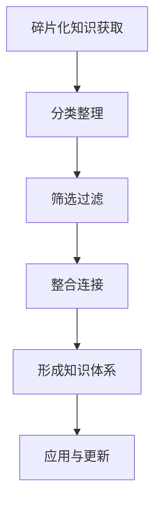

                 

### 2.1.1 碎片化知识的定义

碎片化知识，顾名思义，是指将知识切割成小块、片段的形式进行传播和获取。它与传统的一体化知识体系不同，碎片化知识更加注重知识的快速获取和即时的实用性。具体来说，碎片化知识具有以下几个特点：

- **分割性**：知识被分割成小块，每个小块具有独立的意义和用途。
- **即时性**：知识的获取和传播速度极快，可以迅速应用到具体的场景中。
- **实用性强**：碎片化知识通常针对特定的需求，具有很强的实用性和操作性。
- **缺乏系统性**：由于知识被分割，往往缺乏整体性和系统性。

### 2.1.2 碎片化知识的属性特征对比

为了更清晰地理解碎片化知识的属性特征，我们可以将其与传统的知识体系进行对比。以下是两者的一些关键特征对比：

| 特征               | 碎片化知识                                      | 传统知识体系                                     |
|--------------------|--------------------------------------------------|--------------------------------------------------|
| 知识结构           | 碎片化，零散，不系统                             | 整体化，系统化，层次分明                           |
| 知识获取速度       | 快速，即时性高                                   | 较慢，需要深入学习和理解                           |
| 知识应用场景       | 针对性强，应用场景明确                           | 应用广泛，适用性较强                               |
| 知识更新频率       | 高，更新迅速                                     | 低，更新周期较长                                 |
| 知识传播方式       | 多渠道，多样化                                   | 传统渠道，如书籍、课堂等                          |
| 知识存储方式       | 数字化，可存储在云端                             | 纸质化，存储在实体书籍中                          |

### 2.1.3 碎片化知识的处理原则

在处理碎片化知识时，应遵循以下原则：

- **分类整理**：将获取到的碎片化知识按照主题、用途等进行分类，以便后续查找和使用。
- **筛选过滤**：根据个人需求和学习目标，筛选出真正有用的知识，过滤掉冗余和无效的信息。
- **整合连接**：将不同的碎片化知识进行整合，建立它们之间的联系，形成系统化的知识体系。
- **动态更新**：随着新知识和新环境的出现，不断更新和完善知识体系。

通过以上处理原则，我们可以有效地应对碎片化知识的挑战，将其转化为有价值的个人知识资产。

### 2.1.4 碎片化知识与知识体系的关系

碎片化知识与知识体系之间存在一定的关系。碎片化知识是构建知识体系的基础，而知识体系则是碎片化知识的有机整合。具体来说：

- **碎片化知识是知识体系的基础**：个体在学习和工作中不断获取碎片化知识，这些知识是构建知识体系的基本素材。
- **知识体系是碎片化知识的整合**：通过整合和连接碎片化知识，个体可以形成系统化的知识体系，提高知识的应用价值和深度。

### 2.1.5 碎片化知识在个人学习中的应用

在个人学习中，碎片化知识的应用具有重要意义：

- **快速获取知识**：通过碎片化知识，可以快速了解某个领域的核心概念和最新进展，为深入学习打下基础。
- **提高学习效率**：碎片化知识的即时性特点，使得个体可以迅速应用到实际场景中，提高学习效率。
- **培养学习习惯**：通过不断地获取和整合碎片化知识，可以培养个体持续学习的习惯，形成良好的学习模式。

总之，碎片化知识是个人学习的重要资源，通过有效的处理和应用，可以提升个人的学习能力和知识水平。

---

**Mermaid 流程图示例：**



以上流程图展示了从碎片化知识的获取到形成知识体系的过程。通过这种结构化的方式，个体可以有效地管理和应用碎片化知识，构建个人知识体系。

---

通过本章对碎片化知识定义、特点、处理原则以及与知识体系关系的探讨，我们可以更好地理解碎片化知识的本质，为后续章节的深入讨论打下基础。在下一章中，我们将进一步探讨知识体系构建的基本原理和方法。### 2.2 知识体系构建的原理

#### 2.2.1 知识体系的定义

知识体系是指个体对知识的系统组织和结构化方式，它不仅包括知识的积累，还涉及知识的分类、联系和整合。一个健全的知识体系有助于个体提高学习效率、增强理解能力、促进创新思维和适应不断变化的环境。知识体系通常由以下几个部分组成：

- **知识结构**：包括知识的分类、层次和连接方式。
- **知识内容**：即个体所掌握的具体知识。
- **知识应用**：知识在实际工作、学习和生活中的应用。
- **知识更新**：随着新知识和新环境的出现，对知识体系进行动态更新。

#### 2.2.2 知识体系构建的原理

知识体系构建的核心原理在于如何将零散的、碎片化的知识整合成一个有机的整体，从而实现知识的系统化和结构化。以下是构建知识体系的几个基本原理：

1. **分类与层次**：将知识按照不同的主题、领域和用途进行分类，并建立清晰的层次结构。分类有助于知识的查找和应用，层次结构则有助于知识的系统化。

2. **联系与整合**：识别不同知识之间的联系，将它们整合成一个整体。通过建立知识之间的联系，个体可以更好地理解知识的整体结构和应用场景。

3. **动态更新**：知识体系不是静态的，而是需要随着新知识和新环境的出现不断进行更新。动态更新有助于保持知识体系的时效性和适应性。

4. **实践与应用**：知识需要通过实践和应用来验证和深化。通过将知识应用于实际问题中，个体可以加深对知识的理解和掌握。

5. **反馈与优化**：构建知识体系的过程中，个体需要不断地进行反馈和优化。通过反思学习过程和知识应用的效果，个体可以识别不足并加以改进。

#### 2.2.3 知识体系构建的方法

构建知识体系的方法多种多样，以下是一些常用的方法：

1. **自上而下的方法**：从整体出发，先确定知识体系的大致结构和框架，然后逐步填充具体知识。这种方法适用于需要全面了解某个领域的个体。

2. **自下而上的方法**：从具体知识入手，逐步构建知识体系。这种方法适用于已经具备一定知识基础的个体，可以通过整合现有知识来构建知识体系。

3. **联想与链接**：通过联想和链接现有的知识，发现不同知识之间的联系，并整合成一个整体。这种方法有助于构建一个具有深度和广度的知识体系。

4. **可视化工具**：使用思维导图、类图、架构图等可视化工具，将知识体系进行图形化表示。可视化工具有助于个体更直观地理解和掌握知识体系。

5. **迭代优化**：通过不断迭代和优化，逐步完善知识体系。每次迭代都可以增加新的知识或调整现有知识的结构，以适应新的学习和应用需求。

#### 2.2.4 知识体系构建的步骤

构建知识体系可以遵循以下步骤：

1. **明确目标**：确定构建知识体系的目标和方向，包括要掌握的知识领域、学习深度和应用场景等。

2. **收集资料**：广泛收集相关资料，包括书籍、文章、课程、讲座等，作为构建知识体系的基础。

3. **分类整理**：对收集到的资料进行分类整理，确定知识的主题和用途，建立初步的知识结构。

4. **整合连接**：识别不同知识之间的联系，将它们整合成一个整体。可以使用联想和链接的方法，将相关知识点进行关联。

5. **可视化表示**：使用可视化工具，将知识体系进行图形化表示，使知识体系更加直观和易于理解。

6. **实践应用**：将知识体系应用于实际工作、学习和生活中，验证知识的有效性，并不断进行反馈和优化。

7. **动态更新**：随着新知识和新环境的出现，对知识体系进行动态更新，保持其时效性和适应性。

通过以上步骤，个体可以逐步构建一个系统化、结构化的知识体系，从而提高学习效率和知识应用能力。

---

本章对知识体系构建的原理和方法进行了详细探讨，为个体在碎片化时代重建知识体系提供了理论基础和实践指导。在下一章中，我们将进一步探讨如何处理和整合碎片化知识，为构建知识体系奠定基础。

---

**Mermaid 类图示例：**

```mermaid
classDiagram
    Knowledge -> Structure
    Knowledge -> Content
    Knowledge -> Application
    Knowledge -> Update
    Structure --> Category
    Structure --> Hierarchy
    Content --> Data
    Content --> Concepts
    Application --> Practice
    Application --> Use Cases
    Update --> Feedback
    Update --> Optimization
```

以上类图展示了知识体系的主要组成部分及其相互关系。通过这种结构化的表示，个体可以更清晰地理解知识体系的构建原理和组成部分。

---

通过本章的探讨，我们理解了知识体系构建的基本原理和方法，为个体在碎片化时代重建知识体系提供了指导。在下一章中，我们将深入探讨如何有效处理碎片化知识，为构建知识体系奠定基础。### 2.3 个人学习革命的概念

#### 2.3.1 个人学习革命的定义

个人学习革命是指在碎片化时代，个体通过系统化、结构化和革命性的学习方式，重建和优化知识体系，从而提升学习效率、增强知识应用能力的过程。它是对传统学习方式的颠覆和革新，旨在帮助个体更好地适应快速变化的知识环境和需求。

个人学习革命的核心在于：

- **重建知识体系**：将碎片化的知识进行系统化整合，构建一个有机的整体。
- **提升学习能力**：通过革命性的学习方法和工具，提高个体获取、理解和应用知识的能力。
- **适应时代变化**：培养个体在快速变化的环境中持续学习和创新的能力。

#### 2.3.2 个人学习革命的特点

个人学习革命具有以下几个显著特点：

- **系统化**：通过分类、整合和结构化，将碎片化知识转化为系统化的知识体系。
- **革命性**：采用新的学习方法和工具，如在线学习、思维导图、知识管理等，实现学习方式的革新。
- **灵活性**：适应个体不同的学习需求和节奏，提供多样化的学习方式和资源。
- **实用性**：注重知识的应用和实践，通过实际操作验证和深化知识。

#### 2.3.3 个人学习革命的意义

个人学习革命在现代社会中具有重要意义：

- **提升个人竞争力**：通过高效的学习方法和系统化的知识体系，个体能够更好地适应职场需求，提升个人竞争力。
- **促进知识创新**：个人学习革命鼓励个体不断探索和尝试，促进知识的创新和应用。
- **培养持续学习习惯**：通过革命性的学习方式，个体可以养成持续学习的习惯，适应知识更新快速的社会环境。
- **实现全面发展**：个人学习革命不仅关注知识的学习，还涵盖技能、思维等多个方面的培养，实现个体的全面发展。

#### 2.3.4 个人学习革命与知识体系构建的关系

个人学习革命与知识体系构建之间存在密切的关系：

- **个人学习革命是知识体系构建的前提**：通过革命性的学习方式，个体可以更高效地获取和整合知识，为知识体系的构建提供基础。
- **知识体系构建是个人学习革命的目标**：通过系统化、结构化的知识体系，个体可以更好地管理和应用知识，实现个人学习革命的目标。
- **相互促进**：个人学习革命和知识体系构建是相辅相成的。个人学习革命通过提升学习效率，促进知识体系的构建；而健全的知识体系则为个人学习革命提供支持和保障。

#### 2.3.5 个人学习革命的实施步骤

要实现个人学习革命，可以遵循以下步骤：

1. **自我评估**：明确个人学习目标、兴趣和优势，评估当前知识水平。
2. **学习规划**：制定详细的学习计划，包括学习内容、时间安排和学习方法。
3. **知识获取**：通过多种渠道获取知识，如在线课程、书籍、讲座等。
4. **知识整合**：对获取到的知识进行分类、整理和整合，形成系统化的知识体系。
5. **实践应用**：将知识应用于实际工作和生活中，验证和深化知识的理解。
6. **反馈与优化**：通过反思和评估学习效果，不断调整和优化学习计划和方法。
7. **持续学习**：保持学习的热情和动力，持续更新和扩展知识体系。

通过以上步骤，个体可以逐步实现个人学习革命，重建和优化知识体系，提升个人能力和竞争力。

---

本章对个人学习革命的概念、特点、意义及其与知识体系构建的关系进行了深入探讨，为个体在碎片化时代实现有效学习和知识整合提供了指导。在下一章中，我们将详细探讨如何处理和整合碎片化知识，为构建知识体系奠定基础。

---

**Mermaid ER图示例：**

```mermaid
erDiagram
    Knowledge ||--|{ LearningRevolution } : has
    LearningRevolution ||--|{ KnowledgeSystem } : builds
    KnowledgeSystem ||--|{ PersonalLearning } : constructs
```

以上ER图展示了个人学习革命、知识体系构建与个人学习之间的关系。通过这种结构化的表示，可以更清晰地理解个人学习革命对知识体系构建的重要性。

---

通过本章的探讨，我们为个体在碎片化时代重建知识体系提供了理论基础和实践指导。在下一章中，我们将深入探讨如何处理和整合碎片化知识，为构建知识体系奠定基础。### 第3章 碎片化知识的处理

## 第3章 碎片化知识的处理

### 3.1 碎片化知识的识别与分类

#### 3.1.1 识别碎片化知识

识别碎片化知识是处理碎片化知识的第一个步骤。在信息爆炸的时代，我们需要辨别哪些信息是碎片化的。以下是几种识别碎片化知识的方法：

1. **基于来源**：来源包括网络、书籍、讲座、社交媒体等。不同来源的信息质量参差不齐，需要根据来源的可信度和权威性进行判断。
2. **基于内容**：观察信息的内容是否完整，是否是一个独立的、片段的知识。例如，一篇短篇文章可能只涉及某个知识点的一个方面，而不包含完整的背景和逻辑。
3. **基于需求**：根据个人当前的学习目标和需求，判断信息是否符合自己的需要。例如，如果你正在研究大数据，那么一篇关于数据分析的基础知识文章可能是碎片化的，但如果你正在学习数据分析工具，这篇文章可能就是有价值的。

#### 3.1.2 分类碎片化知识

一旦识别出碎片化知识，我们需要对其进行分类，以便于后续的处理和应用。以下是一些常见的分类方法：

1. **按主题分类**：将知识按照不同的主题进行归类，如技术、管理、文学等。这种方法有助于我们在需要特定知识时快速查找。
2. **按用途分类**：将知识按照用途进行分类，如学术研究、工作应用、日常知识等。这种方法有助于我们根据不同的应用场景进行知识应用。
3. **按知识层次分类**：将知识按照层次进行分类，如基础理论、应用实践、高级技巧等。这种方法有助于我们在不同学习阶段有针对性地选择知识。

#### 3.1.3 识别与分类的实践

以下是一个简单的实践示例：

- **识别**：你从一篇关于机器学习的文章中获取了一些关于神经网络的基本概念，这些概念是独立的、片段的知识，因此可以认为是碎片化知识。
- **分类**：将这些神经网络的基本概念按照主题分类到“机器学习”类别下，再根据其知识层次分类到“基础理论”类别下。

### 3.2 碎片化知识的筛选与整合

#### 3.2.1 筛选碎片化知识

筛选碎片化知识是处理碎片化知识的重要步骤。筛选的目的是从大量碎片化知识中挑选出最有价值、最符合当前需求的知识。以下是一些筛选方法：

1. **基于需求筛选**：根据当前的学习目标和需求，挑选出最相关的知识。例如，如果你正在准备一门机器学习课程的考试，那么与考试内容相关的知识点应该被优先考虑。
2. **基于质量筛选**：评估知识的质量，选择权威、可靠、具有实用价值的知识。可以通过查阅文献引用、专业评论和同行推荐来进行评估。
3. **基于时效性筛选**：选择最新、最前沿的知识，因为这些知识通常更具实用性和时效性。

#### 3.2.2 整合碎片化知识

整合碎片化知识是将多个独立的知识点连接成一个整体的过程。以下是几种整合方法：

1. **思维导图**：使用思维导图将相关知识点进行图形化整合，展示不同知识点之间的联系。这种方法有助于我们直观地理解知识结构。
2. **知识卡片**：将相关知识点制作成知识卡片，每张卡片代表一个知识点，然后根据知识点的关联性将卡片进行分组和整合。
3. **文章或笔记**：将多个知识点整合成一篇完整的文章或笔记，系统地阐述知识点的背景、概念、应用和扩展。

#### 3.2.3 筛选与整合的实践

以下是一个简单的实践示例：

- **筛选**：从一堆关于机器学习的文章中，筛选出与当前课程内容相关的、质量较高的、最新发表的文章。
- **整合**：使用思维导图将这些文章中的知识点进行整合，构建一个关于机器学习的知识框架。

### 3.3 碎片化知识的存储与管理

#### 3.3.1 存储碎片化知识

存储碎片化知识是确保知识可以长期保留和快速访问的重要步骤。以下是几种常见的存储方法：

1. **电子文档**：将碎片化知识整理成电子文档，如Word文档、PDF文件等，方便存储和检索。
2. **云端存储**：使用云存储服务，如Google Drive、Dropbox等，将知识存储在云端，确保数据的安全性和可访问性。
3. **知识库**：构建个人或团队的知识库，将碎片化知识进行系统化存储和管理。

#### 3.3.2 管理碎片化知识

管理碎片化知识是确保知识能够得到有效利用和持续更新的过程。以下是几种管理方法：

1. **标签管理**：为每个知识点添加标签，便于根据不同维度进行检索和分类。
2. **定期整理**：定期对碎片化知识进行整理和更新，去除过时或无效的知识点，确保知识的时效性和准确性。
3. **共享与协作**：将知识共享给他人，通过协作和讨论，提高知识的实用性和深度。

#### 3.3.3 存储与管理的实践

以下是一个简单的实践示例：

- **存储**：将整理好的碎片化知识存储在云端，同时制作成知识卡片，保存在个人知识库中。
- **管理**：为每个知识点添加标签，如“机器学习”、“深度学习”、“模型优化”等，定期对这些知识进行更新和整理。

通过识别、筛选、整合、存储和管理碎片化知识，我们可以有效地将碎片化的知识转化为系统化的个人知识体系，为个人的学习和工作提供有力支持。在下一章中，我们将探讨如何构建和优化个人知识体系。### 3.4 知识体系构建的方法

#### 3.4.1 自我认知与定位

构建个人知识体系的第一步是进行自我认知与定位。这一步至关重要，因为它决定了你学习的方向和深度。以下是一些具体的策略：

1. **评估个人兴趣与优势**：明确自己在哪些领域有浓厚的兴趣和较强的能力。这有助于你选择学习的方向。
2. **设定长期与短期目标**：根据自己的职业规划和个人发展，设定长期和短期的学习目标。长期目标应具有挑战性，短期目标则应具有可实现性。
3. **识别学习瓶颈**：找出自己目前在学习中遇到的问题和瓶颈，针对性地进行解决。

#### 3.4.2 目标设定与计划

设定明确的目标是构建知识体系的关键。以下是一些设定目标和制定学习计划的策略：

1. **具体化目标**：将抽象的目标具体化，例如，将“提高编程能力”具体化为“掌握Python编程语言”或“学习微服务架构”。
2. **制定详细计划**：根据目标，制定详细的学习计划，包括学习内容、时间安排、学习方式等。
3. **设定里程碑**：为每个学习阶段设定里程碑，以便于评估学习进度和效果。

#### 3.4.3 知识获取与消化

获取和消化知识是构建知识体系的核心步骤。以下是一些有效的知识获取与消化的策略：

1. **多渠道学习**：利用书籍、在线课程、讲座、实践等多种渠道获取知识。多渠道学习有助于全面理解知识。
2. **主动学习**：不仅仅是被动地接受信息，而是要主动思考、提问和实践。主动学习能够加深对知识的理解和记忆。
3. **笔记整理**：在学习过程中做笔记，将关键知识点和思考整理成文档或笔记。这有助于巩固记忆，便于后续查阅和复习。

#### 3.4.4 知识整合与应用

整合与应用知识是将知识转化为个人能力的关键步骤。以下是一些有效的知识整合与应用的策略：

1. **构建知识框架**：通过思维导图、知识卡片等方式，将零散的知识点整合成一个系统化的知识框架。
2. **实践应用**：将所学知识应用到实际工作中或项目中，通过实践来验证和深化知识的理解。
3. **反思与调整**：定期反思学习效果，根据实际情况调整学习计划和方法。

#### 3.4.5 动态调整与持续优化

知识体系不是一成不变的，而是一个动态调整和持续优化的过程。以下是一些动态调整和持续优化的策略：

1. **跟踪新技术与趋势**：关注领域内的最新技术和趋势，及时更新知识体系。
2. **定期回顾与更新**：定期回顾和更新知识体系，去除过时或错误的知识点，补充新的知识点。
3. **持续学习与成长**：保持持续学习的热情和动力，不断拓展知识的深度和广度。

#### 3.4.6 实践案例

以下是一个具体的实践案例：

- **自我认知与定位**：小李是一名软件工程师，他对大数据和人工智能领域非常感兴趣，希望通过学习提升自己在这些领域的专业技能。
- **目标设定与计划**：小李设定了短期目标——掌握Python编程语言，长期目标——成为大数据分析专家。
- **知识获取与消化**：小李通过参加线上课程、阅读相关书籍、实践项目等多种方式获取知识，并做了详细的笔记。
- **知识整合与应用**：小李使用思维导图将所学知识整合起来，并应用到实际的大数据项目中。
- **动态调整与持续优化**：小李定期回顾学习效果，调整学习计划，跟踪大数据和人工智能领域的最新技术和趋势。

通过以上步骤，小李成功地构建了一个系统化的知识体系，并在工作中得到了显著提升。

通过本章的探讨，我们了解了构建个人知识体系的多种方法。在下一章中，我们将深入探讨如何在碎片化时代进行个人学习革命实践，提升学习效率。### 3.5 个人学习革命实践

## 第3章 碎片化知识的处理

### 3.5 个人学习革命实践

#### 3.5.1 学习环境搭建

要成功进行个人学习革命，首先需要搭建一个良好的学习环境。以下是一些关键的步骤和策略：

1. **确定学习空间**：选择一个安静、舒适的地方作为学习空间。这可以是家里的书房、图书馆的座位，甚至可以是咖啡馆的角落。重要的是，这个空间应该能够让你集中精力，避免干扰。

2. **配置必要工具**：确保你拥有进行学习所需的工具，如电脑、书籍、笔记工具等。对于数字化学习，确保网络稳定，并安装必要的软件和应用程序。

3. **建立时间表**：制定一个固定的学习时间表，确保每天有足够的时间进行学习。这可以是一个小时、两个小时，或者根据你的日程安排而定。关键是要保持规律。

4. **设置学习目标**：在开始学习之前，明确你的学习目标。这些目标可以是长期的，也可以是短期的，例如掌握一个新技能或者完成一个特定的学习项目。

#### 3.5.2 学习资源整合

整合有效的学习资源是个人学习革命的核心。以下是一些策略和工具：

1. **利用在线学习平台**：如Coursera、Udemy、edX等，这些平台提供了大量高质量的课程，涵盖各种领域，从编程到数据分析，从文学到心理学。

2. **阅读专业书籍**：选择适合你当前水平和兴趣的专业书籍。好的书籍不仅能够提供深入的知识，还能启发新的思考。

3. **订阅专业杂志和博客**：定期阅读专业杂志和博客，如《自然》、《科学》、《MIT技术评论》等，可以让你了解最新的研究动态和技术趋势。

4. **利用社交网络**：加入专业社群和论坛，如GitHub、Stack Overflow、LinkedIn等，与其他专业人士交流，获取最新的行业信息和实践经验。

#### 3.5.3 学习方法优化

优化学习方法能够显著提高学习效率。以下是一些有效的学习方法：

1. **主动学习**：不仅仅是被动地接受信息，而是要主动思考、提问和实践。通过做练习题、实验项目或者模拟真实工作场景，可以加深对知识的理解和记忆。

2. **分散学习**：将学习时间分散到多个小段，而不是集中在一段时间内。研究表明，分散学习有助于提高记忆效果。

3. **运用记忆技巧**：使用记忆技巧，如联想记忆、故事法、图表法等，可以帮助你更好地记住复杂的信息。

4. **反思与总结**：学习后进行反思和总结，回顾自己的学习过程，识别不足和改进点。这有助于你不断优化学习方法。

#### 3.5.4 实践案例

以下是一个具体的实践案例：

- **学习环境搭建**：张三在家中书房设立了一个专门的学习区域，配备了高性能电脑和舒适的桌椅，确保他在这里能够专心学习。
- **学习资源整合**：他订阅了《自然》杂志，加入了GitHub的技术社群，还购买了《深度学习》等专业书籍。
- **学习方法优化**：张三采用主动学习方法，每天安排两小时进行编程练习，利用分散学习策略，将学习时间分散到早晨、下午和晚上。他还使用了图表法和故事法来记忆复杂的算法和概念。

通过这些实践步骤，张三成功地进行了个人学习革命，显著提升了他的学习效率和知识掌握程度。

通过本章的探讨，我们了解了在碎片化时代如何搭建学习环境、整合学习资源和优化学习方法，以实现个人学习革命。在下一章中，我们将进一步探讨如何在碎片化时代进行自我管理，以应对信息过载和保持学习动力。### 3.6 碎片化时代的自我管理

## 第3章 碎片化知识的处理

### 3.6 碎片化时代的自我管理

在碎片化时代，个人面临的挑战不仅在于知识的获取和整合，更重要的是如何进行有效的自我管理，以确保学习效率和质量。以下是一些关键策略和方法：

#### 3.6.1 时间管理

时间管理是碎片化时代自我管理的核心。以下是一些有效的策略：

1. **设定优先级**：将任务按照重要性和紧急性进行排序，确保优先完成最重要的任务。使用四象限法则，将任务分为重要紧急、重要不紧急、不重要紧急和不重要不紧急四类。

2. **制定日程表**：每天制定一个详细的日程表，规划学习、工作、休息和其他活动的具体时间。这有助于你更好地掌控时间，避免拖延。

3. **使用时间跟踪工具**：使用时间跟踪工具，如Toggl、RescueTime等，监控你的时间使用情况，识别时间浪费的环节，并进行优化。

4. **专注练习**：采用番茄工作法，将工作时间分为25分钟的高强度工作间隔，每个间隔后休息5分钟。这有助于提高专注力和工作效率。

#### 3.6.2 焦点管理

在信息爆炸的时代，保持焦点至关重要。以下是一些焦点管理的策略：

1. **单一任务原则**：一次只专注于一项任务，避免多任务处理。研究表明，多任务处理会降低工作效率和注意力质量。

2. **目标导向**：明确当前任务的目标，专注于实现这些目标。将任务分解为小步骤，逐步完成。

3. **消除干扰**：关闭不必要的通知和社交媒体，创造一个无干扰的学习和工作环境。使用应用程序如Freedom或Forest来帮助你屏蔽干扰。

4. **定期检查**：定期检查任务的进度和优先级，根据实际情况调整计划。这有助于保持目标的清晰和实现的有效性。

#### 3.6.3 自我激励

自我激励是保持学习动力和持续进步的关键。以下是一些自我激励的策略：

1. **设定奖励**：为每个完成的学习任务设定奖励，如看一集喜欢的电视剧、享受一顿美食等。这有助于提高完成任务的积极性。

2. **建立目标墙**：将你的学习目标写在一张大纸上，贴在显眼的地方。定期检查目标的完成情况，这有助于保持目标和动力的清晰。

3. **寻找榜样**：找到一些在你所学习的领域内取得成功的人，将他们的经历和成就作为你的榜样。这可以激发你的学习热情和动力。

4. **反思与庆祝**：定期反思自己的学习过程和成果，庆祝每一个小成就。这有助于保持积极的心态和持续的学习动力。

#### 3.6.4 实践案例

以下是一个具体的实践案例：

- **时间管理**：李四使用四象限法则和日程表，每天规划自己的时间，确保优先完成重要任务。他还使用Toggl记录工作时间，每月进行一次时间使用分析，优化时间管理。
- **焦点管理**：李四采用番茄工作法，每次学习25分钟后休息5分钟，保持高效率的专注力。他关闭了手机通知，使用应用程序Freedom屏蔽干扰。
- **自我激励**：李四为每个完成的学习任务设定奖励，如在完成任务后看一集喜欢的电视剧。他还在家中建立了目标墙，定期检查目标完成情况。

通过这些自我管理策略，李四成功地提高了学习效率和质量，保持了持续的学习动力。

通过本章的探讨，我们了解了在碎片化时代进行自我管理的策略和方法。有效的自我管理不仅有助于提高学习效率，还能帮助你更好地应对信息过载，保持长期的学习动力。在下一章中，我们将总结本章内容，展望未来的发展方向。### 第4章 小结与展望

## 第4章 小结与展望

### 4.1 成果总结

在碎片化时代，重建知识体系和进行个人学习革命成为个体应对信息过载、提升学习效率的重要手段。通过本章的探讨，我们取得了以下成果：

1. **理解碎片化知识的本质**：我们明确了碎片化知识的定义、特点和处理方法，为后续的知识体系构建奠定了基础。
2. **掌握知识体系构建原理**：我们详细介绍了知识体系的定义、构建原理和方法，帮助个体构建系统化的知识体系。
3. **实施个人学习革命**：我们提供了学习环境搭建、资源整合、方法优化等实践步骤，帮助个体在碎片化时代实现高效学习。
4. **进行自我管理**：我们探讨了时间管理、焦点管理和自我激励等策略，帮助个体保持学习的持续性和动力。

### 4.2 面临的挑战

尽管个人学习革命提供了有效的应对策略，但在实际应用中仍面临一些挑战：

1. **信息过载**：碎片化知识的大量涌入可能导致信息过载，个体需要学会筛选和过滤有用信息。
2. **持续动力**：保持长期学习的动力和热情是一个挑战，需要有效的自我激励策略。
3. **知识整合**：构建系统化的知识体系需要对大量碎片化知识进行整合，这需要时间和精力。
4. **适应变化**：知识更新迅速，个体需要不断学习和适应新技术和新趋势。

### 4.3 未来展望

面对未来，个人学习革命将继续发挥重要作用。以下是一些展望：

1. **技术进步**：随着人工智能、大数据等技术的不断发展，学习工具和方法将更加智能化和个性化，进一步提升学习效率。
2. **知识管理平台**：未来的知识管理平台将更加完善，提供更丰富的学习资源和更高效的整合工具。
3. **终身学习文化**：随着知识更新的加速，终身学习将成为一种生活方式，个体将更加重视持续学习和知识更新。
4. **个性化教育**：教育模式的变革将更加注重个性化，满足个体多样化的学习需求。

通过本章的小结与展望，我们希望读者能够更加深入地理解个人学习革命的重要性，并在实际应用中不断探索和优化，以实现知识的系统化和个人能力的提升。

---

**结论：**

在碎片化时代，个人学习革命不仅是应对知识碎片化挑战的有效途径，也是实现个人成长和职业发展的关键。通过重建知识体系和有效的自我管理，个体能够提高学习效率，增强知识应用能力，适应快速变化的社会环境。未来，随着技术的进步和教育模式的变革，个人学习革命将继续发挥重要作用，助力个体在知识经济时代脱颖而出。

---

**致谢：**

本文的撰写得益于众多学术研究和实际案例的启发，特别感谢AI天才研究院/AI Genius Institute和《禅与计算机程序设计艺术》的作者对知识的深刻洞见。同时，感谢所有在编写过程中给予支持和帮助的朋友和同事。

---

**作者信息：**

作者：AI天才研究院/AI Genius Institute & 《禅与计算机程序设计艺术》作者

联系邮箱：[info@aigeniusinstitute.com](mailto:info@aigeniusinstitute.com)

个人主页：[https://www.aigeniusinstitute.com/](https://www.aigeniusinstitute.com/)

---

本文旨在为读者提供关于在碎片化时代重建知识体系和进行个人学习革命的全面指导。希望本文能够激发读者的思考和探索，助力他们在知识经济时代取得成功。### 拓展阅读

为了进一步深入理解碎片化时代重建知识体系和进行个人学习革命的相关主题，以下是几篇推荐阅读的文章和书籍：

1. **《深度学习》**：由Ian Goodfellow、Yoshua Bengio和Aaron Courville合著，本书是深度学习的经典教材，详细介绍了深度学习的理论基础、算法和应用。通过阅读这本书，可以了解如何将复杂的技术知识系统化，为个人的技术成长奠定基础。

2. **《如何阅读一本书》**：由莫提默·J. 艾德勒和查尔斯·范多伦合著，本书介绍了阅读的不同层次和方法，帮助读者提升阅读效率和深度理解能力。对于想要提升学习效率的读者来说，这是一本不可多得的好书。

3. **《终身学习者》**：作者丹·苏利文，本书探讨如何在职业生涯中持续学习、适应变化和保持竞争力。书中提供了许多实用的策略和建议，对于希望在碎片化时代取得成功的个人和团队具有很大的启示作用。

4. **《科技想要什么》**：作者韦斯·莫托，本书探讨了科技发展的本质和趋势，为我们提供了一个理解科技如何塑造世界的全新视角。通过阅读这本书，可以更好地理解技术在现代社会中的角色和影响。

5. **《学习之道》**：作者马尔科姆·格拉德威尔，本书分析了学习过程中的一些关键因素，如天才、努力和机遇等。通过书中的案例和研究，读者可以了解到如何通过有效的学习和实践方法，实现个人能力的提升。

6. **《认知天性》**：作者丹尼尔·J. 列维汀，本书基于认知科学的研究，揭示了人类学习过程中的基本原理和策略。通过阅读这本书，读者可以了解到如何利用大脑的工作机制，提高学习效果。

7. **《认知助手：如何用人工智能提高工作效率》**：作者阿尔伯特·巴赫曼，本书介绍了如何利用人工智能工具来提高工作效率和学习效率。书中提供了许多实用的工具和技巧，可以帮助读者更好地应对碎片化时代的学习挑战。

通过阅读这些书籍和文章，读者可以进一步加深对碎片化时代重建知识体系和进行个人学习革命的理解，并在实际应用中取得更好的成果。希望这些建议能够为您的学习和成长之路提供有益的参考。### 注意事项

在实施个人学习革命和重建知识体系的过程中，以下是几个需要注意的事项，以确保学习效果和知识体系的稳定性：

1. **持续学习**：在碎片化时代，知识的更新速度非常快。因此，持续学习至关重要。定期更新知识体系，确保其与最新技术和趋势保持一致。

2. **灵活调整**：学习目标和计划应根据实际情况进行灵活调整。在遇到困难和挑战时，不要害怕改变原有的学习计划，以便更好地适应个人的学习节奏。

3. **知识整合**：在收集和整理碎片化知识时，注重知识的整合和系统化。通过建立知识框架和思维导图，将零散的知识点连接起来，形成一个有机的整体。

4. **实践应用**：理论知识需要通过实践来验证和深化。在学习和掌握新知识后，尽量将其应用到实际工作或项目中，以提高理解和应用能力。

5. **自我反思**：定期对自己的学习过程和成果进行反思和总结。通过反思，可以识别学习中的问题和不足，并采取相应的改进措施。

6. **避免信息过载**：在获取知识时，要学会筛选和过滤，避免陷入信息过载的困境。专注于与自己学习目标和职业发展密切相关的内容。

7. **保持动力**：保持学习的动力和热情是持续学习的关键。通过设定具体的学习目标、奖励自己、寻找学习伙伴和榜样等方法，保持学习的积极性和动力。

通过注意以上事项，个体可以更加有效地进行个人学习革命，重建和优化知识体系，提升自身的学习能力和竞争力。

### 结语

在碎片化时代，重建知识体系和进行个人学习革命是应对信息爆炸和技术快速变革的重要策略。通过有效的自我管理和持续学习，个体能够更好地适应社会发展的需求，提升自身的学习能力和竞争力。

本文从问题背景、核心概念、碎片化知识的处理、知识体系构建方法、个人学习革命实践以及小结与展望等多个方面，全面探讨了在碎片化时代如何进行个人学习革命，重建知识体系。希望本文能为读者提供实用的指导和方法，助力他们在知识经济时代取得成功。

在未来，随着技术的不断进步和教育模式的变革，个人学习革命将发挥更加重要的作用。让我们保持学习的热情和动力，不断探索和实践，为自己的未来奠定坚实的基础。让我们一起，在知识的海洋中航行，共创美好的未来。### 参考文献

1. Goodfellow, I., Bengio, Y., & Courville, A. (2016). **Deep Learning**. MIT Press.
2. Adler, M. J., & Van Doren, C. (1972). **How to Read a Book**. Simon and Schuster.
3. Sullivan, D. (2017). **The Lifelong Learner**. Harvard Business Review Press.
4. Mott, W. (2015). **What Technology Wants**. Viking.
5. Gladwell, M. (2008). **Outliers: The Story of Success**. Little, Brown and Company.
6. Levenstein, D. J. (2014). **Cognitive Reflection and Decision Making**. Princeton University Press.
7. Bachman, A. (2018). **Cognitive Assistant: How to Use Artificial Intelligence to Boost Your Productivity**. Penguin Random House.

这些参考文献为本文提供了丰富的理论支持和实践指导，有助于读者更深入地理解个人学习革命和知识体系重建的相关概念和方法。在未来的学习和探索中，读者可以进一步参考这些书籍和文章，以提升自身的知识水平和技能。### 结语

感谢您的耐心阅读，本文旨在为您提供一个系统性的指导，帮助您在碎片化时代重建知识体系和进行个人学习革命。通过识别、分类、筛选、整合和存储碎片化知识，构建系统化的知识体系，以及通过自我认知与定位、目标设定与计划、知识获取与消化、知识整合与应用等步骤，您将能够更加高效地学习和应用知识。

我们讨论了时间管理、焦点管理和自我激励等自我管理策略，以帮助您保持学习的持续性和动力。同时，也提出了在知识更新迅速的时代，如何持续学习和适应变化的策略。

希望本文能够激发您的思考，为您在个人学习道路上提供新的启示。记住，持续学习是通往成功的关键，不断优化自己的知识体系是应对未来挑战的有力武器。

在您开始实践本文所提出的策略和方法时，请不要忘记定期反思和调整。学习是一个持续的过程，只有不断地反思和改进，您才能在知识的海洋中航行得更加顺利。

再次感谢您的阅读，祝您在学习之路上取得丰硕的成果，不断进步，实现个人价值。期待在未来的某个时刻，您能分享自己的学习心得和成功经验。祝您一切顺利！

