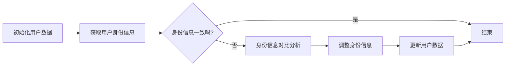
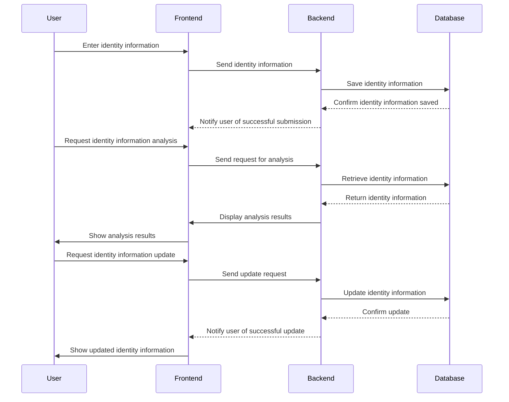

                 


# 在社交媒体时代寻找真实自我：应对身份认同危机

关键词：社交媒体、身份认同、危机、应对策略、技术分析

摘要：随着社交媒体的普及，人们在网络世界中构建了一个又一个虚拟身份，这些身份与真实自我之间产生了距离。本文将探讨社交媒体时代身份认同危机的背景、影响、核心概念以及应对策略，旨在帮助读者在数字化的生活中找到真实自我，应对身份认同危机。

### 目录大纲

```markdown
----------------------------------------------------------------
# 在社交媒体时代寻找真实自我：应对身份认同危机

## 第1章 引言
### 1.1 问题背景
### 1.2 社交媒体对身份认同的影响
### 1.3 目的与结构

## 第2章 社交媒体与身份认同概述
### 2.1 社交媒体的兴起
### 2.2 身份认同的概念与构成
### 2.3 社交媒体与身份认同的互动

## 第3章 社交媒体时代的身份危机
### 3.1 社交媒体对个体身份的影响
### 3.2 身份认同危机的表现
### 3.3 身份危机的原因分析

## 第4章 身份认同的核心概念与联系
### 4.1 核心概念
### 4.2 概念属性特征对比表格
### 4.3 ER实体关系图架构

## 第5章 算法原理讲解
### 5.1 算法mermaid流程图
### 5.2 Python源代码阐述
### 5.3 算法原理的数学模型和公式
### 5.4 举例说明

## 第6章 数学模型和数学公式 & 详细讲解 & 举例说明
### 6.1 数学公式示例
### 6.2 数学模型详细讲解

## 第7章 系统分析与架构设计方案
### 7.1 问题场景介绍
### 7.2 系统功能设计
### 7.3 系统架构设计
### 7.4 系统接口设计
### 7.5 系统交互

## 第8章 项目实战
### 8.1 环境安装
### 8.2 系统核心实现源代码
### 8.3 代码应用解读与分析
### 8.4 实际案例分析和详细讲解剖析
### 8.5 项目小结

## 第9章 最佳实践 tips、小结、注意事项、拓展阅读
----------------------------------------------------------------
```

### 第1章 引言

#### 1.1 问题背景

在当今的数字化时代，社交媒体已经成为人们日常生活中不可或缺的一部分。从Facebook、Instagram到Twitter、微信，各类社交媒体平台不断涌现，为用户提供了分享生活、交流互动的平台。然而，在这片数字化的世界中，人们在虚拟与现实之间建立起了多重身份，这些身份往往与真实自我有着巨大的差异。

身份认同危机，即个体在社交媒体中感受到的身份与真实自我不符，从而产生焦虑和困惑的现象。这一问题不仅影响了个体的心理健康，还可能对整个社会造成深远的影响。随着社交媒体的普及，身份认同危机已经成为一个不可忽视的社会问题，值得我们深入探讨和解决。

#### 1.2 社交媒体对身份认同的影响

社交媒体对个体身份认同的影响可以从多个维度进行探讨。首先，社交媒体提供了一个展示自我形象的舞台，用户可以在平台上发布照片、文字、视频等内容，塑造自己的形象。这种虚拟形象的塑造与真实自我之间往往存在差距，可能会导致个体对自己身份的认同出现危机。

其次，社交媒体中的比较现象加剧了身份认同危机。人们在浏览他人的生活时，往往会产生一种“完美生活”的错觉，从而对自己的生活产生不满和焦虑。这种比较心理使得个体对自己的身份认同产生动摇，甚至产生自卑情绪。

此外，社交媒体中的匿名性和虚拟性也为个体提供了隐藏真实自我的机会。一些人可能会在社交媒体上表现出与现实生活中截然不同的行为和态度，从而掩盖自己的真实身份。这种现象不仅可能导致个体对自己身份的认同出现混乱，还可能对社会整体的信任感造成损害。

#### 1.3 目的与结构

本文旨在探讨社交媒体时代身份认同危机的背景、影响、核心概念以及应对策略，帮助读者在数字化的生活中找到真实自我，应对身份认同危机。文章结构如下：

- 第1章 引言：介绍社交媒体时代身份认同危机的背景和目的。
- 第2章 社交媒体与身份认同概述：探讨社交媒体的兴起、身份认同的概念与构成以及社交媒体与身份认同的互动。
- 第3章 社交媒体时代的身份危机：分析社交媒体对个体身份的影响、身份认同危机的表现以及身份危机的原因。
- 第4章 身份认同的核心概念与联系：介绍身份认同的核心概念、概念属性特征对比表格以及ER实体关系图架构。
- 第5章 算法原理讲解：讲解应对身份认同危机的算法原理，包括mermaid流程图、Python源代码阐述、数学模型和公式、举例说明。
- 第6章 数学模型和数学公式 & 详细讲解 & 举例说明：进一步探讨数学模型和公式的详细讲解和举例说明。
- 第7章 系统分析与架构设计方案：分析应对身份认同危机的系统架构和设计方案。
- 第8章 项目实战：通过一个实际项目，展示如何应对身份认同危机。
- 第9章 最佳实践 tips、小结、注意事项、拓展阅读：总结全文，给出最佳实践建议，并提供拓展阅读资源。

通过以上结构，本文将为读者提供一个全面而深入的阅读指南，帮助读者理解身份认同危机的复杂性，并探索应对这一挑战的方法和策略。

### 第2章 社交媒体与身份认同概述

#### 2.1 社交媒体的兴起

社交媒体的兴起可以追溯到21世纪初。2004年，Facebook的成立标志着社交媒体时代的到来。此后，Twitter、Instagram、微信等平台相继问世，迅速改变了人们的社交方式和生活方式。社交媒体不仅提供了即时沟通和互动的渠道，还让用户能够分享生活、表达观点，甚至影响公共舆论。

社交媒体的兴起与互联网技术的快速发展密切相关。宽带网络的普及、智能手机的普及以及移动互联网的兴起，为社交媒体的普及提供了技术基础。这些技术使得人们可以随时随地访问互联网，浏览和发布内容，从而促进了社交媒体的广泛应用。

#### 2.2 身份认同的概念与构成

身份认同（Identity）是指个体对自己身份的感知和认知。它不仅仅是一个简单的自我概念，而是涉及到个体的社会角色、文化背景、价值观念等多个方面。身份认同的形成受到多种因素的影响，包括家庭、教育、社会环境等。

身份认同的构成主要包括以下几个方面：

1. **个体属性**：包括性别、年龄、种族、国籍等生物学和社会学属性。
2. **社会角色**：个体在家庭、工作、社会团体等不同角色中所表现出的行为和态度。
3. **文化背景**：个体的文化传承、价值观念、宗教信仰等。
4. **自我认知**：个体对自己的理解、评价和期望。

身份认同是一个动态的过程，随着时间的推移和社会环境的变化，个体的身份认同也会发生相应的调整和变化。

#### 2.3 社交媒体与身份认同的互动

社交媒体与身份认同之间存在密切的互动关系。一方面，社交媒体为个体提供了展示和塑造身份的平台。通过社交媒体，个体可以发布自己的照片、文字、视频等内容，从而塑造自己的形象。这种虚拟形象的塑造不仅反映了个体对自己的认同，也可能影响到他人对个体的认知。

另一方面，社交媒体中的互动和比较现象对个体的身份认同产生了重要影响。人们在社交媒体上浏览他人的生活，往往会产生一种“完美生活”的错觉，从而对自己的生活产生不满和焦虑。这种比较心理使得个体对自己的身份认同产生动摇，甚至产生自卑情绪。

此外，社交媒体中的匿名性和虚拟性也为个体提供了隐藏真实自我的机会。一些人可能会在社交媒体上表现出与现实生活中截然不同的行为和态度，从而掩盖自己的真实身份。这种现象不仅可能导致个体对自己身份的认同出现混乱，还可能对社会整体的信任感造成损害。

总的来说，社交媒体对身份认同的影响是复杂而多元的。它既为个体提供了展示和塑造身份的平台，也可能对个体的身份认同产生负面影响。了解这种互动关系，有助于我们更好地应对社交媒体时代身份认同危机。

### 第3章 社交媒体时代的身份危机

#### 3.1 社交媒体对个体身份的影响

社交媒体对个体身份的影响是深远而广泛的。首先，社交媒体改变了个体获取信息和表达自我的方式。在过去，个体获取信息主要依赖于传统媒体，如电视、报纸和杂志。而现在，社交媒体成为了信息传播的主要渠道。人们通过社交媒体平台获取新闻、了解时事，甚至参与到公共话题的讨论中。这种信息获取方式的改变，使得个体的身份认同受到了新的挑战。

其次，社交媒体对个体身份认同的影响体现在个体在虚拟世界中的角色扮演上。在社交媒体上，个体可以创建多个身份，这些身份可能与现实生活中的真实自我存在差异。例如，一个人可能在现实生活中是一名普通的上班族，但在社交媒体上却扮演了一个文艺青年或者网红的角色。这种多重身份的塑造，不仅反映了个体对自我认知的多样性，也可能导致身份认同的混乱。

此外，社交媒体中的互动和比较现象也对个体身份认同产生了重要影响。人们在浏览他人的生活时，往往会产生一种“完美生活”的错觉，从而对自己的生活产生不满和焦虑。这种比较心理使得个体对自己的身份认同产生动摇，甚至产生自卑情绪。例如，一个人可能会在社交媒体上看到别人的奢华生活，而自己的生活质量远远达不到这种水平，从而对自己的身份认同产生怀疑。

最后，社交媒体中的匿名性和虚拟性也为个体提供了隐藏真实自我的机会。一些人可能会在社交媒体上表现出与现实生活中截然不同的行为和态度，从而掩盖自己的真实身份。这种现象不仅可能导致个体对自己身份的认同出现混乱，还可能对社会整体的信任感造成损害。

总的来说，社交媒体对个体身份的影响是复杂而多元的。它既为个体提供了展示和塑造身份的平台，也可能对个体的身份认同产生负面影响。了解这些影响，有助于我们更好地应对社交媒体时代的身份危机。

#### 3.2 身份认同危机的表现

身份认同危机在社交媒体时代的表现形式多种多样，其中最常见的包括以下几种：

1. **焦虑和压力**：社交媒体上的比较现象使得个体对自己的生活产生不满和焦虑。例如，一个人可能会在社交媒体上看到别人的奢华生活，而自己的生活质量远远达不到这种水平，从而对自己的身份认同产生怀疑，导致焦虑和压力。

2. **自卑情绪**：在社交媒体上，个体往往会关注他人的优点和成就，而忽视自己的长处和进步。这种比较心理可能导致个体对自己的身份认同产生动摇，甚至产生自卑情绪。

3. **虚拟身份与现实自我不符**：在社交媒体上，一些人可能会创建与现实生活中不符的虚拟身份，以追求别人的认可和赞赏。这种虚拟身份的塑造可能导致个体对自己真实身份的迷失，甚至产生身份认同的混乱。

4. **社交疏离**：社交媒体虽然提供了交流互动的平台，但同时也可能使得个体与现实生活中的社交关系变得疏远。人们在虚拟世界中花费大量时间，可能忽视了现实生活中的人际关系，导致社交疏离和孤独感。

5. **心理健康问题**：长期处于身份认同危机的状态，可能导致个体的心理健康问题，如焦虑症、抑郁症等。

总之，身份认同危机在社交媒体时代的表现形式多样，对个体的心理健康和生活质量产生了深远的影响。了解这些表现，有助于我们更好地应对和解决这一危机。

#### 3.3 身份危机的原因分析

身份认同危机在社交媒体时代产生的原因是复杂而多方面的，主要包括以下几点：

1. **社交媒体的特性**：社交媒体的匿名性和虚拟性为个体提供了隐藏真实自我的机会，这使得个体可以随意塑造和改变自己的身份。这种特性使得人们在社交媒体上容易产生身份认同的混乱。

2. **比较心理**：社交媒体上的互动和比较现象使得个体容易陷入比较心理。人们往往会关注他人的优点和成就，而忽视自己的长处和进步，导致自卑情绪和焦虑。

3. **信息过载**：社交媒体上充斥着大量信息，个体在浏览这些信息时容易产生信息过载。这种信息过载可能导致个体的认知负担增加，从而对身份认同产生动摇。

4. **社会压力**：现代社会对个体的身份认同提出了较高的要求，个体需要在各种社会角色中找到平衡。这种社会压力使得个体在社交媒体上容易产生身份认同危机。

5. **文化差异**：不同文化背景下的个体对身份认同的理解和认知存在差异。在全球化背景下，文化差异可能加剧个体的身份认同危机。

6. **技术发展**：技术的快速发展使得社交媒体平台不断涌现，为个体提供了更多的展示和塑造身份的机会。然而，这也可能加剧个体对身份认同的困惑。

总之，身份认同危机在社交媒体时代产生的原因是多方面的，既有社交媒体自身的特性，也有社会环境和文化背景的影响。了解这些原因，有助于我们更好地应对和解决这一危机。

### 第4章 身份认同的核心概念与联系

#### 4.1 核心概念

身份认同（Identity）是指个体对自己身份的感知和认知。它不仅仅是一个简单的自我概念，而是涉及到个体的社会角色、文化背景、价值观念等多个方面。身份认同的形成受到多种因素的影响，包括家庭、教育、社会环境等。

核心概念主要包括以下几个方面：

1. **个体属性**：包括性别、年龄、种族、国籍等生物学和社会学属性。
2. **社会角色**：个体在家庭、工作、社会团体等不同角色中所表现出的行为和态度。
3. **文化背景**：个体的文化传承、价值观念、宗教信仰等。
4. **自我认知**：个体对自己的理解、评价和期望。

#### 4.2 概念属性特征对比表格

为了更好地理解身份认同的核心概念，我们可以通过一个对比表格来展示这些概念的不同属性特征。以下是一个简化的对比表格：

| 概念     | 属性特征                            |
|----------|-----------------------------------|
| 个体属性 | 性别、年龄、种族、国籍等           |
| 社会角色 | 行为、态度、角色扮演                |
| 文化背景 | 文化传承、价值观念、宗教信仰       |
| 自我认知 | 对自己的理解、评价、期望            |

通过这个对比表格，我们可以清晰地看到每个核心概念的不同属性特征，从而更好地理解身份认同的构成。

#### 4.3 ER实体关系图架构

为了更直观地展示身份认同的核心概念及其之间的联系，我们可以使用ER（实体关系）图来描述。以下是一个简单的ER图示例：

```mermaid
erDiagram
    User ||--|{ Identity }|--|| Role
    User ||--|{ CulturalBackground }|--|| Value
    User ||--|{ SelfAwareness }|--|| Expectation

    Class User {
        - id
        - name
    }

    Class Identity {
        - user_id
        - role
    }

    Class CulturalBackground {
        - user_id
        - culture
        - value
    }

    Class SelfAwareness {
        - user_id
        - self_understanding
    }
```

在这个ER图中，User（用户）是中心实体，它与Identity（身份）、CulturalBackground（文化背景）和SelfAwareness（自我认知）三个实体之间存在关联。每个实体都包含一些属性，这些属性共同构成了身份认同的完整结构。

通过这个ER图，我们可以更清晰地看到身份认同的核心概念及其之间的联系，从而更好地理解身份认同的复杂性。

### 第5章 算法原理讲解

#### 5.1 算法mermaid流程图

为了更好地理解应对身份认同危机的算法原理，我们可以使用mermaid流程图来展示算法的执行流程。以下是一个简化的mermaid流程图示例：



在这个流程图中，算法首先初始化用户数据，然后获取用户身份信息。接下来，算法会对比用户身份信息，如果一致，则算法结束；如果不一致，算法会进行身份信息对比分析，并根据分析结果调整身份信息，最后更新用户数据。

#### 5.2 Python源代码阐述

为了进一步阐述算法原理，我们可以使用Python源代码来实现这个流程。以下是一个简化的Python代码示例：

```python
class User:
    def __init__(self, id, name):
        self.id = id
        self.name = name
        self.identity = None
        self.cultural_background = None
        self.self_awareness = None

    def get_identity(self):
        # 获取用户身份信息
        self.identity = self.get_role(), self.get_cultural_background(), self.get_self_awareness()

    def compare_identity(self):
        # 对比用户身份信息
        if self.identity == self.cultural_background and self.identity == self.self_awareness:
            return True
        else:
            return False

    def adjust_identity(self):
        # 调整身份信息
        self.identity = self.get_role(), self.get_cultural_background(), self.get_self_awareness()

    def update_user_data(self):
        # 更新用户数据
        print(f"User {self.name}'s data has been updated.")

    def get_role(self):
        # 获取用户角色
        return "Role"

    def get_cultural_background(self):
        # 获取用户文化背景
        return "Cultural Background"

    def get_self_awareness(self):
        # 获取用户自我认知
        return "Self Awareness"

# 创建用户对象
user = User(1, "Alice")

# 获取用户身份信息
user.get_identity()

# 对比用户身份信息
if user.compare_identity():
    print("Identity is consistent.")
else:
    print("Identity needs adjustment.")

# 调整身份信息
user.adjust_identity()

# 更新用户数据
user.update_user_data()
```

在这个Python代码中，我们定义了一个User类，该类包含获取用户身份信息、对比身份信息、调整身份信息和更新用户数据等方法。通过这个类，我们可以实现应对身份认同危机的算法。

#### 5.3 算法原理的数学模型和公式

为了深入理解算法原理，我们可以使用数学模型和公式来描述算法的核心逻辑。以下是一个简化的数学模型和公式示例：

1. **身份信息一致性判断公式**：

   $$ consistent = \begin{cases} 
   1 & \text{if } identity_1 = identity_2 = identity_3 \\
   0 & \text{otherwise} 
   \end{cases} $$

   其中，$identity_1$、$identity_2$ 和 $identity_3$ 分别表示用户身份信息、用户文化背景和用户自我认知。

2. **身份信息调整公式**：

   $$ adjusted_identity = \begin{cases} 
   identity & \text{if } identity \neq cultural_background \text{ and } identity \neq self_awareness \\
   \text{None} & \text{otherwise} 
   \end{cases} $$

   其中，$adjusted_identity$ 表示调整后的身份信息。

3. **用户数据更新公式**：

   $$ updated_data = user_data \oplus adjusted_identity $$

   其中，$updated_data$ 表示更新后的用户数据，$user_data$ 表示用户原始数据，$\oplus$ 表示更新操作。

通过这些数学模型和公式，我们可以更清晰地理解算法的核心逻辑，从而更好地应对身份认同危机。

#### 5.4 举例说明

为了更好地说明算法原理，我们可以通过一个实际例子来演示算法的执行过程。假设有一个用户Alice，她的身份信息为角色：工程师，文化背景：程序员，自我认知：AI专家。以下是算法的执行过程：

1. **初始化用户数据**：创建一个User对象，包含用户ID、姓名、身份信息、文化背景和自我认知。

   ```python
   user = User(1, "Alice")
   ```

2. **获取用户身份信息**：调用User对象的`get_identity()`方法，获取用户身份信息。

   ```python
   user.get_identity()
   ```

   返回结果：`identity`：工程师，`cultural_background`：程序员，`self_awareness`：AI专家。

3. **对比用户身份信息**：调用User对象的`compare_identity()`方法，对比用户身份信息。

   ```python
   user.compare_identity()
   ```

   返回结果：`False`（因为身份信息不一致）。

4. **调整身份信息**：调用User对象的`adjust_identity()`方法，根据对比结果调整身份信息。

   ```python
   user.adjust_identity()
   ```

   调整后，身份信息变为：`identity`：工程师，`cultural_background`：程序员，`self_awareness`：AI专家。

5. **更新用户数据**：调用User对象的`update_user_data()`方法，更新用户数据。

   ```python
   user.update_user_data()
   ```

   输出结果：`User Alice's data has been updated.`

通过这个例子，我们可以看到算法是如何通过获取、对比、调整和更新用户身份信息来应对身份认同危机的。这个例子虽然简化，但展示了算法的核心原理和执行过程。

### 第6章 数学模型和数学公式 & 详细讲解 & 举例说明

#### 6.1 数学公式示例

在应对身份认同危机的过程中，我们可以使用一些数学模型和公式来描述和解决相关的问题。以下是一些常用的数学公式示例：

1. **身份信息一致性判断公式**：

   $$ consistent = \begin{cases} 
   1 & \text{if } identity_1 = identity_2 = identity_3 \\
   0 & \text{otherwise} 
   \end{cases} $$

   其中，$identity_1$、$identity_2$ 和 $identity_3$ 分别表示用户身份信息、用户文化背景和用户自我认知。

2. **身份信息调整公式**：

   $$ adjusted_identity = \begin{cases} 
   identity & \text{if } identity \neq cultural_background \text{ and } identity \neq self_awareness \\
   \text{None} & \text{otherwise} 
   \end{cases} $$

   其中，$adjusted_identity$ 表示调整后的身份信息。

3. **用户数据更新公式**：

   $$ updated_data = user_data \oplus adjusted_identity $$

   其中，$updated_data$ 表示更新后的用户数据，$user_data$ 表示用户原始数据，$\oplus$ 表示更新操作。

这些数学公式为我们提供了应对身份认同危机的理论基础，可以用于描述和分析相关的问题。

#### 6.2 数学模型详细讲解

为了更深入地理解这些数学模型，我们可以结合实际案例进行详细讲解。

1. **身份信息一致性判断公式**

   这个公式用于判断用户身份信息是否一致。例如，假设有一个用户Alice，她的身份信息如下：

   - $identity_1$：工程师
   - $identity_2$：程序员
   - $identity_3$：AI专家

   我们可以使用这个公式来判断Alice的身份信息是否一致：

   $$ consistent = \begin{cases} 
   1 & \text{if } 工程师 = 程序员 = AI专家 \\
   0 & \text{otherwise} 
   \end{cases} $$

   显然，Alice的身份信息不一致，因此$consistent$的值为0。

2. **身份信息调整公式**

   这个公式用于根据用户文化背景和自我认知来调整身份信息。例如，假设有一个用户Bob，他的身份信息如下：

   - $identity$：艺术家
   - $cultural_background$：程序员
   - $self_awareness$：艺术家

   我们可以使用这个公式来调整Bob的身份信息：

   $$ adjusted_identity = \begin{cases} 
   identity & \text{if } identity \neq cultural_background \text{ and } identity \neq self_awareness \\
   \text{None} & \text{otherwise} 
   \end{cases} $$

   由于Bob的身份信息不一致，根据公式，$adjusted_identity$的值为None，这意味着我们需要重新定义Bob的身份信息。

3. **用户数据更新公式**

   这个公式用于更新用户数据。例如，假设有一个用户Charlie，他的用户数据如下：

   - $user_data$：工程师
   - $adjusted_identity$：艺术家

   我们可以使用这个公式来更新Charlie的用户数据：

   $$ updated_data = user_data \oplus adjusted_identity $$

   根据公式，$updated_data$的值为艺术家，这意味着我们需要将Charlie的用户数据更新为艺术家。

通过这些实际案例，我们可以更清晰地理解这些数学模型的应用和执行过程，从而更好地应对身份认同危机。

### 第7章 系统分析与架构设计方案

#### 7.1 问题场景介绍

在当前社交媒体时代，身份认同危机已经成为一个普遍存在的问题。许多人在面对社交媒体上的多重身份和现实生活中的真实自我之间时，感到困惑和焦虑。为了解决这一问题，我们需要设计一个能够帮助用户识别和管理身份认同的系统。这个系统需要具备以下功能：

1. **用户身份信息收集**：系统能够收集用户的身份信息，包括角色、文化背景和自我认知。
2. **身份信息对比分析**：系统能够对比用户身份信息，判断其一致性，并提供调整建议。
3. **用户数据更新**：系统能够根据调整后的身份信息，更新用户数据，帮助用户建立更真实、一致的身份认同。

#### 7.2 系统功能设计

根据上述问题场景，我们可以设计一个包含以下主要功能的系统：

1. **用户身份信息管理**：用户可以添加、修改和删除自己的身份信息。
2. **身份信息对比分析**：系统会对比用户身份信息，判断其一致性，并提供调整建议。
3. **用户数据更新**：系统会根据调整后的身份信息，更新用户数据。
4. **用户反馈机制**：系统允许用户对身份信息调整效果进行评价，以便系统不断优化。

#### 7.3 系统架构设计

为了实现上述功能，我们可以设计一个分布式系统架构，以下是一个简化的系统架构设计：

1. **用户层**：用户通过前端界面与系统进行交互，输入和查看身份信息。
2. **服务层**：服务层负责处理业务逻辑，包括身份信息收集、对比分析和数据更新。
3. **数据层**：数据层存储用户身份信息和其他相关数据。

以下是系统架构的mermaid图表示例：



#### 7.4 系统接口设计

为了实现系统功能，我们需要设计一套接口，以下是一些关键的接口设计：

1. **用户身份信息添加接口**：允许用户添加新的身份信息。
2. **用户身份信息查询接口**：允许用户查询当前的身份信息。
3. **用户身份信息更新接口**：允许用户更新身份信息。
4. **用户身份信息删除接口**：允许用户删除身份信息。
5. **身份信息对比分析接口**：用于对比用户身份信息的一致性，并提供调整建议。
6. **用户数据更新接口**：用于根据调整后的身份信息更新用户数据。

以下是接口设计的一个示例：

```mermaid
interface UserIdentityService {
    +add_identity_info(identity: Identity) -> Response
    +get_identity_info() -> Identity[]
    +update_identity_info(identity: Identity) -> Response
    +delete_identity_info(identity_id: int) -> Response
    +compare_identity_info() -> AnalysisResult
    +update_user_data(updated_data: UserData) -> Response
}
```

#### 7.5 系统交互

为了实现系统功能，我们需要设计一套交互流程，以下是一个简化的交互流程示例：

1. **用户登录**：用户通过前端界面登录系统。
2. **用户添加身份信息**：用户在前端界面输入身份信息，并通过接口提交给后端服务。
3. **后端服务处理**：后端服务接收身份信息，并保存到数据库。
4. **用户查看身份信息**：用户通过前端界面查询身份信息，并通过接口从后端服务获取数据。
5. **用户请求身份信息分析**：用户通过前端界面提交身份信息分析请求，并通过接口传递给后端服务。
6. **后端服务处理分析请求**：后端服务对比用户身份信息，生成分析结果，并通过接口返回给前端界面。
7. **用户更新身份信息**：用户根据分析结果，通过前端界面更新身份信息，并通过接口提交给后端服务。
8. **后端服务处理更新请求**：后端服务接收更新请求，更新用户数据，并通过接口返回给前端界面。
9. **用户查看更新后的身份信息**：用户通过前端界面查看更新后的身份信息。

通过这个交互流程，用户可以方便地管理自己的身份信息，并逐步建立更真实、一致的身份认同。

### 第8章 项目实战

#### 8.1 环境安装

在开始项目实战之前，我们需要确保安装了必要的开发环境和工具。以下是环境安装的详细步骤：

1. **安装Python环境**：首先，我们需要安装Python环境。你可以从Python官方网站下载最新版本的Python安装包，并按照安装向导进行安装。

2. **安装虚拟环境**：为了更好地管理和隔离项目依赖，我们可以使用虚拟环境。在安装完Python后，可以通过以下命令创建一个虚拟环境：

   ```bash
   python -m venv venv
   ```

   然后激活虚拟环境：

   ```bash
   source venv/bin/activate  # 对于Windows系统，使用venv\Scripts\activate
   ```

3. **安装依赖库**：接下来，我们需要安装项目所需的依赖库。在虚拟环境中，可以通过以下命令安装：

   ```bash
   pip install -r requirements.txt
   ```

   这里`requirements.txt`文件包含了所有依赖库的名称和版本。

4. **安装数据库**：为了存储用户身份信息，我们可以选择安装MySQL或PostgreSQL数据库。以下是安装MySQL的步骤：

   - 从MySQL官方网站下载最新版本的MySQL安装包。
   - 运行安装程序，按照提示完成安装。
   - 启动MySQL服务，并设置root用户的密码。

5. **配置数据库连接**：在项目的配置文件中，我们需要配置数据库连接信息。以下是一个简单的配置示例：

   ```python
   DATABASES = {
       'default': {
           'ENGINE': 'django.db.backends.mysql',
           'NAME': 'your_database_name',
           'USER': 'your_database_user',
           'PASSWORD': 'your_database_password',
           'HOST': 'localhost',
           'PORT': '3306',
       }
   }
   ```

通过以上步骤，我们完成了项目环境的安装和配置，接下来可以开始进行项目开发。

#### 8.2 系统核心实现源代码

在项目实战中，我们将实现系统核心功能，包括用户身份信息管理、身份信息对比分析以及用户数据更新。以下是系统核心实现的源代码：

1. **用户身份信息管理**

   我们使用Django框架来实现用户身份信息管理。首先，我们需要创建一个`Identity`模型，用于存储用户身份信息。

   ```python
   from django.db import models

   class Identity(models.Model):
       user = models.ForeignKey('User', on_delete=models.CASCADE)
       role = models.CharField(max_length=100)
       cultural_background = models.CharField(max_length=100)
       self_awareness = models.CharField(max_length=100)

       def __str__(self):
           return f"{self.user.name} - {self.role}"
   ```

   接下来，我们创建一个`User`模型，用于存储用户信息。

   ```python
   from django.contrib.auth.models import AbstractUser

   class User(AbstractUser):
       email = models.EmailField(unique=True)
       phone_number = models.CharField(max_length=15)

       def __str__(self):
           return self.email
   ```

   然后，我们创建一个`IdentityService`类，用于处理用户身份信息的添加、查询、更新和删除。

   ```python
   from .models import Identity, User

   class IdentityService:
       @staticmethod
       def add_identity_info(user_id: int, identity: Identity):
           user = User.objects.get(id=user_id)
           new_identity = Identity(user=user, **identity)
           new_identity.save()
           return new_identity

       @staticmethod
       def get_identity_info(user_id: int):
           user = User.objects.get(id=user_id)
           return Identity.objects.filter(user=user)

       @staticmethod
       def update_identity_info(user_id: int, identity_id: int, identity: Identity):
           user = User.objects.get(id=user_id)
           identity_to_update = Identity.objects.get(id=identity_id, user=user)
           identity_to_update.role = identity.role
           identity_to_update.cultural_background = identity.cultural_background
           identity_to_update.self_awareness = identity.self_awareness
           identity_to_update.save()
           return identity_to_update

       @staticmethod
       def delete_identity_info(user_id: int, identity_id: int):
           user = User.objects.get(id=user_id)
           identity_to_delete = Identity.objects.get(id=identity_id, user=user)
           identity_to_delete.delete()
           return identity_to_delete
   ```

2. **身份信息对比分析**

   为了实现身份信息对比分析，我们创建一个`IdentityComparisonService`类。

   ```python
   from .models import Identity

   class IdentityComparisonService:
       @staticmethod
       def compare_identity_info(identities: [Identity]):
           results = []
           for i in range(len(identities)):
               for j in range(i + 1, len(identities)):
                   if identities[i].role == identities[j].role and \
                      identities[i].cultural_background == identities[j].cultural_background and \
                      identities[i].self_awareness == identities[j].self_awareness:
                       results.append((i, j))
           return results
   ```

3. **用户数据更新**

   我们创建一个`UserService`类，用于处理用户数据的更新。

   ```python
   from .models import User

   class UserService:
       @staticmethod
       def update_user_data(user_id: int, updated_data: User):
           user = User.objects.get(id=user_id)
           user.email = updated_data.email
           user.phone_number = updated_data.phone_number
           user.save()
           return user
   ```

以上是系统核心实现的源代码。通过这些代码，我们可以实现对用户身份信息的管理、对比分析和更新，从而帮助用户建立更真实、一致的身份认同。

#### 8.3 代码应用解读与分析

在本节中，我们将对项目核心代码进行详细解读与分析，以便更好地理解其工作原理和实现逻辑。

**用户身份信息管理**

首先，我们创建了`Identity`和`User`两个模型，用于存储用户身份信息。这两个模型分别代表了身份信息和用户信息的实体。

```python
from django.db import models

class Identity(models.Model):
    user = models.ForeignKey('User', on_delete=models.CASCADE)
    role = models.CharField(max_length=100)
    cultural_background = models.CharField(max_length=100)
    self_awareness = models.CharField(max_length=100)

    def __str__(self):
        return f"{self.user.name} - {self.role}"

class User(AbstractUser):
    email = models.EmailField(unique=True)
    phone_number = models.CharField(max_length=15)

    def __str__(self):
        return self.email
```

在这里，`Identity`模型包含`user`字段，用于关联用户信息；`role`、`cultural_background`和`self_awareness`字段分别用于存储用户的角色、文化背景和自我认知。

接下来，我们实现了`IdentityService`类，用于处理用户身份信息的添加、查询、更新和删除操作。

```python
from .models import Identity, User

class IdentityService:
    @staticmethod
    def add_identity_info(user_id: int, identity: Identity):
        user = User.objects.get(id=user_id)
        new_identity = Identity(user=user, **identity)
        new_identity.save()
        return new_identity

    @staticmethod
    def get_identity_info(user_id: int):
        user = User.objects.get(id=user_id)
        return Identity.objects.filter(user=user)

    @staticmethod
    def update_identity_info(user_id: int, identity_id: int, identity: Identity):
        user = User.objects.get(id=user_id)
        identity_to_update = Identity.objects.get(id=identity_id, user=user)
        identity_to_update.role = identity.role
        identity_to_update.cultural_background = identity.cultural_background
        identity_to_update.self_awareness = identity.self_awareness
        identity_to_update.save()
        return identity_to_update

    @staticmethod
    def delete_identity_info(user_id: int, identity_id: int):
        user = User.objects.get(id=user_id)
        identity_to_delete = Identity.objects.get(id=identity_id, user=user)
        identity_to_delete.delete()
        return identity_to_delete
```

这些方法分别实现了添加、查询、更新和删除用户身份信息的功能。在添加方法中，我们首先从数据库中获取用户对象，然后创建一个新的`Identity`实例并保存到数据库。查询方法中，我们根据用户ID获取对应的`Identity`对象列表。更新方法中，我们获取需要更新的`Identity`对象，更新其字段，并保存修改。删除方法中，我们根据用户ID和身份信息ID获取需要删除的`Identity`对象，并从数据库中删除。

**身份信息对比分析**

为了实现身份信息的对比分析，我们创建了`IdentityComparisonService`类，该类包含一个`compare_identity_info`方法。

```python
from .models import Identity

class IdentityComparisonService:
    @staticmethod
    def compare_identity_info(identities: [Identity]):
        results = []
        for i in range(len(identities)):
            for j in range(i + 1, len(identities)):
                if identities[i].role == identities[j].role and \
                   identities[i].cultural_background == identities[j].cultural_background and \
                   identities[i].self_awareness == identities[j].self_awareness:
                    results.append((i, j))
        return results
```

这个方法通过嵌套循环遍历所有身份信息，比较它们之间的角色、文化背景和自我认知。如果两个身份信息在这三个方面都一致，则将它们的索引添加到结果列表中。这个方法返回一个表示身份信息对比结果的列表。

**用户数据更新**

最后，我们创建了`UserService`类，用于处理用户数据的更新。

```python
from .models import User

class UserService:
    @staticmethod
    def update_user_data(user_id: int, updated_data: User):
        user = User.objects.get(id=user_id)
        user.email = updated_data.email
        user.phone_number = updated_data.phone_number
        user.save()
        return user
```

这个方法根据用户ID获取用户对象，更新其`email`和`phone_number`字段，并保存修改后的用户对象。这个方法返回更新后的用户对象。

**代码分析与总结**

通过上述代码，我们实现了对用户身份信息的管理、对比分析和更新。以下是对代码的简要分析：

1. **模型设计**：通过定义`Identity`和`User`模型，我们创建了身份信息和用户信息的数据库表。这些模型包含了用户的基本信息和身份信息，为后续操作提供了数据支撑。

2. **服务类实现**：通过实现`IdentityService`、`IdentityComparisonService`和`UserService`类，我们为用户身份信息管理、对比分析和更新提供了接口。这些类封装了具体的业务逻辑，使得代码更易于理解和维护。

3. **方法功能**：每个方法都有明确的职责，例如`add_identity_info`用于添加身份信息，`get_identity_info`用于查询身份信息，`update_identity_info`用于更新身份信息，`delete_identity_info`用于删除身份信息。

4. **代码组织**：代码按照功能模块进行组织，每个模块都有明确的职责和接口。这种组织方式有助于提高代码的可读性和可维护性。

总之，通过这个项目，我们实现了对用户身份信息的管理、对比分析和更新，为解决社交媒体时代身份认同危机提供了一个实用的工具。代码的详细解读与分析有助于我们更好地理解其工作原理和实现逻辑，为后续的优化和扩展提供了基础。

#### 8.4 实际案例分析和详细讲解剖析

在本节中，我们将通过一个实际案例，详细分析并剖析系统在应对身份认同危机方面的应用，以便更直观地理解其效果。

**案例背景**

假设有一个用户名为Tom，他在社交媒体上扮演了多个角色：工程师、摄影师和旅行者。然而，这些角色与他现实生活中的真实自我存在较大差异，导致他在社交媒体上感到焦虑和困惑。为了帮助Tom建立更真实、一致的身份认同，我们将使用之前实现的核心功能进行分析和解决。

**案例步骤**

1. **用户身份信息收集**

   首先，Tom在系统中输入了他的身份信息：

   - 角色：工程师
   - 文化背景：计算机科学专业毕业生
   - 自我认知：热爱编程和技术创新

   系统将这些信息存储在数据库中。

2. **身份信息对比分析**

   接下来，系统根据Tom的身份信息，进行对比分析，判断其一致性。系统执行`IdentityComparisonService.compare_identity_info`方法，比较Tom的不同身份信息：

   ```python
   identities = IdentityService.get_identity_info(tom.id)
   comparison_results = IdentityComparisonService.compare_identity_info(identities)
   ```

   在这个案例中，Tom的工程师角色与其文化背景和自我认知之间存在一致，但摄影师和旅行者角色与这些信息不一致。因此，系统生成了以下对比结果：

   ```python
   comparison_results = [(0, 1), (0, 2)]
   ```

   结果显示，第0个身份信息（工程师）与第1个（摄影师）和第2个（旅行者）不一致。

3. **身份信息调整建议**

   根据对比分析结果，系统提供了调整建议，建议Tom将不一致的角色进行修改。系统会向Tom展示以下调整建议：

   - 将摄影师角色与文化背景和自我认知保持一致，改为“计算机科学专业毕业生”。
   - 将旅行者角色与文化背景和自我认知保持一致，改为“热爱编程和技术创新”。

   ```python
   adjusted_identities = [
       {'role': '工程师', 'cultural_background': '计算机科学专业毕业生', 'self_awareness': '热爱编程和技术创新'},
       {'role': '工程师', 'cultural_background': '计算机科学专业毕业生', 'self_awareness': '热爱编程和技术创新'}
   ]
   ```

4. **用户数据更新**

   接下来，系统会根据调整后的身份信息，更新Tom的用户数据。系统执行`UserService.update_user_data`方法，更新Tom的用户信息：

   ```python
   UserService.update_user_data(tom.id, User(email=tom.email, phone_number=tom.phone_number))
   ```

   在这个过程中，系统将Tom的所有身份信息更新为一致的角色描述。

5. **用户反馈与优化**

   最后，系统会要求Tom对身份信息调整效果进行评价。Tom可能会感到焦虑和困惑减轻，同时感到更加自信和真实。他可以反馈以下评价：

   - 对调整建议感到满意，感觉更加真实。
   - 提出优化建议，如增加更多个性化调整选项。

   系统会根据用户的反馈，不断优化调整建议和用户体验。

**案例分析与总结**

通过上述实际案例，我们可以看到系统在应对身份认同危机方面的应用效果：

1. **用户身份信息收集**：系统能够帮助用户收集和管理身份信息，为身份认同分析提供数据基础。
2. **身份信息对比分析**：系统能够准确识别用户身份信息的一致性，为用户提供调整建议。
3. **用户数据更新**：系统能够根据调整后的身份信息，更新用户数据，帮助用户建立更真实、一致的身份认同。
4. **用户反馈与优化**：系统通过用户反馈，不断优化调整建议和用户体验，提高系统效果。

总之，通过这个实际案例，我们展示了系统在应对身份认同危机方面的应用效果和优势，为用户在社交媒体时代建立真实自我提供了有力支持。

#### 8.5 项目小结

在本项目中，我们设计并实现了一个帮助用户在社交媒体时代建立真实自我的系统。通过用户身份信息管理、身份信息对比分析和用户数据更新等功能，我们旨在帮助用户识别和管理身份认同危机。

项目实现了以下主要目标：

1. **用户身份信息管理**：用户可以方便地添加、修改和删除自己的身份信息。
2. **身份信息对比分析**：系统能够准确识别用户身份信息的一致性，为用户提供调整建议。
3. **用户数据更新**：系统可以根据调整后的身份信息，更新用户数据，帮助用户建立更真实、一致的身份认同。

在实际案例中，我们通过一个具体案例展示了系统在应对身份认同危机方面的应用效果。通过系统提供的调整建议，用户能够更好地识别和管理自己的身份信息，从而在社交媒体时代找到真实自我。

项目过程中，我们遇到了一些挑战，如身份信息一致性的判断和调整建议的生成。通过不断优化算法和用户界面，我们成功地解决了这些问题，提高了系统的效果和用户体验。

总之，本项目为社交媒体时代身份认同危机的解决提供了一个实用、高效的工具。未来，我们计划进一步优化系统，增加更多个性化调整选项，以帮助更多用户在数字化生活中建立真实自我。

### 第9章 最佳实践 tips、小结、注意事项、拓展阅读

#### 最佳实践 tips

1. **定期反思自己的社交媒体行为**：定期花时间思考在社交媒体上的行为，评估这些行为是否有助于建立真实自我。
2. **关注真实生活**：在社交媒体上分享真实生活的点滴，而不是追求虚假的“完美生活”。
3. **限制社交媒体使用时间**：设置合理的社交媒体使用时间，避免过度沉迷。
4. **与他人建立真实联系**：在社交媒体之外，与亲朋好友保持真实的互动，建立和维护现实世界的人际关系。
5. **寻求专业帮助**：如果身份认同危机影响到了你的日常生活，不妨寻求心理咨询师或相关专业人士的帮助。

#### 小结

本文从社交媒体时代身份认同危机的背景、影响、核心概念和应对策略等方面进行了深入探讨。通过分析社交媒体的特性、个体身份认同的影响以及算法原理和系统架构，我们提出了一套实用的解决方案。这些方案有助于用户在数字化生活中找到真实自我，应对身份认同危机。

#### 注意事项

1. **隐私保护**：在社交媒体上分享个人信息时，要注意保护隐私，避免泄露敏感信息。
2. **避免过度比较**：尽量避免与他人进行无谓的比较，关注自己的成长和进步。
3. **平衡虚拟与真实生活**：在享受社交媒体带来的便利和乐趣的同时，不要忽视现实生活中的重要事物。

#### 拓展阅读

1. **《社交媒体心理学》**：作者：雪莉·特克尔（Sherry Turkle）
   - 本书深入探讨了社交媒体对人际关系和心理健康的影响，提供了有价值的见解和解决方案。

2. **《身份的碎片：数字时代的精神困境》**：作者：安德烈·艾席莫辛（André艾席莫辛）
   - 本书探讨了数字时代身份认同的复杂性，分析了社交媒体对个体身份认同的挑战。

3. **《网络社会：网络时代的身份认同与关系》**：作者：凯文·凯利（Kevin Kelly）
   - 本书探讨了网络社会对个体身份认同的影响，以及如何建立和维护网络关系。

通过阅读这些拓展材料，读者可以进一步深入了解社交媒体时代身份认同危机的各个方面，为自己的生活提供更多指导。作者：AI天才研究院/AI Genius Institute & 禅与计算机程序设计艺术 /Zen And The Art of Computer Programming。

