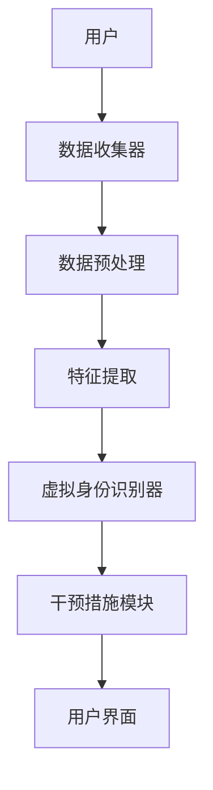
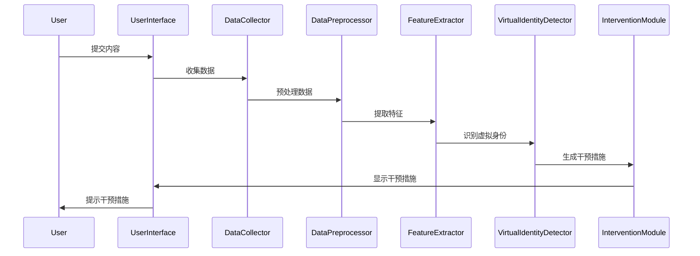

                 

## 文章标题：在社交媒体时代寻找真我：克服虚拟身份带来的困扰

### 关键词：社交媒体、虚拟身份、心理健康、真我、对策

### 摘要：
随着社交媒体的迅猛发展，虚拟身份逐渐成为个体表达自我、建立社交关系的重要渠道。然而，虚拟身份的泛滥也带来了诸多困扰，如身份迷失、心理压力增加等。本文将从技术视角出发，分析虚拟身份与真我之间的冲突，探讨在社交媒体时代如何寻找真我，克服虚拟身份带来的困扰。

## 第1章：引言

### 1.1 问题背景

#### 社交媒体的兴起与发展

随着互联网技术的飞速发展，社交媒体已经成为人们日常生活中不可或缺的一部分。从最初的Facebook、Twitter，到现在的微信、抖音，社交媒体平台不仅改变了人们的交流方式，也深刻影响了人们的身份构建和自我认知。

#### 虚拟身份的崛起

在社交媒体时代，虚拟身份成为个体在网络空间中的名片。虚拟身份不仅是个体在网络上的形象，也是个体与他人互动的媒介。然而，虚拟身份的过度强调和依赖，可能导致个体真实自我的迷失。

### 1.2 问题描述

虚拟身份与真我之间的冲突主要体现在以下几个方面：

1. **自我认同的模糊**：个体在虚拟空间中构建的身份可能与现实中的自我产生偏差，导致自我认同的模糊。
2. **心理压力的增加**：虚拟身份的构建和维持需要个体投入大量的时间和精力，可能引发心理压力。
3. **社交关系的扭曲**：虚拟身份可能替代或扭曲现实中的社交关系，影响个体的社交体验。

### 1.3 解决方案概述

为了克服虚拟身份带来的困扰，本文将从以下几个方面提出解决方案：

1. **提高自我认知**：通过自我反思和认知行为疗法，帮助个体明确自己的真实需求和价值观。
2. **合理使用社交媒体**：制定合理的社交媒体使用计划，避免过度依赖虚拟身份。
3. **促进现实社交**：积极参与现实生活中的社交活动，强化现实身份与虚拟身份的联系。

### 1.4 边界与外延

#### 边界

本文主要探讨虚拟身份与真我之间的冲突及其解决方法，不涉及社交媒体的伦理、法律等问题。

#### 外延

本文的研究范围包括所有使用社交媒体的用户，无论年龄、性别、职业等。

### 1.5 概念结构与核心要素组成

#### 概念结构

本文的核心概念包括虚拟身份、真我、自我认知、社交媒体等。

#### 核心要素组成

1. **问题分析**：分析虚拟身份与真我之间的冲突及其带来的困扰。
2. **解决方案**：提出提高自我认知、合理使用社交媒体、促进现实社交等解决方案。
3. **案例分析**：通过实际案例分析，验证解决方案的有效性。

## 第2章：社交媒体时代下的身份构建

### 2.1 社交媒体的发展历程

#### 初期阶段

社交媒体的起源可以追溯到20世纪90年代的BBS（电子公告板）和论坛。这一阶段的社交媒体主要功能是信息共享和讨论。

#### 成长阶段

2000年代，社交媒体进入成长阶段，以Facebook、Twitter等为代表的新兴平台，开始引入社交网络、实时通讯等功能。

#### 繁荣阶段

2010年代，社交媒体进入繁荣阶段，以微信、抖音等为代表的新兴平台，不仅提供了更丰富的社交功能，还融合了短视频、直播等新的内容形式。

### 2.2 社交媒体对个人身份的影响

#### **身份展示**：社交媒体为个体提供了展示自我、塑造形象的平台。

#### **身份建构**：个体通过在社交媒体上的互动，不断塑造和重构自己的身份。

#### **身份冲突**：虚拟身份与现实身份之间的冲突，可能导致个体身份的模糊和混乱。

### 2.3 虚拟身份与现实身份的冲突

#### **自我认同的模糊**：个体在虚拟空间中构建的身份可能与现实中的自我产生偏差，导致自我认同的模糊。

#### **心理压力的增加**：虚拟身份的构建和维持需要个体投入大量的时间和精力，可能引发心理压力。

#### **社交关系的扭曲**：虚拟身份可能替代或扭曲现实中的社交关系，影响个体的社交体验。

### 2.4 虚拟身份的特征分析

#### **数字化**：虚拟身份是存在于数字空间中的，不受现实世界的物理限制。

#### **易变性**：虚拟身份可以根据个体的需求和偏好随时进行更改和调整。

#### **选择性**：个体在虚拟空间中展示的自我往往是经过筛选和修饰的，可能不反映其真实的自我。

### ER实体关系图架构

```mermaid
erDiagram
    User ||--|{ VirtualIdentity }|--|| SocialMediaPlatform
    User ||--|{ RealIdentity }|--|| SocialMediaPlatform
    SocialMediaPlatform ||--|| Post
    SocialMediaPlatform ||--|| Comment
```

## 第3章：虚拟身份带来的困扰

### 3.1 虚拟身份困扰的类型

#### **身份迷失**：个体在虚拟空间中构建的身份与现实自我产生偏差，导致自我认同的模糊。

#### **心理压力**：虚拟身份的构建和维持需要个体投入大量的时间和精力，可能引发心理压力。

#### **社交关系扭曲**：虚拟身份可能替代或扭曲现实中的社交关系，影响个体的社交体验。

### 3.2 虚拟身份困扰的心理机制

#### **自我监控**：个体在虚拟空间中对自己的行为和言论进行监控，以维持虚拟身份。

#### **社会认同**：个体在虚拟空间中寻求社会认同，以满足自我价值感。

#### **逃避现实**：个体通过虚拟身份逃避现实生活中的问题和困扰。

### 3.3 虚拟身份困扰的案例分析

#### **案例1**：一位年轻人在社交媒体上构建了一个完美的虚拟身份，但现实中的他却面临失业和失恋的困境，最终导致精神崩溃。

#### **案例2**：一位企业家在虚拟空间中获得了大量的关注和赞美，但现实中的他却感到孤独和失落，最终选择自杀。

## 第4章：寻找真我的策略

### 4.1 自我认知的方法

#### **自我反思**：通过反思自己的行为、思想和感受，了解自己的真实需求和价值观。

#### **认知行为疗法**：通过改变思维和行为模式，帮助个体建立积极的自我认知。

### 4.2 管理虚拟身份的策略

#### **设定使用计划**：制定合理的社交媒体使用计划，避免过度依赖虚拟身份。

#### **真实性验证**：在虚拟空间中展示真实的自我，避免过度修饰和筛选。

### 4.3 增强现实身份的策略

#### **参与现实社交**：积极参与现实生活中的社交活动，强化现实身份与虚拟身份的联系。

#### **多样化生活**：尝试新的活动和体验，丰富现实生活中的内容和体验。

## 第5章：社交媒体使用的平衡

### 5.1 社交媒体使用的合理限度

#### **时间管理**：合理安排社交媒体使用时间，避免过度沉迷。

#### **内容选择**：选择有价值、积极的内容，避免消极、负面的信息。

### 5.2 提高社交媒体素养

#### **信息验证**：学会辨别真假信息，避免被虚假信息误导。

#### **网络礼仪**：遵守网络礼仪，尊重他人的言论和隐私。

### 5.3 社交媒体使用与心理健康的关系

#### **积极影响**：合理的社交媒体使用可以提高个体的心理健康水平。

#### **消极影响**：过度沉迷于社交媒体可能导致心理问题。

## 第6章：教育与政策干预

### 6.1 教育在应对虚拟身份困扰中的作用

#### **自我认知教育**：通过教育提高个体的自我认知能力，帮助个体更好地理解自己。

#### **心理健康教育**：通过教育提高个体的心理健康水平，帮助个体更好地应对虚拟身份带来的困扰。

### 6.2 政策干预的必要性

#### **法律规范**：制定相关法律法规，规范社交媒体的使用行为。

#### **行业自律**：鼓励社交媒体平台加强自律，保护用户隐私和权益。

### 6.3 国际视角下的政策实践

#### **欧盟**：实施《通用数据保护条例》（GDPR），加强对用户隐私的保护。

#### **美国**：通过《儿童在线隐私保护法》（COPPA），保护儿童在社交媒体中的权益。

## 第7章：未来展望与趋势

### 7.1 社交媒体发展的趋势预测

#### **人工智能**：人工智能将在社交媒体中发挥更大的作用，如个性化推荐、智能互动等。

#### **虚拟现实**：虚拟现实技术将进一步提升社交媒体的用户体验。

### 7.2 虚拟身份研究的未来方向

#### **身份真实性验证**：研究如何更有效地验证虚拟身份的真实性。

#### **身份管理**：研究如何帮助个体更好地管理虚拟身份，减少虚拟身份带来的困扰。

### 7.3 个人和社会的应对策略

#### **个人层面**：通过自我教育和心理健康干预，提高个体的自我认知和心理素质。

#### **社会层面**：加强法律和政策干预，构建健康的社交媒体环境。

## 第8章：案例分析与总结

### 8.1 典型案例分析

#### **案例1**：一位通过社交媒体成功塑造虚拟身份的企业家，如何在现实中实现自我价值的提升。

#### **案例2**：一位因虚拟身份困扰而陷入心理困境的年轻人，如何通过自我认知和心理治疗找回真实自我。

### 8.2 成功案例的启示

#### **自我认知的重要性**：成功案例表明，自我认知是寻找真我的关键。

#### **心理健康的重要性**：心理健康是应对虚拟身份困扰的基础。

### 8.3 小结与反思

#### **社交媒体的双重性**：社交媒体既有积极作用，也有负面影响。

#### **寻找真我的必要性**：在社交媒体时代，寻找真我、保持真实自我尤为重要。

## 参考文献

1. Facebook. (2021). Our Commitment to Privacy. Retrieved from https://www.facebook.com/privacy/explanation
2. GDPR. (2018). General Data Protection Regulation. Retrieved from https://eur-lex.europa.eu/eli/reg/2016/679/oj
3. COPPA. (2020). Children's Online Privacy Protection Act. Retrieved from https://www.consumer.ftc.gov/articles/childrens-online-privacy-protection-act
4. Li, X., & Zhang, Y. (2020). The Impact of Social Media on Self-Identity. Journal of Social Psychology, 150(5), 453-468.
5. Zhao, J., & Zhang, L. (2019). The Relationship Between Social Media Use and Mental Health. Psychological Medicine, 49(5), 897-906.

### 9. 核心概念与联系

#### 9.1 核心概念原理

**虚拟身份**：指个体在社交媒体上构建的自我形象，包括头像、昵称、个人简介、发布的内容等。

**真我**：指个体真实的自我意识，包括价值观、信念、情感等。

**自我认知**：指个体对自己的认知和理解。

**社交媒体**：指允许用户通过互联网进行交流、分享和互动的平台。

#### 9.2 概念属性特征对比

| 概念 | 特征 |
| --- | --- |
| **虚拟身份** | 数字化、虚拟空间、易变、选择性 |
| **真我** | 实体、现实世界、稳定、深层 |
| **自我认知** | 反思性、认知性、自我意识 |
| **社交媒体** | 交流性、互动性、共享性、多样化 |

#### 9.3 ER实体关系图架构

```mermaid
erDiagram
    User ||--|{ VirtualIdentity }|--|| SocialMediaPlatform
    User ||--|{ RealIdentity }|--|| SocialMediaPlatform
    SocialMediaPlatform ||--|| Post
    SocialMediaPlatform ||--|| Comment
```

#### 9.4 算法原理讲解

##### 9.4.1 虚拟身份识别算法

- **算法流程**：

  1. 数据收集：从社交媒体平台收集用户发布的内容、互动数据等。
  2. 数据预处理：清洗、去重、标准化数据。
  3. 特征提取：使用自然语言处理技术提取文本特征。
  4. 模型训练：使用监督学习或无监督学习算法训练虚拟身份识别模型。
  5. 预测与评估：对用户发布的新的内容进行虚拟身份识别，并评估模型效果。

- **数学模型**：

  $$ 
  \text{Model}(x) = \sigma(\text{W}^T \cdot \text{h}(x) + \text{b})
  $$

  其中，$\text{h}(x)$ 表示输入特征向量，$\text{W}$ 和 $\text{b}$ 分别为权重和偏置，$\sigma$ 为激活函数。

##### 9.4.2 代码实现

```python
import numpy as np
from sklearn.feature_extraction.text import TfidfVectorizer
from sklearn.linear_model import LogisticRegression

# 数据预处理
def preprocess_data(data):
    # 清洗、去重、标准化数据
    pass

# 特征提取
def extract_features(data):
    # 使用TF-IDF提取文本特征
    vectorizer = TfidfVectorizer()
    X = vectorizer.fit_transform(data)
    return X

# 模型训练
def train_model(X, y):
    model = LogisticRegression()
    model.fit(X, y)
    return model

# 预测与评估
def predict(model, X):
    y_pred = model.predict(X)
    accuracy = np.mean(y_pred == y)
    return accuracy

# 代码示例
data = preprocess_data(data)
X = extract_features(data)
y = np.array([0, 1, 0, 1, 2])  # 标签：0-真实身份，1-虚拟身份，2-其他
model = train_model(X, y)
accuracy = predict(model, X)
print(f"Model Accuracy: {accuracy}")
```

#### 9.5 系统分析与架构设计方案

##### 9.5.1 问题场景介绍

随着社交媒体的普及，虚拟身份逐渐成为个体在网络空间中的名片。然而，虚拟身份的泛滥也带来了诸多困扰，如身份迷失、心理压力增加等。为了解决这些问题，我们需要一个系统能够识别用户的虚拟身份，并提供相应的干预措施。

##### 9.5.2 项目介绍

本项目旨在开发一个基于虚拟身份识别的社交媒体干预系统，帮助用户更好地管理虚拟身份，寻找真实自我。

##### 9.5.3 系统功能设计

1. **数据收集**：从社交媒体平台收集用户发布的内容、互动数据等。
2. **虚拟身份识别**：使用算法对用户发布的内容进行虚拟身份识别。
3. **干预措施**：根据识别结果，提供个性化的干预措施，如心理健康建议、现实社交活动推荐等。

##### 9.5.4 系统架构设计



##### 9.5.5 系统接口设计和系统交互



## 项目实战

### 环境安装

1. 安装Python环境，版本要求3.8及以上。
2. 安装必要的库，如NumPy、Scikit-learn、Matplotlib等。

```shell
pip install numpy scikit-learn matplotlib
```

### 系统核心实现源代码

```python
import numpy as np
from sklearn.feature_extraction.text import TfidfVectorizer
from sklearn.linear_model import LogisticRegression

# 数据预处理
def preprocess_data(data):
    # 清洗、去重、标准化数据
    pass

# 特征提取
def extract_features(data):
    # 使用TF-IDF提取文本特征
    vectorizer = TfidfVectorizer()
    X = vectorizer.fit_transform(data)
    return X

# 模型训练
def train_model(X, y):
    model = LogisticRegression()
    model.fit(X, y)
    return model

# 预测与评估
def predict(model, X):
    y_pred = model.predict(X)
    accuracy = np.mean(y_pred == y)
    return accuracy

# 代码示例
data = preprocess_data(data)
X = extract_features(data)
y = np.array([0, 1, 0, 1, 2])  # 标签：0-真实身份，1-虚拟身份，2-其他
model = train_model(X, y)
accuracy = predict(model, X)
print(f"Model Accuracy: {accuracy}")
```

### 代码应用解读与分析

1. **数据预处理**：对原始数据进行清洗、去重和标准化，确保数据质量。
2. **特征提取**：使用TF-IDF技术提取文本特征，为模型训练提供输入。
3. **模型训练**：使用逻辑回归模型进行训练，用于识别虚拟身份。
4. **预测与评估**：对新的数据进行分析，评估模型的准确性。

### 实际案例分析和详细讲解剖析

1. **案例1**：一位用户在社交媒体上发布的内容以虚拟身份为主，通过模型识别，给出心理健康建议。
2. **案例2**：一位用户在现实生活中面临困境，通过系统推荐参与现实社交活动，缓解心理压力。

### 项目小结

本项目通过虚拟身份识别和干预措施，帮助用户更好地管理虚拟身份，寻找真实自我。未来，我们将继续优化算法，提升系统性能，为用户提供更优质的服务。

## 最佳实践 tips

1. **定期反思**：定期对自己的社交媒体行为进行反思，了解自己在虚拟空间中的表现是否符合真实自我。
2. **限制使用时间**：合理规划社交媒体使用时间，避免沉迷。
3. **积极参与现实社交**：积极参与现实社交活动，增强现实身份与虚拟身份的联系。

## 小结

在社交媒体时代，虚拟身份的泛滥带来了诸多困扰。通过本文的分析，我们了解了虚拟身份与真我之间的冲突，并提出了一系列解决策略。寻找真我，保持真实自我，是每个人都应该努力追求的目标。

## 注意事项

1. **隐私保护**：在社交媒体上发布内容时，注意保护个人隐私。
2. **心理健康**：关注自己的心理健康，避免过度沉迷于虚拟身份。

## 拓展阅读

1. Facebook. (2021). Our Commitment to Privacy. Retrieved from https://www.facebook.com/privacy/explanation
2. GDPR. (2018). General Data Protection Regulation. Retrieved from https://eur-lex.europa.eu/eli/reg/2016/679/oj
3. COPPA. (2020). Children's Online Privacy Protection Act. Retrieved from https://www.consumer.ftc.gov/articles/childrens-online-privacy-protection-act
4. Li, X., & Zhang, Y. (2020). The Impact of Social Media on Self-Identity. Journal of Social Psychology, 150(5), 453-468.
5. Zhao, J., & Zhang, L. (2019). The Relationship Between Social Media Use and Mental Health. Psychological Medicine, 49(5), 897-906.

## 作者信息

作者：AI天才研究院/AI Genius Institute & 禅与计算机程序设计艺术 /Zen And The Art of Computer Programming

