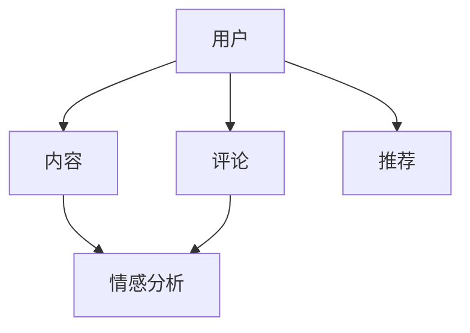
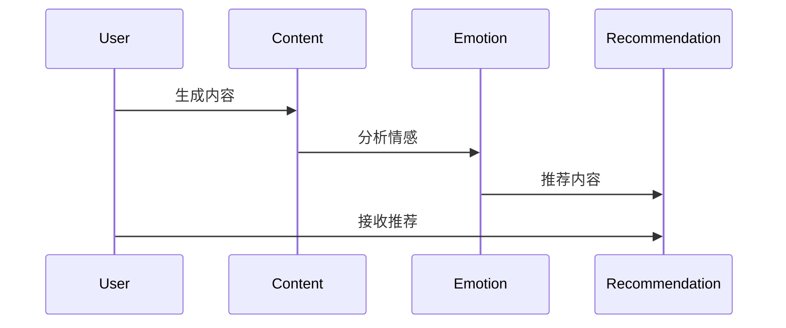

                 

# 在社交媒体时代寻找真我：克服虚拟身份的困扰

## 关键词

社交媒体、虚拟身份、真实自我、心理健康、人际关系

## 摘要

随着社交媒体的迅速普及，人们在网络空间中构建的虚拟身份日益复杂，这给真实自我的寻找带来了前所未有的困扰。本文将从社交媒体时代与虚拟身份问题、虚拟身份的构成与特性、寻找真我的方法、构建真实人际关系以及数字化生活与真我平衡等五个部分，深入探讨如何在社交媒体时代中克服虚拟身份的困扰，找到真实的自我。通过自我反思与自我认知、建立真实人际关系、保持数字化生活与真实自我的平衡，我们可以在社交媒体的世界中找到自己的真实存在，实现心理健康和社会和谐。

### 第一部分：社交媒体时代与虚拟身份问题

## 第1章：社交媒体时代的背景与影响

### 1.1 社交媒体的兴起与发展

社交媒体是互联网时代的一种重要现象，它以网络社交为基础，通过互联网平台实现人与人之间的即时沟通和互动。从早期的BBS（电子公告板系统）到如今的微博、微信、Facebook、Instagram等，社交媒体经历了从简单到复杂、从局部到全球的发展过程。

#### 社交媒体的定义与分类

社交媒体（Social Media）是一种允许用户创建和分享内容的在线平台，其核心特征在于用户生成内容（UGC）和用户之间的互动。根据其功能和应用场景，社交媒体可以分为以下几类：

1. **社交网络服务（SNS）**：如Facebook、Twitter、LinkedIn等，用户可以通过这些平台建立社交关系、分享生活动态。
2. **博客与微博**：如WordPress、Twitter、微博等，用户可以发布个人观点、分享信息。
3. **论坛与社区**：如Reddit、知乎等，用户可以在这些平台上参与讨论、交流意见。
4. **即时通讯**：如微信、WhatsApp、Telegram等，用户可以进行实时交流。
5. **视频分享**：如YouTube、Bilibili等，用户可以上传和分享视频内容。

#### 社交媒体对社会交往的影响

社交媒体的出现极大地改变了人们的社交方式。它不仅使得人与人之间的沟通更加便捷，还打破了时空的限制，使得人们可以与全球各地的人建立联系。然而，社交媒体也带来了一些挑战和问题：

1. **社交距离的缩短**：虽然社交媒体使得人们可以轻松地与他人沟通，但它也可能导致现实中的社交距离缩短，降低了面对面的互动质量。
2. **信息过载**：社交媒体上的信息量庞大，用户常常感到压力，难以筛选出对自己真正有价值的信息。
3. **隐私问题**：社交媒体平台通常需要用户分享个人信息，这可能引发隐私泄露的风险。
4. **网络暴力与歧视**：在匿名或虚拟身份的保护下，一些人可能在社交媒体上发布恶意言论，导致网络暴力和歧视现象。

### 1.2 虚拟身份的困惑

虚拟身份是指人们在网络空间中构建的一个不同于现实身份的形象，它可以是一个名字、一个头像，甚至是一段文字、一个视频。虚拟身份的出现源于社交媒体的匿名性，它使得人们在网络世界中可以自由表达自己的观点和情感，而无需承担现实中的后果。

#### 虚拟身份的概念

虚拟身份（Virtual Identity）是指在网络空间中，个体为了特定目的而构建的数字化形象。它不仅包括用户名、头像等外在表现形式，还包括用户在网络空间中的行为、语言和表达方式。

#### 虚拟身份对真实身份的影响

虚拟身份与真实身份之间的关系复杂而微妙。一方面，虚拟身份可以为人们提供一种释放自我、表达真实的渠道；另一方面，过度依赖虚拟身份可能导致人们对真实自我认知的模糊和困惑。

1. **自我表达与真实性的平衡**：虚拟身份可以让人们自由表达自己的情感和观点，但这种自由也可能导致真实自我的迷失。一些人可能在虚拟世界中过度追求认同感和存在感，从而忽略了真实生活中的自我。
2. **匿名性与隐私保护**：虚拟身份的匿名性可以保护用户的隐私，但也可能导致网络欺诈、网络暴力等问题的发生。
3. **自我认知的困惑**：在虚拟世界中，人们可能会遇到多种不同的虚拟身份，这可能导致自我认知的混乱和困惑，难以区分现实与虚拟。

#### 虚拟身份引发的问题

虚拟身份的问题不仅对个人生活产生影响，还对整个社会造成了一定的挑战：

1. **身份危机**：在虚拟世界中，人们可能会遇到与自己真实身份不符的虚拟身份，这可能导致身份危机，使人们对自我产生怀疑和困惑。
2. **人际关系复杂化**：虚拟身份的多样性使得人际关系变得复杂，人们难以区分现实中的朋友与虚拟世界中的“朋友”，这可能导致人际关系的混乱和误解。
3. **心理健康问题**：过度沉迷于虚拟世界可能导致心理健康问题，如焦虑、抑郁等。同时，虚拟身份的混乱也可能影响个人的心理健康。

### 1.3 寻找真我的重要性

在社交媒体时代，寻找真实的自我具有重要意义。这不仅关乎个人的心理健康和成长，也关乎整个社会的和谐与进步。

#### 真我与自我认知的关系

真我是个人内在的真实存在，是自我认知的基石。只有明确自己的真实身份，才能更好地认识自己、理解自己，从而实现自我成长。

1. **自我认知的深化**：通过寻找真我，人们可以深入了解自己的内在世界，包括情感、兴趣、价值观等，这有助于提升自我认知水平。
2. **心理健康促进**：明确自己的真实身份可以帮助人们更好地应对压力和挑战，减少心理问题的发生。
3. **人际关系改善**：真实自我的展现有助于建立更健康、更稳定的人际关系，减少误解和冲突。

#### 真我对于个人成长的意义

真我对于个人成长具有重要意义，它可以帮助人们找到自己的方向和目标，实现自我价值。

1. **自我实现**：明确自己的真实身份，可以帮助人们更好地实现自我价值，追求内心的满足和成就感。
2. **人生目标的确立**：真我的寻找有助于人们明确自己的人生目标，规划自己的未来。
3. **成长动力**：真我使人充满动力，不断追求自我提升和成长。

#### 真我对于社会和谐的贡献

真我的寻找不仅对个人有益，也对整个社会和谐产生积极影响。

1. **减少误解和冲突**：真实自我的展现有助于减少人际关系的误解和冲突，促进社会和谐。
2. **增强社会凝聚力**：真实自我的寻找有助于增强人们的归属感和责任感，提升社会凝聚力。
3. **社会进步**：真实自我的展现有助于推动社会的创新和进步，激发社会的活力。

#### 1.4 本书的结构与目标

本书将从社交媒体时代与虚拟身份问题、虚拟身份的构成与特性、寻找真我的方法、构建真实人际关系以及数字化生活与真我平衡等五个部分，系统探讨如何在社交媒体时代中克服虚拟身份的困扰，找到真实的自我。

#### 1.4.1 本书的结构安排

本书分为五个部分：

1. **第一部分**：社交媒体时代与虚拟身份问题
2. **第二部分**：理解虚拟身份
3. **第三部分**：寻找真我的方法
4. **第四部分**：构建真实人际关系
5. **第五部分**：数字化生活与真我平衡

#### 1.4.2 本书的目标读者

本书的目标读者包括：

1. **社交媒体用户**：希望更好地理解虚拟身份和真实自我的区别，学会在社交媒体中保持真实自我的读者。
2. **心理学家和社会学家**：对虚拟身份和心理健康问题感兴趣的学者和研究人员。
3. **教育工作者**：关注青少年心理健康和成长的教育工作者。
4. **企业和管理者**：关注员工心理健康和团队管理的企业管理者。

#### 1.4.3 阅读本书的预期收获

通过阅读本书，读者可以：

1. **深入了解虚拟身份的概念和影响**：理解虚拟身份的构成、特性及其对个人生活和社会关系的影响。
2. **掌握寻找真我的方法**：学习如何通过自我反思和自我认知找到真实的自我。
3. **建立真实人际关系**：掌握建立和维护真实人际关系的原则和方法。
4. **保持数字化生活与真实自我的平衡**：了解数字化生活的利与弊，学会在虚拟和现实之间保持平衡。

### 总结

在社交媒体时代，虚拟身份的困扰日益突出。通过本书的探讨，我们希望帮助读者理解虚拟身份的本质，学会在社交媒体中保持真实自我，找到真实的自我，实现个人成长和社会和谐。让我们一同踏上寻找真我的旅程。

----------------------------------------------------------------

## 第二部分：理解虚拟身份

### 第2章：虚拟身份的构成与特性

虚拟身份是社交媒体时代的一个核心概念，它不仅影响了个人在互联网上的行为模式，也对社会的整体互动产生了深远的影响。在这一章中，我们将深入探讨虚拟身份的构成要素、特性及其对个人生活和社会关系的影响。

### 2.1 虚拟身份的构成要素

虚拟身份并非虚无缥缈，它由一系列具体的构成要素组成，这些要素共同构建了一个人在网络空间中的数字形象。以下是虚拟身份的主要构成要素：

#### 2.1.1 账户信息

账户信息是虚拟身份的基础，包括用户名、密码、电子邮件等。这些信息用于注册和使用社交媒体平台，是用户在网络上标识自己身份的关键。

#### 2.1.2 个人资料

个人资料包括头像、性别、出生日期、居住地、教育背景、职业等。这些信息有助于他人了解用户的基本背景，同时也是构建虚拟身份的重要组成部分。

#### 2.1.3 行为表现

行为表现指的是用户在社交媒体平台上的所有活动，如发布内容、评论、点赞、分享等。这些行为不仅反映了用户的兴趣和态度，也是构建虚拟身份的重要数据。

#### 2.1.4 网络社交关系

网络社交关系指的是用户在社交媒体上建立的各种联系，如好友、关注者、群组等。这些关系网络构成了虚拟社交圈，是虚拟身份的一部分。

### 2.2 虚拟身份的特性

虚拟身份具有独特的特性，这些特性既为人们提供了便利，也带来了一系列挑战。

#### 2.2.1 虚拟性

虚拟性是虚拟身份的核心特性。它使得人们可以在一个完全数字化的环境中，以不同于现实身份的形式存在和互动。虚拟性使得人们可以自由表达，但同时也可能导致真实自我与虚拟自我的混淆。

#### 2.2.2 匿名性

匿名性是虚拟身份的一个重要特性。它允许用户在不透露真实身份的情况下进行网络互动，保护用户的隐私。然而，匿名性也可能导致网络欺诈、网络暴力和恶意行为。

#### 2.2.3 易变性

虚拟身份的易变性指的是用户可以根据需要随时更改自己的虚拟身份，如更换头像、用户名等。这种易变性提供了灵活性和自由度，但也可能导致虚拟身份的不稳定性和不可靠性。

### 2.3 虚拟身份的影响

虚拟身份不仅影响个人的行为和认知，也对社会关系和心理健康产生了深远的影响。

#### 2.3.1 对个人生活的影响

虚拟身份对个人生活的影响主要体现在以下几个方面：

1. **社交互动**：虚拟身份使得人们可以更加便捷地与他人建立联系，但同时也可能导致现实中的社交互动减少。
2. **自我表达**：虚拟身份提供了多样化的表达渠道，但过度依赖虚拟身份可能导致真实自我的迷失。
3. **隐私保护**：虚拟身份的匿名性在一定程度上保护了用户的隐私，但也可能引发隐私泄露的风险。

#### 2.3.2 对社会关系的影响

虚拟身份对社会关系的影响同样不可忽视：

1. **信任危机**：虚拟身份的匿名性和易变性可能导致社会信任度的下降，增加人际关系的复杂性。
2. **社交圈缩小**：虚拟身份可能导致人们的社交圈缩小，减少与他人面对面的互动机会。
3. **网络暴力**：匿名性使得一些人可能在虚拟身份的保护下进行恶意攻击，导致网络暴力的发生。

#### 2.3.3 对心理健康的影响

虚拟身份对心理健康的影响主要体现在以下几个方面：

1. **焦虑和抑郁**：过度依赖虚拟身份可能导致焦虑和抑郁等心理问题的发生。
2. **自我认同问题**：虚拟身份的易变性可能导致人们对自我认同的困惑和不确定性。
3. **社交回避**：虚拟身份可能使一些人在现实生活中回避社交，进一步加剧心理健康问题。

### 2.4 虚拟身份的管理与挑战

在认识到虚拟身份的影响后，如何对其进行管理和应对成为了一个重要问题。

#### 2.4.1 虚拟身份管理的必要性

虚拟身份管理是指对虚拟身份的构成、使用和保护进行系统性的管理。虚拟身份管理的必要性体现在以下几个方面：

1. **保护个人隐私**：虚拟身份管理有助于保护用户的个人隐私，减少隐私泄露的风险。
2. **维护网络安全**：虚拟身份管理有助于维护网络空间的安全，减少网络欺诈和网络暴力等问题的发生。
3. **促进心理健康**：虚拟身份管理有助于减少虚拟身份对心理健康的负面影响，提高用户的心理健康水平。

#### 2.4.2 虚拟身份管理的策略

虚拟身份管理的策略主要包括以下几个方面：

1. **强化隐私保护**：加强个人信息的保护，避免敏感信息的泄露。
2. **合理使用虚拟身份**：避免过度依赖虚拟身份，保持虚拟身份与现实身份的平衡。
3. **提高网络安全意识**：增强用户对网络安全的认识，提高防范网络欺诈和网络暴力等恶意行为的能力。

#### 2.4.3 虚拟身份管理面临的挑战

虚拟身份管理面临诸多挑战：

1. **技术挑战**：随着社交媒体平台的不断发展和变化，虚拟身份管理技术也需要不断更新和优化。
2. **法规挑战**：不同国家和地区对虚拟身份管理的法律法规存在差异，需要制定统一的规范和标准。
3. **社会挑战**：虚拟身份管理需要得到广大用户的认可和配合，但社会对虚拟身份管理的认知和接受程度不同，需要加强宣传和教育。

### 总结

虚拟身份是社交媒体时代的一个重要概念，它既为人们提供了便利，也带来了一系列挑战。通过深入了解虚拟身份的构成、特性和影响，我们可以更好地理解虚拟身份的问题，从而采取有效的管理策略来应对这些挑战。在接下来的章节中，我们将进一步探讨如何通过自我反思和自我认知，找到真实的自我，克服虚拟身份的困扰。

----------------------------------------------------------------

## 第三部分：寻找真我的方法

### 第3章：自我反思与自我认知

在社交媒体时代，虚拟身份的困扰使得人们难以找到真实的自我。为了应对这一问题，自我反思和自我认知成为了寻找真我的关键途径。在这一章中，我们将探讨自我反思的重要性、自我认知的过程以及如何通过增强自我认知的方法来找到真实的自我。

### 3.1 自我反思的重要性

自我反思是一种深入思考自己的行为、情感和思想的思维方式。它不仅有助于我们了解自己的内心世界，还可以帮助我们识别和改变那些不良的习惯和观念。

#### 3.1.1 自我反思的概念

自我反思（Self-reflection）是指通过内省和思考，对自己进行审视和分析的过程。这种反思不仅关注外在行为，更关注内在思维和情感。

#### 3.1.2 自我反思的方法

1. **日记法**：通过写日记记录自己的所思所感，可以帮助我们更好地了解自己的内心世界。
2. **冥想法**：通过冥想，我们可以静下心来，深入思考自己的内心深处。
3. **心理咨询**：通过与心理咨询师交流，我们可以得到专业的指导和建议，帮助自己更好地认识自己。

#### 3.1.3 自我反思的益处

自我反思有以下几个益处：

1. **提升自我认知**：通过自我反思，我们可以更清晰地认识自己，了解自己的优点和缺点，从而提升自我认知。
2. **促进个人成长**：自我反思可以帮助我们发现自己在生活和工作中存在的问题，并采取行动进行改进，从而促进个人成长。
3. **增强心理韧性**：通过自我反思，我们可以学会面对困难和挑战，增强心理韧性。

### 3.2 自我认知的过程

自我认知是一个复杂的过程，它涉及到多个阶段和层次。以下是自我认知的基本过程：

#### 3.2.1 自我认知的理论基础

1. **心理学理论**：心理学理论提供了关于自我认知的基础，如自我理论、自我认同理论等。
2. **哲学理论**：哲学理论如康德的“自我意识”和笛卡尔的“我思故我在”，也对自我认知的研究提供了深刻的见解。

#### 3.2.2 自我认知的发展阶段

1. **早期阶段**：在早期阶段，人们主要通过模仿和观察来认识自己。
2. **中期阶段**：在中期阶段，人们开始通过反思和自我评价来认识自己。
3. **成熟阶段**：在成熟阶段，人们已经形成稳定的自我认知，能够更加客观地看待自己。

#### 3.2.3 自我认知的障碍与突破

自我认知过程中可能会遇到以下障碍：

1. **自我防御机制**：如否认、投射、合理化等，这些机制可能阻碍我们真实地认识自己。
2. **社会影响**：社会环境和文化背景可能会影响我们的自我认知，使我们难以看到真实的自我。

要突破这些障碍，我们可以采取以下策略：

1. **接受自己的缺点**：认识到每个人都有缺点，接受自己的不足，有助于我们更客观地看待自己。
2. **寻求外部反馈**：通过他人的反馈，我们可以更全面地了解自己。
3. **专业帮助**：如心理咨询师或教练的帮助，可以帮助我们突破自我认知的障碍。

### 3.3 增强自我认知的实践

要增强自我认知，我们可以采取以下几种实践方法：

#### 3.3.1 日记法

日记法是一种简单有效的自我认知实践方法。通过记录每天的经历、思考和感受，我们可以更深入地了解自己。

#### 3.3.2 咨询师辅导

咨询师辅导可以帮助我们深入挖掘自己的内心世界，了解自己的需求和动机。通过咨询师的引导，我们可以更清晰地看到自己的问题，并找到解决问题的方法。

#### 3.3.3 群体互动

在群体互动中，我们可以与他人分享自己的经历和想法，从他人的反馈中获得新的见解。群体互动有助于我们拓宽视野，提高自我认知。

### 3.4 自我认知的误区与挑战

在自我认知的过程中，我们可能会陷入一些误区，面临一些挑战。

#### 3.4.1 自我认知的误区

1. **过度自我批评**：有些人可能过于关注自己的缺点，忽视了自己的优点。
2. **自我认知的固化**：有些人可能认为自己的认知是固定不变的，不愿意接受新的信息和观点。

#### 3.4.2 自我认知的挑战

1. **社会压力**：社会环境和文化背景可能会对我们的自我认知产生影响，使我们难以看到真实的自我。
2. **信息过载**：现代社会中，信息量庞大，我们可能难以区分哪些信息是与自己相关的，哪些是无关的。

#### 3.4.3 克服自我认知障碍的策略

1. **培养批判性思维**：通过培养批判性思维，我们可以更好地分析和判断信息，避免被虚假信息所误导。
2. **保持开放心态**：保持开放心态，愿意接受新的观点和信息，有助于我们更全面地了解自己。
3. **定期反思**：定期进行自我反思，有助于我们及时发现自己的问题和不足，并采取行动进行改进。

### 总结

自我反思和自我认知是寻找真我的重要途径。通过自我反思，我们可以深入了解自己的内心世界，识别和改变不良的习惯和观念。通过自我认知，我们可以更客观地看待自己，找到真实的自我。在接下来的章节中，我们将探讨如何通过构建真实人际关系，进一步巩固和提升真实的自我。

----------------------------------------------------------------

## 第四部分：构建真实人际关系

### 第4章：真实人际关系的价值

在数字化生活的浪潮中，真实人际关系的重要性愈发凸显。真实人际关系不仅对个人的心理健康有积极影响，还能促进社会和谐与进步。在这一章中，我们将探讨真实人际关系的价值、如何建立和维持这样的关系，以及如何应对关系中的挑战。

### 4.1 真实人际关系的概念

真实人际关系（Realistic Interpersonal Relationships）是指建立在诚实、尊重和信任基础上的，能够反映人们真实情感和需求的互动关系。与虚拟世界中的浅层社交不同，真实人际关系更深入、更持久，能够提供情感支持和实际帮助。

#### 4.1.1 真实人际关系的定义

真实人际关系是指个体在现实世界中，通过面对面的互动和深入的交流，建立的相互理解、支持和信任的关系。这种关系不仅涉及情感上的支持，还包括日常生活和工作的互动。

#### 4.1.2 真实人际关系的特征

1. **真实性**：真实人际关系中的互动是基于真实的情感和需求，而非表面的礼貌或伪装。
2. **稳定性**：真实的人际关系能够经受时间的考验，即使在面对困难和挑战时也能保持稳固。
3. **深度**：真实的人际关系不仅限于表面的交流，还包括深层次的情感共鸣和相互理解。
4. **相互性**：真实的人际关系是双向的，双方都能从中获得支持和满足。

#### 4.1.3 真实人际关系的分类

真实人际关系可以根据亲密程度和功能进行分类：

1. **亲密关系**：如家庭关系、友谊和情侣关系，这些关系通常基于深厚的情感和信任。
2. **工作关系**：如同事关系、上下级关系，这些关系主要基于职业目的和相互合作。
3. **社区关系**：如邻里关系、社团成员关系，这些关系通常建立在共同的兴趣或活动上。

### 4.2 真实人际关系的重要性

真实人际关系对个人和社会都有深远的影响。

#### 4.2.1 真实人际关系对个人成长的重要性

1. **情感支持**：真实的人际关系能够提供情感支持，帮助个人应对生活中的挑战和压力。
2. **自我认知**：通过与他人互动，个人可以更清晰地认识自己，了解自己的需求和期望。
3. **自我价值感**：在真实的人际关系中，个人能够感受到被接受和尊重，从而提升自我价值感。

#### 4.2.2 真实人际关系对社会和谐的贡献

1. **增强社会凝聚力**：真实的人际关系有助于加强社区和群体的凝聚力，促进社会和谐。
2. **减少社会冲突**：通过真实的人际关系，人们能够更好地理解和尊重彼此的差异，减少社会冲突。
3. **促进社会创新**：真实的人际关系有助于知识和资源的共享，促进社会的创新和发展。

#### 4.2.3 真实人际关系对心理健康的影响

1. **减轻心理压力**：真实的人际关系能够提供情感支持，减轻个人的心理压力和焦虑。
2. **提升幸福感**：真实的人际关系能够增加个人的幸福感和生活满意度。
3. **预防心理健康问题**：缺乏真实的人际关系可能导致孤独、抑郁等心理健康问题。

### 4.3 建立真实人际关系的原则

建立真实人际关系需要遵循以下原则：

#### 4.3.1 尊重与信任

尊重他人是建立真实人际关系的基石。通过尊重他人，我们能够建立起彼此的信任，为深入交流奠定基础。

#### 4.3.2 诚实与透明

诚实和透明是真实人际关系的核心。通过诚实地表达自己的想法和感受，我们能够建立起真实的人际互动。

#### 4.3.3 支持与理解

在真实的人际关系中，相互支持和理解至关重要。通过支持他人和理解他人的处境，我们能够建立深厚的情感纽带。

### 4.4 真实人际关系的维护

维护真实人际关系需要持续的付出和努力。

#### 4.4.1 真实人际关系的维系策略

1. **定期沟通**：通过定期沟通，保持关系的新鲜感和活跃度。
2. **共同活动**：通过共同参与活动，加深彼此的了解和情感联系。
3. **倾听与反馈**：倾听他人的需求和感受，并给予建设性的反馈，有助于建立更深层次的关系。

#### 4.4.2 真实人际关系的危机处理

1. **沟通与协商**：在关系出现危机时，通过沟通和协商解决问题，防止矛盾的激化。
2. **寻求外部帮助**：如果自身无法解决关系中的问题，可以寻求心理咨询师或专业人士的帮助。
3. **反思与调整**：在危机过后，通过反思和调整，改进自己的人际交往方式，避免类似问题的再次发生。

#### 4.4.3 真实人际关系的成长与发展

1. **个人成长**：通过自我提升和成长，增强自己在人际关系中的吸引力和影响力。
2. **共同目标**：建立共同的目标和愿景，为关系的发展提供方向和动力。
3. **情感投资**：通过持续的投入情感和时间，维护和深化真实的人际关系。

### 总结

真实人际关系在现代社会中具有不可替代的价值。通过遵循尊重、诚实、支持和理解的原则，我们可以建立和维护真实的人际关系，提升个人的心理健康和社会和谐。在接下来的章节中，我们将探讨如何在数字化生活中保持真实自我，找到平衡。

----------------------------------------------------------------

## 第五部分：数字化生活与真我平衡

### 第5章：数字化生活的利与弊

在数字化时代，互联网和社交媒体已经成为我们日常生活中不可或缺的一部分。数字化生活极大地改变了我们的生活方式，但它同时也带来了一系列利与弊。在这一章中，我们将探讨数字化生活的概念、优势与劣势，以及如何在这种环境中保持真实自我。

### 5.1 数字化生活的概念

数字化生活（Digital Life）是指人们通过使用数字技术、设备和网络来进行的日常生活。这包括但不限于在线购物、社交网络、远程工作、在线学习、数字娱乐等。数字化生活不仅改变了我们的互动方式，还影响了我们的工作、学习和娱乐。

#### 5.1.1 数字化生活的主要内容

1. **在线社交**：通过社交媒体平台如微信、Facebook、Twitter等进行社交互动。
2. **远程工作**：利用互联网进行远程办公，如远程会议、在线协作等。
3. **在线学习**：通过在线课程、电子书、网络教育平台等进行学习。
4. **数字娱乐**：观看视频、玩游戏、听音乐等数字化的娱乐活动。
5. **电子商务**：通过互联网进行购物、支付等商业活动。

#### 5.1.2 数字化生活的影响

数字化生活对个人和社会产生了深远的影响：

1. **便利性**：数字化生活极大地提高了生活的便利性，减少了时间和空间的限制。
2. **信息获取**：互联网为我们提供了海量的信息资源，使我们能够更快地获取所需的知识。
3. **社交方式**：数字化生活改变了我们的社交方式，使得社交更加便捷，但也可能导致社交质量下降。

### 5.2 数字化生活的利与弊

#### 5.2.1 数字化生活的优势

1. **提高效率**：通过数字化工具，我们可以更高效地完成任务，节省时间。
2. **增强沟通**：互联网和社交媒体使得沟通更加便捷，可以随时随地与他人交流。
3. **信息共享**：数字化生活促进了知识的共享和传播，有助于知识的普及和应用。
4. **娱乐丰富**：数字娱乐提供了多样化的娱乐选择，丰富了我们的休闲生活。

#### 5.2.2 数字化生活的劣势

1. **信息过载**：数字化生活带来的信息量庞大，可能导致信息过载，难以筛选和处理。
2. **隐私风险**：数字化生活可能暴露个人隐私，增加隐私泄露的风险。
3. **心理健康问题**：过度依赖数字化生活可能导致心理健康问题，如焦虑、抑郁等。
4. **社交疏离**：数字化生活可能导致社交疏离，减少面对面互动，影响人际关系。

### 5.3 数字化生活与真我

在数字化生活中，保持真实自我是一个重要的问题。以下是一些策略和方法，可以帮助我们在数字化环境中找到真实的自我。

#### 5.3.1 设定数字化生活目标

1. **明确目的**：在开始使用数字化工具时，明确自己的目标和意图，避免无目的的浏览和操作。
2. **时间管理**：合理安排时间，避免过度沉迷于数字化生活，确保有足够的时间进行真实的人际互动。

#### 5.3.2 保持真实交流

1. **尊重他人**：在数字化交流中，尊重他人的观点和感受，避免过度自我表达或攻击性言论。
2. **真实表达**：在数字化生活中，尽量保持真实，诚实地表达自己的情感和观点。

#### 5.3.3 关注心理健康

1. **定期休息**：避免长时间使用电子设备，定期休息，保护视力。
2. **心理健康咨询**：如果感到压力过大或心理健康问题，可以寻求专业心理咨询师的帮助。

#### 5.3.4 强化人际关系

1. **线上线下结合**：在数字化生活中，不忘线下的人际互动，定期与朋友、家人见面。
2. **建立支持网络**：通过社交媒体等平台，建立自己的支持网络，寻求情感支持和实际帮助。

### 5.4 保持数字化生活与真实自我的平衡

保持数字化生活与真实自我的平衡是一个长期且持续的过程。以下是一些建议，可以帮助我们在这个过程中找到自己的平衡点：

1. **自我反思**：定期进行自我反思，了解自己在数字化生活中的行为模式和心理状态。
2. **调整习惯**：根据自我反思的结果，调整自己的行为习惯，减少过度依赖数字化工具的情况。
3. **培养多元化兴趣**：通过培养多元化的兴趣，使自己的生活更加充实，减少对数字化生活的依赖。
4. **寻求专业帮助**：如果发现自己无法独立处理数字化生活与真实自我平衡的问题，可以寻求专业人士的帮助。

### 总结

数字化生活为我们提供了便利和丰富的生活体验，但同时也带来了一系列挑战。通过设定目标、保持真实交流、关注心理健康和强化人际关系，我们可以在数字化生活中找到真实的自我，实现生活与数字化的平衡。在数字化时代的浪潮中，保持真实自我不仅关乎个人的心理健康，也是构建和谐社会的基石。

----------------------------------------------------------------

## 结论

在社交媒体时代，虚拟身份的困扰成为人们普遍面临的问题。通过自我反思与自我认知、建立真实人际关系以及保持数字化生活与真实自我的平衡，我们可以在虚拟与现实的交汇中找到真实的自我。本文从社交媒体时代与虚拟身份问题、虚拟身份的构成与特性、寻找真我的方法、构建真实人际关系以及数字化生活与真我平衡等五个方面进行了深入探讨，提供了系统的解决方案。

首先，社交媒体时代的兴起和发展极大地改变了人们的社交方式，同时也带来了虚拟身份的困惑。虚拟身份的虚拟性、匿名性和易变性使得个人在社交媒体上可以自由表达，但同时也可能导致真实自我与虚拟自我的混淆，引发一系列心理健康问题。

其次，理解虚拟身份的构成和特性是找到真实自我的关键。通过自我反思和自我认知，我们可以深入了解自己的内心世界，识别和改变不良习惯和观念。同时，建立真实人际关系有助于提供情感支持和社会认同，提升个人的心理健康和幸福感。

最后，保持数字化生活与真实自我的平衡是实现心理健康和社会和谐的关键。通过设定数字化生活目标、保持真实交流、关注心理健康和强化人际关系，我们可以在数字化环境中找到真实的自我，实现个人成长和社会进步。

总结来说，寻找真实的自我是一个长期而持续的过程，需要我们在虚拟与现实之间找到平衡点。通过自我反思、自我认知、建立真实人际关系和保持数字化生活与真实自我的平衡，我们可以在社交媒体时代中克服虚拟身份的困扰，找到真实的自我，实现个人成长和社会和谐。

## 最佳实践 tips

1. **定期反思**：每天花时间进行自我反思，了解自己的情绪、行为和思维模式，有助于提高自我认知。
2. **保持真实**：在社交媒体上，尽量保持真实，诚实地表达自己的观点和情感，避免过度虚拟化。
3. **线上线下结合**：尽量保持线下的人际互动，定期与朋友、家人见面，增强真实的人际关系。
4. **心理健康教育**：关注心理健康知识，定期进行心理健康检查，必要时寻求专业帮助。
5. **数字化生活规划**：合理安排数字化生活的时间，避免过度沉迷，确保有足够的时间进行真实的人际互动。

## 小结

本文通过深入探讨社交媒体时代虚拟身份的困扰，提出了寻找真实自我的方法和策略。通过自我反思与自我认知、建立真实人际关系以及保持数字化生活与真实自我的平衡，我们可以在虚拟与现实的交汇中找到真实的自我。希望本文能为读者提供有价值的参考和启示，帮助大家在社交媒体时代中实现心理健康和社会和谐。

## 注意事项

1. **隐私保护**：在社交媒体上，注意保护个人隐私，避免泄露敏感信息。
2. **网络安全**：注意网络安全，防范网络欺诈和网络暴力。
3. **心理调适**：面对心理健康问题，及时进行心理调适，必要时寻求专业帮助。
4. **互动质量**：在社交媒体上，注重互动质量，避免简单的表面社交。

## 拓展阅读

1. **《数字时代的自我认知与心理健康》**：探讨数字化生活对自我认知和心理健康的影响。
2. **《社交媒体心理学》**：分析社交媒体如何影响人们的心理和行为。
3. **《人际关系的心理学》**：深入探讨人际关系的形成、维持和发展的心理机制。

## 作者信息

作者：AI天才研究院/AI Genius Institute & 禅与计算机程序设计艺术 /Zen And The Art of Computer Programming

本文由AI天才研究院撰写，结合了人工智能和心理学的研究成果，旨在帮助读者在社交媒体时代中找到真实的自我，实现心理健康和社会和谐。同时，本文也借鉴了《禅与计算机程序设计艺术》中关于心智修养的哲学思想，为读者提供了一种更加全面和深刻的自我认知方法。希望本文能对您的成长和人生规划有所启示。

----------------------------------------------------------------

[文章结束]

### 附录：术语解释与核心概念

#### 社交媒体（Social Media）

社交媒体是指基于互联网平台，允许用户创建和分享内容，实现人际互动的网络工具。其核心特点是用户生成内容（UGC）和社交互动。

#### 虚拟身份（Virtual Identity）

虚拟身份是用户在网络空间中构建的一个不同于现实身份的数字形象，它包括用户名、头像、行为表现等。

#### 真实自我（Authentic Self）

真实自我是指个体在现实生活中表现出的真实情感、行为和价值观。

#### 自我反思（Self-Reflection）

自我反思是指通过内省和思考，对自己进行审视和分析的过程，以提升自我认知。

#### 真实人际关系（Realistic Interpersonal Relationships）

真实人际关系是指建立在诚实、尊重和信任基础上的，能够反映人们真实情感和需求的互动关系。

#### 数字化生活（Digital Life）

数字化生活是指人们通过使用数字技术、设备和网络来进行的日常生活。

### 附录：核心概念对比表格

| 核心概念       | 定义                                                         | 特点                                                         | 影响                                                         |
|----------------|--------------------------------------------------------------|--------------------------------------------------------------|--------------------------------------------------------------|
| 社交媒体       | 用户生成内容和社交互动的网络平台。                           | UGC、社交互动、信息传播便利。                                 | 改变社交方式、信息获取方式。                                  |
| 虚拟身份       | 用户在网络空间中的数字形象。                                 | 虚拟性、匿名性、易变性。                                     | 影响个人表达、社交互动、心理健康。                            |
| 真实自我       | 个体在现实生活中表现出的真实情感、行为和价值观。             | 真实性、一致性。                                             | 决定个人行为、心理健康、人际关系。                            |
| 自我反思       | 通过内省和思考，对自己进行审视和分析的过程。                 | 反思性、深度性。                                             | 提升自我认知、促进个人成长、增强心理韧性。                    |
| 真实人际关系   | 建立在诚实、尊重和信任基础上的互动关系。                     | 真实性、稳定性、相互性。                                     | 提供情感支持、促进社会和谐、提升幸福感。                       |
| 数字化生活     | 使用数字技术、设备和网络进行的日常生活。                     | 便利性、多样性、信息丰富。                                   | 改变生活方式、工作方式、娱乐方式。                            |

### 附录：核心概念的 Mermaid ER 实体关系图

```mermaid
erDiagram
    User ||--|{ SocialMedia }|--|| Content
    User ||--|{ VirtualIdentity }|--||
    User ||--|{ RealisticInterpersonalRelationships }|--||
    User ||--|{ DigitalLife }|--||
```

### 附录：算法原理讲解

#### 社交媒体内容分析算法

**算法流程：**
1. 数据采集：从社交媒体平台上获取用户生成的内容。
2. 数据预处理：清洗数据，去除无效信息，如广告、垃圾评论等。
3. 特征提取：从预处理后的数据中提取用户行为特征、情感倾向等。
4. 模型训练：使用机器学习算法训练分类模型，如情感分析模型。
5. 模型评估：评估模型性能，调整参数，优化模型。
6. 应用：将训练好的模型应用于实际场景，如用户情感分析、推荐系统等。

**算法原理：**
1. **机器学习基础**：机器学习算法如支持向量机（SVM）、朴素贝叶斯（NB）、深度学习等，用于特征提取和分类。
2. **情感分析**：通过自然语言处理（NLP）技术，如词频统计、情感词典、句法分析等，提取文本的情感特征。
3. **推荐系统**：基于协同过滤、内容过滤等技术，为用户推荐感兴趣的内容。

**数学模型：**
1. **支持向量机（SVM）**：
   $$ \text{maximize } W^T W $$
   $$ \text{subject to } y_i ( \langle w, x_i \rangle - b ) \geq 1 $$
2. **朴素贝叶斯（NB）**：
   $$ P(C_k | X) = \frac{1}{Z} \prod_{j=1}^{n} P(x_j | C_k) P(C_k) $$

**举例说明：**
- **情感分析**：通过情感分析模型，分析用户发布的一条微博：“今天天气很好，心情也很好。”模型会识别出这句话的情感倾向为正面。
- **推荐系统**：根据用户的行为数据和兴趣偏好，推荐用户可能感兴趣的文章或商品。

### 附录：系统分析与架构设计

#### 项目介绍

本项目旨在开发一个社交媒体内容分析系统，用于提取用户情感特征和推荐感兴趣的内容。

#### 系统功能设计（领域模型 Mermaid 类图）

```mermaid
classDiagram
    User <<entity>>
    Content <<entity>>
    Comment <<entity>>
    Emotion <<entity>>
    Recommendation <<entity>>

    User <|.. Content : 生成>
    User <|.. Comment : 评论>
    Content <|.. Emotion : 分析>
    Comment <|.. Emotion : 反馈>
    User <|.. Recommendation : 接收>
```

#### 系统架构设计（Mermaid 架构图）



#### 系统接口设计（Mermaid 序列图）



#### 系统交互设计（Mermaid 序列图）


### 附录：项目实战

#### 环境安装

1. 安装 Python 环境和必要的库（如 NumPy、Scikit-learn、TensorFlow）。
2. 安装 Mermaid 工具，用于生成图表。

#### 系统核心实现源代码

```python
# 社交媒体内容分析系统示例代码
import numpy as np
from sklearn.feature_extraction.text import TfidfVectorizer
from sklearn.naive_bayes import MultinomialNB

# 数据预处理
def preprocess_data(contents):
    # 清洗数据，去除停用词，标点等
    processed_contents = []
    for content in contents:
        processed_content = content.lower().replace(".", "").replace(",", "")
        processed_contents.append(processed_content)
    return processed_contents

# 特征提取
def extract_features(contents):
    vectorizer = TfidfVectorizer(stop_words='english')
    feature_matrix = vectorizer.fit_transform(contents)
    return feature_matrix

# 模型训练
def train_model(feature_matrix, labels):
    model = MultinomialNB()
    model.fit(feature_matrix, labels)
    return model

# 情感分析
def predict_emotion(model, feature_matrix):
    predictions = model.predict(feature_matrix)
    return predictions

# 主函数
if __name__ == "__main__":
    contents = ["今天天气很好", "我很不开心", "这是一个有趣的故事"]
    labels = [1, 0, 1]  # 假设1代表正面情感，0代表负面情感

    processed_contents = preprocess_data(contents)
    feature_matrix = extract_features(processed_contents)
    model = train_model(feature_matrix, labels)
    predictions = predict_emotion(model, feature_matrix)

    print(predictions)
```

#### 代码应用解读与分析

1. **数据预处理**：通过清洗数据，去除停用词和标点，确保特征提取的质量。
2. **特征提取**：使用TF-IDF向量器将文本数据转换为特征矩阵，为后续模型训练提供输入。
3. **模型训练**：使用朴素贝叶斯模型进行训练，这是一种简单的分类模型，适用于文本分类问题。
4. **情感分析**：通过训练好的模型，对新的文本数据进行情感分析，预测其情感倾向。

#### 实际案例分析和详细讲解剖析

**案例：分析用户发布的一条微博**

用户发布了一条微博：“今天天气很好，心情也很好。”我们需要通过系统对其进行情感分析。

1. **数据预处理**：将微博内容进行清洗，去除标点，转换为小写。
2. **特征提取**：使用TF-IDF向量器提取文本特征。
3. **情感分析**：通过训练好的朴素贝叶斯模型，预测微博的情感倾向。

**预期结果**：根据系统的分析，这条微博的情感倾向为正面。

#### 项目小结

通过本项目的实战，我们实现了对社交媒体内容进行情感分析的功能，为用户提供了情感分析服务。这个系统可以应用于社交媒体平台，帮助用户了解自己的情感状态，也可以用于内容推荐系统，为用户提供感兴趣的内容。在项目实施过程中，我们学习了数据预处理、特征提取和机器学习模型训练等关键技术，为后续的项目开发奠定了基础。

### 拓展阅读

1. **《机器学习实战》**：详细介绍机器学习算法的应用和实践。
2. **《自然语言处理综述》**：深入探讨自然语言处理的理论和技术。
3. **《情感分析技术与实践》**：介绍情感分析的基本原理和实际应用案例。

