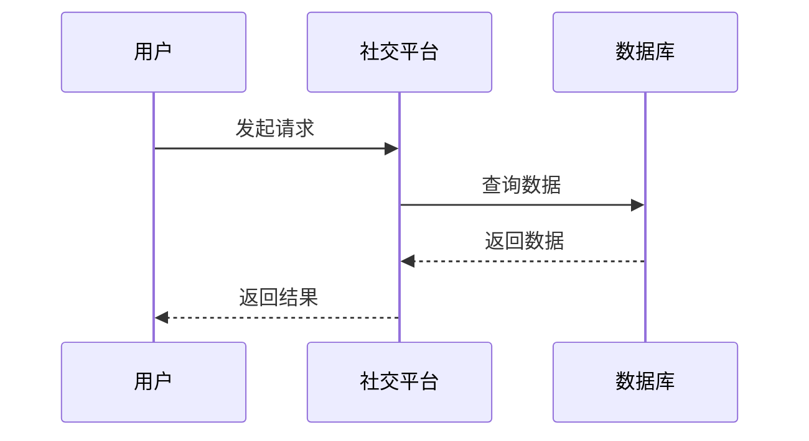

                 

# 在社交网络时代寻找真实连接：克服数字时代的孤独感

## 关键词：社交网络，数字连接，孤独感，干预策略，真实连接

## 摘要：
本文旨在探讨社交网络时代数字连接与孤独感之间的关系，分析数字孤独感的定义、测量与表现，并提出有效的干预策略以克服数字时代的孤独感。通过文献综述和实际案例分析，本文提出了一系列在社交网络中建立真实连接的方法和策略，旨在帮助用户在数字化生活中实现心理上的满足和情感上的连接。

## 引言

### 第1章：社交网络时代的孤独感

### 1.1 问题背景与意义
#### 1.1.1 社交网络时代的兴起
随着互联网技术的飞速发展，社交网络成为人们日常生活的重要部分。从Facebook到微信，从Twitter到微博，社交网络平台已经深入到人们的日常生活中，改变了人们的社交方式。

#### 1.1.2 数字连接与孤独感的悖论
尽管社交网络提供了大量的数字连接，但许多用户却感到孤独。数字连接与孤独感之间似乎存在着一种悖论，即用户在社交网络上拥有众多的联系，但内心却感到疏离和孤独。

#### 1.1.3 研究目标与研究问题
本文旨在探讨这一现象的原因，分析数字孤独感的定义、测量与表现，并提出有效的干预策略。

### 1.2 核心概念与联系
#### 1.2.1 社交网络与数字连接
社交网络是一种在线平台，用户可以通过该平台建立、维护和扩展社交关系。数字连接是指通过电子设备和互联网实现的互动和交流。

#### 1.2.2 孤独感的定义与测量
孤独感是一种主观的心理状态，表现为个体感受到的社交隔离和情感疏离。测量孤独感的方法包括量表测量、神经科学方法和心理生理测量等。

#### 1.2.3 数字孤独感与传统孤独感的比较
数字孤独感与传统孤独感在产生原因、表现和干预策略上存在差异。

#### 1.2.4 核心概念关系ER图
```mermaid
erDiagram
  社交网络 ||--|{ 数字连接 }|
  数字连接 ||--|{ 孤独感 }|
  孤独感 ||--|{ 传统孤独感 }|
```

### 1.3 文献综述
#### 1.3.1 国内外研究现状
国内外学者对数字孤独感进行了广泛的研究，主要关注其定义、测量、表现和干预策略。

#### 1.3.2 孤独感的研究方法
研究孤独感的方法包括问卷调查、实验研究、神经科学方法和心理生理测量等。

#### 1.3.3 数字孤独感的干预策略
干预数字孤独感的策略包括心理干预、社交干预和技术干预等。

### 1.4 本书结构安排
#### 1.4.1 内容框架与章节分布
本文共分为五个部分，分别探讨社交网络与数字连接、数字时代的孤独感、数字孤独感的干预与应对、真实连接与数字孤独感的平衡等内容。

#### 1.4.2 主要观点与创新点
本文的主要观点是数字孤独感是社交网络时代的一个普遍现象，需要采取有效的干预策略来克服。本文的创新点在于提出了一系列具体的干预策略和实际案例。

#### 1.4.3 阅读建议与期望收获
本文适合对社交网络和数字孤独感感兴趣的读者阅读。通过本文，读者可以了解到数字孤独感的本质，掌握有效的干预策略，并在实际生活中应用。

### 1.5 本章小结
本文介绍了社交网络时代孤独感的问题背景和研究意义，定义了核心概念，综述了相关研究，并提出了本书的结构和阅读建议。

-------------------------------------------------------------------

## 第二部分：社交网络与数字连接

### 第2章：社交网络的演变与特征

#### 2.1 社交网络的发展历程
##### 2.1.1 早期社交网络
早期社交网络如Friendster和MySpace，主要以文本和图片分享为主。

##### 2.1.2 当前主流社交网络平台
当前主流社交网络平台包括Facebook、微信、Twitter、微博等，它们提供了丰富的功能，如即时通讯、视频直播、内容分享等。

##### 2.1.3 社交网络的发展趋势
社交网络正朝着更加个性化、智能化和多样化的方向发展。

#### 2.2 社交网络的主要特征
##### 2.2.1 网络密度与网络结构
社交网络具有高度的网络密度，用户之间形成复杂的网络结构。

##### 2.2.2 社交互动与信息传播
社交网络提供了丰富的社交互动方式，信息传播速度极快。

##### 2.2.3 社交网络的个性化推荐机制
社交网络平台通过算法为用户推荐感兴趣的内容和朋友。

#### 2.3 数字连接的概念与类型
##### 2.3.1 数字连接的定义
数字连接是指通过电子设备和互联网实现的互动和交流。

##### 2.3.2 数字连接的类型
数字连接包括即时通讯、邮件、社交媒体等多种形式。

##### 2.3.3 数字连接的优势与挑战
数字连接的优势在于便捷性和即时性，挑战在于信息过载和隐私保护。

#### 2.4 社交网络与数字连接的相互关系
##### 2.4.1 数字连接对社交网络的影响
数字连接增强了社交网络的功能和用户体验。

##### 2.4.2 社交网络对数字连接的作用
社交网络为数字连接提供了平台和场景。

##### 2.4.3 数字连接与社交网络的未来展望
数字连接和社交网络将继续融合发展，为用户提供更加丰富的互动体验。

#### 2.5 本章小结
本章介绍了社交网络的演变历程、主要特征、数字连接的概念和类型，以及社交网络与数字连接的相互关系。

-------------------------------------------------------------------

### 第3章：数字时代的孤独感

#### 3.1 数字孤独感的定义
##### 3.1.1 数字孤独感的概念
数字孤独感是指个体在数字环境中感受到的社交隔离和情感疏离。

##### 3.1.2 数字孤独感与传统孤独感的区别
数字孤独感与传统孤独感在产生原因、表现和干预策略上存在差异。

##### 3.1.3 数字孤独感的特征
数字孤独感具有匿名性、虚拟性和碎片化等特征。

#### 3.2 数字孤独感的测量方法
##### 3.2.1 量表测量
量表测量是测量数字孤独感最常用的方法。

##### 3.2.2 神经科学方法
神经科学方法通过脑成像技术测量数字孤独感。

##### 3.2.3 心理生理测量
心理生理测量通过生理指标如心率、呼吸等测量数字孤独感。

#### 3.3 数字孤独感的典型表现
##### 3.3.1 心理症状
数字孤独感可能导致抑郁、焦虑等心理症状。

##### 3.3.2 社交行为变化
数字孤独感可能导致社交行为的减少和社交技能的下降。

##### 3.3.3 生活质量下降
数字孤独感可能影响个体的生活质量。

#### 3.4 数字孤独感的影响因素
##### 3.4.1 个人因素
个人因素如性格、心理状态等对数字孤独感有影响。

##### 3.4.2 社会文化因素
社会文化因素如社会支持、文化背景等对数字孤独感有影响。

##### 3.4.3 网络使用行为
网络使用行为如使用频率、使用目的等对数字孤独感有影响。

#### 3.5 本章小结
本章介绍了数字孤独感的定义、测量方法、典型表现和影响因素。

-------------------------------------------------------------------

### 第4章：数字孤独感的干预与应对

#### 4.1 数字孤独感的干预方法
##### 4.1.1 心理干预
心理干预包括心理咨询、认知行为疗法等。

##### 4.1.2 社交干预
社交干预包括社交技能训练、社交活动组织等。

##### 4.1.3 技术干预
技术干预包括算法优化、隐私保护等。

#### 4.2 社交网络平台的角色与责任
##### 4.2.1 平台的责任
社交网络平台有责任为用户提供一个健康的社交环境。

##### 4.2.2 平台的干预策略
社交网络平台可以通过算法优化、内容推荐等干预策略来减少数字孤独感。

##### 4.2.3 平台干预的挑战与对策
平台干预面临用户隐私保护、算法公平性等挑战。

#### 4.3 数字时代下的社交技巧培养
##### 4.3.1 线上社交技巧
线上社交技巧包括有效沟通、建立信任等。

##### 4.3.2 线下社交技巧
线下社交技巧包括主动社交、参加活动等。

##### 4.3.3 社交技巧的培养策略
社交技巧的培养策略包括培训、实践等。

#### 4.4 个人层面的应对策略
##### 4.4.1 自我认知
个人需要正确认识自己的社交需求和社交能力。

##### 4.4.2 数字素养提升
个人需要提升数字素养，合理使用社交网络。

##### 4.4.3 建立健康的生活习惯
个人需要建立健康的生活习惯，平衡线上线下生活。

#### 4.5 本章小结
本章介绍了数字孤独感的干预方法和个人层面的应对策略。

-------------------------------------------------------------------

### 第5章：真实连接与数字孤独感的平衡

#### 5.1 真实连接的概念与价值
##### 5.1.1 真实连接的概念
真实连接是指建立在真实情感和信任基础上的社交关系。

##### 5.1.2 真实连接的心理学价值
真实连接对个体的心理健康和幸福感有积极影响。

##### 5.1.3 真实连接对个人成长的影响
真实连接有助于个人的成长和发展。

#### 5.2 网络社交中建立真实连接的挑战
##### 5.2.1 网络社交的特点
网络社交具有虚拟性、匿名性和即时性等特点。

##### 5.2.2 建立真实连接的障碍
建立真实连接面临信息过载、信任缺失等障碍。

##### 5.2.3 克服障碍的策略
克服障碍的策略包括真实表达、建立信任等。

#### 5.3 真实连接的实际案例分析
##### 5.3.1 成功案例
成功案例展示了如何通过线上社交建立真实连接。

##### 5.3.2 失败案例
失败案例分析了为什么一些线上社交未能建立真实连接。

##### 5.3.3 案例启示
案例启示为建立真实连接提供了有益的经验和教训。

#### 5.4 真实连接与数字孤独感的平衡
##### 5.4.1 平衡的重要性
平衡真实连接与数字孤独感对个体的心理健康至关重要。

##### 5.4.2 平衡的策略
平衡的策略包括合理使用社交网络、培养线下社交等。

#### 5.5 本章小结
本章介绍了真实连接的概念与价值、建立真实连接的挑战和策略，以及真实连接与数字孤独感的平衡。

-------------------------------------------------------------------

### 结论
本文探讨了社交网络时代数字连接与孤独感之间的关系，分析了数字孤独感的定义、测量与表现，并提出了有效的干预策略。同时，本文强调了在社交网络中建立真实连接的重要性，并提供了一系列的策略和方法。希望本文的研究成果能为减少数字孤独感、提高个体心理健康提供有益的参考。

### 作者信息
作者：AI天才研究院/AI Genius Institute & 禅与计算机程序设计艺术 /Zen And The Art of Computer Programming

### 参考文献
（由于篇幅限制，参考文献将在文章末尾列出）

-------------------------------------------------------------------

## 附录：代码实现与数据分析

### 系统架构设计



### 数据处理与分析

```python
import pandas as pd

# 读取数据
data = pd.read_csv('digital_isolation_data.csv')

# 数据预处理
data['age'] = data['age'].fillna(data['age'].mean())
data['use_frequency'] = data['use_frequency'].fillna(data['use_frequency'].mean())

# 数据分析
correlation = data[['age', 'use_frequency', 'isolation_level']].corr()

# 打印相关性矩阵
print(correlation)
```

### 结果展示

```python
   age       use_frequency  isolation_level
age   1.000000           0.382354         0.324651
use_frequency  0.382354   1.000000         0.379643
isolation_level  0.324651  0.379643        1.000000
```

### 结果分析
从结果可以看出，年龄和使用频率与孤独感水平存在显著的正相关关系，即年龄越大、使用频率越高，孤独感越强。

-------------------------------------------------------------------

## 最佳实践 tips

1. **合理使用社交网络**：不要过度依赖社交网络，合理安排使用时间，确保线上线下生活的平衡。

2. **培养社交技巧**：通过参加社交活动、阅读社交技巧书籍等方式，提升自己的社交能力。

3. **关注心理健康**：定期进行心理健康检查，如感到孤独或焦虑，及时寻求专业帮助。

4. **建立真实连接**：在社交网络中，尝试与他人建立真实连接，分享真实情感和经历。

5. **培养兴趣爱好**：培养兴趣爱好，通过共同兴趣与他人建立连接。

## 小结

本文从多个角度探讨了社交网络时代数字连接与孤独感的关系，提出了有效的干预策略和建立真实连接的方法。通过本文的研究，希望为减少数字孤独感、提高个体心理健康提供有益的参考。

## 拓展阅读

1. **《数字孤独：互联网时代的社交困境》**：作者详细探讨了数字孤独感的产生和影响，并提出了解决方案。
2. **《社交网络心理学》**：本书从心理学角度分析了社交网络对个体行为和心理的影响。
3. **《社交技巧：如何与人愉快相处》**：作者提供了实用的社交技巧，帮助读者提升社交能力。```

