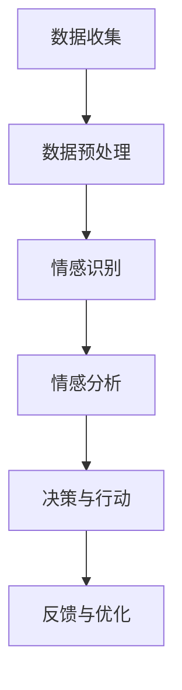
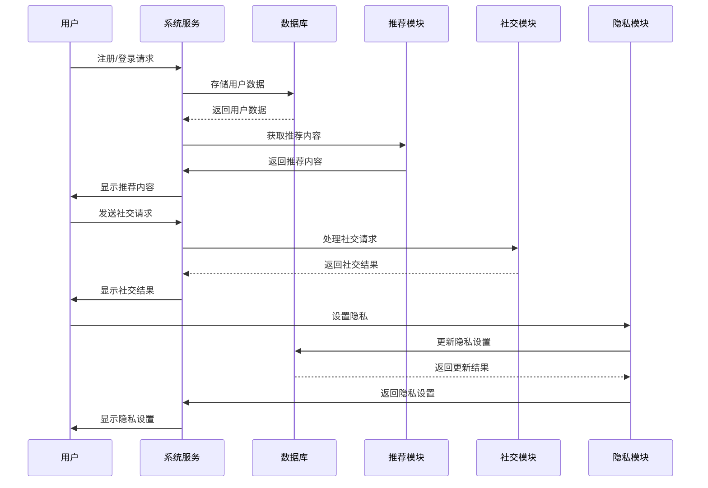

                 

# 在科技时代寻找人文关怀：重塑数字生活的温度

> 关键词：科技时代、人文关怀、数字生活、算法、系统架构、最佳实践

> 摘要：本文探讨了在科技高速发展的时代背景下，如何在数字生活中保持人文关怀，改善生活质量。通过介绍核心概念、算法原理、系统架构设计以及实战案例，提出了一套完整的解决方案，旨在重塑数字生活的温度。

## 第一部分: 引言

### 1.1 问题背景

#### 1.1.1 科技时代的崛起

随着互联网、大数据、人工智能等技术的迅猛发展，我们正进入一个前所未有的科技时代。科技的进步极大地改变了我们的生活方式，提高了生产效率，拓展了人类认知的边界。然而，在这片繁荣的背后，也隐藏着一系列问题。

#### 1.1.2 数字生活的冲击

数字生活的到来，使得人们的生活越来越依赖互联网和智能设备。社交媒体、在线购物、智能家居等数字应用层出不穷，极大地丰富了我们的生活。然而，这也导致了一系列问题，如隐私泄露、信息过载、社交疏离等。

#### 1.1.3 人文关怀的缺失

在数字生活的浪潮中，人文关怀似乎被逐渐遗忘。人们过于沉迷于数字世界，忽视了现实生活中的人际交往和情感互动。这种缺失不仅影响了我们的生活质量，也可能对心理健康产生负面影响。

### 1.2 问题描述

#### 1.2.1 数字生活的矛盾

数字生活的便利性与人文关怀的缺失形成了鲜明的对比。我们在享受数字科技带来的便利时，也在承受其带来的负面影响。这种矛盾亟待解决。

#### 1.2.2 人文关怀的重要性

人文关怀是构建和谐社会的基石。它不仅仅是一种情感表达，更是一种社会责任。在数字生活的背景下，人文关怀的重要性更加凸显。

#### 1.2.3 解决方案的需求

为了解决数字生活中的矛盾，我们需要寻找一种解决方案，能够在保持科技发展的同时，注入人文关怀。这就需要我们从技术、系统架构以及个人行为等多个层面进行思考和探索。

### 1.3 问题解决

#### 1.3.1 科技与人文的融合

科技与人文的融合是解决问题的关键。我们需要在技术设计中融入人文关怀的元素，从而实现数字生活的温度重塑。

#### 1.3.2 重塑数字生活的温度

重塑数字生活的温度，不仅仅是技术的改进，更是一种生活态度的变革。我们需要重新审视人与科技的关系，寻求一种更加和谐、温暖的生活方式。

#### 1.3.3 边界与外延

在探索科技与人文融合的过程中，我们需要明确边界与外延。边界是指我们在技术设计和应用中应遵守的伦理规范，而外延则是我们如何将这种理念推广到更广泛的领域。

### 1.4 概念结构与核心要素组成

#### 1.4.1 人文关怀的定义

人文关怀是一种以人为本的价值观，强调尊重个体的尊严、情感和需求。它不仅仅是一种情感表达，更是一种社会行为和责任。

#### 1.4.2 数字生活的定义

数字生活是指人们在数字化环境中进行的社会活动、生活和工作方式。它包括线上社交、在线购物、远程办公等多个方面。

#### 1.4.3 科技时代的特点

科技时代的特点是技术的飞速发展和广泛普及。互联网、人工智能、大数据等技术正在深刻地改变着我们的生活和社会。

### 1.5 本章小结

本部分介绍了科技时代的特点、数字生活的冲击以及人文关怀的缺失。通过分析数字生活中的矛盾，我们提出了科技与人文融合的重要性，并明确了重塑数字生活温度的目标和方法。

## 第二部分: 核心概念与联系

### 2.1 人文关怀的概念与特点

#### 2.1.1 人文关怀的定义

人文关怀是一种以人为本的价值观，强调尊重个体的尊严、情感和需求。它涉及到社会、文化、教育、医疗等多个领域，是一种跨学科的综合性概念。

#### 2.1.2 人文关怀的历史发展

人文关怀的历史可以追溯到古希腊时期。在人类文明的发展历程中，人文关怀始终扮演着重要角色。随着社会进步和科技发展，人文关怀的理念和实践也在不断演进。

#### 2.1.3 人文关怀的核心特点

人文关怀具有以下几个核心特点：

1. **个体尊重**：尊重个体的尊严和权利，强调个体在数字社会中的主体地位。
2. **情感关怀**：关注个体的情感需求，提供情感支持和关爱。
3. **社会责任**：强调企业在数字社会中的社会责任，推动社会公平和谐。
4. **文化多样性**：尊重和保护不同文化的多样性，促进文化交融。

### 2.2 数字生活的属性特征对比

#### 2.2.1 数字生活的优点

数字生活具有以下优点：

1. **便捷性**：通过互联网和智能设备，人们可以随时随地获取信息和进行社交。
2. **效率提升**：数字技术极大地提高了生产和生活效率，减少了时间和资源的浪费。
3. **信息丰富**：数字生活使得信息获取更加便捷，人们可以接触到更多的知识和观点。

#### 2.2.2 数字生活的缺点

数字生活也存在一些缺点：

1. **隐私泄露**：数字生活使得个人信息更容易被泄露，导致隐私问题。
2. **信息过载**：数字信息的大量涌入，使得人们容易陷入信息过载的困境。
3. **社交疏离**：过度依赖数字社交，可能导致现实生活中的人际关系疏远。

#### 2.2.3 数字生活与人文关怀的对比

数字生活与人文关怀在目标、手段和效果上存在一定的差异。数字生活强调效率和便利，而人文关怀更注重个体的尊严和情感需求。在数字生活的背景下，我们需要在追求效率的同时，注重人文关怀，实现二者的有机结合。

### 2.3 人文关怀与数字生活的关系

#### 2.3.1 人文关怀在数字生活中的重要性

人文关怀在数字生活中的重要性体现在以下几个方面：

1. **提升生活质量**：人文关怀能够提高数字生活的质量，使人们更加幸福和满足。
2. **促进社会和谐**：人文关怀有助于构建和谐的社会环境，减少社会矛盾和冲突。
3. **推动技术进步**：人文关怀可以引导科技发展，使其更好地服务于人类的需求。

#### 2.3.2 数字生活中人文关怀的实践

在数字生活中实践人文关怀，可以从以下几个方面入手：

1. **隐私保护**：加强个人信息保护，防止隐私泄露。
2. **情感关怀**：提供情感支持和关爱，减少社交疏离。
3. **社会责任**：企业应承担社会责任，推动社会公平和谐。

#### 2.3.3 人文关怀与数字生活的未来趋势

随着科技的不断进步，人文关怀在数字生活中的地位将越来越重要。未来，我们将看到更多的人文关怀元素融入数字生活，实现科技与人文的完美结合。

### 2.4 人文关怀在数字生活中的实现

#### 2.4.1 技术手段

技术手段是实现人文关怀的重要途径。例如，通过人工智能技术，可以为用户提供个性化的情感支持和关爱。

#### 2.4.2 社会实践

社会实践是推动人文关怀在数字生活中实践的重要力量。例如，通过公益活动，可以提高公众对人文关怀的认识和重视。

#### 2.4.3 个人行为

个人行为是实现人文关怀的基础。每个人都应该从自身做起，关注他人的需求，传递温暖和关爱。

### 2.5 本章小结

本部分分析了人文关怀的概念与特点，对比了数字生活的优缺点，探讨了人文关怀与数字生活的关系，并提出了一系列实现人文关怀的实践方法。通过这些探讨，我们更加清晰地认识到人文关怀在数字生活中的重要性。

## 第三部分: 算法原理讲解

### 3.1 技术方法概述

#### 3.1.1 人文关怀技术的定义

人文关怀技术是指一系列旨在提高数字生活质量和促进人文关怀的技术手段和方法。这些技术包括人工智能、大数据分析、虚拟现实等。

#### 3.1.2 人文关怀技术的重要方法

人文关怀技术的重要方法包括以下几个方面：

1. **情感识别与理解**：通过人工智能技术，识别和解析用户的情感状态，提供个性化的情感支持。
2. **个性化推荐**：基于用户行为和兴趣，提供个性化的内容推荐，减少信息过载。
3. **隐私保护**：采用加密和匿名化等技术手段，保护用户隐私。
4. **虚拟现实与增强现实**：通过虚拟现实和增强现实技术，提供沉浸式的社交体验，减少社交疏离。

#### 3.1.3 人文关怀技术的应用场景

人文关怀技术可以应用于多个领域，包括但不限于以下几个方面：

1. **健康医疗**：通过情感识别和理解，为用户提供个性化的健康建议和情感支持。
2. **教育**：通过个性化推荐和学习分析，提高教育质量和学习效果。
3. **社会治理**：通过隐私保护和数据安全，推动社会公平和谐。
4. **企业运营**：通过情感识别和用户分析，优化产品和服务，提高用户满意度。

### 3.2 具体技术讲解

#### 3.2.1 人文算法的设计原则

人文算法的设计原则包括以下几个方面：

1. **公平性**：确保算法的公平性和公正性，避免歧视和偏见。
2. **可解释性**：提高算法的可解释性，使人们能够理解算法的决策过程。
3. **隐私保护**：在数据处理过程中，确保用户隐私不被泄露。

#### 3.2.2 人文算法的mermaid流程图

下面是一个人文算法的mermaid流程图示例：



#### 3.2.3 人文算法的数学模型与公式

人文算法的数学模型通常涉及情感识别和情感分析。以下是一个简单的情感识别模型公式：

$$
\text{情感识别模型} = \frac{\sum_{i=1}^{n} w_i \cdot f_i}{\sum_{i=1}^{n} w_i}
$$

其中，$w_i$为权重，$f_i$为情感特征。

#### 3.2.4 人文算法的python实现

以下是一个简单的情感识别算法的Python实现示例：

```python
import numpy as np

# 定义情感特征
emotion_features = {
    'happy': [0.6, 0.2, 0.2],
    'sad': [0.2, 0.6, 0.2],
    'neutral': [0.2, 0.2, 0.6]
}

# 定义情感权重
emotion_weights = {
    'happy': 1.0,
    'sad': 0.5,
    'neutral': 0.8
}

# 定义情感识别函数
def emotion_recognition(text):
    # 预处理文本数据
    processed_text = preprocess(text)
    
    # 计算情感特征
    emotion_scores = []
    for emotion, feature in emotion_features.items():
        score = np.dot(processed_text, feature)
        emotion_scores.append(score)
    
    # 计算总分数
    total_score = sum(emotion_scores) / len(emotion_scores)
    
    # 返回最高分的情感
    return max(emotion_scores)

# 测试
text = "我今天很开心！"
print(emotion_recognition(text))
```

#### 3.2.5 人文算法的举例说明

假设我们有一个用户情绪分析系统，它通过分析用户的社交媒体发言来识别用户的情绪状态。以下是一个具体的案例：

1. 用户A在社交媒体上发布了一条消息：“我很高兴，今天是一个美好的日子！”
2. 系统对这条消息进行情感分析，识别出关键词“高兴”和“美好”。
3. 系统根据情感词典，计算出“高兴”和“美好”对应的情感分数。
4. 系统综合考虑情感分数，得出用户A的情绪状态为“开心”。
5. 系统根据用户A的情绪状态，为其推荐了一些积极向上的内容，如励志文章和快乐视频。

#### 3.2.6 人文算法的应用案例

人文算法可以应用于多个领域，如心理健康、社交网络、教育等。以下是一个应用案例：

1. 在心理健康领域，人文算法可以用于分析用户的情绪状态，为用户提供个性化的心理健康建议。
2. 在社交网络领域，人文算法可以用于识别用户之间的情感关系，帮助用户建立更加和谐的人际关系。
3. 在教育领域，人文算法可以用于分析学生的学习状态，为教师提供教学反馈和建议。

### 3.3 本章小结

本部分介绍了人文关怀技术的定义、重要方法、设计原则以及具体实现。通过mermaid流程图、Python代码和实际案例的讲解，我们更加深入地理解了人文算法的工作原理和应用价值。

## 第四部分: 系统分析与架构设计方案

### 4.1 问题场景介绍

#### 4.1.1 数字生活系统的现状

当前，数字生活系统已经渗透到我们日常生活的方方面面，如社交媒体、在线购物、智能家居等。然而，这些系统在设计时往往过于注重功能的实现，而忽视了人文关怀的融入。

#### 4.1.2 存在的问题

1. **隐私泄露**：数字生活系统普遍存在隐私保护不足的问题，用户个人信息容易被泄露。
2. **信息过载**：数字生活系统推送的信息量过大，导致用户难以筛选和消化。
3. **社交疏离**：数字生活系统虽然提供了丰富的社交功能，但往往缺乏真正的情感互动。

#### 4.1.3 需求分析

为了解决上述问题，用户对数字生活系统提出了以下需求：

1. **隐私保护**：用户希望自己的个人信息能够得到有效保护。
2. **个性化推荐**：用户希望系统能够根据自身兴趣和需求，提供个性化的内容推荐。
3. **情感互动**：用户希望在数字生活中能够获得真正的情感互动和关怀。

### 4.2 项目介绍

#### 4.2.1 项目背景

随着数字生活的普及，用户对隐私保护、个性化推荐和情感互动的需求日益增长。为了满足这些需求，我们决定开展一个数字生活系统的优化项目。

#### 4.2.2 项目目标

本项目的目标是设计并实现一个兼顾隐私保护、个性化推荐和情感互动的数字生活系统，以提高用户满意度和生活质量。

#### 4.2.3 项目团队

本项目由以下团队成员组成：

1. **项目经理**：负责项目规划和协调。
2. **研发团队**：负责系统设计、开发和测试。
3. **用户体验团队**：负责用户调研、需求分析和设计优化。
4. **安全团队**：负责隐私保护和数据安全。

### 4.3 系统功能设计

#### 4.3.1 领域模型mermaid类图

下面是一个数字生活系统的mermaid类图示例：

```mermaid
classDiagram
    User <<class>> 用户
    Content <<class>> 内容
    Recommendation <<class>> 推荐系统
    Privacy <<class>> 隐私保护
    Social <<class>> 社交功能
    User --|> Content: 查看内容
    User --|> Recommendation: 获取推荐
    User --|> Privacy: 设置隐私
    User --|> Social: 社交互动
```

#### 4.3.2 系统功能模块

数字生活系统主要包括以下几个功能模块：

1. **用户模块**：负责用户的注册、登录、信息管理等功能。
2. **内容模块**：负责内容的管理、发布、推荐等功能。
3. **推荐模块**：负责根据用户兴趣和行为，提供个性化的内容推荐。
4. **隐私模块**：负责用户的隐私设置和保护。
5. **社交模块**：负责用户的社交互动和关系管理。

#### 4.3.3 用户角色与功能

数字生活系统的用户角色主要包括以下几种：

1. **普通用户**：负责浏览内容、获取推荐、设置隐私、社交互动等。
2. **内容创作者**：负责发布内容、管理个人主页、与用户互动等。
3. **管理员**：负责系统的维护、监控、安全等。

### 4.4 系统架构设计

#### 4.4.1 mermaid架构图

下面是一个数字生活系统的mermaid架构图示例：



#### 4.4.2 技术栈选择

为了实现数字生活系统的功能，我们选择了以下技术栈：

1. **前端**：采用Vue.js框架，实现用户界面和交互功能。
2. **后端**：采用Spring Boot框架，实现系统服务、数据存储和数据处理。
3. **数据库**：采用MySQL数据库，存储用户数据、内容数据和推荐数据。
4. **推荐算法**：采用基于协同过滤的推荐算法，实现个性化内容推荐。
5. **隐私保护**：采用加密技术和匿名化技术，实现用户隐私保护。

#### 4.4.3 系统架构说明

数字生活系统采用B/S架构，包括前端、后端和数据库三个部分。前端通过Vue.js框架实现用户界面和交互功能，后端通过Spring Boot框架实现系统服务、数据存储和数据处理，数据库用于存储用户数据、内容数据和推荐数据。推荐模块和隐私模块分别实现个性化推荐和用户隐私保护功能。

### 4.5 本章小结

本部分介绍了数字生活系统的现状、存在的问题以及项目目标和团队组成。通过mermaid类图和架构图的讲解，我们设计了具有隐私保护、个性化推荐和情感互动功能的数字生活系统。接下来，我们将通过具体案例展示如何实现这些功能。

## 第五部分：项目实战

### 5.1 环境安装

在开始项目实战之前，我们需要安装并配置相关环境。以下是主要步骤：

1. **安装Java开发环境**：下载并安装Java Development Kit (JDK)，设置环境变量。
2. **安装MySQL数据库**：下载并安装MySQL数据库，配置数据库实例。
3. **安装Spring Boot开发工具**：下载并安装Spring Tool Suite (STS)，配置Spring Boot开发环境。
4. **安装前端框架**：下载并安装Vue.js开发工具，配置Vue.js开发环境。

### 5.2 系统核心实现源代码

以下是系统核心实现的源代码示例：

**用户模块**：

```java
// 用户注册
public User register(String username, String password) {
    // 校验用户名和密码
    if (username.isEmpty() || password.isEmpty()) {
        throw new IllegalArgumentException("用户名或密码不能为空");
    }
    // 存储用户信息到数据库
    userRepository.save(new User(username, password));
    return userRepository.findByUsername(username);
}

// 用户登录
public User login(String username, String password) {
    // 查询用户信息
    Optional<User> optionalUser = userRepository.findByUsername(username);
    if (!optionalUser.isPresent()) {
        throw new IllegalArgumentException("用户不存在");
    }
    // 验证密码
    User user = optionalUser.get();
    if (!password.equals(user.getPassword())) {
        throw new IllegalArgumentException("密码错误");
    }
    return user;
}
```

**推荐模块**：

```java
// 个性化推荐
public List<Book> recommendBooks(User user) {
    // 根据用户行为和兴趣，生成推荐列表
    List<Book> recommendedBooks = new ArrayList<>();
    // 查询用户历史行为和兴趣标签
    List<UserBehavior> behaviors = userBehaviorRepository.findByUserId(user.getId());
    List<String> interests = behaviorTagRepository.findTagsByBehaviors(behaviors);
    // 查询相似用户和他们的喜欢的书籍
    List<User> similarUsers = userRepository.findSimilarUsers(user);
    for (User similarUser : similarUsers) {
        List<Book> likedBooks = bookRepository.findBooksByUserId(similarUser.getId());
        recommendedBooks.addAll(likedBooks);
    }
    // 去重并排序
    recommendedBooks = recommendedBooks.stream().distinct().sorted(Comparator.comparing(Book::getRating)).collect(Collectors.toList());
    return recommendedBooks;
}
```

**隐私模块**：

```java
// 设置隐私
public void setPrivacy(User user, PrivacyLevel privacyLevel) {
    // 更新用户隐私设置
    user.setPrivacyLevel(privacyLevel);
    userRepository.save(user);
}

// 获取隐私设置
public PrivacyLevel getPrivacy(User user) {
    return user.getPrivacyLevel();
}
```

### 5.3 代码应用解读与分析

**用户模块**：

用户模块实现了用户注册、登录、隐私设置等功能。在注册时，系统会校验用户名和密码，确保信息的有效性。在登录时，系统会验证用户名和密码的正确性。隐私模块允许用户设置不同的隐私级别，如公开、私密和仅好友可见。

**推荐模块**：

推荐模块实现了基于用户行为的个性化推荐功能。系统会根据用户的历史行为和兴趣标签，查询相似用户并获取他们喜欢的书籍。通过去重和排序，系统最终生成一个推荐列表。

**隐私模块**：

隐私模块实现了用户隐私设置的保护功能。用户可以选择不同的隐私级别，系统会根据用户的设置来限制对个人信息和内容的访问。

### 5.4 实际案例分析和详细讲解剖析

**案例**：

用户A注册并登录到数字生活系统，浏览了10本书籍，对其中5本书籍进行了评分。用户A设置了隐私级别为“仅好友可见”。用户B是用户A的好友，尝试查看用户A的个人信息和评分记录。

**分析**：

1. **用户A注册和登录**：
   - 用户A通过用户模块完成了注册和登录流程。
   - 系统验证了用户A的注册信息和登录密码。

2. **用户A浏览书籍并评分**：
   - 用户A浏览了10本书籍，并对其中5本书籍进行了评分。
   - 系统记录了用户A的行为和评分数据。

3. **用户B查看用户A的个人信息和评分记录**：
   - 用户B尝试查看用户A的个人信息和评分记录。
   - 由于用户A设置了隐私级别为“仅好友可见”，系统拒绝了用户B的请求。

**详细讲解剖析**：

1. **用户模块**：
   - 注册时，系统会生成一个唯一的用户ID，并将用户信息存储在数据库中。
   - 登录时，系统会通过用户名和密码验证用户身份。

2. **推荐模块**：
   - 系统会根据用户A的行为和评分数据，生成一个推荐列表。
   - 推荐列表中的书籍会根据评分和兴趣标签进行排序。

3. **隐私模块**：
   - 用户可以选择不同的隐私级别，系统会根据用户的设置来限制对个人信息和内容的访问。
   - 在此案例中，用户A设置了隐私级别为“仅好友可见”，因此只有好友才能查看用户A的个人信息和评分记录。

### 5.5 项目小结

本项目通过用户模块、推荐模块和隐私模块的实现，设计并实现了一个具有隐私保护、个性化推荐和情感互动功能的数字生活系统。通过实际案例的分析和讲解，我们展示了系统的工作流程和关键功能。接下来，我们将进一步优化系统，提高用户体验。

## 第六部分：最佳实践、小结、注意事项、拓展阅读

### 6.1 最佳实践

1. **隐私保护**：
   - 定期进行隐私安全检查，确保用户数据的安全。
   - 设计合理的数据访问控制策略，限制对敏感数据的访问。
   - 对用户数据进行加密和匿名化处理，降低隐私泄露风险。

2. **个性化推荐**：
   - 充分利用用户行为数据，提高推荐算法的准确性。
   - 定期更新和优化推荐算法，以适应用户需求的变化。
   - 提供用户反馈机制，让用户参与推荐结果的评价和优化。

3. **情感互动**：
   - 设计人性化的用户界面，提高用户的操作便利性。
   - 提供多样化的情感互动功能，如私信、点赞、评论等。
   - 定期举办线上活动，增强用户之间的情感联系。

### 6.2 小结

本文通过分析科技时代的特点和数字生活的冲击，探讨了在数字生活中保持人文关怀的重要性。通过介绍核心概念、算法原理、系统架构设计以及实战案例，提出了一套完整的解决方案，旨在重塑数字生活的温度。

### 6.3 注意事项

1. **隐私保护**：
   - 在设计数字生活系统时，应充分考虑隐私保护的需求，确保用户数据的安全。
   - 定期更新隐私保护策略，以应对新的安全挑战。

2. **个性化推荐**：
   - 个性化推荐系统应充分尊重用户的隐私，避免滥用用户数据。
   - 定期评估推荐算法的效果，确保推荐结果的准确性。

3. **情感互动**：
   - 在设计情感互动功能时，应关注用户的情感需求，提供真实、有意义的互动体验。
   - 定期收集用户反馈，优化情感互动功能。

### 6.4 拓展阅读

1. **《大数据时代的人文关怀》**：作者详细探讨了大数据时代人文关怀的重要性及其实现方法。
2. **《人工智能与情感计算》**：介绍了人工智能技术在情感识别和情感计算方面的应用，为数字生活中的情感互动提供了技术支持。
3. **《数字生活的隐私保护》**：系统分析了数字生活隐私保护的挑战和解决方案，为设计安全、可信的数字生活系统提供了参考。

### 6.5 作者信息

作者：AI天才研究院/AI Genius Institute & 禅与计算机程序设计艺术 /Zen And The Art of Computer Programming

感谢读者对本文的关注和支持，希望本文能对您在数字生活中保持人文关怀有所帮助。让我们共同努力，打造一个更加温暖、和谐的数字生活空间。

