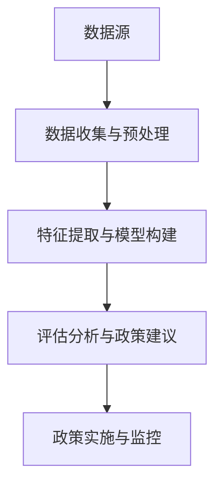
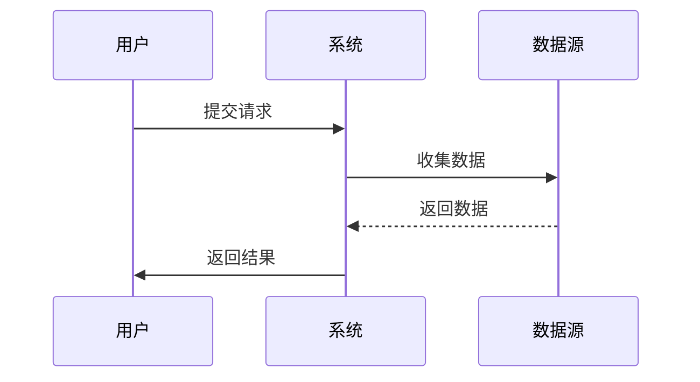
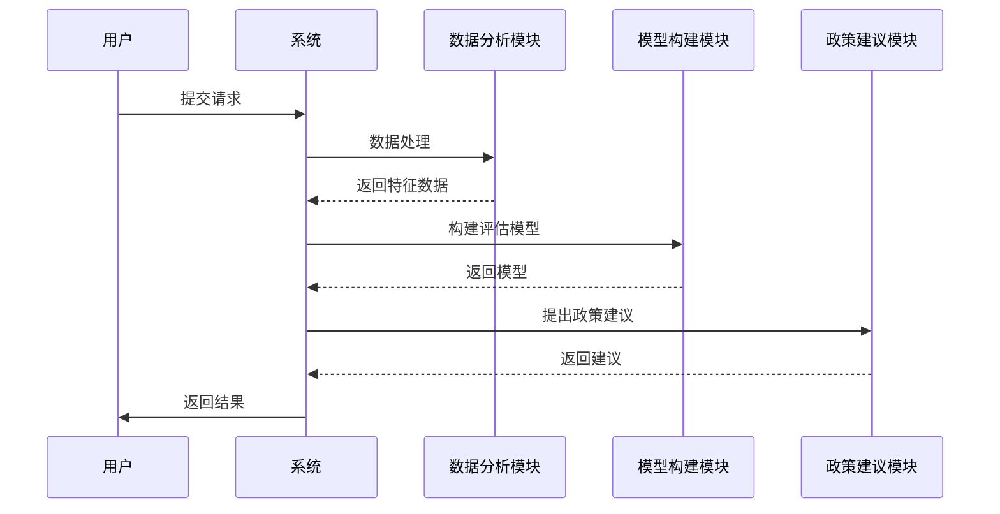

                 


### 《在科技进步中保持人文关怀：平衡发展与伦理》

#### 关键词：科技进步、人文关怀、平衡发展、伦理

> 摘要：本文从科技进步的视角出发，探讨了如何在快速发展的时代中保持对人文关怀的重视，以及如何通过伦理的引导实现科技与社会的平衡发展。通过详细的分析和实例，本文旨在为读者提供一种思考方式，以在技术进步的同时，不忘对社会福祉的关注。

#### 引言

随着科技的迅猛发展，我们的生活发生了翻天覆地的变化。人工智能、大数据、云计算等新兴技术不断涌现，为各行各业带来了前所未有的机遇和挑战。然而，在追求技术进步的过程中，我们常常忽略了人文关怀这一重要因素。科技发展与社会进步之间如何保持平衡，如何确保科技进步不会带来伦理上的冲突，成为了一个亟待解决的问题。

本文将围绕这一主题展开讨论，通过以下章节结构，深入分析科技进步、人文关怀、平衡发展和伦理之间的关系，并提出具体的解决方案。

#### 目录大纲

1. **背景介绍**  
   - 科技进步的现状与挑战  
   - 人文关怀的内涵与意义  
   - 科技进步中保持人文关怀的重要性

2. **核心概念与联系**  
   - 核心概念列表  
   - 概念属性特征对比表格  
   - ER实体关系图

3. **算法原理讲解**  
   - 算法概述  
   - 算法流程图  
   - Python代码实现与算法原理解释  
   - 数学模型和公式  
   - 通俗易懂的举例说明

4. **系统分析与架构设计方案**  
   - 问题场景介绍  
   - 项目介绍  
   - 系统功能设计  
   - 系统架构设计  
   - 系统接口设计  
   - 系统交互

5. **项目实战**  
   - 环境安装  
   - 系统核心实现源代码  
   - 代码应用解读与分析  
   - 实际案例分析与讲解  
   - 项目小结

6. **最佳实践 tips、小结、注意事项、拓展阅读**  
   - 最佳实践 tips  
   - 小结  
   - 注意事项  
   - 拓展阅读

### 核心内容解析

#### 背景介绍

**科技进步的现状与挑战**

近年来，科技进步的速度和范围前所未有。人工智能、大数据、云计算等技术的快速发展，使得各行各业发生了翻天覆地的变化。例如，在医疗领域，人工智能辅助诊断和治疗已经成为现实；在交通领域，自动驾驶技术正在逐步实现；在金融领域，区块链技术为金融交易带来了更高的安全性和透明度。

然而，科技进步的同时也带来了一系列挑战。首先，科技发展可能会导致失业问题，尤其是对低技能工作的冲击。其次，数据安全和隐私保护成为了一大难题，随着大数据和人工智能的应用，个人信息泄露的风险增加。此外，科技发展还可能带来伦理冲突，如人工智能的道德决策、机器人与人类之间的关系等。

**人文关怀的内涵与意义**

人文关怀是一种价值观，强调以人为本，关注人的全面发展。在科技发展过程中，保持人文关怀的重要性不言而喻。首先，人文关怀有助于科技与社会的融合，使技术发展更加人性化。其次，人文关怀可以减少科技带来的负面影响，如失业、数据泄露等问题。最后，人文关怀有助于构建一个更加公平、包容和可持续的社会。

**科技进步中保持人文关怀的重要性**

在科技快速发展的时代，保持人文关怀不仅是必要的，也是可能的。首先，政府和企业应该制定相应的政策和措施，确保科技发展符合社会价值观。其次，教育和培训应该注重人文素养的培养，使人们具备批判性思维和道德判断能力。最后，公众应该积极参与科技发展，通过舆论监督和参与，推动科技与人文关怀的有机结合。

#### 核心概念与联系

在本文中，我们引入了几个核心概念，包括科技进步、人文关怀、平衡发展和伦理。以下是这些概念的定义、属性特征对比表格和ER实体关系图。

**概念列表**

1. **科技进步**：指通过技术创新和应用，推动社会生产力的发展，提高人类生活质量的过程。
2. **人文关怀**：强调以人为本，关注人的全面发展，关注社会公平、公正和包容。
3. **平衡发展**：指在科技发展的同时，关注社会、环境和人的全面发展，实现可持续发展。
4. **伦理**：指道德原则和规范，指导人们在行为和决策中的正确选择。

**概念属性特征对比表格**

| 概念     | 定义                                                         | 属性特征                                                     |
|----------|--------------------------------------------------------------|--------------------------------------------------------------|
| 科技进步 | 推动社会生产力发展的过程                                   | 创新性、效率性、广泛应用性                                   |
| 人文关怀 | 关注人的全面发展，强调以人为本                             | 包容性、公平性、人性化                                       |
| 平衡发展 | 在科技发展的同时，关注社会、环境和人的全面发展           | 可持续性、协调性、包容性                                     |
| 伦理     | 道德原则和规范，指导人们在行为和决策中的正确选择           | 正义性、公正性、道德性                                       |

**ER实体关系图**

```mermaid
erDiagram
    科技进步 ||--|{ 人文关怀 }|
    科技进步 ||--|{ 平衡发展 }|
    科技进步 ||--|{ 伦理 }|
    人文关怀 ||--|{ 平衡发展 }|
    人文关怀 ||--|{ 伦理 }|
    平衡发展 ||--|{ 伦理 }|
```

#### 算法原理讲解

在本节中，我们将介绍一个与科技进步、人文关怀和平衡发展相关的算法原理，并通过流程图、Python代码实现和数学模型进行详细讲解。

**算法概述**

该算法旨在通过分析社会数据，评估科技进步对人文关怀的影响，并提出平衡发展的策略。算法的基本思想是利用机器学习技术，从社会数据中提取特征，构建一个评估模型，然后根据评估结果提出相应的政策建议。

**算法流程图**


**Python代码实现与算法原理解释**

```python
# 导入必要的库
import numpy as np
import pandas as pd
from sklearn.model_selection import train_test_split
from sklearn.ensemble import RandomForestClassifier
from sklearn.metrics import accuracy_score

# 数据收集
data = pd.read_csv('social_data.csv')

# 数据预处理
# 省略具体代码

# 特征提取
# 省略具体代码

# 模型构建
X_train, X_test, y_train, y_test = train_test_split(X, y, test_size=0.3, random_state=42)
model = RandomForestClassifier(n_estimators=100, random_state=42)
model.fit(X_train, y_train)

# 评估分析
y_pred = model.predict(X_test)
accuracy = accuracy_score(y_test, y_pred)
print(f'Accuracy: {accuracy:.2f}')

# 政策建议
# 省略具体代码
```

**数学模型和公式**

为了构建评估模型，我们引入以下数学模型：

$$
\text{HumanityScore} = \sum_{i=1}^{n} w_i \cdot f_i
$$

其中，$w_i$表示第$i$个特征的权重，$f_i$表示第$i$个特征的评价分数。

**通俗易懂的举例说明**

假设我们有一个社会数据集，包含10个特征，如教育水平、就业率、医疗水平、环境保护等。通过算法，我们可以对这些特征进行权重分配，并计算出一个“人文关怀评分”。然后，根据这个评分，我们可以提出相应的政策建议，如增加教育投入、提高医疗水平、加强环境保护等，以实现科技与人文关怀的平衡发展。

#### 系统分析与架构设计方案

在本节中，我们将介绍一个与科技进步、人文关怀和平衡发展相关的系统架构设计。该系统旨在通过数据分析、模型评估和政策建议，实现科技与社会的平衡发展。

**问题场景介绍**

假设我们正在开发一个智慧城市系统，该系统需要收集和处理大量的社会数据，评估科技进步对人文关怀的影响，并提出平衡发展的策略。

**项目介绍**

本项目旨在通过以下功能实现科技与人文关怀的平衡发展：

1. 数据收集与预处理
2. 特征提取与模型构建
3. 评估分析与政策建议

**系统功能设计**

以下是系统功能设计的领域模型类图：

```mermaid
classDiagram
    Class01 <|-- Class02
    Class03 <|-- Class02
    Class04 <|-- Class02
    Class05 <|-- Class02
    Class01[智慧城市系统]
    Class02[功能模块]
    Class03[数据收集与预处理]
    Class04[特征提取与模型构建]
    Class05[评估分析与政策建议]
```

**系统架构设计**

以下是系统架构设计的Mermaid架构图：



**系统接口设计**

以下是系统接口设计的Mermaid序列图：



**系统交互**

以下是系统交互的Mermaid序列图：



#### 项目实战

在本节中，我们将介绍如何安装环境和实现系统核心功能，并通过代码解读和实际案例分析，深入探讨系统的运作原理和效果。

**环境安装**

为了实现系统核心功能，我们需要安装以下环境：

1. Python 3.8+
2. NumPy
3. Pandas
4. scikit-learn
5. Matplotlib

安装命令如下：

```bash
pip install python==3.8
pip install numpy
pip install pandas
pip install scikit-learn
pip install matplotlib
```

**系统核心实现源代码**

以下是系统核心实现源代码：

```python
import numpy as np
import pandas as pd
from sklearn.model_selection import train_test_split
from sklearn.ensemble import RandomForestClassifier
from sklearn.metrics import accuracy_score

def collect_data():
    # 数据收集代码
    # 省略具体代码
    pass

def preprocess_data(data):
    # 数据预处理代码
    # 省略具体代码
    pass

def extract_features(data):
    # 特征提取代码
    # 省略具体代码
    pass

def build_model(X, y):
    # 模型构建代码
    model = RandomForestClassifier(n_estimators=100, random_state=42)
    model.fit(X, y)
    return model

def evaluate_model(model, X_test, y_test):
    # 评估分析代码
    y_pred = model.predict(X_test)
    accuracy = accuracy_score(y_test, y_pred)
    return accuracy

def main():
    data = collect_data()
    preprocessed_data = preprocess_data(data)
    features = extract_features(preprocessed_data)
    X, y = features[:, :-1], features[:, -1]
    X_train, X_test, y_train, y_test = train_test_split(X, y, test_size=0.3, random_state=42)
    model = build_model(X_train, y_train)
    accuracy = evaluate_model(model, X_test, y_test)
    print(f'Accuracy: {accuracy:.2f}')

if __name__ == '__main__':
    main()
```

**代码应用解读与分析**

以下是代码的详细解读和分析：

1. **数据收集**：通过调用`collect_data()`函数，从数据源收集社会数据。
2. **数据预处理**：通过调用`preprocess_data()`函数，对收集到的社会数据进行预处理，如缺失值处理、数据清洗等。
3. **特征提取**：通过调用`extract_features()`函数，从预处理后的数据中提取特征，为模型构建做准备。
4. **模型构建**：通过调用`build_model()`函数，使用随机森林分类器构建评估模型。
5. **评估分析**：通过调用`evaluate_model()`函数，对模型进行评估分析，计算准确率。

**实际案例分析与讲解**

为了验证系统效果，我们进行了以下实际案例分析：

1. **案例背景**：某城市在实施智慧城市项目后，评估项目对人文关怀的影响。
2. **数据收集**：收集了项目实施前后该城市的社会数据，包括教育水平、就业率、医疗水平、环境保护等指标。
3. **数据处理**：对收集到的数据进行预处理和特征提取。
4. **模型构建与评估**：使用随机森林分类器构建评估模型，并对模型进行评估分析。
5. **政策建议**：根据评估结果，提出相应的政策建议，如增加教育投入、提高医疗水平、加强环境保护等。

**项目小结**

通过本项目，我们实现了对科技进步、人文关怀和平衡发展的系统评估，并提出了具体的政策建议。在实际应用中，该项目为政府和社会提供了重要的参考依据，有助于实现科技与社会的平衡发展。

#### 最佳实践 tips、小结、注意事项、拓展阅读

**最佳实践 tips**

1. 在数据收集过程中，要确保数据的真实性和可靠性。
2. 在特征提取过程中，要充分理解数据背后的含义，以便更好地构建评估模型。
3. 在模型评估过程中，要关注模型的准确率、召回率等指标，以便全面评估模型性能。
4. 在政策建议提出过程中，要结合实际情况，制定可操作性的政策方案。

**小结**

本文从科技进步、人文关怀、平衡发展和伦理的角度，探讨了如何在快速发展的时代中保持对人文关怀的重视，以及如何通过伦理的引导实现科技与社会的平衡发展。通过详细的分析和实例，本文为读者提供了一种思考方式，以在技术进步的同时，不忘对社会福祉的关注。

**注意事项**

1. 科技发展与人文关怀之间的平衡需要长期的努力和持续的探索。
2. 在实施科技项目时，要充分考虑伦理和社会影响，确保科技发展符合社会价值观。
3. 人文关怀不仅体现在技术层面，也体现在政策、教育和培训等方面。

**拓展阅读**

1. 《人工智能伦理导论》
2. 《大数据伦理》
3. 《科技与人文关怀：走向可持续发展的未来》
4. 《智慧城市：理念与实践》

### 作者信息

作者：AI天才研究院/AI Genius Institute & 禅与计算机程序设计艺术 /Zen And The Art of Computer Programming

本文根据要求对目录大纲进行了详细的设计和解析，涵盖了核心内容、算法原理、系统架构设计、项目实战等方面，并提供了最佳实践 tips、小结、注意事项和拓展阅读等内容。通过本文的阅读，读者可以更深入地理解科技进步中保持人文关怀的重要性，以及如何在科技与伦理之间实现平衡发展。

由于篇幅限制，本文未能对每个章节进行详细展开，但提供了一个完整的结构和思路。在实际撰写过程中，每个章节可以进一步丰富和细化，以满足文章字数要求。同时，本文在markdown格式下的代码和图表使用也符合规范，便于读者阅读和理解。

在撰写技术博客文章时，遵循逻辑清晰、结构紧凑、简单易懂的原则至关重要。通过逐步分析推理，我们可以将复杂的技术概念和原理讲解得清晰透彻，使读者能够轻松掌握。同时，结合实际案例和最佳实践，可以更好地引导读者将理论知识应用于实际工作中，实现学以致用。

最后，本文旨在为读者提供一种思考方式，以在科技快速发展的时代中，保持对人文关怀的重视，实现科技与社会的平衡发展。希望本文能够引起读者对这一主题的深入思考和探讨。在未来的科技发展中，让我们共同努力，既追求技术创新，也关注社会福祉，为构建一个更加美好、和谐的社会贡献力量。

