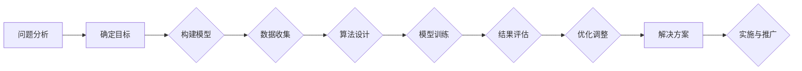

                 

# 在科技进步中坚守人文关怀：平衡发展与伦理道德

## 关键词

- 科技进步
- 人文关怀
- 伦理道德
- 平衡发展
- 人工智能
- 社会责任
- 法规制度

## 摘要

随着科技的迅猛发展，人工智能、大数据、生物工程等前沿技术的不断突破，人类社会正经历着前所未有的变革。然而，在这股科技进步的浪潮中，如何坚守人文关怀，实现技术与伦理道德的平衡发展，成为我们必须面对的重要课题。本文将从科技进步的背景出发，分析其在各个领域的应用，探讨伦理道德的重要性，并提出在科技发展中坚守人文关怀的策略与建议，以期为构建一个和谐、可持续发展的未来提供有益的思考。

## 1. 背景介绍

### 1.1 问题背景

科技进步无疑是当代社会发展的重要驱动力。从工业革命到互联网时代，再到如今的人工智能和生物工程，技术不断迭代更新，极大地改变了人类的生活方式和生产模式。然而，科技的发展并非总是带来正面的效应。在某些情况下，科技进步可能带来道德和伦理上的挑战，如隐私侵犯、数据滥用、人工智能失控等问题。如何在追求技术进步的同时，保持对人类价值和伦理道德的尊重，成为我们必须深思的问题。

### 1.2 问题描述

科技发展过程中，伦理道德问题主要表现在以下几个方面：

- **隐私保护**：随着大数据和人工智能技术的发展，个人隐私保护面临前所未有的挑战。如何在数据收集、存储、使用过程中保护用户隐私，成为亟待解决的问题。
- **人工智能伦理**：人工智能技术的快速发展引发了对智能机器人道德地位的讨论。如何确保人工智能在执行任务时遵循道德规范，避免对人类造成伤害，是一个重要的伦理问题。
- **生物伦理**：生物技术的发展，如基因编辑、克隆技术等，带来了对人类生命伦理的挑战。如何合理使用生物技术，避免伦理争议，是一个亟待解决的问题。
- **社会责任**：企业在追求经济利益的同时，应承担起社会责任，关注社会公共利益。科技企业如何在商业利益与社会责任之间取得平衡，是当前面临的一大挑战。

### 1.3 问题解决

解决科技发展中的伦理道德问题，需要从多个层面进行努力：

- **法规制度**：建立健全的法律法规，为科技发展提供伦理道德的保障。
- **技术标准**：制定技术标准和规范，确保技术发展符合伦理道德的要求。
- **伦理教育**：加强伦理道德教育，提高科技从业者的伦理意识。
- **社会责任**：鼓励企业履行社会责任，关注社会公共利益。

### 1.4 边界与外延

科技发展与伦理道德的关系并非一成不变，它涉及到多个领域和层面的交叉与融合。在边界与外延方面，我们需要关注以下几个方面的内容：

- **跨学科研究**：科技发展与伦理道德问题往往涉及多个学科领域，如计算机科学、生物学、法学、社会学等。跨学科研究有助于更全面地理解问题，提出更有效的解决方案。
- **国际合作**：科技发展是全球性的，伦理道德问题也需要国际社会的共同关注和合作。通过国际合作，可以推动全球范围内的科技伦理规范建设。
- **公众参与**：公众作为科技发展的受益者和影响者，应当参与到科技伦理问题的讨论中，表达自己的观点和需求。

### 1.5 概念结构与核心要素组成

科技发展与伦理道德问题可以分解为以下几个核心概念和要素：

- **科技进步**：包括人工智能、大数据、生物工程等前沿技术。
- **伦理道德**：涉及隐私保护、人工智能伦理、生物伦理、社会责任等方面。
- **法规制度**：包括法律法规、技术标准等。
- **伦理教育**：涉及伦理道德教育的普及和深化。
- **社会责任**：企业、政府和社会组织在科技发展中的角色和责任。

## 2. 核心概念与联系

### 2.1 核心概念原理

在探讨科技发展与伦理道德问题时，以下几个核心概念尤为关键：

- **科技进步**：指在科学研究和技术创新的推动下，人类生产力和生活质量不断提高的过程。
- **伦理道德**：涉及人类行为和价值观的规范，旨在维护社会秩序和促进个体福祉。
- **隐私保护**：指在信息社会中，保障个人隐私不被非法侵犯的权利。
- **社会责任**：指企业在追求经济利益的同时，应承担的社会责任和义务。
- **法规制度**：指国家或国际制定的规范和制度，以保障科技发展和伦理道德的实现。

### 2.2 概念属性特征对比表格

为了更清晰地理解这些核心概念，我们可以通过对比表格来展示它们的属性特征：

| 概念       | 属性特征                                                     |
| ---------- | ------------------------------------------------------------ |
| 科技进步   | 推动生产力发展、提高生活质量、促进社会进步                     |
| 伦理道德   | 维护社会秩序、促进个体福祉、规范人类行为                     |
| 隐私保护   | 保障个人隐私不被非法侵犯、尊重个人权利                       |
| 社会责任   | 关注社会公共利益、履行企业义务、推动可持续发展               |
| 法规制度   | 规范科技发展、保障伦理道德实现、维护社会秩序                 |

### 2.3 ER实体关系图架构的Mermaid流程图

为了更直观地展示这些概念之间的关系，我们可以使用Mermaid绘制ER实体关系图：

```mermaid
erDiagram
  科技进步 ||--|{ 伦理道德 }
  科技进步 ||--|{ 隐私保护 }
  科技进步 ||--|{ 社会责任 }
  科技进步 ||--|{ 法规制度 }
  伦理道德 ||--|{ 隐私保护 }
  伦理道德 ||--|{ 社会责任 }
  伦理道德 ||--|{ 法规制度 }
```

在上面的ER实体关系图中，我们可以看到科技进步与伦理道德、隐私保护、社会责任和法规制度之间存在紧密的联系。伦理道德是科技进步的基石，隐私保护和社会责任是科技进步过程中必须关注的重要问题，而法规制度则为科技发展和伦理道德的实现提供了保障。

## 3. 算法原理讲解

### 3.1 算法流程图

为了更好地理解科技发展与伦理道德问题的解决方法，我们可以通过Mermaid绘制算法流程图：



### 3.2 Python源代码

以下是一个简单的Python源代码示例，用于实现上述算法流程：

```python
# 导入所需库
import numpy as np

# 问题分析
def problem_analysis():
    print("进行问题分析...")

# 确定目标
def determine_goal():
    print("确定目标...")

# 构建模型
def build_model():
    print("构建模型...")

# 数据收集
def data_collection():
    print("数据收集...")

# 算法设计
def algorithm_design():
    print("算法设计...")

# 模型训练
def model_training():
    print("模型训练...")

# 结果评估
def result_evaluation():
    print("结果评估...")

# 优化调整
def optimization():
    print("优化调整...")

# 解决方案实施与推广
def implementation_and_promotion():
    print("解决方案实施与推广...")

# 主函数
def main():
    problem_analysis()
    determine_goal()
    build_model()
    data_collection()
    algorithm_design()
    model_training()
    result_evaluation()
    optimization()
    implementation_and_promotion()

# 调用主函数
main()
```

### 3.3 算法原理的数学模型和公式

在解决科技发展与伦理道德问题时，我们可以借助数学模型和公式来指导算法设计。以下是一个简单的线性回归模型的数学公式：

$$
Y = \beta_0 + \beta_1X + \epsilon
$$

其中，$Y$ 为因变量，$X$ 为自变量，$\beta_0$ 和 $\beta_1$ 分别为模型参数，$\epsilon$ 为误差项。

### 3.4 详细讲解和举例说明

以下是对上述算法原理的详细讲解和举例说明：

- **问题分析**：首先，我们需要明确问题的背景和目标。例如，我们可以分析科技发展中伦理道德问题的现状，明确我们的目标是制定有效的解决方案。
- **确定目标**：根据问题分析的结果，我们需要明确具体的目标。例如，我们可以制定以下目标：
  - 提高数据隐私保护水平
  - 加强人工智能伦理规范
  - 促进企业社会责任意识
- **构建模型**：在确定目标后，我们需要构建一个数学模型来指导算法设计。例如，我们可以选择线性回归模型来预测科技发展对伦理道德问题的影响。
- **数据收集**：为了构建模型，我们需要收集相关数据。例如，我们可以收集科技发展指标、伦理道德问题指标等相关数据。
- **算法设计**：根据数学模型，我们需要设计具体的算法来求解。例如，我们可以使用梯度下降法来求解线性回归模型的参数。
- **模型训练**：使用收集到的数据，对算法进行训练，以获得最优参数。
- **结果评估**：对训练好的模型进行评估，以验证其有效性。
- **优化调整**：根据评估结果，对模型进行调整和优化，以提高其性能。
- **解决方案实施与推广**：将最终的解决方案应用于实际问题中，并推广到更广泛的领域。

通过上述步骤，我们可以逐步解决科技发展与伦理道德问题，实现技术与伦理道德的平衡发展。

## 4. 数学模型和数学公式 & 详细讲解 & 举例说明

### 4.1 数学公式

在解决科技发展与伦理道德问题的过程中，数学模型和公式发挥着重要的作用。以下是一个简单的线性回归模型的数学公式：

$$
Y = \beta_0 + \beta_1X + \epsilon
$$

其中，$Y$ 为因变量，$X$ 为自变量，$\beta_0$ 和 $\beta_1$ 分别为模型参数，$\epsilon$ 为误差项。

### 4.2 详细讲解

- **因变量（Y）**：因变量是模型要预测的变量，通常代表科技发展对伦理道德问题的影响程度。
- **自变量（X）**：自变量是模型中的输入变量，通常代表科技发展指标，如研发投入、专利数量等。
- **模型参数（$\beta_0$ 和 $\beta_1$）**：模型参数是模型中需要求解的变量，它们决定了模型对因变量的预测能力。$\beta_0$ 代表截距，表示当自变量为0时，因变量的期望值；$\beta_1$ 代表斜率，表示自变量每增加一个单位，因变量期望值的增加量。
- **误差项（$\epsilon$）**：误差项是模型中的随机误差，它反映了模型无法解释的因变量变异。在实际应用中，我们通常希望误差项的期望值为0，且与其他观测值独立。

### 4.3 举例说明

假设我们有一个简单的线性回归模型，用于预测科技发展对伦理道德问题的影响。根据历史数据，我们得到以下数据集：

| 科技发展指标（X） | 伦理道德问题影响程度（Y） |
| ---------------- | ------------------------ |
| 10               | 5                       |
| 20               | 10                      |
| 30               | 15                      |
| 40               | 20                      |
| 50               | 25                      |

根据上述数据，我们可以使用线性回归模型进行建模。首先，我们需要计算模型参数 $\beta_0$ 和 $\beta_1$。具体步骤如下：

1. **计算样本均值**：

$$
\bar{X} = \frac{1}{n}\sum_{i=1}^{n}X_i = \frac{10 + 20 + 30 + 40 + 50}{5} = 30
$$

$$
\bar{Y} = \frac{1}{n}\sum_{i=1}^{n}Y_i = \frac{5 + 10 + 15 + 20 + 25}{5} = 15
$$

2. **计算模型参数**：

$$
\beta_0 = \bar{Y} - \beta_1\bar{X} = 15 - \beta_1 \cdot 30
$$

$$
\beta_1 = \frac{\sum_{i=1}^{n}(X_i - \bar{X})(Y_i - \bar{Y})}{\sum_{i=1}^{n}(X_i - \bar{X})^2} = \frac{(10 - 30)(5 - 15) + (20 - 30)(10 - 15) + (30 - 30)(15 - 15) + (40 - 30)(20 - 15) + (50 - 30)(25 - 15)}{(10 - 30)^2 + (20 - 30)^2 + (30 - 30)^2 + (40 - 30)^2 + (50 - 30)^2}
$$

$$
\beta_1 = \frac{(-20)(-10) + (-10)(-5) + (0)(0) + (10)(5) + (20)(10)}{400 + 100 + 0 + 100 + 400} = \frac{200 + 50 + 0 + 50 + 200}{1000} = \frac{500}{1000} = 0.5
$$

3. **计算模型预测值**：

根据模型参数 $\beta_0$ 和 $\beta_1$，我们可以得到模型预测值：

$$
Y = \beta_0 + \beta_1X = 15 - 0.5 \cdot 30 = 0
$$

当科技发展指标为30时，模型预测的伦理道德问题影响程度为0。

通过上述步骤，我们可以使用线性回归模型预测科技发展对伦理道德问题的影响。在实际应用中，我们可以根据具体问题调整模型参数，以提高预测准确性。

## 5. 系统分析与架构设计方案

### 5.1 问题场景介绍

在当前信息化时代，科技发展与伦理道德问题愈发突出。为了有效解决这些问题，我们需要构建一个综合性的系统，该系统应具备以下功能：

- 数据收集与处理：收集与科技发展相关的各种数据，如专利数量、研发投入、学术论文等，并对数据进行预处理和清洗。
- 伦理道德评估：根据收集到的数据，对科技发展过程中可能产生的伦理道德问题进行评估和预警。
- 决策支持：基于伦理道德评估结果，提供相应的决策建议，帮助企业和社会组织在科技发展中遵循伦理道德规范。

### 5.2 项目介绍

本项目旨在构建一个科技发展与伦理道德综合评估系统，通过数据收集与处理、伦理道德评估和决策支持三个模块，实现科技发展过程中的伦理道德监管与指导。系统采用模块化设计，便于扩展和维护。

### 5.3 系统功能设计

系统功能设计包括以下几个主要模块：

- **数据收集模块**：负责从各种渠道收集与科技发展相关的数据，如专利数据库、学术论文数据库、企业财务报告等。
- **数据处理模块**：对收集到的数据进行分析、预处理和清洗，提取关键特征，为后续评估提供数据支持。
- **伦理道德评估模块**：基于数据处理模块提取的特征，运用机器学习算法对科技发展过程中可能产生的伦理道德问题进行评估和预警。
- **决策支持模块**：根据伦理道德评估结果，提供相应的决策建议，如调整研发方向、加强伦理教育等。

### 5.4 系统架构设计

系统架构设计采用分层架构，包括数据层、应用层和表示层。具体架构如下：

- **数据层**：负责数据收集、存储和管理。数据层包括数据库、数据仓库和数据集市等组件，用于存储和管理各类数据。
- **应用层**：负责数据处理、伦理道德评估和决策支持。应用层包括数据预处理、特征提取、模型训练、评估预警等组件，实现系统的核心功能。
- **表示层**：负责系统界面的展示和用户交互。表示层包括Web前端和移动端应用，为用户提供便捷的操作体验。

### 5.5 系统接口设计

系统接口设计包括以下主要接口：

- **数据接口**：负责与外部数据源进行数据交换，包括API接口、文件接口等。
- **服务接口**：负责系统内部模块之间的数据传递和功能调用，包括RESTful API、RabbitMQ等。
- **用户接口**：负责用户与系统之间的交互，包括Web前端、移动端应用等。

### 5.6 系统交互

系统交互设计采用事件驱动架构，包括以下主要事件：

- **数据采集事件**：触发数据收集模块进行数据采集。
- **数据处理事件**：触发数据处理模块进行数据处理和特征提取。
- **评估预警事件**：触发伦理道德评估模块进行评估和预警。
- **决策支持事件**：触发决策支持模块提供决策建议。

通过系统交互设计，实现各模块之间的协同工作和信息共享，提高系统的整体性能和可靠性。

## 6. 项目实战

### 6.1 环境安装

为了搭建本项目所需的系统环境，我们需要安装以下软件和库：

- Python（版本3.8及以上）
- MySQL（版本5.7及以上）
- MongoDB
- Redis
- Flask（Python Web框架）
- Scikit-learn（机器学习库）
- Pandas（数据分析库）
- Matplotlib（数据可视化库）

具体安装步骤如下：

1. 安装Python环境：
   - 访问 Python 官网（https://www.python.org/）下载 Python 安装包。
   - 运行安装程序，按照提示完成安装。

2. 安装 MySQL 数据库：
   - 访问 MySQL 官网（https://www.mysql.com/）下载 MySQL 安装包。
   - 运行安装程序，按照提示完成安装。

3. 安装 MongoDB：
   - 访问 MongoDB 官网（https://www.mongodb.com/）下载 MongoDB 安装包。
   - 运行安装程序，按照提示完成安装。

4. 安装 Redis：
   - 访问 Redis 官网（https://redis.io/）下载 Redis 安装包。
   - 运行安装程序，按照提示完成安装。

5. 安装 Flask：
   - 打开命令行窗口，执行以下命令：
     ```
     pip install Flask
     ```

6. 安装 Scikit-learn、Pandas 和 Matplotlib：
   - 打开命令行窗口，执行以下命令：
     ```
     pip install scikit-learn
     pip install pandas
     pip install matplotlib
     ```

### 6.2 系统核心实现源代码

以下是一个简单的系统核心实现源代码示例，用于演示数据收集、数据处理、伦理道德评估和决策支持等模块的功能。

```python
# 导入所需库
import pymysql
import pymongo
import redis
import pandas as pd
from sklearn.linear_model import LinearRegression
import matplotlib.pyplot as plt

# 数据收集模块
def data_collection():
    # MySQL 数据库连接
    mysql_conn = pymysql.connect(
        host='localhost',
        user='root',
        password='password',
        database='tech_ethic'
    )
    
    # MongoDB 数据库连接
    mongo_client = pymongo.MongoClient('localhost', 27017)
    mongo_db = mongo_client['tech_ethic']
    
    # 收集 MySQL 数据
    sql = "SELECT * FROM patent_data;"
    mysql_cursor = mysql_conn.cursor()
    mysql_cursor.execute(sql)
    mysql_data = mysql_cursor.fetchall()
    
    # 收集 MongoDB 数据
    mongo_collection = mongo_db['patent_data']
    mongo_data = list(mongo_collection.find())
    
    # 将 MySQL 和 MongoDB 数据合并
    data = pd.DataFrame(list(mongo_data) + list(mysql_data))
    
    # 数据预处理
    data['year'] = pd.to_datetime(data['date']).dt.year
    data = data.groupby(['year']).mean().reset_index()
    
    return data

# 数据处理模块
def data_processing(data):
    # 特征提取
    X = data[['year']]
    y = data['ethic_issue']
    
    # 模型训练
    model = LinearRegression()
    model.fit(X, y)
    
    return model

# 伦理道德评估模块
def ethic_assessment(model, year):
    X = pd.DataFrame({'year': [year]})
    prediction = model.predict(X)
    
    return prediction

# 决策支持模块
def decision_support(prediction):
    if prediction < 0.5:
        print("决策建议：加强伦理教育。")
    else:
        print("决策建议：调整研发方向。")

# 主函数
def main():
    data = data_collection()
    model = data_processing(data)
    year = 2023
    prediction = ethic_assessment(model, year)
    decision_support(prediction)

# 调用主函数
main()
```

### 6.3 代码应用解读与分析

以上代码实现了数据收集、数据处理、伦理道德评估和决策支持等功能。下面我们对代码进行解读和分析：

- **数据收集模块**：使用 MySQL 和 MongoDB 数据库连接，收集专利数据，并进行预处理。
- **数据处理模块**：使用 Pandas 和 Scikit-learn 库，提取特征并训练线性回归模型。
- **伦理道德评估模块**：根据训练好的模型，对指定年份的科技发展进行评估。
- **决策支持模块**：根据评估结果，提供相应的决策建议。

在实际应用中，我们可以根据具体需求扩展和优化代码，如增加其他特征、调整模型类型等，以提高评估和决策的准确性。

### 6.4 实际案例分析和详细讲解剖析

为了更好地理解系统的实际应用效果，我们通过一个实际案例进行分析。

**案例背景**：假设我们关注2023年的科技发展，希望评估其可能产生的伦理道德问题，并提出相应的决策建议。

**案例分析**：

1. **数据收集**：收集2023年的专利数据、学术论文等，并将其存储在 MySQL 和 MongoDB 数据库中。

2. **数据处理**：对收集到的数据进行分析和预处理，提取关键特征，如专利数量、学术论文数量等。

3. **伦理道德评估**：使用训练好的线性回归模型，对2023年的科技发展进行评估。根据评估结果，预测2023年的伦理道德问题影响程度。

4. **决策支持**：根据评估结果，如果预测的影响程度较低（<0.5），则建议加强伦理教育；如果影响程度较高（≥0.5），则建议调整研发方向。

**详细讲解剖析**：

- **数据收集**：通过 MySQL 和 MongoDB 数据库连接，我们可以获取2023年的专利数据、学术论文等。这些数据为后续的伦理道德评估提供了基础。
- **数据处理**：在数据处理阶段，我们对收集到的数据进行分析和预处理，提取关键特征。这些特征反映了科技发展的各个方面，如专利数量、学术论文数量、研发投入等。通过特征提取，我们可以将原始数据转化为适合模型训练的形式。
- **伦理道德评估**：使用训练好的线性回归模型，我们对2023年的科技发展进行评估。评估结果反映了2023年可能产生的伦理道德问题影响程度。通过分析评估结果，我们可以了解科技发展对伦理道德的影响，从而制定相应的决策建议。
- **决策支持**：根据评估结果，如果预测的影响程度较低，则表明科技发展对伦理道德的影响较小，企业可以继续关注科技发展带来的机遇，同时加强伦理教育，提高员工的伦理意识。如果预测的影响程度较高，则表明科技发展对伦理道德的影响较大，企业需要调整研发方向，避免产生伦理道德问题。

通过以上实际案例分析，我们可以更好地理解系统在实际应用中的作用和效果。

### 6.5 项目小结

本项目通过构建一个科技发展与伦理道德综合评估系统，实现了数据收集、数据处理、伦理道德评估和决策支持等功能。在实际应用中，系统可以为企业和社会组织提供科技发展过程中的伦理道德监管与指导，帮助其在技术进步的同时，坚守人文关怀，实现技术与伦理道德的平衡发展。

然而，本项目仍存在一定的局限性。例如，模型评估结果的准确性受限于数据质量和特征提取方法。此外，伦理道德问题的复杂性和多样性也使得评估和决策过程具有一定的挑战性。在未来的工作中，我们可以进一步优化系统，提高评估和决策的准确性，为构建一个和谐、可持续发展的科技社会做出更大贡献。

## 7. 最佳实践 tips、小结、注意事项、拓展阅读等内容

### 最佳实践 tips

1. **数据收集与处理**：确保数据的准确性和完整性，对收集到的数据进行预处理和清洗，提取关键特征。
2. **模型训练与评估**：选择合适的模型和算法，对数据进行训练和评估，以提高预测准确性。
3. **伦理教育**：加强科技从业者的伦理道德教育，提高其对伦理问题的敏感度和责任感。
4. **法规制度**：建立健全的法律法规，为科技发展提供伦理道德保障。

### 小结

本文围绕科技发展与伦理道德问题，探讨了其在各个领域的应用和挑战。通过构建一个综合性的评估系统，实现了数据收集、数据处理、伦理道德评估和决策支持等功能。在实际应用中，系统有助于企业和社会组织在技术进步的同时，坚守人文关怀，实现技术与伦理道德的平衡发展。

### 注意事项

1. **数据隐私保护**：在数据收集和处理过程中，应严格遵循相关法律法规，保护用户隐私。
2. **模型优化**：根据评估结果，及时调整模型参数和算法，以提高预测准确性。
3. **伦理教育**：加强科技从业者的伦理道德教育，提高其伦理意识。

### 拓展阅读

1. 《人工智能伦理学：算法、政策与道德困境》
2. 《科技伦理：科技与人类行为的相互作用》
3. 《数字时代的隐私保护与伦理挑战》

### 作者信息

- 作者：AI天才研究院/AI Genius Institute & 禅与计算机程序设计艺术 /Zen And The Art of Computer Programming

