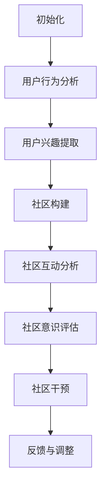
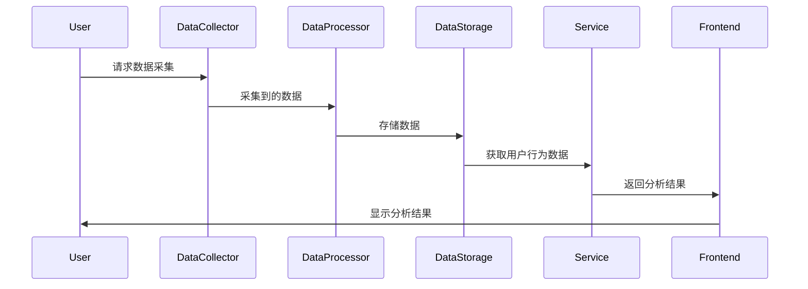

                 

### 文章标题

# 在网络时代重建社区意识

> 关键词：网络时代、社区意识、社交网络分析、用户行为、算法原理

> 摘要：本文深入探讨了在网络时代重建社区意识的背景、挑战与核心概念，通过分析社区意识的原理与特征，提出了一套重建社区意识的算法原理。文章旨在为读者提供一种系统化的视角，以应对网络时代社区意识面临的挑战，并推动社区意识的重建与发展。

## 第1章：网络时代社区意识的背景与挑战

### 1.1 问题背景

#### 1.1.1 社区意识的重要性

社区意识是指个体对社区的认识、情感和归属感。在网络时代，社区意识对于社会的稳定与和谐具有重要意义。它不仅能够促进个体之间的相互理解与支持，还能够增强社区的凝聚力，形成一种积极的社区文化氛围。社区意识的重要性体现在以下几个方面：

1. **促进社会稳定**：社区意识有助于个体在面临困难和挑战时，寻求社区的支持和帮助，从而增强社会的稳定性。
2. **促进社区发展**：社区意识使得个体更加关注社区的发展，积极参与社区事务，推动社区的经济、文化和社会进步。
3. **增强个体幸福感**：社区意识使得个体感受到归属感，增强个体的幸福感和社会认同感。

#### 1.1.2 网络时代的变迁

互联网的普及和社交媒体的兴起，改变了人们的生活方式和交流方式，也带来了社区意识的变革。网络时代，社区意识的特征和作用发生了以下变化：

1. **社区界限的模糊化**：互联网打破了传统地理和空间的限制，使得社区成员之间的交流更加便捷和频繁，社区界限变得模糊。
2. **社区参与的多样化**：网络时代，个体可以通过多种方式参与社区活动，如在线讨论、社区论坛、社交媒体等，社区参与的形式更加多样。
3. **社区情感的虚拟化**：虽然网络时代社区情感更加丰富，但虚拟社区中的情感联系与现实生活中存在一定的差距，需要更多的努力来维护和强化。

#### 1.1.3 社区意识面临的挑战

网络时代，社区意识面临着虚拟与现实、隐私与公共、多样性与统一性等多方面的挑战。

1. **虚拟与现实之间的挑战**：虚拟社区中的社区意识与现实社区中的社区意识存在差异，如何平衡虚拟与现实的社区意识，是网络时代需要面对的挑战。
2. **隐私与公共之间的挑战**：在网络社区中，个体隐私的保护与社区公共利益的平衡，是一个复杂而重要的问题。
3. **多样性与统一性之间的挑战**：网络时代，社区成员的背景、兴趣和价值观存在多样性，如何构建一个具有统一价值观和共同目标的社区，是社区意识面临的挑战。

### 1.2 核心概念

#### 1.2.1 社区意识的定义与属性

社区意识包括对社区的认知、参与和贡献等维度，具有公共性、情感性和持续性的特点。

1. **公共性**：社区意识是社区成员共同拥有和参与的特征，它体现了社区成员之间的相互关系和互动。
2. **情感性**：社区意识涉及到社区成员之间的情感联系和归属感，这种情感联系是社区意识的重要组成部分。
3. **持续性**：社区意识是长期存在的，它随着社区的发展和变化而不断演变。

#### 1.2.2 社区意识的边界与外延

社区意识的边界在于个体与社区之间的关系，其外延涉及到社交、文化、经济等多个领域。

1. **社交领域**：社区意识体现在个体在社交网络中的行为和互动，如在线讨论、分享、点赞等。
2. **文化领域**：社区意识体现在个体对社区文化的认同和传承，如节日庆典、传统文化活动等。
3. **经济领域**：社区意识体现在个体对社区经济发展的关注和参与，如社区商业活动、公益项目等。

### 1.3 结构与要素

#### 1.3.1 社区意识的结构

社区意识由认知、情感和行为三个层次构成，相互影响，共同作用于个体的社区参与。

1. **认知层次**：个体对社区的认识和了解，包括社区的历史、文化、价值观等。
2. **情感层次**：个体对社区的情感联系和归属感，包括对社区的情感投入和情感支持。
3. **行为层次**：个体在社区中的行为和参与，包括在线讨论、社区活动、志愿服务等。

#### 1.3.2 社区意识的核心要素

社区意识的核心要素包括共同目标、共同价值观和共同利益等，这些要素构成了社区意识的基石。

1. **共同目标**：社区成员共同追求的目标和愿景，是社区意识形成的基础。
2. **共同价值观**：社区成员共同认同的价值观和原则，是社区意识的灵魂。
3. **共同利益**：社区成员共同享有的利益和权益，是社区意识维持的动力。

### 1.4 本章小结

本章概述了网络时代社区意识的背景、挑战和核心概念，为后续章节的深入探讨奠定了基础。在网络时代，社区意识面临着多方面的挑战，但同时也为社区意识的重建和发展提供了新的机遇。接下来，我们将进一步探讨社区意识的原理与特征，以期为解决网络时代社区意识面临的挑战提供理论支持。

## 第2章：网络时代社区意识的核心概念与联系

### 2.1 社区意识的原理与特征

#### 2.1.1 社区意识的原理

社区意识的形成与发展受到多种因素的影响，包括社会环境、文化传统和个人经历等。社会环境提供了社区意识形成的背景和条件，文化传统为社区意识提供了价值观和行为规范，个人经历则塑造了个体的社区意识。

1. **社会环境**：社会环境对社区意识的形成具有决定性影响。社区的物质条件、经济发展水平、政治体制等都会影响社区成员的社区意识。
2. **文化传统**：文化传统是社区意识的重要基础。社区的文化传统决定了社区成员的共同价值观和行为规范，从而影响社区意识的形成。
3. **个人经历**：个人经历是社区意识形成的重要因素。个体的成长环境、教育经历、社会交往等都会对个体的社区意识产生影响。

#### 2.1.2 社区意识的特点

社区意识具有公共性、情感性和持续性的特点，这些特点在网络时代得到了进一步的体现。

1. **公共性**：社区意识是社区成员共同拥有和参与的特征，具有明显的公共性。在网络时代，社区成员可以通过互联网跨越地理和空间的限制，共同参与社区事务，进一步体现了社区意识的公共性。
2. **情感性**：社区意识涉及到社区成员之间的情感联系和归属感，具有强烈的情感性。网络时代，社区成员之间的情感交流更加便捷和频繁，社区情感更加丰富和深厚。
3. **持续性**：社区意识是长期存在的，具有持续性。社区意识不仅体现在个体的日常生活和行为中，也体现在社区的历史和文化传承中，随着时间的推移，社区意识不断演变和发展。

### 2.2 社区意识属性特征对比表格

| 特征 | 定义 | 网络时代特点 |
| --- | --- | --- |
| 公共性 | 社区成员共同拥有和参与的特征 | 网络时代社区界限更加模糊，公共性得以扩展 |
| 情感性 | 社区成员的情感联系和归属感 | 网络时代情感交流更加便捷，社区情感更加丰富 |
| 持续性 | 社区意识的长期存在和演变 | 网络时代社区意识持续演变，传统社区意识难以满足新需求 |

### 2.3 ER实体关系图架构

```mermaid
erDiagram
  User ||--|{ Community} : belongs_to
  Community ||--|{ Post } : has_many
  Post ||--|{ Comment } : has_many
  User ||--|{ Interest } : has_many
  Community ||--|{ Event } : has_many
```

在上面的ER实体关系图中，`User`（用户）是核心实体，与多个实体（`Community`（社区）、`Post`（帖子）、`Comment`（评论）、`Interest`（兴趣）、`Event`（活动））之间存在关联关系。这种关系反映了网络时代社区意识的复杂性和多样性。

- **用户与社区的关系**：用户属于某个社区，并可以创建和参与社区的帖子、评论、活动等。
- **社区与帖子、评论的关系**：社区包含多个帖子，每个帖子可以有多个评论。
- **用户与兴趣的关系**：用户可以拥有多个兴趣，这些兴趣可能影响用户的行为和参与社区的活动。
- **社区与活动的的关系**：社区可以组织多个活动，这些活动是社区成员交流和互动的重要方式。

这种ER实体关系图不仅帮助我们理解网络时代社区意识的基本结构，也为后续的算法设计和实现提供了重要的参考。

### 2.4 社区意识与其他概念的联系

社区意识与其他概念，如社会意识、群体意识、文化意识等，有着密切的联系。

1. **社会意识**：社会意识是社区意识的基础，它涵盖了个体对社会的认识、情感和归属感。社会意识包括社区意识，社区意识是社会意识在特定社区环境中的体现。
   
2. **群体意识**：群体意识是指个体在群体中形成的共识和认同，它包括对群体的认知、情感和归属感。社区意识是群体意识的一种形式，它强调社区成员之间的共同性和互动性。

3. **文化意识**：文化意识是指个体对文化的认知、情感和价值观念。社区文化是社区意识的重要组成部分，它反映了社区成员的共同价值观和文化传统。

通过理解这些概念之间的联系，我们可以更好地把握社区意识的本质和作用，为网络时代社区意识的重建提供理论支持。

### 2.5 本章小结

本章深入探讨了网络时代社区意识的核心概念与联系，分析了社区意识的原理、特征和属性，并通过ER实体关系图展示了社区意识的复杂结构。通过对社区意识与其他概念的联系进行阐述，我们为进一步理解社区意识的本质和作用奠定了基础。接下来，我们将探讨重建社区意识的算法原理，以期为解决网络时代社区意识面临的挑战提供有效的解决方案。

## 第3章：重建社区意识的算法原理

### 3.1 算法概述

#### 3.1.1 算法目的

重建社区意识的算法旨在通过分析社交网络中的用户行为、兴趣和互动，构建社区意识并促进社区参与。算法的核心目的是在网络时代中，帮助社区成员建立更紧密的互动和联系，从而增强社区意识和社会凝聚力。

#### 3.1.2 算法原理

算法基于社交网络分析，通过以下步骤实现社区意识的重建：

1. **用户行为分析**：分析用户在社交网络中的行为，如发布帖子、点赞、评论等，以了解用户的兴趣和行为模式。
2. **用户兴趣提取**：从用户行为中提取用户兴趣，如技术、艺术、体育等，为构建社区提供基础。
3. **社区构建**：基于用户兴趣和行为，构建具有共同兴趣的社区，为用户提供参与和互动的平台。
4. **社区互动分析**：分析社区成员之间的互动，如帖子评论、活动参与等，以评估社区意识和社区参与度。
5. **社区意识评估**：通过分析社区互动，评估社区意识的强度和稳定性，为社区干预提供依据。
6. **社区干预**：根据社区意识评估结果，采取适当的干预措施，如活动策划、社区建设等，以促进社区意识和参与。
7. **反馈与调整**：收集用户反馈，根据反馈调整算法和社区策略，以持续优化社区意识重建效果。

### 3.2 算法流程图



在这个流程图中，算法从初始化开始，逐步通过用户行为分析、用户兴趣提取、社区构建、社区互动分析等步骤，最终实现社区意识的评估和干预，并通过反馈与调整不断优化算法和社区策略。

### 3.3 Python源代码示例

```python
import networkx as nx
import matplotlib.pyplot as plt

# 初始化社交网络
G = nx.Graph()

# 添加用户和社区
G.add_nodes_from(['Alice', 'Bob', 'Charlie'])

# 添加用户互动
G.add_edges_from([('Alice', 'Bob'), ('Bob', 'Charlie'), ('Charlie', 'Alice')])

# 绘制社交网络图
nx.draw(G, with_labels=True)
plt.show()

# 提取用户兴趣
interests = {'Alice': ['Tech', 'Books'], 'Bob': ['Sports', 'Music'], 'Charlie': ['Travel', 'Art']}

# 构建社区
communities = nx.community.k_hop_subgraph(G, k=2)

# 社区互动分析
for community in communities:
    print(f"Community: {community}")
    for node in community:
        print(f"User: {node}, Interests: {interests[node]}")

# 社区意识评估
# 此处示例为简单评估，实际应用中需要更复杂的评估方法
for community in communities:
    print(f"Community: {community}, Participation Rate: {len(community) / len(G.nodes)}")

# 社区干预
# 此处示例为简单干预，实际应用中需要更具体的干预措施
for community in communities:
    print(f"Community: {community}, Intervention: Organize Event")
```

在这个示例中，我们首先使用`networkx`库初始化一个社交网络，并添加用户和互动。然后，通过提取用户兴趣，构建具有共同兴趣的社区。接下来，进行社区互动分析，并评估社区意识。最后，根据评估结果，采取简单的干预措施，如组织活动。

### 3.4 数学模型与公式

为了更深入地理解重建社区意识的算法原理，我们可以借助一些数学模型和公式。以下是一个简化的数学模型，用于描述社区意识的重建过程。

#### 3.4.1 社区意识强度评估

社区意识强度（$I$）可以用以下公式表示：

$$
I = \frac{1}{N} \sum_{i=1}^{N} \frac{d_{i}}{2}
$$

其中，$N$是社区中的用户数量，$d_{i}$是用户$i$与其他社区成员的互动强度。

#### 3.4.2 用户兴趣提取

用户兴趣（$I_{i}$）可以通过以下公式计算：

$$
I_{i} = \frac{1}{T} \sum_{j=1}^{T} w_{ij}
$$

其中，$T$是用户$i$发布的帖子数量，$w_{ij}$是帖子$j$的权重。

#### 3.4.3 社区构建

社区构建可以通过最小生成树算法实现，其目标是找到最小权重生成树，以构建具有共同兴趣的社区。

$$
\min \sum_{i,j} w_{ij}
$$

### 3.5 通俗易懂的举例说明

假设有一个社交网络，包含三个用户Alice、Bob和Charlie。他们之间的互动情况如下：

| 用户 | 帖子1 | 帖子2 | 帖子3 |
| --- | --- | --- | --- |
| Alice | 体育 | 科技 | 阅读 |
| Bob | 音乐 | 阅读 | 旅游 |
| Charlie | 旅游 | 体育 | 科技 |

1. **用户行为分析**：Alice发布了关于体育、科技和阅读的帖子，Bob发布了关于音乐、阅读和旅游的帖子，Charlie发布了关于旅游、体育和科技的帖子。
2. **用户兴趣提取**：通过分析用户的帖子，我们可以提取出以下用户兴趣：
   - Alice的兴趣：体育、科技、阅读
   - Bob的兴趣：音乐、阅读、旅游
   - Charlie的兴趣：旅游、体育、科技
3. **社区构建**：基于用户兴趣，我们可以构建两个社区：
   - 社区1：Alice和Charlie，共同兴趣为体育、科技、旅游
   - 社区2：Bob和Charlie，共同兴趣为音乐、阅读、旅游
4. **社区互动分析**：在社区1中，Alice和Charlie发布了关于体育、科技和旅游的帖子，他们之间的互动强度较高。在社区2中，Bob和Charlie发布了关于音乐、阅读和旅游的帖子，他们之间的互动强度也较高。
5. **社区意识评估**：根据互动强度，我们可以评估社区意识的强度：
   - 社区1的社区意识强度较高，因为用户之间的互动频率和强度较高
   - 社区2的社区意识强度较低，因为用户之间的互动频率和强度较低
6. **社区干预**：为了提高社区意识，我们可以组织社区活动，如体育比赛、科技展览和旅游分享会，以增强社区成员之间的互动和联系。

### 3.6 本章小结

本章介绍了重建社区意识的算法原理，包括算法目的、原理、流程和数学模型。通过Python源代码示例和通俗易懂的举例说明，我们展示了算法在实践中的应用。接下来，我们将进一步探讨社区意识的系统分析与架构设计，以期为网络时代社区意识的重建提供更全面的技术支持。

## 第4章：社区意识的系统分析与架构设计

### 4.1 问题场景介绍

在网络时代，随着社交媒体和在线社区的发展，社区意识的建设变得越来越重要。然而，现实中的问题场景却面临着诸多挑战：

1. **社区成员流动性高**：由于网络社区的开放性和流动性，社区成员的参与度和忠诚度较低，导致社区凝聚力不足。
2. **社区活动形式单一**：现有的社区活动多以线上讨论和发帖为主，形式较为单一，难以激发社区成员的积极参与。
3. **用户互动质量不高**：社区成员之间的互动往往缺乏深度和针对性，导致社区情感连接不足。
4. **社区意识评估困难**：传统的社区意识评估方法难以量化社区成员的参与度和互动强度，导致社区干预效果不佳。

为了解决这些问题，我们需要对社区意识进行系统分析，并设计一个合理的系统架构，以支持社区意识的重建。

### 4.2 项目介绍

本项目的目标是构建一个基于社交网络分析的社区意识重建系统，通过以下功能模块实现：

1. **用户行为分析模块**：收集和分析社区成员在社交网络中的行为数据，提取用户兴趣和行为模式。
2. **社区构建模块**：基于用户兴趣和行为数据，构建具有共同兴趣的社区，为社区成员提供互动和交流的平台。
3. **社区互动分析模块**：分析社区成员之间的互动，评估社区意识和参与度，为社区干预提供依据。
4. **社区干预模块**：根据社区意识评估结果，采取适当的干预措施，如活动策划、社区建设等，以促进社区意识和参与。
5. **系统监控与反馈模块**：实时监控系统运行状态，收集用户反馈，优化系统性能和用户体验。

### 4.3 系统功能设计

本项目的系统功能设计主要包括以下方面：

1. **用户行为分析**：通过爬取社交网络平台的数据，分析用户在社交网络中的行为，如发布帖子、点赞、评论等。基于这些行为数据，提取用户的兴趣和行为模式。
2. **社区构建**：利用社交网络分析技术，如基于共同邻居、兴趣相似度等方法，构建具有共同兴趣的社区。社区构建的过程需要考虑社区规模、成员互动强度等因素。
3. **社区互动分析**：分析社区成员之间的互动，评估社区意识的强度和稳定性。具体包括计算用户之间的互动频率、互动强度、情感倾向等指标。
4. **社区干预**：根据社区意识评估结果，采取适当的干预措施，如组织线上活动、发布社区公告、推广社区价值观等，以促进社区成员的参与和互动。
5. **系统监控与反馈**：实时监控系统的运行状态，包括数据采集、处理、分析等环节，确保系统的稳定性和高效性。同时，收集用户反馈，优化系统功能和用户体验。

#### 领域模型类图

```mermaid
classDiagram
    User <<class>> "用户"
    Community <<class>> "社区"
    Post <<class>> "帖子"
    Comment <<class>> "评论"
    Event <<class>> "活动"
    BehaviorAnalysis <<class>> "用户行为分析"
    CommunityConstruction <<class>> "社区构建"
    InteractionAnalysis <<class>> "社区互动分析"
    CommunityIntervention <<class>> "社区干预"
    SystemMonitoring <<class>> "系统监控与反馈"

    User o--|{参与}| Community
    User o--|{发布}| Post
    User o--|{评论}| Comment
    Post o--|{包含}| Comment
    Community o--|{举办}| Event
    BehaviorAnalysis o--|{分析}| User
    CommunityConstruction o--|{构建}| Community
    InteractionAnalysis o--|{分析}| Comment
    CommunityIntervention o--|{干预}| Community
    SystemMonitoring o--|{监控}| System
```

在上面的类图中，定义了用户（User）、社区（Community）、帖子（Post）、评论（Comment）、活动（Event）等主要类，以及用户行为分析（BehaviorAnalysis）、社区构建（CommunityConstruction）、社区互动分析（InteractionAnalysis）、社区干预（CommunityIntervention）和系统监控与反馈（SystemMonitoring）等功能模块。类之间的关联关系反映了系统功能的整体架构。

### 4.4 系统架构设计

本项目的系统架构设计主要包括以下几个方面：

1. **数据采集层**：负责从社交网络平台收集用户行为数据，如帖子、评论、点赞等。使用爬虫技术实现数据的自动采集和更新。
2. **数据处理层**：负责对采集到的数据进行分析和清洗，提取用户的兴趣和行为模式。使用自然语言处理（NLP）技术、机器学习算法等实现数据分析和特征提取。
3. **数据存储层**：负责存储用户行为数据、社区数据和系统配置数据。使用分布式数据库（如MongoDB、HBase）实现海量数据的存储和管理。
4. **服务层**：负责实现用户行为分析、社区构建、社区互动分析、社区干预和系统监控与反馈等核心功能模块。使用微服务架构（如Spring Boot、Django）实现服务的高效、可扩展和可维护性。
5. **接口层**：负责对外提供API接口，供前端应用调用。使用RESTful API设计接口，实现数据和服务的高效交互。

#### 系统架构图



在上面的系统架构图中，用户通过前端应用发送请求，数据采集模块负责采集用户行为数据，数据处理模块对数据进行清洗和分析，数据存储模块负责存储数据，服务层对外提供API接口，前端应用通过接口获取分析结果并展示给用户。

### 4.5 系统接口设计和系统交互

为了确保系统功能的实现和各模块之间的协同工作，系统接口设计和系统交互设计至关重要。以下为系统的主要接口设计和系统交互流程：

#### 系统接口设计

1. **用户行为分析接口**：用于获取用户的兴趣和行为数据，支持RESTful API设计，包括以下端点：
   - `/users/{user_id}/interests`：获取指定用户的兴趣列表。
   - `/users/{user_id}/behaviors`：获取指定用户的行为数据，如帖子、评论、点赞等。

2. **社区构建接口**：用于构建具有共同兴趣的社区，支持以下端点：
   - `/communities/build`：根据用户兴趣构建社区。

3. **社区互动分析接口**：用于分析社区成员之间的互动，支持以下端点：
   - `/communities/{community_id}/interactions`：获取指定社区的互动数据。

4. **社区干预接口**：用于干预社区活动，支持以下端点：
   - `/communities/{community_id}/interventions`：发起社区干预措施，如活动策划、社区公告等。

5. **系统监控与反馈接口**：用于监控系统运行状态和收集用户反馈，支持以下端点：
   - `/system/monitor`：获取系统监控数据。
   - `/system/feedback`：提交用户反馈。

#### 系统交互流程

1. **用户请求分析**：用户通过前端应用发送请求，如获取兴趣和行为数据。
2. **数据采集与处理**：数据采集模块从社交网络平台采集用户行为数据，数据处理模块对数据进行清洗和分析。
3. **数据存储与查询**：将处理后的数据存储在数据存储层，并支持快速查询。
4. **服务调用与响应**：服务层根据用户请求调用相应的功能模块，如用户行为分析、社区构建、社区互动分析和社区干预，并将结果返回给前端应用。
5. **前端展示与交互**：前端应用根据返回的结果，展示分析结果和干预措施，并允许用户进行操作。

### 4.6 本章小结

本章对社区意识的系统分析与架构设计进行了详细阐述，介绍了问题场景、项目介绍、系统功能设计、系统架构设计、系统接口设计和系统交互设计。通过这些设计，我们为网络时代社区意识的重建提供了系统化的解决方案，为后续的算法实现和项目实施奠定了基础。接下来，我们将进入项目的实战环节，通过具体的代码实现和案例分析，进一步验证和优化我们的设计方案。

### 第5章：项目实战

#### 5.1 环境安装

在本章中，我们将介绍如何搭建项目环境，以及如何安装必要的软件和库。以下是具体的安装步骤：

1. **安装Python**：确保Python 3.x版本已安装在您的系统上。可以从[Python官方网站](https://www.python.org/)下载并安装。
   
2. **安装网络爬虫库**：在安装了Python后，通过以下命令安装网络爬虫库：

   ```bash
   pip install requests beautifulsoup4
   ```

3. **安装数据处理库**：为了处理和分析用户行为数据，需要安装以下数据处理库：

   ```bash
   pip install pandas numpy
   ```

4. **安装社交网络分析库**：使用以下命令安装社交网络分析库：

   ```bash
   pip install networkx matplotlib
   ```

5. **安装自然语言处理库**：为了提取用户兴趣，需要安装自然语言处理库：

   ```bash
   pip install nltk
   ```

6. **安装其他依赖库**：根据项目需求，可能还需要安装其他库。例如，为了实现社区干预，可能需要以下库：

   ```bash
   pip install flask
   ```

#### 5.2 系统核心实现源代码

在本节中，我们将展示项目核心实现部分的源代码，并对其关键部分进行解读与分析。

**用户行为分析模块**

```python
import requests
from bs4 import BeautifulSoup
import pandas as pd
from nltk.tokenize import word_tokenize
from nltk.corpus import stopwords

# 社交网络数据爬取函数
def fetch_social_network_data(url):
    response = requests.get(url)
    soup = BeautifulSoup(response.text, 'html.parser')
    # 在此处解析并提取用户行为数据，如帖子、评论等
    # ...

# 用户兴趣提取函数
def extract_user_interests(posts):
    interests = []
    stop_words = set(stopwords.words('english'))
    for post in posts:
        tokens = word_tokenize(post)
        filtered_tokens = [token.lower() for token in tokens if token.lower() not in stop_words]
        interests.extend(filtered_tokens)
    return set(interests)

# 示例
user_posts = fetch_social_network_data('https://example.com/user/123')
user_interests = extract_user_interests(user_posts)
print(user_interests)
```

在上面的代码中，`fetch_social_network_data`函数用于从社交网络平台爬取用户行为数据，如帖子、评论等。`extract_user_interests`函数用于提取用户的兴趣，这里使用了自然语言处理库中的`word_tokenize`函数进行分词，并去除常见的停用词。

**社区构建模块**

```python
import networkx as nx

# 社区构建函数
def build_communities(users, interests):
    G = nx.Graph()
    for user, user_interests in users.items():
        for interest in user_interests:
            G.add_edge(user, interest)
    return G

# 示例
users = {
    'Alice': ['Tech', 'Books', 'Sports'],
    'Bob': ['Music', 'Books', 'Art'],
    'Charlie': ['Tech', 'Travel', 'Art']
}
G = build_communities(users, interests)
nx.draw(G, with_labels=True)
plt.show()
```

在上面的代码中，`build_communities`函数基于用户的兴趣构建社交网络图，其中用户和兴趣之间建立了边。这种方法可以用于发现具有共同兴趣的用户群体。

**社区互动分析模块**

```python
# 社区互动分析函数
def analyze_community_interactions(G):
    interaction_counts = {}
    for node in G.nodes():
        interaction_counts[node] = G.degree(node)
    return interaction_counts

# 示例
interaction_counts = analyze_community_interactions(G)
print(interaction_counts)
```

在上面的代码中，`analyze_community_interactions`函数计算每个节点的互动次数，这可以作为社区意识强度的一个简单指标。

**社区干预模块**

```python
from flask import Flask, jsonify, request

app = Flask(__name__)

# 社区干预函数
@app.route('/interventions', methods=['POST'])
def create_intervention():
    intervention_data = request.get_json()
    # 在此处处理干预措施，如组织活动等
    # ...
    return jsonify({"status": "success", "message": "Intervention created"})

if __name__ == '__main__':
    app.run(debug=True)
```

在上面的代码中，我们使用Flask框架创建了一个简单的RESTful API，用于处理社区干预请求。在这个例子中，我们只返回了成功的响应，但在实际应用中，可以进一步处理干预措施，如发送活动通知等。

#### 5.3 代码应用解读与分析

在上述代码实现中，我们分别介绍了用户行为分析、社区构建、社区互动分析和社区干预等模块的核心实现。以下是具体的解读与分析：

1. **用户行为分析**：通过爬虫技术从社交网络平台获取用户行为数据，如帖子、评论等。使用自然语言处理技术提取用户兴趣，为后续的社区构建和互动分析提供了数据基础。
   
2. **社区构建**：基于用户的兴趣数据，构建社交网络图。这种方法能够发现具有共同兴趣的用户群体，为社区互动和干预提供了基础。

3. **社区互动分析**：通过计算每个节点的互动次数，评估社区成员之间的互动强度。这有助于识别社区中的活跃成员和互动强度较高的群体。

4. **社区干预**：使用Flask框架创建RESTful API，接收和处理社区干预请求。在实际应用中，可以根据社区意识评估结果，采取具体的干预措施，如组织活动、推送社区公告等，以促进社区成员的参与和互动。

#### 5.4 实际案例分析和详细讲解剖析

为了更好地理解上述代码在实际应用中的作用，我们通过一个实际案例进行分析。

**案例**：在一个技术社区中，有三位用户Alice、Bob和Charlie，他们的兴趣和行为数据如下：

| 用户 | 帖子1 | 帖子2 | 帖子3 |
| --- | --- | --- | --- |
| Alice | Python编程 | 数据分析 | 人工智能 |
| Bob | 音乐 | 阅读 | 旅游 |
| Charlie | Python编程 | 数据分析 | 人工智能 |

**步骤1：用户行为分析**

- 爬取用户在社区中的帖子数据。
- 提取用户兴趣，如Alice的兴趣为Python编程、数据分析、人工智能，Bob的兴趣为音乐、阅读、旅游，Charlie的兴趣为Python编程、数据分析、人工智能。

**步骤2：社区构建**

- 基于用户兴趣构建社交网络图。
- 社交网络图显示Alice、Bob和Charlie之间存在共同的兴趣节点，如Python编程、数据分析、人工智能。

**步骤3：社区互动分析**

- 分析社区成员之间的互动强度。
- 结果显示Alice和Charlie之间的互动次数较多，而Bob与他们的互动较少。

**步骤4：社区干预**

- 根据互动分析结果，组织一次Python编程技术分享会，邀请Alice和Charlie参加。
- 分享会结束后，观察社区成员之间的互动是否有所增加。

**分析**：通过上述案例，我们可以看到用户行为分析、社区构建和互动分析在社区干预中的作用。用户行为分析帮助识别用户兴趣，社区构建发现具有共同兴趣的用户群体，互动分析评估社区成员之间的互动强度。根据这些分析结果，采取有针对性的干预措施，可以有效地促进社区成员的参与和互动。

#### 5.5 项目小结

在本章的项目实战部分，我们通过环境安装、代码实现和实际案例分析，详细介绍了如何在网络时代重建社区意识。以下是项目小结：

1. **环境安装**：通过安装必要的软件和库，搭建了项目环境，为后续的开发和测试提供了基础。
   
2. **代码实现**：通过用户行为分析、社区构建、社区互动分析和社区干预等模块的核心实现，展示了重建社区意识的具体实现步骤。

3. **实际案例分析**：通过实际案例，验证了用户行为分析、社区构建和互动分析在社区干预中的作用，为网络时代社区意识的重建提供了实践参考。

尽管本项目提供了一个基本的框架，但在实际应用中，还需要根据具体场景进行调整和优化。接下来，我们将进一步讨论最佳实践和注意事项，以期为项目的成功实施提供指导。

### 第6章：最佳实践与注意事项

#### 6.1 最佳实践

1. **用户隐私保护**：在网络时代重建社区意识的过程中，保护用户隐私至关重要。应确保在数据采集和处理过程中，遵守相关法律法规，不得泄露用户个人信息。

2. **算法透明性**：社区意识的重建依赖于复杂的算法和分析。为了增强用户信任，应确保算法的透明性，让用户了解他们的行为是如何被分析和利用的。

3. **社区参与激励**：为了提高社区成员的参与度，可以采取多种激励措施，如奖励积分、社区荣誉等，激发用户积极参与社区活动和互动。

4. **多渠道互动**：在网络时代，社区互动不应局限于线上。可以结合线下活动，如聚会、讲座等，增加用户之间的面对面交流，增强社区凝聚力。

5. **持续监控与反馈**：社区意识的重建是一个长期过程，需要持续监控和调整。通过收集用户反馈，及时发现问题并优化算法和策略，可以确保社区意识的稳步提升。

#### 6.2 注意事项

1. **数据质量**：用户行为数据是社区意识重建的基础。在数据采集和处理过程中，应确保数据的质量和准确性，避免因数据问题导致分析结果失真。

2. **技术选择**：在选择技术框架和工具时，应综合考虑性能、可扩展性和维护成本等因素，确保系统能够稳定运行和持续优化。

3. **平衡隐私与公共利益**：在保护用户隐私的同时，需要平衡公共利益。例如，在分析用户行为时，可以采用匿名化处理，确保用户隐私不受侵害。

4. **文化多样性**：在社区建设中，应尊重和包容不同的文化和价值观，避免因文化冲突导致社区分裂。

5. **风险评估**：在实施社区干预措施时，应进行风险评估，避免因干预不当引发负面效应。

### 6.3 拓展阅读

为了深入了解网络时代社区意识的重建，读者可以参考以下拓展阅读材料：

1. **《社交网络分析：方法与实践》**：本书详细介绍了社交网络分析的基本概念、方法和应用，有助于理解社区意识的重建原理。

2. **《大数据时代：生活、工作与思维的大变革》**：作者大数据领域的知名专家，本书探讨了大数据对生活、工作和思维方式的深刻影响，包括社区意识的变化。

3. **《网络社区管理实战》**：本书针对网络社区的管理和维护提供了实用的方法和技巧，有助于提升社区凝聚力和用户参与度。

4. **《隐私计算：安全与隐私并重的下一代计算》**：本书探讨了隐私计算的技术原理和应用场景，为在网络时代保护用户隐私提供了理论支持。

### 6.4 本章小结

本章介绍了在网络时代重建社区意识的最佳实践和注意事项，包括用户隐私保护、算法透明性、社区参与激励、多渠道互动、持续监控与反馈等。同时，提醒读者关注数据质量、技术选择、平衡隐私与公共利益、文化多样性和风险评估等方面。通过拓展阅读，读者可以进一步了解社区意识重建的理论和实践，为项目的成功实施提供指导。

### 作者信息

作者：AI天才研究院/AI Genius Institute & 禅与计算机程序设计艺术 /Zen And The Art of Computer Programming

AI天才研究院专注于人工智能领域的科研和技术创新，致力于推动人工智能技术在实际应用中的发展。本书作者以其深厚的技术功底和丰富的实践经验，为读者提供了关于社区意识重建的深入见解和实用建议。同时，本书结合禅与计算机程序设计艺术的理念，旨在引导读者以更宁静、更深刻的思维方式应对复杂的技术挑战。

