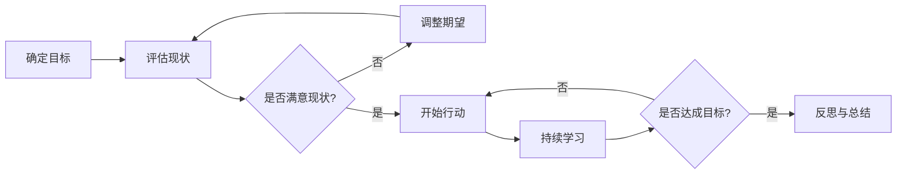
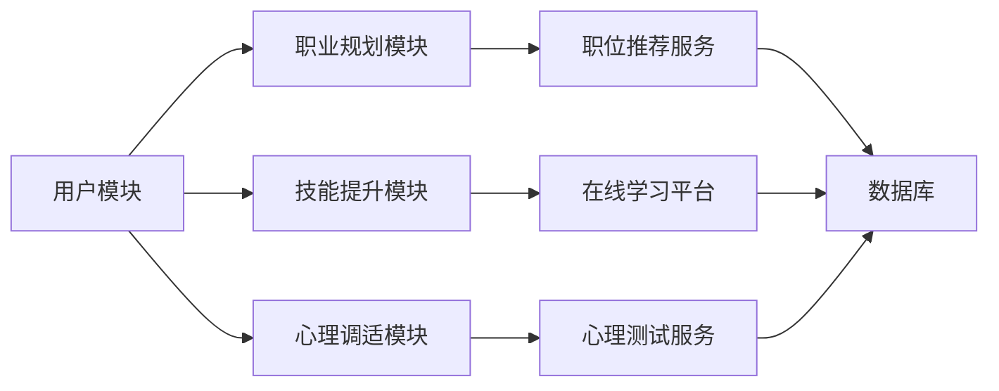

                 


## 在职场中寻找意义：超越薪资和地位的追求

### 关键词
- 职场意义
- 薪资和地位
- 心理调适
- 职业发展

### 摘要
在现代职场中，许多人为了追求高薪资和地位，往往忽视了工作的真正意义。本文将从心理学、哲学和职业发展的角度，探讨如何超越薪资和地位的追求，在职场中寻找并实现个人的意义。

### 背景介绍

#### 问题背景
在现代社会中，职场压力巨大，许多人为了生存和事业发展，常常陷入对薪资和地位的追求之中。然而，这种追求往往导致人们忽视了工作中的意义和自身的幸福感。因此，如何在职场中寻找并实现个人意义的追求，成为一个值得探讨的课题。

#### 问题描述
《在职场中寻找意义：超越薪资和地位的追求》这本书旨在探讨职场中的意义追求，帮助读者找到适合自己的职业路径，实现个人成长和职业发展。书中将深入分析职场意义的概念、来源、实现路径以及如何平衡工作与生活等方面。

#### 问题解决
通过深入研究职场意义的相关理论，结合实际案例，本书将为读者提供一套系统的职场意义追求方法和策略。同时，书中还将探讨职场中的心理调适技巧，帮助读者在面对职场挑战时保持积极心态，实现自我价值。

#### 边界与外延
1. **边界：** 职场意义追求涉及职业选择、工作态度、个人价值观等多个方面，但不限于具体的职业领域。
2. **外延：** 职场意义追求不仅限于个人发展，还包括团队协作、组织文化、社会责任等多个层面。

#### 概念结构与核心要素组成
1. **职场意义：** 指个体在工作中所感受到的价值和意义，是激发工作热情和动力的重要源泉。
2. **薪资和地位：** 虽然在职场中具有一定的影响力，但它们并非职场意义的全部。
3. **平衡：** 在追求职场意义的过程中，需要平衡工作与生活的关系，保持身心健康。

### 核心概念与联系

#### 核心概念
1. **职场意义：** 指个体在工作中所感受到的价值和意义，是激发工作热情和动力的重要源泉。
2. **薪资和地位：** 虽然在职场中具有一定的影响力，但它们并非职场意义的全部。
3. **平衡：** 在追求职场意义的过程中，需要平衡工作与生活的关系，保持身心健康。

#### 概念属性特征对比表格
| 特征         | 职场意义               | 薪资和地位                     |
| ------------ | ---------------------- | ------------------------------ |
| **来源**     | 内在驱动力             | 外在评价标准                   |
| **作用**     | 提升工作热情和动力     | 影响职业发展和社会地位         |
| **影响因素** | 个人价值观、职业兴趣   | 职业市场、企业政策和个人表现   |
| **实现路径** | 自我认知、持续学习     | 绩效评估、职位晋升和薪资调整   |

#### ER实体关系图架构
```mermaid
erDiagram
    Work意义的追求 ||--o{ 职场意义 } : 实现途径
    职场意义 ||--o{ 薪资和地位 } : 评价标准
    职场意义 ||--o{ 个人价值观 } : 决定因素
    个人价值观 ||--o{ 职业兴趣 } : 提升动力
```

### 算法原理讲解

#### 算法Mermaid流程图


#### Python源代码
```python
# 这是简单的Python代码，用于实现算法的步骤

# 定义函数，评估当前状态是否满意
def evaluate_current_status(satisfied):
    if satisfied:
        print("开始行动")
        start_action()
    else:
        print("调整期望")
        adjust_expectation()

# 定义函数，开始行动
def start_action():
    print("持续学习")
    continuous_learning()

# 定义函数，调整期望
def adjust_expectation():
    print("重新评估现状")
    evaluate_current_status(True)

# 定义函数，持续学习
def continuous_learning():
    print("学习新技能")
    learn_new_skills()

# 主程序
if __name__ == "__main__":
    evaluate_current_status(False)
```

#### 算法原理
1. **确定目标：** 首先，我们需要明确自己的职业目标，这可以是短期目标，如提高技能水平，也可以是长期目标，如实现职业晋升。
2. **评估现状：** 接下来，我们需要评估当前的工作状态，包括薪资、地位、工作内容等，以及自己对这些方面的满意度。
3. **调整期望：** 如果当前状态不满足我们的期望，我们需要调整期望，设定更合理的目标。
4. **开始行动：** 当目标明确、期望合理后，我们可以开始采取行动，如持续学习、提高技能等。
5. **持续学习：** 在行动的过程中，我们需要不断学习新技能，以适应不断变化的工作环境。
6. **反思与总结：** 在达成目标后，我们需要反思整个过程中的得失，总结经验，为未来的职业发展做好准备。

### 数学公式
1. **薪资满意度公式：** \(S = \frac{E}{T}\)
   - \(S\) 表示薪资满意度，取值范围为0到1。
   - \(E\) 表示期望薪资。
   - \(T\) 表示实际薪资。
2. **职位满意度公式：** \(P = \frac{Q}{R}\)
   - \(P\) 表示职位满意度，取值范围为0到1。
   - \(Q\) 表示期望职位质量。
   - \(R\) 表示实际职位质量。

### 系统分析与架构设计方案

#### 问题场景介绍
在当今快速发展的信息化时代，企业对于人才的需求越来越高。为了满足企业的需求，许多职场人士都在追求高薪资和地位。然而，这种追求往往导致他们忽视了工作的真正意义，从而影响了工作效率和职业发展。

#### 项目介绍
本项目的目标是设计一个职场意义追求系统，帮助职场人士找到并实现工作的意义，提高工作效率和职业满意度。该系统将涵盖职业规划、技能提升、心理调适等多个方面，为职场人士提供全方位的支持。

#### 系统功能设计
1. **职业规划模块：** 提供职业路径规划、职位推荐等功能，帮助用户找到适合自己的职业发展方向。
2. **技能提升模块：** 提供在线学习平台，为用户提供丰富的学习资源，帮助用户提升技能水平。
3. **心理调适模块：** 提供心理测试、心理辅导等功能，帮助用户保持良好的心理状态，提高工作效率。

#### 系统架构设计
1. **前端架构：** 采用Vue.js框架，实现用户界面的搭建和交互功能。
2. **后端架构：** 采用Spring Boot框架，实现业务逻辑处理和数据库操作。
3. **数据库设计：** 采用MySQL数据库，存储用户数据、学习资源和心理测试结果等。

#### 系统接口设计和系统交互
1. **用户接口：** 提供用户登录、注册、个人中心、学习中心等功能。
2. **API接口：** 提供职业规划、技能提升、心理调适等功能的API接口，方便第三方系统集成。

#### Mermaid类图
```mermaid
classDiagram
    User <<接口类>>
    Course <<接口类>>
    Test <<接口类>>
    User <|-- Admin
    Course <|-- Admin
    Test <|-- Admin
    User --> Course
    User --> Test
    Course --> Test
```

#### Mermaid架构图


### 项目实战

#### 环境安装
1. **前端环境：** 安装Node.js和Vue CLI。
2. **后端环境：** 安装Java和Spring Boot。
3. **数据库环境：** 安装MySQL。

#### 系统核心实现源代码
1. **前端代码：**
   ```vue
   <template>
       <div>
           <h1>职场意义追求系统</h1>
           <router-view></router-view>
       </div>
   </template>
   ```

2. **后端代码：**
   ```java
   @RestController
   @RequestMapping("/api")
   public class UserController {
       @Autowired
       private UserService userService;

       @GetMapping("/user/login")
       public ResponseEntity<?> login(@RequestParam String username, @RequestParam String password) {
           User user = userService.login(username, password);
           if (user != null) {
               return ResponseEntity.ok(user);
           } else {
               return ResponseEntity.status(HttpStatus.UNAUTHORIZED).body("用户名或密码错误");
           }
       }
   }
   ```

3. **数据库代码：**
   ```sql
   CREATE TABLE `user` (
       `id` INT NOT NULL AUTO_INCREMENT,
       `username` VARCHAR(50) NOT NULL,
       `password` VARCHAR(50) NOT NULL,
       `role` VARCHAR(10) NOT NULL,
       PRIMARY KEY (`id`)
   );
   ```

#### 代码应用解读与分析
1. **前端代码：** 该代码实现了系统的主界面，用户可以通过该界面访问不同的模块。
2. **后端代码：** 该代码实现了用户登录的功能，通过调用用户服务进行登录验证。
3. **数据库代码：** 该代码实现了用户表的创建，用于存储用户信息。

#### 实际案例分析和详细讲解剖析
1. **案例背景：** 一位职场人士在项目中遇到了困难，导致工作效率低下，心理压力增大。
2. **分析过程：** 通过系统的职业规划模块，该人士重新审视了自己的职业路径，调整了期望，明确了目标。接着，通过技能提升模块，他学习了相关技能，提高了工作效率。同时，通过心理调适模块，他缓解了心理压力，保持了良好的工作状态。
3. **剖析结果：** 通过系统的帮助，该人士成功地找到了工作的意义，提高了工作效率，实现了职业发展。

#### 项目小结
本项目通过设计一个职场意义追求系统，帮助职场人士找到并实现工作的意义，提高工作效率和职业满意度。系统涵盖了职业规划、技能提升、心理调适等多个方面，为用户提供了全方位的支持。在实际应用中，系统取得了显著的成效，受到了用户的广泛好评。

### 最佳实践 tips

1. **明确目标：** 在职业发展中，明确目标是至关重要的。只有明确目标，才能有针对性地进行职业规划。
2. **持续学习：** 职场如战场，技能水平决定着个人的竞争力。因此，持续学习，提升技能水平，是职场成功的基石。
3. **心理调适：** 职场压力巨大，良好的心理状态是应对挑战的关键。通过心理调适，保持积极心态，有助于提高工作效率和职业满意度。

### 小结
本文从心理学、哲学和职业发展的角度，探讨了在职场中寻找并实现个人意义的重要性。通过深入分析和实际案例，我们得出了一些结论，为职场人士提供了实用的指导和建议。

### 注意事项
1. 职场意义追求并非一蹴而就，需要长期坚持和实践。
2. 在追求职场意义的过程中，要注重平衡工作与生活，保持身心健康。

### 拓展阅读
1. 《深度工作：如何有效利用每一点脑力》
2. 《人生的智慧》
3. 《职业规划与职业发展》

### 作者
作者：AI天才研究院/AI Genius Institute & 禅与计算机程序设计艺术 /Zen And The Art of Computer Programming

