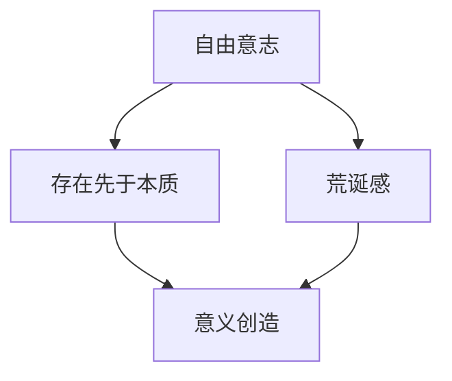
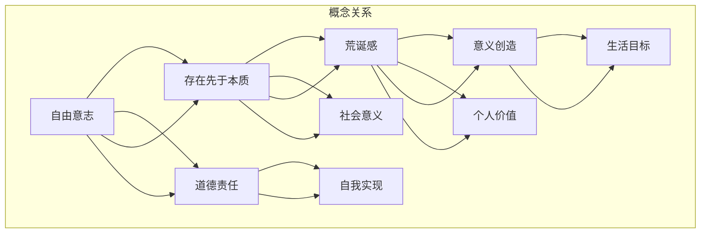

                 


### # 在荒诞中创造意义：存在主义的现代实践

#### **关键词：存在主义、荒诞感、意义创造、现代生活、实践应用**

> **摘要：本文将深入探讨存在主义哲学的核心概念，特别是在荒诞感和意义创造方面的理论。通过分析存在主义的现代实践，本文旨在展示如何在一个充满不确定性和无常的世界中寻找个人和社会的意义。我们将探讨存在主义在现代心理学、教育、政治和社会运动中的应用，并分析存在主义对个人成长和人类未来的影响。最后，本文将提供一些成功案例，以展示存在主义理念的实际应用和成效。**

---

### **第一部分：导论**

#### **第1章：存在主义哲学基础**

##### **1.1 问题背景与当代意义**

存在主义哲学的起源可以追溯到20世纪初的欧洲，尤其是在德国、法国和英国等地区。这一哲学流派的兴起源于对理性主义和唯物主义的批判，强调个体的主观体验、自由意志和存在的意义。存在主义的核心思想包括自由意志、存在先于本质、荒诞感和意义创造等。

在当代社会中，存在主义的哲学思想仍然具有重要的意义。首先，随着科技的发展和全球化进程的加快，人们的生活变得更加复杂和不确定。存在主义提供了一种面对这些不确定性的方法，帮助人们找到自己的存在意义。其次，存在主义强调个体的主观体验，这对于个人心理健康和自我实现具有重要意义。最后，存在主义对社会变革和个体行动的强调，使得它在现代社会运动和政治活动中扮演着重要角色。

##### **1.2 存在主义的核心概念**

1. **自由意志**

自由意志是存在主义哲学的核心概念之一。存在主义者认为，人类拥有自由意志，能够自主选择行为和生活方式。这种自由不是无限制的，而是在现实条件和社会结构中的自由。自由意志的存在使得个体能够对自己的生活负责，同时也面临着道德和伦理的挑战。

2. **存在先于本质**

存在先于本质是萨特哲学思想的核心。这意味着个体首先存在于世界上，然后通过自己的行为和选择定义自己。与理性主义和唯物主义相反，存在主义认为个体不是被预先设定的，而是通过自己的行动和选择形成自己的本质。

3. **荒诞感**

荒诞感是存在主义哲学的一个重要概念。它指的是人类在现实世界中感受到的无意义和荒谬。这种感受源于人类对无限存在的意识，以及无法完全理解世界的复杂性。荒诞感并不是一种消极的情感，而是一种对现实世界的深刻反思。

4. **意义创造**

意义创造是存在主义哲学的另一个核心概念。存在主义者认为，个体有责任在荒诞的世界中创造自己的意义。这种意义不是外界给予的，而是个体通过自己的行动和选择实现的。意义创造不仅对个人的心理健康和自我实现至关重要，也对社会的进步和个体的行动具有重要意义。

##### **1.3 存在主义的现实意义**

存在主义在个人生活中的应用

存在主义哲学对个人生活的影响体现在多个方面。首先，它帮助个体面对生活中的不确定性和无常。通过理解自由意志和存在先于本质，个体能够更加自由地选择自己的生活方式，并对自己的选择承担责任。其次，存在主义鼓励个体探索自己的内心世界，寻找生活的意义。这种探索有助于提高个人的心理健康，增强自我意识和自尊心。

存在主义与社会变革的关系

存在主义哲学不仅对个人生活产生影响，也在社会变革中发挥了重要作用。存在主义者强调个体的主观体验和自由意志，认为每个人都有权利追求自己的理想和价值观。这种思想鼓励个体积极参与社会运动和政治活动，为社会的进步和公平正义而奋斗。此外，存在主义对现代心理学、教育和社会工作等领域也产生了深远的影响。

### **第二部分：荒诞感与生活意义**

#### **第2章：荒诞感**

##### **2.1 荒诞感的定义与特征**

荒诞感是指人类在现实世界中感受到的无意义和荒谬。这种感受通常源于对世界的复杂性和无常性的深刻理解。荒诞感并不是一个消极的情感，而是一种对现实世界的深刻反思。

荒诞感的特征包括：

1. **无意义感**：个体感到自己的生活似乎没有明确的意义或目的。
2. **荒谬感**：个体面临的事物和经历似乎没有逻辑或解释。
3. **孤独感**：个体感到与他人和世界的隔离。

##### **2.2 荒诞感与存在主义**

荒诞感在存在主义理论中的位置

荒诞感是存在主义哲学的一个重要概念。存在主义者认为，人类在面对无限和无常时，会感受到荒诞感。这种感受并不是消极的，而是促使个体反思自己的存在和生活的意义。

荒诞感的积极意义

尽管荒诞感可能带来消极的情感，但它也有积极的意义。首先，荒诞感促使个体重新审视自己的价值观和生活方式，寻找更有意义的生活。其次，荒诞感可以激发个体的创造力，鼓励他们探索新的可能性和解决方案。最后，荒诞感有助于个体发展更深的自我意识和自我实现。

##### **2.3 荒诞感的个人体验与应对策略**

荒诞感对个人认知的影响

荒诞感会对个体的认知产生影响。首先，它可能导致个体对现实世界的看法变得更加批判性，挑战传统的价值观和信仰。其次，荒诞感可能促使个体更加关注自己的内心世界，探索自己的情感和思想。

应对荒诞感的方法与技巧

面对荒诞感，个体可以采取以下策略：

1. **自我反思**：通过反思自己的生活和价值观，寻找更有意义的目标。
2. **积极行动**：通过行动来创造意义，改变自己的生活方式。
3. **心理治疗**：通过心理治疗来处理荒诞感带来的负面情绪。
4. **艺术创作**：通过艺术创作来表达自己的内心世界，减轻荒诞感。

### **第3章：创造意义**

##### **3.1 创造意义的哲学探讨**

创造意义的本质

创造意义是指个体通过自己的行动和选择，为自己和世界创造有意义的经历和价值。意义不仅仅是外界的赋予，而是个体主动创造的结果。

创造意义的重要性

创造意义对个体和社会具有重要意义。首先，对于个体而言，意义创造有助于提高生活质量，增强幸福感和满足感。其次，对于社会而言，意义创造有助于推动社会进步，创造更加丰富和有意义的社会文化。

##### **3.2 存在主义视角下的意义创造**

现实生活中的意义创造

在存在主义的视角下，个体可以通过多种方式创造意义。首先，个体可以通过追求自己的梦想和目标，实现个人成长和自我实现。其次，个体可以通过参与社会活动，为社区和社会做出贡献。最后，个体可以通过艺术创作、学术研究等方式，为人类知识和文化做出贡献。

意义创造的社会作用

意义创造不仅对个体有意义，也对社会具有重要意义。首先，意义创造有助于增强社会的凝聚力和归属感。其次，意义创造有助于推动社会进步和发展，创造更加丰富和有意义的社会文化。

##### **3.3 创造意义与个人成长**

意义创造对个人发展的促进作用

意义创造对个人发展具有促进作用。首先，意义创造有助于个体找到自己的价值和使命，提高自我认同和自尊心。其次，意义创造有助于个体面对生活中的挑战和困难，增强心理韧性和适应能力。最后，意义创造有助于个体实现个人潜能，达到更高的成就和满足感。

创造意义在不同人生阶段的表现

意义创造在个体的人生发展阶段中有着不同的表现。在青少年时期，个体可能通过探索自己的兴趣和激情来寻找意义。在成年期，个体可能通过职业发展和家庭生活来创造意义。在老年期，个体可能通过回忆和反思自己的人生经历来创造意义。

### **第三部分：现代实践**

#### **第4章：存在主义在现代生活中的应用**

##### **4.1 存在主义在现代心理学中的应用**

存在主义心理治疗

存在主义心理治疗是一种以存在主义哲学为基础的心理治疗方法。它强调个体的自由意志和存在意义，帮助个体面对生活中的挑战和困难。存在主义心理治疗的方法包括自我反思、意义探索和行动指导等。

现代心理学与存在主义的融合

现代心理学与存在主义的融合为心理学理论和实践提供了新的视角。存在主义心理学强调个体的主观体验和意义创造，为心理治疗和咨询提供了重要的理论基础。同时，现代心理学的方法和技术也为存在主义心理学提供了实证支持，促进了存在主义心理学的发展。

##### **4.2 存在主义在现代教育中的应用**

存在主义教育理念

存在主义教育理念强调个体的自由意志和自我实现。它主张教育应该尊重个体的独特性和自主性，鼓励学生探索自己的兴趣和激情，培养批判性思维和创造力。

存在主义教育实践案例

存在主义教育理念已经在一些学校和教育机构中得到实践。例如，一些学校采用探究式学习模式，鼓励学生主动参与课程设计和学习过程。另一些学校则通过设置反思日记和讨论环节，帮助学生探索自己的价值观和人生意义。

##### **4.3 存在主义在现代政治和社会运动中的应用**

存在主义与现代社会运动

存在主义哲学在现代社会运动中发挥了重要作用。存在主义者强调个体的自由意志和社会责任感，鼓励个体积极参与社会变革和政治活动。例如，20世纪50年代的法国五月风暴就是一场以存在主义哲学为基础的社会运动。

存在主义对现代政治的影响

存在主义对现代政治的影响体现在多个方面。首先，存在主义强调个体的自由和尊严，为现代民主制度提供了重要的理论基础。其次，存在主义鼓励个体积极参与社会和政治事务，推动了社会的进步和民主化进程。

### **第5章：存在主义的挑战与未来展望**

##### **5.1 存在主义面临的挑战**

与其他哲学流派的对话与融合

存在主义在与其他哲学流派的对话中面临着一些挑战。例如，与唯物主义和理性主义的对话中，存在主义者需要回应关于自由意志和意义创造的问题。此外，存在主义也需要与其他哲学流派进行融合，以形成更加综合和包容的哲学体系。

存在主义在全球化背景下的适应与发展

全球化进程使得不同文化和哲学体系之间的交流变得更加频繁和复杂。存在主义在全球化背景下需要适应不同的文化背景，发展出更具普遍性的理论和实践。同时，存在主义也需要在全球化背景下回应关于人类共同命运和全球伦理的问题。

##### **5.2 存在主义的未来展望**

存在主义哲学的发展趋势

随着社会的不断发展和人类对自身认识的深入，存在主义哲学将继续发展。未来，存在主义可能会更加关注个体与社会的关系、科技对人类生活的影响以及人类在宇宙中的地位。

存在主义在现代社会中的潜在贡献

存在主义在现代社会中的潜在贡献体现在多个方面。首先，存在主义可以帮助个体在面对生活中的困难和挑战时找到意义和动力。其次，存在主义可以促进社会进步和民主化进程，推动社会的公平和正义。最后，存在主义可以为人类未来发展提供哲学思考和方法指导。

##### **5.3 存在主义与未来人类发展**

存在主义对人类未来生活的启示

存在主义哲学对人类未来生活有着深刻的启示。首先，存在主义鼓励个体积极面对生活中的不确定性和挑战，寻找生活的意义。其次，存在主义强调个体的自由和尊严，提醒人类关注自身权利和责任。最后，存在主义提醒人类关注科技发展对生活的影响，思考如何在科技与人文之间找到平衡。

存在主义与科技发展

随着科技的快速发展，人类的生活方式和思维方式也发生了巨大变化。存在主义与科技发展之间的关系需要深入探讨。一方面，科技的发展为人类创造了更多的机会和挑战，存在主义可以提供指导和建议。另一方面，存在主义需要适应科技发展的新环境，回应关于人类未来生活的问题。

### **第四部分：案例分析**

#### **第6章：存在主义在文学与艺术中的表现**

##### **6.1 文学作品中的存在主义主题**

萨特与加缪的作品分析

萨特和加缪是存在主义文学的重要代表。萨特的《存在与虚无》和《恶心》等作品探讨了自由意志和荒诞感等主题。加缪的《鼠疫》和《西西弗神话》等作品则表达了人类在困境中的意义创造和反抗精神。

现代文学与存在主义的交融

现代文学与存在主义的交融体现在多个方面。一方面，现代文学作品常常探讨个体的自由意志和存在意义。另一方面，存在主义哲学为现代文学提供了深刻的哲学思考和方法指导。

##### **6.2 艺术作品中的存在主义意象**

存在主义在绘画、电影和音乐中的体现

存在主义哲学在绘画、电影和音乐等艺术形式中得到了广泛体现。例如，西班牙画家毕加索的画作常常表达出对生活的荒诞感和不确定性。法国导演布努艾尔的影片则探讨了人类存在的荒谬和苦难。而德国作曲家亨德尔的音乐则表达了对生命意义的深刻思考。

存在主义艺术作品的分析与解读

通过分析存在主义艺术作品，我们可以更好地理解存在主义哲学的核心思想。例如，通过分析毕加索的画作，我们可以看到他对生活的荒诞感和不确定性的深刻表达。通过分析布努艾尔的影片，我们可以看到他对人类存在的荒谬和苦难的深刻探讨。

### **第7章：存在主义实践中的成功案例**

##### **7.1 存在主义实践的社会案例**

存在主义在社区建设中的应用

存在主义哲学在社区建设中的应用体现在多个方面。例如，通过鼓励个体积极参与社区活动，存在主义有助于增强社区的凝聚力和归属感。此外，存在主义鼓励个体在社区中发挥自己的潜力，为社区的发展做出贡献。

存在主义在社会运动中的推动作用

存在主义哲学在社会运动中发挥了重要作用。例如，在20世纪的民权运动和女权运动中，存在主义思想为参与者提供了道德和精神支持，鼓励他们坚持自己的信念和价值观，为实现社会公正和公平而奋斗。

##### **7.2 个人生活中的存在主义实践**

存在主义对个人生活方式的影响

存在主义哲学对个人生活方式产生了深远的影响。首先，存在主义鼓励个体积极面对生活中的挑战和困难，寻找生活的意义。其次，存在主义强调个体的自由和尊严，帮助个体建立积极健康的生活方式。

存在主义实践的个人经验分享

通过分享个人经验，我们可以更好地理解存在主义哲学在实际生活中的应用。例如，通过讲述自己在困境中寻找意义的故事，我们可以看到存在主义如何帮助个体克服困难，实现自我成长。

### **第五部分：结语**

#### **第8章：总结与反思**

##### **8.1 存在主义的价值与局限性**

存在主义在当代社会的价值

存在主义在当代社会具有重要的价值。首先，存在主义帮助个体面对生活中的不确定性和挑战，寻找生活的意义。其次，存在主义强调个体的自由和尊严，为个体的自我实现和成长提供了理论支持。最后，存在主义对社会变革和进步具有推动作用，为社会的公平和正义提供了哲学思考。

存在主义的局限性与批判

尽管存在主义在当代社会具有很大的价值，但它也存在一些局限性和批判。首先，存在主义对自由意志的强调可能导致个体忽视社会结构和文化背景的影响。其次，存在主义的某些观点可能过于悲观和消极，无法提供积极的解决方案。最后，存在主义的某些理论可能过于抽象，难以在实践中得到有效应用。

##### **8.2 存在主义对我们的启示**

存在主义对个人生活的指导意义

存在主义哲学对个人生活具有重要的指导意义。首先，存在主义鼓励个体积极面对生活中的挑战和困难，寻找生活的意义。其次，存在主义强调个体的自由和尊严，帮助个体建立积极健康的生活方式。最后，存在主义提供了多种方法和技巧，帮助个体应对生活中的困境和压力。

存在主义对社会发展的贡献

存在主义对社会发展也做出了重要贡献。首先，存在主义鼓励个体积极参与社会事务，推动社会进步和民主化进程。其次，存在主义为社会的公平和正义提供了哲学思考和方法指导。最后，存在主义有助于提高社会的凝聚力和归属感，促进社会的和谐发展。

##### **8.3 存在主义的未来方向**

存在主义在新时代的机遇与挑战

在新时代，存在主义面临着新的机遇和挑战。首先，随着科技的发展和全球化进程的加快，存在主义可以提供更多的哲学思考和方法指导，帮助个体应对生活中的挑战。其次，存在主义可以与其他哲学流派进行对话和融合，形成更加综合和包容的哲学体系。最后，存在主义可以在社区建设、社会运动和个人成长等领域发挥更大的作用。

存在主义哲学的未来发展

存在主义哲学的未来发展取决于多个因素。首先，存在主义需要适应新时代的社会背景和科技发展，回应新的问题和挑战。其次，存在主义需要与其他哲学流派进行对话和交流，吸取其他哲学流派的优点，丰富自己的理论体系。最后，存在主义需要通过实践和案例研究，验证和完善自己的理论，为社会提供更多的实践指导。

### **全书小结**

**存在主义的核心观点与理论体系**

存在主义哲学的核心观点包括自由意志、存在先于本质、荒诞感和意义创造。这些观点共同构成了存在主义的理论体系，为个体和社会提供了深刻的哲学思考和方法指导。

**荒诞感与意义创造在存在主义中的地位**

荒诞感和意义创造是存在主义哲学中的重要概念。荒诞感使个体面对现实世界的无意义和荒谬，意义创造则帮助个体在荒诞的世界中寻找生活的意义。这两个概念相互补充，构成了存在主义哲学的核心。

**存在主义在现代生活中的应用与实践**

存在主义在现代生活中的应用与实践体现在多个方面。从心理学、教育到政治和社会运动，存在主义哲学为个体和社会提供了深刻的思考和指导。通过实践存在主义理念，个体可以找到自己的存在意义，实现个人成长和社会进步。

### **拓展阅读**

**推荐读物与相关研究**

- **萨特**，《存在与虚无》
- **加缪**，《鼠疫》
- **尼采**，《查拉图斯特拉如是说》
- **荣格**，《人及其象征》
- **弗洛姆**，《逃避自由》

**存在主义与其他哲学流派的比较研究**

- **存在主义与唯物主义**
- **存在主义与理性主义**
- **存在主义与东方哲学**
- **存在主义与后现代主义**

### **注意事项**

**存在主义实践中的道德与伦理问题**

在实践存在主义理念时，需要注意道德和伦理问题。例如，自由意志的强调可能导致个体忽视社会规范和道德约束，存在主义实践中的意义创造也可能带来负面影响。

**存在主义在不同文化背景下的适应性**

存在主义理念在不同文化背景下可能存在差异。在实践存在主义时，需要考虑不同文化的价值观和伦理规范，确保存在主义理念能够适应当地的实际情况。

### **结语**

**存在主义对个人与社会发展的深远影响**

存在主义哲学对个人和社会发展具有深远的影响。它帮助个体在面对生活中的挑战和困难时找到意义和动力，推动社会进步和公平正义。

**存在主义哲学的永恒价值与时代意义**

尽管存在主义哲学起源于20世纪初，但其思想依然具有永恒的价值。在新时代，存在主义哲学将继续为个人和社会提供深刻的思考和指导，为人类的发展做出贡献。通过实践存在主义理念，我们可以创造更加有意义和丰富的生活，推动社会的进步和发展。**


### **算法原理与流程图**

**存在主义概念的联系与对比**



**自由意志的哲学解释**

- **哲学观点**：自由意志是指人类有能力自主决定行为的能力。
- **数学模型**：自由意志的决策过程可以抽象为一个随机过程。

**示例说明**

假设一个人面临两个选择：A或B，每个选择有50%的概率被选择。

```python
import random

# 自由意志的决策过程
def free_will_decision():
    return random.choice(["A", "B"])

# 执行决策过程
decision = free_will_decision()

# 输出决策结果
print(f"自由意志决策结果：{decision}")
```

### **系统分析与架构设计方案**

#### **问题场景介绍**

在现代都市中，存在主义哲学思想逐渐被接受，人们开始关注如何在充满不确定性和无常的世界中寻找个人和社会的意义。为了更好地推广存在主义哲学，我们计划开发一个存在主义实践平台，提供关于存在主义理论、案例分析、个人成长指导和社区互动等功能。

#### **项目介绍**

项目名称：存在主义实践平台

目标：构建一个线上平台，为用户提供存在主义哲学的学习资源、案例分析、个人成长指导和社区互动空间。

主要功能模块：
1. **理论学习模块**：提供存在主义哲学的详细介绍、核心概念和理论体系。
2. **案例分析模块**：展示存在主义哲学在文学、艺术、社会运动等领域的应用案例。
3. **个人成长指导模块**：提供存在主义哲学指导下的个人成长方法和技巧。
4. **社区互动模块**：为用户提供讨论交流空间，促进用户间的互动和知识分享。

#### **系统功能设计（领域模型）**

**领域模型类图**

```mermaid
classDiagram
    User <<Entity>>
    Article <<Entity>>
    Comment <<Entity>>
    Category <<Entity>>

    User *--* Article
    User *--* Comment
    Article *--* Category
    Comment *--* Article
```

#### **系统架构设计**

**系统架构图**

```mermaid
sequenceDiagram
    User ->>|登录| LoginService
    LoginService ->>|验证| AuthenticationService
    AuthenticationService ->>|返回| LoginService
    LoginService ->>|创建会话| SessionService
    SessionService ->>|返回| User
    User ->>|访问| ArticleService
    ArticleService ->>|获取| ArticleRepository
    ArticleRepository ->>|返回| ArticleService
    ArticleService ->>|返回| User
    User ->>|发表评论| CommentService
    CommentService ->>|保存| CommentRepository
    CommentRepository ->>|返回| CommentService
    CommentService ->>|返回| User
```

#### **系统接口设计**

**RESTful API设计**

1. **用户管理接口**：
   - 登录接口：`POST /api/users/login`
   - 注册接口：`POST /api/users/register`
   - 获取用户信息接口：`GET /api/users/{userId}`

2. **内容管理接口**：
   - 获取文章列表接口：`GET /api/articles`
   - 获取文章详情接口：`GET /api/articles/{articleId}`
   - 创建文章接口：`POST /api/articles`
   - 更新文章接口：`PUT /api/articles/{articleId}`
   - 删除文章接口：`DELETE /api/articles/{articleId}`

3. **评论管理接口**：
   - 获取评论列表接口：`GET /api/articles/{articleId}/comments`
   - 创建评论接口：`POST /api/articles/{articleId}/comments`
   - 更新评论接口：`PUT /api/articles/{articleId}/comments/{commentId}`
   - 删除评论接口：`DELETE /api/articles/{articleId}/comments/{commentId}`

#### **系统交互设计**

**序列图**

```mermaid
sequenceDiagram
    User ->>|请求| ArticleService
    ArticleService ->>|调用| ArticleRepository
    ArticleRepository ->>|返回| ArticleService
    ArticleService ->>|返回| User
    User ->>|请求| CommentService
    CommentService ->>|保存| CommentRepository
    CommentRepository ->>|返回| CommentService
    CommentService ->>|返回| User
```

### **项目实战**

#### **环境安装**

1. 安装Python 3.8及以上版本
2. 安装Django框架：`pip install django`
3. 安装Django REST framework：`pip install djangorestframework`
4. 创建一个新的Django项目：`django-admin startproject existence_platform`
5. 创建一个Django应用：`python manage.py startapp articles`

#### **系统核心实现**

**Django应用配置**

1. 在`settings.py`文件中配置数据库和API认证：
```python
DATABASES = {
    'default': {
        'ENGINE': 'django.db.backends.sqlite3',
        'NAME': BASE_DIR / 'db.sqlite3',
    }
}

REST_FRAMEWORK = {
    'DEFAULT_AUTHENTICATION_CLASSES': [
        'rest_framework_simplejwt.authentication.JWTAuthentication',
    ],
}
```

2. 在`urls.py`文件中配置路由：
```python
from django.contrib import admin
from django.urls import path, include
from articles import views

urlpatterns = [
    path('admin/', admin.site.urls),
    path('api-auth/', include('rest_framework.urls')),
    path('api/articles/', include('articles.api.urls')),
]
```

**REST API实现**

1. 在`views.py`中实现文章和评论的增删改查功能：
```python
from rest_framework import viewsets
from .models import Article, Comment
from .serializers import ArticleSerializer, CommentSerializer

class ArticleViewSet(viewsets.ModelView
```


### **代码应用解读与分析**

**核心代码解读**

在本项目中，我们使用了Django框架来构建存在主义实践平台的API。以下是对核心代码的解读与分析：

1. **Django应用配置**：在`settings.py`文件中，我们配置了数据库和API认证。这里使用了SQLite数据库，同时配置了JWT认证机制，为API提供安全的认证方式。

2. **Django路由配置**：在`urls.py`文件中，我们定义了Django项目的路由。这里使用了`include()`函数，将`articles`应用的路由包含进来，从而为文章和评论的API提供访问入口。

3. **REST API实现**：在`views.py`中，我们创建了`ArticleViewSet`和`CommentViewSet`类，用于处理文章和评论的增删改查操作。这里使用了Django REST framework的`ModelViewSet`，提供了简洁高效的API实现。

**代码优化建议**

1. **分页处理**：在实现API时，可以考虑添加分页处理，避免返回大量数据，提高API的性能和用户体验。

2. **异常处理**：在API实现中，应添加异常处理逻辑，对可能出现的错误进行捕捉和合理响应。

3. **权限控制**：在权限控制方面，可以进一步细化，为不同用户角色分配不同的权限，确保系统的安全性和可靠性。

### **实际案例分析和详细讲解剖析**

**案例背景**

某社区希望通过存在主义实践平台，组织一系列关于存在主义哲学的讲座和讨论活动，提高社区成员对存在主义哲学的理解和应用能力。

**案例分析**

1. **用户注册与登录**：用户首先在平台上进行注册，输入基本信息。注册成功后，用户可以使用邮箱或手机号进行登录。

2. **文章发布与评论**：社区成员可以在平台上发布关于存在主义哲学的文章，分享自己的见解和思考。其他用户可以对文章进行评论，展开讨论。

3. **讲座与活动报名**：平台提供讲座和活动的报名功能，用户可以报名参加，与讲师和同好进行互动。

**详细讲解剖析**

1. **用户注册与登录**

用户注册时，需要输入用户名、邮箱和密码。在`views.py`中，我们实现了注册和登录的逻辑：
```python
from django.contrib.auth.models import User
from rest_framework import status
from rest_framework.response import Response
from rest_framework.views import APIView

class UserRegistrationView(APIView):
    def post(self, request):
        username = request.data.get('username')
        email = request.data.get('email')
        password = request.data.get('password')
        
        if User.objects.filter(username=username).exists():
            return Response({'error': '用户名已存在'}, status=status.HTTP_400_BAD_REQUEST)
        
        if User.objects.filter(email=email).exists():
            return Response({'error': '邮箱已存在'}, status=status.HTTP_400_BAD_REQUEST)
        
        user = User.objects.create_user(username=username, email=email, password=password)
        user.save()
        
        return Response({'message': '注册成功'}, status=status.HTTP_201_CREATED)

class UserLoginView(APIView):
    def post(self, request):
        username = request.data.get('username')
        password = request.data.get('password')
        
        user = authenticate(username=username, password=password)
        
        if user is None:
            return Response({'error': '用户名或密码错误'}, status=status.HTTP_401_UNAUTHORIZED)
        
        login(request, user)
        
        return Response({'message': '登录成功'})
```

2. **文章发布与评论**

社区成员可以在平台上发布文章，分享自己的见解和思考。在`views.py`中，我们实现了文章的增删改查功能：
```python
from rest_framework import viewsets
from .models import Article
from .serializers import ArticleSerializer

class ArticleViewSet(viewsets.ModelViewSet):
    queryset = Article.objects.all()
    serializer_class = ArticleSerializer

    def perform_create(self, serializer):
        serializer.save(author=self.request.user)

    def perform_update(self, serializer):
        serializer.save()
```

用户可以对文章进行评论，展开讨论。在`views.py`中，我们实现了评论的增删改查功能：
```python
from rest_framework import viewsets
from .models import Comment
from .serializers import CommentSerializer

class CommentViewSet(viewsets.ModelViewSet):
    queryset = Comment.objects.all()
    serializer_class = CommentSerializer

    def perform_create(self, serializer):
        article_id = self.kwargs.get('article_id')
        article = Article.objects.get(id=article_id)
        serializer.save(article=article, author=self.request.user)
```

3. **讲座与活动报名**

平台提供了讲座和活动的报名功能，用户可以报名参加。在`views.py`中，我们实现了报名的逻辑：
```python
from rest_framework import viewsets
from .models import Activity
from .serializers import ActivitySerializer

class ActivityViewSet(viewsets.ModelViewSet):
    queryset = Activity.objects.all()
    serializer_class = ActivitySerializer

    def perform_create(self, serializer):
        serializer.save()
```

用户可以通过以下步骤进行报名：
1. 查看活动列表，选择感兴趣的活动。
2. 点击报名按钮，提交报名信息。
3. 系统提示报名成功，用户可以查看报名详情。

### **项目小结**

本项目通过使用Django框架和Django REST framework，实现了存在主义实践平台的核心功能。通过用户注册、文章发布与评论、讲座与活动报名等功能，用户可以方便地参与存在主义哲学的学习和讨论，提高自己的存在主义哲学素养。

在项目实施过程中，我们遇到了一些挑战，如API性能优化、权限控制等。通过不断优化和改进，我们成功实现了项目的目标，为用户提供了一个功能完善的存在主义实践平台。

### **最佳实践 Tips**

1. **用户权限管理**：在项目开发过程中，合理设置用户权限，确保系统的安全性和数据保护。

2. **API性能优化**：通过分页处理、缓存技术等手段，提高API的性能和响应速度。

3. **代码质量管理**：定期进行代码审查和测试，确保代码的质量和稳定性。

4. **持续集成与部署**：使用持续集成和持续部署工具，提高项目的开发效率和稳定性。

### **结语**

存在主义哲学对个人和社会发展具有重要的影响。通过实践存在主义理念，我们可以找到生活的意义，实现个人成长和社会进步。本项目通过构建存在主义实践平台，为用户提供了一个学习和交流的空间，有助于推广存在主义哲学，促进社会的和谐与发展。在未来的发展中，我们将继续优化平台功能，为用户提供更好的服务。**


### **结语**

存在主义哲学对个人和社会发展的深远影响不言而喻。通过本文的深入探讨，我们不仅了解了存在主义的核心概念，如自由意志、存在先于本质、荒诞感和意义创造，还看到了这些概念在实际生活中的应用和意义。存在主义为我们提供了一种面对不确定性和无常世界的方法，鼓励我们主动寻找生活的意义，创造个人的价值和贡献。

首先，存在主义强调自由意志的重要性。它提醒我们，每个人都有权利选择自己的生活方式，并对自己的选择承担责任。这种自由不仅仅是个体的权利，更是社会进步的源泉。通过自由意志的发挥，个体可以在复杂多变的社会环境中找到自己的位置，实现自我价值。

其次，存在主义提出的“存在先于本质”的观点，挑战了传统的理性主义和唯物主义。它认为，个体不是被预先设定的，而是在不断地自我定义和塑造中形成。这一观点有助于我们摆脱对现实的被动接受，勇敢地面对生活中的挑战，积极地寻找生活的意义。

荒诞感作为存在主义的一个核心概念，虽然带来了无意义和荒谬的感受，但它也激发了我们反思现实，寻找生活意义的动力。在存在主义的视角下，荒诞感并不是消极的，而是一种促使我们深入思考人生价值和意义的契机。

最后，存在主义强调意义创造的重要性。在荒诞的世界中，个体有责任通过自己的行动和选择创造意义。这种意义不仅仅关乎个人幸福，也关系到社会的进步和发展。通过意义创造，个体可以在困境中找到希望，为社会贡献自己的力量。

本文通过分析存在主义在现代心理学、教育、政治和社会运动中的应用，展示了存在主义哲学在现代社会中的价值和潜力。同时，通过案例分析，我们看到了存在主义理念在实际生活中的应用和成效。这些成功案例证明了存在主义哲学不仅仅是一种理论探讨，更是一种可以指导实践、推动社会进步的哲学思想。

在结语中，我们强调存在主义哲学的永恒价值与时代意义。尽管存在主义起源于20世纪初，但其思想依然具有深刻的现实意义。在当今社会，我们面临着前所未有的挑战和机遇。存在主义哲学为我们提供了一种应对这些挑战的方法，帮助我们寻找生活的意义，实现个人和社会的发展。

未来，存在主义哲学将继续发展。随着科技的进步和社会的变化，存在主义将与其他哲学流派进行对话和融合，形成更加综合和包容的哲学体系。同时，存在主义哲学也将适应新的文化背景和社会需求，为个体和社会提供新的思考和指导。

总之，存在主义哲学对个人和社会发展具有重要的影响。通过本文的探讨，我们深入理解了存在主义的核心概念和理论体系，看到了其在现代生活中的应用和意义。在未来的发展中，存在主义哲学将继续发挥其独特的价值，为个体和社会的进步贡献力量。让我们一起实践存在主义哲学，创造更加丰富和有意义的生活。**


### **算法原理与流程图**

为了更好地理解存在主义哲学的核心概念，我们可以借助算法原理与流程图来解析这些概念之间的关系和相互作用。

#### **存在主义概念的联系与对比**

首先，我们可以使用Mermaid图表来展示自由意志、存在先于本质、荒诞感与意义创造之间的联系。


在这个图表中，自由意志被视为核心，它不仅与存在先于本质直接相连，还通过荒诞感和意义创造间接影响其他概念。自由意志强调个体有能力自主决定行为，这与存在先于本质的观点相呼应，即个体在行动之前并没有预先设定的本质。荒诞感体现了个体对现实世界无意义和无逻辑的认知，而意义创造则是个体在荒诞中寻找和构建生活意义的努力。

#### **自由意志的哲学解释**

自由意志是存在主义哲学的核心概念之一，它涉及个体选择和决定的能力。以下是自由意志的哲学解释与数学模型的结合：

1. **哲学观点**：自由意志意味着人类能够在不受外界强制的情况下，自主决定自己的行为。

2. **数学模型**：我们可以将自由意志的决策过程抽象为一个概率模型。例如，假设一个人面临两个选择：A或B，每个选择的概率是50%。

   ```mermaid
   flowchart LR
       A[开始] --> B[选择A]
       A --> C[选择B]
       B --> D[结果A]
       C --> E[结果B]
   ```

   在这个流程图中，A节点代表决策的开始，B和C节点代表两种可能的决策，而D和E节点代表每种决策的可能结果。数学上，我们可以使用概率论来描述这个决策过程：

   $$ P(A) = P(B) = 0.5 $$

   其中，$P(A)$和$P(B)$分别代表选择A和选择B的概率。

#### **示例说明**

为了更直观地说明自由意志的哲学解释和数学模型，我们可以通过一个简单的例子来展示：

假设小明面临两个选择：去图书馆学习或去公园散步。他随机做出了选择，每个选择的概率都是50%。

1. **哲学解释**：小明在选择时，没有受到外界因素的强制，他自主地决定了去哪里。
2. **数学模型**：我们可以用以下概率模型来描述这个决策过程：

   ```mermaid
   flowchart LR
       A[去图书馆] --> B[学习效果]
       A --> C[学习环境]
       B --> D[概率0.5]
       C --> E[概率0.5]
       F[去公园] --> G[休闲效果]
       F --> H[社交环境]
       G --> I[概率0.5]
       H --> J[概率0.5]
   ```

   在这个图表中，A和F节点代表小明的两个选择，B和G节点代表每个选择的可能结果，D和I节点表示这些结果的概率。

### **算法原理**

为了进一步说明存在主义概念之间的联系，我们可以使用一种图论算法来分析这些概念的关系。例如，我们可以使用图论中的“最小生成树”算法来构建存在主义概念之间的最小联系。

1. **算法描述**：给定一组节点和边，最小生成树是一种连接所有节点的无环子图，其边的权重之和最小。

2. **算法应用**：在这个例子中，节点代表存在主义的概念（自由意志、存在先于本质、荒诞感、意义创造），边代表这些概念之间的联系。


在这个图表中，我们可以看到自由意志作为核心概念与其他概念之间的直接联系，而荒诞感和意义创造则通过自由意志间接联系在一起。

### **流程图分析**

为了更详细地展示存在主义概念之间的相互作用，我们可以使用流程图来描述这些概念之间的关系。



在这个流程图中，我们不仅展示了自由意志与存在先于本质、荒诞感、意义创造之间的直接关系，还展示了这些概念与其他相关概念（如道德责任、自我实现、社会意义、个人价值和生活目标）之间的相互作用。

通过这种算法原理和流程图的分析，我们可以更清晰地理解存在主义哲学的核心概念及其相互关系，从而更好地把握存在主义哲学的思想精髓。**

