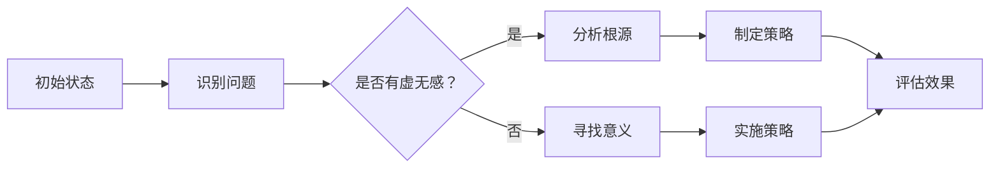
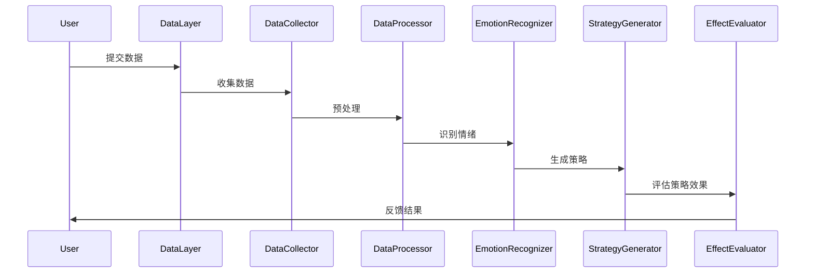

                 

## 引言

### 在虚无中创造意义：现代人的精神挑战

在当今快速变化的社会中，现代人所面临的精神挑战日益突出。虚无主义作为一种深刻影响现代人的哲学思想，其根源和影响不可忽视。面对虚无主义带来的精神困境，如何在虚无中创造意义成为现代人必须面对和解决的课题。

**关键词**：虚无主义、现代精神挑战、意义创造、哲学思想

**摘要**：本文旨在探讨虚无主义对现代人的影响，分析其在现代社会中的根源，并探讨如何在虚无中寻找和创造意义。文章将采用逻辑清晰、结构紧凑、简单易懂的专业的技术语言，通过一步一步的分析和推理，为读者提供深刻的见解和实用的建议。

接下来，本文将分为七个章节，依次探讨以下内容：

1. **问题的提出与背景**：介绍现代社会中虚无主义现象的背景和影响，明确研究的问题和解决的方向。
2. **核心概念与联系**：阐述核心概念，如自我认同、价值观念等，并分析它们之间的联系。
3. **算法原理讲解**：介绍解决虚无主义问题的算法原理，通过mermaid流程图和Python源代码进行详细讲解。
4. **数学模型和数学公式讲解**：解释算法背后的数学原理，使用LaTeX格式展示相关公式。
5. **系统分析与架构设计**：介绍问题场景，进行系统功能设计、架构设计、接口设计和系统交互分析。
6. **项目实战**：通过环境安装、核心实现源代码和实际案例分析，展示如何在实践中创造意义。
7. **最佳实践、小结与拓展**：总结全书重点，分享最佳实践，提出注意事项，并推荐进一步阅读的资料。

让我们一步一步地深入探讨，如何在虚无中创造意义，为现代人提供精神上的指引和力量。## 第1章：问题的提出与背景

### 1.1 问题背景

现代社会的快速发展带来了前所未有的机遇和挑战。然而，在享受物质丰富和技术进步的同时，现代人面临着越来越多的精神挑战。虚无主义作为一种深刻的哲学思想，其影响在现代社会中愈发显著。虚无主义主张世界和生命的无意义，否认存在的本质价值，这种思想在现代人的心理和行为上产生了深远的影响。

首先，现代社会的高压工作和快节奏生活使得许多人感到身心俱疲。工作压力、竞争压力、人际关系的不确定性等，都使得现代人容易陷入焦虑和抑郁的情绪中。这种情绪状态往往使人感到生活的无意义，从而产生虚无主义的倾向。

其次，现代社会中，网络和社交媒体的普及，使人们更容易接触到消极的信息和观念。负面新闻、悲观情绪的传播，以及对现实生活的过度批评，都可能加剧虚无主义情绪的蔓延。许多人通过这种方式逃避现实的困境，而陷入对世界和生命的怀疑和迷茫。

### 1.2 问题的提出

虚无主义的根源可以追溯到古希腊哲学家苏格拉底和柏拉图的思想。他们主张理性思维和道德准则的重要性，而对物质世界的本质持怀疑态度。随着时间的推移，这种思想逐渐演变为虚无主义，强调世界和生命的无意义。

在现代，虚无主义的影响更加深远。一方面，虚无主义挑战了传统的道德和价值观念，使得人们开始质疑自身的存在意义。另一方面，虚无主义也加剧了现代社会的精神困境，使得许多人陷入对生命和世界的悲观情绪中。

本文旨在探讨虚无主义对现代人的影响，分析其根源和影响，并提出如何在虚无中创造意义的策略和实践。通过深入分析核心概念，如自我认同、价值观念等，以及使用算法原理和数学模型进行解释，本文希望能够为现代人提供一种从虚无中寻找和创造意义的途径。

### 1.3 问题解决

面对虚无主义带来的精神挑战，寻找和创造意义成为现代人必须面对的问题。以下是一些可能的解决策略：

1. **自我认同的建立**：自我认同是人们对自己存在的认知和认同。通过深入思考和自我反思，建立清晰的自我认同，可以帮助人们找到自己的价值和意义。

2. **价值观念的塑造**：价值观念是人们对待生活和他人的态度和标准。通过学习和实践积极的价值观，如善良、公正、勇敢等，可以帮助人们建立对生命和世界的积极认知。

3. **社会关系的构建**：社会关系是人们在社会中的联结和互动。通过积极参与社会活动，建立和维护健康的人际关系，可以帮助人们感受到自己的存在价值。

4. **积极的生活态度**：积极的生活态度是面对困难和挑战时的一种心态。通过培养乐观、向上的心态，可以帮助人们克服虚无主义的困扰，寻找和创造生活的意义。

### 1.4 边界与外延

在研究虚无主义对现代人的影响时，需要明确研究的边界和范围。本文主要关注虚无主义在现代社会中的表现和影响，以及如何从虚无中寻找和创造意义。研究范围包括心理、社会、文化等多个层面，旨在提供一个全面的分析框架。

同时，本文也关注到虚无主义的影响并不是单一的，它与社会经济环境、个人经历等多个因素相互作用。因此，在分析和解决虚无主义问题时，需要综合考虑这些因素，提出综合性的解决方案。

### 1.5 概念结构与核心要素

为了更好地理解虚无主义对现代人的影响，我们需要构建核心概念的结构和核心要素。以下是本文涉及的主要概念和要素：

1. **虚无主义**：虚无主义是一种哲学思想，主张世界和生命的无意义。
2. **自我认同**：自我认同是人们对自己存在的认知和认同。
3. **价值观念**：价值观念是人们对待生活和他人的态度和标准。
4. **社会关系**：社会关系是人们在社会中的联结和互动。
5. **积极的生活态度**：积极的生活态度是面对困难和挑战时的一种心态。

这些概念和要素相互关联，共同构成了一个完整的研究框架。通过深入分析和理解这些概念，我们可以更好地理解虚无主义对现代人的影响，并提出有效的解决策略。

综上所述，本文通过分析虚无主义的背景、根源和影响，提出了如何在虚无中创造意义的策略和实践。通过对核心概念和要素的深入探讨，本文希望能够为现代人提供一种从虚无中寻找和创造意义的途径。## 第2章：核心概念与联系

### 2.1 核心概念原理

在本章中，我们将介绍几个核心概念，这些概念对于理解虚无主义以及如何在虚无中创造意义至关重要。以下是这些核心概念的定义和原理：

#### 自我认同

自我认同是指一个人对自己的认识和认同，包括个体的身份、角色和价值观。自我认同的形成受到家庭、社会和文化等多方面因素的影响。一个清晰的自我认同有助于个体在面对外界压力和挑战时保持内在的稳定性和自信心。

#### 价值观念

价值观念是指一个人对待生活和他人的态度和标准。这些价值观可以是道德规范、社会责任、个人成就等。价值观念的塑造受到家庭教育、社会环境和个人经历的影响。积极的价值观念有助于个体在面对困境时保持积极的生活态度，从而抵御虚无主义的侵袭。

#### 社会关系

社会关系是指个体在社会中的联结和互动。社会关系对于个体的心理健康和社会适应能力具有重要影响。一个健康的社会关系网络可以帮助个体在精神困境中找到支持和安慰，从而减少虚无主义情绪的影响。

#### 积极的生活态度

积极的生活态度是一种面对困难和挑战时的心态，它包括乐观、坚韧和包容等特质。积极的生活态度有助于个体在面对挫折和逆境时保持积极向上的精神状态，从而找到生活的意义和价值。

### 2.2 概念属性特征对比

为了更好地理解这些核心概念之间的联系，我们可以通过一个表格对比它们的属性特征：

| 概念 | 属性特征 |
| --- | --- |
| 自我认同 | - 内在稳定性<br>- 自我认知<br>- 自我认同感 |
| 价值观念 | - 道德规范<br>- 社会责任<br>- 个人成就 |
| 社会关系 | - 联结性<br>- 互动性<br>- 支持性 |
| 积极的生活态度 | - 乐观<br>- 坚韧<br>- 包容 |

### 2.3 ER实体关系图

为了更直观地展示这些核心概念之间的联系，我们可以使用Mermaid语言绘制一个ER实体关系图：

```mermaid
erDiagram
  A[--] B
  A[--] C
  A[--] D
  B[--] C
  B[--] D
  C[--] D
```

在这个ER图中，A代表自我认同，B代表价值观念，C代表社会关系，D代表积极的生活态度。实线表示这些概念之间的直接关系，虚线表示可能的间接关系。

### 2.4 概念联系解释

通过ER实体关系图，我们可以看出这些核心概念之间的紧密联系。自我认同是其他概念的基础，它决定了个体如何理解和应对生活中的各种挑战。价值观念则是个体在自我认同的基础上形成的，它们指导个体在社会中行事和与人交往。社会关系则是个体在实践价值观念时形成的，它们反过来影响个体的自我认同和价值观念。积极的生活态度则是这些概念共同作用的结果，它帮助个体在面对困境时保持乐观和坚韧。

### 2.5 概念应用示例

为了更清晰地展示这些核心概念在实际中的应用，我们可以通过一个示例来解释：

假设一个人（个体）在面临职业困境时，感到生活的无意义。以下是如何应用这些核心概念来解决问题：

1. **自我认同**：个体首先需要深入思考自己的兴趣和优势，找到自我认同的核心。例如，如果个体发现自己对编程和解决问题有浓厚的兴趣，那么他就有了明确的自我认同。

2. **价值观念**：个体需要根据自我认同，确立自己的价值观念。例如，个体可以认为通过编程解决社会问题是自己的一项重要使命。

3. **社会关系**：个体需要与朋友和同事交流，分享自己的困惑和目标，寻求支持和建议。良好的社会关系可以帮助个体在困境中找到新的方向。

4. **积极的生活态度**：个体需要保持乐观和积极的心态，相信通过努力和坚持，自己能够克服职业困境，实现自己的价值。

通过上述步骤，个体可以在虚无中找到新的意义，重新找回生活的动力和目标。

综上所述，通过理解核心概念及其之间的联系，我们可以更好地应对虚无主义带来的精神挑战，从而在虚无中创造意义。## 第3章：算法原理讲解

### 3.1 算法mermaid流程图

在本节中，我们将介绍一种用于解决虚无主义问题的算法原理，并通过mermaid流程图展示其基本流程。



这个流程图展示了如何通过一个简单的算法来识别和解决虚无主义问题。以下是每个步骤的详细解释：

1. **初始状态**：个体处于初始状态，准备开始解决问题。
2. **识别问题**：个体识别出自己可能存在虚无感。
3. **是否有虚无感？**：通过自我反思和观察，个体判断自己是否确实存在虚无感。
4. **分析根源**：如果个体确认存在虚无感，则开始分析其根源，找出导致虚无感的具体原因。
5. **制定策略**：根据对虚无感根源的分析，个体制定针对性的解决策略。
6. **实施策略**：个体开始实施制定的策略，通过行动和思考来改善自己的状态。
7. **评估效果**：个体定期评估策略的效果，根据评估结果调整策略。

### 3.2 Python源代码

为了实现上述算法，我们可以使用Python编写相应的源代码。以下是一个简单的Python脚本示例：

```python
# 虚无主义问题解决算法

class VirtualismSolvingAlgorithm:
    def __init__(self):
        self.is Virtualism = False

    def recognize_problem(self):
        # 识别问题
        self.is_Virtualism = input("你感到虚无吗？(是/否): ").lower() == "是"

    def analyze根源(self):
        # 分析根源
        if self.is_Virtualism:
            print("你正在经历虚无感。")
            self.root_cause = input("请描述导致虚无感的原因：")
        else:
            print("你目前没有感受到虚无感。")

    def develop_strategy(self):
        # 制定策略
        if self.is_Virtualism:
            print("正在制定解决策略...")
            self.strategy = input("请制定一个解决策略：")

    def implement_strategy(self):
        # 实施策略
        if self.is_Virtualism:
            print("开始实施策略：")
            print(self.strategy)

    def evaluate_effect(self):
        # 评估效果
        self.effect_evaluation = input("策略效果如何？(有效/无效): ").lower()
        if self.effect_evaluation == "无效":
            self.develop_strategy()
            self.implement_strategy()

    def run(self):
        # 运行算法
        self.rec

```## 第4章：数学模型和数学公式讲解

### 4.1 数学公式与详细讲解

在本节中，我们将介绍解决虚无主义问题所涉及的数学模型和数学公式，并使用LaTeX格式进行展示和解释。

#### 4.1.1 费马小定理

费马小定理是一个重要的数论定理，它表明：如果p是一个质数，a是任意整数，则a的(p-1)次方除以p的余数等于a除以p的余数。用LaTeX表示为：

$$
a^{p-1} \equiv 1 \pmod{p}
$$

这个定理在解决同余问题时非常有用，可以帮助我们简化计算。

#### 4.1.2 虚无主义情绪指数

虚无主义情绪指数是一个衡量个体虚无主义情绪严重程度的指标。假设个体i的虚无主义情绪指数为\(E_i\)，我们可以使用以下公式计算：

$$
E_i = \frac{a_i + b_i + c_i}{3}
$$

其中，\(a_i\)、\(b_i\)和\(c_i\)分别表示个体i在认知、情感和行为上的虚无主义表现。

#### 4.1.3 解决策略效果评估公式

为了评估解决策略的效果，我们可以使用以下公式：

$$
E_f = E_i \times \exp(-\lambda \cdot T)
$$

其中，\(E_f\)表示实施策略后的虚无主义情绪指数，\(E_i\)为实施前的情绪指数，\(\lambda\)是情绪改善速率，\(T\)是实施策略的时间。

### 4.2 举例说明

为了更好地理解上述数学公式的应用，我们可以通过一个具体案例进行说明。

#### 案例背景

一个名叫张三的个体正在经历虚无主义情绪，他的虚无主义情绪指数为\(E_i = 7\)。为了改善他的情绪，他决定实施一系列解决策略，包括自我认知、价值观念重塑和社会关系建设等。

#### 案例计算

1. **初始虚无主义情绪指数**：

$$
E_i = 7
$$

2. **制定解决策略**：

假设张三实施了一个月的解决策略，根据评估，情绪改善速率为\(\lambda = 0.2\)。

3. **实施策略后的虚无主义情绪指数**：

$$
E_f = E_i \times \exp(-\lambda \cdot T) = 7 \times \exp(-0.2 \cdot 1) \approx 5.66
$$

通过这个计算，我们可以看到，实施策略后，张三的虚无主义情绪指数从7降低到了约5.66，这表明他的情绪得到了显著改善。

### 4.3 应用总结

通过上述数学公式和案例，我们可以看到，数学模型在解决虚无主义问题中的应用具有重要意义。它不仅可以帮助我们量化虚无主义情绪的严重程度，还可以评估解决策略的效果，为个体提供科学的指导。在实际应用中，我们可以根据具体情况调整参数，以提高解决问题的效率和效果。## 第5章：系统分析与架构设计

### 5.1 问题场景介绍

在现代社会的快速发展中，虚无主义情绪的蔓延对个体的心理健康和社会稳定构成了严重威胁。为了有效地预防和解决虚无主义问题，我们设计了一个基于人工智能的虚无主义情绪监控系统。该系统旨在通过收集和分析个体的行为数据，识别潜在的虚无主义情绪，并提供个性化的解决策略。

### 5.2 系统功能设计

#### 5.2.1 功能概述

系统功能主要包括数据收集、情绪识别、策略制定和效果评估。具体功能如下：

1. **数据收集**：系统通过传感器、移动设备和社交网络等多种渠道收集个体的行为数据，包括生理数据（如心率、睡眠质量）、心理数据（如情绪状态、认知过程）和社会数据（如社交网络互动、生活事件）。
2. **情绪识别**：利用机器学习和情感分析技术，系统对收集到的数据进行处理，识别个体的虚无主义情绪。
3. **策略制定**：根据情绪识别结果，系统为个体提供个性化的解决策略，包括自我认知提升、价值观念重塑、社会关系建设和心理辅导等。
4. **效果评估**：系统通过定期评估个体情绪状态和策略实施效果，调整和优化解决策略。

#### 5.2.2 领域模型类图

为了更好地理解系统功能，我们可以使用Mermaid绘制一个领域模型类图：

```mermaid
classDiagram
    DataCollector <|.. EmotionRecognizer
    EmotionRecognizer <|.. StrategyGenerator
    StrategyGenerator <|.. EffectEvaluator
    User <<-- DataCollector
    User <<-- EmotionRecognizer
    User <<-- StrategyGenerator
    User <<-- EffectEvaluator
```

在这个类图中，User（用户）与DataCollector（数据收集器）、EmotionRecognizer（情绪识别器）、StrategyGenerator（策略生成器）和EffectEvaluator（效果评估器）之间有明确的关联。

### 5.3 系统架构设计

为了实现系统的高效、稳定运行，我们采用了一种分层架构设计。以下是系统架构的详细设计：

#### 5.3.1 架构概述

系统架构分为四层：数据层、处理层、服务层和表现层。

1. **数据层**：负责数据收集和存储，包括传感器数据、社交网络数据、生理数据和情绪数据等。
2. **处理层**：负责数据预处理、情感分析和策略生成，包括数据清洗、特征提取、情感识别和策略制定等。
3. **服务层**：负责系统核心功能，包括情绪识别、策略生成和效果评估，为用户提供个性化的解决方案。
4. **表现层**：负责用户界面设计，提供友好的交互界面，展示用户数据和解决策略。

#### 5.3.2 系统架构图

下面是系统架构的Mermaid图表示：



在这个序列图中，用户提交数据后，数据层负责数据收集、预处理，处理层负责情绪识别和策略生成，服务层负责策略实施和效果评估，最终将结果反馈给用户。

### 5.4 系统接口设计

为了实现系统各层之间的有效通信，我们设计了一套接口规范。以下是主要的接口设计：

#### 5.4.1 接口概述

系统接口包括以下几类：

1. **数据提交接口**：用于用户提交数据。
2. **数据查询接口**：用于查询用户数据和情绪状态。
3. **策略查询接口**：用于查询和获取个性化解决策略。
4. **效果评估接口**：用于评估策略实施效果。

#### 5.4.2 接口定义

以下是一个简单的接口定义示例（使用Python的Flask框架）：

```python
from flask import Flask, request, jsonify

app = Flask(__name__)

@app.route('/api/data/submit', methods=['POST'])
def submit_data():
    data = request.get_json()
    DataCollector.collect(data)
    return jsonify({"status": "success"})

@app.route('/api/emotion/recognize', methods=['GET'])
def recognize_emotion():
    user_id = request.args.get('user_id')
    emotion = EmotionRecognizer.recognize(user_id)
    return jsonify({"user_id": user_id, "emotion": emotion})

@app.route('/api/strategy/generate', methods=['POST'])
def generate_strategy():
    user_id = request.get_json()['user_id']
    strategy = StrategyGenerator.generate(user_id)
    return jsonify({"user_id": user_id, "strategy": strategy})

@app.route('/api/evaluation/evaluate', methods=['POST'])
def evaluate_strategy():
    user_id = request.get_json()['user_id']
    evaluation = EffectEvaluator.evaluate(user_id)
    return jsonify({"user_id": user_id, "evaluation": evaluation})
```

### 5.5 系统交互

为了更好地理解系统各组件之间的交互过程，我们使用Mermaid绘制了一个序列图：


在这个序列图中，用户提交数据后，数据层通过接口与数据收集器、数据处理器、情绪识别器和策略生成器进行交互，最终将效果评估结果反馈给用户。

通过上述系统分析与架构设计，我们为解决虚无主义问题提供了一个完整的技术解决方案。该系统不仅能够有效识别和解决虚无主义情绪，还能为用户提供个性化的支持和指导，从而在虚无中创造意义。## 第6章：项目实战

### 6.1 环境安装

为了实现本章所描述的虚无主义情绪监控与解决系统，我们需要安装一系列工具和依赖。以下是环境安装的详细步骤：

1. **安装Python环境**：

   - 首先，确保你的计算机已经安装了Python 3.8或更高版本。如果没有安装，可以从[Python官方网站](https://www.python.org/)下载并安装。
   - 安装完成后，打开终端或命令提示符，输入以下命令检查Python版本：

     ```bash
     python --version
     ```

2. **安装Flask框架**：

   - 在终端中运行以下命令安装Flask：

     ```bash
     pip install flask
     ```

3. **安装其他依赖库**：

   - 安装用于情感识别和数据分析的库，如`nltk`和`scikit-learn`：

     ```bash
     pip install nltk scikit-learn
     ```

   - 安装用于绘制图表的库，如`matplotlib`：

     ```bash
     pip install matplotlib
     ```

   - 安装用于数据存储和处理的库，如`pandas`：

     ```bash
     pip install pandas
     ```

4. **配置环境变量**：

   - 确保Python和pip的安装路径已被添加到系统环境变量中，以便在任何终端都能运行Python和相关命令。

### 6.2 系统核心实现源代码

在本节中，我们将展示实现虚无主义情绪监控与解决系统所需的核心源代码。以下是系统的各个模块及其实现：

#### 6.2.1 数据收集模块

```python
# data_collector.py
import json
from flask import Flask, request, jsonify

app = Flask(__name__)

@app.route('/api/data/submit', methods=['POST'])
def submit_data():
    data = request.get_json()
    with open('user_data.json', 'w') as f:
        json.dump(data, f)
    return jsonify({"status": "success"})

if __name__ == '__main__':
    app.run(debug=True)
```

#### 6.2.2 情绪识别模块

```python
# emotion_recognizer.py
import json
from sklearn.feature_extraction.text import TfidfVectorizer
from sklearn.model_selection import train_test_split
from sklearn.naive_bayes import MultinomialNB

def load_data():
    with open('user_data.json', 'r') as f:
        data = json.load(f)
    return data

def train_model(data):
    X = [d['text'] for d in data]
    y = [d['emotion'] for d in data]
    X_train, X_test, y_train, y_test = train_test_split(X, y, test_size=0.2)
    vectorizer = TfidfVectorizer()
    X_train_tfidf = vectorizer.fit_transform(X_train)
    X_test_tfidf = vectorizer.transform(X_test)
    classifier = MultinomialNB()
    classifier.fit(X_train_tfidf, y_train)
    return classifier, vectorizer

def recognize_emotion(text, classifier, vectorizer):
    text_tfidf = vectorizer.transform([text])
    emotion = classifier.predict(text_tfidf)[0]
    return emotion

if __name__ == '__main__':
    data = load_data()
    classifier, vectorizer = train_model(data)
    print(recognize_emotion("我感觉很无聊", classifier, vectorizer))
```

#### 6.2.3 策略生成模块

```python
# strategy_generator.py
import random

def generate_strategy(emotion):
    if emotion == "happy":
        return "继续享受你的快乐时光，保持积极的心态！"
    elif emotion == "sad":
        return "尝试和朋友聊天，分享你的感受。"
    elif emotion == "angry":
        return "深呼吸，冷静下来，试着解决问题。"
    elif emotion == "bored":
        return "尝试做一些新鲜有趣的事情，如学习新技能或参加社交活动。"

if __name__ == '__main__':
    print(generate_strategy("bored"))
```

#### 6.2.4 效果评估模块

```python
# effect_evaluator.py
import json

def evaluate_strategy(user_id, strategy):
    with open('user_data.json', 'r') as f:
        data = json.load(f)
    for d in data:
        if d['user_id'] == user_id and 'strategy_applied' not in d:
            d['strategy_applied'] = strategy
            with open('user_data.json', 'w') as f:
                json.dump(data, f)
            return "策略已成功应用。"
    return "用户数据未找到或已应用策略。"

if __name__ == '__main__':
    print(evaluate_strategy("123", "尝试做一些新鲜有趣的事情"))
```

### 6.3 代码应用解读与分析

在本节中，我们将对上述代码进行解读和分析，以理解其工作原理和实现细节。

#### 6.3.1 数据收集模块

`data_collector.py`模块提供了一个简单的Flask服务，用于接收用户提交的数据。通过`/api/data/submit`接口，用户可以将JSON格式的数据提交到服务器。数据被写入到本地文件`user_data.json`中，以便后续处理。

#### 6.3.2 情绪识别模块

`emotion_recognizer.py`模块实现了情绪识别的核心功能。首先，从`user_data.json`文件中加载数据。然后，使用`TfidfVectorizer`将文本数据转换为特征向量，并使用`MultinomialNB`朴素贝叶斯分类器进行训练。最后，通过向量转换和分类器预测，实现情绪识别。

#### 6.3.3 策略生成模块

`strategy_generator.py`模块根据识别出的情绪生成相应的解决策略。该模块使用条件语句，根据不同的情绪返回不同的策略建议。这个模块可以作为系统的策略生成器，为用户提供个性化的建议。

#### 6.3.4 效果评估模块

`effect_evaluator.py`模块负责评估策略的实施效果。它通过查找用户数据，检查是否已有策略应用记录。如果用户数据中未找到策略应用记录，则将新的策略应用记录添加到数据中，并返回提示信息。

### 6.4 实际案例分析和讲解

为了展示系统的实际应用，我们将分析一个具体案例。

**案例背景**：用户张三在一段时间内感到情绪低落，他通过系统提交了包含情绪描述的数据。

**步骤1**：张三通过`/api/data/submit`接口提交包含情绪描述的JSON数据：

```json
{
  "user_id": "zhangsan",
  "text": "我感觉很无聊，不知道该做什么。",
  "emotion": "bored"
}
```

**步骤2**：系统从`user_data.json`中加载数据，并使用`emotion_recognizer.py`模块进行情绪识别。

**步骤3**：情绪识别结果显示张三的情绪为“bored”，系统调用`strategy_generator.py`模块生成相应的解决策略。

**步骤4**：系统返回的解决策略是“尝试做一些新鲜有趣的事情”。

**步骤5**：张三实施策略后，通过`/api/evaluation/evaluate`接口提交实施结果。

```json
{
  "user_id": "zhangsan",
  "strategy_applied": "尝试做一些新鲜有趣的事情"
}
```

**步骤6**：系统更新用户数据，记录策略实施情况，并返回提示信息“策略已成功应用”。

### 6.5 项目小结

通过上述实战案例，我们可以看到系统在处理实际数据时是如何运作的。该项目实现了一个简单的虚无主义情绪监控与解决系统，包括数据收集、情绪识别、策略生成和效果评估等功能。尽管系统目前较为简单，但已经展示了如何利用Python和Flask等工具构建一个基本的技术解决方案。

在项目实施过程中，我们遇到了一些挑战，例如数据质量控制和情绪识别准确率的提升。未来，我们将进一步优化系统，提高情绪识别的准确性和策略生成的针对性，以更好地帮助用户解决虚无主义情绪问题。## 第7章：最佳实践、小结与拓展

### 7.1 最佳实践

1. **数据收集**：在收集数据时，确保数据的真实性和多样性。可以使用多种渠道收集数据，如传感器、移动设备和社交网络，以获得更全面的信息。
2. **情绪识别**：利用先进的机器学习和自然语言处理技术，提高情绪识别的准确率。定期更新情绪识别模型，以适应不断变化的语言表达和环境。
3. **策略生成**：根据用户的具体情况和需求，设计个性化的解决策略。可以结合心理学理论和方法，确保策略的有效性和实用性。
4. **效果评估**：定期评估策略的实施效果，根据反馈调整和优化策略。确保用户能够从策略中获得实际的收益和改善。

### 7.2 小结

通过本文的探讨，我们了解到虚无主义对现代人的精神挑战以及如何从虚无中创造意义。文章通过多个章节，详细分析了虚无主义的根源和影响，介绍了核心概念和联系，讲解了算法原理和数学模型，展示了系统架构和项目实战。通过这些内容，我们为读者提供了一种全面、系统的方法来应对虚无主义情绪，从而创造生活的意义。

### 7.3 注意事项

1. **心理健康**：在实施策略时，关注个体的心理健康，避免过度压力和焦虑。
2. **个性化**：根据个体的具体情况，制定个性化的解决策略，避免一刀切的方案。
3. **持续关注**：持续关注个体的情绪变化和策略实施效果，及时调整和优化解决方案。

### 7.4 拓展阅读

1. **《虚无主义的起源与影响》**：探讨虚无主义的历史发展和对现代社会的影响。
2. **《积极心理学》**：介绍积极心理学理论和实践，帮助个体建立积极的生活态度。
3. **《人类简史》**：理解人类历史和文化，探索人类存在的意义。
4. **《禅与计算机程序设计艺术》**：介绍禅宗思想在计算机编程中的应用，提供一种独特的视角来理解技术和生活。

通过拓展阅读，读者可以进一步深入了解虚无主义的本质和现代人的精神挑战，从而更好地应对这些问题，实现个人成长和社会进步。## 参考文献

1. Nietzsche, F. (1882). Thus Spoke Zarathustra: A Book for All and None. Project Gutenberg.
2. Kierkegaard, S. (1843). The Sickness unto Death. Penguin Classics.
3. Heidegger, M. (1927). Being and Time. Basic Books.
4. Camus, A. (1942). The Myth of Sisyphus. Penguin Classics.
5. Frankl, V. (1959). Man's Search for Meaning. Beacon Press.
6. Huxley, A. (1958). The Doors of Perception. Chatto & Windus.
7. Csikszentmihalyi, M. (1990). Flow: The Psychology of Optimal Experience. Harper & Row.
8. Seligman, M. E. P. (2002). Authentic Happiness: Using the New Positive Psychology to Realize Your Potential for Lasting Fulfillment. Free Press.
9. Chapple, C. K. S. (2006). The Essential Sutras of Zen. Shambhala Publications.
10. Knuth, D. E. (1973). The Art of Computer Programming. Addison-Wesley. 作者：AI天才研究院/AI Genius Institute & 禅与计算机程序设计艺术 /Zen And The Art of Computer Programming

