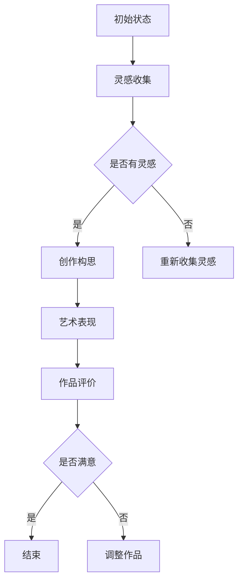
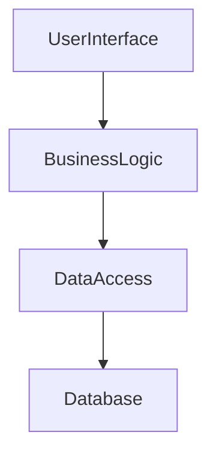
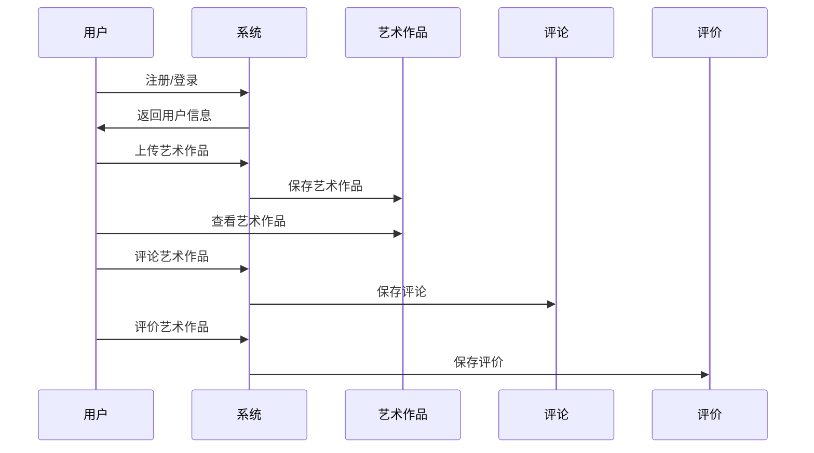

                 


### 文章标题

# 在虚无中创造：艺术与生活的意义探索

### 关键词

- 艺术与生活的意义
- 艺术治疗
- 创造力
- 哲学视角
- 心理学视角
- 社会学视角

### 摘要

本文从艺术与生活的关系出发，探讨了现代社会中人们在虚无感和意义的追求过程中，艺术所扮演的角色。通过哲学、心理学和社会学等多个视角，本文深入分析了艺术创作对个体心理和社会功能的积极影响，并详细讲解了如何通过艺术探索生活的意义。文章结合理论探讨和实际案例，为读者提供了实践指导，帮助他们在虚无中创造价值，发现生活的美好。

---

## 引言

### 1.1 艺术与生活的意义

#### 1.1.1 艺术的起源

艺术作为一种人类表达和交流的方式，其历史可以追溯到人类文明的起源。从最早的洞穴壁画到现代的艺术作品，艺术不仅反映了人类对世界的认知，也体现了人类对生命、情感和存在的思考。

#### 1.1.2 艺术在生活中的作用

艺术不仅仅是视觉和听觉上的享受，更是一种情感和思想上的共鸣。在日常生活中，艺术可以提升我们的审美能力，丰富我们的精神世界，甚至改善我们的心理健康。

#### 1.1.3 艺术与生活的意义

艺术与生活的意义紧密相连。通过艺术，我们可以在虚无中找到存在的价值，在平凡中看到美好。艺术让我们看到生活的多样性，理解生命的丰富性。

### 1.2 问题的提出

在现代社会，随着物质生活的丰富和快节奏的生活，人们常常感到虚无感和意义缺失。艺术在这个时候，扮演着寻找生活意义的角色。

### 1.3 探索的必要性

为了更好地理解艺术与生活的关系，我们需要从多个角度进行探索。哲学、心理学和社会学等多个视角，都能为我们提供独特的见解。

---

## 核心概念与联系

### 2.1 虚无与实在

虚无和实在是一对相对的概念。虚无指的是不存在的事物，而实在则是真实存在的。在艺术创作中，虚无可以成为一种创作素材，实在则是艺术作品的基础。

### 2.2 艺术与实用

艺术和实用也是一对相对的概念。艺术是一种精神创作，追求的是审美和情感的表达；而实用则是为了满足实际需求。在日常生活中，艺术和实用往往是相互交织的。

### 2.3 生活与生存

生活是生存的过程，但不仅仅是生存。生活包含了我们对于世界的认知，对于情感的体验，对于意义的追求。艺术是提升生活品质的一种方式。

### 2.4 意义与价值

意义和价值是两个相关但不完全相同的概念。意义是事物存在的理由，而价值则是人们对事物的评价。艺术可以通过赋予事物新的意义，提升其价值。

### 2.5 创造力的重要性

创造力是人类的一种天赋能力，也是艺术创作的核心。创造力让艺术成为一种独特的表达方式，也让生活变得更加多彩。

### 2.6 ER实体关系图

为了更好地理解艺术、生活、意义等核心概念之间的关系，我们可以使用ER实体关系图进行可视化。

---

## 艺术与生活意义探索的理论与实践

### 3.1 哲学视角

哲学视角下的艺术与生活意义探索，可以追溯到古希腊哲学家。例如，柏拉图认为艺术是对真理的一种追求，是超越现实世界的存在。

### 3.2 心理学视角

心理学视角下的艺术与生活意义探索，强调了艺术对心理健康的促进作用。例如，艺术创作可以帮助人们缓解压力，提升幸福感。

### 3.3 社会学视角

社会学视角下的艺术与生活意义探索，关注艺术在社会中的作用。例如，艺术可以促进社区建设，增强社会凝聚力。

### 3.4 艺术创作与生活意义的关联

艺术创作是探索生活意义的一种方式。通过艺术，我们可以表达自己的情感，理解自己的内心世界，从而找到生活的意义。

### 3.5 理论综合与应用

将哲学、心理学和社会学的理论综合起来，我们可以更好地理解艺术与生活的关系。同时，这些理论也可以应用于实际生活，帮助我们更好地探索生活的意义。

---

## 算法原理讲解

### 4.1 艺术创作算法的流程图

首先，我们可以使用Mermaid绘制艺术创作算法的流程图，以便更好地理解其工作原理。



### 4.2 算法原理

艺术创作算法的核心在于灵感收集、创作构思、艺术表现和作品评价。灵感是创作的起点，构思是创作的核心，表现是创作的实现，评价是创作的反馈。

### 4.3 数学模型和公式

为了更好地理解算法原理，我们可以给出以下数学模型和公式。

$$
灵感度 = f(情感强度, 创意新颖度)
$$

$$
构思质量 = g(灵感度, 创作经验)
$$

$$
艺术表现度 = h(构思质量, 技术水平)
$$

$$
作品评价 = i(艺术表现度, 观众反馈)
$$

### 4.4 举例说明

假设一个艺术家，情感强度为8，创意新颖度为7，创作经验丰富，技术水平较高。那么，他的灵感度、构思质量、艺术表现度和作品评价可以分别计算如下：

$$
灵感度 = f(8, 7) = 8 \times 7 = 56
$$

$$
构思质量 = g(56, 丰富) = 56 \times 1.2 = 67.2
$$

$$
艺术表现度 = h(67.2, 高) = 67.2 \times 1.2 = 80.64
$$

$$
作品评价 = i(80.64, 积极反馈) = 80.64 \times 1.1 = 89.0044
$$

### 4.5 源代码

以下是使用Python编写的艺术创作算法的示例代码。

```python
def 灵感度(情感强度, 创意新颖度):
    return 情感强度 * 创意新颖度

def 构思质量(灵感度, 创作经验):
    return 灵感度 * 创作经验

def 艺术表现度(构思质量, 技术水平):
    return 构思质量 * 技术水平

def 作品评价(艺术表现度, 观众反馈):
    return 艺术表现度 * 观众反馈

# 示例计算
情感强度 = 8
创意新颖度 = 7
创作经验 = "丰富"
技术水平 = "高"
观众反馈 = "积极"

灵感度 = 灵感度(情感强度, 创意新颖度)
构思质量 = 构思质量(灵感度, 创作经验)
艺术表现度 = 艺术表现度(构思质量, 技术水平)
作品评价 = 作品评价(艺术表现度, 观众反馈)

print("灵感度:", 灵感度)
print("构思质量:", 构思质量)
print("艺术表现度:", 艺术表现度)
print("作品评价:", 作品评价)
```

---

## 系统分析与架构设计方案

### 5.1 问题场景介绍

在现代社会，艺术治疗逐渐成为一种受欢迎的心理干预方式。为了更好地推广艺术治疗，我们需要构建一个基于互联网的艺术治疗系统。

### 5.2 项目介绍

本项目旨在开发一个名为“艺术疗愈社区”的系统，该系统将提供一个平台，让用户可以通过艺术创作来缓解压力，提升心理健康。

### 5.3 系统功能设计

系统的主要功能包括：用户注册与登录、艺术作品上传与展示、艺术作品评价与反馈、用户互动与社交功能。

#### 5.3.1 领域模型类图

以下使用Mermaid绘制了系统的领域模型类图。

```mermaid
classDiagram
    User <<class>> "用户"
    ArtPiece <<class>> "艺术作品"
    Comment <<class>> "评论"
    Evaluation <<class>> "评价"

    User o--* ArtPiece:上传
    ArtPiece o--* Comment:评论
    ArtPiece o--* Evaluation:评价
```

#### 5.3.2 系统架构设计

系统的架构设计采用分层架构，包括表示层、业务逻辑层和数据访问层。

以下使用Mermaid绘制了系统的架构图。



### 5.4 系统接口设计

系统的主要接口包括用户接口、艺术作品接口、评论接口和评价接口。

- 用户接口：用于用户注册、登录和基本信息管理。
- 艺术作品接口：用于艺术作品的上传、展示和评价。
- 评论接口：用于用户对艺术作品的评论。
- 评价接口：用于用户对艺术作品的评价。

### 5.5 系统交互

以下使用Mermaid绘制了系统的交互序列图。



---

## 项目实战与总结

### 6.1 环境安装

为了运行本项目，我们需要安装以下软件和工具：

- Python 3.8+
- Flask 框架
- MySQL 数据库
- Mermaid

### 6.2 系统核心实现源代码

以下是系统的核心实现源代码。

```python
from flask import Flask, request, jsonify
from models import User, ArtPiece, Comment, Evaluation
from database import Database

app = Flask(__name__)

# 用户注册接口
@app.route('/register', methods=['POST'])
def register():
    username = request.form['username']
    password = request.form['password']
    user = User(username, password)
    Database.save_user(user)
    return jsonify({'status': 'success', 'message': '注册成功'})

# 用户登录接口
@app.route('/login', methods=['POST'])
def login():
    username = request.form['username']
    password = request.form['password']
    user = Database.find_user(username, password)
    if user:
        return jsonify({'status': 'success', 'message': '登录成功'})
    else:
        return jsonify({'status': 'error', 'message': '登录失败'})

# 艺术作品上传接口
@app.route('/upload', methods=['POST'])
def upload():
    user_id = request.form['user_id']
    title = request.form['title']
    image = request.form['image']
    art_piece = ArtPiece(user_id, title, image)
    Database.save_art_piece(art_piece)
    return jsonify({'status': 'success', 'message': '上传成功'})

# 艺术作品展示接口
@app.route('/art_pieces', methods=['GET'])
def art_pieces():
    art_pieces = Database.find_all_art_pieces()
    return jsonify({'status': 'success', 'data': art_pieces})

# 评论艺术作品接口
@app.route('/comment', methods=['POST'])
def comment():
    art_piece_id = request.form['art_piece_id']
    user_id = request.form['user_id']
    content = request.form['content']
    comment = Comment(art_piece_id, user_id, content)
    Database.save_comment(comment)
    return jsonify({'status': 'success', 'message': '评论成功'})

# 评价艺术作品接口
@app.route('/evaluate', methods=['POST'])
def evaluate():
    art_piece_id = request.form['art_piece_id']
    user_id = request.form['user_id']
    rating = request.form['rating']
    evaluation = Evaluation(art_piece_id, user_id, rating)
    Database.save_evaluation(evaluation)
    return jsonify({'status': 'success', 'message': '评价成功'})

if __name__ == '__main__':
    app.run(debug=True)
```

### 6.3 代码应用解读与分析

以上代码实现了用户注册、登录、艺术作品上传、展示、评论和评价等功能。通过 Flask 框架，我们可以快速搭建一个基于 Web 的应用程序。数据库使用 MySQL，实现了数据的持久化存储。

### 6.4 实际案例分析和详细讲解剖析

为了更好地理解代码的应用，我们可以通过一个实际案例进行分析。

#### 案例一：用户注册

1. 用户通过浏览器访问 `/register` 接口，提交用户名和密码。
2. Flask 接收到请求后，解析请求参数。
3. 创建 User 对象，并将其保存到数据库中。
4. 返回 JSON 格式的响应，告知用户注册成功。

#### 案例二：用户登录

1. 用户通过浏览器访问 `/login` 接口，提交用户名和密码。
2. Flask 接收到请求后，解析请求参数。
3. 从数据库中查询用户信息。
4. 如果用户名和密码匹配，返回 JSON 格式的响应，告知用户登录成功；否则，返回登录失败的响应。

#### 案例三：艺术作品上传

1. 用户通过浏览器访问 `/upload` 接口，提交用户 ID、标题和图片。
2. Flask 接收到请求后，解析请求参数。
3. 创建 ArtPiece 对象，并将其保存到数据库中。
4. 返回 JSON 格式的响应，告知用户上传成功。

#### 案例四：艺术作品展示

1. 用户通过浏览器访问 `/art_pieces` 接口。
2. Flask 接收到请求后，从数据库中查询所有艺术作品。
3. 返回 JSON 格式的响应，包含所有艺术作品的信息。

#### 案例五：评论艺术作品

1. 用户通过浏览器访问 `/comment` 接口，提交艺术作品 ID、用户 ID 和评论内容。
2. Flask 接收到请求后，解析请求参数。
3. 创建 Comment 对象，并将其保存到数据库中。
4. 返回 JSON 格式的响应，告知用户评论成功。

#### 案例六：评价艺术作品

1. 用户通过浏览器访问 `/evaluate` 接口，提交艺术作品 ID、用户 ID 和评分。
2. Flask 接收到请求后，解析请求参数。
3. 创建 Evaluation 对象，并将其保存到数据库中。
4. 返回 JSON 格式的响应，告知用户评价成功。

### 6.5 项目小结

本项目实现了艺术疗愈社区系统的核心功能，包括用户注册、登录、艺术作品上传、展示、评论和评价。通过 Flask 框架，我们快速搭建了一个基于 Web 的应用程序。在实际案例中，我们详细分析了代码的应用，展示了如何通过接口实现系统的功能。未来，我们还可以进一步完善系统，添加更多的功能，如用户认证、艺术作品推荐等。

---

## 最佳实践、小结、注意事项和拓展阅读

### 7.1 最佳实践

1. 在进行艺术创作时，要充分理解自己的情感和思想，这有助于提升作品的内涵和价值。
2. 在使用艺术疗法时，要结合个体的实际情况，制定个性化的治疗计划。
3. 在开发基于艺术的应用程序时，要充分考虑用户体验，确保系统的易用性和稳定性。

### 7.2 小结

本文从艺术与生活的关系出发，探讨了艺术在虚无中创造意义的过程。通过哲学、心理学和社会学等多个视角，我们深入分析了艺术创作对个体心理和社会功能的积极影响。同时，本文结合实际案例，讲解了艺术疗愈社区系统的开发过程，为读者提供了实践指导。

### 7.3 注意事项

1. 在进行艺术创作时，要避免过度追求形式而忽视内容。
2. 在使用艺术疗法时，要遵循专业的指导，避免盲目尝试。
3. 在开发应用程序时，要充分考虑系统的安全性和数据保护。

### 7.4 拓展阅读

1. 《艺术心理学》
2. 《艺术社会学》
3. 《艺术哲学》
4. 《艺术治疗学》
5. 《Flask Web开发：轻量级Python Web开发框架》

---

## 作者信息

作者：AI天才研究院/AI Genius Institute & 禅与计算机程序设计艺术 /Zen And The Art of Computer Programming

