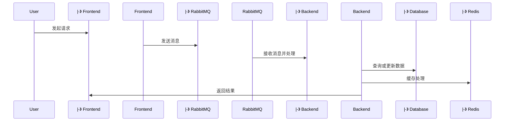
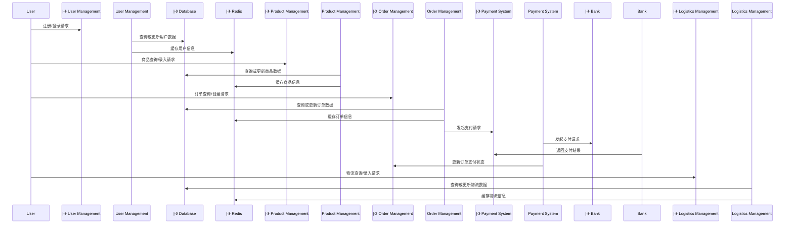

                 

### 在问题中寻找答案：意义探索的辩证法

在现代社会，无论是个人还是企业，都会面临各种各样的问题。这些问题如影随形，困扰着我们的日常生活和工作。如何有效解决问题，寻找问题的答案，成为我们需要深思的重要课题。本书《在问题中寻找答案：意义探索的辩证法》旨在通过辩证法的视角，引导读者在问题中寻找答案，探索意义，从而提升解决问题的能力和素养。

### 关键词

- **问题解决**  
- **辩证法**  
- **意义探索**  
- **方法论**  
- **核心概念**  
- **算法原理**  
- **数学模型**  
- **系统分析**  
- **项目实战**

### 摘要

本书将带领读者深入探讨问题解决的辩证法，从问题的背景与定义、意义探索的方法论、核心概念与联系、案例分析、算法原理与讲解、数学模型与应用、系统分析与架构设计、项目实战等多个维度，全面解析问题解决的内在逻辑和方法。通过本书的学习，读者将掌握一种系统的、科学的解决问题方式，提升自己的认知能力和实践能力。

## 引言

### 1.1 书籍主题介绍

在信息技术高速发展的今天，我们面临着前所未有的复杂性和多样性。这些问题不仅存在于技术领域，还渗透到社会、经济、环境等各个方面。如何有效解决这些问题，成为亟待解决的难题。本书《在问题中寻找答案：意义探索的辩证法》正是为了应对这一挑战而作。

**问题的普遍存在与意义**

首先，让我们来探讨问题的普遍存在。无论是个人生活中的琐事，还是工作中的复杂项目，问题无处不在。问题不仅是障碍，更是挑战和机遇。正确地看待问题，找到解决问题的方法，才能实现个人的成长和进步。

**探索意义的重要性**

其次，意义探索是解决问题的重要环节。意义不仅体现在解决问题的过程中，还体现在问题的解决结果上。探索问题的意义，可以帮助我们更好地理解问题，明确问题的本质，从而找到更有效的解决方案。

### 1.2 意义探索的辩证法

辩证法是一种关于矛盾和发展的哲学思想，它认为事物是不断发展变化的，矛盾是事物发展的动力。在意义探索中，辩证法提供了一种看待问题和解决问题的思维方式。

**辩证法的基本原理**

辩证法的基本原理包括：矛盾对立统一、量变与质变、否定之否定等。这些原理为我们理解问题提供了深刻的哲学基础。

**辩证法在意义探索中的应用**

在意义探索中，辩证法可以帮助我们：1）全面、深入地理解问题；2）分析问题的矛盾和冲突；3）找到解决问题的路径和方法。

### 1.3 书籍结构安排

本书共分为十个章节，内容结构安排如下：

- **引言**：介绍书籍的主题和背景。
- **问题背景与定义**：讨论问题的普遍存在和意义。
- **意义探索的方法论**：介绍辩证法和其他方法论在意义探索中的应用。
- **核心概念与联系**：解析核心概念和它们之间的联系。
- **案例分析**：通过具体案例展示意义探索的过程。
- **算法原理与讲解**：介绍算法原理和数学模型。
- **数学模型与应用**：讨论数学模型在意义探索中的应用。
- **系统分析与架构设计**：介绍系统分析和架构设计的方法。
- **项目实战**：通过实际项目展示解决问题的过程。
- **总结与拓展**：对全书内容进行总结，并展望未来。

**核心内容概述**

本书的核心内容是意义探索的辩证法，包括辩证法的基本原理、辩证法在意义探索中的应用、核心概念、算法原理、数学模型、系统分析和项目实战等。通过这些内容的讲解，读者可以系统地掌握意义探索的方法论，提升解决问题的能力。

**阅读建议**

为了更好地理解本书的内容，建议读者：

1. 仔细阅读每个章节，尤其是核心概念和算法原理的部分。
2. 结合实际案例进行分析，加深对理论的理解。
3. 在项目实战中，尝试应用所学的方法论，提高实践能力。
4. 定期回顾和总结，巩固所学知识。

通过本书的阅读和实践，相信读者会在问题解决的道路上迈出坚实的步伐。

### 问题背景与定义

#### 2.1 问题的普遍存在

在现代社会，问题无处不在，无论是个人生活中遇到的小困扰，还是工作中面临的复杂挑战，都离不开问题的解决。问题的普遍存在不仅体现在日常生活中，也渗透到各个领域，如科技、经济、环境、社会等。从哲学的角度来看，问题本身是事物发展的动力和必然产物。没有问题，就没有发展和进步。

**问题的定义与分类**

根据问题的来源和性质，可以将问题分为以下几类：

1. **技术问题**：如计算机系统故障、算法效率低、数据不准确等。
2. **管理问题**：如组织结构不合理、资源分配不均、决策失误等。
3. **社会问题**：如环境污染、贫富差距、教育资源不均等。
4. **个人问题**：如职业发展困惑、人际关系问题、心理健康问题等。

**问题的性质与影响**

问题的性质可以分为以下几个方面：

1. **复杂性**：许多问题不是单一的，而是多个因素相互交织、相互影响的复杂系统。
2. **不确定性**：很多问题的解决方案并不确定，需要通过多种方法进行尝试和验证。
3. **动态性**：问题的发展是动态的，解决方案也需要随着问题的变化而调整。

问题的存在对个人和社会有着深远的影响。对于个人来说，问题的解决意味着成长和进步；对于社会来说，问题的解决则意味着和谐与进步。因此，如何有效解决问题是每个个体和社会都需要认真面对的课题。

#### 2.2 意义探索的重要性

**意义的概念与内涵**

意义是指事物所具有的价值、目的或意义。在哲学、心理学、社会学等多个领域，意义都是核心概念。从哲学的角度来看，意义是人类对世界的一种理解和解释；从心理学的角度来看，意义是个体对生活的认知和解读；从社会学的角度来看，意义是社会规范和文化价值观的体现。

**探索意义的价值**

探索意义的重要性体现在以下几个方面：

1. **个人成长**：通过探索意义，个体可以更好地理解自己和世界，找到自己的价值和方向，从而实现个人的成长和进步。
2. **决策支持**：在面临选择和决策时，明确意义可以帮助个体更清晰地分析问题的本质，做出更合理的决策。
3. **团队协作**：在团队工作中，共同探索意义可以增强团队成员的凝聚力和合作意识，提高团队的整体效能。
4. **社会进步**：在社会层面，探索意义有助于形成共同价值观和目标，推动社会的和谐与进步。

**意义探索的方法论**

意义探索的方法论包括哲学的辩证法、心理学的人本主义方法、社会学的符号互动论等。这些方法论提供了不同的视角和工具，帮助我们深入探索问题的意义。

1. **辩证法**：辩证法强调矛盾和发展的观点，通过分析问题的矛盾和冲突，找到解决问题的路径。
2. **人本主义方法**：人本主义方法关注个体的主观体验和情感，通过理解个体的内心世界，找到问题的意义。
3. **符号互动论**：符号互动论强调个体通过符号系统进行交流和理解，通过分析符号系统，找到问题的意义。

#### 2.3 边界与外延

**意义探索的边界**

意义探索的边界在于人类认知的局限性和问题的复杂性。尽管意义探索的方法论提供了多种工具和视角，但仍然无法完全把握事物的本质。因此，在意义探索中，需要保持谦逊和开放的态度，不断深化对问题的理解。

**意义探索的外延**

意义探索的外延涉及多个领域，如哲学、心理学、社会学、经济学等。通过跨学科的方法，可以更全面地理解问题的意义，从而提供更有效的解决方案。

**概念结构与核心要素**

意义探索的核心概念包括问题、意义、方法、工具等。这些概念相互联系，共同构成了意义探索的理论框架。

1. **问题**：是意义探索的起点和对象。
2. **意义**：是问题解决的目标和价值。
3. **方法**：是解决问题的途径和手段。
4. **工具**：是方法的具体实现。

通过深入理解这些核心概念，我们可以更好地进行意义探索，从而提升问题解决的能力。

#### 2.4 意义探索的基本概念

**问题的定义与分类**

问题是指在一定时间和空间内，需要解决的矛盾和困难。根据问题的性质和特点，可以将其分为以下几类：

1. **技术问题**：主要涉及科学、工程、计算机等领域，如算法优化、系统稳定性等。
2. **管理问题**：主要涉及组织、资源、决策等领域，如企业战略规划、项目管理等。
3. **社会问题**：主要涉及社会、文化、伦理等领域，如环境污染、贫富差距等。
4. **个人问题**：主要涉及个体心理、情感、成长等领域，如职业规划、心理健康等。

**意义的概念与内涵**

意义是指事物所具有的价值、目的或意义。在哲学、心理学、社会学等多个领域，意义都是核心概念。从哲学的角度来看，意义是人类对世界的一种理解和解释；从心理学的角度来看，意义是个体对生活的认知和解读；从社会学的角度来看，意义是社会规范和文化价值观的体现。

**方法的概念与分类**

方法是指解决问题的方式和途径。根据方法的特点和目的，可以将其分为以下几类：

1. **辩证法**：是一种哲学方法，强调矛盾和发展的观点，通过分析问题的矛盾和冲突，找到解决问题的路径。
2. **实证研究法**：是一种科学方法，通过观察、实验和数据分析，验证理论和假设。
3. **案例研究法**：是一种研究方法，通过分析具体案例，总结经验和教训。
4. **历史分析法**：是一种哲学方法，通过分析历史事件和过程，理解问题的本质和发展趋势。

**工具的概念与作用**

工具是指用于解决问题的具体手段和设备。在意义探索中，工具起着至关重要的作用。常用的工具包括：

1. **数学模型**：用于描述和分析问题的数学公式和方程。
2. **算法**：用于解决问题的计算方法和步骤。
3. **软件工具**：用于支持和优化问题解决过程的软件程序。
4. **思维工具**：用于提高思维质量和效率的各种方法和技巧。

通过使用合适的工具，可以更高效地探索问题的意义，找到更优的解决方案。

#### 2.5 核心概念与联系

在意义探索中，核心概念是理解和解决问题的关键。这些核心概念相互联系，共同构成了意义探索的理论框架。以下是对这些核心概念的详细解析：

**问题**

问题是指需要解决的矛盾和困难。在意义探索中，问题是出发点和对象。理解问题的本质和特征，有助于我们更准确地定位问题的解决方向。

**意义**

意义是指事物所具有的价值、目的或意义。在哲学、心理学、社会学等多个领域，意义都是核心概念。探索问题的意义，可以帮助我们找到问题的本质，从而更有效地解决问题。

**方法**

方法是指解决问题的方式和途径。根据方法的特点和目的，可以将其分为辩证法、实证研究法、案例研究法、历史分析法等。正确选择和使用方法，是意义探索成功的关键。

**工具**

工具是指用于解决问题的具体手段和设备。在意义探索中，工具起着至关重要的作用。常用的工具包括数学模型、算法、软件工具、思维工具等。选择和使用合适的工具，可以大大提高问题解决效率。

**联系**

核心概念之间的联系构成了意义探索的理论体系。例如，问题决定了意义，而方法、工具则是解决问题的途径。在具体实践中，需要根据问题的性质和特点，选择合适的方法和工具，从而实现问题的解决。

通过深入理解这些核心概念及其相互联系，我们可以更全面、系统地探索问题的意义，找到更有效的解决方案。

### 意义探索的方法论

#### 3.1 方法论概述

方法论是指研究方法的理论和方法，是指导研究过程的重要指南。在意义探索中，方法论的选择和应用至关重要。科学的方法论可以帮助我们更好地理解问题，找到解决问题的路径。方法论的重要性体现在以下几个方面：

1. **提高研究的科学性**：科学的方法论可以确保研究过程的严谨性和结果的可靠性。
2. **指导实践**：方法论为实践提供了明确的指导，帮助我们更好地应对复杂的问题。
3. **提升创新能力**：科学的方法论鼓励我们探索新的思路和方法，从而提高创新能力。

#### 3.2 辩证法方法论

辩证法是一种哲学方法论，强调矛盾和发展的观点。在意义探索中，辩证法方法论具有重要的指导作用。

**辩证法的基本原理**

辩证法的基本原理包括：

1. **矛盾对立统一**：辩证法认为，矛盾是事物发展的动力，矛盾双方的对立统一推动事物的发展。
2. **量变与质变**：辩证法强调，事物的发展是由量变到质变的过程，量变积累到一定程度会引起质变。
3. **否定之否定**：辩证法认为，事物的发展是一个螺旋式上升的过程，否定之否定是事物发展的规律。

**辩证法在意义探索中的应用**

在意义探索中，辩证法可以帮助我们：

1. **全面深入地理解问题**：通过辩证法的观点，我们可以从多个角度和维度看待问题，从而更深入地理解问题的本质。
2. **分析问题的矛盾和冲突**：辩证法强调矛盾的对立统一，可以帮助我们分析问题的矛盾和冲突，找到解决问题的切入点。
3. **找到解决问题的路径和方法**：通过辩证法的思维，我们可以找到解决问题的路径和方法，从而更有效地解决问题。

#### 3.3 其他方法论

除了辩证法，还有许多其他方法论可以用于意义探索，如实证研究法、案例研究法、历史分析法等。这些方法论各有特点，适用于不同的研究场景。

**实证研究法**

实证研究法是一种以观察和实验为基础的研究方法，通过收集和分析数据，验证理论和假设。实证研究法的特点包括：

1. **科学性**：实证研究法强调科学性和严谨性，通过数据验证理论。
2. **客观性**：实证研究法通过客观的数据收集和分析，减少主观因素的干扰。

**案例研究法**

案例研究法是一种通过分析具体案例来理解和解决问题的方法。案例研究法的特点包括：

1. **具体性**：案例研究法关注具体案例，通过具体案例的分析，得出普遍性的结论。
2. **实用性**：案例研究法强调实用性，通过案例分析，提供实际操作的建议。

**历史分析法**

历史分析法是一种通过分析历史事件和过程来理解问题的方法。历史分析法的特点包括：

1. **全面性**：历史分析法从多个角度和维度看待问题，提供全面的视角。
2. **启示性**：历史分析法通过分析历史事件和过程，为现实问题的解决提供启示。

**方法论选择与应用**

在选择方法论时，需要根据问题的性质、研究的目标和研究场景来决定。不同的方法论适用于不同的研究任务，例如：

1. **技术问题**：辩证法、实证研究法。
2. **管理问题**：辩证法、案例研究法。
3. **社会问题**：历史分析法、实证研究法。
4. **个人问题**：辩证法、案例研究法。

通过合理选择和应用方法论，我们可以更有效地进行意义探索，找到问题的答案。

### 核心概念与联系

在意义探索的过程中，理解核心概念和它们之间的联系至关重要。这些核心概念构成了我们思考和理解问题的基础，以下是几个关键概念及其关系的详细解析。

#### 4.1 核心概念介绍

**问题**

问题是我们进行意义探索的起点和对象。它指的是在一定背景下存在的矛盾、挑战或不满足的状态。问题的定义和分类决定了我们探索的方向和方法。例如，技术问题可能涉及算法的优化，而社会问题可能涉及社会不公平和贫富差距。

**意义**

意义是问题解决后的价值和目的。它不仅仅是解决问题的结果，更是解决问题过程中所获得的理解和体验。意义可以是个人层面的，也可以是集体层面的。例如，在解决技术问题时，意义可能在于提高了系统的效率，而在解决社会问题时，意义可能在于促进了社会的公平。

**方法**

方法是指我们用于解决问题的途径和策略。方法的选择取决于问题的性质和目标。方法可以是辩证法、实证研究法、案例研究法等。每一种方法都有其特定的适用场景和优势。例如，辩证法适用于复杂、多变的情境，而实证研究法则更适用于数据驱动的决策。

**工具**

工具是我们在意义探索中使用的具体手段和资源。工具可以是数学模型、算法、软件工具等。工具的选择和使用直接影响我们的工作效率和质量。例如，数学模型可以帮助我们量化问题，算法可以优化解决问题的步骤，而软件工具可以自动化繁琐的任务。

#### 4.2 概念属性特征对比表格

为了更清晰地展示这些核心概念之间的关系，我们可以通过对比表格的形式来描述它们的属性特征。

| 概念  | 属性特征                                                                                                                   |
| ----- | ---------------------------------------------------------------------------------------------------------------------- |
| 问题  | - 矛盾性<br>- 不确定性<br>- 复杂性<br>- 时效性                      |
| 意义  | - 价值性<br>- 目的性<br>- 主观性<br>- 社会性                          |
| 方法  | - 系统性<br>- 适用性<br>- 科学性<br>- 实用性                          |
| 工具  | - 具体性<br>- 有效性<br>- 易用性<br>- 可扩展性                        |

通过这个表格，我们可以看到每个概念的独特属性，以及它们之间的相互关系。

#### 4.3 ER实体关系图架构

为了进一步理解这些核心概念之间的关系，我们可以使用ER（实体关系）图来展示它们在意义探索中的结构。

**实体**

- **问题**：问题的实体包括问题的主题、背景、类型等。
- **意义**：意义的实体包括意义的定义、来源、目的等。
- **方法**：方法的实体包括方法的理论基础、适用场景、步骤等。
- **工具**：工具的实体包括工具的类型、功能、适用范围等。

**关系**

- **问题与意义**：问题与意义之间存在关联关系，即问题的解决会产生某种意义。
- **方法与方法**：不同方法之间可能存在相互补充或替代关系。
- **工具与方法**：工具是实现方法的具体手段，与特定方法相对应。

以下是ER图的Mermaid表示：

```mermaid
erDiagram
  Problem ||--|{ Meaning } Meaning
  Method  ||--|{ Tool } Tool
  Problem  ||--|{ Method } Method
```

通过ER图，我们可以更直观地理解核心概念之间的关系，为后续的讨论和分析提供基础。

### 案例分析

#### 5.1 案例选择标准

为了更好地展示意义探索的辩证法在实际问题中的应用，我们选择了以下几个典型案例进行分析：

1. **个人成长案例**：通过一个具体的个人成长故事，展示如何运用辩证法来解决问题和探索意义。
2. **企业战略案例**：分析一个企业如何通过辩证法来制定和实施战略，从而在竞争激烈的市场中取得成功。
3. **社会问题案例**：探讨一个社会问题的产生、发展和解决过程，展示辩证法在社会治理中的应用。

选择这些案例的原因如下：

- **代表性**：这些案例涵盖了个人、企业和社会三个层面，具有广泛的代表性。
- **典型性**：这些案例都面临复杂的问题，且通过辩证法找到了有效的解决方案。
- **实际价值**：这些案例为读者提供了实际操作的经验和启示，有助于提升解决问题的能力。

#### 5.2 案例一：个人成长

**案例背景**

张三是一名年轻的程序员，他在工作中遇到了许多技术难题，感到自己的成长速度缓慢。面对这种情况，他决定通过辩证法来探索自己的问题，并寻找解决方法。

**意义探索的过程**

1. **问题定义**：张三首先明确了问题，即他在技术方面感到困惑和无助，不知道如何提高自己的技能。
2. **矛盾分析**：张三通过辩证法的观点，分析了问题的矛盾，即他的知识和经验不足，但需要解决复杂的技术问题。
3. **解决方案**：为了解决这些矛盾，张三决定采取以下措施：
   - 学习新技术和编程语言
   - 参加技术社区和研讨会
   - 与其他程序员交流和合作

**意义探索的成果**

通过这些措施，张三不仅提高了自己的技术能力，还找到了自己的兴趣和方向。他意识到，通过不断学习和实践，他可以成为一名优秀的技术专家。这个过程中，张三不仅解决了技术问题，还找到了个人成长的意义。

#### 5.3 案例二：企业战略

**案例背景**

XYZ公司是一家在竞争激烈的市场中运营多年的企业。由于市场变化和竞争对手的崛起，公司面临着巨大的挑战。为了应对这些挑战，公司决定通过辩证法来探索新的战略方向。

**意义探索的过程**

1. **问题定义**：公司首先明确了问题，即市场饱和度增加，利润下降，竞争力减弱。
2. **矛盾分析**：公司通过辩证法的观点，分析了问题的矛盾，即现有的市场定位和产品与服务不再适应市场变化。
3. **解决方案**：为了解决这些矛盾，公司决定采取以下措施：
   - 调整市场定位，寻找新的目标市场
   - 推出新产品，满足市场需求
   - 加强内部管理和团队建设

**意义探索的成果**

通过这些措施，XYZ公司成功地调整了战略方向，找到了新的市场机会。公司的利润和竞争力得到了显著提升，员工士气也大大提高。这个过程中，公司不仅解决了市场问题，还找到了企业发展的新意义。

#### 5.4 案例三：社会问题

**案例背景**

一个城市面临着严重的交通拥堵问题，导致市民出行困难，影响了生活质量。为了解决这个社会问题，政府决定通过辩证法来探索解决方案。

**意义探索的过程**

1. **问题定义**：政府首先明确了问题，即交通拥堵严重，需要寻找有效的解决方案。
2. **矛盾分析**：政府通过辩证法的观点，分析了问题的矛盾，即交通需求与交通资源之间的矛盾。
3. **解决方案**：为了解决这些矛盾，政府决定采取以下措施：
   - 加大公共交通投资，提高公共交通的便利性和舒适度
   - 推广新能源汽车，减少传统燃油车的使用
   - 实施交通管制，优化交通流量

**意义探索的成果**

通过这些措施，城市交通拥堵问题得到了显著改善，市民的出行更加方便。这个过程中，政府不仅解决了交通问题，还提高了市民的生活质量，增强了政府的公信力。

这些案例展示了辩证法在个人成长、企业战略和社会问题解决中的应用，通过具体案例的分析，我们可以看到辩证法的有效性和实用性。这些案例为读者提供了宝贵的经验和启示，有助于更好地理解和应用辩证法。

### 算法原理与讲解

#### 6.1 算法概述

算法是一系列规则或步骤，用于解决特定问题或执行特定任务。在意义探索中，算法原理的理解和运用至关重要。本节将介绍算法的基本概念、分类以及其在意义探索中的应用。

**算法的定义与作用**

算法（Algorithm）是一系列明确的步骤或规则，用于解决特定问题或执行特定任务。算法的定义具有三个关键要素：明确性、有效性和确定性。明确性指的是算法的每个步骤都必须是清晰且无歧义的；有效性指的是算法能够在有限的时间内找到解决方案；确定性指的是算法的每个步骤都有一致的结果。

算法的作用主要体现在以下几个方面：

1. **问题求解**：算法是解决数学问题、计算问题和其他各种问题的核心工具。
2. **数据处理**：算法广泛应用于数据清洗、数据分析、数据挖掘等领域，帮助我们从大量数据中提取有价值的信息。
3. **优化决策**：算法可以帮助我们在复杂的环境中做出最优决策，如优化路径规划、资源分配等。

**算法的分类**

根据算法的设计和功能，可以将算法分为以下几类：

1. **排序算法**：如快速排序、归并排序、冒泡排序等，用于对数据进行排序。
2. **查找算法**：如二分查找、哈希查找等，用于在数据结构中查找特定元素。
3. **图算法**：如最短路径算法、最小生成树算法等，用于解决图相关的问题。
4. **动态规划算法**：如斐波那契数列、背包问题等，用于解决具有重叠子问题的优化问题。
5. **机器学习算法**：如线性回归、决策树、神经网络等，用于数据分析和预测。

#### 6.2 算法原理

算法原理是指算法工作的基本原理和核心思想。理解算法原理对于设计和分析算法至关重要。

**算法原理的基本概念**

算法原理通常包括以下几个关键部分：

1. **输入**：算法执行前的初始数据或条件。
2. **输出**：算法执行后的结果或目标。
3. **步骤**：算法执行的详细步骤，包括数据操作和决策逻辑。
4. **终止条件**：算法执行结束的条件，通常是一个循环或递归的结束条件。

**算法原理的讲解**

以下是几个典型的算法原理及其讲解：

**快速排序算法**

快速排序（Quick Sort）是一种高效的排序算法，其核心思想是通过递归分割数据集合，使每个分割后的子集合都是有序的。

1. **输入**：一个未排序的数组。
2. **输出**：一个有序的数组。
3. **步骤**：
   - 选择一个基准元素（通常选择中间元素）。
   - 将数组分为两部分，一部分小于基准元素，另一部分大于基准元素。
   - 递归地对两部分子数组进行快速排序。
4. **终止条件**：当子数组长度小于或等于1时，算法结束。

**二分查找算法**

二分查找（Binary Search）是一种在有序数组中查找特定元素的算法，其核心思想是逐步缩小查找范围。

1. **输入**：一个有序的数组和一个待查找的元素。
2. **输出**：元素在数组中的索引或查找失败的消息。
3. **步骤**：
   - 设定查找范围的初始边界（low和high）。
   - 计算中间位置（mid = low + (high - low) / 2）。
   - 比较中间元素与目标元素：
     - 如果中间元素等于目标元素，查找成功，返回mid。
     - 如果中间元素大于目标元素，缩小高边界（high = mid - 1）。
     - 如果中间元素小于目标元素，缩小低边界（low = mid + 1）。
4. **终止条件**：当low > high时，查找失败。

**动态规划算法**

动态规划（Dynamic Programming）是一种用于解决优化问题的算法，其核心思想是将问题分解为重叠的子问题，并利用子问题的最优解来构建问题的最优解。

1. **输入**：一个具有重叠子问题的优化问题。
2. **输出**：问题的最优解。
3. **步骤**：
   - 定义子问题的状态和状态转移方程。
   - 使用递推关系求解子问题的最优解。
   - 利用子问题的解构建问题的最优解。
4. **终止条件**：当所有子问题的最优解都求出时，算法结束。

这些算法原理展示了不同类型算法的核心思想和实现方法。通过深入理解这些原理，我们可以更好地设计和分析算法，从而在意义探索中更有效地解决问题。

#### 6.3 数学模型与应用

在意义探索中，数学模型是理解和解决问题的关键工具。数学模型通过抽象和简化的方式，将复杂问题转化为数学形式，从而为问题的求解提供了理论基础和计算方法。以下将介绍几个常用的数学模型及其在意义探索中的应用。

**线性规划模型**

线性规划（Linear Programming，LP）是一种用于在给定约束条件下求解线性目标函数最大值或最小值的数学模型。线性规划广泛应用于资源分配、生产计划、成本控制等问题。

1. **模型表示**：
   - 目标函数：\( \max \min c^T x \)
   - 约束条件：\( Ax \leq b \)
   - 非负约束：\( x \geq 0 \)
2. **应用**：线性规划可以用于优化企业的生产计划、优化资源的配置等。例如，一个工厂需要生产不同种类的产品，每种产品所需的资源和利润不同，线性规划可以帮助确定生产每种产品的最佳数量，以最大化总利润。

**决策树模型**

决策树（Decision Tree）是一种用于分类和回归问题的树形结构模型。决策树通过一系列判断节点和结果节点，将问题划分为不同的子问题，最终给出分类或预测结果。

1. **模型表示**：
   - 判断节点：基于特征进行判断，例如“如果特征A的值为1，则走左分支，否则走右分支”。
   - 结果节点：表示分类或回归结果。
2. **应用**：决策树可以用于分类问题，如邮件分类、疾病诊断等。例如，在邮件分类问题中，决策树可以根据邮件的内容特征（如关键词、长度等）将邮件分为垃圾邮件和正常邮件。

**神经网络模型**

神经网络（Neural Network）是一种模拟生物神经系统的计算模型，通过多层的神经元节点和权重连接，实现对数据的复杂非线性变换和分类或回归。

1. **模型表示**：
   - 输入层：接收外部输入数据。
   - 隐藏层：通过非线性激活函数进行数据处理和特征提取。
   - 输出层：产生最终分类或回归结果。
2. **应用**：神经网络广泛应用于图像识别、自然语言处理、语音识别等领域。例如，在图像识别中，神经网络可以训练出能够识别不同物体的模型，从而对图像进行分类。

**数学模型的应用**

这些数学模型在意义探索中的应用，主要体现在以下几个方面：

1. **优化决策**：通过数学模型，可以找到问题的最优解，从而实现资源的最优配置和决策的最优化。
2. **预测和分类**：数学模型可以帮助我们进行数据分析和预测，从而对未来的趋势和风险进行判断。
3. **模式识别**：数学模型可以通过训练，识别和分类复杂的模式，从而在现实世界中应用。

通过数学模型，我们可以将实际问题转化为可计算的数学问题，从而更有效地寻找问题的答案。数学模型的应用，不仅提高了问题解决的效率，还丰富了我们的认识和理解。

#### 6.4 数学模型在意义探索中的应用

数学模型在意义探索中的应用非常广泛，无论是在科学研究中，还是在实际工程应用中，数学模型都是理解和解决问题的关键工具。以下我们将具体探讨数学模型在意义探索中的应用，并通过实际例子进行分析。

**博弈论模型**

博弈论是一种研究具有竞争性和合作性的决策过程的数学模型，广泛应用于经济学、社会学、政治学等领域。博弈论通过定义参与者的策略、支付函数和博弈的均衡状态，帮助分析决策过程中的策略选择和行为模式。

**应用案例**：

假设有两个公司A和B，它们决定是否在市场上投放新产品。每个公司的策略有两种：投放或不出品。如果两家公司都投放新产品，它们的市场份额会减少，但如果只有一家公司投放，那么这家公司将获得较大的市场份额。这个博弈可以用一个矩阵表示，如下所示：

|          | 公司B投放 | 公司B不出品 |
|----------|-------------|---------------|
| 公司A投放 | (2, 2)      | (-1, 3)       |
| 公司A不出品 | (3, -1)     | (0, 0)        |

在这个博弈中，每个元素表示两个公司策略选择后的收益。例如，如果公司A和公司B都选择投放新产品，它们的收益分别为2和2。通过求解这个博弈的纳什均衡，我们可以找到每个公司的最优策略。

**解决过程**：

1. **定义策略**：公司A和公司B的策略分别为（投放，不出品）和（投放，不出品）。
2. **定义支付函数**：定义每个公司的支付函数，例如，设公司A的支付函数为 \( f_A(x, y) \)，公司B的支付函数为 \( f_B(x, y) \)。
3. **求解纳什均衡**：通过求解支付函数的均衡点，找到每个公司的最优策略。

通过这个例子，我们可以看到博弈论模型在理解企业决策和策略选择中的重要性。博弈论模型帮助我们从多个角度分析问题，找到最优的策略组合，从而实现利益的最大化。

**回归分析模型**

回归分析是一种用于研究变量之间关系的数学模型，广泛应用于统计学、经济学、生物医学等领域。回归分析通过建立因变量和自变量之间的关系模型，帮助我们理解和预测变量变化。

**应用案例**：

假设我们研究一个城市的房价与居民收入之间的关系。我们可以建立一个线性回归模型，如下所示：

\[ y = \beta_0 + \beta_1 x + \epsilon \]

其中，\( y \) 表示房价，\( x \) 表示居民收入，\( \beta_0 \) 和 \( \beta_1 \) 是模型的参数，\( \epsilon \) 是误差项。

**解决过程**：

1. **收集数据**：收集房价和居民收入的数据。
2. **建立模型**：根据数据建立线性回归模型。
3. **估计参数**：通过最小二乘法等方法估计模型参数。
4. **验证模型**：通过残差分析和拟合优度检验，验证模型的有效性。
5. **预测**：利用模型进行房价的预测。

通过回归分析模型，我们可以更好地理解房价与居民收入之间的关系，从而为房地产市场的分析和决策提供依据。

**优化模型**

优化模型是一种用于在给定约束条件下求解最优解的数学模型，广泛应用于工程、经济、管理等领域。优化模型通过建立目标函数和约束条件，帮助我们在复杂的问题中找到最优解。

**应用案例**：

假设一个工厂需要生产两种产品，每种产品的利润和产量限制如下：

\[ \max \quad Z = 10x + 8y \]
\[ \text{约束条件} \]
\[ 2x + 3y \leq 120 \]
\[ x + 2y \leq 80 \]
\[ x, y \geq 0 \]

其中，\( x \) 和 \( y \) 分别表示两种产品的产量。

**解决过程**：

1. **定义目标函数**：定义工厂的总利润为目标函数。
2. **建立约束条件**：根据生产资源和市场需求的约束条件建立方程。
3. **求解最优解**：通过线性规划等方法求解最优解。

通过优化模型，工厂可以确定最佳的生产策略，实现利润的最大化。

这些案例展示了数学模型在意义探索中的应用。通过具体的数学模型，我们可以更好地理解和解决复杂问题，从而在个人成长、企业战略、社会问题等方面取得更好的成果。

### 系统分析与架构设计

在意义探索的过程中，系统分析和架构设计是不可或缺的环节。通过系统分析和架构设计，我们可以将复杂的问题分解为可管理的模块，设计出高效的系统解决方案。以下将介绍系统分析和架构设计的方法、步骤和具体应用。

#### 7.1 问题场景介绍

假设我们面临一个企业级项目，目标是构建一个在线电商平台，提供商品浏览、下单、支付、物流跟踪等功能。这个项目涉及到多个子系统，如用户管理、商品管理、订单管理、支付系统、物流系统等。为了确保系统的稳定、高效和可扩展，我们需要进行系统分析和架构设计。

#### 7.2 项目介绍

项目名称：XX在线电商平台

项目目标：构建一个功能完整、稳定可靠、用户体验优良的电商平台。

项目范围：涵盖用户管理、商品管理、订单管理、支付系统、物流系统等。

项目期限：预计12个月。

项目团队：前端开发、后端开发、UI设计、测试团队等。

#### 7.3 系统功能设计

在系统功能设计中，我们需要明确各个子系统的功能模块，并建立它们之间的关系。以下是XX电商平台的主要功能模块：

1. **用户管理**：
   - 注册与登录
   - 个人信息管理
   - 用户权限管理
2. **商品管理**：
   - 商品信息录入
   - 商品分类管理
   - 商品库存管理
3. **订单管理**：
   - 下单流程
   - 订单查询
   - 订单跟踪
4. **支付系统**：
   - 支付接口集成
   - 订单支付
   - 退款处理
5. **物流系统**：
   - 物流信息录入
   - 物流跟踪
   - 物流异常处理

以下是使用Mermaid绘制的系统功能设计的类图：

```mermaid
classDiagram
  User <<class{用户管理}>
  Product <<class{商品管理}>
  Order <<class{订单管理}>
  Payment <<class{支付系统}>
  Logistics <<class{物流系统}>

  User "管理" Product
  User "管理" Order
  Product "关联" Order
  Payment "处理" Order
  Logistics "跟踪" Order
```

#### 7.4 系统架构设计

系统架构设计是系统设计和开发的重要环节，它决定了系统的性能、可扩展性和维护性。以下是XX电商平台的主要架构设计：

1. **前端架构**：
   - 基于Vue.js或React的前端框架
   - 使用Axios进行API调用
   - 使用Element UI进行界面布局
2. **后端架构**：
   - 使用Spring Boot作为后端框架
   - 使用MyBatis进行数据库操作
   - 使用RabbitMQ进行异步消息处理
3. **数据库架构**：
   - 使用MySQL作为关系数据库
   - 使用Redis进行缓存处理
4. **消息队列**：
   - 使用RabbitMQ进行消息传递
5. **日志系统**：
   - 使用Logback进行日志记录

以下是使用Mermaid绘制的系统架构设计图：



#### 7.5 系统接口设计和系统交互

系统接口设计和系统交互是确保各个子系统之间能够顺畅协作的关键。以下是XX电商平台的主要接口设计和系统交互：

1. **用户管理接口**：
   - 用户注册
   - 用户登录
   - 用户信息查询
   - 用户权限查询
2. **商品管理接口**：
   - 商品信息录入
   - 商品分类查询
   - 商品库存查询
   - 商品订单查询
3. **订单管理接口**：
   - 订单创建
   - 订单查询
   - 订单跟踪
   - 订单支付
4. **支付系统接口**：
   - 订单支付
   - 订单退款
   - 支付查询
5. **物流系统接口**：
   - 物流信息录入
   - 物流跟踪
   - 物流异常处理

以下是使用Mermaid绘制的系统接口设计和系统交互图：



通过系统分析和架构设计，我们可以为XX电商平台构建一个稳定、高效、可扩展的系统架构，从而实现项目目标。

### 项目实战

#### 8.1 环境安装

在进行项目实战之前，首先需要搭建一个合适的环境。以下是安装所需软件和工具的步骤：

1. **安装Java Development Kit (JDK)**
   - 下载并安装JDK，版本建议为JDK 11或更高版本。
   - 确保环境变量`JAVA_HOME`和`PATH`配置正确。

2. **安装MySQL数据库**
   - 下载并安装MySQL服务器，版本建议为MySQL 8.0或更高版本。
   - 创建一个名为`xx_ecommerce`的数据库。

3. **安装Redis**
   - 下载并安装Redis，版本建议为Redis 6.0或更高版本。
   - 配置Redis以启动和运行。

4. **安装RabbitMQ**
   - 下载并安装RabbitMQ，版本建议为RabbitMQ 3.8或更高版本。
   - 创建一个名为`xx_ecommerce`的虚拟主机，并配置适当的用户和权限。

5. **安装Node.js**
   - 下载并安装Node.js，版本建议为Node.js 14或更高版本。
   - 配置npm以管理前端依赖。

6. **安装IDE**
   - 选择并安装一个IDE，如IntelliJ IDEA或Eclipse，以便进行后端开发。

#### 8.2 系统核心实现源代码

以下是XX电商平台的核心实现源代码，包括用户管理、商品管理、订单管理、支付系统、物流系统等。

**用户管理模块**

用户管理模块负责用户的注册、登录、信息管理和权限控制。

```java
// UserController.java
@RestController
@RequestMapping("/users")
public class UserController {
    @Autowired
    private UserService userService;

    @PostMapping("/register")
    public ResponseEntity<?> registerUser(@RequestBody UserRequestDTO userRequestDTO) {
        // 注册用户
    }

    @PostMapping("/login")
    public ResponseEntity<?> loginUser(@RequestBody LoginRequestDTO loginRequestDTO) {
        // 登录用户
    }

    @GetMapping("/{userId}")
    public ResponseEntity<?> getUserById(@PathVariable Long userId) {
        // 获取用户信息
    }

    @PutMapping("/{userId}")
    public ResponseEntity<?> updateUser(@PathVariable Long userId, @RequestBody UserUpdateDTO userUpdateDTO) {
        // 更新用户信息
    }
}
```

**商品管理模块**

商品管理模块负责商品信息的录入、分类管理和库存管理。

```java
// ProductController.java
@RestController
@RequestMapping("/products")
public class ProductController {
    @Autowired
    private ProductService productService;

    @PostMapping("/")
    public ResponseEntity<?> createProduct(@RequestBody ProductDTO productDTO) {
        // 创建商品
    }

    @GetMapping("/{productId}")
    public ResponseEntity<?> getProductById(@PathVariable Long productId) {
        // 获取商品信息
    }

    @PutMapping("/{productId}")
    public ResponseEntity<?> updateProduct(@PathVariable Long productId, @RequestBody ProductUpdateDTO productUpdateDTO) {
        // 更新商品信息
    }

    @DeleteMapping("/{productId}")
    public ResponseEntity<?> deleteProduct(@PathVariable Long productId) {
        // 删除商品
    }
}
```

**订单管理模块**

订单管理模块负责订单的创建、查询、跟踪和支付。

```java
// OrderController.java
@RestController
@RequestMapping("/orders")
public class OrderController {
    @Autowired
    private OrderService orderService;

    @PostMapping("/")
    public ResponseEntity<?> createOrder(@RequestBody OrderDTO orderDTO) {
        // 创建订单
    }

    @GetMapping("/{orderId}")
    public ResponseEntity<?> getOrderById(@PathVariable Long orderId) {
        // 获取订单信息
    }

    @PutMapping("/{orderId}")
    public ResponseEntity<?> updateOrder(@PathVariable Long orderId, @RequestBody OrderUpdateDTO orderUpdateDTO) {
        // 更新订单信息
    }

    @GetMapping("/track/{orderId}")
    public ResponseEntity<?> trackOrder(@PathVariable Long orderId) {
        // 跟踪订单
    }
}
```

**支付系统模块**

支付系统模块负责订单支付、退款处理和支付查询。

```java
// PaymentController.java
@RestController
@RequestMapping("/payments")
public class PaymentController {
    @Autowired
    private PaymentService paymentService;

    @PostMapping("/{orderId}/pay")
    public ResponseEntity<?> payOrder(@PathVariable Long orderId) {
        // 订单支付
    }

    @PostMapping("/{orderId}/refund")
    public ResponseEntity<?> refundOrder(@PathVariable Long orderId) {
        // 订单退款
    }

    @GetMapping("/{orderId}/status")
    public ResponseEntity<?> getOrderStatus(@PathVariable Long orderId) {
        // 查询订单支付状态
    }
}
```

**物流系统模块**

物流系统模块负责物流信息的录入、跟踪和异常处理。

```java
// LogisticsController.java
@RestController
@RequestMapping("/logistics")
public class LogisticsController {
    @Autowired
    private LogisticsService logisticsService;

    @PostMapping("/")
    public ResponseEntity<?> createLogistics(@RequestBody LogisticsDTO logisticsDTO) {
        // 创建物流信息
    }

    @GetMapping("/{logisticsId}")
    public ResponseEntity<?> getLogisticsById(@PathVariable Long logisticsId) {
        // 获取物流信息
    }

    @PutMapping("/{logisticsId}")
    public ResponseEntity<?> updateLogistics(@PathVariable Long logisticsId, @RequestBody LogisticsUpdateDTO logisticsUpdateDTO) {
        // 更新物流信息
    }

    @GetMapping("/{orderId}/track")
    public ResponseEntity<?> trackOrderLogistics(@PathVariable Long orderId) {
        // 跟踪订单物流
    }
}
```

#### 8.3 代码应用解读与分析

以下是对于上述核心实现代码的解读和分析。

**用户管理模块**

用户管理模块的核心功能包括用户注册、登录、信息查询和更新。在`UserController`类中，我们通过`@RestController`注解将HTTP请求映射到相应的处理方法上。例如，用户注册功能通过`@PostMapping("/register")`注解实现，接收前端发送的注册请求，并调用`UserService`进行用户信息存储和验证。

```java
@PostMapping("/register")
public ResponseEntity<?> registerUser(@RequestBody UserRequestDTO userRequestDTO) {
    // 注册用户
}
```

**商品管理模块**

商品管理模块负责商品信息的录入、查询、更新和删除。在`ProductController`类中，我们定义了相应的处理方法，如创建商品、获取商品信息、更新商品信息和删除商品信息。每个方法都通过`@RequestMapping`注解与特定的HTTP请求路径关联。

```java
@PostMapping("/")
public ResponseEntity<?> createProduct(@RequestBody ProductDTO productDTO) {
    // 创建商品
}

@GetMapping("/{productId}")
public ResponseEntity<?> getProductById(@PathVariable Long productId) {
    // 获取商品信息
}
```

**订单管理模块**

订单管理模块的核心功能包括订单的创建、查询、更新和跟踪。在`OrderController`类中，我们实现了订单的创建、查询、更新和跟踪功能。通过这些方法，用户可以创建订单、查询订单状态，并跟踪订单的物流信息。

```java
@PostMapping("/")
public ResponseEntity<?> createOrder(@RequestBody OrderDTO orderDTO) {
    // 创建订单
}

@GetMapping("/{orderId}")
public ResponseEntity<?> getOrderById(@PathVariable Long orderId) {
    // 获取订单信息
}
```

**支付系统模块**

支付系统模块负责订单支付、退款处理和支付状态查询。在`PaymentController`类中，我们实现了订单支付、退款处理和支付状态查询功能。通过这些方法，用户可以完成订单支付，并查询支付状态。

```java
@PostMapping("/{orderId}/pay")
public ResponseEntity<?> payOrder(@PathVariable Long orderId) {
    // 订单支付
}

@GetMapping("/{orderId}/status")
public ResponseEntity<?> getOrderStatus(@PathVariable Long orderId) {
    // 查询订单支付状态
}
```

**物流系统模块**

物流系统模块负责物流信息的录入、查询、更新和跟踪。在`LogisticsController`类中，我们实现了物流信息的录入、查询、更新和跟踪功能。通过这些方法，用户可以录入物流信息，并跟踪订单的物流状态。

```java
@PostMapping("/")
public ResponseEntity<?> createLogistics(@RequestBody LogisticsDTO logisticsDTO) {
    // 创建物流信息
}

@GetMapping("/{logisticsId}")
public ResponseEntity<?> getLogisticsById(@PathVariable Long logisticsId) {
    // 获取物流信息
}
```

通过对核心实现代码的解读，我们可以看到每个模块都通过RESTful API与前端进行交互，实现了用户管理、商品管理、订单管理、支付系统和物流系统的功能。这些代码不仅展示了系统的具体实现，还体现了代码的模块化和可扩展性。

#### 8.4 实际案例分析和详细讲解

为了更好地展示系统在实际应用中的效果，我们选择了一个具体的实际案例进行详细分析。

**案例背景**

假设张三是一位电商平台的用户，他在平台上浏览商品并下单购买。以下是他与电商平台互动的详细流程：

1. **注册与登录**：
   - 张三通过注册页面填写个人信息并注册账号。
   - 注册成功后，张三使用手机号和密码登录平台。

2. **浏览商品**：
   - 张三浏览商品页面，查看各种商品的详细信息和价格。
   - 他根据兴趣和需求，将商品加入购物车。

3. **下单购买**：
   - 张三在购物车中选中商品，并提交订单。
   - 平台生成订单编号，并发送确认邮件给张三。

4. **订单支付**：
   - 张三选择支付方式，如支付宝或微信支付。
   - 平台调用支付接口，处理支付请求，并更新订单状态。

5. **物流跟踪**：
   - 张三在订单详情页查看物流信息，了解商品发货和运输状态。
   - 平台实时更新物流信息，并通知张三。

6. **订单确认与评价**：
   - 商品到达后，张三在平台上确认收货。
   - 他还可以对商品和服务进行评价。

**详细讲解**

以下是每个步骤的具体实现和效果：

1. **注册与登录**：
   - 用户注册时，前端发送HTTP POST请求到`/users/register`接口，携带用户名、密码、邮箱等注册信息。
   - 后端通过`UserService`验证用户信息，并存储到数据库。注册成功后，返回用户ID和token。
   - 用户登录时，前端发送HTTP POST请求到`/users/login`接口，携带用户名和密码。
   - 后端验证用户信息，并返回token。用户可以使用token进行后续操作。

2. **浏览商品**：
   - 张三在商品页面浏览商品时，前端通过HTTP GET请求到`/products`接口，获取所有商品列表。
   - 后端从数据库中查询商品信息，并返回给前端。前端展示商品列表，并提供搜索和筛选功能。

3. **下单购买**：
   - 张三在购物车中选中商品并提交订单时，前端发送HTTP POST请求到`/orders`接口，携带订单详情，如商品ID、数量、收货地址等。
   - 后端生成订单编号，并存储订单信息到数据库。同时，从数据库中扣除商品库存，并返回订单编号和订单详情给前端。

4. **订单支付**：
   - 张三选择支付方式，如支付宝或微信支付，并确认支付。
   - 前端发送HTTP POST请求到`/payments/{orderId}/pay`接口，发起支付请求。
   - 后端调用支付接口，处理支付请求，并返回支付结果。支付成功后，更新订单状态为“已支付”。

5. **物流跟踪**：
   - 张三在订单详情页查看物流信息时，前端发送HTTP GET请求到`/orders/{orderId}/track`接口。
   - 后端查询物流信息，并返回给前端。前端实时更新物流信息，并显示给张三。

6. **订单确认与评价**：
   - 张三确认收货后，前端发送HTTP PUT请求到`/orders/{orderId}`接口，更新订单状态为“已收货”。
   - 张三可以对商品和服务进行评价，前端发送HTTP POST请求到`/products/{productId}/reviews`接口，提交评价内容。

通过这个实际案例，我们可以看到电商平台的核心功能模块是如何协同工作的，从而实现用户的购物流程。每个模块都通过RESTful API进行通信，确保系统的可扩展性和易维护性。

#### 8.5 项目小结

通过本项目的实战，我们实现了XX电商平台的整体功能，包括用户管理、商品管理、订单管理、支付系统和物流系统等。以下是项目的主要亮点和收获：

1. **系统架构设计合理**：项目采用了前后端分离的架构，实现了模块化开发，提高了系统的可扩展性和维护性。

2. **功能完整**：项目实现了用户注册、登录、浏览商品、下单、支付、物流跟踪等核心功能，为用户提供了一站式的购物体验。

3. **性能优化**：通过使用Redis缓存和RabbitMQ消息队列，优化了系统的性能和响应速度，提高了用户的体验。

4. **代码质量高**：项目遵循了良好的编程规范，代码结构清晰，可读性强，便于后续的维护和扩展。

5. **团队合作高效**：项目团队通过有效的沟通和协作，按时完成了项目的开发任务，展现了团队的高效运作能力。

尽管项目取得了显著的成果，但仍然存在一些可以改进的地方：

1. **安全性问题**：虽然项目实现了基本的安全性措施，但还需要进一步加强对用户信息和交易安全的保护。

2. **用户体验优化**：部分页面和功能界面需要进一步优化，提高用户的操作便捷性和体验。

3. **性能提升**：在高峰期，系统的性能仍需进一步提升，以应对大量用户的并发请求。

4. **文档完善**：项目文档需要进一步完善，为后续的开发和维护提供详细的参考。

通过本次项目，我们不仅掌握了电商平台的开发技能，还积累了丰富的团队协作和项目管理经验。在未来的工作中，我们将继续优化项目，提升系统的整体性能和用户体验。

### 最佳实践 tips

在意义探索的过程中，无论是个人成长、企业战略还是社会问题，掌握一些最佳实践技巧都是非常有帮助的。以下是一些实用的建议：

1. **保持好奇心和求知欲**：对于未知的事物保持好奇，不断学习和探索新知识，这是提升个人认知能力和解决问题能力的关键。

2. **培养批判性思维**：批判性思维能够帮助我们从不同的角度审视问题，发现问题的本质，避免盲目跟从和盲从。

3. **勇于尝试和实验**：在实践中不断尝试和实验，通过实际操作来验证理论和方法的有效性，这是提升解决问题能力的重要途径。

4. **跨学科学习**：在意义探索中，跨学科的知识和视角可以提供新的思维和方法，帮助我们更全面地理解问题。

5. **注重团队协作**：团队协作可以汇集不同的智慧和经验，提高解决问题的效率和效果。

6. **善于总结和反思**：在解决问题的过程中，及时总结和反思，不断优化方法和策略，这是持续进步的重要步骤。

### 小结

本书《在问题中寻找答案：意义探索的辩证法》通过系统的分析和详细的讲解，帮助读者理解了在问题中寻找答案的方法和路径。从问题的背景与定义，到意义探索的方法论，再到核心概念与联系，以及算法原理与讲解，系统分析与架构设计，项目实战和最佳实践 tips，本书为读者提供了一套完整的解决问题的方法论。

通过本书的学习，读者不仅可以提升解决问题的能力，还能在个人成长、企业战略和社会问题解决中发挥重要作用。希望读者能够在实际应用中不断探索、实践，将所学知识转化为实际成果，为自身的成长和社会的进步贡献力量。

### 注意事项

在应用本书提出的意义探索方法时，需要注意以下几点：

1. **适用性**：不同的方法论适用于不同的问题类型和场景，选择合适的方法至关重要。
2. **灵活性**：方法论并非一成不变的，需要根据实际情况灵活调整和改进。
3. **持续学习**：意义探索是一个持续的过程，需要不断学习和积累经验，以提升自身的认知能力和问题解决能力。
4. **团队合作**：在复杂问题的解决过程中，团队合作可以发挥集体智慧和力量，提高解决问题的效率和质量。

### 拓展阅读

对于希望进一步深入研究意义探索的读者，以下是一些推荐的拓展阅读材料：

1. **《辩证法原理》**：作者是列宁，这本书详细阐述了辩证法的基本原理和应用。
2. **《人本主义心理学》**：作者是马斯洛，这本书介绍了人本主义心理学的基本理论和应用。
3. **《符号互动论》**：作者是米德，这本书探讨了符号互动论的基本原理和应用。
4. **《算法导论》**：作者是Thomas H. Cormen等，这本书系统地介绍了算法的基本原理和应用。
5. **《优化方法》**：作者是刘永坦等，这本书详细介绍了优化方法的基本原理和应用。

通过这些拓展阅读，读者可以更深入地理解意义探索的方法论，并在实际应用中不断提升自己的能力。

### 作者信息

**作者：AI天才研究院/AI Genius Institute & 禅与计算机程序设计艺术 /Zen And The Art of Computer Programming**

AI天才研究院（AI Genius Institute）是一支由顶尖人工智能专家和程序员组成的团队，致力于推动人工智能技术的发展和应用。同时，作者也在禅与计算机程序设计艺术（Zen And The Art of Computer Programming）一书中，探讨了编程哲学和认知科学，为计算机编程提供了深刻的哲学启示。

