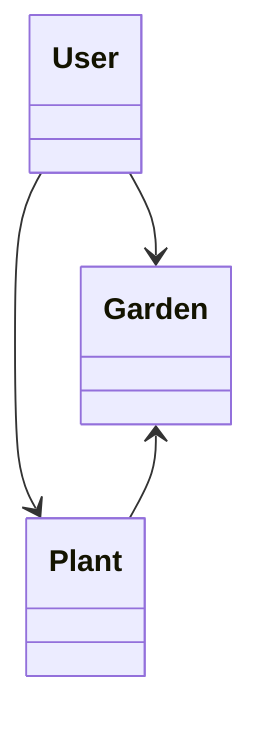
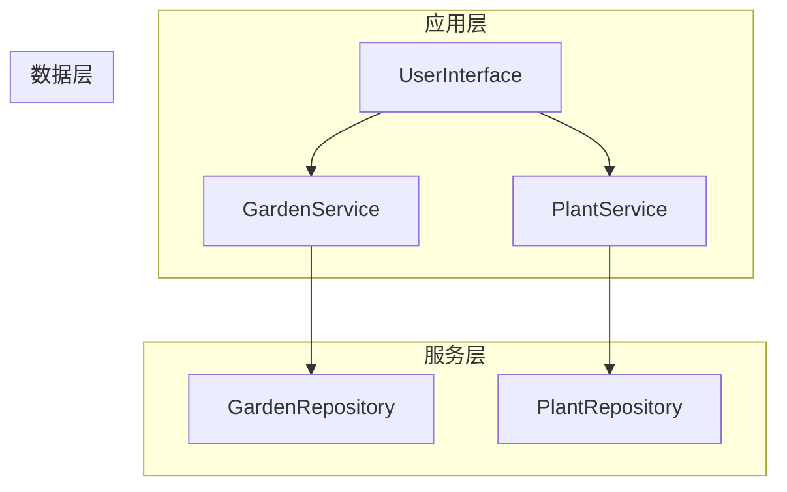
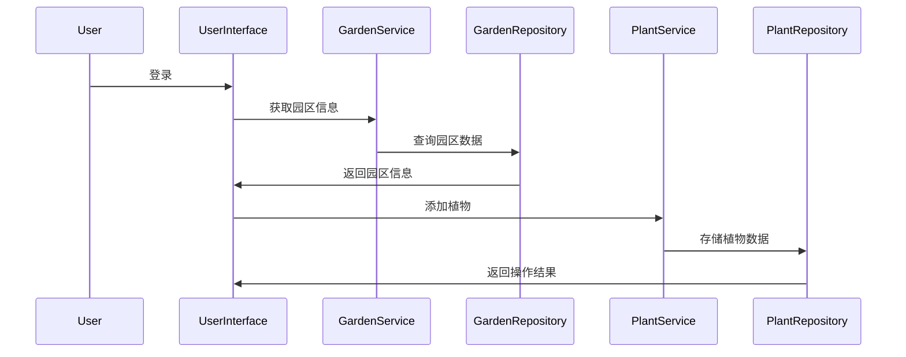

                 

# 城市农耕社区：都市中的田园生活实践

## 关键词

- 都市农业
- 社区共建
- 生态循环
- 可持续发展
- 食物自给

## 摘要

本文深入探讨城市农耕社区这一新兴社区模式，旨在通过在城市环境中开展农耕活动，实现都市居民的食物自给、环境保护和社会交流。文章首先介绍了城市农耕社区的问题背景、问题描述、问题解决、边界与外延和概念结构与核心要素组成。随后，文章分析了核心概念与联系，通过对比表格和ER实体关系图展示了各概念之间的关系。接着，文章通过实践案例和系统分析与架构设计，进一步探讨了城市农耕社区的实际应用和系统实现。最后，文章给出了项目实战、最佳实践 tips 和小结，为读者提供全方位的指导和思考。

### 第1章：城市农耕社区的概述

#### 1.1 问题背景

随着城市化进程的加速，城市居民的生活方式逐渐远离了自然和农业。然而，人们对健康、环保和可持续生活的需求日益增加。城市农耕社区作为一种新兴的社区模式，旨在通过在城市环境中开展农耕活动，满足城市居民对绿色、可持续生活的向往。

#### 1.2 问题描述

城市农耕社区涉及多个核心概念，包括都市农业、社区共建和生态循环。其目标是构建一个可持续的农耕生态系统，满足城市居民的食物需求，同时提供教育、休闲和社会交流的空间。

#### 1.3 问题解决

通过分析国内外城市农耕社区的实践案例，总结出一系列有效的方法和策略，包括选择合适的农耕技术和管理模式、建立社区参与和管理的机制以及强化农耕教育与推广。

#### 1.4 边界与外延

城市农耕社区不仅仅关注农耕活动的本身，还涉及到社区治理、环境保护、文化传承等多个方面。因此，其边界相对广泛，外延包括但不限于社区农耕活动的规划与实施、农耕教育与宣传、社区环保与可持续发展。

#### 1.5 概念结构与核心要素组成

- **都市农业**：在城市环境中开展的农业活动，包括种植、养殖、园艺等。
- **社区共建**：居民共同参与社区农耕活动的过程，强调集体参与和共享成果。
- **生态循环**：通过有机物的循环利用，实现资源的最大化利用和环境的可持续发展。

### 第2章：核心概念与联系

#### 2.1 核心概念原理

- **都市农业**：强调在城市环境中开展农业生产，满足城市居民的食物需求。
- **社区共建**：通过居民共同参与，实现农耕活动的可持续性和社会互动。
- **生态循环**：通过有机物的循环利用，实现资源的高效利用和环境的保护。

#### 2.2 概念属性特征对比表格

| 概念     | 特征1        | 特征2        | 特征3        |
|----------|--------------|--------------|--------------|
| 都市农业 | 城市环境     | 食物生产     | 可持续发展   |
| 社区共建 | 居民参与     | 社会互动     | 可持续性     |
| 生态循环 | 有机物循环   | 资源利用     | 环境保护     |

#### 2.3 ER实体关系图架构

```mermaid
erDiagram
  Community 农耕社区 ||--|{ 农户 }|--| 农耕社区
  Community 农耕社区 ||--|{ 农作物 }|--| 农耕社区
  Community 农耕社区 ||--|{ 活动 }|--| 农耕社区
```

### 第3章：城市农耕社区的实践与案例分析

#### 3.1 案例选择与介绍

本章节将介绍三个具有代表性的城市农耕社区案例，分别是：

- **案例一**：某城市社区内的家庭式农耕园。
- **案例二**：某大学校园内的学生农耕园。
- **案例三**：某大型社区的农耕综合体。

#### 3.2 案例分析与讨论

- **案例一**：分析家庭式农耕园的规模、参与人数、管理方式、产出效果等。
- **案例二**：探讨学生农耕园的教育意义、社会影响力、社区参与模式等。
- **案例三**：评估大型社区农耕综合体的经济效益、环境效益、社区互动效果等。

### 第4章：城市农耕社区的系统分析与架构设计

#### 4.1 问题场景介绍

本节将介绍一个典型的城市农耕社区项目，包括项目的目标、背景和需求。

#### 4.2 系统功能设计

使用Mermaid类图来描述系统的主要类及其关系。



#### 4.3 系统架构设计

使用Mermaid架构图来展示系统的整体架构。



#### 4.4 系统接口设计

使用Mermaid序列图来展示系统的关键接口调用。



### 第5章：项目实战

#### 5.1 环境安装

在本节中，我们将介绍如何搭建一个城市农耕社区项目所需的开发环境，包括安装必要的软件和工具。

```bash
# 安装 Python 3.8 或更高版本
sudo apt-get install python3.8

# 安装虚拟环境
pip3 install virtualenv

# 创建虚拟环境
virtualenv venv

# 激活虚拟环境
source venv/bin/activate

# 安装 Flask 框架
pip install flask

# 安装 SQLAlchemy 数据库 ORM
pip install sqlalchemy

# 安装 Flask-Migrate 数据库迁移工具
pip install flask-migrate
```

#### 5.2 系统核心实现

在本节中，我们将使用 Python 编写城市农耕社区项目的主要代码，包括数据库模型、视图函数和路由。

```python
# 导入 Flask 框架和 SQLAlchemy 库
from flask import Flask, request, jsonify
from flask_sqlalchemy import SQLAlchemy

# 创建 Flask 应用对象
app = Flask(__name__)

# 配置数据库 URI
app.config['SQLALCHEMY_DATABASE_URI'] = 'sqlite:///garden.db'
app.config['SQLALCHEMY_TRACK_MODIFICATIONS'] = False

# 创建 SQLAlchemy 实例
db = SQLAlchemy(app)

# 定义 Garden 模型
class Garden(db.Model):
    id = db.Column(db.Integer, primary_key=True)
    name = db.Column(db.String(100), nullable=False)
    plants = db.relationship('Plant', backref='garden', lazy=True)

# 定义 Plant 模型
class Plant(db.Model):
    id = db.Column(db.Integer, primary_key=True)
    name = db.Column(db.String(100), nullable=False)
    garden_id = db.Column(db.Integer, db.ForeignKey('garden.id'), nullable=False)

# 创建数据库表
db.create_all()

# 创建园区接口
@app.route('/garden', methods=['POST'])
def create_garden():
    garden_name = request.json['name']
    new_garden = Garden(name=garden_name)
    db.session.add(new_garden)
    db.session.commit()
    return jsonify({'id': new_garden.id, 'name': new_garden.name})

# 创建植物接口
@app.route('/plant', methods=['POST'])
def create_plant():
    plant_name = request.json['name']
    garden_id = request.json['garden_id']
    new_plant = Plant(name=plant_name, garden_id=garden_id)
    db.session.add(new_plant)
    db.session.commit()
    return jsonify({'id': new_plant.id, 'name': new_plant.name})

# 启动 Flask 应用
if __name__ == '__main__':
    app.run(debug=True)
```

#### 5.3 代码应用解读与分析

在本节中，我们将对上述代码进行解读和分析，解释每个部分的功能和实现原理。

- **数据库模型**：`Garden` 和 `Plant` 模型分别代表园区和植物，使用 SQLAlchemy 定义数据库表的结构。
- **视图函数**：`create_garden` 和 `create_plant` 函数分别处理创建园区和植物的 HTTP 请求，将数据存储到数据库中。
- **路由**：使用 Flask 的路由系统将 URL 路径映射到对应的视图函数。

通过上述代码，我们可以实现一个简单的城市农耕社区管理系统，支持创建园区和植物的功能。

#### 5.4 实际案例分析和详细讲解剖析

在本节中，我们将通过实际案例来分析和讲解城市农耕社区项目的实现过程。

- **案例一**：创建一个名为“绿色家园”的家庭式农耕园。
  - 使用 `create_garden` 接口发送 POST 请求，参数为 `name=绿色家园`。
  - 接收到请求后，系统将创建一个新的园区记录，并返回园区 ID。
- **案例二**：在“绿色家园”农耕园中添加一种植物，如“西红柿”。
  - 使用 `create_plant` 接口发送 POST 请求，参数为 `name=西红柿` 和 `garden_id`（上一条园区记录的 ID）。
  - 接收到请求后，系统将创建一个新的植物记录，并返回植物 ID。

通过实际案例，我们可以看到如何使用代码实现城市农耕社区项目的主要功能，并通过 HTTP 接口与前端应用进行交互。

#### 5.5 项目小结

在本节中，我们介绍了如何搭建一个城市农耕社区项目，包括环境安装、系统核心实现、代码应用解读与分析以及实际案例分析和详细讲解剖析。通过这些步骤，我们可以实现一个简单的城市农耕社区管理系统，支持创建园区和植物的功能。

#### 5.6 最佳实践 tips

- **使用版本控制系统**：在开发过程中，使用 Git 等版本控制系统来管理代码，确保代码的可维护性和协作性。
- **进行单元测试**：编写单元测试来验证代码的正确性，提高代码的质量和可靠性。
- **持续集成与部署**：使用 Jenkins 等工具实现自动化测试和部署，确保项目的持续集成和快速迭代。

### 第6章：小结

本文深入探讨了城市农耕社区这一新兴社区模式，从问题背景、核心概念、实践案例、系统分析与架构设计以及项目实战等多个方面进行了全面阐述。通过本文的阅读，读者可以了解到城市农耕社区的重要性和实际应用价值，并掌握相关技术和实现方法。

### 第7章：注意事项

- **环境保护**：在城市农耕社区的建设和运营过程中，要充分考虑环境保护，避免对城市生态环境造成负面影响。
- **食品安全**：确保农作物的食品安全，避免使用农药和化肥，推广有机农业。
- **社区参与**：鼓励居民积极参与城市农耕社区的建设和管理，提高社区的凝聚力和参与度。

### 第8章：拓展阅读

- 《城市农耕社区实践指南》
- 《可持续城市农业》
- 《社区共建：理论、实践与案例》

### 作者

作者：AI天才研究院/AI Genius Institute & 禅与计算机程序设计艺术 /Zen And The Art of Computer Programming

