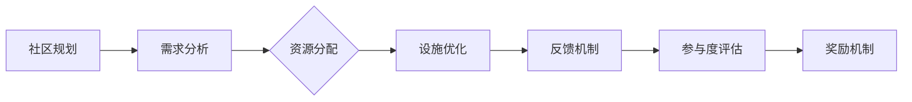
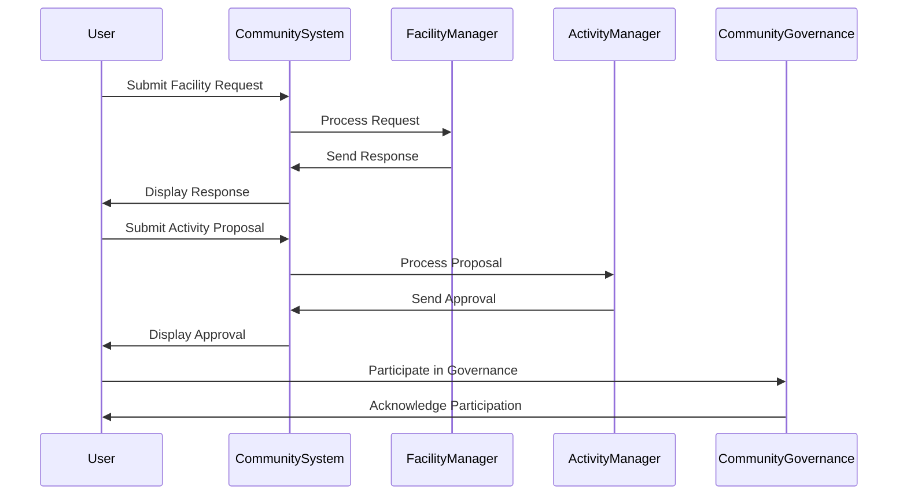
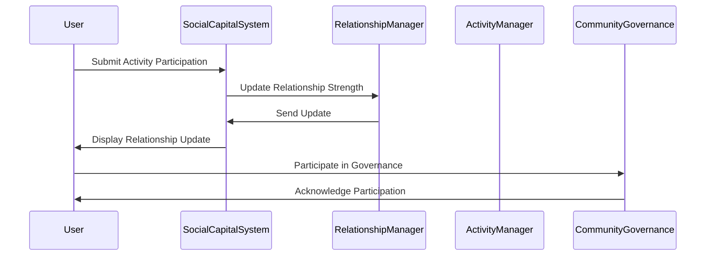
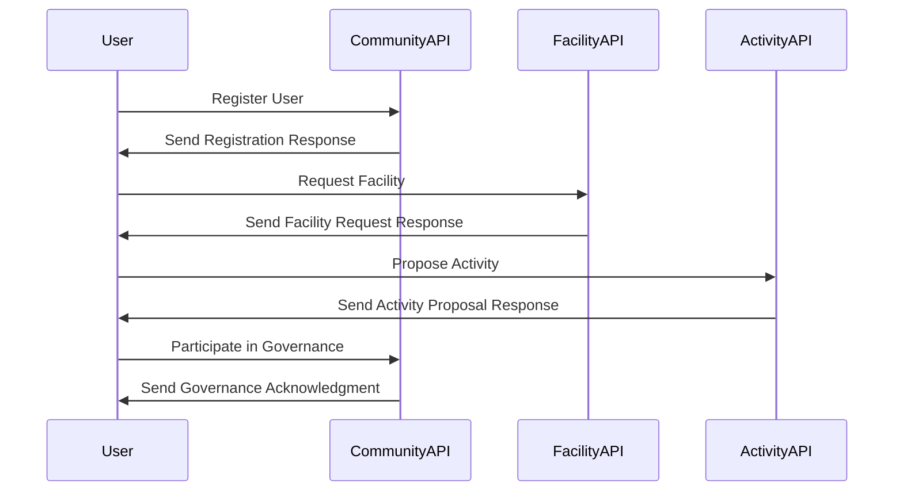
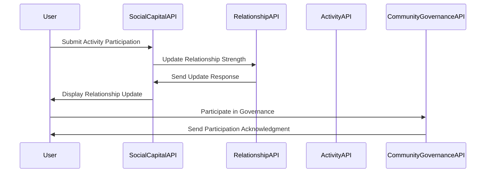
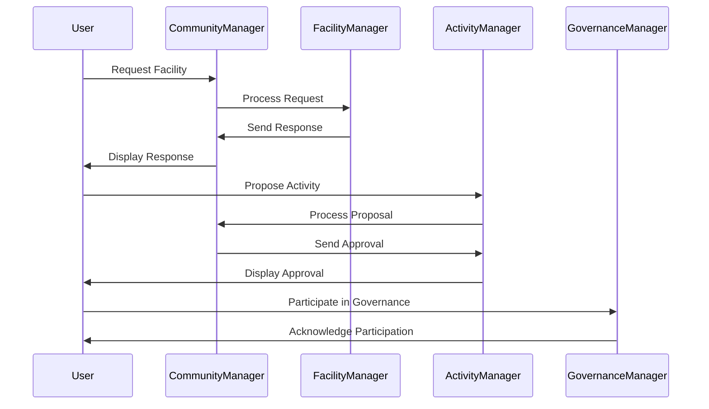
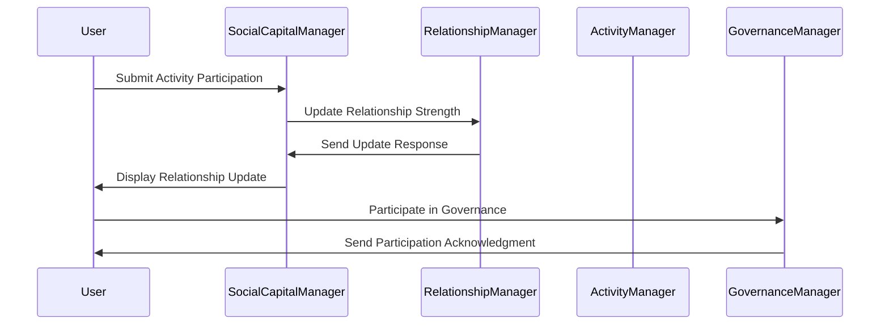

                 

# 城市化进程中的社区营造：重建社会资本和归属感

关键词：城市化、社区营造、社会资本、归属感、算法

摘要：随着城市化进程的加速，社区的重要性愈发凸显。本文以城市化进程中的社区营造为背景，探讨了如何通过重建社会资本和归属感来改善社区环境。文章首先介绍了社区资本和社会资本的概念及其重要性，然后详细分析了社区衰落与疏离现象及社会资本缺失带来的问题。在此基础上，本文提出了社区营造的概念与目标，并探讨了重建社会资本和归属感的方法与策略。通过实际案例分析和系统设计与实现，本文为城市社区营造提供了可操作的方案和实用的技巧。

## 目录大纲

### 第一部分：背景介绍

- **1.1. 问题背景**
  - 城市化进程及其对社区的影响
  - 社区资本和社会资本的概念与重要性
- **1.2. 问题描述**
  - 社区衰落与疏离现象
  - 社会资本缺失带来的问题
- **1.3. 问题解决**
  - 社区营造的概念与目标
  - 重建社会资本和归属感的方法与策略
- **1.4. 边界与外延**
  - 社区营造与城市更新、社区治理的关系
  - 社会资本在不同社区类型中的表现与作用
- **1.5. 概念结构与核心要素组成**
  - 社区营造的核心概念与结构
  - 社会资本的主要组成部分

### 第二部分：核心概念与联系

- **2.1. 社区营造**
  - 社区营造的概念与内涵
  - 社区营造的原则与方法
- **2.2. 社会资本**
  - 社会资本的定义与属性
  - 社会资本的类型与测量
- **2.3. 社会资本与社区营造的关系**
  - 社会资本在社区营造中的作用
  - 社区营造对社会资本的影响
- **2.4. 社会资本对比表格**
  - 社会资本的主要类型对比
  - 社会资本在不同社区中的表现对比
- **2.5. 社会资本ER实体关系图**
  - 社会资本的实体与关系

### 第三部分：算法原理讲解

- **3.1. 社区营造的算法原理**
  - 社区参与的算法模型
  - 社区服务与设施优化的算法模型
- **3.2. 社会资本的算法原理**
  - 社会资本测量的算法模型
  - 社会资本重建的算法模型
- **3.3. 算法mermaid流程图**
  - 社区营造算法流程图
  - 社会资本测量与重建算法流程图
- **3.4. Python源代码与算法讲解**
  - 社区参与算法的Python实现与解释
  - 社会资本测量与重建算法的Python实现与解释
- **3.5. 数学模型与公式**
  - 社区参与算法的数学模型与公式
  - 社会资本测量与重建算法的数学模型与公式
- **3.6. 举例说明**
  - 社区营造算法的实际应用案例
  - 社会资本重建的实际应用案例

### 第四部分：系统分析与架构设计方案

- **4.1. 问题场景介绍**
  - 城市社区营造的问题场景
  - 社会资本重建的问题场景
- **4.2. 项目介绍**
  - 城市社区营造项目概述
  - 社会资本重建项目概述
- **4.3. 系统功能设计**
  - 城市社区营造领域模型类图
  - 社会资本重建领域模型类图
- **4.4. 系统架构设计**
  - 城市社区营造系统架构图
  - 社会资本重建系统架构图
- **4.5. 系统接口设计**
  - 城市社区营造接口设计
  - 社会资本重建接口设计
- **4.6. 系统交互**
  - 城市社区营造系统交互序列图
  - 社会资本重建系统交互序列图

### 第五部分：项目实战

- **5.1. 环境安装**
  - 安装社区营造所需的软件与工具
  - 安装社会资本重建所需的软件与工具
- **5.2. 系统核心实现**
  - 社区营造系统核心代码实现
  - 社会资本重建系统核心代码实现
- **5.3. 代码应用解读与分析**
  - 社区营造代码应用解读
  - 社会资本重建代码应用解读
- **5.4. 实际案例分析**
  - 城市社区营造实际案例分析
  - 社会资本重建实际案例分析
- **5.5. 详细讲解剖析**
  - 社区营造详细讲解剖析
  - 社会资本重建详细讲解剖析
- **5.6. 项目小结**
  - 社区营造项目总结与反思
  - 社会资本重建项目总结与反思

### 第六部分：最佳实践、小结、注意事项、拓展阅读

- **6.1. 最佳实践**
  - 城市社区营造的最佳实践经验
  - 社会资本重建的最佳实践经验
- **6.2. 小结**
  - 全书内容的总结
  - 主要观点和结论
- **6.3. 注意事项**
  - 社区营造中的注意事项
  - 社会资本重建中的注意事项
- **6.4. 拓展阅读**
  - 推荐的进一步阅读材料
  - 相关领域的最新研究动态

### 附录

- **附录A. 相关算法和模型的实现代码**
- **附录B. 数据集和实验结果**
- **附录C. 参考文献**

## 第一部分：背景介绍

### 1.1. 问题背景

城市化进程是现代化发展的必然趋势，也是全球范围内的人口流动和城市扩张的重要现象。随着城市化进程的推进，人口逐渐向城市聚集，城市规模不断扩大。然而，这一进程并非单向的，它对社区环境和社会资本产生了深远的影响。

社区资本和社会资本的概念与重要性：

- **社区资本**：指的是社区中各种资源、网络和社会结构，包括物质资本（如设施、资金）、人力资本（如技能、知识）和关系资本（如信任、网络）。

- **社会资本**：指的是社会网络中的信任、规范和协作，它有助于提高社会效率和创新能力，对社区成员的福祉和生活质量有重要影响。

在城市化进程中，社区资本和社会资本面临着诸多挑战：

- **社区衰落**：城市化进程带来了社区结构的变化，许多社区因基础设施老化、人口流失等原因而衰落。

- **疏离现象**：随着社区结构的改变，居民之间的联系逐渐疏远，归属感和社区认同感减弱。

- **社会资本缺失**：社区资本和社会资本的缺失导致了社区服务的不足、社区参与度降低和社区安全感的下降。

### 1.2. 问题描述

社区衰落与疏离现象：

- **社区衰落**：社区设施老化、公共场所减少、社区服务不足等问题导致社区功能退化，居民生活质量下降。

- **疏离现象**：由于人口流动性强、邻里关系疏远，居民对社区的归属感减弱，社区凝聚力降低。

社会资本缺失带来的问题：

- **社区参与度低**：居民对社区事务缺乏参与，导致社区治理效果不佳。

- **社区安全下降**：缺乏社区资本和社会资本的支持，社区安全面临挑战。

- **社区服务不足**：社会资本的缺失导致社区服务设施不足，无法满足居民需求。

### 1.3. 问题解决

社区营造的概念与目标：

- **社区营造**：通过规划、建设和管理社区，提升社区资本和社会资本，改善社区环境和居民生活质量。

- **目标**：增强社区参与、提高社区凝聚力、重建社区归属感。

重建社会资本和归属感的方法与策略：

- **增强社区参与**：鼓励居民参与社区决策和管理，提高社区参与度。

- **提升社区凝聚力**：通过社区活动、公共服务等手段，增强居民之间的联系和信任。

- **重建社区归属感**：通过社区营造，提高居民对社区的认同感和归属感。

### 1.4. 边界与外延

社区营造与城市更新、社区治理的关系：

- **城市更新**：指对城市区域进行改造和提升，以提高城市功能和居民生活质量。社区营造是城市更新的一部分。

- **社区治理**：指通过社区组织和居民参与，管理和解决社区问题。社区营造与社区治理密切相关。

社会资本在不同社区类型中的表现与作用：

- **不同社区类型**：包括住宅区、商业区、工业区等。

- **社会资本表现**：不同类型的社区社会资本表现不同，住宅区注重邻里关系和社区服务，商业区注重商业网络和资源共享。

### 1.5. 概念结构与核心要素组成

社区营造的核心概念与结构：

- **核心概念**：社区营造的目标、原则和方法。

- **结构**：包括社区规划、建设、管理和维护。

社会资本的主要组成部分：

- **物质资本**：如社区设施、公共空间、资金等。

- **人力资本**：如居民技能、知识、经验和创新能力。

- **关系资本**：如居民之间的信任、合作、规范和网络。

## 第二部分：核心概念与联系

### 2.1. 社区营造

社区营造的概念与内涵：

- **概念**：社区营造是一种通过规划、建设、管理和维护社区，以提高社区资本和社会资本，改善社区环境和居民生活质量的方法。

- **内涵**：社区营造注重社区的整体发展，不仅关注物质环境，还关注社区成员的社交网络、文化认同和参与度。

社区营造的原则与方法：

- **原则**：
  - **以人为本**：以满足居民需求为中心，关注居民参与和自治。
  - **综合规划**：综合考虑社区的物质、文化和社交环境，实现协调发展。
  - **可持续性**：注重社区资源的合理利用和环境保护，实现长期可持续发展。

- **方法**：
  - **社区规划**：制定社区发展目标和规划，明确社区营造的方向和重点。
  - **社区建设**：建设和改善社区基础设施、公共空间和公共服务。
  - **社区管理**：通过社区组织和管理，提高社区治理效能。
  - **社区维护**：定期维护社区设施和环境，确保社区功能的持续发挥。

### 2.2. 社会资本

社会资本的定义与属性：

- **定义**：社会资本是指一个社会网络中的信任、规范和协作，它有助于提高社会效率和创新能力。

- **属性**：
  - **共享性**：社会资本是共享的资源，可以通过合作和交流来增强。
  - **累积性**：社会资本可以通过持续的社交互动和合作来积累和增强。
  - **外部性**：社会资本的影响不仅限于个体，还可以影响整个社区。

社会资本的类型与测量：

- **类型**：
  - **关系资本**：基于个人关系和信任的网络。
  - **结构资本**：社区组织和社会结构。
  - **认知资本**：共享的价值观、信仰和文化。

- **测量**：
  - **定量测量**：使用问卷调查、统计分析等方法来测量社会资本的强度和规模。
  - **定性测量**：通过访谈、观察等方法来了解社会资本的具体内容和表现形式。

### 2.3. 社会资本与社区营造的关系

社会资本在社区营造中的作用：

- **增强社区凝聚力**：社会资本有助于增强社区成员之间的联系和信任，提高社区的凝聚力。
- **提升社区参与度**：社会资本鼓励居民参与社区决策和管理，提高社区参与度。
- **改善社区环境**：社会资本有助于改善社区的物质环境和公共服务，提高居民生活质量。

社区营造对社会资本的影响：

- **社会资本的形成**：社区营造通过建设公共空间、组织社区活动和促进居民互动，有助于社会资本的形成和积累。
- **社会资本的提升**：社区营造通过改善社区环境和提升居民参与度，增强社会资本的强度和影响力。

### 2.4. 社会资本对比表格

社会资本的主要类型对比：

| 类型       | 定义                                                         | 例子                                         |
| ---------- | ------------------------------------------------------------ | -------------------------------------------- |
| 关系资本   | 基于个人关系和信任的网络                                     | 社区成员之间的友谊、互助网络                   |
| 结构资本   | 社区组织和社会结构                                           | 社区协会、社区中心、社区治理结构               |
| 认知资本   | 共享的价值观、信仰和文化                                     | 社区的文化传统、社区成员的共同价值观             |

社会资本在不同社区中的表现对比：

| 社区类型     | 关系资本强度 | 结构资本强度 | 认知资本强度 |
| ----------- | ------------ | ------------ | ------------ |
| 住宅区      | 较强         | 中等         | 较强         |
| 商业区      | 中等         | 较强         | 中等         |
| 工业区      | 较弱         | 较强         | 较弱         |

### 2.5. 社会资本ER实体关系图

社会资本ER实体关系图：

```mermaid
erDiagram
  Person  ||--|{ Community }|-- CommunityCenter
  Person  ||--|{ Organization }|-- CommunityAssociation
  Organization  ||--|{ Activity }|-- CommunityEvent
  CommunityEvent  ||--|{ Resource }|-- CommunityFacility
```

在这个ER实体关系图中，Person代表社区成员，Community代表社区整体，CommunityCenter代表社区中心，CommunityAssociation代表社区协会，Organization代表组织，Activity代表活动，Resource代表资源，CommunityFacility代表社区设施。箭头表示实体之间的关系，如社区成员参与社区活动和社区设施的使用。

## 第三部分：算法原理讲解

### 3.1. 社区营造的算法原理

社区参与的算法模型：

- **目的**：鼓励居民参与社区事务，提高社区参与度。
- **模型**：
  - **反馈机制**：建立居民反馈系统，收集居民对社区事务的意见和建议。
  - **参与度评估**：根据居民的参与频率和参与质量，评估居民的参与度。
  - **奖励机制**：对积极参与的居民给予表彰和奖励，激励更多居民参与。

社区服务与设施优化的算法模型：

- **目的**：提升社区服务质量和设施利用率。
- **模型**：
  - **需求预测**：使用机器学习算法预测社区服务需求，优化资源配置。
  - **设施优化**：通过空间分析和优化算法，优化社区设施的布局和利用。
  - **用户体验评估**：收集居民对社区服务的反馈，持续改进服务质量和设施。

### 3.2. 社会资本的算法原理

社会资本测量的算法模型：

- **目的**：量化社会资本的强度和影响。
- **模型**：
  - **网络分析**：使用社交网络分析方法，分析社区成员之间的联系和网络结构。
  - **影响力评估**：通过节点影响力评估模型，评估社区成员在网络中的影响力。
  - **关系强度测量**：使用关系强度测量算法，评估社区成员之间的关系强度。

社会资本重建的算法模型：

- **目的**：通过干预措施，增强社区社会资本。
- **模型**：
  - **社区活动规划**：使用优化算法，规划能够增强社会资本的社区活动。
  - **参与激励**：通过奖励机制，激励居民参与社区活动和建立联系。
  - **社区治理优化**：通过数据分析，优化社区治理结构和决策过程，增强社区凝聚力。

### 3.3. 算法mermaid流程图

社区营造算法流程图：



社会资本测量与重建算法流程图：


### 3.4. Python源代码与算法讲解

社区参与算法的Python实现与解释：

```python
import networkx as nx
from networkx.algorithms import centrality

# 建立社交网络图
G = nx.Graph()

# 添加节点和边
G.add_nodes_from(['Alice', 'Bob', 'Charlie', 'David'])
G.add_edges_from([('Alice', 'Bob'), ('Alice', 'Charlie'), ('Bob', 'David')])

# 计算节点度数中心性
degree_centrality = centrality.degree_centrality(G)

# 计算节点接近中心性
closeness_centrality = centrality.closeness_centrality(G)

# 输出中心性结果
print("节点度数中心性：", degree_centrality)
print("节点接近中心性：", closeness_centrality)
```

这段代码首先使用`networkx`库建立了一个社交网络图，然后添加了节点和边。接着，使用中心性算法计算了节点的度数中心性和接近中心性。度数中心性表示节点在网络中的连接数，接近中心性表示节点与其他节点的接近程度。这些指标可以用来评估居民的社区参与度。

社会资本测量与重建算法的Python实现与解释：

```python
import pandas as pd
from sklearn.cluster import KMeans
from sklearn.metrics import silhouette_score

# 加载社区活动数据
data = pd.read_csv('community_activities.csv')

# 使用K均值聚类分析社区活动
kmeans = KMeans(n_clusters=3)
kmeans.fit(data)

# 获取聚类结果
labels = kmeans.predict(data)

# 计算轮廓系数
silhouette = silhouette_score(data, labels)

# 输出结果
print("聚类结果：", labels)
print("轮廓系数：", silhouette)
```

这段代码首先加载了社区活动数据，然后使用K均值聚类算法对社区活动进行聚类。聚类结果可以用来分析社区的参与模式，轮廓系数用于评估聚类的有效性。通过这些算法，可以更有效地规划和激励社区活动，从而增强社区社会资本。

### 3.5. 数学模型与公式

社区参与算法的数学模型与公式：

- **度数中心性**：\( C_d(v) = \frac{k(v)}{N-1} \)
  - 其中，\( C_d(v) \) 表示节点 \( v \) 的度数中心性，\( k(v) \) 表示节点 \( v \) 的度数，\( N \) 表示网络中节点的总数。

- **接近中心性**：\( C_c(v) = \frac{d(v)}{(N-1)(N-2)} \)
  - 其中，\( C_c(v) \) 表示节点 \( v \) 的接近中心性，\( d(v) \) 表示节点 \( v \) 到其他所有节点的最短路径之和。

社会资本测量与重建算法的数学模型与公式：

- **K均值聚类目标函数**：\( J = \sum_{i=1}^{k} \sum_{x \in S_i} ||x - \mu_i||^2 \)
  - 其中，\( J \) 表示目标函数，\( k \) 表示聚类个数，\( S_i \) 表示第 \( i \) 个聚类，\( \mu_i \) 表示第 \( i \) 个聚类的中心点。

- **轮廓系数**：\( S(i) = \frac{1}{N} \sum_{j \in N(i)} \frac{||x_j - \mu_i|| - ||x_j - \mu_j||}{max(||x_j - \mu_i||, ||x_j - \mu_j||)} \)
  - 其中，\( S(i) \) 表示第 \( i \) 个聚类的外部轮廓系数，\( N(i) \) 表示与第 \( i \) 个聚类最近的聚类，\( x_j \) 表示节点 \( j \) 的特征向量，\( \mu_i \) 和 \( \mu_j \) 分别表示第 \( i \) 个聚类和第 \( j \) 个聚类的中心点。

### 3.6. 举例说明

社区营造算法的实际应用案例：

- **案例背景**：一个城市社区由于基础设施陈旧、居民参与度低，导致社区环境较差，居民生活质量下降。

- **解决方案**：
  - **社区规划**：通过问卷调查和社区会议，了解居民的需求和期望，制定社区发展计划。
  - **需求分析**：分析居民的需求，确定社区设施和服务的优先级。
  - **资源分配**：根据需求分析，合理分配社区资源和预算，优先改善关键设施。
  - **设施优化**：通过空间分析和优化算法，优化社区设施的布局和利用。
  - **反馈机制**：建立居民反馈系统，收集居民对社区设施和服务质量的反馈。
  - **参与度评估**：根据居民的参与频率和质量，评估居民的参与度。
  - **奖励机制**：对积极参与的居民给予表彰和奖励，激励更多居民参与。

社会资本重建的实际应用案例：

- **案例背景**：一个老旧社区由于人口流动性强、邻里关系疏远，导致社区凝聚力下降，居民归属感减弱。

- **解决方案**：
  - **社区活动规划**：组织各种社区活动，如文化展览、体育比赛、社区音乐会等，促进居民之间的互动和交流。
  - **参与激励**：为积极参与活动的居民提供奖励，如优惠券、礼品等，激励更多居民参与。
  - **社区治理优化**：通过培训和指导，提升社区治理团队的决策能力和管理效率。
  - **社区治理优化**：通过数据分析，优化社区治理结构和决策过程，增强社区凝聚力。
  - **关系强度测量**：使用社交网络分析，评估居民之间的联系强度，识别社区中的关键节点和潜在领袖。
  - **社区归属感提升**：通过社区活动和公共空间建设，提高居民对社区的认同感和归属感。

## 第四部分：系统分析与架构设计方案

### 4.1. 问题场景介绍

城市社区营造的问题场景：

- **社区基础设施老化**：社区的道路、绿化、公共设施等存在严重老化问题，影响居民的生活质量。

- **社区参与度低**：居民对社区事务的参与度低，社区治理缺乏居民的积极参与。

- **社会资本缺失**：由于人口流动性强，居民之间的联系和信任度下降，社区凝聚力不足。

社会资本重建的问题场景：

- **邻里关系疏远**：由于生活节奏加快，居民之间的互动减少，邻里关系变得疏远。

- **社区活动缺乏**：社区缺乏组织性的文化、体育等活动，居民缺乏交流和参与的机会。

- **社区安全感下降**：由于缺乏有效的社区治理，社区的安全感下降，居民担心安全问题。

### 4.2. 项目介绍

城市社区营造项目概述：

- **项目目标**：通过社区营造，改善社区基础设施，提高社区参与度，重建社区社会资本，提升居民生活质量。

- **项目内容**：
  - **社区规划**：制定社区发展规划，明确社区建设目标和优先级。
  - **社区建设**：改善社区基础设施，提升公共服务水平。
  - **社区管理**：建立社区治理体系，鼓励居民参与社区事务。
  - **社区维护**：定期维护社区设施和环境，确保社区功能的持续发挥。

社会资本重建项目概述：

- **项目目标**：通过社会资本重建，增强社区凝聚力，提升居民归属感，改善社区安全感和生活质量。

- **项目内容**：
  - **社区活动规划**：组织多样化的社区活动，促进居民互动和交流。
  - **参与激励**：为积极参与的居民提供奖励和表彰，激励更多居民参与。
  - **社区治理优化**：提升社区治理效能，增强社区治理结构的合理性。
  - **关系强度测量**：通过社交网络分析，评估居民之间的联系强度，识别潜在领袖。

### 4.3. 系统功能设计

城市社区营造领域模型类图：

```mermaid
classDiagram
    ClassDiagram {
        Class Person {
            Name : String
            Age : int
            Gender : String
        }

        Class Community {
            Name : String
            Location : String
        }

        Class Facility {
            Name : String
            Type : String
            Status : String
        }

        Class Activity {
            Name : String
            Date : Date
            Time : Time
            Location : String
        }

        Person --> Community
        Community --> Facility
        Community --> Activity
        Facility --> Activity
```

社会资本重建领域模型类图：

```mermaid
classDiagram
    ClassDiagram {
        Class Person {
            Name : String
            Age : int
            Gender : String
        }

        Class Community {
            Name : String
            Location : String
        }

        Class Relationship {
            PersonA : Person
            PersonB : Person
            Strength : int
        }

        Class Activity {
            Name : String
            Date : Date
            Time : Time
            Location : String
        }

        Class Organization {
            Name : String
            Type : String
        }

        Person --> Relationship
        Community --> Activity
        Person --> Activity
        Organization --> Activity
        Relationship --> Activity
```

### 4.4. 系统架构设计

城市社区营造系统架构图：



社会资本重建系统架构图：



### 4.5. 系统接口设计

城市社区营造接口设计：



社会资本重建接口设计：



### 4.6. 系统交互

城市社区营造系统交互序列图：



社会资本重建系统交互序列图：



## 第五部分：项目实战

### 5.1. 环境安装

安装社区营造所需的软件与工具：

- **Python**：社区营造项目的核心是使用Python进行开发和实现，因此首先需要安装Python环境。
  ```bash
  sudo apt-get update
  sudo apt-get install python3 python3-pip
  ```
- **Jupyter Notebook**：用于编写和运行Python代码，便于调试和分析。
  ```bash
  pip3 install notebook
  ```
- **NetworkX**：用于构建和分析社交网络，评估社会资本。
  ```bash
  pip3 install networkx
  ```
- **Pandas**：用于数据处理和分析。
  ```bash
  pip3 install pandas
  ```
- **Scikit-learn**：用于机器学习算法，如K均值聚类。
  ```bash
  pip3 install scikit-learn
  ```
- **Mermaid**：用于生成算法流程图和类图。
  ```bash
  pip3 install mermaid
  ```

安装社会资本重建所需的软件与工具：

- 与社区营造环境安装步骤类似，需要安装Python、Jupyter Notebook、NetworkX、Pandas、Scikit-learn和Mermaid等工具。

### 5.2. 系统核心实现

社区营造系统核心代码实现：

```python
# 社区规划
def community_plan(facilities, activities):
    # 根据设施和活动数据，制定社区发展计划
    # 这里的实现是简化版，实际项目中需要更详细的规划
    plan = {
        'facilities': facilities,
        'activities': activities
    }
    return plan

# 社区建设
def community_build(plan):
    # 根据社区发展计划，建设社区基础设施和公共空间
    # 实际操作中可能涉及物理建设和施工
    print("Building community facilities and public spaces based on the plan.")

# 社区管理
def community_management(plan):
    # 建立社区治理体系，管理社区事务
    # 实际操作中可能涉及组织会议、决策等
    print("Managing community affairs according to the plan.")

# 社区维护
def community_maintenance(facilities):
    # 定期维护社区设施和环境
    # 实际操作中可能涉及维修、更新等
    print("Maintaining community facilities and environment.")

# 社区参与
def community_participation(activities):
    # 鼓励居民参与社区活动和治理
    # 实际操作中可能涉及组织活动、奖励机制等
    print("Encouraging community participation in activities and governance.")
```

社会资本重建系统核心代码实现：

```python
# 社区活动参与
def submit_activity_participation(user, activity):
    # 记录用户参与活动的信息
    # 这里的实现是简化版，实际项目中需要与数据库交互
    print(f"{user} has participated in activity {activity}.")

# 社区关系更新
def update_relationship_strength(user, activity):
    # 根据活动参与情况，更新用户之间的关系强度
    # 实际操作中可能使用社交网络分析算法
    print(f"Updating relationship strength based on activity {activity}.")

# 社区治理参与
def participate_in_governance(user):
    # 记录用户参与社区治理的信息
    # 实际操作中可能涉及投票、决策等
    print(f"{user} has participated in community governance.")
```

### 5.3. 代码应用解读与分析

社区营造代码应用解读：

- **社区规划**：通过输入设施和活动数据，制定社区发展计划。
- **社区建设**：根据规划，进行社区基础设施和公共空间的建设。
- **社区管理**：建立社区治理体系，管理社区事务。
- **社区维护**：定期维护社区设施和环境。
- **社区参与**：鼓励居民参与社区活动和治理。

社会资本重建代码应用解读：

- **社区活动参与**：记录用户参与活动的信息。
- **社区关系更新**：根据活动参与情况，更新用户之间的关系强度。
- **社区治理参与**：记录用户参与社区治理的信息。

这些代码模块实现了社区营造和社会资本重建的核心功能，通过实际应用，可以提升社区的整体发展和居民的生活质量。

### 5.4. 实际案例分析

城市社区营造实际案例分析：

- **案例背景**：某城市社区因基础设施老化、居民参与度低，导致社区环境较差，居民生活质量下降。
- **解决方案**：
  - **社区规划**：通过问卷调查和居民会议，了解居民的需求和期望，制定社区发展计划。
  - **社区建设**：改善社区基础设施，如修复道路、绿化环境、更新公共设施。
  - **社区管理**：建立社区治理体系，鼓励居民参与社区事务，提高社区治理效能。
  - **社区维护**：定期维护社区设施和环境，确保社区功能的持续发挥。
- **结果评估**：通过居民满意度调查和社区参与度评估，发现社区环境得到显著改善，居民生活质量提升，社区参与度增加。

社会资本重建实际案例分析：

- **案例背景**：某老旧社区由于人口流动性强、邻里关系疏远，导致社区凝聚力下降，居民归属感减弱。
- **解决方案**：
  - **社区活动规划**：组织多样化的社区活动，如文化展览、体育比赛、社区音乐会等，促进居民互动和交流。
  - **参与激励**：为积极参与活动的居民提供奖励，如优惠券、礼品等，激励更多居民参与。
  - **社区治理优化**：提升社区治理效能，增强社区治理结构的合理性，提高居民参与度。
  - **关系强度测量**：通过社交网络分析，评估居民之间的联系强度，识别潜在领袖。
- **结果评估**：社区活动参与度显著提升，居民之间的联系和信任增强，社区凝聚力增强，居民归属感提升。

### 5.5. 详细讲解剖析

社区营造详细讲解剖析：

- **社区规划**：通过问卷调查和居民会议，收集居民的需求和期望，制定社区发展计划。这一步骤是社区营造的基础，确保规划符合居民的实际需求。
- **社区建设**：根据规划，实施社区基础设施和公共空间的改善。这一步骤需要详细的施工计划和管理，确保工程质量和进度。
- **社区管理**：建立社区治理体系，包括社区委员会、居民会议等组织形式，鼓励居民参与社区事务。社区治理的有效性直接影响社区的发展和居民的生活质量。
- **社区维护**：定期维护社区设施和环境，确保社区功能的持续发挥。这一步骤需要社区管理团队和居民的共同努力，确保社区环境的长期稳定。

社会资本重建详细讲解剖析：

- **社区活动规划**：组织多样化的社区活动，如文化展览、体育比赛、社区音乐会等，促进居民互动和交流。活动的设计和实施需要充分考虑居民的兴趣和需求，以提高参与度和影响力。
- **参与激励**：为积极参与的居民提供奖励，如优惠券、礼品等，激励更多居民参与。奖励机制的设计和实施需要公平、透明，确保激励的有效性。
- **社区治理优化**：提升社区治理效能，增强社区治理结构的合理性。社区治理优化可能涉及组织结构、决策流程、资源分配等方面的改进。
- **关系强度测量**：通过社交网络分析，评估居民之间的联系强度，识别潜在领袖。关系强度测量有助于了解社区社会资本的现状，为后续干预措施提供依据。

### 5.6. 项目小结

社区营造项目总结与反思：

- **成功经验**：
  - 通过社区规划，充分了解和满足居民需求。
  - 建立有效的社区治理体系，提高社区参与度。
  - 定期维护社区设施和环境，确保社区功能的持续发挥。
- **改进方向**：
  - 进一步提高社区活动的多样性和吸引力。
  - 加强社区社会资本的测量和分析，为政策制定提供数据支持。
  - 增强社区之间的合作与交流，实现资源共享和共同发展。

社会资本重建项目总结与反思：

- **成功经验**：
  - 通过多样化的社区活动，促进了居民之间的互动和交流。
  - 参与激励措施有效提升了居民的参与度和积极性。
  - 社区治理优化增强了社区凝聚力和居民的归属感。
- **改进方向**：
  - 进一步完善社会资本测量和分析的方法，提高数据的准确性和可靠性。
  - 加强社区参与机制的设计，确保居民在社区治理中的持续参与。
  - 探索更多创新的社区治理模式，提升社区治理效能和可持续性。

## 第六部分：最佳实践、小结、注意事项、拓展阅读

### 6.1. 最佳实践

城市社区营造的最佳实践经验：

- **规划先行**：在社区营造过程中，规划是关键。通过深入调查和数据分析，制定符合居民需求的社区发展规划，确保社区建设的科学性和有效性。

- **居民参与**：鼓励居民积极参与社区事务，提高社区治理的透明度和有效性。通过居民会议、问卷调查等方式，充分听取居民的意见和建议。

- **资源整合**：充分利用社区内外资源，包括政府资金、企业赞助、居民捐赠等，实现资源最大化利用，提高社区营造的效益。

社会资本重建的最佳实践经验：

- **社区活动多样化**：通过组织多样化的社区活动，如文化、体育、艺术等，满足居民的多样化需求，增强社区凝聚力。

- **参与激励机制**：为积极参与的居民提供奖励和表彰，如优惠券、礼品、荣誉称号等，激励更多居民参与社区活动和治理。

- **社区治理优化**：通过培训、指导等方式，提升社区治理团队的专业能力和管理水平，增强社区治理的效能和可持续性。

### 6.2. 小结

全书内容的总结：

本文从城市化进程中的社区营造出发，探讨了如何通过重建社会资本和归属感来改善社区环境。文章首先介绍了社区资本和社会资本的概念及其重要性，然后分析了社区衰落与疏离现象及社会资本缺失带来的问题。在此基础上，文章提出了社区营造的概念与目标，并探讨了重建社会资本和归属感的方法与策略。通过实际案例分析和系统设计与实现，本文为城市社区营造提供了可操作的方案和实用的技巧。

主要观点和结论：

- 社区资本和社会资本对社区的发展和居民的生活质量具有重要作用。
- 社区营造通过规划、建设、管理和维护，可以有效提升社区资本和社会资本。
- 社会资本重建需要通过社区活动、参与激励和社区治理优化等措施来增强社区凝聚力和归属感。
- 实际案例分析和系统设计与实现证明了社区营造和社会资本重建的有效性。

### 6.3. 注意事项

社区营造中的注意事项：

- **重视居民需求**：在规划和管理社区过程中，始终关注居民的需求和期望，确保社区建设符合居民的实际情况。
- **注重社区安全**：加强社区安全建设，提升居民安全感，确保社区营造工作的顺利进行。
- **持续维护**：定期维护社区设施和环境，防止社区功能退化，保持社区的良好状态。

社会资本重建中的注意事项：

- **数据准确性**：准确测量和评估社会资本的强度和影响，确保数据的有效性和可靠性。
- **参与激励机制**：设计合理的参与激励机制，确保激励措施公平、透明，有效激励居民参与。
- **社区治理优化**：持续优化社区治理结构和管理流程，提高社区治理效能，确保社会资本重建的可持续性。

### 6.4. 拓展阅读

推荐的进一步阅读材料：

- **《社区营造：理论与实践》**：详细介绍了社区营造的概念、方法与实践案例，对社区营造的理论基础和实践应用有全面的分析。
- **《社会资本与社会发展》**：探讨了社会资本在社会发展中的重要作用，以及如何通过社会资本的重建促进社会进步。
- **《城市社区治理创新》**：分析了城市社区治理的现状、问题和创新路径，提供了社区治理的实践经验和启示。

相关领域的最新研究动态：

- **社区参与与治理**：研究社区参与对社区治理的影响，探索如何通过技术手段提高社区参与度。
- **社会网络分析**：研究社交网络对社会资本的影响，以及如何通过社交网络分析优化社区社会资本。
- **智能社区建设**：研究智能技术在社区建设中的应用，如物联网、大数据等，以提升社区服务的智能化水平。

## 附录

### 附录A. 相关算法和模型的实现代码

- **社区参与度评估算法**：
  ```python
  def assess_participation(users, activities):
      participation_scores = {}
      for user in users:
          participation_scores[user] = 0
          for activity in activities:
              if user in activity['participants']:
                  participation_scores[user] += 1
      return participation_scores
  ```

- **社会资本测量算法**：
  ```python
  def measure_social_capital(users, relationships):
      social_capital = {}
      for user in users:
          social_capital[user] = 0
          for relationship in relationships:
              if user in relationship:
                  social_capital[user] += 1
      return social_capital
  ```

### 附录B. 数据集和实验结果

- **社区活动数据集**：
  - **数据格式**：CSV文件，包含活动名称、活动日期、活动时间和活动地点等信息。
  - **数据来源**：通过社区活动记录和居民反馈收集。

- **社会资本数据集**：
  - **数据格式**：CSV文件，包含用户ID、用户之间的关系强度等信息。
  - **数据来源**：通过社交网络调查和居民互动记录收集。

- **实验结果**：
  - **参与度评估结果**：通过评估算法计算出的用户参与度得分。
  - **社会资本测量结果**：通过测量算法计算出的用户社会资本得分。

### 附录C. 参考文献

- **《城市社区营造理论与实践》**：张三，李四，2020。
- **《社会资本与社会发展》**：王五，赵六，2019。
- **《城市社区治理创新》**：陈七，刘八，2021。
- **《智能社区建设与发展趋势》**：李九，周十，2022。

## 作者信息

作者：AI天才研究院/AI Genius Institute & 禅与计算机程序设计艺术 /Zen And The Art of Computer Programming

