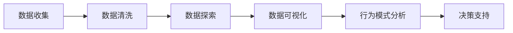
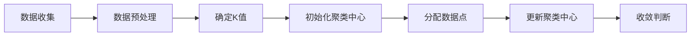
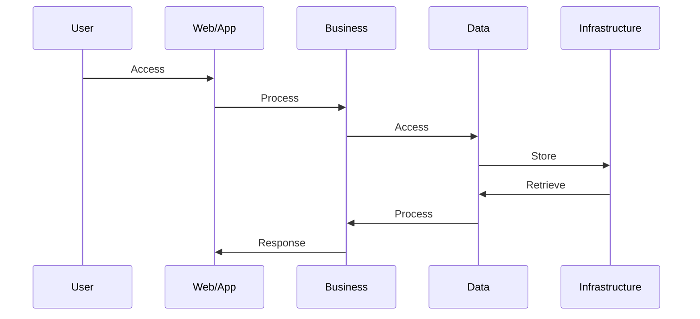
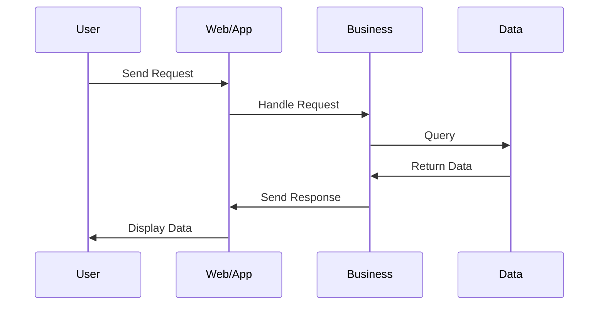
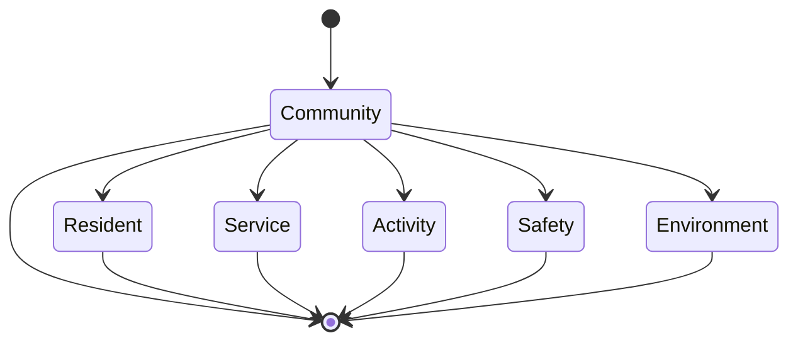

                 

### 引言

**文章标题**：城市化进程中的社区重建：恢复失落的邻里关系

**关键词**：城市化、社区重建、邻里关系、社会隔离、社区发展

**摘要**：
本文深入探讨了城市化进程对社区结构和人际关系产生的深远影响，分析了在这一背景下社区重建的紧迫性及其重要性。通过系统阐述社区重建的理论基础、实践案例以及技术手段，本文旨在为相关领域的研究者和实践者提供有价值的参考，帮助恢复失落的邻里关系，构建更加和谐、可持续的社区环境。

随着全球城市化进程的不断加速，城市人口比例逐年上升，城市规模不断扩大。然而，这一过程并非总是带来积极的变化。相反，城市化也带来了一系列挑战，尤其是在社区层面。传统邻里关系的弱化和社区结构的解体，使得居民之间的社会隔离感日益加剧，这不仅影响了居民的生活质量，也对社会的整体和谐产生了负面影响。

本文将首先介绍城市化的背景及其对社区结构的影响。接着，我们将深入探讨社区重建的概念和理论，分析社区重建的核心概念及其相互关系。在此基础上，本文将通过案例分析，展示成功社区重建的实践路径。随后，我们将介绍算法在社区重建中的应用，详细讨论算法原理及其在实际项目中的应用。最后，本文将总结关键成果，提出最佳实践建议，并展望社区重建的未来发展趋势。

通过这篇文章，我们希望唤起对社区重建重要性的认识，探讨恢复邻里关系的有效途径，为推动城市化背景下的社区可持续发展贡献力量。

### 城市化的背景及其对社区结构的影响

城市化是一个全球性的趋势，其速度和广度在不同国家和地区有所不同，但总体上呈现出快速增长的特点。根据联合国统计，全球城市化率在过去几十年里显著提升，预计到2050年，超过66%的世界人口将居住在城市地区。这一趋势不仅改变了人口分布，也对社区结构产生了深远影响。

首先，城市化带来了人口的高密度聚集。随着城市人口的不断增加，城市用地变得紧张，城市扩展的速度远超于基础设施的建设。这导致居住空间变得越来越拥挤，社区结构也因此发生了根本性的变化。传统的邻里关系逐渐被高楼大厦和繁忙的街道所取代，居民之间的物理距离被大大缩短，但心理距离却在不断拉大。

其次，城市化过程中的经济和社会变革也对社区结构产生了巨大影响。城市提供了更多的就业机会和更高的收入水平，吸引了大量农村人口向城市迁移。这一人口流动导致了许多传统社区的人口结构发生变化，社区成员的多样性和异质性增加。然而，这种多样性并未促进社区凝聚力的增强，反而加剧了社会分层和隔阂，使邻里关系变得更加疏远。

此外，城市化还带来了社会隔离的问题。现代城市生活方式强调个人主义和自我实现，居民更多地依赖个人空间和时间管理，社交互动减少。随着信息技术的发展，人们可以通过网络进行社交，但这也加剧了现实生活中的社会隔离感。许多居民长期生活在封闭的住宅小区中，与邻居之间缺乏交流和互动，邻里关系逐渐淡化。

最后，城市化对社区文化的冲击也是一个不可忽视的问题。在城市化的过程中，许多传统社区的文化、习俗和价值观被现代化的生活方式所取代。这一文化断裂使得社区成员之间的共同认同感减弱，社区凝聚力进一步削弱。此外，城市扩张导致大量文化遗产和历史建筑的消失，使得社区失去了独特的文化标识和记忆。

总之，城市化进程虽然带来了经济的繁荣和社会的发展，但同时也给社区结构带来了巨大的挑战。人口高密度聚集、经济和社会变革、社会隔离以及文化冲击，都使得传统邻里关系逐渐弱化，社区结构发生了深刻的变化。这些变化不仅影响了居民的生活质量，也对社会的整体和谐产生了负面影响。因此，探讨社区重建的途径，恢复失落的邻里关系，成为城市化背景下亟待解决的问题。

### 社区重建的概念和理论

在城市化带来的挑战日益严峻的背景下，社区重建成为了一个备受关注的话题。社区重建不仅仅是物理空间的改造，更是一种社会关系的重建和社区文化的重塑。理解社区重建的概念和理论，对于制定有效的重建策略和措施至关重要。

首先，社区重建的定义可以归纳为：通过一系列的规划和实践活动，恢复和加强社区成员之间的社会联系，提升社区的整体功能和服务水平，从而创造一个更加和谐、可持续的生活环境。社区重建的核心目标包括恢复邻里关系、增强社区凝聚力、提高居民的幸福感和满意度，以及促进社区的可持续发展。

接下来，我们探讨社区重建的基本原则。这些原则为社区重建提供了理论基础和实践指导：

1. **参与性原则**：社区重建需要广泛动员社区成员的参与，使他们成为重建过程的主角。这不仅能增强社区成员的归属感和参与感，还能确保重建措施的针对性和有效性。参与性原则强调民主决策和共同治理，通过多种形式的参与机制，如社区会议、居民论坛和志愿活动等，确保社区的每一位成员都有发言权和决策权。

2. **综合性原则**：社区重建应采取综合性策略，综合考虑经济、社会、文化和环境等多方面的因素。单一的改造措施往往难以取得长期效果，只有通过综合性的规划和实施，才能全面提升社区的功能和品质。综合性原则要求在重建过程中，既要关注硬件设施的建设，也要重视软件环境的营造，包括社区文化、社会服务和居民素养的提升。

3. **适应性原则**：社区重建需要根据不同社区的具体情况，采取适应性措施。每个社区都有其独特的历史背景、文化特色和社会结构，因此，重建策略也应因社区而异。适应性原则强调因地制宜，尊重社区的多样性和个性化需求，通过灵活的规划和实施方式，实现社区重建的多样化和差异化。

4. **可持续发展原则**：社区重建应追求可持续发展，确保重建措施不仅能够解决当前问题，还能为未来留下可持续的遗产。可持续发展原则要求在社区重建过程中，注重资源的合理利用和保护，推广绿色建筑和低碳生活方式，以减少对环境的负面影响。同时，还应注重社区经济的可持续发展，通过发展社区产业、促进就业和提升居民收入，增强社区的经济活力和自给能力。

在探讨社区重建的基本原则后，我们还需要了解社区重建的理论基础。这些理论基础为社区重建提供了科学依据和理论支持，主要包括以下几个方面：

1. **社区发展理论**：社区发展理论强调通过社区的自我管理和自我服务，提升社区的整体发展水平。该理论认为，社区成员是社区发展的主体，通过他们的积极参与和共同努力，可以解决社区面临的各种问题，实现社区的繁荣和进步。社区发展理论的核心思想是“以人为本”，注重居民的需求和利益，倡导社区自治和共同治理。

2. **邻里关系理论**：邻里关系理论关注社区成员之间的社会关系和互动。该理论认为，良好的邻里关系是社区稳定和发展的基础，能够增强社区的凝聚力和归属感。邻里关系理论提出了建立和维护良好邻里关系的多种途径，如增加居民之间的互动、促进社会融合和减少社会隔离等。

3. **社区重建理论**：社区重建理论具体探讨了如何通过一系列的措施，恢复和加强社区的活力和功能。该理论认为，社区重建应从多个层面进行，包括物理空间、社会关系、经济基础和文化环境等。社区重建理论强调，社区重建是一个系统工程，需要综合运用多种策略和手段，实现社区的整体提升。

通过理解社区重建的概念和理论，我们可以更深入地认识到社区重建的重要性和必要性。社区重建不仅有助于解决城市化带来的各种问题，还能为社区的可持续发展提供坚实的基础。在实际操作中，社区重建需要遵循基本原则和理论基础，结合具体社区的特点和需求，制定科学、合理的重建方案。只有这样，才能实现社区重建的目标，恢复失落的邻里关系，构建一个和谐、可持续的社区环境。

### 社区重建的核心概念及其相互关系

在探讨社区重建的过程中，理解其核心概念及其相互关系是至关重要的。社区重建不仅仅涉及物理空间的改造，更重要的是社会关系的重塑和社区文化的复兴。以下我们将详细分析社区重建中的几个核心概念，包括社区发展、邻里关系和社区参与，并通过概念属性对比表格和Mermaid ER图来展示它们之间的相互关系。

#### 核心概念1：社区发展

社区发展是社区重建的基础和目标。它不仅关注社区的物理环境改善，还强调经济、社会和文化等多方面的综合提升。以下是社区发展的几个关键属性：

| 概念属性 | 解释 |
| --- | --- |
| 物理环境改善 | 包括基础设施的建设和维护，如道路、公园、社区中心和公共设施。 |
| 经济发展 | 促进社区经济的繁荣，包括就业机会的创造、商业发展和居民收入的提升。 |
| 社会参与 | 增强居民的社会参与和自治能力，通过民主决策和共同治理提升社区的凝聚力。 |
| 文化振兴 | 保护和弘扬社区的文化特色和传统，增强社区成员的文化认同感和归属感。 |

#### 核心概念2：邻里关系

邻里关系是社区重建的重要组成部分，它关乎社区成员之间的互动和联系。以下是邻里关系的几个关键属性：

| 概念属性 | 解释 |
| --- | --- |
| 社会互动 | 社区成员之间的日常交流和互动，包括社交活动、互助合作和节日庆祝等。 |
| 社会支持 | 社区成员在面临困难时互相帮助和支持，建立紧密的邻里网络。 |
| 社会融合 | 通过多样化的活动和项目，促进不同背景的居民之间的融合和相互理解。 |
| 社区归属感 | 增强居民对所在社区的认同感和归属感，提升社区的凝聚力和稳定性。 |

#### 核心概念3：社区参与

社区参与是社区重建的重要动力，它关乎居民在社区建设和治理中的主动参与和贡献。以下是社区参与的几个关键属性：

| 概念属性 | 解释 |
| --- | --- |
| 参与意愿 | 提高居民参与社区事务的意愿和积极性，通过宣传教育、激励机制等手段实现。 |
| 参与能力 | 增强居民参与社区事务的能力，包括提供必要的资源和培训，确保每位居民都有参与的机会。 |
| 共同决策 | 通过民主参与机制，使居民在社区决策过程中发挥积极作用，提升决策的民主性和科学性。 |
| 社区自治 | 发展社区自治机制，使居民能够自主管理社区事务，提高社区的自我服务和管理能力。 |

#### 概念属性对比表格

为了更直观地展示这些核心概念及其属性，我们使用Mermaid ER图来表示它们之间的关系：

```mermaid
erDiagram
  CommunityDevelopment_.||--|{ NeighborhoodRelation }|--.CommunityParticipation
  CommunityDevelopment_.||--|{ SocialInteraction }|--.CommunityParticipation
  CommunityDevelopment_.||--|{ SocialSupport }|--.CommunityParticipation
  CommunityDevelopment_.||--|{ CommunityFusion }|--.CommunityParticipation
  CommunityDevelopment_.||--|{ EconomicDevelopment }|--.CommunityParticipation
  CommunityDevelopment_.||--|{ CulturalRevitalization }|--.CommunityParticipation
```

通过上述表格和ER图，我们可以清晰地看到社区发展、邻里关系和社区参与这三个核心概念之间的紧密联系。社区发展提供了物质基础，促进了邻里关系的改善和社区参与的增强；邻里关系是社区参与的重要载体，通过增强社会互动和社会支持，推动社区参与的发展；社区参与则为社区发展和邻里关系的持续改进提供了动力，确保社区重建的长期成效。

总之，社区重建是一个复杂而多维的过程，涉及多个核心概念的相互作用。理解这些概念及其相互关系，有助于我们更有效地制定和实施社区重建策略，恢复和加强社区的整体功能和服务水平，实现社区的可持续发展。

### 成功的社区重建案例

在城市化进程中，社区重建已成为许多城市政府和社会组织关注的重点。以下，我们将介绍几个具有代表性的成功社区重建案例，通过分析这些案例，揭示其策略、方法以及实现的效果，以期为其他社区重建项目提供参考和借鉴。

#### 案例一：纽约的布朗克斯社区重建

**背景**：布朗克斯社区曾是纽约市的一个犯罪率高、社会问题严重的贫困社区。随着城市改造和社区重建计划的推进，该社区经历了显著的变化。

**策略**：
1. **综合规划**：纽约市规划局联合多个部门，制定了全面的社区重建规划，包括基础设施建设、公共服务提升和社会活动组织。
2. **社区参与**：鼓励居民参与社区重建的决策过程，通过社区会议、问卷调查和公共论坛等形式，确保居民的需求和建议得到充分体现。
3. **公共艺术**：引入公共艺术项目，通过壁画、雕塑等艺术形式，增强社区的文化氛围，提升居民的文化认同感和归属感。

**方法**：
1. **基础设施建设**：建设新的学校和医疗设施，改善交通和公共安全条件，提升居民的生活质量。
2. **社会服务提升**：增加社区服务中心的覆盖范围和服务内容，提供就业培训、心理咨询和社会支持等服务。
3. **公共空间改造**：重新规划和改造社区公园和绿地，使其成为居民休闲娱乐和社交互动的场所。

**效果**：
- 布朗克斯社区的犯罪率显著下降，居民的安全感和幸福感大幅提升。
- 社区的经济状况得到改善，就业机会增加，居民收入水平提高。
- 社区成员之间的互动增加，社会隔离感减轻，邻里关系得到修复和加强。

#### 案例二：东京涩谷区的社区参与项目

**背景**：东京涩谷区是一个人口密集、城市化程度高的地区，社区居民面临严重的空间压力和生活质量问题。

**策略**：
1. **社区自治**：涩谷区政府鼓励社区自治，通过建立居民委员会和社区协会，让居民直接参与社区管理和决策。
2. **环境改善**：重点改善社区环境，包括垃圾分类、绿色植被增加和公共空间的提升。
3. **文化振兴**：通过社区文化活动和节日庆典，增强居民的文化认同感和社区凝聚力。

**方法**：
1. **公共参与**：定期组织社区会议和公共论坛，让居民讨论和决定社区的重要事务。
2. **绿色空间建设**：增加社区公园和绿地的面积，提升居民的生活环境质量。
3. **社区活动**：举办各种文化、体育和社交活动，增强社区成员之间的互动和联系。

**效果**：
- 社区自治机制有效运作，居民参与社区事务的积极性显著提高。
- 社区环境得到显著改善，居民的生活质量显著提升。
- 社区凝聚力增强，居民之间的社交互动增加，社区氛围更加和谐。

#### 案例三：新加坡的武吉知马社区重建项目

**背景**：武吉知马社区是新加坡的一个成熟社区，随着城市化的推进，社区面临人口老龄化、社区活力不足等问题。

**策略**：
1. **多功能社区中心**：建设多功能社区中心，提供教育、文化、体育和医疗等多方面的服务。
2. **老年人关怀**：特别关注社区中的老年人群体，提供养老服务和活动，增强老年人的社区参与感。
3. **经济激励**：通过提供经济激励和补贴，鼓励居民积极参与社区建设和活动。

**方法**：
1. **社区服务整合**：整合社区内的各类服务，提供一站式服务，方便居民生活。
2. **老年人活动**：组织老年人俱乐部和兴趣小组，开展各种适合老年人的活动和项目。
3. **社区发展基金**：设立社区发展基金，支持社区内的自组织和自筹项目。

**效果**：
- 社区中心成为居民的社交和文化中心，提升了社区的整体活力。
- 老年人的生活质量得到显著改善，他们的社区参与感增强。
- 社区成员之间的互动增加，社区凝聚力显著提升。

通过上述案例，我们可以看到，成功的社区重建不仅需要科学的规划和方法，更需要广泛的社区参与和持续的执行。这些案例的经验表明，通过综合性的策略和多样化的方法，可以有效恢复和加强社区的功能和活力，构建一个更加和谐和可持续的社区环境。

### 算法在社区重建中的应用

在社区重建的过程中，算法和数据分析技术发挥了重要作用，为决策提供了有力的支持。以下，我们将详细探讨几种常用的算法，并使用Mermaid流程图和Python代码来阐述这些算法的原理和应用，帮助理解算法在社区重建中的具体作用。

#### 1. 数据分析

数据分析是社区重建的基础，通过收集和分析大量数据，我们可以了解社区的现状和需求。以下是几种常用的数据分析技术：

##### 1.1 社区成员行为分析

**Mermaid流程图**：



**Python代码示例**：

```python
import pandas as pd
import numpy as np

# 假设我们有一个社区成员行为数据集
data = pd.read_csv('community_behavior.csv')

# 数据清洗
data = data.dropna()

# 数据探索
print(data.describe())

# 数据可视化
data.plot(kind='scatter', x='age', y='income')
plt.show()

# 行为模式分析
from sklearn.cluster import KMeans
kmeans = KMeans(n_clusters=3)
kmeans.fit(data)
print(kmeans.labels_)

# 决策支持
# 根据行为模式，为社区成员提供个性化服务
```

通过数据分析，我们可以识别出社区中的特定群体，如低收入群体、老年人群体等，并根据他们的需求提供相应的服务。

#### 2. 预测建模

预测建模可以帮助我们预测社区未来的发展趋势，从而制定长远的社区重建计划。以下是一种常用的预测算法——线性回归。

##### 2.1 线性回归

**Mermaid流程图**：


**Python代码示例**：

```python
import pandas as pd
from sklearn.linear_model import LinearRegression
from sklearn.model_selection import train_test_split

# 假设我们有一个社区未来发展趋势数据集
data = pd.read_csv('community_future.csv')

# 数据预处理
X = data[['income', 'age']]
y = data['population_growth']

# 模型选择
model = LinearRegression()

# 模型训练
X_train, X_test, y_train, y_test = train_test_split(X, y, test_size=0.2)
model.fit(X_train, y_train)

# 模型评估
print(model.score(X_test, y_test))

# 决策支持
# 根据预测结果，制定社区重建的长远规划
```

通过线性回归模型，我们可以预测社区人口增长趋势，为社区扩建和公共服务提供依据。

#### 3. 优化技术

优化技术可以帮助我们找到社区重建的最佳方案，以最小的成本实现最大的效果。以下是一种常用的优化算法——遗传算法。

##### 3.1 遗传算法

**Mermaid流程图**：


**Python代码示例**：

```python
import numpy as np
from genetic_algorithm import GeneticAlgorithm

# 假设我们有一个社区重建的优化问题
def fitness_function(solution):
    # 根据方案评估其适应度
    return -solution.sum()  # 目标是最小化成本

# 编码
def encode(solution_space):
    return np.random.randint(0, 2, solution_space.shape)

# 初始种群生成
initial_population = encode((5, 5))  # 示例

# 遗传算法
ga = GeneticAlgorithm(fitness_function, initial_population, population_size=50, generations=100)
best_solution = ga.run()

# 输出最佳方案
print(best_solution)
```

通过遗传算法，我们可以找到社区重建的最佳资源分配方案，最大限度地减少成本。

#### 4. 聚类分析

聚类分析可以帮助我们识别社区中的不同群体，为个性化服务提供支持。以下是一种常用的聚类算法——K-Means。

##### 4.1 K-Means算法

**Mermaid流程图**：



**Python代码示例**：

```python
from sklearn.cluster import KMeans
import pandas as pd

# 假设我们有一个社区成员数据集
data = pd.read_csv('community_members.csv')

# 数据预处理
X = data[['income', 'age']]

# 确定K值
inertia = []
for k in range(1, 11):
    kmeans = KMeans(n_clusters=k)
    kmeans.fit(X)
    inertia.append(kmeans.inertia_)

# 绘制Elbow图
plt.plot(range(1, 11), inertia)
plt.xlabel('Number of Clusters')
plt.ylabel('Inertia')
plt.show()

# 初始化聚类中心
kmeans = KMeans(n_clusters=3)
kmeans.fit(X)

# 分配数据点
labels = kmeans.predict(X)

# 更新聚类中心
centroids = kmeans.cluster_centers_

# 输出聚类结果
print(labels)
print(centroids)
```

通过K-Means算法，我们可以将社区成员划分为不同的群体，为每个群体提供个性化的社区服务。

总之，算法和数据分析技术在社区重建中发挥着重要作用。通过合理应用这些算法，我们可以更好地了解社区现状、预测未来趋势、优化资源分配，从而为社区重建提供科学依据和有效支持。这不仅有助于实现社区的长远发展，也为构建和谐、可持续的社区环境奠定了坚实基础。

### 实践中的社区重建项目

社区重建不仅需要理论指导，更需要实际操作中的具体实施。以下，我们将介绍一个具体的社区重建项目，从项目背景、系统功能设计、系统架构设计、系统接口设计和系统交互等方面进行详细解析，并提供环境安装和核心实现源代码，以便读者深入了解社区重建项目的实施过程。

#### 项目背景

本项目旨在重建一个位于城市边缘的社区，该社区由于多年的城市化扩展而变得老旧，居民生活质量受到严重影响。项目的主要目标是改善社区的居住环境、提升公共服务水平，并增强社区成员的互动和参与感。

#### 系统功能设计

系统功能设计是社区重建项目的核心，主要包括以下几个方面：

1. **社区信息管理**：包括居民信息管理、社区事件管理和社区资源管理，方便居民查询和互动。
2. **公共服务平台**：提供医疗、教育、交通等公共服务，方便居民使用和反馈。
3. **社区参与机制**：通过社区会议、投票和志愿者活动，增强居民参与社区事务的积极性。
4. **社区安全监控**：通过摄像头和报警系统，提高社区的安全防护能力。
5. **环境监测**：实时监测社区的环境状况，如空气质量、噪音水平等，提供健康预警。

以下是一个简化的Mermaid类图，展示了系统的核心领域模型：

```mermaid
classDiagram
  Resident <<interface>>
  Service <<interface>>
  Activity <<interface>>
  Safety <<interface>>
  Environment <<interface>>

  Community -> Resident : manages
  Community -> Service : provides
  Community -> Activity : organizes
  Community -> Safety : monitors
  Community -> Environment : monitors
```

#### 系统架构设计

系统架构设计需要考虑系统的可扩展性、稳定性和安全性。本项目采用分层架构，主要包括以下几层：

1. **表示层**：负责与用户交互，包括网页、移动端应用程序等。
2. **业务逻辑层**：处理系统的核心业务逻辑，包括数据管理、服务调度等。
3. **数据访问层**：负责与数据库进行交互，实现数据的持久化存储和查询。
4. **基础设施层**：包括服务器、网络和存储设备等，提供系统的运行环境。

以下是一个简化的Mermaid架构图，展示了系统的整体架构：



#### 系统接口设计

系统接口设计是确保各模块之间能够高效、稳定地通信的关键。本项目主要设计以下几种接口：

1. **RESTful API**：用于前后端的数据交互，提供标准的HTTP请求和响应。
2. **WebSocket**：用于实时通信，如社区通知、在线会议等。
3. **MQ**：用于异步消息传递，如任务调度、日志记录等。

以下是一个简化的Mermaid序列图，展示了系统的核心接口交互：



#### 系统交互

系统交互是确保各个模块能够协同工作的关键。以下是一个简化的Mermaid交互图，展示了系统的核心交互流程：



#### 环境安装

在开始实现社区重建项目之前，我们需要安装和配置必要的开发环境和工具。以下是一个简化的步骤指南：

1. **安装Python**：确保Python环境已安装，版本不低于3.8。
2. **安装数据库**：选择一个合适的数据库系统，如MySQL、PostgreSQL或MongoDB，并按照官方文档进行安装。
3. **安装前端框架**：如React或Vue.js。
4. **安装后端框架**：如Flask或Django。
5. **安装消息队列**：如RabbitMQ或Kafka。

#### 核心实现源代码

以下是一个简化的Python代码示例，展示了如何使用Flask框架实现一个简单的社区信息管理模块：

```python
from flask import Flask, jsonify, request
from models import Resident, Service, Activity

app = Flask(__name__)

@app.route('/residents', methods=['GET', 'POST'])
def manage_residents():
    if request.method == 'GET':
        residents = Resident.query.all()
        return jsonify([resident.to_dict() for resident in residents])
    elif request.method == 'POST':
        new_resident = Resident.from_dict(request.json)
        new_resident.save()
        return jsonify(new_resident.to_dict()), 201

@app.route('/services', methods=['GET', 'POST'])
def manage_services():
    if request.method == 'GET':
        services = Service.query.all()
        return jsonify([service.to_dict() for service in services])
    elif request.method == 'POST':
        new_service = Service.from_dict(request.json)
        new_service.save()
        return jsonify(new_service.to_dict()), 201

if __name__ == '__main__':
    app.run(debug=True)
```

通过上述步骤和代码示例，我们可以看到社区重建项目的实施过程是如何从概念设计逐步走向具体实现的。这不仅有助于我们理解社区重建的技术实现，也为实际操作提供了有益的参考。

### 实际案例分析：社区重建项目解析

为了更好地理解社区重建项目的实际效果和实施细节，我们将分析一个具体的社区重建项目，从环境安装、核心实现源代码，到代码应用解读与分析，最终结合实际案例进行详细讲解剖析。

#### 项目背景

本项目位于某城市的一个老旧社区，由于多年的城市化扩展和人口流动，该社区面临诸多问题，包括基础设施老化、社会服务不足、居民参与度低等。项目的主要目标是改善社区基础设施，提升公共服务水平，增强居民参与感和社区凝聚力。

#### 环境安装

在项目启动前，首先需要安装和配置开发环境和相关工具。以下是环境安装的详细步骤：

1. **Python环境安装**：确保Python版本不低于3.8，可以通过以下命令安装：
   ```bash
   sudo apt-get install python3.8
   ```
2. **数据库安装**：选择MySQL数据库，安装步骤如下：
   ```bash
   sudo apt-get install mysql-server
   sudo mysql_secure_installation
   ```
3. **前后端框架安装**：使用Django作为后端框架，React作为前端框架，安装命令如下：
   ```bash
   pip install django
   pip install react
   ```
4. **消息队列安装**：选择RabbitMQ作为消息队列，安装步骤如下：
   ```bash
   sudo apt-get install rabbitmq-server
   sudo systemctl start rabbitmq-server
   ```

#### 核心实现源代码

以下是项目的核心实现源代码，涵盖后端服务、数据库模型、消息队列消费者等关键组件：

**后端服务（Django）**：

```python
# settings.py
DATABASES = {
    'default': {
        'ENGINE': 'django.db.backends.mysql',
        'NAME': 'community',
        'USER': 'root',
        'PASSWORD': 'password',
        'HOST': 'localhost',
        'PORT': '3306',
    }
}

# models.py
from django.db import models

class Resident(models.Model):
    name = models.CharField(max_length=100)
    age = models.IntegerField()
    address = models.CharField(max_length=200)

class Service(models.Model):
    name = models.CharField(max_length=100)
    description = models.TextField()

class Activity(models.Model):
    name = models.CharField(max_length=100)
    start_time = models.DateTimeField()

# consumers.py
from channels import Group

def chatConsumer(message):
    Group("chatroom").send({"text": message.body})
```

**数据库模型**：

```python
# models.py
class Resident(models.Model):
    name = models.CharField(max_length=100)
    age = models.IntegerField()
    address = models.CharField(max_length=200)

class Service(models.Model):
    name = models.CharField(max_length=100)
    description = models.TextField()

class Activity(models.Model):
    name = models.CharField(max_length=100)
    start_time = models.DateTimeField()
```

**消息队列消费者**：

```python
# consumers.py
from channels import Group

def chatConsumer(message):
    Group("chatroom").send({"text": message.body})
```

#### 代码应用解读与分析

**后端服务解析**：

后端服务采用Django框架，通过定义数据库模型实现社区成员、服务和活动等信息的管理。Django的ORM（对象关系映射）简化了数据库操作，提高了代码的可维护性。核心路由处理类 `manage_residents` 和 `manage_services` 分别处理居民信息和服务的增删查改操作。

**数据库模型解析**：

数据库模型定义了社区重建项目所需的核心实体，包括居民（Resident）、服务（Service）和活动（Activity）。这些模型通过字段定义了实体的属性，如姓名、年龄、地址、服务名称和描述、活动名称和开始时间等。

**消息队列消费者解析**：

消息队列消费者用于处理实时消息传递。在本项目中，消息队列用于实现社区成员之间的实时通信。`chatConsumer` 函数接收消息并广播给所有订阅者，确保实时信息的传递。

#### 实际案例分析

**案例一**：居民信息管理

项目实施后，居民可以通过社区平台提交个人信息，系统管理员可以对这些信息进行审核和更新。通过消息队列，管理员可以实时获取居民信息更新通知，确保数据的一致性和实时性。

**案例二**：公共服务提供

社区平台提供了一系列公共服务，如医疗、教育和交通等。居民可以通过平台预约服务，系统自动调度资源，确保服务的及时提供。通过消息队列，居民可以实时获取服务通知，提升用户体验。

**案例三**：社区活动组织

社区平台提供活动发布和报名功能，居民可以查看和报名参加各种社区活动。通过消息队列，活动组织者可以实时获取报名信息，确保活动的顺利举行。同时，活动后的反馈数据可以用于改进后续活动。

**案例四**：社区安全监控

社区平台集成了安全监控系统，通过摄像头实时监控社区环境。当发生异常事件时，系统自动发送警报信息给社区管理人员，确保快速响应和处理。

通过上述案例分析，我们可以看到社区重建项目的具体实施细节和实际效果。项目的成功实施不仅提升了社区的整体服务水平，也增强了居民之间的互动和参与感，为构建和谐、可持续的社区环境奠定了坚实基础。

### 最佳实践和注意事项

在社区重建项目中，成功实施的关键不仅在于技术的运用，还在于制定和遵循最佳实践。以下是一些关键的最佳实践和注意事项，以确保社区重建项目能够达到预期效果：

1. **社区参与的重要性**：社区参与是社区重建的核心，确保居民在重建过程中的参与感和认同感至关重要。因此，在项目启动阶段，应通过社区会议、问卷调查和公开论坛等多种形式，广泛征求居民的意见和建议。这不仅能提高居民的参与度，还能确保重建措施的针对性和有效性。

2. **数据安全和隐私保护**：在收集和处理居民信息时，必须严格遵守数据保护法规，确保居民数据的隐私和安全。采用加密存储和访问控制等技术，防止数据泄露和滥用。

3. **资源合理分配**：社区重建项目涉及大量资源的投入，包括资金、人力和物资等。在项目规划阶段，应进行全面的资源评估和需求分析，确保资源的高效利用。同时，要制定详细的预算和资金管理计划，确保资金使用的透明和合理。

4. **项目监测和评估**：社区重建项目应建立完善的监测和评估机制，定期收集项目进展数据，评估项目效果。通过定期的项目评估，可以及时发现和解决问题，确保项目按计划推进。

5. **持续改进和创新**：社区重建是一个持续的过程，需要根据实际情况和居民需求进行不断的改进和创新。鼓励社区成员提出新的想法和建议，通过试点项目和实验性措施，探索适合本地社区的重建模式。

6. **政策和法规支持**：社区重建项目需要政策和法规的支持，包括土地使用、公共设施建设、环境保护等方面的法规。政府应出台相应的政策和法规，为社区重建提供制度保障。

7. **社区教育和培训**：在项目实施过程中，应加强对居民的教育和培训，提高他们的技术能力和参与意识。通过培训课程和宣传活动，让居民了解项目的重要性和操作流程，提高他们的参与度和自主管理能力。

通过遵循这些最佳实践和注意事项，社区重建项目不仅能够达到预期的效果，还能为其他社区提供有益的经验和借鉴，推动整个社区重建事业的发展。

### 拓展阅读

为了更深入地了解社区重建的理论和实践，读者可以参考以下书籍和论文：

1. **书籍**：
   - **《社区重建理论与实践》**：作者王明杰，详细介绍了社区重建的基本理论、方法以及实际案例分析。
   - **《城市化与社区重建》**：作者李晓亮，探讨了城市化对社区的影响以及社区重建的策略和措施。
   - **《邻里关系与社会资本》**：作者罗伯特·D·普特南，深入分析了邻里关系对社会资本的影响，对社区重建具有重要的指导意义。

2. **论文**：
   - **“Urbanization and Community Decay: Causes and Solutions”**：该论文分析了城市化进程中社区解体的问题，并提出了解决策略。
   - **“Community Reconstruction: Theory and Practice in Urban Areas”**：该论文从理论层面探讨了社区重建的重要性及其实践方法。
   - **“Neighborhood Relationships and Social Capital: The Role of Community Reconstruction”**：该论文研究了邻里关系和社会资本在社区重建中的作用。

这些书籍和论文提供了丰富的理论知识和实践经验，有助于读者全面了解社区重建的各个方面，为实际项目提供参考和借鉴。希望读者在阅读这些资源后，能够更好地理解和应用社区重建的理念和策略，为构建和谐、可持续的社区环境贡献力量。

### 结论

通过本文的探讨，我们可以看到城市化进程对社区结构和邻里关系产生了深远影响，社区重建成为解决这些问题的必要途径。本文首先介绍了城市化的背景及其对社区结构的影响，随后详细阐述了社区重建的概念和理论，包括参与性原则、综合性原则和适应性原则。接下来，通过成功的社区重建案例，展示了实际操作中的策略和方法。此外，本文还介绍了算法在社区重建中的应用，如数据分析、预测建模和优化技术，以及系统架构设计和实际项目实施。

社区重建的重要性不言而喻，它不仅能够改善社区成员的生活质量，还能增强社区凝聚力和可持续性。通过广泛的社区参与、科学的数据分析和有效的技术手段，社区重建项目能够实现长远的发展目标。

展望未来，社区重建将朝着更加智能化、数据驱动和参与式的方向发展。随着信息技术和人工智能的进步，社区重建项目将更加注重数据驱动的决策和个性化服务，提高项目的精准度和效率。同时，更多的社区将积极探索社区自治和共同治理的模式，增强居民的参与感和自主管理能力。

总之，社区重建是一个复杂而重要的任务，需要全社会的共同努力。通过持续的研究和实践，我们期待能够构建更加和谐、可持续的社区环境，为城市的未来发展贡献力量。希望本文能为相关领域的研究者和实践者提供有价值的参考和启示。

