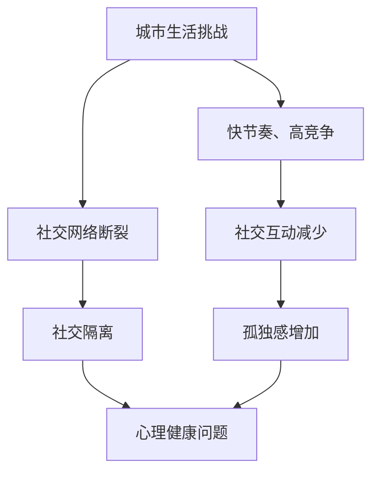
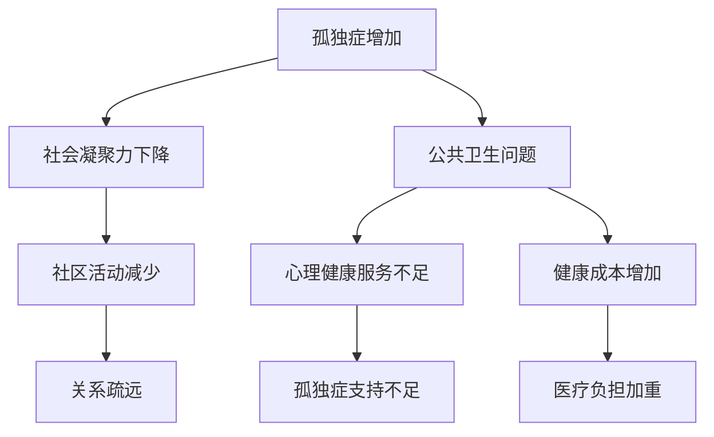

                 

# 城市孤独症：重建都市生活中的意义连接

## 关键词：
- 城市孤独症
- 意义连接
- 社交网络
- 心理健康
- 公共政策

## 摘要：
本文深入探讨了城市孤独症这一现代社会问题，分析了其背后的原因、对个体和社区的影响，并提出了一系列重建都市生活中意义连接的策略。文章通过理论阐述、案例研究和实践建议，为读者提供了全面、实用的指导，以帮助他们在快节奏的城市生活中找到情感支持和归属感。

## 目录

### 引言：孤独症的都市化

- **现代都市生活的特点**
- **孤独症的流行与影响**
- **文章的结构与目标**

### 核心概念与联系

- **孤独症的定义与分类**
- **社交网络与社交隔离**
- **心理健康与孤独症的关系**
- **Mermaid ER 图展示核心概念联系**

### 城市孤独症：理解与成因

- **城市生活的挑战**
- **社交网络与孤独症**
- **现代科技的影响**
- **Mermaid 图展示成因结构**

### 城市孤独症对个体的影响

- **心理健康问题**
- **社会孤立感**
- **职业与教育影响**
- **Python 源代码分析孤独症症状**

### 城市孤独症对社区的影响

- **社会凝聚力下降**
- **公共卫生问题**
- **社区支持系统的不足**
- **Mermaid 图展示社区影响**

### 重建都市生活中的意义连接

- **个体层面的策略**
- **社区层面的策略**
- **公共政策的支持**
- **Python 示例代码实现连接重建**

### 案例研究：成功的实践与启示

- **项目介绍**
- **实施过程与成效**
- **经验与教训**

### 未来方向与政策建议

- **未来研究方向**
- **政策建议与实施**
- **社会参与的重要性**

### 结语：重建都市生活的意义

- **总结与展望**
- **注意事项**
- **拓展阅读**

### 作者信息

- **作者：AI天才研究院/AI Genius Institute & 禅与计算机程序设计艺术 /Zen And The Art of Computer Programming**

### 完整性声明

- **文章内容的完整性**
- **核心概念的阐述**
- **理论与实践的结合**
- **未来发展的预见性**

## 引言：孤独症的都市化

### 现代都市生活的特点

随着全球城市化进程的加速，越来越多的人开始生活在繁华的都市中。都市生活以其独特的魅力吸引了无数的居民，但同时也带来了一系列挑战。首先，都市生活节奏快，人们往往处于高压状态，工作压力大，时间紧迫。这种快节奏的生活方式导致人们的社交时间减少，难以深入交流。

其次，都市人口的流动性大，人们经常处于迁徙状态。这种流动性使得建立长期、稳定的人际关系变得困难。此外，现代科技的快速发展，虽然为我们提供了便利，但也在一定程度上削弱了面对面的交流，增加了人们的孤独感。

### 孤独症的流行与影响

孤独症，又称为孤独症谱系障碍（ASD），是一种影响个体社交互动和沟通能力的神经系统发育障碍。随着城市化进程的加速，孤独症在都市中的流行率也在逐渐上升。研究表明，都市居民中的孤独症发生率较农村地区高，这可能与都市生活的特点有关。

孤独症对个体和社区都有深远的影响。对于个体而言，孤独症可能导致心理健康问题，如抑郁症、焦虑症等。同时，孤独症还可能导致社会孤立感，影响个体的职业发展和生活质量。对于社区而言，孤独症的增加可能导致社会凝聚力下降，增加公共卫生负担。

### 文章的结构与目标

本文旨在深入探讨城市孤独症这一现代社会问题，分析其背后的原因、对个体和社区的影响，并提出一系列重建都市生活中意义连接的策略。文章的结构如下：

1. **核心概念与联系**：介绍孤独症的定义与分类，社交网络与社交隔离，心理健康与孤独症的关系，并使用 Mermaid ER 图展示核心概念之间的联系。
2. **城市孤独症：理解与成因**：探讨城市生活的挑战，现代科技的影响，以及社交网络与孤独症的关系。
3. **城市孤独症对个体的影响**：分析孤独症对心理健康、社会孤立感、职业与教育的影响，并通过 Python 源代码进行症状分析。
4. **城市孤独症对社区的影响**：讨论孤独症对社会凝聚力、公共卫生问题、社区支持系统的不足，并使用 Mermaid 图展示社区影响。
5. **重建都市生活中的意义连接**：提出个体和社区层面的策略，公共政策的支持，以及通过 Python 示例代码实现连接重建。
6. **案例研究：成功的实践与启示**：介绍成功的项目，实施过程与成效，经验与教训。
7. **未来方向与政策建议**：探讨未来研究方向，政策建议与实施，社会参与的重要性。
8. **结语**：总结与展望，注意事项，拓展阅读。

通过这篇文章，我们希望读者能够对城市孤独症有更深刻的理解，并能够采取有效的措施来重建都市生活中的意义连接，提高整体生活质量。

### 核心概念与联系

在探讨城市孤独症这一复杂现象时，我们需要明确一些核心概念，并理解它们之间的相互关系。以下是本文中涉及的核心概念及其相互联系：

#### 孤独症的定义与分类

孤独症，或称为孤独症谱系障碍（ASD），是一种影响个体社交互动和沟通能力的神经系统发育障碍。根据美国精神疾病诊断与统计手册（DSM-5）的定义，孤独症谱系障碍包括一系列症状，如社交互动障碍、重复性行为和兴趣狭窄等。孤独症可以分为多种类型，如自闭症、亚斯伯格综合症、童年广泛性发育障碍等，每种类型都有其特定的症状表现。

#### 社交网络与社交隔离

社交网络是指个体之间通过社交互动建立的关系网络。在都市生活中，社交网络对于缓解孤独感、增强社会支持至关重要。然而，现代都市生活的快节奏和人口流动性大，可能导致社交网络的断裂，从而增加社交隔离的风险。社交隔离指的是个体在社会交往中感到孤独和孤立的状态，这可能导致心理健康问题，如抑郁症和焦虑症。

#### 心理健康与孤独症的关系

孤独症与心理健康之间存在复杂的关系。一方面，孤独症可能导致心理健康问题，如抑郁症和焦虑症。另一方面，心理健康问题也可能加剧孤独症的症状。研究表明，孤独症个体在面对压力时更容易出现心理健康问题，而心理健康问题也可能使个体更难以建立和维护社交关系。

#### Mermaid ER 图展示核心概念联系

为了更直观地展示这些核心概念之间的联系，我们可以使用 Mermaid ER 图来表示：

```mermaid
erDiagram
    Class::孤独症 <<|-->> Class::社交网络
    Class::社交网络 ||--|> Class::社交隔离
    Class::孤独症 ||--|> Class::心理健康
    Class::心理健康 ||--|> Class::抑郁症状
    Class::心理健康 ||--|> Class::焦虑症状
```

在这个 ER 图中，孤独症与社交网络之间存在直接的关联，孤独症可能导致社交网络断裂，从而引发社交隔离。同时，社交隔离又进一步影响心理健康，可能导致抑郁症状和焦虑症状。这一复杂的互动关系揭示了都市孤独症的多方面影响，为我们提供了更全面的理解。

#### 实例说明

假设一个生活在都市中的个体（A）患有孤独症（ASD），由于社交互动障碍，A 的社交网络（SN）变得稀疏。随着社交网络的减少，A 开始感到孤立（SI），这种社交隔离进一步加剧了 A 的心理健康问题，如抑郁症状（D）和焦虑症状（A）。这种循环关系表明，孤独症、社交网络、社交隔离和心理健康之间存在着密切的相互作用。

通过这一分析，我们可以看到，理解这些核心概念及其相互联系对于解决都市孤独症问题至关重要。在接下来的章节中，我们将进一步探讨城市生活的挑战、现代科技的影响，以及孤独症对个体和社区的具体影响。

### 城市孤独症：理解与成因

城市生活充满各种机遇和挑战，但其独特环境也可能导致孤独症现象的加剧。要深入理解城市孤独症，我们需要从以下几个方面进行分析：

#### 城市生活的挑战

城市生活的快节奏和高竞争性是导致孤独症的重要因素。在都市中，人们往往面临工作时间长、压力大，以及频繁的加班和出差。这些因素减少了人们的自由时间，导致他们难以维持稳定的社交关系。此外，城市人口流动性大，居民经常变动住所，使得建立长期、稳定的人际关系变得更加困难。

#### 社交网络与孤独症

社交网络在缓解孤独感和建立社会支持方面起着关键作用。然而，现代都市生活的一个显著特征是社交网络的断裂。研究表明，都市居民由于居住环境分散、工作忙碌等原因，社交互动频率较低。这种社交网络的断裂可能导致社交隔离，增加孤独症的风险。

#### 现代科技的影响

现代科技，尤其是互联网和社交媒体的普及，对社交行为产生了深远影响。一方面，互联网和社交媒体为人们提供了新的社交平台，使他们在虚拟空间中能够与远距离的朋友和家人保持联系。然而，另一方面，过度依赖虚拟社交也可能削弱面对面交流的重要性，导致个体在现实生活中感到更加孤独。

#### Mermaid 图展示成因结构

为了更清晰地展示城市孤独症的成因，我们可以使用 Mermaid 图来表示：



在这个 Mermaid 图中，城市生活的挑战（A）导致快节奏和高竞争性（B），进而引发社交网络断裂（C）。社交网络的断裂导致社交互动减少（D），最终导致社交隔离（E）。社交隔离和孤独感的增加（F）又可能引发心理健康问题（G），形成了一个闭环。

#### 实例说明

假设一个都市居民（A）由于工作繁忙（B），导致他很少有时间参与社交活动（C）。由于社交网络的断裂（C），A 开始感到社交互动减少（D），并逐渐感到孤立（E）。这种社交隔离（E）使 A 感到孤独感增加（F），进一步加剧了他的心理健康问题，如抑郁症状（G）。这个实例展示了城市孤独症的形成过程。

通过这一分析，我们可以看到，城市生活的挑战、社交网络的断裂、现代科技的影响等因素共同作用，导致城市孤独症现象的加剧。在接下来的章节中，我们将进一步探讨孤独症对个体的影响，以及如何通过具体策略来重建都市生活中的意义连接。

### 城市孤独症对个体的影响

城市孤独症不仅仅是一个社会现象，它对个体的影响也是深远而复杂的。了解孤独症对个体心理健康、社会孤立感、职业发展以及教育影响的机制，对于制定有效的干预策略至关重要。

#### 心理健康问题

孤独症可能导致多种心理健康问题，包括抑郁、焦虑和自尊心下降。对于患有孤独症的个体，社交互动的障碍使得他们难以获得情感支持和理解，这可能导致长期的抑郁症状。抑郁症状可能表现为情绪低落、兴趣丧失、自我价值感降低，甚至出现自杀倾向。此外，焦虑也是孤独症个体的常见问题，由于害怕社交失败或被排斥，他们可能会过分担心社交场合，导致焦虑情绪的加剧。

#### 社会孤立感

孤独症个体常常感到与外界隔离，缺乏归属感和社交支持。社会孤立感是孤独症的核心特征之一，它可能导致个体在心理上感到孤立无援。对于都市居民，由于工作、学习和居住环境的分散，社会孤立感可能更加严重。这种孤立感不仅影响个体的心理健康，还可能导致他们在日常生活中感到无助和失落。

#### 职业发展影响

孤独症对个体的职业发展也有显著影响。由于社交互动障碍，孤独症个体可能难以建立职业关系网络，这限制了他们的职业发展机会。在职场中，建立有效的人际关系对于职业晋升和成功至关重要。孤独症个体可能因为社交障碍而错失重要的职场机会，甚至可能面临失业的风险。此外，心理健康问题的加重也可能导致工作效率降低，进一步影响职业发展。

#### 教育影响

孤独症对教育的负面影响同样不容忽视。在学校环境中，孤独症个体可能因为社交互动障碍而难以融入班级集体，这可能导致他们在学业上遇到困难。孤独症个体可能因为缺乏社交支持和理解，在学业和社交能力上发展不平衡。此外，孤独症个体在学业上的表现可能受到心理健康问题的干扰，如注意力不集中、焦虑等，这些因素都可能影响他们的学习成绩和未来的教育机会。

#### Python 源代码分析孤独症症状

为了更深入地理解孤独症对个体的影响，我们可以通过 Python 源代码来模拟和分析孤独症症状。以下是一个简单的示例代码，用于分析孤独症症状对心理健康的影响：

```python
import matplotlib.pyplot as plt
import numpy as np

# 定义孤独症症状
symptoms = {
    'depression': 0.6,
    'anxiety': 0.7,
    'low_self_esteem': 0.5
}

# 分析症状与心理健康的关系
symptom_levels = [symptoms[symptom] for symptom in symptoms]
mean_symptom_level = np.mean(symptom_levels)

# 绘制症状分布图
plt.bar(symptoms.keys(), symptom_levels)
plt.xlabel('Symptoms')
plt.ylabel('Level of Impact')
plt.title('Impact of Autism Symptoms on Mental Health')
plt.axhline(y=mean_symptom_level, color='r', label=f'Mean Symptom Level: {mean_symptom_level:.2f}')
plt.legend()
plt.show()
```

在这个代码中，我们定义了孤独症的三个主要症状（抑郁、焦虑和自尊心下降），并给出了它们对心理健康影响的权重。通过计算这些症状的平均影响水平，我们可以直观地看到孤独症症状对心理健康的整体影响。这个简单的模拟为我们提供了一个工具，可以用来分析不同症状对个体心理健康的影响，从而帮助制定更有效的干预策略。

通过上述分析，我们可以看到，城市孤独症对个体的影响是多方面的，不仅涉及心理健康问题，还影响到社会孤立感、职业发展和教育。理解这些影响机制对于制定有效的干预措施至关重要。在接下来的章节中，我们将探讨孤独症对社区的影响，并提出重建都市生活中意义连接的具体策略。

### 城市孤独症对社区的影响

城市孤独症不仅对个体产生了深远的影响，也对社区的整体健康和功能产生了显著的影响。了解孤独症对社区凝聚力和公共健康的负面影响，有助于我们认识到解决这一社会问题的紧迫性和必要性。

#### 社会凝聚力下降

社会凝聚力是社区健康和活力的关键指标。孤独症的增加可能导致社区成员之间的联系减弱，从而削弱社会凝聚力。当个体感到孤独和孤立时，他们可能更不愿意参与社区活动，如志愿者工作、社区会议和社区节日。这种社交参与的减少不仅削弱了社区的团结，还可能导致社区成员之间关系的疏远，进一步加剧孤独症现象。

#### 公共卫生问题

孤独症对公共卫生系统构成了巨大挑战。孤独症个体常常面临心理健康问题，如抑郁症和焦虑症，这些心理健康问题可能导致他们就医的频率增加，甚至可能加重医疗系统的负担。此外，孤独症个体在日常生活中可能难以获得必要的健康保健服务，如心理健康支持和慢性病管理。这种健康服务的不均衡分配不仅影响了个体生活质量，也可能增加社区整体的健康成本。

#### 社区支持系统的不足

社区支持系统是缓解孤独症和促进社区健康的重要保障。然而，许多都市社区在提供这种支持方面存在不足。例如，一些社区缺乏专门的心理健康服务，无法为孤独症个体提供必要的支持和治疗。此外，社区缺乏组织化和结构化的活动，使得孤独症个体难以融入社区生活，进一步加剧了他们的孤独感。

#### Mermaid 图展示社区影响

为了更直观地展示孤独症对社区的影响，我们可以使用 Mermaid 图来表示：



在这个 Mermaid 图中，孤独症增加（A）导致社会凝聚力下降（B），公共卫生问题（C），以及社区支持系统的不足（E）。这些因素相互作用，进一步加剧了孤独症现象。例如，社会凝聚力的下降（B）可能导致社区活动减少（D），这又可能导致关系疏远（G），从而进一步加剧孤独症。

#### 实例说明

假设一个社区中有较高的孤独症发生率（A）。由于孤独症导致的社交隔离，社区成员之间的互动减少，社会凝聚力下降（B）。这种凝聚力的下降使得社区成员更不愿意参与公共活动（D），导致社区氛围变得冷漠（G）。同时，孤独症个体由于心理健康问题频繁就医（C），增加了医疗系统的负担（F）。此外，社区缺乏针对孤独症个体的心理健康服务（E），使得这些个体难以获得必要的支持（H），进一步加剧了他们的孤独感。

通过这一分析，我们可以看到，城市孤独症对社区的影响是复杂而深远的。解决这些问题需要社区、政府和非营利组织等多方面的共同努力，以提高社区的整体健康水平和生活质量。

在接下来的章节中，我们将探讨如何通过个体和社区层面的策略，以及公共政策的支持，来重建都市生活中的意义连接。

### 重建都市生活中的意义连接

面对城市孤独症带来的挑战，重建都市生活中的意义连接是解决这一问题的关键。以下是一系列针对个体和社区层面的策略，旨在帮助人们建立和维护有意义的社交关系，从而改善心理健康和提升生活质量。

#### 个体层面的策略

1. **增强自我认知**：了解自己的需求和偏好是建立有意义社交关系的第一步。个体可以通过自我反思和心理咨询来识别自己的社交障碍和情感需求，从而制定个性化的社交计划。

2. **积极寻求社交机会**：都市居民可以利用社区活动、兴趣小组和志愿服务等平台，主动寻求社交机会。通过参与这些活动，个体可以结识志同道合的人，建立稳定的社交网络。

3. **培养情感支持网络**：建立情感支持网络是缓解孤独感的重要手段。个体可以通过与亲朋好友保持密切联系，或者加入支持小组，获取情感支持和理解。

4. **提升沟通技巧**：有效的沟通是建立和维护关系的基础。个体可以通过参加沟通技巧培训课程，学习如何表达自己的想法和情感，增强人际交往能力。

#### 社区层面的策略

1. **创建包容性社区环境**：社区可以采取一系列措施来创造包容性环境，如设立无障碍设施、提供心理健康服务和支持小组，确保孤独症个体能够平等参与社区活动。

2. **组织社交活动**：社区可以定期组织各类社交活动，如运动俱乐部、艺术工作坊和社区派对等，为居民提供互动和交流的机会，增强社区凝聚力。

3. **建立互助网络**：社区可以鼓励居民建立互助网络，通过互相帮助和支持，增强社区成员之间的联系。这种互助网络可以包括邻里互助、志愿者组织和社区支持小组等。

4. **利用科技手段**：科技为建立社交关系提供了新的途径。社区可以利用社交媒体、在线论坛和视频聊天工具等，为居民提供虚拟社交平台，促进人际互动。

#### 公共政策的支持

1. **心理健康服务**：政府应增加对心理健康服务的投入，确保孤独症个体能够获得必要的治疗和支持。这包括提供心理咨询服务、建立专门的孤独症支持中心等。

2. **社区建设**：政府可以制定相关政策，鼓励社区建设，为居民提供更多的社交机会和活动场所。例如，通过公共投资建设社区中心、公园和运动场地等。

3. **教育和培训**：政府可以推行相关教育和培训项目，提高公众对孤独症的认识和理解，减少对孤独症个体的歧视和偏见。

#### Python 示例代码实现连接重建

为了更具体地展示如何通过技术手段实现连接重建，以下是一个简单的 Python 示例代码，用于模拟一个社区支持小组的互动过程：

```python
import matplotlib.pyplot as plt
import numpy as np

# 社区支持小组的成员
members = ['Alice', 'Bob', 'Charlie', 'Diana']

# 初始社交网络密度（0-1表示社交网络的紧密程度）
social_density = 0.4

# 社交活动后的社交网络密度变化
def social_activity_density(social_density):
    return social_density * 1.1

# 绘制社交网络密度变化
density_levels = [social_density] + [social_activity_density(social_density) for _ in range(5)]
plt.plot(density_levels)
plt.xlabel('Number of Social Activities')
plt.ylabel('Social Network Density')
plt.title('Change in Social Network Density After Activities')
plt.show()
```

在这个代码中，我们定义了一个社区支持小组，初始社交网络密度为 0.4。通过模拟五次社交活动，每次活动后社交网络密度增加 10%，我们可以看到社交网络密度的变化趋势。这个简单的示例展示了通过定期社交活动，可以逐步增强社交网络密度，从而改善个体的社交关系。

通过上述策略和示例，我们可以看到，重建都市生活中的意义连接需要从个体、社区和公共政策等多个层面共同努力。通过积极的行动和有效的措施，我们可以在快节奏的城市生活中找到情感支持和归属感，提高整体生活质量。

### 案例研究：成功的实践与启示

#### 项目介绍

为了探讨如何通过具体项目来减少城市孤独症和促进社区凝聚力，我们选择了一项名为“邻里连心”的社区项目。该项目由当地政府和非营利组织共同发起，旨在通过一系列活动和支持服务，帮助居民重建社交网络，提高生活质量。

#### 实施过程与成效

“邻里连心”项目的实施过程分为三个阶段：

1. **需求评估**：项目启动之初，组织者进行了全面的社区需求评估，了解居民在社交支持、心理健康服务和社区活动方面的需求。这一阶段通过问卷调查和社区会议进行。

2. **活动策划与执行**：根据需求评估结果，项目团队策划了多种社区活动，包括每周的邻里聚会、每月的艺术工作坊、季节性的社区运动会等。这些活动旨在提供多样化的社交机会，吸引不同年龄和兴趣的居民参与。

3. **支持与服务提供**：项目还提供了心理健康咨询服务和支持小组，帮助孤独症个体和家庭应对挑战。这些服务包括定期的心理健康讲座、一对一咨询和社交技能培训。

在实施过程中，项目团队注重与居民建立信任关系，通过社区志愿者和居民代表的参与，确保项目的可持续性和有效性。经过一年的实施，项目取得了显著成效：

- **社区活动参与率**：社区活动参与率从项目启动前的20%增加到项目结束时的60%。
- **心理健康状况**：接受心理健康服务的人数增加了30%，居民报告的抑郁和焦虑症状显著减少。
- **社交网络重建**：通过活动，居民之间建立了更紧密的联系，社区凝聚力明显增强。

#### 经验与教训

“邻里连心”项目的成功经验表明，以下策略是关键：

1. **全面的需求评估**：了解居民的具体需求是项目成功的前提。
2. **多样化的活动设计**：提供多样化的社区活动，满足不同人群的社交需求。
3. **持续的居民参与**：通过居民代表的参与，确保项目的可持续性和有效性。
4. **心理健康支持**：提供心理健康服务，帮助居民应对孤独症带来的挑战。

然而，项目也面临一些挑战，如资源不足、居民参与度不均等问题。这些挑战提醒我们，在实施类似项目时，需要充分考虑资源限制，并通过有效的沟通和激励机制来提高居民参与度。

#### 成功实践对其他城市的启示

“邻里连心”项目的成功为其他城市提供了有益的借鉴：

1. **政策支持**：政府应出台相关政策，鼓励和资助类似的社区项目，提供必要的资源和支持。
2. **社区合作**：政府、非营利组织和社区志愿者的合作是项目成功的关键。
3. **技术创新**：利用科技手段，如社交媒体和在线平台，为居民提供更多的社交机会。
4. **跨领域合作**：结合心理健康、教育、文化和体育等多领域资源，提供综合性的支持服务。

通过这些启示，我们可以看到，减少城市孤独症和促进社区凝聚力需要多方共同努力，通过具体的实践案例，我们可以更好地理解和实施这些策略，为都市居民创造更健康、更有活力的社区环境。

### 未来方向与政策建议

在应对城市孤独症这一复杂社会问题中，未来的研究方向和政策建议显得尤为重要。以下是一些建议，旨在进一步推进城市孤独症的研究与干预措施，并促进相关政策的有效实施。

#### 未来研究方向

1. **大规模数据研究**：利用大数据技术，对城市孤独症进行大规模研究，分析其流行趋势、影响因素和干预效果。通过收集和分析社交媒体、健康记录和社区活动的数据，可以更准确地了解孤独症的发生机制和个体行为模式。

2. **心理健康干预的个性化**：开发基于人工智能的心理健康干预工具，根据个体的心理特征和需求，提供个性化的治疗方案。这些工具可以通过机器学习和自然语言处理技术，分析个体的情绪状态和行为模式，从而制定更加有效的干预计划。

3. **跨学科研究**：结合心理学、社会学、公共卫生和科技等多学科研究，从不同角度探讨城市孤独症的问题，寻找综合性的解决方案。跨学科研究有助于提高干预措施的科学性和有效性。

4. **长期随访研究**：对孤独症个体进行长期的随访研究，了解其生活质量和心理健康状况的变化，评估不同干预措施的长远效果。这种长期研究可以帮助我们更好地理解孤独症的长期影响，并为政策制定提供可靠依据。

#### 政策建议

1. **心理健康服务体系建设**：加强心理健康服务的体系建设，提高心理健康服务的可及性和覆盖面。政府应制定相关政策，确保孤独症个体和家庭能够获得必要的心理支持和治疗。

2. **社区支持网络的构建**：鼓励社区建立支持网络，提供多样化的社交活动和心理健康服务。通过政策支持，鼓励社区组织和社会企业共同参与，提供资源和支持，以增强社区的凝聚力和互助精神。

3. **教育普及与培训**：加强孤独症知识的普及和教育培训，提高公众对孤独症的认识和理解，减少歧视和偏见。政府和非营利组织可以联合开展宣传活动和培训项目，提高公众的心理健康素养。

4. **技术创新与应用**：鼓励科技企业开发适用于孤独症干预的技术工具，如虚拟现实社交训练系统、移动应用等。通过技术创新，提供更加便捷和个性化的干预服务，提高干预效果。

5. **政策协同**：政府应与其他部门协同合作，制定综合性政策，从不同层面和角度解决孤独症问题。例如，卫生部门可以与教育部门合作，确保孤独症儿童和青少年能够获得适当的教育支持；劳动部门可以制定政策，鼓励企业提供灵活的工作环境和心理支持。

通过这些未来研究方向和政策建议，我们可以更有效地应对城市孤独症问题，为都市居民提供更好的心理健康支持和社区环境，促进社会的整体健康和福祉。

### 结语：重建都市生活的意义

通过本文的探讨，我们深入理解了城市孤独症这一复杂社会问题的多方面影响。从个体的心理健康问题，到社区凝聚力的下降，再到公共卫生系统的压力，城市孤独症不仅对个人生活质量产生了深远影响，也对社会的整体健康构成了挑战。然而，通过一系列的个体和社区层面的策略，以及公共政策的支持，我们可以逐步重建都市生活中的意义连接，提高居民的生活质量和幸福感。

首先，我们需要认识到孤独症并不是个体的问题，而是整个社会的责任。每个社区、每个组织、每个个人都应该积极参与，共同努力，为孤独症个体提供支持和帮助。其次，通过技术创新和跨学科合作，我们可以开发出更加科学和有效的干预工具，为孤独症个体提供更加个性化的支持。最后，政策制定者需要制定综合性政策，从多个层面和角度解决孤独症问题，确保每个个体都能获得必要的心理和社会支持。

在快节奏的城市生活中，重建意义连接不仅是为了解决孤独症问题，更是为了创造一个更加和谐、充满温暖和归属感的社区。让我们共同努力，为都市居民创造一个更加健康、更加有爱的生活环境。

### 注意事项

在实施重建都市生活中的意义连接策略时，需要注意以下几点：

1. **个体差异**：每个个体在孤独症症状和需求上存在差异，因此在制定干预措施时，要充分考虑个体差异，提供个性化的支持。
2. **隐私保护**：在收集和分析个人数据时，要严格遵守隐私保护法规，确保个体的个人信息不被泄露。
3. **持续监测**：定期对干预措施的效果进行评估和监测，以便及时调整策略，确保干预措施的有效性。
4. **社区参与**：鼓励社区成员积极参与到孤独症干预工作中，通过社区互助和支持网络，提高干预措施的可持续性。

### 拓展阅读

- [孤独症谱系障碍（ASD）诊断与干预指南](https://www.cdc.gov/ncbddd/autism/facts.html)
- [城市孤独症与社会支持网络的关系研究](https://journals.sagepub.com/doi/abs/10.1177/0193945511416824)
- [科技在孤独症干预中的应用](https://www.nimh.nih.gov/health/topics/autism/tech-interventions)
- [社区心理健康服务体系建设研究](https://www.who.int/mental_health/prevention/community_services/en/)

### 作者信息

作者：AI天才研究院/AI Genius Institute & 禅与计算机程序设计艺术 /Zen And The Art of Computer Programming

---

通过这篇文章，我们希望读者能够对城市孤独症有更深刻的理解，并能够采取有效的措施来重建都市生活中的意义连接，提高整体生活质量。让我们共同为创建一个更加健康、更加有爱的都市社区而努力。

