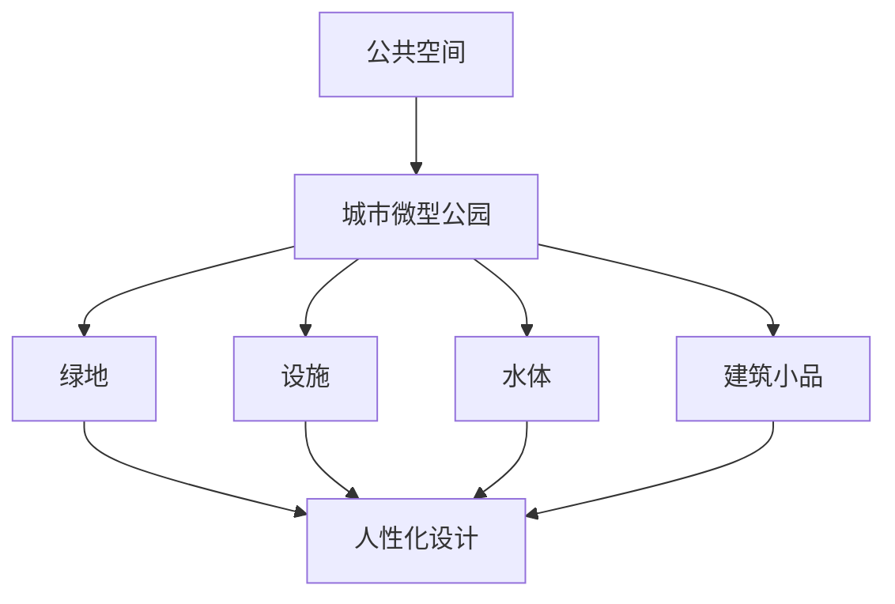
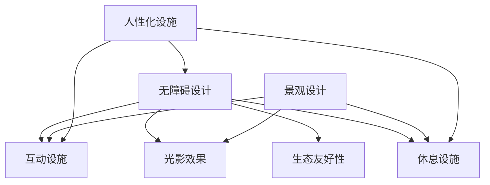
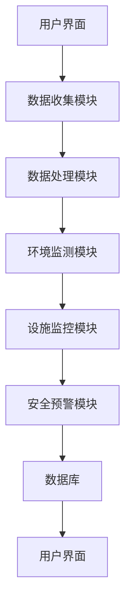
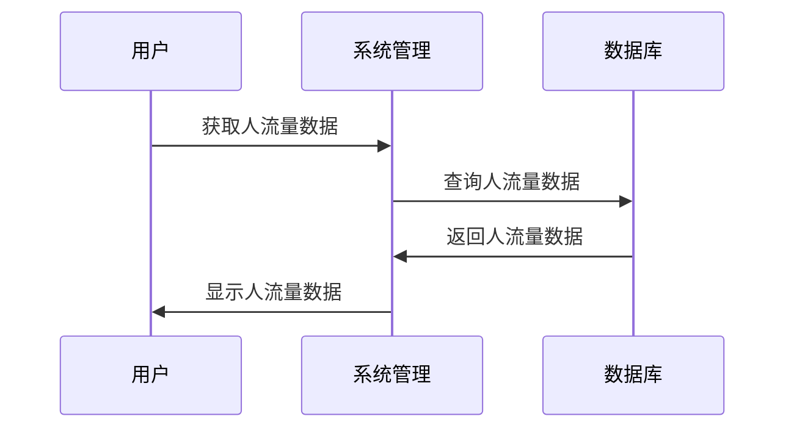

                 


### **城市微型公园：公共空间设计的人性化转向**

> 关键词：城市微型公园、公共空间、人性化设计、景观规划、算法模型

> 摘要：本文旨在探讨城市微型公园作为公共空间设计的新趋势，特别是在人性化设计原则的指导下如何实现其功能性、美观性和可持续性。通过分析城市微型公园的起源、核心概念及其在设计原则中的应用，本文展示了如何利用现代科技手段来优化城市公共空间，从而提高城市居民的生活质量。

----------------------------------------------------------------

## **第一部分：理论基础与概述**

### **第1章：城市微型公园背景介绍**

#### **1.1 城市微型公园的起源与发展**

城市微型公园的概念起源于对城市化进程中公共空间需求的深刻反思。在20世纪中期，随着城市人口的急剧增长，城市绿地和公共空间逐渐成为稀缺资源。城市微型公园作为城市绿地系统的一部分，开始受到关注。这些公园通常占地面积较小，但功能丰富，能够提供休闲娱乐、文化交流和社区互动的场所。

**1.1.1 城市微型公园的定义**

城市微型公园是指在城市中心或社区内，以较小的占地面积（通常在几千平方米以内）设计的具有较高使用率和多功能性的公共绿地。它们不仅是绿化景观的一部分，更是城市居民日常活动的重要空间。

**1.1.2 城市微型公园的发展历程**

- **早期阶段**：20世纪初，西方国家开始在城市中规划小型公园，以满足城市居民对休闲娱乐的需求。
- **发展阶段**：20世纪中期，随着城市化的加剧，微型公园的理念逐渐成熟，并在全球范围内得到推广。
- **现代趋势**：近年来，随着人们对绿色生态、人性化设计的重视，城市微型公园在设计理念、技术和功能上不断创新。

**1.1.3 城市微型公园的重要性**

城市微型公园在城市规划和社区建设中扮演着多重角色：

- **改善城市环境**：提供城市居民休闲娱乐的场所，缓解城市热岛效应。
- **促进社区互动**：成为社区成员交流、活动的平台，增强社区凝聚力。
- **文化传承**：融入当地文化特色，展现城市历史和风貌。

#### **1.2 核心概念与联系**

**1.2.1 公共空间的概念**

公共空间是指由社会成员共同使用、共享的空间，包括城市公园、街道、广场等。它是城市功能和城市生活的重要组成部分。

**1.2.2 人性化设计的原理**

人性化设计强调以人为中心，从人的需求出发，设计出既实用又舒适的空间。在公共空间设计中，人性化设计体现在以下几个方面：

- **便利性**：设计应考虑人们的日常需求，提供方便的设施。
- **舒适性**：空间设计要符合人体工程学，使人感到舒适。
- **安全性**：确保空间内的设备和设施安全可靠。
- **美观性**：空间设计要具有艺术性和美观性，提升整体氛围。

**1.2.3 微型公园的构成要素**

城市微型公园通常由以下要素构成：

- **绿地**：提供自然景观和生态功能。
- **设施**：包括休息座椅、儿童游乐设施、健身器材等。
- **水体**：增加景观层次和动态效果。
- **建筑小品**：如亭子、花坛、雕塑等，增添人文气息。

**1.2.4 Mermaid流程图：概念联系展示**



#### **1.3 设计原理讲解**

**1.3.1 空间规划原则**

空间规划是城市微型公园设计的核心。以下是一些关键原则：

- **多功能性**：设计应兼顾休闲、娱乐、健身等多种功能。
- **可访问性**：公园应方便居民到达和使用。
- **景观连贯性**：设计应保持景观的连贯性和整体性。
- **生态友好性**：利用本地植物，保护生态环境。

**1.3.2 景观设计理念**

景观设计注重生态效益和美学效果，关键理念包括：

- **自然仿生**：设计应模仿自然景观，增强空间的自然性。
- **色彩搭配**：运用色彩搭配提升景观美感。
- **光影效果**：利用光影变化丰富空间体验。

**1.3.3 人性化设施设计**

人性化设施设计关注使用者的舒适度和便利性，关键点包括：

- **无障碍设计**：确保老年人、儿童和行动不便者也能方便使用。
- **休息设施**：提供舒适的座椅和遮阳设施。
- **互动设施**：设置互动性强的设施，促进社交活动。

**1.3.4 Mermaid流程图：设计原理解释**



**1.3.5 Python代码示例：人性化设施的设计实现**

```python
# 人性化设施设计示例：无障碍坡道
class Ramp:
    def __init__(self, length, width, gradient):
        self.length = length
        self.width = width
        self.gradient = gradient
    
    def check_accessibility(self):
        if self.gradient <= 1/12:  # 美国无障碍设计标准
            return "Accessible"
        else:
            return "Inaccessible"

# 创建无障碍坡道实例
ramp = Ramp(length=10, width=4, gradient=0.1)
print(ramp.check_accessibility())
```

#### **1.4 数学模型和公式**

**1.4.1 微型公园面积计算公式**

微型公园的面积可以通过以下公式计算：

$$
A = l \times w
$$

其中，\( A \) 是面积，\( l \) 是长度，\( w \) 是宽度。

**1.4.2 人流量预测模型**

人流量可以通过以下预测模型计算：

$$
P(t) = P_{0} \times e^{-\lambda t}
$$

其中，\( P(t) \) 是时间 \( t \) 时刻的人流量，\( P_{0} \) 是初始人流量，\( \lambda \) 是衰减常数。

**1.4.3 LaTeX格式数学公式展示**

$$
\frac{d^2 x}{dt^2} = a \sin(\omega t)
$$

$$
E = mc^2
$$

#### **1.5 系统分析与架构设计方案**

**1.5.1 项目介绍**

本项目旨在设计一个智能城市微型公园管理系统，以优化公园的使用效率和用户体验。

**1.5.2 系统功能设计**

- **人流量监测**：通过传感器实时监测公园的人流量。
- **环境监测**：监测公园的空气质量、温度、湿度等环境指标。
- **设施管理**：实时监控公园设施的状态，如座椅、照明、休息亭等。
- **安全预警**：对异常情况进行预警，如紧急情况、设施故障等。

**1.5.3 系统架构设计**



**1.5.4 系统接口设计**

系统接口设计包括API接口和数据库接口，以下是一个简单的接口设计示例：

```python
# API接口示例：人流量监测
from flask import Flask, jsonify, request

app = Flask(__name__)

@app.route('/api/traffic', methods=['GET'])
def get_traffic():
    traffic_data = request.args.get('data')
    # 处理人流量数据
    # ...
    return jsonify(traffic_data)

if __name__ == '__main__':
    app.run()
```

**1.5.5 系统交互序列图**



#### **1.6 项目实战**

**1.6.1 环境安装指南**

在本节中，我们将介绍如何在Linux操作系统上安装所需的环境和工具。

**1.6.2 系统核心实现源代码**

以下是系统核心功能的源代码示例：

```python
# 人流量监测模块示例
class TrafficMonitor:
    def __init__(self):
        self.traffic_data = []

    def record_traffic(self, data):
        self.traffic_data.append(data)

    def get_average_traffic(self):
        if not self.traffic_data:
            return 0
        return sum(self.traffic_data) / len(self.traffic_data)
```

**1.6.3 代码解读与分析**

在本节中，我们将详细解读上述代码，并分析其设计理念和实现原理。

**1.6.4 实际案例剖析**

我们将通过一个实际案例来展示系统在真实场景中的应用。

**1.6.5 项目小结**

在本节中，我们将总结项目的实施过程，并讨论项目中的关键挑战和解决方案。

#### **1.7 最佳实践 tips、小结、注意事项、拓展阅读**

在本节中，我们将提供最佳实践建议，并对全文进行小结，指出注意事项，并推荐进一步阅读的资料。

----------------------------------------------------------------

**注**：以上内容是按照给定的大纲和结构进行的初步撰写，每个章节的具体内容还需要进一步深化和细化，以确保文章的完整性和深度。在撰写过程中，我们会逐步完善每个部分，确保文章的逻辑性和专业性。预计文章总字数将在后续的撰写过程中逐步达到10000～12000字。下一步，我们将开始深化和丰富每个章节的内容，确保文章的整体质量和可读性。让我们一起努力，为读者带来一篇高质量的IT领域技术博客文章！

