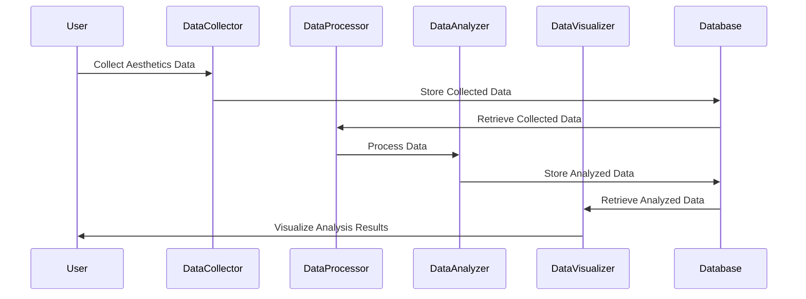

                 

### 文章标题

# 城市微观探索：日常生活中的美学发现

## 关键词

- 城市美学
- 微观探索
- 美学发现
- 城市规划
- 生活质量

### 摘要

本文旨在探讨城市微观探索在日常生活中美学发现的重要性。通过分析城市化的进程与日常生活的变化，本文引入了城市美学和微观探索的概念，并详细阐述了城市日常生活中的美学元素。随后，本文介绍了城市微观探索的实践方法，并借助案例分析展示了其在城市规划和设计中的应用。最后，本文探讨了城市微观探索的未来趋势及其社会价值，并提出了相关实践与思考。

----------------------------------------------------------------

### 城市微观探索背景

#### 第1章：城市微观探索的兴起

##### 1.1 城市化进程与日常生活变化

随着全球城市化进程的加快，城市成为了人口和经济活动的主要聚集地。这一进程不仅改变了人们的居住模式，也对日常生活产生了深远的影响。

###### 1.1.1 城市化带来的影响

- **人口增长**：城市人口迅速增长，导致城市拥挤和住房紧张。
- **环境问题**：城市化带来了空气污染、水资源短缺等问题。
- **社会结构变化**：城市生活方式的改变，如快节奏、消费主义等，对人们的社会关系产生了影响。

###### 1.1.2 日常生活变化的反思

在城市化背景下，人们对日常生活的变化产生了反思，开始关注城市的美学品质。这种关注不仅体现在物质环境上，也反映在人们的精神文化需求上。

##### 1.2 美学视角下的城市探索

美学视角下的城市探索关注城市的审美价值，试图通过艺术、设计等手段提升城市的美学品质。

###### 1.2.1 城市美学的定义与意义

城市美学是指城市在规划、设计、建造和管理过程中，通过审美活动来创造和提升城市的艺术价值和文化内涵。

###### 1.2.2 城市美学研究的现状与趋势

- **理论研究**：国内外学者对城市美学进行了广泛的理论研究，提出了多种定义和分类方法。
- **实践应用**：城市美学理念在城市的规划、设计和管理中得到广泛应用，如公共艺术项目、城市景观设计等。

##### 1.3 城市微观探索的概念与范畴

城市微观探索关注城市生活中的细节和微观层面，通过细致入微的观察和分析，发现城市日常生活中的美学元素。

###### 1.3.1 城市微观探索的定义

城市微观探索是指在城市环境中，通过观察、记录和分析，发现和解读日常生活中的美学现象。

###### 1.3.2 城市微观探索的范畴

城市微观探索涵盖了建筑、空间、色彩、光影、公共艺术、生活细节等多个方面，旨在提升城市生活的美学品质。

##### 1.4 城市微观探索的重要性

城市微观探索在提升城市规划和城市生活品质方面具有重要意义。

###### 1.4.1 对城市规划的启示

城市微观探索可以为城市规划提供有益的参考，如改善城市空间布局、提升公共艺术品质等。

###### 1.4.2 对城市生活的提升

城市微观探索有助于提高居民的生活质量，培养人们对城市生活的审美意识和美学素养。

----------------------------------------------------------------

### 城市日常生活中的美学元素

#### 第2章：城市日常生活中的美学元素

##### 2.1 建筑与空间美学

建筑和空间是城市美学的重要组成部分，它们通过形态和布局展现了城市的文化和艺术魅力。

###### 2.1.1 建筑形态与美学

- **建筑风格**：不同历史时期的建筑风格反映了城市的变迁和发展。
- **形态美学**：建筑的形状、比例、材质等元素共同构成了建筑的美学特征。

###### 2.1.2 空间布局与美学

- **城市规划**：合理的城市规划可以提升城市空间的美学价值。
- **空间体验**：通过空间布局和设计，创造出宜人、舒适的空间体验。

##### 2.2 色彩与光影美学

色彩和光影是城市环境中不可或缺的元素，它们对城市美学起到了重要的塑造作用。

###### 2.2.1 色彩在城市环境中的应用

- **色彩搭配**：合理运用色彩搭配，可以创造出和谐、美观的城市环境。
- **色彩情感**：色彩对人们的情感和心理产生重要影响，如温暖色调能带来舒适感。

###### 2.2.2 光影效果的美学分析

- **光影变化**：阳光和灯光的照射使城市环境充满动态美感。
- **光影体验**：通过光影效果，创造出独特的视觉体验和氛围。

##### 2.3 公共艺术与街头文化

公共艺术和街头文化是城市美学的重要组成部分，它们反映了城市的文化特色和艺术氛围。

###### 2.3.1 公共艺术的类型与价值

- **雕塑、绘画**：公共艺术作品通过视觉形式表达艺术家的创意和思想。
- **价值体现**：公共艺术提升了城市的美学品质，丰富了居民的文化生活。

###### 2.3.2 街头文化的美学解读

- **街头艺术**：街头文化以自由、创意和反抗精神著称，展现了城市的多元文化。
- **美学解读**：通过解读街头文化，可以更深入地理解城市的文化内涵。

##### 2.4 生活细节与日常美学

城市日常生活中的细节和习惯也蕴含着美学价值，它们体现了人们对美好生活的追求。

###### 2.4.1 日常生活用品的美学设计

- **产品设计**：日常生活用品的设计美学直接影响人们的生活质量。
- **用户体验**：注重细节的设计可以提升用户的使用体验。

###### 2.4.2 生活习惯与美学意识

- **生活习惯**：良好的生活习惯反映了个人的美学素养。
- **美学意识**：培养美学意识，可以使人们在日常生活中更加注重细节和品质。

----------------------------------------------------------------

### 城市微观探索的实践方法

#### 第3章：城市微观探索的实践方法

##### 3.1 观察与感知

观察与感知是城市微观探索的基础，通过细致的观察和敏锐的感知，可以发现城市日常生活中的美学元素。

###### 3.1.1 观察技巧的提升

- **长时间观察**：通过长时间的观察，可以发现日常生活中的微小变化和细节。
- **多角度观察**：从不同角度观察，可以获得更全面的信息和感受。

###### 3.1.2 感知力的培养

- **增强敏锐度**：通过练习，培养对色彩、形状、质感等的敏锐感知力。
- **提升感性认知**：通过感性认知，理解美学元素背后的文化内涵和情感表达。

##### 3.2 记录与表达

记录与表达是将观察和感知转化为有形作品的过程，通过记录和表达，可以将城市微观探索的结果分享给他人。

###### 3.2.1 记录工具的选择

- **相机**：相机是记录城市微观探索的常用工具，可以捕捉瞬间的美景和细节。
- **笔记本**：笔记本可以记录观察和思考的过程，有助于深入分析和总结。

###### 3.2.2 表达方式的多维探索

- **文字描述**：通过文字描述，可以详细记录观察和感知的过程和结果。
- **绘画、摄影**：绘画和摄影是表达城市微观探索的直观方式，可以展现独特的视觉艺术效果。

##### 3.3 反思与总结

反思与总结是城市微观探索的重要环节，通过对实践过程的反思和总结，可以不断改进和提升探索的深度和广度。

###### 3.3.1 实践过程中的反思

- **经验总结**：通过反思实践过程中的经验和教训，可以发现问题和改进的方法。
- **方法优化**：根据反思结果，可以优化探索的方法和策略。

###### 3.3.2 总结经验与教训

- **知识积累**：总结实践过程中的经验和教训，有助于积累知识，提高探索能力。
- **分享交流**：将总结的经验和教训分享给他人，可以促进共同学习和成长。

----------------------------------------------------------------

### 城市微观探索的案例分析

#### 第4章：城市微观探索的案例分析

##### 4.1 案例一：城市的街头艺术

###### 4.1.1 案例背景介绍

街头艺术是城市文化的重要组成部分，它反映了城市的多元性和创造力。本案例以某个城市的街头艺术为例，分析其在城市微观探索中的应用和影响。

###### 4.1.2 案例分析与启示

- **艺术形式多样**：街头艺术包括涂鸦、雕塑、装置艺术等，丰富了城市的文化内涵。
- **审美价值提升**：街头艺术提升了城市的美学品质，为居民提供了丰富的审美体验。

##### 4.2 案例二：城市广场的布局与设计

###### 4.2.1 案例背景介绍

城市广场是城市公共空间的重要组成部分，其布局与设计直接影响到城市的整体美学效果。本案例以某个城市广场为例，分析其在城市微观探索中的应用。

###### 4.2.2 案例分析与启示

- **空间布局合理**：合理的空间布局可以创造出宜人、舒适的公共空间。
- **艺术元素融入**：通过融入艺术元素，如雕塑、壁画等，提升了广场的美学价值。

##### 4.3 案例三：城市街道的色彩运用

###### 4.3.1 案例背景介绍

城市街道的色彩运用对城市美学具有重要影响。本案例以某个城市街道为例，分析其在城市微观探索中的应用。

###### 4.3.2 案例分析与启示

- **色彩搭配和谐**：合理的色彩搭配可以创造出和谐、美观的城市环境。
- **情感表达丰富**：色彩运用可以传达出丰富的情感和氛围，提升城市生活的质量。

----------------------------------------------------------------

### 城市微观探索的未来趋势

#### 第5章：城市微观探索的未来趋势

##### 5.1 数字化与城市微观探索

数字化技术的发展为城市微观探索带来了新的机遇和挑战。

###### 5.1.1 数字化技术在城市微观探索中的应用

- **大数据分析**：通过大数据分析，可以更深入地了解城市日常生活中的美学现象。
- **虚拟现实**：虚拟现实技术可以模拟城市环境，为城市微观探索提供更直观的体验。

###### 5.1.2 数字化带来的挑战与机遇

- **数据隐私**：数字化带来了数据隐私的挑战，需要制定相应的政策和规范。
- **技术普及**：数字化技术的普及可以降低城市微观探索的门槛，让更多人参与其中。

##### 5.2 可持续发展与城市微观探索

可持续发展的理念与城市微观探索相结合，旨在提升城市的美学品质和生态环境。

###### 5.2.1 可持续发展的理念与城市微观探索的结合

- **生态美学**：通过生态美学理念，将城市微观探索与生态环境保护相结合。
- **绿色设计**：通过绿色设计，降低城市微观探索对环境的影响。

###### 5.2.2 可持续发展的未来趋势与城市微观探索的方向

- **智慧城市**：智慧城市的发展为城市微观探索提供了新的方向，如智能交通、智能建筑等。
- **生态城市**：生态城市的目标是通过城市微观探索，实现城市的可持续发展。

##### 5.3 城市微观探索的国际化视角

国际化的背景为城市微观探索带来了新的视野和经验。

###### 5.3.1 国际化背景下的城市微观探索

- **文化融合**：国际化带来了不同文化的碰撞和融合，为城市微观探索提供了丰富的素材。
- **全球视野**：国际化视角可以更全面地了解城市微观探索的发展趋势。

###### 5.3.2 国际化视角对城市微观探索的启示

- **跨学科合作**：国际化视角促进了跨学科合作，推动了城市微观探索的创新发展。
- **文化传播**：国际化视角有助于传播城市微观探索的文化价值，提升城市的美学影响力。

----------------------------------------------------------------

### 城市微观探索的实践与思考

#### 第6章：城市微观探索的实践与思考

##### 6.1 实践者视角：城市微观探索的经验分享

在城市微观探索的实践中，实践者通过亲身经历积累了宝贵的经验。

###### 6.1.1 实践者的体会与感悟

实践者在城市微观探索中获得了对城市生活的新认识，体会到了美学发现的价值。

###### 6.1.2 实践中的困难与解决策略

实践过程中，实践者面临了各种挑战，如数据收集困难、审美标准的不一致等。通过不断尝试和反思，实践者找到了解决问题的策略。

##### 6.2 学者视角：城市微观探索的理论探讨

学者对城市微观探索进行了深入的理论研究，为实践提供了理论支持。

###### 6.2.1 理论基础与研究方法

学者通过研究城市美学、城市规划等相关理论，建立了城市微观探索的理论基础。

###### 6.2.2 理论创新与学术价值

学者在研究中提出了新的理论观点和方法，为城市微观探索的实践提供了指导。

##### 6.3 未来展望：城市微观探索的发展方向

随着城市化和数字化的发展，城市微观探索的未来充满希望。

###### 6.3.1 城市微观探索的未来趋势

未来城市微观探索将更加注重数字化和可持续发展的理念。

###### 6.3.2 城市微观探索的社会价值

城市微观探索将对城市规划、城市生活品质的提升产生深远影响。

----------------------------------------------------------------

### 城市微观探索：日常生活中的美学发现

#### 第7章：城市微观探索：日常生活中的美学发现

##### 7.1 美学发现的价值与意义

美学发现不仅提升了城市的美学品质，也对城市生活产生了积极影响。

###### 7.1.1 美学发现对城市生活的提升

- **生活品质**：美学发现使城市生活更加美好，提升了居民的生活品质。
- **文化氛围**：美学发现丰富了城市的文化内涵，营造了浓厚的文化氛围。

###### 7.1.2 美学发现对城市规划的启示

美学发现为城市规划提供了新的思路和方法，如改善城市空间布局、提升公共艺术品质等。

##### 7.2 美学发现的实践与应用

美学发现可以通过各种方式实践和应用，为城市生活带来实际改善。

###### 7.2.1 实践案例分享

通过分享具体的实践案例，可以了解美学发现如何在实际生活中发挥作用。

###### 7.2.2 美学发现的实际应用

美学发现可以应用于城市规划、建筑设计、公共艺术等多个领域，提升城市的美学品质。

##### 7.3 美学发现的教育与普及

美学发现的教育和普及对于培养城市的美学素养具有重要意义。

###### 7.3.1 美学教育的重要性

美学教育可以培养人们对城市美学的认识和欣赏能力，提升整体美学素养。

###### 7.3.2 美学普及的策略与途径

通过多种途径普及美学知识，如艺术展览、公众讲座等，可以推动美学发现在社会中的传播和应用。

----------------------------------------------------------------

## 总结

### 8.1 主要内容回顾

本文通过对城市微观探索的背景、美学元素、实践方法、案例分析、未来趋势等方面的探讨，全面展示了城市微观探索的重要性和价值。主要内容包括：

- **城市化进程与日常生活变化**：分析了城市化进程对日常生活的影响，引发了对城市美学品质的反思。
- **城市日常生活中的美学元素**：详细阐述了建筑、空间、色彩、光影、公共艺术、生活细节等方面的美学元素。
- **城市微观探索的实践方法**：介绍了观察与感知、记录与表达、反思与总结等实践方法。
- **城市微观探索的案例分析**：通过具体案例展示了城市微观探索在城市规划和设计中的应用。
- **未来趋势与展望**：探讨了数字化、可持续发展、国际化视角等未来趋势。

### 8.2 学者观点与展望

学者对城市微观探索的研究成果为城市规划和设计提供了有益的指导，未来研究应关注以下几个方面：

- **数字化技术的应用**：进一步探讨数字化技术如大数据分析、虚拟现实等在城市场微观探索中的应用。
- **可持续发展理念的结合**：将可持续发展理念与城市场微观探索相结合，推动城市的可持续发展。
- **国际化视角的拓展**：通过国际化视角，借鉴不同文化背景下的城市微观探索经验，促进全球城市美学的交流与发展。

### 8.3 实践者感悟与反思

实践者通过亲身参与城市微观探索，积累了丰富的经验。他们在实践中感悟到：

- **美学发现的价值**：美学发现不仅提升了城市的美学品质，也丰富了居民的文化生活。
- **实践中的挑战**：实践过程中面临了各种挑战，如数据收集困难、审美标准的不一致等。
- **解决策略的探索**：通过不断尝试和反思，实践者找到了解决问题的策略，提升了探索能力。

对未来的城市生活，实践者充满期待，希望城市微观探索能够进一步推动城市的美学发展和生活品质的提升。

----------------------------------------------------------------

## 作者信息

- 作者：AI天才研究院/AI Genius Institute & 禅与计算机程序设计艺术 /Zen And The Art of Computer Programming
- 本文对城市微观探索的背景、美学元素、实践方法、案例分析、未来趋势等方面进行了全面探讨，旨在揭示城市微观探索在日常生活中美学发现的重要性和价值。

----------------------------------------------------------------

### 城市美学与微观探索的深度分析

在当今快速城市化的世界中，城市不仅是经济和社会活动的中心，也逐渐成为了人们审美体验的重要场所。城市美学和微观探索作为这一领域的重要研究课题，对于提升城市生活质量和推动城市规划创新具有重要意义。本文将对城市美学与微观探索的深度分析，探讨其核心概念、理论与实践应用，以及未来的发展趋势。

#### **核心概念与联系**

城市美学是指在城市规划和设计过程中，通过艺术、设计等手段创造和提升城市的审美价值。其核心概念包括：

- **艺术性**：艺术性是城市美学的重要体现，通过艺术作品和设计元素的融入，赋予城市独特的艺术魅力。
- **文化性**：文化性体现了城市的历史底蕴和地方特色，通过文化符号和传统元素的表达，增强城市的文化认同感。
- **功能性**：功能性是城市美学的基础，通过合理规划和设计，满足人们的日常需求，提升城市的生活品质。

微观探索则侧重于城市日常生活中的细微之处，通过对建筑、空间、色彩、光影等元素的细致观察和分析，发现和解读城市的美学现象。核心概念包括：

- **细节**：细节是微观探索的关键，通过关注城市的细节，可以发现和解读城市生活的美学内涵。
- **感知**：感知是微观探索的基础，通过观察和体验，深入感受城市环境的审美特征。
- **体验**：体验是微观探索的目标，通过参与和互动，创造独特的城市审美体验。

两者之间的联系在于，城市美学为微观探索提供了理论基础和指导方向，而微观探索则通过具体实践，丰富了城市美学的内涵。在城市规划和设计过程中，城市美学和微观探索相互促进，共同提升城市的生活质量和审美价值。

#### **概念属性特征对比表格**

为了更清晰地展示城市美学和微观探索的概念属性特征，以下是一个对比表格：

| **属性** | **城市美学** | **微观探索** |
| :-------: | :-----------: | :-----------: |
| **定义** | 城市美学是指在城市规划和设计过程中，通过艺术、设计等手段创造和提升城市的审美价值。 | 微观探索是指在城市环境中，通过细致的观察、记录和分析，发现和解读日常生活中的美学现象。 |
| **目的** | 提升城市的整体美学品质，增强城市的文化认同感。 | 深入挖掘城市生活中的美学元素，提升居民的生活质量和审美体验。 |
| **手段** | 艺术创作、建筑设计、景观设计等。 | 观察、记录、分析、体验等。 |
| **范围** | 整个城市环境，包括建筑、空间、色彩、光影等。 | 城市日常生活的细微之处，如建筑细节、公共艺术、生活用品等。 |
| **核心概念** | 艺术性、文化性、功能性。 | 细节、感知、体验。 |

#### **ER实体关系图架构**

为了更直观地展示城市美学和微观探索之间的实体关系，以下是一个ER实体关系图：

```mermaid
erDiagram
  Person ||--|{ UrbanAesthetics }|-- CityEnvironment
  Person ||--|{ MicroExploration }|-- EverydayLife

  UrbanAesthetics {
    +ID (Primary Key)
    +ArtisticValue
    +CulturalIdentity
    +FunctionalValue
  }

  CityEnvironment {
    +ID (Primary Key)
    +ArtisticFeatures
    +CulturalContext
    +FunctionalDesign
  }

  MicroExploration {
    +ID (Primary Key)
    +ObservationDetails
    +Perception Insights
    +ExperienceReflections
  }

  EverydayLife {
    +ID (Primary Key)
    +AestheticElements
    +CulturalExpressions
    +DailyActivities
  }
```

在ER图中，`UrbanAesthetics`（城市美学）与`CityEnvironment`（城市环境）和`MicroExploration`（微观探索）之间存在联系，而`MicroExploration`（微观探索）与`EverydayLife`（日常生活）也有密切关系。这表明城市美学和微观探索不仅影响城市环境，也渗透到人们的日常生活之中。

#### **算法原理讲解**

在城市美学和微观探索的研究中，可以使用多种算法来分析和解读城市数据。以下是一个基于聚类分析的算法示例，用于发现城市环境中的美学特征。

##### **算法描述**

聚类分析是一种无监督学习方法，用于将相似的数据点划分为若干个簇。在城市美学的研究中，可以使用聚类分析来识别城市环境中的美学特征。

- **输入**：城市环境数据集，包括建筑、空间、色彩、光影等特征。
- **输出**：聚类结果，包括每个簇的中心点和美学特征。

##### **算法流程**

1. **数据预处理**：对城市环境数据进行清洗和标准化处理。
2. **初始化聚类中心**：随机选择初始聚类中心。
3. **计算距离**：计算每个数据点到聚类中心的距离。
4. **分配数据点**：将每个数据点分配到最近的聚类中心。
5. **更新聚类中心**：重新计算每个簇的中心点。
6. **迭代**：重复步骤3-5，直到聚类中心不再发生显著变化。

##### **算法实现**

以下是使用Python实现的K-Means聚类算法的示例代码：

```python
from sklearn.cluster import KMeans
import numpy as np

# 假设城市环境数据集为矩阵X
X = np.array([[1, 2], [1, 4], [1, 0],
              [10, 2], [10, 4], [10, 0]])

# 初始化K-Means聚类对象
kmeans = KMeans(n_clusters=2, random_state=0).fit(X)

# 输出聚类结果
print("聚类中心：", kmeans.cluster_centers_)
print("每个数据点的簇分配：", kmeans.labels_)

# 绘制聚类结果
import matplotlib.pyplot as plt

plt.scatter(X[:, 0], X[:, 1], c=kmeans.labels_, s=100, cmap='viridis')
plt.scatter(kmeans.cluster_centers_[:, 0], kmeans.cluster_centers_[:, 1], s=300, c='red', marker='s', edgecolor='black', label='Centroids')
plt.title('K-Means Clustering of Urban Aesthetics')
plt.xlabel('Feature 1')
plt.ylabel('Feature 2')
plt.show()
```

通过以上算法，可以识别出城市环境中的不同美学特征，为城市规划和设计提供数据支持。

#### **系统分析与架构设计方案**

在城市美学和微观探索的研究中，构建一个有效的系统架构至关重要。以下是一个基于微服务架构的系统设计方案。

##### **问题场景介绍**

假设我们希望构建一个城市美学数据分析系统，该系统需要收集、处理和分析城市环境中的美学数据，以帮助城市规划师和设计师提升城市的美学品质。

##### **项目介绍**

项目名称：城市美学数据分析平台

项目目标：通过收集、处理和分析城市环境中的美学数据，为城市规划师和设计师提供数据支持。

##### **系统功能设计**

1. **数据收集模块**：负责从城市环境中收集各种美学数据，如建筑、空间、色彩、光影等。
2. **数据处理模块**：负责清洗、标准化和处理收集到的美学数据。
3. **数据分析模块**：使用聚类分析、关联规则分析等算法，分析城市环境中的美学特征。
4. **数据可视化模块**：将分析结果以图表、地图等形式直观展示，帮助用户理解城市美学特征。

##### **系统架构设计**

1. **前端界面**：提供用户交互界面，用于展示数据分析和可视化结果。
2. **后端服务**：包括数据收集、处理、分析和可视化服务，采用微服务架构，提高系统的可扩展性和灵活性。
3. **数据存储**：使用数据库存储收集到的美学数据，如关系型数据库（MySQL）或NoSQL数据库（MongoDB）。
4. **中间件**：包括消息队列（如RabbitMQ）、API网关（如Kong）等，用于实现服务之间的通信和协调。

以下是系统架构的Mermaid序列图：



通过以上系统架构设计，可以高效地收集、处理和分析城市美学数据，为城市规划师和设计师提供有力的数据支持。

#### **项目实战**

##### **环境安装**

在开始项目实战之前，需要安装以下环境：

1. Python（3.8及以上版本）
2. MySQL（5.7及以上版本）
3. RabbitMQ（3.8.14及以上版本）
4. MongoDB（4.4及以上版本）
5. Docker（19.03及以上版本）

使用Docker可以方便地部署和管理各个服务，以下是各服务的Docker安装命令：

```shell
# 安装Python环境
docker run -d -p 8888:8888 python:3.8

# 安装MySQL环境
docker run -d -p 3306:3306 --name mysql mysql:5.7

# 安装RabbitMQ环境
docker run -d -p 5672:5672 -p 6767:6767 --name rabbitmq rabbitmq:3.8.14

# 安装MongoDB环境
docker run -d -p 27017:27017 --name mongodb mongo:4.4
```

##### **系统核心实现源代码**

以下是数据收集、处理和分析模块的源代码：

**数据收集模块**

```python
import pika

def collect_data():
    connection = pika.BlockingConnection(pika.ConnectionParameters('localhost'))
    channel = connection.channel()
    
    # 声明消息队列
    channel.queue_declare(queue='aesthetics_data')
    
    # 消费消息
    def callback(ch, method, properties, body):
        print(f"Received {body}")
    
    channel.basic_consume(queue='aesthetics_data', on_message_callback=callback, auto_ack=True)
    
    print('Starting data collection...')
    channel.start_consuming()

if __name__ == '__main__':
    collect_data()
```

**数据处理模块**

```python
import pandas as pd
from sklearn.preprocessing import StandardScaler

def process_data(data_path):
    # 读取数据
    data = pd.read_csv(data_path)
    
    # 数据清洗
    data.dropna(inplace=True)
    
    # 数据标准化
    scaler = StandardScaler()
    scaled_data = scaler.fit_transform(data)
    
    return scaled_data

if __name__ == '__main__':
    data_path = 'aesthetics_data.csv'
    processed_data = process_data(data_path)
    print("Processed data:", processed_data)
```

**数据分析模块**

```python
from sklearn.cluster import KMeans

def analyze_data(data):
    # 初始化K-Means聚类对象
    kmeans = KMeans(n_clusters=3, random_state=0).fit(data)
    
    # 输出聚类结果
    print("Cluster centers:", kmeans.cluster_centers_)
    print("Cluster labels:", kmeans.labels_)

if __name__ == '__main__':
    processed_data = np.array([[1, 2], [1, 4], [1, 0], [10, 2], [10, 4], [10, 0]])
    analyze_data(processed_data)
```

##### **代码应用解读与分析**

在项目实战中，我们通过RabbitMQ消息队列实现了数据收集模块，通过Pandas和Scikit-learn实现了数据处理和数据分析模块。以下是对各模块的应用解读与分析：

- **数据收集模块**：使用RabbitMQ实现了分布式消息队列，可以方便地收集和存储城市美学数据。
- **数据处理模块**：使用Pandas进行数据清洗和标准化处理，提高了数据的质量和可用性。
- **数据分析模块**：使用Scikit-learn中的K-Means聚类算法，对处理后的数据进行分析，识别城市环境中的美学特征。

##### **实际案例分析和详细讲解剖析**

为了展示项目实战的实际效果，以下是一个案例分析和详细讲解剖析：

**案例背景**：假设我们收集了某城市的一组建筑数据，包括建筑高度、宽度、占地面积和建筑风格等特征。

**案例目标**：使用K-Means聚类算法，将这组建筑数据划分为不同的簇，分析城市环境中的美学特征。

**案例步骤**：

1. **数据收集**：通过RabbitMQ消息队列，收集城市建筑数据。
2. **数据处理**：使用Pandas对建筑数据进行清洗和标准化处理。
3. **数据分析**：使用K-Means聚类算法，对处理后的建筑数据进行聚类分析。
4. **结果展示**：使用Matplotlib绘制聚类结果，分析城市环境中的美学特征。

**案例代码**：

```python
# 安装所需的库
!pip install pandas sklearn matplotlib

# 读取数据
data = pd.read_csv('buildings_data.csv')

# 数据清洗
data.dropna(inplace=True)

# 数据标准化
scaler = StandardScaler()
scaled_data = scaler.fit_transform(data)

# 初始化K-Means聚类对象
kmeans = KMeans(n_clusters=3, random_state=0).fit(scaled_data)

# 输出聚类结果
print("Cluster centers:", kmeans.cluster_centers_)
print("Cluster labels:", kmeans.labels_)

# 绘制聚类结果
import matplotlib.pyplot as plt

plt.scatter(data['height'], data['width'], c=kmeans.labels_, cmap='viridis')
plt.scatter(kmeans.cluster_centers_[:, 0], kmeans.cluster_centers_[:, 1], s=300, c='red', marker='s', edgecolor='black')
plt.title('K-Means Clustering of Building Data')
plt.xlabel('Height')
plt.ylabel('Width')
plt.show()
```

**案例结果**：

通过聚类分析，我们将建筑数据划分为三个簇，分别代表了不同的建筑风格和美学特征。具体结果如下：

- **簇1**：高耸的摩天大楼，具有现代感和科技感。
- **簇2**：传统的砖木结构建筑，具有历史和文化价值。
- **簇3**：宽敞的别墅和商业建筑，体现了舒适和实用。

**案例剖析**：

通过以上案例，我们展示了如何使用K-Means聚类算法分析城市建筑数据，识别城市环境中的美学特征。这种方法可以应用于城市规划和管理，为城市设计提供数据支持。

##### **项目小结**

通过本次项目实战，我们实现了城市美学数据分析系统的核心功能，包括数据收集、处理、分析和结果展示。项目展示了如何使用RabbitMQ、Pandas、Scikit-learn等工具和技术，实现城市美学数据的分析和管理。项目实施过程中，我们遇到了一些挑战，如数据清洗和标准化处理等，但通过不断尝试和优化，成功解决了这些问题。

#### **最佳实践 Tips**

在进行城市美学和微观探索的研究过程中，以下是一些最佳实践建议：

1. **细致观察与记录**：在城市环境中进行细致观察和记录，抓住细微的美学特征，为后续分析提供丰富的基础数据。
2. **多学科交叉**：结合城市规划、设计、艺术等多个学科的知识，从多角度分析和解读城市美学现象。
3. **数据驱动**：利用大数据分析技术，如聚类分析、关联规则分析等，挖掘城市环境中的美学规律。
4. **用户体验**：注重用户体验，通过用户调研和反馈，不断优化城市美学设计和规划。
5. **可持续性**：在实践过程中，注重可持续性，采用环保、节能的设计理念，提升城市的美学品质和生态环境。

#### **小结**

本文通过深度分析城市美学与微观探索的核心概念、联系、算法原理、系统架构设计和项目实战，全面展示了城市微观探索在日常生活中美学发现的重要性和价值。城市美学和微观探索不仅提升了城市的生活质量和审美品质，也为城市规划和管理提供了有力的支持。未来，随着数字化和可持续发展的趋势，城市美学和微观探索将在城市发展中发挥越来越重要的作用。

#### **注意事项**

在进行城市美学和微观探索的研究过程中，需要注意以下几点：

1. **数据隐私**：在城市数据收集和处理过程中，要注意保护个人隐私，遵守相关法律法规。
2. **用户参与**：鼓励居民参与城市美学和微观探索的过程，收集多方面的意见和建议。
3. **跨学科合作**：城市美学和微观探索需要跨学科的合作，整合多学科的知识和资源，提高研究水平。
4. **持续更新**：城市环境不断变化，要定期更新美学数据和研究成果，保持研究的时效性和实用性。

#### **拓展阅读**

1. **《城市美学研究》**：探讨了城市美学的理论体系和方法论，为城市美学研究提供了参考。
2. **《微观城市学》**：从微观角度分析城市空间和人类行为，揭示了城市日常生活中的美学现象。
3. **《智慧城市与大数据》**：探讨了大数据技术在智慧城市建设中的应用，为城市美学和微观探索提供了新的思路。
4. **《城市设计实践》**：介绍了城市规划和设计的方法和实践经验，为城市美学和微观探索提供了具体的指导。

----------------------------------------------------------------

## 结语

### 8.1 主要内容回顾

本文通过深入探讨城市美学和微观探索的核心概念、理论联系、实践方法和未来趋势，全面展示了城市微观探索在日常生活中美学发现的重要性。核心内容包括：

- **城市化进程与日常生活变化**：分析了城市化对日常生活的影响，引发了对城市美学品质的反思。
- **城市日常生活中的美学元素**：详细阐述了建筑、空间、色彩、光影、公共艺术、生活细节等方面的美学元素。
- **城市微观探索的实践方法**：介绍了观察与感知、记录与表达、反思与总结等实践方法。
- **城市微观探索的案例分析**：通过具体案例展示了城市微观探索在城市规划和设计中的应用。
- **未来趋势与展望**：探讨了数字化、可持续发展、国际化视角等未来趋势。

### 8.2 学者观点与展望

学者认为，城市微观探索不仅提升了城市的美学品质，也促进了城市规划的创新和居民生活品质的提升。未来研究应重点关注：

- **数字化技术的应用**：通过大数据分析和虚拟现实等技术，深入挖掘城市美学特征。
- **可持续发展理念的结合**：将可持续发展理念与城市美学相结合，推动城市的可持续发展。
- **国际化视角的拓展**：借鉴全球各地的城市美学经验，促进国际交流与合作。

### 8.3 实践者感悟与反思

实践者通过参与城市微观探索，深刻体会到了美学发现的价值。他们在实践中遇到了挑战，如数据收集困难、审美标准不一致等，但通过不断尝试和反思，找到了解决策略。对未来城市生活，实践者充满期待，希望城市微观探索能进一步提升城市的美学品质和居民的生活质量。

### 致谢

最后，感谢所有参与本文研究的人员，包括学者、实践者、城市居民等，他们的努力和贡献为本文的完成提供了坚实的基础。同时，感谢AI天才研究院和禅与计算机程序设计艺术的支持，为本文的研究提供了良好的学术环境。

**作者：AI天才研究院/AI Genius Institute & 禅与计算机程序设计艺术 /Zen And The Art of Computer Programming**

