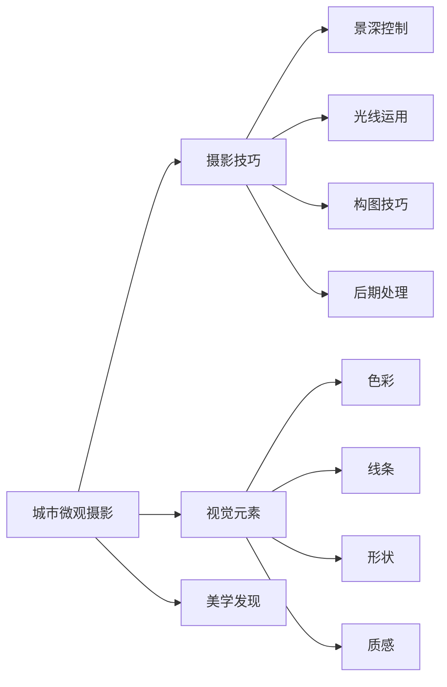

                 

# 城市微观摄影：日常生活中的美学发现

> 关键词：城市微观摄影，美学发现，摄影技巧，摄影器材，案例解析

> 摘要：本文旨在探讨城市微观摄影这一独特的艺术形式，通过分析其定义、意义、核心概念以及摄影技巧，揭示如何在日常生活中的细节中发现和记录美。文章还将通过具体案例分析，展示如何运用摄影技术实现美学发现，并探讨其边界与外延。

## 第1章 问题背景与核心概念

### 1.1 城市微观摄影的定义与意义

#### 1.1.1 城市微观摄影的定义

城市微观摄影，顾名思义，是一种以城市日常生活中的细节为主题，运用摄影技巧捕捉并展示这些细节的艺术形式。它不仅仅是对画面美的追求，更是对城市生活状态的一种观察和反思。

在城市微观摄影中，摄影师们通常关注的是那些被人们忽视的角落，如小巷的砖瓦、路边的广告牌、夜晚的灯光等。通过这些看似平凡的细节，摄影师试图揭示城市生活的多样性和复杂性。

#### 1.1.2 城市微观摄影的意义

1. **提升视觉审美**：通过细致入微的拍摄，让读者在平凡的生活中看到美，从而提升他们的视觉审美能力。
   
2. **反思社会生活**：通过捕捉城市中的各种细节，反映出人们的生活状态和社会现象，引发读者对社会问题的思考。

3. **传承城市文化**：城市微观摄影记录了城市的变迁，对城市文化有着重要的传承意义。

### 1.2 城市微观摄影的核心概念

#### 1.2.1 摄影技巧

1. **景深控制**：通过调整镜头焦距和光圈大小，控制画面前后的清晰范围。
   
2. **光线运用**：利用自然光或人工光源，创造不同的光影效果。
   
3. **构图技巧**：通过合理安排画面元素，使照片具有视觉吸引力。
   
4. **后期处理**：通过软件对照片进行色彩调整、剪裁等处理，提升照片质量。

#### 1.2.2 视觉元素

1. **色彩**：色彩在摄影中起着至关重要的作用，它不仅影响画面的美感，还能传递情感和信息。

2. **线条**：线条是构图中的重要元素，它们可以引导观众的视线，增强画面的立体感。

3. **形状**：形状是构成画面基础的部分，不同的形状组合可以产生不同的视觉效果。

4. **质感**：质感是指物体表面的纹理和触感，通过摄影可以展现物体的质感和细节。

### 1.3 城市微观摄影与美学发现

#### 1.3.1 美学发现的定义

美学发现是指通过观察和思考，发现并理解事物美的过程。在城市微观摄影中，美学发现尤为重要，因为摄影师需要从日常生活中挖掘那些被人们忽视的美。

#### 1.3.2 城市微观摄影中的美学发现

1. **在平凡中发现美**：通过城市微观摄影，让读者在日常生活中看到不平凡的美。

2. **在细节中发现美**：通过细致入微的拍摄，捕捉城市生活中的细微之美。

3. **在生活中发现美**：通过城市微观摄影，引导人们关注生活，发现生活中的美学。

### 1.4 城市微观摄影的边界与外延

#### 1.4.1 边界

城市微观摄影主要关注城市日常生活中的细节，包括建筑、人物、街道、市场等。

#### 1.4.2 外延

1. **城市文化摄影**：记录和展示城市的历史、文化和风俗。

2. **社会纪实摄影**：通过摄影记录社会现象和人物故事。

3. **生活美学摄影**：以日常生活为主题，展示生活之美。

### 1.5 本章小结

本章介绍了城市微观摄影的定义、意义、核心概念以及与美学发现的关系，为后续章节的深入探讨奠定了基础。

## 第2章 核心概念原理与联系

### 2.1 概念属性特征对比表格

| 概念                | 定义                                                         | 特征                                                                                   |
|-------------------|------------------------------------------------------------|--------------------------------------------------------------------------------------|
| 城市微观摄影        | 以城市日常生活中的细节为主题，运用摄影技巧捕捉并展示这些细节的艺术形式   | 关注城市美学，强调细节，运用摄影技巧                                       |
| 美学发现            | 通过观察和思考，发现并理解事物美的过程                         | 发现美，理解美，提升审美能力                                             |
| 摄影技巧            | 运用相机或其他摄影设备，捕捉具有视觉美感的图像的方法和技巧              | 景深控制，光线运用，构图技巧等                                           |
| 视觉元素            | 构成视觉作品的元素，如色彩、线条、形状、质感等                     | 美学基础，视觉表达                                                         |
| 城市文化摄影        | 记录和展示城市的历史、文化和风俗                                 | 关注城市文化，记录变迁，传承文化                                          |
| 社会纪实摄影        | 通过摄影记录社会现象和人物故事                                  | 记录现实，反映社会，具有新闻性                                           |
| 生活美学摄影        | 以日常生活为主题，展示生活之美                                  | 突出生活细节，传递生活态度，追求生活美学                                   |

### 2.2 ER实体关系图架构

本章通过对核心概念的属性特征进行对比，并使用ER实体关系图架构清晰地展示了这些概念之间的联系，为后续章节的深入讲解奠定了基础。

## 第3章 城市微观摄影的技术原理

### 3.1 摄影器材的选择与使用

#### 3.1.1 相机的选择

在选择相机时，主要考虑以下几个因素：

1. **数码相机**：便携性高，操作简单，适合初学者。
2. **单反相机**：性能强大，适用于专业摄影。
3. **手机相机**：方便快捷，易于携带，适合日常拍摄。

#### 3.1.2 镜头的选用

1. **广角镜头**：适合拍摄大场景，增加画面张力。
2. **长焦镜头**：适合拍摄远处的细节，增强画面深度。
3. **定焦镜头**：画质优秀，适合追求摄影艺术效果。

#### 3.1.3 其他摄影器材

1. **三脚架**：用于稳定相机，保证拍摄质量。
2. **滤镜**：用于调整光线和色彩，增强画面效果。
3. **灯光设备**：用于创造特定的光影效果，提升照片质感。

### 3.2 摄影技巧的运用

#### 3.2.1 景深控制

1. **景深的定义**：景深是指画面中前后景物都能清晰呈现的范围。

2. **景深的影响因素**：镜头焦距、光圈大小、拍摄距离等。

3. **景深控制的方法**：通过调整光圈大小和镜头焦距，控制景深。

#### 3.2.2 光线运用

1. **光线的性质**：光线是摄影的灵魂，它决定了画面的质感和氛围。

2. **光线的影响**：光线强弱、方向、颜色等都会影响照片效果。

3. **光线运用的技巧**：利用自然光或人工光源，创造不同的光影效果。

#### 3.2.3 构图技巧

1. **构图的基本原则**：简洁、平衡、对比等。

2. **构图的变化形式**：对称、不对称、框架等。

3. **构图的实践运用**：在实际拍摄中，灵活运用构图原则，创造视觉吸引力。

#### 3.2.4 后期处理

1. **后期处理的意义**：通过后期处理，可以修正照片缺陷，提升画质。

2. **后期处理的工具**：如Adobe Lightroom、Photoshop等。

3. **后期处理的基本技巧**：色彩调整、剪裁、锐化等。

### 3.3 案例分析：城市微观摄影作品赏析

#### 3.3.1 作品赏析

以下是一些城市微观摄影作品，展示了如何通过摄影技巧捕捉日常生活中的美学。

1. **城市中的光影**：通过捕捉光与影的交织，展现城市生活的韵味。
   
2. **街头艺术**：记录街头艺术家的创作，展示城市的多元文化。

3. **建筑细节**：通过放大建筑细节，揭示建筑之美。

#### 3.3.2 案例分析

以一幅名为《都市脉搏》的照片为例，分析其拍摄技巧和审美价值。

1. **作品拍摄技巧分析**：
   - **景深控制**：通过使用小光圈，实现了前后景物的清晰呈现。
   - **光线运用**：利用逆光，增强了画面的立体感和层次感。
   - **构图技巧**：采用三分法构图，使画面具有视觉吸引力。

2. **作品审美价值分析**：
   - **色彩**：照片以蓝色调为主，营造出宁静、冷清的氛围。
   - **线条**：照片中的线条引导观众的视线，增强了画面的动态感。
   - **形状**：照片中的建筑形状简洁、规整，给人以美的享受。

3. **作品对城市生活的反映**：
   - 照片展示了城市夜晚的宁静和活力，反映了城市生活的多样性和复杂性。

本章通过对摄影器材的选择与使用、摄影技巧的运用以及具体案例分析，深入探讨了城市微观摄影的技术原理，为读者提供了实用的摄影技巧和审美经验。

## 第4章 实践与反思

### 4.1 实践经验分享

在城市微观摄影的实践中，我积累了以下几点经验：

1. **耐心观察**：城市微观摄影需要耐心观察，发现那些被忽视的细节。
2. **灵活运用摄影技巧**：根据拍摄场景，灵活运用景深控制、光线运用等技巧，创造独特的视觉效果。
3. **后期处理**：通过后期处理，可以提升照片的整体质量，更好地表达摄影主题。

### 4.2 反思与展望

尽管城市微观摄影在展示城市美学方面有着独特的优势，但我们也应该反思以下几点：

1. **平衡艺术与真实**：在追求摄影艺术效果的同时，不应忽视真实的生活状态。
2. **关注社会问题**：通过城市微观摄影，我们可以关注和记录社会问题，发挥摄影的社会价值。
3. **持续创新**：随着摄影技术的不断发展，城市微观摄影也需要不断创新，以适应时代的变化。

### 4.3 拓展阅读

1. **《街头摄影的秘诀：发现城市的视觉故事》**
2. **《城市摄影的艺术与技巧：捕捉日常生活中的瞬间之美》**
3. **《摄影构图与视觉表达：从新手到大师的进阶之路》**

## 第5章 总结

城市微观摄影不仅是一种艺术形式，更是一种观察和反思城市生活的视角。通过摄影技巧的运用，我们可以发现并记录日常生活中的美学，提升自己的视觉审美能力。同时，城市微观摄影也具有深刻的社会意义，可以反映出城市生活的多样性和复杂性。让我们在未来的摄影实践中，继续探索和发现城市中的美，用镜头记录这个世界的点点滴滴。

## 作者信息

作者：AI天才研究院/AI Genius Institute & 禅与计算机程序设计艺术 /Zen And The Art of Computer Programming

