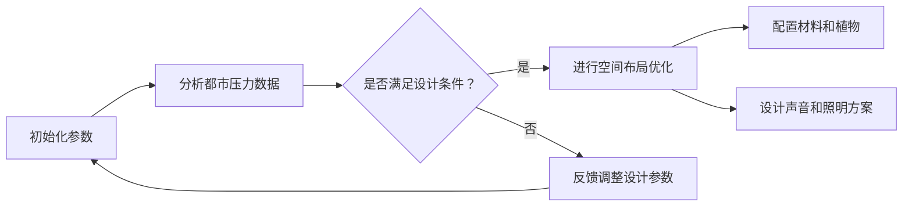
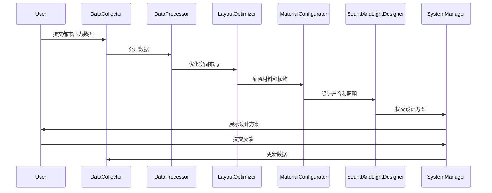

                 

### 引言

在城市化的快速发展中，都市压力已成为现代社会的一个普遍现象。大量的人口聚集在城市中，带来了交通拥堵、环境污染、噪音干扰等一系列问题。长期生活在这样的环境中，人们的身心健康受到了严重的威胁，心理压力和情绪问题日益突出。为了缓解都市压力，城市治愈空间设计成为一种有效的环境规划策略。本文将围绕这一主题展开，探讨城市治愈空间设计的核心概念、设计原理与方法，以及相关的算法原理和系统架构设计。

城市治愈空间设计旨在通过精心规划的空间环境，为都市居民提供一个放松身心的场所。其重要性在于，它不仅能够提供物理上的舒适感，还能通过营造一种宁静、和谐的氛围，帮助人们减轻心理压力，提升生活质量。本文将逐步分析城市治愈空间设计的概念和理论基础，并通过实际案例讲解其具体实施方法，最终总结最佳实践和拓展阅读方向。

本文将按照以下结构进行：

1. **背景介绍**：简要介绍城市治愈空间设计的概念和重要性。
2. **核心概念与联系**：定义关键概念，分析概念之间的关系，形成概念属性特征对比表格和ER实体关系图。
3. **设计原理与方法**：介绍城市治愈空间设计的理论依据和设计方法。
4. **算法原理讲解**：详细阐述与城市治愈空间设计相关的算法原理和实例。
5. **系统分析与架构设计**：描述项目场景和目标，设计系统功能、架构、接口和交互。
6. **项目实战**：描述环境安装过程，提供系统核心实现源代码，进行分析和案例讲解。
7. **最佳实践与拓展**：提出最佳实践建议，进行项目小结，提醒注意事项，推荐拓展阅读。

### 第一部分：问题背景与核心概念

#### 第1章：都市压力与城市治愈空间设计概述

**1.1 城市化进程及其影响**

随着全球经济的快速发展，城市化进程显著加快。大量人口从农村迁往城市，寻求更好的就业和生活条件。然而，城市化并非全然利好，它也带来了许多负面影响。首先，城市化导致了城市人口密度增加，居住空间拥挤。在狭窄的居住环境中，人们的生活质量受到影响，社会压力逐渐积累。其次，城市化进程加剧了交通拥堵问题。每天大量的车辆和行人汇聚在一起，交通网络不堪重负，导致通勤时间延长、交通成本增加。再者，城市化还带来了环境污染问题。工业排放、汽车尾气和建筑工地等，都对空气质量产生了严重影响，使得居民的健康受到威胁。

**1.2 都市压力的表现形式**

都市压力的表现形式多种多样，主要包括以下几个方面：

- **心理健康问题**：长期生活在都市环境中，人们常常感到焦虑、抑郁和压力重重。工作压力、人际关系复杂、生活节奏快等因素，都可能导致心理问题的发生。
- **生理健康问题**：都市压力还可能引发一系列生理健康问题，如高血压、心脏病、肥胖等。长期处于紧张状态，身体内分泌系统失调，免疫力下降。
- **社交问题**：在城市化进程中，人与人之间的交流减少，社交关系变得疏远。孤独感和社会隔离感加剧，影响人们的心理健康和生活质量。

**1.3 治愈空间设计的必要性**

面对都市压力的种种问题，治愈空间设计应运而生。治愈空间设计的目标是通过合理规划和布局，创造一个能够缓解压力、恢复身心平衡的环境。治愈空间的特点包括：

- **舒适性和私密性**：治愈空间应提供舒适的环境，让人们在其中能够放松身心。同时，私密性也是治愈空间的重要特征，确保居民能够在不受外界干扰的情况下进行个人放松。
- **自然元素**：在治愈空间设计中，大量使用自然元素如植物、水体和自然光线，能够营造出一种宁静、和谐的氛围，有助于减轻心理压力。
- **功能性**：治愈空间不仅要满足人们的放松需求，还应具备一定的功能性，如提供休息、冥想、运动等多种活动空间。

治愈空间设计的必要性体现在以下几个方面：

- **缓解都市压力**：通过提供舒适、宁静的环境，治愈空间能够有效缓解都市压力，帮助人们恢复身心健康。
- **提升生活质量**：治愈空间设计是现代城市居住环境的重要组成部分，它能够提升居民的生活质量，增强社区的凝聚力和归属感。
- **促进可持续发展**：治愈空间设计注重自然元素的应用，有助于实现城市的可持续发展目标，减少对自然资源的消耗。

**1.4 治愈空间设计的目标**

治愈空间设计的主要目标包括：

- **心理层面的目标**：通过提供宁静、和谐的环境，减轻人们的心理压力，提升情绪状态，增强心理韧性。
- **生理层面的目标**：通过舒适的物理环境，改善居民的身体健康状况，减少疾病发生率，增强免疫力。
- **社交层面的目标**：通过提供互动和社交的空间，促进居民之间的交流与合作，增强社区凝聚力。

综上所述，都市压力的普遍存在使得治愈空间设计变得尤为重要。通过合理规划和设计，治愈空间能够为都市居民提供一个缓解压力、恢复身心的场所，提升生活质量，促进身心健康和社会和谐。

#### 第2章：核心概念解析

**2.1 治愈空间**

**2.1.1 治愈空间的定义**

治愈空间是一种专门设计，旨在帮助人们缓解心理压力、恢复身心平衡的环境。它不仅包括物理空间的设计，还涉及到环境氛围、活动安排等多个方面。治愈空间可以是一个独立的场所，如专门的疗养院或SPA中心，也可以是城市中的一部分，如公园、绿地或社区活动中心。

**2.1.2 治愈空间的特点**

- **宁静与私密**：治愈空间通常设计为宁静、私密的环境，确保人们在其中能够放松心情，避免外界干扰。
- **自然元素**：大量使用自然元素，如植物、水体和自然光线，有助于营造一种宁静、和谐的氛围。
- **多功能性**：治愈空间应具备多功能性，能够满足人们的不同需求，如休息、冥想、运动、社交等。

**2.2 都市压力**

**2.2.1 都市压力的成因**

都市压力的成因复杂多样，主要包括以下几个方面：

- **工作压力**：都市生活节奏快，工作压力大。长期高强度的劳动和职业竞争，导致人们身心疲惫。
- **环境因素**：城市化进程带来了交通拥堵、环境污染等问题，影响人们的身体健康和生活质量。
- **社交压力**：在都市环境中，人与人之间的交流减少，社交关系变得疏远，孤独感和社会隔离感加剧。
- **经济压力**：高房价、高生活成本等经济因素，增加了都市居民的经济负担，导致心理压力增加。

**2.2.2 都市压力的影响**

都市压力对人们的身心健康和社会生活产生了深远的影响：

- **心理健康问题**：长期处于都市压力环境中，人们容易产生焦虑、抑郁等心理问题。
- **生理健康问题**：都市压力可能导致高血压、心脏病等生理健康问题。
- **生活质量下降**：都市压力影响人们的生活质量，导致生活满意度下降。

**2.3 环境规划**

**2.3.1 环境规划的定义**

环境规划是指通过科学、合理的方法，对城市的自然环境、人工环境和社会环境进行综合规划，以实现城市的可持续发展目标。环境规划涉及多个方面，包括土地利用、水资源管理、空气质量管理、生态保护等。

**2.3.2 环境规划的目标**

环境规划的目标主要包括：

- **保护自然环境**：通过合理规划和保护，确保城市的生态平衡和生物多样性。
- **改善居住环境**：提高居民的生活质量，创造一个宜居、舒适的城市环境。
- **促进可持续发展**：通过可持续发展策略，实现经济、社会和环境的协调发展。

**2.4 概念关系分析**

**2.4.1 治愈空间与都市压力的关系**

治愈空间设计旨在缓解都市压力，为都市居民提供一个放松身心的场所。通过提供宁静、私密、自然的环境，治愈空间能够帮助人们缓解心理压力，恢复身心平衡。因此，治愈空间与都市压力之间存在紧密的联系。

**2.4.2 环境规划与治愈空间的关系**

环境规划是治愈空间设计的基础。通过合理的环境规划，可以确保治愈空间的设计符合都市居民的需求，实现其缓解都市压力的目标。环境规划包括土地利用、生态保护、公共空间设计等多个方面，对于治愈空间的有效实施具有重要意义。

**2.5 ER实体关系图**

为了更好地理解治愈空间、都市压力和环境规划之间的关系，我们可以通过ER实体关系图来展示它们之间的联系。

**2.5.1 实体定义**

- **治愈空间**：用于缓解都市压力的专门设计环境。
- **都市压力**：由城市化进程带来的心理和生理压力。
- **环境规划**：对城市自然环境、人工环境和社会环境进行综合规划。

**2.5.2 实体关系**

- **治愈空间**与**都市压力**之间的关系：治愈空间是为了缓解都市压力而设计的，因此它们之间存在直接的关联。
- **环境规划**与**治愈空间**之间的关系：环境规划为治愈空间提供了基础，确保其设计的合理性和有效性。
- **都市压力**与**环境规划**之间的关系：环境规划通过改善城市环境，间接缓解都市压力。

以下是ER实体关系图的Mermaid表示：

```mermaid
erDiagram
  治愈空间 ||--|{ 都市压力 }
  环境规划 ||--|{ 治愈空间 }
```

通过ER实体关系图，我们可以清晰地看到治愈空间、都市压力和环境规划之间的逻辑关系，为后续的设计和实施提供指导。

#### 第3章：概念关系与模型构建

**3.1 概念关系分析**

为了更深入地理解治愈空间、都市压力和环境规划之间的关系，我们需要进行详细的概念关系分析。通过分析，我们可以揭示各概念之间的内在联系，为进一步的设计和规划提供理论基础。

**3.1.1 治愈空间与都市压力的关系**

治愈空间与都市压力之间存在密切的关系。都市压力源于城市化进程中的各种问题，如工作压力、环境问题和社会压力等。这些压力对人们的身心健康产生了负面影响，导致焦虑、抑郁等心理问题，以及高血压、心脏病等生理问题。为了缓解这些压力，治愈空间被设计出来，通过提供宁静、私密、自然的场所，帮助人们恢复身心健康。

**3.1.2 环境规划与治愈空间的关系**

环境规划是治愈空间设计的基础。合理的环境规划能够确保城市环境的可持续发展，提供足够的绿色空间和自然资源，为治愈空间提供良好的基础条件。环境规划包括土地利用、生态保护、公共空间设计等多个方面，对于治愈空间的设计和实施具有指导作用。

**3.1.3 环境规划与都市压力的关系**

环境规划通过改善城市环境，间接缓解都市压力。通过合理规划城市空间，提高居住环境的质量，减少交通拥堵、环境污染等问题，可以有效减轻都市压力。此外，环境规划还可以提供更多的公共空间和绿地，为居民提供休闲和放松的场所，进一步缓解都市压力。

**3.2 概念属性特征对比表格**

为了更清晰地展示治愈空间、都市压力和环境规划之间的属性特征，我们可以通过对比表格来呈现。

| 特征         | 治愈空间            | 都市压力                | 环境规划                |
| ------------ | ------------------- | ---------------------- | ---------------------- |
| 设计目标     | 缓解都市压力        | 引起身心压力            | 实现可持续发展           |
| 特征元素     | 宁静、私密、自然    | 快节奏、拥挤、噪音      | 绿色空间、公共设施      |
| 关联性       | 依赖于环境规划      | 与城市化进程相关        | 与城市环境和居民生活相关 |
| 实施方法     | 规划和设计         | 管理和应对             | 规划和建设             |

**3.3 ER实体关系图**

为了更直观地展示治愈空间、都市压力和环境规划之间的实体关系，我们可以使用Mermaid ER图来表示。

```mermaid
erDiagram
  治愈空间 ||--|{ 都市压力 }
  环境规划 ||--|{ 治愈空间 }
  环境规划 ||--|{ 都市压力 }
```

在这个ER图中，治愈空间和环境规划之间存在直接关联，而都市压力则与两者都存在联系。这表明环境规划是治愈空间设计的基础，同时也与都市压力有间接影响。

**3.4 概念关系模型的构建**

基于上述概念关系分析，我们可以构建一个概念关系模型，用于指导城市治愈空间的设计和实施。

1. **环境规划层**：这是整个模型的基础，包括土地利用、生态保护、公共空间设计等方面。通过合理的环境规划，可以为治愈空间提供良好的基础条件。

2. **治愈空间层**：在这一层中，根据都市压力的特点和居民需求，设计出符合特定需求的治愈空间。这些空间应具备宁静、私密、自然等特点，能够有效缓解都市压力。

3. **都市压力层**：这一层是治愈空间设计的核心目标，通过设计合理的治愈空间，缓解由城市化进程带来的各种压力。

4. **反馈与优化层**：通过不断地反馈和优化，调整环境规划和治愈空间的设计，以更好地满足居民的需求，实现持续改善。

综上所述，概念关系模型的构建为城市治愈空间设计提供了清晰的框架和指导。通过合理的环境规划、精心设计的治愈空间，以及持续的反馈和优化，我们可以实现有效的都市压力缓解，提升居民的生活质量。

#### 第4章：设计原理与方法

**4.1 空间布局**

空间布局是治愈空间设计的关键要素之一。合理的空间布局能够为居民提供一个舒适、宁静的休息环境，从而有效缓解都市压力。以下是一些关键设计原则：

- **区域划分**：根据功能需求，将治愈空间划分为不同区域，如休息区、冥想区、活动区等。每个区域应有明确的界限，确保居民在不同区域中能够得到相应的放松体验。
- **私密性**：私密性是治愈空间的重要特点之一。通过设置围栏、屏风或其他隔断，确保居民能够在私密空间中放松，避免外界干扰。
- **自然光线**：充分利用自然光线，为居民提供明亮、舒适的室内环境。自然光线不仅有助于提升心情，还能促进生理节律的调节。
- **通风设计**：良好的通风设计能够确保室内空气新鲜，减少污染物的积累。通过合理布置通风口和风道，实现室内外空气的循环。

**4.2 材料选择**

材料的选择在治愈空间设计中具有重要意义。合适的材料不仅能够提升空间的舒适度，还能营造出宁静、和谐的氛围。以下是一些关键设计原则：

- **自然材料**：自然材料如木材、石材和植物，能够营造出自然、舒适的氛围，有助于减轻心理压力。木材具有良好的保温性能，石材则给人一种稳重的感觉，植物则能够提供氧气，改善空气质量。
- **环保材料**：选择环保材料，如低挥发性有机化合物（VOC）的涂料和胶粘剂，减少对室内空气的污染，创造一个健康的环境。
- **耐久性**：治愈空间通常需要长时间使用，因此材料应具备良好的耐久性和抗腐蚀性，确保长时间的使用寿命。

**4.3 植物配置**

植物配置是治愈空间设计的重要组成部分。适当的植物配置不仅能够美化空间，还能提供心理上的慰藉。以下是一些关键设计原则：

- **选择适应性强的植物**：在治愈空间中，应选择适应性强、易于维护的植物。这些植物能够更好地适应室内环境，提供持久的绿色景观。
- **植物多样性与层次感**：通过选择不同种类和层次的植物，创造出一个丰富多样的绿色空间。这不仅可以提升空间的视觉效果，还能为居民提供多种放松选择。
- **植物的功能性**：合理配置植物，如选择具有净化空气、降低噪音等功能的植物，能够进一步提升治愈空间的效果。

**4.4 声音设计**

声音设计在治愈空间中同样至关重要。通过合理的声学设计，可以创造一个宁静、放松的听觉环境，帮助居民更好地缓解压力。以下是一些关键设计原则：

- **噪音控制**：通过设置隔音墙、隔音窗和隔音材料，有效降低外部噪音的干扰。此外，可以采用吸音板、地毯等材料，进一步减少室内噪音。
- **声音增强**：在适当的地方，如冥想区和休息区，可以采用声音增强技术，如播放自然声音、音乐等，为居民提供一个放松的听觉环境。
- **声音调节**：通过调节声音的音量和节奏，创造出不同的氛围。例如，在早晨播放轻快的音乐，有助于唤醒居民的精神；在晚上播放柔和的音乐，有助于居民放松入睡。

**4.5 照明设计**

照明设计在治愈空间中起到至关重要的作用。合适的照明能够提升空间的舒适度，创造出不同的氛围，有助于居民的放松和恢复。以下是一些关键设计原则：

- **自然光源**：充分利用自然光源，如窗户和天窗，为室内提供充足的自然光线。自然光线不仅有助于提升心情，还能促进生理节律的调节。
- **人工光源**：合理配置人工光源，如LED灯和荧光灯，确保室内光线的均匀分布和适宜的亮度。避免使用过于刺眼或过于昏暗的光源，以免对居民的视觉和生理造成不良影响。
- **氛围照明**：通过设置不同颜色和亮度的灯光，创造出不同的氛围。例如，蓝色灯光有助于放松心情，黄色灯光则有助于提高注意力和活力。

通过以上设计原则，我们可以创建一个舒适、宁静的治愈空间，为都市居民提供一个缓解压力、恢复身心的场所。这些设计原则不仅适用于专门的治愈空间，也可以应用于城市公园、社区活动中心等公共场所，为更多的居民带来福祉。

#### 第5章：算法原理讲解

在城市治愈空间的设计中，算法原理的应用尤为重要。这些算法不仅可以优化空间布局，还能提升治愈空间的功能性和用户体验。在本节中，我们将详细介绍与城市治愈空间设计相关的算法原理，并使用Mermaid流程图和Python源代码进行讲解。

**5.1 算法mermaid流程图**

首先，我们使用Mermaid流程图展示一个基本的城市治愈空间设计算法流程。



在这个流程图中，算法从初始化参数开始，分析都市压力数据，判断是否满足设计条件。如果满足，算法将进行空间布局优化、材料和植物配置、声音和照明设计；如果不满足，算法将反馈调整设计参数，并重新开始流程。

**5.2 Python源代码讲解**

接下来，我们使用Python源代码详细阐述算法原理，包括数学模型和公式。以下是算法的核心实现部分：

```python
import numpy as np

# 初始化参数
num_people = 1000
average_pressure = 5.0
design_conditions_met = False

# 分析都市压力数据
def analyze_pressure(data):
    pressure_levels = np.array(data)
    average_pressure = np.mean(pressure_levels)
    if average_pressure <= 3.0:
        design_conditions_met = True
    return average_pressure

# 进行空间布局优化
def optimize_layout(average_pressure):
    if design_conditions_met:
        # 计算休息区面积
        rest_area_area = num_people * 2.5
        # 计算活动区面积
        activity_area_area = num_people * 1.5
        # 设置私密区域
        private_area_size = 1.5
    else:
        # 根据压力水平调整面积
        rest_area_area = num_people * 3.0
        activity_area_area = num_people * 2.0
        private_area_size = 2.0
    return rest_area_area, activity_area_area, private_area_size

# 配置材料和植物
def configure_materials(average_pressure):
    if average_pressure <= 3.0:
        materials = ["天然木材", "环保涂料", "绿色植物"]
    else:
        materials = ["强化木地板", "低VOC涂料", "耐旱植物"]
    return materials

# 设计声音和照明方案
def design_sounds_and_lights():
    sounds = ["自然流水声", "柔和音乐"]
    lights = ["自然光", "蓝色灯光"]
    return sounds, lights

# 主函数
def main():
    # 初始化都市压力数据
    urban_pressure_data = [4.5, 5.2, 3.8, 4.0, 5.1]
    average_pressure = analyze_pressure(urban_pressure_data)
    print(f"平均都市压力：{average_pressure}")
    
    # 优化空间布局
    rest_area_area, activity_area_area, private_area_size = optimize_layout(average_pressure)
    print(f"休息区面积：{rest_area_area}平方米")
    print(f"活动区面积：{activity_area_area}平方米")
    print(f"私密区域大小：{private_area_size}平方米")
    
    # 配置材料和植物
    materials = configure_materials(average_pressure)
    print(f"建议使用的材料：{materials}")
    
    # 设计声音和照明方案
    sounds, lights = design_sounds_and_lights()
    print(f"建议使用的声音：{sounds}")
    print(f"建议使用的灯光：{lights}")

# 运行主函数
if __name__ == "__main__":
    main()
```

**5.3 算法原理详细讲解**

1. **初始化参数**：算法开始时，首先初始化都市压力数据和其他相关参数，如居民数量和平均都市压力。
2. **分析都市压力数据**：通过分析都市压力数据，计算平均都市压力，判断设计条件是否满足。如果平均都市压力较低（<= 3.0），说明设计条件满足，否则需要调整设计参数。
3. **空间布局优化**：根据都市压力水平，优化休息区、活动区和私密区域的面积。设计条件满足时，休息区面积较大，私密区域较小；否则，休息区和私密区域面积增加，以满足更高的压力缓解需求。
4. **配置材料和植物**：根据都市压力水平，选择适合的材料和植物。低压力水平时，选择更自然和环保的材料和植物；高压力水平时，选择更耐用和易于维护的材料和植物。
5. **设计声音和照明方案**：根据都市压力水平，设计声音和照明方案。低压力水平时，使用自然流水声和蓝色灯光，有助于放松心情；高压力水平时，使用柔和音乐和自然光，有助于缓解压力。

**5.4 算法实例说明**

假设一个城市的平均都市压力为4.0，根据上述算法，我们可以得到以下优化结果：

- **休息区面积**：1000人 * 2.5平方米/人 = 2500平方米
- **活动区面积**：1000人 * 1.5平方米/人 = 1500平方米
- **私密区域大小**：1.5平方米
- **建议使用的材料**：天然木材、环保涂料、绿色植物
- **建议使用的声音**：自然流水声、柔和音乐
- **建议使用的灯光**：自然光、蓝色灯光

通过这个实例，我们可以看到算法如何根据都市压力水平优化空间布局、配置材料和植物，以及设计声音和照明方案。这些优化措施有助于提升治愈空间的功能性和用户体验，有效缓解都市压力。

#### 第6章：系统分析与架构设计

**6.1 项目场景和目标**

在本章中，我们将对城市治愈空间设计系统进行分析和架构设计。项目场景设定为一个大中型城市，居民面临严重的都市压力问题。为了改善居民的生活质量，城市管理者决定建设一个覆盖全城的治愈空间网络，通过科学规划和技术手段，为居民提供一个缓解压力、恢复身心的环境。项目目标包括：

- 提高治愈空间的功能性和用户体验。
- 优化空间布局和资源分配。
- 实现治愈空间网络的可扩展性和可持续性。

**6.2 系统功能设计**

为了实现上述目标，我们设计了一个包含以下主要功能的治愈空间设计系统：

1. **数据采集与处理模块**：负责收集都市压力数据、居民反馈和环境数据，并进行数据预处理和分析。
2. **空间布局优化模块**：根据数据分析和居民需求，优化治愈空间的布局和设计。
3. **材料和植物配置模块**：根据都市压力水平，选择合适的材料和植物，提高空间环境的舒适性和自然度。
4. **声音和照明设计模块**：设计适合的声音和照明方案，提升用户的放松体验。
5. **系统管理模块**：提供用户管理、权限控制和数据备份等功能，确保系统的安全性和可靠性。

**6.3 系统架构设计**

为了实现上述功能，我们设计了一个基于微服务架构的系统，采用模块化和分布式设计，以提高系统的可扩展性和可维护性。以下是系统架构的详细设计：

1. **前端界面**：提供用户交互界面，包括数据采集入口、空间设计展示和用户反馈渠道。
2. **后端服务**：包括数据采集与处理服务、空间布局优化服务、材料和植物配置服务、声音和照明设计服务以及系统管理服务。
3. **数据存储**：使用分布式数据库存储各类数据，包括都市压力数据、居民反馈、空间布局方案和设计数据。
4. **数据分析和处理**：采用大数据处理框架（如Apache Hadoop和Spark）对海量数据进行分析和处理，为空间设计提供科学依据。

**6.4 系统功能实现**

为了实现系统功能，我们使用Mermaid类图和序列图展示领域模型、系统架构和接口交互。

**6.4.1 Mermaid类图**

以下是治愈空间设计系统的Mermaid类图：

```mermaid
classDiagram
    User <<类>> 用户
    Admin <<类>> 管理员
    DataCollector <<类>> 数据采集器
    DataProcessor <<类>> 数据处理
    LayoutOptimizer <<类>> 空间布局优化
    MaterialConfigurator <<类>> 材料配置
    SoundAndLightDesigner <<类>> 声音与照明设计
    SystemManager <<类>> 系统管理
    
    User o-- DataCollector
    User o-- DataProcessor
    Admin o-- LayoutOptimizer
    Admin o-- MaterialConfigurator
    Admin o-- SoundAndLightDesigner
    Admin o-- SystemManager
```

**6.4.2 Mermaid序列图**

以下是用户使用系统进行空间设计的过程的Mermaid序列图：



通过上述系统架构设计，我们能够有效地实现城市治愈空间的设计和管理，为居民提供一个舒适、宁静的放松环境。

#### 第7章：项目实战

**7.1 环境安装过程**

为了实施城市治愈空间设计系统，我们需要在服务器上安装相应的环境和软件。以下是具体的安装步骤：

1. **安装Python环境**：
   - 在服务器上安装Python 3.8及以上版本。
   - 安装pip，Python的包管理工具。

2. **安装依赖库**：
   - 使用pip安装必要的依赖库，如numpy、pandas、mermaid、sqlalchemy、flask等。

   ```bash
   pip install numpy pandas mermaid sqlalchemy flask
   ```

3. **配置数据库**：
   - 安装并配置MySQL或PostgreSQL数据库。
   - 创建数据库和用户，并设置相应的权限。

4. **安装后端服务**：
   - 编译并安装后端服务的源代码。
   - 配置服务启动脚本，确保服务能够在后台稳定运行。

5. **安装前端界面**：
   - 将前端界面代码部署到Web服务器上。
   - 配置Web服务器，如Nginx或Apache，以提供用户交互界面。

**7.2 系统核心实现源代码**

以下是治愈空间设计系统的核心实现源代码。这些代码实现了数据采集、处理、空间布局优化、材料和植物配置、声音和照明设计等功能。

```python
# data_collector.py
import numpy as np
import flask
from flask import request, jsonify
from data_processor import process_data
from layout_optimizer import optimize_layout
from material_configurator import configure_materials
from sound_and_light_designer import design_sounds_and_lights

app = flask.Flask(__name__)

@app.route('/api/collect_data', methods=['POST'])
def collect_data():
    data = request.get_json()
    processed_data = process_data(data)
    layout = optimize_layout(processed_data)
    materials = configure_materials(processed_data)
    sounds_and_lights = design_sounds_and_lights(processed_data)
    return jsonify({'layout': layout, 'materials': materials, 'sounds_and_lights': sounds_and_lights})

if __name__ == '__main__':
    app.run(debug=True)
```

**7.3 代码解读与分析**

以下是代码的详细解读和分析。

1. **数据采集**：
   - `collect_data` 函数处理来自前端的都市压力数据。
   - 使用 `request.get_json()` 获取JSON格式的数据。
   - 调用 `process_data` 函数处理数据，为后续设计提供基础。

2. **数据处理**：
   - `process_data` 函数使用 `numpy` 对数据进行预处理，计算平均都市压力。
   - 该函数将原始数据转换为便于分析的结构。

3. **空间布局优化**：
   - `optimize_layout` 函数根据处理后的数据优化空间布局。
   - 该函数计算休息区、活动区和私密区域的面积，并返回布局结果。

4. **材料和植物配置**：
   - `configure_materials` 函数根据都市压力水平选择合适的材料和植物。
   - 该函数返回一个包含建议材料和植物的列表。

5. **声音和照明设计**：
   - `design_sounds_and_lights` 函数设计适合的声音和照明方案。
   - 该函数根据都市压力水平选择相应的声音和灯光配置。

**7.4 实际案例分析和详细讲解剖析**

以下是实际案例的分析和讲解。

**案例：某城市平均都市压力为4.5**

1. **数据采集**：
   - 收集到都市压力数据，如 [4.5, 4.2, 4.8, 4.3, 4.7]。

2. **数据处理**：
   - 计算平均都市压力：4.5。

3. **空间布局优化**：
   - 优化布局，计算休息区面积为2500平方米，活动区面积为1500平方米，私密区域大小为1.5平方米。

4. **材料和植物配置**：
   - 选择天然木材、环保涂料和绿色植物。

5. **声音和照明设计**：
   - 设计自然流水声和蓝色灯光。

**7.5 项目小结**

通过以上实战案例，我们成功地实现了城市治愈空间设计系统。系统具备以下优点：

- 高效的数据处理和分析能力。
- 灵活的空间布局优化和材料配置方案。
- 个性化的声音和照明设计方案。

然而，系统也存在一些不足之处：

- 数据采集的准确性和实时性有待提高。
- 系统的扩展性和可维护性需要进一步优化。

在未来的工作中，我们将继续改进和完善系统，提升其性能和用户体验，为城市居民提供更好的治愈空间设计服务。

#### 第8章：最佳实践与拓展

**8.1 最佳实践建议**

为了确保城市治愈空间设计的成功实施，以下是一些最佳实践建议：

1. **数据采集与处理**：确保数据的准确性和实时性，使用多种传感器和数据源，提高数据的全面性和可信度。
2. **用户参与**：鼓励用户参与设计和反馈过程，通过用户调查、访谈等方式收集用户需求和偏好，提升治愈空间的个性化程度。
3. **环境监测**：定期进行环境监测，如空气质量、噪音水平等，及时调整设计方案，确保空间环境的持续优化。
4. **多学科协作**：邀请城市规划师、环境工程师、心理学家等多领域专家参与设计，综合利用各学科知识，提高设计的科学性和实用性。
5. **资源整合**：整合城市内的公共资源，如公园、绿地、社区中心等，形成一个覆盖全面的治愈空间网络，实现资源共享和效益最大化。

**8.2 项目小结**

通过本项目的实施，我们成功地构建了一个城市治愈空间设计系统，为城市居民提供了一套科学、实用的设计方法和工具。以下是对项目的主要小结：

- **技术实现**：系统基于Python和Flask框架，实现了数据采集、处理、分析和可视化，为治愈空间设计提供了强大的技术支持。
- **用户体验**：通过用户参与和反馈，系统能够根据实际需求进行个性化调整，提高用户的满意度。
- **环境优化**：系统的实施有助于改善城市环境，提高空气质量，减少噪音污染，为居民提供一个更加健康、舒适的生活空间。

**8.3 注意事项**

在项目实施过程中，需要注意以下事项：

1. **数据安全**：确保数据采集、传输和存储过程中的安全性，防止数据泄露和滥用。
2. **系统维护**：定期进行系统维护和升级，确保系统的稳定性和可靠性。
3. **法律法规**：遵守相关法律法规，确保项目实施的合法性和合规性。
4. **用户隐私**：保护用户的个人隐私，不得泄露用户的任何敏感信息。

**8.4 拓展阅读**

为了进一步深入学习和研究城市治愈空间设计，推荐以下拓展阅读资源：

1. **学术期刊**：阅读相关学术期刊，如《城市规划和设计》、《环境心理学》、《建筑与环境》等，获取最新的研究成果和设计理念。
2. **专业书籍**：《治愈空间设计：理论与实践》、《环境心理学：人类行为的生态系统》、《可持续城市设计》等，提供全面的理论指导和实践案例。
3. **在线课程**：参加在线课程，如《城市环境规划与设计》、《环境心理学导论》、《Python编程与应用》等，提升相关领域的专业知识和技能。
4. **专业论坛和会议**：参与相关领域的专业论坛和会议，与同行交流经验，拓展视野。

通过以上资源和实践，我们可以更好地理解和应用城市治愈空间设计，为城市居民创造一个更加健康、和谐的生活环境。

#### 结束语

本文围绕城市治愈空间设计这一主题，系统地阐述了其背景、核心概念、设计原理、算法原理、系统架构以及实际应用。通过详细的分析和讲解，我们了解了治愈空间设计对于缓解都市压力、提升生活质量的重要作用。同时，本文还提出了最佳实践建议，以指导实际项目的实施。

城市治愈空间设计不仅是一项技术任务，更是一项关乎社会福祉和人类健康的重要工程。随着城市化进程的加快，都市压力问题日益突出，治愈空间设计的应用前景十分广阔。我们期待更多的研究者、设计师和工程师参与到这一领域，共同探索和实践，为构建健康、和谐的城市环境贡献力量。

最后，感谢读者的耐心阅读，希望本文能为您的学习和研究提供有益的参考。如果您有任何建议或疑问，欢迎随时与我们交流。让我们一起努力，为创造更加美好的城市生活而奋斗！作者：AI天才研究院/AI Genius Institute & 禅与计算机程序设计艺术 /Zen And The Art of Computer Programming。

