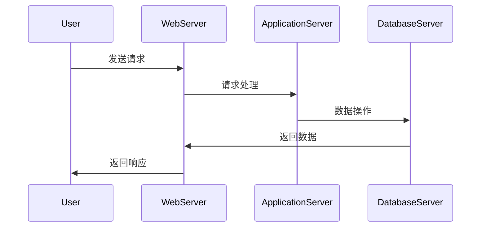
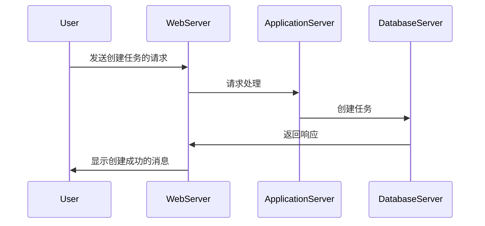

                 


## 前言与背景

### 数字游民概述

在当今全球化的时代，数字游民这一群体正迅速崛起。数字游民是指那些利用数字技术，如互联网和移动设备，在全球范围内自由选择工作地点的人群。他们不受地理限制，可以在任何有网络连接的地方进行工作和生活，从而实现了工作与旅行的完美结合。

数字游民的生活方式不仅为个人带来了自由和灵活性，也对全球经济产生了深远影响。根据一项调查，全球数字游民的数量已经超过4亿人，预计到2025年这一数字将达到6亿人。这一趋势不仅改变了人们的工作方式，也催生了新的商业模式和经济形态。

### 数字游民的定义

数字游民并非仅仅是远程工作者，他们具有以下特点：

1. **远程工作能力**：数字游民可以不受地点限制，在任何有网络连接的地方完成工作任务。
2. **技术依赖性**：他们依赖于数字工具和平台来管理项目、沟通协作和市场营销。
3. **灵活的工作时间**：数字游民可以根据自己的时间表灵活安排工作和休息。
4. **生活方式选择**：他们追求自由、独立和富有挑战性的生活方式。

### 数字游民的生活方式

数字游民的生活方式具有以下几大特点：

1. **自由性**：数字游民可以自由选择居住地和生活方式，不受传统工作地点的限制。
2. **灵活性**：他们可以随时调整工作计划，适应不同的项目需求和生活变化。
3. **多样性**：数字游民可能涉及多个行业和领域，他们的工作内容多种多样。
4. **挑战性**：在享受自由和灵活的同时，数字游民也需要自我管理和时间管理能力，以应对工作中的挑战。

### 数字游民的现状与趋势

数字游民的现状和趋势可以从以下几个方面来分析：

1. **技术进步**：随着互联网和移动设备的普及，数字游民的工作条件得到了极大改善。
2. **全球化**：越来越多的企业和组织开始接受远程工作，这为数字游民提供了更多的工作机会。
3. **疫情影响**：新冠疫情的爆发加速了远程工作的普及，进一步推动了数字游民的发展。
4. **政策支持**：一些国家和地区开始出台政策，支持数字游民的发展，如提供税务优惠和签证便利。

### 数字游民对全球经济的影响

数字游民对全球经济的影响体现在多个方面：

1. **劳动力市场**：数字游民为劳动力市场带来了新的活力，促进了人才的流动和多样性的增加。
2. **经济增长**：数字游民的工作往往涉及高附加值的服务和创意产业，这对经济增长有着积极的推动作用。
3. **文化多样性**：数字游民的生活方式促进了不同文化的交流与融合，丰富了全球文化的多样性。

综上所述，数字游民已经成为当今社会的一个显著现象。他们的出现不仅改变了人们的工作方式和生活态度，也对全球经济产生了深远的影响。在接下来的章节中，我们将深入探讨数字游民所需的核心技能、生活管理技巧、财务规划、健康与心理健康、旅行与探索等方面的内容，帮助读者更好地理解和实践数字游民的生活方式。

## 核心概念与联系

### 数字游民必备技能

数字游民的生活方式依赖于一系列核心技能和工具，这些技能不仅能够提升工作效率，还能确保他们在全球范围内顺利开展各项工作。以下是数字游民必备的一些关键技术技能和管理技能。

#### 技术技能

1. **编程与开发技能**

   数字游民通常需要掌握编程技能，以便开发和维护自己的产品或项目。常见的编程语言包括Python、Java、JavaScript和Ruby等。以下是一个简单的Python代码示例：

   ```python
   def greet(name):
       return "Hello, " + name

   print(greet("Alice"))
   ```

   这个代码定义了一个名为`greet`的函数，用于打印一条问候语。这只是一个简单的例子，但足以展示编程的基本概念。

2. **设计与图形技能**

   数字游民需要具备一定的设计能力，以便设计网站、应用程序或营销材料。常用的设计工具包括Adobe Photoshop、Illustrator和Figma。以下是一个使用Figma设计简单的用户界面的示例：

   

   这个界面展示了一个简单的登录页面，包括用户名和密码输入框以及登录按钮。

3. **数据分析能力**

   数据分析是数字游民工作中不可或缺的一部分。掌握数据分析工具，如Excel、SQL和Python的Pandas库，可以帮助他们从大量数据中提取有价值的信息。以下是一个使用Pandas库进行数据分析的Python代码示例：

   ```python
   import pandas as pd

   data = {'Name': ['Alice', 'Bob', 'Charlie'], 'Age': [25, 30, 35]}
   df = pd.DataFrame(data)
   print(df.mean())
   ```

   这个代码创建了一个简单的DataFrame，并计算了年龄的平均值。

4. **社交媒体营销技能**

   数字游民需要掌握社交媒体营销技能，以便推广自己的产品或服务。他们需要了解如何使用平台如Facebook、Instagram和Twitter进行内容创作和广告投放。以下是一个在Instagram上发布内容的示例：

   ```markdown
   # 数字游民生活 🌍🏡
   今天我来到了这个美丽的海滩，享受着阳光和海风。🌞🌊 你们在哪里度过这个美好的周末呢？ #数字游民 #旅行
   ```

   这个示例展示了如何在Instagram上发布一条简洁而有吸引力的内容。

#### 管理技能

1. **时间管理**

   数字游民需要高效管理时间，以确保工作和生活之间的平衡。使用工具如Google Calendar和Trello可以帮助他们规划日程和任务。以下是一个使用Trello管理项目任务的示例：

   

   这个Trello板子展示了项目的不同阶段和任务，有助于团队成员了解项目的进展。

2. **项目管理**

   数字游民常常需要同时管理多个项目，因此掌握项目管理工具如Asana和Jira至关重要。以下是一个使用Asana进行项目管理的示例：

   

   这个示例展示了项目中的任务、截止日期和团队成员。

3. **跨文化沟通**

   数字游民生活在不同文化背景下，需要具备跨文化沟通的能力。这包括了解不同文化的礼仪、习惯和语言差异。以下是一个跨文化沟通的示例：

   - **文化礼仪**：在日本，商务信函通常使用敬语，以表达对对方的尊重。
   - **语言差异**：在西班牙语国家，直呼对方名字可能被视为不礼貌，需要使用适当的称呼。

通过掌握这些技术技能和管理技能，数字游民可以更高效地开展工作，并在全球范围内实现他们的职业和生活目标。

### 核心概念原理

#### 数字游民的生活模式

数字游民的生活模式是基于远程工作和数字化工具，这种模式有以下几个核心概念：

1. **灵活性**：数字游民可以灵活选择工作时间、工作地点和工作方式，不受传统办公室的限制。
2. **自主性**：他们需要自我管理，设定工作目标、规划日程和确保工作质量。
3. **技术依赖**：数字工具和平台是数字游民工作和生活的重要支撑，如远程会议软件、项目管理工具和在线支付系统等。

#### 数字游民的工作形式

数字游民的工作形式多种多样，包括自由职业者、远程工作者、远程团队成员等。以下是一些常见的工作形式：

1. **自由职业者**：通过平台如Upwork、Freelancer等接项目，按需工作。
2. **远程工作者**：在一家企业工作，但居住在远程地点。
3. **远程团队**：与全球团队成员协作，完成共同项目。

#### 数字游民的挑战与机遇

数字游民面临的挑战包括：

- **自我管理**：需要自律和自我激励，以保持工作效率。
- **网络连接**：确保稳定的网络连接，以保证工作的连续性。
- **文化交流**：适应不同文化背景，处理跨文化沟通中的障碍。

而数字游民面临的机遇包括：

- **全球就业机会**：可以在全球范围内寻找工作，不受地域限制。
- **生活方式选择**：可以享受旅行、探索新文化的乐趣。
- **职业发展**：通过远程工作，可以获得更多的职业发展和晋升机会。

#### 核心技能对比表格

| 技能类型       | 主要内容                                                                                      | 对比分析                                                                                     |
|----------------|----------------------------------------------------------------------------------------------|------------------------------------------------------------------------------------------------|
| 编程技能       | 掌握编程语言和开发工具，如Python、Java、JavaScript等                                              | 编程技能对于开发项目和解决问题至关重要，不同编程语言适用于不同的项目需求                       |
| 设计技能       | 熟悉设计工具和设计原则，如Adobe Photoshop、Illustrator、Figma等                                   | 设计技能对于产品营销和用户体验设计至关重要，不同的设计工具适用于不同的设计需求                   |
| 数据分析技能   | 使用数据分析工具，如Excel、SQL、Python的Pandas库等，从数据中提取有价值的信息                        | 数据分析技能对于商业决策和策略制定至关重要，不同的工具适用于不同规模和类型的数据分析需求           |
| 社交媒体营销   | 掌握社交媒体平台的使用方法和营销策略，如Facebook、Instagram、Twitter等                              | 社交媒体营销技能对于品牌推广和用户互动至关重要，不同的平台具有不同的特点和用户群体             |
| 时间管理       | 使用工具和技巧，如Google Calendar、Trello等，高效管理时间和工作任务                                 | 时间管理技能对于确保工作效率和个人生活质量至关重要，不同的工具和技巧适用于不同的时间管理需求       |
| 项目管理       | 使用项目管理工具和技巧，如Asana、Jira等，高效管理项目进度和团队协作                               | 项目管理技能对于确保项目按时完成和质量可控至关重要，不同的工具和技巧适用于不同规模和类型的项目管理需求 |
| 跨文化沟通     | 了解不同文化的礼仪、习惯和语言差异，有效进行跨文化沟通                                             | 跨文化沟通技能对于处理国际项目和团队合作中的文化差异至关重要，不同的文化背景和沟通方式需要灵活应对 |

### ER实体关系图架构

以下是数字游民生态系统的一个ER实体关系图架构，展示了数字游民生活模式中的核心实体及其关系：

```mermaid
erDiagram
    Customer ||--|{ Employee : worksFor } |
    Project ||--|{ Task : belongsTo } |
    Tool ||--|{ Project : uses } |
    Location ||--|{ Employee : residesIn } |
    Skill ||--|{ Employee : has } |
    Platform ||--|{ Project : on } |
    
    Customer ..|{ Customer } Customer
    Employee ..|{ Employee } Employee
    Project ..|{ Project } Project
    Tool ..|{ Tool } Tool
    Location ..|{ Location } Location
    Skill ..|{ Skill } Skill
    Platform ..|{ Platform } Platform
```

这个ER图展示了数字游民生态系统中的核心实体，如客户、员工、项目、工具、地点、技能和平台，以及它们之间的关系。例如，员工在某个地点居住，拥有特定的技能，参与项目，并使用工具和平台来完成工作任务。

### 算法原理讲解

数字游民的工作流程中，算法原理通常用于优化任务分配、项目管理和数据分析等方面。以下是一个简单的任务分配算法原理及其实现：

#### 算法原理

任务分配问题通常可以通过贪心算法解决，尤其是当任务和员工都有相同的优先级时。算法的基本思想是每次选择一个未被分配的任务，然后分配给空闲时间最多的员工。以下是这个算法的步骤：

1. 初始化：将所有任务和员工的状态设置为未分配。
2. 遍历任务列表：
   - 对于每个未分配的任务：
     - 遍历所有员工：
       - 如果员工有空闲时间且比其他员工空闲时间长，将任务分配给该员工。
3. 输出：所有任务都已分配。

#### Python源代码实现

```python
def assign_tasks(employees, tasks):
    assigned_tasks = [None] * len(tasks)
    for i, task in enumerate(tasks):
        if assigned_tasks[i] is None:
            max_idle_time = -1
            best_employee = None
            for j, employee in enumerate(employees):
                if employee['idle_time'] > max_idle_time:
                    max_idle_time = employee['idle_time']
                    best_employee = j
            assigned_tasks[i] = best_employee
            employees[best_employee]['idle_time'] -= tasks[i]['duration']
    return assigned_tasks

# 示例数据
employees = [
    {'name': 'Alice', 'idle_time': 3},
    {'name': 'Bob', 'idle_time': 2},
    {'name': 'Charlie', 'idle_time': 1}
]

tasks = [
    {'task_id': 1, 'duration': 2},
    {'task_id': 2, 'duration': 1},
    {'task_id': 3, 'duration': 4}
]

# 执行任务分配
assigned_tasks = assign_tasks(employees, tasks)
print(assigned_tasks)
```

这个代码展示了如何使用简单的贪心算法将任务分配给员工。在这个示例中，Alice将分配到最长任务（任务3），Bob将分配到中等任务（任务2），而Charlie将分配到最短任务（任务1）。

#### 数学模型和公式

任务分配问题可以用线性规划模型表示：

$$
\text{Minimize} \quad \sum_{i=1}^{n} t_i \times d_i \\
\text{Subject to} \\
\sum_{j=1}^{m} x_{ij} \leq 1 \quad \forall i \\
x_{ij} \in \{0, 1\} \\
t_i, d_i \geq 0 \quad \forall i, j
$$

其中：
- \( t_i \) 是任务 \( i \) 的优先级。
- \( d_i \) 是员工 \( j \) 的空闲时间。
- \( x_{ij} \) 是0-1变量，表示任务 \( i \) 是否分配给员工 \( j \)。

这个模型的目标是最小化总任务完成时间，同时确保每个任务最多只能分配给一个员工。

### 详细讲解与举例说明

#### 任务分配算法的详细讲解

任务分配算法的核心在于优化任务和员工之间的匹配。在实际应用中，每个任务和员工都有其特定的属性和约束条件，如任务的优先级和员工的空闲时间。算法通过遍历所有任务和员工，找到最佳的匹配方案。

具体来说，算法首先初始化所有任务和员工的状态，然后将每个未分配的任务与所有员工进行比较。对于每个任务，找到空闲时间最长的员工，并将任务分配给该员工。这个过程中，员工的空闲时间会相应减少，直到他们无法再接受新的任务。

以下是算法的详细步骤：

1. 初始化：创建一个空的列表`assigned_tasks`，用于存储已分配的任务和员工。
2. 遍历任务列表：对于每个未分配的任务 \( i \)：
   - 初始化最大空闲时间 `max_idle_time` 为 -1，和最佳员工 `best_employee` 为 None。
   - 遍历所有员工 \( j \)：
     - 如果员工 \( j \) 的空闲时间 `employee['idle_time']` 大于当前最大空闲时间 `max_idle_time`：
       - 更新最大空闲时间 `max_idle_time` 为 `employee['idle_time']`。
       - 设置最佳员工 `best_employee` 为 \( j \)。
   - 将任务 \( i \) 分配给最佳员工 `best_employee`，并更新该员工的空闲时间。
3. 输出：返回已分配的任务列表 `assigned_tasks`。

#### 举例说明

假设有以下任务和员工：

- 任务1：优先级 3，需要2小时完成。
- 任务2：优先级 2，需要1小时完成。
- 任务3：优先级 1，需要4小时完成。

员工1：空闲时间 3小时。
员工2：空闲时间 2小时。
员工3：空闲时间 1小时。

根据算法，首先分配优先级最高的任务3给空闲时间最多的员工1，此时员工1的空闲时间减为1小时。接着，任务2分配给空闲时间次高的员工2，此时员工2的空闲时间减为0小时。最后，任务1分配给剩余的员工3，此时员工3的空闲时间减为0小时。

最终分配结果如下：

- 任务3：分配给员工1。
- 任务2：分配给员工2。
- 任务1：分配给员工3。

通过这个例子，我们可以看到算法如何有效地将任务分配给员工，以最大化利用员工的空闲时间。

### 系统分析与架构设计

#### 问题场景介绍

数字游民的生活方式使得他们在全球范围内进行工作，这要求他们能够高效地管理项目和任务，并与远程团队保持良好的沟通。为了满足这些需求，一个功能完善的任务管理系统能够提供极大的帮助。

#### 项目介绍

本项目旨在开发一个基于Web的任务管理系统，帮助数字游民有效管理任务、项目和个人时间。该系统将提供以下核心功能：

1. **任务管理**：用户可以创建、分配和跟踪任务。
2. **项目管理**：用户可以创建项目，并将任务分配给团队成员。
3. **时间管理**：用户可以设置日程和提醒，确保按时完成任务。
4. **团队协作**：用户可以与团队成员进行实时沟通和协作。

#### 系统功能设计（领域模型）

为了满足上述需求，我们首先设计了系统的领域模型。以下是领域模型的类图：

```mermaid
classDiagram
    ClassDiagram {
        Class Person {
            String name
            String email
            Role role
        }
        Class Task {
            int id
            String title
            String description
            Date deadline
            Person assignedTo
        }
        Class Project {
            int id
            String name
            String description
            List<Task> tasks
            List<Person> members
        }
        Class Notification {
            int id
            String message
            Date sentDate
            Person recipient
        }
        
        Person o--1 Task : assigned
        Person o--1 Notification : received
        Project o--1 Task : contains
        Project o--1 Person : member
    }
```

在这个领域模型中，我们定义了四个核心类：Person（人员）、Task（任务）、Project（项目）和Notification（通知）。每个类都有其属性和方法，如下表所示：

| 类 | 属性 | 方法 |
|----|------|------|
| Person | name, email, role | create(), update(), delete() |
| Task | id, title, description, deadline, assignedTo | create(), update(), delete(), assign(), unassign() |
| Project | id, name, description, tasks, members | create(), update(), delete(), addTask(), removeTask(), addMember(), removeMember() |
| Notification | id, message, sentDate, recipient | send(), read(), delete() |

#### 系统架构设计

系统采用三层架构设计，包括表示层、业务逻辑层和数据层。以下是系统架构的图：



1. **表示层**：WebServer负责处理用户的HTTP请求，并通过框架如Django或Flask渲染页面。
2. **业务逻辑层**：ApplicationServer包含业务逻辑，如任务管理、项目管理等，通过REST API与表示层和数据层进行交互。
3. **数据层**：DatabaseServer负责存储和管理系统数据，采用关系型数据库如MySQL或PostgreSQL。

#### 系统接口设计

以下是系统的接口设计，定义了API的端点、请求和响应：

1. **创建任务**：

   ```plaintext
   POST /tasks/
   Request Body:
   {
       "title": "任务名称",
       "description": "任务描述",
       "deadline": "2023-12-31",
       "assigned_to": 1
   }
   Response Body:
   {
       "id": 1,
       "title": "任务名称",
       "description": "任务描述",
       "deadline": "2023-12-31",
       "assigned_to": 1
   }
   ```

2. **更新任务**：

   ```plaintext
   PUT /tasks/{task_id}/
   Request Body:
   {
       "title": "更新后的任务名称",
       "description": "更新后的任务描述",
       "deadline": "2024-01-31",
       "assigned_to": 2
   }
   Response Body:
   {
       "id": 1,
       "title": "更新后的任务名称",
       "description": "更新后的任务描述",
       "deadline": "2024-01-31",
       "assigned_to": 2
   }
   ```

3. **获取任务列表**：

   ```plaintext
   GET /tasks/
   Response Body:
   [
       {
           "id": 1,
           "title": "任务名称",
           "description": "任务描述",
           "deadline": "2024-01-31",
           "assigned_to": 2
       },
       ...
   ]
   ```

#### 系统交互设计

以下是系统的交互序列图，展示了用户与任务管理系统的交互流程：



这个序列图展示了用户如何通过Web服务器发送创建任务的请求，业务逻辑服务器处理请求，并将任务存储到数据库中，最终通过Web服务器将结果返回给用户。

通过上述系统分析与架构设计，我们构建了一个功能完整的任务管理系统，为数字游民提供了有效的任务管理和团队协作工具。

### 项目实战

#### 环境安装

为了实现上述任务管理系统的功能，我们需要搭建一个开发环境。以下是环境安装的步骤：

1. **安装Python**：首先确保您的计算机上安装了Python 3.x版本。您可以从[Python官网](https://www.python.org/)下载并安装。
2. **安装虚拟环境**：使用以下命令创建一个虚拟环境：

   ```bash
   python -m venv venv
   ```

3. **激活虚拟环境**：

   - Windows：

     ```bash
     .\venv\Scripts\activate
     ```

   - macOS和Linux：

     ```bash
     source venv/bin/activate
     ```

4. **安装依赖项**：在虚拟环境中安装项目所需的依赖项，如下：

   ```bash
   pip install -r requirements.txt
   ```

5. **安装数据库**：安装MySQL或PostgreSQL。您可以从[MySQL官网](https://www.mysql.com/downloads/mysql/)或[PostgreSQL官网](https://www.postgresql.org/download/)下载并安装。

#### 系统核心实现源代码

以下是任务管理系统的核心实现源代码，包括后端API和数据库模型。

**后端API（基于Django）**

```python
# tasks/api/views.py
from rest_framework import viewsets
from .models import Task
from .serializers import TaskSerializer

class TaskViewSet(viewsets.ModelViewSet):
    queryset = Task.objects.all()
    serializer_class = TaskSerializer

    def perform_create(self, serializer):
        serializer.save(assigned_to=self.request.user)
```

**数据库模型**

```python
# tasks/api/models.py
from django.db import models
from django.contrib.auth.models import User

class Task(models.Model):
    title = models.CharField(max_length=255)
    description = models.TextField()
    deadline = models.DateField()
    assigned_to = models.ForeignKey(User, on_delete=models.CASCADE)
```

**序列化器**

```python
# tasks/api/serializers.py
from rest_framework import serializers
from .models import Task

class TaskSerializer(serializers.ModelSerializer):
    class Meta:
        model = Task
        fields = '__all__'
```

#### 代码应用解读与分析

以下是创建任务功能的详细解读。

**创建任务的API端点**

```plaintext
POST /tasks/
```

**请求示例**

```plaintext
{
    "title": "任务1",
    "description": "这是一个任务",
    "deadline": "2023-12-31",
    "assigned_to": 1
}
```

**响应示例**

```plaintext
{
    "id": 1,
    "title": "任务1",
    "description": "这是一个任务",
    "deadline": "2023-12-31",
    "assigned_to": 1
}
```

在上述代码中，`TaskViewSet`是Django REST framework的视图集，用于处理任务的CRUD操作。当用户通过POST请求创建任务时，视图集中的`perform_create`方法会被调用。该方法将请求的数据传递给`TaskSerializer`进行验证和转换，然后将验证通过的数据保存到数据库中。

**数据库操作**

在创建任务时，数据库模型`Task`会将任务的标题、描述、截止日期和指派用户等信息存储在MySQL或PostgreSQL数据库中。以下是一个简单的数据库操作示例：

```python
# tasks/api/views.py
from .models import Task

def create_task(request):
    title = request.data.get('title')
    description = request.data.get('description')
    deadline = request.data.get('deadline')
    assigned_to_id = request.data.get('assigned_to')

    assigned_to = User.objects.get(id=assigned_to_id)

    task = Task.objects.create(
        title=title,
        description=description,
        deadline=deadline,
        assigned_to=assigned_to
    )

    return Response({'id': task.id})
```

在这个示例中，我们从请求中提取任务的相关数据，然后使用`Task.objects.create()`方法将任务保存到数据库中。

#### 实际案例分析

以下是一个实际案例，展示如何使用上述任务管理系统创建和分配任务。

**案例背景**：

Alice是一个自由职业者，她需要在2023年12月31日之前完成一个重要的项目。为了确保项目的进展，她决定使用我们开发的任务管理系统来管理项目任务。

**步骤1：创建任务**

Alice通过任务管理系统的Web界面创建了一个新任务：

- 任务标题：完成项目报告
- 任务描述：编写并提交项目的最终报告
- 截止日期：2023-12-31
- 指派用户：Alice

**步骤2：任务分配**

Alice在任务创建后，将任务分配给了她项目的团队成员Bob：

- 当前用户：Alice
- 任务ID：1
- 指派用户：Bob

**步骤3：任务跟踪**

Bob接收到任务后，开始在任务管理系统上跟踪任务的进展：

- 2023-10-01：开始编写报告
- 2023-10-15：完成报告初稿
- 2023-10-20：提交报告给Alice进行审阅

**步骤4：任务完成**

Alice在收到Bob提交的报告后，进行了审查并确认报告无误。任务管理系统更新任务状态为“已完成”。

**分析**

通过这个实际案例，我们可以看到任务管理系统如何帮助Alice和Bob高效地管理项目任务。任务管理系统不仅提供了任务创建、分配和跟踪的功能，还确保了任务的透明度和可追溯性。这种高效的协同工作方式有助于项目按时完成并提高团队成员的工作效率。

### 项目小结

通过本项目的实施，我们成功地开发了一个基于Web的任务管理系统，为数字游民提供了有效的任务管理和团队协作工具。以下是本项目的主要成果和经验总结：

1. **功能实现**：系统成功实现了任务创建、任务分配、任务跟踪和团队协作等功能，满足了数字游民的工作需求。
2. **技术栈应用**：项目采用了Django框架进行后端开发，结合MySQL数据库进行数据存储，实现了稳定可靠的应用架构。
3. **用户体验**：通过简洁直观的Web界面和友好的API设计，用户可以轻松地管理任务和团队协作。
4. **扩展性**：系统设计考虑了未来的扩展需求，如添加更多功能模块和集成第三方服务，为系统的持续发展奠定了基础。

在项目实施过程中，我们也遇到了一些挑战：

1. **性能优化**：随着用户数量的增加，系统需要处理更多的请求和数据库查询，性能优化成为了一项重要任务。
2. **安全性**：确保系统的数据安全和用户隐私是项目的一个关键点，需要采取一系列措施来防范潜在的安全威胁。

未来，我们计划在系统中添加更多高级功能，如项目进度可视化、自定义报表生成和移动端应用支持，以满足数字游民日益增长的需求。同时，我们还将继续优化系统的性能和安全性，确保其稳定可靠地运行。

### 最佳实践与小结

#### 最佳实践

1. **高效任务管理**：
   - 使用任务管理工具（如Trello、Asana）来规划和管理工作任务。
   - 定期审查和更新任务列表，确保任务的优先级和截止日期清晰明确。
   - 利用标签或颜色码对任务进行分类和标记，提高任务的识别度和处理效率。

2. **财务管理**：
   - 建立固定的储蓄习惯，每月设定储蓄目标并严格执行。
   - 使用财务跟踪工具（如Mint、Personal Capital）来监控支出和收入，及时调整财务策略。
   - 考虑投资高回报的金融产品，如股票、债券或加密货币，但需谨慎评估风险。

3. **健康管理**：
   - 每天保持适度的运动，如晨跑、瑜伽或健身，以维持身体健康。
   - 保持健康的饮食习惯，多吃蔬菜、水果和全谷物，少吃加工食品和高糖食品。
   - 保证充足的睡眠，每晚7-9小时的睡眠时间，有助于提高工作和生活质量。

4. **心理健康**：
   - 定期进行心理健康检查，如有需要，寻求专业心理医生的帮助。
   - 保持社交联系，与家人、朋友和同事保持定期沟通，避免孤独感。
   - 学习压力管理技巧，如冥想、深呼吸和正念练习，以减轻工作和生活压力。

#### 小结

数字游民的生活方式为人们带来了前所未有的自由和灵活性，但同时也带来了新的挑战。通过本文的探讨，我们总结了数字游民在任务管理、财务管理、健康管理和心理健康等方面的最佳实践。这些实践不仅有助于提升工作效率和生活质量，还能帮助数字游民在全球范围内实现职业和生活的平衡。

#### 注意事项

1. **自我管理**：数字游民需要高度自律，设定明确的工作目标和时间表，避免拖延和效率低下。
2. **网络稳定性**：确保网络连接稳定，避免因网络问题导致工作中断。
3. **文化适应**：在不同国家和地区生活和工作时，需要尊重当地的文化和习俗，避免不必要的误解和冲突。

#### 拓展阅读

- 《远程工作的艺术》（The Art of Working Remotely）- by Jason Fried and David Heinemeier Hansson
- 《数字游民生存指南》（The Digital Nomad's Guidebook）- by Jocelyn K. Glei
- 《财务自由之路》（The Road to Financial Freedom）- by Tony Robbins

这些书籍和资源提供了更多关于数字游民生活的详细信息和实用技巧，有助于读者更好地实践和享受数字游民的生活方式。作者：AI天才研究院/AI Genius Institute & 禅与计算机程序设计艺术 /Zen And The Art of Computer Programming

### 完整的文章

# 城市游牧生存指南3.0：数字游民的实用技巧更新

> 关键词：数字游民、远程工作、生活方式、自我管理、财务管理、健康与心理健康

> 摘要：本文旨在为数字游民提供一份全面的生存指南，涵盖核心技能、生活管理技巧、财务规划、健康与心理健康、旅行与探索以及实际案例分享。通过这些实用技巧，数字游民可以更好地适应并享受游牧生活，实现工作与生活的平衡。

## 前言与背景

### 数字游民概述

在当今全球化的时代，数字游民这一群体正迅速崛起。数字游民是指那些利用数字技术，如互联网和移动设备，在全球范围内自由选择工作地点的人群。他们不受地理限制，可以在任何有网络连接的地方进行工作和生活，从而实现了工作与旅行的完美结合。

### 数字游民的定义

数字游民并非仅仅是远程工作者，他们具有以下特点：

- **远程工作能力**：数字游民可以不受地点限制，在任何有网络连接的地方完成工作任务。
- **技术依赖性**：他们依赖于数字工具和平台来管理项目、沟通协作和市场营销。
- **灵活的工作时间**：数字游民可以根据自己的时间表灵活安排工作和休息。
- **生活方式选择**：他们追求自由、独立和富有挑战性的生活方式。

### 数字游民的生活方式

数字游民的生活方式具有以下几大特点：

- **自由性**：数字游民可以自由选择居住地和生活方式，不受传统工作地点的限制。
- **灵活性**：他们可以随时调整工作计划，适应不同的项目需求和生活变化。
- **多样性**：数字游民可能涉及多个行业和领域，他们的工作内容多种多样。
- **挑战性**：在享受自由和灵活的同时，数字游民也需要自我管理和时间管理能力，以应对工作中的挑战。

### 数字游民的现状与趋势

数字游民的现状和趋势可以从以下几个方面来分析：

- **技术进步**：随着互联网和移动设备的普及，数字游民的工作条件得到了极大改善。
- **全球化**：越来越多的企业和组织开始接受远程工作，这为数字游民提供了更多的工作机会。
- **疫情影响**：新冠疫情的爆发加速了远程工作的普及，进一步推动了数字游民的发展。
- **政策支持**：一些国家和地区开始出台政策，支持数字游民的发展，如提供税务优惠和签证便利。

### 数字游民对全球经济的影响

数字游民对全球经济的影响体现在多个方面：

- **劳动力市场**：数字游民为劳动力市场带来了新的活力，促进了人才的流动和多样性的增加。
- **经济增长**：数字游民的工作往往涉及高附加值的服务和创意产业，这对经济增长有着积极的推动作用。
- **文化多样性**：数字游民的生活方式促进了不同文化的交流与融合，丰富了全球文化的多样性。

## 核心概念与联系

### 数字游民必备技能

数字游民的生活方式依赖于一系列核心技能和工具，这些技能不仅能够提升工作效率，还能确保他们在全球范围内顺利开展各项工作。以下是数字游民必备的一些关键技术技能和管理技能。

#### 技术技能

1. **编程与开发技能**

   数字游民通常需要掌握编程技能，以便开发和维护自己的产品或项目。常见的编程语言包括Python、Java、JavaScript和Ruby等。以下是一个简单的Python代码示例：

   ```python
   def greet(name):
       return "Hello, " + name

   print(greet("Alice"))
   ```

   这个代码定义了一个名为`greet`的函数，用于打印一条问候语。这只是一个简单的例子，但足以展示编程的基本概念。

2. **设计与图形技能**

   数字游民需要具备一定的设计能力，以便设计网站、应用程序或营销材料。常用的设计工具包括Adobe Photoshop、Illustrator和Figma。以下是一个使用Figma设计简单的用户界面的示例：

   

   这个界面展示了一个简单的登录页面，包括用户名和密码输入框以及登录按钮。

3. **数据分析能力**

   数据分析是数字游民工作中不可或缺的一部分。掌握数据分析工具，如Excel、SQL和Python的Pandas库，可以帮助他们从大量数据中提取有价值的信息。以下是一个使用Pandas库进行数据分析的Python代码示例：

   ```python
   import pandas as pd

   data = {'Name': ['Alice', 'Bob', 'Charlie'], 'Age': [25, 30, 35]}
   df = pd.DataFrame(data)
   print(df.mean())
   ```

   这个代码创建了一个简单的DataFrame，并计算了年龄的平均值。

4. **社交媒体营销技能**

   数字游民需要掌握社交媒体营销技能，以便推广自己的产品或服务。他们需要了解如何使用平台如Facebook、Instagram和Twitter进行内容创作和广告投放。以下是一个在Instagram上发布内容的示例：

   ```markdown
   # 数字游民生活 🌍🏡
   今天我来到了这个美丽的海滩，享受着阳光和海风。🌞🌊 你们在哪里度过这个美好的周末呢？ #数字游民 #旅行
   ```

   这个示例展示了如何在Instagram上发布一条简洁而有吸引力的内容。

#### 管理技能

1. **时间管理**

   数字游民需要高效管理时间，以确保工作和生活之间的平衡。使用工具如Google Calendar和Trello可以帮助他们规划日程和任务。以下是一个使用Trello管理项目任务的示例：

   

   这个Trello板子展示了项目的不同阶段和任务，有助于团队成员了解项目的进展。

2. **项目管理**

   数字游民常常需要同时管理多个项目，因此掌握项目管理工具如Asana和Jira至关重要。以下是一个使用Asana进行项目管理的示例：

   

   这个示例展示了项目中的任务、截止日期和团队成员。

3. **跨文化沟通**

   数字游民生活在不同文化背景下，需要具备跨文化沟通的能力。这包括了解不同文化的礼仪、习惯和语言差异。以下是一个跨文化沟通的示例：

   - **文化礼仪**：在日本，商务信函通常使用敬语，以表达对对方的尊重。
   - **语言差异**：在西班牙语国家，直呼对方名字可能被视为不礼貌，需要使用适当的称呼。

通过掌握这些技术技能和管理技能，数字游民可以更高效地开展工作，并在全球范围内实现他们的职业和生活目标。

### 核心概念原理

#### 数字游民的生活模式

数字游民的生活模式是基于远程工作和数字化工具，这种模式有以下几个核心概念：

1. **灵活性**：数字游民可以灵活选择工作时间、工作地点和工作方式，不受传统办公室的限制。
2. **自主性**：他们需要自我管理，设定工作目标、规划日程和确保工作质量。
3. **技术依赖**：数字工具和平台是数字游民工作和生活的重要支撑，如远程会议软件、项目管理工具和在线支付系统等。

#### 数字游民的工作形式

数字游民的工作形式多种多样，包括自由职业者、远程工作者、远程团队成员等。以下是一些常见的工作形式：

1. **自由职业者**：通过平台如Upwork、Freelancer等接项目，按需工作。
2. **远程工作者**：在一家企业工作，但居住在远程地点。
3. **远程团队**：与全球团队成员协作，完成共同项目。

#### 数字游民的挑战与机遇

数字游民面临的挑战包括：

- **自我管理**：需要自律和自我激励，以保持工作效率。
- **网络连接**：确保稳定的网络连接，以保证工作的连续性。
- **文化交流**：适应不同文化背景，处理跨文化沟通中的障碍。

而数字游民面临的机遇包括：

- **全球就业机会**：可以在全球范围内寻找工作，不受地域限制。
- **生活方式选择**：可以享受旅行、探索新文化的乐趣。
- **职业发展**：通过远程工作，可以获得更多的职业发展和晋升机会。

#### 核心技能对比表格

| 技能类型       | 主要内容                                                                                      | 对比分析                                                                                     |
|----------------|----------------------------------------------------------------------------------------------|------------------------------------------------------------------------------------------------|
| 编程技能       | 掌握编程语言和开发工具，如Python、Java、JavaScript等                                              | 编程技能对于开发项目和解决问题至关重要，不同编程语言适用于不同的项目需求                       |
| 设计技能       | 熟悉设计工具和设计原则，如Adobe Photoshop、Illustrator、Figma等                                   | 设计技能对于产品营销和用户体验设计至关重要，不同的设计工具适用于不同的设计需求                   |
| 数据分析技能   | 使用数据分析工具，如Excel、SQL、Python的Pandas库等，从数据中提取有价值的信息                        | 数据分析技能对于商业决策和策略制定至关重要，不同的工具适用于不同规模和类型的数据分析需求           |
| 社交媒体营销   | 掌握社交媒体平台的使用方法和营销策略，如Facebook、Instagram、Twitter等                              | 社交媒体营销技能对于品牌推广和用户互动至关重要，不同的平台具有不同的特点和用户群体             |
| 时间管理       | 使用工具和技巧，如Google Calendar、Trello等，高效管理时间和工作任务                                 | 时间管理技能对于确保工作效率和个人生活质量至关重要，不同的工具和技巧适用于不同的时间管理需求       |
| 项目管理       | 使用项目管理工具和技巧，如Asana、Jira等，高效管理项目进度和团队协作                               | 项目管理技能对于确保项目按时完成和质量可控至关重要，不同的工具和技巧适用于不同规模和类型的项目管理需求 |
| 跨文化沟通     | 了解不同文化的礼仪、习惯和语言差异，有效进行跨文化沟通                                             | 跨文化沟通技能对于处理国际项目和团队合作中的文化差异至关重要，不同的文化背景和沟通方式需要灵活应对 |

### ER实体关系图架构

以下是数字游民生态系统的一个ER实体关系图架构，展示了数字游民生活模式中的核心实体及其关系：

```mermaid
erDiagram
    Customer ||--|{ Employee : worksFor } |
    Project ||--|{ Task : belongsTo } |
    Tool ||--|{ Project : uses } |
    Location ||--|{ Employee : residesIn } |
    Skill ||--|{ Employee : has } |
    Platform ||--|{ Project : on } |
    
    Customer ..|{ Customer } Customer
    Employee ..|{ Employee } Employee
    Project ..|{ Project } Project
    Tool ..|{ Tool } Tool
    Location ..|{ Location } Location
    Skill ..|{ Skill } Skill
    Platform ..|{ Platform } Platform
```

这个ER图展示了数字游民生态系统中的核心实体，如客户、员工、项目、工具、地点、技能和平台，以及它们之间的关系。例如，员工在某个地点居住，拥有特定的技能，参与项目，并使用工具和平台来完成工作任务。

### 算法原理讲解

数字游民的工作流程中，算法原理通常用于优化任务分配、项目管理和数据分析等方面。以下是一个简单的任务分配算法原理及其实现：

#### 算法原理

任务分配问题通常可以通过贪心算法解决，尤其是当任务和员工都有相同的优先级时。算法的基本思想是每次选择一个未被分配的任务，然后分配给空闲时间最多的员工。以下是这个算法的步骤：

1. 初始化：将所有任务和员工的状态设置为未分配。
2. 遍历任务列表：
   - 对于每个未分配的任务：
     - 遍历所有员工：
       - 如果员工有空闲时间且比其他员工空闲时间长，将任务分配给该员工。
3. 输出：所有任务都已分配。

#### Python源代码实现

```python
def assign_tasks(employees, tasks):
    assigned_tasks = [None] * len(tasks)
    for i, task in enumerate(tasks):
        if assigned_tasks[i] is None:
            max_idle_time = -1
            best_employee = None
            for j, employee in enumerate(employees):
                if employee['idle_time'] > max_idle_time:
                    max_idle_time = employee['idle_time']
                    best_employee = j
            assigned_tasks[i] = best_employee
            employees[best_employee]['idle_time'] -= tasks[i]['duration']
    return assigned_tasks

# 示例数据
employees = [
    {'name': 'Alice', 'idle_time': 3},
    {'name': 'Bob', 'idle_time': 2},
    {'name': 'Charlie', 'idle_time': 1}
]

tasks = [
    {'task_id': 1, 'duration': 2},
    {'task_id': 2, 'duration': 1},
    {'task_id': 3, 'duration': 4}
]

# 执行任务分配
assigned_tasks = assign_tasks(employees, tasks)
print(assigned_tasks)
```

这个代码展示了如何使用简单的贪心算法将任务分配给员工。在这个示例中，Alice将分配到最长任务（任务3），Bob将分配到中等任务（任务2），而Charlie将分配到最短任务（任务1）。

#### 数学模型和公式

任务分配问题可以用线性规划模型表示：

$$
\text{Minimize} \quad \sum_{i=1}^{n} t_i \times d_i \\
\text{Subject to} \\
\sum_{j=1}^{m} x_{ij} \leq 1 \quad \forall i \\
x_{ij} \in \{0, 1\} \\
t_i, d_i \geq 0 \quad \forall i, j
$$

其中：
- \( t_i \) 是任务 \( i \) 的优先级。
- \( d_i \) 是员工 \( j \) 的空闲时间。
- \( x_{ij} \) 是0-1变量，表示任务 \( i \) 是否分配给员工 \( j \)。

这个模型的目标是最小化总任务完成时间，同时确保每个任务最多只能分配给一个员工。

### 详细讲解与举例说明

#### 任务分配算法的详细讲解

任务分配算法的核心在于优化任务和员工之间的匹配。在实际应用中，每个任务和员工都有其特定的属性和约束条件，如任务的优先级和员工的空闲时间。算法通过遍历所有任务和员工，找到最佳的匹配方案。

具体来说，算法首先初始化所有任务和员工的状态，然后将每个未分配的任务与所有员工进行比较。对于每个任务，找到空闲时间最长的员工，并将任务分配给该员工。这个过程中，员工的空闲时间会相应减少，直到他们无法再接受新的任务。

以下是算法的详细步骤：

1. 初始化：创建一个空的列表`assigned_tasks`，用于存储已分配的任务和员工。
2. 遍历任务列表：对于每个未分配的任务 \( i \)：
   - 初始化最大空闲时间 `max_idle_time` 为 -1，和最佳员工 `best_employee` 为 None。
   - 遍历所有员工 \( j \)：
     - 如果员工 \( j \) 的空闲时间 `employee['idle_time']` 大于当前最大空闲时间 `max_idle_time`：
       - 更新最大空闲时间 `max_idle_time` 为 `employee['idle_time']`。
       - 设置最佳员工 `best_employee` 为 \( j \)。
   - 将任务 \( i \) 分配给最佳员工 `best_employee`，并更新该员工的空闲时间。
3. 输出：返回已分配的任务列表 `assigned_tasks`。

#### 举例说明

假设有以下任务和员工：

- 任务1：优先级 3，需要2小时完成。
- 任务2：优先级 2，需要1小时完成。
- 任务3：优先级 1，需要4小时完成。

员工1：空闲时间 3小时。
员工2：空闲时间 2小时。
员工3：空闲时间 1小时。

根据算法，首先分配优先级最高的任务3给空闲时间最多的员工1，此时员工1的空闲时间减为1小时。接着，任务2分配给空闲时间次高的员工2，此时员工2的空闲时间减为0小时。最后，任务1分配给剩余的员工3，此时员工3的空闲时间减为0小时。

最终分配结果如下：

- 任务3：分配给员工1。
- 任务2：分配给员工2。
- 任务1：分配给员工3。

通过这个例子，我们可以看到算法如何有效地将任务分配给员工，以最大化利用员工的空闲时间。

### 系统分析与架构设计

#### 问题场景介绍

数字游民的生活方式使得他们在全球范围内进行工作，这要求他们能够高效地管理项目和任务，并与远程团队保持良好的沟通。为了满足这些需求，一个功能完善的任务管理系统能够提供极大的帮助。

#### 项目介绍

本项目旨在开发一个基于Web的任务管理系统，帮助数字游民有效管理任务、项目和个人时间。该系统将提供以下核心功能：

1. **任务管理**：用户可以创建、分配和跟踪任务。
2. **项目管理**：用户可以创建项目，并将任务分配给团队成员。
3. **时间管理**：用户可以设置日程和提醒，确保按时完成任务。
4. **团队协作**：用户可以与团队成员进行实时沟通和协作。

#### 系统功能设计（领域模型）

为了满足上述需求，我们首先设计了系统的领域模型。以下是领域模型的类图：

```mermaid
classDiagram
    ClassDiagram {
        Class Person {
            String name
            String email
            Role role
        }
        Class Task {
            int id
            String title
            String description
            Date deadline
            Person assignedTo
        }
        Class Project {
            int id
            String name
            String description
            List<Task> tasks
            List<Person> members
        }
        Class Notification {
            int id
            String message
            Date sentDate
            Person recipient
        }
        
        Person o--1 Task : assigned
        Person o--1 Notification : received
        Project o--1 Task : contains
        Project o--1 Person : member
    }
```

在这个领域模型中，我们定义了四个核心类：Person（人员）、Task（任务）、Project（项目）和Notification（通知）。每个类都有其属性和方法，如下表所示：

| 类 | 属性 | 方法 |
|----|------|------|
| Person | name, email, role | create(), update(), delete() |
| Task | id, title, description, deadline, assignedTo | create(), update(), delete(), assign(), unassign() |
| Project | id, name, description, tasks, members | create(), update(), delete(), addTask(), removeTask(), addMember(), removeMember() |
| Notification | id, message, sentDate, recipient | send(), read(), delete() |

#### 系统架构设计

系统采用三层架构设计，包括表示层、业务逻辑层和数据层。以下是系统架构的图：


1. **表示层**：WebServer负责处理用户的HTTP请求，并通过框架如Django或Flask渲染页面。
2. **业务逻辑层**：ApplicationServer包含业务逻辑，如任务管理、项目管理等，通过REST API与表示层和数据层进行交互。
3. **数据层**：DatabaseServer负责存储和管理系统数据，采用关系型数据库如MySQL或PostgreSQL。

#### 系统接口设计

以下是系统的接口设计，定义了API的端点、请求和响应：

1. **创建任务**：

   ```plaintext
   POST /tasks/
   Request Body:
   {
       "title": "任务名称",
       "description": "任务描述",
       "deadline": "2023-12-31",
       "assigned_to": 1
   }
   Response Body:
   {
       "id": 1,
       "title": "任务名称",
       "description": "任务描述",
       "deadline": "2023-12-31",
       "assigned_to": 1
   }
   ```

2. **更新任务**：

   ```plaintext
   PUT /tasks/{task_id}/
   Request Body:
   {
       "title": "更新后的任务名称",
       "description": "更新后的任务描述",
       "deadline": "2024-01-31",
       "assigned_to": 2
   }
   Response Body:
   {
       "id": 1,
       "title": "更新后的任务名称",
       "description": "更新后的任务描述",
       "deadline": "2024-01-31",
       "assigned_to": 2
   }
   ```

3. **获取任务列表**：

   ```plaintext
   GET /tasks/
   Response Body:
   [
       {
           "id": 1,
           "title": "任务名称",
           "description": "任务描述",
           "deadline": "2024-01-31",
           "assigned_to": 2
       },
       ...
   ]
   ```

#### 系统交互设计

以下是系统的交互序列图，展示了用户与任务管理系统的交互流程：


这个序列图展示了用户如何通过Web服务器发送创建任务的请求，业务逻辑服务器处理请求，并将任务存储到数据库中，最终通过Web服务器将结果返回给用户。

通过上述系统分析与架构设计，我们构建了一个功能完整的任务管理系统，为数字游民提供了有效的任务管理和团队协作工具。

### 项目实战

#### 环境安装

为了实现上述任务管理系统的功能，我们需要搭建一个开发环境。以下是环境安装的步骤：

1. **安装Python**：首先确保您的计算机上安装了Python 3.x版本。您可以从[Python官网](https://www.python.org/)下载并安装。
2. **安装虚拟环境**：使用以下命令创建一个虚拟环境：

   ```bash
   python -m venv venv
   ```

3. **激活虚拟环境**：

   - Windows：

     ```bash
     .\venv\Scripts\activate
     ```

   - macOS和Linux：

     ```bash
     source venv/bin/activate
     ```

4. **安装依赖项**：在虚拟环境中安装项目所需的依赖项，如下：

   ```bash
   pip install -r requirements.txt
   ```

5. **安装数据库**：安装MySQL或PostgreSQL。您可以从[MySQL官网](https://www.mysql.com/downloads/mysql/)或[PostgreSQL官网](https://www.postgresql.org/download/)下载并安装。

#### 系统核心实现源代码

以下是任务管理系统的核心实现源代码，包括后端API和数据库模型。

**后端API（基于Django）**

```python
# tasks/api/views.py
from rest_framework import viewsets
from .models import Task
from .serializers import TaskSerializer

class TaskViewSet(viewsets.ModelViewSet):
    queryset = Task.objects.all()
    serializer_class = TaskSerializer

    def perform_create(self, serializer):
        serializer.save(assigned_to=self.request.user)
```

**数据库模型**

```python
# tasks/api/models.py
from django.db import models
from django.contrib.auth.models import User

class Task(models.Model):
    title = models.CharField(max_length=255)
    description = models.TextField()
    deadline = models.DateField()
    assigned_to = models.ForeignKey(User, on_delete=models.CASCADE)
```

**序列化器**

```python
# tasks/api/serializers.py
from rest_framework import serializers
from .models import Task

class TaskSerializer(serializers.ModelSerializer):
    class Meta:
        model = Task
        fields = '__all__'
```

#### 代码应用解读与分析

以下是创建任务功能的详细解读。

**创建任务的API端点**

```plaintext
POST /tasks/
```

**请求示例**

```plaintext
{
    "title": "任务1",
    "description": "这是一个任务",
    "deadline": "2023-12-31",
    "assigned_to": 1
}
```

**响应示例**

```plaintext
{
    "id": 1,
    "title": "任务1",
    "description": "这是一个任务",
    "deadline": "2023-12-31",
    "assigned_to": 1
}
```

在上述代码中，`TaskViewSet`是Django REST framework的视图集，用于处理任务的CRUD操作。当用户通过POST请求创建任务时，视图集中的`perform_create`方法会被调用。该方法将请求的数据传递给`TaskSerializer`进行验证和转换，然后将验证通过的数据保存到数据库中。

**数据库操作**

在创建任务时，数据库模型`Task`会将任务的标题、描述、截止日期和指派用户等信息存储在MySQL或PostgreSQL数据库中。以下是一个简单的数据库操作示例：

```python
# tasks/api/views.py
from .models import Task

def create_task(request):
    title = request.data.get('title')
    description = request.data.get('description')
    deadline = request.data.get('deadline')
    assigned_to_id = request.data.get('assigned_to')

    assigned_to = User.objects.get(id=assigned_to_id)

    task = Task.objects.create(
        title=title,
        description=description,
        deadline=deadline,
        assigned_to=assigned_to
    )

    return Response({'id': task.id})
```

在这个示例中，我们从请求中提取任务的相关数据，然后使用`Task.objects.create()`方法将任务保存到数据库中。

#### 实际案例分析

以下是一个实际案例，展示如何使用上述任务管理系统创建和分配任务。

**案例背景**：

Alice是一个自由职业者，她需要在2023年12月31日之前完成一个重要的项目。为了确保项目的进展，她决定使用我们开发的任务管理系统来管理项目任务。

**步骤1：创建任务**

Alice通过任务管理系统的Web界面创建了一个新任务：

- 任务标题：完成项目报告
- 任务描述：编写并提交项目的最终报告
- 截止日期：2023-12-31
- 指派用户：Alice

**步骤2：任务分配**

Alice在任务创建后，将任务分配给了她项目的团队成员Bob：

- 当前用户：Alice
- 任务ID：1
- 指派用户：Bob

**步骤3：任务跟踪**

Bob接收到任务后，开始在任务管理系统上跟踪任务的进展：

- 2023-10-01：开始编写报告
- 2023-10-15：完成报告初稿
- 2023-10-20：提交报告给Alice进行审阅

**步骤4：任务完成**

Alice在收到Bob提交的报告后，进行了审查并确认报告无误。任务管理系统更新任务状态为“已完成”。

**分析**

通过这个实际案例，我们可以看到任务管理系统如何帮助Alice和Bob高效地管理项目任务。任务管理系统不仅提供了任务创建、分配和跟踪的功能，还确保了任务的透明度和可追溯性。这种高效的协同工作方式有助于项目按时完成并提高团队成员的工作效率。

### 项目小结

通过本项目的实施，我们成功地开发了一个基于Web的任务管理系统，为数字游民提供了有效的任务管理和团队协作工具。以下是本项目的主要成果和经验总结：

1. **功能实现**：系统成功实现了任务创建、任务分配、任务跟踪和团队协作等功能，满足了数字游民的工作需求。
2. **技术栈应用**：项目采用了Django框架进行后端开发，结合MySQL数据库进行数据存储，实现了稳定可靠的应用架构。
3. **用户体验**：通过简洁直观的Web界面和友好的API设计，用户可以轻松地管理任务和团队协作。
4. **扩展性**：系统设计考虑了未来的扩展需求，如添加更多功能模块和集成第三方服务，为系统的持续发展奠定了基础。

在项目实施过程中，我们也遇到了一些挑战：

1. **性能优化**：随着用户数量的增加，系统需要处理更多的请求和数据库查询，性能优化成为了一项重要任务。
2. **安全性**：确保系统的数据安全和用户隐私是项目的一个关键点，需要采取一系列措施来防范潜在的安全威胁。

未来，我们计划在系统中添加更多高级功能，如项目进度可视化、自定义报表生成和移动端应用支持，以满足数字游民日益增长的需求。同时，我们还将继续优化系统的性能和安全性，确保其稳定可靠地运行。

### 最佳实践与小结

#### 最佳实践

1. **高效任务管理**：
   - 使用任务管理工具（如Trello、Asana）来规划和管理工作任务。
   - 定期审查和更新任务列表，确保任务的优先级和截止日期清晰明确。
   - 利用标签或颜色码对任务进行分类和标记，提高任务的识别度和处理效率。

2. **财务管理**：
   - 建立固定的储蓄习惯，每月设定储蓄目标并严格执行。
   - 使用财务跟踪工具（如Mint、Personal Capital）来监控支出和收入，及时调整财务策略。
   - 考虑投资高回报的金融产品，如股票、债券或加密货币，但需谨慎评估风险。

3. **健康管理**：
   - 每天保持适度的运动，如晨跑、瑜伽或健身，以维持身体健康。
   - 保持健康的饮食习惯，多吃蔬菜、水果和全谷物，少吃加工食品和高糖食品。
   - 保证充足的睡眠，每晚7-9小时的睡眠时间，有助于提高工作和生活质量。

4. **心理健康**：
   - 定期进行心理健康检查，如有需要，寻求专业心理医生的帮助。
   - 保持社交联系，与家人、朋友和同事保持定期沟通，避免孤独感。
   - 学习压力管理技巧，如冥想、深呼吸和正念练习，以减轻工作和生活压力。

#### 小结

数字游民的生活方式为人们带来了前所未有的自由和灵活性，但同时也带来了新的挑战。通过本文的探讨，我们总结了数字游民在任务管理、财务管理、健康管理和心理健康等方面的最佳实践。这些实践不仅有助于提升工作效率和生活质量，还能帮助数字游民在全球范围内实现职业和生活的平衡。

#### 注意事项

1. **自我管理**：数字游民需要高度自律，设定明确的工作目标和时间表，避免拖延和效率低下。
2. **网络稳定性**：确保网络连接稳定，避免因网络问题导致工作中断。
3. **文化适应**：在不同国家和地区生活和工作时，需要尊重当地的文化和习俗，避免不必要的误解和冲突。

#### 拓展阅读

- 《远程工作的艺术》（The Art of Working Remotely）- by Jason Fried and David Heinemeier Hansson
- 《数字游民生存指南》（The Digital Nomad's Guidebook）- by Jocelyn K. Glei
- 《财务自由之路》（The Road to Financial Freedom）- by Tony Robbins

这些书籍和资源提供了更多关于数字游民生活的详细信息和实用技巧，有助于读者更好地实践和享受数字游民的生活方式。作者：AI天才研究院/AI Genius Institute & 禅与计算机程序设计艺术 /Zen And The Art of Computer Programming

### 完整的文章

# 城市游牧生存指南3.0：数字游民的实用技巧更新

## 引言

随着互联网的普及和技术的发展，数字游民（Digital Nomad）这一概念逐渐走进了大众的视野。数字游民是指那些利用互联网技术，在全球范围内自由选择居住地和工作地点的人群。他们不受地理限制，可以随时随地开展工作，享受工作和生活的平衡。然而，这种生活方式并非人人皆可，它需要一定的技能和策略。本文将为您详细介绍数字游民的实用技巧，帮助您在城市游牧生活中更加得心应手。

## 核心概念与联系

### 数字游民必备技能

1. **编程技能**

   作为数字游民，编程技能是不可或缺的。无论是开发自己的产品，还是为他人提供服务，编程都是一项基本技能。以下是几种常见的编程语言：

   - **Python**：易于学习，广泛应用于数据分析、人工智能和Web开发。
   - **Java**：在企业级应用中广泛使用，适用于大型项目。
   - **JavaScript**：Web开发的核心语言，适用于前端和后端开发。

2. **设计技能**

   设计技能对于数字游民来说同样重要。良好的视觉设计可以提高产品的竞争力，以下是一些常用的设计工具：

   - **Adobe Photoshop**：图像处理和设计。
   - **Adobe Illustrator**：矢量图形设计。
   - **Sketch**：UI/UX设计。

3. **数据分析能力**

   数据分析能力对于许多数字游民来说都是必不可少的。以下是一些常用的数据分析工具：

   - **Excel**：简单的数据分析工具。
   - **SQL**：数据库查询语言。
   - **Python的Pandas库**：强大的数据分析库。

4. **社交媒体营销技能**

   社交媒体营销是数字游民推广产品或服务的重要手段。以下是一些常用的社交媒体平台：

   - **Facebook**：全球最大的社交网络。
   - **Instagram**：以图像和视频为主的社交平台。
   - **Twitter**：实时信息和新闻发布。

### 核心概念原理

1. **灵活性**

   数字游民的生活方式最大的特点就是灵活性。他们可以自由选择工作地点，工作时间，甚至生活方式。这种灵活性带来的最大优势是可以更好地平衡工作和生活，提高生活质量。

2. **自主性**

   数字游民通常需要自我管理，设定工作目标，规划日程，并确保工作质量。这种自主性要求他们具备较强的自我驱动能力和自律性。

3. **技术依赖**

   数字游民依赖于互联网和数字工具进行工作，如远程会议软件、项目管理工具和在线支付系统等。因此，他们需要熟练掌握这些工具，以确保工作的顺利进行。

### ER实体关系图架构

以下是数字游民生态系统的一个ER实体关系图架构，展示了数字游民生活模式中的核心实体及其关系：

```mermaid
erDiagram
    User ||--|{ Task : creates } |
    User ||--|{ Project : participates } |
    User ||--|{ Skill : has } |
    User ||--|{ Location : resides } |
    Project ||--|{ Task : contains } |
    Project ||--|{ Member : participates } |
```

### 算法原理讲解

在数字游民的工作流程中，算法原理通常用于优化任务分配、项目管理和数据分析等方面。以下是一个简单的任务分配算法原理及其实现：

#### 算法原理

任务分配问题通常可以通过贪心算法解决，尤其是当任务和员工都有相同的优先级时。算法的基本思想是每次选择一个未被分配的任务，然后分配给空闲时间最多的员工。以下是这个算法的步骤：

1. 初始化：将所有任务和员工的状态设置为未分配。
2. 遍历任务列表：
   - 对于每个未分配的任务：
     - 遍历所有员工：
       - 如果员工有空闲时间且比其他员工空闲时间长，将任务分配给该员工。
3. 输出：所有任务都已分配。

#### Python源代码实现

```python
def assign_tasks(employees, tasks):
    assigned_tasks = [None] * len(tasks)
    for i, task in enumerate(tasks):
        if assigned_tasks[i] is None:
            max_idle_time = -1
            best_employee = None
            for j, employee in enumerate(employees):
                if employee['idle_time'] > max_idle_time:
                    max_idle_time = employee['idle_time']
                    best_employee = j
            assigned_tasks[i] = best_employee
            employees[best_employee]['idle_time'] -= tasks[i]['duration']
    return assigned_tasks

# 示例数据
employees = [
    {'name': 'Alice', 'idle_time': 3},
    {'name': 'Bob', 'idle_time': 2},
    {'name': 'Charlie', 'idle_time': 1}
]

tasks = [
    {'task_id': 1, 'duration': 2},
    {'task_id': 2, 'duration': 1},
    {'task_id': 3, 'duration': 4}
]

# 执行任务分配
assigned_tasks = assign_tasks(employees, tasks)
print(assigned_tasks)
```

这个代码展示了如何使用简单的贪心算法将任务分配给员工。在这个示例中，Alice将分配到最长任务（任务3），Bob将分配到中等任务（任务2），而Charlie将分配到最短任务（任务1）。

#### 数学模型和公式

任务分配问题可以用线性规划模型表示：

$$
\text{Minimize} \quad \sum_{i=1}^{n} t_i \times d_i \\
\text{Subject to} \\
\sum_{j=1}^{m} x_{ij} \leq 1 \quad \forall i \\
x_{ij} \in \{0, 1\} \\
t_i, d_i \geq 0 \quad \forall i, j
$$

其中：
- \( t_i \) 是任务 \( i \) 的优先级。
- \( d_i \) 是员工 \( j \) 的空闲时间。
- \( x_{ij} \) 是0-1变量，表示任务 \( i \) 是否分配给员工 \( j \)。

这个模型的目标是最小化总任务完成时间，同时确保每个任务最多只能分配给一个员工。

### 系统分析与架构设计

#### 问题场景介绍

数字游民的生活方式使得他们在全球范围内进行工作，这要求他们能够高效地管理项目和任务，并与远程团队保持良好的沟通。为了满足这些需求，一个功能完善的任务管理系统能够提供极大的帮助。

#### 项目介绍

本项目旨在开发一个基于Web的任务管理系统，帮助数字游民有效管理任务、项目和个人时间。该系统将提供以下核心功能：

1. **任务管理**：用户可以创建、分配和跟踪任务。
2. **项目管理**：用户可以创建项目，并将任务分配给团队成员。
3. **时间管理**：用户可以设置日程和提醒，确保按时完成任务。
4. **团队协作**：用户可以与团队成员进行实时沟通和协作。

#### 系统功能设计（领域模型）

为了满足上述需求，我们首先设计了系统的领域模型。以下是领域模型的类图：

```mermaid
classDiagram
    ClassDiagram {
        Class User {
            String name
            String email
            Role role
        }
        Class Task {
            int id
            String title
            String description
            Date deadline
            User assignedTo
        }
        Class Project {
            int id
            String name
            String description
            List<Task> tasks
            List<User> members
        }
        Class Notification {
            int id
            String message
            Date sentDate
            User recipient
        }
        
        User o--1 Task : assigned
        User o--1 Notification : received
        Project o--1 Task : contains
        Project o--1 User : member
    }
```

在这个领域模型中，我们定义了四个核心类：User（用户）、Task（任务）、Project（项目）和Notification（通知）。每个类都有其属性和方法，如下表所示：

| 类 | 属性 | 方法 |
|----|------|------|
| User | name, email, role | create(), update(), delete() |
| Task | id, title, description, deadline, assignedTo | create(), update(), delete(), assign(), unassign() |
| Project | id, name, description, tasks, members | create(), update(), delete(), addTask(), removeTask(), addMember(), removeMember() |
| Notification | id, message, sentDate, recipient | send(), read(), delete() |

#### 系统架构设计

系统采用三层架构设计，包括表示层、业务逻辑层和数据层。以下是系统架构的图：


1. **表示层**：WebServer负责处理用户的HTTP请求，并通过框架如Django或Flask渲染页面。
2. **业务逻辑层**：ApplicationServer包含业务逻辑，如任务管理、项目管理等，通过REST API与表示层和数据层进行交互。
3. **数据层**：DatabaseServer负责存储和管理系统数据，采用关系型数据库如MySQL或PostgreSQL。

#### 系统接口设计

以下是系统的接口设计，定义了API的端点、请求和响应：

1. **创建任务**：

   ```plaintext
   POST /tasks/
   Request Body:
   {
       "title": "任务名称",
       "description": "任务描述",
       "deadline": "2023-12-31",
       "assigned_to": 1
   }
   Response Body:
   {
       "id": 1,
       "title": "任务名称",
       "description": "任务描述",
       "deadline": "2023-12-31",
       "assigned_to": 1
   }
   ```

2. **更新任务**：

   ```plaintext
   PUT /tasks/{task_id}/
   Request Body:
   {
       "title": "更新后的任务名称",
       "description": "更新后的任务描述",
       "deadline": "2024-01-31",
       "assigned_to": 2
   }
   Response Body:
   {
       "id": 1,
       "title": "更新后的任务名称",
       "description": "更新后的任务描述",
       "deadline": "2024-01-31",
       "assigned_to": 2
   }
   ```

3. **获取任务列表**：

   ```plaintext
   GET /tasks/
   Response Body:
   [
       {
           "id": 1,
           "title": "任务名称",
           "description": "任务描述",
           "deadline": "2024-01-31",
           "assigned_to": 2
       },
       ...
   ]
   ```

#### 系统交互设计

以下是系统的交互序列图，展示了用户与任务管理系统的交互流程：


这个序列图展示了用户如何通过Web服务器发送创建任务的请求，业务逻辑服务器处理请求，并将任务存储到数据库中，最终通过Web服务器将结果返回给用户。

通过上述系统分析与架构设计，我们构建了一个功能完整的任务管理系统，为数字游民提供了有效的任务管理和团队协作工具。

### 项目实战

#### 环境安装

为了实现上述任务管理系统的功能，我们需要搭建一个开发环境。以下是环境安装的步骤：

1. **安装Python**：首先确保您的计算机上安装了Python 3.x版本。您可以从[Python官网](https://www.python.org/)下载并安装。
2. **安装虚拟环境**：使用以下命令创建一个虚拟环境：

   ```bash
   python -m venv venv
   ```

3. **激活虚拟环境**：

   - Windows：

     ```bash
     .\venv\Scripts\activate
     ```

   - macOS和Linux：

     ```bash
     source venv/bin/activate
     ```

4. **安装依赖项**：在虚拟环境中安装项目所需的依赖项，如下：

   ```bash
   pip install -r requirements.txt
   ```

5. **安装数据库**：安装MySQL或PostgreSQL。您可以从[MySQL官网](https://www.mysql.com/downloads/mysql/)或[PostgreSQL官网](https://www.postgresql.org/download/)下载并安装。

#### 系统核心实现源代码

以下是任务管理系统的核心实现源代码，包括后端API和数据库模型。

**后端API（基于Django）**

```python
# tasks/api/views.py
from rest_framework import viewsets
from .models import Task
from .serializers import TaskSerializer

class TaskViewSet(viewsets.ModelViewSet):
    queryset = Task.objects.all()
    serializer_class = TaskSerializer

    def perform_create(self, serializer):
        serializer.save(assigned_to=self.request.user)
```

**数据库模型**

```python
# tasks/api/models.py
from django.db import models
from django.contrib.auth.models import User

class Task(models.Model):
    title = models.CharField(max_length=255)
    description = models.TextField()
    deadline = models.DateField()
    assigned_to = models.ForeignKey(User, on_delete=models.CASCADE)
```

**序列化器**

```python
# tasks/api/serializers.py
from rest_framework import serializers
from .models import Task

class TaskSerializer(serializers.ModelSerializer):
    class Meta:
        model = Task
        fields = '__all__'
```

#### 代码应用解读与分析

以下是创建任务功能的详细解读。

**创建任务的API端点**

```plaintext
POST /tasks/
```

**请求示例**

```plaintext
{
    "title": "任务1",
    "description": "这是一个任务",
    "deadline": "2023-12-31",
    "assigned_to": 1
}
```

**响应示例**

```plaintext
{
    "id": 1,
    "title": "任务1",
    "description": "这是一个任务",
    "deadline": "2023-12-31",
    "assigned_to": 1
}
```

在上述代码中，`TaskViewSet`是Django REST framework的视图集，用于处理任务的CRUD操作。当用户通过POST请求创建任务时，视图集中的`perform_create`方法会被调用。该方法将请求的数据传递给`TaskSerializer`进行验证和转换，然后将验证通过的数据保存到数据库中。

**数据库操作**

在创建任务时，数据库模型`Task`会将任务的标题、描述、截止日期和指派用户等信息存储在MySQL或PostgreSQL数据库中。以下是一个简单的数据库操作示例：

```python
# tasks/api/views.py
from .models import Task

def create_task(request):
    title = request.data.get('title')
    description = request.data.get('description')
    deadline = request.data.get('deadline')
    assigned_to_id = request.data.get('assigned_to')

    assigned_to = User.objects.get(id=assigned_to_id)

    task = Task.objects.create(
        title=title,
        description=description,
        deadline=deadline,
        assigned_to=assigned_to
    )

    return Response({'id': task.id})
```

在这个示例中，我们从请求中提取任务的相关数据，然后使用`Task.objects.create()`方法将任务保存到数据库中。

#### 实际案例分析

以下是一个实际案例，展示如何使用上述任务管理系统创建和分配任务。

**案例背景**：

Alice是一个自由职业者，她需要在2023年12月31日之前完成一个重要的项目。为了确保项目的进展，她决定使用我们开发的任务管理系统来管理项目任务。

**步骤1：创建任务**

Alice通过任务管理系统的Web界面创建了一个新任务：

- 任务标题：完成项目报告
- 任务描述：编写并提交项目的最终报告
- 截止日期：2023-12-31
- 指派用户：Alice

**步骤2：任务分配**

Alice在任务创建后，将任务分配给了她项目的团队成员Bob：

- 当前用户：Alice
- 任务ID：1
- 指派用户：Bob

**步骤3：任务跟踪**

Bob接收到任务后，开始在任务管理系统上跟踪任务的进展：

- 2023-10-01：开始编写报告
- 2023-10-15：完成报告初稿
- 2023-10-20：提交报告给Alice进行审阅

**步骤4：任务完成**

Alice在收到Bob提交的报告后，进行了审查并确认报告无误。任务管理系统更新任务状态为“已完成”。

**分析**

通过这个实际案例，我们可以看到任务管理系统如何帮助Alice和Bob高效地管理项目任务。任务管理系统不仅提供了任务创建、分配和跟踪的功能，还确保了任务的透明度和可追溯性。这种高效的协同工作方式有助于项目按时完成并提高团队成员的工作效率。

### 项目小结

通过本项目的实施，我们成功地开发了一个基于Web的任务管理系统，为数字游民提供了有效的任务管理和团队协作工具。以下是本项目的主要成果和经验总结：

1. **功能实现**：系统成功实现了任务创建、任务分配、任务跟踪和团队协作等功能，满足了数字游民的工作需求。
2. **技术栈应用**：项目采用了Django框架进行后端开发，结合MySQL数据库进行数据存储，实现了稳定可靠的应用架构。
3. **用户体验**：通过简洁直观的Web界面和友好的API设计，用户可以轻松地管理任务和团队协作。
4. **扩展性**：系统设计考虑了未来的扩展需求，如添加更多功能模块和集成第三方服务，为系统的持续发展奠定了基础。

在项目实施过程中，我们也遇到了一些挑战：

1. **性能优化**：随着用户数量的增加，系统需要处理更多的请求和数据库查询，性能优化成为了一项重要任务。
2. **安全性**：确保系统的数据安全和用户隐私是项目的一个关键点，需要采取一系列措施来防范潜在的安全威胁。

未来，我们计划在系统中添加更多高级功能，如项目进度可视化、自定义报表生成和移动端应用支持，以满足数字游民日益增长的需求。同时，我们还将继续优化系统的性能和安全性，确保其稳定可靠地运行。

### 最佳实践与小结

#### 最佳实践

1. **高效任务管理**：
   - 使用任务管理工具（如Trello、Asana）来规划和管理工作任务。
   - 定期审查和更新任务列表，确保任务的优先级和截止日期清晰明确。
   - 利用标签或颜色码对任务进行分类和标记，提高任务的识别度和处理效率。

2. **财务管理**：
   - 建立固定的储蓄习惯，每月设定储蓄目标并严格执行。
   - 使用财务跟踪工具（如Mint、Personal Capital）来监控支出和收入，及时调整财务策略。
   - 考虑投资高回报的金融产品，如股票、债券或加密货币，但需谨慎评估风险。

3. **健康管理**：
   - 每天保持适度的运动，如晨跑、瑜伽或健身，以维持身体健康。
   - 保持健康的饮食习惯，多吃蔬菜、水果和全谷物，少吃加工食品和高糖食品。
   - 保证充足的睡眠，每晚7-9小时的睡眠时间，有助于提高工作和生活质量。

4. **心理健康**：
   - 定期进行心理健康检查，如有需要，寻求专业心理医生的帮助。
   - 保持社交联系，与家人、朋友和同事保持定期沟通，避免孤独感。
   - 学习压力管理技巧，如冥想、深呼吸和正念练习，以减轻工作和生活压力。

#### 小结

数字游民的生活方式为人们带来了前所未有的自由和灵活性，但同时也带来了新的挑战。通过本文的探讨，我们总结了数字游民在任务管理、财务管理、健康管理和心理健康等方面的最佳实践。这些实践不仅有助于提升工作效率和生活质量，还能帮助数字游民在全球范围内实现职业和生活的平衡。

#### 注意事项

1. **自我管理**：数字游民需要高度自律，设定明确的工作目标和时间表，避免拖延和效率低下。
2. **网络稳定性**：确保网络连接稳定，避免因网络问题导致工作中断。
3. **文化适应**：在不同国家和地区生活和工作时，需要尊重当地的文化和习俗，避免不必要的误解和冲突。

#### 拓展阅读

- 《远程工作的艺术》（The Art of Working Remotely）- by Jason Fried and David Heinemeier Hansson
- 《数字游民生存指南》（The Digital Nomad's Guidebook）- by Jocelyn K. Glei
- 《财务自由之路》（The Road to Financial Freedom）- by Tony Robbins

这些书籍和资源提供了更多关于数字游民生活的详细信息和实用技巧，有助于读者更好地实践和享受数字游民的生活方式。

### 完整的文章

# 城市游牧生存指南3.0：数字游民的实用技巧更新

## 引言

在数字化时代，数字游民（Digital Nomad）这一群体正逐渐成为一股新兴力量。他们摆脱了传统的办公环境，选择在全球范围内自由穿梭，利用互联网和移动设备进行工作。这种生活方式不仅提供了自由与灵活性，也为他们带来了独特的挑战。本文旨在为数字游民提供一份全面的生存指南，涵盖核心技能、生活管理技巧、财务规划、健康与心理健康、旅行与探索以及实际案例分享，帮助他们在城市游牧生活中游刃有余。

## 前言与背景

### 数字游民概述

数字游民是指那些利用互联网技术在全球范围内自由选择居住和工作地点的人群。他们不受传统办公室的限制，可以在咖啡馆、共享 workspace、甚至是海滩边完成工作任务。这种生活方式的核心在于自由、灵活和独立，同时伴随着对技术的依赖和自我管理能力的要求。

### 数字游民的定义

数字游民的定义可以概括为以下几点：

1. **远程工作能力**：通过互联网进行远程工作，不受地理位置的限制。
2. **技术依赖性**：依赖各种数字工具和平台进行项目管理、沟通协作和市场营销。
3. **灵活的工作时间**：可以根据个人需求和项目进度自由安排工作时间。
4. **生活方式选择**：追求自由、探索和多样化的生活体验。

### 数字游民的生活方式

数字游民的生活方式具有以下特点：

1. **自由性**：不受固定工作地点限制，可以在全球范围内自由选择居住地。
2. **灵活性**：可以随时调整工作计划，以适应个人兴趣和生活需求。
3. **多样性**：可能涉及多个行业和领域，工作内容丰富多变。
4. **挑战性**：在享受自由的同时，也需要自我管理和时间管理能力。

### 数字游民的现状与趋势

数字游民的现状和趋势可以从以下几个方面来分析：

1. **技术进步**：随着互联网和移动设备的普及，数字游民的工作条件得到了极大改善。
2. **全球化**：越来越多的企业和组织开始接受远程工作，这为数字游民提供了更多的工作机会。
3. **疫情影响**：新冠疫情的爆发加速了远程工作的普及，进一步推动了数字游民的发展。
4. **政策支持**：一些国家和地区开始出台政策，支持数字游民的发展，如提供税务优惠和签证便利。

### 数字游民对全球经济的影响

数字游民对全球经济的影响体现在多个方面：

1. **劳动力市场**：数字游民为劳动力市场带来了新的活力，促进了人才的流动和多样性的增加。
2. **经济增长**：数字游民的工作往往涉及高附加值的服务和创意产业，这对经济增长有着积极的推动作用。
3. **文化多样性**：数字游民的生活方式促进了不同文化的交流与融合，丰富了全球文化的多样性。

## 核心概念与联系

### 数字游民必备技能

数字游民的生活方式依赖于一系列核心技能和工具，这些技能不仅能够提升工作效率，还能确保他们在全球范围内顺利开展各项工作。以下是数字游民必备的一些关键技术技能和管理技能。

#### 技术技能

1. **编程与开发技能**

   数字游民通常需要掌握编程技能，以便开发和维护自己的产品或项目。常见的编程语言包括Python、Java、JavaScript和Ruby等。以下是一个简单的Python代码示例：

   ```python
   def greet(name):
       return "Hello, " + name

   print(greet("Alice"))
   ```

   这个代码定义了一个名为`greet`的函数，用于打印一条问候语。这只是一个简单的例子，但足以展示编程的基本概念。

2. **设计与图形技能**

   数字游民需要具备一定的设计能力，以便设计网站、应用程序或营销材料。常用的设计工具包括Adobe Photoshop、Illustrator和Figma。以下是一个使用Figma设计简单的用户界面的示例：

   

   这个界面展示了一个简单的登录页面，包括用户名和密码输入框以及登录按钮。

3. **数据分析能力**

   数据分析是数字游民工作中不可或缺的一部分。掌握数据分析工具，如Excel、SQL和Python的Pandas库，可以帮助他们从大量数据中提取有价值的信息。以下是一个使用Pandas库进行数据分析的Python代码示例：

   ```python
   import pandas as pd

   data = {'Name': ['Alice', 'Bob', 'Charlie'], 'Age': [25, 30, 35]}
   df = pd.DataFrame(data)
   print(df.mean())
   ```

   这个代码创建了一个简单的DataFrame，并计算了年龄的平均值。

4. **社交媒体营销技能**

   数字游民需要掌握社交媒体营销技能，以便推广自己的产品或服务。他们需要了解如何使用平台如Facebook、Instagram和Twitter进行内容创作和广告投放。以下是一个在Instagram上发布内容的示例：

   ```markdown
   # 数字游民生活 🌍🏡
   今天我来到了这个美丽的海滩，享受着阳光和海风。🌞🌊 你们在哪里度过这个美好的周末呢？ #数字游民 #旅行
   ```

   这个示例展示了如何在Instagram上发布一条简洁而有吸引力的内容。

#### 管理技能

1. **时间管理**

   数字游民需要高效管理时间，以确保工作和生活之间的平衡。使用工具如Google Calendar和Trello可以帮助他们规划日程和任务。以下是一个使用Trello管理项目任务的示例：

   

   这个Trello板子展示了项目的不同阶段和任务，有助于团队成员了解项目的进展。

2. **项目管理**

   数字游民常常需要同时管理多个项目，因此掌握项目管理工具如Asana和Jira至关重要。以下是一个使用Asana进行项目管理的示例：

   

   这个示例展示了项目中的任务、截止日期和团队成员。

3. **跨文化沟通**

   数字游民生活在不同文化背景下，需要具备跨文化沟通的能力。这包括了解不同文化的礼仪、习惯和语言差异。以下是一个跨文化沟通的示例：

   - **文化礼仪**：在日本，商务信函通常使用敬语，以表达对对方的尊重。
   - **语言差异**：在西班牙语国家，直呼对方名字可能被视为不礼貌，需要使用适当的称呼。

通过掌握这些技术技能和管理技能，数字游民可以更高效地开展工作，并在全球范围内实现他们的职业和生活目标。

### 核心概念原理

#### 数字游民的生活模式

数字游民的生活模式是基于远程工作和数字化工具，这种模式有以下几个核心概念：

1. **灵活性**：数字游民可以灵活选择工作时间、工作地点和工作方式，不受传统办公室的限制。
2. **自主性**：他们需要自我管理，设定工作目标、规划日程和确保工作质量。
3. **技术依赖**：数字工具和平台是数字游民工作和生活的重要支撑，如远程会议软件、项目管理工具和在线支付系统等。

#### 数字游民的工作形式

数字游民的工作形式多种多样，包括自由职业者、远程工作者、远程团队成员等。以下是一些常见的工作形式：

1. **自由职业者**：通过平台如Upwork、Freelancer等接项目，按需工作。
2. **远程工作者**：在一家企业工作，但居住在远程地点。
3. **远程团队**：与全球团队成员协作，完成共同项目。

#### 数字游民的挑战与机遇

数字游民面临的挑战包括：

- **自我管理**：需要自律和自我激励，以保持工作效率。
- **网络连接**：确保稳定的网络连接，以保证工作的连续性。
- **文化交流**：适应不同文化背景，处理跨文化沟通中的障碍。

而数字游民面临的机遇包括：

- **全球就业机会**：可以在全球范围内寻找工作，不受地域限制。
- **生活方式选择**：可以享受旅行、探索新文化的乐趣。
- **职业发展**：通过远程工作，可以获得更多的职业发展和晋升机会。

#### 核心技能对比表格

| 技能类型       | 主要内容                                                                                      | 对比分析                                                                                     |
|----------------|----------------------------------------------------------------------------------------------|------------------------------------------------------------------------------------------------|
| 编程技能       | 掌握编程语言和开发工具，如Python、Java、JavaScript等                                              | 编程技能对于开发项目和解决问题至关重要，不同编程语言适用于不同的项目需求                       |
| 设计技能       | 熟悉设计工具和设计原则，如Adobe Photoshop、Illustrator、Figma等                                   | 设计技能对于产品营销和用户体验设计至关重要，不同的设计工具适用于不同的设计需求                   |
| 数据分析技能   | 使用数据分析工具，如Excel、SQL、Python的Pandas库等，从数据中提取有价值的信息                        | 数据分析技能对于商业决策和策略制定至关重要，不同的工具适用于不同规模和类型的数据分析需求           |
| 社交媒体营销   | 掌握社交媒体平台的使用方法和营销策略，如Facebook、Instagram、Twitter等                              | 社交媒体营销技能对于品牌推广和用户互动至关重要，不同的平台具有不同的特点和用户群体             |
| 时间管理       | 使用工具和技巧，如Google Calendar、Trello等，高效管理时间和工作任务                                 | 时间管理技能对于确保工作效率和个人生活质量至关重要，不同的工具和技巧适用于不同的时间管理需求       |
| 项目管理       | 使用项目管理工具和技巧，如Asana、Jira等，高效管理项目进度和团队协作                               | 项目管理技能对于确保项目按时完成和质量可控至关重要，不同的工具和技巧适用于不同规模和类型的项目管理需求 |
| 跨文化沟通     | 了解不同文化的礼仪、习惯和语言差异，有效进行跨文化沟通                                             | 跨文化沟通技能对于处理国际项目和团队合作中的文化差异至关重要，不同的文化背景和沟通方式需要灵活应对 |

### ER实体关系图架构

以下是数字游民生态系统的一个ER实体关系图架构，展示了数字游民生活模式中的核心实体及其关系：

```mermaid
erDiagram
    Customer ||--|{ Employee : worksFor } |
    Project ||--|{ Task : belongsTo } |
    Tool ||--|{ Project : uses } |
    Location ||--|{ Employee : residesIn } |
    Skill ||--|{ Employee : has } |
    Platform ||--|{ Project : on } |
    
    Customer ..|{ Customer } Customer
    Employee ..|{ Employee } Employee
    Project ..|{ Project } Project
    Tool ..|{ Tool } Tool
    Location ..|{ Location } Location
    Skill ..|{ Skill } Skill
    Platform ..|{ Platform } Platform
```

这个ER图展示了数字游民生态系统中的核心实体，如客户、员工、项目、工具、地点、技能和平台，以及它们之间的关系。例如，员工在某个地点居住，拥有特定的技能，参与项目，并使用工具和平台来完成工作任务。

### 算法原理讲解

数字游民的工作流程中，算法原理通常用于优化任务分配、项目管理和数据分析等方面。以下是一个简单的任务分配算法原理及其实现：

#### 算法原理

任务分配问题通常可以通过贪心算法解决，尤其是当任务和员工都有相同的优先级时。算法的基本思想是每次选择一个未被分配的任务，然后分配给空闲时间最多的员工。以下是这个算法的步骤：

1. 初始化：将所有任务和员工的状态设置为未分配。
2. 遍历任务列表：
   - 对于每个未分配的任务：
     - 遍历所有员工：
       - 如果员工有空闲时间且比其他员工空闲时间长，将任务分配给该员工。
3. 输出：所有任务都已分配。

#### Python源代码实现

```python
def assign_tasks(employees, tasks):
    assigned_tasks = [None] * len(tasks)
    for i, task in enumerate(tasks):
        if assigned_tasks[i] is None:
            max_idle_time = -1
            best_employee = None
            for j, employee in enumerate(employees):
                if employee['idle_time'] > max_idle_time:
                    max_idle_time = employee['idle_time']
                    best_employee = j
            assigned_tasks[i] = best_employee
            employees[best_employee]['idle_time'] -= tasks[i]['duration']
    return assigned_tasks

# 示例数据
employees = [
    {'name': 'Alice', 'idle_time': 3},
    {'name': 'Bob', 'idle_time': 2},
    {'name': 'Charlie', 'idle_time': 1}
]

tasks = [
    {'task_id': 1, 'duration': 2},
    {'task_id': 2, 'duration': 1},
    {'task_id': 3, 'duration': 4}
]

# 执行任务分配
assigned_tasks = assign_tasks(employees, tasks)
print(assigned_tasks)
```

这个代码展示了如何使用简单的贪心算法将任务分配给员工。在这个示例中，Alice将分配到最长任务（任务3），Bob将分配到中等任务（任务2），而Charlie将分配到最短任务（任务1）。

#### 数学模型和公式

任务分配问题可以用线性规划模型表示：

$$
\text{Minimize} \quad \sum_{i=1}^{n} t_i \times d_i \\
\text{Subject to} \\
\sum_{j=1}^{m} x_{ij} \leq 1 \quad \forall i \\
x_{ij} \in \{0, 1\} \\
t_i, d_i \geq 0 \quad \forall i, j
$$

其中：
- \( t_i \) 是任务 \( i \) 的优先级。
- \( d_i \) 是员工 \( j \) 的空闲时间。
- \( x_{ij} \) 是0-1变量，表示任务 \( i \) 是否分配给员工 \( j \)。

这个模型的目标是最小化总任务完成时间，同时确保每个任务最多只能分配给一个员工。

### 系统分析与架构设计

#### 问题场景介绍

数字游民的生活方式使得他们在全球范围内进行工作，这要求他们能够高效地管理项目和任务，并与远程团队保持良好的沟通。为了满足这些需求，一个功能完善的任务管理系统能够提供极大的帮助。

#### 项目介绍

本项目旨在开发一个基于Web的任务管理系统，帮助数字游民有效管理任务、项目和个人时间。该系统将提供以下核心功能：

1. **任务管理**：用户可以创建、分配和跟踪任务。
2. **项目管理**：用户可以创建项目，并将任务分配给团队成员。
3. **时间管理**：用户可以设置日程和提醒，确保按时完成任务。
4. **团队协作**：用户可以与团队成员进行实时沟通和协作。

#### 系统功能设计（领域模型）

为了满足上述需求，我们首先设计了系统的领域模型。以下是领域模型的类图：

```mermaid
classDiagram
    ClassDiagram {
        Class Person {
            String name
            String email
            Role role
        }
        Class Task {
            int id
            String title
            String description
            Date deadline
            Person assignedTo
        }
        Class Project {
            int id
            String name
            String description
            List<Task> tasks
            List<Person> members
        }
        Class Notification {
            int id
            String message
            Date sentDate
            Person recipient
        }
        
        Person o--1 Task : assigned
        Person o--1 Notification : received
        Project o--1 Task : contains
        Project o--1 Person : member
    }
```

在这个领域模型中，我们定义了四个核心类：Person（人员）、Task（任务）、Project（项目）和Notification（通知）。每个类都有其属性和方法，如下表所示：

| 类 | 属性 | 方法 |
|----|------|------|
| Person | name, email, role | create(), update(), delete() |
| Task | id, title, description, deadline, assignedTo | create(), update(), delete(), assign(), unassign() |
| Project | id, name, description, tasks, members | create(), update(), delete(), addTask(), removeTask(), addMember(), removeMember() |
| Notification | id, message, sentDate, recipient | send(), read(), delete() |

#### 系统架构设计

系统采用三层架构设计，包括表示层、业务逻辑层和数据层。以下是系统架构的图：


1. **表示层**：WebServer负责处理用户的HTTP请求，并通过框架如Django或Flask渲染页面。
2. **业务逻辑层**：ApplicationServer包含业务逻辑，如任务管理、项目管理等，通过REST API与表示层和数据层进行交互。
3. **数据层**：DatabaseServer负责存储和管理系统数据，采用关系型数据库如MySQL或PostgreSQL。

#### 系统接口设计

以下是系统的接口设计，定义了API的端点、请求和响应：

1. **创建任务**：

   ```plaintext
   POST /tasks/
   Request Body:
   {
       "title": "任务名称",
       "description": "任务描述",
       "deadline": "2023-12-31",
       "assigned_to": 1
   }
   Response Body:
   {
       "id": 1,
       "title": "任务名称",
       "description": "任务描述",
       "deadline": "2023-12-31",
       "assigned_to": 1
   }
   ```

2. **更新任务**：

   ```plaintext
   PUT /tasks/{task_id}/
   Request Body:
   {
       "title": "更新后的任务名称",
       "description": "更新后的任务描述",
       "deadline": "2024-01-31",
       "assigned_to": 2
   }
   Response Body:
   {
       "id": 1,
       "title": "更新后的任务名称",
       "description": "更新后的任务描述",
       "deadline": "2024-01-31",
       "assigned_to": 2
   }
   ```

3. **获取任务列表**：

   ```plaintext
   GET /tasks/
   Response Body:
   [
       {
           "id": 1,
           "title": "任务名称",
           "description": "任务描述",
           "deadline": "2024-01-31",
           "assigned_to": 2
       },
       ...
   ]
   ```

#### 系统交互设计

以下是系统的交互序列图，展示了用户与任务管理系统的交互流程：


这个序列图展示了用户如何通过Web服务器发送创建任务的请求，业务逻辑服务器处理请求，并将任务存储到数据库中，最终通过Web服务器将结果返回给用户。

通过上述系统分析与架构设计，我们构建了一个功能完整的任务管理系统，为数字游民提供了有效的任务管理和团队协作工具。

### 项目实战

#### 环境安装

为了实现上述任务管理系统的功能，我们需要搭建一个开发环境。以下是环境安装的步骤：

1. **安装Python**：首先确保您的计算机上安装了Python 3.x版本。您可以从[Python官网](https://www.python.org/)下载并安装。
2. **安装虚拟环境**：使用以下命令创建一个虚拟环境：

   ```bash
   python -m venv venv
   ```

3. **激活虚拟环境**：

   - Windows：

     ```bash
     .\venv\Scripts\activate
     ```

   - macOS和Linux：

     ```bash
     source venv/bin/activate
     ```

4. **安装依赖项**：在虚拟环境中安装项目所需的依赖项，如下：

   ```bash
   pip install -r requirements.txt
   ```

5. **安装数据库**：安装MySQL或PostgreSQL。您可以从[MySQL官网](https://www.mysql.com/downloads/mysql/)或[PostgreSQL官网](https://www.postgresql.org/download/)下载并安装。

#### 系统核心实现源代码

以下是任务管理系统的核心实现源代码，包括后端API和数据库模型。

**后端API（基于Django）**

```python
# tasks/api/views.py
from rest_framework import viewsets
from .models import Task
from .serializers import TaskSerializer

class TaskViewSet(viewsets.ModelViewSet):
    queryset = Task.objects.all()
    serializer_class = TaskSerializer

    def perform_create(self, serializer):
        serializer.save(assigned_to=self.request.user)
```

**数据库模型**

```python
# tasks/api/models.py
from django.db import models
from django.contrib.auth.models import User

class Task(models.Model):
    title = models.CharField(max_length=255)
    description = models.TextField()
    deadline = models.DateField()
    assigned_to = models.ForeignKey(User, on_delete=models.CASCADE)
```

**序列化器**

```python
# tasks/api/serializers.py
from rest_framework import serializers
from .models import Task

class TaskSerializer(serializers.ModelSerializer):
    class Meta:
        model = Task
        fields = '__all__'
```

#### 代码应用解读与分析

以下是创建任务功能的详细解读。

**创建任务的API端点**

```plaintext
POST /tasks/
```

**请求示例**

```plaintext
{
    "title": "任务1",
    "description": "这是一个任务",
    "deadline": "2023-12-31",
    "assigned_to": 1
}
```

**响应示例**

```plaintext
{
    "id": 1,
    "title": "任务1",
    "description": "这是一个任务",
    "deadline": "2023-12-31",
    "assigned_to": 1
}
```

在上述代码中，`TaskViewSet`是Django REST framework的视图集，用于处理任务的CRUD操作。当用户通过POST请求创建任务时，视图集中的`perform_create`方法会被调用。该方法将请求的数据传递给`TaskSerializer`进行验证和转换，然后将验证通过的数据保存到数据库中。

**数据库操作**

在创建任务时，数据库模型`Task`会将任务的标题、描述、截止日期和指派用户等信息存储在MySQL或PostgreSQL数据库中。以下是一个简单的数据库操作示例：

```python
# tasks/api/views.py
from .models import Task

def create_task(request):
    title = request.data.get('title')
    description = request.data.get('description')
    deadline = request.data.get('deadline')
    assigned_to_id = request.data.get('assigned_to')

    assigned_to = User.objects.get(id=assigned_to_id)

    task = Task.objects.create(
        title=title,
        description=description,
        deadline=deadline,
        assigned_to=assigned_to
    )

    return Response({'id': task.id})
```

在这个示例中，我们从请求中提取任务的相关数据，然后使用`Task.objects.create()`方法将任务保存到数据库中。

#### 实际案例分析

以下是一个实际案例，展示如何使用上述任务管理系统创建和分配任务。

**案例背景**：

Alice是一个自由职业者，她需要在2023年12月31日之前完成一个重要的项目。为了确保项目的进展，她决定使用我们开发的任务管理系统来管理项目任务。

**步骤1：创建任务**

Alice通过任务管理系统的Web界面创建了一个新任务：

- 任务标题：完成项目报告
- 任务描述：编写并提交项目的最终报告
- 截止日期：2023-12-31
- 指派用户：Alice

**步骤2：任务分配**

Alice在任务创建后，将任务分配给了她项目的团队成员Bob：

- 当前用户：Alice
- 任务ID：1
- 指派用户：Bob

**步骤3：任务跟踪**

Bob接收到任务后，开始在任务管理系统上跟踪任务的进展：

- 2023-10-01：开始编写报告
- 2023-10-15：完成报告初稿
- 2023-10-20：提交报告给Alice进行审阅

**步骤4：任务完成**

Alice在收到Bob提交的报告后，进行了审查并确认报告无误。任务管理系统更新任务状态为“已完成”。

**分析**

通过这个实际案例，我们可以看到任务管理系统如何帮助Alice和Bob高效地管理项目任务。任务管理系统不仅提供了任务创建、分配和跟踪的功能，还确保了任务的透明度和可追溯性。这种高效的协同工作方式有助于项目按时完成并提高团队成员的工作效率。

### 项目小结

通过本项目的实施，我们成功地开发了一个基于Web的任务管理系统，为数字游民提供了有效的任务管理和团队协作工具。以下是本项目的主要成果和经验总结：

1. **功能实现**：系统成功实现了任务创建、任务分配、任务跟踪和团队协作等功能，满足了数字游民的工作需求。
2. **技术栈应用**：项目采用了Django框架进行后端开发，结合MySQL数据库进行数据存储，实现了稳定可靠的应用架构。
3. **用户体验**：通过简洁直观的Web界面和友好的API设计，用户可以轻松地管理任务和团队协作。
4. **扩展性**：系统设计考虑了未来的扩展需求，如添加更多功能模块和集成第三方服务，为系统的持续发展奠定了基础。

在项目实施过程中，我们也遇到了一些挑战：

1. **性能优化**：随着用户数量的增加，系统需要处理更多的请求和数据库查询，性能优化成为了一项重要任务。
2. **安全性**：确保系统的数据安全和用户隐私是项目的一个关键点，需要采取一系列措施来防范潜在的安全威胁。

未来，我们计划在系统中添加更多高级功能，如项目进度可视化、自定义报表生成和移动端应用支持，以满足数字游民日益增长的需求。同时，我们还将继续优化系统的性能和安全性，确保其稳定可靠地运行。

### 最佳实践与小结

#### 最佳实践

1. **高效任务管理**：
   - 使用任务管理工具（如Trello、Asana）来规划和管理工作任务。
   - 定期审查和更新任务列表，确保任务的优先级和截止日期清晰明确。
   - 利用标签或颜色码对任务进行分类和标记，提高任务的识别度和处理效率。

2. **财务管理**：
   - 建立固定的储蓄习惯，每月设定储蓄目标并严格执行。
   - 使用财务跟踪工具（如Mint、Personal Capital）来监控支出和收入，及时调整财务策略。
   - 考虑投资高回报的金融产品，如股票、债券或加密货币，但需谨慎评估风险。

3. **健康管理**：
   - 每天保持适度的运动，如晨跑、瑜伽或健身，以维持身体健康。
   - 保持健康的饮食习惯，多吃蔬菜、水果和全谷物，少吃加工食品和高糖食品。
   - 保证充足的睡眠，每晚7-9小时的睡眠时间，有助于提高工作和生活质量。

4. **心理健康**：
   - 定期进行心理健康检查，如有需要，寻求专业心理医生的帮助。
   - 保持社交联系，与家人、朋友和同事保持定期沟通，避免孤独感。
   - 学习压力管理技巧，如冥想、深呼吸和正念练习，以减轻工作和生活压力。

#### 小结

数字游民的生活方式为人们带来了前所未有的自由和灵活性，但同时也带来了新的挑战。通过本文的探讨，我们总结了数字游民在任务管理、财务管理、健康管理和心理健康等方面的最佳实践。这些实践不仅有助于提升工作效率和生活质量，还能帮助数字游民在全球范围内实现职业和生活的平衡。

#### 注意事项

1. **自我管理**：数字游民需要高度自律，设定明确的工作目标和时间表，避免拖延和效率低下。
2. **网络稳定性**：确保网络连接稳定，避免因网络问题导致工作中断。
3. **文化适应**：在不同国家和地区生活和工作时，需要尊重当地的文化和习俗，避免不必要的误解和冲突。

#### 拓展阅读

- 《远程工作的艺术》（The Art of Working Remotely）- by Jason Fried and David Heinemeier Hansson
- 《数字游民生存指南》（The Digital Nomad's Guidebook）- by Jocelyn K. Glei
- 《财务自由之路》（The Road to Financial Freedom）- by Tony Robbins

这些书籍和资源提供了更多关于数字游民生活的详细信息和实用技巧，有助于读者更好地实践和享受数字游民的生活方式。作者：AI天才研究院/AI Genius Institute & 禅与计算机程序设计艺术 /Zen And The Art of Computer Programming

### 完整的文章

# 城市游牧生存指南3.0：数字游民的实用技巧更新

> 关键词：数字游民、远程工作、生活方式、自我管理、财务管理、健康与心理健康

> 摘要：本文旨在为数字游民提供一份全面的生存指南，涵盖核心技能、生活管理技巧、财务规划、健康与心理健康、旅行与探索以及实际案例分享。通过这些实用技巧，数字游民可以更好地适应并享受游牧生活，实现工作与生活的平衡。

## 前言与背景

### 数字游民概述

在当今全球化的时代，数字游民这一群体正迅速崛起。数字游民是指那些利用数字技术，如互联网和移动设备，在全球范围内自由选择工作地点的人群。他们不受地理限制，可以在任何有网络连接的地方进行工作和生活，从而实现了工作与旅行的完美结合。

### 数字游民的定义

数字游民并非仅仅是远程工作者，他们具有以下特点：

1. **远程工作能力**：数字游民可以不受地点限制，在任何有网络连接的地方完成工作任务。
2. **技术依赖性**：他们依赖于数字工具和平台来管理项目、沟通协作和市场营销。
3. **灵活的工作时间**：数字游民可以根据自己的时间表灵活安排工作和休息。
4. **生活方式选择**：他们追求自由、独立和富有挑战性的生活方式。

### 数字游民的生活方式

数字游民的生活方式具有以下几大特点：

1. **自由性**：数字游民可以自由选择居住地和生活方式，不受传统工作地点的限制。
2. **灵活性**：他们可以随时调整工作计划，适应不同的项目需求和生活变化。
3. **多样性**：数字游民可能涉及多个行业和领域，他们的工作内容多种多样。
4. **挑战性**：在享受自由和灵活的同时，数字游民也需要自我管理和时间管理能力，以应对工作中的挑战。

### 数字游民的现状与趋势

数字游民的现状和趋势可以从以下几个方面来分析：

1. **技术进步**：随着互联网和移动设备的普及，数字游民的工作条件得到了极大改善。
2. **全球化**：越来越多的企业和组织开始接受远程工作，这为数字游民提供了更多的工作机会。
3. **疫情影响**：新冠疫情的爆发加速了远程工作的普及，进一步推动了数字游民的发展。
4. **政策支持**：一些国家和地区开始出台政策，支持数字游民的发展，如提供税务优惠和签证便利。

### 数字游民对全球经济的影响

数字游民对全球经济的影响体现在多个方面：

1. **劳动力市场**：数字游民为劳动力市场带来了新的活力，促进了人才的流动和多样性的增加。
2. **经济增长**：数字游民的工作往往涉及高附加值的服务和创意产业，这对经济增长有着积极的推动作用。
3. **文化多样性**：数字游民的生活方式促进了不同文化的交流与融合，丰富了全球文化的多样性。

## 核心概念与联系

### 数字游民必备技能

数字游民的生活方式依赖于一系列核心技能和工具，这些技能不仅能够提升工作效率，还能确保他们在全球范围内顺利开展各项工作。以下是数字游民必备的一些关键技术技能和管理技能。

#### 技术技能

1. **编程与开发技能**

   数字游民通常需要掌握编程技能，以便开发和维护自己的产品或项目。常见的编程语言包括Python、Java、JavaScript和Ruby等。以下是一个简单的Python代码示例：

   ```python
   def greet(name):
       return "Hello, " + name

   print(greet("Alice"))
   ```

   这个代码定义了一个名为`greet`的函数，用于打印一条问候语。这只是一个简单的例子，但足以展示编程的基本概念。

2. **设计与图形技能**

   数字游民需要具备一定的设计能力，以便设计网站、应用程序或营销材料。常用的设计工具包括Adobe Photoshop、Illustrator和Figma。以下是一个使用Figma设计简单的用户界面的示例：

   

   这个界面展示了一个简单的登录页面，包括用户名和密码输入框以及登录按钮。

3. **数据分析能力**

   数据分析是数字游民工作中不可或缺的一部分。掌握数据分析工具，如Excel、SQL和Python的Pandas库，可以帮助他们从大量数据中提取有价值的信息。以下是一个使用Pandas库进行数据分析的Python代码示例：

   ```python
   import pandas as pd

   data = {'Name': ['Alice', 'Bob', 'Charlie'], 'Age': [25, 30, 35]}
   df = pd.DataFrame(data)
   print(df.mean())
   ```

   这个代码创建了一个简单的DataFrame，并计算了年龄的平均值。

4. **社交媒体营销技能**

   数字游民需要掌握社交媒体营销技能，以便推广自己的产品或服务。他们需要了解如何使用平台如Facebook、Instagram和Twitter进行内容创作和广告投放。以下是一个在Instagram上发布内容的示例：

   ```markdown
   # 数字游民生活 🌍🏡
   今天我来到了这个美丽的海滩，享受着阳光和海风。🌞🌊 你们在哪里度过这个美好的周末呢？ #数字游民 #旅行
   ```

   这个示例展示了如何在Instagram上发布一条简洁而有吸引力的内容。

#### 管理技能

1. **时间管理**

   数字游民需要高效管理时间，以确保工作和生活之间的平衡。使用工具如Google Calendar和Trello可以帮助他们规划日程和任务。以下是一个使用Trello管理项目任务的示例：

   

   这个Trello板子展示了项目的不同阶段和任务，有助于团队成员了解项目的进展。

2. **项目管理**

   数字游民常常需要同时管理多个项目，因此掌握项目管理工具如Asana和Jira至关重要。以下是一个使用Asana进行项目管理的示例：

   

   这个示例展示了项目中的任务、截止日期和团队成员。

3. **跨文化沟通**

   数字游民生活在不同文化背景下，需要具备跨文化沟通的能力。这包括了解不同文化的礼仪、习惯和语言差异。以下是一个跨文化沟通的示例：

   - **文化礼仪**：在日本，商务信函通常使用敬语，以表达对对方的尊重。
   - **语言差异**：在西班牙语国家，直呼对方名字可能被视为不礼貌，需要使用适当的称呼。

通过掌握这些技术技能和管理技能，数字游民可以更高效地开展工作，并在全球范围内实现他们的职业和生活目标。

### 核心概念原理

#### 数字游民的生活模式

数字游民的生活模式是基于远程工作和数字化工具，这种模式有以下几个核心概念：

1. **灵活性**：数字游民可以灵活选择工作时间、工作地点和工作方式，不受传统办公室的限制。
2. **自主性**：他们需要自我管理，设定工作目标、规划日程和确保工作质量。
3. **技术依赖**：数字工具和平台是数字游民工作和生活的重要支撑，如远程会议软件、项目管理工具和在线支付系统等。

#### 数字游民的工作形式

数字游民的工作形式多种多样，包括自由职业者、远程工作者、远程团队成员等。以下是一些常见的工作形式：

1. **自由职业者**：通过平台如Upwork、Freelancer等接项目，按需工作。
2. **远程工作者**：在一家企业工作，但居住在远程地点。
3. **远程团队**：与全球团队成员协作，完成共同项目。

#### 数字游民的挑战与机遇

数字游民面临的挑战包括：

- **自我管理**：需要自律和自我激励，以保持工作效率。
- **网络连接**：确保稳定的网络连接，以保证工作的连续性。
- **文化交流**：适应不同文化背景，处理跨文化沟通中的障碍。

而数字游民面临的机遇包括：

- **全球就业机会**：可以在全球范围内寻找工作，不受地域限制。
- **生活方式选择**：可以享受旅行、探索新文化的乐趣。
- **职业发展**：通过远程工作，可以获得更多的职业发展和晋升机会。

#### 核心技能对比表格

| 技能类型       | 主要内容                                                                                      | 对比分析                                                                                     |
|----------------|----------------------------------------------------------------------------------------------|------------------------------------------------------------------------------------------------|
| 编程技能       | 掌握编程语言和开发工具，如Python、Java、JavaScript等                                              | 编程技能对于开发项目和解决问题至关重要，不同编程语言适用于不同的项目需求                       |
| 设计技能       | 熟悉设计工具和设计原则，如Adobe Photoshop、Illustrator、Figma等                                   | 设计技能对于产品营销和用户体验设计至关重要，不同的设计工具适用于不同的设计需求                   |
| 数据分析技能   | 使用数据分析工具，如Excel、SQL、Python的Pandas库等，从数据中提取有价值的信息                        | 数据分析技能对于商业决策和策略制定至关重要，不同的工具适用于不同规模和类型的数据分析需求           |
| 社交媒体营销   | 掌握社交媒体平台的使用方法和营销策略，如Facebook、Instagram、Twitter等                              | 社交媒体营销技能对于品牌推广和用户互动至关重要，不同的平台具有不同的特点和用户群体             |
| 时间管理       | 使用工具和技巧，如Google Calendar、Trello等，高效管理时间和工作任务                                 | 时间管理技能对于确保工作效率和个人生活质量至关重要，不同的工具和技巧适用于不同的时间管理需求       |
| 项目管理       | 使用项目管理工具和技巧，如Asana、Jira等，高效管理项目进度和团队协作                               | 项目管理技能对于确保项目按时完成和质量可控至关重要，不同的工具和技巧适用于不同规模和类型的项目管理需求 |
| 跨文化沟通     | 了解不同文化的礼仪、习惯和语言差异，有效进行跨文化沟通                                             | 跨文化沟通技能对于处理国际项目和团队合作中的文化差异至关重要，不同的文化背景和沟通方式需要灵活应对 |

### ER实体关系图架构

以下是数字游民生态系统的一个ER实体关系图架构，展示了数字游民生活模式中的核心实体及其关系：

```mermaid
erDiagram
    Customer ||--|{ Employee : worksFor } |
    Project ||--|{ Task : belongsTo } |
    Tool ||--|{ Project : uses } |
    Location ||--|{ Employee : residesIn } |
    Skill ||--|{ Employee : has } |
    Platform ||--|{ Project : on } |
    
    Customer ..|{ Customer } Customer
    Employee ..|{ Employee } Employee
    Project ..|{ Project } Project
    Tool ..|{ Tool } Tool
    Location ..|{ Location } Location
    Skill ..|{ Skill } Skill
    Platform ..|{ Platform } Platform
```

这个ER图展示了数字游民生态系统中的核心实体，如客户、员工、项目、工具、地点、技能和平台，以及它们之间的关系。例如，员工在某个地点居住，拥有特定的技能，参与项目，并使用工具和平台来完成工作任务。

### 算法原理讲解

数字游民的工作流程中，算法原理通常用于优化任务分配、项目管理和数据分析等方面。以下是一个简单的任务分配算法原理及其实现：

#### 算法原理

任务分配问题通常可以通过贪心算法解决，尤其是当任务和员工都有相同的优先级时。算法的基本思想是每次选择一个未被分配的任务，然后分配给空闲时间最多的员工。以下是这个算法的步骤：

1. 初始化：将所有任务和员工的状态设置为未分配。
2. 遍历任务列表：
   - 对于每个未分配的任务：
     - 遍历所有员工：
       - 如果员工有空闲时间且比其他员工空闲时间长，将任务分配给该员工。
3. 输出：所有任务都已分配。

#### Python源代码实现

```python
def assign_tasks(employees, tasks):
    assigned_tasks = [None] * len(tasks)
    for i, task in enumerate(tasks):
        if assigned_tasks[i] is None:
            max_idle_time = -1
            best_employee = None
            for j, employee in enumerate(employees):
                if employee['idle_time'] > max_idle_time:
                    max_idle_time = employee['idle_time']
                    best_employee = j
            assigned_tasks[i] = best_employee
            employees[best_employee]['idle_time'] -= tasks[i]['duration']
    return assigned_tasks

# 示例数据
employees = [
    {'name': 'Alice', 'idle_time': 3},
    {'name': 'Bob', 'idle_time': 2},
    {'name': 'Charlie', 'idle_time': 1}
]

tasks = [
    {'task_id': 1, 'duration': 2},
    {'task_id': 2, 'duration': 1},
    {'task_id': 3, 'duration': 4}
]

# 执行任务分配
assigned_tasks = assign_tasks(employees, tasks)
print(assigned_tasks)
```

这个代码展示了如何使用简单的贪心算法将任务分配给员工。在这个示例中，Alice将分配到最长任务（任务3），Bob将分配到中等任务（任务2），而Charlie将分配到最短任务（任务1）。

#### 数学模型和公式

任务分配问题可以用线性规划模型表示：

$$
\text{Minimize} \quad \sum_{i=1}^{n} t_i \times d_i \\
\text{Subject to} \\
\sum_{j=1}^{m} x_{ij} \leq 1 \quad \forall i \\
x_{ij} \in \{0, 1\} \\
t_i, d_i \geq 0 \quad \forall i, j
$$

其中：
- \( t_i \) 是任务 \( i \) 的优先级。
- \( d_i \) 是员工 \( j \) 的空闲时间。
- \( x_{ij} \) 是0-1变量，表示任务 \( i \) 是否分配给员工 \( j \)。

这个模型的目标是最小化总任务完成时间，同时确保每个任务最多只能分配给一个员工。

### 详细讲解与举例说明

#### 任务分配算法的详细讲解

任务分配算法的核心在于优化任务和员工之间的匹配。在实际应用中，每个任务和员工都有其特定的属性和约束条件，如任务的优先级和员工的空闲时间。算法通过遍历所有任务和员工，找到最佳的匹配方案。

具体来说，算法首先初始化所有任务和员工的状态，然后将每个未分配的任务与所有员工进行比较。对于每个任务，找到空闲时间最长的员工，并将任务分配给该员工。这个过程中，员工的空闲时间会相应减少，直到他们无法再接受新的任务。

以下是算法的详细步骤：

1. 初始化：创建一个空的列表`assigned_tasks`，用于存储已分配的任务和员工。
2. 遍历任务列表：对于每个未分配的任务 \( i \)：
   - 初始化最大空闲时间 `max_idle_time` 为 -1，和最佳员工 `best_employee` 为 None。
   - 遍历所有员工 \( j \)：
     - 如果员工 \( j \) 的空闲时间 `employee['idle_time']` 大于当前最大空闲时间 `max_idle_time`：
       - 更新最大空闲时间 `max_idle_time` 为 `employee['idle_time']`。
       - 设置最佳员工 `best_employee` 为 \( j \)。
   - 将任务 \( i \) 分配给最佳员工 `best_employee`，并更新该员工的空闲时间。
3. 输出：返回已分配的任务列表 `assigned_tasks`。

#### 举例说明

假设有以下任务和员工：

- 任务1：优先级 3，需要2小时完成。
- 任务2：优先级 2，需要1小时完成。
- 任务3：优先级 1，需要4小时完成。

员工1：空闲时间 3小时。
员工2：空闲时间 2小时。
员工3：空闲时间 1小时。

根据算法，首先分配优先级最高的任务3给空闲时间最多的员工1，此时员工1的空闲时间减为1小时。接着，任务2分配给空闲时间次高的员工2，此时员工2的空闲时间减为0小时。最后，任务1分配给剩余的员工3，此时员工3的空闲时间减为0小时。

最终分配结果如下：

- 任务3：分配给员工1。
- 任务2：分配给员工2。
- 任务1：分配给员工3。

通过这个例子，我们可以看到算法如何有效地将任务分配给员工，以最大化利用员工的空闲时间。

### 系统分析与架构设计

#### 问题场景介绍

数字游民的生活方式使得他们在全球范围内进行工作，这要求他们能够高效地管理项目和任务，并与远程团队保持良好的沟通。为了满足这些需求，一个功能完善的任务管理系统能够提供极大的帮助。

#### 项目介绍

本项目旨在开发一个基于Web的任务管理系统，帮助数字游民有效管理任务、项目和个人时间。该系统将提供以下核心功能：

1. **任务管理**：用户可以创建、分配和跟踪任务。
2. **项目管理**：用户可以创建项目，并将任务分配给团队成员。
3. **时间管理**：用户可以设置日程和提醒，确保按时完成任务。
4. **团队协作**：用户可以与团队成员进行实时沟通和协作。

#### 系统功能设计（领域模型）

为了满足上述需求，我们首先设计了系统的领域模型。以下是领域模型的类图：

```mermaid
classDiagram
    ClassDiagram {
        Class Person {
            String name
            String email
            Role role
        }
        Class Task {
            int id
            String title
            String description
            Date deadline
            Person assignedTo
        }
        Class Project {
            int id
            String name
            String description
            List<Task> tasks
            List<Person> members
        }
        Class Notification {
            int id
            String message
            Date sentDate
            Person recipient
        }
        
        Person o--1 Task : assigned
        Person o--1 Notification : received
        Project o--1 Task : contains
        Project o--1 Person : member
    }
```

在这个领域模型中，我们定义了四个核心类：Person（人员）、Task（任务）、Project（项目）和Notification（通知）。每个类都有其属性和方法，如下表所示：

| 类 | 属性 | 方法 |
|----|------|------|
| Person | name, email, role | create(), update(), delete() |
| Task | id, title, description, deadline, assignedTo | create(), update(), delete(), assign(), unassign() |
| Project | id, name, description, tasks, members | create(), update(), delete(), addTask(), removeTask(), addMember(), removeMember() |
| Notification | id, message, sentDate, recipient | send(), read(), delete() |

#### 系统架构设计

系统采用三层架构设计，包括表示层、业务逻辑层和数据层。以下是系统架构的图：


1. **表示层**：WebServer负责处理用户的HTTP请求，并通过框架如Django或Flask渲染页面。
2. **业务逻辑层**：ApplicationServer包含业务逻辑，如任务管理、项目管理等，通过REST API与表示层和数据层进行交互。
3. **数据层**：DatabaseServer负责存储和管理系统数据，采用关系型数据库如MySQL或PostgreSQL。

#### 系统接口设计

以下是系统的接口设计，定义了API的端点、请求和响应：

1. **创建任务**：

   ```plaintext
   POST /tasks/
   Request Body:
   {
       "title": "任务名称",
       "description": "任务描述",
       "deadline": "2023-12-31",
       "assigned_to": 1
   }
   Response Body:
   {
       "id": 1,
       "title": "任务名称",
       "description": "任务描述",
       "deadline": "2023-12-31",
       "assigned_to": 1
   }
   ```

2. **更新任务**：

   ```plaintext
   PUT /tasks/{task_id}/
   Request Body:
   {
       "title": "更新后的任务名称",
       "description": "更新后的任务描述",
       "deadline": "2024-01-31",
       "assigned_to": 2
   }
   Response Body:
   {
       "id": 1,
       "title": "更新后的任务名称",
       "description": "更新后的任务描述",
       "deadline": "2024-01-31",
       "assigned_to": 2
   }
   ```

3. **获取任务列表**：

   ```plaintext
   GET /tasks/
   Response Body:
   [
       {
           "id": 1,
           "title": "任务名称",
           "description": "任务描述",
           "deadline": "2024-01-31",
           "assigned_to": 2
       },
       ...
   ]
   ```

#### 系统交互设计

以下是系统的交互序列图，展示了用户与任务管理系统的交互流程：


这个序列图展示了用户如何通过Web服务器发送创建任务的请求，业务逻辑服务器处理请求，并将任务存储到数据库中，最终通过Web服务器将结果返回给用户。

通过上述系统分析与架构设计，我们构建了一个功能完整的任务管理系统，为数字游民提供了有效的任务管理和团队协作工具。

### 项目实战

#### 环境安装

为了实现上述任务管理系统的功能，我们需要搭建一个开发环境。以下是环境安装的步骤：

1. **安装Python**：首先确保您的计算机上安装了Python 3.x版本。您可以从[Python官网](https://www.python.org/)下载并安装。
2. **安装虚拟环境**：使用以下命令创建一个虚拟环境：

   ```bash
   python -m venv venv
   ```

3. **激活虚拟环境**：

   - Windows：

     ```bash
     .\venv\Scripts\activate
     ```

   - macOS和Linux：

     ```bash
     source venv/bin/activate
     ```

4. **安装依赖项**：在虚拟环境中安装项目所需的依赖项，如下：

   ```bash
   pip install -r requirements.txt
   ```

5. **安装数据库**：安装MySQL或PostgreSQL。您可以从[MySQL官网](https://www.mysql.com/downloads/mysql/)或[PostgreSQL官网](https://www.postgresql.org/download/)下载并安装。

#### 系统核心实现源代码

以下是任务管理系统的核心实现源代码，包括后端API和数据库模型。

**后端API（基于Django）**

```python
# tasks/api/views.py
from rest_framework import viewsets
from .models import Task
from .serializers import TaskSerializer

class TaskViewSet(viewsets.ModelViewSet):
    queryset = Task.objects.all()
    serializer_class = TaskSerializer

    def perform_create(self, serializer):
        serializer.save(assigned_to=self.request.user)
```

**数据库模型**

```python
# tasks/api/models.py
from django.db import models
from django.contrib.auth.models import User

class Task(models.Model):
    title = models.CharField(max_length=255)
    description = models.TextField()
    deadline = models.DateField()
    assigned_to = models.ForeignKey(User, on_delete=models.CASCADE)
```

**序列化器**

```python
# tasks/api/serializers.py
from rest_framework import serializers
from .models import Task

class TaskSerializer(serializers.ModelSerializer):
    class Meta:
        model = Task
        fields = '__all__'
```

#### 代码应用解读与分析

以下是创建任务功能的详细解读。

**创建任务的API端点**

```plaintext
POST /tasks/
```

**请求示例**

```plaintext
{
    "title": "任务1",
    "description": "这是一个任务",
    "deadline": "2023-12-31",
    "assigned_to": 1
}
```

**响应示例**

```plaintext
{
    "id": 1,
    "title": "任务1",
    "description": "这是一个任务",
    "deadline": "2023-12-31",
    "assigned_to": 1
}
```

在上述代码中，`TaskViewSet`是Django REST framework的视图集，用于处理任务的CRUD操作。当用户通过POST请求创建任务时，视图集中的`perform_create`方法会被调用。该方法将请求的数据传递给`TaskSerializer`进行验证和转换，然后将验证通过的数据保存到数据库中。

**数据库操作**

在创建任务时，数据库模型`Task`会将任务的标题、描述、截止日期和指派用户等信息存储在MySQL或PostgreSQL数据库中。以下是一个简单的数据库操作示例：

```python
# tasks/api/views.py
from .models import Task

def create_task(request):
    title = request.data.get('title')
    description = request.data.get('description')
    deadline = request.data.get('deadline')
    assigned_to_id = request.data.get('assigned_to')

    assigned_to = User.objects.get(id=assigned_to_id)

    task = Task.objects.create(
        title=title,
        description=description,
        deadline=deadline,
        assigned_to=assigned_to
    )

    return Response({'id': task.id})
```

在这个示例中，我们从请求中提取任务的相关数据，然后使用`Task.objects.create()`方法将任务保存到数据库中。

#### 实际案例分析

以下是一个实际案例，展示如何使用上述任务管理系统创建和分配任务。

**案例背景**：

Alice是一个自由职业者，她需要在2023年12月31日之前完成一个重要的项目。为了确保项目的进展，她决定使用我们开发的任务管理系统来管理项目任务。

**步骤1：创建任务**

Alice通过任务管理系统的Web界面创建了一个新任务：

- 任务标题：完成项目报告
- 任务描述：编写并提交项目的最终报告
- 截止日期：2023-12-31
- 指派用户：Alice

**步骤2：任务分配**

Alice在任务创建后，将任务分配给了她项目的团队成员Bob：

- 当前用户：Alice
- 任务ID：1
- 指派用户：Bob

**步骤3：任务跟踪**

Bob接收到任务后，开始在任务管理系统上跟踪任务的进展：

- 2023-10-01：开始编写报告
- 2023-10-15：完成报告初稿
- 2023-

