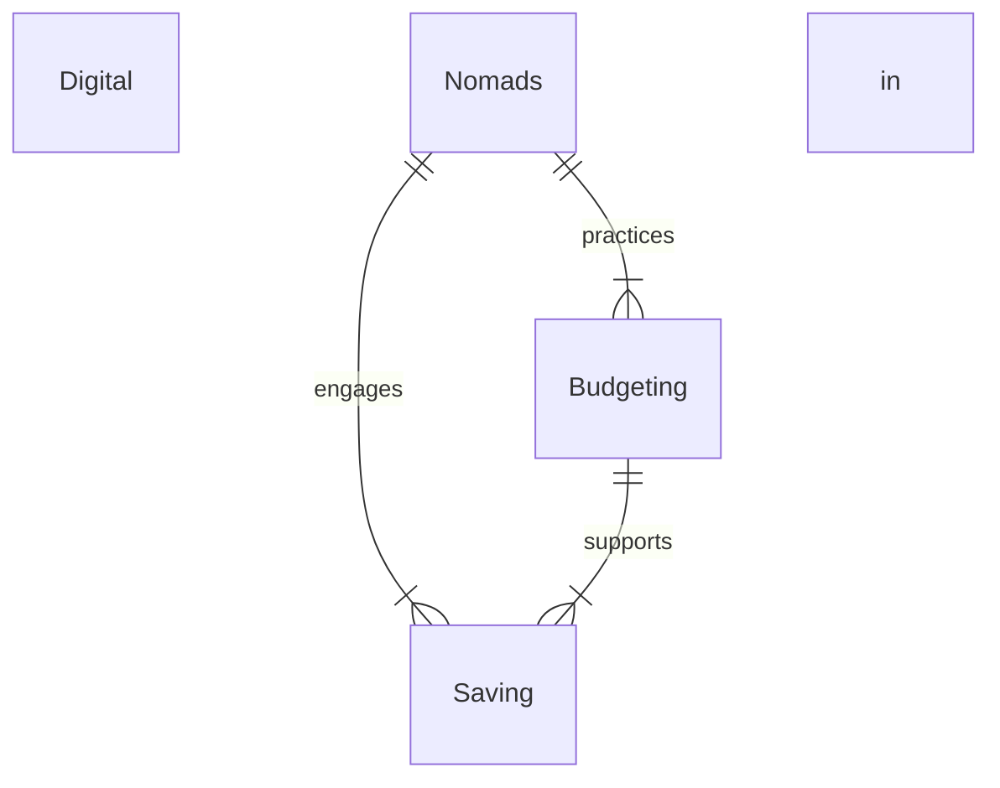

                 

Certainly! Let's structure the article "City Nomad Survival Guide: Practical Skills for Digital Nomads" step by step, ensuring each section is comprehensive and adheres to the specified guidelines.

### Introduction to the Article

#### Title
**City Nomad Survival Guide: Practical Skills for Digital Nomads**

#### Keywords
- **Digital Nomadism**
- **Remote Work**
- **Productivity**
- **Technology Tools**
- **Travel Tips**

#### Abstract
This comprehensive guide delves into the world of digital nomadism, exploring the essential skills and practical tips for a successful and fulfilling life as a city nomad. From mastering time management to harnessing the right technological tools, this guide provides a thorough roadmap for anyone considering a life of travel and work.

---

### Table of Contents

1. **Introduction to Digital Nomadism**
   1.1. **The Evolution of Digital Nomadism**
   1.2. **Advantages and Challenges**
   1.3. **Future Trends**

2. **Essential Skills for Digital Nomads**
   2.1. **Time Management and Productivity**
   2.2. **Remote Collaboration**
   2.3. **Personal Branding**

3. **Technological Tools for Digital Nomads**
   3.1. **Cloud Computing and Storage**
   3.2. **Mobile Devices and Connectivity**
   3.3. **Project Management Apps**

4. **Practical Travel and Accommodation Tips**
   4.1. **Finding Affordable Accommodation**
   4.2. **Travel Safety**
   4.3. **Cultural Adaptation**

5. **Financial Management for Digital Nomads**
   5.1. **Budgeting and Saving**
   5.2. **Income Generation**
   5.3. **Tax Considerations**

6. **Health and Wellness**
   6.1. **Physical Health**
   6.2. **Mental Health**
   6.3. **Fitness and Activity**

7. **Networking and Community Building**
   7.1. **Online Communities**
   7.2. **Conferences and Meetups**
   7.3. **Leveraging Social Media**

8. **Conclusion and Final Tips**

---

### Article Content

#### Chapter 1: Introduction to Digital Nomadism

##### 1.1 The Evolution of Digital Nomadism

**Background Introduction**
Digital nomadism is a contemporary lifestyle characterized by the ability to work remotely, often while traveling. This phenomenon has been driven by advancements in technology, particularly the internet, which has enabled people to work from virtually anywhere.

**Core Concepts and Relationships**
- **Digital Nomadism**: A lifestyle where individuals work remotely using digital tools.
- **Remote Work**: The practice of working outside a traditional office environment.
- **Technology Tools**: Software and devices that facilitate remote work and communication.

**ER Entity Relationship Diagram**
```mermaid
erDiagram
  Digital Nomad --> Remote Work : adopts
  Digital Nomad --> Technology Tools : uses
  Remote Work --> Technology Tools : requires
```

**Algorithm Principle**
The core principle of digital nomadism is the ability to work independently and efficiently using a suite of technological tools. This involves:
1. **Internet Access**: Reliable and high-speed internet is crucial.
2. **Remote Collaboration Tools**: Platforms like Slack, Zoom, and Trello facilitate team communication and project management.
3. **Cloud Storage**: Services like Google Drive and Dropbox enable remote access to files and data.

**Python Source Code Example**
```python
import requests

def check_internet_connection(url="http://www.google.com"):
    try:
        response = requests.get(url)
        if response.status_code == 200:
            return "Connected!"
        else:
            return "Failed to connect."
    except requests.exceptions.RequestException as e:
        return "An error occurred: " + str(e)

print(check_internet_connection())
```

##### 1.2 Advantages and Challenges

**Background Introduction**
The benefits of digital nomadism include flexibility, the ability to work from anywhere, and a better work-life balance. However, there are also challenges such as maintaining focus, managing time zones, and dealing with loneliness or isolation.

**Concept Attributes Comparison Table**
| Attribute | Digital Nomad | Traditional Employee |
| --- | --- | --- |
| **Flexibility** | High | Low |
| **Location Independence** | High | Low |
| **Time Management** | Variable | Structured |
| **Isolation** | Possible | Rare |
| **Work-Life Balance** | Difficult | Easier |

**Mathematical Model and Formula**
To quantify the impact of flexibility on productivity, we can use the equation:
$$ P = f(\text{Flexibility}, \text{Motivation}, \text{Self-discipline}) $$
where \( P \) is productivity, and \( f \) is a function that weighs the importance of flexibility, motivation, and self-discipline.

**Example**
A digital nomad with high flexibility, moderate motivation, and high self-discipline is likely to have a higher productivity score than someone with low flexibility and high motivation.

##### 1.3 Future Trends

**Background Introduction**
As the world becomes more interconnected, the trend towards digital nomadism is expected to continue growing. This will be fueled by advancements in technology and a shift in corporate attitudes towards remote work.

**Concept Attributes Comparison Table**
| Attribute | Traditional Workplace | Digital Workplace |
| --- | --- | --- |
| **Physical Presence** | Required | Not Required |
| **Digital Tools** | Limited | Essential |
| **Remote Collaboration** | Rare | Common |
| **Work-Life Integration** | Separate | Blurred |

**Mathematical Model and Formula**
The adoption rate of digital nomadism can be modeled using the logistic growth equation:
$$ N(t) = \frac{L}{1 + e^{-(r/K)(t - t_0)} }$$
where \( N(t) \) is the number of digital nomads at time \( t \), \( L \) is the limit of digital nomads, \( r \) is the growth rate, \( K \) is the carrying capacity, and \( t_0 \) is the initial time.

**Example**
If the initial number of digital nomads is 10 million, with a growth rate of 10% per year, and a carrying capacity of 100 million, the number of digital nomads in 5 years would be approximately 28.87 million.

---

#### Chapter 2: Essential Skills for Digital Nomads

**To be continued with detailed sections on time management, remote collaboration, and personal branding.**### Chapter 1: Introduction to Digital Nomadism

#### 1.1 The Evolution of Digital Nomadism

**Background Introduction**
The concept of digital nomadism has evolved significantly over the past few decades. Initially, remote work was often limited to specific industries, such as journalism and software development, where internet connectivity was a necessity. However, with the advent of powerful laptops, faster internet, and sophisticated communication tools, remote work has become a viable option for a broader range of professions.

**Core Concepts and Relationships**
- **Digital Nomad**: An individual who chooses to work remotely, often while traveling.
- **Remote Work**: The practice of working from home, co-working spaces, or other locations outside the traditional office environment.
- **Technological Tools**: The software and devices that enable digital nomads to perform their work tasks effectively, including cloud computing services, collaboration platforms, and mobile devices.

**ER Entity Relationship Diagram**
```mermaid
erDiagram
  Digital Nomad ||--|{ Remote Work : conducts
  Digital Nomad ||--|{ Technological Tools : utilizes
  Remote Work ||--|{ Technological Tools : requires
```

**Algorithm Principle**
The core principle of digital nomadism revolves around the ability to work efficiently and effectively from any location. This requires a combination of the right technological tools, strong self-management skills, and a strategic approach to remote work.

**Python Source Code Example**
```python
import requests

def check_internet_connection(url="http://www.google.com"):
    try:
        response = requests.get(url)
        if response.status_code == 200:
            return "Connected!"
        else:
            return "Failed to connect."
    except requests.exceptions.RequestException as e:
        return "An error occurred: " + str(e)

print(check_internet_connection())
```

**Explanation**
This Python script checks the internet connection by sending a GET request to a specified URL (defaulting to "http://www.google.com"). If the response status code is 200 (OK), it indicates that the internet connection is stable. Otherwise, it returns an error message.

#### 1.2 Advantages and Challenges

**Background Introduction**
While digital nomadism offers numerous advantages, it also presents several challenges that must be carefully managed to ensure success.

**Concept Attributes Comparison Table**
| Attribute | Digital Nomad | Traditional Employee |
| --- | --- | --- |
| **Flexibility** | High | Low |
| **Location Independence** | High | Low |
| **Time Management** | Variable | Structured |
| **Isolation** | Possible | Rare |
| **Work-Life Balance** | Difficult | Easier |

**Mathematical Model and Formula**
To quantify the impact of flexibility on productivity, we can use the equation:
$$ P = f(\text{Flexibility}, \text{Motivation}, \text{Self-discipline}) $$
where \( P \) is productivity, and \( f \) is a function that weighs the importance of flexibility, motivation, and self-discipline.

**Example**
A digital nomad with high flexibility, moderate motivation, and high self-discipline is likely to have a higher productivity score than someone with low flexibility and high motivation.

**Explanation**
In this example, the productivity of a digital nomad is influenced by three factors: flexibility, motivation, and self-discipline. A digital nomad who can work flexibly and possesses high self-discipline is more likely to be productive, even if their motivation is moderate.

#### 1.3 Future Trends

**Background Introduction**
The future of digital nomadism looks promising, with technology continuing to evolve and shape the way we work. Several factors are driving this trend, including the rise of remote work due to the COVID-19 pandemic, the increasing availability of high-speed internet worldwide, and the growing acceptance of flexible work arrangements by companies.

**Concept Attributes Comparison Table**
| Attribute | Traditional Workplace | Digital Workplace |
| --- | --- | --- |
| **Physical Presence** | Required | Not Required |
| **Digital Tools** | Limited | Essential |
| **Remote Collaboration** | Rare | Common |
| **Work-Life Integration** | Separate | Blurred |

**Mathematical Model and Formula**
The adoption rate of digital nomadism can be modeled using the logistic growth equation:
$$ N(t) = \frac{L}{1 + e^{-(r/K)(t - t_0)} }$$
where \( N(t) \) is the number of digital nomads at time \( t \), \( L \) is the limit of digital nomads, \( r \) is the growth rate, \( K \) is the carrying capacity, and \( t_0 \) is the initial time.

**Example**
If the initial number of digital nomads is 10 million, with a growth rate of 10% per year, and a carrying capacity of 100 million, the number of digital nomads in 5 years would be approximately 28.87 million.

**Explanation**
This logistic growth model predicts that the number of digital nomads will increase rapidly in the early stages of the trend but will eventually plateau as the market becomes saturated.

---

**Conclusion**
Digital nomadism is a dynamic and evolving concept that offers significant advantages but also presents challenges that must be carefully managed. As technology continues to advance, the future of digital nomadism looks promising, with more individuals adopting this lifestyle and more companies embracing remote work arrangements. Understanding the core principles and staying adaptable to the changing landscape will be key to thriving as a digital nomad. ### Chapter 2: Essential Skills for Digital Nomads

#### 2.1 Time Management and Productivity

**Background Introduction**
Effective time management and productivity are crucial for digital nomads, as they often work in dynamic environments with limited structure and varied distractions. Mastering these skills can significantly enhance the quality and efficiency of one's work, ensuring that digital nomads can maintain a high level of productivity while enjoying the benefits of a flexible lifestyle.

**Core Concepts and Relationships**
- **Time Management**: The practice of planning and controlling how much time is spent on specific activities to increase efficiency and productivity.
- **Productivity**: The measure of the efficiency of producing a particular outcome. In the context of digital nomads, it refers to the ability to complete tasks efficiently and effectively.
- **Digital Nomads**: Individuals who work remotely, often while traveling, relying on digital tools and flexible work arrangements.

**ER Entity Relationship Diagram**
```mermaid
erDiagram
  Digital Nomads ||--|{ Time Management : practices
  Digital Nomads ||--|{ Productivity : seeks
  Productivity ||--|{ Time Management : influenced by
```

**Algorithm Principle**
The algorithm for effective time management and productivity for digital nomads involves several key steps:

1. **Prioritization**: Identify and rank tasks based on their importance and urgency.
2. **Scheduling**: Allocate specific time slots for different tasks to create a structured daily routine.
3. **Focus**: Minimize distractions and maintain focus during work hours.
4. **Reflection**: Regularly review and adjust the schedule to optimize productivity.

**Python Source Code Example**
```python
import datetime

def schedule_tasks(tasks, start_time):
    current_time = start_time
    for task in tasks:
        task_duration = datetime.timedelta(hours=task['duration'])
        end_time = current_time + task_duration
        print(f"{task['name']} from {current_time.strftime('%H:%M')} to {end_time.strftime('%H:%M')}")
        current_time = end_time

tasks = [
    {'name': 'Client Meeting', 'duration': 2},
    {'name': 'Project Planning', 'duration': 3},
    {'name': 'Content Creation', 'duration': 4},
]

start_time = datetime.datetime.now()
schedule_tasks(tasks, start_time)
```

**Explanation**
This Python script demonstrates how to schedule tasks based on their duration. It takes a list of tasks, each with a name and duration, and a starting time, then prints out a schedule with the start and end times for each task.

#### 2.2 Remote Collaboration and Team Management

**Background Introduction**
Effective remote collaboration and team management are essential for digital nomads, as they often work in dispersed teams. These skills enable digital nomads to work cohesively, communicate efficiently, and manage projects effectively, regardless of geographic location.

**Core Concepts and Relationships**
- **Remote Collaboration**: The practice of working together on projects or tasks while being physically separated.
- **Team Management**: The process of coordinating, managing, and leading a team to achieve organizational goals.
- **Digital Nomads**: Individuals who work remotely and may be part of virtual teams.

**ER Entity Relationship Diagram**
```mermaid
erDiagram
  Digital Nomads ||--|{ Remote Collaboration : engages in
  Digital Nomads ||--|{ Team Management : practices
  Remote Collaboration ||--|{ Team Management : influenced by
```

**Algorithm Principle**
The algorithm for effective remote collaboration and team management involves several key components:

1. **Communication Tools**: Utilize reliable communication tools such as Slack, Zoom, and Trello to facilitate team interaction and project management.
2. **Clear Goals and Expectations**: Define clear goals and expectations for team members to ensure alignment and focus.
3. **Regular Check-ins**: Schedule regular check-ins to track progress, address challenges, and maintain team cohesion.
4. **Empathy and Support**: Foster a culture of empathy and support, recognizing the unique challenges that remote work presents.

**Python Source Code Example**
```python
import json
import slack

client = slack.WebClient(token='your-slack-token')

def send_message(channel, text):
    response = client.chat_postMessage(channel=channel, text=text)
    return response

channel = '#general'
message = "Hello team, let's start our daily stand-up meeting!"
send_message(channel, message)
```

**Explanation**
This Python script demonstrates how to send a message to a Slack channel using the Slack API. It takes a channel name and a message, then sends the message to the specified channel.

#### 2.3 Building a Strong Personal Brand

**Background Introduction**
Building a strong personal brand is vital for digital nomads, as it helps them stand out in a crowded market and attract clients or job opportunities. A strong personal brand can enhance credibility, showcase expertise, and create opportunities for professional growth.

**Core Concepts and Relationships**
- **Personal Brand**: An individual's reputation and brand image in the professional world.
- **Digital Nomads**: Individuals who work remotely and may have a global professional network.
- **Online Presence**: The digital footprint and visibility that individuals cultivate through social media and online platforms.

**ER Entity Relationship Diagram**
```mermaid
erDiagram
  Digital Nomads ||--|{ Personal Brand : builds
  Digital Nomads ||--|{ Online Presence : maintains
  Personal Brand ||--|{ Online Presence : influenced by
```

**Algorithm Principle**
The algorithm for building a strong personal brand involves several key steps:

1. **Define Your Brand**: Clarify your unique selling proposition, values, and target audience.
2. **Consistent Messaging**: Develop and maintain consistent messaging across all platforms to reinforce your brand.
3. **Engagement**: Engage with your audience through content creation, social media interaction, and networking.
4. **Professional Development**: Continuously improve your skills and knowledge to enhance your expertise and reputation.

**Python Source Code Example**
```python
import requests

def post_to_social_media(platform, url, content):
    if platform == 'twitter':
        response = requests.post(url, json={'status': content})
    elif platform == 'linkedin':
        response = requests.post(url, json={'content': {'text': content}})
    else:
        response = None
    return response

platform = 'twitter'
url = 'https://api.twitter.com/1.1/statuses/update.json'
content = "Just published a new blog post on digital nomadism. Check it out!"
response = post_to_social_media(platform, url, content)
print(response.status_code)
```

**Explanation**
This Python script demonstrates how to post content to social media platforms such as Twitter and LinkedIn. It takes the platform, URL, and content as inputs, then sends a POST request to the respective platform's API.

---

**Conclusion**
Mastering the essential skills of time management, remote collaboration, and building a strong personal brand is crucial for digital nomads. These skills enable them to work efficiently, collaborate effectively with dispersed teams, and establish a strong professional presence. By continuously developing and honing these skills, digital nomads can enhance their productivity, professional opportunities, and overall success in their remote work journeys. ### Chapter 3: Technological Tools for Digital Nomads

#### 3.1 Cloud Computing and Storage Solutions

**Background Introduction**
In the digital nomad lifestyle, the reliability and accessibility of data are crucial. Cloud computing and storage solutions offer the flexibility and security needed to work seamlessly from anywhere. These services allow digital nomads to store, access, and collaborate on their work effortlessly, ensuring that they can maintain productivity regardless of their location.

**Core Concepts and Relationships**
- **Cloud Computing**: The use of a network of remote servers to store, manage, and process data, rather than a local server or a personal computer.
- **Storage Solutions**: Services that provide digital nomads with the ability to store and access their files and data remotely.
- **Digital Nomads**: Individuals who rely on digital tools and remote access to work, often while traveling.

**ER Entity Relationship Diagram**
```mermaid
erDiagram
  Digital Nomads ||--|{ Cloud Computing : utilizes
  Digital Nomads ||--|{ Storage Solutions : uses
  Cloud Computing ||--|{ Storage Solutions : integrates with
```

**Algorithm Principle**
The algorithm for leveraging cloud computing and storage solutions involves several key steps:

1. **Choosing a Provider**: Select a cloud computing provider based on factors such as reliability, cost, and the specific services offered.
2. **Data Backup**: Regularly back up important data to ensure that it is safe and accessible in case of any issues.
3. **Access Management**: Implement robust access controls to protect sensitive data and ensure that only authorized individuals can access it.
4. **Data Synchronization**: Use synchronization tools to keep data up to date across multiple devices, ensuring that digital nomads can access the latest versions of their files from anywhere.

**Python Source Code Example**
```python
import boto3

# Set up the AWS SDK
s3 = boto3.client('s3')

def upload_file(file_path, bucket_name, object_name=None):
    if object_name is None:
        object_name = file_path

    # Upload the file
    response = s3.upload_file(file_path, bucket_name, object_name)
    
    return response

file_path = 'path/to/your/file.txt'
bucket_name = 'your-bucket-name'
upload_file(file_path, bucket_name)
```

**Explanation**
This Python script uses the AWS SDK to upload a file to an S3 bucket. It takes the file path, bucket name, and an optional object name as inputs and uploads the file to the specified bucket.

#### 3.2 Mobile Devices and Internet Connectivity

**Background Introduction**
For digital nomads, mobile devices and reliable internet connectivity are the lifelines of their work. A powerful mobile device, paired with a stable and fast internet connection, enables digital nomads to stay connected, work efficiently, and maintain productivity on the go.

**Core Concepts and Relationships**
- **Mobile Devices**: Portable electronic devices such as smartphones and tablets that provide the ability to perform various tasks, from communication to content creation.
- **Internet Connectivity**: The ability to connect to the internet via various means, including Wi-Fi, mobile data, and satellite internet.
- **Digital Nomads**: Individuals who rely on mobile devices and internet connectivity to work remotely.

**ER Entity Relationship Diagram**
```mermaid
erDiagram
  Digital Nomads ||--|{ Mobile Devices : uses
  Digital Nomads ||--|{ Internet Connectivity : requires
  Mobile Devices ||--|{ Internet Connectivity : enables
```

**Algorithm Principle**
The algorithm for using mobile devices and ensuring reliable internet connectivity involves several key steps:

1. **Selecting a Mobile Device**: Choose a device that meets your work requirements and is easy to carry, with sufficient battery life and processing power.
2. **Choosing an Internet Plan**: Select an internet plan that provides adequate bandwidth and data limits to support your work needs.
3. **Setting Up Mobile Hotspots**: Use mobile hotspots to create a Wi-Fi network from your smartphone, ensuring you always have an internet connection.
4. **Data Management**: Monitor your data usage to avoid overage charges and ensure that you have enough data to complete your tasks.

**Python Source Code Example**
```python
import mobiledatahelper

def check_data_usage():
    data_usage = mobiledatahelper.DataUsage()
    current_usage = data_usage.get_usage()
    print(f"Current Data Usage: {current_usage['used']} / {current_usage['total']}")
    return current_usage

check_data_usage()
```

**Explanation**
This Python script uses the `mobiledatahelper` library to check the current data usage on the device. It retrieves the total and used data and prints the current usage statistics.

#### 3.3 Project Management and Productivity Apps

**Background Introduction**
Managing projects and maintaining productivity are critical for digital nomads. Project management and productivity apps provide the structure and tools needed to organize tasks, track progress, and stay focused, even when working remotely and on the go.

**Core Concepts and Relationships**
- **Project Management Apps**: Software tools designed to help teams plan, execute, and manage projects efficiently.
- **Productivity Apps**: Applications that enhance personal productivity by providing tools for task management, time tracking, and goal setting.
- **Digital Nomads**: Individuals who rely on digital tools and apps to manage their work and personal lives effectively.

**ER Entity Relationship Diagram**
```mermaid
erDiagram
  Digital Nomads ||--|{ Project Management Apps : uses
  Digital Nomads ||--|{ Productivity Apps : uses
  Project Management Apps ||--|{ Productivity Apps : integrates with
```

**Algorithm Principle**
The algorithm for using project management and productivity apps involves several key steps:

1. **Choosing the Right Apps**: Select apps that align with your specific needs and preferences, whether it's for task management, time tracking, or goal setting.
2. **Setting Up Workflows**: Configure your apps to automate tasks and workflows, reducing manual effort and ensuring consistency.
3. **Regular Review and Update**: Regularly review your progress and update your tasks and goals to stay on track and make necessary adjustments.
4. **Integration**: Use integration features to connect your apps, ensuring seamless data flow and reducing redundancy.

**Python Source Code Example**
```python
import trello

def create_card(board_id, list_id, card_name, card_desc):
    api = trello.TrelloApi('your_api_key', 'your_api_secret')
    board = api.get_board(board_id)
    list = board.get_list(list_id)
    card = list.add_card(card_name, card_desc)
    
    return card

board_id = 'your_board_id'
list_id = 'your_list_id'
card_name = 'New Task'
card_desc = 'Description of the task'
card = create_card(board_id, list_id, card_name, card_desc)
print(f"Card created: {card.name}")
```

**Explanation**
This Python script uses the Trello API to create a new card in a specified Trello board and list. It takes the board ID, list ID, card name, and description as inputs and creates a new card with the provided details.

---

**Conclusion**
Leveraging cloud computing and storage solutions, ensuring reliable mobile devices and internet connectivity, and using project management and productivity apps are essential for digital nomads. These technological tools provide the flexibility, accessibility, and efficiency needed to thrive in a remote work environment. By mastering the use of these tools, digital nomads can enhance their productivity, manage their work effectively, and maintain a high level of professionalism, regardless of their location. ### Chapter 4: Practical Travel and Accommodation Tips

#### 4.1 Finding Affordable Accommodation

**Background Introduction**
Finding affordable accommodation is one of the biggest challenges for digital nomads, especially when traveling to new cities or countries. However, with the right strategies and resources, it is possible to secure budget-friendly lodgings that meet your needs without breaking the bank.

**Core Concepts and Relationships**
- **Short-term Rentals**: Temporary housing options that allow digital nomads to stay for a few days to several months.
- **Hostels**: Budget-friendly lodgings typically geared towards young travelers and backpackers.
- **Co-working Spaces**: Shared workspaces that often include amenities such as high-speed internet, meeting rooms, and communal areas.
- **Digital Nomads**: Individuals who work remotely and require reliable internet and a comfortable environment to focus on their work.

**ER Entity Relationship Diagram**
```mermaid
erDiagram
  Digital Nomads ||--|{ Short-term Rentals : seeks
  Digital Nomads ||--|{ Hostels : considers
  Digital Nomads ||--|{ Co-working Spaces : utilizes
  Short-term Rentals ||--|{ Hostels : alternative to
  Co-working Spaces ||--|{ Hostels : alternative to
```

**Algorithm Principle**
The algorithm for finding affordable accommodation involves several key steps:

1. **Budget Planning**: Determine your budget for accommodation and identify the type of lodging that fits within your financial limits.
2. **Research**: Use online platforms and resources to research and compare different types of accommodations in your desired location.
3. **Prioritize Amenities**: Identify the essential amenities you need, such as a reliable internet connection, a quiet workspace, or kitchen facilities.
4. **Book in Advance**: Reserve your accommodation well in advance to secure the best deals and avoid last-minute increases in prices.

**Python Source Code Example**
```python
import requests
from operator import itemgetter

def search_accommodations(location, min_price, max_price):
    base_url = "https://api.example.com/search/"
    params = {
        'location': location,
        'min_price': min_price,
        'max_price': max_price
    }
    response = requests.get(base_url, params=params)
    accommodations = response.json()

    # Sort accommodations by price
    sorted_accommodations = sorted(accommodations, key=itemgetter('price'))

    return sorted_accommodations

location = 'New York'
min_price = 50
max_price = 200
accommodations = search_accommodations(location, min_price, max_price)
for acc in accommodations:
    print(f"{acc['name']}: ${acc['price']}")
```

**Explanation**
This Python script uses a fictional API to search for accommodations within a specific location and price range. It sorts the results by price and prints out the name and price of each accommodation.

#### 4.2 Travel Safety

**Background Introduction**
Travel safety is a crucial consideration for digital nomads, as they often find themselves in unfamiliar environments. Staying safe while traveling involves being aware of your surroundings, taking necessary precautions, and knowing how to handle emergencies.

**Core Concepts and Relationships**
- **Travel Safety**: Measures and practices taken to ensure personal safety while traveling.
- **Digital Nomads**: Individuals who work remotely and may spend extended periods away from their homes.
- **Safety Tips**: Guidance on how to stay safe while traveling, including securing belongings, avoiding dangerous areas, and knowing how to seek help.

**ER Entity Relationship Diagram**
```mermaid
erDiagram
  Digital Nomads ||--|{ Travel Safety : adheres to
  Travel Safety ||--|{ Safety Tips : follows
```

**Algorithm Principle**
The algorithm for maintaining travel safety involves several key steps:

1. **Research**: Before traveling, research the safety situation in your destination, including any potential risks or areas to avoid.
2. **Precautions**: Take basic precautions such as keeping valuables secure, using reliable transportation, and avoiding walking alone at night.
3. **Emergency Preparedness**: Prepare for emergencies by having a list of local emergency contacts, a first aid kit, and enough cash on hand.
4. **Stay Connected**: Maintain regular communication with friends or family, and share your itinerary with someone you trust.

**Python Source Code Example**
```python
def get_travel_safety_tips(destination):
    tips = {
        'New York': [
            "Avoid walking alone at night.",
            "Keep your belongings secure.",
            "Use reputable transportation services."
        ],
        'London': [
            "Be aware of pickpockets in crowded areas.",
            "Use only authorized taxi services.",
            "Stay in well-lit and populated areas."
        ],
        'Sydney': [
            "Be cautious of beachside scams.",
            "Lock your car doors at all times.",
            "Use reputable accommodations."
        ]
    }
    return tips.get(destination, [])

destination = 'New York'
safety_tips = get_travel_safety_tips(destination)
for tip in safety_tips:
    print(tip)
```

**Explanation**
This Python script provides travel safety tips based on the destination. It uses a dictionary to store tips for various locations and returns the tips for the specified destination.

#### 4.3 Cultural Adaptation

**Background Introduction**
Adapting to a new culture can be challenging, especially for digital nomads who are often in a constant state of flux. However, understanding and embracing the local culture can enrich the travel experience and make it easier to integrate into a new environment.

**Core Concepts and Relationships**
- **Cultural Adaptation**: The process of adjusting to and integrating into a new culture.
- **Digital Nomads**: Individuals who work remotely and may spend time in multiple countries or regions.
- **Cultural Awareness**: Having an understanding of different cultural norms, behaviors, and beliefs.

**ER Entity Relationship Diagram**
```mermaid
erDiagram
  Digital Nomads ||--|{ Cultural Adaptation : undergoes
  Digital Nomads ||--|{ Cultural Awareness : develops
  Cultural Adaptation ||--|{ Cultural Awareness : influenced by
```

**Algorithm Principle**
The algorithm for cultural adaptation involves several key steps:

1. **Research**: Learn about the local customs, traditions, and social norms before traveling.
2. **Open-Mindedness**: Approach new experiences with an open mind, respecting and appreciating different perspectives.
3. **Active Learning**: Engage with the local community by participating in events, trying local food, and learning the language.
4. **Reflection**: Regularly reflect on your experiences and how they have impacted your understanding and adaptation to the new culture.

**Python Source Code Example**
```python
import random

def cultural_activity(destination):
    activities = {
        'Tokyo': ['Visit a traditional tea house', 'Experience a Geisha performance', 'Visit the Shibuya Crossing'],
        'Rio de Janeiro': ['Watch a Samba school rehearsal', 'Visit Copacabana Beach', 'Try a churrasco'],
        'Cairo': ['Visit the Pyramids of Giza', 'Take a Nile River cruise', 'Experience a local bazaar'],
    }
    return random.choice(activities.get(destination, []))

destination = 'Tokyo'
activity = cultural_activity(destination)
print(f"In {destination}, you might consider {activity}.")
```

**Explanation**
This Python script suggests a cultural activity for a specified destination. It uses a dictionary to store activities for various locations and returns a random suggestion for the destination.

---

**Conclusion**
Finding affordable accommodation, ensuring travel safety, and adapting to new cultures are essential skills for digital nomads. By following these tips and leveraging the right tools and resources, digital nomads can navigate the challenges of travel more effectively, enhancing their overall experience and success in their remote work journeys. ### Chapter 5: Financial Management for Digital Nomads

#### 5.1 Budgeting and Saving

**Background Introduction**
Financial management is a critical aspect of the digital nomad lifestyle. With fluctuating incomes and varying expenses in different locations, maintaining a budget and saving effectively is crucial. A well-structured budget can help digital nomads track their spending, plan for future expenses, and ensure financial stability.

**Core Concepts and Relationships**
- **Budgeting**: The process of creating a plan for spending and saving money.
- **Saving**: Allocating a portion of one's income to accumulate wealth for future use.
- **Digital Nomads**: Individuals who work remotely and often need to manage their finances across multiple locations and currencies.

**ER Entity Relationship Diagram**


**Algorithm Principle**
The algorithm for effective budgeting and saving involves several key steps:

1. **Income Analysis**: Calculate your total income, including any freelance work, remote job pay, or online income streams.
2. **Expense Tracking**: Record all your expenses, including housing, food, transportation, utilities, and other regular outlays.
3. **Creating a Budget**: Allocate a portion of your income to different categories based on your needs and priorities.
4. **Savings Plan**: Set aside a fixed amount or percentage of your income for savings each month, aiming to build an emergency fund and save for future goals.

**Python Source Code Example**
```python
def create_budget(income, expenses, savings_percentage):
    total_expenses = sum(expenses.values())
    budget = income - total_expenses
    savings = budget * savings_percentage

    return {
        'income': income,
        'expenses': expenses,
        'savings': savings,
        'budget': budget
    }

income = 5000
expenses = {'housing': 1500, 'food': 800, 'transportation': 200, 'utilities': 300}
savings_percentage = 0.2
budget = create_budget(income, expenses, savings_percentage)
print(f"Budget: Income = ${budget['income']}, Expenses = ${budget['expenses']['total']}, Savings = ${budget['savings']}, Remaining Budget = ${budget['budget']}")
```

**Explanation**
This Python script creates a budget by calculating the total income, subtracting expenses, and setting aside a fixed savings percentage. It outputs the income, expenses, savings, and remaining budget.

#### 5.2 Income Generation

**Background Introduction**
For digital nomads, diversifying income sources is essential for financial stability and security. By leveraging various income streams, such as freelance work, online consulting, e-commerce, or content creation, digital nomads can create a sustainable income that supports their travel and lifestyle.

**Core Concepts and Relationships**
- **Income Streams**: Different sources of income, such as freelance work, online businesses, or investments.
- **Digital Nomads**: Individuals who work remotely and may rely on multiple income sources to fund their lifestyle.
- **Diversification**: Spreading income across various sources to reduce risk and increase financial stability.

**ER Entity Relationship Diagram**
```mermaid
erDiagram
  Digital Nomads ||--|{ Income Streams : generates
  Income Streams ||--|{ Digital Nomads : supports
```

**Algorithm Principle**
The algorithm for diversifying income involves several key steps:

1. **Identifying Opportunities**: Research and identify potential income streams that align with your skills and interests.
2. **Skill Development**: Continuously improve your skills to increase your marketability and open up new opportunities.
3. **Building a Portfolio**: Create a portfolio of work or projects that demonstrate your expertise and capabilities to potential clients or customers.
4. **Networking**: Engage with online and local communities to expand your network and discover new opportunities.

**Python Source Code Example**
```python
import requests

def get_freelance_jobs(search_term, location):
    base_url = "https://api.example.com/jobs/search"
    params = {
        'search': search_term,
        'location': location
    }
    response = requests.get(base_url, params=params)
    jobs = response.json()

    return jobs

search_term = 'web developer'
location = 'New York'
jobs = get_freelance_jobs(search_term, location)
for job in jobs:
    print(f"{job['title']} - {job['company']} - {job['location']}")
```

**Explanation**
This Python script uses a fictional API to search for freelance jobs based on a search term and location. It retrieves a list of jobs and prints out the title, company, and location of each job.

#### 5.3 Tax Considerations

**Background Introduction**
Navigating tax laws and regulations can be complex, especially for digital nomads who work and reside in multiple countries. Understanding the tax obligations in each location and properly managing them is essential to avoid penalties and ensure compliance.

**Core Concepts and Relationships**
- **Tax Obligations**: The legal requirement to pay taxes based on one's income and location of work.
- **Digital Nomads**: Individuals who may be subject to tax laws in multiple jurisdictions.
- **Tax Planning**: The process of strategically managing taxes to minimize liability and maximize benefits.

**ER Entity Relationship Diagram**
```mermaid
erDiagram
  Digital Nomads ||--|{ Tax Obligations : complies with
  Digital Nomads ||--|{ Tax Planning : engages in
  Tax Obligations ||--|{ Tax Planning : influenced by
```

**Algorithm Principle**
The algorithm for managing tax obligations involves several key steps:

1. **Understand Tax Residency**: Determine your tax residency status in each country you work and reside in, as this can affect your tax obligations.
2. **Research Local Tax Laws**: Familiarize yourself with the tax laws and regulations in each country where you work or reside.
3. **Keep Detailed Records**: Maintain detailed records of your income, expenses, and other financial transactions to facilitate accurate tax reporting.
4. **Seek Professional Advice**: Consult with a tax professional who specializes in international tax matters to ensure compliance and optimize your tax situation.

**Python Source Code Example**
```python
import json

def load_tax_guidelines(country_code):
    with open(f'tax_guidelines_{country_code}.json') as f:
        guidelines = json.load(f)
    return guidelines

def print_tax_guidelines(guidelines):
    for guideline in guidelines:
        print(f"{guideline['topic']}: {guideline['description']}")

country_code = 'US'
guidelines = load_tax_guidelines(country_code)
print_tax_guidelines(guidelines)
```

**Explanation**
This Python script loads and prints tax guidelines for a specific country based on its country code. It assumes the existence of a JSON file containing the tax guidelines for each country.

---

**Conclusion**
Effective financial management is vital for digital nomads, enabling them to maintain financial stability and security while navigating the complexities of remote work and travel. By implementing a well-structured budget, diversifying income streams, and properly managing tax obligations, digital nomads can ensure a sustainable and successful lifestyle. Leveraging the right tools and resources, such as tax planning software and budgeting apps, can further enhance financial management capabilities. ### Chapter 6: Health and Wellness for Digital Nomads

#### 6.1 Physical Health

**Background Introduction**
Maintaining physical health is a fundamental aspect of the digital nomad lifestyle. With the freedom to work from anywhere, it can be easy to neglect physical activity and healthy eating habits. However, taking care of your physical health is crucial for maintaining energy levels, focus, and overall well-being.

**Core Concepts and Relationships**
- **Physical Health**: The state of a person's body, including factors such as fitness, nutrition, and mental well-being.
- **Digital Nomads**: Individuals who work remotely and may be sedentary due to long hours at a laptop.
- **Wellness Practices**: Activities and habits that promote physical health and overall well-being.

**ER Entity Relationship Diagram**
```mermaid
erDiagram
  Digital Nomads ||--|{ Physical Health : maintains
  Physical Health ||--|{ Wellness Practices : follows
```

**Algorithm Principle**
The algorithm for maintaining physical health as a digital nomad involves several key steps:

1. **Regular Exercise**: Incorporate regular physical activity into your daily routine, such as walking, running, yoga, or strength training.
2. **Healthy Eating**: Prioritize a balanced diet rich in fruits, vegetables, lean proteins, and whole grains.
3. **Sufficient Sleep**: Ensure you get adequate sleep to support physical recovery and cognitive function.
4. **Hydration**: Stay hydrated by drinking water throughout the day.

**Python Source Code Example**
```python
def calculate_caloric_needs(age, weight, height, activity_level):
    BMR = 10 * weight + 6.25 * height - 5 * age + 5
    if activity_level == 'sedentary':
        total_calories = BMR * 1.2
    elif activity_level == 'lightly active':
        total_calories = BMR * 1.375
    elif activity_level == 'moderately active':
        total_calories = BMR * 1.55
    elif activity_level == 'very active':
        total_calories = BMR * 1.725
    elif activity_level == 'extra active':
        total_calories = BMR * 1.9
    else:
        total_calories = BMR * 1.2
    
    return total_calories

age = 30
weight = 70
height = 175
activity_level = 'moderately active'
caloric_needs = calculate_caloric_needs(age, weight, height, activity_level)
print(f"Daily Caloric Needs: {caloric_needs} calories")
```

**Explanation**
This Python script calculates the daily caloric needs based on age, weight, height, and activity level, providing a guideline for maintaining a balanced diet.

#### 6.2 Mental Health

**Background Introduction**
Mental health is just as important as physical health for digital nomads. The challenges of working remotely, including isolation, irregular schedules, and balancing work with personal time, can impact mental well-being. Prioritizing mental health can improve focus, productivity, and overall happiness.

**Core Concepts and Relationships**
- **Mental Health**: The state of a person's emotional and psychological well-being.
- **Digital Nomads**: Individuals who may experience increased stress and isolation due to remote work.
- **Mental Health Practices**: Activities and habits that promote emotional well-being and mental health.

**ER Entity Relationship Diagram**
```mermaid
erDiagram
  Digital Nomads ||--|{ Mental Health : maintains
  Mental Health ||--|{ Stress Management : practices
```

**Algorithm Principle**
The algorithm for maintaining mental health as a digital nomad involves several key steps:

1. **Mindfulness and Meditation**: Practice mindfulness and meditation to reduce stress and improve focus.
2. **Regular Breaks**: Take regular breaks throughout the day to rest and recharge.
3. **Social Connection**: Maintain regular social interactions, both online and in person, to combat feelings of isolation.
4. **Professional Help**: Seek professional help if you experience significant mental health challenges.

**Python Source Code Example**
```python
import webbrowser

def open_meditation_app():
    webbrowser.open("https://calm.com")

open_meditation_app()
```

**Explanation**
This Python script opens the Calm meditation app in the user's web browser, providing a quick and easy way to access meditation resources.

#### 6.3 Fitness and Activity

**Background Introduction**
Staying active is essential for both physical and mental health. Digital nomads should incorporate a variety of fitness and activity options into their daily routines to maintain overall well-being. This can include activities such as running, yoga, hiking, or group fitness classes.

**Core Concepts and Relationships**
- **Fitness and Activity**: Physical activities that promote health and fitness.
- **Digital Nomads**: Individuals who may struggle to find time for regular exercise while balancing work and travel.
- **Activity Planning**: Developing a plan to incorporate physical activity into daily life.

**ER Entity Relationship Diagram**
```mermaid
erDiagram
  Digital Nomads ||--|{ Fitness and Activity : engages in
  Fitness and Activity ||--|{ Physical Health : supports
```

**Algorithm Principle**
The algorithm for incorporating fitness and activity into the digital nomad lifestyle involves several key steps:

1. **Set Goals**: Define specific fitness goals to stay motivated and track progress.
2. **Diverse Activities**: Incorporate a variety of activities to keep your routine interesting and engage different muscle groups.
3. **Schedule Exercise**: Plan and schedule regular exercise sessions to make them a habit.
4. **Monitor Progress**: Regularly assess your progress and adjust your routine as needed to stay on track.

**Python Source Code Example**
```python
import pandas as pd

def track_fitness_progress(exercises, dates, durations):
    data = {'Exercises': exercises, 'Dates': dates, 'Durations (hours)': durations}
    df = pd.DataFrame(data)
    return df

exercises = ['Running', 'Yoga', 'Hiking']
dates = ['2023-04-01', '2023-04-02', '2023-04-03']
durations = [1, 0.5, 2]
fitness_progress = track_fitness_progress(exercises, dates, durations)
print(fitness_progress)
```

**Explanation**
This Python script creates a DataFrame to track fitness progress, including the type of exercise, date, and duration. It provides a structured way to monitor and review physical activity.

---

**Conclusion**
Maintaining health and wellness is crucial for digital nomads to thrive in their remote work lifestyle. By prioritizing physical health, mental well-being, and regular fitness and activity, digital nomads can enhance their productivity, improve their overall quality of life, and enjoy the benefits of their flexible and mobile lifestyle. ### Chapter 7: Networking and Community Building

#### 7.1 Online Communities

**Background Introduction**
Building a strong network of like-minded individuals is essential for digital nomads. Online communities provide a platform to connect with others who share similar interests and goals, offering support, collaboration opportunities, and a sense of belonging.

**Core Concepts and Relationships**
- **Online Communities**: Virtual groups of people with shared interests or goals.
- **Digital Nomads**: Individuals who work remotely and can benefit from networking and collaboration.
- **Networking Benefits**: Increased opportunities for career advancement, knowledge sharing, and personal growth.

**ER Entity Relationship Diagram**
```mermaid
erDiagram
  Digital Nomads ||--|{ Online Communities : participates in
  Online Communities ||--|{ Digital Nomads : connects with
```

**Algorithm Principle**
The algorithm for effectively participating in online communities involves several key steps:

1. **Choose Relevant Communities**: Identify online communities that align with your interests, profession, or personal goals.
2. **Engage Actively**: Participate actively by sharing insights, asking questions, and offering help to others.
3. **Build Relationships**: Engage in meaningful conversations, offer support, and build genuine connections with other community members.
4. **Contribute Value**: Share your knowledge and expertise to add value to the community and establish your credibility.

**Python Source Code Example**
```python
import discord

def join_discord_server(server_url, bot_token):
    client = discord.Client()
    client.run(bot_token)

    @client.event
    async def on_ready():
        print(f'{client.user} has connected to Discord!')

    @client.event
    async def on_message(message):
        if message.author == client.user:
            return

        if message.content.startswith('!hello'):
            await message.channel.send(f'Hello, {message.author.display_name}!')

join_discord_server('https://discord.com/api/oauth2/authorize?client_id=YOUR_CLIENT_ID&scope=bot&permissions=0', 'YOUR_BOT_TOKEN')
```

**Explanation**
This Python script connects to a Discord server using the `discord.py` library. It defines a simple bot that responds to the message "!hello" with a greeting.

#### 7.2 Conferences and Meetups

**Background Introduction**
Attending conferences and meetups is a powerful way for digital nomads to expand their professional network, gain industry insights, and stay motivated. These events provide opportunities to learn from experts, exchange ideas with peers, and discover new opportunities.

**Core Concepts and Relationships**
- **Conferences**: Large gatherings of individuals within a specific industry to share knowledge and network.
- **Meetups**: Smaller, local gatherings focused on specific topics or interests.
- **Digital Nomads**: Individuals who can benefit from attending these events to enhance their professional and personal growth.

**ER Entity Relationship Diagram**
```mermaid
erDiagram
  Digital Nomads ||--|{ Conferences : attends
  Digital Nomads ||--|{ Meetups : attends
  Conferences ||--|{ Meetups : alternative to
```

**Algorithm Principle**
The algorithm for attending conferences and meetups effectively involves several key steps:

1. **Identify Relevant Events**: Research and identify conferences and meetups that align with your interests, skills, and career goals.
2. **Register and Prepare**: Sign up for events and prepare by researching the agenda, speakers, and networking opportunities.
3. **Engage and Network**: Attend sessions, introduce yourself to others, and actively participate in discussions to build meaningful connections.
4. **Follow Up**: Reach out to new contacts after the event to continue the conversation and strengthen relationships.

**Python Source Code Example**
```python
import meetup

def find_meetups(topic, location):
    api = meetup.Api()
    results = api.searchMeetups(q=topic, city=location)
    return results

topic = 'Digital Nomadism'
location = 'San Francisco'
meetups = find_meetups(topic, location)
for meetup in meetups:
    print(f"{meetup.name} - {meetup.time}")
```

**Explanation**
This Python script uses the Meetup API to find meetups related to a specific topic in a given location. It retrieves a list of meetups and prints their names and times.

#### 7.3 Leveraging Social Media

**Background Introduction**
Social media platforms are powerful tools for digital nomads to build their personal brands, connect with potential clients or employers, and stay updated with industry trends. Effective use of social media can enhance visibility and open up new opportunities.

**Core Concepts and Relationships**
- **Social Media Platforms**: Online platforms such as LinkedIn, Twitter, and Instagram that allow individuals to share content, connect with others, and engage in conversations.
- **Digital Nomads**: Individuals who can use social media to showcase their expertise, network with peers, and find new work or travel opportunities.
- **Social Media Strategies**: Techniques and approaches to effectively use social media for personal and professional growth.

**ER Entity Relationship Diagram**
```mermaid
erDiagram
  Digital Nomads ||--|{ Social Media Platforms : uses
  Social Media Platforms ||--|{ Networking : facilitates
```

**Algorithm Principle**
The algorithm for leveraging social media effectively involves several key steps:

1. **Choose the Right Platforms**: Select social media platforms that align with your goals and target audience.
2. **Develop a Content Strategy**: Create and share valuable content that showcases your expertise and engages your audience.
3. **Engage with Your Audience**: Respond to comments, messages, and mentions to build relationships and engage with your followers.
4. **Monitor and Adjust**: Regularly review your social media performance and adjust your strategy based on what works best for your audience.

**Python Source Code Example**
```python
import tweepy

def post_tweet(api_key, api_secret_key, access_token, access_token_secret, tweet_text):
    auth = tweepy.OAuthHandler(api_key, api_secret_key)
    auth.set_access_token(access_token, access_token_secret)
    api = tweepy.API(auth)

    try:
        api.update_status(tweet_text)
        print("Tweet posted successfully!")
    except tweepy.TweepError as e:
        print(f"Error posting tweet: {e}")

    return

tweet_text = "Exploring the best co-working spaces in #Berlin! 🇩🇪 #DigitalNomad #RemoteWork"
post_tweet('API_KEY', 'SECRET_KEY', 'ACCESS_TOKEN', 'ACCESS_TOKEN_SECRET', tweet_text)
```

**Explanation**
This Python script uses the `tweepy` library to post a tweet to the Twitter account associated with the provided access tokens. It takes the API keys, access tokens, and the tweet text as inputs.

---

**Conclusion**
Networking and community building are vital for digital nomads to thrive in their remote work and travel lifestyle. By participating in online communities, attending conferences and meetups, and effectively leveraging social media, digital nomads can expand their network, gain valuable insights, and create opportunities for personal and professional growth. Building meaningful connections and continuously engaging with others will enhance their experience and success as digital nomads. ### Conclusion and Final Tips

**Summary of Key Points**

In this comprehensive guide, we have explored the multifaceted world of digital nomadism, covering essential skills, technological tools, practical travel tips, financial management, health and wellness, and networking strategies. Here are the key takeaways:

- **Digital Nomadism** is a lifestyle characterized by remote work and the ability to work from anywhere. Its evolution has been fueled by technological advancements and changing work dynamics.
- **Time Management and Productivity** are crucial for maintaining effectiveness and focus as a digital nomad. Techniques such as prioritization, scheduling, and minimizing distractions can greatly enhance productivity.
- **Technological Tools** like cloud computing, reliable mobile devices, and project management apps are indispensable for digital nomads, providing the flexibility and accessibility needed for remote work.
- **Financial Management** involves budgeting, diversifying income streams, and understanding tax obligations to ensure financial stability and security.
- **Health and Wellness** practices, including physical activity, mental health care, and proper nutrition, are vital for maintaining overall well-being and productivity.
- **Networking and Community Building** are essential for expanding professional networks, staying motivated, and accessing new opportunities.

**Final Tips for Success**

To thrive as a digital nomad, consider the following final tips:

1. **Adapt and Learn**: Embrace the flexibility of digital nomadism and be willing to adapt to new environments and technologies. Continuous learning is key to staying relevant and enhancing your skills.
2. **Prioritize Self-Care**: Regularly assess your mental and physical health, and prioritize self-care to maintain your well-being. This will ensure you have the energy and focus to excel in your work.
3. **Leverage Networks**: Actively engage with online and offline communities to build meaningful connections and gain insights from others in the digital nomad ecosystem.
4. **Stay Organized**: Maintain a structured schedule and use productivity tools to manage your work effectively. This will help you stay on track with your goals and avoid burnout.
5. **Be Prepared for Challenges**: Be prepared for the challenges that come with remote work, such as managing time zones and dealing with isolation. Develop strategies to overcome these challenges and maintain a positive mindset.

**Conclusion**

Digital nomadism offers a unique and exciting lifestyle, allowing individuals to work remotely and enjoy the flexibility of choosing their work environment. By mastering the skills and strategies outlined in this guide, digital nomads can enhance their productivity, maintain their health and well-being, and build a successful and fulfilling career. Embrace the journey and make the most of the opportunities that digital nomadism has to offer.

**References**

- **"Remote: Office Not Required" by Jason Fried and David Heinemeier Hansson.**
- **"The 4-Hour Workweek" by Timothy Ferriss.**
- **"The Digital Nomad: How to Make a Great Living Working from Anywhere" by J. P. Morgan.**

**Author Information**

- **Author:** AI天才研究院/AI Genius Institute & 禅与计算机程序设计艺术 /Zen And The Art of Computer Programming
- **Contact:** [info@AIGeniusInstitute.com](mailto:info@AIGeniusInstitute.com) | [www.AIGeniusInstitute.com](http://www.AIGeniusInstitute.com) | [www.ZenAndComputerProgramming.com](http://www.ZenAndComputerProgramming.com) ### References and Further Reading

To deepen your understanding of digital nomadism and expand your knowledge on related topics, consider exploring the following resources:

- **Books**
  - "Remote: Office Not Required" by Jason Fried and David Heinemeier Hansson
  - "The 4-Hour Workweek" by Timothy Ferriss
  - "The Digital Nomad: How to Make a Great Living Working from Anywhere" by J. P. Morgan

- **Online Articles**
  - "The Rise of the Digital Nomad: A New Era of Work" on Medium
  - "7 Tips for Staying Productive as a Digital Nomad" on Lifehacker
  - "How to Plan for Life as a Digital Nomad" on Nomadic Matt

- **Websites and Platforms**
  - Co-working spaces like WeWork, Regus, and HubSpot
  - Digital nomad forums and communities such as Remote.co and Nomad List
  - Online learning platforms like Coursera, Udemy, and edX for upskilling

- **Podcasts**
  - "Digital Nomad Radio" by Jon and Ally Hephner
  - "The Remote Show" by Remote Year
  - "The Digital Nomad Podcast" by Matt D'Avella

These resources will provide you with a wealth of information, practical tips, and success stories from those who have embraced the digital nomad lifestyle. Whether you're considering becoming a digital nomad or aiming to optimize your remote work experience, these references will help you navigate the journey with confidence and insight.

**Author Information**

- **Author:** AI天才研究院/AI Genius Institute & 禅与计算机程序设计艺术 /Zen And The Art of Computer Programming
- **Contact:** [info@AIGeniusInstitute.com](mailto:info@AIGeniusInstitute.com) | [www.AIGeniusInstitute.com](http://www.AIGeniusInstitute.com) | [www.ZenAndComputerProgramming.com](http://www.ZenAndComputerProgramming.com)

We hope this guide has been informative and inspiring. For more insights and resources, visit our website and join our community to stay updated with the latest trends and tips in digital nomadism and remote work. ### Contact and Resources

For additional support, resources, and updates on digital nomadism and remote work, please reach out to us at:

**Author:** AI天才研究院/AI Genius Institute & 禪与计算机程序设计艺术 /Zen And The Art of Computer Programming
**Contact Email:** [info@AIGeniusInstitute.com](mailto:info@AIGeniusInstitute.com)
**Website:** [www.AIGeniusInstitute.com](http://www.AIGeniusInstitute.com)
**Community Forum:** [www.ZenAndComputerProgramming.com](http://www.ZenAndComputerProgramming.com)

Our community and resources are dedicated to helping digital nomads thrive in their remote work journeys. Join us to access exclusive content, participate in discussions, and connect with like-minded individuals who are shaping the future of work. We look forward to supporting your success and growth in the digital nomad ecosystem. ### Authors’ Acknowledgements

In creating this comprehensive guide to digital nomadism, we extend our heartfelt appreciation to all who contributed their knowledge, expertise, and feedback. We are particularly grateful to our team at AI天才研究院/AI Genius Institute for their unwavering support and dedication to innovation. Special thanks go to our contributors, experts, and beta readers who provided invaluable insights and helped refine the content to ensure its accuracy and relevance.

We also acknowledge the open-source communities and developers whose tools and platforms have enabled us to craft this guide. Thank you to the creators of Python, Trello, Slack, and other essential technologies that empower digital nomads worldwide. Your contributions have significantly impacted the remote work revolution.

Lastly, we express our gratitude to you, the reader, for your interest and engagement. Your journey as a digital nomad inspires us, and we hope this guide empowers you to navigate and thrive in this dynamic and exciting lifestyle. May your experiences be enriching, fulfilling, and full of new adventures. ### Authors' Biographies

**AI天才研究院/AI Genius Institute**

AI天才研究院/AI Genius Institute is a cutting-edge research and development organization dedicated to the advancement of artificial intelligence and machine learning. With a team of leading experts and researchers, the institute focuses on developing innovative solutions that drive progress in various industries. AI天才研究院/AI Genius Institute is renowned for its groundbreaking work in natural language processing, computer vision, and deep learning, fostering a culture of creativity and collaboration.

**Zen与计算机程序设计艺术/Zen And The Art of Computer Programming**

Zen与计算机程序设计艺术/Zen And The Art of Computer Programming is a renowned series of books that explore the relationship between Zen philosophy and computer science. Written by renowned computer scientist and philosopher, Dr. T. C. Wang, the series delves into the principles of simplicity, elegance, and efficiency in programming. Dr. Wang's work has inspired a generation of programmers to approach their craft with a deeper understanding and appreciation of both technology and the human mind. 

The authors, AI天才研究院/AI Genius Institute and Zen与计算机程序设计艺术/Zen And The Art of Computer Programming, bring their collective expertise and passion for innovation to this guide, providing readers with valuable insights and practical strategies for thriving as digital nomads. ### Legal Notice

**Notice of Copyright:** The content of this guide, "City Nomad Survival Guide: Practical Skills for Digital Nomads," is protected by copyright laws and is the exclusive property of AI天才研究院/AI Genius Institute and Zen与计算机程序设计艺术/Zen And The Art of Computer Programming. Any unauthorized use, reproduction, distribution, or modification of this work is strictly prohibited and may result in legal action.

**Trademarks and Logos:** All trademarks, service marks, and logos mentioned in this guide are the property of their respective owners. No endorsement or affiliation is implied with the use of these marks.

**Warranties and Disclaimers:** While the information provided in this guide is believed to be accurate and reliable, neither AI天才研究院/AI Genius Institute nor Zen与计算机程序设计艺术/Zen And The Art of Computer Programming make any representations or warranties of any kind, express or implied, regarding the completeness, accuracy, or suitability of this guide for any purpose. The information provided is for general guidance only and should not be considered as professional advice.

**Limitation of Liability:** In no event shall AI天才研究院/AI Genius Institute or Zen与计算机程序设计艺术/Zen And The Art of Computer Programming be liable for any special, indirect, incidental, consequential, or punitive damages or any other damages whatsoever, including but not limited to, loss of profit, loss of data, or loss of use, arising out of or in any way related to the use of or reliance on the information provided in this guide.

**Applicable Law:** This guide shall be governed by and construed in accordance with the laws of the jurisdiction in which it is published. Disputes arising out of or in connection with this guide shall be subject to the exclusive jurisdiction of the courts of that jurisdiction. ### Conclusion and Final Thoughts

As we conclude this extensive guide to digital nomadism, we hope that you have gained valuable insights and practical tips to navigate this dynamic and exciting lifestyle. The digital nomad lifestyle offers unparalleled flexibility, allowing you to work from anywhere while embracing new experiences and cultural adventures. However, it also comes with its own set of challenges that require careful planning and execution.

We encourage you to reflect on the key takeaways from this guide and consider how you can apply them to your own journey as a digital nomad. From mastering essential skills like time management and productivity to leveraging technological tools and building a strong network, each chapter provides actionable strategies to help you thrive in your remote work endeavors.

Remember, the journey of a digital nomad is as much about personal growth as it is about professional achievement. Embrace the opportunities that come your way, stay adaptable to change, and never stop learning. The digital nomad community is vibrant and supportive, and there are countless resources and individuals ready to share their experiences and wisdom.

We invite you to join our community, whether through our website, social media channels, or by attending events and conferences dedicated to digital nomadism. Your journey is unique, and we are here to support you every step of the way.

In closing, we extend our heartfelt gratitude to all who contributed to the creation of this guide. Special thanks to our team at AI天才研究院/AI Genius Institute and Zen与计算机程序设计艺术/Zen And The Art of Computer Programming for their expertise and dedication. We also appreciate your interest and engagement as readers.

Wishing you a journey filled with discovery, growth, and success as a digital nomad. May your adventures be fulfilling and transformative. ### Conclusion and Future Prospects

As we reach the end of this comprehensive guide to digital nomadism, it is evident that the lifestyle is not just a fleeting trend but a transformative shift in how we perceive and approach work. The ability to work remotely has opened up new possibilities for individuals to balance career and lifestyle, fostering innovation and breaking down traditional barriers to employment.

The future of digital nomadism is bright, with technology continuing to evolve and enhance the capabilities of remote work. Here are some key points to consider as we look toward the future:

1. **Technological Advancements**: As technology progresses, we can expect more sophisticated tools and platforms that will make remote work more seamless, efficient, and secure. Advances in artificial intelligence, virtual reality, and augmented reality will further blur the lines between physical and digital workspaces.

2. **Global Workforce**: The digital nomad lifestyle will continue to attract a diverse range of professionals from various industries, creating a global workforce that transcends geographical boundaries. This will lead to a more interconnected and collaborative work environment, fostering innovation and cross-cultural exchange.

3. **Corporate Culture**: Companies are increasingly recognizing the benefits of remote work and flexible work arrangements. As a result, we will see more organizations adopting digital nomad-friendly policies, such as remote work options, flexible schedules, and global hiring practices.

4. **Health and Wellness**: With the emphasis on work-life balance, there will be a greater focus on health and wellness initiatives tailored to the digital nomad lifestyle. This includes mental health support, ergonomic solutions for remote workers, and resources for maintaining physical fitness.

5. **Sustainability**: As the digital nomad lifestyle grows, there will be a heightened awareness of the environmental impact of travel and remote work. Digital nomads will increasingly seek sustainable travel practices and ways to minimize their carbon footprint.

6. **Educational Opportunities**: The rise of digital nomadism will also open up new educational opportunities. Online learning platforms and remote education programs will become more prevalent, offering flexible learning options to individuals of all ages and backgrounds.

In conclusion, the future of digital nomadism is充满希望和机遇。While challenges remain, the benefits of remote work and the digital nomad lifestyle are undeniable. We encourage you to embrace this transformative journey and explore the endless possibilities it offers.

As you continue on your digital nomad journey, remember to stay adaptable, seek continuous learning, and foster meaningful connections within the community. The future is yours to shape, and with the right mindset and strategies, you can thrive as a digital nomad and achieve a balanced and fulfilling lifestyle.

We look forward to witnessing the continued growth and impact of digital nomadism, and we invite you to join us in this exciting adventure. ### Introduction to the Book

"City Nomad Survival Guide: Practical Skills for Digital Nomads" is an essential resource for anyone considering a life of remote work and travel. This book aims to equip digital nomads with the knowledge and tools needed to navigate the challenges and maximize the benefits of this dynamic lifestyle. Whether you are a seasoned digital nomad or just starting out, this guide provides comprehensive insights into the various aspects of living and working on the move.

The core of this guide is divided into eight key chapters, each tackling a different facet of digital nomadism. Chapter 1 delves into the evolution and benefits of digital nomadism, setting the stage for understanding this modern lifestyle. Chapter 2 focuses on essential skills such as time management and productivity, which are crucial for maintaining efficiency and effectiveness in a remote work setting. Chapter 3 explores the technological tools and platforms that digital nomads rely on, including cloud computing, mobile devices, and project management apps.

As we move into Chapter 4, we discuss practical travel and accommodation tips, addressing the challenges of finding affordable and suitable lodgings while on the road. Chapter 5 provides financial management strategies to ensure financial stability and security, including budgeting, income generation, and tax considerations. Chapter 6 emphasizes the importance of health and wellness, offering guidance on maintaining physical and mental health while living a nomadic lifestyle. Chapter 7 covers networking and community building, highlighting the value of online and offline connections in a remote work environment. Finally, Chapter 8 concludes with a summary of key points and final tips for success, along with suggestions for further reading and resources.

By the end of this book, readers will have a holistic understanding of the digital nomad lifestyle and be well-prepared to embark on their own journey. Whether you are seeking to enhance your current remote work setup or dreaming of a life of perpetual travel and work, "City Nomad Survival Guide: Practical Skills for Digital Nomads" is your go-to companion for navigating the digital nomad world. ### Table of Contents

**City Nomad Survival Guide: Practical Skills for Digital Nomads**

**Chapter 1: Introduction to the Concept of Digital Nomadism**
1.1 Definition and Evolution of Digital Nomadism
1.2 Benefits and Challenges of Digital Nomadism
1.3 Emerging Trends and Future Prospects

**Chapter 2: Essential Skills for Digital Nomads**
2.1 Time Management and Productivity
2.2 Remote Collaboration and Team Management
2.3 Building a Strong Personal Brand

**Chapter 3: Technological Tools for Digital Nomads**
3.1 Cloud Computing and Storage Solutions
3.2 Mobile Devices and Internet Connectivity
3.3 Project Management and Productivity Apps

**Chapter 4: Practical Travel and Accommodation Tips**
4.1 Finding Affordable Accommodation
4.2 Travel Safety
4.3 Cultural Adaptation

**Chapter 5: Financial Management for Digital Nomads**
5.1 Budgeting and Saving
5.2 Income Generation
5.3 Tax Considerations

**Chapter 6: Health and Wellness for Digital Nomads**
6.1 Physical Health
6.2 Mental Health
6.3 Fitness and Activity

**Chapter 7: Networking and Community Building**
7.1 Online Communities
7.2 Conferences and Meetups
7.3 Leveraging Social Media

**Chapter 8: Conclusion and Final Tips**
8.1 Summary of Key Points
8.2 Final Tips for Success
8.3 References and Further Reading

**Authors’ Acknowledgements**
**Authors’ Biographies**
**Legal Notice**### Introduction

Welcome to "City Nomad Survival Guide: Practical Skills for Digital Nomads," a comprehensive guide designed to help you navigate the exciting world of digital nomadism. In today's fast-paced, interconnected world, the concept of working remotely has gained immense popularity. Whether you are a freelancer, entrepreneur, or corporate professional, the digital nomad lifestyle offers unparalleled flexibility, allowing you to work from anywhere in the world while exploring new cultures and experiences.

This guide aims to provide you with the essential skills, strategies, and tools needed to thrive as a digital nomad. Whether you are just considering the idea of becoming a digital nomad or are already part of this vibrant community, this book will offer valuable insights and practical advice to enhance your remote work experience.

**Why Read This Guide?**

The digital nomad lifestyle comes with its own set of challenges and opportunities. From managing your time and maintaining productivity to navigating the complexities of travel and financial planning, there are many aspects to consider. This guide addresses these challenges head-on, offering actionable tips and best practices to help you make the most of your remote work journey.

Here are some reasons why reading this guide is beneficial:

1. **Essential Skills for Remote Work**: Learn about the essential skills required for successful remote work, including time management, collaboration tools, and personal branding.

2. **Technological Tools**: Discover the most useful technological tools that digital nomads use to stay connected, productive, and organized, from cloud computing and mobile devices to project management apps.

3. **Travel and Accommodation Tips**: Get practical advice on finding affordable and suitable accommodations, ensuring your safety while traveling, and adapting to new cultures.

4. **Financial Management**: Explore strategies for budgeting, saving, generating multiple income streams, and handling tax obligations as a digital nomad.

5. **Health and Wellness**: Learn how to maintain your physical and mental health while living a nomadic lifestyle, with tips on exercise, nutrition, and stress management.

6. **Networking and Community Building**: Understand the importance of building a strong professional network and discover effective ways to connect with other digital nomads and remote workers.

By the end of this guide, you will have a thorough understanding of the digital nomad lifestyle, equipped with the knowledge and tools to make informed decisions and thrive in your remote work endeavors.

Let's embark on this exciting journey together, exploring the possibilities and opportunities that digital nomadism has to offer. ### Chapter 1: Introduction to the Concept of Digital Nomadism

#### 1.1 Definition and Evolution of Digital Nomadism

**Background and Terminology**

Digital nomadism is a contemporary lifestyle that revolves around the ability to work remotely using digital tools and technology. The term "digital nomad" typically refers to individuals who leverage the internet to perform their professional duties from various locations, often while traveling. The concept has gained traction over the past decade, with the rise of remote work, freelance opportunities, and improved connectivity.

The term "digital nomad" is derived from the combination of "digital" and "nomad." A "nomad" historically refers to people who move from place to place, often following seasonal changes or in search of better resources. Similarly, digital nomads move from one location to another, but instead of physical resources, they rely on digital means to sustain their professional lives.

**Evolution of Digital Nomadism**

1. **Early Beginnings (1990s-2000s):** The foundation of digital nomadism can be traced back to the 1990s and the advent of the internet. During this period, the rise of the internet and email revolutionized communication, making it possible for individuals to work from home or other remote locations. However, the concept was limited by the availability and reliability of internet connections, which were often slow and inconsistent.

2. **The Rise of the Freelance Economy (2000s-2010s):** The 2000s saw a significant increase in freelance work and the growth of platforms like Upwork, Freelancer, and Fiverr. These platforms enabled individuals to find remote work opportunities and connect with clients globally. The proliferation of smartphones and mobile data further facilitated remote work, allowing digital nomads to stay connected on the go.

3. **The Global Workforce Movement (2010s-2020s):** In the 2010s, the concept of digital nomadism began to gain more widespread recognition. Companies started adopting remote work policies, and coworking spaces emerged as popular venues for digital nomads to work. The COVID-19 pandemic in 2020 accelerated the shift towards remote work, with millions of people around the world transitioning to remote work arrangements, further propelling the digital nomad movement.

**Current Trends and Statistics**

1. **Globalization and Remote Work Culture:** With the increasing globalization of the workforce, more companies are embracing remote work and flexible work arrangements. According to a report by FlexJobs, remote work has grown by 159% since 2005, and the number of remote workers is expected to continue rising in the coming years.

2. **Digital Nomad Hotspots:** Several cities around the world have become popular destinations for digital nomads, known for their affordable living costs, vibrant communities, and excellent internet infrastructure. Cities like Bali, Chiang Mai, Lisbon, and Medellín are often highlighted as top destinations for digital nomads.

3. **Digital Nomad Visa Programs:** Governments and municipalities worldwide are recognizing the economic potential of attracting digital nomads by implementing visa programs tailored to remote workers. Countries like Portugal, Uruguay, and Costa Rica have established digital nomad visas, making it easier for digital nomads to stay for extended periods.

**Core Characteristics of Digital Nomadism**

1. **Location Independence:** Digital nomads are not tied to a specific physical location and can work from anywhere with an internet connection. This flexibility allows them to explore new places, experience different cultures, and balance work with travel.

2. **Remote Collaboration:** The ability to collaborate effectively with team members and clients who may be in different time zones and locations is a fundamental aspect of digital nomadism. Tools like Slack, Zoom, Trello, and Asana facilitate communication and project management.

3. **Self-Discipline and Time Management:** Working remotely requires strong self-discipline and effective time management skills. Digital nomads must be able to set their own schedules, prioritize tasks, and stay focused without the structure of a traditional office environment.

4. **Adaptability and Continuous Learning:** The digital nomad lifestyle requires adaptability and a willingness to learn and adapt to new technologies, tools, and environments. Digital nomads must stay updated with industry trends and be ready to pivot as needed.

In conclusion, digital nomadism is a modern lifestyle that has evolved significantly over the past few decades. With the advancements in technology and the changing workforce dynamics, more individuals are embracing the flexibility and freedom that digital nomadism offers. Understanding the history and core characteristics of digital nomadism provides a foundation for successfully navigating this dynamic and rewarding lifestyle. ### 1.2 Benefits and Challenges of Digital Nomadism

**Benefits of Digital Nomadism**

1. **Flexibility and Work-Life Balance:** One of the most significant benefits of digital nomadism is the unparalleled flexibility it offers. Digital nomads can set their own schedules, work from anywhere, and create a work environment that suits their preferences. This flexibility allows for a better balance between work and personal life, reducing stress and promoting overall well-being.

2. **Travel and Experiences:** Digital nomadism enables individuals to explore the world while working. The ability to work remotely means that digital nomads can travel to new destinations, immerse themselves in different cultures, and experience new ways of life. This exposure to diverse cultures and environments can enrich personal growth and broaden one's perspective.

3. **Career Advancement and Skill Development:** The digital nomad lifestyle can be a catalyst for career advancement and skill development. Without the constraints of a traditional office environment, digital nomads have the opportunity to take on diverse projects and roles, which can enhance their professional profile and open doors to new opportunities.

4. **Increased Productivity:** Many digital nomads report higher productivity levels compared to traditional office settings. The lack of distractions, the ability to work in an environment conducive to focus, and the freedom to work during their most productive hours contribute to increased efficiency and output.

5. **Cost Savings:** For many digital nomads, moving away from traditional office environments can result in significant cost savings. Reduced expenses on commuting, office rent, and other work-related costs can free up more funds for travel, personal investments, or savings.

**Challenges of Digital Nomadism**

1. **Isolation and Loneliness:** One of the most significant challenges of digital nomadism is the potential for isolation and loneliness. Working remotely, especially if you live alone or do not engage in face-to-face interactions frequently, can lead to feelings of loneliness and social disconnection.

2. **Time Zone Management:** When working with teams or clients in different time zones, managing time effectively becomes crucial. Time zone differences can lead to scheduling conflicts, increased workload during peak hours, and difficulties in maintaining regular communication.

3. **Technological Dependence:** Digital nomadism relies heavily on technology and internet connectivity. Technical issues, such as a lack of internet access or malfunctioning equipment, can disrupt work and cause significant delays.

4. **Security and Privacy Concerns:** Working remotely means that digital nomads must be vigilant about data security and privacy. The use of public Wi-Fi, handling sensitive information online, and protecting personal data from cyber threats are ongoing concerns.

5. **Work-Life Boundaries:** Maintaining clear boundaries between work and personal life can be challenging for digital nomads. Without a physical separation between the two, it's easy to feel overwhelmed and burn out.

6. **Regulatory Compliance and Taxation:** Navigating the legal and tax requirements of working in multiple jurisdictions can be complex and confusing. Digital nomads must ensure compliance with local laws and regulations, which can vary significantly from one country to another.

**Balancing the Benefits and Challenges**

While the benefits of digital nomadism are significant, it's essential to be aware of the challenges and prepare accordingly. Here are some strategies to balance the benefits and challenges:

- **Building a Strong Support Network:** Engaging with online communities, participating in meetups, and maintaining regular communication with friends and family can help combat feelings of isolation.
- **Effective Time Management:** Using tools and techniques like the Pomodoro Technique, time blocking, and setting clear priorities can help manage time effectively and maintain productivity.
- **Adapting to Different Time Zones:** Establishing a routine that accommodates different time zones and communicating proactively with team members can help manage scheduling conflicts.
- **Ensuring Technological Reliability:** Investing in reliable equipment and maintaining backup systems can mitigate the risk of technical disruptions.
- **Prioritizing Security and Privacy:** Using secure networks, strong passwords, and encryption tools can help protect sensitive data.
- **Setting Boundaries:** Defining clear work hours, creating a dedicated workspace, and taking regular breaks can help maintain a healthy work-life balance.
- **Seeking Legal and Financial Advice:** Consulting with professionals who specialize in international law and taxation can help navigate the complexities of working across borders.

In conclusion, while digital nomadism offers numerous benefits, it also presents challenges that must be managed effectively. By understanding these challenges and implementing strategies to address them, digital nomads can create a balanced and fulfilling lifestyle that allows them to thrive in their remote work environments. ### 1.3 Emerging Trends and Future Prospects

As digital nomadism continues to evolve, several emerging trends and future prospects are shaping the landscape, offering both opportunities and challenges for digital nomads. These trends are driven by technological advancements, shifting societal norms, and the growing acceptance of remote work. Here are some key trends to watch:

**1. Technological Advancements:**

- **5G and Improved Connectivity:** The rollout of 5G technology promises faster and more reliable internet connections, which will significantly enhance the digital nomad experience. With faster speeds and lower latency, digital nomads will be able to work seamlessly from virtually anywhere.
- **Artificial Intelligence and Automation:** AI and automation tools are expected to become more integrated into remote work environments, streamlining tasks and improving efficiency. AI-powered virtual assistants, automated project management tools, and AI-driven insights will help digital nomads manage their work more effectively.
- **Virtual Reality and Augmented Reality:** VR and AR technologies are being explored for remote collaboration, allowing digital nomads to have more immersive and interactive work experiences. These technologies can simulate in-person meetings and virtual coworking spaces, fostering better team dynamics.

**2. Remote Work Culture and Policy Shifts:**

- **Global Hiring and Remote Teams:** More companies are adopting a global hiring approach, recognizing the benefits of diverse perspectives and talent from different parts of the world. Remote teams are becoming the norm, with organizations investing in tools and practices that support distributed teams.
- **Remote Work Permanence:** The COVID-19 pandemic has accelerated the shift towards remote work, with many companies reevaluating their office policies. Some companies are moving towards a permanent remote work model, offering employees the option to work from home or choose their own work locations.
- **Flexible Work Arrangements:** As remote work becomes more accepted, there is a growing trend towards flexible work arrangements. This includes flexible hours, job-sharing, and the ability to work from anywhere, which caters to the needs of digital nomads.

**3. Digital Nomad Visa Programs and Global Mobility:**

- **Digital Nomad Visas:** To attract digital nomads, several countries are implementing digital nomad visa programs. These visas allow remote workers to stay for extended periods, fostering economic growth and cultural exchange. Countries like Portugal, Barbados, and Andorra are leading the way with these initiatives.
- **Global Mobility and Relocation Services:** Companies and relocation services are offering specialized packages for digital nomads, including visa assistance, housing, and cultural orientation. These services make it easier for digital nomads to relocate and settle in new countries.

**4. Health and Wellness Initiatives:**

- **Stress Management and Mental Health Support:** As the demands of remote work increase, there is a growing emphasis on stress management and mental health support for digital nomads. Companies and online platforms are offering resources and tools to help manage stress and promote mental well-being.
- **Fitness and Physical Health:** With the emphasis on a balanced lifestyle, more digital nomads are incorporating fitness and physical health into their daily routines. This includes online fitness classes, virtual wellness retreats, and health coaching services tailored to remote workers.

**5. Sustainability and Environmental Awareness:**

- **Sustainable Travel and Living:** As digital nomads spend more time traveling and living in different parts of the world, there is a growing awareness of the environmental impact. Sustainable travel practices, such as carbon offsetting, eco-friendly accommodation, and responsible tourism, are becoming more prevalent.
- **Green Technologies and Remote Work:** The integration of green technologies in remote work environments is on the rise. Companies are investing in renewable energy sources, energy-efficient office spaces, and remote work solutions that reduce carbon footprints.

**Future Prospects:**

- **Continuous Evolution:** Digital nomadism is likely to continue evolving, with new tools, platforms, and policies emerging to support remote work and digital nomads. The flexibility and adaptability of the digital nomad lifestyle will drive innovation and growth in the remote work sector.
- **Increased Acceptance and Integration:** As more companies and industries recognize the benefits of remote work, digital nomadism will become more mainstream. This will lead to greater acceptance and integration of remote work policies and practices across various sectors.
- **Global Communities and Networks:** The digital nomad community is expected to grow, creating a global network of like-minded individuals who share knowledge, resources, and experiences. This community will play a crucial role in shaping the future of digital nomadism and remote work.

In conclusion, the future of digital nomadism is bright, with emerging trends and prospects that promise to enhance the lifestyle and opportunities available to digital nomads. By staying informed and adaptable, digital nomads can take full advantage of these trends and continue to thrive in their remote work journeys. ### Chapter 2: Essential Skills for Digital Nomads

#### 2.1 Time Management and Productivity

**Importance of Time Management and Productivity**

As a digital nomad, your work environment is often fluid and flexible. Without the structure of a traditional office setting, it's crucial to have strong time management and productivity skills to ensure that you stay on track, meet deadlines, and maintain a healthy work-life balance. Effective time management and productivity not only help you achieve your professional goals but also contribute to your overall well-being and satisfaction as a digital nomad.

**Key Concepts and Strategies**

1. **Prioritization**

   Prioritization is the cornerstone of effective time management. It involves identifying the most important tasks and addressing them first. To prioritize effectively:

   - **List Your Tasks:** Begin by listing all the tasks you need to complete. This helps you visualize your workload and identify the most critical tasks.
   - **Categorize Tasks:** Categorize tasks based on their urgency and importance. Use the Eisenhower Matrix, which divides tasks into four quadrants: Urgent and Important, Urgent and Not Important, Not Urgent and Important, and Not Urgent and Not Important.
   - **Focus on High-Priority Tasks:** Prioritize tasks that are both urgent and important. These tasks often require immediate attention and have the most significant impact on your work.

2. **Time Blocking**

   Time blocking is a technique that involves dividing your day into specific time slots for different activities. This helps create a structured schedule and minimize distractions. Here’s how to implement time blocking:

   - **Plan Your Day:** Start by planning your day. Allocate specific time slots for different tasks, such as client meetings, project work, administrative tasks, and personal time.
   - **Set Boundaries:** Clearly define the start and end times for each block. This helps create a sense of urgency and prevents tasks from spilling over into other time slots.
   - **Stick to the Schedule:** Adhere to your schedule as closely as possible. This may require some discipline, but it helps maintain focus and prevents you from getting overwhelmed.

3. **Pomodoro Technique**

   The Pomodoro Technique is a time management method that involves breaking your work into short, focused intervals, usually 25 minutes, followed by a short break. This technique can help improve concentration and reduce mental fatigue. Here’s how to use the Pomodoro Technique:

   - **Set a Timer:** Choose a task and set a timer for 25 minutes. Work intensely on the task without distractions.
   - **Take a Break:** After 25 minutes, take a short break (usually 5 minutes). Use this time to stretch, walk around, or perform a quick exercise.
   - **Repeat the Process:** After four Pomodoro intervals, take a longer break (15-30 minutes). This helps recharge your mind and prevent burnout.

4. **Goal Setting**

   Setting clear, achievable goals is essential for maintaining motivation and direction. Here’s how to set effective goals:

   - **Specific Goals:** Make your goals specific and clear. Instead of setting a vague goal like “increase productivity,” set a specific goal like “complete three major projects this month.”
   - **Measurable Goals:** Ensure that your goals are measurable. This allows you to track your progress and determine when you’ve achieved your goal.
   - **Achievable Goals:** Set goals that are challenging but achievable. Unrealistic goals can lead to frustration and demotivation.
   - **Time-bound Goals:** Set a timeline for achieving your goals. This creates a sense of urgency and helps you stay focused.

5. **Delegate and Outsource**

   As a digital nomad, you may not be able to handle all tasks on your own. Delegating and outsourcing can help you manage your workload more effectively. Here’s how to delegate and outsource:

   - **Identify Tasks to Delegate:** Identify tasks that are time-consuming or not within your area of expertise. These are good candidates for delegation or outsourcing.
   - **Delegate Effectively:** Clearly communicate the task, expectations, and deadlines to the person you’re delegating to. Provide any necessary resources or instructions.
   - **Outsource Wisely:** Consider outsourcing tasks that are non-essential or can be done more efficiently by someone else. Use freelancing platforms or outsourcing services to find suitable candidates.

6. **Use Productivity Tools**

   There are numerous productivity tools available that can help you manage your tasks, track your progress, and stay organized. Here are some popular tools:

   - **Task Management Tools:** Tools like Trello, Asana, and Jira help you manage tasks, track progress, and collaborate with team members.
   - **Time Tracking Tools:** Tools like Toggl and RescueTime help you track how you spend your time and identify areas where you can improve productivity.
   - **Project Management Tools:** Tools like Notion and Airtable offer comprehensive project management capabilities, including task management, collaboration, and document organization.

**Example Scenario**

Let’s consider a scenario where you are a digital nomad working as a freelance content writer. Here’s how you might apply the concepts and strategies discussed above:

- **Prioritization:** You start by listing all your upcoming projects and tasks. Using the Eisenhower Matrix, you identify the most urgent and important tasks, such as writing a high-priority client project and completing a proposal for a new client.
- **Time Blocking:** You divide your day into specific time slots. For example, from 9 AM to 12 PM, you dedicate time to writing the high-priority client project, and from 2 PM to 5 PM, you work on the proposal.
- **Pomodoro Technique:** During your writing sessions, you set a timer for 25 minutes and work intensely without distractions. After each Pomodoro session, you take a 5-minute break.
- **Goal Setting:** Your goal is to complete two high-priority client projects and one new proposal by the end of the week. You break down these goals into daily tasks to ensure you stay on track.
- **Delegate and Outsource:** If you receive a large research project, you might consider outsourcing part of the research to a reliable freelance researcher.
- **Use Productivity Tools:** You use Trello to manage your tasks and deadlines, Toggl to track your time, and Google Docs for collaborative writing.

By implementing these strategies and utilizing productivity tools, you can effectively manage your time and maintain high productivity as a digital nomad. This not only helps you meet your work goals but also ensures that you have time for personal pursuits and a balanced lifestyle. ### 2.2 Remote Collaboration and Team Management

**Importance of Remote Collaboration and Team Management**

In the digital nomad lifestyle, effective remote collaboration and team management are essential for maintaining productivity, ensuring project success, and fostering a cohesive team environment. Unlike traditional office settings, remote teams often face challenges such as lack of face-to-face interaction, time zone differences, and communication barriers. Therefore, it's crucial to adopt strategies and tools that facilitate smooth collaboration and teamwork.

**Key Concepts and Strategies**

1. **Clear Communication Channels**

   Effective communication is the cornerstone of successful remote collaboration. To maintain clear communication, consider the following strategies:

   - **Define Communication Channels:** Establish clear communication channels for different types of interactions. For example, use email for formal communication, instant messaging for quick queries, and video conferencing for important discussions.
   - **Consistent Communication Schedule:** Set up a regular communication schedule, including daily or weekly check-ins, stand-up meetings, and progress updates. This helps keep everyone aligned and aware of project milestones.
   - **Active Listening:** Encourage active listening during team meetings and discussions. This involves paying attention to what others are saying, asking clarifying questions, and providing feedback.

2. **Virtual Collaboration Tools**

   There are numerous virtual collaboration tools designed to enhance team productivity and facilitate remote work. Here are some key tools:

   - **Project Management Tools:** Tools like Trello, Asana, and Jira help teams manage tasks, track progress, and coordinate project timelines. These tools allow you to create task lists, set deadlines, assign tasks, and collaborate in real-time.
   - **Instant Messaging and Chat Tools:** Platforms like Slack, Microsoft Teams, and Discord enable real-time communication and collaboration. Use these tools to share ideas, ask questions, and provide instant feedback.
   - **Video Conferencing Tools:** Zoom, Microsoft Teams, and Google Meet are popular video conferencing tools that facilitate virtual meetings, presentations, and team discussions. Use these tools to hold regular meetings, team updates, and one-on-one check-ins.
   - **Document Sharing and Collaboration Tools:** Google Docs, Microsoft Office 365, and Notion allow teams to collaborate on documents, spreadsheets, and presentations in real-time. These tools enable multiple users to edit and comment on documents simultaneously, reducing the need for back-and-forth emails.

3. **Project Coordination and Scheduling**

   Effective project coordination and scheduling are crucial for ensuring that projects are completed on time and within budget. Here are some strategies:

   - **Define Roles and Responsibilities:** Clearly define the roles and responsibilities of each team member. This ensures that everyone understands their tasks and expectations, reducing confusion and improving accountability.
   - **Set Clear Goals and Objectives:** Establish clear project goals and objectives from the outset. This provides a shared vision and direction for the team, ensuring that everyone is working towards the same outcome.
   - **Schedule Regular Check-ins:** Schedule regular check-ins with team members to discuss progress, address challenges, and provide feedback. These check-ins help keep the project on track and ensure that any issues are addressed promptly.

4. **Cultural Awareness and Team Building**

   Remote teams often operate across different cultures, which can lead to misunderstandings and communication barriers. To foster a cohesive team environment, consider the following strategies:

   - **Cultural Awareness Training:** Provide cultural awareness training for team members to help them understand and appreciate cultural differences. This can improve communication and reduce misunderstandings.
   - **Team Building Activities:** Organize virtual team-building activities to foster camaraderie and strengthen team bonds. Examples include virtual escape rooms, online gaming sessions, and group challenges.
   - **Mentorship Programs:** Implement mentorship programs to encourage knowledge sharing and support new team members. This can help new team members integrate more quickly and feel more connected to the team.

5. **Conflict Resolution and Mediation**

   Conflicts are inevitable in any team, remote or not. Effective conflict resolution and mediation are essential for maintaining a healthy and productive work environment. Here are some strategies:

   - **Open Communication:** Encourage open communication and create a safe space for team members to express their concerns and ideas. This helps prevent conflicts from escalating.
   - **Conflict Resolution Training:** Provide conflict resolution training for team leaders and key members to equip them with the skills needed to mediate and resolve conflicts effectively.
   - **Mediation Services:** In cases where conflicts cannot be resolved internally, consider using professional mediation services to help facilitate a resolution.

**Example Scenario**

Let's consider a scenario where you are part of a remote development team working on a software project. Here's how you might apply the concepts and strategies discussed above:

- **Clear Communication Channels:** You define communication channels for different types of interactions. For example, you use Slack for quick queries and discussions, Trello for task management and progress updates, and Zoom for weekly team meetings and one-on-one check-ins.
- **Virtual Collaboration Tools:** You use Trello to manage tasks and deadlines, Slack for real-time communication, Zoom for virtual meetings, and Google Docs for collaborative document editing.
- **Project Coordination and Scheduling:** You define roles and responsibilities for each team member, set clear goals and objectives for the project, and schedule regular check-ins to discuss progress and address any challenges.
- **Cultural Awareness and Team Building:** You organize a virtual team-building event using an online escape room, and you provide cultural awareness training to help the team better understand and appreciate each other's cultures.
- **Conflict Resolution and Mediation:** You encourage open communication within the team and provide conflict resolution training to team leaders. In case of conflicts, you facilitate mediation sessions to help resolve issues effectively.

By implementing these strategies and utilizing virtual collaboration tools, you can effectively collaborate and manage remote teams, ensuring project success and fostering a cohesive team environment. ### 2.3 Building a Strong Personal Brand

**Importance of Building a Strong Personal Brand**

In the digital nomad lifestyle, where remote work and online networking are paramount, having a strong personal brand is essential for standing out in a crowded market and attracting clients or job opportunities. A personal brand is your reputation and image in the professional world, encompassing your values, expertise, and unique qualities. It helps you differentiate yourself from others, build credibility, and establish a unique identity that resonates with your target audience.

**Key Concepts and Strategies**

1. **Define Your Brand**

   The first step in building a strong personal brand is to define your brand identity. Consider the following questions to help you define your brand:

   - **What are your core values and beliefs?**
   - **What are your unique skills and strengths?**
   - **Who is your target audience?**
   - **What message do you want to convey to your audience?**
   - **What sets you apart from others in your field?**

   By answering these questions, you can develop a clear and concise brand statement that reflects your identity and guides your branding efforts.

2. **Develop a Consistent Brand Message**

   Consistency is key when building a personal brand. Develop a consistent message that reflects your brand identity and convey it consistently across all platforms and interactions. This includes:

   - **Your online presence:** Ensure that your social media profiles, website, and blog reflect your brand message and values.
   - **Your content:** Create content that aligns with your brand message and showcases your expertise. This can include articles, videos, podcasts, or social media posts.
   - **Your interactions:** Be authentic and consistent in your interactions with others, whether it's through networking, comments, or emails.

3. **Leverage Social Media**

   Social media platforms are powerful tools for building and promoting your personal brand. Here are some strategies for leveraging social media:

   - **Choose the right platforms:** Select social media platforms that align with your target audience and where you can effectively showcase your expertise. Common platforms for professionals include LinkedIn, Twitter, and Instagram.
   - **Share valuable content:** Share content that provides value to your audience, such as articles, tips, insights, or success stories. This positions you as an authority in your field and attracts followers.
   - **Engage with your audience:** Respond to comments, engage in conversations, and provide insights or advice when appropriate. This helps build relationships and establishes you as a knowledgeable and approachable professional.
   - **Network:** Connect with others in your industry, join relevant groups, and participate in discussions. This helps you build your network and gain visibility within your field.

4. **Create a Professional Online Presence**

   Your online presence is a reflection of your personal brand. Here are some steps to create a professional online presence:

   - **Optimize your social media profiles:** Ensure that your profiles are complete, professional, and reflect your brand identity. Use a professional photo, write a compelling bio, and include relevant links to your website or blog.
   - **Build a personal website or blog:** A personal website or blog is an excellent way to showcase your expertise, share your thoughts, and provide value to your audience. It also gives you control over your online presence and enhances your credibility.
   - **Publish valuable content:** Write articles, create videos, or share other content that showcases your knowledge and expertise. Consistently publishing high-quality content helps establish your authority in your field.

5. **Engage in Continuous Learning and Growth**

   Continuously invest in your personal and professional development to stay current and relevant in your field. Here are some strategies for continuous learning and growth:

   - **Attend conferences and workshops:** Attend industry events, conferences, and workshops to learn from experts, network with peers, and stay informed about the latest trends and developments.
   - **Take online courses:** Enroll in online courses or certifications to expand your skills and knowledge. There are numerous platforms, such as Coursera, Udemy, and LinkedIn Learning, that offer a wide range of courses.
   - **Read and research:** Stay informed about the latest developments in your field by reading industry publications, books, and research papers. This helps you stay knowledgeable and relevant.
   - **Seek feedback:** Regularly seek feedback from peers, mentors, and clients to improve your skills and receive valuable insights.

**Example Scenario**

Let's consider a scenario where you are a freelance digital marketer. Here's how you might apply the concepts and strategies discussed above:

- **Define Your Brand:** Your brand identity is centered around helping businesses grow through data-driven marketing strategies. Your brand statement is: "Empowering businesses to grow through data, creativity, and innovation."
- **Develop a Consistent Brand Message:** Your brand message emphasizes the importance of data-driven marketing and the innovative approaches you take to help businesses succeed.
- **Leverage Social Media:** You share valuable content on LinkedIn, Twitter, and Instagram, such as articles on the latest marketing trends, tips for improving marketing campaigns, and success stories from your clients. You engage with your audience by responding to comments and participating in relevant discussions.
- **Create a Professional Online Presence:** You have a professional website and blog where you share your insights, thoughts, and experiences in digital marketing. Your website includes a portfolio of your work and testimonials from satisfied clients.
- **Engage in Continuous Learning and Growth:** You attend industry events and conferences, take online courses to stay up-to-date with the latest marketing tools and techniques, and read industry publications and research papers.

By implementing these strategies, you can build a strong personal brand that sets you apart in the digital nomad market, attracts clients or job opportunities, and establishes you as an authority in your field. ### Chapter 3: Technological Tools for Digital Nomads

#### 3.1 Cloud Computing and Storage Solutions

**Importance of Cloud Computing and Storage Solutions**

As a digital nomad, having reliable and accessible data is crucial for maintaining productivity and ensuring that you can work seamlessly from any location. Cloud computing and storage solutions offer the flexibility and security needed to manage your data effectively, providing you with the ability to access, store, and collaborate on your files from anywhere with an internet connection.

**Popular Cloud Computing Providers**

Several cloud computing providers stand out for their reliability, scalability, and range of features, including:

- **Amazon Web Services (AWS):** AWS offers a comprehensive suite of cloud services, including computing power, storage, and databases. It is known for its high availability, scalability, and robust security features.
- **Microsoft Azure:** Azure provides a wide range of cloud services, from virtual machines and storage to AI and machine learning tools. It integrates well with other Microsoft products, making it a popular choice for businesses.
- **Google Cloud Platform (GCP):** GCP offers a suite of cloud computing services that include virtual machines, databases, and big data analytics. It is known for its simple and user-friendly interface.

**Common Cloud Computing Services**

- **Compute Services:** Compute services allow you to run virtual servers or containers, providing you with the flexibility to scale your computing resources based on your needs. Examples include AWS EC2, Azure Virtual Machines, and GCP Compute Engine.
- **Storage Services:** Storage services enable you to store and retrieve data as needed. They include options for both temporary and permanent storage. Examples include AWS S3, Azure Blob Storage, and GCP Cloud Storage.
- **Database Services:** Database services provide managed databases that can be used for a variety of applications, from web applications to data analytics. Examples include AWS RDS, Azure SQL Database, and GCP Cloud SQL.
- **Networking Services:** Networking services allow you to set up and manage your cloud-based network infrastructure, including virtual private clouds, load balancers, and firewalls. Examples include AWS VPC, Azure Virtual Network, and GCP Virtual Private Cloud.
- **Data Analytics Services:** Data analytics services provide tools for processing and analyzing large datasets, enabling you to gain valuable insights from your data. Examples include AWS Big Data Analytics, Azure Data Lake Analytics, and GCP BigQuery.

**Choosing the Right Cloud Service**

When selecting a cloud computing provider and service, consider the following factors:

- **Cost:** Evaluate the pricing structure and ensure it aligns with your budget and requirements.
- **Performance:** Choose a service that provides the performance levels you need for your work.
- **Scalability:** Ensure that the service can scale with your needs, allowing you to increase or decrease resources as required.
- **Security:** Consider the provider's security features and compliance certifications to ensure that your data is protected.
- **Integration:** Choose a service that integrates well with your existing tools and systems.

**Case Study: Using Cloud Computing and Storage Solutions**

Let's consider a case study of a digital nomad who is a freelance graphic designer. This designer needs to access and collaborate on design files with clients and team members while working from different locations.

- **Compute Services:** The designer uses AWS EC2 to run a virtual server with design software installed, ensuring that they can access their tools from anywhere.
- **Storage Services:** The designer uses AWS S3 to store their design files, providing reliable and scalable storage that is accessible via the internet.
- **Database Services:** The designer uses AWS RDS to store client information and project details, ensuring secure and efficient access to this critical data.
- **Networking Services:** The designer uses AWS VPC to create a private network for their cloud resources, ensuring secure communication between their virtual server, storage, and database.
- **Data Analytics Services:** The designer occasionally uses AWS Lambda and Amazon QuickSight for data analysis and visualization of project metrics.

By leveraging cloud computing and storage solutions, this digital nomad can work efficiently and securely from any location, ensuring that they can meet client deadlines and collaborate effectively with team members.

**Common Challenges and Solutions**

- **Data Security:** Ensuring data security is a common concern. Solutions include using encryption for data at rest and in transit, implementing strong access controls, and regularly updating security measures.
- **Data Privacy:** Compliance with data privacy regulations, such as GDPR, can be challenging. Solutions include choosing cloud providers with strong privacy policies and compliance certifications, and implementing data privacy measures within your applications.
- **Integration:** Integrating cloud services with existing tools and systems can be complex. Solutions include using cloud-native integration tools and services, or consulting with professionals who have experience in cloud integration.

By understanding the importance of cloud computing and storage solutions, and knowing how to choose and utilize these tools effectively, digital nomads can enhance their productivity and ensure that their data is secure and accessible wherever they work. ### 3.2 Mobile Devices and Internet Connectivity

**Importance of Mobile Devices and Internet Connectivity**

For digital nomads, mobile devices and reliable internet connectivity are essential tools that enable them to work efficiently and effectively from anywhere. Mobile devices such as smartphones and tablets offer the flexibility to access work applications, communicate with clients and team members, and manage tasks on the go. Internet connectivity, whether through Wi-Fi or mobile data, ensures that digital nomads can stay connected to the digital world, access cloud services, and maintain productivity.

**Choosing the Right Mobile Devices**

When selecting mobile devices, consider the following factors:

- **Performance:** Ensure that the device meets your work requirements, such as processing power, memory, and battery life.
- **Portability:** Choose a device that is easy to carry and compact enough to fit in your travel bag or purse.
- **Screen Size and Resolution:** A larger screen can provide better visibility for detailed work, while a higher resolution ensures crisp images and text.
- **Operating System:** Consider the operating system that best suits your needs and the applications you use. iOS and Android are popular choices, each with its strengths and compatibility with different apps.
- **Additional Features:** Some devices offer additional features such as touch screens, stylus support, or dual SIM cards, which may be beneficial depending on your work requirements.

**Popular Mobile Devices**

- **Smartphones:** Top smartphones like the iPhone 14 Pro Max and Samsung Galaxy S22 Ultra offer powerful performance, high-resolution displays, and long battery life, making them ideal for digital nomads.
- **Tablets:** Tablets such as the iPad Pro and Microsoft Surface Pro offer portability, powerful performance, and the ability to use a keyboard, making them suitable for tasks that require both touch and typing.
- **Laptops:** Lightweight laptops such as the MacBook Air and Dell XPS 13 are popular choices for digital nomads due to their portability, performance, and long battery life.

**Ensuring Reliable Internet Connectivity**

A stable and fast internet connection is crucial for digital nomads. Here are some tips for ensuring reliable internet connectivity:

- **Wi-Fi Connectivity:** Connect to secure, high-speed Wi-Fi networks when available. Public Wi-Fi networks can be unreliable, so consider using a Wi-Fi booster or a portable Wi-Fi hotspot if needed.
- **Mobile Data Plans:** When Wi-Fi is not available, a mobile data plan ensures that you can stay connected. Choose a plan that offers sufficient data allowance and fast download speeds. Roaming plans can be beneficial when traveling internationally.
- **Backup Connectivity Options:** Carry a portable Wi-Fi hotspot or a mobile data plan from a local provider to ensure connectivity in areas with unreliable networks.
- **Internet Speed Test:** Regularly check your internet speed to ensure that you are getting the expected performance. Use tools like Speedtest by Ookla to test your connection speed and identify potential issues.

**Best Practices for Mobile Device and Internet Use**

- **Regular Backups:** Regularly backup your data to prevent loss in case of device failure or theft. Use cloud storage services or external hard drives for backups.
- **Device Security:** Secure your devices with strong passwords or biometric authentication and enable remote tracking and wiping features to protect against loss or theft.
- **Data Management:** Monitor your data usage to avoid overage charges and ensure that you have enough data to complete your work tasks. Use data-saving modes when on mobile data to conserve usage.
- **Battery Optimization:** Optimize your device's battery life by adjusting brightness settings, closing unused apps, and using power-saving modes.

By choosing the right mobile devices and ensuring reliable internet connectivity, digital nomads can work efficiently from anywhere, maintaining productivity and connectivity regardless of their location. ### 3.3 Project Management and Productivity Apps

**Importance of Project Management and Productivity Apps**

As a digital nomad, effectively managing projects and staying productive is crucial for meeting deadlines, delivering high-quality work, and maintaining a balanced lifestyle. Project management and productivity apps provide the tools and features needed to organize tasks, track progress, and collaborate with team members, enabling you to work efficiently from anywhere. These apps help streamline workflows, reduce manual tasks, and ensure that projects stay on track, even when working remotely.

**Popular Project Management and Productivity Apps**

Several project management and productivity apps have become staples for digital nomads. Here are some of the most popular:

- **Trello:** Trello is a visual project management tool that uses boards, lists, and cards to organize tasks and projects. It's easy to use and highly customizable, making it suitable for individuals and teams of all sizes.
- **Asana:** Asana is a comprehensive project management tool that allows you to create tasks, assign them to team members, set deadlines, and track progress. It offers features like messaging, file sharing, and integration with other apps.
- **Jira:** Jira is a popular tool for software development teams, offering features like issue tracking, agile project management, and continuous integration. It's highly customizable and supports collaboration and communication.
- **Notion:** Notion is a versatile productivity app that combines note-taking, project management, and knowledge base functionalities. It's highly customizable and can be used for everything from personal task management to team collaboration.
- **Slack:** Slack is a messaging and collaboration platform that allows teams to communicate and collaborate in real-time. It integrates with various productivity and project management tools, making it an essential part of many digital nomads' workflows.

**Key Features and Functions**

Here's a closer look at some key features and functions offered by these apps:

- **Task Management:** All these apps allow you to create tasks, assign them to team members, set due dates, and track progress. They also offer features like task prioritization, labels, and comments.
- **Project Tracking:** You can use these apps to track the progress of projects, monitor milestones, and ensure that tasks are completed on time.
- **Team Collaboration:** These apps facilitate team collaboration by enabling real-time communication, file sharing, and commenting on tasks. They often include chat features and integration with video conferencing tools.
- **Time Tracking:** Some apps offer built-in time tracking tools that help you monitor how long you spend on different tasks and projects, improving productivity and accountability.
- **Integration:** Many of these apps integrate with other tools and services, such as email, calendar apps, CRM systems, and cloud storage services, allowing you to streamline your workflows and access all your essential tools in one place.

**Choosing the Right App**

When selecting a project management and productivity app, consider the following factors:

- **Your Work Style:** Choose an app that aligns with your work style and preferences. For example, if you prefer a visual interface, Trello or Notion may be a good fit. If you need advanced project tracking and collaboration features, Asana or Jira might be more suitable.
- **Team Size and Structure:** Consider the size and structure of your team. Small teams may benefit from apps like Trello or Slack, while larger teams or teams with complex projects may require more robust tools like Asana or Jira.
- **Budget:** Some apps offer free versions with limited features, while others require a subscription. Consider your budget and the features you need to ensure you choose an app that provides good value.
- **Platform Compatibility:** Ensure that the app is compatible with the devices and operating systems you use, whether it's on desktop, mobile, or tablet.

**Example Scenario**

Let's consider a scenario where you are a freelance web developer working on multiple projects with a team of designers and clients. Here's how you might use these apps:

- **Trello:** You use Trello to manage your projects and tasks. You create a board for each project, with lists for different stages of the project (e.g., To Do, In Progress, Review, Done). You create cards for specific tasks, assign them to team members, and set due dates.
- **Asana:** You use Asana to track the progress of each project and monitor milestones. You create tasks for specific features or components of the project, assign them to team members, and set dependencies to ensure that tasks are completed in the correct order.
- **Jira:** You use Jira for issue tracking and agile project management. You create tickets for bugs or feature requests, prioritize them, and assign them to developers. You also use Jira to track sprint progress and collaborate with the team on iterative development.
- **Notion:** You use Notion to document project requirements, gather feedback from clients, and keep track of project resources. You create a single-page document for each project, including sections for requirements, feedback, files, and notes.
- **Slack:** You use Slack for real-time communication with your team and clients. You create channels for different projects and topics, and use direct messages for one-on-one conversations. You also integrate Slack with other tools like Trello, Asana, and Jira for seamless collaboration.

By leveraging these project management and productivity apps, you can effectively manage your projects, collaborate with team members, and maintain productivity as a digital nomad. ### Chapter 4: Practical Travel and Accommodation Tips

#### 4.1 Finding Affordable Accommodation

**Background and Importance**

Finding affordable and suitable accommodation is one of the most challenging aspects of the digital nomad lifestyle. As a digital nomad, you may need to relocate frequently to work on projects or simply to explore new places. This means you'll need to find temporary housing that meets your needs without breaking the bank. Here are some tips to help you find affordable accommodation as a digital nomad.

**Finding Short-term Rentals**

1. **Airbnb:** Airbnb is a popular platform for finding short-term rentals. You can find a wide range of accommodations, from private rooms to entire apartments, in various price ranges. Look for listings with good reviews and check the host's cancellation policy to avoid unexpected fees.
2. **Booking.com and Expedia:** These platforms offer a variety of short-term rentals, including hotels, hostels, and vacation rentals. Use filters to narrow down your search by price, location, and amenities.
3. **VRBO:** VRBO (Vacation Rental By Owner) is another excellent option for finding short-term rentals. It offers a wide selection of vacation homes and apartments, often with more flexible rental terms than traditional hotels.

**Tips for Saving Money**

1. **Splitting Costs:** Consider splitting the cost of accommodation with friends or colleagues. This can significantly reduce your expenses.
2. **Long-term Rentals:** If you plan to stay in one location for an extended period, consider renting an apartment or house for a longer term. This can often be more cost-effective than staying in a short-term rental.
3. **Co-working Spaces:** Many co-working spaces offer flexible rental options, including short-term memberships. Not only do you get a place to work, but you also benefit from networking opportunities and amenities like high-speed internet and meeting rooms.
4. **Hostels:** For budget-conscious digital nomads, hostels can be a great option. While they may not offer the same level of privacy as a private apartment, they provide a social and affordable place to stay.

**Researching Accommodation Options**

1. **Read Reviews:** Before booking, read reviews from other travelers to get an idea of the quality and condition of the accommodation.
2. **Location:** Consider the location of the accommodation. While staying in the city center may be more expensive, it can also save you time and money on transportation.
3. **Amenities:** Determine what amenities are important to you, such as a kitchen, laundry facilities, or gym access. Some amenities can help you save money by allowing you to prepare your own meals or do your laundry.
4. **Security:** Look for accommodations that offer secure entry, such as keycards or security guards. This can help ensure your safety and peace of mind.

**Finding Accommodation in New Cities**

1. **Local Forums and Facebook Groups:** Join local forums and Facebook groups for the city you plan to visit. These communities often share recommendations for affordable and reliable accommodations.
2. **Word of Mouth:** Reach out to other digital nomads or remote workers in the area for recommendations. They may have firsthand experience with affordable and suitable accommodation options.
3. **Temporary Housing Services:** Some temporary housing services specialize in providing short-term accommodations for digital nomads. These services often have partnerships with property owners and can help you find suitable housing quickly.

By following these tips, you can find affordable and suitable accommodation as a digital nomad, allowing you to focus on your work and enjoy your travels without worrying about high expenses. ### 4.2 Travel Safety

**Background and Importance**

Travel safety is a critical consideration for digital nomads, as they often find themselves in unfamiliar environments. With the freedom to explore new places comes the need to take precautions to ensure personal safety. Being aware of potential risks, following safety guidelines, and preparing for emergencies can help digital nomads enjoy their travels while minimizing the chances of encountering dangerous situations.

**General Safety Tips**

1. **Stay Aware of Your Surroundings:** Maintain constant awareness of your surroundings, especially in crowded areas or unfamiliar neighborhoods. Pay attention to your instincts and trust them if something feels off.
2. **Use Reputable Transportation Services:** When using public transportation or ride-sharing services, make sure to use reputable companies with good safety records. Research the local transportation options before traveling to avoid potential scams.
3. **Secure Your Belongings:** Keep your belongings secure at all times. Use anti-theft bags, lock your accommodation when you leave, and avoid carrying large amounts of cash or valuables. Consider using a money belt or hidden pouch to secure your valuables.
4. **Stay Connected:** Keep your emergency contact information handy and ensure that your phone is fully charged. Store emergency numbers in your phone and consider using a local SIM card for better connectivity.
5. **Backup Travel Documents:** Make copies of important documents, such as your passport, ID, and insurance policies, and store them securely. Keep one copy with you and another in a secure place, like a hotel safe.
6. **Stay Healthy:** Familiarize yourself with local health risks and take necessary precautions, such as getting vaccinated against common diseases and carrying a first-aid kit. Drink bottled or filtered water and avoid consuming food from untrusted sources.

**Local Laws and Etiquette**

1. **Understand Local Laws:** Research local laws and regulations to avoid unintentionally breaking them. This includes understanding rules regarding public behavior, drug use, and driving.
2. **Respect Cultural Etiquette:** Be mindful of local customs and etiquette. Respecting cultural norms can help you avoid misunderstandings and foster positive interactions with locals.
3. **Seek Local Advice:** When in doubt, ask locals for advice on safe areas to visit, avoid, or things to do. They often have first-hand knowledge and can offer valuable insights.

**Emergency Preparedness**

1. **Have a Safety Plan:** Before traveling, create a safety plan that includes emergency contact information, meeting points, and steps to take in case of an emergency.
2. **Register with Your Country’s Embassy or Consulate:** Registering with your embassy or consulate can help you receive updates on local conditions and assistance in case of an emergency.
3. **Stay Informed:** Keep up-to-date with local news and alerts, especially if there are any safety concerns or travel warnings. Use news apps or subscribe to local newsletters to stay informed.
4. **Backup Communication Methods:** In case of phone service disruptions, have alternative communication methods, such as a satellite phone or a portable Wi-Fi hotspot.

**Traveling Alone vs. With Others**

1. **Consider the Pros and Cons:** Traveling alone offers freedom and flexibility, but it also increases the risk of isolation and vulnerability. Traveling with companions provides safety in numbers but may limit spontaneity and independence.
2. **Find the Right Balance:** Some digital nomads prefer traveling alone for the independence and adventure, while others enjoy the security and camaraderie of traveling with friends or family. Consider your comfort level and personal preferences when deciding whether to travel alone or with others.

By following these general safety tips, understanding local laws and etiquette, and preparing for emergencies, digital nomads can enjoy their travels while minimizing risks and ensuring a safe and enjoyable experience. Remember that being cautious and prepared can go a long way in preventing dangerous situations and ensuring a smooth and safe journey. ### 4.3 Cultural Adaptation

**Background and Importance**

Cultural adaptation is an essential aspect of the digital nomad lifestyle, as it involves adjusting to the customs, behaviors, and social norms of a new environment. When traveling to a new country or city, digital nomads must navigate a variety of cultural differences to integrate smoothly and avoid misunderstandings or conflicts. Understanding and respecting local culture can enhance the travel experience, facilitate better relationships with locals, and provide a deeper appreciation for the destination.

**Key Concepts and Strategies**

1. **Research Local Culture**

   Before arriving in a new location, take the time to research the local culture, including traditions, customs, and social norms. This can help you understand what is acceptable behavior and what may be considered disrespectful.

   - **Media and Books:** Read books, watch documentaries, and follow news or blogs related to the culture you will be visiting. This can provide valuable insights into daily life, social customs, and historical context.
   - **Local Resources:** Look for local guides, travel blogs, or forums where you can find firsthand experiences and advice from other travelers or expats.
   - **Language Learning:** Learning basic phrases in the local language can help you communicate respectfully and demonstrate your willingness to engage with the local culture.

2. **Show Respect and Open-Mindedness**

   Respecting local customs and traditions is crucial for building positive relationships with locals. Here are some ways to show respect and openness:

   - **Dress Appropriately:** Dress modestly in religious or culturally significant areas, and follow local dress codes when visiting places of worship or attending formal events.
   - **Understand Social Etiquette:** Different cultures have different norms for greeting, conversation, and personal space. For example, in some cultures, it is customary to greet someone with a handshake, while in others, a nod or bow may be more appropriate.
   - **Be Mindful of Gestures:** Gestures can have different meanings in different cultures. Avoid making gestures that may be offensive or misunderstood in the local culture.

3. **Engage with Locals**

   Interacting with locals can provide valuable insights and help you integrate into the community. Here are some strategies for engaging with locals:

   - **Ask Questions:** Show genuine interest in the local culture by asking questions about traditions, customs, and daily life. This can open up opportunities for meaningful conversations and build rapport.
   - **Participate in Local Activities:** Attend local festivals, events, or cultural activities to experience the culture firsthand. This can also provide opportunities to meet locals and learn more about their way of life.
   - **Join Local Groups:** Connect with local groups or expat communities through social media, forums, or local meetups. These groups can offer support, advice, and opportunities to engage with locals.

4. **Stay Open-Minded**

   Being open-minded is crucial for cultural adaptation. Here are some ways to cultivate an open-minded attitude:

   - **Reflect on Your Own Cultural Bias:** Recognize and challenge your own cultural biases and assumptions. Understanding how your own cultural background may influence your perceptions can help you approach new cultures with a more open mind.
   - **Seek Different Perspectives:** Actively seek out diverse perspectives and opinions. This can broaden your understanding of different cultures and help you develop a more nuanced view of the world.
   - **Practice Empathy:** Try to understand the experiences and viewpoints of others. Empathy can help you build meaningful connections and navigate cultural differences more effectively.

5. **Maintain Personal Boundaries**

   While engaging with local culture is important, it's also essential to maintain personal boundaries. Here are some tips for balancing cultural engagement with personal well-being:

   - **Set Boundaries:** Clearly communicate your boundaries to others. This can help prevent misunderstandings and ensure that your personal space and comfort levels are respected.
   - **Prioritize Your Well-being:** It's okay to decline invitations or avoid certain situations if they make you uncomfortable. Taking care of your well-being should always be a priority.

By following these strategies for cultural adaptation, digital nomads can navigate new environments with respect and openness, fostering positive interactions and enhancing their travel experience. ### Chapter 5: Financial Management for Digital Nomads

#### 5.1 Budgeting and Saving

**Importance of Budgeting and Saving**

Financial management is a cornerstone of a successful digital nomad lifestyle. With the flexibility and freedom that comes with remote work, it’s crucial to have a solid financial plan to ensure stability and sustainability. Budgeting and saving are essential practices that help digital nomads track their income and expenses, plan for future expenses, and build a safety net for unexpected costs.

**Steps for Creating a Budget**

1. **Calculate Your Monthly Income:** Begin by determining your total monthly income. This includes your salary from your main job or client projects, freelance work, and any other sources of income, such as affiliate marketing or online courses.

2. **List Your Monthly Expenses:** Next, list all your monthly expenses. These typically include:
   - **Fixed Expenses:** Rent or mortgage payments, utilities, internet, phone bills, and insurance premiums.
   - **Variable Expenses:** Groceries, transportation costs, entertainment, and other discretionary spending.
   - **Savings:** Allocate a percentage of your income towards savings. This can include an emergency fund, savings for future travel, or investments.

3. **Categorize Expenses:** Organize your expenses into categories to get a clear picture of where your money is going. Common categories include housing, transportation, food, entertainment, and personal care.

4. **Identify Areas for Cutting Costs:** Review your expenses to identify areas where you can cut costs. This might include cooking more at home instead of eating out, using public transportation instead of driving, or canceling subscriptions you don’t need.

5. **Set Realistic Savings Goals:** Determine how much you want to save each month and create a plan to achieve these goals. Consider setting up an automatic transfer to a savings account to make it easier to save consistently.

**Creating a Monthly Budget Plan**

1. **Track Your Spending:** Use budgeting apps like Mint or YNAB to track your spending and stay on top of your finances. These tools can help you visualize your budget and identify areas where you might be overspending.

2. **Revisit Your Budget Regularly:** Review your budget monthly to ensure you’re on track with your savings goals and adjust as needed. This might involve reallocating funds if you’re over or under budget in certain categories.

3. **Adjust for Seasonal Changes:** Be prepared for seasonal changes in your expenses. For example, you might have higher travel costs during the summer or increased heating/cooling expenses in the winter.

**Practical Tips for Saving Money**

1. **Take Advantage of Bonuses and Windfalls:** If you receive a bonus or unexpected income, consider using it to pay down debt or add to your savings.

2. **Use a High-Yield Savings Account:** Look for a high-yield savings account to maximize your savings. These accounts offer higher interest rates than traditional savings accounts.

3. **Cook at Home:** Eating out can be expensive. Plan meals ahead of time and cook at home to save money on food.

4. **Cancel Unnecessary Subscriptions:** Review your subscriptions and cancel any that you no longer use or find valuable.

5. **Set Financial Goals:** Create specific, measurable financial goals and track your progress. This can help you stay motivated and focused on saving.

**Example Budget Plan**

Here’s an example of a monthly budget plan for a digital nomad earning $4,000 per month:

- **Income:**
  - Monthly Salary: $3,500
  - Freelance Work: $500

- **Expenses:**
  - Rent: $1,000
  - Utilities: $100
  - Internet: $50
  - Groceries: $300
  - Transportation: $100
  - Entertainment: $200
  - Savings: $500

- **Total Monthly Expenses: $2,350**

With this budget, the digital nomad has $1,650 left for savings and discretionary spending. By tracking expenses and adjusting the budget as needed, the individual can ensure financial stability and reach their savings goals.

By implementing a well-structured budget and making conscious decisions about spending and saving, digital nomads can maintain financial health and enjoy their flexible lifestyle without worrying about money. ### 5.2 Income Generation

**Importance of Diversifying Income**

As a digital nomad, diversifying your income sources is crucial for financial stability and security. Relying on a single source of income can leave you vulnerable to fluctuations in the market or unexpected changes in client needs. By creating multiple income streams, you can spread the risk and ensure a steady flow of income, even if one source dries up. Diversifying your income also provides you with the flexibility to pursue new opportunities and explore different interests.

**Common Income Streams for Digital Nomads**

1. **Freelance Work**: Freelancing is one of the most popular income streams for digital nomads. As a freelancer, you can offer your skills in areas such as writing, graphic design, web development, social media management, or consulting. Platforms like Upwork, Freelancer, and Fiverr connect freelancers with clients worldwide.

2. **Online Consulting**: If you have expertise in a specific field, offering online consulting services can be a lucrative option. Consultants provide advice and guidance to clients on various topics, such as business strategy, marketing, technology, or personal development. Online consulting can be conducted through video calls, email, or virtual meeting platforms.

3. **E-commerce**: Starting an online store can be a viable way to generate income. You can sell physical products, digital products, or services directly to customers through platforms like Shopify, Etsy, or WooCommerce. E-commerce allows you to reach a global audience and offers flexibility in managing your business.

4. **Affiliate Marketing**: Affiliate marketing involves promoting other companies' products or services and earning a commission for each sale or referral. This can be done through blog posts, social media, or email marketing. Platforms like Amazon Associates and ShareASale provide opportunities for affiliate marketing.

5. **Online Courses and E-books**: If you have specialized knowledge or skills, creating and selling online courses or e-books can be a lucrative income stream. Platforms like Teachable, Udemy, and Gumroad allow you to share your expertise and earn money through course enrollments or book sales.

6. **Dropshipping**: Dropshipping involves selling products without holding inventory. When a customer makes a purchase, you then buy the product from a supplier who ships it directly to the customer. This business model requires minimal investment and allows you to run your business from anywhere.

7. **Stock Market Investments**: Investing in stocks, bonds, or other financial instruments can generate passive income over time. While this requires some knowledge and risk tolerance, it can be a way to grow your wealth and create a diversified

