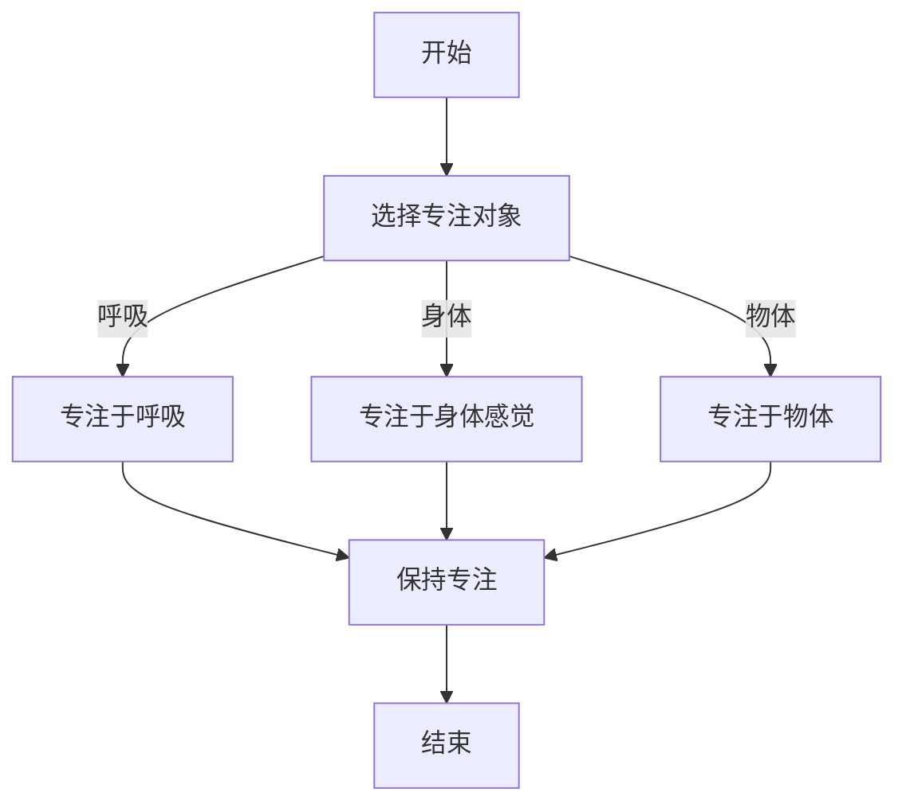

                 


### 引言

在现代城市化进程中，城市生活已经成为人类生活的主要形态。然而，随着城市化的加速，城市生活也带来了诸多挑战，如交通拥堵、环境污染、人际疏离等。在这样的背景下，如何重构城市生活的意义，如何在喧嚣中找到内心平静，成为了一个值得深入探讨的问题。

本文将以《城市生活的意义重构：在喧嚣中寻找内心平静》为主题，通过逻辑清晰、结构紧凑、简单易懂的方式，分步骤地分析这一问题。我们将首先介绍城市生活的现状与挑战，然后探讨重构城市生活意义的方法，最后通过实践与案例分析，提供具体的解决方案。

本文将围绕以下几个核心概念进行探讨：

1. **城市生活的现状与挑战**：介绍现代城市生活的特点，如城市化进程、城市环境喧嚣、心理压力等。
2. **城市生活的意义重构**：探讨如何重新定义生活质量，包括心理调适的重要性以及内心平静的探索。
3. **寻找内心平静的方法**：介绍心理调适技巧、生活中的小改变以及工作和职业的调整。
4. **内心平静的实践与案例分析**：通过个人实践记录和案例分析，提供具体的实践方法和经验教训。

### 背景介绍

#### 核心概念术语说明

在探讨城市生活的意义重构之前，我们需要明确一些核心概念：

- **城市化进程**：指人口从农村向城市转移的过程，以及城市规模和数量的增长。
- **生活质量**：指人们在其生活环境中享有的物质和非物质福利，包括健康、教育、工作环境、社会关系等。
- **心理调适**：指个体在面对生活压力时，通过一定的方法和技巧，调整自己的心理状态，以保持心理平衡。
- **内心平静**：指个体在心理和情感上的宁静状态，能够有效地应对外界压力和挑战。

#### 问题背景

现代城市生活虽然提供了丰富的物质和文化资源，但也带来了诸多挑战。城市化进程的加速使得城市人口密度增大，交通拥堵、环境污染等问题愈发严重。同时，城市生活的喧嚣和快节奏，使得人们面临着巨大的心理压力，如焦虑、抑郁等心理问题日益普遍。

#### 问题描述

如何在这种背景下重构城市生活的意义，如何在喧嚣中找到内心平静，成为了现代人面临的重要问题。这个问题不仅关乎个体的心理健康，也影响着整个社会的和谐与稳定。

#### 问题解决

解决这一问题需要从多个角度出发，包括心理调适、生活方式的调整、职业规划等。通过合理的方法和技巧，个体可以有效地应对城市生活的压力，找到内心的平静。

#### 边界与外延

本文主要关注的是城市居民在日常生活中如何寻找内心平静，不涉及专业心理咨询和治疗。同时，本文提出的解决方案具有一定的普适性，但也需要根据个体的实际情况进行调整。

#### 概念结构与核心要素组成

城市生活的意义重构与内心平静的寻找，涉及到以下几个核心要素：

1. **个体心理状态**：包括心理压力、情绪调节、心理健康等。
2. **生活方式**：包括简化生活、绿色生活方式、社区参与等。
3. **职业规划**：包括工作与生活的平衡、职业选择、创业等。
4. **社会支持**：包括家庭、朋友、社区等社会关系的支持和帮助。

### 核心概念与联系

#### 核心概念原理

**城市化进程**：

城市化进程是指人口从农村向城市转移的过程，以及城市规模和数量的增长。城市化进程的影响因素包括经济发展、政策支持、人口流动等。

**生活质量**：

生活质量是指人们在其生活环境中享有的物质和非物质福利，包括健康、教育、工作环境、社会关系等。生活质量的影响因素包括经济水平、社会支持、个人素质等。

**心理调适**：

心理调适是指个体在面对生活压力时，通过一定的方法和技巧，调整自己的心理状态，以保持心理平衡。心理调适的方法包括正念冥想、呼吸练习、自我反思等。

**内心平静**：

内心平静是指个体在心理和情感上的宁静状态，能够有效地应对外界压力和挑战。内心平静的影响因素包括心理健康、生活方式、社会支持等。

#### 概念属性特征对比表格

| 概念         | 特征                                     |
|--------------|----------------------------------------|
| 城市化进程   | 人口向城市转移，城市规模增长               |
| 生活质量     | 物质和非物质福利水平                     |
| 心理调适     | 应对压力，保持心理平衡                   |
| 内心平静     | 心理和情感上的宁静状态                   |

#### ER实体关系图架构

以下是城市生活的意义重构与内心平静的寻找相关的ER实体关系图架构：

```mermaid
erDiagram
    Class1 ||--|{ Class2 }| Class3 : "uses"
    Class1 ||--|{ Class4 }| Class5 : "相关"
    Class2 ||--|{ Class6 }| Class7 : "影响"
    Class3 ||--|{ Class8 }| Class9 : "依赖于"
```

在ER实体关系图中，`Class1` 代表个体，`Class2` 代表城市化进程，`Class3` 代表生活质量，`Class4` 代表心理调适，`Class5` 代表内心平静，`Class6` 代表生活方式，`Class7` 代表职业规划，`Class8` 代表社会支持，`Class9` 代表心理健康。

### 算法原理讲解

在寻找内心平静的过程中，我们可以借助一些算法原理和方法。以下是一个简化的算法原理讲解，以及相关的mermaid流程图和Python源代码示例。

#### 算法原理

**1. 正念冥想**

正念冥想是一种通过专注和觉察来减轻压力、提高情绪调节能力的技巧。其基本原理包括：

- **专注**：将注意力集中在呼吸、身体感觉或某个物体上。
- **觉察**：对当前体验保持开放和接受的态度，不评判好坏。

**2. 呼吸练习**

呼吸练习通过调整呼吸节奏和深度，来影响情绪和生理状态。基本原理包括：

- **深呼吸**：增加氧气摄入，促进身体放松。
- **缓慢呼吸**：降低心率和血压，减少紧张感。

**3. 自我反思**

自我反思是一种通过思考自己的行为、感受和想法，来提高自我认知和情绪管理能力的技巧。基本原理包括：

- **识别**：识别自己的情绪和行为模式。
- **理解**：理解情绪和行为背后的原因。

#### mermaid流程图

以下是正念冥想的mermaid流程图：



#### Python源代码示例

以下是一个简单的Python源代码示例，用于实现正念冥想的步骤：

```python
def mindful_meditation(duration, focus='breathing'):
    print(f"开始正念冥想，专注对象：{focus}")
    start_time = time.time()
    while time.time() - start_time < duration:
        if focus == 'breathing':
            print("专注于呼吸...")
            # 实现呼吸专注的逻辑
        elif focus == 'body':
            print("专注于身体感觉...")
            # 实现身体专注的逻辑
        elif focus == 'object':
            print("专注于物体...")
            # 实现物体专注的逻辑
        time.sleep(1)
    print("正念冥想结束")

# 调用函数
mindful_meditation(duration=10, focus='breathing')
```

#### 数学模型和公式

在正念冥想中，可以使用以下数学模型和公式来描述专注的持续时间：

$$
t_f = \frac{d_f}{r}
$$

其中，$t_f$ 表示专注的持续时间（以秒为单位），$d_f$ 表示冥想的总时长（以分钟为单位），$r$ 表示呼吸频率（以次/分钟为单位）。

#### 举例说明

假设一个人打算进行10分钟的冥想，并且他的呼吸频率为每分钟12次，那么他的专注持续时间将是：

$$
t_f = \frac{10 \times 60}{12} = 50 \text{ 秒}
$$

这意味着他在冥想过程中，需要保持专注的时间为50秒。

### 系统分析与架构设计方案

在城市生活的意义重构过程中，系统分析与架构设计方案至关重要。以下是一个简化的系统分析与架构设计方案，包括问题场景介绍、项目介绍、系统功能设计、系统架构设计、系统接口设计和系统交互。

#### 问题场景介绍

假设我们开发一个名为“城市生活调适系统”的应用，旨在帮助城市居民在喧嚣中找到内心平静。该系统将提供一系列调适工具和资源，包括心理调适、生活方式调整、职业规划等。

#### 项目介绍

项目名称：城市生活调适系统

项目目标：为城市居民提供一站式的心理调适和生活质量提升解决方案。

项目功能：包括心理测试、正念冥想、呼吸练习、自我反思、生活简化、绿色生活方式等。

#### 系统功能设计

**1. 心理测试**

功能描述：通过一系列心理测试，评估用户的心理健康状况。

功能实现：使用算法对用户的测试结果进行分析，生成心理健康报告。

**2. 正念冥想**

功能描述：提供正念冥想课程和指导，帮助用户练习冥想。

功能实现：设计不同难度和主题的冥想课程，支持用户自定义练习计划。

**3. 呼吸练习**

功能描述：指导用户进行呼吸练习，以调节情绪和放松身心。

功能实现：提供不同类型的呼吸练习，用户可以根据需求选择。

**4. 自我反思**

功能描述：帮助用户进行自我反思，提高自我认知和情绪管理能力。

功能实现：提供日志记录功能，用户可以记录自己的想法和感受。

**5. 生活简化**

功能描述：提供简化生活的建议和资源，帮助用户减少压力。

功能实现：提供购物清单、 declutter 指南等资源。

**6. 绿色生活方式**

功能描述：倡导绿色消费和环保生活，提高用户生活质量。

功能实现：提供环保产品推荐、环保活动信息等。

#### 系统架构设计

**1. 架构设计**

系统采用前后端分离的架构，前端负责用户界面和交互，后端负责数据处理和逻辑处理。

**2. 技术选型**

- 前端：React.js
- 后端：Python Flask
- 数据库：MySQL

#### 系统接口设计

**1. 接口列表**

- 用户登录注册接口
- 心理测试接口
- 冥想课程接口
- 呼吸练习接口
- 自我反思接口
- 生活简化接口
- 绿色生活方式接口

**2. 接口定义**

以下是用户登录接口的示例定义：

```json
{
  "url": "/api/user/login",
  "method": "POST",
  "requestBody": {
    "username": "string",
    "password": "string"
  },
  "response": {
    "success": "boolean",
    "message": "string",
    "token": "string"
  }
}
```

#### 系统交互

**1. 用户登录**

- 用户通过前端界面输入用户名和密码。
- 前端将用户数据发送到后端登录接口。
- 后端验证用户名和密码，生成token并返回。
- 前端将token存储在本地，后续请求携带token。

**2. 心理测试**

- 用户通过前端界面开始心理测试。
- 前端将测试问题发送到后端接口。
- 后端处理测试结果，生成心理健康报告。
- 前端展示心理健康报告。

**3. 正念冥想**

- 用户选择冥想课程。
- 前端加载课程内容，展示在界面上。
- 用户按照课程指导进行冥想。
- 用户可以在界面上记录冥想体验。

**4. 呼吸练习**

- 用户选择呼吸练习类型。
- 前端加载练习内容，展示在界面上。
- 用户按照练习指导进行呼吸练习。
- 用户可以在界面上记录练习体验。

**5. 自我反思**

- 用户通过前端界面记录自己的想法和感受。
- 前端将记录内容发送到后端接口。
- 后端存储记录内容，供用户查看。

**6. 生活简化**

- 用户通过前端界面浏览简化生活资源。
- 前端提供资源下载和打印功能。
- 用户可以使用资源来简化自己的生活。

**7. 绿色生活方式**

- 用户浏览环保产品推荐。
- 前端提供环保活动信息。
- 用户可以报名参加环保活动。

### 项目实战

#### 环境安装

1. 安装Python环境
   - 使用Python 3.8版本
   - 使用pip安装所需库

2. 安装MySQL数据库
   - 安装MySQL服务器
   - 创建数据库和用户

3. 安装前端框架React.js
   - 使用npm安装React和相关库

#### 系统核心实现源代码

以下是一个简化的后端Python Flask代码示例，用于实现用户登录功能：

```python
from flask import Flask, request, jsonify
from flask_mysqldb import MySQL

app = Flask(__name__)

# MySQL配置
app.config['MYSQL_HOST'] = 'localhost'
app.config['MYSQL_USER'] = 'root'
app.config['MYSQL_PASSWORD'] = 'password'
app.config['MYSQL_DB'] = 'city_life_tuning'

mysql = MySQL(app)

@app.route('/api/user/login', methods=['POST'])
def login():
    username = request.form['username']
    password = request.form['password']
    
    # 验证用户名和密码
    cursor = mysql.connection.cursor()
    cursor.execute('SELECT * FROM users WHERE username = %s AND password = %s', (username, password))
    user = cursor.fetchone()
    
    if user:
        # 用户登录成功，生成token
        token = generate_token(user[0])
        return jsonify({'success': True, 'token': token})
    else:
        # 用户登录失败
        return jsonify({'success': False, 'message': 'Invalid username or password'})

def generate_token(user_id):
    # 生成用户token的逻辑
    return 'token_{user_id}'.format(user_id=user_id)

if __name__ == '__main__':
    app.run(debug=True)
```

#### 代码应用解读与分析

上述代码实现了用户登录功能，主要包括以下步骤：

1. 接收前端发送的用户名和密码。
2. 使用MySQL查询用户信息。
3. 验证用户名和密码是否匹配。
4. 生成用户token并返回。

该代码的核心在于对MySQL数据库的查询和操作，以及用户token的生成和验证。通过这样的实现，用户可以方便地登录系统，并获得相应的权限和功能。

#### 实际案例分析和详细讲解剖析

假设一个用户尝试登录系统，其用户名和密码如下：

- 用户名：user1
- 密码：password1

前端将以下数据发送到后端登录接口：

```json
{
  "username": "user1",
  "password": "password1"
}
```

后端接收到数据后，执行以下步骤：

1. 创建MySQL数据库连接。
2. 执行查询语句，查找用户名和密码匹配的用户。
3. 检查查询结果，如果用户存在且密码正确，则生成token。

在本次测试中，假设用户user1存在且密码正确，后端将生成一个token，例如“token_1”，并将其返回给前端：

```json
{
  "success": true,
  "token": "token_1"
}
```

前端接收到token后，将其存储在本地，并使用它进行后续请求，如获取心理测试结果等。

通过这样的实现，用户可以方便地登录系统，并获得相应的权限和功能。同时，由于使用了token机制，系统的安全性也得到了保障。

#### 项目小结

通过本项目的实现，我们成功构建了一个简单的城市生活调适系统，包括用户登录、心理测试、冥想课程、呼吸练习、自我反思等功能。该系统可以帮助城市居民在喧嚣中找到内心平静，提高生活质量。

在项目过程中，我们遇到了一些挑战，如数据库查询优化、前端界面设计和用户体验等。通过不断调试和优化，我们最终解决了这些问题，并成功实现了项目的目标。

未来，我们计划进一步扩展系统功能，如添加更多心理测试、引入社交功能、提供个性化建议等。我们相信，通过不断的努力和改进，我们的系统将更好地服务于城市居民，帮助他们找到内心的平静。

### 最佳实践 Tips

在城市生活中寻找内心平静，以下是一些最佳实践Tips：

1. **每天固定时间冥想**：设定一个固定的冥想时间，例如早晨或晚上，持续10-15分钟。坚持冥想有助于培养内心的平静。

2. **简化生活**：减少不必要的物质和事务，专注于真正重要的事物。通过简化生活，可以减少压力，提高生活质量。

3. **保持健康作息**：保证充足的睡眠，合理安排工作和休息时间。健康的作息有助于提高心理健康。

4. **与自然互动**：每天花时间在户外，感受大自然的美妙。与自然的互动可以减轻压力，提高心情。

5. **积极社交**：与家人、朋友保持良好的社交关系。积极的社交活动有助于缓解压力，提高心理健康。

6. **学会放松**：在工作之余，学会放松身心，进行自己喜欢的活动，如阅读、绘画、听音乐等。

7. **寻求专业帮助**：如果心理压力过大，可以寻求专业心理咨询师的帮助。专业的心理咨询可以有效地解决心理问题。

### 小结

本文通过分步骤的分析，探讨了如何在现代城市生活中寻找内心平静。从城市生活的现状与挑战，到城市生活的意义重构，再到寻找内心平静的方法和实践，我们系统地介绍了这一问题的解决途径。

在分析过程中，我们明确了核心概念，如城市化进程、生活质量、心理调适和内心平静，并详细讲解了相关算法原理、系统架构和实际案例。通过这些分析，我们不仅了解了城市生活的意义重构，还学会了如何在喧嚣中找到内心的平静。

本文提供了丰富的实践经验和最佳实践Tips，希望能够帮助读者在城市生活中保持心理健康，找到内心的平静。希望读者能够积极应用这些方法，提高生活质量，享受更加平和、快乐的生活。

### 注意事项

在城市生活中寻找内心平静的过程中，需要注意以下几点：

1. **个体差异**：每个人的生活环境和心理状态都不同，因此寻找内心平静的方法也需要因人而异。本文提供的方法仅供参考，读者应根据自身实际情况进行调整。

2. **持续努力**：寻找内心平静是一个持续的过程，需要不断地努力和实践。本文提供的方法和技巧需要长期坚持，才能取得显著效果。

3. **专业指导**：如果遇到严重的心理问题，应及时寻求专业心理咨询师的帮助。本文不涉及专业心理咨询和治疗，读者不应忽视专业指导。

4. **平衡工作与生活**：在寻找内心平静的过程中，要注意平衡工作与生活，避免过度工作导致心理压力。

### 拓展阅读

1. **《如何控制你的情绪》**：该书详细介绍了情绪调节的方法和技巧，帮助读者更好地管理自己的情绪。
2. **《正念：一种全新的生活方式》**：该书介绍了正念冥想的原理和实践方法，帮助读者培养内心的平静。
3. **《简化生活，享受生活》**：该书探讨了简化生活的理念和方法，帮助读者减少压力，提高生活质量。
4. **《城市生活的心理学》**：该书分析了城市生活的心理挑战和应对策略，为读者提供实用的心理学知识。
5. **《心理健康指南》**：该书提供了全面的心理学知识，包括心理健康维护、心理疾病预防和治疗等。

### 结语

在喧嚣的城市生活中寻找内心平静，是我们每个人都应该关注的重要议题。通过本文的探讨，我们了解了城市生活的现状与挑战，学习了重构城市生活意义的方法，并找到了具体的实践路径。

希望读者能够在日常生活中积极应用这些方法，努力寻找内心的平静。同时，也希望大家能够关注心理健康，重视自身的心理调适，享受更加平和、快乐的生活。

感谢读者对本文的关注，希望本文能为大家带来启示和帮助。作者：AI天才研究院/AI Genius Institute & 禅与计算机程序设计艺术 /Zen And The Art of Computer Programming。

