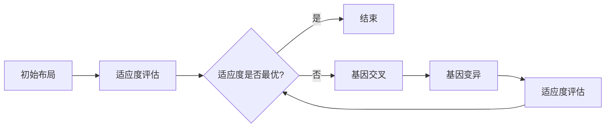
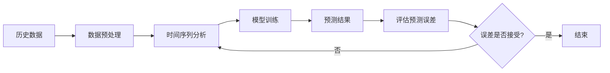
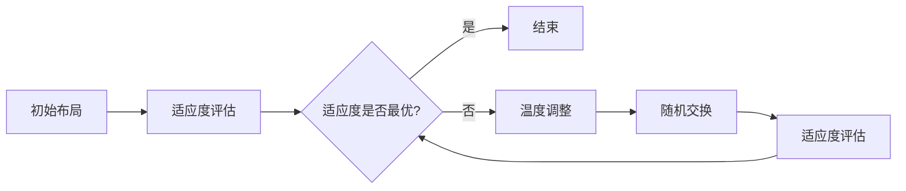
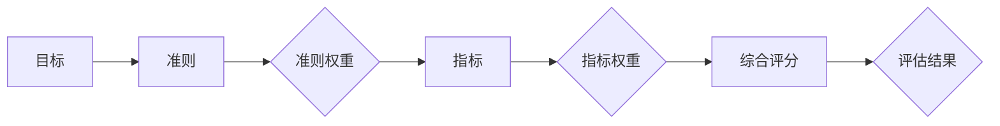
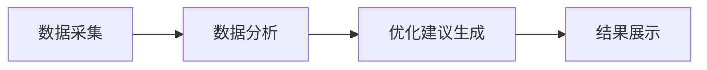
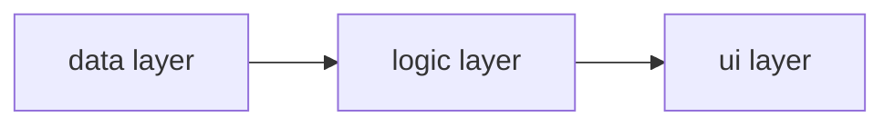
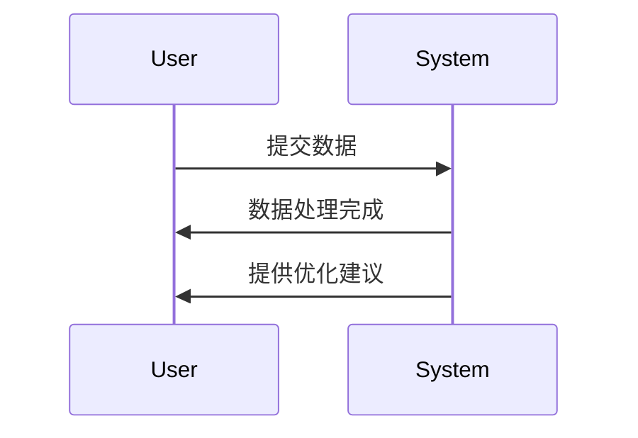

                 


# 城市规划：宜居环境中的生活品质提升

## 关键词：
- 城市规划
- 宜居环境
- 生活品质
- 数学模型
- 算法原理
- 系统设计与实现

## 摘要：
本文旨在探讨城市规划在提升宜居环境生活品质方面的作用。通过分析核心概念与联系，引入数学模型和算法原理，详细阐述系统分析与架构设计方案，以及项目实战和最佳实践，本文旨在为城市规划提供切实可行的技术路径，以实现宜居环境的构建与优化。

## 第一部分：背景介绍

### 第1章：问题背景

#### 1.1 城市化与宜居性问题
随着全球城市化进程的加速，城市化带来的宜居性问题愈发突出。高密度人口、交通拥堵、环境污染等成为制约城市生活品质的关键因素。因此，城市规划成为提升生活品质的重要手段。

#### 1.2 城市规划的核心目标
城市规划的核心目标是构建宜居环境，提升居民的生活质量。这包括满足居民的日常生活需求、提供良好的居住条件、保障公共卫生和安全等多个方面。

#### 1.3 当前城市规划面临的挑战
当前城市规划面临着诸多挑战，如城市扩张导致的土地资源紧张、环境污染问题日益严重、交通拥堵问题难以解决等。这些问题对城市规划提出了更高的要求。

#### 1.4 生活品质提升的意义与重要性
提升生活品质对于城市的发展至关重要。它不仅能够提高居民的幸福感和满意度，还能吸引人才、促进经济发展，从而推动城市的可持续发展。

## 第二部分：核心概念与联系

### 第2章：核心概念与联系

#### 2.1 宜居环境的定义与标准
宜居环境是指能够满足居民基本生活需求、保障居民身心健康、提供舒适生活条件的居住环境。其标准包括环境质量、生活便利性、社会安全等多个方面。

#### 2.2 生活品质的衡量指标
生活品质的衡量指标包括居民收入水平、住房条件、教育质量、医疗资源、休闲娱乐设施等。通过这些指标，可以全面评估城市的生活品质。

#### 2.3 城市规划的关键要素
城市规划的关键要素包括土地规划、交通规划、市政设施规划、公共空间规划等。这些要素共同构成了城市规划的框架。

#### 2.4 宜居环境与生活品质的关系
宜居环境与生活品质密切相关。一个宜居的环境能够为居民提供良好的生活条件，从而提升生活品质。

## 第三部分：数学模型和算法原理讲解

### 第3章：城市规划中的数学模型和数学公式

#### 3.1 人流分析模型
人流分析模型用于预测城市中的交通流量，包括行人流量和车辆流量。其核心公式为：
\[ P(t) = f(T) \times (1 - e^{-rt}) \]
其中，\( P(t) \)表示时间\( t \)内的人流量，\( f(T) \)表示单位时间内的行人流量，\( r \)为行人流量增长率。

#### 3.2 城市交通流量模型
城市交通流量模型用于预测交通拥堵情况。其核心公式为：
\[ C(t) = (1 - \alpha) \times (1 + \beta \times \frac{Q(t)}{Q_{\text{max}}}) \]
其中，\( C(t) \)表示时间\( t \)内的交通拥堵程度，\( \alpha \)为交通畅通系数，\( \beta \)为交通拥堵系数，\( Q(t) \)为时间\( t \)内的交通流量，\( Q_{\text{max}} \)为最大交通流量。

#### 3.3 绿化覆盖率计算模型
绿化覆盖率计算模型用于评估城市中的绿化水平。其核心公式为：
\[ G = \frac{A_{\text{green}}}{A_{\text{total}}} \times 100\% \]
其中，\( G \)为绿化覆盖率，\( A_{\text{green}} \)为绿化面积，\( A_{\text{total}} \)为总面积。

#### 3.4 生活品质评价模型
生活品质评价模型用于评估城市的生活品质。其核心公式为：
\[ Q = \alpha_1 \times I + \alpha_2 \times E + \alpha_3 \times S + \alpha_4 \times H \]
其中，\( Q \)为生活品质评分，\( I \)为收入水平，\( E \)为教育质量，\( S \)为社会保障，\( H \)为住房条件。

### 第4章：算法原理讲解

#### 4.1 空间布局优化算法
空间布局优化算法用于优化城市布局，提高土地利用效率。其核心算法为遗传算法，流程图如下：



#### 4.2 交通流量预测算法
交通流量预测算法用于预测交通流量，减少交通拥堵。其核心算法为时间序列预测，流程图如下：



#### 4.3 绿化规划算法
绿化规划算法用于优化城市绿化布局，提高绿化覆盖率。其核心算法为模拟退火算法，流程图如下：



#### 4.4 生活品质评估算法
生活品质评估算法用于评估城市生活品质。其核心算法为层次分析法，流程图如下：



## 第四部分：系统分析与架构设计方案

### 第5章：系统分析与架构设计方案

#### 5.1 问题场景介绍
以某城市为例，分析其城市规划中的问题，并设计相应的系统解决方案。

#### 5.2 系统功能设计
设计系统功能，包括数据采集、数据分析、优化建议生成等。



#### 5.3 系统架构设计
设计系统架构，包括数据层、业务逻辑层、表现层等。



#### 5.4 系统接口设计和系统交互
设计系统接口，包括数据接口、服务接口等，并描述系统交互流程。



## 第五部分：项目实战

### 第6章：项目实战

#### 6.1 环境安装
描述项目环境安装过程，包括软件安装、依赖库安装等。

#### 6.2 系统核心实现源代码
提供系统核心实现源代码，并进行详细解读。

```python
# 人流分析模型实现
def traffic_flow_analysis(data):
    # 数据预处理
    processed_data = preprocess_data(data)
    
    # 适应度评估
    fitness = fitness_evaluation(processed_data)
    
    # 遗传算法优化
    optimized_layout = genetic_algorithm_optimization(fitness)
    
    return optimized_layout

# 主函数
if __name__ == "__main__":
    # 读取数据
    data = read_data("data.csv")
    
    # 人流分析
    optimized_layout = traffic_flow_analysis(data)
    
    # 输出结果
    print("Optimized layout:", optimized_layout)
```

#### 6.3 代码应用解读与分析
对代码进行解读，分析其实现原理和关键步骤。

#### 6.4 实际案例分析与详细讲解剖析
选择实际案例，分析其城市规划中的问题，并使用系统解决方案进行优化。

#### 6.5 项目小结
对项目进行总结，回顾关键技术和经验。

## 第六部分：最佳实践 Tips

### 第7章：最佳实践 Tips

#### 7.1 城市规划中的常见误区
分析城市规划中的常见误区，并提供相应的解决策略。

#### 7.2 提升生活品质的有效策略
提供提升生活品质的有效策略，包括政策建议和技术手段。

#### 7.3 未来城市规划的趋势
探讨未来城市规划的趋势，包括人工智能、大数据等新技术在其中的应用。

## 第七部分：小结与展望

### 第8章：小结与展望

#### 8.1 书本内容的总结
总结本书的主要内容和关键技术。

#### 8.2 城市规划中的持续挑战与机遇
分析城市规划中的持续挑战与机遇。

#### 8.3 未来城市规划的展望
探讨未来城市规划的发展方向和前景。

## 作者信息

作者：AI天才研究院/AI Genius Institute & 禅与计算机程序设计艺术 /Zen And The Art of Computer Programming

本文详细介绍了城市规划在提升宜居环境生活品质方面的作用，分析了核心概念与联系，讲解了数学模型和算法原理，并设计了系统分析与架构设计方案。通过项目实战和最佳实践，本文为城市规划提供了切实可行的技术路径。未来，城市规划将面临更多的挑战与机遇，本文为城市规划的发展提供了有益的启示。

