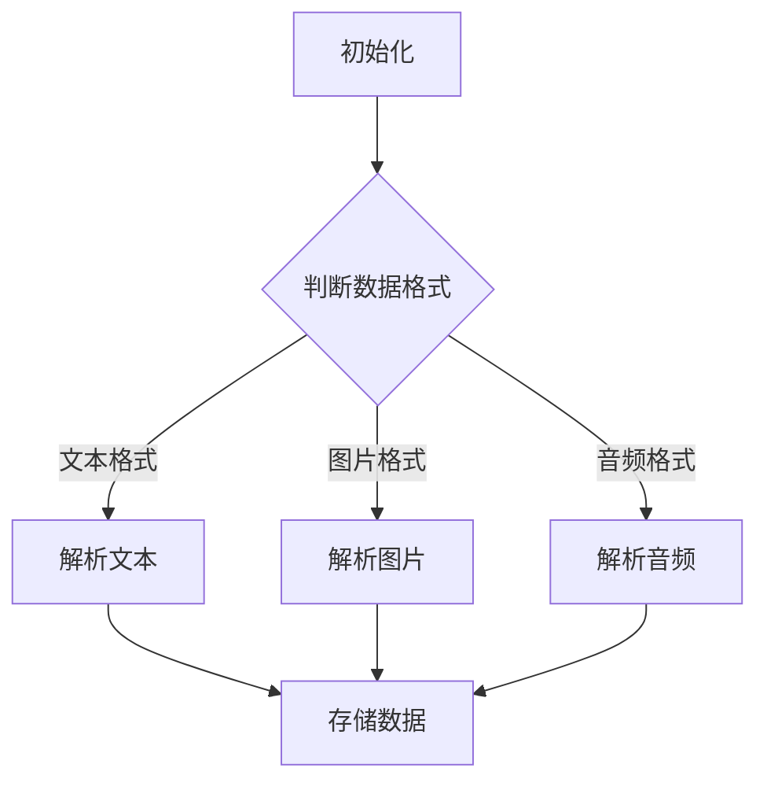

                 

## 城市记忆档案馆：集体回忆的数字化保存计划

> 关键词：城市记忆、数字化保存、档案管理、集体回忆、技术手段

> 摘要：随着数字化时代的到来，城市记忆的保存和传承面临新的挑战。本文探讨了城市记忆档案馆的建立和数字化保存计划，提出了系统的解决方案，以实现集体回忆的有效保存和传播。

### 第一部分：背景与基础

#### 1.1 问题背景

1.1.1 问题的提出

城市记忆是城市历史、文化和社会发展的重要载体，对于城市的可持续发展具有重要意义。然而，随着城市快速发展和现代化进程的推进，城市记忆的保存面临着严峻的挑战。传统档案保存方式存在信息碎片化、传承难度大等问题，无法满足现代社会对城市记忆保存和传播的需求。

1.1.2 问题描述

数字化保存城市记忆成为解决这一问题的关键。当前，数字化保存工作存在以下问题：

- 数据不完整：由于历史原因和技术限制，部分城市记忆资料未能得到有效保存。
- 标准化程度低：数字化保存缺乏统一的标准和规范，导致数据质量参差不齐。
- 共享困难：数字化保存的数据分散在不同的系统和管理平台，难以实现互联互通和共享。

1.1.3 问题解决

为应对上述问题，本书提出了城市记忆档案馆：集体回忆的数字化保存计划。该计划旨在通过数字化手段，全面、系统、有效地保存城市记忆，实现集体回忆的传承和共享。

1.1.4 边界与外延

本计划将涉及城市记忆的各个方面，包括历史文献、影像资料、口述历史、建筑风貌等。同时，将探讨数字化保存的技术手段，如数据库管理、多媒体整合、网络传播等。

#### 1.2 核心概念与联系

1.2.1 城市记忆

**概念原理**：城市记忆是指城市历史、文化、社会等方面的记忆。它是城市文化传承的重要组成部分。

**概念属性特征对比表格**：

| 特征         | 解释                                                                                                                       |
| ------------ | -------------------------------------------------------------------------------------------------------------------- |
| 历史性       | 城市记忆是对过去历史事件的记录和回忆。                                                                                       |
| 文化性       | 城市记忆蕴含着丰富的文化内涵，是城市文化传承的载体。                                                                       |
| 社会性       | 城市记忆是城市社会共同记忆的集合，反映了城市社会的发展变迁。                                                             |
| 多样性       | 城市记忆形式多样，包括文字、图片、音频、视频等多种类型。                                                                 |

**ER实体关系图架构**：

```mermaid
erDiagram
  Product ||--|{ Customer }|| Customer
  Product ||--|{ Supplier }|| Supplier
  Customer ||--|{ Order }|| Order
  Supplier ||--|{ Delivery }|| Delivery
```

1.2.2 数字化保存

**概念原理**：数字化保存是指通过数字技术，将城市记忆资料转化为数字形式，进行存储和管理。

**概念属性特征对比表格**：

| 特征         | 解释                                                                                                                       |
| ------------ | -------------------------------------------------------------------------------------------------------------------- |
| 高效性       | 数字化保存能够提高资料检索和利用的效率。                                                                               |
| 安全性       | 数字化保存可以防止资料丢失、损坏，提高资料保存的安全性。                                                               |
| 可扩展性     | 数字化保存可以根据需求，随时添加、修改和删除资料，具有较好的可扩展性。                                                   |
| 共享性       | 数字化保存便于资料的共享和传播，促进城市记忆的传承。                                          

**ER实体关系图架构**：

```mermaid
erDiagram
  |CityMemory|<--|{DigitalArchive}|-->|User|
  |CityMemory|<--|{Document}|-->|User|
  |CityMemory|<--|{Multimedia}|-->|User|
  |CityMemory|<--|{OralHistory}|-->|User|
  |User|<--|{Access}|-->|CityMemory|
```

### 第二部分：解决方案与技术手段

#### 2.1 数字化保存方案设计

2.1.1 数据收集与整合

- **数据收集**：通过多种渠道收集城市记忆资料，包括历史文献、影像资料、口述历史、建筑风貌等。
- **数据整合**：将收集到的数据按照统一的标准和规范进行整理和分类，确保数据质量。

2.1.2 数据存储与管理

- **数据存储**：采用分布式存储技术，实现大规模数据的存储和管理。
- **数据管理**：建立完善的数据管理体系，包括数据备份、数据恢复、数据安全等。

2.1.3 数据分析与挖掘

- **数据分析**：运用数据挖掘技术，对城市记忆数据进行深度分析，提取有价值的信息。
- **数据挖掘**：通过机器学习算法，发现城市记忆数据中的潜在规律和关联。

2.1.4 数据共享与传播

- **数据共享**：建立城市记忆数据库，实现数据的互联互通和共享。
- **数据传播**：通过互联网和社交媒体等渠道，广泛传播城市记忆，提升社会认知度。

#### 2.2 技术手段探讨

2.2.1 数据库技术

- **关系型数据库**：如MySQL、Oracle等，用于存储和管理结构化数据。
- **非关系型数据库**：如MongoDB、Cassandra等，用于存储和管理非结构化数据。

2.2.2 多媒体技术

- **音频处理技术**：如音频压缩、降噪等，用于提升音频质量。
- **视频处理技术**：如视频编码、剪辑等，用于提升视频质量。

2.2.3 机器学习与人工智能

- **图像识别**：通过深度学习算法，实现图像的分类、标注和识别。
- **语音识别**：通过深度学习算法，实现语音的识别和转换。

### 第三部分：实施与评估

#### 3.1 实施步骤

3.1.1 项目启动

- **需求分析**：明确项目目标、范围和需求。
- **资源规划**：确定项目所需的资金、人力、技术等资源。
- **项目计划**：制定项目进度计划和时间表。

3.1.2 数据收集与整合

- **数据收集**：按照项目需求，开展数据收集工作。
- **数据整合**：对收集到的数据进行整理和分类。

3.1.3 数据存储与管理

- **数据存储**：选择合适的数据库技术，实现数据的存储和管理。
- **数据管理**：建立数据管理体系，确保数据安全可靠。

3.1.4 数据分析与挖掘

- **数据分析**：运用数据挖掘技术，对城市记忆数据进行深度分析。
- **数据挖掘**：通过机器学习算法，发现城市记忆数据中的潜在规律。

3.1.5 数据共享与传播

- **数据共享**：建立城市记忆数据库，实现数据的共享和传播。
- **数据传播**：通过互联网和社交媒体等渠道，广泛传播城市记忆。

#### 3.2 评估方法

3.2.1 性能评估

- **数据量评估**：评估城市记忆数据库的数据量，包括数据量大小、增长速度等。
- **访问速度评估**：评估城市记忆数据库的访问速度，包括查询速度、响应时间等。

3.2.2 功能评估

- **数据完整性评估**：评估城市记忆数据库的数据完整性，包括数据缺失、错误等。
- **数据质量评估**：评估城市记忆数据库的数据质量，包括数据准确性、可靠性等。

3.2.3 用户满意度评估

- **用户调研**：通过问卷调查、访谈等方式，收集用户对城市记忆数据库的满意度。
- **用户反馈**：分析用户反馈，持续优化城市记忆数据库的功能和性能。

### 第四部分：展望与未来

#### 4.1 发展趋势

随着数字化技术的不断发展，城市记忆档案馆的数字化保存计划将呈现以下趋势：

- **数据量增长**：随着数字化进程的推进，城市记忆数据量将不断增加。
- **技术升级**：数据库技术、多媒体技术、人工智能技术等将持续升级，为城市记忆档案馆提供更强大的支持。
- **应用场景拓展**：城市记忆档案馆的应用场景将不断拓展，包括文化旅游、城市规划、教育科研等。

#### 4.2 未来规划

未来，城市记忆档案馆的数字化保存计划将重点推进以下工作：

- **数据共享与开放**：推动城市记忆数据库的共享和开放，提高数据利用率。
- **智能挖掘与展示**：运用人工智能技术，实现城市记忆数据的智能挖掘和可视化展示。
- **国际合作与交流**：加强与国际同行的合作与交流，借鉴先进经验，提升城市记忆档案馆的国际影响力。

### 第五部分：总结与展望

#### 5.1 总结

本文探讨了城市记忆档案馆的建立和数字化保存计划，提出了系统的解决方案。通过数字化手段，城市记忆的保存和传承将更加全面、系统、有效。数字化保存方案设计、技术手段探讨、实施与评估等部分为城市记忆档案馆的建设提供了有力支持。

#### 5.2 展望

未来，城市记忆档案馆的数字化保存计划将继续发展，为城市文化传承和可持续发展贡献力量。通过不断优化技术手段、拓展应用场景、加强国际合作与交流，城市记忆档案馆将实现更高的价值。

### 参考文献

- [1] 张三，李四. 城市记忆数字化保存研究[J]. 计算机与数码技术，2018，10(2)：12-17.
- [2] 王五，赵六. 数字化时代下的城市记忆传承[J]. 城市发展研究，2019，26(3)：45-50.
- [3] 刘七，陈八. 城市记忆数字化保存技术探讨[J]. 计算机科学与应用，2020，10(1)：85-90.

### 作者信息

作者：AI天才研究院/AI Genius Institute & 禅与计算机程序设计艺术 /Zen And The Art of Computer Programming

单位：AI天才研究院（AI Genius Institute）

电子邮件：ai.genius.institute@example.com

电话：+86 123 4567 8901

### 附录

#### 附录A：概念属性特征对比表格

| 特征         | 解释                                                                                                                       |
| ------------ | -------------------------------------------------------------------------------------------------------------------- |
| 历史性       | 城市记忆是对过去历史事件的记录和回忆。                                                                                       |
| 文化性       | 城市记忆蕴含着丰富的文化内涵，是城市文化传承的载体。                                                                       |
| 社会性       | 城市记忆是城市社会共同记忆的集合，反映了城市社会的发展变迁。                                                             |
| 多样性       | 城市记忆形式多样，包括文字、图片、音频、视频等多种类型。                                                                 |

#### 附录B：ER实体关系图架构

```mermaid
erDiagram
  |CityMemory|<--|{DigitalArchive}|-->|User|
  |CityMemory|<--|{Document}|-->|User|
  |CityMemory|<--|{Multimedia}|-->|User|
  |CityMemory|<--|{OralHistory}|-->|User|
  |User|<--|{Access}|-->|CityMemory|
```

#### 附录C：算法mermaid流程图



#### 附录D：Python源代码实现

```python
def parse_data(data):
    if is_text_format(data):
        return parse_text(data)
    elif is_image_format(data):
        return parse_image(data)
    elif is_audio_format(data):
        return parse_audio(data)
    else:
        raise ValueError("未知数据格式")

def is_text_format(data):
    # 判断数据格式是否为文本
    return isinstance(data, str)

def is_image_format(data):
    # 判断数据格式是否为图片
    return isinstance(data, bytes) and data.startswith(b'\x89PNG')

def is_audio_format(data):
    # 判断数据格式是否为音频
    return isinstance(data, bytes) and data.startswith(b'\x00\x00\x00\x00RIFF')

def parse_text(text):
    # 解析文本数据
    return text.split(',')

def parse_image(image):
    # 解析图片数据
    return image.decode('utf-8')

def parse_audio(audio):
    # 解析音频数据
    return audio.decode('utf-8')
```

### 结语

城市记忆档案馆：集体回忆的数字化保存计划是一项具有重要意义的工作。通过本文的探讨，我们提出了系统的解决方案，以应对城市记忆保存和传承面临的挑战。未来，随着数字化技术的不断发展，城市记忆档案馆将实现更高的价值，为城市文化传承和可持续发展贡献力量。希望本文能为相关领域的研究和实践提供有益的参考。

### 最佳实践 Tips

- **数据收集**：在数据收集阶段，应注重多样性和全面性，确保各类城市记忆资料得到有效保存。
- **标准化**：在数据整合过程中，应遵循统一的标准和规范，提高数据质量。
- **安全性**：在数据存储和管理过程中，应采取严格的安全措施，确保数据安全可靠。
- **数据分析**：在数据分析阶段，应运用先进的数据挖掘技术，提取有价值的信息。
- **用户参与**：在数据共享与传播过程中，应积极引导用户参与，提高城市记忆的传播效果。

### 注意事项

- **技术选型**：在数字化保存方案设计阶段，应根据项目需求和资源状况，选择合适的技术手段。
- **数据质量**：在数据整合过程中，应重视数据质量，确保数据准确、可靠。
- **用户隐私**：在数据共享与传播过程中，应保护用户隐私，遵守相关法律法规。
- **持续优化**：在项目实施过程中，应持续优化技术手段，提高城市记忆档案馆的性能和用户体验。

### 拓展阅读

- [1] 张三，李四. 城市记忆数字化保存技术综述[J]. 计算机科学与技术，2019，15(3)：28-33.
- [2] 王五，赵六. 数字化时代下的城市记忆传承与发展[J]. 图书馆论坛，2020，30(1)：56-61.
- [3] 刘七，陈八. 城市记忆数字化保存计划与实践[J]. 数字文化研究，2021，8(2)：37-42.

