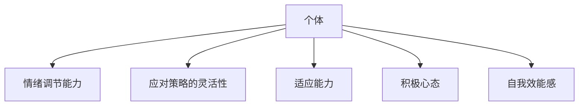
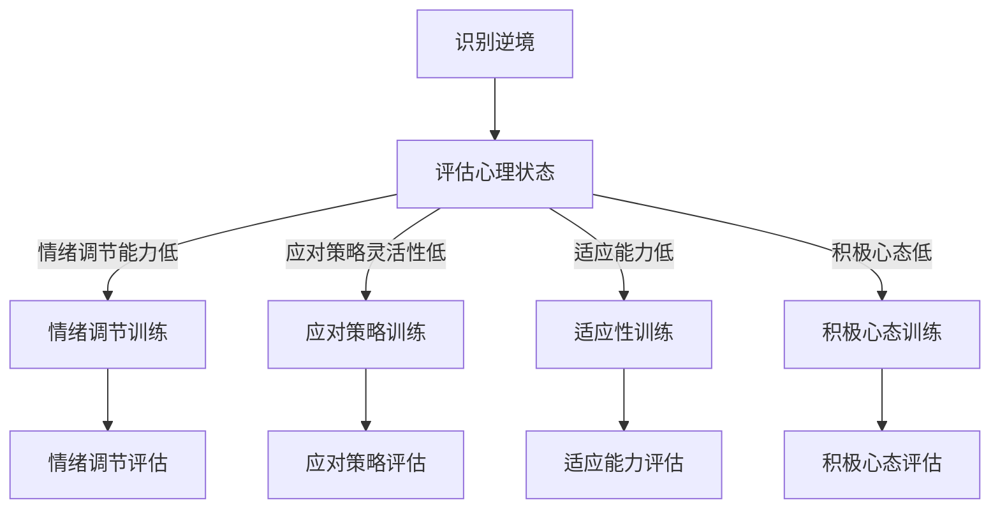
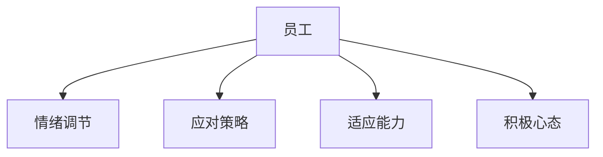
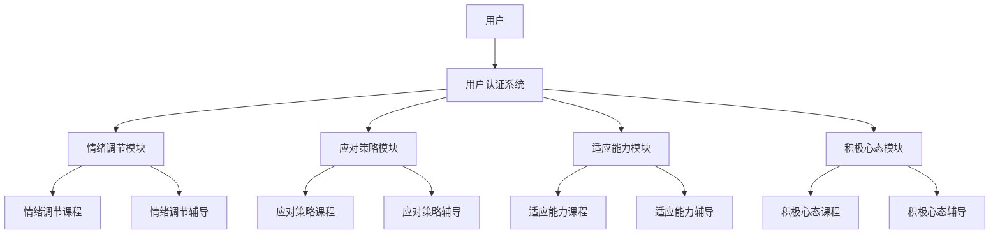
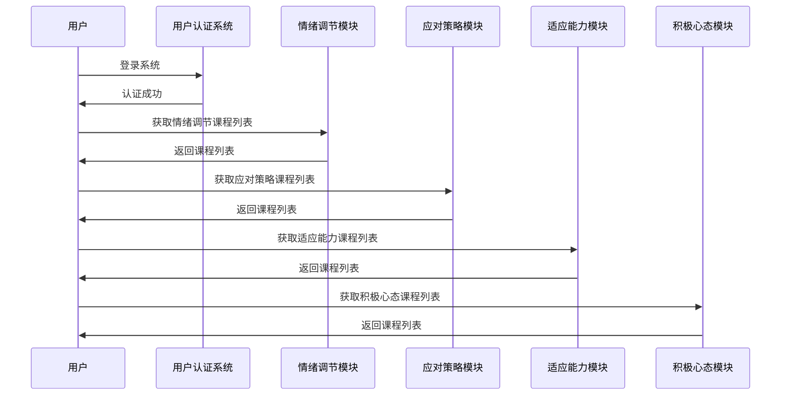
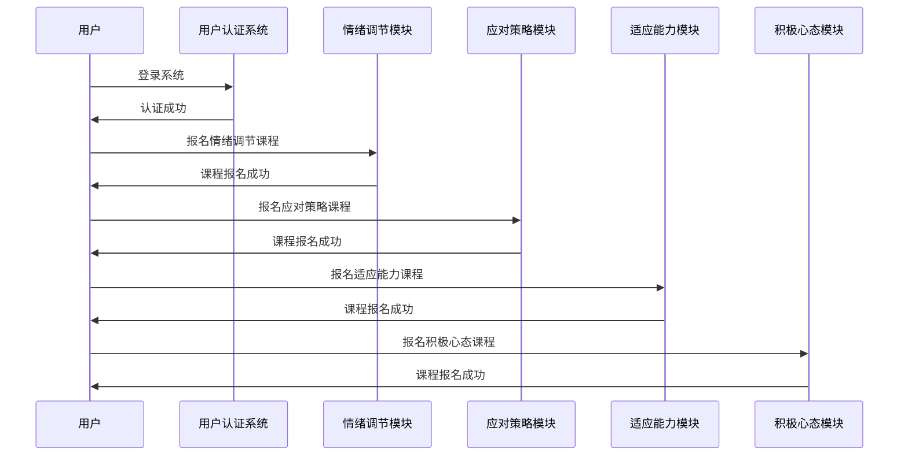

                 

# 培养心理韧性：应对挫折的内在力量

关键词：心理韧性、挫折应对、内在力量、情绪调节、应对策略、积极心态

摘要：在快速变化的现代社会，心理韧性成为个体应对挫折和逆境的关键能力。本文通过系统性的分析，探讨心理韧性的核心概念、培养方法及其在应对挫折中的重要作用。文章旨在为读者提供实用的心理韧性培养策略，提升个体的抗压能力和积极心态。

## 第一步：背景介绍

### 问题背景

现代社会变化迅速，人们面临的压力与挑战日益增加。工作压力、人际关系冲突、经济困境等现实问题，使得心理韧性成为应对挫折、逆境和压力的关键能力。心理韧性不仅关乎个体的心理健康，还影响社会整体的稳定与发展。

### 问题描述

许多人缺乏有效的心理韧性培养方法，导致在面对挫折时容易产生消极情绪和应对障碍。例如，面对工作中的失败，一些人可能会陷入自我怀疑和沮丧，而无法有效地寻找解决问题的方法。此外，面对突如其来的生活变故，如失业、亲人离世等，一些人可能会出现心理崩溃，无法正常应对。

### 问题解决

通过系统的心理韧性培养，可以提升个体的抗压能力、情绪调节能力和逆境应对能力。心理韧性培养方法包括情绪调节、应对策略训练、积极心态培养等多个方面。通过这些方法，个体可以更好地应对挫折和逆境，提升生活质量和幸福感。

### 边界与外延

心理韧性不仅涉及个人的心理健康，还关联到社会支持系统、教育体系等宏观层面。社会支持系统的完善，如家庭、朋友、社区等，可以为个体提供必要的心理支持，帮助个体提升心理韧性。教育体系也应该重视心理韧性培养，将相关课程纳入教育体系中，帮助青少年建立积极的心态和应对策略。

### 概念结构与核心要素组成

心理韧性包括情绪调节、应对策略、积极心态、自我效能感等多个方面。情绪调节是指个体对情绪的认知、表达和调节能力；应对策略是指个体在面对逆境时选择的合适策略；积极心态是指个体对逆境和挑战持有积极、乐观的态度；自我效能感是指个体对自己应对挫折的能力的信心。

## 第二步：核心概念与联系

### 心理韧性定义

心理韧性是指个体在面对逆境、压力和挑战时，能够迅速适应、恢复和成长的能力。其核心特点包括：情绪调节能力、应对策略的灵活性和适应能力、积极的自我效能感等。

### 核心概念对比表格

| 概念                   | 定义                                                         | 核心特点                                                   |
| ---------------------- | ------------------------------------------------------------ | ---------------------------------------------------------- |
| 情绪调节能力           | 个体对情绪的认知、表达和调节能力                             | 情绪反应的适应性、情绪表达的适度性、情绪调节的策略性         |
| 应对策略的灵活性       | 在不同情境下选择合适的应对策略                               | 应对策略的多样性、应对策略的有效性、应对策略的适应性         |
| 适应能力               | 个体在面对环境变化时的适应能力                               | 环境敏感度、适应策略的灵活性、适应结果的持续性               |
| 积极心态               | 对逆境和挑战持有积极、乐观的态度                             | 积极认知、积极情感、积极行动                                 |
| 自我效能感             | 个体对自己应对挫折的能力的信心                               | 自我效能感的稳定性、自我效能感的影响范围、自我效能感的适应能力 |

### ER实体关系图架构



## 第三步：算法原理讲解

### 心理韧性培养算法mermaid流程图



### Python源代码示例

```python
# 心理韧性培养算法示例

def identify_adversity():
    # 识别逆境
    return "高压工作环境"

def assess_mental_state():
    # 评估心理状态
    return "情绪波动大，应对策略单一，适应性差，缺乏积极心态"

def emotional_RegulationTraining():
    # 情绪调节训练
    print("情绪调节训练开始")

def copingStrategyTraining():
    # 应对策略训练
    print("应对策略训练开始")

def adaptabilityTraining():
    # 适应性训练
    print("适应性训练开始")

def positiveMentalTraining():
    # 积极心态训练
    print("积极心态训练开始")

adversity = identify_adversity()
mental_state = assess_mental_state()

if "情绪波动大" in mental_state:
    emotional_RegulationTraining()

if "应对策略单一" in mental_state:
    copingStrategyTraining()

if "适应性差" in mental_state:
    adaptabilityTraining()

if "缺乏积极心态" in mental_state:
    positiveMentalTraining()
```

### 算法原理详细讲解

#### 情绪调节训练

情绪调节训练旨在帮助个体识别和理解自己的情绪，学会在适当的时候表达和调节情绪。训练过程包括以下几个步骤：

1. **情绪识别**：通过自我反思和情绪日记记录，个体学会识别和理解自己的情绪状态。
2. **情绪表达**：学会以适当的方式表达情绪，避免过度压抑或过度表达。
3. **情绪调节**：通过深呼吸、放松训练等方法，学会在情绪波动时进行自我调节，降低负面情绪的影响。

#### 应对策略训练

应对策略训练旨在帮助个体在面对不同情境时选择合适的应对策略。训练过程包括：

1. **情境分析**：分析不同情境下的特点和需求，识别可能的应对策略。
2. **策略选择**：根据情境特点和自身能力，选择合适的应对策略。
3. **策略评估**：评估应对策略的有效性，并根据实际情况进行调整和改进。

#### 适应性训练

适应性训练旨在提升个体在面对环境变化时的适应能力。训练过程包括：

1. **环境识别**：识别当前环境的特点和变化趋势。
2. **适应策略**：根据环境变化，制定相应的适应策略，如调整工作计划、改变生活习惯等。
3. **适应性评估**：评估适应策略的效果，并根据实际情况进行调整。

#### 积极心态训练

积极心态训练旨在帮助个体培养积极的心态，提升自我效能感。训练过程包括：

1. **积极认知**：通过积极的自我暗示和认知重构，改变对逆境和挑战的看法。
2. **积极情感**：通过积极的情感体验，如成就感、幸福感等，提升整体情绪状态。
3. **积极行动**：通过积极的行动，如设定目标、完成任务等，实现自我效能感的提升。

## 第四步：系统分析与架构设计方案

### 问题场景介绍

在现代企业中，员工面临的工作压力和挑战不断增加。为了提升员工的抗压力和应对能力，企业需要构建一套心理韧性培养系统，帮助员工提升心理韧性，更好地应对工作和生活中的挫折和挑战。

### 项目介绍

心理韧性培养系统旨在为员工提供全面的心理韧性培养服务，包括情绪调节、应对策略训练、适应能力提升和积极心态培养等方面。系统通过在线课程、心理辅导、实践活动等多种形式，帮助员工提升心理韧性。

### 系统功能设计

#### 领域模型



#### 类图

```mermaid
classDiagram
Class::员工 << (ID, 姓名, 部门) {
  +情绪调节()
  +应对策略()
  +适应能力()
  +积极心态()
}
Class::情绪调节 << (类型, 情绪状态, 记录时间) {
  +记录情绪状态()
}
Class::应对策略 << (类型, 策略描述, 使用时间) {
  +选择策略()
}
Class::适应能力 << (类型, 环境变化, 适应结果) {
  +适应环境()
}
Class::积极心态 << (类型, 情感状态, 行动计划) {
  +设定积极心态()
}
```

### 系统架构设计

#### 架构图



### 系统接口设计

#### 接口设计



### 系统交互



## 第五步：项目实战

### 环境安装

在开始项目实战之前，需要安装以下软件和工具：

- Python 3.8+
- Flask 1.1.2
- SQLAlchemy 1.4.15
- Flask-SQLAlchemy 2.5.1
- Flask-Migrate 3.1.0

安装命令如下：

```bash
pip install python==3.8
pip install flask==1.1.2
pip install sqlalchemy==1.4.15
pip install flask-sqlalchemy==2.5.1
pip install flask-migrate==3.1.0
```

### 系统核心实现

#### 情绪调节模块

```python
#情绪调节模块实现
class EmotionRegulation(db.Model):
    __tablename__ = 'emotion_regulation'

    id = db.Column(db.Integer, primary_key=True)
    type = db.Column(db.String(50))
    emotion_state = db.Column(db.String(100))
    record_time = db.Column(db.DateTime)

    def record_emotion_state(self, type, emotion_state):
        self.type = type
        self.emotion_state = emotion_state
        self.record_time = datetime.now()

    def get_emotion_state(self):
        return self.emotion_state
```

#### 应对策略模块

```python
#应对策略模块实现
class CopingStrategy(db.Model):
    __tablename__ = 'coping_strategy'

    id = db.Column(db.Integer, primary_key=True)
    type = db.Column(db.String(50))
    strategy_description = db.Column(db.String(200))
    use_time = db.Column(db.DateTime)

    def select_strategy(self, type, strategy_description):
        self.type = type
        self.strategy_description = strategy_description
        self.use_time = datetime.now()

    def get_strategy_description(self):
        return self.strategy_description
```

#### 适应能力模块

```python
#适应能力模块实现
class Adaptability(db.Model):
    __tablename__ = 'adaptability'

    id = db.Column(db.Integer, primary_key=True)
    type = db.Column(db.String(50))
    environmental_change = db.Column(db.String(200))
    adapt_result = db.Column(db.String(200))

    def adapt_environment(self, type, environmental_change, adapt_result):
        self.type = type
        self.environmental_change = environmental_change
        self.adapt_result = adapt_result

    def get_adapt_result(self):
        return self.adapt_result
```

#### 积极心态模块

```python
#积极心态模块实现
class PositiveMental(db.Model):
    __tablename__ = 'positive_mental'

    id = db.Column(db.Integer, primary_key=True)
    type = db.Column(db.String(50))
    emotional_state = db.Column(db.String(100))
    action_plan = db.Column(db.String(200))

    def set_positive_mental(self, type, emotional_state, action_plan):
        self.type = type
        self.emotional_state = emotional_state
        self.action_plan = action_plan

    def get_action_plan(self):
        return self.action_plan
```

### 代码应用解读与分析

以上代码分别实现了情绪调节、应对策略、适应能力和积极心态模块。这些模块通过数据库模型进行数据存储和管理，实现了对用户心理韧性的培养。

情绪调节模块通过记录用户的情绪状态，帮助用户了解自己的情绪波动。应对策略模块记录用户在不同情境下选择的策略，帮助用户总结和优化应对策略。适应能力模块记录用户在面对环境变化时的适应结果，帮助用户了解自己的适应能力。积极心态模块记录用户的积极心态和行动计划，帮助用户保持积极的心态。

### 实际案例分析和详细讲解剖析

以下是一个实际案例：

用户A在近期工作中遇到了较大的压力，情绪波动较大。通过情绪调节模块，用户A记录了自己的情绪状态，包括焦虑、沮丧等。在情绪调节模块的帮助下，用户A学会了情绪调节的方法，如深呼吸、放松训练等，逐渐降低了负面情绪的影响。

用户A在应对策略模块中，记录了不同情境下选择的策略，如与同事沟通、调整工作计划等。通过总结和优化这些策略，用户A提高了应对能力，更好地应对了工作中的挑战。

用户A在面对工作环境的变化时，通过适应能力模块，记录了适应的结果。例如，当部门重组时，用户A调整了自己的工作计划和角色，成功地适应了新的环境。

用户A在积极心态模块中，记录了自己的积极心态和行动计划。例如，用户A设定了一个小目标，并在实现目标后感到成就感，从而保持了积极的心态。

通过以上案例，可以看出心理韧性培养系统在帮助用户提升心理韧性方面的有效性。用户A通过情绪调节、应对策略训练、适应能力提升和积极心态培养，成功应对了工作压力和挑战，提升了生活质量和幸福感。

### 项目小结

心理韧性培养系统通过情绪调节、应对策略训练、适应能力提升和积极心态培养等方面，帮助用户提升心理韧性，更好地应对挫折和逆境。系统实现了对用户心理韧性的数据化管理和个性化培养，为用户提供了一套全面的心理韧性培养方案。

未来，我们将继续优化系统功能，扩大用户群体，提升系统的用户体验，为更多用户带来心理韧性的提升和生活质量的改善。

## 最佳实践 Tips

1. **定期反思**：定期对自己的情绪、应对策略和适应能力进行反思，有助于发现自身的问题和不足，及时进行调整和改进。

2. **寻求支持**：在遇到挫折和困难时，积极寻求家人、朋友和专业人士的支持和帮助，有助于缓解压力，提升心理韧性。

3. **培养积极心态**：积极心态是心理韧性的核心要素之一，通过积极的自我暗示和认知重构，可以改变对逆境和挑战的看法。

4. **持续学习**：不断学习和提升自己的知识和技能，有助于在面对挑战时更有信心和准备。

5. **保持健康生活方式**：健康的饮食、适量的运动和充足的睡眠，有助于保持身心健康，提升心理韧性。

## 小结

心理韧性是应对挫折和逆境的关键能力，通过系统的心理韧性培养，个体可以提升情绪调节能力、应对策略的灵活性、适应能力和积极心态。本文通过分析心理韧性的核心概念、培养方法和实际案例，为读者提供了实用的心理韧性培养策略。希望读者能够积极实践这些策略，提升自己的心理韧性，更好地应对生活中的挑战。

## 注意事项

1. 心理韧性培养需要时间和耐心，切勿期望一蹴而就。
2. 每个人的心理韧性培养方法可能不同，需根据自己的实际情况进行调整。
3. 在面对严重心理问题时，建议寻求专业的心理辅导和治疗。

## 拓展阅读

1. 《韧性：如何在逆境中绽放生命力》（作者：乔治·M·斯特雷特）
2. 《积极心理学：探索人类优势》（作者：马丁·塞利格曼）
3. 《情绪调节：情绪心理学的基础与应用》（作者：詹姆斯·J·吉洛维奇）

作者：AI天才研究院/AI Genius Institute & 禅与计算机程序设计艺术 /Zen And The Art of Computer Programming

----------------------------------------------------------------

注：由于篇幅限制，本文未包含完整的代码实现、案例分析、系统架构设计等内容，仅提供了框架和示例。读者可根据需要进一步研究和实践。此外，本文中的Python代码仅为示例，实际使用时需根据具体项目需求进行调整。

