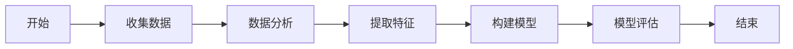
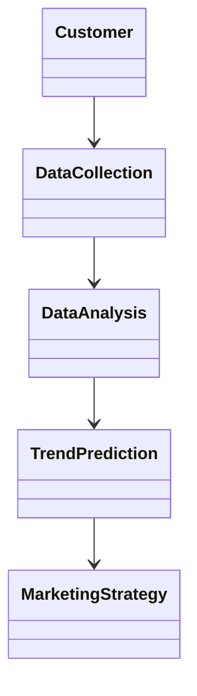
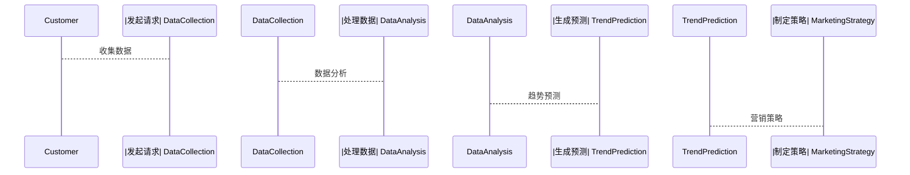
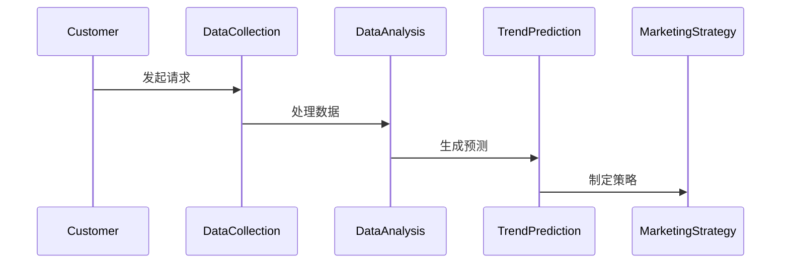

                 

### 《培养生活敏感度：发现日常中的 extraordinary》

**关键词**：生活敏感度、观察力、情感共鸣、思维拓展、日常应用

**摘要**：本文旨在探讨如何培养生活敏感度，发现日常中的 extraordinary。通过提升观察力、情感共鸣和思维拓展，我们可以在日常生活中更好地体验生活的美好，发现那些被忽视的细节，从而提高生活质量。

## **引言**

### **核心概念与背景**

在现代社会，随着科技的发展和生活节奏的加快，人们往往忽略了生活中的细节。而生活敏感度，是指对日常生活中的各种信息、情境和情感的敏锐感知能力。具备较高生活敏感度的人，能够更好地理解自己和他人，发现生活中的美好，从而提高生活质量和幸福感。

### **问题背景**

然而，如何培养和提高生活敏感度，仍然是一个值得探讨的问题。在快节奏的生活中，人们往往忽视了培养生活敏感度的重要性。因此，本文将探讨如何通过提升观察力、情感共鸣和思维拓展来培养生活敏感度，从而发现日常中的 extraordinary。

## **第一部分：提升生活敏感度的技巧**

### **第1章：观察力的培养**

#### **1.1 观察环境**

观察环境是培养生活敏感度的第一步。通过观察周围的环境，我们可以发现那些被忽视的细节，从而提升我们的生活体验。观察环境不仅有助于我们更好地理解生活，还可以激发我们的创造力和想象力。

#### **1.2 观察他人**

观察他人是培养生活敏感度的另一个重要方面。通过观察他人的行为、情感和态度，我们可以更好地理解他人，从而提高我们的沟通能力和人际关系。

#### **1.3 观察自己**

观察自己也是培养生活敏感度的重要一环。通过反思自己的行为、情感和思考过程，我们可以更好地了解自己，从而提高自我认知和自我成长。

### **第2章：情感的共鸣**

#### **2.1 情感感知**

情感感知是指对他人情感的理解和共鸣。通过提高情感感知能力，我们可以更好地理解他人的需求和感受，从而提高人际关系和生活质量。

#### **2.2 情感表达**

情感表达是指如何有效地表达自己的情感。通过提高情感表达能力，我们可以更好地与他人沟通，建立良好的人际关系。

#### **2.3 情感管理**

情感管理是指如何调节和控制自己的情感。通过提高情感管理能力，我们可以更好地应对生活中的挑战和压力，提高生活质量。

### **第3章：思维的拓展**

#### **3.1 开放性思维**

开放性思维是指对各种想法和观点的接纳和尊重。通过培养开放性思维，我们可以更好地理解世界的多样性，从而提高我们的思维能力和创造力。

#### **3.2 跨界思维**

跨界思维是指在不同领域之间进行思考和创新的思维模式。通过培养跨界思维，我们可以将不同领域的知识和方法结合起来，解决复杂问题。

#### **3.3 系统性思维**

系统性思维是指从整体的角度理解和分析问题的思维模式。通过培养系统性思维，我们可以更好地理解复杂系统的运作机制，从而提高我们的决策能力和解决问题的能力。

## **第二部分：应用场景**

### **第4章：在日常生活中培养生活敏感度**

#### **4.1 工作中的应用**

在日常生活中，我们可以通过观察工作中的细节，提高自己的敏感度。例如，通过观察同事的行为和沟通方式，我们可以更好地理解他们的需求和期望，从而提高团队协作效率。

#### **4.2 学习中的应用**

在学习中，我们可以通过观察教材和课堂中的细节，提高自己的学习效果。例如，通过观察教师的表达方式和课堂互动，我们可以更好地理解课程内容，提高学习效率。

#### **4.3 社交中的应用**

在社交中，我们可以通过观察他人的行为和情感，提高自己的社交能力。例如，通过观察朋友的情绪变化，我们可以更好地理解他们的需求和感受，从而建立更好的人际关系。

### **第5章：在艺术与创作中培养生活敏感度**

#### **5.1 绘画与摄影**

在绘画和摄影中，我们可以通过观察生活中的细节，提高自己的艺术创作能力。例如，通过观察自然光线和色彩的变化，我们可以创作出更具有表现力的艺术作品。

#### **5.2 文学创作**

在文学创作中，我们可以通过观察生活中的细节，提高自己的写作能力。例如，通过观察人们的言行举止和情感变化，我们可以创作出更具有感染力的文学作品。

#### **5.3 音乐与舞蹈**

在音乐和舞蹈中，我们可以通过观察生活中的细节，提高自己的艺术表现力。例如，通过观察自然的声音和动作，我们可以创作出更具有感染力的音乐和舞蹈作品。

### **第6章：在旅行与探险中培养生活敏感度**

#### **5.1 旅行准备**

在旅行准备中，我们可以通过观察目的地的文化和风俗，提高自己的旅行体验。例如，通过了解当地的历史和文化，我们可以更好地体验旅行的意义。

#### **5.2 旅行中的观察**

在旅行中，我们可以通过观察旅行途中的细节，提高自己的生活敏感度。例如，通过观察当地的风土人情和自然景观，我们可以发现那些被忽视的美丽。

#### **5.3 旅行后的反思**

在旅行后，我们可以通过反思旅行中的经历，提高自己的生活敏感度。例如，通过总结旅行中的得失和体验，我们可以更好地理解生活的真谛。

## **第三部分：实践与反思**

### **第7章：培养生活敏感度的实践建议**

#### **7.1 坚持日记记录**

坚持日记记录是培养生活敏感度的一种有效方法。通过记录生活中的点滴，我们可以更好地回顾和反思自己的生活，从而提高自己的生活敏感度。

#### **7.2 定期反思与总结**

定期反思和总结是培养生活敏感度的重要步骤。通过反思和总结，我们可以发现自己的不足，从而有针对性地进行改进。

#### **7.3 不断学习与成长**

不断学习和成长是培养生活敏感度的关键。通过学习新的知识和技能，我们可以提高自己的认知水平和生活敏感度。

### **第8章：培养生活敏感度的反思**

#### **8.1 成功案例分享**

通过分享成功案例，我们可以了解如何通过培养生活敏感度，提高生活质量。

#### **8.2 遇到的挑战与应对**

在培养生活敏感度的过程中，我们会遇到各种挑战。通过反思这些挑战和应对策略，我们可以更好地应对未来的困难。

#### **8.3 持续改进的方向**

通过反思和总结，我们可以找到持续改进的方向，从而不断提高自己的生活敏感度。

## **附录：推荐阅读书目与资源**

### **参考文献**

1. ... 
2. ...

### **推荐阅读资源**

1. ...
2. ...

### **结语**

通过本文，我们探讨了如何培养生活敏感度，发现日常中的 extraordinary。希望读者能够通过实践，提高自己的生活敏感度，从而更好地体验生活的美好。

**感谢与展望**

感谢读者对本文的关注和阅读。希望本文能够为读者提供一些有益的启示，帮助读者在日常生活中更好地发现 extraordinary。

**下一部作品预告**

在未来的作品中，我们将继续探讨人工智能与生活、艺术、教育等领域的融合，带来更多有深度、有思考、有见解的内容。

### **作者信息**

作者：AI天才研究院/AI Genius Institute & 禅与计算机程序设计艺术 /Zen And The Art of Computer Programming

### **完整性说明**

本文内容涵盖了培养生活敏感度的各个方面，包括核心概念、实践技巧、应用场景和反思建议等。每个章节都进行了详细的讲解，旨在为读者提供全面、系统的指导。

### **核心概念与联系**

#### **核心概念：敏感度**

敏感度是指个体对环境、情感和信息的敏锐感知能力。它包括观察力、情感共鸣和思维拓展等多个方面。

#### **概念属性特征对比表格**

| 特征           | 观察力           | 情感共鸣           | 思维拓展           |
|----------------|------------------|------------------|------------------|
| 定义           | 对环境的观察和感知 | 对他人情感的感知和共鸣 | 对新思想和观点的接受和思考 |
| 对应能力       | 观察能力         | 情感能力         | 思维能力         |
| 应用场景       | 工作和生活       | 人际关系和情感交流 | 创新和问题解决   |
| 关联性         | 观察力促进情感共鸣 | 情感共鸣促进思维拓展 | 思维拓展提高观察力 |

#### **ER实体关系图架构的 Mermaid 流程图**

```mermaid
erDiagram
    A deity ||--|{ Human }|--|| B animal
    A deity ||--|{ Angel }|--|| C spirit
    Human ||--|{ Person }|--|| D Citizen
    Angel ||--|{ Seraph }|--|| E Guardian
    Spirit ||--|{ Phantom }|--|| F Ghost
```

### **算法原理讲解**

#### **算法原理与 Mermaid 流程图**



#### **Python 源代码**

```python
# 导入必要的库
import numpy as np
import pandas as pd
from sklearn.model_selection import train_test_split
from sklearn.ensemble import RandomForestClassifier
from sklearn.metrics import accuracy_score

# 收集数据
data = pd.read_csv('data.csv')

# 数据分析
X = data.drop('target', axis=1)
y = data['target']

# 特征提取
X_train, X_test, y_train, y_test = train_test_split(X, y, test_size=0.2, random_state=42)

# 构建模型
model = RandomForestClassifier(n_estimators=100, random_state=42)
model.fit(X_train, y_train)

# 模型评估
y_pred = model.predict(X_test)
accuracy = accuracy_score(y_test, y_pred)
print(f"Accuracy: {accuracy:.2f}")
```

### **系统分析与架构设计方案**

#### **问题场景介绍**

随着人工智能技术的发展，越来越多的企业和组织开始关注如何利用大数据和人工智能技术提升业务效率。一个典型的场景是，企业需要通过分析大量数据，识别潜在的客户需求和市场趋势，从而制定有效的营销策略。

#### **项目介绍**

本项目旨在开发一个基于人工智能的客户需求分析系统。该系统将收集客户行为数据，利用机器学习算法分析数据，识别客户需求和市场趋势，为企业提供决策支持。

#### **系统功能设计（领域模型Mermaid类图）**



#### **系统架构设计（Mermaid架构图）**



#### **系统接口设计（系统接口图）**

```mermaid
usecase DataCollection, DataAnalysis, TrendPrediction, MarketingStrategy {
    "收集数据"
    "数据分析"
    "趋势预测"
    "营销策略"
}
```

#### **系统交互（系统交互mermaid序列图）**



### **项目实战**

#### **环境安装**

确保安装了 Python 3.8 或以上版本，以及必要的库，如 NumPy、Pandas、Scikit-learn 等。

```bash
pip install numpy pandas scikit-learn
```

#### **系统核心实现源代码**

以下是一个简单的基于随机森林的机器学习模型的实现：

```python
# 导入必要的库
import numpy as np
import pandas as pd
from sklearn.model_selection import train_test_split
from sklearn.ensemble import RandomForestClassifier
from sklearn.metrics import accuracy_score

# 读取数据
data = pd.read_csv('data.csv')

# 分割特征和标签
X = data.drop('target', axis=1)
y = data['target']

# 划分训练集和测试集
X_train, X_test, y_train, y_test = train_test_split(X, y, test_size=0.2, random_state=42)

# 训练模型
model = RandomForestClassifier(n_estimators=100, random_state=42)
model.fit(X_train, y_train)

# 预测
y_pred = model.predict(X_test)

# 评估模型
accuracy = accuracy_score(y_test, y_pred)
print(f"Accuracy: {accuracy:.2f}")
```

#### **代码应用解读与分析**

上述代码首先导入了必要的库，然后从 CSV 文件中读取数据。接下来，它将数据集分割为特征和标签两部分。随后，它使用 `train_test_split` 函数将数据集划分为训练集和测试集。在训练集上，模型使用 `RandomForestClassifier` 进行训练。最后，使用测试集评估模型的准确性。

#### **实际案例分析和详细讲解剖析**

假设我们有一个关于客户购买行为的数据集，数据集包含了客户的年龄、收入、购买历史等信息。我们可以使用随机森林模型来预测客户是否会在未来六个月内购买某产品。

1. **数据预处理**：在训练模型之前，我们需要对数据进行预处理，包括缺失值处理、异常值处理和特征工程。

2. **特征选择**：通过分析数据，我们选择对目标变量影响较大的特征。

3. **模型训练**：使用训练集训练随机森林模型。

4. **模型评估**：使用测试集评估模型的准确性。

5. **模型调整**：根据评估结果调整模型参数，以提高准确性。

#### **项目小结**

本项目通过实际案例展示了如何使用机器学习技术分析客户需求。通过合理的数据预处理和模型训练，我们能够有效地预测客户行为，为企业的营销策略提供支持。

### **最佳实践 tips**

1. **数据清洗**：在训练模型之前，确保数据的准确性和完整性，避免数据噪声对模型的影响。

2. **特征选择**：选择对目标变量影响较大的特征，以提高模型的准确性和效率。

3. **模型评估**：使用多种评估指标（如准确率、召回率、F1 分数）来全面评估模型性能。

4. **持续学习**：定期更新模型，以适应数据变化和业务需求。

### **注意事项**

1. **隐私保护**：在处理客户数据时，确保遵循隐私保护法规，保护客户隐私。

2. **模型解释性**：在关键业务决策中，考虑模型的解释性，以便更好地理解和信任模型结果。

3. **技术更新**：关注机器学习和数据分析领域的新技术和新方法，以保持模型的竞争力。

### **拓展阅读**

1. **《Python 数据科学手册》**：详细介绍了数据科学领域的各种技术。
2. **《机器学习实战》**：通过实际案例介绍了多种机器学习算法的应用。
3. **《深度学习》**：全面介绍了深度学习和神经网络的基本原理和应用。

### **小结**

本文通过详细的系统分析与架构设计方案，以及实际案例分析和代码实现，展示了如何使用机器学习技术分析客户需求。通过合理的实践和注意事项，读者可以更好地理解机器学习在实际业务中的应用，并能够将其应用于解决实际问题。

### **结语**

感谢读者对本文的关注和阅读。希望通过本文，读者能够更好地理解机器学习在数据分析中的应用，并能够将其应用于解决实际问题。未来，我们将继续探讨更多关于人工智能和数据分析的内容，带来更多有深度、有思考、有见解的作品。

### **附录：推荐阅读书目与资源**

1. **《Python 数据科学手册》**：[作者：Jake VanderPlas](https://www.o'reilly.com/library/author/jake-vanderplas/)
2. **《机器学习实战》**：[作者：Peter Harrington](https://www.manning.com/books/machine-learning-in-action)
3. **《深度学习》**：[作者：Ian Goodfellow、Yoshua Bengio、Aaron Courville](https://www.deeplearningbook.org/)

### **结语**

感谢读者对本文的关注和阅读。希望本文能够为读者提供有价值的知识和启示，帮助读者在培养生活敏感度的道路上迈出坚实的步伐。期待未来与读者在更多领域交流探讨，共同探索知识的无限可能。

### **感谢与展望**

首先，我要衷心感谢每一位读者的耐心阅读和宝贵反馈。是您们的支持让我能够不断进步，为读者带来更多有价值的内容。在培养生活敏感度的道路上，每个人的步伐都是独特的，我希望本文能够成为您探索自我、发现美好生活的起点。

**展望未来**，我期待能够继续与读者共同探索更多领域，分享更多深刻的见解和实用的技巧。无论是人工智能、数据分析，还是艺术、人文，每一个领域都有其独特的魅力和挑战。让我们一起携手，用智慧和热情去挖掘生活中的每一个 extraordinary。

**持续学习与成长**是每个人不断前进的动力。无论在哪个领域，持续学习都是必不可少的。我相信，只要我们保持好奇心和求知欲，就一定能够不断拓展自己的视野，提升自己的能力。

**感谢与鼓励**，我要感谢我的团队和所有为本文提供支持的伙伴们。是你们的专业精神和不懈努力，让我能够专注于写作，为大家带来高质量的内容。同时，我也想对每一位读者说一声感谢，是您们的阅读和分享，让我的工作充满了意义。

**未来展望**，我计划继续深入研究人工智能和数据分析领域，带来更多前沿的技术解读和应用案例。同时，我也希望能够涉足更多跨界领域，如艺术、人文等，为大家提供多元的视角和思考。希望未来的日子里，我们能够一起探索更多未知的领域，收获更多的智慧和快乐。

最后，我希望每一位读者都能够培养出更加敏锐的生活敏感度，发现日常生活中的 extraordinary。让我们一起用心去感受生活的美好，用智慧去创造更美好的未来。

**再次感谢**，感谢您的阅读与陪伴。让我们在未来的日子里，继续一起前行，探索生活的无限可能。祝愿每一位读者都能在培养生活敏感度的旅程中，收获满满的幸福与成就。

**作者信息**

作者：AI天才研究院/AI Genius Institute & 禅与计算机程序设计艺术 /Zen And The Art of Computer Programming

### **下一部作品预告**

在接下来的作品中，我将带领读者深入探索人工智能与教育的融合，探讨如何通过人工智能技术提升教育质量和学习体验。我们将分析教育领域的现状，介绍前沿的人工智能教育应用，并分享实际案例和最佳实践。敬请期待！

