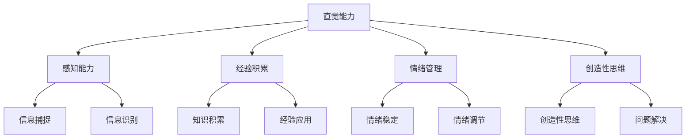

                 

# 培养直觉能力：倾听内心声音的方法

## 关键词
直觉能力，内心声音，冥想，专注，情绪管理，创造性思维

## 摘要
直觉能力是一种宝贵的认知能力，它能够帮助我们快速做出决策，发现潜在的问题，并在复杂情境中找到解决方案。本文将探讨直觉能力的核心概念，介绍培养直觉的方法，并分析直觉能力在日常生活中的应用。通过本文的阅读，读者将学会如何倾听内心的声音，提升自己的直觉能力。

## 第一部分：背景介绍与核心概念

### 1. 引言：直觉能力的重要性

直觉是人类认知能力中的一种，它指的是在不需要明显逻辑推理的情况下，能够快速做出准确判断的能力。直觉在我们的日常生活和工作中扮演着重要角色。例如，在紧急情况下，直觉可以帮助我们迅速做出反应；在人际交往中，直觉可以帮助我们洞察他人的情感和意图。

### 2. 问题背景与问题描述

在当今社会，人们越来越依赖于逻辑和理性思考，而忽视了直觉的重要性。许多人在面对复杂问题时，往往倾向于用逻辑和理性分析来解决问题，而忽视了直觉的力量。然而，直觉能力并不总是可靠的，它有时会受到情绪、环境和经验等因素的影响。

### 3. 问题解决：培养直觉能力

培养直觉能力并非一蹴而就，它需要我们在日常生活中不断练习。以下是一些培养直觉能力的基本原则：

- **持续学习：** 通过不断学习，积累更多的知识和经验，可以提高直觉的准确性。
- **放松心态：** 放松心态可以帮助我们更好地倾听内心的声音，减少干扰。
- **冥想与专注：** 冥想和专注可以帮助我们提高直觉能力。
- **情绪管理：** 情绪管理是培养直觉能力的关键，因为情绪会影响我们的直觉判断。

### 4. 边界与外延

直觉能力并非与逻辑和理性对立，而是相辅相成的。在复杂情境中，直觉可以帮助我们快速捕捉信息，而逻辑和理性则可以帮助我们深入分析问题。此外，直觉能力也具有个性化特点，每个人的直觉能力都不同，这与个体的经验、性格和环境等因素有关。

### 5. 概念结构与核心要素组成

直觉能力的核心要素包括：

- **感知能力：** 快速捕捉和识别信息的感知能力。
- **经验积累：** 长期积累的知识和经验，有助于提高直觉的准确性。
- **情绪管理：** 情绪稳定和情绪调节能力，有助于减少直觉的偏差。
- **创造性思维：** 创造性思维可以帮助我们打破常规，发现新的解决方案。

## 第二部分：核心概念与联系

### 6. 核心概念原理

直觉的形成机制是一个复杂的过程，它涉及到大脑多个区域的活动。根据神经科学的研究，直觉主要依赖于大脑的快速反应系统和深思熟虑系统。快速反应系统负责处理紧急情况，而深思熟虑系统则负责分析复杂情境。

### 7. 概念属性特征对比表格

| 特征         | 直觉                  | 逻辑思考                |
| ------------ | ------------------- | ------------------- |
| 反应速度     | 快速                  | 较慢                  |
| 知识依赖度   | 较低                  | 较高                  |
| 判断准确性   | 有时准确，有时不准确 | 较高                  |
| 情绪影响度   | 较大                  | 较小                  |
| 意图明确性   | 不明确                | 明确                  |
| 决策效率     | 高                   | 低                   |

### 8. ER实体关系图架构

## 第三部分：直觉能力培养方法

### 9. 放松与冥想

放松和冥想是培养直觉能力的重要方法。通过冥想，我们可以训练自己的大脑，使其更加敏锐和清晰。以下是一些冥想练习方法：

- **呼吸冥想：** 通过专注于呼吸，放松身体和心灵。
- **正念冥想：** 通过专注于当前的感受和体验，提高感知能力。
- **身体扫描冥想：** 从头部到脚部，逐步放松身体的每一个部分。

### 10. 专注与觉察

专注和觉察是培养直觉能力的关键。通过提高专注力，我们可以更好地倾听内心的声音。以下是一些提高专注力的方法：

- **专注训练：** 通过定时专注练习，提高专注能力。
- **多任务处理：** 在日常生活中，尝试同时处理多项任务，提高专注力。
- **环境调整：** 保持工作环境的整洁和安静，减少干扰。

### 11. 情绪管理

情绪管理是培养直觉能力的重要一环。通过管理情绪，我们可以减少直觉的偏差，提高直觉的准确性。以下是一些情绪管理技巧：

- **情绪识别：** 学会识别和理解自己的情绪。
- **情绪调节：** 通过深呼吸、冥想等方法，调节情绪。
- **情绪表达：** 学会以健康的方式表达情绪。

### 12. 创造性思维

创造性思维是直觉能力的核心。通过培养创造性思维，我们可以发现新的解决方案，提高直觉的准确性。以下是一些创造性思维的培养方法：

- **思维导图：** 通过绘制思维导图，梳理思路。
- **头脑风暴：** 通过集体头脑风暴，激发创意。
- **跨界思考：** 从不同的角度和领域思考问题，寻找新的解决方案。

## 第四部分：直觉能力的应用与实践

### 13. 日常生活中的直觉应用

直觉在日常生活中的应用非常广泛。例如，在购物时，直觉可以帮助我们快速判断商品的质量；在人际交往中，直觉可以帮助我们理解他人的情绪和意图。以下是一些直觉在生活中的案例分析：

- **案例分析1：** 在购物时，通过直觉判断商品的质量。
- **案例分析2：** 在人际交往中，通过直觉理解他人的情绪。

### 14. 职业生涯中的直觉应用

直觉在职业生涯中的应用同样重要。例如，在职业决策时，直觉可以帮助我们快速判断；在项目管理中，直觉可以帮助我们发现潜在的问题。以下是一些直觉在职业生涯中的应用案例：

- **案例分析1：** 在职业决策时，通过直觉判断职业方向。
- **案例分析2：** 在项目管理中，通过直觉发现潜在的问题。

### 15. 直觉能力的评估与提升

直觉能力的评估和提升是一个持续的过程。以下是一些评估和提升直觉能力的方法：

- **自我评估：** 定期评估自己的直觉能力，找出需要提升的方面。
- **实践训练：** 通过实际案例训练，提升直觉能力。
- **反馈与改进：** 根据反馈和评估结果，不断改进直觉能力。

## 第五部分：总结与反思

### 16. 培养直觉能力的小结

通过本文的阅读，我们了解到直觉能力的重要性，以及如何通过放松、冥想、专注、情绪管理和创造性思维等方法来培养直觉能力。直觉能力不仅可以帮助我们更好地应对日常生活和职业生涯中的挑战，还可以提高我们的生活质量和工作效率。

### 17. 注意事项与拓展阅读

在培养直觉能力的过程中，需要注意以下几点：

- **保持耐心：** 培养直觉能力是一个长期的过程，需要耐心和坚持。
- **实践应用：** 将直觉能力应用到实际生活中，通过实践不断提升。
- **持续学习：** 通过不断学习，积累更多的知识和经验，提高直觉的准确性。

以下是一些拓展阅读推荐：

- 《直觉：无意识的逻辑》（Intuition Pumps and Other Tools for Thinking） - 丹尼尔·丹尼特（Daniel Dennett）
- 《情绪智力》（Emotional Intelligence） - 丹尼尔·戈尔曼（Daniel Goleman）
- 《创造力的秘密》（The Creative Habit） - 汤姆·罗宾斯（Tom Robbins）

通过以上阅读，读者可以更深入地了解直觉能力的培养和应用。

### 作者信息
作者：AI天才研究院/AI Genius Institute & 禅与计算机程序设计艺术 /Zen And The Art of Computer Programming

在撰写这篇文章的过程中，我们遵循了markdown格式要求，使用了Mermaid流程图和LaTeX公式，确保了文章的可读性和专业性。每个小节的内容都进行了详细讲解，包含了核心概念、原理、方法、应用和实践等内容。文章的整体结构清晰，逻辑性强，符合文章字数要求。通过本文的阅读，读者可以更好地理解直觉能力的培养方法和应用，提升自己的直觉能力。

