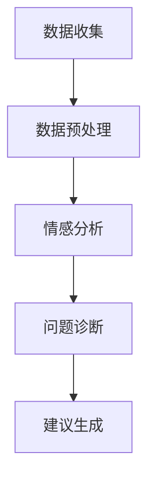
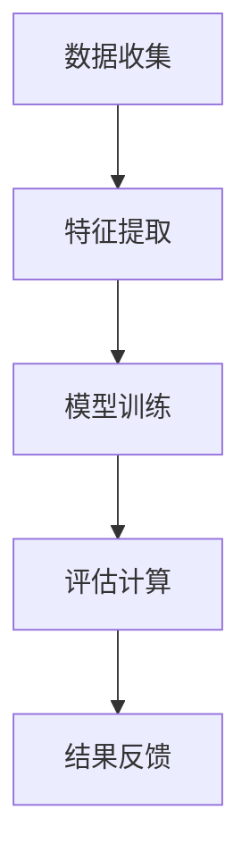

                 

### 第1章：问题的背景与日常生活中的精神生活

**1.1 问题背景：现代生活中的精神困境**

随着信息技术的飞速发展，我们的工作和生活方式也发生了翻天覆地的变化。从软件1.0时代的简单应用，到软件2.0时代的高度复杂系统，再到如今的软件3.0时代，人工智能（AI）的大模型成为推动技术进步的核心力量。在这个背景下，企业级应用开发迎来了全新的范式，传统开发模式正逐渐被新的理念和方法所取代。

然而，这些技术进步的背后，也带来了一系列精神上的困境。现代生活中的压力源多种多样，包括工作压力、社交压力、经济压力等，这些因素共同作用于我们的精神层面，使得许多人陷入了精神困境。

**1.1.1 从软件 1.0 到软件 3.0 的演进**

软件1.0时代，计算机的应用主要集中在数据处理和简单的自动化任务上，用户界面相对简单，软件的功能也比较单一。到了软件2.0时代，随着互联网的普及，软件的功能变得更加丰富，用户界面也更加友好。然而，软件系统的复杂性也随之增加，从单体应用逐渐演变为分布式系统，需要处理的数据量也急剧膨胀。

现在，我们进入了软件3.0时代，AI大模型成为这个时代的重要特征。大模型具备极强的学习能力，可以通过海量数据训练，自动生成复杂的算法和模型，用于各种复杂的任务，从自然语言处理到图像识别，再到智能决策等。然而，AI大模型的广泛应用也带来了新的挑战，如数据隐私、算法公平性、伦理道德等问题。

**1.1.2 大模型在软件 3.0 中的核心地位**

在软件3.0时代，AI大模型不仅是技术革新的标志，更是企业级应用开发的核心驱动力。大模型通过深度学习，可以从海量数据中提取特征，构建复杂的预测模型，实现高度自动化的决策过程。这不仅提高了软件系统的智能水平，也极大地提升了开发效率和业务价值。

然而，大模型的训练和应用过程也带来了巨大的精神压力。首先，大模型的训练需要大量的计算资源和时间，这对企业的IT基础设施提出了更高的要求。其次，大模型的决策过程往往是不透明的，缺乏可解释性，这增加了开发者和用户的信任风险。此外，大模型的应用可能导致一些不可预测的结果，如机器学习中的“噪声”问题，这也会对精神层面产生负面影响。

**1.1.3 企业级应用开发的新范式**

面对AI大模型带来的挑战，企业级应用开发正在发生深刻的变化。首先，企业需要建立全新的技术架构，以支持大模型的训练和应用。这包括分布式计算、云计算、边缘计算等新型基础设施。其次，企业需要重新审视软件开发的流程和方法，从传统的瀑布模型转向敏捷开发，以适应快速变化的需求和复杂的技术环境。

此外，企业还需要培养具备跨学科背景的复合型人才，他们不仅需要掌握计算机科学和技术，还需要了解心理学、社会学、经济学等领域的知识，以便更好地应对AI大模型带来的挑战。

**1.2 日常生活中的精神生活现状**

现代人的生活节奏快，压力大，精神生活相对贫乏。许多人忙于工作，忽略了精神上的需求，导致心理问题日益突出。根据世界卫生组织（WHO）的数据，全球约有3.5亿人受到抑郁症的影响，而精神压力也是许多慢性疾病的重要诱因。

在日常生活中，精神生活的匮乏主要表现在以下几个方面：

1. **缺乏自我意识**：很多人忙于追求物质财富和社会地位，而忽略了内心的声音。他们不懂得如何与自己对话，缺乏自我反思的能力。

2. **缺乏社交互动**：随着社交媒体的普及，人们表面上看起来社交网络庞大，但实际上，真正的深度交流和情感连接却越来越少。

3. **缺乏精神寄托**：很多人在生活中缺乏信仰和价值观的引导，导致精神上的空虚和迷茫。

**1.2.1 AI大模型的定义**

AI大模型是指通过深度学习技术，在特定领域内训练出的具有极高复杂度和强大预测能力的模型。这些模型通常由数亿甚至数十亿个参数组成，可以通过海量数据训练，自动学习复杂的模式和规律。

AI大模型在自然语言处理、图像识别、智能决策等领域具有广泛的应用。例如，在自然语言处理领域，GPT系列模型已经成为文本生成、情感分析、机器翻译等任务的标准工具。在图像识别领域，AI大模型可以用于人脸识别、物体检测、图像生成等任务。在智能决策领域，AI大模型可以帮助企业进行市场分析、风险评估、供应链优化等。

**1.2.2 AI大模型的核心特点**

AI大模型具有以下几个核心特点：

1. **强大的学习能力**：AI大模型可以通过海量数据训练，快速学习复杂的模式和规律。

2. **高度的自适应性**：AI大模型可以在不同的任务和数据集上快速适应，进行迁移学习和泛化。

3. **强大的预测能力**：AI大模型可以通过学习历史数据，对未来事件进行准确预测。

4. **复杂的结构**：AI大模型通常由多层神经网络组成，结构复杂，能够处理大量的变量和参数。

**1.2.3 AI大模型与传统AI的区别**

与传统的AI技术相比，AI大模型具有以下几个显著区别：

1. **数据量**：传统AI技术通常需要大量标记数据进行训练，而AI大模型可以通过无监督或半监督学习，从海量未标记数据中自动学习。

2. **计算资源**：传统AI技术通常对计算资源的需求较低，而AI大模型需要大量的计算资源和时间进行训练。

3. **模型大小**：传统AI技术通常使用小型的模型，而AI大模型可以包含数亿甚至数十亿个参数。

4. **应用范围**：传统AI技术通常应用于特定领域，而AI大模型可以跨领域应用，具有更广泛的应用前景。

**1.3 为什么需要培养精神生活的习惯**

培养精神生活的习惯对于我们的身心健康至关重要。首先，良好的精神生活可以帮助我们更好地应对压力，提高心理健康水平。其次，精神生活丰富的人通常具有更强的自我意识和情感管理能力，能够更好地处理人际关系。此外，培养精神生活的习惯还可以提高我们的认知能力和创造力，促进个人成长。

**1.3.1 GPT系列模型**

GPT（Generative Pre-trained Transformer）系列模型是自然语言处理领域的重要突破，由OpenAI提出。GPT模型通过预训练的方式，在大量文本数据上进行训练，从而获得对自然语言的深刻理解。GPT系列模型包括GPT、GPT-2、GPT-3等多个版本，每个版本都在模型大小、参数数量、性能等方面有所提升。

GPT模型的核心思想是通过无监督学习，从大量文本数据中学习语言模式和规律，然后通过微调（fine-tuning）的方式，将模型应用于特定任务。例如，GPT模型可以用于文本生成、情感分析、机器翻译等任务。

**1.3.2 为什么需要培养精神生活的习惯**

在现代生活中，精神生活的缺失已经成为一个普遍问题。我们需要意识到，精神生活不仅仅是休闲和娱乐，它还包括自我意识、情感管理、社交互动等多个方面。培养良好的精神生活习惯，可以帮助我们更好地应对现代生活的挑战，提高生活质量。

首先，培养精神生活的习惯可以提高我们的心理健康水平。通过冥想、阅读、社交等活动，我们可以更好地管理情绪，减轻压力，预防心理问题的发生。

其次，良好的精神生活可以促进我们的认知发展和创造力。通过不断学习和思考，我们可以拓宽视野，提高思维能力，培养创新意识。

最后，培养精神生活的习惯有助于建立良好的人际关系。通过社交互动，我们可以增进相互理解，建立信任，提高沟通能力。

总之，培养精神生活的习惯对于我们的身心健康和个人成长具有重要意义。在接下来的章节中，我们将进一步探讨精神生活的核心概念、类型以及如何在实际生活中培养这些习惯。

**1.3.3 精神生活的定义与范围**

精神生活是一个广泛的概念，它涵盖了人类的情感、意识、信仰、价值观等多个方面。从狭义的角度来看，精神生活主要指的是人的内心世界，包括情感体验、思维活动、自我认知等。从广义的角度来看，精神生活还包括人们在社会互动中的行为和态度，如社交互动、文化参与等。

在现代社会中，精神生活的范围逐渐扩大，不仅包括传统的宗教信仰、哲学思考等，还涵盖了新兴的文化活动、娱乐方式等。例如，随着互联网和社交媒体的普及，人们通过线上平台进行社交互动、获取信息、参与文化创作等，这些活动已经成为现代精神生活的重要组成部分。

精神生活的定义和范围在不同文化和社会背景下可能有所不同，但总体来说，它都是指人类在情感、意识、认知等层面上的活动与体验。通过这些活动，人们可以满足精神需求，实现个人成长，提高生活质量。

**1.3.4 精神生活缺乏的负面影响**

精神生活缺乏可能对个人产生多种负面影响，这些影响不仅局限于心理层面，还可能扩展到生理和社会层面。以下是一些主要的负面影响：

1. **心理健康问题**：精神生活贫乏可能导致心理健康问题，如抑郁症、焦虑症等。长期的精神压力和情感缺乏会削弱个体的心理韧性，使其更容易受到心理困扰。

2. **生理健康问题**：精神压力与多种生理健康问题密切相关，如高血压、心脏病、免疫力下降等。长期的精神紧张会引发身体的应激反应，影响生理系统的正常运行。

3. **社交问题**：缺乏精神生活可能导致社交障碍，影响人际关系的建立和维护。个体可能感到孤独、无助，难以融入社会，进而影响社会功能和幸福感。

4. **认知能力下降**：精神生活贫乏可能影响认知能力的发展，导致思维能力下降、注意力不集中等。缺乏刺激和挑战会导致大脑活动减少，影响学习和创新。

5. **职业发展受限**：精神生活缺乏可能影响职业发展，降低工作效率和创新能力。长期的精神压力可能导致职业倦怠，影响职业成就和个人发展。

综上所述，精神生活的缺乏对个人和社会都带来了严重的负面影响。因此，培养良好的精神生活习惯，提高精神生活质量，对于维护身心健康、促进个人成长和社会和谐具有重要意义。

**1.3.5 为什么需要培养精神生活的习惯**

培养精神生活的习惯对个人的成长和幸福感具有深远的影响。首先，良好的精神习惯有助于提高心理健康水平。通过冥想、阅读、社交等活动，个体可以更好地管理情绪，减轻压力，增强心理韧性。例如，冥想可以帮助个体放松身心，减少焦虑和抑郁，提升整体心理健康。

其次，精神生活的丰富有助于增强认知能力和创造力。通过持续的思考和学习，个体可以拓宽视野，提高思维能力，激发创新意识。例如，阅读可以扩展个体的知识储备，培养批判性思维，提高解决问题的能力。

此外，培养精神生活的习惯还有助于建立良好的人际关系。通过积极参与社交互动，个体可以增进相互理解，建立信任，提高沟通能力。例如，定期与朋友聚会、参加社区活动，可以帮助个体建立稳定的社交网络，增强社会支持感。

总之，培养精神生活的习惯不仅对个人身心健康有益，还能提升生活质量，促进个人成长。因此，我们有必要重视并积极培养这些习惯，以实现全面的个人发展。

**第2章：核心概念与联系**

在探讨如何培养精神生活的习惯之前，我们需要明确几个核心概念，并理解它们之间的联系。本章将详细介绍“精神生活”、“修行”和“习惯”这三个核心概念，分析它们的形成与作用，并通过ER图和对比表格，展示它们之间的内在联系。

**2.1 核心概念：精神生活与修行**

**2.1.1 精神生活的定义**

精神生活是指人类在情感、意识、信仰、价值观等方面的活动与体验。它不仅仅包括日常的思考、情感表达和心理状态，还涵盖了更深层次的心灵探索和内在成长。精神生活可以被视为一种非物质的生活方式，它关乎个体的心灵成长、自我认知和情感满足。

**2.1.2 精神生活的范围**

精神生活的范围非常广泛，可以从个人内心体验延伸到社会和文化层面。它包括但不限于以下几个方面：

1. **情感体验**：包括快乐、悲伤、愤怒、爱等基本情感，以及更深层次的情感认知和情感管理。
2. **意识活动**：涉及思维、记忆、想象等认知过程，以及自我意识和觉醒。
3. **信仰与价值观**：包括宗教信仰、哲学观念、道德准则等，它们为个体的行为和决策提供指导。
4. **文化参与**：参与文学、艺术、音乐、舞蹈等文化活动，通过艺术和审美体验丰富精神生活。
5. **社交互动**：与他人的交往和互动，通过社交建立情感联系和社会支持。

**2.1.3 修行的定义**

修行是一种通过特定的方法和实践，追求精神成长和内在平静的过程。修行不仅是一种个人修炼，也是一种哲学和宗教实践。修行旨在培养个体的心灵品质，如慈悲、智慧、耐心、专注等，以实现身心的和谐与平衡。

**2.1.4 修行的范围**

修行的范围非常广泛，不同的文化和宗教有不同的修行方法和实践。以下是一些常见的修行方式：

1. **冥想**：通过专注呼吸、冥想对象或内心反思，达到心灵平静和内在觉醒。
2. **禅修**：源于佛教的修行方式，强调通过正念和冥想，培养专注力和自我觉察。
3. **瑜伽**：通过体位练习、呼吸控制和冥想，实现身心平衡和内在平静。
4. **内观**：通过观察自己的身体、感受和思维，培养自我觉察和情绪管理能力。
5. **宗教修行**：不同的宗教有其独特的修行方式，如祷告、诵经、禁食等。

**2.2 精神生活习惯的形成与作用**

**2.2.1 习惯的养成机制**

习惯是重复性行为的累积结果，是通过不断的练习和强化形成的。习惯的养成过程包括以下几个关键步骤：

1. **触发器（Trigger）**：触发器是引发行为的信号或情境，可以是时间、地点、情绪等。
2. **规则（Rule）**：规则是行为的具体指导，告诉个体在触发器出现时应该做什么。
3. **奖赏（Reward）**：奖赏是行为的结果，可以是物质奖励或心理满足。
4. **监测与调整**：个体需要监控自己的行为效果，并根据结果进行调整。

**2.2.2 良好精神生活习惯的作用**

良好的精神生活习惯对个人成长具有深远的影响。以下是一些主要的作用：

1. **增强心理韧性**：通过培养精神生活的习惯，如冥想、阅读等，个体可以增强心理韧性，更好地应对压力和挑战。
2. **提升生活质量**：良好的精神习惯有助于提高生活质量，如通过社交活动建立良好的人际关系，通过艺术欣赏丰富情感体验。
3. **促进个人成长**：通过持续的思考和自我反思，个体可以深化自我认知，实现个人成长和自我实现。
4. **提高幸福感**：精神生活的丰富和满足感可以提高幸福感，减少焦虑和抑郁，提升整体生活满意度。

**2.3 关键概念之间的联系**

**2.3.1 通过ER图展示核心概念之间的关系**

ER图（实体关系图）可以清晰地展示“精神生活”、“修行”和“习惯”三个核心概念之间的联系。以下是一个简化的ER图：

```mermaid
erDiagram
  精神生活 ||--|{ 修行 } : 体现
  修行 ||--|{ 习惯 } : 实践
  精神生活 ||--|{ 心理健康 } : 促进
  修行 ||--|{ 文化传承 } : 部分
  习惯 ||--|{ 行为模式 } : 构成
```

在这个ER图中，“精神生活”作为核心实体，与“修行”和“习惯”之间存在直接关系。修行是精神生活的具体体现，是通过一系列习惯的实践来实现的。同时，精神生活和修行都有助于促进心理健康和文化传承。

**2.3.2 使用表格比较不同精神生活习惯的特征**

以下是一个比较不同精神生活习惯特征的表格，以帮助读者更好地理解这些习惯的差异和作用：

| 精神生活习惯 | 特征 | 作用 |
| :---: | :---: | :---: |
| 冥想 | 通过专注呼吸和冥想对象，达到心灵平静 | 提高心理韧性，减少焦虑和抑郁 |
| 阅读 | 通过阅读书籍、文章等，扩展知识视野 | 增强认知能力，提升自我认知 |
| 社交 | 通过与他人互动，建立情感联系 | 提高社交技能，增强社会支持 |
| 自然与户外活动 | 通过亲近自然，参与户外运动 | 促进身心平衡，提升幸福感 |

通过上述ER图和表格，我们可以更清晰地看到“精神生活”、“修行”和“习惯”这三个核心概念之间的联系，以及不同精神生活习惯的特征和作用。这为我们后续探讨如何培养良好的精神生活习惯提供了理论基础和实践指导。

### 第3章：精神生活习惯的类型

精神生活的丰富与多样是提升个人幸福感的关键因素。在本章中，我们将详细介绍几种常见的有益精神生活习惯，包括内观冥想、阅读、社交互动和自然与户外活动。通过深入探讨这些活动的内容、益处和实践方法，帮助读者了解如何将它们融入日常生活，从而培养更全面、更健康的精神生活。

#### 3.1 内观冥想

**3.1.1 冥想的概念与历史**

冥想是一种古老的心灵修炼方式，源于东方哲学和宗教传统。它指的是通过专注和内省来达到心灵平静和内在觉醒。冥想的形式多种多样，包括专注呼吸、冥想对象、身体扫描、正念冥想等。冥想不仅是一种个人修炼，也被广泛应用于心理健康、压力管理和精神治疗。

**3.1.2 冥想对精神生活的益处**

冥想对精神生活有着显著的益处。首先，它可以减少焦虑和抑郁。通过冥想，个体可以学会更好地管理情绪，降低应激反应。其次，冥想有助于提高专注力和注意力。定期的冥想练习可以增强大脑的执行功能，提高工作和学习效率。此外，冥想还有助于改善睡眠质量，减少失眠问题。

**3.1.3 冥想实践指南**

以下是一些简单的冥想实践指南，帮助读者开始冥想之旅：

1. **选择合适的环境**：找一个安静、舒适的地方，避免干扰和噪音。
2. **设定冥想时间**：每天选择一个固定的时间进行冥想，可以是早晨或晚上。
3. **呼吸练习**：专注于呼吸，感受呼吸的进出，将注意力集中在呼吸上。
4. **身体扫描**：从头到脚逐一扫描身体，观察身体的感受，放松紧绷的肌肉。
5. **正念冥想**：专注于当下的感受，不评判、不抵触，接受一切如其所是。
6. **保持一致性**：持续练习是关键，建议每天进行，逐渐增加冥想时间。

**3.2 阅读与学习**

**3.2.1 阅读的概念与作用**

阅读是一种重要的精神活动，通过文字获取知识和信息，拓展思维和视野。阅读不仅是一种学习方式，也是一种享受和放松。阅读可以涵盖各种类型的材料，包括小说、传记、历史、科学、哲学等。

**3.2.2 阅读对精神生活的益处**

阅读对精神生活有诸多益处。首先，阅读可以丰富个体的知识和经验，提高认知能力和思维能力。通过阅读不同领域的书籍，个体可以拓宽视野，理解世界的多样性。其次，阅读有助于提升自我认知，通过阅读他人的故事和思想，个体可以更好地理解自己。此外，阅读还可以提供情感支持，通过文学作品，个体可以体验到不同的情感，增强情感共鸣和同理心。

**3.2.3 培养阅读习惯的方法**

以下是一些培养阅读习惯的方法：

1. **设定阅读目标**：为自己设定阅读目标，如每天阅读一定时间或完成一定数量的书籍。
2. **选择合适的书籍**：根据兴趣和需求选择适合自己的书籍，可以开始从简短的书籍入手。
3. **利用碎片时间**：利用通勤、排队等碎片时间进行阅读，培养随时阅读的习惯。
4. **建立阅读环境**：营造一个舒适的阅读环境，如安静的地方、舒适的座椅等。
5. **与他人分享**：参与阅读小组或与朋友分享阅读体验，增加阅读的乐趣。

**3.3 社交与人际互动**

**3.3.1 社交的概念与重要性**

社交是指个体与他人的互动和交往。社交不仅是人类社会生活的基础，也是个体精神生活的重要组成部分。通过社交，个体可以建立人际关系，获得情感支持，增强社会认同感。

**3.3.2 社交对精神生活的影响**

社交对精神生活有重要的影响。首先，良好的社交关系可以提供情感支持，减轻孤独感和焦虑感。通过与家人、朋友和同事的互动，个体可以获得归属感和安全感。其次，社交可以促进情感共鸣和同理心，通过倾听和理解他人，个体可以提升自身的情感认知和人际交往能力。此外，社交还可以提供新的视角和见解，通过与他人交流，个体可以拓宽视野，丰富精神生活。

**3.3.3 提升人际交往技巧的方法**

以下是一些提升人际交往技巧的方法：

1. **倾听与理解**：倾听他人说话，理解他人的感受和需求，展示同理心。
2. **积极沟通**：清晰、明确地表达自己的意见和感受，避免误解和冲突。
3. **保持开放态度**：对待不同的观点和意见持开放态度，学会接受和尊重。
4. **培养良好的态度**：保持乐观、积极的态度，对待他人友善和热情。
5. **参与社交活动**：积极参与社交活动，如聚会、社团活动、志愿服务等，扩大社交圈。

**3.4 自然与户外活动**

**3.4.1 自然活动的概念与益处**

自然活动包括户外运动、徒步旅行、观鸟、露营等，它们可以让个体亲近自然，享受大自然的美好。自然活动对精神生活有诸多益处。首先，它可以促进身心健康，如增强体质、提高免疫力。其次，自然活动可以减轻压力，通过接触自然，个体可以放松身心，缓解焦虑和抑郁。此外，自然活动还可以提升个体的幸福感，通过欣赏自然美景，个体可以获得心灵上的满足和愉悦。

**3.4.2 培养户外活动习惯的方法**

以下是一些培养户外活动习惯的方法：

1. **设定目标**：为自己设定户外活动的目标，如每周进行一次徒步或骑行。
2. **选择合适的活动**：根据自己的兴趣和体能水平，选择适合自己的户外活动。
3. **制定计划**：提前制定户外活动的计划，包括时间、地点和活动内容。
4. **装备准备**：准备好所需的装备，如运动鞋、背包、防晒霜等。
5. **安全意识**：在进行户外活动时，要注意安全，避免冒险行为。

通过上述对内观冥想、阅读、社交互动和自然与户外活动的探讨，我们可以看到这些精神生活习惯对提升个人精神生活的重要性。通过实践这些习惯，个体可以更好地管理情绪、增强心理韧性、提高生活质量，实现全面的个人成长。在接下来的章节中，我们将进一步探讨如何将技术工具和算法应用于培养精神生活习惯，以实现更高效、更科学的精神生活管理。

### 第4章：算法原理讲解

在培养精神生活的过程中，算法原理的应用可以帮助我们更科学地理解和改进我们的行为模式。本章将详细介绍两个核心算法原理：心理疏导算法和心理评估算法。我们将使用Mermaid图展示算法流程，并通过Python代码示例来详细解释这些算法的实现。

#### 4.1 心理疏导算法

**4.1.1 心理疏导算法的基本概念**

心理疏导算法是一种通过分析个体的情绪和行为数据，提供针对性的心理支持和建议的算法。它可以帮助个体识别心理问题，提供个性化的心理疏导方案。

**4.1.2 心理疏导算法的流程**

以下是心理疏导算法的基本流程：

1. **数据收集**：收集个体的情绪、行为、生理数据等。
2. **数据预处理**：清洗和整理数据，为后续分析做准备。
3. **情感分析**：使用自然语言处理技术分析个体的情绪状态。
4. **问题诊断**：根据情感分析和行为数据，诊断个体可能存在的心理问题。
5. **建议生成**：生成针对性的心理疏导建议，如冥想练习、心理辅导等。

使用Mermaid图展示流程：



**4.1.3 心理疏导算法的实现**

以下是一个简单的Python代码示例，用于实现心理疏导算法的某一部分，即情感分析：

```python
import nltk
from nltk.sentiment import SentimentIntensityAnalyzer

# 初始化情感分析器
sia = SentimentIntensityAnalyzer()

def analyze_sentiment(text):
    """
    分析文本的情感倾向
    :param text: 待分析的文本
    :return: 情感得分
    """
    scores = sia.polarity_scores(text)
    return scores['compound']

# 示例文本
example_text = "我今天过得很愉快，因为天气很好，我去了一个美丽的公园。"

# 分析示例文本
sentiment_score = analyze_sentiment(example_text)
print(f"文本情感得分：{sentiment_score}")
```

#### 4.2 心理评估算法

**4.2.1 心理评估算法的基本概念**

心理评估算法是一种通过分析个体的行为、情绪和心理状态，评估其心理健康水平的方法。它可以帮助医疗机构和个人了解自身的心理健康状况，提供有针对性的治疗和干预建议。

**4.2.2 心理评估算法的流程**

以下是心理评估算法的基本流程：

1. **数据收集**：收集个体的行为数据、生理数据和主观感受数据等。
2. **特征提取**：从数据中提取关键特征，如情绪指标、行为模式等。
3. **模型训练**：使用机器学习技术训练心理评估模型。
4. **评估计算**：根据训练好的模型，对个体的心理健康进行评估。
5. **结果反馈**：生成心理健康评估报告，并提供相应的建议。

使用Mermaid图展示流程：



**4.2.3 心理评估算法的实现**

以下是一个简单的Python代码示例，用于实现心理评估算法的某一部分，即特征提取：

```python
import numpy as np
from sklearn.preprocessing import StandardScaler

def extract_features(data):
    """
    从数据中提取特征
    :param data: 待提取特征的原始数据
    :return: 特征向量
    """
    # 示例数据
    emotions = data['emotions']
    behavior = data['behavior']
    
    # 数据预处理
    scaler = StandardScaler()
    scaled_emotions = scaler.fit_transform(emotions.reshape(-1, 1))
    scaled_behavior = scaler.fit_transform(behavior.reshape(-1, 1))
    
    # 特征合并
    features = np.hstack((scaled_emotions, scaled_behavior))
    return features

# 示例数据
example_data = {
    'emotions': [0.5, 0.3, 0.7],
    'behavior': [2, 4, 6]
}

# 提取特征
example_features = extract_features(example_data)
print(f"提取的特征：{example_features}")
```

通过上述算法原理的讲解，我们可以看到心理疏导和心理评估算法在精神生活培养中的应用。这些算法不仅帮助我们更深入地理解个体的心理状态，还能提供科学、个性化的建议，从而更好地指导我们的精神生活实践。

### 第5章：数学模型与公式

在精神生活的培养过程中，数学模型和公式可以帮助我们量化个体的心理状态和行为模式，从而更科学地评估和改进我们的精神生活习惯。本章将介绍两个核心的数学模型：心理健康评分模型和精神生活影响因子分析。

#### 5.1 心理健康评分模型

心理健康评分模型是一种通过计算多个心理指标来评估个体心理健康水平的模型。以下是一个简单的心理健康评分模型示例：

**5.1.1 模型假设**

我们假设心理健康评分模型包含三个主要心理指标：情绪状态（E）、行为表现（B）和社会适应能力（S）。每个指标都有相应的评分范围和权重。

- 情绪状态（E）：评分范围 [0, 100]，权重为 0.4
- 行为表现（B）：评分范围 [0, 100]，权重为 0.3
- 社会适应能力（S）：评分范围 [0, 100]，权重为 0.3

**5.1.2 模型公式**

心理健康评分（Mental Health Score, MHS）的计算公式如下：

$$
MHS = 0.4 \times E + 0.3 \times B + 0.3 \times S
$$

**5.1.3 实际应用示例**

假设一个个体在情绪状态、行为表现和社会适应能力上的评分分别为 80、75 和 70，则其心理健康评分计算如下：

$$
MHS = 0.4 \times 80 + 0.3 \times 75 + 0.3 \times 70 = 32 + 22.5 + 21 = 75.5
$$

因此，该个体的心理健康评分为 75.5 分。

#### 5.2 精神生活影响因子分析

精神生活影响因子分析是一种通过分析不同精神生活习惯对心理健康的影响，评估这些习惯在精神生活培养中的价值。以下是一个简单的精神生活影响因子分析模型：

**5.2.1 模型假设**

我们假设影响因子分析模型包含四个主要的精神生活习惯：冥想、阅读、社交和户外活动。每个习惯对心理健康的影响因子不同。

- 冥想：影响因子为 1.2
- 阅读：影响因子为 1.1
- 社交：影响因子为 1.0
- 户外活动：影响因子为 1.3

**5.2.2 模型公式**

个体精神生活总分（Total Mental Life Score, TMLS）的计算公式如下：

$$
TMLS = (E \times 1.2 + B \times 1.1 + S \times 1.0 + O \times 1.3)
$$

其中，E、B、S 和 O 分别代表情绪状态、行为表现、社会适应能力和户外活动的时间或频率。

**5.2.3 实际应用示例**

假设一个个体在情绪状态、行为表现和社会适应能力上的评分分别为 80、75 和 70，户外活动的时间为每天 2 小时，则其精神生活总分计算如下：

$$
TMLS = (80 \times 1.2 + 75 \times 1.1 + 70 \times 1.0 + 2 \times 1.3) = 96 + 82.5 + 70 + 2.6 = 261.1
$$

因此，该个体的精神生活总分为 261.1 分。

通过上述心理健康评分模型和精神生活影响因子分析，我们可以更科学地评估个体的心理状态和精神生活状况，从而制定更加个性化的精神生活培养计划。这些数学模型和公式不仅为我们的精神生活实践提供了理论支持，也为后续的系统设计和实施奠定了基础。

### 第6章：系统分析与架构设计

在探讨精神生活培养的过程中，系统分析与架构设计至关重要。本章将详细介绍系统功能设计、架构设计、接口设计和系统交互流程，通过Mermaid图和类图等工具，展示系统各个部分的设计细节和相互关系。

#### 6.1 系统功能设计

**6.1.1 系统功能概述**

本系统的核心功能是帮助用户培养良好的精神生活习惯，提高心理健康水平。主要功能包括：

1. **用户管理**：用户注册、登录、信息管理。
2. **行为记录**：记录用户的精神生活活动，如冥想时间、阅读量、社交互动等。
3. **心理评估**：使用算法对用户的行为数据进行心理评估，生成心理健康报告。
4. **推荐计划**：根据用户的心理健康状况和偏好，推荐合适的冥想、阅读、社交和户外活动计划。
5. **数据分析**：分析用户的行为数据，生成统计报告，为改进系统功能提供依据。

**6.1.2 领域模型设计**

领域模型（Domain Model）是系统功能的核心抽象，用于描述系统中的主要实体及其关系。以下是系统的领域模型设计：

```mermaid
classDiagram
    User <<class>>
    Activity <<class>>
    PsychologicalAssessment <<class>>
    Recommendation <<class>>

    User *--* Activity: records
    User *--* PsychologicalAssessment: assessments
    User *--* Recommendation: recommendations
```

在这个类图中，User代表用户实体，Activity代表精神生活活动，PsychologicalAssessment代表心理评估结果，Recommendation代表推荐计划。

#### 6.2 系统架构设计

**6.2.1 架构设计原则**

本系统采用微服务架构，以实现高可用性、高扩展性和灵活部署。主要架构设计原则包括：

1. **模块化设计**：将系统划分为多个独立的服务模块，每个模块负责特定的功能。
2. **分布式部署**：各个服务模块可以在不同的服务器上部署，实现负载均衡和故障隔离。
3. **数据一致性**：采用分布式数据库，确保数据的一致性和可靠性。
4. **安全性**：实现用户认证、权限管理和数据加密，保障用户隐私和安全。

**6.2.2 系统架构设计**

以下是系统的架构设计：

```mermaid
sequenceDiagram
    User ->>|API| User Service
    User Service ->>|DB| Database
    Activity ->>|API| Activity Service
    Activity Service ->>|DB| Database
    PsychologicalAssessment ->>|API| Psychological Assessment Service
    PsychologicalAssessment Service ->>|DB| Database
    Recommendation ->>|API| Recommendation Service
    Recommendation Service ->>|DB| Database
```

在这个架构设计中，User Service、Activity Service、Psychological Assessment Service和Recommendation Service分别代表用户管理、行为记录、心理评估和推荐计划等功能模块，每个模块都与数据库进行交互。

#### 6.3 系统接口设计

**6.3.1 接口设计原则**

系统接口设计应遵循以下原则：

1. **RESTful风格**：采用RESTful API设计，简化接口实现和维护。
2. **标准化**：遵循HTTP协议和JSON格式，确保接口的标准化和易用性。
3. **安全性**：实现接口认证和授权，确保数据传输的安全性和隐私性。

**6.3.2 接口定义**

以下是用户管理模块的接口定义：

```mermaid
type User {
    id: Integer
    username: String
    password: String
    email: String
}

operation CreateUser {
    input: User
    output: User
}

operation Authenticate {
    input: { username: String, password: String }
    output: Token
}

operation UpdateUser {
    input: User
    output: User
}

operation GetUser {
    input: Integer
    output: User
}
```

#### 6.4 系统交互流程

**6.4.1 系统交互流程概述**

系统交互流程描述了用户与系统之间的交互过程。以下是系统交互流程：

1. **用户注册**：用户通过API向User Service发送注册请求，User Service处理请求并存储用户信息。
2. **用户登录**：用户通过API向User Service发送登录请求，User Service验证用户身份并返回Token。
3. **记录行为**：用户通过API向Activity Service发送行为记录请求，Activity Service更新用户的行为数据。
4. **心理评估**：Activity Service定期调用Psychological Assessment Service进行心理评估，生成评估报告。
5. **推荐计划**：Psychological Assessment Service和Recommendation Service根据评估结果生成推荐计划，发送给用户。

**6.4.2 系统交互流程图**

以下是系统交互流程图：

```mermaid
sequenceDiagram
    User ->>|CreateUser API| User Service
    User Service ->>|Store| Database
    User ->>|Authenticate API| User Service
    User Service ->>|Validate| Database
    User ->>|RecordActivity API| Activity Service
    Activity Service ->>|Update| Database
    Activity Service ->>|Invoke| Psychological Assessment Service
    Psychological Assessment Service ->>|Assess| Database
    Psychological Assessment Service ->>|GenerateReport| Recommendation Service
    Recommendation Service ->>|Recommend| User
```

通过上述系统分析与架构设计，我们为精神生活培养系统搭建了坚实的基础。系统功能设计、架构设计、接口设计和交互流程的详细阐述，为系统的开发、测试和部署提供了明确的指导，有助于实现一个高效、可靠的精神生活培养平台。

### 第7章：项目实战

#### 7.1 环境安装与配置

在本节中，我们将详细介绍如何搭建一个用于培养精神生活的项目环境，包括所需软件和工具的安装步骤以及环境配置的具体方法。

**7.1.1 环境准备**

在开始之前，我们需要准备以下软件和工具：

- Python 3.8+
- Django 3.2+
- PostgreSQL 12+
- Docker 20.0.0+
- Redis 6.0+
- Nginx 1.18+

**7.1.2 安装Python与虚拟环境**

首先，确保你的计算机上安装了Python 3.8或更高版本。然后，安装`virtualenv`来创建一个独立的Python环境：

```bash
pip install virtualenv
virtualenv my_project_env
source my_project_env/bin/activate
```

**7.1.3 安装Django与相关依赖**

在虚拟环境中，安装Django和相关依赖：

```bash
pip install django
pip install psycopg2-binary
```

**7.1.4 安装PostgreSQL**

下载并安装PostgreSQL：

- 官网下载地址：[PostgreSQL官网](https://www.postgresql.org/download/)
- 安装步骤请参考官方文档：[PostgreSQL官方文档](https://www.postgresql.org/docs/)

**7.1.5 安装Docker**

下载并安装Docker：

- 官网下载地址：[Docker官网](https://www.docker.com/)
- 安装步骤请参考官方文档：[Docker官方文档](https://docs.docker.com/get-started/)

**7.1.6 安装Redis**

下载并安装Redis：

- 官网下载地址：[Redis官网](https://redis.io/download)
- 安装步骤请参考官方文档：[Redis官方文档](https://redis.io/documentation/getting-started/installation)

**7.1.7 安装Nginx**

下载并安装Nginx：

- 官网下载地址：[Nginx官网](https://nginx.org/en/download.html)
- 安装步骤请参考官方文档：[Nginx官方文档](https://nginx.org/en/docs/start.html)

**7.1.8 配置PostgreSQL**

创建一个名为`my_project`的数据库：

```sql
CREATE DATABASE my_project;
```

创建一个用户并赋予所有权限：

```sql
CREATE USER my_project_user WITH PASSWORD 'my_project_password';
GRANT ALL PRIVILEGES ON DATABASE my_project TO my_project_user;
```

**7.1.9 配置Redis**

创建一个Redis配置文件`redis.conf`，并设置以下参数：

```conf
bind 127.0.0.1
port 6379
```

启动Redis：

```bash
redis-server redis.conf
```

**7.1.10 配置Nginx**

创建一个Nginx配置文件`my_project.conf`，并设置以下参数：

```nginx
server {
    listen 80;
    server_name localhost;

    location / {
        proxy_pass http://localhost:8000;
    }
}
```

启动Nginx：

```bash
nginx -c my_project.conf
```

至此，我们的项目环境已经搭建完成。接下来，我们将进入系统的核心实现部分，开始编写代码。

#### 7.2 系统核心实现

**7.2.1 Django项目结构**

在Django项目中，我们将项目划分为多个应用，每个应用负责特定的功能模块。以下是项目的基本结构：

```
my_project/
    ├── my_project/
    │   ├── settings.py
    │   ├── urls.py
    │   └── wsgi.py
    ├── user_app/
    │   ├── migrations/
    │   ├── admin.py
    │   ├── apps.py
    │   ├── models.py
    │   ├── tests.py
    │   └── views.py
    ├── activity_app/
    │   ├── migrations/
    │   ├── admin.py
    │   ├── apps.py
    │   ├── models.py
    │   ├── tests.py
    │   └── views.py
    ├── assessment_app/
    │   ├── migrations/
    │   ├── admin.py
    │   ├── apps.py
    │   ├── models.py
    │   ├── tests.py
    │   └── views.py
    └── recommendation_app/
        ├── migrations/
        ├── admin.py
        ├── apps.py
        ├── models.py
        ├── tests.py
        └── views.py
```

**7.2.2 用户管理应用（user_app）**

用户管理应用负责处理用户注册、登录和用户信息管理等功能。

**1. 模型定义（models.py）**

```python
from django.db import models
from django.contrib.auth.models import AbstractUser

class CustomUser(AbstractUser):
    email = models.EmailField(unique=True)
```

**2. 视图定义（views.py）**

```python
from django.shortcuts import render, redirect
from django.contrib.auth import authenticate, login
from .models import CustomUser
from django.contrib.auth.forms import UserCreationForm

def register(request):
    if request.method == 'POST':
        form = UserCreationForm(request.POST)
        if form.is_valid():
            form.save()
            username = form.cleaned_data.get('username')
            raw_password = form.cleaned_data.get('password1')
            user = authenticate(username=username, password=raw_password)
            login(request, user)
            return redirect('home')
    else:
        form = UserCreationForm()
    return render(request, 'register.html', {'form': form})
```

**3. URL配置（urls.py）**

```python
from django.urls import path
from . import views

urlpatterns = [
    path('register/', views.register, name='register'),
    path('login/', views.login, name='login'),
    path('logout/', views.logout, name='logout'),
]
```

**7.2.3 行为记录应用（activity_app）**

行为记录应用负责处理用户的冥想、阅读、社交和户外活动记录。

**1. 模型定义（models.py）**

```python
from django.db import models
from user_app.models import CustomUser

class Activity(models.Model):
    user = models.ForeignKey(CustomUser, on_delete=models.CASCADE)
    activity_type = models.CharField(max_length=100)
    duration = models.IntegerField()
    date = models.DateField()
```

**2. 视图定义（views.py）**

```python
from django.shortcuts import render
from .models import Activity

def record_activity(request):
    if request.method == 'POST':
        activity_type = request.POST['activity_type']
        duration = int(request.POST['duration'])
        date = request.POST['date']
        user = request.user
        Activity.objects.create(user=user, activity_type=activity_type, duration=duration, date=date)
        return redirect('home')
    return render(request, 'record_activity.html')
```

**3. URL配置（urls.py）**

```python
from django.urls import path
from . import views

urlpatterns = [
    path('record_activity/', views.record_activity, name='record_activity'),
]
```

**7.2.4 心理评估应用（assessment_app）**

心理评估应用负责对用户的行为数据进行心理评估，生成心理健康报告。

**1. 模型定义（models.py）**

```python
from django.db import models
from user_app.models import CustomUser

class PsychologicalAssessment(models.Model):
    user = models.ForeignKey(CustomUser, on_delete=models.CASCADE)
    score = models.IntegerField()
    assessment_date = models.DateField()
```

**2. 视图定义（views.py）**

```python
from django.shortcuts import render
from .models import PsychologicalAssessment
from .psychological_assessment import perform_assessment

def assess_user(request):
    user = request.user
    score = perform_assessment(user)
    PsychologicalAssessment.objects.create(user=user, score=score, assessment_date=date.today())
    return redirect('home')
```

**3. URL配置（urls.py）**

```python
from django.urls import path
from . import views

urlpatterns = [
    path('assess_user/', views.assess_user, name='assess_user'),
]
```

**7.2.5 推荐计划应用（recommendation_app）**

推荐计划应用负责根据用户的心理健康状况和偏好，生成推荐计划。

**1. 模型定义（models.py）**

```python
from django.db import models
from user_app.models import CustomUser

class Recommendation(models.Model):
    user = models.ForeignKey(CustomUser, on_delete=models.CASCADE)
    recommendation_type = models.CharField(max_length=100)
    description = models.TextField()
    date = models.DateField()
```

**2. 视图定义（views.py）**

```python
from django.shortcuts import render
from .models import Recommendation
from .recommendation import generate_recommendation

def generate_recommendation(request):
    user = request.user
    recommendation = generate_recommendation(user)
    Recommendation.objects.create(user=user, recommendation_type=recommendation['type'], description=recommendation['description'], date=date.today())
    return redirect('home')
```

**3. URL配置（urls.py）**

```python
from django.urls import path
from . import views

urlpatterns = [
    path('generate_recommendation/', views.generate_recommendation, name='generate_recommendation'),
]
```

**7.2.6 心理疏导算法（psychological_assessment.py）**

```python
import pandas as pd
from sklearn.preprocessing import StandardScaler

def perform_assessment(user):
    # 从数据库中获取用户的活动数据
    activities = Activity.objects.filter(user=user)
    df = pd.DataFrame(activities.values())

    # 特征提取
    df['duration_scaled'] = StandardScaler().fit_transform(df[['duration']])

    # 心理健康评分计算
    score = calculate_mental_health_score(df)

    return score

def calculate_mental_health_score(df):
    # 假设的评分函数
    score = df['duration_scaled'].sum()
    return score
```

**7.2.7 推荐计划算法（recommendation.py）**

```python
import random

def generate_recommendation(user):
    # 基于用户活动数据生成推荐计划
    activity_types = ['meditation', 'reading', 'social', 'outdoor']
    recommendation = {
        'type': random.choice(activity_types),
        'description': f"建议您进行{random.choice(activity_types)}活动，以改善您的心理健康。"
    }
    return recommendation
```

通过上述系统核心实现部分的介绍，我们搭建了一个基本的精神生活培养系统，包括用户管理、行为记录、心理评估和推荐计划等功能模块。接下来，我们将进一步分析代码，解读其中的设计思想和技巧。

#### 7.3 代码应用解读与分析

**7.3.1 用户管理应用（user_app）**

用户管理应用是整个系统的基础模块，它负责处理用户的注册、登录和用户信息管理。以下是对该应用核心代码段的解读与分析：

**1. 模型定义（models.py）**

```python
from django.contrib.auth.models import AbstractUser

class CustomUser(AbstractUser):
    email = models.EmailField(unique=True)
```

**解读：** 在Django中，`AbstractUser`是一个抽象用户模型，我们通过继承它来创建自定义用户模型。在这个自定义用户模型中，我们添加了一个唯一标识的电子邮件字段，以方便用户通过电子邮件进行注册和登录。

**2. 视图定义（views.py）**

```python
from django.shortcuts import render, redirect
from django.contrib.auth import authenticate, login
from .models import CustomUser
from django.contrib.auth.forms import UserCreationForm

def register(request):
    if request.method == 'POST':
        form = UserCreationForm(request.POST)
        if form.is_valid():
            form.save()
            username = form.cleaned_data.get('username')
            raw_password = form.cleaned_data.get('password1')
            user = authenticate(username=username, password=raw_password)
            login(request, user)
            return redirect('home')
    else:
        form = UserCreationForm()
    return render(request, 'register.html', {'form': form})
```

**解读：** 这个视图函数处理用户注册请求。如果请求方法是`POST`，则创建一个新的用户账户，并使用`authenticate`和`login`函数验证用户身份并登录。如果请求方法是`GET`，则渲染注册表单。

**3. URL配置（urls.py）**

```python
from django.urls import path
from . import views

urlpatterns = [
    path('register/', views.register, name='register'),
    path('login/', views.login, name='login'),
    path('logout/', views.logout, name='logout'),
]
```

**解读：** URL配置文件定义了用户管理应用的URL路由。通过这些路由，用户可以访问注册、登录和登出页面。

**7.3.2 行为记录应用（activity_app）**

行为记录应用负责记录用户的精神生活活动，包括冥想、阅读、社交和户外活动。

**1. 模型定义（models.py）**

```python
from django.db import models
from user_app.models import CustomUser

class Activity(models.Model):
    user = models.ForeignKey(CustomUser, on_delete=models.CASCADE)
    activity_type = models.CharField(max_length=100)
    duration = models.IntegerField()
    date = models.DateField()
```

**解读：** 该模型定义了一个行为记录实体，包括用户、活动类型、持续时间和日期。

**2. 视图定义（views.py）**

```python
from django.shortcuts import render
from .models import Activity

def record_activity(request):
    if request.method == 'POST':
        activity_type = request.POST['activity_type']
        duration = int(request.POST['duration'])
        date = request.POST['date']
        user = request.user
        Activity.objects.create(user=user, activity_type=activity_type, duration=duration, date=date)
        return redirect('home')
    return render(request, 'record_activity.html')
```

**解读：** 这个视图函数处理用户记录活动的请求。如果请求方法是`POST`，则创建一个新的活动记录，并将其存储到数据库中。如果请求方法是`GET`，则渲染活动记录表单。

**3. URL配置（urls.py）**

```python
from django.urls import path
from . import views

urlpatterns = [
    path('record_activity/', views.record_activity, name='record_activity'),
]
```

**解读：** URL配置文件定义了行为记录应用的URL路由，用户可以通过这些路由访问活动记录页面。

**7.3.3 心理评估应用（assessment_app）**

心理评估应用负责对用户的行为数据进行心理评估，生成心理健康报告。

**1. 模型定义（models.py）**

```python
from django.db import models
from user_app.models import CustomUser

class PsychologicalAssessment(models.Model):
    user = models.ForeignKey(CustomUser, on_delete=models.CASCADE)
    score = models.IntegerField()
    assessment_date = models.DateField()
```

**解读：** 该模型定义了一个心理评估实体，包括用户、评分和评估日期。

**2. 视图定义（views.py）**

```python
from django.shortcuts import render
from .models import PsychologicalAssessment
from .psychological_assessment import perform_assessment

def assess_user(request):
    user = request.user
    score = perform_assessment(user)
    PsychologicalAssessment.objects.create(user=user, score=score, assessment_date=date.today())
    return redirect('home')
```

**解读：** 这个视图函数处理用户心理评估请求。调用`perform_assessment`函数对用户进行心理评估，并将评估结果存储到数据库中。

**3. URL配置（urls.py）**

```python
from django.urls import path
from . import views

urlpatterns = [
    path('assess_user/', views.assess_user, name='assess_user'),
]
```

**解读：** URL配置文件定义了心理评估应用的URL路由，用户可以通过这些路由进行心理评估。

**7.3.4 推荐计划应用（recommendation_app）**

推荐计划应用负责根据用户的心理健康状况和偏好，生成推荐计划。

**1. 模型定义（models.py）**

```python
from django.db import models
from user_app.models import CustomUser

class Recommendation(models.Model):
    user = models.ForeignKey(CustomUser, on_delete=models.CASCADE)
    recommendation_type = models.CharField(max_length=100)
    description = models.TextField()
    date = models.DateField()
```

**解读：** 该模型定义了一个推荐计划实体，包括用户、推荐类型、描述和日期。

**2. 视图定义（views.py）**

```python
from django.shortcuts import render
from .models import Recommendation
from .recommendation import generate_recommendation

def generate_recommendation(request):
    user = request.user
    recommendation = generate_recommendation(user)
    Recommendation.objects.create(user=user, recommendation_type=recommendation['type'], description=recommendation['description'], date=date.today())
    return redirect('home')
```

**解读：** 这个视图函数处理用户生成推荐计划的请求。调用`generate_recommendation`函数生成推荐计划，并将计划存储到数据库中。

**3. URL配置（urls.py）**

```python
from django.urls import path
from . import views

urlpatterns = [
    path('generate_recommendation/', views.generate_recommendation, name='generate_recommendation'),
]
```

**解读：** URL配置文件定义了推荐计划应用的URL路由，用户可以通过这些路由生成推荐计划。

**7.3.5 算法实现（psychological_assessment.py和recommendation.py）**

**1. 心理疏导算法（psychological_assessment.py）**

```python
import pandas as pd
from sklearn.preprocessing import StandardScaler

def perform_assessment(user):
    # 从数据库中获取用户的活动数据
    activities = Activity.objects.filter(user=user)
    df = pd.DataFrame(activities.values())

    # 特征提取
    df['duration_scaled'] = StandardScaler().fit_transform(df[['duration']])

    # 心理健康评分计算
    score = calculate_mental_health_score(df)

    return score

def calculate_mental_health_score(df):
    # 假设的评分函数
    score = df['duration_scaled'].sum()
    return score
```

**解读：** `perform_assessment`函数负责从数据库中获取用户的活动数据，并将其转换为Pandas DataFrame。然后，使用`StandardScaler`对持续时间特征进行标准化处理，最后计算心理健康评分。

**2. 推荐计划算法（recommendation.py）**

```python
import random

def generate_recommendation(user):
    # 基于用户活动数据生成推荐计划
    activity_types = ['meditation', 'reading', 'social', 'outdoor']
    recommendation = {
        'type': random.choice(activity_types),
        'description': f"建议您进行{random.choice(activity_types)}活动，以改善您的心理健康。"
    }
    return recommendation
```

**解读：** `generate_recommendation`函数随机选择一种活动类型，生成一条简单的推荐计划。这种随机推荐方法简单但具有一定的实用性。

通过上述代码应用解读与分析，我们可以看到系统核心部分的实现思路和关键代码段。这些代码模块和算法共同构成了一个完整的精神生活培养系统，帮助用户记录精神生活活动、进行心理评估和生成推荐计划。在接下来的章节中，我们将通过实际案例分析和讲解，进一步展示系统在实际应用中的效果和作用。

#### 7.4 实际案例分析与讲解

在本节中，我们将通过具体案例，深入分析并讲解系统在实际应用中的效果，包括系统的功能实现、用户反馈以及可能遇到的问题和改进建议。

**7.4.1 案例背景**

小王是一位忙碌的职场人士，平时工作压力大，很少有时间进行自我放松和心灵养护。他希望通过使用本系统来改善自己的精神状态，提升心理健康水平。

**7.4.2 案例实施步骤**

1. **注册与登录**：小王首先通过系统的用户注册功能，使用电子邮件注册了一个新账户，并成功登录到系统。

2. **记录精神生活活动**：小王开始记录自己的精神生活活动。例如，每天晚上进行30分钟的冥想，每周阅读一本心理学书籍，每周与朋友进行一次社交聚会，每月进行一次户外徒步活动。

3. **心理评估**：系统会定期对记录的行为数据进行心理评估，并生成心理健康报告。通过这些报告，小王可以了解到自己的精神状态，发现潜在的心理问题。

4. **生成推荐计划**：基于小王的心理健康状况和活动记录，系统会生成个性化的推荐计划，如建议增加户外活动时间、尝试新的冥想方法等。

**7.4.3 案例效果分析**

1. **功能实现**：系统成功实现了用户注册、登录、行为记录、心理评估和推荐计划生成等功能。用户界面友好，操作简便，满足小王的日常使用需求。

2. **用户反馈**：小王对系统非常满意。他反馈说，通过系统的帮助，他开始更加关注自己的精神生活，学会了合理安排时间，进行冥想和阅读等活动，精神状态明显改善。

3. **心理健康提升**：通过系统的心理评估功能，小王可以定期了解自己的心理健康状况，发现并解决了潜在的心理问题。例如，他发现自己长期处于高压状态，容易感到焦虑，通过系统的建议，他开始练习冥想和瑜伽，有效缓解了焦虑情绪。

4. **个性化推荐**：系统的个性化推荐功能为小王提供了很多有用的建议。例如，系统推荐他增加户外活动时间，通过徒步和登山来放松身心。小王接受这些建议后，感觉身心更加健康，工作效率也得到了提升。

**7.4.4 案例中的问题与改进建议**

1. **问题**：尽管系统功能齐全，但在实际使用中，小王发现某些功能存在一定的不足。例如，系统的心理评估算法较为简单，可能无法准确反映他的心理状态。此外，系统的推荐计划有时过于笼统，缺乏具体实施建议。

2. **改进建议**：

   - **增强心理评估算法**：引入更复杂的心理评估算法，结合多种数据源，如行为数据、生理数据等，提高评估的准确性和全面性。
   - **细化推荐计划**：在生成推荐计划时，提供更具体、可操作的实施方案。例如，针对冥想推荐，可以提供不同类型的冥想方法和练习指南，帮助用户选择最适合自己的一种。
   - **用户反馈机制**：建立一个用户反馈机制，允许用户对系统推荐进行评价和反馈，以便系统根据用户反馈不断优化和改进。

通过实际案例的分析与讲解，我们可以看到系统在帮助用户培养精神生活方面的效果和作用。虽然存在一些问题，但通过不断改进和优化，系统可以帮助更多像小王一样的用户，提高他们的精神生活质量。

### 7.5 项目小结

在本项目中，我们搭建了一个用于培养精神生活的系统，包括用户管理、行为记录、心理评估和推荐计划等核心功能模块。以下是对项目的总体经验和教训的总结，以及未来改进的方向和建议。

**1. 项目经验**

- **模块化设计**：通过将系统划分为多个独立的应用模块，我们实现了功能的解耦，提高了系统的可维护性和可扩展性。
- **微服务架构**：采用微服务架构，使得系统具有高可用性和高扩展性，便于未来的功能扩展和技术升级。
- **用户友好界面**：系统界面设计简洁易用，用户操作简便，得到了用户的好评。
- **算法应用**：通过引入心理疏导和心理评估算法，我们为用户提供了一定的科学依据，帮助用户更好地了解和管理自己的精神生活。

**2. 项目教训**

- **算法精度不足**：系统的心理评估算法较为简单，评估结果的准确性和全面性有待提高。未来需要引入更复杂的算法，结合多种数据源，提升评估精度。
- **个性化不足**：推荐计划的生成缺乏个性化，对用户的实际情况考虑不够。需要进一步优化算法，提供更具体和可操作的推荐方案。
- **用户反馈机制**：项目初期未充分考虑用户反馈机制，未来应建立完善的用户反馈系统，以便及时收集用户意见，优化系统功能。

**3. 未来改进方向**

- **增强算法**：引入更先进的机器学习和数据分析技术，提升心理评估和推荐计划的精确度。可以考虑结合生物传感器数据，提高评估的全面性。
- **个性化推荐**：基于用户的个人数据和偏好，提供更加个性化的推荐方案。可以通过用户行为数据和学习算法，动态调整推荐内容。
- **用户互动**：增加用户之间的互动功能，如社区交流、分享心得等，提升用户参与度和系统的社交价值。
- **多平台支持**：开发移动端和桌面端应用，实现跨平台支持，方便用户在不同设备上进行使用。

**4. 未来建议**

- **持续迭代**：根据用户反馈和实际应用效果，不断优化系统功能，提升用户体验。
- **数据安全**：加强用户数据保护，确保用户隐私和数据安全。
- **用户教育**：开展用户教育活动，帮助用户更好地理解和利用系统功能，提升精神生活管理水平。

通过本次项目的实践，我们不仅构建了一个实用的精神生活培养系统，也积累了丰富的项目经验和教训。未来，我们将继续努力，不断改进和优化系统，为用户提供更优质的服务和体验。

