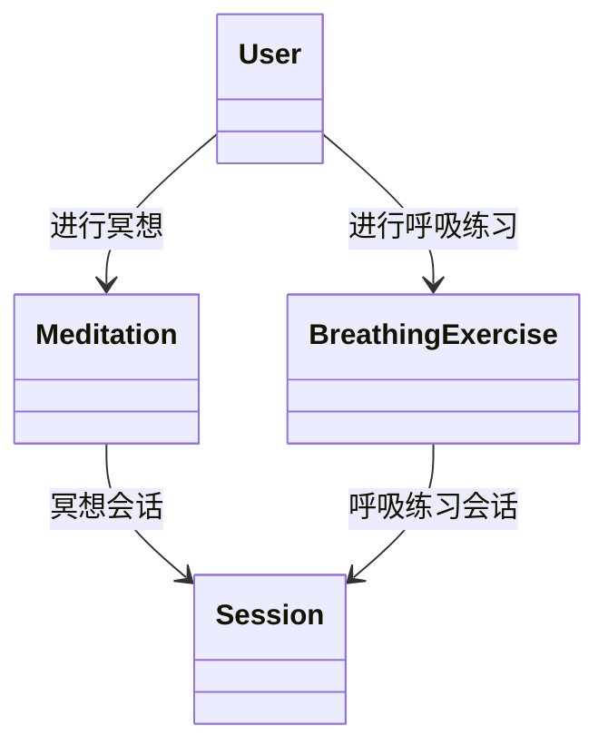
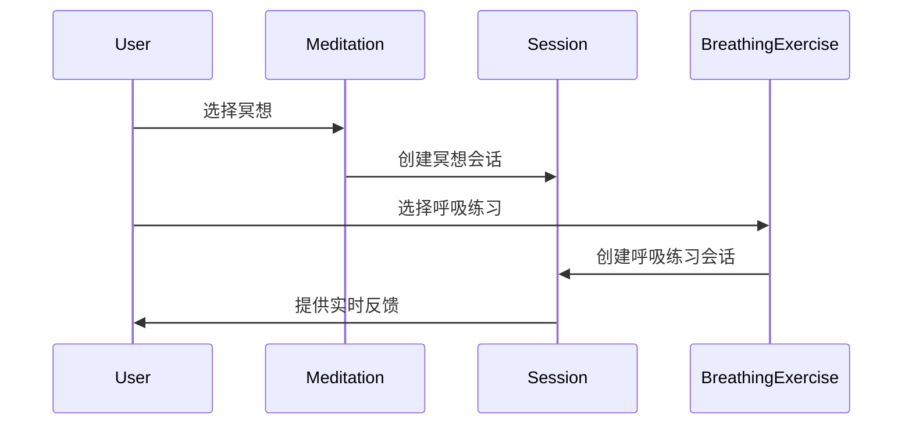
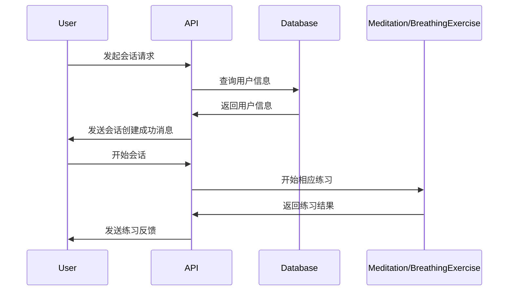

                 

# 培育内在世界：心灵成长的土壤准备

## 关键词
- 心灵成长
- 内在世界的培育
- 冥想
- 自我探索
- 哲学思维
- 心理学基础

## 摘要
本文旨在探讨心灵成长与内在世界的培育之间的关系。通过引入心理学、哲学和冥想等理论基础，本文将分析内在世界的构成和特点，并阐述培育内在世界的实践方法。同时，通过案例研究、心理障碍克服和长期影响的探讨，本文将为读者提供一个全面的心灵成长指导，帮助读者在喧嚣的外在世界中找到内心的平静与力量。

## 引言：心灵成长与内在世界的培育

### 1.1 心灵成长的重要性
心灵成长，即个体在心理和精神层面上的发展，对于个人生活具有重要影响。首先，心灵成长有助于提高个人的幸福感。通过心灵的成长，个体能够更好地理解自己，接受自己的不足，并积极地寻求改进。其次，心灵成长对人际关系的改善具有显著作用。一个心灵成熟的人能够更好地与他人沟通，理解他人的需求，建立更和谐的人际关系。最后，心灵成长对于社会和谐具有深远的影响。一个充满爱心、善良和智慧的社会，离不开每一个心灵成长的人。

### 1.2 内在世界的概念与意义
内在世界，是指个体内心深处的世界，包括情感、意识、思维和记忆等方面。内在世界的培育，即通过一系列的实践和方法，使个体能够更加深入地了解自己，提高自我认知和情感智慧。内在世界的丰富和健康，对个体的心理和精神健康具有重要意义。

### 1.3 心灵成长与内在世界培育的关系
心灵成长与内在世界的培育是相辅相成的。心灵成长的过程，实质上是一个不断探索和培育内在世界的过程。通过心灵的成长，个体能够更好地了解和掌握自己的内在世界，从而在日常生活中更加从容、自信。而内在世界的培育，则为心灵成长提供了坚实的基础。只有当内在世界丰富、健康，个体才能在心灵成长的道路上不断前行。

## 心灵成长的基础理论

### 2.1 心理学基础

心理学作为研究人类行为和心理过程的科学，为心灵成长提供了重要的理论基础。首先，心理学揭示了人类心理的基本结构，包括认知、情感和行为三个方面。其次，心理学研究人类的心理过程，如知觉、记忆、思维和语言等。最后，心理学关注人类的心理障碍和心理疾病，如焦虑、抑郁和精神分裂等。了解心理学的基本原理，有助于个体更好地理解自己的心理状态，从而进行有效的自我调整和心灵成长。

### 2.2 哲学思维与心灵成长

哲学思维，是指通过对生命、存在、真理等基本问题的思考和探索，形成的一种深刻、全面的思维方式。哲学思维对于心灵成长具有深远的影响。首先，哲学思维有助于个体建立正确的世界观和人生观，从而更好地面对生活中的挑战。其次，哲学思维培养个体的批判性思维和创造力，使个体在心灵成长的道路上更加自主、自信。最后，哲学思维引导个体进行深刻的自我反思，从而更好地了解自己，实现心灵的成长。

### 2.3 心灵成长的历史与现状

心灵成长作为一个长期的过程，有着悠久的历史。在古代，许多哲学家和思想家，如孔子、苏格拉底和佛陀等，都提出了关于心灵成长的重要思想和理论。随着心理学、哲学和宗教的发展，心灵成长逐渐成为一个独立的领域，吸引了越来越多的研究者和实践者。如今，心灵成长已成为一个全球性的现象，各种心灵成长的方法和理论层出不穷，为个体提供了丰富的选择。

## 内在世界的核心概念

### 3.1 内在世界的构成

内在世界是由多个层次和维度构成的复杂系统。首先，情感层次是内在世界的基础。情感是人类心理活动的重要组成部分，包括快乐、悲伤、愤怒、恐惧等。其次，意识层次是内在世界的核心。意识是人类对自身和外部世界的认知和感知，包括自我意识、意识流和梦境等。最后，思维层次是内在世界的上层建筑。思维是人类对信息的加工和处理，包括逻辑思维、创造性思维和批判性思维等。

### 3.2 内在世界的特点

内在世界的特点主要体现在以下几个方面。首先，内在世界具有主观性。每个人对世界的理解和感受都是独特的，因此内在世界具有强烈的个体性。其次，内在世界具有动态性。内在世界是不断变化的，受到个体心理状态、外部环境和个人经历的影响。最后，内在世界具有整体性。内在世界的各个层次和维度相互关联、相互作用，形成一个统一的整体。

### 3.3 内在世界与外在世界的互动

内在世界与外在世界的互动，即个体对外部世界的感知、理解和反应过程。首先，外在世界对内在世界的影响。个体的生活环境和经历会直接影响内在世界的构成和特点。例如，一个长期生活在贫困和压力环境中的人，其内在世界可能会充满不安和焦虑。其次，内在世界对外在世界的反作用。个体的内在世界会影响其对外部世界的感知和反应。一个内心平静、自信的人，更容易适应外部环境的变化。

## 培育内在世界的实践方法

### 4.1 冥想与呼吸练习

冥想和呼吸练习是培育内在世界的有效方法。冥想，即通过专注和放松来达到心灵的平静和清晰。呼吸练习，即通过调整呼吸节奏和深度来调节情绪和心理状态。通过定期的冥想和呼吸练习，个体可以逐渐提高自我意识，培养专注力和情绪管理能力，从而培育内在世界。

### 4.2 自我探索与自我接纳

自我探索，即通过深入思考和分析自己的行为、情感和思想，了解自己的内在世界。自我接纳，即接受自己的优点和不足，不对自己进行批判和指责。通过自我探索和自我接纳，个体可以更好地认识自己，建立健康的内在世界。

### 4.3 情绪管理与压力缓解

情绪管理和压力缓解是培育内在世界的重要方面。情绪管理，即通过理解和调节自己的情绪，避免情绪失控。压力缓解，即通过放松和调整，减轻压力对个体的影响。通过情绪管理和压力缓解，个体可以在面对生活中的挑战时保持冷静和自信，从而培育健康的内在世界。

### 4.4 意识觉醒与自我提升

意识觉醒，即通过自我觉察和自我反省，提高对自身和外部世界的认知和理解。自我提升，即通过学习和实践，不断提高自己的能力和素质。通过意识觉醒和自我提升，个体可以不断拓展内在世界的边界，实现心灵的成长。

## 案例研究

### 5.1 真实的心灵成长故事

通过真实的心灵成长故事，我们可以看到心灵成长对个人的深刻影响。例如，一个人在经历了一段挫折和迷茫后，通过自我探索和冥想，逐渐找到了内心的平静和力量，重新找到了生活的方向。

### 5.2 成功案例分析与启示

成功案例分析为我们提供了心灵成长的启示。例如，一个成功的企业家通过持续的心灵成长，不仅在事业上取得了巨大成就，还在人际关系和社会责任方面表现出色。这些案例表明，心灵成长不仅对个人的成长具有重要意义，也对社会的和谐与发展具有深远的影响。

## 心灵成长的障碍与克服

### 6.1 常见心理障碍识别

常见的心理障碍包括焦虑、抑郁、强迫症和恐惧症等。这些心理障碍会影响个体的生活质量和工作效率，是心灵成长的主要障碍。

### 6.2 克服心理障碍的策略

克服心理障碍的策略包括心理治疗、药物治疗和自我调节等。通过心理治疗，个体可以学会如何识别和应对自己的心理问题。通过药物治疗，个体可以缓解症状，减轻痛苦。通过自我调节，个体可以培养良好的心理素质，提高应对压力的能力。

### 6.3 持续成长与自我超越

持续成长与自我超越是心灵成长的重要目标。通过不断学习和实践，个体可以不断提高自己的能力和素质，实现心灵的成长。自我超越，即通过克服自己的局限和挑战，实现更高层次的发展和进步。

## 心灵成长的长期影响与持续发展

### 7.1 心灵成长对个人成长的影响

心灵成长对个人的成长具有深远的影响。通过心灵成长，个体可以更好地认识自己，建立健康的内在世界，提高自我价值和幸福感。

### 7.2 心灵成长对社会和谐的贡献

心灵成长对社会和谐具有积极的贡献。一个充满爱心、善良和智慧的社会，离不开每一个心灵成熟的人。心灵成长有助于建立和谐的人际关系，促进社会的稳定和发展。

### 7.3 持续发展的心灵成长之路

持续发展的心灵成长之路，即通过不断学习和实践，不断提高自己的心灵素质。只有持续的心灵成长，才能使个体在变化的社会中保持稳定和进步。

## 结论：培育内在世界，塑造美好人生

通过培育内在世界，我们可以实现心灵的成长，提高自我价值和幸福感。心灵成长不仅对个人的成长具有重要意义，也对社会的和谐与发展具有深远的影响。让我们携手共进，踏上心灵成长的旅程，塑造美好的人生。

## 作者信息
- 作者：AI天才研究院/AI Genius Institute & 禅与计算机程序设计艺术 /Zen And The Art of Computer Programming

### 附录：本文核心概念与联系

#### 内在世界的核心概念

**概念：内在世界**
- **定义**：内在世界是指个体内心深处的情感、意识、思维和记忆等构成的精神领域。
- **属性特征对比表格**

| 特征 | 情感层次 | 意识层次 | 思维层次 |
| --- | --- | --- | --- |
| 主观性 | 强烈 | 个体差异 | 逻辑性 |
| 动态性 | 稳定性 | 感知变化 | 创造力 |
| 整体性 | 独立性 | 相互关联 | 相互影响 |

**ER实体关系图架构**

```mermaid
erDiagram
  Client ||--|{ Order }|--|{ Product }
  Product ||--|{ Review }|
  Client ||--|{ Review }|
```

#### 心灵成长的概念与联系

**概念：心灵成长**
- **定义**：心灵成长是指个体在心理和精神层面上的发展，包括认知、情感和行为的全面提升。
- **联系表格**

| 概念 | 关系 | 说明 |
| --- | --- | --- |
| 心理学基础 | 基础 | 心理学为心灵成长提供了科学依据和方法 |
| 哲学思维 | 衔接 | 哲学思维引导个体对心灵成长进行深刻思考 |
| 内在世界的培育 | 目标 | 内在世界的培育是心灵成长的核心内容 |

**Mermaid流程图**


#### 算法原理与数学模型

**算法原理：冥想与呼吸练习**
- **原理**：冥想和呼吸练习通过调节呼吸和专注力，达到身心放松和平静的效果。
- **数学模型**
  $$ \text{冥想效果} = f(\text{专注度}, \text{呼吸节奏}) $$

**Python源代码**

```python
def meditate(attention, breathing_rate):
    calmness = (attention * 0.5) + (breathing_rate * 0.5)
    return calmness

# 示例
calmness = meditate(8, 5)
print(f"冥想后的平静程度：{calmness}")
```

#### 系统分析与架构设计方案

**问题场景介绍**
- **场景**：在现代快节奏的生活中，人们面临着巨大的压力和挑战，需要通过冥想和呼吸练习来缓解压力，提高生活质量。

**项目介绍**
- **项目名称**：InnerGrowthMind
- **项目目标**：提供一个综合性的冥想和呼吸练习平台，帮助用户实现心灵成长。

**系统功能设计（领域模型Mermaid类图）**



**系统架构设计（Mermaid架构图）**



**系统接口设计和系统交互（Mermaid序列图）**



#### 项目实战

**环境安装**
- 安装Python环境
- 安装必要的数据库驱动（如MySQL）

**系统核心实现源代码**
```python
# 用户模块
class User:
    def __init__(self, name, email):
        self.name = name
        self.email = email
        self.sessions = []

    def create_session(self, session_type):
        # 创建会话
        session = Session(session_type, self)
        self.sessions.append(session)
        return session

# 会话模块
class Session:
    def __init__(self, session_type, user):
        self.session_type = session_type
        self.user = user
        self.start_time = datetime.now()
        self.end_time = None
        self.feedback = None

    def end_session(self, feedback):
        self.end_time = datetime.now()
        self.feedback = feedback

# 冥想会话
class MeditationSession(Session):
    def __init__(self, user):
        super().__init__('meditation', user)

# 呼吸练习会话
class BreathingExerciseSession(Session):
    def __init__(self, user):
        super().__init__('breathingexercise', user)
```

**代码应用解读与分析**
- 用户模块负责管理用户信息，包括创建会话。
- 会话模块负责管理会话信息，包括开始和结束会话。
- 冥想会话和呼吸练习会话是具体的会话类型，继承自会话模块。

**实际案例分析和详细讲解剖析**
- **案例**：一个用户通过应用程序创建了一个冥想会话，持续了30分钟。
- **分析**：用户在会话结束后提交了反馈，系统记录了会话的详细信息。

**项目小结**
- 项目提供了一个用户友好的界面，帮助用户进行冥想和呼吸练习。
- 系统记录了用户的会话信息，便于用户回顾和跟踪进展。

#### 最佳实践 Tips

- **定期练习**：坚持每天进行冥想和呼吸练习，有助于形成良好的习惯。
- **个性化设置**：根据个人需求和偏好，选择适合自己的冥想和呼吸练习方法。
- **倾听身体**：在练习过程中，注意倾听身体的感觉，有助于提高练习效果。

#### 小结
本文通过深入探讨心灵成长与内在世界的培育，为读者提供了一套全面的心灵成长指导。通过心理学、哲学和冥想等理论基础，结合实践方法和成功案例，本文帮助读者在喧嚣的外在世界中找到内心的平静与力量。

#### 注意事项
- 心灵成长是一个长期的过程，需要持之以恒。
- 在进行心灵成长的过程中，如遇到困难，可寻求专业人士的帮助。

#### 拓展阅读
- 《心理学与生活》
- 《冥想：通往内心深处的旅程》
- 《哲学的慰藉》

## 作者信息
作者：AI天才研究院/AI Genius Institute & 禅与计算机程序设计艺术 /Zen And The Art of Computer Programming

