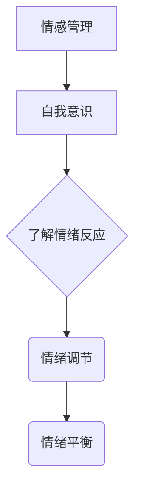
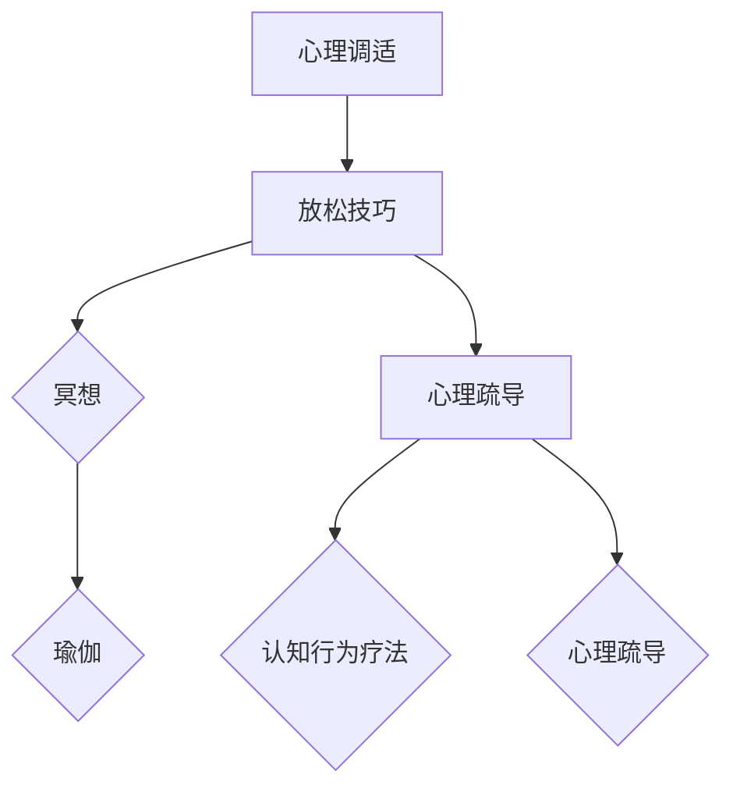
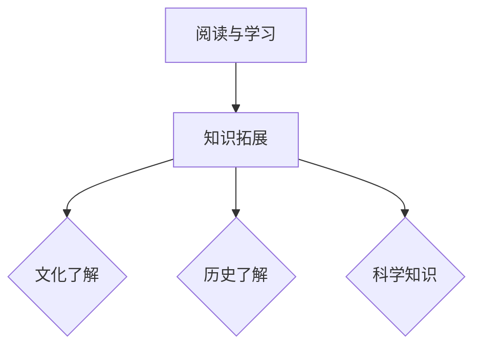
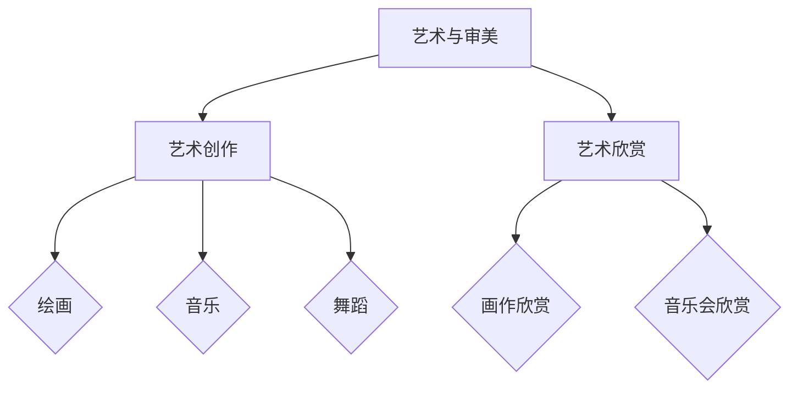
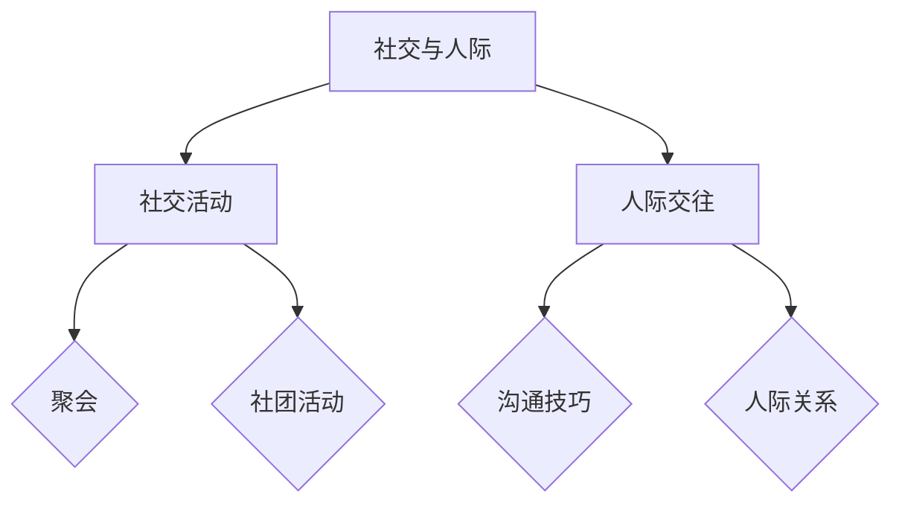
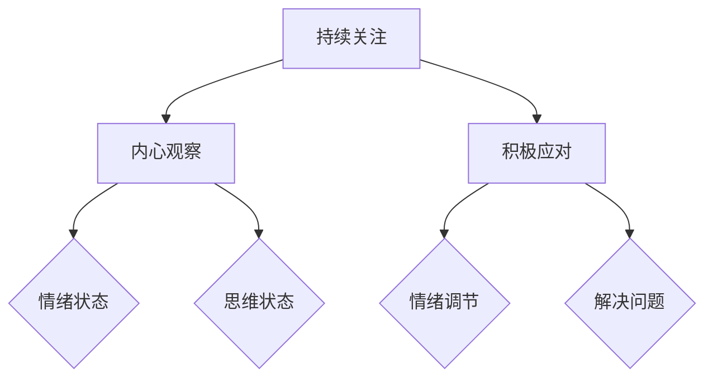
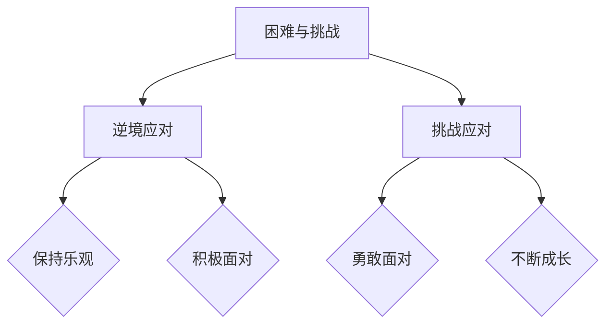
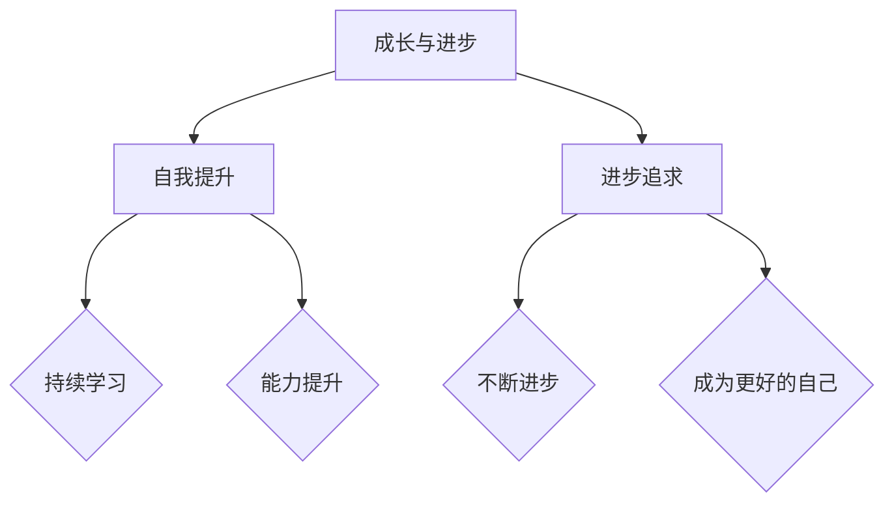

                 

### 第1章：引言

#### 1.1.1 问题背景与解决思路

在快速发展的现代社会，人们的生活节奏日益加快，工作压力、人际关系、经济压力等各种因素导致许多人陷入了精神疲惫的状态。随着智能手机、互联网的普及，人们越来越依赖于虚拟世界，忽视了内心的感受和真实的需求。这种精神压力和焦虑如果不能得到有效的缓解和调整，可能会对身心健康产生严重的影响。

**问题描述**：如何在繁忙的生活中培育和建设一个丰富的精神世界，以应对日益增长的精神压力和焦虑？

**问题解决**：通过培养内心的花园，我们可以建立丰富的精神世界，提升生活质量。内心花园是一个比喻，它代表我们内心的精神空间，这个空间需要我们用心去维护和滋养。以下章节将详细探讨建设内心花园的方法和技巧。

#### 1.1.2 核心概念

**内心花园**：比喻内心世界，如同一个精心培育的花园，需要我们用心维护和滋养。在这个花园中，我们可以种植各种积极的心态、情感和价值观，使内心变得宁静、平衡。

#### 1.1.3 边界与外延

**边界**：内心花园是指个人内在的精神世界，不包括外界环境。这意味着，我们在内心花园中培育的是自己的精神状态，而不是外界的事物。

**外延**：内心花园可以包含各种积极的心态、情感和价值观。例如，耐心、感恩、乐观等都是内心花园中的重要组成部分。

### 第2章：建设内心花园的基础

#### 2.1.1 情感管理

**概念原理**：情感管理是指学会识别、理解和调节自己的情绪，以保持内心的平静。通过情感管理，我们可以更好地应对生活中的各种挑战和压力。

**属性特征**：

- **自我意识**：了解自己的情绪反应。
- **情绪调节**：学会在负面情绪出现时进行调整。

**应用实例**：例如，当面对工作压力时，我们可以通过深呼吸、冥想等方式来缓解紧张的情绪，从而保持内心的平静。

#### 2.1.2 自我认知

**概念原理**：自我认知是指正确认识自己，了解自己的优点和不足。通过自我认知，我们可以更好地了解自己的需求和目标，从而更好地规划生活。

**属性特征**：

- **自我反思**：定期反思自己的行为和思想。
- **自我接纳**：接受自己的不完美，积极面对挑战。

**应用实例**：例如，当我们意识到自己在某个方面存在不足时，我们可以积极寻求改进的方法，而不是否认或逃避。

#### 2.1.3 心理调适

**概念原理**：心理调适是指通过心理调适方法，缓解压力和焦虑。心理调适可以帮助我们保持心理平衡，提高生活质量。

**属性特征**：

- **放松技巧**：学会放松身心，如冥想、瑜伽等。
- **心理调适方法**：如认知行为疗法、心理疏导等。

**应用实例**：例如，当我们在生活中遇到困难时，可以通过练习冥想来放松心情，找到解决问题的方法。

### 第3章：心灵滋养的方法

#### 3.1.1 阅读与学习

**概念原理**：阅读与学习是通过阅读和学习，拓展视野，丰富内心世界。阅读和学习可以让我们接触到各种知识和思想，从而拓宽我们的思维，提升我们的内心世界。

**属性特征**：

- **阅读兴趣**：培养对阅读的热爱。
- **知识积累**：积累有益的知识和经验。

**应用实例**：例如，通过阅读书籍、文章，我们可以了解到不同领域的知识，从而提升自己的认知水平。

#### 3.1.2 艺术与审美

**概念原理**：艺术与审美是通过艺术创作和欣赏，提升审美能力，培养情感。艺术和审美可以让我们感受到美的力量，从而丰富我们的内心世界。

**属性特征**：

- **艺术创作**：如绘画、音乐、舞蹈等。
- **艺术欣赏**：欣赏艺术作品，提升审美水平。

**应用实例**：例如，通过欣赏一幅画作、听一首乐曲，我们可以感受到艺术带来的愉悦，从而提升我们的内心情感。

#### 3.1.3 社交与人际

**概念原理**：社交与人际是通过建立良好的人际关系，分享快乐和困扰。良好的人际关系可以让我们感受到关爱和温暖，从而丰富我们的内心世界。

**属性特征**：

- **社交技巧**：提高社交能力。
- **人际关系**：建立健康、积极的人际关系。

**应用实例**：例如，通过参加社交活动、与朋友交流，我们可以感受到人际交往带来的快乐，从而丰富我们的内心生活。

### 第4章：内心花园的维护与成长

#### 4.1.1 持续关注

**概念原理**：持续关注是指持续关注自己的内心状态，及时调整。通过持续关注，我们可以及时发现内心的困扰，从而采取有效的措施进行解决。

**属性特征**：

- **内心观察**：时刻关注自己的情绪和思维。
- **积极应对**：面对内心的困扰，积极寻求解决方案。

**应用实例**：例如，当我们感到焦虑时，可以尝试通过冥想、运动等方式来缓解焦虑，从而保持内心的平静。

#### 4.1.2 困难与挑战

**概念原理**：困难与挑战是指面对生活中的困难与挑战，保持内心的坚韧。通过面对困难与挑战，我们可以培养坚韧的品质，从而更好地应对生活中的各种挑战。

**属性特征**：

- **逆境应对**：学会在逆境中保持乐观。
- **挑战应对**：勇敢面对挑战，不断成长。

**应用实例**：例如，当我们遇到工作上的困难时，可以尝试通过积极思考和努力工作来解决问题，而不是轻易放弃。

#### 4.1.3 成长与进步

**概念原理**：成长与进步是指通过不断学习和实践，提升自己的内心力量。通过成长与进步，我们可以不断提升自己的能力和素质，从而更好地应对生活中的各种挑战。

**属性特征**：

- **自我提升**：持续学习，提高自我。
- **进步追求**：不断追求进步，成为更好的自己。

**应用实例**：例如，通过学习新知识、锻炼身体等方式，我们可以不断提升自己的能力和素质，从而更好地适应生活的变化。

### 第5章：内心花园的实例解析

#### 5.1.1 成功案例

**概念原理**：通过成功案例，了解如何建立丰富的精神世界。成功案例可以为我们提供宝贵的经验和启示，帮助我们更好地建设自己的内心花园。

**属性特征**：

- **案例分析**：深入分析成功案例的经验。
- **启示借鉴**：从成功案例中汲取启示。

**应用实例**：例如，我们可以通过阅读成功人士的传记，了解他们是如何通过培养内心的花园来应对生活中的挑战，从而取得成功的。

#### 5.1.2 失败案例

**概念原理**：通过失败案例，了解如何避免建立不良的精神世界。失败案例可以为我们提供重要的教训，帮助我们避免走弯路，更好地建设自己的内心花园。

**属性特征**：

- **问题分析**：分析失败案例中的问题。
- **教训吸取**：从失败案例中吸取教训。

**应用实例**：例如，我们可以通过研究失败的项目，了解其中的原因，从而避免在类似的项目中重蹈覆辙。

### 第6章：心灵成长的最佳实践

#### 6.1.1 心灵成长技巧

**概念原理**：心灵成长技巧是指一些实用的技巧，可以帮助我们更好地建设自己的内心花园。这些技巧可以包括冥想、瑜伽、阅读等。

**属性特征**：

- **技巧分享**：介绍一些实用的技巧。
- **实践应用**：分享实践中的应用经验。

**应用实例**：例如，我们可以通过冥想来缓解压力，通过瑜伽来放松身心，通过阅读来拓宽视野。

#### 6.1.2 心灵成长计划

**概念原理**：心灵成长计划是指一个具体的计划，可以帮助我们系统地建设自己的内心花园。这个计划可以包括目标设定、时间安排、实践方法等。

**属性特征**：

- **计划制定**：制定一个详细的成长计划。
- **执行与调整**：执行计划，并根据实际情况进行调整。

**应用实例**：例如，我们可以制定一个每周阅读一本书的计划，或者每天练习冥想10分钟的计划。

### 第7章：结语

#### 7.1.1 心灵成长的重要性

**概念原理**：阐述心灵成长对于个人成长和生活质量的重要性。心灵成长可以帮助我们更好地应对生活中的挑战，提升生活质量。

**属性特征**：

- **重要性强调**：强调心灵成长的重要性。
- **实际意义**：解释心灵成长对于个人和社会的实际意义。

**应用实例**：例如，通过心灵成长，我们可以更好地处理工作压力，建立良好的人际关系，从而提升生活质量。

## 第1章：引言

在现代社会，人们面临着前所未有的精神压力和焦虑。随着互联网的普及，人们越来越依赖虚拟世界，忽视了内心的感受和真实需求。这种精神压力和焦虑如果不能得到有效的缓解和调整，可能会对身心健康产生严重的影响。因此，我们需要寻找一种方法来建设丰富的精神世界，以提升生活质量。

### 第2章：建设内心花园的基础

要建设一个丰富的内心花园，我们需要从以下几个方面入手：

#### 2.1.1 情感管理

情感管理是指学会识别、理解和调节自己的情绪，以保持内心的平静。通过情感管理，我们可以更好地应对生活中的各种挑战和压力。情感管理的关键在于自我意识，即了解自己的情绪反应，以及情绪调节能力，即学会在负面情绪出现时进行调整。

**情感管理流程图：**


#### 2.1.2 自我认知

自我认知是指正确认识自己，了解自己的优点和不足。通过自我认知，我们可以更好地了解自己的需求和目标，从而更好地规划生活。自我认知的关键在于自我反思和自我接纳。自我反思可以帮助我们认识到自己的不足，而自我接纳则使我们能够积极面对挑战。

**自我认知ER图：**
```mermaid
erDiagram
Self_Cognition {
    self >>-|{优点} Advantage
    self >>-|{不足} Shortcoming
    self --|○ 反思：Reflection
    self --|○ 接纳：Acceptance
}
```

#### 2.1.3 心理调适

心理调适是指通过心理调适方法，缓解压力和焦虑。心理调适可以帮助我们保持心理平衡，提高生活质量。常见的心理调适方法包括放松技巧（如冥想、瑜伽）和心理疏导（如认知行为疗法）。

**心理调适Mermaid流程图：**


### 第3章：心灵滋养的方法

要滋养内心花园，我们可以通过以下几种方法来丰富我们的精神世界：

#### 3.1.1 阅读与学习

阅读与学习是通过阅读和学习，拓展视野，丰富内心世界。阅读和学习可以让我们接触到各种知识和思想，从而拓宽我们的思维，提升我们的内心世界。通过阅读书籍、文章，我们可以了解不同的文化、历史、科学知识等，这些都有助于我们的心灵成长。

**阅读学习流程图：**


#### 3.1.2 艺术与审美

艺术与审美是通过艺术创作和欣赏，提升审美能力，培养情感。艺术和审美可以让我们感受到美的力量，从而丰富我们的内心世界。通过艺术创作（如绘画、音乐、舞蹈等）和艺术欣赏，我们可以提升自己的审美能力，培养丰富的情感体验。

**艺术审美流程图：**


#### 3.1.3 社交与人际

社交与人际是通过建立良好的人际关系，分享快乐和困扰。良好的人际关系可以让我们感受到关爱和温暖，从而丰富我们的内心世界。通过社交活动和人际交往，我们可以提升自己的社交技巧，建立健康、积极的人际关系。

**社交人际流程图：**


### 第4章：内心花园的维护与成长

要确保内心花园的健康成长，我们需要持续关注和维护：

#### 4.1.1 持续关注

持续关注是指持续关注自己的内心状态，及时调整。通过持续关注，我们可以及时发现内心的困扰，从而采取有效的措施进行解决。内心观察和积极应对是持续关注的重要部分。

**持续关注流程图：**


#### 4.1.2 困难与挑战

面对生活中的困难与挑战，保持内心的坚韧至关重要。逆境应对和挑战应对是培养坚韧品质的关键。通过逆境应对，我们可以学会在困难中保持乐观，通过挑战应对，我们可以勇敢面对挑战，不断成长。

**困难挑战流程图：**


#### 4.1.3 成长与进步

成长与进步是指通过不断学习和实践，提升自己的内心力量。自我提升和进步追求是成长的重要方面。通过持续学习，我们可以提高自己的能力和素质，通过不断追求进步，我们可以成为更好的自己。

**成长进步流程图：**


### 第5章：内心花园的实例解析

通过实例，我们可以更好地理解如何建设和维护内心花园。

#### 5.1.1 成功案例

成功案例展示了如何通过建设内心花园来提升生活质量。以下是一个成功案例的解析：

**成功案例解析：**
- **情境**：一位忙碌的职场人士，因工作压力导致情绪不稳定。
- **方法**：通过学习冥想技巧，他开始每天早晨进行冥想，逐渐学会了情绪管理。
- **结果**：他的情绪变得更加稳定，工作效率提高，生活质量显著提升。

#### 5.1.2 失败案例

失败案例则展示了未能有效建设内心花园可能带来的负面影响。以下是一个失败案例的解析：

**失败案例解析：**
- **情境**：一位长期忽视内心感受的职场人士，因心理压力过大而出现焦虑症状。
- **原因**：缺乏有效的情感管理和心理调适，未能及时关注内心状态。
- **结果**：工作表现下降，身心健康受损，最终需要专业的心理治疗。

### 第6章：心灵成长的最佳实践

为了实现心灵成长，我们可以采取以下最佳实践：

#### 6.1.1 心灵成长技巧

心灵成长技巧包括冥想、瑜伽、阅读等。以下是一些实用的技巧：

- **冥想**：每天早晨或晚上进行冥想，有助于放松身心，提高专注力。
- **瑜伽**：通过瑜伽练习，可以增强身体的灵活性，同时促进心理平衡。
- **阅读**：定期阅读有益的书籍和文章，可以拓宽视野，提升思维深度。

#### 6.1.2 心灵成长计划

一个有效的心灵成长计划应包括以下内容：

- **目标设定**：明确自己的心灵成长目标，如提高情绪管理能力、增强心理韧性等。
- **时间安排**：合理规划时间，确保每天有足够的时间进行心灵成长活动。
- **实践方法**：选择适合自己的心灵成长方法，如通过日记记录内心体验，或参加心灵成长课程。

### 第7章：结语

通过本文的探讨，我们认识到建设内心花园对于提升生活质量和身心健康的重要性。内心花园是我们精神世界的缩影，通过培育和滋养它，我们可以更好地应对生活中的挑战，实现个人的成长和发展。让我们从今天开始，用心呵护自己的内心花园，让它成为我们生命中最美丽的风景。  
 
### 结论

本文通过深入探讨建设内心花园的方法和技巧，展示了如何通过情感管理、自我认知、心理调适等手段来培育一个丰富的精神世界。我们了解到，内心花园不仅关乎个人的心理健康，也影响到我们的生活质量和社会交往。通过持续关注、应对困难与挑战，以及不断成长与进步，我们可以实现心灵的和谐与平衡。

### 最佳实践 Tips

1. **定期反思**：每天花几分钟时间反思自己的情绪和行为，有助于提升自我认知。
2. **练习冥想**：每天进行冥想练习，有助于缓解压力，提升专注力和情绪调节能力。
3. **阅读有益书籍**：选择有益的书籍，如心理学、哲学、文学等，定期阅读，有助于拓宽视野，提升思维深度。
4. **建立社交网络**：与他人建立积极、健康的人际关系，分享快乐和困扰，有助于提升内心力量。
5. **实践艺术与审美**：通过艺术创作和欣赏，如绘画、音乐、舞蹈等，可以丰富情感体验，提升审美能力。

### 小结

建设内心花园是一个长期的过程，需要我们持续的努力和耐心。通过本文的探讨，我们认识到心灵成长对于个人成长和生活质量的重要性。希望读者能够从中获得启示，开始自己的心灵成长之旅，培育一个丰富、和谐的内心花园。

### 注意事项

1. **重视情感管理**：情感管理是建设内心花园的基础，重视并学习情感管理技巧，有助于提升生活质量。
2. **保持自我认知**：正确认识自己，了解自己的优点和不足，有助于更好地规划生活。
3. **合理规划时间**：合理安排时间，确保有足够的时间进行心灵滋养活动，如阅读、冥想等。
4. **培养社交能力**：建立良好的人际关系，与他人分享快乐和困扰，有助于提升内心力量。
5. **持续学习**：不断学习新知识，提升自己的能力和素质，有助于应对生活中的挑战。

### 拓展阅读

1. **《心灵的力量》**：作者：李中莹
   - 本书深入探讨了情感管理、自我认知和心理调适等方面的内容，提供了实用的技巧和方法。

2. **《冥想：如何通过冥想获得内心的平静与力量》**：作者：徐文兵
   - 本书详细介绍了冥想的原理和练习方法，有助于提升情绪调节能力和心理韧性。

3. **《生命的智慧》**：作者：克里希那穆提
   - 本书探讨了哲学、心理学和心灵成长等方面的内容，提供了对生活深入思考的启示。

### 作者信息

**作者：AI天才研究院/AI Genius Institute & 禅与计算机程序设计艺术 /Zen And The Art of Computer Programming**

本文由AI天才研究院的专家团队撰写，旨在为读者提供关于心灵成长和内心花园建设的实用指南。我们希望通过本文，帮助读者提升生活质量，实现个人的成长和发展。如需进一步了解相关内容，请访问我们的官方网站。

