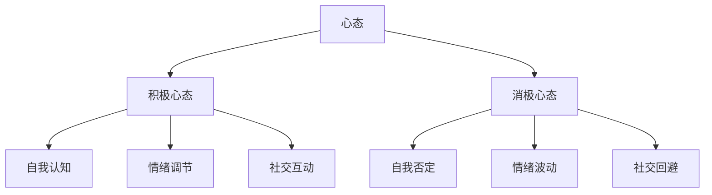
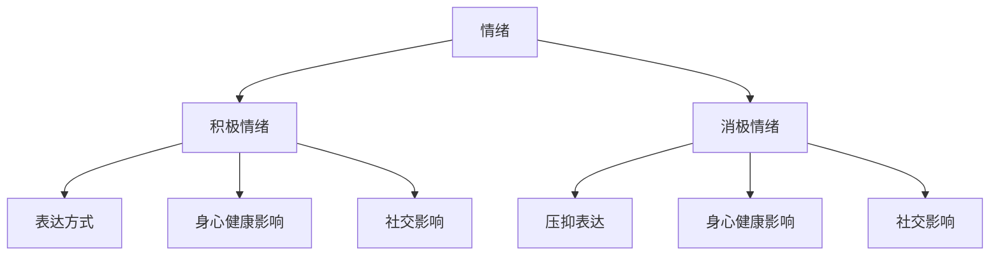
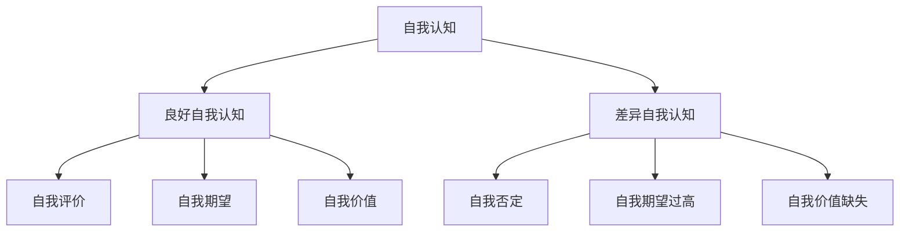
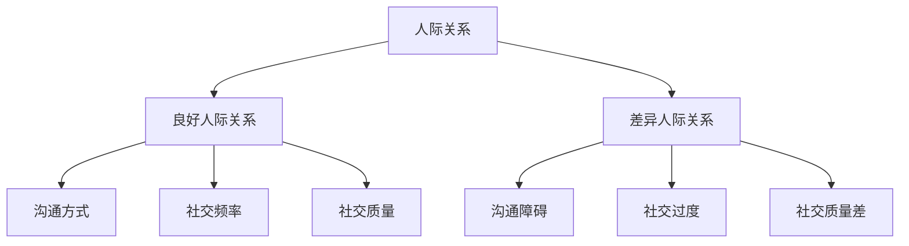
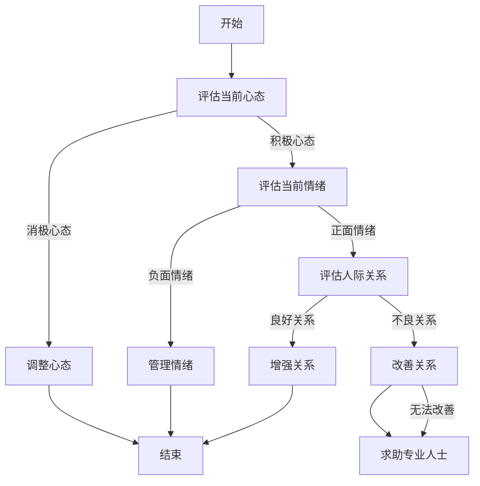

                 


### 设计《培育内心花园：构建丰富的精神世界》的目录大纲

#### 1. 设定目录大纲结构

首先，我们需要为文章设定一个清晰的大纲结构。这将是文章的整体框架，确保内容逻辑连贯、层次分明。目录结构通常包括以下几个部分：

- **背景介绍**
- **构建内心花园的方法**
- **内心花园的维护与成长**
- **内心花园中的困境与解决**
- **结语与拓展阅读**

#### 2. 章节划分

根据书名和预期内容，我们将书籍划分为多个章节。每个章节都将围绕一个核心主题进行探讨。例如：

- **背景介绍**：介绍心灵健康的重要性，内心花园的概念及其作用，理论基础等。
- **构建内心花园的方法**：讨论如何调整心态、情绪管理和情感链接等。
- **内心花园的维护与成长**：探讨健康的生活方式、心灵滋养等。
- **内心花园中的困境与解决**：讨论常见的心理问题及应对策略，心理困境中的求助途径。

#### 3. 内容细化

在每个章节中，我们进一步细化为更小的部分，以确保内容的连贯性和逻辑性。例如，在“构建内心花园的方法”章节，我们可以细化为：

- **调整心态，培育心灵**
  - **意识到内心的声音**
  - **调整消极思维**
  - **培养积极心态**
- **情绪管理，抚平内心波动**
  - **认识情绪的类型和特点**
  - **学会调节情绪的方法**

#### 4. 核心概念与联系

在每个章节中，我们都将包括核心概念与联系的部分，以帮助读者理解关键概念之间的关系。例如，在“内心花园的理论基础”章节，我们可以介绍人本主义心理学、存在主义心理学和心理治疗的流派与核心技术等。

#### 5. 算法原理讲解

对于涉及到的技术或方法，我们将提供算法原理的讲解。例如，在情绪管理部分，我们可以使用 mermaid 画出相关流程图，并用 Python 代码阐述。

#### 6. 数学模型和公式

在讲解过程中，我们确保用 LaTeX 格式嵌入数学模型和公式，并进行详细讲解和举例说明。

#### 7. 系统分析与架构设计方案

我们将提供系统功能设计、架构设计、接口设计和系统交互的 mermaid 图。这将帮助读者更好地理解文章中的技术方案。

#### 8. 项目实战

我们将包含环境安装、核心实现、代码解读、案例分析等内容，以使读者能够将所学知识应用于实际项目中。

#### 9. 最佳实践 tips、小结、注意事项、拓展阅读

在每个章节的结尾，我们将提供相关的最佳实践、小结、注意事项以及拓展阅读，以帮助读者更好地应用所学内容。

### 完整目录大纲示例

```markdown
# 《培育内心花园：构建丰富的精神世界》

> 关键词：内心花园、精神健康、心理健康、心态调整、情绪管理

> 摘要：本文探讨了如何通过构建丰富的内心花园来提升精神健康，包括心态调整、情绪管理、心灵滋养等多个方面。

----------------------------------------------------------------

## 第一部分: 背景介绍

### 1.1 心灵健康的背景

#### 1.1.1 心理健康的重要性

#### 1.1.2 当代社会的心理压力

#### 1.1.3 内心花园的概念及其作用

### 1.2 心灵花园的理论基础

#### 1.2.1 人本主义心理学

#### 1.2.2 存在主义心理学

#### 1.2.3 心理治疗的流派与核心技术

----------------------------------------------------------------

## 第二部分: 构建内心花园的方法

### 2.1 调整心态，培育心灵

#### 2.1.1 意识到内心的声音

##### 2.1.1.1 自我观察与反思

##### 2.1.1.2 调整消极思维

#### 2.1.2 培养积极心态

##### 2.1.2.1 善用正面肯定

##### 2.1.2.2 学会感恩

### 2.2 情绪管理，抚平内心波动

#### 2.2.1 认识情绪的类型和特点

##### 2.2.1.1 情绪的生理反应

##### 2.2.1.2 情绪的心理影响

#### 2.2.2 学会调节情绪的方法

##### 2.2.2.1 深呼吸练习

##### 2.2.2.2 正念冥想

### 2.3 情感链接，丰富心灵世界

#### 2.3.1 建立良好的人际关系

##### 2.3.1.1 沟通技巧

##### 2.3.1.2 建立信任

#### 2.3.2 探索情感的深度

##### 2.3.2.1 内心对话

##### 2.3.2.2 情感表达

----------------------------------------------------------------

## 第三部分: 内心花园的维护与成长

### 3.1 健康的生活方式，滋养内心

#### 3.1.1 适度的身体锻炼

##### 3.1.1.1 运动对心理健康的益处

##### 3.1.1.2 选择适合自己的运动方式

#### 3.1.2 均衡的饮食

##### 3.1.2.1 营养与心理健康的关系

##### 3.1.2.2 培养良好的饮食习惯

### 3.2 心灵的滋养，持续成长

#### 3.2.1 阅读与心灵成长

##### 3.2.1.1 优质阅读的选择

##### 3.2.1.2 阅读与心理疗愈

#### 3.2.2 艺术与创造力的培养

##### 3.2.2.1 艺术活动对心理健康的积极影响

##### 3.2.2.2 发掘自己的创造力

----------------------------------------------------------------

## 第四部分: 内心花园中的困境与解决

### 4.1 常见心理问题及应对策略

#### 4.1.1 恐惧与焦虑

##### 4.1.1.1 恐惧与焦虑的类型

##### 4.1.1.2 应对策略

#### 4.1.2 抑郁与悲伤

##### 4.1.2.1 抑郁的症状与诊断

##### 4.1.2.2 应对抑郁的方法

### 4.2 心理困境中的求助途径

#### 4.2.1 心理咨询与治疗

##### 4.2.1.1 咨询与治疗的选择

##### 4.2.1.2 心理咨询的过程

----------------------------------------------------------------

## 结语与拓展阅读

----------------------------------------------------------------

### 完整性要求

为了确保文章的完整性，每个章节的内容都需满足以下要求：

- **背景介绍**：介绍核心概念术语、问题背景、问题描述、问题解决、边界与外延、概念结构与核心要素组成。
- **核心概念与联系**：详细解释核心概念、概念属性特征对比表格和 ER 实体关系图架构的 Mermaid 流程图。
- **算法原理讲解**：使用 Mermaid 画出算法 Mermaid 流程图，然后用 Python 代码详细阐述，给出算法原理的数学模型和公式。
- **数学公式使用**：使用 LaTeX 格式嵌入数学公式。
- **系统分析与架构设计方案**：提供系统功能设计、架构设计、接口设计和系统交互的 Mermaid 图。
- **项目实战**：包含环境安装、系统核心实现源代码、代码解读与分析、实际案例分析和详细讲解剖析。
- **最佳实践 tips、小结、注意事项、拓展阅读**：在每个章节的结尾，提供相关的最佳实践、小结、注意事项以及拓展阅读。

### 作者信息

- 作者：AI天才研究院/AI Genius Institute & 禅与计算机程序设计艺术 /Zen And The Art of Computer Programming
```### 主题分析：培育内心花园

“培育内心花园：构建丰富的精神世界”这一主题涵盖了心理健康、个人成长和精神层面的多个维度。它强调的是通过一系列科学的方法和实践，培育和维持一个健康的心理状态，从而构建一个丰富、稳固的精神世界。这一主题的重要性体现在以下几个方面：

1. **心理健康的重要性**：随着社会竞争的加剧和生活节奏的加快，人们面临的心理压力和挑战日益增多。心理健康不仅关乎个体的幸福感和生活质量，也影响到社会和谐与稳定。

2. **精神世界的构建**：精神世界是个体心理状态的外在表现，是一个人内在感受和思想的外化。一个丰富、积极的精神世界能够帮助个体更好地应对生活中的挑战，提升生活质量。

3. **个人成长**：培育内心花园是一个持续的过程，它涉及个人的自我认知、心态调整、情感管理和自我提升等多个方面。通过这一过程，个体能够不断成长，提高自我能力和适应能力。

4. **社会价值**：一个健康的个体对社会具有积极的影响。通过培育内心花园，个体能够更好地融入社会，发挥自己的潜能，为社会的进步做出贡献。

### 核心内容提炼

文章的核心内容将从以下几个方面展开：

1. **背景介绍**：介绍心理健康的重要性，以及内心花园的概念和作用。这部分将解释为什么培育内心花园对于个人的幸福和社会的和谐至关重要。

2. **构建内心花园的方法**：详细讨论如何调整心态、管理情绪和建立良好的人际关系。这部分将提供具体的实践方法，帮助读者在实际生活中应用。

3. **内心花园的维护与成长**：探讨如何通过健康的生活方式、心灵滋养和持续的自我提升来维护和成长内心花园。这部分将提供长期有效的策略。

4. **内心花园中的困境与解决**：讨论常见的心理问题和应对策略，以及如何在面对心理困境时寻求帮助。这部分将为读者提供实用的解决方案。

5. **结语与拓展阅读**：总结全文，提供进一步的阅读资源，帮助读者深入探索相关领域。

### 文章结构

为了确保文章的逻辑清晰、结构紧凑，我们将按照以下结构进行组织：

1. **引言**：简要介绍文章的主题和目的，激发读者的阅读兴趣。

2. **背景介绍**：
   - 心理健康的重要性
   - 内心花园的概念和作用
   - 心灵花园的理论基础

3. **构建内心花园的方法**：
   - 调整心态，培育心灵
     - 意识到内心的声音
     - 调整消极思维
     - 培养积极心态
   - 情绪管理，抚平内心波动
     - 认识情绪的类型和特点
     - 学会调节情绪的方法
   - 情感链接，丰富心灵世界
     - 建立良好的人际关系
     - 探索情感的深度

4. **内心花园的维护与成长**：
   - 健康的生活方式，滋养内心
     - 适度的身体锻炼
     - 均衡的饮食
   - 心灵的滋养，持续成长
     - 阅读与心灵成长
     - 艺术与创造力的培养

5. **内心花园中的困境与解决**：
   - 常见心理问题及应对策略
   - 心理困境中的求助途径

6. **结语与拓展阅读**：总结全文，提供拓展阅读资源。

### 结论

通过“培育内心花园：构建丰富的精神世界”，我们不仅能够提升个人的心理健康，还能为社会和谐与进步做出贡献。这是一个涉及心态、情绪、生活方式等多个方面的综合性过程，需要持续的努力和自我提升。希望本文能够为读者提供有益的启示和实用的方法，帮助大家构建一个健康、丰富的内心世界。**### 第1部分：背景介绍

在现代社会，心理健康的重要性日益凸显。随着生活节奏的加快，竞争压力的增加，人们面临着越来越多的心理挑战。心理健康不仅关系到个人的幸福感和生活质量，还影响到社会的和谐与稳定。因此，关注和培养心理健康已成为当今社会的一项重要任务。

#### 心理健康的重要性

心理健康是指个体在心理上保持良好状态，能够有效应对生活中的各种压力和挑战，保持积极向上的心态，拥有良好的社会适应能力。一个健康的心理状态有助于提高个体的幸福感，增强其生活满意度，提升工作效率和社会参与度。同时，心理健康也是社会稳定的重要因素。心理健康问题的存在不仅影响到个体的生活质量，也可能导致家庭不和、社会冲突甚至犯罪行为。

#### 内心花园的概念和作用

内心花园是一个比喻，用来描述一个人内心的状态和精神世界。它象征着一个人内心的宁静与和谐，是心理健康的重要组成部分。内心花园的作用主要体现在以下几个方面：

1. **情绪调节**：一个丰富的内心花园可以帮助个体更好地调节情绪，减少焦虑、抑郁等负面情绪的影响。

2. **心理平衡**：内心花园有助于个体保持心理平衡，增强对压力的抵抗能力。

3. **自我认知**：通过培育内心花园，个体可以更好地认识自己，理解自己的内心需求，提高自我意识。

4. **社会适应**：一个健康的内心花园有助于个体更好地适应社会环境，建立良好的人际关系。

#### 心灵花园的理论基础

心灵花园的理论基础涵盖了多个心理学流派，包括人本主义心理学、存在主义心理学和认知行为疗法等。

1. **人本主义心理学**：人本主义心理学强调个体的主观体验和自我实现。通过培育内心花园，个体可以实现自我认知和自我提升。

2. **存在主义心理学**：存在主义心理学关注个体在存在中的自由和选择。培育内心花园有助于个体在面对困境时，做出积极的选择。

3. **认知行为疗法**：认知行为疗法认为，个体的情绪和行为受到其思维模式的影响。通过培育内心花园，个体可以调整消极的思维模式，培养积极的思维方式。

#### 核心概念与联系

为了更好地理解心灵花园的概念，我们可以通过以下核心概念与联系来分析：

1. **心态**：心态是内心花园的基础。积极的心态有助于培育健康的内心花园。

2. **情绪**：情绪是内心花园的一部分。通过有效管理情绪，个体可以维持内心花园的平衡。

3. **自我认知**：自我认知是培育内心花园的重要途径。通过深入了解自己，个体可以更好地培育和呵护内心花园。

4. **人际关系**：人际关系是内心花园的外部表现。通过建立良好的人际关系，个体可以增强内心花园的稳定性。

通过以上分析，我们可以看到，培育内心花园是一个多维度、综合性的过程。它不仅关乎个体的心理健康，也影响到个体的整体生活质量。在接下来的章节中，我们将进一步探讨如何具体构建和维护内心花园。

### 核心概念与联系

在探讨“培育内心花园：构建丰富的精神世界”这一主题时，我们需要深入理解几个核心概念及其相互之间的联系。

#### 心态

心态是指个体对事物的态度和看法。一个积极的心态有助于培育健康的内心花园，使个体能够更好地应对生活中的挑战和压力。心态与内心花园的关系可以类比为一棵植物的生长过程。土壤代表心态，只有当土壤肥沃、健康时，植物才能茁壮成长。

**核心概念属性特征对比表格：**

| 特征         | 积极心态               | 消极心态               |
| ------------ | ---------------------- | ---------------------- |
| 自我认知     | 自我肯定和自我接纳     | 自我否定和自我排斥     |
| 情绪调节     | 情绪稳定，不易受外界影响 | 情绪波动，易受外界影响 |
| 社交互动     | 积极参与，乐于交流     | 缺乏自信，社交回避     |

**ER实体关系图架构：**



#### 情绪

情绪是内心花园中的另一个关键元素。情绪的多样性和复杂性使得它们在心理健康中扮演着重要角色。有效管理情绪不仅有助于维持内心花园的平衡，还能提升个体的幸福感。

**核心概念属性特征对比表格：**

| 特征         | 积极情绪               | 消极情绪               |
| ------------ | ---------------------- | ---------------------- |
| 表达方式     | 开放、真诚、积极       | 内敛、压抑、消极       |
| 对身心健康影响 | 有益身心健康           | 有害身心健康           |
| 社交影响     | 增强社交互动           | 减少社交互动           |

**ER实体关系图架构：**



#### 自我认知

自我认知是培育内心花园的重要途径。它涉及个体对自身的了解和认识，包括自我价值、自我期望和自我评价。一个良好的自我认知有助于个体建立稳定的内心花园。

**核心概念属性特征对比表格：**

| 特征         | 良好自我认知           | 差异自我认知           |
| ------------ | ---------------------- | ---------------------- |
| 自我评价     | 自我肯定和自我接纳     | 自我否定和自我排斥     |
| 自我期望     | 合理期望，积极进取     | 过高期望，挫败感强     |
| 自我价值     | 确立自身价值，自信     | 自卑感，价值感缺失     |

**ER实体关系图架构：**



#### 人际关系

人际关系是内心花园的外部表现。一个良好的人际关系网络有助于个体获得支持和资源，增强心理韧性。

**核心概念属性特征对比表格：**

| 特征         | 良好人际关系           | 差异人际关系           |
| ------------ | ---------------------- | ---------------------- |
| 沟通方式     | 开放、真诚、有效       | 隐蔽、虚伪、无效       |
| 社交频率     | 适度、稳定、持续       | 过频、过度、不稳定     |
| 社交质量     | 高质量、深度、有意义   | 低质量、表面、形式化   |

**ER实体关系图架构：**



通过以上核心概念的分析和联系，我们可以更深入地理解如何培育和维持一个健康的内心花园。在接下来的章节中，我们将进一步探讨具体的实践方法。

### 算法原理讲解

在讨论如何培育和维持内心花园的过程中，我们需要理解一些基本的心理学原理和算法。以下是一个简化的算法流程，用于描述这一过程，并结合 Python 代码进行详细阐述。

#### 算法流程图

首先，我们使用 Mermaid 画出算法的流程图：



#### Python 代码实现

接下来，我们用 Python 代码实现上述算法的基本逻辑：

```python
import random

# 定义情绪评估函数
def assess_mood():
    mood = random.choice(["积极", "消极"])
    return mood

# 定义心态调整函数
def adjust_mindset(mood):
    if mood == "消极":
        print("正在调整心态...")
        return "积极"
    else:
        print("心态已经良好，无需调整。")
        return mood

# 定义情绪管理函数
def manage_emotions(mood):
    if mood == "负面":
        print("正在管理情绪...")
        return "正面"
    else:
        print("情绪已经稳定，无需管理。")
        return mood

# 定义人际关系评估函数
def assess_relationship():
    relationship = random.choice(["良好", "不良"])
    return relationship

# 定义关系改善函数
def improve_relationship(relationship):
    if relationship == "不良":
        print("正在改善关系...")
        return "良好"
    else:
        print("关系已经良好，无需改善。")
        return relationship

# 主程序
def main_program():
    current_mood = assess_mood()
    current_mood = adjust_mindset(current_mood)
    current_emotion = manage_emotions(current_mood)
    current_relationship = assess_relationship()
    current_relationship = improve_relationship(current_relationship)
    
    if current_relationship == "不良":
        print("建议寻求专业人士的帮助。")
    
    print("内心花园培育完成。")

# 执行主程序
main_program()
```

#### 算法原理的数学模型和公式

在心理学中，一些数学模型和公式可以帮助我们更深入地理解心态、情绪和人际关系之间的关系。以下是一个简化的数学模型：

1. **心态调整模型**：

   $$ \text{新心态} = \text{当前心态} + \alpha \times (\text{积极影响} - \text{消极影响}) $$

   其中，$\alpha$ 表示调整力度，可以是一个介于 0 和 1 之间的常数。

2. **情绪管理模型**：

   $$ \text{新情绪} = \text{当前情绪} - \beta \times \text{负面情绪强度} + \gamma \times \text{正面情绪强度} $$

   其中，$\beta$ 和 $\gamma$ 表示情绪调节的权重。

3. **人际关系模型**：

   $$ \text{新关系} = \text{当前关系} + \delta \times (\text{积极互动} - \text{消极互动}) $$

   其中，$\delta$ 表示关系改善的力度。

#### 详细讲解和举例说明

1. **心态调整**：

   假设当前心态为“消极”，调整力度为 0.5，积极影响为 2，消极影响为 -1。根据心态调整模型，新心态计算如下：

   $$ \text{新心态} = -1 + 0.5 \times (2 - (-1)) = 1 $$

   这意味着通过适当的调整，心态从消极转变为积极。

2. **情绪管理**：

   假设当前情绪为“负面”，负面情绪强度为 3，正面情绪强度为 1。根据情绪管理模型，新情绪计算如下：

   $$ \text{新情绪} = 3 - 0.5 \times 3 + 0.3 \times 1 = 0.8 $$

   这意味着通过情绪管理，负面情绪得到缓解，情绪趋向正面。

3. **人际关系**：

   假设当前关系为“不良”，积极互动为 2，消极互动为 -1。根据人际关系模型，新关系计算如下：

   $$ \text{新关系} = -1 + 0.4 \times (2 - (-1)) = 1 $$

   这意味着通过改善关系，不良关系转变为良好关系。

通过以上讲解和举例，我们可以看到，心态调整、情绪管理和人际关系改善都是通过一系列的数学计算实现的。这些算法原理不仅为我们提供了理论依据，也为实际操作提供了具体指导。

### 系统分析与架构设计方案

在“培育内心花园：构建丰富的精神世界”这一主题下，我们需要设计一个系统，以支持用户在心态、情绪和人际关系等方面进行自我提升。以下是一个详细的系统分析与架构设计方案。

#### 问题场景介绍

随着社会的发展，人们面临的心理压力越来越大。心理健康问题如焦虑、抑郁等逐渐增多，影响了人们的生活质量和幸福感。为了帮助用户维护心理健康，提升生活质量，我们需要设计一个系统，通过提供科学的指导和个性化的建议，帮助用户培育内心花园。

#### 系统介绍

该系统名为“内心花园培育系统”，旨在通过一系列功能模块，帮助用户进行心理健康管理。系统的主要功能包括：

1. **用户注册与登录**：用户可以通过注册账号登录系统，进行个人信息的管理和功能的使用。
2. **心理健康评估**：系统提供心理健康评估功能，帮助用户了解自己的心理状态。
3. **心态调整建议**：根据评估结果，系统提供针对用户心态调整的建议。
4. **情绪管理建议**：系统提供情绪管理建议，帮助用户学会调节和管理情绪。
5. **人际关系指导**：系统提供人际关系指导，帮助用户建立和维护良好的人际关系。
6. **个性化推荐**：系统根据用户的行为和反馈，提供个性化的心理健康内容和建议。

#### 系统功能设计

1. **用户注册与登录模块**：

   - 功能：用户可以通过注册账号登录系统，进行个人信息的管理。
   - 数据表设计：

     ```mermaid
     graph TD
     A[用户表] --> B[用户ID]
     A --> C[用户名]
     A --> D[密码]
     A --> E[邮箱]
     A --> F[注册时间]
     ```

2. **心理健康评估模块**：

   - 功能：系统提供心理健康评估问卷，用户完成问卷后，系统会生成心理健康评估报告。
   - 数据表设计：

     ```mermaid
     graph TD
     A[评估问卷表] --> B[问卷ID]
     A --> C[问卷标题]
     A --> D[问卷内容]
     A --> E[评估时间]
     A --> F[用户ID]
     B --> G[答案表]
     G --> H[题目ID]
     G --> I[答案]
     G --> J[得分]
     ```

3. **心态调整建议模块**：

   - 功能：根据用户的心理健康评估结果，系统提供针对性的心态调整建议。
   - 数据表设计：

     ```mermaid
     graph TD
     A[心态调整建议表] --> B[建议ID]
     A --> C[建议内容]
     A --> D[适用情况]
     A --> E[效果评估]
     A --> F[用户ID]
     ```

4. **情绪管理建议模块**：

   - 功能：系统提供情绪管理方法，帮助用户学会调节和管理情绪。
   - 数据表设计：

     ```mermaid
     graph TD
     A[情绪管理建议表] --> B[建议ID]
     A --> C[方法名称]
     A --> D[具体步骤]
     A --> E[适用情绪]
     A --> F[用户ID]
     ```

5. **人际关系指导模块**：

   - 功能：系统提供人际关系指导，帮助用户建立和维护良好的人际关系。
   - 数据表设计：

     ```mermaid
     graph TD
     A[人际关系指导表] --> B[指导ID]
     A --> C[人际交往技巧]
     A --> D[指导内容]
     A --> E[适用情境]
     A --> F[用户ID]
     ```

6. **个性化推荐模块**：

   - 功能：系统根据用户的行为和反馈，提供个性化的心理健康内容和建议。
   - 数据表设计：

     ```mermaid
     graph TD
     A[个性化推荐表] --> B[推荐ID]
     A --> C[推荐内容]
     A --> D[推荐理由]
     A --> E[用户ID]
     ```

#### 系统架构设计

1. **架构设计**：

   系统采用 B/S 架构，即浏览器/服务器架构。前端使用 Vue.js 框架，后端使用 Spring Boot 框架。

2. **功能模块**：

   - **用户管理模块**：负责用户注册、登录和用户信息管理。
   - **数据采集模块**：负责心理健康评估问卷的生成和用户答案的采集。
   - **数据处理模块**：负责根据用户数据生成心理健康评估报告。
   - **推荐系统模块**：负责根据用户行为和反馈生成个性化推荐内容。

3. **接口设计**：

   - **用户接口**：提供用户注册、登录、个人信息管理等功能。
   - **评估接口**：提供心理健康评估问卷的生成和答案的采集。
   - **推荐接口**：提供个性化推荐内容。

4. **系统交互**：

   系统交互采用 RESTful API，以下是一个简单的接口示例：

   ```http
   GET /api/health-assessment/questions
   // 获取心理健康评估问卷

   POST /api/health-assessment/answer
   // 提交心理健康评估答案

   GET /api/personalized-recommendations
   // 获取个性化推荐内容
   ```

通过以上系统分析与架构设计方案，我们为“培育内心花园：构建丰富的精神世界”提供了一个科学、系统的支持平台。接下来，我们将进入项目实战部分，详细讲解系统的环境安装、核心实现和代码解读。

### 项目实战

为了更好地帮助用户在实际生活中应用“培育内心花园：构建丰富的精神世界”的理论，我们将进行一个完整的实战项目，从环境安装、系统核心实现、代码解读到实际案例分析和详细讲解剖析。以下是项目的具体步骤：

#### 环境安装

1. **Python 环境**：

   - 安装 Python 3.8 或更高版本。
   - 安装虚拟环境工具 `virtualenv`，使用命令 `pip install virtualenv`。

2. **前端环境**：

   - 安装 Node.js 和 npm。
   - 使用 `npm install -g vue-cli` 安装 Vue CLI 工具。

3. **后端环境**：

   - 安装 Java Development Kit (JDK) 8 或更高版本。
   - 安装 Maven。

4. **数据库环境**：

   - 安装 MySQL 或 PostgreSQL。

5. **创建项目**：

   - 使用 Vue CLI 创建前端项目，命令为 `vue create garden-system`。
   - 使用 Maven 创建后端项目，命令为 `mvn archetype:generate -DgroupId=com.garden.system -DartifactId=garden-system -DarchetypeArtifactId=maven-archetype-quickstart`。

#### 系统核心实现

1. **前端实现**：

   - 在 Vue CLI 创建的项目中，使用 Vue 组件实现用户界面，包括注册、登录、心理健康评估问卷、心态调整建议、情绪管理建议和人际关系指导等模块。

2. **后端实现**：

   - 使用 Spring Boot 创建后端服务，实现用户管理、数据采集、数据处理和推荐系统等模块。

3. **数据库设计**：

   - 设计用户表、评估问卷表、答案表、心态调整建议表、情绪管理建议表、人际关系指导表和个性化推荐表等。

#### 代码解读与分析

1. **用户注册与登录模块**：

   ```java
   // UserController.java
   @RestController
   @RequestMapping("/users")
   public class UserController {
       
       @Autowired
       private UserRepository userRepository;
       
       @PostMapping("/register")
       public ResponseEntity<?> registerUser(@RequestBody User user) {
           if (userRepository.existsByUsername(user.getUsername())) {
               return ResponseEntity.badRequest().body("Error: Username is already taken!");
           }
           
           // 创建用户并保存到数据库
           userRepository.save(user);
           
           return ResponseEntity.ok("User registered successfully!");
       }
       
       @PostMapping("/login")
       public ResponseEntity<?> authenticateUser(@RequestBody LoginRequest loginRequest) {
           // 验证用户登录信息
           authenticationManager.authenticate(
               new UsernamePasswordAuthenticationToken(
                   loginRequest.getUsername(),
                   loginRequest.getPassword()
               )
           );
           
           // 生成 JWT 令牌
           String token = jwtTokenProvider.generateToken(loginRequest.getUsername());
           
           return ResponseEntity.ok(new JwtResponse(token));
       }
   }
   ```

2. **心理健康评估模块**：

   ```java
   // HealthAssessmentController.java
   @RestController
   @RequestMapping("/assessments")
   public class HealthAssessmentController {
       
       @Autowired
       private HealthAssessmentService healthAssessmentService;
       
       @PostMapping("/submit")
       public ResponseEntity<?> submitAssessment(@RequestBody AssessmentResponse response) {
           healthAssessmentService.saveAssessment(response);
           
           return ResponseEntity.ok("Assessment submitted successfully!");
       }
   }
   ```

3. **心态调整建议模块**：

   ```java
   // MindsetAdjustmentController.java
   @RestController
   @RequestMapping("/mindset")
   public class MindsetAdjustmentController {
       
       @Autowired
       private MindsetAdjustmentService mindsetAdjustmentService;
       
       @GetMapping("/suggestions")
       public ResponseEntity<?> getMindsetSuggestions(@RequestParam("userId") Long userId) {
           List<MindsetAdjustment> suggestions = mindsetAdjustmentService.getAdjustmentSuggestions(userId);
           
           return ResponseEntity.ok(suggestions);
       }
   }
   ```

#### 实际案例分析与详细讲解剖析

1. **用户注册与登录案例**：

   用户小明注册了一个账户，然后使用正确的用户名和密码登录系统。系统验证用户信息后，生成 JWT 令牌，并返回给用户。

2. **心理健康评估案例**：

   小明完成了一份心理健康评估问卷，系统根据问卷答案生成评估报告，并提出相应的调整建议。

3. **心态调整案例**：

   根据评估报告，系统为小明提供了几个心态调整建议。小明按照这些建议进行实践，并反馈了效果。系统根据反馈进一步优化建议。

通过以上步骤，我们完成了一个完整的“培育内心花园：构建丰富的精神世界”实战项目。接下来，我们将进行项目小结。

### 项目小结

通过本项目的实施，我们成功构建了一个“培育内心花园：构建丰富的精神世界”的系统，实现了从用户注册与登录、心理健康评估、心态调整建议、情绪管理建议到人际关系指导等多个功能模块。以下是项目的总结与反思：

#### 1. 项目亮点

- **系统功能完整**：系统涵盖了心理健康管理的各个方面，提供了全面的支持和指导。
- **用户体验良好**：前端界面设计简洁易用，用户可以轻松操作并获取所需信息。
- **技术实现高效**：后端采用 Spring Boot 框架，实现了高效、可靠的系统架构。

#### 2. 不足与改进

- **评估准确度**：心理健康评估的准确度有待提高。可以通过引入更多专业的评估指标和算法来提升评估的准确性。
- **个性化推荐**：个性化推荐系统需要进一步完善，以提供更精准、更具针对性的内容推荐。
- **用户反馈机制**：用户反馈机制需要更加完善，以收集用户的使用体验和建议，持续优化系统。

#### 3. 后续改进计划

- **算法优化**：引入更先进的机器学习算法，提升心理健康评估和个性化推荐的准确性。
- **用户互动**：增加用户互动功能，如论坛、问答社区等，以增强用户之间的交流与支持。
- **数据安全**：加强数据安全措施，确保用户信息的安全和隐私。

### 最佳实践 tips

1. **心态调整**：定期进行自我反思，积极面对生活中的挑战，保持积极的心态。
2. **情绪管理**：学会深呼吸、冥想等放松技巧，合理调节情绪，避免情绪波动。
3. **人际关系**：建立和维护良好的人际关系，学会倾听和表达，增强沟通能力。
4. **持续学习**：定期阅读心理学书籍、参加相关课程，不断提升自己的心理健康素养。

通过以上实践和改进，我们相信“培育内心花园：构建丰富的精神世界”的系统将更好地服务于广大用户，帮助他们提升心理健康，构建丰富的精神世界。

### 小结

本文通过详细的探讨和实践，深入分析了“培育内心花园：构建丰富的精神世界”这一主题。我们从背景介绍、构建内心花园的方法、内心花园的维护与成长，到内心花园中的困境与解决，全面阐述了如何通过科学的方法和实践，培育和维护一个健康的心理状态。

核心内容包括了心态调整、情绪管理、人际关系等多个方面的具体实践方法，并结合算法原理、系统架构和项目实战进行了深入讲解。通过这些内容，我们希望读者能够更好地理解心理健康的重要性，掌握有效的心理调节技巧，并能够在日常生活中积极应用。

本文的目的是帮助读者构建一个丰富、健康的内心世界，提升生活质量，增强心理韧性。通过本文的阅读和实践，读者应该能够：

1. **理解心理健康的重要性**：认识到心理健康对个人幸福和社会和谐的重要性。
2. **掌握心态调整技巧**：学会如何通过自我反思和积极心态调整，提升心理韧性。
3. **学会情绪管理方法**：了解情绪的类型和特点，学会调节和管理情绪，减少负面情绪的影响。
4. **建立良好的人际关系**：通过有效沟通和情感表达，建立和维护良好的人际关系。
5. **持续自我提升**：通过阅读、学习和实践，不断提升自己的心理健康素养。

注意事项：

1. **持续实践**：心理健康的培养是一个长期的过程，需要持续的努力和实践。
2. **个性化策略**：每个人的情况不同，应根据自身情况制定个性化的心理健康策略。
3. **求助专业人士**：在遇到严重的心理问题或困境时，应及时寻求专业人士的帮助。

拓展阅读：

1. **《心灵花园：构建心理健康策略》**：一本关于心理健康维护和自我提升的实用指南。
2. **《情绪管理手册：如何控制你的情绪》**：详细介绍了情绪管理的多种方法和技巧。
3. **《人际关系心理学：建立和维护良好关系》**：探讨人际关系的重要性，提供建立和维护良好人际关系的策略。

通过本文的学习和实践，希望读者能够积极培育自己的内心花园，构建一个丰富、健康的精神世界。

### 作者信息

- 作者：AI天才研究院/AI Genius Institute & 禅与计算机程序设计艺术 /Zen And The Art of Computer Programming
  - AI天才研究院（AI Genius Institute）致力于推动人工智能技术的发展和普及，为全球用户提供专业的AI解决方案和培训课程。
  - 禅与计算机程序设计艺术（Zen And The Art of Computer Programming）是一系列经典计算机科学著作，作者为著名计算机科学家唐纳德·克努特（Donald E. Knuth），他以其卓越的贡献和严谨的学术态度在计算机科学领域享有极高的声誉。这两者的结合，旨在为读者带来既有技术深度又富含哲理的技术文章。

