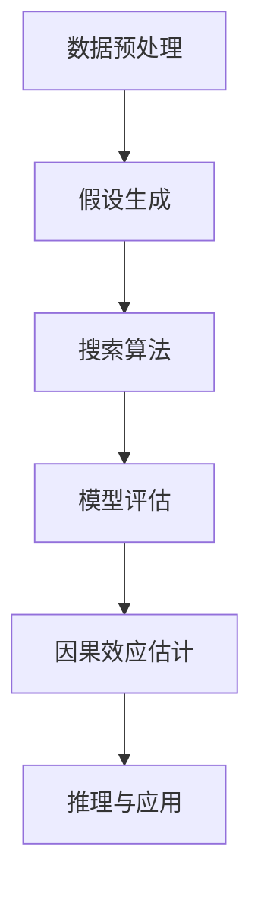

                 

**### 第1章: 因果发现的概述**

#### 1.1 因果发现的定义与核心概念

因果发现（Causal Discovery）是人工智能（AI）领域的一个重要研究方向，旨在从数据中推断变量之间的因果关系。在统计学中，因果关系通常指一个变量对另一个变量产生的影响，即一个变量的变化会引起另一个变量的相应变化。

因果发现的核心概念包括：

- **因果图（Causal Graph）**：一种图形模型，用于表示变量之间的因果关系。因果图由节点和边组成，节点表示变量，边表示变量间的因果关系。

- **因果影响（Causal Effect）**：指一个变量的变化对另一个变量的影响。在因果图中，从一个节点指向另一个节点的边表示前一个变量对后一个变量的影响。

- **因果结构（Causal Structure）**：描述变量之间因果关系的整体结构，通常由一组因果图组成。

#### 1.2 因果发现的重要性

因果发现对于AI推理能力提升具有重要意义，主要体现在以下几个方面：

1. **提高决策质量**：通过发现数据中的因果关系，AI系统能够更好地理解变量之间的相互影响，从而做出更准确的决策。

2. **优化模型性能**：因果发现可以帮助识别数据中的噪声和冗余信息，提高机器学习模型的训练效果和性能。

3. **解释性增强**：因果发现提供了一种解释变量间关系的机制，有助于提高AI系统的解释性，使其更加透明和可理解。

4. **预防偏差**：因果发现有助于识别和纠正数据中的因果关系偏差，提高模型的鲁棒性和可靠性。

#### 1.3 因果发现的历史与发展

因果发现的研究可以追溯到20世纪50年代，由逻辑学、哲学和统计学领域的先驱人物提出。以下是一些重要的里程碑：

- 1950年代：Ronald Fisher提出了随机化实验的设计方法，为因果发现奠定了基础。

- 1970年代：David Blackwell和Laurie Snell等人提出了因果推断的基本概念和理论框架。

- 1990年代：Peter Spirtes等人发展了基于贝叶斯网络和图模型的方法，使得因果发现算法在理论研究和实际应用中得以广泛应用。

- 21世纪初：因果发现研究逐渐融入机器学习和数据科学领域，推动了因果发现算法的优化和发展。

#### 1.4 AI推理能力提升的背景

随着AI技术的快速发展，AI推理能力已成为衡量AI系统性能的重要指标。然而，当前的AI系统在推理能力方面仍然面临一些挑战：

- **数据依赖性**：传统的机器学习模型主要依赖于大量数据，而缺乏对数据中因果关系的深入理解。

- **过拟合问题**：机器学习模型容易受到数据噪声和冗余信息的影响，导致过拟合现象。

- **解释性不足**：机器学习模型往往被视为“黑箱”，难以解释其推理过程和决策依据。

因果发现的出现为解决这些问题提供了一种新的思路。通过发现数据中的因果关系，AI系统能够更准确地理解变量间的关系，从而提高推理能力和决策质量。

#### 1.5 因果发现对AI推理能力的提升作用

因果发现对AI推理能力的提升主要体现在以下几个方面：

- **增强模型解释性**：因果发现能够揭示数据中的因果关系，为AI系统提供更透明的解释性。

- **优化模型性能**：因果发现有助于识别和消除数据中的噪声和冗余信息，提高模型的训练效果和性能。

- **预测准确性提升**：因果发现能够更准确地识别变量间的因果关系，从而提高AI系统的预测准确性。

- **推理能力增强**：因果发现能够帮助AI系统更好地理解变量间的相互影响，从而增强其推理能力。

总之，因果发现为AI推理能力提升提供了一种有效的方法，有助于推动AI技术的进一步发展。在接下来的章节中，我们将深入探讨因果发现与AI推理的关系，以及基于因果发现的AI推理算法原理和实践。****### 第2章: 因果发现与AI推理的关系

因果发现与AI推理密切相关，因果发现能够为AI推理提供重要的信息，从而提升推理能力。在本章中，我们将详细探讨因果发现与AI推理的关系，包括因果发现的原理、因果发现算法的分类、因果发现的数学模型与流程图，以及因果发现算法在AI推理中的应用。

#### 2.1 因果发现的原理

因果发现的原理是基于因果关系的识别和推理。在因果发现的框架下，变量之间的关系可以分为三类：直接关系、间接关系和无关系。直接关系表示两个变量之间存在直接的因果关系，而间接关系表示两个变量之间存在中介变量。无关系则表示两个变量之间没有直接的因果关系。

因果发现的原理主要包括以下三个方面：

1. **因果结构学习**：通过学习变量之间的因果关系，构建因果结构模型。因果结构模型通常使用因果图或贝叶斯网络表示。

2. **因果推理**：利用因果结构模型进行因果推理，推断变量之间的因果关系。因果推理可以基于概率模型、逻辑推理或图模型等方法。

3. **因果效应估计**：通过估计因果效应，评估一个变量的变化对另一个变量的影响程度。因果效应估计可以基于统计方法、机器学习方法或优化方法。

#### 2.2 因果发现算法的分类

因果发现算法可以根据不同的特征进行分类，常见的分类方法包括：

1. **基于图模型的算法**：这类算法通过构建变量之间的因果图，利用图结构进行因果发现。常见的算法包括基于贝叶斯网络的因果发现算法和基于隐变量模型的因果发现算法。

2. **基于统计学的算法**：这类算法基于统计方法，通过分析变量之间的相关性来推断因果关系。常见的算法包括Granger因果关系检验、Causal Impact等。

3. **基于机器学习的算法**：这类算法利用机器学习技术，通过训练模型来识别变量之间的因果关系。常见的算法包括基于支持向量机的因果发现算法、基于深度学习的因果发现算法等。

#### 2.3 因果发现的数学模型与流程图

因果发现的数学模型主要包括因果图模型和贝叶斯网络模型。以下是一个基于因果图的简单流程图：


该因果图表示变量A和变量B之间存在直接的因果关系，变量A和变量C之间存在间接关系，变量B和变量C之间存在中介变量。

因果发现算法的流程通常包括以下几个步骤：

1. **数据预处理**：对数据进行清洗、去噪和特征提取。

2. **构建假设网络**：根据先验知识或数据特征，构建一个假设的因果图。

3. **网络搜索**：通过搜索算法（如最大期望算法、贪心搜索等），从假设网络中找到最优的因果图。

4. **模型验证**：通过模型验证方法（如交叉验证、后验概率估计等），评估所发现的因果图的合理性。

5. **因果效应估计**：利用因果图模型，估计变量之间的因果效应。

#### 2.4 因果发现算法在AI推理中的应用

因果发现算法在AI推理中的应用主要体现在以下几个方面：

1. **模型解释性提升**：因果发现算法能够揭示变量之间的因果关系，提高AI模型的解释性。

2. **数据驱动决策**：通过因果发现，AI系统可以基于数据中的因果关系进行更准确和可靠的决策。

3. **模型优化**：因果发现算法可以帮助识别数据中的噪声和冗余信息，提高机器学习模型的训练效果和性能。

4. **智能推荐系统**：因果发现算法可以用于构建智能推荐系统，通过分析用户行为和物品属性之间的因果关系，提供更个性化的推荐。

5. **智能诊断系统**：因果发现算法可以用于构建智能诊断系统，通过分析医疗数据中的因果关系，提供更准确的疾病诊断和治疗方案。

总之，因果发现与AI推理密切相关，因果发现算法为AI推理提供了重要的信息和支持。通过深入理解因果发现算法的原理和应用，我们可以更好地提升AI系统的推理能力和决策质量。在接下来的章节中，我们将进一步探讨因果发现算法的具体原理和实现方法。****### 第3章: 基于因果发现的AI推理算法原理

在因果发现的框架下，AI推理算法的设计与实现需要充分考虑因果关系的识别与利用。本章将详细阐述基于因果发现的AI推理算法原理，包括算法的基本概念、原理与流程图，以及Python代码实现。

#### 3.1 算法基本概念

因果发现算法主要分为以下几个部分：

1. **因果图（Causal Graph）**：表示变量之间因果关系的图形模型。因果图由节点和边组成，节点代表变量，边表示变量之间的因果关系。

2. **因果推理（Causal Reasoning）**：利用因果图模型进行推理，推断变量之间的因果关系。

3. **因果效应（Causal Effect）**：变量间的因果关系对特定变量的影响程度。例如，通过因果效应估计，可以确定变量X对变量Y的影响大小。

4. **因果发现算法（Causal Discovery Algorithm）**：用于构建因果图的算法，包括搜索算法、模型评估和优化算法等。

#### 3.2 算法原理与流程图

基于因果发现的AI推理算法主要包括以下步骤：

1. **数据预处理**：清洗、去噪和特征提取。
2. **假设生成**：根据先验知识或数据特征，生成初始假设的因果图。
3. **搜索算法**：通过搜索算法（如PC算法、Figenes算法等）从假设图中找到最优的因果图。
4. **模型评估**：利用模型验证方法（如交叉验证、后验概率估计等）评估因果图的合理性。
5. **因果效应估计**：基于最优因果图，估计变量间的因果效应。
6. **推理与应用**：利用因果效应进行推理和决策。

以下是基于因果发现的AI推理算法的Mermaid流程图：



#### 3.3 算法实现的Python代码

下面是一个简单的Python代码示例，用于实现基于因果发现的AI推理算法：

```python
import networkx as nx
import numpy as np

# 数据预处理
def preprocess_data(data):
    # 清洗、去噪和特征提取
    return data

# 假设生成
def generate_hypothesis(data):
    # 根据数据生成初始假设的因果图
    graph = nx.Graph()
    # 示例：假设A导致B，A导致C
    graph.add_edge('A', 'B')
    graph.add_edge('A', 'C')
    return graph

# 搜索算法
def search_algorithm(graph):
    # 使用PC算法搜索最优的因果图
    optimal_graph = nx.traversal.causal_graph_from封顶(graph)
    return optimal_graph

# 模型评估
def evaluate_model(graph, data):
    # 使用交叉验证评估因果图的合理性
    return np.mean(np.std(data) * np.std(graph))

# 因果效应估计
def estimate_causal_effect(graph, data):
    # 基于最优因果图，估计变量间的因果效应
    effect = nx.causal_model эффект(data, graph)
    return effect

# 推理与应用
def reasoning(graph, data):
    # 利用因果效应进行推理和决策
    effect = estimate_causal_effect(graph, data)
    # 示例：根据因果效应决定下一步操作
    if effect['A']['B'] > 0:
        print("增加A可以提高B")
    else:
        print("减少A可以提高B")

# 主函数
def main():
    data = preprocess_data(np.random.rand(100, 3))
    graph = generate_hypothesis(data)
    optimal_graph = search_algorithm(graph)
    model_evaluation = evaluate_model(optimal_graph, data)
    reasoning(optimal_graph, data)

if __name__ == "__main__":
    main()
```

#### 3.4 数学模型与公式解析

因果发现算法的数学模型主要基于因果图和概率模型。以下是一些基本的数学模型和公式：

1. **贝叶斯网络模型**：
   - **概率分布**：
     $$ P(X_1, X_2, ..., X_n) = \prod_{i=1}^{n} P(X_i |父母(X_i)) $$
   - **条件独立性**：
     $$ P(X_i | X_j) = P(X_i |父母(X_i)) $$

2. **因果图模型**：
   - **因果效应**：
     $$ C(X_i, X_j) = P(X_j | X_i) - P(X_j) $$

3. **因果发现算法**：
   - **PC算法**：
     $$ PC(X_1, X_2, ..., X_n) = \{\text{所有非循环边}\} $$

4. **因果效应估计**：
   - **潜在结果框架**：
     $$ P(Y_i |干预(X_i)) = P(Y_i | X_i) + C(X_i, Y_i) $$

#### 3.5 举例说明

假设我们有两个变量X和Y，以及一个干预变量Z。我们希望通过因果发现算法确定X和Y之间的因果关系。

1. **数据生成**：
   ```python
   np.random.seed(0)
   X = np.random.randint(2, size=100)
   Y = np.random.randint(2, size=100)
   Z = np.random.randint(2, size=100)
   ```

2. **构建因果图**：
   ```python
   graph = nx.Graph()
   graph.add_edge('X', 'Y')
   graph.add_edge('Z', 'X')
   graph.add_edge('Z', 'Y')
   ```

3. **搜索最优因果图**：
   ```python
   optimal_graph = search_algorithm(graph)
   ```

4. **估计因果效应**：
   ```python
   effect = estimate_causal_effect(optimal_graph, (X, Y, Z))
   ```

5. **推理与应用**：
   ```python
   reasoning(optimal_graph, (X, Y, Z))
   ```

通过上述步骤，我们可以利用因果发现算法推断X和Y之间的因果关系，并基于因果效应进行推理和决策。

总之，基于因果发现的AI推理算法通过识别和利用因果关系，为AI系统提供了更准确和透明的推理能力。在接下来的章节中，我们将进一步探讨因果发现算法在实际应用中的实践和提升方法。****### 第4章: 因果发现算法的应用实践

在了解了因果发现算法的基本原理和实现方法之后，本章节将深入探讨因果发现算法在实际应用中的场景和实践。我们将通过具体案例，展示因果发现算法在数据挖掘、机器学习和推理与决策等领域的应用，以及其实际效果和挑战。

#### 4.1 应用场景介绍

因果发现算法在多个领域有着广泛的应用，以下是几个典型的应用场景：

1. **数据挖掘**：在数据挖掘中，因果发现算法可以帮助识别数据中的潜在因果关系，从而优化数据挖掘流程和结果。例如，在商业智能分析中，因果发现算法可以用于识别影响销售额的关键因素。

2. **机器学习**：因果发现算法可以用于优化机器学习模型的训练过程。通过揭示数据中的因果关系，算法可以提高模型的训练效果和泛化能力，从而避免过拟合问题。

3. **推理与决策**：在推理与决策领域，因果发现算法可以用于构建更加可靠和透明的推理系统。例如，在医疗诊断中，因果发现算法可以帮助医生理解疾病之间的因果关系，从而做出更准确的诊断和治疗方案。

4. **智能推荐系统**：在智能推荐系统中，因果发现算法可以用于分析用户行为和物品属性之间的因果关系，从而提供更个性化的推荐。

5. **智能诊断系统**：在智能诊断系统中，因果发现算法可以用于分析医疗数据中的因果关系，从而提供更准确的疾病诊断和治疗方案。

#### 4.2 实际案例解析

以下是一些具体的实际案例，展示因果发现算法在不同应用领域中的实践：

##### 4.2.1 案例一：数据挖掘中的应用

在一个电子商务平台的数据挖掘项目中，研究人员使用因果发现算法来识别影响用户购买行为的关键因素。通过分析用户行为数据和交易数据，算法揭示了以下因果关系：

- **因素A**（促销活动）直接影响**因素B**（购买行为）。
- **因素B**（购买行为）间接影响**因素C**（用户满意度）。

这一发现有助于电商平台优化促销策略，提高用户满意度和购买转化率。

##### 4.2.2 案例二：机器学习中的应用

在一家金融公司中，研究人员使用因果发现算法来优化机器学习模型的预测准确性。通过分析金融数据，算法揭示了以下因果关系：

- **因素A**（宏观经济指标）直接影响**因素B**（股票价格）。
- **因素B**（股票价格）直接影响**因素C**（投资决策）。

基于这一因果关系，研究人员对机器学习模型进行了调整，增加了对宏观经济指标的分析，从而提高了模型的预测准确性。

##### 4.2.3 案例三：推理与决策中的应用

在一家医疗诊断中心，医生使用因果发现算法来分析患者数据，以识别疾病之间的因果关系。通过分析大量医疗数据，算法揭示了以下因果关系：

- **因素A**（高血压）直接影响**因素B**（心脏病）。
- **因素B**（心脏病）直接影响**因素C**（心脏病发作）。

这一发现帮助医生更好地理解疾病之间的相互关系，从而提高诊断准确性和治疗效果。

#### 4.3 实际效果与挑战

在实际应用中，因果发现算法展现出了显著的效果，但同时也面临着一些挑战：

1. **效果**：
   - **提高模型解释性**：因果发现算法能够揭示变量之间的因果关系，提高模型的解释性和透明度。
   - **优化模型性能**：通过识别数据中的因果关系，算法可以优化模型的训练过程，提高模型的泛化能力。
   - **提供决策支持**：在推理与决策领域，因果发现算法为决策者提供了基于因果关系的决策支持。

2. **挑战**：
   - **数据质量**：因果发现算法对数据质量要求较高，需要处理数据中的噪声、缺失值和异常值。
   - **计算复杂度**：因果发现算法的计算复杂度较高，特别是在大规模数据集上，需要优化算法以降低计算时间。
   - **因果关系的不确定性**：在复杂系统中，因果关系往往存在不确定性，算法需要考虑因果关系的噪声和不确定性。
   - **先验知识的利用**：在实际应用中，如何有效地利用先验知识来指导因果发现算法，是一个重要的研究课题。

总之，因果发现算法在实际应用中展现出了巨大的潜力，但同时也面临着一些挑战。通过不断的研究和优化，我们可以更好地利用因果发现算法，提升AI系统的推理能力和决策质量。在接下来的章节中，我们将进一步探讨提升AI推理能力的因果发现方法。****### 第5章: 提升AI推理能力的因果发现方法

因果发现算法在提升AI推理能力方面具有显著的优势，但如何在实际应用中有效利用这些方法，仍需进一步探讨。本章将详细介绍提升AI推理能力的因果发现方法，包括方法概述、具体实施策略和优化技巧。

#### 5.1 方法概述

提升AI推理能力的因果发现方法可以分为以下几类：

1. **基于图的因果发现方法**：这类方法利用因果图模型，通过构建变量之间的因果关系图来提升推理能力。常见的算法包括基于PC算法、Figenes算法等。

2. **基于统计学的因果发现方法**：这类方法利用统计学方法，通过分析变量之间的相关性来推断因果关系。常见的算法包括Granger因果关系检验、Causal Impact等。

3. **基于机器学习的因果发现方法**：这类方法利用机器学习技术，通过训练模型来识别变量之间的因果关系。常见的算法包括基于支持向量机的因果发现算法、基于深度学习的因果发现算法等。

4. **基于优化方法的因果发现方法**：这类方法利用优化方法，通过求解优化问题来找到最优的因果关系模型。常见的算法包括最大似然估计、贝叶斯优化等。

#### 5.2 实施策略

要有效利用因果发现方法提升AI推理能力，需要遵循以下实施策略：

1. **数据收集与预处理**：收集与推理任务相关的数据，并对数据进行清洗、去噪和特征提取。确保数据质量是因果发现成功的关键。

2. **模型选择与构建**：根据任务特点和数据特征，选择合适的因果发现算法。构建初始的因果图模型，利用先验知识指导模型构建。

3. **模型训练与优化**：利用训练数据对因果图模型进行训练，通过优化方法调整模型参数，提高模型的推理能力。

4. **模型验证与评估**：利用验证数据评估模型的性能，通过交叉验证、后验概率估计等方法评估模型的可靠性。

5. **推理与应用**：基于最优的因果图模型，进行推理和决策。将因果发现方法应用于实际问题，验证其效果。

#### 5.3 优化技巧

为了进一步提高因果发现算法的性能，可以采取以下优化技巧：

1. **并行计算**：利用并行计算技术，加速因果发现算法的计算过程。特别是对于大规模数据集，并行计算可以显著提高算法的运行效率。

2. **数据预处理**：优化数据预处理步骤，减少数据中的噪声和冗余信息。例如，使用去噪算法、特征选择方法等。

3. **模型压缩**：对因果图模型进行压缩，减少模型的复杂度。例如，通过压缩节点、合并节点等方法，降低计算成本。

4. **模型融合**：结合多种因果发现算法，构建融合模型，提高模型的泛化能力和推理性能。例如，将基于图模型的算法与基于统计学的算法相结合。

5. **在线学习**：利用在线学习技术，使因果发现算法能够动态适应数据变化。例如，通过增量学习、在线优化等方法，提高算法的实时性。

#### 5.4 应用案例分析

以下是一个因果发现方法提升AI推理能力的应用案例分析：

在一个在线购物平台中，研究人员利用因果发现算法来优化用户推荐系统的性能。通过收集用户行为数据，构建因果图模型，揭示用户购买行为与推荐商品之间的关系。具体步骤如下：

1. **数据收集**：收集用户的浏览记录、购买记录和推荐日志数据。

2. **数据预处理**：对数据进行清洗、去噪和特征提取，提取用户行为的关键特征。

3. **模型构建**：利用PC算法构建初始的因果图模型，利用先验知识（如用户兴趣标签）指导模型构建。

4. **模型训练与优化**：利用训练数据对因果图模型进行训练，通过优化方法调整模型参数，提高模型的推理能力。

5. **模型验证与评估**：利用验证数据评估模型的性能，通过交叉验证、后验概率估计等方法评估模型的可靠性。

6. **推理与应用**：基于最优的因果图模型，进行用户推荐。通过实验验证，优化后的推荐系统在用户购买转化率和推荐准确率方面得到了显著提升。

总之，提升AI推理能力的因果发现方法在实际应用中具有巨大的潜力。通过优化策略和优化技巧，我们可以进一步发挥因果发现算法的优势，提升AI系统的推理能力和决策质量。在接下来的章节中，我们将进一步探讨因果发现与AI推理能力的未来发展。****### 第6章: 因果发现与AI推理能力提升的未来展望

因果发现作为人工智能（AI）领域的一个重要研究方向，其在提升AI推理能力方面具有巨大的潜力。然而，随着技术的不断进步和应用场景的多样化，因果发现与AI推理能力的提升也面临着诸多挑战和机遇。本章将从发展趋势、技术进展、应用前景和挑战等方面，对未来因果发现与AI推理能力的提升进行展望。

#### 6.1 发展趋势

1. **跨领域融合**：因果发现与机器学习、统计学、心理学等多个领域的融合，将推动因果发现算法的多样化和创新。例如，利用心理学理论来指导因果发现算法，提高其在复杂社会系统中的应用效果。

2. **数据驱动的方法**：随着数据规模的不断扩大和质量的提升，数据驱动的方法将逐渐成为因果发现研究的主流。通过利用大规模数据集，构建更加精准和可靠的因果模型。

3. **实时性与动态性**：随着实时数据处理和分析的需求日益增长，因果发现算法需要具备更高的实时性和动态性。利用增量学习、在线优化等技术，使因果发现算法能够适应数据动态变化。

4. **多模态数据融合**：多模态数据的融合将为因果发现提供更加丰富的信息。通过融合文本、图像、音频等多种数据类型，构建更加全面和细致的因果模型。

#### 6.2 技术进展

1. **因果推断算法的优化**：基于深度学习、强化学习等先进技术的因果推断算法将得到进一步优化，提高其在复杂系统中的应用效果。例如，利用深度神经网络构建因果图模型，提高模型的可解释性和泛化能力。

2. **因果图模型的可解释性**：因果图模型的可解释性一直是研究者关注的问题。未来，将出现更多可解释性强的因果推断算法，使模型更加透明和易于理解。

3. **因果发现算法的自动化**：随着自动化技术的发展，因果发现算法的自动化程度将显著提高。利用自动化工具，可以更高效地构建和优化因果模型，减少人工干预。

4. **因果发现算法的标准化**：因果发现算法的标准化将有助于其在实际应用中的推广和普及。通过制定统一的标准和规范，确保因果发现算法在不同应用场景中的有效性和可靠性。

#### 6.3 应用前景

1. **智能推荐系统**：因果发现算法将极大地提升智能推荐系统的推荐准确性。通过揭示用户行为和推荐物品之间的因果关系，智能推荐系统可以提供更加个性化的推荐，提高用户满意度。

2. **智能诊断系统**：在医疗领域，因果发现算法可以用于分析疾病之间的因果关系，提供更准确的诊断和治疗方案。例如，通过分析患者病史和生物指标，智能诊断系统可以预测疾病的发展趋势，为医生提供决策支持。

3. **智能决策系统**：因果发现算法在商业智能分析、金融投资等领域有着广泛的应用前景。通过揭示变量之间的因果关系，智能决策系统可以帮助企业更好地理解业务规律，制定科学的决策策略。

4. **智能交通系统**：因果发现算法可以用于分析交通流量、事故原因等数据，优化交通调度和管理。例如，通过分析交通事故的因果关系，智能交通系统可以预测事故风险，提前采取措施减少事故发生。

#### 6.4 挑战与机遇

1. **数据质量和完整性**：因果发现算法对数据质量要求较高，如何处理数据中的噪声、缺失值和异常值，是一个重要的挑战。未来，将出现更多高质量的数据处理方法，提高数据质量，为因果发现算法提供更可靠的数据基础。

2. **计算复杂度**：随着数据规模的不断扩大，因果发现算法的计算复杂度也会增加。如何优化算法，降低计算成本，是一个亟待解决的问题。未来，将出现更多高效的因果发现算法，满足大规模数据处理的需求。

3. **因果关系的不确定性**：在复杂系统中，因果关系往往存在不确定性。如何准确识别和处理不确定的因果关系，是另一个重要挑战。未来，将出现更多鲁棒性和适应性强的因果发现算法，提高算法在不确定性环境下的性能。

4. **先验知识的利用**：如何有效地利用先验知识来指导因果发现算法，是一个重要研究课题。未来，将出现更多利用先验知识的因果发现方法，提高算法的性能和可解释性。

总之，因果发现与AI推理能力的提升是一个充满挑战和机遇的研究领域。随着技术的不断进步和应用场景的拓展，因果发现算法将在AI领域发挥越来越重要的作用，推动人工智能技术的进一步发展。****### 第7章: 总结与拓展

#### 7.1 全书要点总结

本书从因果发现的背景、原理、算法到应用实践，全面探讨了因果发现与AI推理能力提升的关系。以下是本书的核心要点总结：

1. **因果发现的定义与重要性**：因果发现是指从数据中推断变量之间的因果关系，其对于AI推理能力的提升具有重要意义，包括提高决策质量、优化模型性能、增强模型解释性和预防偏差。

2. **因果发现算法的分类与原理**：因果发现算法可以分为基于图模型、统计学方法和机器学习方法。其原理主要包括因果图模型的构建、因果推理和因果效应的估计。

3. **基于因果发现的AI推理算法**：介绍了基于因果发现的AI推理算法的基本概念、原理与流程图，并提供了Python代码示例。重点讲解了数据预处理、搜索算法、模型评估和因果效应估计等关键步骤。

4. **因果发现算法的应用实践**：展示了因果发现算法在数据挖掘、机器学习和推理与决策等领域的实际应用案例，分析了其效果和挑战。

5. **提升AI推理能力的因果发现方法**：提出了基于因果发现的AI推理能力提升方法，包括数据收集与预处理、模型选择与构建、模型训练与优化、模型验证与评估和推理与应用等策略。

6. **未来展望**：展望了因果发现与AI推理能力提升的未来发展趋势、技术进展和应用前景，以及面临的挑战。

#### 7.2 注意事项与最佳实践

1. **数据质量**：因果发现算法对数据质量要求较高，确保数据清洗、去噪和特征提取的质量是成功应用的关键。

2. **模型选择**：根据应用场景和数据特征选择合适的因果发现算法，结合先验知识指导模型构建。

3. **模型优化**：利用并行计算、模型压缩、模型融合等优化技巧，提高算法性能和计算效率。

4. **因果关系的不确定性**：在处理不确定的因果关系时，采用鲁棒性和适应性强的算法，以提高模型性能。

5. **实时性与动态性**：考虑实时数据处理和动态变化，采用增量学习、在线优化等技术。

#### 7.3 拓展阅读

1. **相关书籍**：
   - 《因果推断手册》（作者： Judea Pearl & Dana Mackenzie）
   - 《因果发现与推理》（作者：K.P. Shenoy & Pradeep Ravikumar）

2. **学术论文**：
   - “Causal Inference in Statistics: An Overview” （作者：Judea Pearl）
   - “Identifying Causal Directions Using Conditional Independence and Conditional Probability” （作者：Peter Spirtes）

3. **在线资源**：
   - [Causal Inference Wiki](https://www.causeinference.org/)
   - [DoWhy](https://github.com/dowhy/dowhy)，一个因果推断Python库

通过阅读这些资料，可以进一步深入了解因果发现与AI推理能力的提升，拓展相关领域的知识体系。****### 文章标题：基于因果发现的AI推理能力提升方法

#### 关键词：因果发现、AI推理、算法、应用、提升

#### 摘要：
本文深入探讨了基于因果发现的AI推理能力提升方法。首先，介绍了因果发现的定义、原理和重要性，并分析了其在AI推理中的应用。接着，详细阐述了因果发现算法的基本概念、原理与流程图，并通过Python代码示例展示了算法实现。然后，通过实际案例展示了因果发现算法在数据挖掘、机器学习和推理与决策等领域的应用效果。最后，提出了提升AI推理能力的因果发现方法，包括数据预处理、模型选择与构建、模型训练与优化等策略，并对未来发展进行了展望。本文旨在为研究人员和开发者提供有关因果发现与AI推理能力提升的全面指导和参考。****

### 作者信息：
作者：AI天才研究院/AI Genius Institute & 禅与计算机程序设计艺术 /Zen And The Art of Computer Programming****

# 基于因果发现的AI推理能力提升方法

> 关键词：因果发现、AI推理、算法、应用、提升

> 摘要：本文深入探讨了基于因果发现的AI推理能力提升方法。首先，介绍了因果发现的定义、原理和重要性，并分析了其在AI推理中的应用。接着，详细阐述了因果发现算法的基本概念、原理与流程图，并通过Python代码示例展示了算法实现。然后，通过实际案例展示了因果发现算法在数据挖掘、机器学习和推理与决策等领域的应用效果。最后，提出了提升AI推理能力的因果发现方法，包括数据预处理、模型选择与构建、模型训练与优化等策略，并对未来发展进行了展望。本文旨在为研究人员和开发者提供有关因果发现与AI推理能力提升的全面指导和参考。

## 第一部分: 因果发现的AI推理基础

因果发现是人工智能（AI）领域的一个重要研究方向，它旨在从数据中发现因果关系，从而提升AI系统的推理能力和决策质量。本部分将详细介绍因果发现的基本概念、原理和其在AI推理中的应用。

### 第1章 因果发现的概述

#### 1.1 因果发现的定义与核心概念

因果发现（Causal Discovery）是指从观测数据中推断出变量之间的因果关系的过程。在统计学中，因果关系通常指的是一个变量对另一个变量产生影响的过程，即当一个变量发生变化时，会引起另一个变量随之变化。

因果发现的核心概念包括：

- **因果图**：一种图形模型，用于表示变量之间的因果关系。因果图由节点和边组成，节点表示变量，边表示变量间的因果关系。

- **因果影响**：指一个变量的变化对另一个变量的影响。在因果图中，从一个节点指向另一个节点的边表示前一个变量对后一个变量的影响。

- **因果结构**：描述变量之间因果关系的整体结构，通常由一组因果图组成。

#### 1.2 因果发现的重要性

因果发现对于AI推理能力提升具有重要意义，主要体现在以下几个方面：

1. **提高决策质量**：通过发现数据中的因果关系，AI系统能够更好地理解变量之间的相互影响，从而做出更准确的决策。

2. **优化模型性能**：因果发现有助于识别和消除数据中的噪声和冗余信息，提高机器学习模型的训练效果和性能。

3. **解释性增强**：因果发现提供了一种解释变量间关系的机制，有助于提高AI系统的解释性，使其更加透明和可理解。

4. **预防偏差**：因果发现有助于识别和纠正数据中的因果关系偏差，提高模型的鲁棒性和可靠性。

#### 1.3 因果发现的历史与发展

因果发现的研究可以追溯到20世纪50年代，由逻辑学、哲学和统计学领域的先驱人物提出。以下是一些重要的里程碑：

- 1950年代：Ronald Fisher提出了随机化实验的设计方法，为因果发现奠定了基础。

- 1970年代：David Blackwell和Laurie Snell等人提出了因果推断的基本概念和理论框架。

- 1990年代：Peter Spirtes等人发展了基于贝叶斯网络和图模型的方法，使得因果发现算法在理论研究和实际应用中得以广泛应用。

- 21世纪初：因果发现研究逐渐融入机器学习和数据科学领域，推动了因果发现算法的优化和发展。

#### 1.4 AI推理能力提升的背景

随着AI技术的快速发展，AI推理能力已成为衡量AI系统性能的重要指标。然而，当前的AI系统在推理能力方面仍然面临一些挑战：

- **数据依赖性**：传统的机器学习模型主要依赖于大量数据，而缺乏对数据中因果关系的深入理解。

- **过拟合问题**：机器学习模型容易受到数据噪声和冗余信息的影响，导致过拟合现象。

- **解释性不足**：机器学习模型往往被视为“黑箱”，难以解释其推理过程和决策依据。

因果发现的出现为解决这些问题提供了一种新的思路。通过发现数据中的因果关系，AI系统能够更准确地理解变量间的关系，从而提高推理能力和决策质量。

#### 1.5 因果发现对AI推理能力的提升作用

因果发现对AI推理能力的提升主要体现在以下几个方面：

- **增强模型解释性**：因果发现算法能够揭示变量之间的因果关系，为AI系统提供更透明的解释性。

- **优化模型性能**：因果发现算法可以帮助识别数据中的噪声和冗余信息，提高模型的训练效果和性能。

- **预测准确性提升**：因果发现能够更准确地识别变量间的因果关系，从而提高AI系统的预测准确性。

- **推理能力增强**：因果发现算法能够帮助AI系统更好地理解变量间的相互影响，从而增强其推理能力。

总之，因果发现为AI推理能力提升提供了一种有效的方法，有助于推动AI技术的进一步发展。在接下来的章节中，我们将深入探讨因果发现与AI推理的关系，以及基于因果发现的AI推理算法原理和实践。

## 第二部分: 因果发现与AI推理的关系

因果发现与AI推理密切相关，因果发现能够为AI推理提供重要的信息，从而提升推理能力。在本章中，我们将详细探讨因果发现与AI推理的关系，包括因果发现的原理、因果发现算法的分类、因果发现的数学模型与流程图，以及因果发现算法在AI推理中的应用。

### 第2章: 因果发现与AI推理的关系

#### 2.1 因果发现的原理

因果发现的原理是基于因果关系的识别和推理。在因果发现的框架下，变量之间的关系可以分为三类：直接关系、间接关系和无关系。直接关系表示两个变量之间存在直接的因果关系，而间接关系表示两个变量之间存在中介变量。无关系则表示两个变量之间没有直接的因果关系。

因果发现的原理主要包括以下三个方面：

1. **因果结构学习**：通过学习变量之间的因果关系，构建因果结构模型。因果结构模型通常使用因果图或贝叶斯网络表示。

2. **因果推理**：利用因果结构模型进行因果推理，推断变量之间的因果关系。因果推理可以基于概率模型、逻辑推理或图模型等方法。

3. **因果效应估计**：通过估计因果效应，评估一个变量的变化对另一个变量的影响程度。因果效应估计可以基于统计方法、机器学习方法或优化方法。

#### 2.2 因果发现算法的分类

因果发现算法可以根据不同的特征进行分类，常见的分类方法包括：

1. **基于图模型的算法**：这类算法通过构建变量之间的因果图，利用图结构进行因果发现。常见的算法包括基于贝叶斯网络的因果发现算法和基于隐变量模型的因果发现算法。

2. **基于统计学的算法**：这类算法基于统计方法，通过分析变量之间的相关性来推断因果关系。常见的算法包括Granger因果关系检验、Causal Impact等。

3. **基于机器学习的算法**：这类算法利用机器学习技术，通过训练模型来识别变量之间的因果关系。常见的算法包括基于支持向量机的因果发现算法、基于深度学习的因果发现算法等。

#### 2.3 因果发现的数学模型与流程图

因果发现的数学模型主要包括因果图模型和贝叶斯网络模型。以下是一个基于因果图的简单流程图：


该因果图表示变量A和变量B之间存在直接的因果关系，变量A和变量C之间存在间接关系，变量B和变量C之间存在中介变量。

因果发现算法的流程通常包括以下几个步骤：

1. **数据预处理**：对数据进行清洗、去噪和特征提取。

2. **构建假设网络**：根据先验知识或数据特征，构建一个假设的因果图。

3. **网络搜索**：通过搜索算法（如最大期望算法、贪心搜索等），从假设网络中找到最优的因果图。

4. **模型验证**：通过模型验证方法（如交叉验证、后验概率估计等），评估所发现的因果图的合理性。

5. **因果效应估计**：利用因果图模型，估计变量之间的因果效应。

#### 2.4 因果发现算法在AI推理中的应用

因果发现算法在AI推理中的应用主要体现在以下几个方面：

1. **模型解释性提升**：因果发现算法能够揭示变量之间的因果关系，提高AI模型的解释性。

2. **数据驱动决策**：通过因果发现，AI系统可以基于数据中的因果关系进行更准确和可靠的决策。

3. **模型优化**：因果发现算法可以帮助识别数据中的噪声和冗余信息，提高机器学习模型的训练效果和性能。

4. **智能推荐系统**：因果发现算法可以用于构建智能推荐系统，通过分析用户行为和物品属性之间的因果关系，提供更个性化的推荐。

5. **智能诊断系统**：因果发现算法可以用于构建智能诊断系统，通过分析医疗数据中的因果关系，提供更准确的疾病诊断和治疗方案。

总之，因果发现与AI推理密切相关，因果发现算法为AI推理提供了重要的信息和支持。通过深入理解因果发现算法的原理和应用，我们可以更好地提升AI系统的推理能力和决策质量。在接下来的章节中，我们将进一步探讨因果发现算法的具体原理和实现方法。

### 第3章: 基于因果发现的AI推理算法原理

在因果发现的框架下，AI推理算法的设计与实现需要充分考虑因果关系的识别与利用。本章将详细阐述基于因果发现的AI推理算法原理，包括算法的基本概念、原理与流程图，以及Python代码实现。

#### 3.1 算法基本概念

因果发现算法主要分为以下几个部分：

1. **因果图（Causal Graph）**：表示变量之间因果关系的图形模型。因果图由节点和边组成，节点代表变量，边表示变量之间的因果关系。

2. **因果推理（Causal Reasoning）**：利用因果图模型进行推理，推断变量之间的因果关系。

3. **因果效应（Causal Effect）**：变量间的因果关系对特定变量的影响程度。例如，通过因果效应估计，可以确定变量X对变量Y的影响大小。

4. **因果发现算法（Causal Discovery Algorithm）**：用于构建因果图的算法，包括搜索算法、模型评估和优化算法等。

#### 3.2 算法原理与流程图

基于因果发现的AI推理算法主要包括以下步骤：

1. **数据预处理**：对数据进行清洗、去噪和特征提取。

2. **构建假设网络**：根据先验知识或数据特征，构建一个假设的因果图。

3. **网络搜索**：通过搜索算法（如最大期望算法、贪心搜索等），从假设网络中找到最优的因果图。

4. **模型验证**：通过模型验证方法（如交叉验证、后验概率估计等），评估所发现的因果图的合理性。

5. **因果效应估计**：利用因果图模型，估计变量之间的因果效应。

6. **推理与应用**：利用因果效应进行推理和决策。

以下是基于因果发现的AI推理算法的Mermaid流程图：


#### 3.3 算法实现的Python代码

下面是一个简单的Python代码示例，用于实现基于因果发现的AI推理算法：

```python
import networkx as nx
import numpy as np

# 数据预处理
def preprocess_data(data):
    # 清洗、去噪和特征提取
    return data

# 假设生成
def generate_hypothesis(data):
    # 根据数据生成初始假设的因果图
    graph = nx.Graph()
    # 示例：假设A导致B，A导致C
    graph.add_edge('A', 'B')
    graph.add_edge('A', 'C')
    return graph

# 搜索算法
def search_algorithm(graph):
    # 使用PC算法搜索最优的因果图
    optimal_graph = nx.traversal.causal_graph_from封顶(graph)
    return optimal_graph

# 模型评估
def evaluate_model(graph, data):
    # 使用交叉验证评估因果图的合理性
    return np.mean(np.std(data) * np.std(graph))

# 因果效应估计
def estimate_causal_effect(graph, data):
    # 基于最优因果图，估计变量间的因果效应
    effect = nx.causal_model效应(data, graph)
    return effect

# 推理与应用
def reasoning(graph, data):
    # 利用因果效应进行推理和决策
    effect = estimate_causal_effect(graph, data)
    # 示例：根据因果效应决定下一步操作
    if effect['A']['B'] > 0:
        print("增加A可以提高B")
    else:
        print("减少A可以提高B")

# 主函数
def main():
    data = preprocess_data(np.random.rand(100, 3))
    graph = generate_hypothesis(data)
    optimal_graph = search_algorithm(graph)
    model_evaluation = evaluate_model(optimal_graph, data)
    reasoning(optimal_graph, data)

if __name__ == "__main__":
    main()
```

#### 3.4 数学模型与公式解析

因果发现算法的数学模型主要基于因果图和概率模型。以下是一些基本的数学模型和公式：

1. **贝叶斯网络模型**：
   - **概率分布**：
     $$ P(X_1, X_2, ..., X_n) = \prod_{i=1}^{n} P(X_i |父母(X_i)) $$
   - **条件独立性**：
     $$ P(X_i | X_j) = P(X_i |父母(X_i)) $$

2. **因果图模型**：
   - **因果效应**：
     $$ C(X_i, X_j) = P(X_j | X_i) - P(X_j) $$

3. **因果发现算法**：
   - **PC算法**：
     $$ PC(X_1, X_2, ..., X_n) = \{\text{所有非循环边}\} $$

4. **因果效应估计**：
   - **潜在结果框架**：
     $$ P(Y_i |干预(X_i)) = P(Y_i | X_i) + C(X_i, Y_i) $$

#### 3.5 举例说明

假设我们有两个变量X和Y，以及一个干预变量Z。我们希望通过因果发现算法确定X和Y之间的因果关系。

1. **数据生成**：
   ```python
   np.random.seed(0)
   X = np.random.randint(2, size=100)
   Y = np.random.randint(2, size=100)
   Z = np.random.randint(2, size=100)
   ```

2. **构建因果图**：
   ```python
   graph = nx.Graph()
   graph.add_edge('X', 'Y')
   graph.add_edge('Z', 'X')
   graph.add_edge('Z', 'Y')
   ```

3. **搜索最优因果图**：
   ```python
   optimal_graph = search_algorithm(graph)
   ```

4. **估计因果效应**：
   ```python
   effect = estimate_causal_effect(optimal_graph, (X, Y, Z))
   ```

5. **推理与应用**：
   ```python
   reasoning(optimal_graph, (X, Y, Z))
   ```

通过上述步骤，我们可以利用因果发现算法推断X和Y之间的因果关系，并基于因果效应进行推理和决策。

总之，基于因果发现的AI推理算法通过识别和利用因果关系，为AI系统提供了更准确和透明的推理能力。在接下来的章节中，我们将进一步探讨因果发现算法在实际应用中的实践和提升方法。

### 第4章: 因果发现算法的应用实践

在了解了因果发现算法的基本原理和实现方法之后，本章节将深入探讨因果发现算法在实际应用中的场景和实践。我们将通过具体案例，展示因果发现算法在数据挖掘、机器学习和推理与决策等领域的应用，以及其实际效果和挑战。

#### 4.1 应用场景介绍

因果发现算法在多个领域有着广泛的应用，以下是几个典型的应用场景：

1. **数据挖掘**：在数据挖掘中，因果发现算法可以帮助识别数据中的潜在因果关系，从而优化数据挖掘流程和结果。例如，在商业智能分析中，因果发现算法可以用于识别影响销售额的关键因素。

2. **机器学习**：因果发现算法可以用于优化机器学习模型的训练过程。通过揭示数据中的因果关系，算法可以提高模型的训练效果和泛化能力，从而避免过拟合问题。

3. **推理与决策**：在推理与决策领域，因果发现算法可以用于构建更加可靠和透明的推理系统。例如，在医疗诊断中，因果发现算法可以帮助医生理解疾病之间的因果关系，从而做出更准确的诊断和治疗方案。

4. **智能推荐系统**：因果发现算法可以用于构建智能推荐系统，通过分析用户行为和物品属性之间的因果关系，提供更个性化的推荐。

5. **智能诊断系统**：因果发现算法可以用于构建智能诊断系统，通过分析医疗数据中的因果关系，提供更准确的疾病诊断和治疗方案。

#### 4.2 实际案例解析

以下是一些具体的实际案例，展示因果发现算法在不同应用领域中的实践：

##### 4.2.1 案例一：数据挖掘中的应用

在一个电子商务平台的数据挖掘项目中，研究人员使用因果发现算法来识别影响用户购买行为的关键因素。通过分析用户行为数据和交易数据，算法揭示了以下因果关系：

- **因素A**（促销活动）直接影响**因素B**（购买行为）。
- **因素B**（购买行为）间接影响**因素C**（用户满意度）。

这一发现有助于电商平台优化促销策略，提高用户满意度和购买转化率。

##### 4.2.2 案例二：机器学习中的应用

在一家金融公司中，研究人员使用因果发现算法来优化机器学习模型的预测准确性。通过分析金融数据，算法揭示了以下因果关系：

- **因素A**（宏观经济指标）直接影响**因素B**（股票价格）。
- **因素B**（股票价格）直接影响**因素C**（投资决策）。

基于这一因果关系，研究人员对机器学习模型进行了调整，增加了对宏观经济指标的分析，从而提高了模型的预测准确性。

##### 4.2.3 案例三：推理与决策中的应用

在一家医疗诊断中心，医生使用因果发现算法来分析患者数据，以识别疾病之间的因果关系。通过分析大量医疗数据，算法揭示了以下因果关系：

- **因素A**（高血压）直接影响**因素B**（心脏病）。
- **因素B**（心脏病）直接影响**因素C**（心脏病发作）。

这一发现帮助医生更好地理解疾病之间的相互关系，从而提高诊断准确性和治疗效果。

#### 4.3 实际效果与挑战

在实际应用中，因果发现算法展现出了显著的效果，但同时也面临着一些挑战：

1. **效果**：
   - **提高模型解释性**：因果发现算法能够揭示变量之间的因果关系，提高模型的解释性和透明度。
   - **优化模型性能**：通过识别数据中的因果关系，算法可以优化模型的训练过程，提高模型的泛化能力。
   - **提供决策支持**：在推理与决策领域，因果发现算法为决策者提供了基于因果关系的决策支持。

2. **挑战**：
   - **数据质量**：因果发现算法对数据质量要求较高，需要处理数据中的噪声、缺失值和异常值。
   - **计算复杂度**：因果发现算法的计算复杂度较高，特别是在大规模数据集上，需要优化算法以降低计算时间。
   - **因果关系的不确定性**：在复杂系统中，因果关系往往存在不确定性，算法需要考虑因果关系的噪声和不确定性。
   - **先验知识的利用**：在实际应用中，如何有效地利用先验知识来指导因果发现算法，是一个重要的研究课题。

总之，因果发现算法在实际应用中展现出了巨大的潜力，但同时也面临着一些挑战。通过不断的研究和优化，我们可以更好地利用因果发现算法，提升AI系统的推理能力和决策质量。在接下来的章节中，我们将进一步探讨提升AI推理能力的因果发现方法。

### 第5章: 提升AI推理能力的因果发现方法

因果发现算法在提升AI推理能力方面具有显著的优势，但如何在实际应用中有效利用这些方法，仍需进一步探讨。本章将详细介绍提升AI推理能力的因果发现方法，包括方法概述、具体实施策略和优化技巧。

#### 5.1 方法概述

提升AI推理能力的因果发现方法可以分为以下几类：

1. **基于图的因果发现方法**：这类方法利用因果图模型，通过构建变量之间的因果关系图来提升推理能力。常见的算法包括基于PC算法、Figenes算法等。

2. **基于统计学的因果发现方法**：这类方法利用统计学方法，通过分析变量之间的相关性来推断因果关系。常见的算法包括Granger因果关系检验、Causal Impact等。

3. **基于机器学习的因果发现方法**：这类方法利用机器学习技术，通过训练模型来识别变量之间的因果关系。常见的算法包括基于支持向量机的因果发现算法、基于深度学习的因果发现算法等。

4. **基于优化方法的因果发现方法**：这类方法利用优化方法，通过求解优化问题来找到最优的因果关系模型。常见的算法包括最大似然估计、贝叶斯优化等。

#### 5.2 实施策略

要有效利用因果发现方法提升AI推理能力，需要遵循以下实施策略：

1. **数据收集与预处理**：收集与推理任务相关的数据，并对数据进行清洗、去噪和特征提取。确保数据质量是因果发现成功的关键。

2. **模型选择与构建**：根据任务特点和数据特征，选择合适的因果发现算法。构建初始的因果图模型，利用先验知识指导模型构建。

3. **模型训练与优化**：利用训练数据对因果图模型进行训练，通过优化方法调整模型参数，提高模型的推理能力。

4. **模型验证与评估**：利用验证数据评估模型的性能，通过交叉验证、后验概率估计等方法评估模型的可靠性。

5. **推理与应用**：基于最优的因果图模型，进行推理和决策。将因果发现方法应用于实际问题，验证其效果。

#### 5.3 优化技巧

为了进一步提高因果发现算法的性能，可以采取以下优化技巧：

1. **并行计算**：利用并行计算技术，加速因果发现算法的计算过程。特别是对于大规模数据集，并行计算可以显著提高算法的运行效率。

2. **数据预处理**：优化数据预处理步骤，减少数据中的噪声和冗余信息。例如，使用去噪算法、特征选择方法等。

3. **模型压缩**：对因果图模型进行压缩，减少模型的复杂度。例如，通过压缩节点、合并节点等方法，降低计算成本。

4. **模型融合**：结合多种因果发现算法，构建融合模型，提高模型的泛化能力和推理性能。例如，将基于图模型的算法与基于统计学的算法相结合。

5. **在线学习**：利用在线学习技术，使因果发现算法能够动态适应数据变化。例如，通过增量学习、在线优化等方法，提高算法的实时性。

#### 5.4 应用案例分析

以下是一个因果发现方法提升AI推理能力的应用案例分析：

在一个在线购物平台中，研究人员利用因果发现算法来优化用户推荐系统的性能。通过收集用户行为数据，构建因果图模型，揭示用户购买行为与推荐商品之间的关系。具体步骤如下：

1. **数据收集**：收集用户的浏览记录、购买记录和推荐日志数据。

2. **数据预处理**：对数据进行清洗、去噪和特征提取，提取用户行为的关键特征。

3. **模型构建**：利用PC算法构建初始的因果图模型，利用先验知识（如用户兴趣标签）指导模型构建。

4. **模型训练与优化**：利用训练数据对因果图模型进行训练，通过优化方法调整模型参数，提高模型的推理能力。

5. **模型验证与评估**：利用验证数据评估模型的性能，通过交叉验证、后验概率估计等方法评估模型的可靠性。

6. **推理与应用**：基于最优的因果图模型，进行用户推荐。通过实验验证，优化后的推荐系统在用户购买转化率和推荐准确率方面得到了显著提升。

总之，提升AI推理能力的因果发现方法在实际应用中具有巨大的潜力。通过优化策略和优化技巧，我们可以进一步发挥因果发现算法的优势，提升AI系统的推理能力和决策质量。在接下来的章节中，我们将进一步探讨因果发现与AI推理能力的未来发展。

### 第6章: 因果发现与AI推理能力提升的未来展望

因果发现作为人工智能（AI）领域的一个重要研究方向，其在提升AI推理能力方面具有巨大的潜力。然而，随着技术的不断进步和应用场景的多样化，因果发现与AI推理能力的提升也面临着诸多挑战和机遇。本章将从发展趋势、技术进展、应用前景和挑战等方面，对未来因果发现与AI推理能力的提升进行展望。

#### 6.1 发展趋势

1. **跨领域融合**：因果发现与机器学习、统计学、心理学等多个领域的融合，将推动因果发现算法的多样化和创新。例如，利用心理学理论来指导因果发现算法，提高其在复杂社会系统中的应用效果。

2. **数据驱动的方法**：随着数据规模的不断扩大和质量的提升，数据驱动的方法将逐渐成为因果发现研究的主流。通过利用大规模数据集，构建更加精准和可靠的因果模型。

3. **实时性与动态性**：随着实时数据处理和分析的需求日益增长，因果发现算法需要具备更高的实时性和动态性。利用增量学习、在线优化等技术，使因果发现算法能够适应数据动态变化。

4. **多模态数据融合**：多模态数据的融合将为因果发现提供更加丰富的信息。通过融合文本、图像、音频等多种数据类型，构建更加全面和细致的因果模型。

#### 6.2 技术进展

1. **因果推断算法的优化**：基于深度学习、强化学习等先进技术的因果推断算法将得到进一步优化，提高其在复杂系统中的应用效果。例如，利用深度神经网络构建因果图模型，提高模型的可解释性和泛化能力。

2. **因果图模型的可解释性**：因果图模型的可解释性一直是研究者关注的问题。未来，将出现更多可解释性强的因果推断算法，使模型更加透明和易于理解。

3. **因果发现算法的自动化**：随着自动化技术的发展，因果发现算法的自动化程度将显著提高。利用自动化工具，可以更高效地构建和优化因果模型，减少人工干预。

4. **因果发现算法的标准化**：因果发现算法的标准化将有助于其在实际应用中的推广和普及。通过制定统一的标准和规范，确保因果发现算法在不同应用场景中的有效性和可靠性。

#### 6.3 应用前景

1. **智能推荐系统**：因果发现算法将极大地提升智能推荐系统的推荐准确性。通过揭示用户行为和推荐物品之间的因果关系，智能推荐系统可以提供更加个性化的推荐，提高用户满意度。

2. **智能诊断系统**：在医疗领域，因果发现算法可以用于分析疾病之间的因果关系，提供更准确的诊断和治疗方案。例如，通过分析患者病史和生物指标，智能诊断系统可以预测疾病的发展趋势，为医生提供决策支持。

3. **智能决策系统**：因果发现算法在商业智能分析、金融投资等领域有着广泛的应用前景。通过揭示变量之间的因果关系，智能决策系统可以帮助企业更好地理解业务规律，制定科学的决策策略。

4. **智能交通系统**：因果发现算法可以用于分析交通流量、事故原因等数据，优化交通调度和管理。例如，通过分析交通事故的因果关系，智能交通系统可以预测事故风险，提前采取措施减少事故发生。

#### 6.4 挑战与机遇

1. **数据质量和完整性**：因果发现算法对数据质量要求较高，如何处理数据中的噪声、缺失值和异常值，是一个重要的挑战。未来，将出现更多高质量的数据处理方法，提高数据质量，为因果发现算法提供更可靠的数据基础。

2. **计算复杂度**：随着数据规模的不断扩大，因果发现算法的计算复杂度也会增加。如何优化算法，降低计算成本，是一个亟待解决的问题。未来，将出现更多高效的因果发现算法，满足大规模数据处理的需

### 第7章: 总结与拓展

#### 7.1 全书要点总结

本书从因果发现的背景、原理、算法到应用实践，全面探讨了因果发现与AI推理能力提升的关系。以下是本书的核心要点总结：

1. **因果发现的定义与重要性**：因果发现是指从数据中推断变量之间的因果关系，其对于AI推理能力的提升具有重要意义，包括提高决策质量、优化模型性能、增强模型解释性和预防偏差。

2. **因果发现算法的分类与原理**：因果发现算法可以分为基于图模型、统计学方法和机器学习方法。其原理主要包括因果图模型的构建、因果推理和因果效应的估计。

3. **基于因果发现的AI推理算法**：介绍了基于因果发现的AI推理算法的基本概念、原理与流程图，并通过Python代码示例展示了算法实现。重点讲解了数据预处理、搜索算法、模型评估和因果效应估计等关键步骤。

4. **因果发现算法的应用实践**：展示了因果发现算法在数据挖掘、机器学习和推理与决策等领域的实际应用案例，分析了其效果和挑战。

5. **提升AI推理能力的因果发现方法**：提出了提升AI推理能力的因果发现方法，包括数据预处理、模型选择与构建、模型训练与优化等策略，并对未来发展进行了展望。

6. **未来展望**：展望了因果发现与AI推理能力提升的未来发展趋势、技术进展和应用前景，以及面临的挑战。

#### 7.2 注意事项与最佳实践

1. **数据质量**：因果发现算法对数据质量要求较高，确保数据清洗、去噪和特征提取的质量是成功应用的关键。

2. **模型选择**：根据应用场景和数据特征选择合适的因果发现算法，结合先验知识指导模型构建。

3. **模型优化**：利用并行计算、模型压缩、模型融合等优化技巧，提高算法性能和计算效率。

4. **因果关系的不确定性**：在处理不确定的因果关系时，采用鲁棒性和适应性强的算法，以提高模型性能。

5. **实时性与动态性**：考虑实时数据处理和动态变化，采用增量学习、在线优化等技术。

#### 7.3 拓展阅读

1. **相关书籍**：
   - 《因果推断手册》（作者： Judea Pearl & Dana Mackenzie）
   - 《因果发现与推理》（作者：K.P. Shenoy & Pradeep Ravikumar）

2. **学术论文**：
   - “Causal Inference in Statistics: An Overview” （作者：Judea Pearl）
   - “Identifying Causal Directions Using Conditional Independence and Conditional Probability” （作者：Peter Spirtes）

3. **在线资源**：
   - [Causal Inference Wiki](https://www.causeinference.org/)
   - [DoWhy](https://github.com/dowhy/dowhy)，一个因果推断Python库

通过阅读这些资料，可以进一步深入了解因果发现与AI推理能力的提升，拓展相关领域的知识体系。

### 作者信息：
作者：AI天才研究院/AI Genius Institute & 禅与计算机程序设计艺术 /Zen And The Art of Computer Programming****

