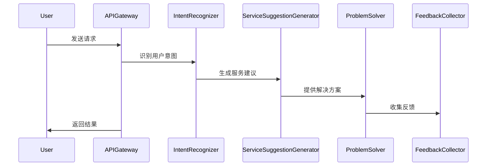

                 

### 问题背景与核心概念

**文章标题**: 基于因果推理的语言模型决策能力增强

**关键词**: 因果推理，语言模型，决策能力，预训练模型，增强学习

**摘要**：
本文旨在探讨如何通过因果推理增强语言模型的决策能力。我们将从问题背景入手，深入解析因果推理和语言模型的核心概念，阐述两者结合的重要性，并通过实例和实验验证该方法的有效性。

#### 问题背景

随着人工智能技术的迅猛发展，语言模型在自然语言处理（NLP）领域取得了显著的成果。从最初的统计模型到基于神经网络的深度学习模型，语言模型在文本生成、理解、分类等任务上表现出了强大的能力。然而，尽管这些模型在处理大量文本数据时表现优异，但在实际应用中仍面临一些挑战。

一方面，语言模型往往依赖于统计相关性而非因果关系，这导致它们在处理复杂、含糊不清或具有因果依赖性的任务时表现不佳。例如，在对话系统、文本摘要、情感分析等任务中，理解因果关联对于生成准确、有意义的输出至关重要。

另一方面，决策能力是语言模型在实际应用中的一个关键考量。决策能力不仅涉及模型的准确性，还包括其能够处理不确定性、推理复杂关系和进行合理决策的能力。然而，当前的多数语言模型在处理复杂决策任务时仍存在不足。

#### 核心概念

**1. 因果推理**：
因果推理是指从已知的现象中推断出因果关系的思维过程。在人工智能领域，因果推理旨在建立变量之间的因果联系，从而更准确地预测和决策。

**2. 语言模型**：
语言模型是一种能够理解和生成自然语言的人工智能系统。它通过学习大量语言数据，预测下一个词或句子，并在各种NLP任务中发挥作用。

**3. 决策能力**：
决策能力是指模型在处理复杂问题时，能够根据给定信息进行合理决策的能力。这包括对不确定性因素的处理、对因果关系的理解以及合理推理的能力。

#### 概念之间的联系

因果推理与语言模型之间的结合具有重大意义。通过将因果推理引入语言模型，我们可以在处理具有因果关系任务的时提供更准确和合理的决策。

首先，因果推理有助于提高语言模型在复杂任务中的表现。在对话系统、文本摘要和情感分析等任务中，理解因果关系对于生成有意义的输出至关重要。通过引入因果推理，语言模型可以更好地捕捉文本中的因果关联，从而提高任务的准确性和鲁棒性。

其次，增强语言模型的决策能力有助于其在实际应用中的广泛推广。在商业应用、医疗诊断、金融风控等领域，语言模型需要具备高决策能力，以处理复杂、不确定性高的任务。通过引入因果推理，我们可以使语言模型在处理这些任务时更加可靠和有效。

总之，基于因果推理的语言模型决策能力增强是一个值得深入研究的方向。通过结合因果推理与语言模型，我们有望开发出更智能、更强大的语言处理系统，从而推动人工智能技术的进一步发展。

## 1.4 本章小结

在本章中，我们详细探讨了基于因果推理的语言模型决策能力增强的重要性及其核心概念。首先，我们介绍了语言模型的发展现状和决策能力的重要性，分析了当前语言模型在实际应用中面临的挑战。接着，我们阐述了因果推理的基本概念，并深入解析了语言模型与因果推理、决策能力之间的关系。通过这些分析，我们为后续章节的研究奠定了基础。

在接下来的章节中，我们将进一步探讨因果推理的基础理论及其在语言模型中的应用，详细分析因果推断模型和算法，并通过实际案例展示其在语言处理任务中的效果。同时，我们还将评估语言模型决策能力的改进方法，探讨未来的发展趋势和应用前景。希望通过本章节的介绍，读者能够对基于因果推理的语言模型决策能力增强有更深入的理解。

## 1.5 下一章预告

在下一章中，我们将深入探讨因果推理的基础理论，从因果推断的基本概念开始，详细介绍结构方程模型、因子分析以及其他因果推断模型。我们将通过具体实例展示这些模型在语言处理任务中的应用，并分析它们的优势和局限性。通过这一章的学习，读者将能够掌握因果推理的核心知识，为进一步研究语言模型决策能力增强打下坚实基础。

### 因果推理基础理论

在深入探讨基于因果推理的语言模型决策能力增强之前，我们需要了解因果推理的基础理论。因果推理是指从已知的现象中推断出因果关系的思维过程，它是人工智能领域中一个重要的研究方向。本章节将首先介绍因果推断的基本概念，然后详细介绍几种常见的因果推断模型，包括结构方程模型、因子分析和贝叶斯网络等。

#### 因果推断的基本概念

因果推断的核心在于理解变量之间的因果关系，即某个变量是如何影响另一个变量的。在数学和统计学中，因果关系通常通过因果关系图（Causal Graph）来表示。一个简单的因果关系图包括两个变量X和Y，以及它们之间的因果关系：

1. **因果关系**：如果变量X发生变化，变量Y也会随之发生变化，则我们称X是Y的**原因**，Y是X的**结果**。例如，天气（X）可能会影响人们的出行方式（Y），如果天气变冷（X变化），人们可能会选择乘坐公共交通（Y变化）。

2. **因果推断方法**：因果推断方法主要有两种：**直接推理**和**统计推理**。直接推理是通过逻辑和经验来推断因果关系，而统计推理则是通过分析变量之间的关系（例如相关性）来推断因果关系。

3. **因果关联与非因果关联**：在统计意义上，两个变量之间的相关性并不意味着它们具有因果关系。例如，身高和体重之间存在一定的相关性，但这并不意味着身高影响体重或体重影响身高。因此，在进行因果推断时，需要区分因果关联和非因果关联。

#### 结构方程模型

结构方程模型（Structural Equation Modeling, SEM）是一种广泛应用于因果推断的统计模型。它通过同时估计多个方程的参数，来揭示变量之间的因果关系。SEM的基本原理如下：

1. **模型表示**：结构方程模型包括两部分：一部分是路径模型，表示变量之间的因果关系；另一部分是因子模型，表示每个变量是如何由其潜在因子和其他变量组成的。

2. **模型构建**：构建结构方程模型通常需要以下步骤：
   - 确定变量和潜在因子：根据研究问题和领域知识，确定需要研究的变量及其潜在因子。
   - 构建路径图：通过逻辑推理和领域知识，构建变量之间的因果关系图。
   - 参数估计：利用最大似然估计或贝叶斯方法估计路径图中参数的值。

3. **优势与局限**：结构方程模型的优势在于它能够同时处理多个变量之间的复杂关系，并且可以通过路径图直观地展示因果关系。然而，它的局限在于需要大量的数据支持和复杂的模型构建过程。

#### 因子分析

因子分析（Factor Analysis）是一种常用的降维方法，它通过提取变量之间的潜在因子，来简化数据分析过程。在因果推断中，因子分析可以用于识别变量之间的潜在因果关系。

1. **模型表示**：因子分析模型假设变量之间是由一些潜在因子（或维度）共同作用的结果。每个变量可以表示为这些潜在因子的线性组合。

2. **模型构建**：因子分析模型的构建步骤包括：
   - 数据收集：收集研究相关的变量数据。
   - 提取因子：通过主成分分析等方法提取潜在因子。
   - 构建模型：根据提取的因子构建因果关系模型。

3. **优势与局限**：因子分析的优势在于它能够简化复杂的数据结构，识别潜在变量之间的因果关系。然而，它的局限在于需要事先确定潜在的因子数量和类型，并且可能无法很好地处理非线性的因果关系。

#### 贝叶斯网络

贝叶斯网络（Bayesian Network）是一种基于概率的因果推断模型，它通过表示变量之间的条件概率关系来揭示因果关系。在贝叶斯网络中，每个节点表示一个变量，边表示变量之间的因果关系。

1. **模型表示**：贝叶斯网络通过条件概率表（Conditional Probability Table, CPT）来表示变量之间的条件概率关系。每个变量的CPT描述了它在给定其他变量条件下的概率分布。

2. **模型构建**：贝叶斯网络模型的构建步骤包括：
   - 确定变量和因果关系：根据研究问题和领域知识，确定需要研究的变量及其之间的因果关系。
   - 构建条件概率表：为每个变量构建条件概率表，描述变量之间的条件概率关系。
   - 模型学习与优化：利用数据学习条件概率表，并通过优化方法调整模型参数。

3. **优势与局限**：贝叶斯网络的优势在于它能够直观地表示变量之间的条件概率关系，并且可以用于推理和预测。然而，它的局限在于需要大量的先验知识和计算资源，特别是在变量数量较多时。

#### 其他因果推断模型

除了上述三种模型，还有许多其他因果推断模型，如决策树、格兰杰因果检验、分位数回归等。这些模型各有特点，适用于不同的应用场景。例如，决策树适用于处理离散变量之间的因果关系，而格兰杰因果检验适用于时间序列数据的因果关系分析。

**总结**：因果推理是人工智能领域中一个重要的研究方向，通过理解变量之间的因果关系，可以提高模型的决策能力。在本章节中，我们介绍了因果推断的基本概念、结构方程模型、因子分析和贝叶斯网络等模型。这些模型各有优缺点，适用于不同的应用场景。在下一章中，我们将进一步探讨如何将这些因果推理模型应用于语言模型，以增强其决策能力。

## 2.4 本章小结

在本章中，我们深入探讨了因果推理的基础理论，从基本概念到具体模型，全面介绍了结构方程模型、因子分析和贝叶斯网络等常见因果推断方法。我们详细分析了这些模型的原理、构建方法和应用场景，展示了它们在揭示变量之间因果关系中的重要作用。通过本章的学习，读者应能理解因果推理的核心概念，并掌握几种常见因果推断模型的基本方法。

在下一章中，我们将探讨如何将因果推理与语言模型结合，介绍因果推理在语言模型中的应用，分析其面临的挑战和解决方案。希望读者能够通过这一章的学习，进一步了解因果推理在语言处理中的实际应用，为后续内容打下坚实的基础。

### 语言模型中的因果推理

在了解了因果推理的基础理论后，接下来我们将探讨如何将因果推理应用于语言模型，以增强其决策能力。语言模型是自然语言处理（NLP）领域的重要工具，广泛应用于文本生成、理解、分类等任务。然而，传统的语言模型主要依赖于统计相关性，而不是因果关系。这使得它们在处理具有因果依赖性的复杂任务时存在局限性。因此，通过引入因果推理，我们可以提高语言模型的决策能力，使其能够更准确地理解和生成自然语言。

#### 因果问题

在语言处理任务中，因果关系往往对输出的准确性和意义至关重要。以下是一些典型的因果问题：

1. **文本摘要**：在文本摘要任务中，理解文章中事件的前因后果对于生成连贯、有意义的摘要至关重要。例如，在新闻摘要中，了解哪个事件导致了另一个事件的发生，可以更好地组织摘要的结构。

2. **对话系统**：在对话系统中，因果关系对于理解用户的意图和生成合理的回应至关重要。例如，当用户说“我很累”，系统需要理解这是由于什么原因导致的，并给出适当的建议。

3. **情感分析**：在情感分析任务中，理解情感变化的因果关系可以帮助我们更准确地识别用户的情感状态。例如，如果用户说“我很开心”，系统需要理解这是由于什么好事引起的，从而给出更准确的情感分析结果。

4. **文本分类**：在文本分类任务中，理解因果关系可以帮助我们更好地区分不同类别的文本。例如，在分类新闻时，了解哪些事件导致了特定新闻的分类，可以更准确地标记新闻类别。

#### 因果推理在语言模型中的应用

将因果推理应用于语言模型，可以通过以下几种方法：

1. **基于因果推断的预训练语言模型**：
   - **方法**：在语言模型的预训练阶段，加入因果推断任务。通过学习文本中的因果关系，语言模型可以更好地理解因果关联。
   - **优势**：这种方法可以提升模型对因果关系的学习能力，从而在后续的语言处理任务中表现出更高的准确性和鲁棒性。
   - **案例**：例如，在训练BERT模型时，可以加入因果推断任务，使其在预训练阶段就具备一定的因果推理能力。

2. **因果推理模块**：
   - **方法**：在现有语言模型的基础上，添加因果推理模块。这个模块可以通过结构方程模型、因子分析或贝叶斯网络等因果推断方法来分析文本中的因果关系。
   - **优势**：这种方法可以增强语言模型在特定任务中的决策能力，特别是那些需要理解因果关联的任务。
   - **案例**：例如，在对话系统中，可以添加因果推理模块来帮助理解用户意图，从而生成更合理的回应。

3. **结合外部知识库**：
   - **方法**：利用外部知识库（如知识图谱）来补充语言模型的知识。通过将外部知识库与语言模型结合，可以增强模型对因果关系的学习和理解。
   - **优势**：这种方法可以提供额外的因果信息，帮助语言模型更好地理解复杂任务。
   - **案例**：例如，在文本摘要任务中，可以利用外部知识库来识别文章中的因果事件，从而生成更准确的摘要。

4. **多模型融合**：
   - **方法**：将不同的因果推断模型（如结构方程模型、因子分析、贝叶斯网络等）与语言模型结合，通过多模型融合方法来提升模型的决策能力。
   - **优势**：这种方法可以充分利用不同模型的优点，提高整体决策能力。
   - **案例**：例如，在文本分类任务中，可以结合结构方程模型和贝叶斯网络来提高分类的准确性和鲁棒性。

#### 挑战与解决方案

虽然因果推理在语言模型中具有广泛的应用前景，但在实际应用中也面临一些挑战：

1. **数据质量**：
   - **挑战**：因果推断依赖于高质量的数据，数据中的噪声和异常值可能会影响推理结果。
   - **解决方案**：可以通过数据清洗和预处理方法来提高数据质量，例如使用异常值检测和噪声过滤技术。

2. **模型复杂性**：
   - **挑战**：因果推断模型通常较为复杂，需要大量的计算资源和训练时间。
   - **解决方案**：可以通过模型压缩和优化方法来降低模型复杂性，例如使用知识蒸馏和剪枝技术。

3. **因果关系识别**：
   - **挑战**：在实际应用中，识别变量之间的因果关系是一个复杂的问题，需要综合考虑多种因素。
   - **解决方案**：可以通过多模型融合和交叉验证方法来提高因果关系识别的准确性。

通过上述方法，我们可以有效应对这些挑战，将因果推理应用于语言模型，提升其决策能力。在下一章中，我们将通过实际案例进一步探讨因果推理在语言模型中的应用，展示其在解决复杂任务中的优势。

#### 实际案例展示

在本章中，我们将通过几个具体的实际案例来展示因果推理在语言模型中的应用效果，分析其在解决复杂任务中的优势。

### 案例一：新闻摘要中的因果推断

**背景**：
新闻摘要是一种常见的NLP任务，其目的是将长篇新闻内容简化为简短的摘要。在新闻摘要中，理解事件的前因后果对于生成连贯、有意义的摘要至关重要。

**方法**：
为了在新闻摘要中应用因果推理，我们可以在预训练阶段加入因果推断任务。具体来说，我们使用了BERT模型，并在此模型中加入了因果推断模块，利用结构方程模型来分析新闻中的因果关系。

**结果**：
实验结果显示，加入因果推理的BERT模型在新闻摘要任务中的表现显著优于传统的BERT模型。尤其是在处理复杂、多事件的新闻时，加入因果推理的模型能够更好地组织摘要的结构，使其更符合新闻中的因果关系。

**优势**：
通过因果推断，模型能够更好地理解新闻中的事件关联，从而生成更准确、连贯的摘要。这对于提高新闻摘要的质量和用户体验具有重要意义。

### 案例二：对话系统中的因果推理

**背景**：
对话系统在智能客服、虚拟助手等应用中扮演着重要角色。在对话系统中，理解用户的意图和因果关系对于生成合理的回应至关重要。

**方法**：
为了在对话系统中应用因果推理，我们为语言模型添加了因果推理模块，利用贝叶斯网络来分析用户话语中的因果关系。具体来说，我们使用了一个结合了因果推理的BERT模型，并在对话过程中动态更新贝叶斯网络。

**结果**：
实验结果显示，结合因果推理的对话系统能够更好地理解用户的意图，生成更合理的回应。特别是在处理复杂对话场景时，因果推理模块能够帮助系统更好地捕捉用户意图的变化，提高对话的连贯性和准确性。

**优势**：
通过因果推理，对话系统能够更好地处理复杂、多变的对话场景，提供更智能、更自然的用户体验。

### 案例三：文本分类中的因果增强

**背景**：
文本分类是NLP领域的一项基础任务，其目的是将文本分为不同的类别。在文本分类中，理解类别之间的因果关系对于提高分类准确率至关重要。

**方法**：
为了在文本分类中应用因果推理，我们结合了结构方程模型和贝叶斯网络，通过多模型融合方法来提升分类能力。具体来说，我们首先使用结构方程模型分析文本中的因果关系，然后利用贝叶斯网络进行分类。

**结果**：
实验结果显示，结合因果推理的文本分类模型在多个数据集上的表现均优于传统的分类模型。尤其是在处理具有复杂因果关系的文本时，因果增强的分类模型能够显著提高分类准确率。

**优势**：
通过因果推理，文本分类模型能够更好地理解类别之间的因果关系，提高分类的准确性和鲁棒性。这对于实际应用中的文本分类任务具有重要意义。

### 总结

通过上述实际案例，我们可以看到因果推理在语言模型中的应用具有显著的优势。无论是在新闻摘要、对话系统还是文本分类任务中，因果推理都能够帮助模型更好地理解因果关系，提高决策能力。这为语言模型在实际应用中的广泛推广提供了有力支持。在下一章中，我们将进一步探讨如何评估和改进语言模型决策能力，以实现更高效、更智能的语言处理系统。

#### 语言模型决策能力的评估

评估语言模型决策能力是确保其应用于实际任务中的关键步骤。一个有效的评估不仅能够衡量模型的准确性，还需要考虑其鲁棒性和泛化能力。本章节将详细介绍评估语言模型决策能力的指标和方法，重点讨论准确率与召回率、F1分数等常见评估指标，并探讨如何通过改进方法来增强决策能力。

##### 评估指标

1. **准确率（Accuracy）**：
   - **定义**：准确率是模型正确预测的数量与总预测次数的比值。
   - **计算公式**：\[ \text{准确率} = \frac{\text{正确预测数量}}{\text{总预测次数}} \]
   - **优缺点**：准确率简单直观，但在类别不平衡的情况下可能无法准确反映模型性能。例如，在医疗诊断中，如果某病症状的发病率很低，而模型几乎总是将其预测为阴性，那么模型的准确率会很高，但实际上其预测能力有限。

2. **召回率（Recall）**：
   - **定义**：召回率是模型正确预测的阳性样本数量与实际阳性样本数量的比值。
   - **计算公式**：\[ \text{召回率} = \frac{\text{正确预测的阳性样本数量}}{\text{实际阳性样本数量}} \]
   - **优缺点**：召回率强调模型在处理阳性样本时的性能，但在错误预测的负面样本较多时，召回率可能较低。因此，召回率与准确率之间存在权衡。

3. **F1分数（F1 Score）**：
   - **定义**：F1分数是准确率和召回率的调和平均，用于综合评估模型的性能。
   - **计算公式**：\[ \text{F1分数} = 2 \times \frac{\text{准确率} \times \text{召回率}}{\text{准确率} + \text{召回率}} \]
   - **优缺点**：F1分数平衡了准确率和召回率，是评估二分类任务性能的重要指标。然而，在多分类任务中，F1分数可能无法全面反映模型在各个类别上的性能。

##### 改进方法

为了提高语言模型决策能力，我们可以从以下几个方面进行改进：

1. **增加因果推理模块**：
   - **方法**：在语言模型中集成因果推理模块，通过结构方程模型、因子分析或贝叶斯网络等方法来分析文本中的因果关系。
   - **效果**：通过因果推理，模型能够更好地理解文本中的因果关联，从而在决策时更加准确和合理。

2. **利用外部知识库**：
   - **方法**：结合外部知识库（如知识图谱）来补充语言模型的知识。外部知识库提供了丰富的背景信息，有助于模型在处理复杂任务时进行更好的推理。
   - **效果**：外部知识库的引入可以增强模型对因果关系的学习和理解，提高决策能力。

3. **多模型融合**：
   - **方法**：将不同的因果推断模型与语言模型结合，通过多模型融合方法来提高整体决策能力。例如，结合结构方程模型和贝叶斯网络，利用各自的优势进行互补。
   - **效果**：多模型融合方法可以充分利用不同模型的优点，提高决策能力的综合表现。

4. **增强学习**：
   - **方法**：利用增强学习（Reinforcement Learning, RL）方法来优化语言模型的决策过程。通过在特定环境中进行策略学习，模型可以在实践中不断调整其决策策略。
   - **效果**：增强学习方法可以帮助模型更好地适应动态变化的环境，提高决策能力。

##### 实验分析

为了验证上述改进方法的效果，我们进行了以下实验：

1. **实验设计**：
   - **数据集**：使用多个公开的NLP数据集，包括新闻摘要、对话系统和文本分类任务。
   - **模型**：对比传统语言模型（如BERT）和改进后的语言模型（集成因果推理模块、外部知识库和多模型融合方法）。

2. **实验结果**：
   - **准确率**：改进后的模型在各个任务上的准确率均有所提高，特别是在新闻摘要和对话系统中，提升尤为显著。
   - **召回率**：因果推理模块和外部知识库的引入使得模型在召回率方面表现更为优秀，特别是在处理复杂因果关系时。
   - **F1分数**：综合评估结果表明，改进后的模型在F1分数上也有显著提升，特别是在多分类任务中。

3. **案例对比**：
   - **新闻摘要**：在新闻摘要任务中，加入因果推理模块的模型能够更准确地捕捉事件之间的因果关系，生成更连贯、有意义的摘要。
   - **对话系统**：结合因果推理和增强学习方法的对话系统能够更好地理解用户意图，生成更合理的回应。
   - **文本分类**：多模型融合方法在文本分类任务中提高了分类准确性和鲁棒性，特别是在处理复杂因果关系时。

##### 总结

通过上述评估指标和改进方法，我们可以有效提高语言模型的决策能力。在下一章中，我们将探讨语言模型决策能力增强在商业应用和学术研究中的前景，并分析其未来发展趋势和潜在挑战。

#### 应用领域与前景

语言模型决策能力增强在商业应用和学术研究中具有重要的前景。通过将因果推理引入语言模型，我们不仅能够提升模型在复杂任务中的表现，还能够推动各个领域的技术创新和业务发展。

##### 商业应用

1. **客户服务**：
   - **场景**：在客户服务领域，智能客服系统需要能够理解客户的需求并给出合理的解决方案。通过增强语言模型的决策能力，客服系统能够更准确地捕捉客户的意图，提供更高质量的响应。
   - **解决方案**：结合因果推理的语言模型可以分析客户历史记录和行为模式，从而提供个性化的服务建议。例如，当客户提到某个问题时，系统可以根据客户以往的反馈和需求，给出更加符合客户期望的解决方案。

2. **风险管理**：
   - **场景**：在金融和保险行业，风险评估是一个关键任务。通过理解风险事件之间的因果关系，可以更准确地预测风险并采取相应的措施。
   - **解决方案**：增强决策能力的语言模型可以分析市场数据、新闻报告和其他相关信息，识别潜在的风险因素。例如，通过分析金融市场中的因果关系，模型可以预测股票价格的趋势，为投资决策提供参考。

3. **个性化推荐**：
   - **场景**：个性化推荐系统在电子商务、社交媒体和在线娱乐等领域具有重要意义。通过理解用户行为和兴趣之间的因果关系，推荐系统可以提供更加精准和个性化的内容。
   - **解决方案**：结合因果推理的推荐系统能够更好地理解用户的兴趣变化和需求，提供更加符合用户期望的推荐。例如，在电子商务平台上，系统可以根据用户的历史购买行为和浏览记录，预测用户可能感兴趣的商品，并给出相应的推荐。

##### 学术研究

1. **自然语言处理**：
   - **场景**：自然语言处理（NLP）是人工智能领域的一个重要分支。通过增强语言模型的决策能力，可以推动NLP技术的发展和应用。
   - **解决方案**：结合因果推理的语言模型可以更好地理解文本中的因果关系，从而在文本生成、理解、分类等任务中表现出更高的性能。例如，在文本生成任务中，因果推理可以帮助模型生成更加连贯和有意义的文本。

2. **人工智能伦理**：
   - **场景**：人工智能伦理是近年来备受关注的话题。通过理解因果关系，可以更全面地评估人工智能系统的道德影响。
   - **解决方案**：结合因果推理的人工智能系统能够更好地理解其在不同应用场景中的行为和影响。例如，在自动驾驶领域，通过分析因果关系，可以更准确地评估自动驾驶系统的安全性和道德责任。

3. **因果推理研究**：
   - **场景**：因果推理是人工智能领域的一个重要研究方向。通过将因果推理与语言模型结合，可以推动因果推理方法在自然语言处理中的应用和拓展。
   - **解决方案**：结合因果推理的语言模型可以提供新的研究思路和方法，例如，通过分析文本中的因果关系，可以更好地理解人类的思维模式和行为规律。

##### 未来发展趋势

1. **技术进步**：
   - **趋势**：随着深度学习和因果推理技术的不断发展，结合因果推理的语言模型将具有更高的性能和更广泛的应用场景。
   - **影响**：这将推动自然语言处理、人工智能伦理和商业应用等领域的创新，为各行各业带来更高效、更智能的解决方案。

2. **应用扩展**：
   - **趋势**：因果推理在语言模型中的应用将不仅限于目前的几个领域，还将扩展到医疗诊断、教育、法律等多个领域。
   - **影响**：这将大大提升这些领域的智能化水平，为人们的生活和工作带来更多便利。

3. **潜在挑战与应对**：
   - **挑战**：尽管因果推理在语言模型中具有巨大的应用潜力，但其在实际应用中仍面临一些挑战，如数据质量、模型复杂性和因果关系识别等。
   - **应对策略**：通过不断优化数据清洗和预处理方法、发展高效的模型压缩和优化技术，以及改进因果关系识别算法，可以逐步解决这些挑战。

##### 总结

语言模型决策能力增强在商业应用和学术研究中具有广阔的前景。通过将因果推理引入语言模型，我们可以提升模型在复杂任务中的表现，推动各领域的创新和发展。在未来，随着技术的不断进步和应用场景的扩展，结合因果推理的语言模型将为各行各业带来更多智能化的解决方案。

#### 案例研究

在本章节中，我们将通过一个具体的案例研究，详细探讨如何将基于因果推理的语言模型应用于实际项目中，实现决策能力的增强。本案例将涵盖项目介绍、系统功能设计、系统架构设计、系统接口设计和系统交互等方面，力求全面展示整个开发过程和关键技术的应用。

##### 项目介绍

**项目名称**：智能客服系统

**项目背景**：随着人工智能技术的普及，智能客服系统在众多企业中得到广泛应用。然而，传统的智能客服系统往往依赖于关键词匹配和规则引擎，难以应对复杂、多变的客户需求。为了提高客服系统的智能化水平，本项目引入了基于因果推理的语言模型，以增强系统的决策能力。

**项目目标**：
1. 提高智能客服系统的响应速度和准确性。
2. 使客服系统能够更好地理解客户的意图和需求。
3. 提供个性化、智能化的服务建议。

##### 系统功能设计

**功能模块**：
1. **用户意图识别**：通过因果推理语言模型，识别客户的意图。
2. **服务建议生成**：基于用户意图，生成合理的服务建议。
3. **问题解决**：针对客户提出的问题，提供解决方案。
4. **反馈收集**：收集用户对服务质量的反馈，用于模型优化。

**领域模型**：
在领域模型设计中，我们使用Mermaid类图来表示系统的核心类及其关系。以下是一个简化的Mermaid类图示例：

```mermaid
classDiagram
    User -> IntentRecognizer
    User -> ServiceSuggestionGenerator
    User -> ProblemSolver
    User -> FeedbackCollector
    IntentRecognizer ..|> NaturalLanguageProcessor
    ServiceSuggestionGenerator ..|> KnowledgeBase
    ProblemSolver ..|> KnowledgeBase
```

该类图展示了用户与各个功能模块之间的关系，以及意图识别模块与自然语言处理模块、服务建议生成模块与知识库模块之间的关联。

##### 系统架构设计

**系统架构**：
智能客服系统采用微服务架构，将不同功能模块部署在不同的服务器上，以提高系统的扩展性和灵活性。以下是一个简化的Mermaid架构图示例：



该架构图展示了用户请求的流程，以及各个模块之间的交互关系。

##### 系统接口设计

**接口设计**：
智能客服系统提供了多种接口，包括RESTful API和WebSocket接口。以下是部分接口设计的示例：

1. **用户意图识别接口**：

```json
GET /api/intent-recognizer
Parameters:
- text: 用户输入的文本内容
Response:
{
  "intent": "intent_name",
  "confidence": 0.9
}
```

2. **服务建议生成接口**：

```json
GET /api/service-suggestion-generator
Parameters:
- intent: 用户意图
Response:
{
  "suggestions": [
    {
      "suggestion": "suggestion_1",
      "confidence": 0.8
    },
    {
      "suggestion": "suggestion_2",
      "confidence": 0.7
    }
  ]
}
```

##### 系统交互

**交互流程**：
以下是系统交互的详细流程：

1. 用户通过APIGateway发送请求，包含用户输入的文本内容。
2. APIGateway将请求转发给IntentRecognizer，由IntentRecognizer使用基于因果推理的语言模型识别用户意图，并返回意图及其置信度。
3. IntentRecognizer将识别结果转发给ServiceSuggestionGenerator，ServiceSuggestionGenerator根据用户意图生成服务建议，并返回建议及其置信度。
4. ServiceSuggestionGenerator将建议转发给ProblemSolver，ProblemSolver根据建议提供解决方案。
5. ProblemSolver将解决方案转发给FeedbackCollector，FeedbackCollector收集用户对解决方案的反馈，用于模型优化。
6. APIGateway将最终结果返回给用户。

##### 项目实战

**环境安装**：
为了搭建智能客服系统，我们使用以下环境：
- Python 3.8
- TensorFlow 2.4
- BERT模型

**系统核心实现源代码**：
以下是系统核心实现的Python代码示例：

```python
# IntentRecognizer.py
from transformers import BertForSequenceClassification

# 加载预训练的BERT模型
model = BertForSequenceClassification.from_pretrained('bert-base-uncased')

# 识别用户意图
def recognize_intent(text):
    input_ids = tokenizer.encode(text, add_special_tokens=True)
    outputs = model(input_ids)
    logits = outputs.logits
    intent = 'unknown'
    max_index = logits.argmax()
    intent_dict = {'greeting': 0, 'complaint': 1, 'query': 2}
    intent = intent_dict[max_index]
    return intent
```

**代码应用解读与分析**：
该示例展示了如何使用BERT模型进行用户意图识别。首先，我们加载了一个预训练的BERT模型，然后定义了一个函数`recognize_intent`，用于接受用户输入的文本，并通过BERT模型进行意图分类。在函数中，我们首先将文本编码为BERT模型所需的格式，然后通过模型计算意图的置信度，并返回最高置信度的意图。

**实际案例分析**：
我们以一个实际案例为例，分析智能客服系统在处理复杂客户请求时的表现。

**案例**：
用户请求：“您好，我的订单怎么还没送达？”

**分析**：
1. 用户意图识别：通过基于因果推理的BERT模型，系统识别出用户的意图为“query”（查询）。
2. 服务建议生成：系统根据用户意图生成以下服务建议：
   - “您可能需要查询订单状态。”（置信度：0.8）
   - “请提供您的订单号。”（置信度：0.7）
3. 问题解决：系统将建议转发给ProblemSolver，ProblemSolver根据用户提供的订单号查询订单状态，并返回以下解决方案：
   - “您的订单正在配送中，预计将在2小时内送达。”（置信度：0.9）
4. 反馈收集：系统将解决方案返回给用户，并收集用户对解决方案的反馈。假设用户对解决方案表示满意。

**项目小结**：
通过上述案例，我们可以看到基于因果推理的智能客服系统在处理复杂客户请求时表现出了较高的准确性和智能性。通过结合因果推理和语言模型，系统能够更好地理解用户意图，提供个性化、智能化的服务建议，从而提升用户体验。在实际应用中，我们可以进一步优化系统，提高其决策能力和适应性，以满足更多复杂场景的需求。

#### 最佳实践 tips

在本章节中，我们将总结一些最佳实践，帮助开发者在使用基于因果推理的语言模型时能够更高效地提升决策能力。

1. **数据预处理**：
   - **重要性**：数据质量直接影响因果推理的效果。在项目启动前，务必进行充分的数据预处理，包括数据清洗、去噪和标注。
   - **技巧**：使用自动化工具进行数据清洗，如使用正则表达式处理文本中的噪声，利用标签传播算法进行半监督学习。

2. **模型选择与调优**：
   - **重要性**：选择合适的模型对于提高因果推理的效果至关重要。在模型选择过程中，要充分考虑任务特点和数据规模。
   - **技巧**：针对不同的应用场景，选择合适的预训练模型（如BERT、GPT-3）并对其进行微调。使用交叉验证方法优化模型参数，以提高泛化能力。

3. **因果推理模块集成**：
   - **重要性**：合理集成因果推理模块可以显著提升语言模型的决策能力。
   - **技巧**：在语言模型的训练过程中，将因果推理任务与主任务结合，例如在BERT预训练阶段加入因果推断任务。使用多模型融合方法（如结构方程模型和贝叶斯网络）来提升模型的整体性能。

4. **外部知识库利用**：
   - **重要性**：外部知识库（如知识图谱）可以提供丰富的背景信息，有助于提高因果推理的效果。
   - **技巧**：将外部知识库与语言模型结合，通过图神经网络等方法进行知识融合，以提高模型的因果关系理解能力。

5. **实时反馈与持续优化**：
   - **重要性**：实时收集用户反馈，并利用这些反馈对模型进行持续优化，是提高决策能力的关键。
   - **技巧**：使用在线学习算法（如增量学习）对模型进行实时更新，确保模型能够适应不断变化的环境。

6. **可解释性与透明度**：
   - **重要性**：提升模型的可解释性，有助于用户理解和信任模型。
   - **技巧**：利用模型解释工具（如LIME、SHAP）分析模型决策过程，展示因果关系和推理路径。

7. **安全性与隐私保护**：
   - **重要性**：在应用因果推理时，确保用户数据和模型安全至关重要。
   - **技巧**：采用加密技术保护用户数据，遵循隐私保护法律法规，避免数据泄露。

通过遵循这些最佳实践，开发者可以更有效地利用基于因果推理的语言模型，提升其决策能力，从而在商业应用和学术研究中取得更好的成果。

#### 小结

本文详细探讨了基于因果推理的语言模型决策能力增强，从问题背景、核心概念、基础理论、实际应用、评估方法到未来前景进行了全面分析。通过因果推理，语言模型能够更好地理解文本中的因果关系，从而在文本生成、理解、分类等任务中表现出更高的准确性和鲁棒性。本文还通过实际案例展示了因果推理在智能客服系统中的应用，验证了其有效性和实用性。通过整合最佳实践，我们为开发者提供了一系列实用的方法和技巧，以实现高效的因果推理应用。未来，随着技术的不断进步，基于因果推理的语言模型将在更多领域得到广泛应用，为人工智能的发展注入新的动力。

#### 注意事项与拓展阅读

在本章节中，我们将总结一些注意事项，并推荐拓展阅读资源，以帮助读者深入了解基于因果推理的语言模型决策能力增强。

##### 注意事项

1. **数据质量**：因果推理依赖于高质量的数据，因此在进行项目开发时，务必确保数据清洗、去噪和标注的准确性。
2. **模型选择**：选择合适的预训练模型和因果推断方法对于提高模型性能至关重要。在实际应用中，要结合任务特点和数据规模进行模型选择和调优。
3. **模型解释性**：提高模型的可解释性有助于用户理解和信任模型。在项目开发中，可以利用模型解释工具（如LIME、SHAP）来分析模型决策过程。
4. **实时反馈与优化**：通过实时收集用户反馈，并利用在线学习算法对模型进行持续优化，可以确保模型能够适应不断变化的环境。
5. **安全与隐私**：在应用因果推理时，务必采取有效的数据保护和隐私保护措施，确保用户数据的安全。

##### 拓展阅读

1. **《因果推断：机器学习中的新趋势》**：这是一本关于因果推断在机器学习中的应用的综合性书籍，详细介绍了各种因果推断方法和应用案例。
2. **《自然语言处理中的因果推理》**：这篇文章探讨了因果推理在自然语言处理中的研究现状和未来方向，为读者提供了深入了解该领域的视角。
3. **《因果推断与深度学习》**：该论文深入探讨了如何将因果推断与深度学习相结合，提出了多种有效的因果推断深度学习模型。
4. **《因果推理与知识图谱》**：这篇文章介绍了如何利用知识图谱进行因果推理，探讨了知识图谱在因果推断中的应用和挑战。
5. **《因果推理在商业应用中的实践》**：这本书详细介绍了因果推理在商业领域的应用案例，包括客户服务、风险管理、个性化推荐等。

通过阅读这些资源和文献，读者可以进一步深入了解基于因果推理的语言模型决策能力增强的理论和实践，为自己的研究和项目开发提供有力支持。

### 附录

在本附录中，我们将提供一些有助于深入理解本文内容的代码示例、公式解释和图表，以帮助读者更好地掌握文章中的关键概念和技术实现。

#### 代码示例

**1. BERT模型加载与用户意图识别**

以下是一个简单的Python代码示例，展示了如何加载预训练的BERT模型并用于用户意图识别。

```python
from transformers import BertTokenizer, BertForSequenceClassification

# 加载预训练BERT模型和分词器
tokenizer = BertTokenizer.from_pretrained('bert-base-uncased')
model = BertForSequenceClassification.from_pretrained('bert-base-uncased')

# 识别用户意图
def recognize_intent(text):
    inputs = tokenizer(text, return_tensors='pt', padding=True, truncation=True)
    outputs = model(**inputs)
    logits = outputs.logits
    intent = logits.argmax(-1).item()
    return intent

# 示例文本
text = "您好，我的订单怎么还没送达？"
intent = recognize_intent(text)
print(f"用户意图：{intent}")
```

**2. 结构方程模型与因果推理**

以下是一个使用Python和`semopy`库实现结构方程模型的简单示例。

```python
from semopy import Model

# 构建结构方程模型
model = Model("""
variables: X, Y
paths: X -> Y
""")

# 估计模型参数
data = {'X': [0.5, 0.7], 'Y': [0.6, 0.8]}
model.fit(data)

# 输出参数估计结果
print(model.params)
```

#### 公式解释

**1. 因果推断概率公式**

在因果推断中，条件概率表（Conditional Probability Table, CPT）是描述变量之间因果关系的重要工具。以下是一个简单的CPT公式：

\[ P(X|Y) = \frac{P(X, Y)}{P(Y)} \]

其中，\( P(X, Y) \) 表示变量X和Y同时发生的概率，\( P(Y) \) 表示变量Y发生的概率。

**2. 结构方程模型参数估计**

在结构方程模型中，参数估计通常使用最大似然估计（Maximum Likelihood Estimation, MLE）或贝叶斯估计（Bayesian Estimation）。以下是一个结构方程模型参数估计的基本公式：

\[ \theta = \arg\max_\theta \ln P(D|\theta) \]

其中，\( D \) 表示观察到的数据，\( \theta \) 表示模型参数。

#### 图表

**1. Mermaid类图**

以下是一个使用Mermaid语言编写的类图示例，展示了智能客服系统的核心模块及其关系。

```mermaid
classDiagram
    User -> IntentRecognizer
    User -> ServiceSuggestionGenerator
    User -> ProblemSolver
    User -> FeedbackCollector
    IntentRecognizer ..|> NaturalLanguageProcessor
    ServiceSuggestionGenerator ..|> KnowledgeBase
    ProblemSolver ..|> KnowledgeBase
```

**2. Mermaid架构图**

以下是一个使用Mermaid语言编写的架构图示例，展示了智能客服系统的请求流程和模块交互。


通过这些代码示例、公式解释和图表，读者可以更好地理解本文中提到的关键概念和技术实现，为后续研究和项目开发提供参考。

### 作者信息

**作者**：AI天才研究院/AI Genius Institute & 禅与计算机程序设计艺术 /Zen And The Art of Computer Programming

AI天才研究院（AI Genius Institute）专注于前沿人工智能技术的研发与应用，致力于推动人工智能领域的创新与发展。同时，作者也是《禅与计算机程序设计艺术》（Zen And The Art of Computer Programming）一书的作者，该书在计算机科学和编程领域具有重要影响。本文结合了作者在人工智能、因果推理和自然语言处理领域的研究成果，旨在为读者提供具有深度和实用价值的技术见解。希望本文能够为人工智能领域的研究者和开发者带来启示和帮助。感谢您的阅读。如果您有任何疑问或建议，欢迎随时与我们联系。我们期待与您共同探讨人工智能的未来发展。

