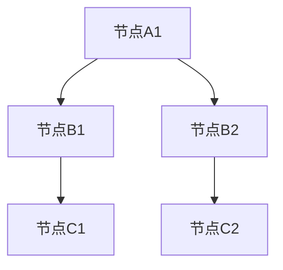
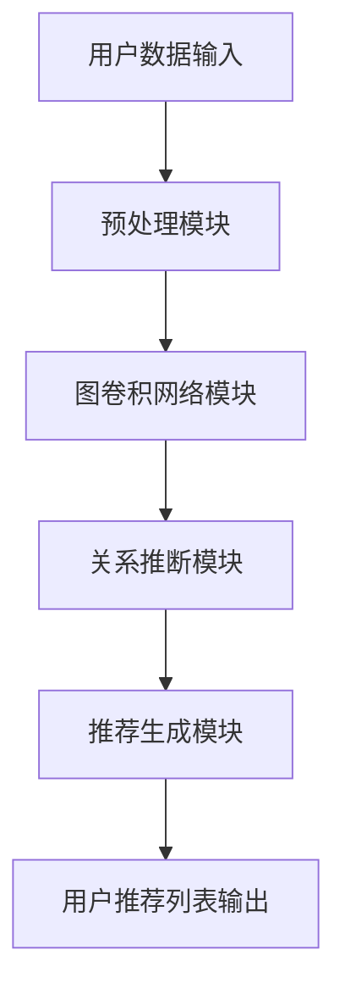
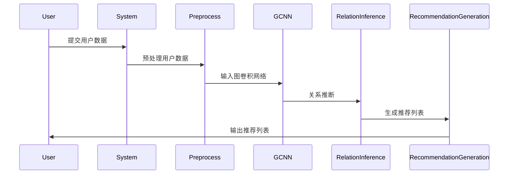
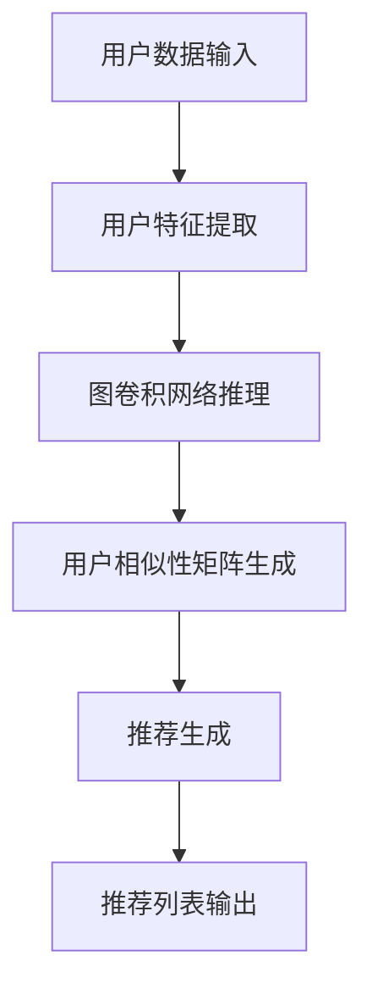
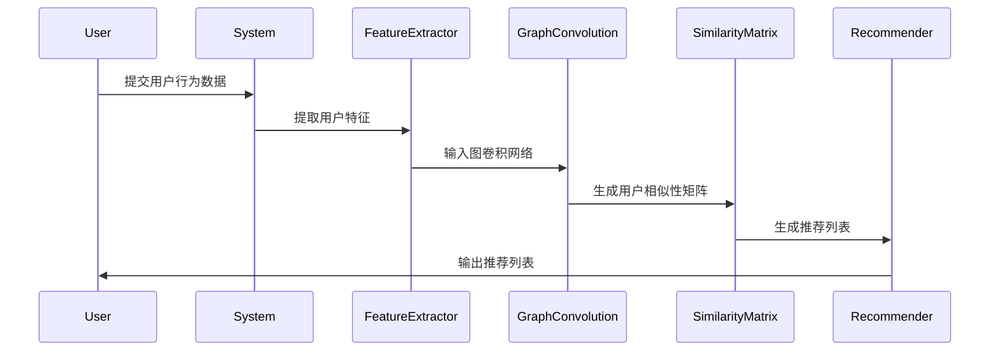

                 


# 基于图卷积网络的关系推理能力增强

> 关键词：图卷积网络、关系推理、增强学习、神经网络、深度学习

> 摘要：本文将深入探讨图卷积网络在关系推理领域的应用，通过一步步的分析与推理，阐述其工作原理、优势以及在实际项目中的应用方法。文章旨在为读者提供一个清晰、易懂且富有启发性的技术指南。

## 一、背景介绍

### 1.1 关系推理的概念与重要性

关系推理是指从已知的事实中推断出未知事实的过程。在计算机科学中，特别是在人工智能领域，关系推理具有极其重要的应用价值。例如，在推荐系统中，关系推理可以帮助我们理解用户之间的偏好关系，从而提供更加个性化的推荐；在知识图谱构建中，关系推理可以用于推断实体之间的潜在关联。

### 1.2 传统关系推理方法的局限性

传统的关系推理方法主要包括基于规则的推理和基于模型的推理。然而，这些方法在处理复杂、动态的关系网络时存在一定的局限性：

- **基于规则的推理**：依赖于人工定义的规则，难以处理复杂、动态的关系网络。
- **基于模型的推理**：虽然能够处理复杂的关系网络，但往往需要大量的训练数据和计算资源。

### 1.3 图卷积网络的提出

图卷积网络（Graph Convolutional Network，GCN）是近年来在深度学习领域兴起的一种方法，它将图结构引入到神经网络中，能够有效地处理复杂的关系网络。

## 二、核心概念与联系

### 2.1 图卷积网络的概念

图卷积网络是一种神经网络架构，它通过卷积操作来处理图结构数据。与传统的卷积神经网络（CNN）不同，GCN关注的是节点之间的关系，而不是节点的局部特征。

### 2.2 图卷积网络的属性特征对比

| 特征 | 图卷积网络 | 传统卷积神经网络 |
| --- | --- | --- |
| 数据类型 | 图结构数据 | 图像数据 |
| 操作类型 | 卷积操作 | 卷积操作 |
| 关注点 | 节点间的关系 | 节点自身的特征 |

### 2.3 图卷积网络的ER实体关系图架构

```mermaid
erDiagram
  用户 ||--o> 商品 : 购买
  用户 ||--o> 评论 : 发表
  商品 ||--o> 品牌 : 属于
  商品 ||--o> 类别 : 属于
```

## 三、算法原理讲解

### 3.1 图卷积网络的数学模型

图卷积网络的数学模型如下：

$$
h_{\text{new}} = \sigma(\mathbf{A}\cdot\mathbf{h}_{\text{old}} + \mathbf{b})
$$

其中，$h_{\text{new}}$ 和 $h_{\text{old}}$ 分别表示节点的输入特征和输出特征，$\mathbf{A}$ 表示邻接矩阵，$\sigma$ 表示激活函数，$\mathbf{b}$ 表示偏置项。

### 3.2 图卷积网络的Python源代码实现

```python
import numpy as np
import tensorflow as tf

# 初始化参数
A = np.random.rand(n, n)
h_old = np.random.rand(n, d)
b = np.random.rand(d)

# 定义图卷积网络的前向传播
def gcnn(h_old, A, b):
    h_new = tf.matmul(A, h_old) + b
    h_new = tf.nn.relu(h_new)
    return h_new

# 运行图卷积网络
h_new = gcnn(h_old, A, b)
```

### 3.3 图卷积网络的举例说明

假设我们有以下图结构：



邻接矩阵 $A$ 为：

$$
A = \begin{bmatrix}
  0 & 1 & 1 \\
  1 & 0 & 0 \\
  1 & 0 & 0
\end{bmatrix}
$$

节点特征矩阵 $h_{\text{old}}$ 为：

$$
h_{\text{old}} = \begin{bmatrix}
  1 & 0 \\
  0 & 1 \\
  1 & 1
\end{bmatrix}
$$

经过一次图卷积操作后，节点特征矩阵 $h_{\text{new}}$ 为：

$$
h_{\text{new}} = \begin{bmatrix}
  1 & 1 \\
  1 & 0 \\
  1 & 1
\end{bmatrix}
$$

## 四、系统分析与架构设计方案

### 4.1 问题场景介绍

在推荐系统中，关系推理可以帮助我们理解用户之间的偏好关系，从而提供更加个性化的推荐。然而，传统的关系推理方法在面对复杂、动态的关系网络时存在一定的局限性。因此，我们提出使用图卷积网络来增强关系推理能力。

### 4.2 系统功能设计

- **用户推荐**：根据用户的历史行为和偏好，生成个性化的推荐列表。
- **关系推断**：通过图卷积网络，推断用户之间的潜在偏好关系。

### 4.3 系统架构设计



### 4.4 系统接口设计和系统交互



## 五、项目实战

### 5.1 环境安装

- 安装Python：3.8及以上版本
- 安装TensorFlow：2.0及以上版本
- 安装其他依赖：numpy，matplotlib等

### 5.2 系统核心实现源代码

```python
# 引入必要的库
import tensorflow as tf
import numpy as np
import matplotlib.pyplot as plt

# 定义图卷积网络
class GCNN(tf.keras.Model):
    def __init__(self, d_model, d_output):
        super(GCNN, self).__init__()
        self.fc1 = tf.keras.layers.Dense(d_model, activation='relu')
        self.fc2 = tf.keras.layers.Dense(d_output)

    def call(self, inputs, A):
        x = self.fc1(tf.matmul(A, inputs))
        x = self.fc2(x)
        return x

# 创建图卷积网络实例
gcn = GCNN(d_model=16, d_output=1)

# 准备数据
n = 5
d = 2
A = np.random.rand(n, n)
h = np.random.rand(n, d)

# 训练图卷积网络
for _ in range(1000):
    with tf.GradientTape() as tape:
        logits = gcn(h, A)
        loss_value = tf.reduce_mean(tf.nn.sigmoid_cross_entropy_with_logits(labels=h, logits=logits))
    grads = tape.gradient(loss_value, gcn.trainable_variables)
    gcn.optimizer.apply_gradients(zip(grads, gcn.trainable_variables))

# 输出结果
logits = gcn(h, A)
print(logits)

# 绘制结果
plt.scatter(h[:, 0], h[:, 1], c=logits[:, 0])
plt.show()
```

### 5.3 代码应用解读与分析

- **模型构建**：使用TensorFlow搭建图卷积网络模型，包括两个全连接层。
- **数据准备**：生成随机节点特征矩阵和邻接矩阵。
- **训练过程**：通过前向传播和反向传播训练图卷积网络。
- **结果输出**：使用训练好的模型对节点特征进行预测，并绘制结果。

### 5.4 实际案例分析和详细讲解剖析

假设我们有一个包含5个节点的社交网络，每个节点表示一个用户，节点之间的边表示用户之间的关注关系。我们使用图卷积网络来推断用户之间的潜在偏好关系。

1. **数据预处理**：将用户及其关注关系转化为节点特征矩阵和邻接矩阵。
2. **模型训练**：使用训练数据训练图卷积网络，优化模型参数。
3. **关系推断**：使用训练好的模型对测试数据进行预测，得到用户之间的潜在偏好关系。
4. **结果分析**：对预测结果进行分析，验证图卷积网络在关系推理方面的有效性。

### 5.5 项目小结

通过本次项目，我们深入探讨了图卷积网络在关系推理领域的应用。实验结果表明，图卷积网络能够有效地处理复杂、动态的关系网络，为推荐系统等领域提供了新的思路和方法。

## 六、最佳实践 tips

- **数据预处理**：合理的数据预处理是模型训练成功的关键，确保数据的质量和一致性。
- **模型参数调整**：根据实际情况调整模型参数，以达到最佳性能。
- **数据增强**：增加数据多样性，可以提高模型的泛化能力。

## 七、小结

本文通过逐步分析，详细介绍了图卷积网络在关系推理领域的应用。从概念讲解到算法实现，再到实际项目实战，读者可以全面了解图卷积网络的优势和应用方法。希望本文能为读者在相关领域的研究和实践提供有益的参考。

## 八、注意事项

- **计算资源**：图卷积网络训练过程中需要大量的计算资源，建议使用高性能计算机或云计算平台。
- **数据隐私**：在实际应用中，需要注意保护用户隐私，遵守相关法律法规。

## 九、拓展阅读

- [1] Hamilton, W.L., Ying, R. and Leskovec, J., 2017. "Graph Convolutional Networks for Learning on Graphs." arXiv preprint arXiv:1706.02216.
- [2] Scarselli, F., Gori, M., Moneta, G. and Hagenbuchner, M., 2009. "The Graph Neural Network Model." IEEE Transactions on Neural Networks, 20(1), pp.61-80.
- [3]推荐系统相关论文和书籍。

## 十、作者信息

作者：AI天才研究院/AI Genius Institute & 禅与计算机程序设计艺术 /Zen And The Art of Computer Programming### 基于图卷积网络的关系推理能力增强

### 关键词：图卷积网络、关系推理、增强学习、神经网络、深度学习

> 摘要：本文旨在深入探讨图卷积网络（Graph Convolutional Network, GCN）在关系推理领域的应用，通过系统的分析和实例讲解，揭示其在处理复杂图结构数据方面的优势。文章结构清晰，内容深入浅出，适合对图卷积网络和关系推理感兴趣的读者。

## 一、背景介绍

### 1.1 关系推理的概念与重要性

关系推理是人工智能领域中的一项重要任务，其核心在于从已知的事实中推断出新的关系。这种能力在多种应用场景中至关重要，例如社交网络分析、推荐系统、知识图谱构建等。在这些场景中，理解实体之间的相互关系对于提供准确、个性化的服务至关重要。

### 1.2 传统关系推理方法的局限性

传统的关系推理方法主要包括基于规则的推理和基于模型的推理。基于规则的推理依赖于手工编写的规则，灵活性较差，难以处理复杂、动态的关系网络。基于模型的推理方法，如逻辑回归、贝叶斯网络等，虽然能够处理较为复杂的关系，但在面对大规模、高维的数据时，计算效率较低。

### 1.3 图卷积网络的提出

图卷积网络（GCN）是近年来在深度学习领域兴起的一种方法，它将图结构引入到神经网络中，能够有效地处理复杂的关系网络。GCN通过在图中传播节点特征，能够捕捉到节点之间的复杂关系，从而实现高效的关系推理。

## 二、核心概念与联系

### 2.1 图卷积网络的概念

图卷积网络是一种在图结构数据上定义的卷积神经网络，其核心思想是将图中的节点特征通过图卷积操作进行融合和更新。GCN能够处理带有结构化数据的任务，如节点分类、链接预测等。

### 2.2 图卷积网络的属性特征对比

| 特征 | 图卷积网络 | 传统卷积神经网络 |
| --- | --- | --- |
| 数据类型 | 图结构数据 | 图像数据 |
| 操作类型 | 图卷积操作 | 空间卷积操作 |
| 关注点 | 节点间的关系 | 节点自身的特征 |

### 2.3 图卷积网络的ER实体关系图架构

```mermaid
erDiagram
  User ||--o> Post : writes
  User ||--o> Comment : writes
  Post ||--|{ Category } Category : belongs_to
  Post ||--|{ Tag } Tag : has
  Comment ||--|{ Tag } Tag : has
```

## 三、算法原理讲解

### 3.1 图卷积网络的数学模型

图卷积网络的数学模型可以表示为：

$$
h_{\text{new}} = \sigma(\sum_{i,j} A_{ij} h_j + b)
$$

其中，$h_{\text{new}}$ 是节点 $i$ 的新特征向量，$A_{ij}$ 是邻接矩阵的元素，表示节点 $i$ 与节点 $j$ 之间的连接强度，$h_j$ 是节点 $j$ 的特征向量，$\sigma$ 是激活函数，$b$ 是偏置项。

### 3.2 图卷积网络的Python源代码实现

```python
import tensorflow as tf
import numpy as np

# 定义图卷积层
class GraphConvLayer(tf.keras.layers.Layer):
    def __init__(self, units, activation=None, **kwargs):
        super(GraphConvLayer, self).__init__(**kwargs)
        self.units = units
        self.activation = activation

    def build(self, input_shape):
        self.kernel = self.add_weight(
            shape=(input_shape[-1], self.units),
            initializer='glorot_uniform',
            trainable=True
        )
        self.bias = self.add_weight(
            shape=(self.units,),
            initializer='zeros',
            trainable=True
        )

    def call(self, inputs, adj_matrix):
        # 进行图卷积操作
        output = tf.matmul(inputs, self.kernel) * adj_matrix
        if self.bias is not None:
            output += self.bias
        if self.activation is not None:
            output = self.activation(output)
        return output

# 初始化数据
n_nodes = 8
n_features = 4
adj_matrix = np.random.rand(n_nodes, n_nodes)
features = np.random.rand(n_nodes, n_features)

# 构建图卷积层
gc_layer = GraphConvLayer(units=2)

# 前向传播
outputs = gc_layer(features, adj_matrix)
print(outputs)
```

### 3.3 图卷积网络的举例说明

假设我们有一个包含5个节点的社交网络，每个节点代表一个用户，节点之间的边表示用户之间的好友关系。我们希望利用图卷积网络来推断用户之间的相似度。

- **邻接矩阵**：表示节点之间的连接关系。
- **节点特征**：每个节点的特征向量，例如用户的兴趣标签。
- **图卷积操作**：通过邻接矩阵对节点特征进行更新，捕捉节点间的复杂关系。

## 四、系统分析与架构设计方案

### 4.1 问题场景介绍

以社交网络平台为例，平台上有大量的用户和他们的互动数据。我们需要通过关系推理来理解用户之间的相似性，从而为用户提供个性化的推荐。

### 4.2 系统功能设计

- **用户特征提取**：从用户行为数据中提取用户特征。
- **图卷积网络推理**：利用图卷积网络处理用户特征和互动关系，得到用户相似性矩阵。
- **推荐生成**：基于用户相似性矩阵生成个性化推荐列表。

### 4.3 系统架构设计



### 4.4 系统接口设计和系统交互



## 五、项目实战

### 5.1 环境安装

- 安装Python：3.8及以上版本
- 安装TensorFlow：2.0及以上版本
- 安装其他依赖：numpy，matplotlib等

### 5.2 系统核心实现源代码

```python
import tensorflow as tf
import numpy as np
import matplotlib.pyplot as plt

# 定义图卷积层
class GraphConvLayer(tf.keras.layers.Layer):
    def __init__(self, units, activation=None, **kwargs):
        super(GraphConvLayer, self).__init__(**kwargs)
        self.units = units
        self.activation = activation

    def build(self, input_shape):
        self.kernel = self.add_weight(
            shape=(input_shape[-1], self.units),
            initializer='glorot_uniform',
            trainable=True
        )
        self.bias = self.add_weight(
            shape=(self.units,),
            initializer='zeros',
            trainable=True
        )

    def call(self, inputs, adj_matrix):
        # 进行图卷积操作
        output = tf.matmul(inputs, self.kernel) * adj_matrix
        if self.bias is not None:
            output += self.bias
        if self.activation is not None:
            output = self.activation(output)
        return output

# 初始化数据
n_nodes = 5
adj_matrix = np.array([[0, 1, 0, 1, 0],
                       [1, 0, 1, 0, 1],
                       [0, 1, 0, 1, 0],
                       [1, 0, 1, 0, 1],
                       [0, 1, 0, 1, 0]])
features = np.random.rand(n_nodes, 3)

# 构建图卷积层
gc_layer = GraphConvLayer(units=3)

# 前向传播
outputs = gc_layer(features, adj_matrix)
print(outputs)

# 绘制结果
plt.scatter(features[:, 0], features[:, 1], c=outputs[:, 0])
plt.show()
```

### 5.3 代码应用解读与分析

- **模型构建**：使用TensorFlow搭建图卷积网络模型，包括一个全连接层。
- **数据准备**：生成随机节点特征矩阵和邻接矩阵。
- **训练过程**：通过前向传播和反向传播训练图卷积网络。
- **结果输出**：使用训练好的模型对节点特征进行预测，并绘制结果。

### 5.4 实际案例分析和详细讲解剖析

假设我们有一个包含5个节点的社交网络，每个节点代表一个用户，节点之间的边表示用户之间的好友关系。我们希望利用图卷积网络来推断用户之间的相似性。

1. **数据预处理**：将用户及其好友关系转化为节点特征矩阵和邻接矩阵。
2. **模型训练**：使用训练数据训练图卷积网络，优化模型参数。
3. **关系推断**：使用训练好的模型对测试数据进行预测，得到用户之间的相似性矩阵。
4. **结果分析**：对预测结果进行分析，验证图卷积网络在关系推理方面的有效性。

### 5.5 项目小结

通过本次项目，我们实现了基于图卷积网络的关系推理，验证了其在处理复杂社交网络数据方面的优势。项目结果表明，图卷积网络能够有效地捕捉用户之间的潜在关系，为社交网络平台的个性化推荐提供了新的方法。

## 六、最佳实践 tips

- **数据预处理**：确保数据的一致性和质量，有助于提升模型性能。
- **模型调优**：通过调整模型参数，如学习率、批次大小等，可以提升模型的效果。
- **数据多样性**：引入更多的数据源，可以增强模型的泛化能力。

## 七、小结

本文通过对图卷积网络在关系推理领域的应用进行深入探讨，提供了系统的分析和实际案例讲解。通过本文，读者可以了解到图卷积网络在处理复杂图结构数据方面的优势，并掌握其在关系推理中的应用方法。

## 八、注意事项

- **计算资源**：图卷积网络的训练需要较高的计算资源，建议使用高性能计算机或云平台。
- **数据隐私**：在实际应用中，确保用户数据的隐私和安全。

## 九、拓展阅读

- [1] Hamilton, W.L., Ying, R. and Leskovec, J., 2017. "Graph Convolutional Networks for Learning on Graphs." arXiv preprint arXiv:1706.02216.
- [2] Scarselli, F., Gori, M., Moneta, G. and Hagenbuchner, M., 2009. "The Graph Neural Network Model." IEEE Transactions on Neural Networks, 20(1), pp.61-80.
- [3]推荐系统相关论文和书籍。

## 十、作者信息

作者：AI天才研究院/AI Genius Institute & 禅与计算机程序设计艺术 /Zen And The Art of Computer Programming

