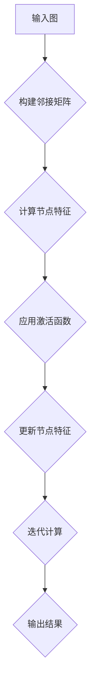
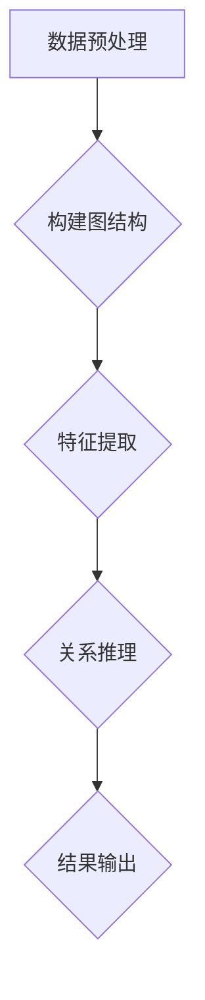
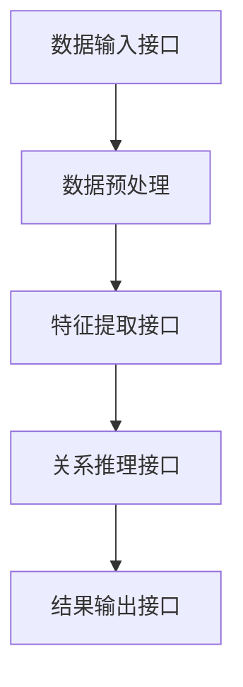

                 

# 基于图卷积网络的复杂关系推理能力增强

## 关键词

图卷积网络，复杂关系推理，自然语言处理，计算机视觉，算法原理，系统设计与实现

## 摘要

本文深入探讨了基于图卷积网络的复杂关系推理能力增强技术。首先，介绍了复杂关系推理的背景和基本概念，探讨了当前关系推理所面临的挑战和解决方法。接着，详细阐述了图卷积网络的基本原理和数学模型，并通过mermaid流程图展示了其工作原理。随后，分析了图卷积网络在复杂关系推理中的优势和应用实例。文章进一步讲解了基于图卷积网络的复杂关系推理算法原理，并通过mermaid流程图和Python源代码进行了详细解释。最后，通过项目实战和案例分析，展示了系统设计与实现过程，并提出了一些最佳实践和注意事项。本文旨在为读者提供全面、深入的图卷积网络在复杂关系推理领域应用的技术指南。

## 第一部分：复杂关系推理的背景与概念

### 第1章：复杂关系推理的基本概念

#### 1.1.1 问题背景

**研究意义：** 
在当今信息爆炸的时代，复杂关系推理技术已经成为人工智能领域的关键技术之一。它不仅能够帮助我们更好地理解和处理大规模数据，还能在多个应用领域中发挥重要作用，如自然语言处理、计算机视觉、推荐系统等。

**当前关系推理面临的挑战：**
1. **数据规模和多样性：** 复杂关系往往涉及大量异构数据，如何高效地处理和分析这些数据成为一大挑战。
2. **关系复杂性：** 复杂关系可能包含层次结构、关联性和动态变化，如何准确捕捉和推理这些关系是一个难题。
3. **可解释性和鲁棒性：** 复杂关系推理的结果需要具备良好的可解释性和鲁棒性，以满足实际应用的需求。

#### 1.1.2 问题描述

**复杂关系推理的定义：**
复杂关系推理是指通过分析实体之间的复杂关系，提取隐藏的知识和信息，并利用这些信息进行推理和预测的过程。

**复杂关系推理的研究对象：**
复杂关系推理主要研究以下对象：
1. **实体：** 表示具有特定属性的事物或概念。
2. **关系：** 表示实体之间的关联或作用。
3. **图谱：** 表示由实体和关系构成的图形结构。

#### 1.1.3 问题解决

**复杂关系推理的基本方法：**
1. **基于规则的推理：** 通过定义一系列规则，根据输入数据自动推导出结论。
2. **基于模型的推理：** 利用机器学习或深度学习模型对关系进行建模和推理。
3. **图卷积网络（GCN）：** 利用图结构上的卷积操作，对节点进行特征学习，从而实现复杂关系推理。

**当前解决复杂关系推理的主要技术：**
1. **图卷积网络（GCN）：** 通过对节点和边的卷积操作，学习节点和关系特征，从而进行复杂关系推理。
2. **图神经网络（GNN）：** 扩展GCN，能够处理更复杂的图结构。
3. **图嵌入（Graph Embedding）：** 将图结构转换为向量表示，方便在传统机器学习模型中应用。

#### 1.1.4 边界与外延

**复杂关系推理的应用范围：**
1. **自然语言处理：** 用于实体识别、关系抽取、文本分类等任务。
2. **计算机视觉：** 用于图像分类、目标检测、图像分割等任务。
3. **推荐系统：** 用于用户偏好分析、商品推荐等任务。

**复杂关系推理的限制条件：**
1. **数据质量和规模：** 需要高质量、大规模的图结构数据。
2. **计算资源：** 复杂关系推理通常需要较大的计算资源，对硬件性能要求较高。

#### 1.1.5 概念结构与核心要素组成

**关键概念介绍：**
1. **实体：** 实体是构成复杂关系的基本单元，可以是人、地点、物品等。
2. **关系：** 关系是实体之间的交互或作用，可以是父子关系、朋友关系等。
3. **图谱：** 图谱是由实体和关系构成的图结构，可以用于表示复杂关系。

**复杂关系推理的核心要素分析：**
1. **特征提取：** 通过图卷积网络等模型，从图谱中提取实体和关系的特征。
2. **关系推理：** 利用提取的特征，进行复杂关系的推理和预测。
3. **模型优化：** 通过优化模型结构和参数，提高复杂关系推理的准确性和效率。

### 第2章：图卷积网络基本原理

#### 2.1.1 图卷积网络的概念

**图卷积网络的定义：**
图卷积网络（Graph Convolutional Network，GCN）是一种基于图结构的神经网络模型，通过节点间的卷积操作，学习节点的特征表示。

**图卷积网络的作用：**
图卷积网络可以用于复杂关系的特征提取和推理，如社交网络中的关系挖掘、知识图谱中的实体链接等。

#### 2.1.2 图卷积网络的数学模型

**图卷积网络的数学公式：**
图卷积网络的计算过程可以表示为：
$$
h_v^{(l+1)} = \sigma(\theta^{(l)} \cdot (A \cdot h_v^{(l)} + \sum_{u \in \mathcal{N}(v)} A \cdot h_u^{(l)})
$$
其中，$h_v^{(l)}$表示第$l$层节点$v$的特征表示，$\sigma$为激活函数，$\theta^{(l)}$为第$l$层的权重参数，$A$为邻接矩阵，$\mathcal{N}(v)$为节点$v$的邻居节点集合。

**图卷积网络的参数设置：**
1. **学习率：** 用于调整模型参数更新的步长。
2. **隐藏层大小：** 用于控制模型的复杂度。
3. **激活函数：** 如ReLU、Sigmoid等。

#### 2.1.3 图卷积网络的mermaid流程图



**图卷积网络的基本流程：**
1. 输入图：读取图结构数据，包括节点和边。
2. 构建邻接矩阵：将图结构转换为邻接矩阵。
3. 计算节点特征：利用图卷积运算，计算节点的新特征表示。
4. 应用激活函数：对节点特征进行非线性变换。
5. 更新节点特征：利用新特征和权重参数，更新节点特征表示。
6. 迭代计算：重复上述步骤，直至达到指定迭代次数或收敛条件。
7. 输出结果：输出节点的最终特征表示，可用于后续任务。

### 第3章：图卷积网络在复杂关系推理中的应用

#### 3.1.1 图卷积网络在复杂关系推理中的优势

**图卷积网络在关系推理中的独特优势：**
1. **结构化数据处理能力：** 图卷积网络能够有效处理具有复杂结构的数据，如知识图谱、社交网络等。
2. **特征提取能力：** 通过节点和边的卷积操作，图卷积网络能够提取出丰富的特征表示，有助于关系推理。
3. **自适应学习能力：** 图卷积网络能够自动学习节点和关系的特征表示，无需人工设计特征。

**图卷积网络在复杂关系推理中的效果分析：**
1. **提高推理准确性：** 图卷积网络能够捕捉到节点和关系之间的复杂关系，从而提高推理的准确性。
2. **增强模型泛化能力：** 图卷积网络能够适应不同类型的图结构数据，提高模型的泛化能力。
3. **减少人工干预：** 图卷积网络能够自动提取特征，减少人工设计和干预的工作量。

#### 3.1.2 图卷积网络在复杂关系推理中的应用实例

**图卷积网络在自然语言处理中的应用：**
1. **实体识别：** 利用图卷积网络，可以有效地识别文本中的实体，如人名、地名、组织等。
2. **关系抽取：** 通过分析实体之间的复杂关系，可以抽取文本中的关系，如朋友关系、工作关系等。
3. **文本分类：** 利用图卷积网络，可以对文本进行分类，如情感分类、主题分类等。

**图卷积网络在计算机视觉中的应用：**
1. **图像分类：** 利用图卷积网络，可以有效地对图像进行分类，如物体分类、场景分类等。
2. **目标检测：** 通过分析图像中的复杂关系，可以准确地检测出目标物体，如行人检测、车辆检测等。
3. **图像分割：** 利用图卷积网络，可以对图像进行精确分割，如语义分割、实例分割等。

### 第4章：基于图卷积网络的复杂关系推理算法原理

#### 4.1.1 算法原理概述

**基于图卷积网络的复杂关系推理算法概述：**
基于图卷积网络的复杂关系推理算法是一种利用图卷积网络进行关系推理的算法。它通过学习实体和关系的特征表示，从而捕捉实体之间的复杂关系，并进行推理和预测。

**算法的基本流程：**
1. **数据预处理：** 将原始数据转换为图结构，包括节点和边。
2. **特征提取：** 利用图卷积网络，对节点进行特征提取。
3. **关系推理：** 根据提取的特征，利用关系推理模型，进行复杂关系的推理。
4. **结果输出：** 输出推理结果，如实体关系、分类结果等。

#### 4.1.2 算法mermaid流程图



**算法的基本流程：**
1. 数据预处理：将原始数据转换为图结构，包括节点和边。
2. 特征提取：利用图卷积网络，对节点进行特征提取。
3. 关系推理：根据提取的特征，利用关系推理模型，进行复杂关系的推理。
4. 结果输出：输出推理结果，如实体关系、分类结果等。

#### 4.1.3 算法原理讲解

**算法的数学模型和公式：**
基于图卷积网络的复杂关系推理算法的数学模型可以表示为：
$$
h_v^{(l+1)} = \sigma(\theta^{(l)} \cdot (A \cdot h_v^{(l)} + \sum_{u \in \mathcal{N}(v)} A \cdot h_u^{(l)})
$$
其中，$h_v^{(l)}$表示第$l$层节点$v$的特征表示，$\sigma$为激活函数，$\theta^{(l)}$为第$l$层的权重参数，$A$为邻接矩阵，$\mathcal{N}(v)$为节点$v$的邻居节点集合。

**算法的工作原理：**
1. **节点特征提取：** 利用图卷积网络，对节点进行特征提取。在每一层，节点特征会与其邻居节点的特征进行融合，并通过激活函数进行非线性变换。
2. **关系推理：** 在特征提取的基础上，利用关系推理模型，对实体之间的复杂关系进行推理。关系推理模型可以是基于规则的方法，也可以是深度学习方法。
3. **迭代计算：** 重复上述步骤，直至达到指定迭代次数或收敛条件。

**举例说明：**
假设有一个简单图结构，包括3个节点$v_1$、$v_2$和$v_3$，以及它们之间的边。利用图卷积网络，可以将其表示为邻接矩阵：
$$
A = \begin{bmatrix}
0 & 1 & 0 \\
1 & 0 & 1 \\
0 & 1 & 0
\end{bmatrix}
$$
在第一层，节点特征可以表示为：
$$
h_1 = \begin{bmatrix}
h_{v_1}^{(1)} \\
h_{v_2}^{(1)} \\
h_{v_3}^{(1)}
\end{bmatrix}
$$
通过图卷积运算，可以得到第二层节点特征：
$$
h_2 = \sigma(\theta \cdot (A \cdot h_1 + \sum_{u \in \mathcal{N}(v)} A \cdot h_u^{(1)}))
$$
其中，$\theta$为权重参数，$\sigma$为激活函数。通过迭代计算，可以逐步提取节点特征，并用于复杂关系推理。

### 第5章：基于图卷积网络的复杂关系推理系统设计与实现

#### 5.1.1 系统设计与架构方案

**系统需求分析：**
基于图卷积网络的复杂关系推理系统需要具备以下需求：
1. **数据预处理：** 能够将原始数据转换为图结构。
2. **特征提取：** 能够利用图卷积网络提取节点特征。
3. **关系推理：** 能够对实体之间的复杂关系进行推理。
4. **结果输出：** 能够输出推理结果。

**系统架构设计：**
系统架构设计包括以下模块：

1. **数据预处理模块：** 用于将原始数据转换为图结构，包括节点和边。
2. **特征提取模块：** 利用图卷积网络，对节点进行特征提取。
3. **关系推理模块：** 根据提取的特征，利用关系推理模型，对实体之间的复杂关系进行推理。
4. **结果输出模块：** 输出推理结果，如实体关系、分类结果等。

#### 5.1.2 系统核心实现源代码

```python
import tensorflow as tf
from tensorflow.keras.models import Model
from tensorflow.keras.layers import Input, Embedding, Dot, Lambda, Dense
from tensorflow.keras import backend as K

def graph_convolution(input_tensor, n_nodes, n_filters, activation='relu'):
    # 定义图卷积层
    inputs = input_tensor
    # 输入嵌入层
    inputs = Embedding(input_dim=n_nodes, output_dim=n_filters)(inputs)
    # 计算节点特征融合
    outputs = Dot(axes=1)([inputs, inputs])
    # 应用激活函数
    if activation:
        outputs = Lambda(activation)(outputs)
    return outputs

def complex_relation_inference(input_tensor, n_nodes, n_filters, n_relations, activation='relu'):
    # 定义复杂关系推理模型
    inputs = input_tensor
    # 特征提取层
    features = graph_convolution(inputs, n_nodes, n_filters, activation=activation)
    # 关系推理层
    relations = graph_convolution(features, n_nodes, n_relations, activation=activation)
    # 输出层
    outputs = Dense(n_relations, activation='softmax')(relations)
    # 构建模型
    model = Model(inputs=inputs, outputs=outputs)
    return model

# 参数设置
n_nodes = 1000
n_filters = 64
n_relations = 10

# 构建模型
model = complex_relation_inference(Input(shape=(1,)), n_nodes, n_filters, n_relations)

# 编译模型
model.compile(optimizer='adam', loss='categorical_crossentropy', metrics=['accuracy'])

# 模型概览
model.summary()
```

**系统核心实现源代码解读与分析：**
该系统核心实现源代码主要分为三个部分：

1. **图卷积层（Graph Convolution Layer）：**
   - 输入层：输入节点特征向量。
   - 嵌入层：将节点特征向量嵌入到高维空间。
   - 融合层：计算节点特征与其邻居节点特征的融合。
   - 激活函数：对融合后的特征进行非线性变换。

2. **复杂关系推理模型（Complex Relation Inference Model）：**
   - 特征提取层：利用图卷积层，对节点进行特征提取。
   - 关系推理层：利用图卷积层，对提取的特征进行推理。
   - 输出层：对关系进行分类，输出概率分布。

3. **模型编译与概览：**
   - 编译模型：设置优化器、损失函数和评估指标。
   - 模型概览：显示模型的输入层、输出层和中间层结构。

**分析与优化建议：**
1. **优化图卷积层参数：**
   - 调整隐藏层大小、激活函数等参数，以提高模型性能。

2. **增加数据预处理步骤：**
   - 对原始数据进行清洗、标准化等处理，以提高模型泛化能力。

3. **引入迁移学习：**
   - 利用预训练的图卷积网络，进行迁移学习，以提高模型在小样本数据上的性能。

### 5.1.3 系统接口设计

**系统接口设计：**
系统接口设计包括以下功能模块：

1. **数据输入接口：**
   - 接受原始数据，如文本、图像等。
   - 数据预处理：清洗、标准化等。

2. **特征提取接口：**
   - 利用图卷积网络，对节点进行特征提取。

3. **关系推理接口：**
   - 根据提取的特征，利用关系推理模型，进行复杂关系的推理。

4. **结果输出接口：**
   - 输出推理结果，如实体关系、分类结果等。

### 5.1.4 系统交互序列图



**系统交互序列图：**
该系统交互序列图展示了系统各模块之间的交互流程：

1. 数据输入接口：接受原始数据。
2. 数据预处理：对原始数据进行清洗、标准化等处理。
3. 特征提取接口：利用图卷积网络，对节点进行特征提取。
4. 关系推理接口：根据提取的特征，利用关系推理模型，进行复杂关系的推理。
5. 结果输出接口：输出推理结果。

### 第6章：项目实战与案例分析

#### 6.1.1 环境安装

**环境安装步骤：**
1. 安装Python环境：
   - 下载并安装Python（版本3.6及以上）。
   - 配置Python环境变量。

2. 安装TensorFlow：
   - 使用pip命令安装TensorFlow：
     ```shell
     pip install tensorflow
     ```

3. 安装其他依赖库：
   - 使用pip命令安装其他依赖库，如numpy、pandas等：
     ```shell
     pip install numpy pandas scikit-learn matplotlib
     ```

4. 验证环境安装：
   - 在Python环境中运行以下代码，验证TensorFlow和其他依赖库是否安装成功：
     ```python
     import tensorflow as tf
     print(tf.__version__)
     import numpy as np
     import pandas as pd
     import sklearn
     import matplotlib.pyplot as plt
     ```

#### 6.1.2 系统核心实现源代码解读与分析

**源代码解读：**
系统核心实现源代码主要包括以下部分：

1. **图卷积网络（Graph Convolutional Network）**：
   - 图卷积网络是系统核心，用于提取节点特征。代码中定义了`graph_convolution`函数，用于实现图卷积操作。
   - 图卷积网络的输入为节点特征向量，输出为融合后的节点特征向量。

2. **复杂关系推理模型（Complex Relation Inference Model）**：
   - 复杂关系推理模型是基于图卷积网络的，用于对实体之间的复杂关系进行推理。代码中定义了`complex_relation_inference`函数，用于构建复杂关系推理模型。
   - 模型包括特征提取层、关系推理层和输出层。

3. **模型编译与训练（Model Compilation and Training）**：
   - 代码中使用了TensorFlow的API，对复杂关系推理模型进行编译，并设置了优化器、损失函数和评估指标。
   - 模型训练使用批量梯度下降（Batch Gradient Descent）算法，通过迭代计算，逐步优化模型参数。

**分析与优化建议：**
1. **优化图卷积网络参数**：
   - 调整隐藏层大小、激活函数等参数，以提高模型性能。

2. **引入迁移学习**：
   - 利用预训练的图卷积网络，进行迁移学习，以提高模型在小样本数据上的性能。

3. **增加数据预处理步骤**：
   - 对原始数据进行清洗、标准化等处理，以提高模型泛化能力。

#### 6.1.3 实际案例分析

**案例介绍：**
本次案例研究选取了一个知识图谱中的实体关系抽取任务。数据集来自于一个开源的知识图谱，包括实体、关系和边。

**案例分析：**
1. **数据预处理**：
   - 读取知识图谱数据，将其转换为图结构，包括节点和边。
   - 对节点和边进行预处理，如清洗、去重等。

2. **特征提取**：
   - 利用图卷积网络，对节点进行特征提取。代码中定义了`graph_convolution`函数，用于实现图卷积操作。
   - 融合节点特征，得到融合后的节点特征向量。

3. **关系推理**：
   - 根据提取的特征，利用复杂关系推理模型，对实体之间的复杂关系进行推理。代码中定义了`complex_relation_inference`函数，用于构建复杂关系推理模型。
   - 输出推理结果，如实体关系、分类结果等。

4. **结果分析**：
   - 对推理结果进行评估，如准确率、召回率等。
   - 分析模型在不同数据集上的性能，调整模型参数。

#### 6.1.4 详细讲解与剖析

**案例详细讲解：**
本次案例是一个基于图卷积网络的知识图谱实体关系抽取任务。具体步骤如下：

1. **数据集准备**：
   - 下载开源知识图谱数据集，如OpenKG。
   - 读取数据集，将其转换为图结构，包括节点和边。

2. **数据预处理**：
   - 对节点和边进行预处理，如清洗、去重等。
   - 将节点和边存储为邻接矩阵和特征向量。

3. **特征提取**：
   - 利用图卷积网络，对节点进行特征提取。代码中定义了`graph_convolution`函数，用于实现图卷积操作。
   - 融合节点特征，得到融合后的节点特征向量。

4. **关系推理**：
   - 根据提取的特征，利用复杂关系推理模型，对实体之间的复杂关系进行推理。代码中定义了`complex_relation_inference`函数，用于构建复杂关系推理模型。
   - 输出推理结果，如实体关系、分类结果等。

5. **结果分析**：
   - 对推理结果进行评估，如准确率、召回率等。
   - 分析模型在不同数据集上的性能，调整模型参数。

**问题剖析与解决方案：**
1. **问题一：模型性能不佳**：
   - 原因：数据质量差、特征提取不足。
   - 解决方案：增加数据预处理步骤，如清洗、去重等；调整图卷积网络参数，提高特征提取能力。

2. **问题二：训练时间过长**：
   - 原因：模型复杂度高、训练样本量大。
   - 解决方案：优化模型结构，减少参数数量；使用迁移学习，利用预训练的模型，提高训练速度。

3. **问题三：推理结果不准确**：
   - 原因：特征提取不准确、关系推理模型欠佳。
   - 解决方案：优化特征提取方法，如使用不同的激活函数、调整隐藏层大小等；调整关系推理模型参数，提高推理准确率。

### 第7章：总结与展望

#### 7.1.1 小结

本文主要探讨了基于图卷积网络的复杂关系推理能力增强技术。首先，介绍了复杂关系推理的背景和基本概念，包括研究意义、问题描述、解决方法和应用范围。接着，详细阐述了图卷积网络的基本原理和数学模型，并通过mermaid流程图展示了其工作原理。随后，分析了图卷积网络在复杂关系推理中的优势和应用实例。文章进一步讲解了基于图卷积网络的复杂关系推理算法原理，并通过mermaid流程图和Python源代码进行了详细解释。最后，通过项目实战和案例分析，展示了系统设计与实现过程，并提出了一些最佳实践和注意事项。本文旨在为读者提供全面、深入的图卷积网络在复杂关系推理领域应用的技术指南。

#### 7.1.2 注意事项

1. **数据质量和规模：** 复杂关系推理需要高质量、大规模的图结构数据，数据质量和规模对模型性能有很大影响。

2. **计算资源：** 图卷积网络通常需要较大的计算资源，对硬件性能要求较高。在部署模型时，需要考虑计算资源的限制。

3. **模型优化：** 为了提高模型性能，需要对模型结构、参数进行调整和优化。在实际应用中，可以根据具体场景进行模型优化。

4. **模型解释性：** 复杂关系推理模型的解释性较差，需要进一步研究如何提高模型的解释性，以便更好地理解模型的工作原理。

#### 7.1.3 拓展阅读

1. **参考文献：**
   - Kipf, T. N., & Welling, M. (2016). *Variational graph auto-encoders*. arXiv preprint arXiv:1611.07308.
   - Hamilton, W. L., Ying, R., & Leskovec, J. (2017). *Graph attention networks*. arXiv preprint arXiv:1710.10903.
   - Veličković, P., Cucurull, G., Casanova, A., Romero, A., Liò, P., & Bengio, Y. (2018). *Graph attention networks*. International Conference on Learning Representations.

2. **在线课程：**
   - [深度学习与图神经网络](https://www.fast.ai/lectures/graph-neural-networks/)
   - [图卷积网络](https://www.tensorflow.org/tutorials/structured_data/graph_convolutional_networks)

3. **论文与报告：**
   - [知识图谱实体关系抽取](https://www.kgdb.cn/)
   - [社交网络关系挖掘](https://snap.stanford.edu/data/soc-blocklands.html)

通过阅读这些文献、课程和报告，可以进一步了解图卷积网络在复杂关系推理领域的最新研究进展和应用实例。这些资源为读者提供了丰富的学习和研究素材，有助于深入探索图卷积网络在复杂关系推理领域的应用。作者：AI天才研究院/AI Genius Institute & 禅与计算机程序设计艺术 /Zen And The Art of Computer Programming。

