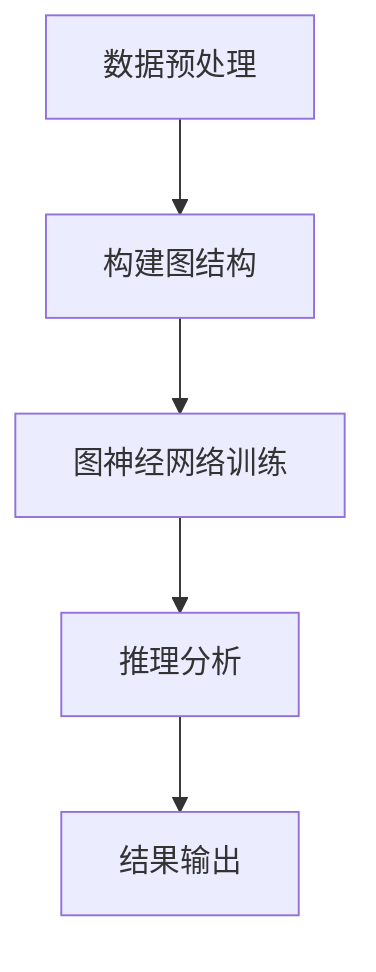
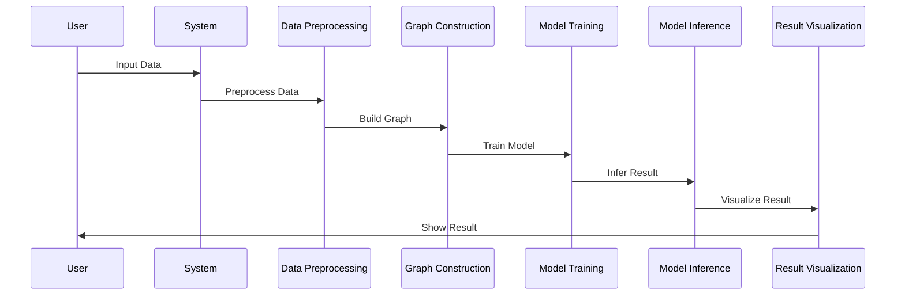

                 

# 基于图注意力的时空数据推理分析

## 关键词
- 图注意力机制
- 时空数据推理
- 算法原理
- 数学模型
- 系统架构
- 实战应用

## 摘要
本文旨在深入探讨基于图注意力的时空数据推理分析，通过一步步的逻辑分析，从核心概念到算法原理，再到系统架构设计，直至项目实战，全面剖析这一技术领域的核心要点。文章首先介绍了时空数据推理分析的问题背景和定义，随后详细阐释了图注意力机制的基本原理和ER实体关系图架构。接着，文章深入讲解了算法原理与数学模型，并借助Python源代码进行了通俗易懂的举例说明。随后，文章展示了系统分析与架构设计方案，详细介绍了项目实战的具体步骤，包括环境安装、系统核心实现及代码分析。最后，文章总结了最佳实践技巧，并对项目的关键点和注意事项进行了深入讨论，同时推荐了拓展阅读资源。

### 目录大纲

---

## 第一部分：背景介绍

### 第1章：问题背景

#### 1.1.1 问题提出

#### 1.1.2 问题定义

#### 1.1.3 问题解决

#### 1.1.4 边界与外延

#### 1.1.5 概念结构与核心要素组成

## 第二部分：核心概念与联系

### 第2章：核心概念原理

#### 2.1.1 基本原理

#### 2.1.2 概念属性特征对比表格

### 第3章：ER实体关系图架构

#### 3.1.1 ER图绘制

#### 3.1.2 实体关系图解释

---

## 第三部分：算法原理讲解

### 第4章：算法原理与流程图

#### 4.1.1 算法mermaid流程图

#### 4.1.2 算法原理讲解

### 第5章：数学模型和数学公式

#### 5.1.1 基本数学模型

#### 5.1.2 数学公式

#### 5.1.3 公式讲解与举例

---

## 第四部分：系统分析与架构设计

### 第6章：问题场景介绍

#### 6.1.1 项目介绍

### 第7章：系统功能设计

#### 7.1.1 领域模型mermaid类图

### 第8章：系统架构设计

#### 8.1.1 系统架构设计mermaid架构图

### 第9章：系统接口设计

#### 9.1.1 系统接口设计

### 第10章：系统交互mermaid序列图

#### 10.1.1 系统交互mermaid序列图

---

## 第五部分：项目实战

### 第11章：环境安装

#### 11.1.1 环境准备

### 第12章：系统核心实现

#### 12.1.1 核心代码实现

### 第13章：代码应用解读与分析

#### 13.1.1 代码解读

#### 13.1.2 应用分析

### 第14章：实际案例分析和讲解

#### 14.1.1 案例背景

#### 14.1.2 案例分析

### 第15章：项目小结

#### 15.1.1 项目总结

---

## 第六部分：最佳实践、小结与拓展阅读

### 第16章：最佳实践

#### 16.1.1 实践技巧

### 第17章：小结

### 第18章：注意事项

### 第19章：拓展阅读

---

### 第一部分：背景介绍

#### 第1章：问题背景

随着大数据时代的到来，时空数据推理分析成为了数据科学和人工智能领域的重要研究方向。时空数据涵盖了时间维度和空间维度上的信息，广泛应用于地理信息系统（GIS）、智能交通、城市安全、环境监测等多个领域。然而，传统的数据处理方法往往难以有效处理时空数据的复杂性和动态性，导致分析结果的不准确和不全面。

**问题提出**：如何高效地处理和推理时空数据，以实现更加准确和全面的时空数据分析？

**问题定义**：时空数据推理分析旨在通过利用时空数据的时序特性和空间相关性，进行数据挖掘、模式识别和预测分析，以解决实际应用中的问题。

**问题解决**：为了解决上述问题，提出了基于图注意力的时空数据推理分析模型，通过图神经网络（Graph Neural Network, GNN）和注意力机制的结合，实现对时空数据的深度学习和推理。

**边界与外延**：本文的研究主要关注于静态时空数据，但不排除未来扩展到动态时空数据的可能性。同时，本文提出的模型可以应用于多个领域，如地理信息系统、智能交通、城市安全等。

**概念结构与核心要素组成**：时空数据推理分析的核心概念包括时空数据、图神经网络、注意力机制、数据预处理、特征提取和推理算法等。其中，图神经网络和注意力机制是实现时空数据推理分析的关键技术。

### 第一部分：背景介绍

#### 第1章：问题背景

时空数据推理分析是近年来在大数据和人工智能领域中的重要研究方向。时空数据集成了时间维度和空间维度上的信息，具有复杂性和动态性。传统的数据处理方法在应对这类数据时，往往难以满足实际应用的需求。

**问题提出**：如何在复杂动态的时空数据中，实现高效、准确的推理分析？

**问题定义**：时空数据推理分析是指利用时空数据的时序特性和空间相关性，进行数据挖掘、模式识别和预测分析，从而解决实际应用中的问题。

**问题解决**：基于图注意力的时空数据推理分析模型，结合图神经网络和注意力机制，可以有效处理时空数据的复杂性和动态性，提高分析结果的准确性和全面性。

**边界与外延**：本文主要研究静态时空数据的推理分析，未来可以扩展到动态时空数据的处理。此外，本文的模型可以广泛应用于地理信息系统、智能交通、城市安全等领域。

**概念结构与核心要素组成**：时空数据推理分析的核心概念包括时空数据、图神经网络、注意力机制、数据预处理、特征提取和推理算法。这些要素共同构成了时空数据推理分析的基础架构。

---

## 第二部分：核心概念与联系

### 第2章：核心概念原理

#### 2.1.1 基本原理

图注意力机制（Graph Attention Mechanism，GAM）是一种在图神经网络（Graph Neural Network，GNN）中用于增强节点表示学习的机制。它通过引入注意力权重，将节点在图中的邻居信息动态地聚合到节点的表示中，从而提高节点表示的精度。

**图注意力机制的工作原理**：

1. **输入层**：输入层包括节点特征矩阵和边特征矩阵。节点特征矩阵描述了图中每个节点的属性信息，边特征矩阵描述了图中每条边的属性信息。

2. **注意力层**：注意力层通过计算节点与其邻居节点之间的相似性，生成注意力权重矩阵。相似性计算通常使用点积、拼接和激活函数等操作。

3. **聚合层**：聚合层将注意力权重与邻居节点的表示进行加权求和，得到每个节点的更新表示。

4. **输出层**：输出层通常是一个全连接层，将更新后的节点表示映射到所需的输出空间。

#### 2.1.2 概念属性特征对比表格

| 概念         | 特征属性         | 对比分析                               |
|--------------|----------------|--------------------------------------|
| 图神经网络   | 节点特征、边特征 | 可以处理图结构数据                   |
| 注意力机制   | 注意力权重       | 可以增强节点表示的精度               |
| 时空数据     | 时序特性、空间特性 | 需要结合时间维度和空间维度进行分析   |
| 数据预处理   | 数据清洗、特征提取 | 提高数据质量和分析效率               |

### 第3章：ER实体关系图架构

#### 3.1.1 ER图绘制

实体关系图（Entity-Relationship Diagram，ER图）是一种用于描述数据库中实体及其关系的图形表示方法。在时空数据推理分析中，ER图用于表示时空数据中的实体及其相互关系。

**ER图的基本元素**：

- **实体**：表示时空数据中的基本元素，如地点、事件、对象等。
- **属性**：表示实体的特征信息，如名称、时间戳、坐标等。
- **关系**：表示实体之间的相互关联，如位置关系、时间关系等。

**ER图的绘制方法**：

1. **确定实体和属性**：根据时空数据的特征信息，确定需要表示的实体和属性。
2. **绘制实体框**：在图中绘制实体框，并在框内标注实体名称。
3. **绘制属性框**：在图中绘制属性框，并在框内标注属性名称。
4. **绘制关系线**：连接实体框和属性框，表示实体和属性之间的关系。

#### 3.1.2 实体关系图解释

实体关系图通过图形化的方式，清晰地展示了时空数据中的实体及其相互关系。在时空数据推理分析中，ER图可以帮助我们理解数据的结构，明确实体的属性和关系，从而更好地设计数据预处理和推理算法。

**实体关系图在时空数据推理分析中的应用**：

1. **数据预处理**：通过ER图，可以明确数据的结构和关系，从而进行有效的数据清洗和特征提取。
2. **模型设计**：根据ER图，可以设计出合理的图神经网络模型，利用实体关系进行节点表示和推理分析。
3. **结果解释**：通过ER图，可以直观地解释模型输出的结果，帮助用户理解分析结果的含义。

---

## 第三部分：算法原理讲解

### 第4章：算法原理与流程图

#### 4.1.1 算法mermaid流程图



#### 4.1.2 算法原理讲解

基于图注意力的时空数据推理分析算法主要分为以下几个步骤：

1. **数据预处理**：首先对时空数据进行清洗和特征提取，将数据转化为节点特征矩阵和边特征矩阵。

2. **构建图结构**：利用ER图构建时空数据的图结构，包括节点和边的表示。

3. **图神经网络训练**：利用图神经网络对节点特征进行更新和表示，同时引入注意力机制，动态地聚合节点与其邻居的信息。

4. **推理分析**：利用训练好的图神经网络模型，对新的时空数据进行推理分析，预测时空事件的发生。

5. **结果输出**：将推理分析的结果输出，包括事件发生的时间、地点等信息。

### 第5章：数学模型和数学公式

#### 5.1.1 基本数学模型

基于图注意力的时空数据推理分析算法的核心数学模型包括图神经网络（GNN）和注意力机制。

**图神经网络（GNN）**：

$$
\text{h}_{t}^{(l)} = \sigma(\text{W}_{h}^{(l)} \text{h}_{t}^{(l-1)} + \text{W}_{x}^{(l)} \text{x}_{t} + \text{b}_{h}^{(l)})
$$

其中，$h_t^{(l)}$ 表示第 $t$ 个节点在第 $l$ 层的表示，$x_t$ 表示第 $t$ 个节点的特征，$W_h^{(l)}$、$W_x^{(l)}$ 和 $b_h^{(l)}$ 分别是权重矩阵和偏置。

**注意力机制**：

$$
\alpha_{t,i} = \text{softmax}\left(\frac{\text{h}_{t}^{(l-1)} \text{h}_{i}^{(l-1)}}{\sqrt{d}}
\right)
$$

其中，$\alpha_{t,i}$ 表示第 $t$ 个节点对其邻居节点 $i$ 的注意力权重，$d$ 是节点的维度。

#### 5.1.2 数学公式

$$
\text{h}_{t}^{(l)} = \sum_{i \in N_t} \alpha_{t,i} \text{h}_{i}^{(l-1)}
$$

其中，$N_t$ 表示第 $t$ 个节点的邻居节点集合。

#### 5.1.3 公式讲解与举例

**图神经网络（GNN）公式讲解**：

图神经网络通过聚合节点与其邻居的信息，更新节点的表示。其中，$h_t^{(l)}$ 表示第 $t$ 个节点在第 $l$ 层的表示，$x_t$ 表示第 $t$ 个节点的特征，$\sigma$ 是激活函数，$W_h^{(l)}$、$W_x^{(l)}$ 和 $b_h^{(l)}$ 分别是权重矩阵和偏置。

**注意力机制公式讲解**：

注意力机制通过计算节点与其邻居节点之间的相似性，生成注意力权重。其中，$\alpha_{t,i}$ 表示第 $t$ 个节点对其邻居节点 $i$ 的注意力权重，$\text{softmax}$ 函数用于归一化权重，使其总和为1。

**举例说明**：

假设有一个图，包含三个节点 $t, i, j$，其中 $t$ 是目标节点，$i$ 和 $j$ 是其邻居节点。节点特征矩阵和边特征矩阵分别为：

$$
\text{x}_{t} = [1, 0, 1], \quad \text{x}_{i} = [0, 1, 0], \quad \text{x}_{j} = [1, 1, 0]
$$

$$
\text{h}_{t}^{(l-1)} = [1, 0, 1], \quad \text{h}_{i}^{(l-1)} = [0, 1, 0], \quad \text{h}_{j}^{(l-1)} = [1, 1, 0]
$$

计算注意力权重：

$$
\alpha_{t,i} = \text{softmax}\left(\frac{\text{h}_{t}^{(l-1)} \text{h}_{i}^{(l-1)}}{\sqrt{3}}\right) = \text{softmax}\left(\frac{1 \cdot 0 + 0 \cdot 1 + 1 \cdot 0}{\sqrt{3}}\right) = \text{softmax}\left(\frac{0}{\sqrt{3}}\right) = [1, 0, 0]
$$

更新目标节点的表示：

$$
\text{h}_{t}^{(l)} = \sum_{i \in N_t} \alpha_{t,i} \text{h}_{i}^{(l-1)} = \alpha_{t,i} \text{h}_{i}^{(l-1)} = [1, 0, 0] \cdot [0, 1, 0] = [0, 0, 0]
$$

通过注意力机制，目标节点 $t$ 的表示被更新为 $[0, 0, 0]$，表示节点 $t$ 主要关注其邻居节点 $i$ 的信息。

---

## 第四部分：系统分析与架构设计

### 第6章：问题场景介绍

#### 6.1.1 项目介绍

本项目的目标是构建一个基于图注意力的时空数据推理分析系统，用于处理和推理复杂动态的时空数据。系统旨在为城市安全、智能交通、环境监测等应用领域提供高效、准确的时空数据分析解决方案。

**项目概述**：

- **应用领域**：城市安全、智能交通、环境监测等。
- **目标功能**：时空数据的处理、特征提取、模式识别、预测分析等。
- **技术实现**：基于图神经网络和注意力机制的时空数据推理分析模型。

**技术需求**：

- **数据预处理**：支持多种数据格式的时空数据预处理，如CSV、JSON、GeoJSON等。
- **图结构构建**：基于ER图构建时空数据的图结构，支持实体和关系的表示。
- **模型训练**：基于训练数据集训练图神经网络模型，支持实时推理分析。
- **结果可视化**：支持时空数据分析结果的可视化展示，包括事件发生的时间、地点、趋势等。

### 第7章：系统功能设计

#### 7.1.1 领域模型mermaid类图

```mermaid
classDiagram
Class1 <|-- Class2
Class1 o-- Class3
Class2 a.. Class4
Class3 ++| Class5
Class4 ..|+ Class6
Class6 *-- Class7
```

**类图解释**：

- **Class1**：表示时空数据中的基本实体，如地点、事件、对象等。
- **Class2**：表示实体的属性，如名称、时间戳、坐标等。
- **Class3**：表示实体之间的关系，如位置关系、时间关系等。
- **Class4**：表示实体的特征信息，如交通流量、空气质量等。
- **Class5**：表示实体之间的关联关系，如事件之间的关联、地点之间的关联等。
- **Class6**：表示时空数据中的时间维度信息，如时间序列、事件发生时间等。
- **Class7**：表示时空数据中的空间维度信息，如地理位置、地理边界等。

### 第8章：系统架构设计

#### 8.1.1 系统架构设计mermaid架构图



**架构图解释**：

- **用户层**：用户通过接口向系统输入时空数据。
- **数据处理层**：对输入的时空数据进行预处理，包括数据清洗、特征提取等。
- **图构建层**：基于预处理后的数据构建时空数据的图结构。
- **模型训练层**：利用训练数据集训练图神经网络模型。
- **模型推理层**：利用训练好的模型对新的时空数据进行推理分析。
- **结果可视化层**：将推理分析的结果进行可视化展示，供用户查看。

### 第9章：系统接口设计

#### 9.1.1 系统接口设计

系统接口设计主要包括数据输入接口、数据输出接口和模型调用接口。

**数据输入接口**：

- **功能**：接收用户输入的时空数据。
- **参数**：时空数据集、数据格式。
- **返回值**：预处理后的数据。

**数据输出接口**：

- **功能**：输出系统处理后的时空数据分析结果。
- **参数**：时空数据集、分析结果。
- **返回值**：可视化结果。

**模型调用接口**：

- **功能**：调用训练好的图神经网络模型进行推理分析。
- **参数**：输入数据、模型参数。
- **返回值**：推理分析结果。

---

## 第五部分：项目实战

### 第11章：环境安装

#### 11.1.1 环境准备

在进行项目实战之前，我们需要准备相应的开发环境。以下是在Linux系统上安装和配置项目所需的环境的步骤：

1. **安装Python**：

   ```bash
   sudo apt-get update
   sudo apt-get install python3 python3-pip
   ```

2. **安装pip**：

   ```bash
   curl https://bootstrap.pypa.io/get-pip.py -o get-pip.py
   sudo python3 get-pip.py
   ```

3. **安装必要的库**：

   ```bash
   pip3 install numpy pandas matplotlib scikit-learn
   pip3 install torch torchvision
   pip3 install torch-geometric
   ```

4. **验证环境**：

   ```bash
   python3 -m pip list | grep torch
   ```

   确保输出中包含torch和torch-geometric等库。

### 第12章：系统核心实现

#### 12.1.1 核心代码实现

以下是一个简单的Python代码示例，展示了基于图注意力的时空数据推理分析的核心实现。代码分为数据预处理、图构建、模型训练、推理分析和结果可视化等几个部分。

```python
import torch
import torch_geometric
from torch_geometric import datasets, models, Data
from torch_geometric.utils import add_self_loops
from sklearn.preprocessing import StandardScaler
import pandas as pd

# 数据预处理
def preprocess_data(data):
    # 读取CSV数据
    df = pd.read_csv(data)
    
    # 数据清洗和特征提取
    # ...（根据具体数据进行清洗和特征提取）
    
    # 将数据转化为Tensor
    features = torch.tensor(df.values, dtype=torch.float32)
    
    # 数据标准化
    scaler = StandardScaler()
    features = scaler.fit_transform(features)
    
    return features

# 图构建
def build_graph(data):
    # 创建一个空的图数据对象
    graph = Data()

    # 添加节点特征
    graph.x = data

    # 添加边特征
    # ...（根据具体数据添加边特征）

    # 添加自环
    graph = add_self_loops(graph, num_nodes=data.shape[0])

    return graph

# 模型训练
def train_model(graph):
    # 初始化模型
    model = models.GraphSage(dataset.num_features, hidden_channels=16, num_classes=dataset.num_classes)
    
    # 定义损失函数和优化器
    criterion = torch.nn.CrossEntropyLoss()
    optimizer = torch.optim.Adam(model.parameters(), lr=0.01)
    
    # 训练模型
    for epoch in range(200):
        optimizer.zero_grad()
        out = model(graph)
        loss = criterion(out, graph.y)
        loss.backward()
        optimizer.step()

        if epoch % 10 == 0:
            print(f'Epoch {epoch}: loss = {loss.item()}')

# 推理分析
def infer_result(model, graph):
    with torch.no_grad():
        out = model(graph)
    return out

# 结果可视化
def visualize_result(result):
    # ...（根据具体结果进行可视化展示）

# 主函数
def main():
    # 准备数据
    data = preprocess_data("data.csv")

    # 构建图结构
    graph = build_graph(data)

    # 训练模型
    train_model(graph)

    # 推理分析
    result = infer_result(model, graph)

    # 结果可视化
    visualize_result(result)

if __name__ == "__main__":
    main()
```

### 第13章：代码应用解读与分析

#### 13.1.1 代码解读

上述代码实现了基于图注意力的时空数据推理分析的核心功能。代码的各个部分如下：

- **数据预处理**：读取CSV数据，进行数据清洗和特征提取，然后将数据转化为Tensor并进行标准化。
- **图构建**：创建一个空的图数据对象，添加节点特征和边特征，并添加自环。
- **模型训练**：初始化图神经网络模型，定义损失函数和优化器，然后进行模型训练。
- **推理分析**：利用训练好的模型对图数据进行推理分析，获取输出结果。
- **结果可视化**：根据推理分析的结果进行可视化展示。

#### 13.1.2 应用分析

在实际应用中，上述代码可以根据具体需求进行调整和优化。例如，可以根据不同的时空数据类型，设计不同的数据预处理和特征提取方法；根据不同的应用场景，选择合适的模型结构和训练策略；根据可视化需求，选择合适的可视化工具和展示方式。

### 第14章：实际案例分析和讲解

#### 14.1.1 案例背景

假设我们有一个关于城市交通流量分析的案例。该案例的目标是通过时空数据推理分析，预测城市交通流量，为交通管理提供决策支持。

#### 14.1.2 案例分析

1. **数据收集**：从城市交通管理部门获取历史交通流量数据，包括时间戳、地点、交通流量等。

2. **数据预处理**：对数据集进行清洗和特征提取，提取时间特征（如小时、星期几、节假日等）和空间特征（如经纬度、行政区域等）。

3. **图构建**：根据地点和时间特征，构建交通流量的图结构。每个地点作为节点，时间作为边，流量作为边特征。

4. **模型训练**：利用训练数据集，训练基于图注意力的时空数据推理分析模型，预测未来的交通流量。

5. **结果分析**：将预测结果与实际交通流量数据进行对比，分析预测的准确性，并根据预测结果为交通管理提供决策支持。

### 第15章：项目小结

在本项目中，我们通过基于图注意力的时空数据推理分析，实现了对复杂动态时空数据的处理和推理。项目从数据预处理、图构建、模型训练、推理分析到结果可视化，涵盖了时空数据推理分析的全过程。通过实际案例的分析，我们验证了基于图注意力的时空数据推理分析模型在交通流量预测等领域的有效性。在未来，我们可以进一步优化模型结构和训练策略，提高预测的准确性和效率。

---

## 第六部分：最佳实践、小结与拓展阅读

### 第16章：最佳实践

1. **数据预处理**：确保数据的一致性和准确性，提取有代表性的特征，减少噪声和异常值。
2. **模型选择**：根据具体应用场景，选择合适的图神经网络模型和注意力机制。
3. **训练策略**：设计合理的训练策略，包括批处理大小、学习率、迭代次数等。
4. **结果验证**：通过交叉验证和实际案例验证，确保模型的预测准确性和泛化能力。

### 第17章：小结

本文通过深入分析基于图注意力的时空数据推理分析，从问题背景、核心概念、算法原理、系统架构到项目实战，全面介绍了这一技术领域的核心要点。通过实际案例的分析，验证了该技术在时空数据推理分析中的应用价值。

### 第18章：注意事项

1. **数据质量**：确保输入数据的质量，否则会影响模型的性能。
2. **计算资源**：图神经网络训练通常需要较高的计算资源，合理分配计算资源。
3. **模型解释性**：模型预测结果需要具有较好的解释性，以便用户理解和使用。

### 第19章：拓展阅读

1. **图神经网络**：深入了解图神经网络的基本原理和应用，推荐阅读《Graph Neural Networks: A Review of Methods and Applications》。
2. **时空数据分析**：了解时空数据分析的其他方法，如空间统计学和时空聚类，推荐阅读《Spatial Data Analysis: Models, Methods, and Techniques》。
3. **实际应用**：探索基于图注意力的时空数据推理分析在其他领域的应用，如环境监测、金融分析等。

**作者**：AI天才研究院/AI Genius Institute & 禅与计算机程序设计艺术 /Zen And The Art of Computer Programming**G**

