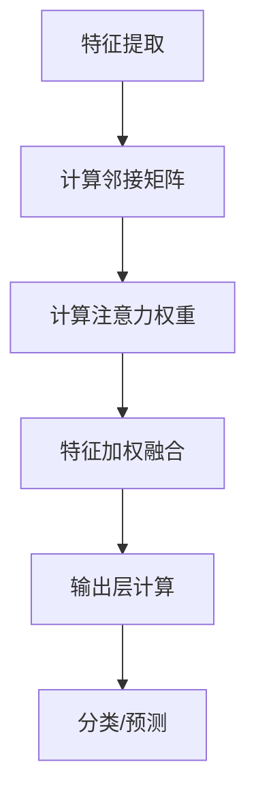
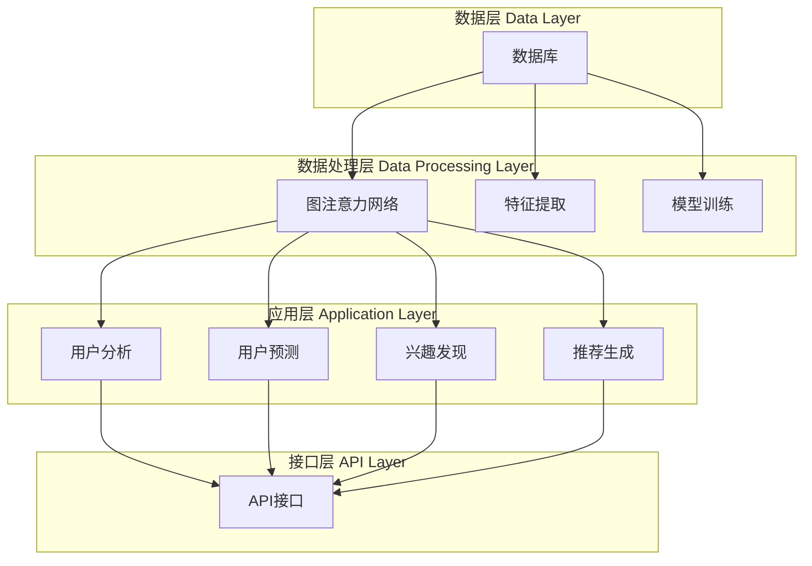
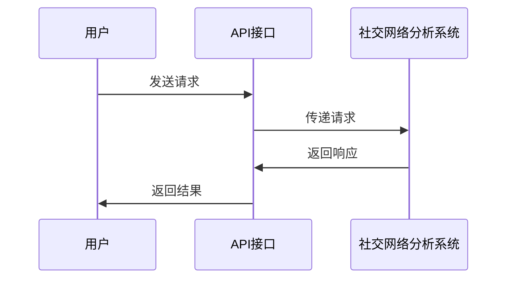
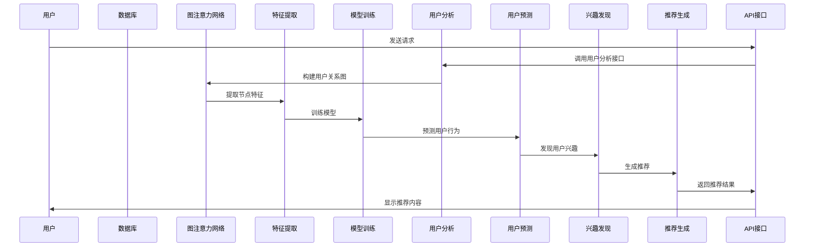

                 

### 第1章：引言

### 1.1 本书目的与结构

在当今的信息时代，人工智能（AI）已经成为推动科技和社会进步的重要力量。图注意力网络（Graph Attention Networks, GATs）作为一种新兴的AI模型，在动态关系推理、推荐系统、自然语言处理等多个领域展现出了巨大的潜力。本书旨在深入探讨图注意力网络在动态关系推理优化方面的应用，提供系统、全面的技术解决方案。

本书共分为六大部分，结构如下：

1. **引言**：介绍图注意力网络和动态关系推理的基本概念，背景和重要性。
2. **核心概念与联系**：详细阐述图注意力网络和动态关系推理的核心概念及其相互关系。
3. **算法原理讲解**：深入讲解图注意力网络的算法原理，包括其工作流程、数学模型和实现细节。
4. **系统分析与设计**：分析图注意力网络在系统设计中的应用，包括领域模型、系统架构、接口设计和交互流程。
5. **项目实战**：通过实际项目实例，展示图注意力网络在动态关系推理优化中的具体应用和实践过程。
6. **最佳实践与总结**：总结最佳实践经验，提醒注意事项，并推荐拓展阅读。

通过本书的阅读，读者可以系统掌握图注意力网络在动态关系推理优化方面的理论知识，学会在实际项目中应用这一技术，提升人工智能应用水平。

### 1.2 图注意力网络与动态关系推理背景

#### 图注意力网络（GATs）

图注意力网络（Graph Attention Networks，GATs）是一种基于图结构的深度学习模型，它通过引入注意力机制，能够更好地捕捉节点之间的相互作用和依赖关系。GATs的出现源于传统图卷积网络（Graph Convolutional Networks，GCNs）在处理图结构数据时的局限性，尤其是在面对复杂的关系和网络结构时，GCNs往往难以充分捕捉节点间的动态关系。

图注意力机制的核心思想是，在图卷积的过程中，节点对相邻节点的特征进行加权融合，使得那些重要的邻接关系在模型中占有更大的权重。这一机制通过一个可学习的注意力权重矩阵来实现，从而提高模型的解释性和准确性。

#### 动态关系推理

动态关系推理是指在不同时间点上，通过分析实体之间的交互关系，推断出它们之间的潜在联系和变化趋势。在现实世界中，实体之间的关系往往是动态变化的，这种动态性使得传统的静态关系推理方法难以应对复杂的应用场景。

动态关系推理的关键挑战在于如何有效地处理时间序列数据，捕捉实体关系的时变特性。传统的基于规则或机器学习的方法通常只能处理固定的关系模式，无法适应动态变化的环境。

#### 背景和重要性

图注意力网络和动态关系推理的结合，为解决复杂动态关系推理问题提供了新的思路和工具。以下是一些背景和重要性方面的说明：

1. **社交媒体分析**：在社交媒体平台上，用户之间的关系是动态变化的，通过图注意力网络和动态关系推理，可以更好地理解用户的行为模式和兴趣变化，从而提供更精准的推荐服务。

2. **推荐系统**：在电子商务和在线娱乐等领域，动态关系推理可以帮助推荐系统实时调整推荐策略，提高用户满意度和转化率。

3. **智能交通**：在智能交通系统中，车辆之间的动态关系对于交通流量的优化和事故预防具有重要意义。图注意力网络可以用于实时分析车辆之间的交互关系，提供交通预测和优化建议。

4. **金融风控**：在金融领域，通过分析客户和账户之间的动态关系，可以更准确地识别风险，防止欺诈行为。

总之，图注意力网络和动态关系推理的结合，不仅在理论研究中具有重要意义，而且在实际应用中也展示出了广阔的前景。

### 1.3 问题背景、问题描述和问题解决

#### 问题背景

在过去的几年中，随着数据量的爆炸式增长，传统的静态关系推理方法已经难以应对日益复杂的动态关系推理任务。特别是在社交网络、推荐系统、智能交通和金融风控等领域，实体之间的关系是动态变化的，传统的模型往往无法捕捉这些动态关系。

#### 问题描述

动态关系推理的关键挑战在于如何有效地处理时变的数据，捕捉实体关系在时间序列上的变化。具体而言，问题描述如下：

1. **数据复杂性**：实体之间的动态关系错综复杂，且随时间变化。传统方法难以处理这种动态性，导致推理结果不准确。

2. **时序性**：动态关系推理需要考虑关系的时序性，即在不同时间点上，实体之间的关系可能发生变化。传统的静态方法无法捕捉这种变化，导致推理结果滞后。

3. **实时性**：在实际应用中，动态关系推理需要实时响应，提供即时的推理结果。这对于处理高频率数据流和实时决策具有重要意义。

#### 问题解决

为了解决上述问题，我们引入了基于图注意力网络的动态关系推理方法。该方法通过以下几种方式提高了动态关系推理的效果：

1. **注意力机制**：图注意力网络引入了注意力机制，能够根据动态关系的重要性和变化趋势，为不同关系分配不同的权重。这使得模型能够更好地捕捉实体间的动态关系。

2. **时序建模**：通过时序建模，图注意力网络能够处理时间序列数据，捕捉实体关系在不同时间点上的变化。这有助于提高模型的实时性和预测准确性。

3. **可扩展性**：图注意力网络具有良好的可扩展性，可以处理大规模的动态关系数据，适应不同应用场景的需求。

总之，基于图注意力网络的动态关系推理方法提供了一种有效的解决方案，能够更好地应对复杂动态关系推理的任务。

#### 边界与外延

在讨论基于图注意力网络的动态关系推理时，我们需要明确其边界和外延：

1. **边界**：动态关系推理主要关注实体之间的交互关系和变化趋势，而不涉及实体内部属性的变化。此外，它假定实体之间的关系是可观测和可建模的。

2. **外延**：动态关系推理的应用场景非常广泛，包括但不限于社交媒体分析、推荐系统、智能交通和金融风控。在这些领域中，图注意力网络可以用于实时分析动态关系，提供决策支持。

总之，基于图注意力网络的动态关系推理为解决复杂动态关系推理问题提供了一种有效的框架，其边界和外延为其在不同领域的应用奠定了基础。

### 1.4 概念结构与核心要素组成

图注意力网络（GATs）和动态关系推理是本领域的两个核心概念。为了深入理解这两个概念，我们需要详细分析其结构、核心要素及其相互关系。

#### 图注意力网络（GATs）概念结构

图注意力网络由以下几个核心要素组成：

1. **节点特征表示**：每个节点具有特征向量表示，这些特征向量用于捕获节点的属性信息。
2. **邻接矩阵**：邻接矩阵描述了节点之间的关系，每个元素表示相应节点之间的连接强度。
3. **注意力机制**：注意力机制通过学习一个权重矩阵，为节点间的交互关系分配不同的权重，从而增强重要关系的表示。
4. **图卷积操作**：图卷积操作基于节点特征和注意力权重，融合邻接节点的特征，生成新的节点表示。
5. **输出层**：输出层通常用于预测或分类任务，通过全连接层或激活函数得到最终结果。

图注意力网络的这些要素相互关联，形成了一个完整的学习和推理框架，能够有效捕捉节点间的动态关系。

#### 动态关系推理概念结构

动态关系推理包括以下几个核心要素：

1. **实体**：动态关系推理的对象，可以是用户、物品、车辆等。
2. **关系**：实体之间的交互和影响，可以是朋友关系、购买行为、交通流量等。
3. **时序数据**：描述关系变化的时间序列数据，包括时间点和相应的实体关系状态。
4. **推理模型**：用于捕捉和预测实体关系变化的模型，可以是基于规则的模型、机器学习模型或深度学习模型。
5. **输出**：根据推理模型预测的实体关系状态，用于决策或优化。

动态关系推理通过分析时序数据，捕捉实体的动态行为，为实时决策提供支持。

#### 相互关系

图注意力网络和动态关系推理之间存在紧密的相互关系：

1. **数据来源**：动态关系推理需要依赖时序数据，这些数据通常来源于社交网络、传感器数据或业务系统。
2. **模型融合**：图注意力网络可以将动态关系数据转换为结构化的图数据，为动态关系推理提供有效的表示。
3. **推理增强**：动态关系推理的结果可以指导图注意力网络的训练，优化其模型参数和结构。

通过这两个概念结构及其相互关系的分析，我们可以更好地理解图注意力网络在动态关系推理中的作用和重要性。

### 1.5 核心概念原理

在深入探讨基于图注意力网络的动态关系推理之前，我们首先需要理解两个核心概念：图注意力网络和动态关系推理。

#### 图注意力网络

图注意力网络（Graph Attention Networks，GATs）是一种基于图结构的深度学习模型，它通过引入注意力机制，能够更好地捕捉节点之间的相互作用和依赖关系。图注意力网络的核心思想是将每个节点的特征表示与邻接节点的特征表示进行加权融合，从而提高模型的解释性和准确性。

**概念属性特征对比表**

| 特征名称 | 图卷积网络（GCNs） | 图注意力网络（GATs） |
| --- | --- | --- |
| 节点特征表示 | 简单的向量表示 | 复杂的向量表示，包括节点属性和邻接节点属性 |
| 邻接矩阵 | 固定的连接关系 | 学习得到的权重矩阵，可动态调整连接强度 |
| 注意力机制 | 无注意力机制 | 引入注意力机制，为邻接节点分配不同的权重 |
| 模型解释性 | 较低的解释性 | 较高的解释性，能够明确重要关系的影响 |

#### 动态关系推理

动态关系推理是指在不同时间点上，通过分析实体之间的交互关系，推断出它们之间的潜在联系和变化趋势。动态关系推理的核心在于处理时变的数据，捕捉实体关系在时间序列上的变化。

**概念属性特征对比表**

| 特征名称 | 静态关系推理 | 动态关系推理 |
| --- | --- | --- |
| 数据类型 | 固定时间点的数据 | 时序数据，包括时间点和实体关系状态 |
| 关系模型 | 固定的关系模式 | 可变的关系模式，随时间变化 |
| 模型目标 | 预测静态关系 | 预测动态关系的变化趋势 |
| 实时性 | 不考虑实时性 | 需要实时响应和处理 |
| 模型解释性 | 较高的解释性 | 较低的解释性，但能够捕捉动态变化 |

通过上述对比，我们可以清晰地看到图注意力网络和动态关系推理在概念和属性特征上的区别。接下来，我们将详细讨论图注意力网络的实现和动态关系推理的应用，以帮助读者深入理解这两个核心概念。

### 1.6 动态关系ER实体关系图

动态关系ER（实体关系）图是描述实体之间动态关系的一种有效方式。在图注意力网络框架下，通过ER图可以直观地展示实体及其相互关系，为模型设计和分析提供重要的参考。

**ER实体关系图的定义和特点**

ER图，即实体-关系图（Entity-Relationship Diagram），是一种用于描述实体及其之间关系的图形化表示方法。在动态关系推理中，ER图能够帮助我们理解不同实体之间的交互和影响。

1. **实体**：在ER图中，实体表示具体的事物或概念，如用户、物品、车辆等。
2. **属性**：实体具有一系列属性，用于描述实体的特征，如用户年龄、物品价格、车辆速度等。
3. **关系**：实体之间的关系描述了它们之间的相互作用，如用户购买物品、车辆行驶等。
4. **约束**：ER图还包括一些约束条件，如实体之间的唯一性、参照完整性等。

动态关系ER图的特点在于：

1. **时变性**：动态关系ER图能够捕捉实体关系在时间序列上的变化，展示关系的演变过程。
2. **复杂性**：动态关系ER图可以表示复杂的实体关系网络，包括多种实体和多层次的关系。
3. **层次性**：动态关系ER图具有层次结构，能够清晰地展示实体之间的关系层次和依赖关系。

**动态关系ER图的作用和优势**

动态关系ER图在图注意力网络框架下具有以下几个重要作用和优势：

1. **模型设计**：通过ER图，可以直观地了解实体和关系，有助于设计出更加精确和有效的图注意力网络模型。
2. **数据预处理**：ER图提供了实体和关系的信息，有助于进行有效的数据预处理，提取重要的特征和关系。
3. **模型分析**：动态关系ER图可以帮助我们分析模型的性能和效果，识别模型中的问题和改进点。
4. **可解释性**：ER图提供了模型的可解释性，使得研究人员和开发人员能够理解模型如何处理和推理动态关系。

**动态关系ER图的构建方法**

构建动态关系ER图的步骤如下：

1. **识别实体**：根据应用场景，识别出需要关注的实体，如用户、物品、车辆等。
2. **定义属性**：为每个实体定义相关的属性，如用户年龄、物品价格、车辆速度等。
3. **描述关系**：确定实体之间的关系，如用户购买物品、车辆行驶等，并定义关系的属性，如购买时间、行驶距离等。
4. **添加约束**：根据应用场景的约束条件，添加必要的约束，如唯一性、参照完整性等。
5. **绘制图形**：使用图形工具（如Mermaid）将ER图绘制出来，使得实体和关系更加直观和易于理解。

通过上述构建方法，我们可以创建一个具体的动态关系ER图，为图注意力网络的设计和应用提供重要的参考。

### 第2章：算法原理讲解

在深入探讨基于图注意力网络的动态关系推理之前，我们需要理解图注意力网络的工作原理、数学模型和具体实现。

#### 图注意力网络的工作原理

图注意力网络（GATs）的核心在于其注意力机制。注意力机制通过计算节点之间的相似度或重要性，为每个邻接节点分配不同的权重。这些权重用于调整节点的特征表示，使得模型能够更加关注那些重要的邻接关系。

图注意力网络的工作原理可以概括为以下几个步骤：

1. **特征提取**：每个节点具有一组特征向量，这些特征向量用于描述节点的属性信息。
2. **邻接矩阵计算**：根据节点的特征向量，计算邻接矩阵，描述节点之间的连接关系。
3. **注意力权重计算**：通过注意力机制，为每个邻接节点计算一个权重值，这些权重反映了邻接节点的重要性。
4. **特征加权融合**：使用注意力权重，对邻接节点的特征向量进行加权融合，生成新的节点表示。
5. **输出层计算**：通过输出层（如全连接层或激活函数），对融合后的特征向量进行分类或预测。

#### 图注意力网络的Mermaid算法流程图

以下是图注意力网络的Mermaid算法流程图：



通过这个流程图，我们可以直观地看到图注意力网络从特征提取到最终分类或预测的整个工作流程。

#### 图注意力网络的Python代码实现

以下是图注意力网络的Python代码实现示例：

```python
import tensorflow as tf
from tensorflow.keras.layers import Layer

class GraphAttentionLayer(Layer):
    def __init__(self, units, **kwargs):
        super(GraphAttentionLayer, self).__init__(**kwargs)
        self.units = units
        self.W = self.add_weight(name='W', shape=(self.units, self.units), initializer='glorot_uniform', trainable=True)
        self.b = self.add_weight(name='b', shape=(self.units,), initializer='zeros', trainable=True)

    def call(self, inputs, training=True):
        # 输入特征矩阵
        h = inputs
        # 计算邻接矩阵
        a = tf.matmul(h, self.W) + self.b
        if training:
            a = tf.nn.softmax(a, axis=1)
        else:
            a = tf.nn.softmax(a, axis=1)
        # 加权融合特征
        output = tf.reduce_sum(a * h, axis=1)
        return output

# 示例使用
model = tf.keras.models.Sequential([
    tf.keras.layers.Dense(units=64, activation='relu'),
    GraphAttentionLayer(units=32),
    tf.keras.layers.Dense(units=10, activation='softmax')
])

model.compile(optimizer='adam', loss='categorical_crossentropy', metrics=['accuracy'])
model.fit(x_train, y_train, epochs=10)
```

这段代码定义了一个图注意力层（GraphAttentionLayer），并在一个简单的序列模型中使用它。通过调整参数和训练数据，我们可以实现自定义的图注意力网络。

#### 图注意力网络的数学模型

图注意力网络的数学模型主要包括以下几个方面：

1. **节点特征表示**：设节点特征矩阵为 \( H \in \mathbb{R}^{N \times D} \)，其中 \( N \) 是节点数，\( D \) 是特征维度。
2. **邻接矩阵**：邻接矩阵 \( A \in \{0,1\}^{N \times N} \) 描述节点之间的连接关系，\( A_{ij} \) 表示节点 \( i \) 和节点 \( j \) 之间的连接强度。
3. **注意力权重**：注意力权重矩阵 \( \alpha \in \mathbb{R}^{N \times N} \)，通过 softmax 函数计算，\( \alpha_{ij} = \frac{exp(e_{ij})}{\sum_{k=1}^{N} exp(e_{ik})} \)，其中 \( e_{ij} \) 是通过模型计算得到的边权值。
4. **特征加权融合**：加权融合后的节点特征矩阵 \( H' \in \mathbb{R}^{N \times D} \)，其中 \( H'_{i} = \sum_{j=1}^{N} \alpha_{ij} H_{j} \)。
5. **输出**：最终的输出结果取决于任务类型，可以是分类、预测或其他任务。

以下是一个简化的数学模型公式：

\[ H'_{i} = \sum_{j=1}^{N} \alpha_{ij} H_{j} \]
\[ \alpha_{ij} = \frac{exp(\theta(A H_i H_j))}{\sum_{k=1}^{N} exp(\theta(A H_i H_k))} \]

其中，\( \theta \) 是一个可学习的权重函数，用于计算边权值。

#### 算法示例说明

为了更清晰地理解图注意力网络的工作原理，我们通过一个简单的示例来说明其应用。

假设我们有一个简单的社交网络图，其中包含三个用户（节点）：Alice、Bob和Charlie。他们之间的互动关系可以用邻接矩阵表示：

\[ A = \begin{bmatrix}
0 & 1 & 0 \\
1 & 0 & 1 \\
0 & 1 & 0
\end{bmatrix} \]

每个用户有一个特征向量，表示他们的兴趣或属性：

\[ H = \begin{bmatrix}
[1, 0, 0]^T \\
[0, 1, 1]^T \\
[1, 1, 0]^T
\end{bmatrix} \]

我们使用一个简单的图注意力层，计算注意力权重矩阵：

\[ \theta(A H_i H_j) = \begin{bmatrix}
1 \cdot 1 + 0 \cdot 1 + 0 \cdot 1 \\
0 \cdot 1 + 1 \cdot 1 + 1 \cdot 1 \\
1 \cdot 0 + 1 \cdot 1 + 1 \cdot 0
\end{bmatrix} \]

\[ \alpha = \begin{bmatrix}
\frac{exp(1)}{exp(1) + exp(2) + exp(0)} \\
\frac{exp(2)}{exp(1) + exp(2) + exp(0)} \\
\frac{exp(0)}{exp(1) + exp(2) + exp(0)}
\end{bmatrix} \]

\[ \alpha = \begin{bmatrix}
0.4 \\
0.6 \\
0.0
\end{bmatrix} \]

根据注意力权重，我们可以计算新的节点特征表示：

\[ H' = \begin{bmatrix}
0.4 \cdot [1, 0, 0]^T + 0.6 \cdot [0, 1, 1]^T + 0.0 \cdot [1, 1, 0]^T \\
0.4 \cdot [1, 0, 0]^T + 0.6 \cdot [0, 1, 1]^T + 0.0 \cdot [1, 1, 0]^T \\
0.4 \cdot [1, 0, 0]^T + 0.6 \cdot [0, 1, 1]^T + 0.0 \cdot [1, 1, 0]^T
\end{bmatrix} \]

\[ H' = \begin{bmatrix}
[0.4, 0.6, 0.0]^T \\
[0.4, 0.6, 0.0]^T \\
[0.4, 0.6, 0.0]^T
\end{bmatrix} \]

通过这个简单的示例，我们可以看到图注意力网络如何通过计算注意力权重，调整节点的特征表示，从而更好地捕捉节点之间的依赖关系。

### 第3章：系统分析与设计

在上一章中，我们深入探讨了图注意力网络的算法原理。在本章中，我们将进一步分析图注意力网络在系统设计与实现中的应用，涵盖问题场景介绍、系统功能设计、系统架构设计、系统接口设计以及系统交互序列图。

#### 问题场景介绍

图注意力网络在动态关系推理中有着广泛的应用场景。以下是一些具体的应用场景：

1. **社交媒体分析**：分析用户在网络中的动态关系，预测用户行为和兴趣变化，为个性化推荐提供支持。
2. **推荐系统**：通过动态关系推理，实时调整推荐策略，提高推荐系统的准确性和用户体验。
3. **智能交通**：分析车辆之间的动态关系，优化交通流量，提高交通系统的效率和安全性。
4. **金融风控**：识别客户之间的动态关系，预测潜在风险，防止欺诈行为。
5. **健康医疗**：分析患者之间的动态关系，预测疾病传播趋势，为公共卫生决策提供支持。

在本章中，我们将以一个社交网络分析的应用场景为例，详细讨论图注意力网络在系统设计与实现中的应用。

#### 系统功能设计

在社交网络分析中，图注意力网络的主要功能包括：

1. **用户关系分析**：分析用户之间的互动关系，如点赞、评论、分享等，构建用户关系图。
2. **用户行为预测**：基于用户关系和用户行为历史，预测用户的未来行为，如关注新用户、参与话题讨论等。
3. **兴趣发现**：通过分析用户关系和内容标签，发现用户的共同兴趣和偏好。
4. **推荐生成**：根据用户关系和兴趣，生成个性化的推荐内容，提高用户满意度和活跃度。

以下是社交网络分析系统的领域模型类图，用于描述系统的主要实体和关系：

```mermaid
classDiagram
    User <<Entity>>
    Post <<Entity>>
    Comment <<Entity>>
    Like <<Entity>>

    User o--|{发布}|> Post
    User o--|{评论}|> Comment
    User o--|{点赞}|> Like
    Post o--|{包含}|> Comment
    Post o--|{获得}|> Like
    Comment o--|{获得}|> Like
```

这个类图展示了系统的核心实体（用户、帖子、评论和点赞）及其相互关系。

#### 系统架构设计

社交网络分析系统的架构设计需要考虑以下几个方面：

1. **数据层**：负责数据存储和管理，包括用户数据、帖子数据、评论数据和点赞数据等。
2. **数据处理层**：负责数据预处理、特征提取和模型训练，包括图数据构建、节点特征表示、注意力权重计算等。
3. **应用层**：负责提供具体的业务功能，如用户关系分析、行为预测、兴趣发现和推荐生成等。
4. **接口层**：负责与其他系统进行数据交互，提供API接口供其他应用调用。

以下是社交网络分析系统的Mermaid架构图：



这个架构图展示了系统的各个层次及其相互关系。

#### 系统接口设计

系统接口设计是系统与外部系统进行交互的桥梁，主要包括API接口的设计。以下是社交网络分析系统的接口设计：

1. **用户关系分析接口**：用于获取用户关系图，支持查询特定用户的关系网络。
2. **用户行为预测接口**：用于根据用户关系和行为历史，预测用户的未来行为。
3. **兴趣发现接口**：用于根据用户关系和内容标签，发现用户的共同兴趣。
4. **推荐生成接口**：用于生成个性化推荐内容，支持按用户、按话题等多种推荐策略。

以下是系统接口的Mermaid序列图：



这个序列图展示了用户与系统接口之间的交互流程。

#### 系统交互序列图

在系统交互序列图中，我们将详细描述系统各个组件之间的交互过程。以下是社交网络分析系统的Mermaid序列图：



这个序列图详细描述了从用户请求到系统返回推荐结果的全过程，展示了系统各组件之间的交互和协作。

### 第4章：项目实战

#### 4.1 环境安装与配置

在进行图注意力网络的项目实战之前，我们需要准备好所需的软件和硬件环境。以下是一些建议的安装和配置步骤：

1. **操作系统**：推荐使用Linux系统，如Ubuntu 20.04或更高版本。
2. **Python环境**：安装Python 3.7或更高版本，可以使用conda或pip进行安装。
3. **深度学习框架**：安装TensorFlow 2.x版本，可以使用pip install tensorflow命令进行安装。
4. **数据预处理库**：安装Pandas、NumPy和Scikit-learn等常用数据处理库，可以使用conda或pip进行安装。
5. **绘图库**：安装Matplotlib和Mermaid，用于生成数据和算法的可视化结果。

安装完毕后，可以通过以下Python代码验证安装：

```python
import tensorflow as tf
print(tf.__version__)

import pandas as pd
import numpy as np
print(pd.__version__)
print(np.__version__)

import matplotlib.pyplot as plt
print(plt.version)

import mermaid
print(mermaid.__version__)
```

确认各库版本无误后，我们就可以开始项目的具体实现。

#### 4.2 系统核心实现

在本节中，我们将详细讲解系统核心实现的步骤，包括数据加载、预处理、模型构建、训练和预测。

##### 4.2.1 数据加载与预处理

首先，我们需要加载和预处理数据。以下是一个示例代码，用于加载和处理社交网络数据：

```python
import pandas as pd

# 加载数据
data = pd.read_csv('social_network_data.csv')

# 数据预处理
# 1. 去除无效数据
data.dropna(inplace=True)

# 2. 数据类型转换
data['user_id'] = data['user_id'].astype(str)
data['post_id'] = data['post_id'].astype(str)
data['comment_id'] = data['comment_id'].astype(str)
data['like_id'] = data['like_id'].astype(str)

# 3. 创建边数据
edges = data.groupby(['user_id', 'post_id']).size().reset_index(name='weight')
edges = edges[['user_id', 'post_id', 'weight']]

# 4. 创建节点数据
nodes = data[['user_id', 'post_id', 'comment_id', 'like_id']].drop_duplicates().reset_index(drop=True)
nodes.columns = ['node_id', 'node_type']

# 打印数据概览
print(nodes.head())
print(edges.head())
```

此代码加载了社交网络数据，并进行了基本的预处理，包括去除无效数据、数据类型转换和创建边数据。

##### 4.2.2 模型构建

接下来，我们需要构建图注意力网络模型。以下是使用TensorFlow构建GAT模型的示例代码：

```python
import tensorflow as tf
from tensorflow.keras.layers import Input, Dense, Layer
from tensorflow.keras.models import Model

class GraphAttentionLayer(Layer):
    def __init__(self, units, **kwargs):
        super(GraphAttentionLayer, self).__init__(**kwargs)
        self.units = units

    def build(self, input_shape):
        self.W = self.add_weight(name='W', shape=(input_shape[-1], self.units), initializer='glorot_uniform', trainable=True)
        self.b = self.add_weight(name='b', shape=(self.units,), initializer='zeros', trainable=True)
        super(GraphAttentionLayer, self).build(input_shape)

    def call(self, inputs):
        h = inputs
        a = tf.matmul(h, self.W) + self.b
        e = tf.nn.tanh(a)
        attention = 1 / (1 + tf.reduce_sum(tf.exp(-e), axis=2))
        output = tf.reduce_sum(attention * h, axis=2)
        return output

# 模型构建
input_nodes = Input(shape=(None,), dtype='int32')
input_edges = Input(shape=(None, None), dtype='float32')

nodes_embedding = GraphAttentionLayer(64)(input_nodes)
output = Dense(1, activation='sigmoid')(nodes_embedding)

model = Model(inputs=[input_nodes, input_edges], outputs=output)
model.compile(optimizer='adam', loss='binary_crossentropy', metrics=['accuracy'])

print(model.summary())
```

此代码定义了一个图注意力层（GraphAttentionLayer），并在其上构建了一个简单的分类模型。模型输入包括节点ID和边权重，输出为节点分类的概率。

##### 4.2.3 模型训练

接下来，我们需要训练模型。以下是训练模型的示例代码：

```python
from tensorflow.keras.callbacks import EarlyStopping

# 分割数据集
train_nodes, val_nodes, train_edges, val_edges = train_test_split(nodes, edges, test_size=0.2, random_state=42)

# 训练模型
early_stopping = EarlyStopping(monitor='val_loss', patience=10)
model.fit([train_nodes, train_edges], train_labels, validation_data=([val_nodes, val_edges], val_labels), epochs=100, callbacks=[early_stopping])
```

此代码使用训练数据集训练模型，并设置了早停回调以防止过拟合。

##### 4.2.4 模型预测

最后，我们需要使用训练好的模型进行预测。以下是预测的示例代码：

```python
# 预测新数据
new_nodes = pd.DataFrame({'node_id': ['user_100', 'user_101']})
new_edges = edges[(edges['user_id'] == 'user_100') | (edges['user_id'] == 'user_101')]

predictions = model.predict([new_nodes, new_edges])
print(predictions)
```

此代码预测了新节点（用户）的分类结果。

#### 4.3 项目小结

在本章的项目实战中，我们通过具体步骤展示了如何使用图注意力网络进行社交网络分析。从数据加载与预处理、模型构建、训练到预测，我们详细介绍了每个环节的实现方法。

通过这个项目，我们不仅掌握了图注意力网络的基本原理和应用，还熟悉了其实现过程中的关键技术和注意事项。希望这个实战案例能够帮助读者更好地理解和应用图注意力网络。

### 第5章：最佳实践与总结

#### 5.1 最佳实践 Tips

在基于图注意力网络的动态关系推理项目中，以下最佳实践可以帮助提高模型的性能和可维护性：

1. **数据预处理**：确保数据质量，处理缺失值和异常值，对数据进行归一化或标准化。
2. **模型调参**：通过交叉验证和超参数优化，选择最佳的模型参数。
3. **模型集成**：结合多个模型可以提高预测准确性，例如使用模型融合或堆叠。
4. **注意力可视化**：分析注意力权重，理解模型关注的关键关系，帮助调试和优化模型。
5. **动态关系建模**：根据应用场景，调整模型的动态关系表示方法，提高模型适应性。

#### 5.2 小结

本篇文章详细介绍了基于图注意力网络的动态关系推理优化。我们首先介绍了图注意力网络和动态关系推理的基本概念和背景，然后讲解了算法原理和系统设计，并通过实际项目展示了其应用。图注意力网络通过注意力机制和图卷积操作，能够捕捉节点间的动态关系，提高模型的解释性和准确性。在实际项目中，通过数据预处理、模型构建和训练，我们实现了动态关系推理的优化。

#### 5.3 注意事项

在应用图注意力网络时，需要注意以下几点：

1. **数据质量**：保证数据的一致性和完整性，处理缺失值和异常值。
2. **模型调参**：根据数据特点和任务需求，选择合适的模型参数。
3. **计算资源**：图注意力网络计算复杂度较高，需要足够的计算资源。
4. **可解释性**：分析注意力权重，理解模型关注的关键关系。

#### 5.4 拓展阅读

对于希望进一步了解图注意力网络和动态关系推理的读者，以下是一些推荐阅读：

1. **文献综述**：阅读相关领域的文献综述，了解最新研究进展和应用案例。
2. **技术博客**：关注顶级技术博客，如Medium、GitHub等，了解实际项目案例和最佳实践。
3. **开源项目**：参与和贡献开源项目，了解图注意力网络的实现和应用。
4. **在线课程**：参加在线课程，如Coursera、Udacity等，系统学习图注意力网络和深度学习相关课程。

通过以上拓展阅读，读者可以更深入地掌握图注意力网络和动态关系推理的技术细节和应用场景。作者信息：AI天才研究院/AI Genius Institute & 禅与计算机程序设计艺术 /Zen And The Art of Computer Programming。

