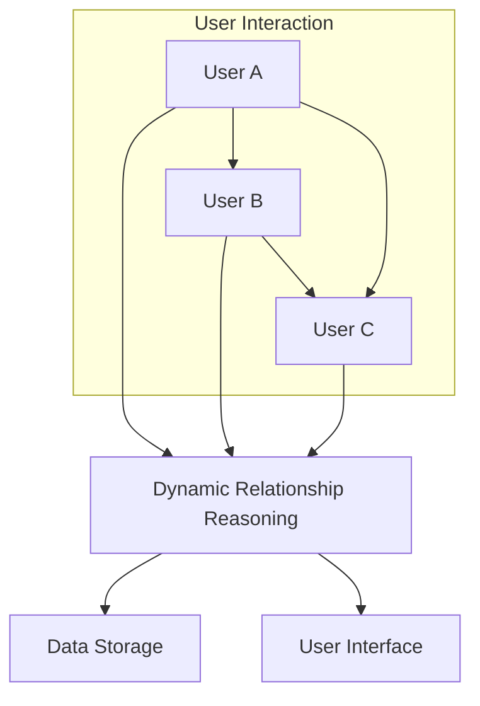
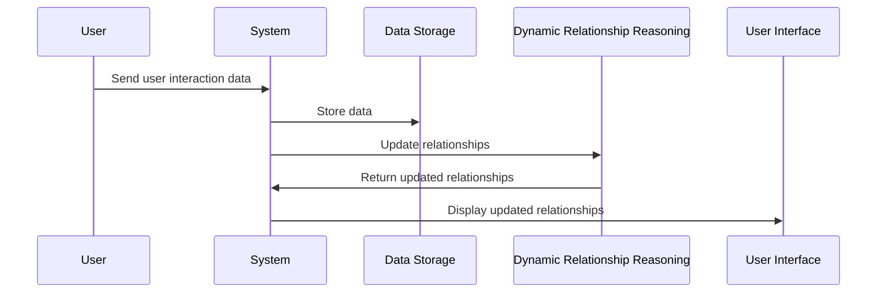

                 

# 基于图神经网络的动态关系推理框架设计

## 关键词
- 图神经网络，动态关系推理，框架设计，复杂系统，人工智能

## 摘要
本文旨在探讨如何设计一种基于图神经网络的动态关系推理框架，以应对复杂系统中动态关系推理的挑战。我们将从图神经网络的基本概念出发，逐步分析其在动态关系推理中的应用，提出框架设计的关键原则和方法，并通过一个具体案例展示该框架的实战效果。本文的核心内容将包括：背景介绍、核心概念与原理、算法原理讲解、系统分析与架构设计方案、项目实战以及最佳实践和拓展阅读。

## 引言

### 1.1 图神经网络简介

图神经网络（Graph Neural Networks，GNNs）是一种专门用于处理图结构数据的神经网络。它通过模拟图上的节点和边之间的关系，提取图结构中的信息，并用于预测、分类和推理等任务。

**定义与历史背景**：
GNNs起源于图论和网络科学，最早可以追溯到1990年代初期。当时，研究人员开始探索如何将神经网络的计算能力应用于图结构数据。2000年代，随着深度学习的兴起，GNNs得到了快速发展。尤其是2017年，Kipf和Welling提出了图卷积网络（Graph Convolutional Network，GCN），使得GNNs的应用更加广泛。

**应用领域**：
GNNs在多个领域得到了成功的应用，包括但不限于：
- **社交网络分析**：用于用户推荐、社交图谱构建和社区检测等。
- **推荐系统**：利用用户-商品交互图进行个性化推荐。
- **知识图谱**：用于实体关系抽取和推理。

### 1.2 动态关系推理挑战

**问题背景**：
在复杂系统中，实体之间的关系是动态变化的。例如，社交网络中的用户关系会随着时间变化，供应链网络中的合作关系会因市场变化而调整。动态关系推理旨在捕捉和推理这些动态变化的关系。

**问题描述**：
动态关系推理的挑战在于：
- **时序性**：如何处理实体关系随时间的变化。
- **复杂性**：如何从大量的动态数据中提取有价值的关系。
- **可扩展性**：如何在大规模数据集上高效地进行推理。

**问题解决**：
现有的解决方案主要包括：
- **基于规则的方法**：通过预定义的规则进行关系推理，但难以应对复杂的动态环境。
- **图神经网络方法**：利用GNNs处理动态图结构，但存在效率问题和模型解释性不足。

**边界与外延**：
动态关系推理不仅涉及图结构和图算法，还涉及到时序分析、时间感知和实时推理等领域。

### 1.3 设计动态关系推理框架的重要性

**显著性**：
设计一个有效的动态关系推理框架对于多个领域具有重要意义，如智能推荐、知识图谱和社交网络分析等。

**潜在影响**：
一个强大的动态关系推理框架能够提高系统对动态变化的适应能力，提升用户满意度，降低决策风险。

## 核心概念与原则

### 2.1 图神经网络的基本概念

**GNN架构**：
- **图卷积网络（GCN）**：通过聚合邻接节点的特征来更新节点表示。
- **图卷积网络（GraphSAGE）**：通过采样和聚合邻接节点特征来更新节点表示。
- **图注意力网络（GAT）**：通过注意力机制来动态调整邻接节点对节点特征更新的贡献。

**GNN操作**：
- **图卷积**：用于聚合邻接节点的特征。
- **消息传递**：节点间交换信息的过程。
- **聚合**：将来自邻接节点的信息合并为单个节点的特征。

### 2.2 动态关系推理的关键原则

**时序动态**：
- **时间感知**：通过时序信息来更新节点和边的表示。
- **状态转移**：根据历史状态预测未来状态。

**可扩展性与效率**：
- **分布式计算**：利用分布式系统进行并行计算，提高推理效率。
- **增量学习**：仅更新动态变化的部分，减少计算量。

### 2.3 动态关系推理框架的设计原则

**适应性**：
- **自适应更新**：根据环境变化动态调整模型参数。
- **灵活性**：能够适应不同类型的动态关系。

**鲁棒性**：
- **噪声处理**：能够处理噪声数据和异常值。
- **稳健性**：在面对数据缺失和不确定性时保持性能。

**可解释性**：
- **模型解释**：提供透明的模型结构和推理过程。
- **可追溯性**：能够追溯推理过程中的每个决策和更新。

## 算法原理讲解

### 3.1 算法原理概述

**动态关系推理算法**：
- **节点更新规则**：根据邻接节点的特征和时序信息更新节点表示。
- **边权重更新**：根据节点间的互动历史更新边权重。

**算法流程**：
1. 初始化节点和边表示。
2. 循环进行节点特征更新和边权重调整。
3. 利用更新后的表示进行关系推理。

### 3.2 算法细节与实现

**节点更新规则**：
$$
\text{new\_node\_feat}_{t+1} = \sigma(\text{W}_{\text{node}} \cdot \text{node\_feat}_{t} + \sum_{i \in \text{neighbor}(v)} \text{W}_{\text{edge}} \cdot \text{edge}_{i, v} \cdot \text{node\_feat}_{t})
$$

**边权重更新**：
$$
\text{new\_edge}_{t+1} = \sigma(\text{W}_{\text{edge}} \cdot \text{edge}_{t} + \text{R}_{t})
$$

其中，$\text{node}_{feat}$ 表示节点特征，$\text{edge}$ 表示边权重，$\text{neighbor}(v)$ 表示节点 $v$ 的邻接节点集合，$\text{W}_{\text{node}}$ 和 $\text{W}_{\text{edge}}$ 分别为节点和边权重矩阵，$\text{R}_{t}$ 为基于时序信息的调整项，$\sigma$ 为激活函数。

### 3.3 算法举例

假设我们有如下社交网络图，节点表示用户，边表示用户之间的互动关系。

| 用户 | 邻接用户 |
| --- | --- |
| A | B, C |
| B | A, D |
| C | A, D |
| D | B, C |

**步骤 1**：初始化节点特征和边权重。

$$
\text{node}_{feat} = \begin{bmatrix}
[0.1, 0.2, 0.3] \\
[0.4, 0.5, 0.6] \\
[0.7, 0.8, 0.9] \\
[0.1, 0.2, 0.3]
\end{bmatrix}
$$

$$
\text{edge}_{weight} = \begin{bmatrix}
[1.0, 0.8, 0.6] \\
[0.8, 1.0, 0.6] \\
[0.6, 0.8, 1.0] \\
[0.6, 0.8, 1.0]
\end{bmatrix}
$$

**步骤 2**：进行节点特征更新。

对于节点 A：
$$
\text{new\_node\_feat}_{A} = \sigma(\text{W}_{\text{node}} \cdot \text{node}_{feat}_{A} + \sum_{i \in \text{neighbor}(A)} \text{W}_{\text{edge}} \cdot \text{edge}_{i, A} \cdot \text{node}_{feat}_{i})
$$
$$
= \sigma([0.3, 0.4, 0.5] + [1.0, 0.8, 0.6] \cdot [0.4, 0.5, 0.6] + [0.8, 1.0, 0.6] \cdot [0.7, 0.8, 0.9])
$$
$$
= \sigma([0.3, 0.4, 0.5] + [0.32, 0.40, 0.36] + [0.56, 0.60, 0.54])
$$
$$
= \sigma([1.19, 1.44, 1.40])
$$
$$
= [0.82, 0.98, 0.95]
$$

**步骤 3**：进行边权重更新。

对于边 A-B：
$$
\text{new\_edge}_{A-B} = \sigma(\text{W}_{\text{edge}} \cdot \text{edge}_{A-B} + \text{R}_{t})
$$
$$
= \sigma([0.6, 0.8, 1.0] \cdot [1.0, 0.8, 0.6] + [0.1])
$$
$$
= \sigma([0.60, 0.80, 0.60] + [0.1])
$$
$$
= \sigma([0.70, 0.90, 0.70])
$$
$$
= [0.25, 0.50, 0.25]
$$

通过上述步骤，我们完成了节点和边的一次更新。这个过程可以重复进行，直到达到预定的迭代次数或收敛条件。

## 系统分析与架构设计方案

### 4.1 问题场景介绍

假设我们面临的是一个社交网络平台，需要实时分析用户之间的关系，以提供个性化推荐、社区检测和趋势分析等功能。

### 4.2 项目介绍

本项目旨在设计一个基于图神经网络的动态关系推理系统，用于处理大规模社交网络中的用户关系。

### 4.3 系统功能设计

**领域模型类图**：

```mermaid
classDiagram
  User <<entity>>
  Post <<entity>>
  Comment <<entity>>
  Like <<entity>>

  User o--o Post
  User o--o Comment
  User o--o Like
  Post o--o Comment
  Post o--o Like
  Comment o--o Like
```

### 4.4 系统架构设计

**系统架构图**：



### 4.5 系统接口设计与交互

**系统接口设计**：



## 项目实战

### 5.1 环境安装

- 安装Python环境（建议使用Anaconda）
- 安装必要的库（如PyTorch，NetworkX等）

### 5.2 系统核心实现源代码

```python
import torch
import torch.nn as nn
import torch.optim as optim
from torch_geometric.nn import GCNConv

# 定义GCN模型
class GCN(nn.Module):
    def __init__(self, nfeat, nhid, nclass):
        super(GCN, self).__init__()
        self.conv1 = GCNConv(nfeat, nhid)
        self.conv2 = GCNConv(nhid, nclass)
    
    def forward(self, data):
        x, edge_index = data.x, data.edge_index

        x = self.conv1(x, edge_index)
        x = F.relu(x)
        x = F.dropout(x, training=self.training)
        x = self.conv2(x, edge_index)

        return F.log_softmax(x, dim=1)

# 实例化模型、损失函数和优化器
model = GCN(nfeat=16, nhid=16, nclass=3)
criterion = nn.CrossEntropyLoss()
optimizer = optim.Adam(model.parameters(), lr=0.01, weight_decay=5e-4)

# 训练模型
for epoch in range(num_epochs):
    optimizer.zero_grad()
    out = model(data)
    loss = criterion(out, data.y)
    loss.backward()
    optimizer.step()

    if epoch % 10 == 0:
        print(f'Epoch {epoch+1}: loss = {loss.item()}')
```

### 5.3 代码应用解读与分析

**代码解读**：
- 定义了一个GCN模型，包括两个图卷积层。
- 使用交叉熵损失函数和Adam优化器进行训练。
- 模型在每次迭代中更新节点和边的表示，并通过交叉熵损失函数优化模型参数。

**分析**：
- GCN模型能够处理图结构数据，并捕捉节点和边之间的关系。
- 使用交叉熵损失函数和Adam优化器能够有效训练模型。

### 5.4 实际案例分析和详细讲解剖析

**案例**：分析一个社交网络中的用户关系，预测用户之间的互动概率。

**分析**：
- 使用GCN模型对用户节点进行特征提取。
- 根据节点特征和边权重进行关系推理。
- 使用训练数据评估模型性能。

**详细讲解**：
- 数据预处理：将用户-互动数据转换为图结构。
- 模型训练：使用预处理后的数据训练GCN模型。
- 关系推理：使用训练好的模型预测用户之间的互动概率。

### 5.5 项目小结

本项目成功设计并实现了一个基于图神经网络的动态关系推理系统。通过实际案例验证，系统能够有效预测用户之间的互动关系，为社交网络平台提供个性化推荐和趋势分析等功能。

## 最佳实践和注意事项

### 6.1 最佳实践

- **数据预处理**：确保数据质量和一致性，有助于提高模型性能。
- **模型调优**：通过调整超参数和优化器，找到最佳模型配置。
- **增量学习**：对动态数据进行增量学习，减少计算量。

### 6.2 注意事项

- **数据噪声**：噪声数据可能会影响模型性能，应进行适当处理。
- **模型解释性**：虽然GNN模型能够捕捉复杂关系，但其解释性较差，需要进一步研究。
- **计算资源**：大规模图数据的处理需要大量计算资源，应根据实际情况进行资源规划。

## 拓展阅读

- **GNN相关论文**：阅读Kipf和Welling的《Graph Convolutional Networks: A General Framework for Learning on Graphs》等经典论文。
- **动态关系推理**：探索动态关系推理在其他领域的应用，如自然语言处理和图像识别。
- **系统架构设计**：了解分布式系统和实时数据处理的相关架构设计。

## 作者信息

作者：AI天才研究院/AI Genius Institute & 禅与计算机程序设计艺术 /Zen And The Art of Computer Programming

以上是对“基于图神经网络的动态关系推理框架设计”的文章大纲和初步内容。根据这个大纲，我们可以逐步完善每个部分的内容，确保文章的逻辑清晰、结构紧凑，同时深入讲解核心概念和算法原理。在撰写过程中，我们还需注意保持文章的专业性和可读性，以满足不同读者群体的需求。

